[← Overview](README.md) · [History](history.md)

# ZX Spectrum History — From Calculators to Clones to Kickstarter

> **Scope**: This article is the **narrative synthesis** of the ZX Spectrum's 40+ year story: the five distinct eras of the platform, the people who built it, the markets it served, and the communities that kept it alive long after the original manufacturer left. It is the entry point for readers who want the *whole story* before diving into per-model or per-feature technical articles.

For the **per-model technical details** (architecture, ports, memory maps), see [02_hardware/original/](../02_hardware/original/README.md), [02_hardware/clones/](../02_hardware/clones/README.md), and [02_hardware/newgen/](../02_hardware/newgen/README.md). For the **demoscene's history** (the Soviet clone explosion, the demo scene's cultural arc), see [demoscene_history.md](../07_demoscene/demoscene_history.md) — that article has the depth; this one has the breadth.

---

## Article Roadmap

- §1 — Pre-Spectrum era (1972–1981): Sinclair Radionics, the ZX80, the ZX81
- §2 — Sinclair Spectrum era (1982–1986): launch, success, the QL disaster, the 128K
- §3 — Amstrad era (1986–1992): the acquisition, the +2/+2A/+3, the end of production
- §4 — Post-Soviet clone era (1989–2000s): how the Spectrum went East and became Russia's computer
- §5 — Modern revival (2010s–present): FPGA clones, the ZX Spectrum Next, MiSTer, the present scene
- §6 — Visual timeline (Mermaid)
- §7 — Cross-references, pitfalls, and references

---

## 1. The Pre-Spectrum Era (1972–1981)

The ZX Spectrum did not emerge from nothing. It was the product of nearly a decade of Clive Sinclair's consumer-electronics ventures, two prior home computers, and a small team of engineers whose names would become legendary in the British computing scene.

### Clive Sinclair and Sinclair Radionics (1962–1979)

**Clive Sinclair** (1940–2021) founded **Sinclair Radionics** in 1962, producing hi-fi amplifiers, radios, and calculators through the 1960s and early 1970s. The Sinclair Cambridge Calculator (launched 1973, priced at £29.95 kit / £49.95 assembled) was a mass-market success and established Sinclair's design philosophy: aggressive miniaturisation, low price through clever engineering, and an uncompromising focus on the consumer rather than the professional market.

Sinclair Radionics's later years were troubled. The **Sinclair Black Watch** (1975) was a disastrous LED watch product with reliability problems and a refund program that nearly bankrupted the company. By 1979, the UK government's National Enterprise Board had effectively taken control of Sinclair Radionics. Clive Sinclair, unwilling to lose control of his company, founded **Sinclair Research** as a separate vehicle in 1979 (renamed from Sinclair Computers Ltd in March 1981), and transferred his consumer-computer ambitions to it.

This history matters for the Spectrum because it established both **the design philosophy** (cheap, small, clever) and **the financial fragility** (chronic undercapitalisation, recurring product-quality crises) that would define the Sinclair era of computing.

### The ZX80 (January 1980)

The **ZX80** launched on **29 January 1980** at **£79.95 in kit form** and **£99.95 assembled**, becoming one of the first computers in the world to sell for under £100 and the cheapest home computer on the UK market by a wide margin. It used the **NEC μPD780C-1** (a Z80-compatible CPU), came with **1 KB of RAM** and a **4 KB ROM** containing an integer-only BASIC written by **John Grant** of Nine Tiles. The display was a small black-and-white television, and the entire keyboard was a pressure-sensitive membrane with only 20 keys plus a shifted mode.

The ZX80 was a commercial success — over **50,000 units** sold by the end of 1980 — but technically limited. The display blanked during computation because the CPU could not simultaneously generate video and run user programs. This made even simple programs visually jarring, and the integer-only BASIC made floating-point arithmetic impossible without machine-code routines.

### The ZX81 (March 1981)

The **ZX81** launched on **5 March 1981** at **£49.95 in kit form** and **£69.95 assembled**, half the price of the assembled ZX80. It shipped with the same 1 KB of RAM (expandable) but an **8 KB ROM** rewritten by **Steve Vickers** of Nine Tiles. The ROM's two most important innovations over the ZX80 were:

1. **SLOW mode** (also called "compute and display") — the display no longer blanked during computation, achieved by time-slicing the CPU between video generation and user code during the vertical blanking interval.
2. **Floating-point arithmetic** — full real-number math, making the ZX81 a credible tool for education and simple engineering calculation.

The ZX81 was the Spectrum's true precursor. It established the **Sinclair pricing model** (under £100 for kit, under £70 assembled if the user was willing to solder), the **membrane keyboard** (which the Spectrum would inherit in rubber-key form), the **8 KB ROM size** (which the Spectrum would quadruple to 16 KB), and the **TV-set display** (which would remain standard for all Spectrums).

The ZX81 sold over **1.5 million units** worldwide by 1983 — the first Sinclair product to sell in seven figures. It also produced the first wave of **Sinclair software publishing**: magazines like * Sinclair Programs* and *ZX Computing* began publishing type-in BASIC listings, establishing the type-in culture that would define Spectrum software distribution through the 1980s.

### Why the ZX80 and ZX81 matter to the Spectrum story

The Spectrum is sometimes described as if it sprang fully-formed from Sinclair's brow in April 1982. In fact, every major design decision was pre-informed by the ZX80/ZX81 experience:

- The **Z80 CPU family** was chosen because the ZX80/ZX81 had used Z80-compatible parts and the British hobbyist ecosystem was now built around Z80 tools.
- The **membrane keyboard** was inherited because the ZX81's membrane was cheap, reliable enough, and the market had accepted it.
- The **16 KB ROM** was sized as four times the ZX81's, reflecting the additional features (color, sound, high-res graphics) the Spectrum would add.
- The **television display** was kept because it was the only way to keep the price under £200.
- The **£125 / £175 launch pricing** was extrapolated from the ZX81's £50 / £70 — the Spectrum cost roughly 2.5× the ZX81 because it had 4× the ROM, color, sound, high-res graphics, and more RAM.

---

## 2. The Sinclair Spectrum Era (1982–1986)

### Launch (23 April 1982)

The **ZX Spectrum** was announced on **23 April 1982** at the IPC Computer Fair at Earls Court, London, and demonstrated simultaneously at the Ideal Home Exhibition. The launch product line was:

| Model | Price | RAM | Notes |
|---|---|---|---|
| **ZX Spectrum 16K** | £125 | 16 KB | Entry model — no upper RAM fitted |
| **ZX Spectrum 48K** | £175 | 48 KB | Full model — 16 KB lower + 32 KB upper RAM |
| **16K → 48K upgrade kit** | £60 | +32 KB | User-installed internal upgrade |

For the full technical story of the launch hardware, see [zx_spectrum_16k_48k.md](../02_hardware/original/zx_spectrum_16k_48k.md).

The Spectrum's design team was small. **Richard Altwasser** designed the hardware around a new custom chip — the **Ferranti ULA** — that integrated the video generation, memory arbitration, and I/O glue into a single 40-pin package. **Steve Vickers** (who had written the ZX81 ROM) wrote the 16 KB **Spectrum ROM**, adding color, sound, high-resolution graphics, and a substantially improved BASIC. **Rick Dickinson** designed the now-iconic rubber-keyboard case. All three were in their twenties.

The decision to use a custom ULA was the single most important engineering choice of the Spectrum project. It reduced the part count from the hundreds of TTL chips that a discrete-logic implementation would have required to just a handful of components, dramatically lowering manufacturing cost. The trade-off was that the ULA's exact behavior — particularly the timing of memory accesses during video generation, which produced the famous "memory contention" pattern — became the *de facto* programming reference for every Spectrum-compatible machine that followed. See [ula_architecture.md](../02_hardware/original/ula_architecture.md) for the technical detail.

### The boom years (1982–1984)

The Spectrum's commercial success was immediate. By the end of 1982, demand far outstripped supply, with order backlogs running into tens of thousands of units. By the end of 1983, **over 1 million Spectrums had been sold** — famously celebrated by Timex (Sinclair's US distributor) producing a small number of **white-cased Spectrums** as the one-millionth-unit commemorative. By 1985 the Spectrum was the **best-selling home computer in the UK** and had outsold the Commodore 64 in Europe by a wide margin.

The success was driven by three factors:

1. **Price.** The 16K Spectrum at £125 (dropping to £99 by 1984) was half the price of a Commodore 64 (£299 at UK launch in late 1982) and a quarter the price of an Apple II. For a UK household in 1983 with a TV already in the living room, a Spectrum was the cheapest plausible entry into home computing.

2. **Software library.** Within months of launch, a software publishing industry had emerged. The "Spectrum golden age" from 1983 to 1986 produced thousands of commercial titles, with publishers like **Bug-Byte, Software Projects, Ultimate Play the Game, Ocean, Gremlin, Hewson, and Mastertronic** releasing games at price points from £1.99 (Mastertronic's budget label) to £9.99 (Ultimate's premium). The magazine culture — *Crash* (launched February 1984), *Your Spectrum* (launched January 1984, later *Your Sinclair*), and *Sinclair User* (launched April 1982) — reviewed games, published type-in listings, and provided the review-score economy that drove sales.

3. **Education market.** The UK government's **Microelectronics Education Programme** (1981–1986) subsidised the purchase of microcomputers for schools. The Spectrum's low price made it a natural fit, and many British schoolchildren of the 1980s first encountered a computer in a classroom equipped with Spectrums.

### The Sinclair QL disaster (January 1984)

Sinclair's ambition was not limited to the home-computer market. On **12 January 1984**, Sinclair Research launched the **Sinclair QL** ("Quantum Leap") at **£399**, intended as a business machine competing with the IBM PC and the Apple Macintosh. The QL used a **Motorola 68008 CPU** (the 8-bit-bus variant of the 68000), shipped with 128 KB of RAM, and ran a multitasking operating system (QDOS, later superseded by Minerva) with the SuperBASIC language.

The QL was Sinclair's worst commercial decision. Plagued by production delays (the "28-day delivery" promise was repeatedly broken), shipped with buggy ROMs that required an external "kludge" dongle to be usable, and competing against the IBM PC at a moment when the PC's market dominance was becoming irresistible, the QL sold only around 150,000 units and consumed engineering resources that could have gone into Spectrum development. The QL's failure, combined with the Wrist TV and Pocket TV product failures, pushed Sinclair Research into a financial crisis through 1984 and 1985 that culminated in the 1986 Amstrad acquisition.

### The ZX Spectrum+ (1984)

Sinclair's interim response to growing complaints about the rubber keyboard was the **ZX Spectrum+**, a 48K Spectrum in a new case with a proper full-travel keyboard, a reset key, and a redesigned exterior. Launched in late 1984 at £179.99 (with a £35 upgrade kit for existing rubber-key 48K owners), the Spectrum+ was functionally identical to the 48K Spectrum — same ULA, same memory, same timing — but addressed the keyboard-quality perception that had been hurting Spectrum sales against the Commodore 64C.

The Spectrum+ was a moderate commercial success but did not arrest Sinclair Research's slide. By 1985, the company was losing money on every machine it shipped, and the development of the 128K "Darwin" project (which would become the Spectrum 128) was underfunded and behind schedule.

### The ZX Spectrum 128K (September 1985 / February 1986)

The **ZX Spectrum 128K** (codenamed *Darwin* during development, popularly known as the **"Toast Rack"** for its rectangular case with a raised rear heatsink) was launched at the **SIMO'85 trade show in Madrid in September 1985**, with UK retail availability from February 1986 at **£179.95**. It was the **last ZX Spectrum designed by Sinclair Research** before the Amstrad acquisition.

The 128K was jointly developed with **Investrónica**, the Spanish distributor of Sinclair products, which had identified the Spanish market's strong demand for a more capable Spectrum — particularly for education and for the growing Spanish demoscene. The Spanish launch preceded the UK launch by five months because Investrónica had effectively forced Sinclair's hand.

The 128K introduced four features that defined the rest of the Spectrum lineage:

| Feature | Significance |
|---|---|
| **128 KB RAM bank-switched via `#7FFD`** | The 3-bit paging register layout (bank number, ROM select, shadow screen) was inherited by every later Sinclair model and by every Soviet clone. |
| **AY-3-8912 sound chip** | Standardised Spectrum music. Every later model, every Russian clone, and the modern demoscene's `.pt3`/`.ay` file formats are direct descendants. |
| **32 KB ROM (two switchable 16 KB banks)** | Bank 0: 128K editor + 48K BASIC API; Bank 1: the original 48K ROM. The "48K mode" accessed by `USR 0` and the ROM-disabling bit are 128K inventions. |
| **228 T-states/scanline frame (vs 224 on 48K)** | The +2, +2A, +3, Pentagon, Scorpion, and ATM Turbo all use the 228-T-state scanline. The 4 extra T-states absorbed the bank-decode logic needed for bank-switched memory. |

For the full technical story, see [zx_spectrum_128.md](../02_hardware/original/zx_spectrum_128.md).

The 128K shipped with a UK distributor that never quite got behind it — the Amstrad acquisition closed in April 1986, just two months after the UK launch. The 128K remained on sale alongside the new Amstrad +2 for about a year before being discontinued.

---

## 3. The Amstrad Era (1986–1992)

### The Amstrad acquisition (7 April 1986)

On **7 April 1986**, Clive Sinclair sold the worldwide rights to the Sinclair computer business to **Amstrad plc** for **£5 million**. The sale was announced by Amstrad's founder **Alan Sugar** (later Lord Sugar) and included:

- All rights to the ZX Spectrum 16K, 48K, 128K, and Spectrum+ designs
- The "Sinclair" brand name and logo (in the computer market only)
- All existing inventory, tooling, and PCB designs
- The rights to the unreleased "Darwin II" project (which eventually became the +3)

Amstrad's motivation was straightforward: the Spectrum had an enormous installed base (over 3 million units in the UK alone by 1986), an enormous software library (over 6,000 commercial titles), and enormous brand recognition — but Sinclair Research was losing money and unable to capitalize on these assets. Amstrad, led by Sugar's aggressive cost-reduction and packaging strategy, saw an opportunity to monetize the Spectrum brand through cheaper manufacturing and bundled-software deals.

For the Spectrum community, the acquisition was greeted with cautious optimism. Amstrad had a strong track record with the Amstrad CPC 464/664/6128 line (launched 1984), and many assumed they would bring CPC-level build quality to the Spectrum line. In practice, Amstrad's impact on the Spectrum was mixed: the +2 was a successful cost-reduced redesign, but the +2A/+3 introduced a fundamentally different memory architecture that broke compatibility with some existing software, and Amstrad's marketing under-invested in the Spectrum in favor of the CPC and PCW lines.

### The ZX Spectrum +2 (August 1986)

The **ZX Spectrum +2** (commonly called the **+2 grey**) launched in **August 1986** at **£139–£149**, Amstrad's first new Spectrum product. Functionally identical to the 128K (same gate array, same contention, same AY chip, same ROM), the +2's changes were physical and industrial: a built-in data cassette recorder, a full-travel 64-key keyboard in a single-piece case reminiscent of the Amstrad CPC, and a black-grey color scheme replacing the 128K's cream case.

The +2 was Amstrad's most commercially successful Spectrum. It sold strongly through 1986–1988, particularly in the UK education market where the integrated tape and full-travel keyboard made it the natural classroom choice. By the end of the 1980s, the +2 (and its successor the +2A) was the Spectrum that most British schoolchildren encountered.

For the full technical story, see [zx_spectrum_plus2.md](../02_hardware/original/zx_spectrum_plus2.md).

### The ZX Spectrum +2A and +3 (1987)

Six months after the +2's launch, Amstrad released the **+2A** ("A" for "Amstrad ASIC") and **+3**. The +2A is externally nearly identical to the +2 grey except for its black case; the +3 is a +2A with an internal 3-inch floppy disk drive, both using the new **Amstrad ASIC** (part numbers 40084 and 40085) that replaced the discrete logic of the 128K/+2.

The +2A/+3 are architecturally the most divergent Sinclair-era Spectrums. The ASIC redesign changed the memory contention pattern from the original 6-5-4-3-2-1-0-0 (used in 48K, 128K, +2) to a new 1-0-7-6-5-4-3-2 pattern, gated by `MREQ` rather than by address range. Software that relied on the 48K contention pattern — including most multicolor effects — broke on the +2A/+3. A new paging register at port `#1FFD` added special paging modes including a CP/M-compatible 64 KB bank mode.

The +3 added a 3-inch floppy disk drive (the same Hitachi/Amstrad drive used in the Amstrad CPC 6128 and PCW series) running the **+3DOS** operating system, derived from AMSDOS and CP/M's BDOS. The +3 was the only factory-built Spectrum with disk storage, and the +3DOS / `.DSK` disk-image format remains a supported format in modern emulators.

For the full technical story, see [zx_spectrum_plus2a_plus3.md](../02_hardware/original/zx_spectrum_plus2a_plus3.md).

### The end of production (1992)

Amstrad continued manufacturing the +2A and +3 through the late 1980s, but the Spectrum's commercial position eroded rapidly after 1988. The **16-bit era** (Commodore Amiga, Atari ST, and the Sega Mega Drive / Super Nintendo consoles) made the Spectrum's 8-bit graphics and 3.5 MHz CPU look increasingly dated. The UK magazine market contracted: *Crash* magazine was incorporated into *Sinclair User* in May 1992, *Sinclair User* itself ceased publication in April 1993, and *Your Sinclair* closed in September 1993 — the last issue effectively marking the end of the Spectrum's commercial life in the West.

Amstrad officially ceased Spectrum production in **1992**. By that time, the platform had sold approximately **5 million units** under Sinclair and Amstrad combined, with over **10,000 commercial software titles** released. But the Spectrum's story was not over — it was about to migrate East.

---

## 4. The Post-Soviet Clone Era (1989–2000s)

The most remarkable chapter in the Spectrum's history is what happened next. While the platform was dying commercially in the West, it was being reborn in the Soviet Union and post-Soviet states as a vast ecosystem of unauthorized clones. By 1995, more Spectrums (of clone varieties) were in use in the former Soviet Union than had ever been built by Sinclair and Amstrad combined. The Spectrum became, for an entire generation of Russian, Ukrainian, and Belarusian programmers, **the** home computer.

This section is a brief overview. For the full story of the Soviet demoscene, the cultural significance of the platform in the post-Soviet space, and the technical detail of the clone ecosystem, see [demoscene_history.md](../07_demoscene/demoscene_history.md) §5 and the per-model clone articles in [02_hardware/clones/](../02_hardware/clones/README.md).

### How the Spectrum reached the USSR (1986–1989)

The Soviet Union never had an official ZX Spectrum distribution channel. The platform arrived through three vectors:

1. **DIY kits and magazine schematics** (1986–1989). The Spectrum's hardware was simple enough — particularly compared to Western 16-bit machines — that hobbyists could build compatible machines from discrete TTL chips. Soviet radio hobbyist magazines like *Радио* (Radio) published Spectrum-compatible schematics. The first and most influential of these DIY designs was the **Leningrad-1** (1987, designed by Sergey Zonov), which simplified the Spectrum to about 50 ICs and became the basis for most subsequent Soviet cloning efforts.

2. **Smuggled original hardware** (1989–1991). As Soviet travel restrictions eased under Gorbachev's *perestroika*, individual Spectrums and +2s crossed the border in suitcases. These served as reference models for cloning efforts and as status objects for the small community of Soviet hardware hackers.

3. **Pirated software on tape** (1989–1991). Soviet tape-swapping networks distributed cracked Western Spectrum games, which became the foundation of the early Soviet cracking scene and established the Spectrum as the platform of choice for Soviet hobbyist programmers.

### The Pentagon (1989)

The **Pentagon 48K**, designed by **Dmitry Mikhalchenko** and first produced in 1989, became the most popular Soviet clone — and, in production volume, the most-produced Spectrum-compatible machine ever built. The Pentagon's design philosophy was radically different from Sinclair's:

- **No custom ULA.** The Pentagon uses discrete TTL chips throughout, making it buildable by hobbyists without access to custom silicon.
- **320 scanlines per frame (not 312).** Built from simple 8-bit binary counters, the Pentagon's video generator wraps at a different count, producing a frame rate of approximately 48.83 Hz instead of 50.08 Hz.
- **No memory contention.** The Pentagon does not steal CPU cycles during video generation, making code run faster and more predictably than on real Sinclair hardware.
- **Built-in Kempston joystick** and **Beta 128 disk interface** — features that on a Sinclair would require external interfaces.

These differences mean Pentagon software is **not timing-compatible** with original Sinclair Spectrums. The post-Soviet software scene standardized on Pentagon timing and the TR-DOS disk format, producing a parallel ecosystem of software that runs on the Pentagon but is unreliable on Western Spectrums.

For the full technical story, see [pentagon.md](../02_hardware/clones/pentagon.md). For the expanded Pentagon models (128K, 512K, 1024K), see [pentagon_1024.md](../02_hardware/clones/pentagon_1024.md).

### The Scorpion, ATM Turbo, and the clone ecosystem (1991–2000s)

Beyond the Pentagon, the Soviet clone ecosystem produced dozens of distinct designs, each targeting different segments of the market:

- **Scorpion ZS-256** (1993, designed by Sergey Zonov of Leningrad-1 fame) — the "developer's Spectrum" with the most advanced built-in debugging tools of any clone. See [scorpion.md](../02_hardware/clones/scorpion.md).
- **ATM Turbo** (1990s) — the "serious" Spectrum with EGA-like graphics modes, IDE hard drives, and CP/M mode. See [atm_turbo.md](../02_hardware/clones/atm_turbo.md).
- **Kay, Profi, Byte, Leningrad, Moscow, Balansir, Quorum, LEC, Hobbit** — dozens of less-popular but locally significant designs. See [other_clones.md](../02_hardware/clones/other_clones.md).

For the cross-model comparison and the per-model timing/contention differences that matter for software development, see [clone_timing.md](../02_hardware/clones/clone_timing.md).

### Why the Spectrum dominated the post-Soviet market

The Spectrum became the dominant post-Soviet home computer for a combination of reasons that had little to do with its technical merits relative to other 8-bit platforms:

1. **Buildability.** The Spectrum's simple hardware could be assembled from discrete Soviet TTL clones (the КР1533 / КР1554 series, electrically similar to 74LS / 74HC) by anyone with a soldering iron. The Commodore 64 and Apple II were too complex to clone easily.
2. **Cheap software ecosystem.** The cracking scene had already made Western Spectrum games freely available on tape. A Soviet-built Spectrum clone could run thousands of Western titles for the price of a blank cassette.
3. **Educational value.** The Spectrum's Z80 CPU was well-documented, the architecture was open enough to teach computer architecture, and the ROM disassembly was available for study. Soviet technical education system adopted the Spectrum widely.
4. **Cultural fit.** The Spectrum's emphasis on clever programming over raw hardware power matched the constraints and aesthetics of the post-Soviet demoscene, where extraordinary visual effects were achieved within the 3.5 MHz / 256×192 / 8×8-attribute constraints.

By the late 1990s, the Spectrum was so entrenched in post-Soviet computing culture that it survived the PC's otherwise-complete victory in the region. The Russian-language demoscene — centered on the Pentagon, the TR-DOS disk format, and Russian-language disk magazines like *Spectrofon*, *ZX-Format*, and *Body* — continued producing original software, music, and graphics into the 2000s, long after the platform had been commercially dead in the West.

---

## 5. The Modern Revival (2010s–present)

By the early 2000s, the Spectrum was a platform with two parallel existences: a dead commercial market in the West, and a small but active hobbyist scene in the post-Soviet space and among Western retro-computing enthusiasts. The modern revival, which began in the early 2010s and continues to the present, has three distinct threads: faithful hardware recreations, FPGA-based clones, and new hardware that extends the Spectrum architecture.

### Faithful hardware recreations (2012–present)

The earliest modern-revival hardware was the **Harlequin**, designed by **Chris Smith** (the author of *The ZX Spectrum ULA*, the definitive technical reference on the original ULA). Harlequin is a 48K Spectrum rebuilt from modern discrete logic — not an FPGA, but a recreation of the ULA's internal behavior using modern 74-series chips. Harlequin was designed for hobbyists who wanted "real iron" that was new-build rather than 40-year-old used equipment, and it spawned a small family of derivatives (Harlequin 2007, Harlequin Rev. G, etc.) that remain popular in the Western retro-computing community.

In Russia and Ukraine, the **Sizif-512** and **Karabas** family of modern recreations pursued similar goals with different design approaches (typically integrating Pentagon-style extensions like the Beta 128 disk interface from the start). See [sizif_harlequin.md](../02_hardware/clones/sizif_harlequin.md) and [karabas.md](../02_hardware/newgen/karabas.md).

### FPGA clones and the ZX Evolution (2007–present)

Parallel to the discrete-logic recreations, a separate thread of **FPGA-based clones** emerged. The earliest significant FPGA Spectrum was the **ZX Evolution** (designed by Vladimir "vslav" Kladov, first boards ~2010), which used a real Z80 CPU plus an Altera MAX II CPLD for the address decoding and peripheral glue that discrete logic traditionally handled. The ZX Evolution came in multiple configurations: the **BaseConf** (basic Spectrum + Pentagon compatibility) and the **TS-Conf** (with extended graphics modes including a tile-based video mode and hardware sprites). See [zx_evo.md](../02_hardware/newgen/zx_evo.md), [baseconf.md](../02_hardware/newgen/baseconf.md), and [ts_conf.md](../02_hardware/newgen/ts_conf.md).

The Spanish **ZX Uno** (~2016) extended this approach with a 28 MHz accelerator, expanded memory, and onboard SD-card storage, becoming the most popular FPGA Spectrum-compatible among Western hobbyists through the late 2010s. See [zx_uno.md](../02_hardware/newgen/zx_uno.md).

### The ZX Spectrum Next (2017–present)

The **ZX Spectrum Next** is the most ambitious modern-revival project. Designed by a team including **Victor Trucco, Fabio Belavenuto, Henrique Olgui, Jim Bagley, and Rick Dickinson** (the original Spectrum case designer, before his death in 2018), the Next was **crowdfunded via Kickstarter in 2017** and shipped to backers from 2020 onward. It is an FPGA-based machine that is both **fully backward-compatible with the original Spectrum** (down to cycle-exact 48K/128K/+2A/+3 timing) and **a new platform in its own right**, with:

- An expanded **Z80N** CPU (a synthesized Z80 with new instructions including `MUL D,E` for hardware multiply, `PIXELADD`, `SWAPNIB`, and others) running at up to 28 MHz
- **Layer 2** graphics: a 256-color linear framebuffer at 256×192 covering the standard screen area, double-buffered across two RAM banks
- **Hardware sprites**: 64 sprites per scanline, 16×16 pixels, with per-pixel priority and rotation
- **Tilemap**: a hardware-scrollable 320×256 tile-based video mode
- **Copper**: a simple coprocessor that can wait for a specific raster position and modify NextRegs (the Next's extended register space), enabling zero-CPU-cost raster effects
- **Multiple AY chips** (3×, for the "TurboSound" configuration) and DMA-based sample playback
- **Raspberry Pi co-processor** socket for those who want to run Linux or accelerated code alongside the Z80N

For the full technical story, see [zx_next.md](../02_hardware/newgen/zx_next.md). For the graphics architecture, see [next_graphics.md](../05_development/06_graphics/next_graphics.md).

### The MiSTer platform and emulation (2018–present)

The **MiSTer** project (an FPGA retro-computing platform based on the Terasic DE10-Nano board, with an Intel Cyclone V SoC) has effectively replaced real hardware for most serious Spectrum enthusiasts by the early 2020s. The MiSTer Spectrum core (originally by the MiST project, ported and extended by the MiSTer community) supports the 48K, 128K, +2, +2A, +3, and Pentagon models with cycle-exact timing, and integrates cleanly with modern HDMI displays, USB keyboards, and SD-card storage.

For the modern Spectrum developer, the practical stack is now: write code in an assembler or C compiler (see [09_toolchain/](../09_toolchain/README.md)), test in an emulator like ZEsarUX or fuse, validate on MiSTer for hardware-accurate timing, and — for those who want the physical experience — ship on the ZX Spectrum Next. The community is active: new demos are released at every major demoscene party (DiHalt, Chaos Constructions, Forever, MSU), new games are released regularly through both Western outlets (RGCD, Cronosoft) and Russian-speaking scenes, and the technical documentation on sites like zx-pk.ru, zxpress.ru, and the World of Spectrum archive continues to grow.

The Spectrum is, by any reasonable measure, the longest-lived home computer architecture in continuous use — 40+ years and counting.

---

## 6. Visual Timeline

The timeline below shows the major hardware, software, and cultural milestones of the ZX Spectrum's history. For per-model detailed timelines, see the Mermaid diagrams in [zx_spectrum_16k_48k.md](../02_hardware/original/zx_spectrum_16k_48k.md) and [scorpion.md](../02_hardware/clones/scorpion.md).

```mermaid
timeline
    title ZX Spectrum — 40+ Year Timeline
    section Pre-Spectrum era
        1976 : Zilog launches the Z80 CPU
        1980 Jan : ZX80 launches (£79.95 kit)
        1981 Mar : ZX81 launches (£49.95 kit)<br/>1.5M units by 1983
    section Sinclair era
        1982 Apr 23 : ZX Spectrum launches<br/>£125 (16K), £175 (48K)
        1983 : 1 million Spectrums sold<br/>Manic Miner released
        1984 Jan : Sinclair QL launches (£399)<br/>Crash magazine debuts
        1984 : ZX Spectrum+ launches
        1984 : Jet Set Willy released
        1984 : Knight Lore released (Filmation)
        1985 Sep : ZX Spectrum 128K launches in Spain
        1985 : Elite released
        1986 Feb : 128K launches in UK (£179.95)
    section Amstrad era
        1986 Apr 7 : Amstrad acquires Sinclair (£5M)
        1986 Aug : ZX Spectrum +2 launches (£139-149)
        1987 May 16 : ZX Spectrum +3 launches<br/>3" floppy disk drive
        1987 late : +2A (Amstrad ASIC) launches
        1988 : Head Over Heels released<br/>Peak of UK commercial Spectrum era
        1992 : Amstrad ceases Spectrum production<br/>Spectrum commercially dead in West
        1993 Sep : Final issue of Your Sinclair<br/>End of UK magazine market
    section Soviet clone era
        1987 : Leningrad-1 designed (Sergey Zonov)
        1989 : Pentagon 48K designed (Mikhalchenko)
        1990 : Pentagon 128K produced
        1993 : Scorpion ZS-256 released<br/>Soviet clone market at peak
        1995 : Russian demoscene at peak production<br/>Spectrofon, ZX-Format magazines
    section Modern revival
        2007 : ZX Evolution project begins (Kladov)
        2010 : ZX Evolution boards shipped<br/>First major FPGA Spectrum
        2012 : Harlequin (Chris Smith) revives 48K hardware
        2016 : ZX Uno ships (Spanish FPGA clone)
        2017 : ZX Spectrum Next Kickstarter<br/>£466K raised
        2018 : MiSTer Spectrum core matures
        2020 : ZX Spectrum Next ships to backers<br/>40+ year platform still active
        2022 : New demos released at DiHalt, CC, Forever
```

For an exhaustive list of dates with sources, see the [Sinclair Wiki Timeline of Events](https://sinclair.wiki.zxnet.co.uk/wiki/Timeline_of_events).

---

## 7. Cross-References, Pitfalls, and References

### Cross-references

- [hardware_models.md](hardware_models.md) — Per-model comparison tables across the three tracks (Original / Clones / New Gen). This article tells the *story*; that one gives the *specifications*.
- [glossary.md](glossary.md) — Definitions for every platform-specific term used in this article (ULA, AY, contention, TR-DOS, etc.).
- [zx_spectrum_16k_48k.md](../02_hardware/original/zx_spectrum_16k_48k.md) — The 1982 launch hardware. §2 of this article is a summary of that article's §1.
- [zx_spectrum_128.md](../02_hardware/original/zx_spectrum_128.md) — The 1985/1986 Sinclair 128K "Toast Rack". §2 of this article summarises its historical significance.
- [zx_spectrum_plus2.md](../02_hardware/original/zx_spectrum_plus2.md), [zx_spectrum_plus2a_plus3.md](../02_hardware/original/zx_spectrum_plus2a_plus3.md) — The Amstrad-era machines. §3 of this article is the historical backdrop for these.
- [pentagon.md](../02_hardware/clones/pentagon.md) — The most important Soviet clone. §4 of this article is the historical backdrop.
- [scorpion.md](../02_hardware/clones/scorpion.md) — The developer-focused Soviet clone.
- [zx_next.md](../02_hardware/newgen/zx_next.md) — The modern revival's flagship. §5 of this article is its historical context.
- [demoscene_history.md](../07_demoscene/demoscene_history.md) §5.1 — The deep dive on how the Spectrum reached the USSR. §4 of this article summarises; that article has the full story with sources.
- [demoscene_history.md](../07_demoscene/demoscene_history.md) §8.1 — The deep dive on the modern hardware revival. §5 of this article summarises; that article has the full story.

### Pitfalls

#### Pitfall 1 — Total sales figures are approximate and contested

The "5 million Spectrums" figure cited for Sinclair/Amstrad sales is the most commonly accepted number, but exact figures are not publicly available and estimates range from 4 million to 6 million depending on whether gray-market exports and bundled units are counted. The "10 million including Soviet clones" figure is even more approximate — clone production was largely informal, with machines built in small workshops and home assemblies, and no central registry exists. Treat all sales numbers as **order-of-magnitude estimates**, not exact counts.

#### Pitfall 2 — The Amstrad acquisition date is sometimes given as "early 1986" or "April 1986"

The acquisition was announced by Alan Sugar on **7 April 1986**. Some sources round this to "early 1986" or simply "1986". The deal closed within days of the announcement, so April 1986 is the accurate date.

#### Pitfall 3 — "Spectrum 128" vs "Spectrum +2" naming confusion

The Sinclair-designed **128K "Toast Rack"** (1985/1986) and the Amstrad-designed **+2 grey** (1986) are architecturally near-identical (same gate array, same contention, same ROM, same AY chip). They are sometimes conflated in popular histories. The reliable distinction: if the machine has a built-in tape deck and a full-travel keyboard, it is the +2 (Amstrad). If it has a separate tape recorder and a Spectrum+-style keyboard in a cream case with a raised heatsink "fin" at the rear, it is the 128K "Toast Rack" (Sinclair).

#### Pitfall 4 — The Pentagon did not "copy" the Sinclair Spectrum

The Pentagon is often described in Western histories as a "Sinclair Spectrum clone", implying a copy of the original. This is misleading: the Pentagon is a **reimplementation** of the Spectrum's programming model using entirely different hardware (discrete TTL rather than custom ULA, with significantly different video timing). Soviet clone designers had access to the Spectrum's ROM (via the cracking scene) and to a few smuggled original machines for reference, but they designed their own hardware from scratch. The result is a machine that runs Spectrum software but is not, in any meaningful sense, a copy of Sinclair's hardware.

#### Pitfall 5 — "Spectrum" vs "Speccy" vs "ZX Spectrum"

"ZX Spectrum" is the official product name. "Spectrum" is the standard short form. "Speccy" is the affectionate nickname, used colloquially in the community and in many magazine titles. All three refer to the same platform. Modern hardware like the ZX Spectrum Next uses the full "ZX Spectrum" name for branding reasons.

### References

- **Sinclair Wiki — [Timeline of Events](https://sinclair.wiki.zxnet.co.uk/wiki/Timeline_of_events)** — Canonical date reference for Sinclair-era launches, with primary-source citations.
- **World of Spectrum — [spectrumcomputing.co.uk](https://spectrumcomputing.co.uk)** — Software archive, magazine scans, hardware reference photos.
- [Crash magazine archive](https://archive.org/details/crash-magazine) — Contemporary reviews of Spectrum hardware and software as they launched.
- [Your Sinclair magazine archive](https://archive.org/details/yoursinclair-magazine) — Later-period Spectrum coverage.
- [Sinclair User magazine archive](https://archive.org/details/sinclair-user-magazine) — The longest-running UK Spectrum magazine.
- [Chris Smith — The ZX Spectrum ULA](http://www.zxdesign.info/) — The definitive technical reference on the Ferranti ULA, including detailed history of its development.
- [Rodnay Zaks — Programming the Z80](https://en.wikipedia.org/wiki/Rodnay_Zaks) — The contemporary Z80 reference used by Spectrum developers.
- **Adam Adelman, *The Spectrum Compendium*** (1985) — Early-era software catalog and platform reference.
- [Tony Stratton, The Spectrum ROM Disassembly](https://worldofspectrum.org/ROMdisassembly.zip) — Annotated 48K ROM source, used as a primary reference by ROM hackers.
- **Andrew Owen — [*The ZX Spectrum ROMs*](https://www.users.globalnet.co.uk/~jg27paw4/)** — Disassembly references for the 48K, 128K, +2, +2A, and +3 ROMs.
- **Alessandro Grussu — [Spectrumpedia](https://www.alessandrogrussu.it/zx/)** — Comprehensive historical and technical encyclopedia of all ZX Spectrum models, including Spanish variants.
- **[zx-pk.ru](https://zx-pk.ru)** — The primary knowledge base for Soviet clone history and current post-Soviet scene activity.
- [zxpress.ru](https://zxpress.ru/library/categories.php?id=2) — Scanned archive of Soviet/post-Soviet disk magazines (*Spectrofon*, *ZX-Format*, *Body*, *Echo*, *Futuris*, *ZX-Review*) — primary-source magazine articles on clone history.
- [Demozoo and Pouet](https://demozoo.org/) — Cross-platform demoscene archives, including decades of Spectrum demos with party results.
- **ZX Spectrum Next — [zxnext.io](https://zxnext.io)** — Official documentation for the modern revival's flagship machine.
- **Lord Sugar's account of the 1986 acquisition** — [Facebook post, 7 April 2026 (40th anniversary)](https://www.facebook.com/LordSugar/posts/1480977253384608/) — primary-source commentary on the acquisition.
