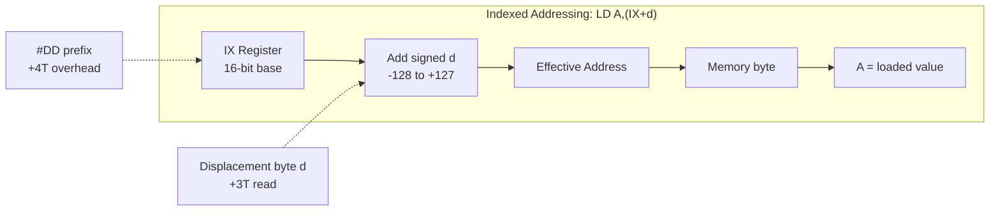

[← Plan](../PLAN.md) · [Z80 CPU](README.md)

# Z80 Addressing — Memory Addressing Modes and I/O Port Addressing

The Z80 has **10 addressing modes** — more than any contemporary 8-bit processor. This richness lets a single instruction encode complex data access patterns (indexed table lookup, stack-relative addressing, etc.) that would require multiple instructions on a 6502 or 8080. Understanding these modes is essential: every Z80 instruction uses at least one, and many combine two (one for source, one for destination).

The Z80 also has a **separate I/O address space** accessed through `IN` and `OUT` instructions. On the ZX Spectrum, I/O port partial decoding means that the 16-bit address bus is driven during I/O operations, but peripherals decode only a subset of address lines — creating port mirroring that differs per model.

> [!NOTE]
> For the complete instruction set using these modes, see [z80_instruction_set.md](z80_instruction_set.md). For how partial I/O decoding varies across ZX Spectrum models, see [io_port_map](../10_references/io_port_map.md).

---

## Addressing Mode Summary

| # | Mode | Syntax | Operand comes from | Example |
|---|---|---|---|---|
| 1 | Immediate | `n` | Byte following opcode | `LD A,#42` |
| 2 | Immediate Extended | `nn` | Two bytes following opcode (little-endian) | `LD HL,#4000` |
| 3 | Modified Page Zero | `RST p` | Fixed restart address (#00,#08,#10...#38) | `RST #08` |
| 4 | Relative | `JR e` | PC + signed displacement | `JR NZ,loop` |
| 5 | Extended | `(nn)` | 16-bit address following opcode | `LD A,(#4000)` |
| 6 | Indexed | `(IX+d)` / `(IY+d)` | IX or IY + signed displacement | `LD A,(IX+3)` |
| 7 | Register | `r` | CPU register (A,B,C,D,E,H,L) | `LD A,B` |
| 8 | Implied | (none) | Hardcoded in the opcode | `RLCA`, `NOP` |
| 9 | Register Indirect | `(HL)` / `(BC)` / `(DE)` / `(SP)` | Memory at address in register pair | `LD A,(HL)` |
| 10 | Bit | `b,r` / `b,(HL)` / `b,(IX+d)` | Bit number (0-7) + register or memory | `BIT 7,A` |

---

## Detailed Mode Descriptions

### 1. Immediate Addressing

The operand is an 8-bit literal value encoded in the byte immediately following the opcode.

```z80
ld a,#42            ; A = 42 (hex: 3E 2A)
add a,#10           ; A = A + 10 (hex: C6 0A)
cp #0FF             ; compare A with 255 (hex: FE FF)
```

**Encoding**: opcode byte + 1 data byte. Total instruction size: 2 bytes.

### 2. Immediate Extended Addressing

The operand is a 16-bit literal value encoded in the two bytes following the opcode, **little-endian** (low byte first, high byte second).

```z80
ld hl,#4000         ; HL = #4000. Bytes: 21 00 40 (low=00, high=40)
ld bc,#3C00         ; BC = #3C00. Bytes: 01 00 3C
call #1A2B          ; push PC, jump to #1A2B. Bytes: CD 2B 1A
```

> [!NOTE]
> The Z80 is **little-endian**. In memory, the 16-bit value `#4000` is stored as bytes `00 40` (low byte at lower address). This matters when reading multi-byte values from memory or building lookup tables.

### 3. Modified Page Zero Addressing (RST)

Eight fixed entry points in the first 64 bytes of memory (page zero). `RST p` is a single-byte `CALL` to one of these addresses. The target is encoded in the opcode itself as 3 bits, making RST the fastest and most compact call instruction.

```z80
rst #00             ; call #0000 — 1 byte, 11T
rst #08             ; call #0008 — used by ZX Spectrum ROM error handler
rst #10             ; call #0010 — ZX Spectrum: PRINT-A-CHAR
rst #18             ; call #0018
rst #20             ; call #0020
rst #28             ; call #0028 — ZX Spectrum: FP-CALC
rst #30             ; call #0030
rst #38             ; call #0038 — IM1 interrupt vector!
```

**Available restart addresses**: `#0000`, `#0008`, `#0010`, `#0018`, `#0020`, `#0028`, `#0030`, `#0038`.

**Why it matters on ZX Spectrum**: The ROM uses RST vectors as API entry points. `RST #10` prints a character. `RST #28` invokes the floating-point calculator. `RST #08` reports errors. And `RST #38` is where the IM1 interrupt handler lives — the ULA's INT signal triggers the CPU to execute `RST #38` automatically.

### 4. Relative Addressing

The operand is a **signed 8-bit displacement** (-128 to +127) added to the current Program Counter. This produces position-independent code — the branch target is relative, not absolute.

```z80
loop:
    djnz loop       ; decrement B, jump back if B ≠ 0
                    ; displacement = loop - ($+2) where $ is current address
                    ; range: -126 to +129 bytes from the instruction AFTER JR

    jr z,found      ; jump if Zero flag set
    jr nz,skip       ; jump if Zero flag clear
    jr c,error       ; jump if Carry set
    jr nc,ok          ; jump if Carry clear
    jr always         ; unconditional relative jump
```

**Encoding**: opcode byte + 1 signed displacement byte. Total: 2 bytes.

**Displacement calculation**: The displacement is measured from the address of the **instruction following the JR** (PC + 2, since JR is a 2-byte instruction). So `JR $` (jump to self) has displacement `#FE` (-2), not `#00`.

**Range**: -126 to +129 bytes from the JR instruction itself (or -128 to +127 from PC+2).

| Instruction | Opcode | Displacement | T-states (taken) | T-states (not taken) |
|---|---|---|---|---|
| `JR e` | `18 dd` | signed | 12 | — |
| `JR C,e` | `38 dd` | signed | 12 | 7 |
| `JR NC,e` | `30 dd` | signed | 12 | 7 |
| `JR Z,e` | `28 dd` | signed | 12 | 7 |
| `JR NZ,e` | `20 dd` | signed | 12 | 7 |
| `DJNZ e` | `10 dd` | signed | 13 | 8 |

### 5. Extended Addressing

The operand is a **16-bit absolute memory address** encoded in the two bytes following the opcode. Used for absolute jumps, calls, loads, and stores.

```z80
jp #1234            ; unconditional jump to #1234 — 3 bytes, 10T
call #8000          ; call subroutine at #8000 — 3 bytes, 17T
ld a,(#5C78)        ; load A from absolute address #5C78 — 3 bytes, 13T
ld (#5C00),a        ; store A to absolute address #5C00 — 3 bytes, 13T
```

**Encoding**: opcode byte + low address byte + high address byte. Total: 3 bytes.

### 6. Indexed Addressing (IX/IY)

The effective address is computed by adding a **signed 8-bit displacement** (-128 to +127) to the contents of the IX or IY index register. This is the Z80's signature addressing mode — absent from the 8080.



```z80
ld a,(ix+0)         ; load A from address IX+0
ld (iy+5),#FF       ; store #FF at address IY+5
add a,(ix-3)        ; add byte at IX-3 to A
ld (ix+10),b        ; store B at IX+10
bit 3,(iy+7)        ; test bit 3 of byte at IY+7
```

**Encoding**: prefix byte (`#DD` for IX, `#FD` for IY) + opcode byte + signed displacement byte. Total: 3 bytes minimum, 4 bytes for bit operations.

> [!WARNING]
> Indexed instructions are **slow** — the `#DD`/`#FD` prefix adds overhead. A simple `LD A,(IX+0)` takes **19 T-states** vs **7 T-states** for `LD A,(HL)`. Use HL whenever possible; reserve IX/IY for table access and structure member offsets where HL cannot do the job. On the ZX Spectrum, the ROM sets IY to the system variables area (`#5C3A`) and expects it to remain there.

**Practical use — structure/table access**:

```z80
; Access fields of a structure at IX
; struct { x: db; y: db; color: db; flags: db }
ld a,(ix+0)         ; x coordinate
ld b,(ix+1)         ; y coordinate
ld c,(ix+2)         ; color
ld d,(ix+3)         ; flags

; Stack-frame local variables (after pushing IX and loading SP into IX)
; push ix
; ld ix,0
; add ix,sp
; ld a,(ix+4)       ; first parameter (above saved IX + return address)
; ld b,(ix+6)       ; second parameter
```

### 7. Register Addressing

The operand is a CPU register. The register is encoded directly in the opcode bits (see [z80_architecture.md](z80_architecture.md) for the 3-bit register encoding).

```z80
ld a,b              ; A = B — 4T
add a,c             ; A = A + C — 4T
inc d               ; D = D + 1 — 4T
```

**This is the fastest addressing mode** — no memory access for the operand itself.

### 8. Implied Addressing

The operand(s) are implicit in the opcode — no additional bytes needed, and the affected registers are hardcoded.

```z80
rlca                ; rotate A left through carry — 4T
rrca                ; rotate A right through carry — 4T
cpl                 ; A = NOT A — 4T
neg                 ; A = 0 - A — 8T (ED prefix)
scf                 ; set carry flag — 4T
ccf                 ; complement carry flag — 4T
nop                 ; no operation — 4T
halt                ; halt until interrupt — 4T
```

### 9. Register Indirect Addressing

A 16-bit register pair holds the memory address of the operand. The most commonly used variant is `(HL)`, which appears in more instructions than any other indirect form.

| Register pair | Instructions that use it | Example |
|---|---|---|
| **(HL)** | Almost everything — LD, ADD, SUB, AND, OR, XOR, CP, INC, DEC, bit ops | `LD A,(HL)` — 7T |
| **(BC)** | Only `LD A,(BC)` and `LD (BC),A` | `LD A,(BC)` — 7T |
| **(DE)** | Only `LD A,(DE)` and `LD (DE),A` | `LD A,(DE)` — 7T |
| **(SP)** | PUSH, POP, EX (SP),HL/IX/IY, block I/O uses SP for return addresses | `PUSH AF` — 11T |

**Why (HL) is king**: Unlike (BC) and (DE) which only support load to/from A, `(HL)` can be used with virtually every 8-bit operation. `ADD A,(HL)`, `XOR (HL)`, `INC (HL)`, `BIT 7,(HL)` — all work. This is why HL is the primary working pointer.

### 10. Bit Addressing

A 3-bit field in the opcode specifies which bit (0-7) of a register or memory location to test, set, or reset.

```z80
bit 7,a             ; test bit 7 of A — sets Z flag if bit is 0
set 0,b             ; set bit 0 of B to 1
res 3,(hl)          ; clear bit 3 of byte at (HL)
set 4,(ix+12)       ; set bit 4 of byte at IX+12
```

**Encoding**: `CB` prefix (or `DD CB`/`FD CB` for indexed) + opcode with bit number encoded in bits 5-3 and register in bits 2-0.

---

## Addressing Mode Combinations

Many Z80 instructions combine two addressing modes — one for the source, one for the destination. The UM0080 calls these "addressing mode combinations."

```z80
; Source: immediate (#42). Destination: register (A)
ld a,#42

; Source: register indirect (HL). Destination: register (A)
ld a,(hl)

; Source: register (B). Destination: indexed (IX+3)
ld (ix+3),b

; Source: immediate extended (#4000). Destination: register pair (HL)
ld hl,#4000

; Source: extended (#5C78). Destination: register (A)
ld a,(#5C78)
```

---

## I/O Port Addressing

The Z80 has a **separate I/O address space** distinct from memory. I/O operations use the `IN` and `OUT` instructions, which activate `/IORQ` instead of `/MREQ`.

### I/O Address Bus Behavior

During I/O operations, the full 16-bit address bus (A15–A0) is driven:
- **A7–A0** contain the port address (the "intended" port)
- **A15–A8** contain a copy of the accumulator A (for `IN A,(n)` / `OUT (n),A`) or register B (for `IN r,(C)` / `OUT (C),r`)

This means the upper address lines carry register contents, NOT zeros. A peripheral that decodes more than 8 address lines will see different values depending on what's in A or B.

### I/O Instructions

| Instruction | Opcode | Port address on bus | T-states | Description |
|---|---|---|---|---|
| `IN A,(n)` | `DB nn` | A15–A8 = A, A7–A0 = n | 11 | Input from port n to accumulator |
| `OUT (n),A` | `D3 nn` | A15–A8 = A, A7–A0 = n | 11 | Output accumulator to port n |
| `IN r,(C)` | `ED xx` | A15–A8 = B, A7–A0 = C | 12 | Input from port (BC) to register r |
| `OUT (C),r` | `ED xx` | A15–A8 = B, A7–A0 = C | 12 | Output register r to port (BC) |
| `INI` | `ED A2` | A15–A8 = B, A7–A0 = C | 16 | Input to (HL), increment HL, decrement B |
| `INIR` | `ED B2` | same | 21/16 | Block input (repeats until B=0) |
| `IND` | `ED AA` | same | 16 | Input to (HL), decrement both |
| `INDR` | `ED BA` | same | 21/16 | Block input decrement |
| `OUTI` | `ED A3` | same | 16 | Output from (HL), increment HL, decrement B |
| `OTIR` | `ED B3` | same | 21/16 | Block output (repeats until B=0) |
| `OUTD` | `ED AB` | same | 16 | Output from (HL), decrement both |
| `OTDR` | `ED BB` | same | 21/16 | Block output decrement |

### The Port Addressing Problem: Partial Decoding

The Z80 places a 16-bit address on the bus during I/O, but the **ZX Spectrum's peripherals only decode a subset of address lines**. This means many different 16-bit addresses map to the same physical port.

For example, the ULA on the 48K ZX Spectrum decodes only **A0** for port `#FE`:

```
ULA responds to port #FE whenever A0 = 0
So it responds to: #FE, #FEFE, #01FE, #7CFE, #FFFE, ...
Any even address where A0=0 hits the ULA!
```

This creates a **port mirroring** effect. Code that writes to `#01FE` will also change the border color, because the ULA only looks at A0.

**Per-model differences in decoding**:

| Model | Port | Decoded lines | Mirrors |
|---|---|---|---|
| 48K ULA | `#FE` | A0 only | Any address with A0=0 |
| 128K | `#7FFD` | A15=0, A1=0 | Any address with A15=0 and A1=0 |
| 128K | `#BFFD`/`#FFFD` | A15,A14,A1,A0 | Depends on exact gate array |
| Pentagon | `#7FFD` | Similar to 128K | Similar mirroring |
| Pentagon | `#77` (shadow) | Different decoding | Pentagon-specific shadow port |
| ZX Spectrum Next | Many ports | Full decoding on most | Minimal mirroring |

> [!WARNING]
> **Code that uses "mirrored" port addresses will break on hardware that decodes more address lines.** A program that writes to `#01FE` to change the border will fail on a machine that decodes more than A0. Always use the canonical port address (`#FE`) to maximize compatibility. See [io_port_map](../10_references/io_port_map.md) for the complete per-model port decoding reference.

### Safe I/O Port Access Pattern

```z80
; SAFE: use canonical port address with known accumulator value
ld bc,#FE01         ; B=01 (upper byte), C=FE (port #FE)
                        ; On 48K, B value doesn't matter (only A0 decoded)
                        ; But on some clones, upper bits might matter
out (c),a           ; write A to port (C) with B on upper address lines

; SAFER: for IN A,(n) / OUT (n),A, control what's in A (appears on A15-A8)
ld a,#00            ; upper address lines = 0 (safe default)
out (#FE),a         ; border to black, speaker off, mic off

; WHEN IN DOUBT: use IN r,(C) / OUT (C),r with B=#00
ld bc,#00FE         ; B=00, C=FE — upper address lines all zero
in a,(c)            ; read from port #FE with clean upper address
```

---

## Decision Guide: Which Addressing Mode to Use

```mermaid
graph TD
    Q{What do you need?}
    Q -->|Single variable access| REG{Known at compile time?}
    Q -->|Pointer dereference| PTR{Which pointer register?}
    Q -->|Table/struct element| TBL{IX/IY available?}
    Q -->|Constant value| CONST{8-bit or 16-bit?}
    Q -->|Branch/Jump| BRANCH{Distance?}
    Q -->|I/O port| IO{Need full port address?}
    Q -->|System call| RST_CHK{Target = RST vector?}

    REG -->|Yes — register| REG_MODE[Register mode<br/>LD A,B — 4T, 1 byte]
    REG -->|No — from memory| PTR

    PTR -->|HL available| HL_MODE[Register Indirect HL<br/>LD A,(HL) — 7T, 1 byte]
    PTR -->|BC or DE| BCDE_MODE[Register Indirect BC/DE<br/>LD A,(BC) — 7T, but A only]
    PTR -->|Specific address| EXT_MODE[Extended mode<br/>LD A,(nn) — 13T, 3 bytes]

    TBL -->|Yes| IDX_MODE[Indexed mode<br/>LD A,(IX+d) — 19T, 3 bytes]
    TBL -->|No| CALC[Calculate address in HL<br/>then use (HL)]

    CONST -->|8-bit| IMM[Immediate mode<br/>LD A,n — 7T, 2 bytes]
    CONST -->|16-bit| IMM_EXT[Immediate Extended<br/>LD HL,nn — 10T, 3 bytes]

    BRANCH -->|Within +127 bytes| REL[Relative mode<br/>JR e — 12T, 2 bytes]
    BRANCH -->|Far or conditional| JP_CHK[Extended or conditional<br/>JP nn — 10T, 3 bytes]

    IO -->|Known port address| IO_IMM[IN A,(n) — 11T]
    IO -->|Variable port| IO_REG[IN r,(C) — 12T, B sets upper addr]

    RST_CHK -->|Yes| RST_MODE[RST p — 11T, 1 byte]
    RST_CHK -->|No| CALL_CHK[CALL nn — 17T, 3 bytes]
```

| Need | Best mode | Why |
|---|---|---|
| Access a single variable | Register (`LD A,B`) | Fastest — 4T, no memory access |
| Access a pointer in memory | Register indirect `(HL)` | 7T, one-byte opcode for many ops |
| Access a table element | Indexed `(IX+d)` or `(IY+d)` | 19T+ but handles displacement |
| Load a constant | Immediate (`LD A,#42`) | 7T, 2 bytes |
| Branch nearby | Relative (`JR`) | 2 bytes vs 3 for JP |
| Branch far | Extended (`JP #nnnn`) | 3 bytes, 10T |
| Call a ROM routine | RST if address matches | 1 byte, 11T — cheapest call |
| I/O port access | `IN r,(C)` / `OUT (C),r` | Sets upper address lines from B |

---

## Best Practices

1. **Prefer (HL) over (IX+d)** — HL-based operations are 2-3x faster and use fewer bytes. Only use IX/IY when you need displacement
2. **Use JR for short branches** — 2 bytes vs 3 for JP. For branches within ±126 bytes, JR saves both code space and (when not taken) T-states
3. **Use RST for frequently called routines** — 1 byte, 11T. The ZX Spectrum ROM's RST vectors are effectively a system call API
4. **Always zero B before `OUT (C),r`** if you don't control the upper address lines — prevents accidental port mirror hits on hardware with more complete decoding
5. **Use `LD A,(HL)` / `LD (HL),A` for sequential memory access** — pair with `INC HL` / `DEC HL` for fast memory fills and copies

---

## Antipatterns

### The Wasted Index Register

```z80
; BAD: using IX when HL would do the same job
ld ix,#4000
ld a,(ix+0)         ; 19T, 3 bytes — DD 7E 00
ld (ix+1),#FF       ; 19T, 4 bytes — DD 36 01 FF
; Total: 38T, 7 bytes (plus the LD IX,#4000 = 14T, 4 bytes)
; Grand total: 52T, 11 bytes for two sequential accesses
```

The indexed addressing mode `(IX+d)` is the Z80's most expensive addressing mode. Every `(IX+d)` access costs **19 T-states** — nearly three times more than `(HL)` at 7 T-states. The reason: the CPU must fetch the `DD` prefix byte (4T), fetch the opcode (4T), read the signed displacement byte (3T), add the displacement to IX internally (5T), and only then perform the actual memory read or write (3T). That 5T address-calculation phase adds nothing when your displacement is always 0 or incrementing by 1 — you're paying for flexibility you don't use.

Worse, each indexed instruction is **3–4 bytes** instead of 1 byte for `(HL)` operations. In a 64 KB address space where code and data share memory, this bloat compounds quickly. A tight inner loop using `(IX+d)` is both slower and larger than the equivalent `(HL)` version, leaving less room for data and other code.

```z80
; GOOD: use HL for sequential access
ld hl,#4000         ; 10T, 3 bytes
ld a,(hl)           ; 7T, 1 byte
inc hl              ; 6T, 1 byte
ld (hl),#FF         ; 10T, 2 bytes
; Total: 33T, 7 bytes (vs. 52T, 11 bytes above)
; Saves 19T (37%) and 4 bytes per iteration
```

`(HL)` is the Z80's fastest indirect addressing mode at **7 T-states**. The HL register pair is the CPU's "implied pointer" — the ALU and instruction decode logic are optimized for HL-based access. `INC HL` costs only 6T (no flags affected, internal 16-bit incrementer), making sequential byte-at-a-time access extremely efficient. Use IX/IY only when you genuinely need random access to a structure with a fixed base address and varying offsets — and even then, consider whether decomposing into HL-based loops would be faster.

### The Far Jump That Should Be Near

```z80
; BAD: 3-byte absolute jump to a nearby label
jp loop              ; 3 bytes, 10T always
```

`JP` is an absolute jump — it encodes a full 16-bit target address, consuming **3 bytes** of code space and costing **10 T-states** unconditionally. When the target label is within −126 to +129 bytes of the jump instruction (the vast majority of inner-loop branches), `JP` wastes one byte on an address that could have been encoded as a single signed displacement.

The one-byte saving matters in tight loops. On the ZX Spectrum, code often lives in scarce memory regions (ROM shadow, contended RAM above `#4000`). Every byte saved by using `JR` instead of `JP` is a byte available for data or additional unrolled instructions. Over a large program, replacing dozens of `JP` with `JR` where possible can easily save 50–100 bytes.

```z80
; GOOD: 2-byte relative jump (if within range)
jr loop              ; 2 bytes, 12T (taken) or 7T (not taken)
```

`JR` encodes only a signed 8-bit displacement relative to PC — **2 bytes** total. When the branch is taken, it costs 12T (2T more than `JP`), but when **not taken**, it costs only **7T** — saving 3T over `JP`'s unconditional 10T. For conditional branches in loops (`JR NZ,loop`), the "not taken" path is the exit path that executes once; the "taken" path is the repeated iteration. The 2T penalty on each loop iteration is negligible, while the 1-byte savings and faster exit path accumulate across the entire program.

> [!NOTE]
> `JR` supports only four conditions: NZ, Z, NC, C. If you need to branch on PO, PE, P, or M, you must use `JP`. Also, if the target label is beyond the ±126-byte range, the assembler will reject `JR` — use `JP` for those cases.

### The Mirrored Port Access

```z80
; BAD: using a non-canonical port address
ld a,#7F
out (#01FE),a        ; A=#7F on high bus, #01FE → ULA sees A0=0 → responds
```

On the 48K ZX Spectrum, the ULA decodes only **A0** for port `#FE`. Any address where A0=0 hits the ULA — so `#01FE` works because its bit 0 is 0. The program appears to function correctly. **But this is an accident of the 48K's minimal decoding.**

On machines that decode more address lines, `#01FE` is **not** the ULA port — it may be unmapped or may map to a completely different peripheral:

- **128K/+2**: the gate array decodes A15 and A1 for port `#7FFD`. Address `#01FE` has A15=0, which means it could collide with the `#7FFD` paging register decode logic.
- **Pentagon**: some Pentagon models decode additional lines for their shadow port `#77`. Non-canonical addresses may trigger unintended register writes.
- **ZX Spectrum Next**: most ports are **fully decoded**. `#01FE` is simply not port `#FE` — it does nothing at all. Your border change silently fails.
- **+2A/+3**: the Amstrad gate array uses different decoding than the Ferranti ULA. Mirrored addresses that worked on the 48K may activate the wrong peripheral.

The root cause: the `OUT (n),A` instruction puts **A on the high byte** of the address bus and **n on the low byte**. `OUT (#FE),A` with A=`#7F` actually accesses port address `#7FFE`. You might intend port `#FE`, but you're actually hitting `#7FFE`. On the 48K, this is fine (only A0 matters). On any machine that decodes A7 or A15, you're hitting the wrong port.

```z80
; GOOD: use IN r,(C) / OUT (C),r with a clean 16-bit address
ld bc,#7FFE         ; B=#7F (keyboard row), C=#FE (ULA port)
in a,(c)            ; reads port #7FFE — the intended 48K keyboard row
; OR for writes where you control both bytes:
ld bc,#00FE         ; upper byte = #00 (safe neutral value)
out (c),a           ; writes to port #00FE — clean, predictable
```

Using `IN r,(C)` / `OUT (C),r` gives you **full 16-bit control** over the port address via the BC register pair. The high byte (B) goes on A15–A8, the low byte (C) goes on A7–A0. This eliminates the accidental-high-byte problem of `OUT (n),A` and lets you explicitly set every address line to the correct value for the target hardware. The cost is 12T vs. 11T for `OUT (n),A` — negligible — and you get reliable cross-model compatibility.

---

## References

- **Z80 CPU User Manual (UM0080)**, Section "Addressing Modes" — the canonical reference
- [World of Spectrum Ports Reference](https://worldofspectrum.org/) — worldofspectrum.org/faq/reference/ports.htm
- **Black_Cat's ZX Ports Full Table** — github.com/tslabs/zx-evo/blob/master/pentevo/docs/ZX/zx-ports-full-table.txt

### Cross-References

- [z80_architecture.md](z80_architecture.md) — register file and CPU internals
- [z80_instruction_set.md](z80_instruction_set.md) — which instructions use which modes
- [io_port_map](../10_references/io_port_map.md) — complete per-model port decoding reference
- [contention_model](../05_development/03_memory_and_io/contention_model.md) — how memory access timing varies by address
