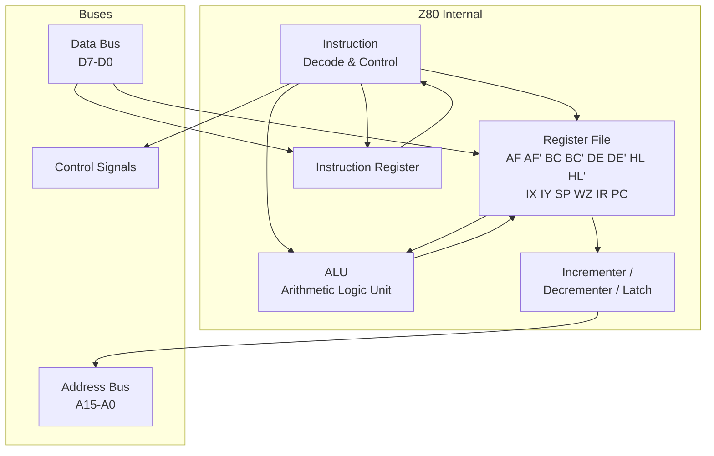
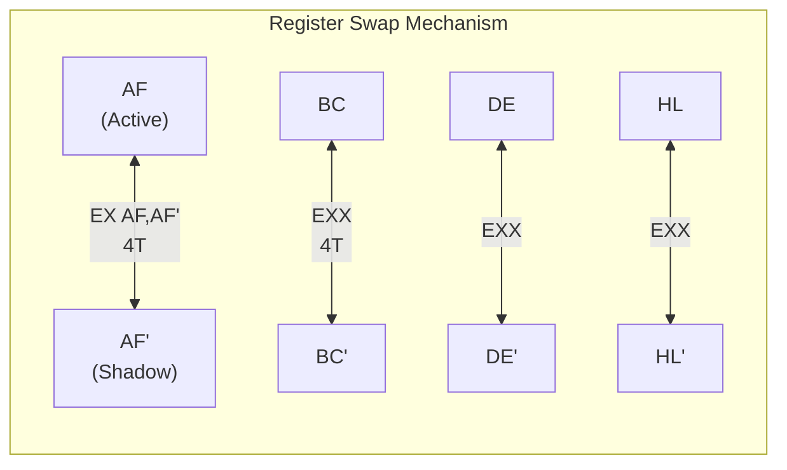

[← Plan](../PLAN.md) · [Z80 CPU](README.md)

# Z80 Architecture — Registers, ALU, Pin Description, Internal Structure

The Z80 is the brain of every ZX Spectrum — original, Soviet clone, and New Gen alike. Designed by Federico Faggin (who had led the Intel 8080 team) and released by Zilog in July 1976, it is a **4 MHz NMOS 8-bit microprocessor** in a 40-pin DIP package that runs on a single +5V supply and a single-phase clock. Every ZX Spectrum program ever written — from 1982 BASIC to modern demoscene releases — executes as Z80 machine code. Understanding this chip is not optional; it is the foundation for everything else in this knowledge base.

The Z80 is binary-compatible with the Intel 8080 (every 8080 program runs unmodified on the Z80) but extends it with: **duplicate register sets** for fast context switching, **IX/IY index registers** for table-based addressing, **bit manipulation** instructions, **block move/search/I/O** instructions, and **three interrupt modes** (IM0, IM1, IM2) instead of the 8080's single mode. The ZX Spectrum exploits all of these features.

> [!NOTE]
> The Z80 also has undocumented internal registers (MEMPTR/WZ) and undocumented instruction behaviors. These are covered in depth in [z80_undocumented.md](z80_undocumented.md). This article covers the documented architecture only.

---

## CPU Block Diagram

The Z80's internal structure consists of these major functional blocks:



The **register file** is the heart of the Z80. Ken Shirriff's die analysis (righto.com) reveals that the physical layout differs from the programmer's model — there is no "main" vs "alternate" register distinction in hardware. Instead, four toggle flip-flops control register renaming: one for AF/AF', one for BC/DE/HL vs BC'/DE'/HL', and two for DE↔HL swapping within each bank. The `EXX` instruction simply toggles a flip-flop; no data is physically moved.

The **incrementer/decrementer** sits next to the PC and R registers, connected through a disconnectable 16-bit internal bus. This allows PC to be incremented (and R to be refreshed) simultaneously with ALU operations on the other registers — a key performance optimization.

The **internal data bus** is segmented into three 8-bit sections (lower registers, upper registers, data pins) that can be connected or disconnected as needed, allowing multiple register operations in parallel.

---

## Register File

### General-Purpose Registers

The Z80 has **two complete sets** of general-purpose registers. Only one set is active at a time.



> [!NOTE]
> The swap is **instantaneous** — a flip-flop toggles which bank is "active". No data is physically copied. After `EXX`, what was BC' is now BC — the old BC is hidden.

#### Primary Set

| Register | Name | Purpose |
|---|---|---|
| **A** | Accumulator | 8-bit: holds results of arithmetic and logic operations. Source/destination for most 8-bit math, I/O, and data transfer instructions |
| **F** | Flags | 8-bit: condition flags (S, Z, H, P/V, N, C). See [z80_flags.md](z80_flags.md) for full details |
| **B** | Byte counter | 8-bit: general purpose. Also used as loop counter (DJNZ), MSB of BC register pair |
| **C** | Count / port | 8-bit: general purpose. LSB of BC pair. Used as I/O port address in `IN C,(C)` / `OUT (C),C` block I/O instructions |
| **D** | Data | 8-bit: general purpose. MSB of DE register pair |
| **E** | Extension | 8-bit: general purpose. LSB of DE pair |
| **H** | High | 8-bit: general purpose. MSB of HL pair. Often holds memory address high byte |
| **L** | Low | 8-bit: general purpose. LSB of HL pair. Often holds memory address low byte |

#### Alternate Set (accessed via `EX AF,AF'` and `EXX`)

| Register | Name | Purpose |
|---|---|---|
| **A'** | Alternate accumulator | Identical function to A, accessed by swapping |
| **F'** | Alternate flags | Identical function to F, accessed by swapping |
| **B'**, **C'**, **D'**, **E'**, **H'**, **L'** | Alternate general purpose | Identical to BC/DE/HL, accessed by `EXX` |

> [!NOTE]
> The alternate registers are NOT a second register file that you can address independently. They are a complete duplicate set that you swap into the "active" position. After `EXX`, what was BC' is now BC — the old BC is hidden. There is no instruction to access B' directly while B is active.

#### Register Pairs (16-bit)

Two 8-bit registers can be treated as a single 16-bit unit:

| Pair | Registers | Common use |
|---|---|---|
| **AF** | A + F | Accumulator + flags. Swapped with `EX AF,AF'` |
| **BC** | B + C | Byte counter / I/O port address. Loop counter for DJNZ |
| **DE** | D + E | Destination pointer for LDIR/LDDR. General 16-bit data |
| **HL** | H + L | **Primary working register pair**. Implied memory pointer in many instructions. `ADD A,(HL)`, `LD (HL),n`, etc. |
| **SP** | Stack Pointer | Points to top of stack in memory. Full 16-bit, no halves accessible |
| **PC** | Program Counter | Address of next instruction to fetch. Full 16-bit |

### Special-Purpose Registers

| Register | Width | Purpose |
|---|---|---|
| **IX** | 16-bit | Index register X. Provides indexed addressing: `(IX+d)` where d is a signed 8-bit displacement (-128 to +127). Used for table access, structure fields, stack-frame locals |
| **IY** | 16-bit | Index register Y. Same as IX but separate. On ZX Spectrum, the ROM uses IY as pointer to system variables (set to `#5C3A` on startup) — **do not modify in IM2 ISR code without saving/restoring** |
| **I** | 8-bit | Interrupt vector register. High byte of interrupt vector table address in IM2 mode. See [z80_interrupts.md](z80_interrupts.md) |
| **R** | 7-bit (+bit 7) | Memory refresh counter. Incremented during each instruction's M1 cycle. Bits 0-6 count; bit 7 retains whatever was written to it via `LD R,A`. Used for DRAM refresh. Sometimes used as entropy source — but it's predictable, not random. See [z80_undocumented.md](z80_undocumented.md) for R increment quirks |

### Internal Registers (not programmer-accessible)

| Register | Width | Purpose |
|---|---|---|
| **WZ** (MEMPTR) | 16-bit | Internal temporary register. Used during instruction execution for intermediate address calculations. Not documented by Zilog. Its behavior is observable through flag side effects — see [z80_undocumented.md](z80_undocumented.md) |
| **Instruction Register** | 8-bit | Holds the opcode currently being decoded |

---

## Register Encoding in Opcodes

Z80 opcodes use a consistent 3-bit pattern to select registers. This pattern appears in bits 2-0, bits 5-3, or both positions of the opcode:

| Code | Register | Pair code | Pair |
|---|---|---|---|
| `000` | B | `00` | BC |
| `001` | C | | |
| `010` | D | `01` | DE |
| `011` | E | | |
| `100` | H | `10` | HL |
| `101` | L | | |
| `110` | (HL) | `11` | SP (or AF for push/pop) |
| `111` | A | | |

Code `110` is special: in 8-bit operations it means **indirect through HL** (the memory byte pointed to by HL), not a register. This is why there is no direct `LD B,C` instruction — use `LD B,C` (opcode `#41`, which is actually `LD B,C` with register encoding).

---

## ALU (Arithmetic Logic Unit)

The ALU performs all arithmetic and logic operations. It takes two 8-bit operands and produces an 8-bit result plus flag updates.

```mermaid
graph LR
    subgraph "ALU Data Flow"
        A_REG[A Register<br/>Accumulator] --> OP2[Operand 2]
        REGFILE[r / (HL) / n<br/>Source] --> OP2
        OP2 --> ALU_BOX[ALU<br/>8-bit operation]
        ALU_BOX --> RESULT[A Register<br/>Result stored]
        ALU_BOX --> FLAGS[F Register<br/>Flags updated]
    end

    ALU_OPS["ADD ADC SUB SBC<br/>AND OR XOR CP<br/>INC DEC"] -.-> ALU_BOX
```

### ALU Operations

| Category | Operations |
|---|---|
| **Arithmetic** | ADD, ADC (add with carry), SUB, SBC (subtract with carry) |
| **Logic** | AND, OR, XOR |
| **Compare** | CP (subtract without storing result — sets flags only) |
| **Increment/Decrement** | INC, DEC (single operand) |
| **Rotate/Shift** | RLCA, RRCA, RLA, RRA, RLC, RRC, RL, RR, SLA, SRA, SRL |
| **Bit Operations** | BIT (test), SET (set to 1), RES (reset to 0) |

The ALU also supports 16-bit operations through the register pair incrementer/decrementer (`INC BC`, `DEC HL`, etc.) and the `ADD HL,rr` family. These 16-bit additions use the **incrementer/decrementer unit**, not the main ALU — they execute during different M-cycles than 8-bit operations.

> [!NOTE]
> 16-bit `ADD HL,rr` uses the **incrementer**, not the ALU. This means it can run simultaneously with other internal operations. The flags are updated based on the carry chain, but only the C flag is affected (S, Z, P/V are not changed by 16-bit ADD).

---

## Pin Description (40-Pin DIP)

### Pin Assignments

```
        ┌───────────┐
  A11 ──┤1        40├── A10
  A12 ──┤2        39├── A9
  A13 ──┤3        38├── A8
  A14 ──┤4        37├── A7
  A15 ──┤5        36├── A6
  CLK ──┤6        35├── A5
  D4  ──┤7        34├── A4
  D3  ──┤8        33├── A3
  D5  ──┤9        32├── A2
  D6  ──┤10       31├── A1
  +5V ──┤11       30├── A0
  D2  ──┤12       29├── GND
  D7  ──┤13       28├── /RFSH
  D0  ──┤14       27├── /M1
  D1  ──┤15       26├── /RESET
 /INT ──┤16       25├── /BUSRQ
 /NMI ──┤17       24├── /WAIT
/HALT ──┤18       23├── /BUSAK
/MREQ ──┤19       22├── /WR
/IORQ ──┤20       21├── /RD
        └───────────┘
```

### Pin Reference Table

| Pin(s) | Name | Direction | Active | Description |
|---|---|---|---|---|
| A15–A0 | Address Bus | Output | — | 16-bit address for memory (64K space) and I/O port access (low 8 bits A7–A0 used for port addressing) |
| D7–D0 | Data Bus | Bidirectional | — | 8-bit data transfer. Tri-state when BUSACK is active |
| **Power & Clock** | | | | |
| +5V (pin 11) | Power supply | Input | — | Single +5V supply (vs 8080's three rails: +5V, -5V, +12V) |
| GND (pin 29) | Ground | — | — | |
| CLK (pin 6) | Clock | Input | Rising edge | Single-phase clock. 4 MHz standard (Z80A), up to 20 MHz for CMOS variants. On ZX Spectrum: **3.5 MHz** |
| **Bus Control** | | | | |
| /MREQ (pin 19) | Memory Request | Output | Low | Indicates address bus holds a valid memory address for read or write |
| /IORQ (pin 20) | I/O Request | Output | Low | Indicates address bus low byte holds a valid I/O port address. Also active during interrupt acknowledge (combined with /M1) |
| /RD (pin 21) | Read | Output | Low | Indicates CPU wants to read data from memory or I/O |
| /WR (pin 22) | Write | Output | Low | Indicates CPU data bus holds valid data to write to memory or I/O |
| **Machine Cycle Control** | | | | |
| /M1 (pin 27) | Machine Cycle 1 | Output | Low | Indicates current machine cycle is an opcode fetch (M1). Also combined with /IORQ during interrupt acknowledge. **Critical signal on ZX Spectrum** — the ULA uses it for interrupt generation timing |
| /RFSH (pin 28) | Refresh | Output | Low | Indicates address bus low 7 bits (A6–A0) contain a refresh address for dynamic RAM, and the current M1 cycle should be used for DRAM refresh. The R register value is output on A6–A0 |
| **CPU Control** | | | | |
| /WAIT (pin 24) | Wait | Input | Low | Requests CPU to extend current bus cycle. Memory/I/O devices assert this when not ready. CPU inserts wait states until released. **On ZX Spectrum: used for ULA memory contention — the ULA asserts WAIT to stall the CPU during screen fetch cycles** |
| /HALT (pin 18) | Halt | Output | Low | Indicates CPU has executed a HALT instruction and is waiting for an interrupt. During HALT, the CPU executes NOPs internally to maintain DRAM refresh |
| **Interrupt Control** | | | | |
| /INT (pin 16) | Interrupt Request | Input | Low | Maskable interrupt request. Accepted at end of current instruction if interrupts are enabled (IFF1=1). Response depends on interrupt mode (IM0/IM1/IM2). **On ZX Spectrum: asserted by the ULA once per video frame (50 Hz)** |
| /NMI (pin 17) | Non-Maskable Interrupt | Input | Negative edge | Cannot be disabled by software. Forces CPU to execute RST #0066. Higher priority than INT. Used by Multiface devices |
| **Bus Arbitration** | | | | |
| /BUSRQ (pin 25) | Bus Request | Input | Low | Requests CPU to relinquish control of address bus, data bus, /MREQ, /IORQ, /RD, /WR. CPU completes current machine cycle then tri-states all these lines. Highest priority signal |
| /BUSAK (pin 23) | Bus Acknowledge | Output | Low | Indicates CPU has released the buses in response to /BUSRQ |
| /RESET (pin 26) | Reset | Input | Low | Initializes CPU. Clears PC and registers I, R. Sets interrupt mode 0, disables interrupts (IFF1=IFF2=0). Address and data buses go tri-state during reset assertion |

---

## Address Spaces

The Z80 has **two separate 16-bit address spaces**:

### Memory Space (64K)

- Addressed by A15–A0 during /MREQ cycles
- 65,536 bytes of addressable memory
- On ZX Spectrum: ROM + RAM + memory-mapped hardware registers (via paging)
- Read with /MREQ + /RD, write with /MREQ + /WR

### I/O Port Space (256 ports, effectively 64K with partial decoding)

- Addressed by A7–A0 during /IORQ cycles (the full A15–A0 bus is driven, but peripherals typically only decode a subset)
- 256 uniquely addressable I/O ports in theory
- **In practice**, ZX Spectrum peripherals use **partial address decoding** — a single port like `#FE` responds to many addresses (`#FE`, `#01FE`, `#7CFE`, etc.) because only specific address lines are checked
- Read with /IORQ + /RD, write with /IORQ + /WR

> [!WARNING]
> I/O port partial decoding is a major source of confusion and bugs. Different ZX Spectrum models and clones decode different address lines. Code that works on a 48K may crash on a Pentagon because a peripheral responds to a "mirrored" port that doesn't exist on the original hardware. See [z80_addressing.md](z80_addressing.md) and [io_port_map](../10_references/io_port_map.md) for per-model decoding details.

---

## Historical Context

### Z80 vs Contemporary Processors (1976–1985)

| Feature | Z80 (1976) | 8080 (1974) | 6502 (1975) | 6809 (1979) |
|---|---|---|---|---|
| Clock | 2.5–4 MHz | 2 MHz | 1–2 MHz | 1–2 MHz |
| Supply | Single +5V | +5V, -5V, +12V | Single +5V | Single +5V |
| Registers | 2× AF/BC/DE/HL + IX/IY | 1× AF/BC/DE/HL | A, X, Y, SP | 2× accumulators, DP |
| Address modes | 10+ including indexed | 5 | 13 | 16+ (most complete 8-bit) |
| Interrupts | IM0/IM1/IM2 + NMI | Single mode | IRQ + NMI | IRQ + NMI + FIRQ |
| Bit ops | SET, RES, BIT | None | None | None |
| Block ops | LDIR, CPIR, OTIR | None | None | None |
| Package | 40-pin DIP | 40-pin DIP | 40-pin DIP | 40-pin DIP |
| Transistors | ~8,500 | ~6,000 | ~3,510 | ~9,000 |

**Why the Z80 won the ZX Spectrum design**: The single +5V supply dramatically simplified the power circuit. The built-in DRAM refresh (/RFSH + R register) eliminated external refresh logic. The extended instruction set meant more work per clock cycle. The two register sets enabled fast interrupt handling — critical for the ULA's 50Hz frame interrupt.

### Why the ZX Spectrum Used the Z80 (Not the 6502)

Rick Dickinson and Richard Altwasser chose the Z80 for the ZX Spectrum in 1981 for concrete engineering reasons:

1. **DRAM refresh for free** — the /RFSH signal and R register eliminated refresh logic, saving chips on a machine designed to minimize component count
2. **Single voltage** — the 48K's unregulated 9V DC supply is simpler than what the 8080 required
3. **Two register sets** — `EX AF,AF'` / `EXX` gave instant register banking for interrupt service routines, avoiding the push/pop overhead the 6502 would need
4. **Indexed addressing (IX/IY)** — enabled table-driven code without self-modifying address patches
5. **IM2 interrupts** — vectorized interrupt dispatch without software polling (the ULA could be the sole interrupt source, making IM1 sufficient for the basic machine, but IM2 became essential for add-on hardware)

### Modern Analogies

| Z80 Concept | Modern Equivalent |
|---|---|
| Register pairs (HL, BC, DE) | 16-bit registers in a hypothetical 16-bit mode |
| `EXX` register swap | ARM banked registers (FIQ mode) |
| I/O port space (`IN`/`OUT`) | x86 I/O port space (separate from memory-mapped I/O) |
| /RFSH DRAM refresh | Modern DRAM controllers handle this transparently |
| /WAIT signal | Bus wait states / ready signals in modern buses |
| IM2 vector table | x86 IDT (Interrupt Descriptor Table) |
| Partial I/O address decoding | Memory-mapped I/O with sparse address decode |

---

## Practical Examples

### Reading the Register File at Reset

When /RESET is asserted, the Z80 initializes:

```z80
; After RESET, the Z80 state is:
; PC  = #0000    (starts executing from address 0)
; I   = #00
; R   = #00
; IFF1 = 0       (interrupts disabled)
; IFF2 = 0
; IM  = 0        (interrupt mode 0)
; AF, BC, DE, HL = random values (not guaranteed)
; SP  = random   (must initialize before any calls/pushes!)
;
; On ZX Spectrum:
;   ROM is mapped at #0000-#3FFF
;   So the CPU fetches its first instruction from the ROM
;   The ROM code sets SP, initializes system variables, etc.
```

### Register Swap for Fast Interrupt Context

```z80
; Save registers using EXX (6 T-states vs 11+11 for push/pop = 22)
exx             ; swap BC/DE/HL with BC'/DE'/HL'     ; 4T
ex af,af'       ; swap AF with AF'                    ; 4T
; -- total: 8 T-states to save 6 registers

; ... do work ...

exx             ; restore BC/DE/HL                    ; 4T
ex af,af'       ; restore AF                          ; 4T
; -- total: 16 T-states for full save/restore
; Compare with PUSH/POP approach: 6× PUSH (11T each) = 66T save, 6× POP = 66T restore = 132T total
```

### Using HL as Implied Memory Pointer

```z80
; HL is the "working pointer" — many instructions use it implicitly
ld hl,#4000     ; point to screen memory start
ld (hl),#FF     ; set 8 pixels to all-on
inc hl          ; advance to next byte
ld (hl),#AA     ; pattern
inc hl
ld (hl),#55     ; inverse pattern

; This is faster than using absolute addresses:
; ld a,#FF
; ld (#4000),a      ; 13T (16-bit absolute address)
; ld a,#AA
; ld (#4001),a      ; 13T
; vs the HL version: 10T + 7T + 6T + 10T + 6T + 7T = 46T for 3 bytes
; vs absolute:       7T + 13T + 7T + 13T = 40T for 2 bytes (no 3rd byte written)
; HL wins when writing more than 2 sequential bytes
```

---

## Best Practices

1. **Always initialize SP before any PUSH, CALL, or RST** — after reset, SP is random; a PUSH before SP initialization will corrupt memory
2. **Use HL as your primary working pointer** — more instructions use HL implicitly than any other register. Plan your data structures so HL points at the hot data
3. **Use EXX/EX AF,AF' in ISRs** — 8 T-states to save 6 registers vs 66 T-states with PUSH. See [z80_interrupts.md](z80_interrupts.md)
4. **Never modify IY in IM2 code** — the ZX Spectrum ROM uses IY as a pointer to system variables. If your ISR uses EXX, save IY explicitly
5. **Don't rely on R for randomness** — R increments predictably (once per M1 cycle). It's useful for DRAM refresh, not for crypto

---

## Antipatterns

### The Uninitialized Stack

```z80
; BAD: SP is undefined after reset
call my_function    ; pushes return address to random location

; GOOD: always set SP first
ld sp,#FFFE         ; point SP to top of available RAM (48K: #FFFE)
call my_function    ; safe
```

### The IY Clobber

```z80
; BAD: ISR clobbers IY without saving
my_isr:
    exx
    ld iy,#my_table     ; destroys ROM's IY pointer!
    ; ...
    exx
ei
reti

; GOOD: save and restore IY
my_isr:
    push iy
    ld iy,#my_table
    ; ...
    pop iy
ei
reti
```

---

## References

- **Z80 CPU User Manual (UM0080)** — Zilog, the primary reference: zilog.com/docs/z80/um0080.pdf
- [Ken Shirriff, "Down to the silicon: how the Z80's registers are implemented"](http://www.righto.com/) — die-level reverse engineering of the register file: righto.com/2014/10/how-z80s-registers-are-implemented-down.html
- **Z80 Technical Manual** — Mostek/Zilog, detailed hardware description: dunfield.classiccmp.org/r/z80tm.pdf
- [Rodnay Zaks, "Programming the Z80"](https://en.wikipedia.org/wiki/Rodnay_Zaks) — classic programming reference
- [Chris Smith, "The ZX Spectrum ULA: How to design a microcomputer"](http://www.zxdesign.info/) — explains why Sinclair chose the Z80

### Cross-References

- [z80_flags.md](z80_flags.md) — flag register deep dive
- [z80_addressing.md](z80_addressing.md) — addressing modes and I/O port addressing
- [z80_undocumented.md](z80_undocumented.md) — MEMPTR/WZ, R register quirks, other undocumented internals
- [z80_timing.md](z80_timing.md) — Z80 bus signal timing and M-cycle breakdown · [ula_timing.md](../02_hardware/original/ula_timing.md) — how bus signals interact with contention on the ZX Spectrum
- [z80_interrupts.md](z80_interrupts.md) — how INT/NMI pins are used on each model
