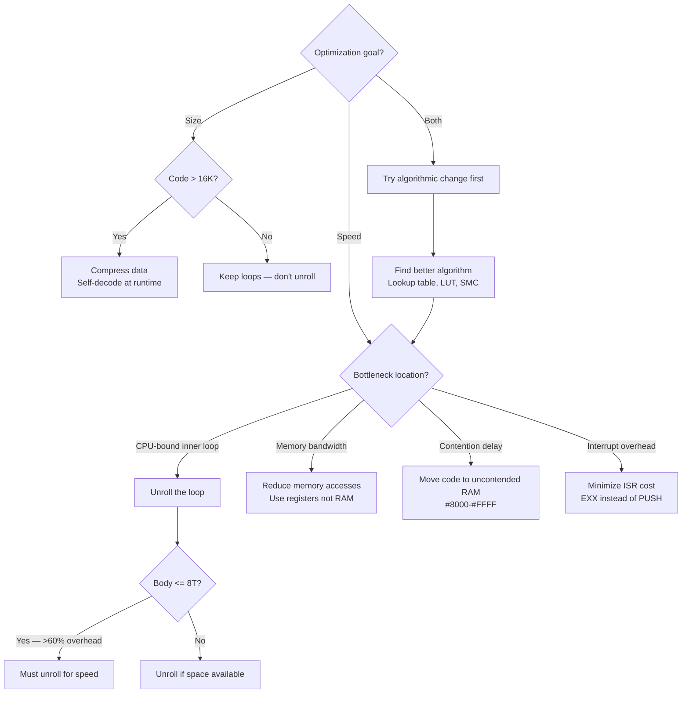

[← Home](../README.md) · [Z80 CPU](README.md)

# Z80 Coding Practices — Register Discipline, Instruction Selection, and the Path to Demo-Grade Code

The Z80 has **seven 8-bit registers** and **four 16-bit register pairs** — and none of them are truly general-purpose. The accumulator A gets every ALU result. HL is the only pointer that doesn't cost a 2-byte prefix. IX and IY are **3× slower** than HL for memory access. There is no multiply instruction, no divide, no barrel shifter, and no cache. Every T-state is visible to the hardware — the ULA steals bus cycles during screen draw, and your code either respects that timing or corrupts the display.

This article is the bridge between "knowing the instruction set" (see [z80_instruction_set.md](z80_instruction_set.md)) and "writing code that a demoscene programmer would respect." It covers **register allocation strategy**, **instruction selection for common patterns**, **memory access optimization**, **arithmetic tricks**, and **the timing budget** — organized by real-world use case, not by opcode number. Each section ends with a concrete cost comparison in T-states and bytes, because on the ZX Spectrum those numbers are the difference between a flickering mess and a smooth 50fps game.

> [!NOTE]
> This article assumes you've read [z80_architecture.md](z80_architecture.md) and [z80_instruction_set.md](z80_instruction_set.md). It's about **how to use** the ISA well, not what each instruction does. For undocumented instruction tricks, see [z80_undocumented.md](z80_undocumented.md). For contention and frame timing details, see [ula_timing.md](../02_hardware/original/ula_timing.md).

---

## Use Case 1 — Loop Counters and Iteration

### The B Register Is Your Loop Counter

`DJNZ` (`10 d`) decrements B and jumps if B≠0 — in **one byte, 13T taken, 8T not taken**. No other register gets this treatment. Reserve B for your innermost loop counter. Always.

```z80
; GOOD: DJNZ loop — 1 byte per iteration overhead
LD   B,#20         ; 20 iterations
loop:
; ... body ...
DJNZ loop          ; B--; jump if B≠0 — 13T

; BAD: Manual counter — 4 bytes, slower
LD   C,#20
loop:
; ... body ...
DEC  C
JR   NZ,loop       ; 12T — and C is now consumed
```

**Cost comparison** (per loop, excluding body):

| Pattern | Overhead | Bytes | Counter Register |
|---------|----------|-------|------------------|
| `DJNZ` | 13T taken, 8T exit | 2 (LD + DJNZ) | B |
| `DEC r / JR NZ` | 12T taken, 7T exit | 3–4 | Any 8-bit |
| `DEC rp / LD A,B / OR C / JR NZ` | 22T taken, 17T exit | 5 | BC, DE, HL |

### 16-Bit Loop Counters — The Sad Truth

The Z80 has no 16-bit DJNZ. A 16-bit counter requires manual zero-testing because `DEC BC` affects **no flags**:

```z80
; 16-bit loop: copy 512 bytes
LD   BC,#0200      ; 512 bytes
LD   HL,#C000      ; Source
LD   DE,#4000      ; Destination
loop:
LDI                ; (DE)←(HL); DE++; HL++; BC-- — 16T, sets P/V if BC≠0
JP   PE,loop       ; PE = P/V set = BC≠0 — 10T
; Total: 26T per byte — but note: LDI sets P/V=(BC≠0), not Z!
```

> `LDI`/`LDD` set **P/V** to (BC≠0 after decrement). Test with `JP PE` (BC still nonzero) or `JP PO` (BC reached zero). Do NOT test with `JR NZ` — NZ tests the Z flag, which LDI does NOT set based on BC.

### Named Antipattern: The Phantom 16-Bit Zero Test

```z80
; BAD: DEC BC doesn't touch flags!
DEC  BC
JR   Z,done        ; Z reflects PREVIOUS flag state, NOT BC=0 — BUG

; GOOD: Explicit test
DEC  BC
LD   A,B
OR   C             ; Z=1 iff B=0 AND C=0
JR   Z,done
```

---

## Use Case 2 — Register Allocation Strategy

### The Register Hierarchy

Not all registers are equal. Plan your register usage by **access frequency** and **operation type**:

```mermaid
graph TD
    NEED{What do you need?}
    NEED -->|ALU result| A_REG[A — Accumulator<br/>Only ALU target]
    NEED -->|Memory pointer| PTR{Which pointer?}
    NEED -->|Loop counter| CNT{How many iterations?}
    NEED -->|Extra storage| EXTRA{How much?}

    PTR -->|Sequential access| HL[HL — King of pointers<br/>(HL) = 7T]
    PTR -->|Second pointer / dest| DE[DE — Destination pointer<br/>Used by LDI/LDIR]
    PTR -->|Displacement access| IX[IX or IY — Index<br/>(IX+d) = 19T]

    CNT -->|1-256 iterations| B_BREG[B — Use DJNZ<br/>1 byte, 13T/loop]
    CNT -->|More than 256| BC16[BC — 16-bit counter<br/>Block ops use BC]

    EXTRA -->|1-2 bytes| IXHR[IXH/IXL or IYH/IYL<br/>Undocumented 8-bit]
    EXTRA -->|3-6 bytes| SHADOW[Shadow registers<br/>EX AF,AF' + EXX = 8T]
    EXTRA -->|More than 6 bytes| STACK[Stack or RAM<br/>PUSH/POP = 11T each]

    A_REG --> CHECK{Still need more registers?}
    HL --> CHECK
    CHECK -->|Yes| SWAP[EXX / EX AF,AF'<br/>4T each to swap sets]
    CHECK -->|No| DONE[Proceed with code]
```

| Priority | Register | Best Use | Why |
|----------|----------|----------|-----|
| 1 | **A** | ALU operations, I/O, comparisons | Only register ALU can target |
| 2 | **HL** | Memory pointer, 16-bit accumulator | `(HL)` = 7T; `ADD HL,HL` = 11T |
| 3 | **DE** | Second pointer (destination for LDI) | Needed for block operations |
| 4 | **BC** | 16-bit counter, I/O port address | Block ops use BC as counter |
| 5 | **B** | 8-bit loop counter (if not in BC pair) | DJNZ is 1 byte |
| 6 | **C** | Byte-sized value, I/O low byte | Often paired with B |
| 7 | **IX/IY** | Structure access, extra pointer | 19T for `(IX+d)` vs 7T for `(HL)` |

### Rule: HL Is King

Every memory access pattern has a "best" pointer register:

| Task | Register | Cost | Alternative |
|------|----------|------|-------------|
| Sequential byte access | HL + `INC HL` | 6T + 7T = 13T | IX + offset: 19T |
| Source pointer for block copy | HL (for LDI) | Built-in | Manual: 7T+7T+6T+6T = 26T |
| 16-bit accumulation | `ADD HL,rp` | 11T | No faster method exists |
| Table scan | HL + loop | Varies | DE for dual-scan with EX DE,HL |

### Shadow Registers — The ISR Shortcut

`EXX` swaps BC/DE/HL with BC'/DE'/HL' in **4T**. `EX AF,AF'` swaps AF with AF' in **4T**. Together, they save all six main registers in 8T — compared to four `PUSH` instructions at 42T.

```z80
; ISR entry — save everything in 8T
EX   AF,AF'       ; 4T — saves A and flags
EXX                ; 4T — saves BC, DE, HL
; ... handle interrupt ...
EXX                ; 4T — restore BC, DE, HL
EX   AF,AF'       ; 4T — restore A and flags
EI                 ; 4T
RETI               ; 14T
; Total: 34T overhead — vs. 42T for PUSH AF/BC/DE/HL + POP
```

> Shadow registers are the **ISR convention** on the ZX Spectrum. If your main code uses them, you must save/restore them in any interrupt handler. Most production code leaves shadow registers exclusively for ISRs.

### IX/IY Half-Registers — Four Extra Bytes

When register pressure is extreme, IXH, IXL, IYH, IYL give you four extra 8-bit storage locations at the cost of a DD/FD prefix (8T, 2 bytes per access). They work on all NMOS Z80 chips and most clones.

```z80
; Use IXH/IXL as temporaries in a routine that already uses A-HL-BC-DE
LD   IXH,#10       ; Loop counter in IXH — doesn't consume B
loop:
; ... use A, HL, BC, DE for real work ...
DEC  IXH
JR   NZ,loop
```

> See [z80_undocumented.md](z80_undocumented.md#1-ixiy-half-register-access) for the full opcode table and limitations.

---

## Use Case 3 — Memory Access Patterns

### The Speed Hierarchy

| Access Pattern | T-states | Bytes | When to Use |
|----------------|----------|-------|-------------|
| `LD A,(HL)` | 7 | 1 | Sequential scan, table walk |
| `LD r,(HL)` | 7 | 1 | Any byte from HL pointer |
| `LD r,(IX+d)` | 19 | 3 | Fixed structure field access |
| `LD A,(nn)` | 13 | 3 | Absolute address, A only |
| `LD rp,(nn)` | 20 | 4 | 16-bit from absolute address |
| Stack (`PUSH/POP`) | 11/10 | 1 | Temporary register save |

### Sequential Access — Keep HL Moving

```z80
; GOOD: Increment HL for each byte
LD   B,#32
loop:
LD   A,(HL)        ; 7T
INC  HL            ; 6T
; ... process A ...
DJNZ loop          ; 13T
; Total per byte: 26T

; BAD: Use IX with fixed offsets
LD   B,#32
LD   IX,table
loop:
LD   A,(IX+#00)    ; 19T
; ... process A ...
INC  IX            ; 10T (DD 23)
DJNZ loop          ; 13T
; Total per byte: 42T — 62% slower!
```

### Structure Access — IX/IY Earn Their Keep

IX/IY shine when accessing **fixed-offset fields** in a structure where HL is already busy:

```z80
; Process a sprite structure at IX, while HL points to screen buffer
; struct sprite { x: byte[0], y: byte[1], attr: byte[2], data: word[3-4] }
LD   A,(IX+#00)    ; x coordinate — 19T
LD   C,(IX+#01)    ; y coordinate — 19T
LD   A,(IX+#02)    ; attributes   — 19T
; HL is free for screen pointer arithmetic
```

### Block Fill — The LDIR Trick

```z80
; Fill 6912 bytes (full screen) with pattern byte in A
LD   HL,#4000
LD   (HL),A        ; Plant first byte
LD   DE,#4001      ; Source = dest + 1
LD   BC,#1AFF      ; 6911 remaining bytes
LDIR               ; Copies byte forward — each byte copies the previous
; Total: ~145,152 T-states at 21T/byte
```

### Named Antipattern: The Wasted Index Register

```z80
; BAD: Using IX in a tight sequential loop
loop:
LD   A,(IX+#00)
ADD  A,(IX+#01)
LD   (IX+#02),A
; 3 × 19T = 57T, 9 bytes

; GOOD: HL sequential walk
loop:
LD   A,(HL)        ; 7T
INC  HL            ; 6T
ADD  A,(HL)        ; 7T
INC  HL            ; 6T
LD   (HL),A        ; 7T
INC  HL            ; 6T
; 39T, 7 bytes — 32% faster, 22% smaller
```

---

## Use Case 4 — Arithmetic Without a Multiply Instruction

The Z80 has **no MUL, no DIV, no MOD**. Everything is shifts, adds, and lookup tables.

### Multiply by Constants — Shift-and-Add

| Constant | Method | T-states | Bytes |
|----------|--------|----------|-------|
| ×2 | `ADD A,A` | 4 | 1 |
| ×2 (16-bit) | `ADD HL,HL` | 11 | 1 |
| ×3 | `LD B,A / ADD A,A / ADD A,B` | 12 | 3 |
| ×4 | `ADD A,A / ADD A,A` | 8 | 2 |
| ×5 | `LD B,A / ADD A,A ×2 / ADD A,B` | 16 | 4 |
| ×6 | `ADD A,A / LD B,A / ADD A,A / ADD A,B` | 16 | 4 |
| ×10 | `LD B,A / ADD A,A ×3 / ADD A,B` | 20 | 5 |
| ×15 | `LD B,A / ADD A,A ×4 / SUB B` | 20 | 5 |
| ×16 | `ADD A,A ×4` | 16 | 4 |
| ×256 | `LD H,A / LD L,0` | 7 | 3 |

> **Key insight**: On A, use `ADD A,A` (4T, 1 byte) instead of `SLA A` (8T, 2 bytes). They're identical for unsigned multiply-by-2. On other registers, `SLA r` is your only option. For 16-bit left shifts, `ADD HL,HL` (11T, 1 byte) is the fastest operation in the entire 16-bit arsenal.

### 16-Bit Multiply by Constants

```z80
; HL = HL × 3 — total 26T, 4 bytes
LD   D,H           ; Save HL
LD   E,L
ADD  HL,HL         ; HL × 2 — 11T
ADD  HL,DE         ; HL × 2 + HL = HL × 3 — 11T

; HL = HL × 5 — total 37T, 6 bytes
LD   D,H
LD   E,L
ADD  HL,HL         ; ×2
ADD  HL,HL         ; ×4
ADD  HL,DE         ; ×5

; HL = HL × 10 — total 48T, 8 bytes
LD   D,H
LD   E,L
ADD  HL,HL         ; ×2
ADD  HL,HL         ; ×4
ADD  HL,HL         ; ×8
ADD  HL,DE         ; ×9 — wrong! Need ×10

; HL = HL × 10 — correct: 37T, 5 bytes
PUSH HL
ADD  HL,HL         ; ×2
ADD  HL,HL         ; ×4
POP  DE
ADD  HL,DE         ; ×5
ADD  HL,HL         ; ×10
```

### Generic 8×8 Multiply — The Fastest Known

```z80
; HL = H × E — 8×8 unsigned multiply
; Fastest known left-rotating algorithm
; In: H = multiplier, E = multiplicand
; Out: HL = product
; Destroys: D, L, B
Mult8x8:
LD   D,0           ; DE = multiplicand zero-extended
LD   L,D           ; HL = 0 (accumulator)
LD   B,8           ; 8 bits to process
.loop:
ADD  HL,HL         ; Shift accumulator left — 11T
JR   NC,.noadd     ; If carry set, multiplicand bit was 1 — 12/7T
ADD  HL,DE         ; Add multiplicand — 11T
.noadd:
DJNZ .loop         ; 13/8T
RET
; Total: ~354T average (depends on bit pattern of H)
```

### Lookup Tables — The Demoscene Weapon

When you need speed more than size, **precompute everything**:

```z80
; Sine lookup table — 256 entries, 8-bit amplitude
; Aligned to 256-byte boundary for fast indexing: LD L,A / LD H,sinTable>>8
; Index 0-255 maps to sin(0) through sin(2π) with amplitude 0-127

; Usage:
LD   A,angle       ; 0-255 = full circle
LD   L,A
LD   H,#80         ; sinTable at #8000 (aligned!)
LD   A,(HL)        ; 7T — instant sine!

; Contrast with computing sine:
; A software sine routine costs ~500-800T
; Table lookup: 14T (LD L,A + LD A,(HL))
; Speedup: 35-57× faster
```

> **Table alignment rule**: Align 256-entry tables to a 256-byte boundary (`#xx00`). This lets you index with just `LD L,A / LD H,tableHi / LD A,(HL)` — 14T total. Without alignment, you need `ADD A,tableLo / ADC H,0` — 11T more per access.

---

## Use Case 5 — Branching and Conditional Logic

### JR vs JP — The Size/Speed Tradeoff

| Instruction | Taken | Not Taken | Bytes | Range |
|-------------|-------|-----------|-------|-------|
| `JR cc,d` | 12T | **7T** | 2 | ±126 bytes |
| `JP cc,nn` | 10T | 10T | 3 | Full 64K |

`JR` is **faster when not taken** (7T vs 10T) and **smaller** (2 bytes vs 3). `JP` is **faster when taken** (10T vs 12T). For error-handling branches (taken rarely), `JR` wins. For hot loops where the branch is usually taken, `JP` wins.

### Named Antipattern: The Far Jump That Should Be Near

```z80
; BAD: JP for a branch 20 bytes away
JP   NZ,error      ; 3 bytes, 10T — wastes 1 byte and is slower when not taken

; GOOD: JR for short branches
JR   NZ,error      ; 2 bytes, 12/7T — saves 1 byte, 7T when falling through
```

### Decision Table — Which Conditional?

| Need | Use | Why |
|------|-----|-----|
| Compare and branch | `CP n / JR cc` | CP sets all flags without modifying A |
| Bit test and branch | `BIT b,r / JR Z/NZ` | BIT sets Z directly — no CP needed |
| Zero A fastest | `XOR A` | 4T, 1 byte — vs `LD A,0` at 7T, 2 bytes |
| Test register pair zero | `LD A,B / OR C / JR Z` | Only way to test 16-bit zero |
| Test after INC/DEC 8-bit | Direct `JR Z/NZ` | INC/DEC set Z flag |
| Test after INC/DEC 16-bit | Must test manually | `INC BC` affects no flags |

---

## Use Case 6 — The Stack as a Weapon

### Push/Pop for Temporary Storage

```z80
; Save A and HL for a brief operation — 21T total
PUSH AF            ; 11T
PUSH HL            ; 11T (wait, can combine with EXX)

; Alternative: Use shadow registers if available — 8T
EXX                ; Saves BC, DE, HL
EX   AF,AF'       ; Saves A, F
```

### Stack as a Fast Memory Pointer

Advanced trick: temporarily set SP to point at data, then use `POP` instructions to read data at 10T per 16-bit word:

```z80
; FAST: Read four words from a table using SP
LD   (saveSP),SP   ; Save real stack pointer — 20T
LD   SP,tableAddr  ; Point SP at data — 10T
POP  BC            ; First word — 10T
POP  DE            ; Second word — 10T
POP  HL            ; Third word — 10T
POP  AF            ; Fourth word — 10T
LD   SP,(saveSP)   ; Restore — 20T
; Total: 90T for 8 bytes = 11.25T/byte — faster than LDI (16T/byte)!

; CAUTION: Disable interrupts while SP is redirected!
DI                 ; Must disable interrupts — stack is corrupted
; ... stack tricks ...
EI
```

> [!WARNING]
> Redirecting SP requires interrupts disabled (`DI`). Any interrupt during this window will use the corrupted stack and crash the machine. This is a demoscene trick — use with extreme caution in production code.

---

## Use Case 7 — Self-Modifying Code

The Z80 has no cache, no prefetch queue, and no instruction pipeline. Code bytes in RAM can be modified and immediately executed. This enables patterns impossible on modern CPUs:

### The Immediate Override

```z80
; Make LD A,n load a variable value at runtime
LD   A,computedValue
LD   (loadA+1),A   ; Overwrite the immediate byte
; ...later...
loadA:
LD   A,#00         ; The #00 will be replaced by computedValue at runtime
; ...use A...
```

### The Condition Flip

```z80
; Toggle between JR and NOP at runtime
; JR e = 18 dd (2 bytes) — NOP = 00 (1 byte)
; Replace first byte with #00 to disable the jump
LD   A,#00
LD   (myJump),A    ; Disable the jump — turns JR into NOP + garbage byte
; ...
LD   A,#18
LD   (myJump),A    ; Re-enable the jump
myJump:
JR   target
```

> Self-modifying code breaks on ROM-based systems and is incompatible with the ZX Spectrum Next's cache. Use it only in RAM-resident, performance-critical paths where the 2-4T savings per modification are justified.

---

## Use Case 8 — Contention-Aware Coding

On the ZX Spectrum 48K, the ULA reads display memory during the upper 192 scanlines. During this time, CPU accesses to the `#4000`–`#7FFF` range are delayed by 1–6 T-states per access. This is **memory contention**.

### The Rules

1. **Access `#4000`–`#7FFF` during vertical blank** (scanlines 192–311) if possible — no contention
2. **Avoid contended access in timing-critical loops** — contention makes T-state counts unpredictable
3. **Unroll timing-critical loops** to control exact T-state position within a scanline
4. **Place code in uncontended RAM** (`#8000`–`#FFFF`) for consistent execution speed

### Named Antipattern: The Contention Ignorer

```z80
; BAD: Timing loop accessing screen RAM during display draw
; This loop's actual T-state cost varies depending on scanline position!
LD   HL,#4000
LD   B,#32
loop:
LD   (HL),#FF       ; May cost 7T or 7T+contended wait — unpredictable!
INC  HL
DJNZ loop

; GOOD: Do the computation in uncontended RAM, then BLT to screen during blank
LD   HL,buffer      ; Buffer in #8000+ — no contention
LD   DE,#4000       ; Screen
LD   BC,#0300       ; 768 bytes (3 attributes rows)
; ... fill buffer during active display ...
HALT                ; Wait for vertical blank — no contention
LDIR                ; Now copy — screen RAM is uncontended during blank
```

See [ula_timing.md](../02_hardware/original/ula_timing.md) for the complete contention model and per-scanline timing tables.

---

## Use Case 9 — Size vs Speed Tradeoffs

### The Optimization Decision

Before you optimize, decide what you're optimizing for:



### Unrolling Loops

A DJNZ loop costs 13T per iteration for the branch. If the body is small (4–8T), the loop overhead dominates. Unrolling eliminates the branch at the cost of code size:

```z80
; ROLLED: 4 bytes, 19T per pixel
LD   B,#8
loop:
LD   (HL),#FF
INC  HL
DJNZ loop           ; 13T overhead per iteration
; Total: 8 × 19T = 152T

; UNROLLED: 16 bytes, 13T per pixel
LD   (HL),#FF       ; 10T
INC  HL             ; 6T
LD   (HL),#FF       ; 10T — repeated 8 times (shown twice here)
INC  HL             ; 6T
; ...6 more pairs...
; Total: 8 × 13T = 104T — 32% faster, 4× larger
```

### Decision Matrix — Unroll or Not?

| Body Size (T) | Loop Overhead Ratio | Recommendation |
|----------------|---------------------|----------------|
| ≤ 8T | >60% overhead | **Unroll** — loop cost dominates |
| 8–20T | 40–60% | Unroll if you have space |
| 20–50T | 20–40% | Keep loop unless extreme perf needed |
| >50T | <20% | Don't unroll — negligible gain |

### Short Jumps as NOPs

`JR $+2` (jump to the instruction after itself) is a **2-byte, 12T NOP** — useful for alignment padding where `NOP` (1 byte, 4T) doesn't fill the right number of bytes.

---

## The Performance Budget — What Does "Fast Enough" Mean?

### T-States Per Frame by Model

| Model | T-states/frame | Available after IM1 ISR | Notes |
|-------|----------------|------------------------|-------|
| 48K | **69,888** | ~69,100 | IM1 ROM handler costs ~700T |
| 128K/+2 | 70,968 | ~70,200 | Longer frame, same CPU speed |
| Pentagon 128 | 71,680 | ~69,600 | No contention — faster in practice, but different frame length |

### What Can You Do in One Frame?

| Task | T-states | % of 48K Frame | Notes |
|------|----------|----------------|-------|
| LDIR full screen (6912 bytes) | ~145,152 | **208%** | Can't copy full screen in one frame! |
| LDIR pixel area only (6144 bytes) | ~129,024 | **185%** | Still too slow |
| LDIR attribute area (768 bytes) | ~16,128 | **23%** | Feasible — attributes only |
| Clear 256-byte buffer with XOR loop | ~4,608 | **6.6%** | Very fast |
| 256 iterations of a 50T inner loop | 12,800 | **18.3%** | Typical game sprite loop |
| Read keyboard (5 port reads) | ~100 | **0.14%** | Negligible |

### The Implication

You **cannot** copy the entire screen in one frame with LDIR. The ZX Spectrum's video memory is **6912 bytes** and LDIR moves data at 21T/byte = 166 KB/s. At 50 fps, you have ~140KB/s bandwidth. This is why Spectrum games use:

1. **Attribute-only animation** — 768 bytes, 23% of frame
2. **Partial screen updates** — only redraw what changed
3. **Double buffering** — build offscreen, then switch banks (128K only)
4. **Character-cell graphics** — manipulate 8×8 tiles, not individual pixels
5. **Stack-based writes** — use PUSH to write 2 bytes at 11T = 5.5T/byte (3.8× faster than LDIR)

### The Stack Blitter — Demoscene Speed Record

```z80
; Fastest known method to write to screen: PUSH-based blitter
; Writes 2 bytes per PUSH at 11T = 5.5T per byte
LD   SP,#4000       ; Point stack at screen — WARNING: DI first!
; Write 16 bytes (8 PUSHes) in 88T = 5.5T/byte
PUSH DE             ; 11T — writes E to low addr, D to high addr
PUSH BC             ; 11T
PUSH AF             ; 11T
PUSH HL             ; 11T
PUSH DE
PUSH BC
PUSH AF
PUSH HL             ; 8 × 11T = 88T for 16 bytes
; Compare: LDIR would be 16 × 21T = 336T — PUSH is 3.8× faster!
```

---

## Best Practices — Summary

1. **Reserve B for your innermost loop counter** — DJNZ is 1 byte and 13T. No substitute.
2. **HL is your primary pointer** — `(HL)` is 7T vs. 19T for `(IX+d)`. Keep HL free for sequential access.
3. **Use `XOR A` to zero A** — 4T, 1 byte, vs. `LD A,0` at 7T, 2 bytes.
4. **Use `ADD HL,HL` for 16-bit left shifts** — 11T, 1 byte. The fastest 16-bit operation.
5. **Prefer JR over JP for short branches** — saves 1 byte, 7T when not taken.
6. **Use shadow registers for ISR save/restore** — 8T vs. 42T for four PUSHes.
7. **Keep timing-critical code in uncontended RAM** (`#8000`–`#FFFF` on 48K).
8. **Align 256-entry lookup tables to 256-byte boundaries** — enables 14T indexed access.
9. **Use LDIR for bulk copies** — don't write manual loops unless you need inter-byte logic.
10. **Use PUSH for the fastest screen writes** — 5.5T/byte vs. 21T/byte for LDIR.
11. **Test 16-bit zero with `LD A,B / OR C`** — `DEC rp` affects no flags.
12. **Unroll loops when body ≤ 8T** — loop overhead dominates otherwise.
13. **Disable interrupts before redirecting SP** — any interrupt with corrupted SP is fatal.
14. **Precompute with lookup tables** — 14T table read vs. 500T+ computation.
15. **Use `CP` before conditional jumps** — sets all flags without modifying A.

---

## Antipatterns

### The Indexed Everything

```z80
; BAD: Using IX for everything because it "looks like C array indexing"
LD   A,(IX+#00)
LD   B,(IX+#01)
LD   C,(IX+#02)
ADD  A,(IX+#03)
; 4 × 19T = 76T, 12 bytes

; GOOD: Copy to local registers, then work at full speed
LD   L,(IX+#00)
LD   H,(IX+#01)
LD   A,(HL)        ; Now use HL for further access — 7T
```

### The Repeated Computation

```z80
; BAD: Computing the same value twice
CP   #41
JR   C,not_letter
CP   #5B
JR   NC,not_letter
; ... later, same range test for something else ...
CP   #41
JR   C,not_letter2

; GOOD: Compute once, save result in a flag or register
CP   #41
JR   C,not_letter
CP   #5B
CCF                  ; Could use the result instead of re-testing
; ... or save the comparison result in a register bit ...
```

### The Memory Habit

```z80
; BAD: Using RAM variables when a register would do
LD   (temp),A
; ... do something with A ...
LD   A,(temp)        ; 13T per load from absolute address

; GOOD: Keep values in registers
LD   B,A             ; 4T — 3.25× faster than RAM round-trip
; ... do something with A ...
LD   A,B
```

---

## What Comes Next — The Path to Demo-Grade Code

This article covers **correctness and efficiency** — using the right instruction for the job, minimizing register pressure, and respecting the timing budget. The techniques here will make your code run 2–5× faster than naive implementations.

The next level — **demo-grade optimization** — goes further:

| Technique | What It Does | Where to Learn |
|-----------|-------------|----------------|
| Cycle-exact raster timing | Hit specific T-state positions within a scanline for multicolor | [ula_timing.md](../02_hardware/original/ula_timing.md) → Demoscene articles (planned) |
| Stack-based blitting | Write screen data at 5.5T/byte using PUSH | This article → expand with multicolor techniques |
| Self-modifying code for zero-overhead loops | Patch instruction operands at runtime | This article → advanced SMC patterns |
| Contended memory as a timing source | Use ULA wait states as a predictable delay | [ula_timing.md](../02_hardware/original/ula_timing.md) |
| Interrupt-driven effects | Split work across frames using IM2 vector tables | [z80_interrupts.md](z80_interrupts.md) |
| Alternate screen banks (128K) | Double-buffer without tearing | Memory management articles (planned) |
| undocumented instruction tricks | IXH/IXL as extra registers, OUT (C),0 for pad detection | [z80_undocumented.md](z80_undocumented.md) |

The development section (`05_development/02_assembly/`) will cover these advanced topics in dedicated articles on assembly patterns and optimization techniques.

---

## References

- **Z80 Optimization** ([WikiTI/BrandonW](https://wikiti.brandonw.net/index.php?title=Z80_Optimization)) — Comprehensive optimization guide with register allocation and size/speed tradeoffs
- **Grauw's Z80 Multiplication/Division** ([map.grauw.nl](https://map.grauw.nl/articles/mult_div_shifts.php)) — Optimized arithmetic routines, shift-based multiply by constants
- **Z80 Programming Techniques** ([SMS Power](https://www.smspower.org/Development/Z80ProgrammingTechniques)) — Practical coding patterns for Z80
- **ZEXALL/Z80Test** — Test suites that verify correct behavior of every Z80 instruction including undocumented features
- **Sean Young, "The Undocumented Z80 Documented"** ([z80.info](http://www.z80.info/z80undoc.htm)) — Reference for undocumented instruction behavior

### Cross-References

- [z80_architecture.md](z80_architecture.md) — Register file and internal CPU structure
- [z80_instruction_set.md](z80_instruction_set.md) — Complete documented ISA reference
- [z80_undocumented.md](z80_undocumented.md) — IX/IY halves, SLL, MEMPTR, clone detection
- [ula_timing.md](../02_hardware/original/ula_timing.md) — contention, frame budget, multicolor
- [clone_timing.md](../02_hardware/clones/clone_timing.md) — Pentagon, Scorpion, Kay, FPGA timing and detection techniques
- [z80_timing.md](z80_timing.md) — T-states, M-cycles, per-instruction costs
- [z80_flags.md](z80_flags.md) — Flag behavior for every instruction group
- [z80_interrupts.md](z80_interrupts.md) — IM0/IM1/IM2, NMI, vector tables
