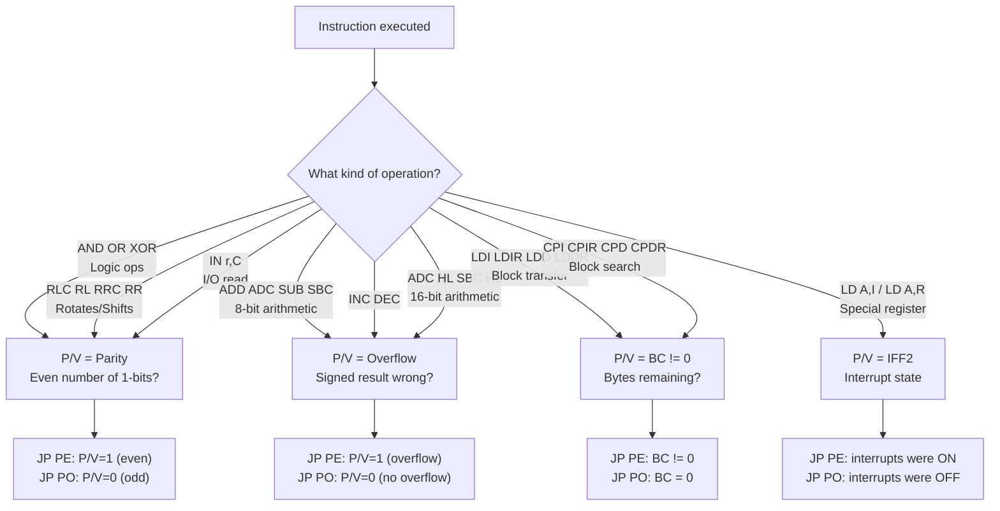
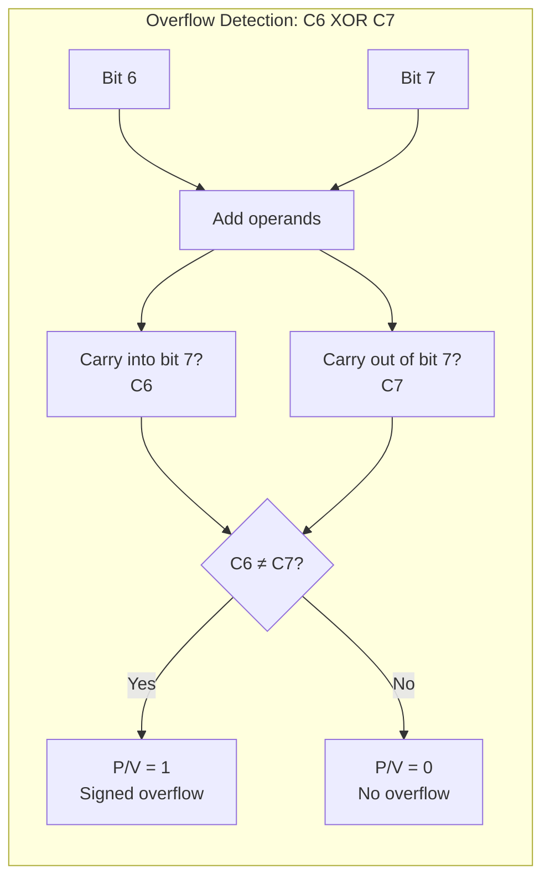
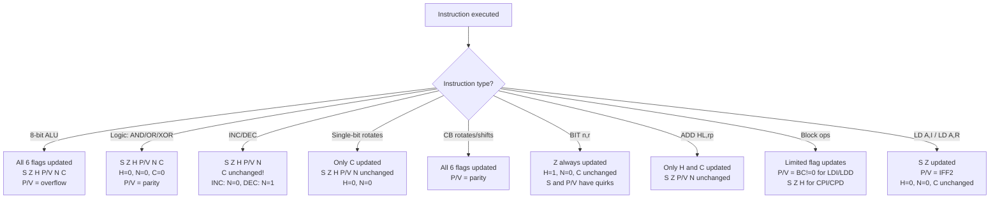
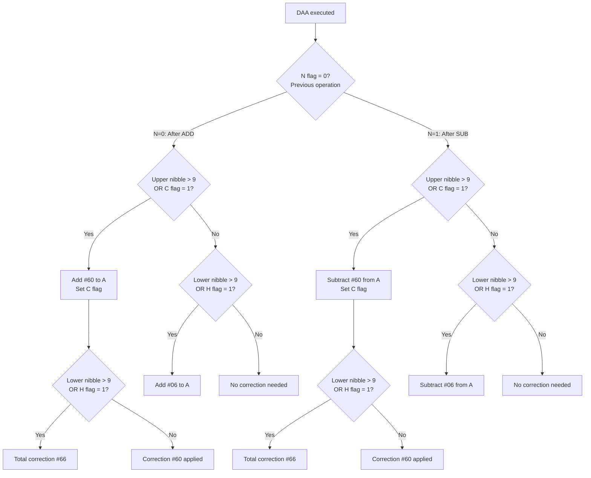

[← Plan](../PLAN.md) · [Z80 CPU](README.md)

# Z80 Flags — Sign, Zero, Half-Carry, Parity/Overflow, Subtract, Carry

The Z80's **Flag register (F)** is an 8-bit register where **six bits are officially defined** and two bits (3 and 5) are undocumented. Unlike the accumulator or general-purpose registers, you never load values directly into F — it is set as a **side effect** of arithmetic, logic, rotate, I/O, and block instructions. Four of the six documented flags (S, Z, P/V, C) drive **conditional jumps, calls, and returns** — they are the Z80's decision-making mechanism. The remaining two (H, N) cannot be tested directly but are essential for the **DAA instruction** to correct BCD arithmetic.

The flag register is paired with the accumulator as **AF** — a 16-bit register pair that can be pushed to stack (`PUSH AF`), exchanged with its shadow (`EX AF,AF'`), and restored (`POP AF`). Every non-trivial Z80 program manipulates flags constantly, and misunderstanding flag behavior is one of the most common sources of subtle bugs.

> [!NOTE]
> Bits 3 and 5 of F have undocumented, deterministic behavior on NMOS Z80 processors. These "X and Y flags" and the internal MEMPTR register that feeds them are covered in depth in [z80_undocumented.md](z80_undocumented.md). This article covers the **six documented flags** only, with brief notes where undocumented behavior intersects.

---

## Flag Register Layout

```
┌─────┬─────┬─────┬─────┬─────┬─────┬─────┬─────┬─────┐
│ Bit │  7  │  6  │  5  │  4  │  3  │  2  │  1  │  0  │
├─────┼─────┼─────┼─────┼─────┼─────┼─────┼─────┬─────┤
│Flag │  S  │  Z  │  Y  │  H  │  X  │ P/V │  N  │  C  │
├─────┼─────┼─────┼─────┼─────┼─────┼─────┼─────┬─────┤
│     │Sign │Zero │Undoc│Half │Undoc│Par/ │Sub  │Carr │
│     │     │     │ F5  │Carry│ F3  │Ovrfl│     │     │
└─────┴─────┴─────┴─────┴─────┴─────┴─────┴─────┴─────┘
```

| Bit | Flag | Name | Testable? | Purpose |
|-----|------|------|-----------|---------|
| 7 | S | Sign | Yes (`JP M`, `JP P`) | Copy of bit 7 of result — indicates negative in two's complement |
| 6 | Z | Zero | Yes (`JP Z`, `JP NZ`) | Set when result is zero |
| 5 | Y (F5) | Undocumented | No | Copy of bit 5 of ALU result on most instructions |
| 4 | H | Half-Carry | No | Carry from bit 3 to bit 4 — used by DAA for BCD correction |
| 3 | X (F3) | Undocumented | No | Copy of bit 3 of ALU result on most instructions |
| 2 | P/V | Parity/Overflow | Yes (`JP PE`, `JP PO`) | Dual-purpose: parity (logical ops) or overflow (arithmetic ops) |
| 1 | N | Subtract | No | Set if last operation was subtraction — used by DAA |
| 0 | C | Carry | Yes (`JP C`, `JP NC`) | Carry out of bit 7 — set on overflow from unsigned arithmetic |

---

## The Six Documented Flags

### Sign Flag (S) — Bit 7

**Set to the value of bit 7 of the result** — a direct copy of the most significant bit.

In two's complement arithmetic, bit 7 = 1 means the result is negative (range −128 to −1). This is useful after arithmetic, logical, and rotate operations:

```z80
LD   A,#7F        ; A = +127 (max positive signed byte)
ADD  A,#1         ; A = #80 = -128 in signed, S=1 (negative)
JP   M,negative   ; Jump if S=1 (minus/negative)

LD   A,#80        ; A = #80
AND  #7F          ; A = #00, S=0 (bit 7 of result is 0)
JP   P,positive   ; Jump if S=0 (plus/positive)
```

**Conditional instructions:** `JP M` (jump if minus, S=1), `JP P` (jump if plus, S=0), `CALL M`, `CALL P`, `RET M`, `RET P`.

**Not affected by:** 16-bit `ADD HL,rr` (only H and C flags change), `LD` instructions, block I/O instructions (INI/OUTI etc. set S based on B decrement).

> [!WARNING]
> `BIT 7,r` sets S to the value of bit 7 of the tested register, but `BIT 0–6,r` always clears S. This is a common source of confusion.

---

### Zero Flag (Z) — Bit 6

**Set when the result of an operation is zero.** This is the most frequently tested flag in Z80 programming.

```z80
LD   A,#42
CP   #42          ; A - #42 = 0, Z=1 (equal)
JP   Z,match      ; Jump if Z=1

LD   B,#10
loop:
DEC  B            ; B = B - 1
JP   NZ,loop      ; Jump if Z=0 (B is not zero yet)
```

Key behaviors beyond basic arithmetic:

| Context | Z Flag Meaning |
|---------|---------------|
| `CP r` / `CP (HL)` | Z=1 means A equals the operand |
| `BIT n,r` | Z=1 means the tested bit is **0** (complemented!) |
| `IN r,(C)` | Z=1 means the input byte was zero |
| `INI/IND/OUTI/OUTD` | Z=1 means B decremented to zero |
| `CPI/CPD/CPIR/CPDR` | Z=1 means A equals (HL) |

**Conditional instructions:** `JP Z`, `JP NZ`, `JR Z`, `JR NZ`, `CALL Z/NZ`, `RET Z/NZ`.

> [!WARNING]
> The `BIT` instruction sets Z to the **complement** of the tested bit. `BIT 0,A` with A=`#01` clears Z (bit is 1, Z = NOT 1 = 0). This is intentional — `JR Z,bit_is_zero` reads naturally.

---

### Half-Carry Flag (H) — Bit 4

**Records a carry from bit 3 to bit 4** — the "nibble boundary" carry. This flag exists for one reason: **BCD arithmetic via DAA**.

Each BCD digit occupies one nibble (4 bits), values 0–9. When an addition produces a result in the range `#0A–#0F` in the lower nibble, or `#A0–#F0` in the upper nibble, DAA uses H (and C) to decide what correction to apply.

```z80
; BCD addition: 15 + 27 = 42
LD   A,#15        ; BCD 15 (binary 0001 0101)
ADD  A,#27        ; BCD 27 (binary 0010 0111)
                   ; Result = #3C (binary 0011 1100)
                   ; H=1 because carry from bit 3 to bit 4
DAA                ; Adds #06 because H=1 → result = #42 (BCD 42)
```

H flag behavior:

| Operation | H Set When |
|-----------|------------|
| Addition (ADD, ADC, INC) | Carry from bit 3 to bit 4 |
| Subtraction (SUB, SBC, DEC, NEG) | Borrow from bit 4 |
| Logical (AND, OR, XOR) | Always 1 for AND, always 0 for OR/XOR |
| Rotates (RLA, RRA, RLCA, RRCA) | Always 0 |
| Block compare (CPI/CPD) | Set if borrow from bit 4 of (A − (HL)) |

> [!NOTE]
> H is **not testable** with conditional jumps. Its only consumer is the DAA instruction. If you are not doing BCD arithmetic, you can safely ignore H — but be aware that `PUSH AF` saves it, and `DAA` will use whatever H value is present.

---

### Parity/Overflow Flag (P/V) — Bit 2

**The most complex flag** — it serves two completely different purposes depending on the instruction:



1. **Parity** (logical and rotate operations): P/V = 1 if the result has an **even** number of set bits
2. **Overflow** (arithmetic operations): P/V = 1 if signed arithmetic overflow occurred

#### Parity Mode

After logical operations (AND, OR, XOR), rotates (RLC, RL, RRC, RR, RRA, RLCA, etc.), and the `IN r,(C)` instruction, P/V reports **parity**:

```z80
LD   A,#00        ; 0000 0000 — zero bits set (even)
OR   A            ; P/V = 1 (even parity)

LD   A,#01        ; 0000 0001 — one bit set (odd)
OR   A            ; P/V = 0 (odd parity)
```

> Parity is primarily useful for serial communication protocols. In ZX Spectrum programming, the overflow interpretation is far more common.

#### Overflow Mode

After arithmetic operations (ADD, ADC, SUB, SBC, CP, NEG, INC, DEC), P/V reports **signed overflow**:

Overflow occurs when the result exceeds the range representable in a signed byte (−128 to +127). The rule: **overflow happens when both operands have the same sign but the result has a different sign**.

```z80
; Positive overflow: +127 + 1 = +128 (doesn't fit!)
LD   A,#7F        ; +127
ADD  A,#1         ; Result = #80 = -128 in signed
                   ; S=1 (negative), P/V=1 (overflow)
                   ; Two positives gave a negative — wrong!

; Negative overflow: -128 - 1 = -129 (doesn't fit!)
LD   A,#80        ; -128
SUB  #1           ; Result = #7F = +127 in signed
                   ; S=0 (positive), P/V=1 (overflow)
                   ; Two negatives gave a positive — wrong!

; No overflow: different signs can't overflow on addition
LD   A,#7F        ; +127
ADD  A,#80        ; + (-128) = -1
                   ; Result = #FF, S=1, P/V=0 (correct)
```

**The hardware rule:** P/V = C₆ XOR C₇ — overflow is set when the carry into bit 7 differs from the carry out of bit 7.



#### Other P/V Uses

| Instruction Group | P/V Meaning |
|-------------------|-------------|
| `LDI/LDIR/LDD/LDDR` | P/V = 1 if BC ≠ 0 after decrement (bytes remaining) |
| `CPI/CPIR/CPD/CPDR` | P/V = 1 if BC ≠ 0 after decrement (search not exhausted) |
| `LD A,I` / `LD A,R` | P/V = copy of IFF2 (interrupt enable flip-flop) |

The `LD A,I` / `LD A,R` behavior is particularly important for interrupt handlers — it is the **only way to read IFF2** to determine whether interrupts were enabled before the handler fired:

```z80
; Save interrupt state in bit 2 of saved flags
LD   A,I          ; P/V = IFF2
PUSH AF           ; Save A and flags (P/V bit = interrupt state)
...
POP  AF           ; Restore — can test P/V to know old interrupt state
```

**Conditional instructions:** `JP PE` (jump if parity even / P/V=1), `JP PO` (jump if parity odd / P/V=0), `CALL PE/PO`, `RET PE/PO`.

---

### Subtract Flag (N) — Bit 1

**Set to 1 if the last flag-modifying operation was a subtraction, 0 if it was an addition.** Like H, this flag exists solely for DAA — it tells DAA whether to apply addition or subtraction correction rules.

```z80
LD   A,#15        ; BCD 15
ADD  A,#27        ; BCD 27, N=0 (addition)
DAA                ; Applies addition correction → #42

LD   A,#42        ; BCD 42
SUB  #27          ; BCD 27, N=1 (subtraction)
DAA                ; Applies subtraction correction → #15
```

N flag values by instruction group:

| Instruction Group | N Value |
|-------------------|---------|
| ADD, ADC, INC | 0 |
| SUB, SBC, DEC, NEG, CP | 1 |
| AND, OR, XOR | 0 |
| RLA, RRA, RLCA, RRCA | 0 |
| RLC, RL, RRC, RR, SLA, SRA, SRL | 0 |
| CCF | 0 |
| SCF | 0 |
| CPL | 1 |
| CPI, CPIR, CPD, CPDR | 1 |
| INI, IND, OUTI, OUTD | 1 |

> [!WARNING]
> The N flag is a common source of DAA bugs. If you manipulate flags with logical operations (AND, OR, XOR) between an addition and DAA, the N flag will be cleared and DAA will apply addition rules — even if the original operation was a subtraction. Always execute DAA **immediately** after the arithmetic instruction.

---

### Carry Flag (C) — Bit 0

**Set when the result of an unsigned operation exceeds the range 0–255** (8-bit) or 0–65535 (16-bit). It is the ninth (or seventeenth) bit of the result — the "overflow" for unsigned arithmetic.

```z80
LD   A,#FF        ; 255
ADD  A,#2         ; 257 → doesn't fit in 8 bits
                   ; A = #01, C=1 (carry set)

LD   A,#00
SUB  #1           ; 0 - 1 = -1 → doesn't fit in unsigned
                   ; A = #FF, C=1 (borrow set)
```

Carry behavior across instruction groups:

| Instruction Group | C Flag Behavior |
|-------------------|-----------------|
| ADD/ADC A,r | Set if carry out of bit 7 |
| SUB/SBC A,r / CP | Set if borrow (always 1 for CP) |
| ADD HL,rr / ADC HL,rr / SBC HL,rr | Set if carry out of bit 15 |
| AND/OR/XOR | Always cleared to 0 |
| RLCA/RLA/RRCA/RRA | Old bit 7 (RLCA/RLA) or old bit 0 (RRCA/RRA) → C |
| RLC/RL/RRC/RR/SLA/SRA/SRL | Last bit shifted out → C |
| SCF | Always set to 1 |
| CCF | Complemented (1→0 or 0→1) |
| DAA | Set per BCD correction rules |

Carry is critical for **multi-precision arithmetic** — adding 32-bit or 64-bit numbers on an 8-bit CPU:

```z80
; 32-bit addition: DE:HL = DE:HL + BC:AF
ADD  HL,BC        ; Add low 16 bits, C=1 if overflow
EX   DE,HL        ; Swap high/low pairs
ADC  HL,BC        ; Add high 16 bits + carry from low
EX   DE,HL        ; Restore layout
```

**Conditional instructions:** `JP C`, `JP NC`, `JR C`, `JR NC`, `CALL C/NC`, `RET C/NC`.

---

## Flag Behavior by Instruction Group

### How to Read Flags at a Glance



### Complete Flag Table

The following table shows how each instruction group affects the six documented flags. Symbols: `✓` = set per standard rules, `0` = always cleared, `1` = always set, `–` = not affected, `*` = non-standard behavior (see notes).

| Instruction Group | S | Z | H | P/V | N | C | Notes |
|-------------------|---|---|---|-----|---|---|-------|
| `ADD A,r` / `ADC A,r` | ✓ | ✓ | ✓ | ✓ V | 0 | ✓ | P/V = overflow |
| `SUB r` / `SBC A,r` / `CP r` | ✓ | ✓ | ✓ | ✓ V | 1 | ✓ | P/V = overflow; CP discards result |
| `INC r` / `DEC r` | ✓ | ✓ | ✓ | ✓ V | ✓ | – | INC: N=0, DEC: N=1; C unchanged |
| `AND r` | ✓ | ✓ | 1 | ✓ P | 0 | 0 | P/V = parity |
| `OR r` / `XOR r` | ✓ | ✓ | 0 | ✓ P | 0 | 0 | P/V = parity |
| `RLCA` / `RLA` / `RRCA` / `RRA` | – | – | 0 | – | 0 | ✓ | Only C affected (plus H=0) |
| `RLC/RL/RRC/RR r` | ✓ | ✓ | 0 | ✓ P | 0 | ✓ | P/V = parity |
| `SLA/SRA/SRL r` | ✓ | ✓ | 0 | ✓ P | 0 | ✓ | P/V = parity |
| `BIT n,r` | * | ✓ | 1 | * | 0 | – | S: set only for n=7 and bit set; P/V = Z |
| `ADD HL,rr` | – | – | ✓ | – | 0 | ✓ | H from high byte addition |
| `ADC HL,rr` / `SBC HL,rr` | ✓ | ✓ | ✓ | ✓ V | ✓ | ✓ | Full flag calculation |
| `ADD IX,rr` / `ADD IY,rr` | – | – | ✓ | – | 0 | ✓ | Same rules as ADD HL |
| `DAA` | ✓ | ✓ | * | ✓ P | – | * | H,C per BCD rules; N unchanged |
| `CPL` | – | – | 1 | – | 1 | – | Only H and N affected |
| `NEG` | ✓ | ✓ | ✓ | ✓ V | 1 | ✓ | A = 0 − A; C=1 unless A was 0 |
| `CCF` | – | – | * | – | 0 | ✓ | H = old C; C = NOT old C |
| `SCF` | – | – | 0 | – | 0 | 1 | C = 1 |
| `RLD` / `RRD` | ✓ | ✓ | 0 | ✓ P | 0 | – | Flags based on A after rotation |
| `LD A,I` / `LD A,R` | ✓ | ✓ | 0 | IFF2 | 0 | – | P/V = IFF2 state |
| `LDI/LDD` | – | – | 0 | BC≠0 | 0 | – | P/V = 1 if BC still nonzero |
| `LDIR/LDDR` | – | – | 0 | BC≠0 | 0 | – | Same as LDI/LDD at completion |
| `CPI/CPD` | ✓ | ✓ | ✓ | BC≠0 | 1 | – | S,Z from A−(HL); P/V from BC |
| `CPIR/CPDR` | ✓ | ✓ | ✓ | BC≠0 | 1 | – | Same as CPI/CPD at completion |
| `IN r,(C)` | ✓ | ✓ | 0 | ✓ P | 0 | – | P/V = parity of input byte |
| `INI/IND/OUTI/OUTD` | ✓ | ✓ | ? | ? | 1 | ? | Z from B decrement; others undefined |

---

## The DAA Instruction and BCD Arithmetic

The **Decimal Adjust Accumulator (DAA)** is the sole consumer of the H and N flags. It corrects the binary result of a previous ADD or SUB operation to produce a valid **packed BCD** (Binary-Coded Decimal) result — two decimal digits per byte, each in range 0–9.



### How DAA Uses Flags

DAA reads the **current N flag** to determine whether the preceding operation was addition (N=0) or subtraction (N=1), then reads **H** and **C** to decide the correction:

- **After addition (N=0):** If any nibble exceeds 9, or if H or C is set, add `#06`, `#60`, or `#66` to correct
- **After subtraction (N=1):** If any nibble needs correction, subtract `#06`, `#60`, or `#66`

### DAA Correction Table (Addition)

| C Before | Upper Nibble | H Before | Lower Nibble | Correction | C After |
|----------|-------------|----------|-------------|------------|---------|
| 0 | 0–9 | 0 | 0–9 | `#00` | 0 |
| 0 | 0–8 | 0 | A–F | `#06` | 0 |
| 0 | 0–9 | 1 | 0–3 | `#06` | 0 |
| 0 | A–F | 0 | 0–9 | `#60` | 1 |
| 0 | 9–F | 0 | A–F | `#66` | 1 |
| 0 | A–F | 1 | 0–3 | `#66` | 1 |
| 1 | 0–2 | 0 | 0–9 | `#60` | 1 |
| 1 | 0–2 | 0 | A–F | `#66` | 1 |
| 1 | 0–3 | 1 | 0–3 | `#66` | 1 |

### BCD Addition Example

```z80
; Compute 47 + 35 = 82 in BCD
LD   A,#47        ; 0100 0111  (BCD 47)
ADD  A,#35        ; 0011 0101  (BCD 35)
                   ; = 0111 1100 = #7C (wrong!)
                   ; H=0, C=0, N=0
DAA                ; Lower nibble C > 9, adds #06
                   ; #7C + #06 = #82 (BCD 82) ✓
```

### BCD Subtraction Example

```z80
; Compute 82 - 47 = 35 in BCD
LD   A,#82        ; 1000 0010  (BCD 82)
SUB  #47          ; 0100 0111  (BCD 47)
                   ; = 0011 1011 = #3B (wrong!)
                   ; H=1, C=0, N=1
DAA                ; Subtraction mode (N=1)
                   ; Lower nibble needs correction (H=1)
                   ; #3B - #06 = #35 (BCD 35) ✓
```

---

## 16-Bit Arithmetic Flags

The Z80 has two classes of 16-bit arithmetic with **different flag behavior**:

### ADD HL,rr / ADD IX,rr / ADD IY,rr

These instructions affect **only a subset of flags**:

```z80
ADD  HL,DE        ; HL = HL + DE
; S = unchanged
; Z = unchanged
; H = carry from bit 11 (high byte addition)
; P/V = unchanged
; N = 0
; C = carry from bit 15
```

This is intentional — `ADD HL,rr` is designed to be used inside loops where you need to preserve S, Z, and P/V from a previous 8-bit comparison:

```z80
; Search for byte #FF in a buffer at HL, length BC
loop:
LD   A,(HL)       ; Load byte
CP   #FF          ; Compare: Z=1 if match, preserves other state
JR   Z,found      ; Branch on match
INC  HL           ; Next address
DEC  BC           ; Decrement counter
LD   A,B          ; Test BC = 0
OR   C            ; Z=1 if BC=0
JR   NZ,loop      ; Continue if not done
```

> [!WARNING]
> `ADD HL,rr` does NOT update the Zero flag. A common mistake is expecting Z to reflect whether HL became zero after addition. It won't.

### ADC HL,rr / SBC HL,rr

The `ED`-prefixed 16-bit arithmetic instructions update **all flags**:

```z80
ADC  HL,DE        ; HL = HL + DE + C
; S, Z, H, P/V (overflow), N, C — all updated
```

These are essential for **multi-precision arithmetic** (32-bit, 64-bit) and for implementing `strcmp`, `memcmp`, and similar operations on 16-bit values.

---

## Block Instruction Flags

Block instructions (LDI, CPI, etc.) have unusual flag behavior that deserves special attention.

### LDI / LDD / LDIR / LDDR (Block Transfer)

| Flag | Behavior |
|------|----------|
| S | Unaffected |
| Z | Unaffected |
| H | Always 0 |
| P/V | **1 if BC ≠ 0** after decrement (bytes remaining) |
| N | Always 0 |
| C | Unaffected |

P/V is the useful flag here — it tells you whether the block transfer is complete:

```z80
; Copy 100 bytes from #8000 to #C000
LD   HL,#8000     ; Source
LD   DE,#C000     ; Destination
LD   BC,#100      ; Byte count
LDIR               ; Copy all bytes, P/V=0 when BC=0
```

### CPI / CPD / CPIR / CPDR (Block Search)

| Flag | Behavior |
|------|----------|
| S | Set if A − (HL) is negative |
| Z | **Set if A = (HL)** (match found!) |
| H | Set if borrow from bit 4 of (A − (HL)) |
| P/V | **1 if BC ≠ 0** after decrement |
| N | Always 1 |
| C | Unaffected |

```z80
; Search for byte #FF in a 256-byte table at #8000
LD   A,#FF        ; Search value
LD   HL,#8000     ; Table start
LD   BC,#256      ; Table length
CPIR               ; Search forward, incrementing HL, decrementing BC
; Z=1 if found (HL points to byte AFTER match)
; P/V=1 if BC ≠ 0 (more bytes to search)
```

---

## Conditional Jumps and Flag Tests

The Z80 provides 11 conditional tests, all based on the four testable flags:

| Condition | CC | Flag Test | Meaning |
|-----------|----|-----------|---------|
| `NZ` | `C2`/`CA`/`C8` | Z = 0 | Non-zero / Not equal |
| `Z` | `CA`/`C8` | Z = 1 | Zero / Equal |
| `NC` | `D2`/`D0` | C = 0 | No carry |
| `C` | `DA`/`D8` | C = 1 | Carry set |
| `PO` | `E2`/`E0` | P/V = 0 | Parity odd / No overflow |
| `PE` | `EA`/`E8` | P/V = 1 | Parity even / Overflow |
| `P` | `F2`/`F0` | S = 0 | Positive (plus) |
| `M` | `FA`/`F8` | S = 1 | Negative (minus) |

Only `Z`, `NZ`, `C`, `NC` are available with `JR` (relative jump). All eight are available with `JP`, `CALL`, and `RET`.

### Common Patterns

```z80
; Test if A equals value in memory
CP   (HL)         ; Sets Z if A = (HL)
JR   Z,equal      ; Jump if equal

; Test if A is less than (unsigned)
CP   (HL)         ; Sets C if A < (HL) (unsigned)
JR   C,less_than  ; Jump if A < (HL)

; Test if signed overflow occurred
ADD  A,B
JP   PE,overflow  ; Jump if P/V=1 (signed overflow)
JP   PO,no_overflow

; Wait for interrupt enable state
LD   A,I          ; P/V = IFF2
JP   PO,ints_disabled  ; Interrupts off (IFF2=0)
```

---

## Practical Examples

### Testing Multiple Flags After Comparison

```z80
; Sort routine: compare two bytes at (HL) and (HL+1), swap if out of order
LD   A,(HL)       ; First byte
INC  HL
CP   (HL)         ; Compare with second byte
JR   NC,no_swap   ; C=0 means first >= second (unsigned)
; Swap them
LD   D,(HL)       ; Second byte
LD   (HL),A       ; Store first byte in second position
DEC  HL
LD   (HL),D       ; Store second byte in first position
JR   done
no_swap:
DEC  HL           ; Restore HL
done:
```

### Using Flags for Loop Control

```z80
; Fill 32 columns of a display row with spaces (#20)
LD   HL,#4000     ; Screen memory start
LD   B,#32        ; Column count
LD   A,#20        ; Space character
fill:
LD   (HL),A       ; Write space
INC  HL           ; Next column
DEC  B            ; Decrement counter — sets Z when B=0
JR   NZ,fill      ; Continue until all 32 columns filled
```

### Parity Check Utility

```z80
; Check parity of byte in A — set C if odd parity
OR   A            ; Set flags based on A (P/V = parity)
JP   PO,odd       ; P/V=0 means odd parity
SCF                ; Even parity — clear carry
CCF                ; C = 0 (even parity)
JR   done
odd:
SCF                ; C = 1 (odd parity)
done:
```

### Reading Interrupt State

```z80
; Save interrupt state and disable interrupts
LD   A,I          ; P/V = IFF2 (interrupt enable flip-flop)
PUSH AF           ; Save interrupt state in P/V bit of flags
DI                ; Disable interrupts
; ... do critical work ...
POP  AF           ; Restore flags — P/V still holds IFF2
JP   PE,was_enabled  ; If P/V=1, interrupts were enabled before
EI                ; Re-enable interrupts
```

---

## Historical Context

### Flag Register Evolution

The Z80's flag register is inherited from the Intel 8080, but with key enhancements:

| Feature | Intel 8080 | Zilog Z80 | Notes |
|---------|-----------|-----------|-------|
| S flag | Yes | Yes | Identical behavior |
| Z flag | Yes | Yes | Identical behavior |
| H flag | Yes (AC) | Yes | Renamed from "Auxiliary Carry" |
| P/V flag | Parity only | **Parity + Overflow** | Z80 adds overflow detection |
| N flag | No | **Yes** | Added for DAA subtraction support |
| C flag | Yes | Yes | Identical behavior |
| Bits 3,5 | Always 1 | **Copy of ALU result** | 8080 sets them to 1, Z80 uses them internally |

The Z80's addition of the **N flag** fixed a real problem: the 8080's DAA instruction worked correctly only after addition. The 8080 programmer had to manually adjust after subtraction. The Z80's N flag lets DAA distinguish between the two cases automatically.

The **dual-purpose P/V flag** was also a Z80 innovation. The 8080 had only parity; the Z80 hardware detects signed overflow using the same flag bit, with the interpretation depending on which instruction class was executed.

### Contemporary Comparison

| Feature | Z80 | 6502 | 6809 | 8086 |
|---------|-----|------|------|------|
| Flag register | 8-bit F | 8-bit P | 8-bit CC | 16-bit FLAGS |
| Testable flags | 4 (S,Z,P/V,C) | 6 (N,V,B,D,I,Z,C) | 6 (C,V,Z,N,H,F,E,I) | 6 (OF,SF,ZF,CF,PF,AF) |
| Overflow flag | Shared with parity | Dedicated V | Dedicated V | Dedicated OF |
| BCD support | DAA (full) | DAA (add only) | DAA (full) | DAA/DAS (full) |
| Subtract flag | Yes | No | Half-carry only | No (AF register) |

### Modern Analogy

| Z80 Concept | Modern Equivalent |
|-------------|-------------------|
| Flag register F | RFLAGS/EFLAGS on x86-64 |
| S flag | SF (Sign Flag) on x86 |
| Z flag | ZF (Zero Flag) on x86 |
| C flag | CF (Carry Flag) on x86 |
| P/V overflow | OF (Overflow Flag) on x86 |
| P/V parity | PF (Parity Flag) on x86 |
| H flag | AF (Adjust Flag) on x86 — also only for BCD |
| N flag | No direct x86 equivalent — x86 has separate DAA/DAS |
| `EX AF,AF'` | No equivalent — register renaming in modern CPUs serves a different purpose |

---

## Best Practices

1. **Always test flags immediately after the instruction that sets them** — any intervening arithmetic or logical instruction will clobber the flags you wanted to check.
2. **Use `CP` instead of `SUB` when comparing** — `CP` computes A−operand and sets all flags but discards the result, leaving A unchanged.
3. **Use `OR A` or `AND A` to test A for zero without modifying it** — both clear carry and set Z based on A, which is useful before `ADC`/`SBC`.
4. **Execute `DAA` immediately after the arithmetic instruction** — H and N must reflect the operation DAA is meant to correct.
5. **Use `EX AF,AF'` for fast flag save/restore in ISRs** — one instruction, 4 T-states, compared to `PUSH AF` at 11 T-states.
6. **Don't assume `ADD HL,rr` sets Z** — it doesn't. Use `LD A,B / OR C` to test BC for zero inside loops.
7. **For unsigned comparison, use C flag after `CP`** — C=1 means A < operand (unsigned). For signed comparison, check S and P/V together.
8. **When saving interrupt state, use `LD A,I`** — P/V receives IFF2, giving you the interrupt-enable status. Be aware this also sets S and Z based on the I register value.

---

## Antipatterns

### The Stale Flag

```z80
; BAD: flag clobbered between set and test
CP   (HL)         ; Sets flags
INC  HL           ; Does NOT affect flags (INC HL is 16-bit)
LD   A,(HL)       ; Does NOT affect flags
JR   Z,match      ; Z still valid from CP — OK in this case

; WORSE: flag actually clobbered
CP   (HL)         ; Sets flags
ADD  A,#10        ; CLOBBERS all flags!
JR   Z,match      ; Z now reflects ADD result, not CP — BUG!
```

```z80
; GOOD: test immediately
CP   (HL)         ; Sets flags
JR   Z,match      ; Z reflects CP result — correct
```

### The DAA Delay

```z80
; BAD: DAA separated from its arithmetic instruction
SUB  #27          ; Sets H=1, N=1
CALL some_func   ; some_func might clobber H and N!
DAA               ; H and N no longer reflect the SUB — BUG!
```

```z80
; GOOD: DAA right after the operation
SUB  #27          ; Sets H=1, N=1
DAA               ; Corrects BCD result immediately
CALL some_func   ; Now safe to call
```

### The Phantom Zero (16-bit ADD)

```z80
; BAD: assuming ADD HL,rr sets Z
LD   HL,#F000
ADD  HL,#1000     ; HL = #0000 (wrapped around)
JP   Z,zero       ; Z was NEVER set by ADD HL! Infinite loop or wrong branch!
```

```z80
; GOOD: explicitly test 16-bit result
LD   HL,#F000
ADD  HL,#1000     ; HL = #0000
LD   A,H          ; Test high byte
OR   L            ; OR with low byte — Z=1 if HL=#0000
JP   Z,zero       ; Correct!
```

### The Signed Comparison Trap

```z80
; BAD: using C flag for signed comparison
LD   A,#7F        ; +127
CP   #80          ; -128 in signed
; C=1 because #7F < #80 unsigned — but +127 > -128 signed!
JR   C,less_than  ; WRONG branch taken!
```

```z80
; GOOD: signed comparison requires S and P/V
LD   A,#7F        ; +127
CP   #80          ; -128 in signed
; S=0 (positive result), P/V=1 (overflow)
; Signed less-than: S XOR P/V = 0 XOR 1 = 1 → A < operand? No!
; The rule: A < operand (signed) when S XOR P/V = 1
JP   M,signed_less  ; Use S and P/V together for signed comparison
```

---

## Impact on Emulation and FPGA

Accurate flag behavior is one of the most critical aspects of Z80 emulation. Many ZX Spectrum programs — especially demoscene effects and copy protection schemes — depend on precise flag results:

1. **Block search flag quirks**: The H, F3, and F5 flags during CPI/CPD have complex undocumented dependencies. Emulators that get these wrong fail specific Z80 test suites (ZEXALL, Z80Test).

2. **P/V as IFF2 in `LD A,I`/`LD A,R`**: Many programs use this to detect interrupt state. Emulators must correctly model IFF2 timing — it is latched at the specific instruction boundary, not sampled freely.

3. **CCF flag interaction**: The H flag after CCF receives the **old value of C**, not the new one. This is easily gotten wrong in emulators.

4. **Flag bits 3 and 5**: While documented as "undefined," they are deterministic on NMOS Z80 hardware. Emulators targeting cycle-exact accuracy (for multicolor effects) must implement the full undocumented flag behavior. See [z80_undocumented.md](z80_undocumented.md).

5. **DAA flag complexity**: DAA's effect on H and C depends on both the previous N flag and the accumulator state. The correction table has 18 distinct cases. Emulators must implement all of them correctly.

---

## References

- **Zilog Z80 CPU User Manual (UM0080)** — Chapter 3: CPU Registers and Flag Status, official flag definitions
- **Sean Young, "Z80 Flag Affection"** ([z80.info/z80sflag.htm](http://www.z80.info/z80sflag.htm)) — Complete per-instruction flag behavior table
- **Mark Rison, Z80 Page** — Original flag behavior research
- **Sergey Malinov, "Z80 Compatible CPUs Type Detection"** ([malinov.com](https://www.malinov.com/sergeys-blog/z80-type-detection.html)) — Undocumented flag differences across Z80 clones
- [Rodnay Zaks, "Programming the Z80"](https://en.wikipedia.org/wiki/Rodnay_Zaks) — BCD arithmetic and DAA explanation
- **Z80Test / ZEXALL test suites** — Comprehensive flag accuracy verification

### Cross-References

- [z80_architecture.md](z80_architecture.md) — Register file including AF/AF' pair
- [z80_undocumented.md](z80_undocumented.md) — Undocumented flags (F3, F5), MEMPTR, per-clone differences
- [z80_instruction_set.md](z80_instruction_set.md) — Complete instruction set with flag effects per opcode
- [z80_timing.md](z80_timing.md) — T-state costs per instruction · [ula_timing.md](../02_hardware/original/ula_timing.md) — contention effects on flag-dependent loops
- [z80_interrupts.md](z80_interrupts.md) — IFF2 and its relationship to the P/V flag via `LD A,I`
