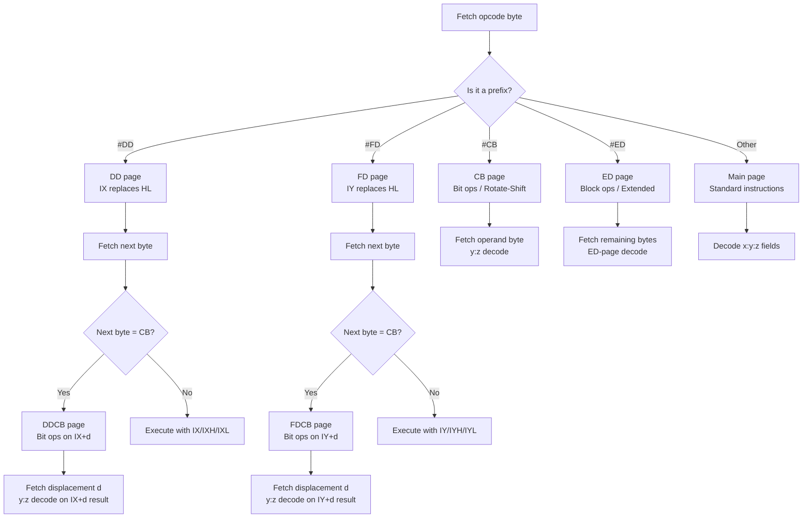
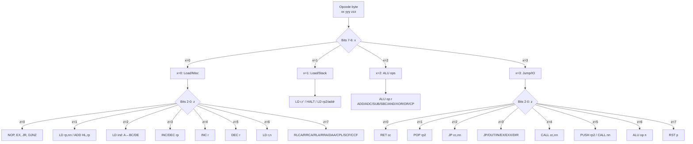
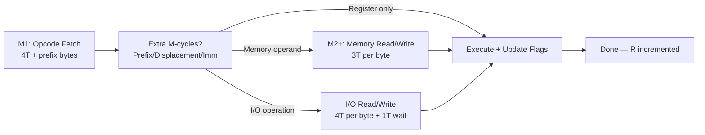

[← Plan](../PLAN.md) · [Z80 CPU](README.md)

# Z80 Instruction Set — Complete ISA, Opcode Encoding, Timing, and Instruction Groups

The Z80 has **698 unique documented instructions** (more counting undocumented ones), organized into a beautifully regular opcode matrix that an experienced programmer can decode by hand. The instruction set is a strict superset of the Intel 8080 — every 8080 program runs unmodified on the Z80 — extended with **index register instructions** (IX/IY), **bit manipulation** (SET, RES, BIT), **block operations** (LDIR, CPIR, OTIR, etc.), and **relocated arithmetic** (ADC HL, SBC HL, NEG). These extensions account for roughly half the instruction count and most of the Z80's competitive advantage over the 8080 and 6502.

The ISA is divided into **four opcode pages** accessed via prefix bytes: unprefixed (the main page), `CB` (bit/rotate), `ED` (extended block/control), and `DD`/`FD` (IX/IY index). Understanding this structure — how the opcode byte maps to registers and operations — makes the Z80 far easier to learn than it looks.

> [!NOTE]
> Undocumented instructions (SLL, `OUT (C),0`, IX/IY half-register access, etc.) are covered in [z80_undocumented.md](z80_undocumented.md). This article covers the **documented instruction set** only, with brief notes where undocumented instructions appear in the opcode matrix.

---

## ISA Overview

### Instruction Categories (Zilog UM0080 Classification)

| # | Category | Count (approx.) | Opcode Range | Prefix | Description |
|---|----------|-----------------|--------------|--------|-------------|
| 1 | 8-Bit Load | 63 | `#40`–`#7F`, scattered | — | Move bytes between registers and memory |
| 2 | 16-Bit Load | 22 | `#01,#11,#21,#31`, `ED` | ED | Load register pairs, stack operations |
| 3 | Exchange | 6 | `#08,#D9,#E3,#EB`, `DD/FD` | — | Swap register sets, stack/HL exchange |
| 4 | 8-Bit Arithmetic & Logic | 56 | `#80`–`#BF`, `#C6` etc. | — | ADD, ADC, SUB, SBC, AND, XOR, OR, CP |
| 5 | 16-Bit Arithmetic | 15 | `#09,#19,#29,#39`, `ED` | ED | ADD HL, ADC HL, SBC HL, INC/DEC rp |
| 6 | General-Purpose Arithmetic | 5 | `#27,#2F,#3F,#37`, `ED` | ED | DAA, CPL, CCF, SCF, NEG |
| 7 | Rotate & Shift | 22 | `#07/#0F/#17/#1F`, `CB` | CB | RLC, RRC, RL, RR, SLA, SRA, SRL |
| 8 | Bit Manipulation | 80 | `CB` | CB | BIT, SET, RES — 8 bits × 8 regs × 3 ops |
| 9 | Jump | 11 | `#C3,#18`, `#C2` etc. | — | JP, JR (conditional and unconditional) |
| 10 | Call & Return | 18 | `#CD,#C9`, `#C4` etc. | — | CALL, RET, RETI, RETN, RST |
| 11 | Input/Output | 12 | `#DB,#D3`, `ED` | ED | IN, OUT (single and block) |
| 12 | Block Transfer | 4 | `ED` | ED | LDI, LDD, LDIR, LDDR |
| 13 | Block Search | 4 | `ED` | ED | CPI, CPD, CPIR, CPDR |
| 14 | Block I/O | 8 | `ED` | ED | INI, IND, INIR, INDR, OUTI, OUTD, OTIR, OTDR |
| 15 | CPU Control | 8 | scattered, `ED` | ED | NOP, HALT, DI, EI, IM 0/1/2 |

### Total Instruction Count

| Page | Prefix | Valid Opcodes | Notes |
|------|--------|---------------|-------|
| Main | (none) | 252 | 4 are prefix bytes (`CB`,`DD`,`ED`,`FD`); `#76` = HALT |
| Bit/Rotate | `CB` | 256 | 64 rotate/shift + 192 bit operations (BIT/SET/RES) |
| Extended | `ED` | ~60 | Block ops, 16-bit ADC/SBC, NEG, RETI/RETN, IM, RLD/RRD |
| Index X | `DD` | mirrors main | Same instructions with IX replacing HL, (IX+d) replacing (HL) |
| Index Y | `FD` | mirrors main | Same instructions with IY replacing HL, (IY+d) replacing (HL) |
| Index+Bit | `DDCB`/`FDCB` | 256 | BIT/SET/RES on (IX+d)/(IY+d) — 4-byte opcodes |

---

## Opcode Encoding Structure

When the Z80 fetches an opcode byte, it first checks whether that byte is a **prefix** that redirects it to a different opcode page. The following decision tree shows how the Z80 determines which instruction to execute:



The Z80 opcode byte is divided into **three octal digits** (bit fields `x`, `y`, `z`) that map to operation, register, and addressing mode:

```
┌───┬───┬───┬───┬───┬───┬───┬───┐
│ 7 │ 6 │ 5 │ 4 │ 3 │ 2 │ 1 │ 0 │
├───┴───┼───┴───┴───┼───┴───┴───┤
│   x   │   | y     │   z   │   |
│       │ p │   q   │       │   |
└───────┴───┴───────┴───────┴───┘
```

| Field | Bits | Purpose |
|-------|------|---------|
| x | 7–6 | Major operation group (0=load/misc, 1=load/stack, 2=load/jump, 3=jump/IO, 4–7=ALU) |
| y | 5–3 | Sub-operation or destination register index |
| z | 2–0 | Source register or addressing mode |
| p | 5–4 | Register pair index (within y) |
| q | 3 | Selects between two sub-groups within p |

### Register Encoding Tables

These tables are used throughout the opcode matrix:

**Table r — 8-bit registers:**

| Index | 0 | 1 | 2 | 3 | 4 | 5 | 6 | 7 |
|-------|---|---|---|---|---|---|---|---|
| Register | B | C | D | E | H | L | (HL) | A |

**Table rp — 16-bit register pairs (with SP):**

| Index | 0 | 1 | 2 | 3 |
|-------|---|---|---|---|
| Register Pair | BC | DE | HL | SP |

**Table rp2 — 16-bit register pairs (with AF):**

| Index | 0 | 1 | 2 | 3 |
|-------|---|---|---|---|
| Register Pair | BC | DE | HL | AF |

**Table cc — Condition codes:**

| Index | 0 | 1 | 2 | 3 | 4 | 5 | 6 | 7 |
|-------|---|---|---|---|---|---|---|---|
| Condition | NZ | Z | NC | C | PO | PE | P | M |

**Table alu — Arithmetic/Logic operations:**

| Index | 0 | 1 | 2 | 3 | 4 | 5 | 6 | 7 |
|-------|---|---|---|---|---|---|---|---|
| Operation | ADD | ADC | SUB | SBC | AND | XOR | OR | CP |

**Table rot — Rotate/Shift operations (CB prefix):**

| Index | 0 | 1 | 2 | 3 | 4 | 5 | 6 | 7 |
|-------|---|---|---|---|---|---|---|---|
| Operation | RLC | RRC | RL | RR | SLA | SRA | SLL* | SRL |

> *Index 6 (SLL) is undocumented. See [z80_undocumented.md](z80_undocumented.md).

**Table im — Interrupt modes (ED prefix, y decode):**

| Index | 0 | 1 | 2 | 3 | 4 | 5 | 6 | 7 |
|-------|---|---|---|---|---|---|---|---|
| Mode | 0 | 0/1* | 1 | 2 | 0 | 0/1* | 1 | 2 |

> *Indices 1 and 5 set an undefined interrupt mode. See [z80_undocumented.md](z80_undocumented.md).

### Complete x:y:z Decode Rules

The unprefixed opcode byte decodes as follows. After reading the opcode, the Z80 knows whether to expect a displacement byte `d` (signed 8-bit) and/or immediate data `n` (unsigned 8-bit) or `nn` (unsigned 16-bit, stored LSB first).



The unprefixed opcode byte decodes as follows. After reading the opcode, the Z80 knows whether to expect a displacement byte `d` (signed 8-bit) and/or immediate data `n` (unsigned 8-bit) or `nn` (unsigned 16-bit, stored LSB first).

| x | z | Condition | Instruction | Operands | Opcode Range |
|---|---|-----------|-------------|----------|-------------|
| 0 | 0 | q=0 | `NOP` | | `00` |
| 0 | 0 | q=1, p=0 | `EX AF,AF'` | | `08` |
| 0 | 0 | q=1, p=1 | `DJNZ d` | | `10 d` |
| 0 | 0 | q=1, p=2 | `JR d` | | `18 d` |
| 0 | 0 | q=1, p=3 | `JR cc[d-4],d` | NZ,Z,NC,C only | `20/28/30/38 d` |
| 0 | 1 | q=0 | `LD rp[p],nn` | | `01/11/21/31 lo hi` |
| 0 | 1 | q=1 | `ADD HL,rp[p]` | | `09/19/29/39` |
| 0 | 2 | q=0 | `LD (rp[p]),A` | BC,DE only | `02/12` |
| 0 | 2 | q=1 | `LD A,(rp[p])` | BC,DE only | `0A/1A` |
| 0 | 3 | q=0 | `INC rp[p]` | | `03/13/23/33` |
| 0 | 3 | q=1 | `DEC rp[p]` | | `0B/1B/2B/3B` |
| 0 | 4 | | `INC r[y]` | | `04/0C/14/1C/24/2C/34/3C` |
| 0 | 5 | | `DEC r[y]` | | `05/0D/15/1D/25/2D/35/3D` |
| 0 | 6 | | `LD r[y],n` | | `06/0E/16/1E/26/2E/36/3E n` |
| 1 | any | | see below | | `40`–`7F` |
| 2 | 0 | q=0 | `LD (nn),HL` | | `22 lo hi` |
| 2 | 0 | q=1 | `LD HL,(nn)` | | `2A lo hi` |
| 2 | 2 | q=0 | `LD (nn),A` | | `32 lo hi` |
| 2 | 2 | q=1 | `LD A,(nn)` | | `3A lo hi` |
| 3 | 0 | q=0, y=6 | `SCF` | | `37` |
| 3 | 0 | q=0, y≠6 | See above | | |
| 3 | 0 | q=1, y=0 | `CCF` | | `3F` |
| 3 | 0 | q=1, y=1 | `SCF` | | `37` |
| 3 | 7 | | `RLA/RLCA/RLC/RLCA` by y | | `07/0F/17/1F/27/2F/37/3F` |
| 4–7 | | | `alu[y] A,r[z]` | | `80`–`BF` |

**x=1 (`40`–`7F`): The 8×8 Load Matrix**

`LD r[y],r[z]` — except `#76` = HALT (y=6, z=6, which would be `LD (HL),(HL)`).

Opcode formula: `#40 + y×8 + z`. Every combination is valid including `LD r,r` (self-load = NOP equivalent, except HALT).

**x=2, z=1: 16-bit indirect stores/loads**

| y | q | Instruction | Notes |
|---|---|-------------|-------|
| 0 | 0 | `LD (nn),HL` | 3 bytes, 16T, no ED prefix |
| 0 | 1 | `LD HL,(nn)` | 3 bytes, 16T, no ED prefix |
| 2 | 0 | `LD (nn),A` | 3 bytes, 13T |
| 2 | 1 | `LD A,(nn)` | 3 bytes, 13T |

All other (y,z) combinations in x=2 are covered by the rows above.

**x=3, rows `C0`–`FF`: Jump/Call/Return/Control**

| z | Instruction Pattern | |
|---|---------------------|--|
| 0 | `RET cc[y]` | `C0/C8/D0/D8/E0/E8/F0/F8` |
| 1 | `POP rp2[p]` / special | `C1=POP BC, D1=POP DE, E1=POP HL, F1=POP AF` |
| 2 | `JP cc[y],nn` | 3 bytes |
| 3 | See below | Varies by p |
| 4 | `CALL cc[y],nn` | 3 bytes |
| 5 | `PUSH rp2[p]` / special | `C5=PUSH BC, D5=PUSH DE, E5=PUSH HL, F5=PUSH AF` |
| 6 | `alu[y] A,n` | Immediate ALU — 2 bytes |
| 7 | `RST y×8` | Single-byte call to `00/08/10/18/20/28/30/38` |

z=3 special cases by p:
| p | q=0 | q=1 |
|---|-----|-----|
| 0 | `JP nn` | `CB` prefix |
| 1 | `OUT (n),A` | `IN A,(n)` |
| 2 | `EX (SP),HL` | `EX DE,HL` |
| 3 | `DI` | `EI` |

z=5 special cases by p:
| p | q=0 | q=1 |
|---|-----|-----|
| 0 | `PUSH BC` | — |
| 1 | `PUSH DE` | — |
| 2 | `PUSH HL` | — |
| 3 | `PUSH AF` | — |

z=1 special cases for p=2 (q=1): `EXX` (`D9`). z=1 for p=3 (q=1): `LD SP,HL` (`F9`, 6T, 1 byte).

**ED Prefix Decode (x, y, z fields)**

| x | Instruction | Operands | Opcode |
|---|-------------|----------|--------|
| 0 | `IN r[y],(C)` | y≠6 | `ED 40+y` |
| 0 | `OUT (C),r[y]` | y≠6 | `ED 41+y` |
| 0 | `SBC HL,rp[p]` | q=0 | `ED 42/52/62/72` |
| 0 | `ADC HL,rp[p]` | q=1 | `ED 4A/5A/6A/7A` |
| 0 | `LD (nn),rp[p]` | q=0 | `ED 43/53/63/73 nn nn` |
| 0 | `LD rp[p],(nn)` | q=1 | `ED 4B/5B/6B/7B nn nn` |
| 1 | `NEG` | | `ED 44` (and duplicates) |
| 1 | `RETN` | | `ED 45` |
| 1 | `IM 0` | | `ED 46` |
| 1 | `LD I,A` | | `ED 47` |
| 1 | `RETI` | | `ED 4D` |
| 1 | `IM 1` | | `ED 56` |
| 1 | `LD A,I` | | `ED 57` |
| 1 | `IM 2` | | `ED 5E` |
| 1 | `LD R,A` | | `ED 4F` |
| 1 | `LD A,R` | | `ED 5F` |
| 1 | `RRD` | | `ED 67` |
| 1 | `RLD` | | `ED 6F` |
| 2 | `bli[y,z]` | Block instruction | See table below |
| 3 | `bli[y,z]` | Block instruction | See table below |

**Block Instruction Decode Table (bli)**

The ED prefix encodes block instructions in a 4×4 pattern indexed by `[y-4, z]`:

| y \ z | 0 | 1 | 2 | 3 |
|-------|---|---|---|---|
| 4 | `LDI` `ED A0` | `CPI` `ED A1` | `INI` `ED A2` | `OUTI` `ED A3` |
| 5 | `LDD` `ED A8` | `CPD` `ED A9` | `IND` `ED AA` | `OUTD` `ED AB` |
| 6 | `LDIR` `ED B0` | `CPIR` `ED B1` | `INIR` `ED B2` | `OTIR` `ED B3` |
| 7 | `LDDR` `ED B8` | `CPDR` `ED B9` | `INDR` `ED BA` | `OTDR` `ED BB` |

The pattern: z selects the **type** (load, compare, input, output), y-4 selects the **direction** (incrementing, decrementing, repeating-incrementing, repeating-decrementing). Non-repeating instructions have y-4 < 2; repeating versions have y-4 ≥ 2.

---

## Instruction Groups — Detailed Reference

Every Z80 instruction follows the same execution pipeline — only the number and type of machine cycles vary:



### 1. 8-Bit Load Group

Move a single byte between registers, or between a register and memory. These instructions **never affect flags**.

#### Register-to-Register: `LD r,r'` — 4 T-states, 1 byte

```z80
LD   A,B          ; A ← B — 4T, #78
LD   D,L          ; D ← L — 4T, #55
LD   A,A          ; NOP equivalent — 4T, #7F
```

The entire `#40`–`#7F` range is the 8×8 matrix of `LD r,r'` instructions. Opcode = `#40 + dst×8 + src`.

#### Immediate: `LD r,n` — 7 T-states, 2 bytes

```z80
LD   A,#42        ; A ← #42 — 7T, #3E 42
LD   B,#FF        ; B ← #FF — 7T, #06 FF
```

#### Indirect HL: `LD r,(HL)` / `LD (HL),r` — 7 T-states, 1 byte

```z80
LD   A,(HL)       ; A ← memory[HL] — 7T, #7E
LD   (HL),B       ; memory[HL] ← B — 7T, #70
LD   (HL),#42     ; memory[HL] ← #42 — 10T, #36 42
```

#### Indexed: `LD r,(IX+d)` / `LD (IX+d),r` — 19 T-states

```z80
LD   A,(IX+#05)   ; A ← memory[IX+5] — 19T, DD 7E 05 (3 bytes)
LD   (IY+#10),B   ; memory[IY+16] ← B — 19T, FD 70 10 (3 bytes)
LD   (IX+#00),#FF ; memory[IX+0] ← #FF — 19T, DD 36 00 FF (4 bytes)
```

> [!WARNING]
> Indexed instructions cost **19 T-states** vs. **7 T-states** for `(HL)` — nearly 3× slower. Use HL whenever possible; reserve IX/IY for cases where you genuinely need a fixed base address plus variable offset.

#### Extended Address: `LD A,(nn)` / `LD (nn),A` — 13 T-states, 3 bytes

```z80
LD   A,(#4000)    ; A ← memory[#4000] — 13T, #3A 00 40
LD   (#C000),A    ; memory[#C000] ← A — 13T, #32 00 C0
```

> Only A can be loaded from/stored to an absolute address directly. For other registers, use `LD HL,nn` + `LD r,(HL)` or the `ED`-prefixed `LD rp,(nn)`.

#### Special Register Transfers

These instructions move data between A and the I/R system registers:

| Instruction | Opcode | T-states | Bytes | Flags |
|-------------|--------|----------|-------|-------|
| `LD I,A` | `ED 47` | 9 | 2 | None |
| `LD A,I` | `ED 57` | 9 | 2 | S,Z,H=0,P/V=IFF2; N=0 |
| `LD R,A` | `ED 4F` | 9 | 2 | None |
| `LD A,R` | `ED 5F` | 9 | 2 | S,Z,H=0,P/V=IFF2; N=0 |

> `LD A,I` and `LD A,R` copy IFF2 into P/V — this is the **only documented way to read interrupt state**. Since P/V = IFF2, you can save interrupt state before an NMI and restore it later. See [z80_interrupts.md](z80_interrupts.md).
>
> The R register reads include bit 7 as written by `LD R,A` (not the incrementing counter bit). R[6:0] increments with each instruction fetch. See [z80_undocumented.md](z80_undocumented.md#8-r-register-behavior) for R's undocumented increment behavior.

---

### 2. 16-Bit Load Group

#### Immediate: `LD rp,nn` — 10 T-states, 3 bytes

```z80
LD   BC,#4000     ; BC ← #4000 — 10T, #01 00 40
LD   HL,#5C00     ; HL ← #5C00 — 10T, #21 00 5C
LD   SP,#FFFE     ; SP ← #FFFE — 10T, #31 FE FF
```

#### Extended Address: `LD rp,(nn)` / `LD (nn),rp` — 20 T-states (ED prefix)

```z80
LD   BC,(#C000)   ; BC ← memory[#C000..#C001] — 20T, ED 4B 00 C0 (little-endian)
LD   (#C000),HL   ; memory[#C000..#C001] ← HL — 16T, #22 00 C0 (no ED prefix for HL!)
LD   (#C000),DE   ; memory[#C000..#C001] ← DE — 20T, ED 53 00 C0 (ED prefix)
```

> [!NOTE]
> `LD (nn),HL` and `LD HL,(nn)` are on the main page (no ED prefix, 16T, 3 bytes). All other register pairs require the ED prefix (20T, 4 bytes). This is a historical artifact — HL was the "primary" pointer.

#### Stack Operations: `PUSH rp2` / `POP rp2`

```z80
PUSH AF           ; SP-=2; memory[SP]=F, memory[SP+1]=A — 11T
POP  BC           ; B=memory[SP+1], C=memory[SP]; SP+=2 — 10T
```

| Instruction | T-states | Bytes | Notes |
|-------------|----------|-------|-------|
| `PUSH rp2` | 11 | 1 | Decrement SP by 2, store high byte first |
| `POP rp2` | 10 | 1 | Load low byte first, increment SP by 2 |

#### LD SP,HL — 6 T-states, 1 byte (`#F9`)

```z80
LD   SP,HL         ; SP ← HL — 6T, 1 byte — fastest way to set SP
```

> `LD SP,HL` copies HL to SP in just 6T — invaluable for relocatable stacks. Combined with `ADD HL,DE` you can allocate stack frames dynamically.

---

### 3. Exchange Group

| Instruction | Operation | T-states | Bytes | Notes |
|-------------|-----------|----------|-------|-------|
| `EX DE,HL` | DE ↔ HL | 4 | 1 | Fast swap — much cheaper than three `LD` instructions |
| `EX AF,AF'` | AF ↔ AF' | 4 | 1 | Fast flag/accumulator save — essential for ISRs |
| `EXX` | BC↔BC', DE↔DE', HL↔HL' | 4 | 1 | Swap all three register pairs at once |
| `EX (SP),HL` | HL ↔ (SP) | 19 | 1 | HL gets return address; stack gets HL |
| `EX (SP),IX` | IX ↔ (SP) | 23 | 2 | DD prefix version |
| `EX (SP),IY` | IY ↔ (SP) | 23 | 2 | FD prefix version |

```z80
; Minimal ISR using shadow registers
EX   AF,AF'      ; Save AF — 4T, #08
EXX               ; Save BC, DE, HL — 4T, #D9
; ... handle interrupt ...
EXX               ; Restore BC, DE, HL — 4T, #D9
EX   AF,AF'      ; Restore AF — 4T, #08
EI                ; Re-enable interrupts — 4T, #FB
RETI              ; Return — 14T, ED 4D
; Total overhead: 30T — faster than PUSH/POP (42T minimum)
```

---

### 4. 8-Bit Arithmetic & Logic Group

All 8-bit ALU operations follow the same pattern: **`OP A,src`** where src can be any of the eight entries in table `r` (B, C, D, E, H, L, (HL), A) or an immediate byte `n`.

#### The Eight ALU Operations

| Index | Mnemonic | Operation | Flag N | Flag C |
|-------|----------|-----------|--------|--------|
| 0 | `ADD A,src` | A = A + src | 0 | Carry out |
| 1 | `ADC A,src` | A = A + src + C | 0 | Carry out |
| 2 | `SUB src` | A = A − src | 1 | Borrow |
| 3 | `SBC A,src` | A = A − src − C | 1 | Borrow |
| 4 | `AND src` | A = A AND src | 0 | Always 0 |
| 5 | `XOR src` | A = A XOR src | 0 | Always 0 |
| 6 | `OR src` | A = A OR src | 0 | Always 0 |
| 7 | `CP src` | A − src (discard) | 1 | Borrow |

All flags are updated: **S, Z, H, P/V, N, C**. See [z80_flags.md](z80_flags.md) for detailed flag behavior.

#### Timing

| Source | T-states | Bytes |
|--------|----------|-------|
| Register `r` | 4 | 1 |
| `(HL)` | 7 | 1 |
| Immediate `n` | 7 | 2 |
| `(IX+d)` / `(IY+d)` | 19 | 3 |

#### INC / DEC — 8-Bit

Increment and decrement a single byte. **All flags updated except Carry** (C is preserved).

```z80
INC  A            ; A = A + 1 — 4T, #3C, flags S,Z,H,P/V set, C unchanged
DEC  B            ; B = B - 1 — 4T, #05, same flag rules
INC  (HL)         ; memory[HL] += 1 — 11T, #34 (read-modify-write)
DEC  (IX+#05)     ; memory[IX+5] -= 1 — 23T, DD 35 05 (3 bytes)
```

> [!WARNING]
> `INC` and `DEC` do **not** update the Carry flag. This is intentional — it lets you use `INC/DEC` as loop counters inside multi-precision arithmetic sequences without disturbing the carry chain. If you need C updated, use `ADD A,1` or `SUB 1` instead.

---

### 5. 16-Bit Arithmetic Group

#### ADD HL,rp — 11 T-states (flags partially updated)

```z80
ADD  HL,BC        ; HL = HL + BC — 11T, #09, 1 byte
ADD  HL,DE        ; HL = HL + DE — 11T, #19
ADD  HL,HL        ; HL = HL × 2 — 11T, #29 (fast left shift!)
ADD  HL,SP        ; HL = HL + SP — 11T, #39
```

Flags: H = carry from bit 11, N = 0, C = carry from bit 15. **S, Z, P/V unchanged.**

> `ADD HL,HL` is a **16-bit left shift** in 11 T-states — the fastest way to double HL. Compare to 16-bit rotate through carry which costs more.

#### ADC HL,rp / SBC HL,rp — 15 T-states (ED prefix, all flags updated)

```z80
ADC  HL,BC        ; HL = HL + BC + C — 15T, ED 4A, 2 bytes
SBC  HL,DE        ; HL = HL − DE − C — 15T, ED 52, 2 bytes
```

**All six flags updated** — S, Z, H, P/V (overflow), N, C. These are the only 16-bit operations that fully update flags, making them essential for multi-precision arithmetic.

#### INC rp / DEC rp — 6 T-states (no flags affected)

```z80
INC  BC           ; BC = BC + 1 — 6T, no flags at all
DEC  HL           ; HL = HL - 1 — 6T, no flags at all
```

> [!WARNING]
> 16-bit `INC`/`DEC` affect **no flags whatsoever**. To test if BC reached zero after `DEC BC`, you must check B and C separately (`LD A,B / OR C / JR NZ,...`).

---

### 6. General-Purpose Arithmetic

| Instruction | Operation | T-states | Bytes | Flags |
|-------------|-----------|----------|-------|-------|
| `DAA` | BCD adjust accumulator | 4 | 1 (`#27`) | S,Z,H,P/V,C updated; N unchanged |
| `CPL` | A = NOT A (complement) | 4 | 1 (`#2F`) | H=1, N=1; S,Z,P/V,C unchanged |
| `NEG` | A = 0 − A (negate) | 8 | 2 (`ED 44`) | All flags updated; C=1 unless A was 0 |
| `CCF` | C = NOT C (complement carry) | 4 | 1 (`#3F`) | H=old C, N=0, C=inverted |
| `SCF` | C = 1 (set carry) | 4 | 1 (`#37`) | H=0, N=0, C=1 |

See [z80_flags.md](z80_flags.md) for DAA correction table and BCD examples.

---

### 7. Rotate & Shift Group

#### Single-byte Accumulator Rotates (no CB prefix, 4 T-states)

| Instruction | Opcode | Operation | Flags |
|-------------|--------|-----------|-------|
| `RLCA` | `#07` | Rotate A left through C (9-bit rotate) | C=old bit 7; H=0, N=0; S,Z,P/V unchanged |
| `RRCA` | `#0F` | Rotate A right through C | C=old bit 0; H=0, N=0 |
| `RLA` | `#17` | Rotate A left through carry | C=old bit 7; H=0, N=0 |
| `RRA` | `#1F` | Rotate A right through carry | C=old bit 0; H=0, N=0 |

> These 4 instructions are inherited from the 8080 and are **faster** (4T vs. 8T) than their CB-prefixed equivalents (`RLC A`, `RRC A`, `RL A`, `RR A`). Use these when operating on A.

#### CB-Prefixed Rotates and Shifts (8 T-states for register, 15 for (HL))

| Instruction | Operation | C gets |
|-------------|-----------|--------|
| `RLC r` | Rotate left circular (bit 7→bit 0 and C) | Old bit 7 |
| `RRC r` | Rotate right circular (bit 0→bit 7 and C) | Old bit 0 |
| `RL r` | Rotate left through carry | Old bit 7 |
| `RR r` | Rotate right through carry | Old bit 0 |
| `SLA r` | Shift left arithmetic (bit 0 = 0) | Old bit 7 |
| `SRA r` | Shift right arithmetic (bit 7 preserved) | Old bit 0 |
| `SRL r` | Shift right logical (bit 7 = 0) | Old bit 0 |

All flags updated: S, Z, H=0, P/V (parity), N=0, C.

> `SLA` is a **multiply by 2**. `SRA` is a **signed divide by 2**. `SRL` is an **unsigned divide by 2**.

#### RLD / RRD — 18 T-states (ED prefix)

```z80
RLD               ; ED 6F — Rotate low nibble of (HL) into A's low nibble, A's low nibble into (HL)'s high nibble
RRD               ; ED 67 — Reverse direction
```

These are **BCD digit rotations** between A and (HL). A's upper nibble is preserved. Flags S, Z, P/V set on A.

---

### 8. Bit Manipulation Group (CB prefix)

Three operations on any bit (0–7) of any register or (HL):

| Instruction | Operation | T-states (reg) | T-states ((HL)) | Flags |
|-------------|-----------|----------------|------------------|-------|
| `BIT b,r` | Test bit b of r | 8 | 12 | Z = NOT tested bit; S (special); H=1; P/V=Z |
| `SET b,r` | Set bit b of r | 8 | 15 | None affected |
| `RES b,r` | Reset bit b of r | 8 | 15 | None affected |

```z80
BIT  7,A          ; Test bit 7 of A — Z=0 if bit is set
JR   Z,bit_is_zero ; Jump if bit 7 was 0

SET  0,B          ; Set bit 0 of B — B = B OR #01
RES  7,(HL)       ; Clear bit 7 of (HL) — memory[HL] = memory[HL] AND #7F
```

> [!NOTE]
> `BIT` sets Z to the **complement** of the tested bit. `BIT 0,A` with A=`#01` clears Z (the bit IS set, so Z = NOT 1 = 0). This is by design: `JR Z,bit_clear` reads naturally.

---

### 9. Jump Group

#### Unconditional Jumps

| Instruction | Taken | Not Taken | Bytes | Condition |
|-------------|-------|-----------|-------|-----------|
| `JP nn` | 10 | — | 3 (`C3 nn nn`) | Absolute jump |
| `JP (HL)` | 4 | — | 1 (`E9`) | Indirect — fastest jump, no flags |
| `JP (IX)` | 8 | — | 2 (`DD E9`) | DD prefix |
| `JP (IY)` | 8 | — | 2 (`FD E9`) | FD prefix |
| `JR e` | 12 | — | 2 (`18 d`) | Relative jump — signed displacement |

#### Conditional Jumps

| Instruction | Taken | Not Taken | Bytes | Condition |
|-------------|-------|-----------|-------|-----------|
| `JP cc,nn` | 10 | 10 | 3 | Any of 8 conditions |
| `JR cc,e` | 12 | 7 | 2 | NZ, Z, NC, C only |
| `DJNZ e` | 13 | 8 | 2 | B−1; jump if B≠0 |

> `JR` is **2 bytes** and **faster when not taken** (7T vs. 10T for JP). Prefer `JR` for short forward/backward branches. `JP` is needed for long-range jumps and conditions PO/PE/P/M (which JR doesn't support).

#### DJNZ — Decrement and Jump if Not Zero

```z80
LD   B,#32        ; Counter
loop:
; ... do something ...
DJNZ loop         ; B--; if B≠0 jump to loop — 13T taken, 8T not taken
```

> `DJNZ` only uses B as the counter. If you need a 16-bit loop counter, use `DEC BC / LD A,B / OR C / JR NZ,loop`.

---

### 10. Call & Return Group

| Instruction | Taken | Not Taken | Bytes | Notes |
|-------------|-------|-----------|-------|-------|
| `CALL nn` | 17 | — | 3 (`CD nn nn`) | Push PC, jump |
| `CALL cc,nn` | 17 | 10 | 3 | Conditional call |
| `RET` | 10 | — | 1 (`C9`) | Pop PC |
| `RET cc` | 11 | 5 | 1 | Conditional return |
| `RETI` | 14 | — | 2 (`ED 4D`) | Return from interrupt (signals Z80 peripherals) |
| `RETN` | 14 | — | 2 (`ED 45`) | Return from NMI (copies IFF2→IFF1) |
| `RST p` | 11 | — | 1 | Call to fixed address (#00,#08,#10,#18,#20,#28,#30,#38) |

`RST` is a single-byte call to one of 8 fixed addresses — the fastest way to call a subroutine. The opcode encodes the target in bits 3–5: `RST p` = `C7 + p` where p is the vector address.

```z80
RST  #08          ; Call #0008 — error-1 entry in 48K ROM
RST  #10          ; Call #0010 — print character in A
RST  #18          ; Call #0018 — get character
RST  #20          ; Call #0020 — test for specific characters
RST  #28          ; Call #0028 — floating-point calculator
RST  #30          ; Call #0030 — BC spaces
RST  #38          ; Call #0038 — IM 1 interrupt vector
```

---

### 11. Block Transfer Group (ED prefix)

| Instruction | Operation | T-states | Repeat? |
|-------------|-----------|----------|---------|
| `LDI` | (DE) ← (HL); DE++; HL++; BC−− | 16 | No |
| `LDD` | (DE) ← (HL); DE−−; HL−−; BC−− | 16 | No |
| `LDIR` | Same as LDI, repeat until BC=0 | 21/16 | Yes |
| `LDDR` | Same as LDD, repeat until BC=0 | 21/16 | Yes |

**21 T-states** when repeating (BC≠0), **16 T-states** on the final iteration (BC=0).

Throughput: **21 T-states per byte at 3.5 MHz = ~166 KB/s**. Compare to a manual `LDI` loop which costs ~26T per byte.

Flags: H=0, N=0, P/V = (BC≠0 after decrement), C and S/Z unchanged.

```z80
; Copy 6912 bytes (full screen) from #C000 to #4000
LD   HL,#C000     ; Source
LD   DE,#4000     ; Destination
LD   BC,#1B00     ; 6912 bytes
LDIR               ; Block copy — ~145,152 T-states at 21T/byte
```

---

### 12. Block Search Group (ED prefix)

| Instruction | Operation | T-states | Repeat? |
|-------------|-----------|----------|---------|
| `CPI` | A − (HL); HL++; BC−− | 16 | No |
| `CPD` | A − (HL); HL−−; BC−− | 16 | No |
| `CPIR` | Same as CPI, repeat until BC=0 or A=(HL) | 21/16 | Yes |
| `CPDR` | Same as CPD, repeat until BC=0 or A=(HL) | 21/16 | Yes |

Flags: S (sign of A−(HL)), Z (A=(HL)?), H (half-borrow), P/V (BC≠0), N=1, C unchanged.

```z80
; Find first #FF byte in a 256-byte table at #8000
LD   A,#FF
LD   HL,#8000
LD   BC,#0100
CPIR               ; Z=1 if found; HL = address after match
```

---

### 13. Block I/O Group (ED prefix)

| Instruction | Operation | T-states | Repeat? |
|-------------|-----------|----------|---------|
| `INI` | (C) → (HL); HL++; B−− | 16 | No |
| `IND` | (C) → (HL); HL−−; B−− | 16 | No |
| `INIR` | Same as INI, repeat until B=0 | 21/16 | Yes |
| `INDR` | Same as IND, repeat until B=0 | 21/16 | Yes |
| `OUTI` | (HL) → (C); HL++; B−− | 16 | No |
| `OUTD` | (HL) → (C); HL−−; B−− | 16 | No |
| `OTIR` | Same as OUTI, repeat until B=0 | 21/16 | Yes |
| `OTDR` | Same as OUTD, repeat until B=0 | 21/16 | Yes |

> [!WARNING]
> Block I/O instructions use **B as both counter and data register** (on output, B is decremented and the new B value may be output on the next iteration). Maximum transfer size is **256 bytes** (B wraps from 1→0 to terminate). The port address is in register C (with B on the high byte of the address bus).

---

### 14. Input/Output Group

#### Single-Byte I/O

| Instruction | Operation | T-states | Port Address |
|-------------|-----------|----------|--------------|
| `IN A,(n)` | A ← port(n) | 11 | A←bus high, n←bus low (A is on high byte!) |
| `OUT (n),A` | port(n) ← A | 11 | Same as IN — A on high byte |
| `IN r,(C)` | r ← port(BC) | 12 | Full BC on address bus |
| `OUT (C),r` | port(BC) ← r | 12 | Full BC on address bus |

```z80
; Read keyboard on ZX Spectrum 48K
LD   A,#7F        ; High byte of port address
IN   A,(#FE)      ; Read port #FE (with A=#7F on high bus = #7FFE)
; A now contains keyboard row data (active low)

; Read using IN r,(C) — full 16-bit port address in BC
LD   BC,#7FFE     ; Port address in BC
IN   A,(C)        ; Read port #7FFE into A — 12T
```

> [!NOTE]
> `IN A,(n)` puts the **current A value on the high byte** of the address bus. This means the effective port address is `A×256 + n`. On the ZX Spectrum, programmers exploit this to select keyboard rows by setting A before `IN A,(#FE)`. See [z80_addressing.md](z80_addressing.md) for full I/O port decoding details.

---

### 15. CPU Control Group

| Instruction | Operation | T-states | Bytes | Opcode |
|-------------|-----------|----------|-------|--------|
| `NOP` | No operation | 4 | 1 | `#00` |
| `HALT` | Halt CPU until interrupt | 4+ | 1 | `#76` |
| `DI` | Disable interrupts (IFF1=IFF2=0) | 4 | 1 | `#F3` |
| `EI` | Enable interrupts (IFF1=IFF2=1) | 4 | 1 | `#FB` |
| `IM 0` | Set interrupt mode 0 | 8 | 2 | `ED 46` |
| `IM 1` | Set interrupt mode 1 | 8 | 2 | `ED 56` |
| `IM 2` | Set interrupt mode 2 | 8 | 2 | `ED 5E` |

> `EI` does not take effect until **one instruction after EI** executes. This guarantees that `EI` + `RETI` executes as a pair — the return completes before the next interrupt can fire. See [z80_interrupts.md](z80_interrupts.md) for details.

#### HALT — Special Behavior

`HALT` (`#76`) suspends instruction execution but the CPU continues to perform **internal NOP cycles** (4 T-states each). These internal NOPs:

- Increment the **R register** (refresh counter continues)
- Drive the **memory refresh cycle** (RFSH signal active)
- Are subject to **memory contention** on the ZX Spectrum — the ULA sees the refresh accesses
- Count toward **frame timing** — HALT does not "stop time"

The CPU exits HALT when an interrupt (maskable or NMI) is accepted. On the ZX Spectrum 48K with IM 1, the 50Hz interrupt wakes the CPU every ~19,968 T-states.

---

## Performance Reference

### T-State Summary by Instruction Type

| Category | Register | (HL) | Immediate | (IX+d) |
|----------|----------|------|-----------|--------|
| 8-bit Load | 4 | 7 | 7 | 19 |
| 8-bit ALU | 4 | 7 | 7 | 19 |
| INC/DEC 8-bit | 4 | 11 | — | 23 |
| Rotate/Shift (CB) | 8 | 15 | — | 23 |
| BIT/SET/RES (CB) | 8 | 12/15 | — | 20 |

### Instruction Size Summary

| Bytes | Typical Instructions |
|-------|---------------------|
| 1 | Register ops, accumulator rotates, RST, RET, INC/DEC rp, EX |
| 2 | Immediate 8-bit ops, JR, CB prefix ops, ED prefix ops, DD/FD prefix + register op |
| 3 | Immediate 16-bit loads, JP nn, CALL nn, DD/FD + (IX+d) register ops |
| 4 | ED + immediate 16-bit store (`LD (nn),rp`), DDCB/FDCB bit ops |

### Common Performance Patterns

| Pattern | T-states | Faster Alternative |
|---------|----------|--------------------|
| `LD A,0` (2 bytes, 7T) | 7 | `XOR A` (1 byte, 4T) — same result |
| `LD A,0FF` (2 bytes, 7T) | 7 | `OR #FF` on A=0 (nope — same cost). `CPL` after `XOR A` (2 bytes, 8T) — longer! |
| `ADD HL,HL` (11T) | 11 | 16-bit left shift — no faster way |
| `LD B,0 / DJNZ loop` | 13/8 | Faster than `DEC B / JR NZ` (12/7) for 8-bit loops? No — DJNZ is 1 byte less |
| `PUSH/POP pair` | 21 | `EXX` (4T) — if shadow registers are available |
| `LDIR` for N bytes | ~21N | Manual LDI loop: ~26N — LDIR always wins for raw copy |

---

## Practical Examples

### Fast Memory Fill Using LDIR

```z80
; Fill #4000–#57FF (6144 bytes = pixel area) with #FF
LD   HL,#4000     ; Destination
LD   (HL),#FF     ; Set first byte
LD   DE,#4001     ; Source = destination + 1
LD   BC,#17FF     ; 6143 remaining bytes
LDIR               ; Copy byte forward — fills all with #FF
```

### Bit-Manipulation Utilities

```z80
; Test if bit 5 of memory[HL] is set
LD   A,(HL)
BIT  5,A
JR   Z,bit5_clear ; Z=1 means bit was 0

; Set bits 0 and 7 of B, clear bits 3 and 4
SET  0,B
SET  7,B
RES  3,B
RES  4,B
```

### 16-Bit Multiplication by Repeated Addition

```z80
; HL = DE × B (simple multiply, B iterations)
XOR  A            ; Clear A
LD   H,A
LD   L,A          ; HL = 0
mult:
ADD  HL,DE        ; HL += DE — 11T
DJNZ mult         ; B--; loop if B≠0 — 13T/8T
; Total: 11 + 24×(11+13) - 5 = 11 + 576 - 5 = 582T for B=24
```

### I/O Port Read with Full Address

```z80
; Read ZX Spectrum 48K keyboard — row 1-5 (keys Q-T)
LD   A,#FD        ; A = #FD (bit 1 = 0, selects row Q-T)
IN   A,(#FE)      ; Read port with A on high byte → port #FDFE
; Bits 0-4 of A now contain keys Q,W,E,R,T (active low)
BIT  0,A          ; Test Q key — Z=1 if Q is pressed
JR   Z,q_pressed
```

---

## Decision Guide

### Which Jump Instruction?

```
                     ┌─────────────────┐
                     │ Need to jump?   │
                     └────────┬────────┘
                              │
                  ┌───────────┴───────────┐
                  │ Range within ±126?    │
                  └───────┬───────────────┘
                    Yes   │   No
               ┌──────────┴──────────┐
               │ JR cc (NZ,Z,NC,C)   │ JP cc (all 8 conditions)
               │ 2 bytes, 12/7T      │ 3 bytes, 10T
               └─────────────────────┘
```

### HL vs IX/IY?

| Criterion | HL | IX/IY |
|-----------|----|----|
| Speed | 7T for (HL) | 19T for (IX+d) |
| Code size | 1 byte for `LD r,(HL)` | 3 bytes for `LD r,(IX+d)` |
| Flexibility | Must update HL for different offsets | Fixed base + variable displacement |
| When to use | Tables, buffers, sequential access | Structures, fixed base + field offset |

### When to Use Each ALU Operation?

| Operation | Use When |
|-----------|----------|
| `ADD/ADC` | Unsigned arithmetic, multi-precision |
| `SUB/SBC` | Unsigned subtraction, multi-precision |
| `AND` | Mask bits (AND #0F = keep low nibble), test specific bits |
| `OR` | Set bits (OR #80 = set bit 7), combine flags |
| `XOR` | Toggle bits, fastest way to zero A (`XOR A`) |
| `CP` | Compare without modifying A — use before conditional jumps |

---

## Best Practices

1. **Use `XOR A` to zero A** — 1 byte, 4 T-states vs. `LD A,0` at 2 bytes, 7 T-states.
2. **Use `EXX` + `EX AF,AF'` for fast register save in ISRs** — 8 T-states total vs. 42 T-states for four PUSH instructions.
3. **Prefer `JR` over `JP` for short branches** — saves 1 byte and is faster when not taken (7T vs. 10T).
4. **Use `ADD HL,HL` as a 16-bit left shift** — faster than any other 16-bit multiply-by-2 method.
5. **Use `LDIR` for block copies** — don't write manual loops; LDIR is faster and smaller.
6. **Use `CP` for comparisons** — sets all flags without modifying A.
7. **Prefer `(HL)` over `(IX+d)`** in tight loops — 7T vs. 19T is a 2.7× speed difference.
8. **Use `RST` vectors** for frequently called routines — 1 byte, 11 T-states, vs. `CALL` at 3 bytes, 17 T-states.
9. **Remember `INC/DEC rp` affect no flags** — plan your loop test separately.
10. **Place `EI` before `RETI`** — the delay ensures the return completes before interrupts fire.

---

## Antipatterns

### The Indexed Penalty

```z80
; BAD: Using IX in a tight inner loop
loop:
LD   A,(IX+#00)   ; 19T
ADD  A,(IX+#01)   ; 19T
LD   (IX+#02),A   ; 19T
; Total: 57T per iteration
```

```z80
; GOOD: Use HL for sequential access
loop:
LD   A,(HL)       ; 7T
INC  HL           ; 6T
ADD  A,(HL)       ; 7T
INC  HL           ; 6T
LD   (HL),A       ; 7T
INC  HL           ; 6T
; Total: 39T per iteration — 32% faster
```

### The 16-Bit Zero Test Mistake

```z80
; BAD: DEC BC doesn't set flags!
DEC  BC           ; No flags changed
JP   Z,done       ; Z reflects whatever was set BEFORE DEC BC — BUG!
```

```z80
; GOOD: Explicit test
DEC  BC
LD   A,B          ; Test high byte
OR   C            ; OR with low byte — Z=1 iff BC=0
JR   NZ,loop
```

### The Manual Block Copy

```z80
; BAD: Manual loop — 26T per byte, larger code
loop:
LD   A,(HL)
LD   (DE),A
INC  HL
INC  DE
DEC  BC
LD   A,B
OR   C
JR   NZ,loop
```

```z80
; GOOD: LDIR — 21T per byte, 4 bytes total
LDIR
```

---

## Historical Context

### ISA Evolution from 8080

| Feature | Intel 8080 | Zilog Z80 | Benefit |
|---------|-----------|-----------|---------|
| Register set | 6 general + A | 6 + A + **shadow set** | Instant context switch |
| Index registers | None | **IX, IY** | Table/structure access |
| Bit ops | None | **BIT, SET, RES** | Single-instruction bit manipulation |
| Block ops | None | **LDI/LDIR/CPI/CPIR/INI/OTIR** | Memory/search/I/O primitives |
| Relative jumps | None | **JR, DJNZ** | Shorter relocatable code |
| Overflow detection | None (parity only) | **P/V dual-use** | Signed arithmetic support |
| Restart vectors | RST (same) | RST (same) | Shared — already efficient |
| DAA after subtract | Manual adjustment | **N flag automates DAA** | Simpler BCD subtraction |

### Contemporary Comparison

| Feature | Z80 | 6502 | 6809 | 8086 |
|---------|-----|------|------|------|
| Total instructions | ~698 | ~56 | ~72 | ~133 |
| Addressing modes | 10 | 13 | 8 | ~24 |
| Shortest instruction | 4T (NOP) | 2T (implicit) | 3T | ~2 clocks |
| Block move | LDIR (hardware) | None | None | REP MOVS (186+) |
| Bit manipulation | BIT/SET/RES | None | None | BT/BTS/BTR (386+) |
| Indexed addressing | IX/IY + signed offset | Zero page indexed | Indexed | ModR/M + displacement |

The Z80's ISA was remarkably complete for 1976. Features like block operations and bit manipulation that the Z80 had in hardware required software loops on the 6502 and 6809. The IX/IY registers, while slower than HL, provided table-based addressing that the 6502 could only achieve through zero-page indirect addressing.

### Modern Analogy

| Z80 Concept | Modern Equivalent |
|-------------|-------------------|
| `LDIR` / `LDDR` | `memcpy()` / `REP MOVSB` on x86 |
| `CPIR` / `CPDR` | `memchr()` / `REP SCASB` on x86 |
| `RST p` | Software interrupt / `INT n` on x86 |
| `EX AF,AF'` | Register renaming (out-of-order execution) |
| IX/IY displacement | SIB byte + displacement on x86 |
| CB prefix (bit ops) | `BT`/`BTS`/`BTR` on x86 (386+) |
| ED prefix (extended) | Two-byte opcode escape (`0F`) on x86 |
| DJNZ | `LOOP` instruction on x86 |

---

## Impact on Emulation and FPGA

The Z80 instruction set has several implementation challenges for emulator and FPGA core authors:

1. **Opcode decode regularity**: The Z80's opcode matrix is highly regular — the `x:y:z` bit fields map to operations and registers in a consistent pattern. Emulators can exploit this for compact decode tables rather than handling all 698 instructions individually.

2. **Prefix handling**: The DD/FD prefixes replace HL with IX/IY in the following instruction. Multiple consecutive DD/FD bytes are consumed as NOPs. The DDCB/FDCB sequence produces a 4-byte opcode. Emulators must handle all these cases.

3. **Block instruction timing**: LDIR/CPIR/OTIR etc. have different T-state counts depending on whether they repeat (21T) or finish (16T). This matters for cycle-exact timing in multicolor effects. See [z80_timing.md](z80_timing.md).

4. **HALT instruction**: The CPU executes internal NOPs while halted, consuming 4 T-states each. These NOPs drive the refresh cycle and memory contention. Emulators must model this for accurate ULA contention timing.

5. **Interrupt latency after prefix bytes**: After DD, FD, or ED prefix bytes, the Z80 does not accept interrupts for one additional instruction cycle. Emulators must track this for precise interrupt response timing.

---

## Compact Opcode Reference — Main Page (Unprefixed)

A quick-reference hex grid of all 256 unprefixed opcodes. For CB, ED, DD/FD pages, see the detailed sections above or the interactive references at [clrhome.org/table](https://clrhome.org/table/) and [pastraiser.com](https://pastraiser.com/cpu/Z80/Z80_opcodes.html).

| | x0 | x1 | x2 | x3 | x4 | x5 | x6 | x7 | x8 | x9 | xA | xB | xC | xD | xE | xF |
|---|---|---|---|---|---|---|---|---|---|---|---|---|---|---|---|---|
| **0x** | NOP | LD BC,nn | LD (BC),A | INC BC | INC B | DEC B | LD B,n | RLCA | EX AF,AF' | ADD HL,BC | LD A,(BC) | DEC BC | INC C | DEC C | LD C,n | RRCA |
| **1x** | DJNZ d | LD DE,nn | LD (DE),A | INC DE | INC D | DEC D | LD D,n | RLA | JR d | ADD HL,DE | LD A,(DE) | DEC DE | INC E | DEC E | LD E,n | RRA |
| **2x** | JR NZ,d | LD HL,nn | LD (nn),HL | INC HL | INC H | DEC H | LD H,n | DAA | JR Z,d | ADD HL,HL | LD HL,(nn) | DEC HL | INC L | DEC L | LD L,n | CPL |
| **3x** | JR NC,d | LD SP,nn | LD (nn),A | INC SP | INC (HL) | DEC (HL) | LD (HL),n | SCF | JR C,d | ADD HL,SP | LD A,(nn) | DEC SP | INC A | DEC A | LD A,n | CCF |
| **4x** | LD B,B | LD B,C | LD B,D | LD B,E | LD B,H | LD B,L | LD B,(HL) | LD B,A | LD C,B | LD C,C | LD C,D | LD C,E | LD C,H | LD C,L | LD C,(HL) | LD C,A |
| **5x** | LD D,B | LD D,C | LD D,D | LD D,E | LD D,H | LD D,L | LD D,(HL) | LD D,A | LD E,B | LD E,C | LD E,D | LD E,E | LD E,H | LD E,L | LD E,(HL) | LD E,A |
| **6x** | LD H,B | LD H,C | LD H,D | LD H,E | LD H,H | LD H,L | LD H,(HL) | LD H,A | LD L,B | LD L,C | LD L,D | LD L,E | LD L,H | LD L,L | LD L,(HL) | LD L,A |
| **7x** | LD (HL),B | LD (HL),C | LD (HL),D | LD (HL),E | LD (HL),H | LD (HL),L | HALT | LD (HL),A | LD A,B | LD A,C | LD A,D | LD A,E | LD A,H | LD A,L | LD A,(HL) | LD A,A |
| **8x** | ADD A,B | ADD A,C | ADD A,D | ADD A,E | ADD A,H | ADD A,L | ADD A,(HL) | ADD A,A | ADC A,B | ADC A,C | ADC A,D | ADC A,E | ADC A,H | ADC A,L | ADC A,(HL) | ADC A,A |
| **9x** | SUB B | SUB C | SUB D | SUB E | SUB H | SUB L | SUB (HL) | SUB A | SBC A,B | SBC A,C | SBC A,D | SBC A,E | SBC A,H | SBC A,L | SBC A,(HL) | SBC A,A |
| **Ax** | AND B | AND C | AND D | AND E | AND H | AND L | AND (HL) | AND A | XOR B | XOR C | XOR D | XOR E | XOR H | XOR L | XOR (HL) | XOR A |
| **Bx** | OR B | OR C | OR D | OR E | OR H | OR L | OR (HL) | OR A | CP B | CP C | CP D | CP E | CP H | CP L | CP (HL) | CP A |
| **Cx** | RET NZ | POP BC | JP NZ,nn | JP nn | CALL NZ | PUSH BC | ADD A,n | RST #00 | RET Z | RET | JP Z,nn | **CB** | CALL Z | CALL nn | ADC A,n | RST #08 |
| **Dx** | RET NC | POP DE | JP NC,nn | OUT (n),A | CALL NC | PUSH DE | SUB n | RST #10 | RET C | EXX | JP C,nn | IN A,(n) | CALL NC | **DD** | SBC A,n | RST #18 |
| **Ex** | RET PO | POP HL | JP PO,nn | EX (SP),HL | CALL PO | PUSH HL | AND n | RST #20 | RET PE | JP (HL) | JP PE,nn | EX DE,HL | CALL PE | **ED** | XOR n | RST #28 |
| **Fx** | RET P | POP AF | JP P,nn | DI | CALL P | PUSH AF | OR n | RST #30 | RET M | LD SP,HL | JP M,nn | EI | CALL M | **FD** | CP n | RST #38 |

> Cells marked **CB**, **DD**, **ED**, **FD** are prefix bytes — they redirect to a different opcode page. `HALT` occupies `#76` (would be `LD (HL),(HL)` in the load matrix).

### ED Prefix — Documented Opcodes Quick Reference

| | x0 | x1 | x2 | x3 | x4 | x5 | x6 | x7 | x8 | x9 | xA | xB | xC | xD | xE | xF |
|---|---|---|---|---|---|---|---|---|---|---|---|---|---|---|---|---|
| **4x** | IN B,(C) | OUT (C),B | SBC HL,BC | LD (nn),BC | NEG | RETN | IM 0 | LD I,A | IN C,(C) | OUT (C),C | ADC HL,BC | LD BC,(nn) | — | — | — | — |
| **5x** | IN D,(C) | OUT (C),D | SBC HL,DE | LD (nn),DE | — | — | IM 1 | LD A,I | IN E,(C) | OUT (C),E | ADC HL,DE | LD DE,(nn) | — | — | — | — |
| **6x** | IN H,(C) | OUT (C),H | SBC HL,HL | LD (nn),HL | — | — | IM 2 | LD R,A | IN L,(C) | OUT (C),L | ADC HL,HL | LD HL,(nn) | RLD | — | — | RLD |
| **7x** | IN F,(C)\* | OUT (C),0\* | SBC HL,SP | LD (nn),SP | — | — | — | — | IN A,(C) | OUT (C),A | ADC HL,SP | LD SP,(nn) | — | — | — | — |
| **Ax** | LDI | CPI | INI | OUTI | — | — | — | — | LDD | CPD | IND | OUTD | — | — | — | — |
| **Bx** | LDIR | CPIR | INIR | OTIR | — | — | — | — | LDDR | CPDR | INDR | OTDR | — | — | — | — |

> `*` = undocumented instruction. Empty cells (`—`) are NOPs or duplicates of nearby documented instructions. See [z80_undocumented.md](z80_undocumented.md) for full ED-page analysis.

---

## References

- [Zilog Z80 CPU User Manual (UM0080)](https://www.zilog.com/docs/z80/um0080.pdf) — Complete instruction set reference, Chapter 6
- **Cristian Dinu, "Decoding Z80 Opcodes"** ([z80.info/decoding.htm](http://www.z80.info/decoding.htm)) — Octal-based opcode decode tables
- **Sean Young, "The Undocumented Z80 Documented"** ([z80.info/z80undoc.htm](http://www.z80.info/z80undoc.htm)) — Undocumented instruction behavior
- **Pastraiser Z80 Opcode Table** ([pastraiser.com](https://pastraiser.com/cpu/Z80/Z80_opcodes.html)) — Interactive opcode matrix with timing
- **MSX Assembly Page Z80/R800 Instruction Set** ([map.grauw.nl](https://map.grauw.nl/resources/z80instr.php)) — Complete timing table with R800 data
- **ClrHome Z80 Opcode Table** ([clrhome.org/table](https://clrhome.org/table/)) — Interactive reference with search

### Cross-References

- [z80_architecture.md](z80_architecture.md) — Register file and CPU internal structure
- [z80_addressing.md](z80_addressing.md) — Addressing modes used by each instruction
- [z80_flags.md](z80_flags.md) — Flag register behavior for each instruction group
- [z80_undocumented.md](z80_undocumented.md) — Undocumented instructions and their effects
- [z80_timing.md](z80_timing.md) — T-state costs, M-cycle breakdown, bus timing · [ula_timing.md](../02_hardware/original/ula_timing.md) — contention, frame timing, multicolor
- [z80_interrupts.md](z80_interrupts.md) — IM0/1/2, NMI, and interrupt-related instructions
