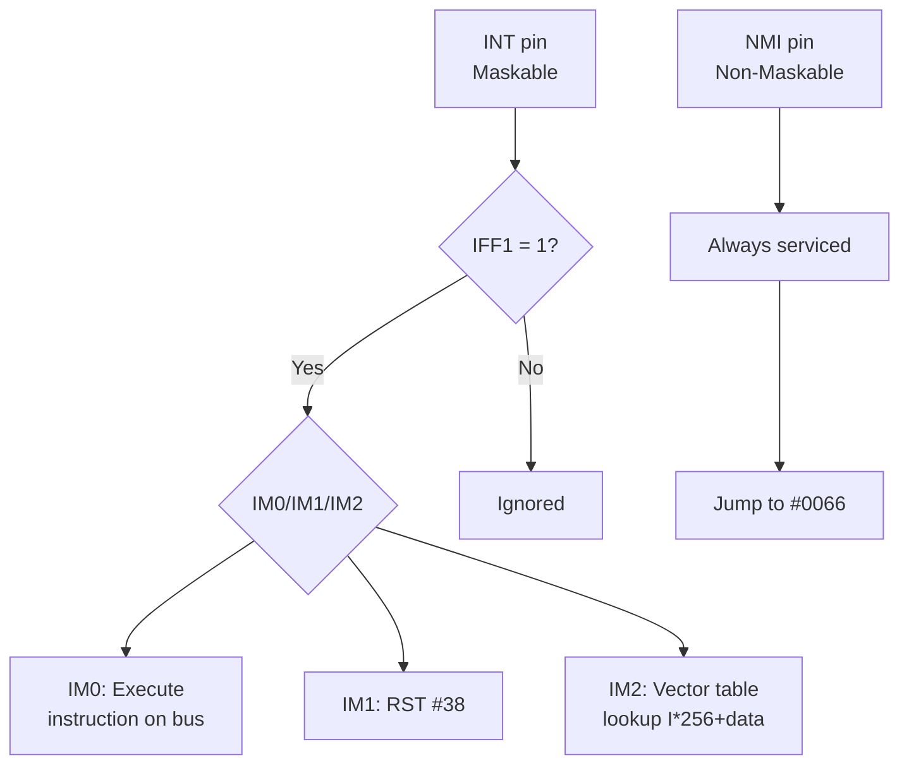
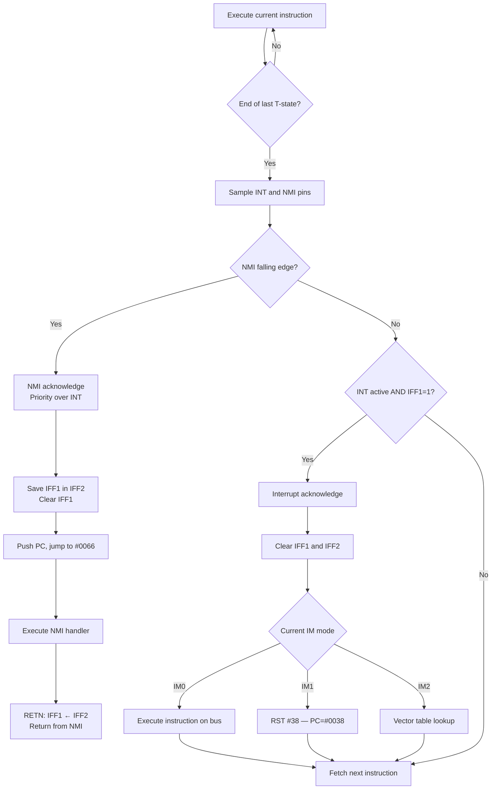
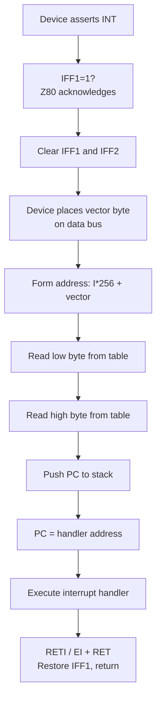

[← Plan](../PLAN.md) · [Z80 CPU](README.md)

# Z80 Interrupts — IM0, IM1, IM2, NMI, IFF1/IFF2, Vector Tables, Per-Model Timing

The Z80 has **two interrupt inputs** and **three maskable interrupt modes** — more flexibility than any contemporary 8-bit processor. The Non-Maskable Interrupt (NMI) provides a hardware-interrupt path that cannot be disabled, essential for fatal error handling and debugging. The three maskable modes (IM0, IM1, IM2) offer increasing sophistication: IM0 lets external hardware supply any instruction, IM1 auto-vectors to a fixed address, and IM2 provides a **256-entry vector table** for device-specific handlers.

On the ZX Spectrum, interrupts are the heartbeat of the machine. The ULA generates a **50 Hz interrupt** once per video frame. The ROM uses this interrupt for keyboard scanning, border flash, tape loading, and the 24-hour clock. Every game and demo that produces smooth animation, music, or multicolor effects hooks the interrupt. Understanding interrupt timing at the T-state level is essential for any non-trivial ZX Spectrum program.

> [!NOTE]
> Interrupt timing interacts with memory contention — see [ula_timing.md](../02_hardware/original/ula_timing.md). The IFF2 flip-flop leaks through the P/V flag — see [z80_flags.md](z80_flags.md) and [z80_undocumented.md](z80_undocumented.md).

---

## Interrupt Architecture Overview



### Interrupt Flip-Flops

The Z80 has two interrupt enable flip-flops:

| Flip-Flop | Purpose | Set By | Cleared By |
|-----------|---------|--------|------------|
| **IFF1** | Controls whether maskable interrupts are accepted | `EI` | `DI`, interrupt acknowledged, reset |
| **IFF2** | Saves IFF1 state during NMI | `EI` | `DI`, maskable interrupt acknowledged |

- `EI` sets **both** IFF1 and IFF2 to 1
- `DI` clears **both** IFF1 and IFF2 to 0
- **NMI arrival**: IFF1 is cleared (prevents further maskable interrupts), IFF2 is **preserved** (saves pre-NMI interrupt state)
- `LD A,I` / `LD A,R` copies IFF2 to the P/V flag — the **only way to read interrupt state**
- `RETN` copies IFF2 back to IFF1 — restores interrupt state after NMI handler

> [!WARNING]
> There is a hardware bug: if a maskable interrupt is acknowledged during `LD A,I` or `LD A,R`, the P/V flag may incorrectly show 0 (disabled) when interrupts were actually enabled. See [z80_undocumented.md](z80_undocumented.md).

---

## Interrupt Detection and Response

### When Does the Z80 Check for Interrupts?



The Z80 samples the INT and NMI pins **at the end of the last T-state of each instruction**. If an interrupt is pending:

1. The current instruction completes (including any wait states)
2. The Z80 checks INT and NMI pins
3. If INT is active AND IFF1=1: maskable interrupt is acknowledged
4. If NMI had a falling edge since last check: NMI is acknowledged
5. If both NMI and INT are pending: **NMI takes priority**

### Interrupt Latency

The maximum interrupt latency depends on the longest instruction currently executing:

| Instruction | T-states | Latency Window |
|-------------|----------|----------------|
| `NOP` | 4 | 4 T-states |
| `LD A,(IX+d)` | 19 | 19 T-states |
| `LDIR` (per byte) | 21 | 21 T-states |
| `EX (SP),IX` | 23 | 23 T-states |
| `BIT b,(IX+d)` | 20 | 20 T-states |

**Maximum interrupt latency on the ZX Spectrum**: ~23 T-states for the longest single instruction. At 3.5 MHz, this is ~6.6 µs — negligible for most purposes.

> [!NOTE]
> The INT pin must be held **active (low) for at least the duration of the longest instruction** to guarantee detection. The Z80 UM0080 specifies the INT signal must be stable at the end of the instruction's last machine cycle.

### HALT Instruction and Interrupts

When the Z80 executes `HALT`, it enters a halted state where it executes internal NOPs (consuming 4 T-states each) until an interrupt occurs. During HALT:

- The Z80 performs **M1 cycles with no instruction fetch** — the address bus shows the address of the byte following HALT
- The refresh counter R increments with each NOP
- **Memory contention applies** to these NOP M1 cycles (if the HALT instruction is in contended memory)
- INT or NMI wakes the Z80; the next instruction at PC (the byte after HALT) is fetched

```z80
; Typical frame sync pattern
HALT               ; Wait for interrupt — executes NOPs at ~4T each
; After interrupt handler returns, execution continues here
LD   HL,#5800      ; Begin timing-critical code...
```

---

## Interrupt Mode 1 (IM1) — The ZX Spectrum Default

### How IM1 Works

IM1 is the simplest interrupt mode and the one used by **all standard ZX Spectrum models**:

1. INT pin is asserted by the ULA (once per frame)
2. Z80 acknowledges the interrupt
3. IFF1 and IFF2 are cleared (interrupts disabled)
4. PC is pushed to stack
5. **PC is set to #0038** — unconditional `RST #38`
6. The interrupt handler at `#0038` executes

### Timing

The interrupt acknowledge sequence in IM1 takes **13 T-states**:

| Phase | T-states | Action |
|-------|----------|--------|
| M1 | 7 | Acknowledge interrupt (IORQ + M1 active), decrement SP |
| M2 | 3 | Write PCH to stack, decrement SP |
| M3 | 3 | Write PCL to stack, set PC = #0038 |

Note: The M1 cycle includes 2 automatic wait states (7T instead of the normal 4T for opcode fetch), because the Z80 inserts wait states during interrupt acknowledge. For the per-T-state bus signal detail of the INTA cycle (M1 + IORQ, pin states, timing), see [z80_timing.md](z80_timing.md#interrupt-acknowledge-bus-cycle).

### ZX Spectrum ROM Interrupt Handler (48K)

The 48K ROM interrupt handler at `#0038` does the following:

```z80
; 48K ROM interrupt handler at #0038 (exact ROM disassembly)
; Source: SkoolKit ROM disassembly
MASKABLE_INTERRUPT:
    PUSH AF            ; Save registers
    PUSH HL
    LD   HL,($5C78)   ; Load lower 2 bytes of FRAMES counter
    INC  HL            ; Increment
    LD   ($5C78),HL
    LD   A,H
    OR   L
    JR   NZ,KEY_INT    ; Skip high byte if no overflow
    INC  (IY+$40)      ; Increment FRAMES high byte (#5CB8)
KEY_INT:
    PUSH BC
    PUSH DE
    CALL KEYBOARD      ; Keyboard scan routine at #02BB
    POP  DE
    POP  BC
    POP  HL
    POP  AF
    EI                 ; Re-enable interrupts
    RET                ; Return from interrupt
```

> [!NOTE]
> The FLASH attribute is **not** processed by the ROM ISR. FLASH is implemented entirely in hardware by the ULA — it has an internal frame counter that toggles ink and paper for attribute bytes with bit 7 set, every 16 frames. No CPU code is involved.

### The Interrupt Handler Cost

A minimal IM1 handler has this overhead:

| Operation | T-states |
|-----------|----------|
| Interrupt acknowledge | 13 |
| `PUSH AF` | 11 |
| `PUSH BC` | 11 |
| `PUSH DE` | 11 |
| `PUSH HL` | 11 |
| `EI` | 4 |
| `RET` | 10 |
| **Minimum total** | **71** |

With actual work (frame counter, keyboard scan, etc.), the 48K ROM handler costs **~700 T-states** — about 1% of the frame budget.

---

## Interrupt Mode 2 (IM2) — Vectored Interrupts

### How IM2 Works



IM2 provides **vectored interrupts** — different peripheral devices can direct the CPU to different handler addresses via a **256-entry vector table**:

1. An external device asserts INT
2. Z80 acknowledges (IFF1 and IFF2 cleared)
3. The external device places a **byte on the data bus** — this is the "interrupt vector"
4. The Z80 forms a **16-bit address**: `I register × 256 + vector byte`
5. The Z80 reads two bytes from that address (little-endian) to get the handler address
6. PC is pushed to stack and loaded with the handler address

### Vector Table

The vector table is a **256-byte table** in memory (occupying one page of 256 bytes), plus one extra byte for the `V = #FF` edge case — see below. The I register holds the high byte of the table's address:

```
Address = (I << 8) + data_bus_byte

┌─────────────────────────┐
│ I × 256 + 0             │ → Handler address for vector 0   (low byte)
│ I × 256 + 1             │ → Handler address for vector 0   (high byte)
├─────────────────────────┤
│ I × 256 + 2             │ → Handler address for vector 2   (low byte)
│ I × 256 + 3             │ → Handler address for vector 2   (high byte)
├─────────────────────────┤
│ ...                     │
├─────────────────────────┤
│ I × 256 + 254           │ → Handler address for vector 254 (low byte)
│ I × 256 + 255           │ → Handler address for vector 254 (high byte)
│ (I+1) × 256 + 0        │ → High byte for vector 255       (must exist!)
└─────────────────────────┘
```

> [!WARNING]
> When `V = #FF`, the Z80 reads bytes at `(I × 256 + #FF)` and `(I × 256 + #FF + 1)`. The second read **crosses into the next page**. A properly constructed table for the ZX Spectrum (where all bus values must be handled) requires **257 bytes**, not 256. See [interrupt_programming.md](../05_development/04_interrupts/interrupt_programming.md) for the full explanation.

### Timing

The IM2 interrupt acknowledge sequence takes **19 T-states**:

| Phase | T-states | Action |
|-------|----------|--------|
| M1 | 7 | Acknowledge interrupt, decrement SP |
| M2 | 3 | Write PCH to stack, decrement SP |
| M3 | 3 | Write PCL to stack |
| M4 | 3 | Read vector low byte from table (I × 256 + data bus) |
| M5 | 3 | Read vector high byte, set PC to handler address |

### IM2 on the ZX Spectrum

**The original 48K and 128K ZX Spectrum do NOT use IM2.** The ULA generates a simple 50 Hz interrupt and the ROM expects IM1. However, **IM2 is extensively used by add-on hardware and custom software**:

- **ZX Spectrum 128K**: The AY-3-8912 sound chip can generate interrupts, but the standard ROM still uses IM1
- **Custom IM2 handlers**: Many games and demos switch to IM2 for their own interrupt handling
- **Peripheral cards**: Interface 1, Multiface, and other expansions may use IM2

### Setting Up IM2

```z80
; Set up IM2 with 257-byte vector table at #FE00
; All vectors point to handler at #FDFD
DI                 ; Disable interrupts during setup
LD   A,#FE         ; I register = #FE → table at #FE00
LD   I,A
; Fill 257 bytes (#FE00-#FF00) with #FD
LD   HL,#FE00      ; Table start
LD   (HL),#FD      ; First byte
LD   DE,#FE01      ; Destination for LDIR
LD   BC,#0100      ; 256 more bytes (257 total)
LDIR               ; Fill #FE01-#FF00 with #FD
IM   2             ; Set interrupt mode 2
EI                 ; Enable interrupts
```

> [!WARNING]
> On the ZX Spectrum, the data bus is **not reliably driven** during interrupt acknowledge — the ULA doesn't place a known vector on the bus. The vector byte is typically `#FF` due to pull-up resistors, but can be any value depending on the last bus cycle. The 257-byte table filled with a single value guarantees all 256 possible vectors resolve to the same handler. See [interrupt_programming.md](../05_development/04_interrupts/interrupt_programming.md) for a detailed walkthrough.

---

## Interrupt Mode 0 (IM0) — Bus Instruction

### How IM0 Works

IM0 is the mode inherited from the Intel 8080. When a maskable interrupt is acknowledged in IM0:

1. The external device places **an instruction byte** on the data bus
2. The Z80 executes this instruction as if it were fetched from memory

The external device can supply any single-byte instruction. Most commonly, it supplies one of the **RST** instructions (`RST #00` through `RST #38`) because they are single-byte calls to fixed addresses. A device could also supply a `CALL nn` (3 bytes) by holding the additional bytes on the bus during subsequent machine cycles.

### Timing

Depends on the instruction supplied:

| Instruction on Bus | T-states | Notes |
|-------------------|----------|-------|
| `RST p` | 13 | Same as IM1 effectively |
| `CALL nn` | 19 | External device must supply all 3 bytes |

### IM0 on the ZX Spectrum

**IM0 is not used on the ZX Spectrum.** The ULA does not place an instruction on the data bus during interrupt acknowledge. IM0 is primarily used in Z80-based systems with dedicated interrupt controllers (like the Z80 PIO, CTC, or SIO in daisy-chain configurations).

---

## Non-Maskable Interrupt (NMI)

### How NMI Works

The NMI cannot be disabled by software — it is **always serviced** when the NMI pin sees a **falling edge** (high-to-low transition). The behavior:

1. NMI edge is detected at the end of the current instruction
2. **IFF1 is cleared** (prevents maskable interrupts during NMI handler)
3. **IFF2 is preserved** (saves the pre-NMI interrupt state)
4. PC is pushed to stack
5. **PC is set to #0066** — the NMI handler address

### Timing

| Phase | T-states | Action |
|-------|----------|--------|
| M1 | 5 | Acknowledge NMI, decrement SP |
| M2 | 3 | Write PCH to stack, decrement SP |
| M3 | 3 | Write PCL to stack, set PC = #0066 |
| **Total** | **11** | |

### NMI Handler

```z80
; NMI handler at #0066
; Must save IFF1 state and restore it on return
PUSH AF            ; Save AF
; ... handle NMI ...

; Return from NMI
POP  AF            ; Restore AF
RETN               ; IFF1 = IFF2, then RET
```

### RETN — Return from NMI

`RETN` performs two actions:
1. **Copies IFF2 to IFF1** — restores the pre-NMI interrupt state
2. **Pops PC from stack** — like a normal `RET`

This is the critical difference from `RETI`. If you use `RET` instead of `RETN` after an NMI handler, IFF1 remains cleared and **maskable interrupts stay disabled forever**.

### NMI on the ZX Spectrum

On the 48K ZX Spectrum, the NMI line is **not connected to any hardware** — there is no external device that can generate an NMI. However, the NMI can be triggered by:

- **Hardware modifications**: Adding an NMI button (common mod for debugging)
- **Expansion port**: Some peripherals can assert the NMI line
- **Soviet clones**: Some Pentagon models have an NMI button for debugging
- **Emulators**: Many emulators provide a "trigger NMI" function for testing

The **Multiface 128** and similar devices use NMI to activate — pressing the Multiface button triggers NMI, which jumps to #0066 where the Multiface ROM is paged in.

---

## EI/DI Timing and the One-Instruction Delay

### The EI Delay

`EI` sets IFF1 and IFF2, but **interrupts are not enabled until one instruction after EI**. This is by design — it ensures `EI` + `RET` (or `EI` + `RETI`) always executes as a pair:

```z80
; Correct interrupt handler return
EI                 ; Set IFF1=IFF2=1, but interrupts NOT YET enabled
RET                ; This instruction completes FIRST, then interrupts fire
; If an interrupt fired DURING EI, it would corrupt the stack
; because the current handler hasn't returned yet
```

### DI — No Delay

`DI` takes effect **immediately** — IFF1 and IFF2 are cleared right away. No interrupt can fire after `DI` executes:

```z80
DI                 ; Interrupts disabled IMMEDIATELY
; ... critical section ...
EI                 ; Interrupts enabled after NEXT instruction
NOP                ; After this NOP, interrupts can fire again
```

### Interrupt Acknowledgence Sequence

```z80
; During normal code execution
instruction_1      ; ← INT pin is asserted during this instruction
; At the end of instruction_1, Z80 detects INT
; But wait — does it acknowledge?

; If IFF1=1: YES, interrupt is acknowledged
; The interrupt handler runs...
; ...handler code...
EI                 ; Will enable interrupts after next instruction
RETI               ; Return — interrupt handler complete
; Now IFF1=1, and the next instruction runs before any new interrupt

; If IFF1=0: NO, interrupt is ignored
; The INT pin must remain active until it is eventually acknowledged
```

---

## RETI — Return from Interrupt

`RETI` (Return from Interrupt) is similar to `RET` — it pops PC from the stack. But it also **signals Z80 peripheral chips** (PIO, CTC, SIO) via the M1 and IORQ pins that the interrupt service routine is complete. This allows daisy-chained peripherals to de-assert their interrupt request.

On the ZX Spectrum, there are no Z80-family peripheral chips in a daisy chain, so `RETI` is functionally identical to `RET`. However, using `RETI` is the correct practice.

### The RETI Opcode Pattern

`RETI` is opcode `ED 4D`. Z80 peripherals detect the `ED` followed by `4D` pattern on the data bus during M1 cycles. Emulators must implement this correctly for Z80 peripheral emulation.

---

## Per-Model Interrupt Timing

### ZX Spectrum 48K

| Parameter | Value |
|-----------|-------|
| Interrupt source | ULA generates INT at ~50.08 Hz |
| Interrupt mode | IM1 (ROM default) |
| Vector address | #0038 |
| Interrupt assertion | 32 T-states active (one per frame) |
| Frame T-states | 69,888 |
| Contention during handler | Yes — ROM at #0000 is uncontended, but handler may access contended memory |

### ZX Spectrum 128K / +2

| Parameter | Value |
|-----------|-------|
| Interrupt source | Ferranti ULA (same as 48K) |
| Frame T-states | 70,908 |
| Additional features | AY-3-8912 can generate interrupts; paging register at #7FFD |

### ZX Spectrum +2A / +3

| Parameter | Value |
|-----------|-------|
| Interrupt source | Amstrad gate array |
| Frame T-states | 70,908 |
| Contention type | Gate array contention (different from Ferranti ULA) |

### Pentagon 128K

| Parameter | Value |
|-----------|-------|
| Interrupt source | Discrete logic (no ULA) |
| Frame T-states | 69,888 |
| Contention | **None** |
| NMI | Available via hardware button (debugging) |

### Interrupt Frequency Comparison

| Model | Frames/sec | T-states/frame | Interrupt period |
|-------|-----------|----------------|-----------------|
| 48K PAL | 50.08 | 69,888 | ~19,968 µs |
| 128K / +2 | 50.02 | 70,908 | ~19,992 µs |
| Pentagon | ~48.83 | 71,680 | ~20,477 µs |
| NTSC 48K | 60.00 | ~69,816 | ~16,667 µs |

---

## Practical Examples

### Custom IM1 Handler

```z80
; Install custom IM1 interrupt handler
DI                 ; Disable interrupts
LD   HL,handler    ; Handler address
LD   (#5CAB),HL    ; Store in RAM (some hook points available)
; Patch RST #38 vector (if using custom ROM) or hook existing handler
LD   A,#C3         ; JP instruction
LD   (#0038),A     ; Overwrite RST #38 (in RAM version)
LD   HL,handler
LD   (#0039),HL    ; JP handler address
IM   1             ; Set IM1 (already set by ROM, but explicit)
EI                 ; Enable interrupts

; Custom handler
handler:
PUSH AF
PUSH BC
PUSH DE
PUSH HL
; ... custom work: play music, update frame counter, etc. ...
POP  HL
POP  DE
POP  BC
POP  AF
EI
RET
```

### Custom IM2 Handler with Vector Table

```z80
; Set up IM2 handler at #FD00 with vector table at #FE00
DI
LD   A,#FE
LD   I,A           ; I = #FE → vector table at #FE00
LD   HL,#FE00
LD   DE,#FE01
LD   (HL),#00      ; Low byte of handler address
INC  HL
LD   (HL),#FD      ; High byte of handler address
LD   DE,#FE02
LD   BC,#00FE
LDIR               ; Fill all 256 bytes with #00, #FD pattern
IM   2
EI

; IM2 handler
im2_handler:
PUSH AF
; ... handle interrupt ...
POP  AF
EI
RETI
```

### Minimal Overhead Handler (Using Shadow Registers)

```z80
; Fastest possible interrupt handler using shadow registers
fast_handler:
EX   AF,AF'        ; Save AF — 4T
EXX                ; Save BC, DE, HL — 4T
; ... minimal work ...
LD   HL,(frame_count)
INC  HL
LD   (frame_count),HL
EXX                ; Restore BC, DE, HL — 4T
EX   AF,AF'        ; Restore AF — 4T
EI                 ; Re-enable — 4T
RET                ; Return — 10T
; Total overhead: 30T (vs. 71T with PUSH/POP)
```

---

## Best Practices

1. **Always pair `EI` with `RET` or `RETI`** — the one-instruction delay ensures the return completes before another interrupt fires.
2. **Use `RETI` for maskable interrupts, `RETN` for NMI** — using the wrong one causes subtle bugs (IFF1 not restored for NMI, peripherals not signaled for maskable).
3. **Save and restore ALL registers in your handler** — the interrupted code expects its register state preserved. Use `EX AF,AF'` + `EXX` for speed, or `PUSH/POP` for safety.
4. **Keep handlers short** — the ZX Spectrum has only one interrupt per frame (~50 Hz). Long handlers steal CPU time from the main program.
5. **Use IM2 for multiple interrupt sources** — if you have peripherals that can generate interrupts, IM2's vector table lets each device have its own handler.
6. **Don't forget to re-enable interrupts** — forgetting `EI` before `RET` is a classic bug that causes the machine to "freeze" after the first interrupt.
7. **Account for contention in handler timing** — if your handler accesses screen memory, contention adds variable delays.

---

## Antipatterns

### The Forgotten EI

```z80
; BAD: No EI before RET — machine freezes after first interrupt
handler:
PUSH AF
; ... do work ...
POP  AF
RET                ; Interrupts never re-enabled! Machine hangs!
```

```z80
; GOOD: EI before RET
handler:
PUSH AF
; ... do work ...
POP  AF
EI                 ; Re-enable interrupts
RET                ; Return — next instruction after EI
```

### The Wrong Return

```z80
; BAD: Using RET instead of RETN for NMI handler
; IFF1 stays cleared — maskable interrupts disabled forever!
org #0066:
PUSH AF
; ... handle NMI ...
POP  AF
RET                ; BUG: doesn't restore IFF1 from IFF2!
```

```z80
; GOOD: RETN restores IFF1 from IFF2
org #0066:
PUSH AF
; ... handle NMI ...
POP  AF
RETN               ; IFF1 = IFF2, then RET — correct!
```

### The IM2 Vector Table Bug

```z80
; BAD: Vector table not properly aligned
; If I=#FE and table is at #FE00, vector byte #FF reads #FEFF and #FF00
; #FF00 is the high byte from the NEXT page — wrong handler!
LD   I,A           ; I = #FE
; Table at #FE00 but not filled completely...
```

```z80
; GOOD: Fill ALL 256 bytes, ensure odd/even pairs point to valid handlers
; Or place table at page boundary where I+1 is also valid
```

---

## Historical Context

### Interrupt Mode Evolution

| Feature | Intel 8080 | Zilog Z80 | Notes |
|---------|-----------|-----------|-------|
| Maskable interrupt modes | 1 (like IM0) | 3 (IM0, IM1, IM2) | Z80 adds IM1 and IM2 |
| NMI | No | Yes | Z80 adds non-maskable interrupt |
| IFF1/IFF2 | Single flip-flop | Two flip-flops | IFF2 saves state during NMI |
| Vector table | No | Yes (IM2) | Z80 adds vectored interrupts |
| RETI signal | No | Yes | Z80 peripherals detect RETI opcode |

The Z80's interrupt system was one of its major selling points for embedded and industrial applications. The IM2 vector table, daisy-chain priority system, and RETI signaling were designed for multi-device systems — something the bare ZX Spectrum never exploited, but which was essential for Z80-based industrial controllers.

### Contemporary Comparison

| Feature | Z80 | 6502 | 6809 | 8086 |
|---------|-----|------|------|------|
| Interrupt inputs | 2 (INT, NMI) | 2 (IRQ, NMI) | 3 (IRQ, FIRQ, NMI) | 2 (INTR, NMI) |
| Maskable modes | 3 | 1 | 1 | 1 (with PIC) |
| Vector table | Yes (IM2) | Hardware vectors | Hardware vectors | IVT via 8259 PIC |
| Daisy chain | Yes (built-in) | No | No | Via external PIC |
| Interrupt latency | 11-19T | 7T | 10-14T | ~50 clocks |

---

## Impact on Emulation and FPGA

1. **Interrupt acknowledge timing must be exact** — the 13T (IM1) or 19T (IM2) acknowledge sequence must be modeled at the T-state level. Contentious memory accesses during this sequence must be handled.

2. **IFF2 tracking** — the emulator must track both IFF1 and IFF2 independently. `LD A,I` reads IFF2, not IFF1. NMI preserves IFF2, `RETN` copies IFF2→IFF1.

3. **The EI one-instruction delay** — emulators must not enable interrupts immediately when EI executes. The delay must be exactly one instruction.

4. **HALT and contention** — during HALT, the CPU executes NOPs that may trigger contention. The emulator must model these contention cycles for accurate multicolor timing after `HALT` returns.

5. **IM2 vector reading** — the two-byte vector read from the table must be modeled as memory accesses (potentially contended). The address `I×256 + data_bus` must be formed correctly.

6. **The IFF2 bug** — `LD A,I` interrupted mid-execution may corrupt P/V. Emulators targeting cycle-exact accuracy should implement this edge case.

---

## References

- **Zilog Z80 CPU User Manual (UM0080)** — Chapter 5: Interrupts, full IM0/IM1/IM2/NMI specification
- **Achim Flammenkamp, "Interrupt Behaviour of the Z80 CPU"** ([z80.info/interrup.htm](http://www.z80.info/interrup.htm)) — Precise interrupt timing analysis
- **Sinclair Wiki, "Contended Memory"** — Interrupt contention timing
- **Sean Young, "The Undocumented Z80 Documented"** — IFF1/IFF2 bug details
- **stardot.org.uk, "New discovery on Z80 interrupts"** — IFF2→IFF1 copy timing during RETI/RETN

### Cross-References

- [ula_timing.md](../02_hardware/original/ula_timing.md) — contention, frame timing, per-model T-state positions
- [z80_timing.md](z80_timing.md) — T-states, M-cycles, per-instruction costs
- [z80_flags.md](z80_flags.md) — P/V flag and IFF2 via `LD A,I`
- [z80_undocumented.md](z80_undocumented.md) — IFF2 bug, interrupt-related undocumented behavior
- [z80_instruction_set.md](z80_instruction_set.md) — EI, DI, IM, RETI, RETN instruction details
- [interrupt_programming.md](../05_development/04_interrupts/interrupt_programming.md) — practical Spectrum interrupt programming: IM1/IM2 setup, ISR patterns, cookbook
