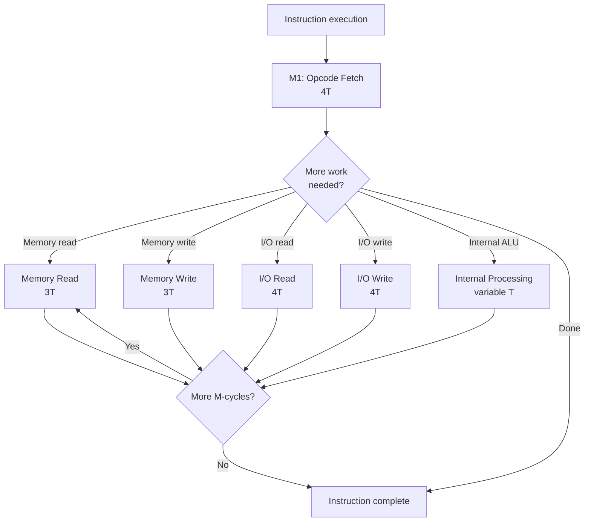
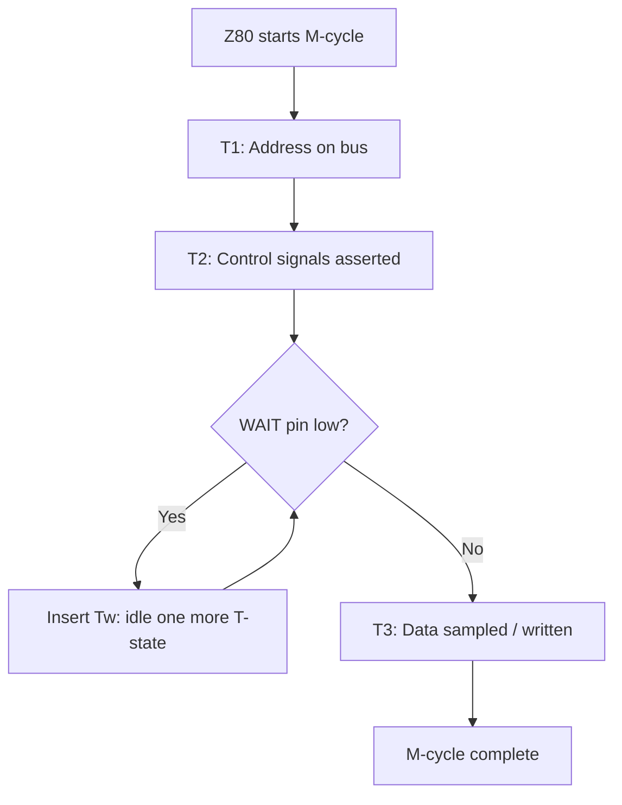
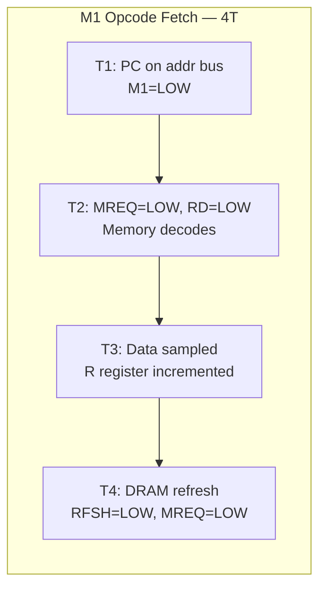
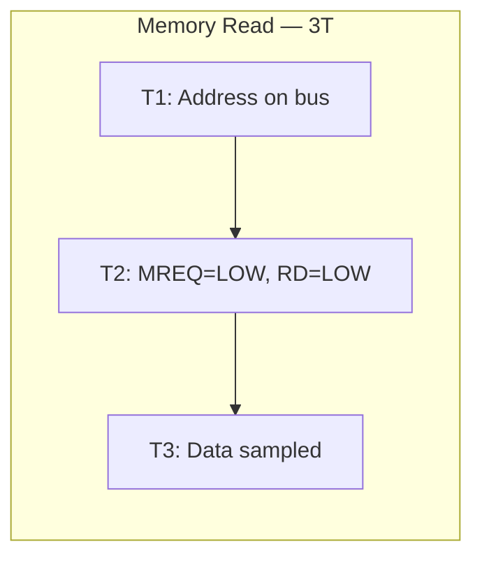
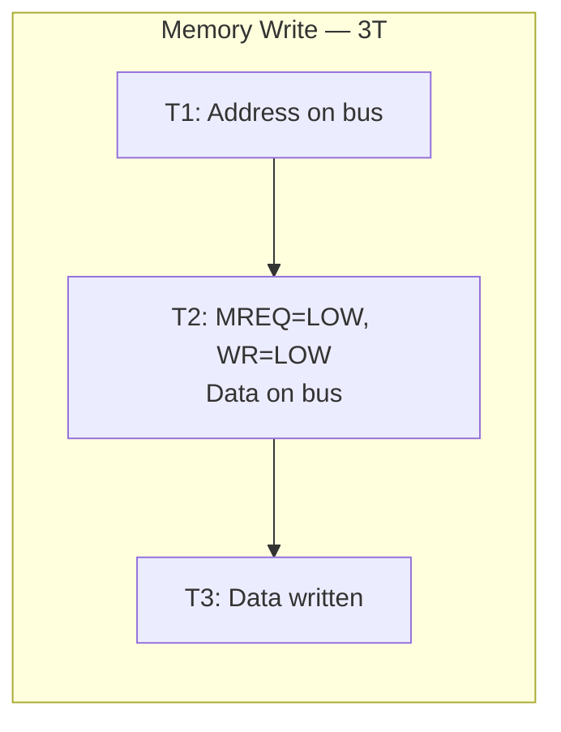
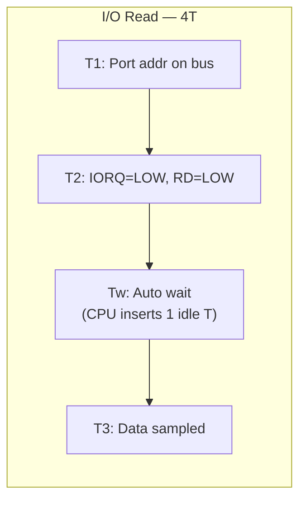
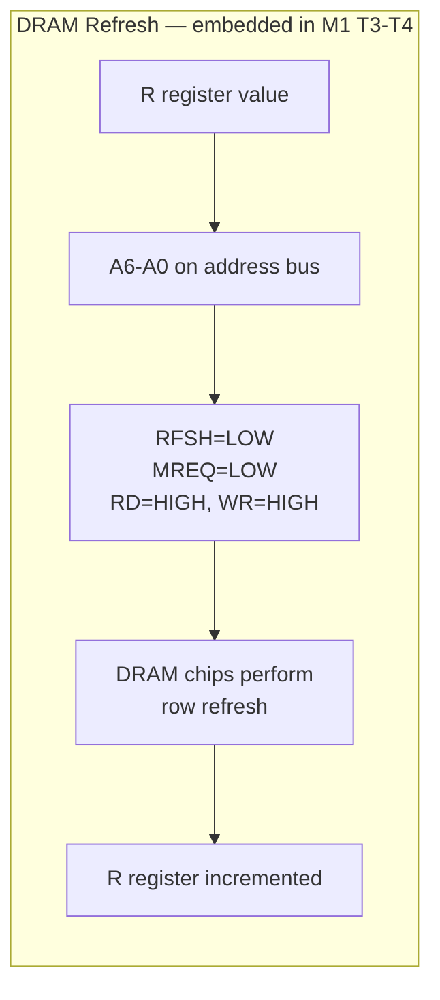
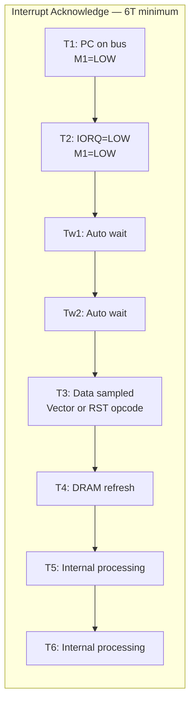
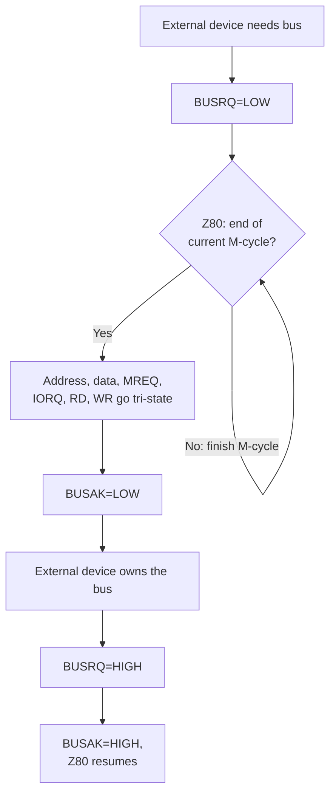

[← Plan](../PLAN.md) · [Z80 CPU](README.md)

# Z80 Timing — T-States, Machine Cycles, Bus Timing, and Per-Instruction Costs

The Z80's timing is built on a single concept: the **T-state** — one clock cycle. Every instruction takes a fixed, deterministic number of T-states, divided into **machine cycles (M-cycles)** that each perform one bus operation (opcode fetch, memory read/write, I/O). There are no caches, no pipelines, no out-of-order execution. What you see is what you get — a `NOP` is always 4 T-states, a `LD A,(HL)` is always 7 T-states, an `LDIR` loop is always 21 T-states per byte.

This article covers the **Z80's own timing mechanics**: T-states, M-cycle types, bus timing signals, and per-instruction cost tables. These are universal to every Z80 system — a TRS-80, an MSX, an Amstrad CPC, and a ZX Spectrum all share these fundamentals.

> [!NOTE]
> The ZX Spectrum's Ferranti ULA imposes additional timing constraints on top of the Z80's baseline: **memory contention** during screen drawing, **frame timing** per video model, and **multicolor precision** requirements. These ULA-specific behaviors are covered in [ula_timing.md](../02_hardware/original/ula_timing.md). This article covers the Z80's intrinsic timing only.

---

## Clock and T-State Fundamentals

### The Z80 Clock

The Z80 has no internal oscillator — it takes an external clock signal on the CLK pin. The frequency is determined entirely by the host system:

| System | CPU Clock | Notes |
|--------|-----------|-------|
| ZX Spectrum 48K | 3.500000 MHz | ULA 14 MHz ÷ 4 — exact 3.5 MHz |
| ZX Spectrum 128K / +2 | 3.546900 MHz | Slightly faster than 48K |
| MSX | 3.579545 MHz | NTSC color burst frequency |
| Amstrad CPC | 4.000000 MHz | Simple 4 MHz clock |
| TRS-80 Model I | 1.774000 MHz |
| ZX Spectrum Next | 3.5 / 7 / 14 / 28 MHz | FPGA, multiple speed modes |

> [!NOTE]
> On the ZX Spectrum, the ULA-derived clock means frame timing is directly coupled to CPU speed — 69,888 T-states per 48K frame, 70,908 per 128K frame. For per-model frame timing, contention, and video timing, see [ula_timing.md](../02_hardware/original/ula_timing.md).

### What Is a T-State?

A **T-state** is one clock cycle of the Z80. Every instruction takes a fixed number of T-states (deterministic, not variable like modern out-of-order CPUs). The Z80 divides work into **machine cycles (M-cycles)**:



| M-cycle Type | T-states | What happens on the bus |
|-------------|----------|------------------------|
| **M1 (opcode fetch)** | 4T | Z80 puts PC on address bus, asserts M1 and MREQ, reads opcode byte, increments R |
| **Memory read** | 3T | Z80 puts address on bus, asserts MREQ and RD, reads data byte |
| **Memory write** | 3T | Z80 puts address on bus, asserts MREQ and WR, writes data byte |
| **I/O read** | 4T | Z80 puts port address on bus, asserts IORQ and RD, reads data byte (includes 1 automatic wait T-state) |
| **I/O write** | 4T | Z80 puts port address on bus, asserts IORQ and WR, writes data byte (includes 1 automatic wait T-state) |
| **Internal processing** | varies | No bus activity — ALU operation, address calculation, etc. |

Each T-state consists of two clock edges (rising and falling). The Z80 samples data on the bus at specific points within each T-state.

### T-State Cost Examples

| Instruction | T-states | µs at 3.5 MHz | What happens internally |
|-------------|----------|----------------|------------------------|
| `NOP` | 4 | 1.14 | M1 fetch only |
| `LD A,B` | 4 | 1.14 | M1 fetch only (register-to-register) |
| `LD A,(HL)` | 7 | 2.00 | M1 fetch (4T) + memory read (3T) |
| `LD A,#42` | 7 | 2.00 | M1 fetch (4T) + immediate byte read (3T) |
| `ADD HL,BC` | 11 | 3.14 | M1 fetch (4T) + 7 internal ALU cycles |
| `LD (HL),A` | 7 | 2.00 | M1 fetch (4T) + memory write (3T) |
| `LD A,(IX+5)` | 19 | 5.43 | DD fetch (4T) + opcode (4T) + displacement read (3T) + address calc (5T) + memory read (3T) |
| `LDIR` (per byte) | 21/16 | 6.00/4.57 | 21T when repeating, 16T on final iteration |
| `CALL nn` | 17 | 4.86 | M1 fetch (4T) + nn low (3T) + nn high (3T) + SP−2 write (3T) + SP−1 write (3T) + PC jump (1T) |
| `RET` | 10 | 2.86 | M1 fetch (4T) + SP low read (3T) + SP high read (3T) |

---

## The WAIT Pin and Bus Throttling

The Z80 has a **WAIT** input pin. When asserted (low) during a memory or I/O cycle, the Z80 inserts **wait T-states** (Tw) — it simply idles, extending the current machine cycle until WAIT is released. This is the Z80's only mechanism for external timing control.



Key facts:

- WAIT is sampled at the **falling edge of T2**
- If WAIT is asserted, the Z80 inserts one Tw T-state and samples WAIT again at the next falling edge
- There is **no limit** on the number of wait states — the Z80 will wait indefinitely
- WAIT affects **every** memory and I/O cycle type — M1 fetch, memory read/write, I/O read/write
- WAIT does **not** affect internal processing cycles (no bus activity = no WAIT sampling)

On the ZX Spectrum, the ULA asserts WAIT to implement **memory contention** — pausing the CPU during screen memory access. For details, see [ula_timing.md](../02_hardware/original/ula_timing.md).

---

## Instruction Timing by Group

This section provides a structured breakdown of T-state costs by instruction category. For the complete per-instruction reference, see [z80_instruction_set.md](z80_instruction_set.md).

### Single-Byte Register Operations (4T)

All register-to-register moves and simple ALU operations take exactly 4 T-states — one M1 cycle only:

| Instruction | T-states | M-cycles |
|-------------|----------|----------|
| `LD A,B` / `LD r,r'` | 4 | M1 |
| `ADD A,B` / `ALU A,r` | 4 | M1 |
| `AND B` / logical ops | 4 | M1 |
| `INC A` / `DEC A` | 4 | M1 |
| `NOP` | 4 | M1 |

### Immediate and Memory Operations (7T–19T)

Instructions that read additional bytes from memory take M1 + one or more memory read cycles:

| Instruction | T-states | Breakdown |
|-------------|----------|----------|
| `LD A,#42` | 7 | M1 (4T) + byte read (3T) |
| `LD A,(HL)` | 7 | M1 (4T) + memory read (3T) |
| `LD (HL),A` | 7 | M1 (4T) + memory write (3T) |
| `LD HL,#4000` | 10 | M1 (4T) + lo byte (3T) + hi byte (3T) |
| `LD A,(#4000)` | 13 | M1 (4T) + lo addr (3T) + hi addr (3T) + memory read (3T) |
| `LD A,(IX+5)` | 19 | DD prefix (4T) + M1 (4T) + disp (3T) + calc (5T) + read (3T) |

### 16-Bit and Stack Operations (10T–21T)

| Instruction | T-states | Breakdown |
|-------------|----------|----------|
| `ADD HL,BC` | 11 | M1 (4T) + 7 internal ALU cycles |
| `PUSH AF` | 11 | M1 (4T) + SP−2 write (3T) + SP−1 write (3T) + internal (1T) |
| `POP AF` | 10 | M1 (4T) + SP read lo (3T) + SP read hi (3T) |
| `CALL nn` | 17 | M1 (4T) + lo byte (3T) + hi byte (3T) + SP−2 write (3T) + SP−1 write (3T) + internal (1T) |
| `RET` | 10 | M1 (4T) + SP lo (3T) + SP hi (3T) |

### Block Operations (16T–21T)

| Instruction | T-states (repeat) | T-states (final) | Notes |
|-------------|-------------------|-----------------|-------|
| `LDIR` | 21 | 16 | 5T penalty for PC reload on repeat |
| `LDI` | 16 | 16 | No repeat, always 16T |
| `CPIR` | 21 | 16 | Same timing as LDIR |

### Conditional Jumps

| Instruction | T-states (taken) | T-states (not taken) |
|-------------|-----------------|---------------------|
| `JR NZ,e` | 12 | 7 |
| `JP NZ,nn` | 10 | 10 |
| `DJNZ e` | 13 | 8 |
| `RET NZ` | 11 | 5 |
| `CALL NZ,nn` | 17 | 10 |

> [!NOTE]
> Conditional jumps have **variable timing** — the Z80 must still fetch the opcode to evaluate the condition, even when not taken. `JP NZ,nn` is always 10T because it reads the full address before evaluating. `JR NZ,e` saves 3T when not taken because it skips the displacement read.

### I/O Instructions

| Instruction | T-states | Notes |
|-------------|----------|-------|
| `IN A,(#FE)` | 11 | M1 (4T) + port addr (3T) + I/O read (4T) |
| `OUT (#FE),A` | 11 | M1 (4T) + port addr (3T) + I/O write (4T) |
| `IN B,(C)` | 12 | M1 (4T) + CB prefix or extra cycle |
| `INI` | 16 | Complex multi-cycle sequence |

> The I/O M-cycle always includes **1 automatic wait T-state** (Tw) — the Z80 inserts this to give I/O devices time to respond. External hardware can add additional wait states via the WAIT pin.

---

## Prefix Byte Timing

The Z80 uses prefix bytes (`CB`, `DD`, `ED`, `FD`) to extend the instruction set. Each prefix byte is itself an M1 cycle:

| Prefix | T-states | Effect |
|--------|----------|--------|
| `CB` | 4 | Bit manipulation and rotate group |
| `DD` | 4 | Replace HL with IX in the next instruction |
| `ED` | 4 | Extended instruction group (block ops, IM2, etc.) |
| `FD` | 4 | Replace HL with IY in the next instruction |

A `DD`-prefixed instruction like `LD A,(IX+5)` costs **4T (DD prefix) + 15T (the IX instruction)** = 19T total. The prefix does **not** change the base instruction timing — it adds 4T on top.

Multiple prefixes stack: `DD CB d` (bit operations on IX+d) costs 4+4+3+5+... = 23T. See [z80_undocumented.md](z80_undocumented.md) for the full breakdown of prefixed instructions.

---

## Bus Timing Signals

During each M-cycle, the Z80 asserts specific control pins to coordinate bus activity. Every signal transition happens on a clock edge — the Z80's timing is **fully deterministic at the pin level**.







### Per-T-State Signal Activity

The tables below show the exact signal state during each T-state of each M-cycle type. All active-LOW signals are shown as `L` (asserted) or `H` (not asserted).

#### M1 Opcode Fetch (4T)

| T-state | Address bus | M1 | MREQ | RD | WR | RFSH | Data bus | Notes |
|---------|-----------|-----|------|----|----|------|---------|-------|
| T1 | PC | **L** | H | H | H | H | — | Z80 puts PC on address bus, asserts M1 |
| T2 | PC | **L** | **L** | **L** | H | H | — | Memory decodes address, drives data bus |
| T3 | PC | **L** | H | H | H | H | **D=input** | CPU samples data bus (opcode byte), R incremented |
| T4 | R[6:0] | H | **L** | H | H | **L** | — | DRAM refresh cycle: refresh address on A6–A0 |

#### Memory Read (3T)

| T-state | Address bus | MREQ | RD | WR | Data bus | Notes |
|---------|-----------|------|----|----|---------|-------|
| T1 | Addr | H | H | H | — | Address setup |
| T2 | Addr | **L** | **L** | H | — | Memory decodes, drives data bus |
| T3 | Addr | H | H | H | **D=input** | CPU samples data bus |

#### Memory Write (3T)

| T-state | Address bus | MREQ | RD | WR | Data bus | Notes |
|---------|-----------|------|----|----|---------|-------|
| T1 | Addr | H | H | H | — | Address setup |
| T2 | Addr | **L** | H | **L** | **D=output** | CPU drives data bus, memory captures on T3 |
| T3 | Addr | H | H | H | **D=output** | Data written to memory |

#### I/O Read (4T — includes 1 automatic wait)



| T-state | Address bus | IORQ | RD | WR | Data bus | Notes |
|---------|-----------|------|----|----|---------|-------|
| T1 | Port addr | H | H | H | — | Port address on A7–A0 (full A15–A0 but only low byte is significant) |
| T2 | Port addr | **L** | **L** | H | — | I/O device decodes port address |
| Tw | Port addr | **L** | **L** | H | — | **Automatic wait T-state** — gives I/O devices one extra T to respond |
| T3 | Port addr | H | H | H | **D=input** | CPU samples data bus |

#### I/O Write (4T — includes 1 automatic wait)

| T-state | Address bus | IORQ | RD | WR | Data bus | Notes |
|---------|-----------|------|----|----|---------|-------|
| T1 | Port addr | H | H | H | — | Port address setup |
| T2 | Port addr | **L** | H | **L** | **D=output** | I/O device selected, data driven |
| Tw | Port addr | **L** | H | **L** | **D=output** | **Automatic wait T-state** — data held stable for I/O device |
| T3 | Port addr | H | H | H | **D=output** | I/O device captures data |

> [!NOTE]
> The automatic wait T-state (Tw) in I/O cycles is **built into the Z80** — it happens unconditionally, regardless of the WAIT pin. External hardware can add **additional** wait states via the WAIT pin on top of this automatic one. This is why I/O instructions take at least 4T per cycle instead of the 3T for memory cycles.
>
> On the ZX Spectrum, the ULA adds further contention delays when accessing port `#FE` (or any port with A0=0) during the display area. See [ula_timing.md](../02_hardware/original/ula_timing.md).

### Key Control Pins

| Pin | Direction | Purpose |
|-----|-----------|---------|
| `A0–A15` | Output | Address bus — memory address or I/O port number |
| `D0–D7` | Bidirectional | Data bus — opcode, operand, or data byte |
| `M1` | Output | Asserted during opcode fetch cycle |
| `MREQ` | Output | Memory request — address bus holds a valid memory address |
| `IORQ` | Output | I/O request — address bus holds a valid port number |
| `RD` | Output | Read strobe — Z80 wants to read from memory or I/O |
| `WR` | Output | Write strobe — Z80 wants to write to memory or I/O |
| `RFSH` | Output | DRAM refresh — address bus holds refresh address |
| `WAIT` | Input | External device requests wait states |
| `BUSRQ` | Input | Bus master requests Z80 to release the bus |
| `BUSAK` | Output | Z80 acknowledges bus release |

### DRAM Refresh

The Z80 includes a **built-in DRAM refresh controller** — one of its major innovations over the Intel 8080. Most 1970s microcomputer designs required external refresh circuitry (or static RAM, which was expensive). The Z80 handles refresh automatically during every M1 cycle.

#### How Refresh Works

During **T3 and T4** of every M1 opcode fetch cycle, the Z80 performs a DRAM refresh cycle:

1. The **R register** (7-bit counter, bits 0–6) is placed on address lines A6–A0
2. **RFSH** is asserted (LOW) — tells external DRAM this is a refresh cycle, not a normal access
3. **MREQ** is asserted (LOW) — DRAM chips use MREQ (not RFSH alone) to gate the refresh
4. **RD** and **WR** remain HIGH — no data is read or written
5. The R register is **incremented** (bits 0–6 increment, bit 7 is preserved)



#### Per-T-State Refresh Detail

| T-state | Address bus | MREQ | RFSH | RD | WR | Notes |
|---------|-----------|------|------|----|----|-------|
| T3 | PC (still) | H | H | H | H | Opcode data sampled by CPU |
| T4 | R[6:0] | **L** | **L** | H | H | Refresh address on low 7 bits, DRAM refreshes row |

#### Why M1 Takes 4T Instead of 3T

The opcode data is actually available by the end of T2 (or during T3 at the latest). T3 is used for data sampling and internal instruction decode. T4 is used entirely for DRAM refresh — the Z80 "steals" these 2 T-states for refresh without any extra cost to the instruction. This is an elegant design:

- Every instruction that includes an M1 cycle (which is **all** of them) automatically refreshes one DRAM row
- No separate refresh timer or DMA channel needed
- No CPU stalls for refresh — it's hidden within the M1 cycle

#### Refresh Coverage

The R register is a 7-bit counter (0–127), so it can refresh **128 rows**. Each M1 cycle refreshes one row. The Z80 must execute enough M1 cycles to refresh all 128 rows within the DRAM's refresh window (typically 2 ms for 16K DRAMs, 4 ms for 64K DRAMs):

| DRAM type | Refresh window | Rows | Required M1 cycles | At 3.5 MHz |
|-----------|---------------|------|-------------------|------------|
| 4116 (16K×1) | 2 ms | 128 | 128 in 2 ms | ~6,125 M1 cycles available per 2 ms — easily sufficient |
| 4164 (64K×1) | 4 ms | 128 | 128 in 4 ms | ~12,250 M1 cycles available per 4 ms — easily sufficient |

Even the slowest Z80 programs execute far more than 128 M1 cycles per refresh window. The only exception is the **HALT** state — see below.

#### HALT State and Refresh

When the Z80 executes `HALT`, it enters a low-power state where it **continues to execute NOP instructions internally**. This is specifically to maintain DRAM refresh — without these phantom NOPs, the refresh counter would stop and DRAM would lose data. Each phantom NOP is a 4T M1 cycle that refreshes one row.

> [!NOTE]
> On the ZX Spectrum, the ULA asserts INT once per frame (~50 Hz), which wakes the CPU from HALT. The maximum HALT duration is therefore ~20 ms (one frame period), well within even the 2 ms DRAM refresh window. The phantom NOPs during HALT ensure continuous refresh.

---

## Instruction Overlap and the R Register

The Z80 overlaps some internal operations with bus cycles:

- **DRAM refresh** happens during T3–T4 of every M1 cycle — no extra cost to the instruction
- **ALU operations** in 16-bit instructions like `ADD HL,BC` (11T) use 7 internal cycles after the M1 fetch — these are real T-states but the bus is idle
- **The R register** increments by 1 on every M1 cycle (bit 7 is the old value of bit 7, bits 0–6 increment). Prefixed instructions increment R **twice** (once for the prefix M1, once for the opcode M1)

R register increment pattern:

| Instruction | R increment | Why |
|-------------|-------------|-----|
| `NOP` | +1 | One M1 cycle |
| `LD A,#42` | +1 | One M1 cycle (the immediate byte is a memory read, not M1) |
| `LD A,(IX+5)` | +2 | DD prefix M1 + opcode M1 |
| `BIT 0,(HL)` | +2 | CB prefix M1 + opcode M1 |
| `LD A,(IX+5)` with `DD CB` | +2 | Only the first two M1 cycles increment R |

---

## Interrupt Acknowledge Bus Cycle

When the Z80 accepts a maskable interrupt (INT pin LOW, IFF1=1), it performs a special **interrupt acknowledge (INTA)** bus cycle. This cycle is different from all other M-cycles:



| T-state | Address bus | M1 | IORQ | MREQ | RD | Data bus | Notes |
|---------|-----------|-----|------|------|----|---------|-------|
| T1 | PC | **L** | H | H | H | — | External: M1 asserted (not a normal opcode fetch) |
| T2 | PC | **L** | **L** | H | H | — | **M1 + IORQ** = interrupt acknowledge. I/O device recognizes this |
| Tw1 | — | **L** | **L** | H | H | — | Automatic wait state 1 |
| Tw2 | — | **L** | **L** | H | H | — | Automatic wait state 2 |
| T3 | — | **L** | H | H | H | **D=input** | CPU samples data bus: device provides vector (IM2) or instruction (IM0) |
| T4 | R[6:0] | H | H | **L** | H | — | DRAM refresh (same as normal M1) |
| T5 | — | H | H | H | H | — | Internal processing |
| T6 | — | H | H | H | H | — | Internal processing |

Key differences from a normal M1 cycle:

- **IORQ is asserted instead of MREQ** — the interrupting device (not memory) provides the data byte
- **M1 + IORQ together** signal an interrupt acknowledge — this unique combination never occurs during normal I/O operations
- **Two automatic wait states** (not one like normal I/O) — gives the interrupting device extra time to respond
- **Total cycle: 6T minimum** (vs 4T for normal M1)
- The Z80 then performs additional cycles depending on the interrupt mode (IM1: internal RST #38, IM2: two more memory reads for the vector table)

> [!NOTE]
> For the full interrupt response sequence (including per-mode T-state costs), see [z80_interrupts.md](z80_interrupts.md). This section covers the bus-level INTA cycle only.

---

## Bus Request and Acknowledge

The **BUSRQ/BUSAK** mechanism allows an external device to take control of the Z80's bus:



| Signal | Direction | Timing |
|--------|-----------|---------|
| BUSRQ | Input | Sampled at the rising edge of the last T-state of any M-cycle |
| BUSAK | Output | Asserted at the start of the next T-state after M-cycle completes |
| Bus float | Output | Address bus, data bus, MREQ, IORQ, RD, WR all go to high-impedance |

Key facts:

- **BUSRQ has the highest priority** of any input — higher than INT, NMI, and WAIT
- The Z80 completes the **current M-cycle** before releasing the bus (it does not wait for the full instruction)
- During bus release, the Z80 **stops DRAM refresh** — the external bus master is responsible for maintaining refresh if needed
- The Z80 continues to sample BUSRQ every T-state; when released, it resumes immediately
- On the ZX Spectrum, BUSRQ is **not used** by the ULA — the ULA uses WAIT for bus throttling instead. BUSRQ is available on the expansion bus edge connector

---

## Antipatterns

### The T-State Assumer

```z80
; BAD: Assuming instruction timing from a different CPU
; "LD A,(HL) is 7 cycles" — true on Z80, but:
; - 6502: LDA (zp),Y is 5+ cycles
; - 8080: MOV A,M is 7 T-states (same! 8080 is Z80's predecessor)
; - 68000: MOVE.B (A0),D0 is 8+ cycles (completely different architecture)
; Always use the Z80-specific timing tables.
```

### The Wait-State Ignorer

```z80
; BAD: Calculating total execution time from T-states alone
; "LDIR filling 6144 bytes = 6144 × 21 = 129,024 T-states = 36.9ms"
; This is WRONG on a ZX Spectrum because:
; 1. Memory contention adds 0-6T per contended access
; 2. If code or data is in #4000-#7FFF, every access costs more
; The base T-state cost is the MINIMUM — actual cost is always >= base
```

```z80
; GOOD: Use base T-states for relative comparisons
; and account for system-specific wait states separately
; "LDIR is 21T/byte base, LD (HL),A loop is 13T/byte base"
; → The loop is ~38% faster, regardless of contention
; See 02_hardware/original/ula_timing.md for ZX Spectrum contention calculations
```

---

## References

- [Zilog Z80 CPU User Manual (UM0080)](https://www.zilog.com/docs/z80/um0080.pdf) — Chapter 5: CPU Timing — the authoritative source for M-cycle types and bus signal timing
- **Z80 Family CPU User Manual (UM0081)** — Additional timing details and electrical characteristics
- **Kenneth Shia, "Z80 Instruction Timing"** — Detailed per-instruction M-cycle breakdown

### Cross-References

- [ula_timing.md](../02_hardware/original/ula_timing.md) — ULA frame timing, memory contention, multicolor constraints (ZX Spectrum-specific)
- [z80_instruction_set.md](z80_instruction_set.md) — Complete per-instruction T-state reference
- [z80_interrupts.md](z80_interrupts.md) — Interrupt timing, contention during interrupt handling
- [z80_undocumented.md](z80_undocumented.md) — How prefix bytes affect T-state counts and R register behavior
- [z80_architecture.md](z80_architecture.md) — CPU internal structure, pin descriptions, and bus interface
- [z80_coding_practices.md](z80_coding_practices.md) — T-state budgeting and timing-aware coding patterns
