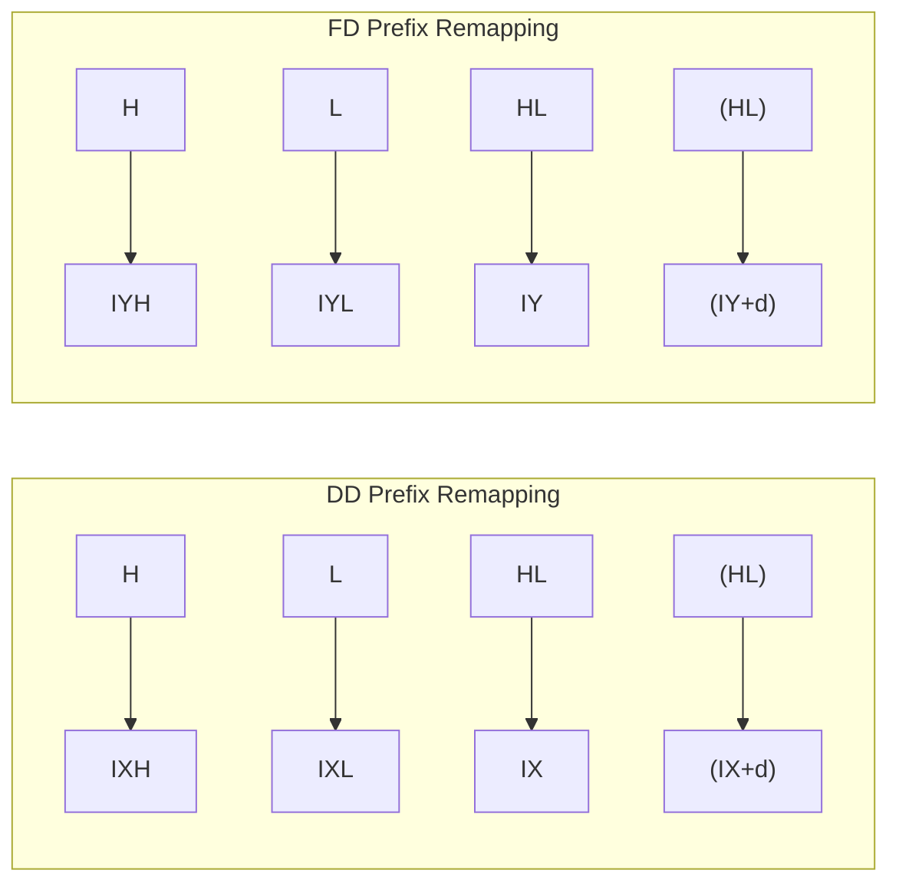
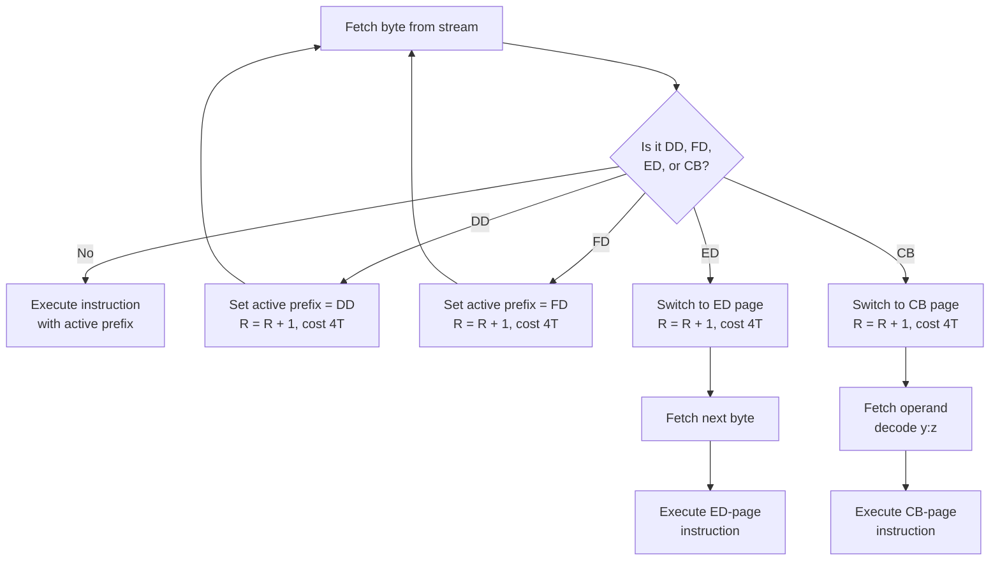

[← Plan](../PLAN.md) · [Z80 CPU](README.md)

# Z80 Undocumented — Instructions, Flags, MEMPTR, and Clone Differences

The NMOS Z80 is a microcoded processor, and its microcode ROM has patterns that extend beyond what Zilog chose to document. These **undocumented behaviors are not random** — they are deterministic consequences of the microcode, replicated faithfully across millions of NMOS Z80 chips. The ZX Spectrum demoscene and game development communities have exploited them for decades. Soviet clone manufacturers replicated them (or didn't — and the differences became clone detection fingerprints).

This article covers three categories of undocumented behavior: **undocumented instructions** (SLL, IX/IY half-register access, `OUT (C),0`, etc.), **undocumented flag bits** (F3 and F5), and the **MEMPTR internal register** that leaks through those flag bits. Understanding these is essential for writing cycle-exact emulators and for understanding why certain ZX Spectrum programs break on some clones but not others.

> [!NOTE]
> Undocumented behaviors are mentioned briefly with cross-links in [z80_architecture.md](z80_architecture.md), [z80_flags.md](z80_flags.md), and [z80_instruction_set.md](z80_instruction_set.md). This article is the deep reference.

---

## Overview: Why "Undocumented" Matters

The Z80's opcode space has **four prefix pages** (main, CB, ED, DD/FD), each providing 256 opcode slots. Zilog documented instructions for roughly 698 of these slots. The remaining slots do one of three things:

1. **Execute a valid but undocumented instruction** — the microcode performs a real operation, just one Zilog didn't put in the manual
2. **Execute as NOP** — the microcode does nothing useful (or does internal bookkeeping only)
3. **Execute a duplicate of a documented instruction** — the same operation appears at multiple opcode positions

The undocumented instructions that actually do something useful fall into three families:

| Family | Instructions | Practical Value |
|--------|-------------|-----------------|
| IX/IY half-register access | `LD A,IXH`, `ADD A,IYL`, etc. | Access IXH, IXL, IYH, IYL as 8-bit registers — very useful |
| SLL (Shift Left Logical with 1) | `SLL r`, `SLL (HL)` | Multiply by 2 and add 1 — niche but real |
| ED holes | `IN F,(C)`, `OUT (C),0`, duplicate NEG/RETN | `OUT (C),0` is used for pad reading; duplicates save no space |

---

## 1. IX/IY Half-Register Access

### The Mechanism

When a `DD` prefix precedes an instruction that uses **H or L**, the instruction operates on **IXH or IXL** instead. Similarly, `FD` maps H→IYH, L→IYL. This gives you four additional 8-bit registers (IXH, IXL, IYH, IYL) for free.

The remapping rule:



| Original | DD prefix | FD prefix |
|----------|-----------|-----------|
| H | IXH (high byte of IX) | IYH (high byte of IY) |
| L | IXL (low byte of IX) | IYL (low byte of IY) |
| HL | IX | IY |
| (HL) | (IX+d) — requires displacement byte | (IY+d) — requires displacement byte |

### Supported Instructions

Any instruction that uses H, L, or (HL) as a source or destination for 8-bit operations:

| Category | Examples | Notes |
|----------|---------|-------|
| 8-bit Load | `LD A,IXH` / `LD IXL,B` / `LD IYH,#42` | Cannot cross-prefix: `LD IXH,IYL` doesn't work |
| INC/DEC | `INC IXH` / `DEC IYL` | 8-bit only |
| ALU operations | `ADD A,IXH` / `CP IXL` / `AND IYH` | All 8 ALU ops work |
| Rotate/Shift (CB) | `RLC IXH` (DD CB 05) | CB prefix follows DD prefix |

### Instruction Encoding

The DD or FD prefix byte is placed before the normal opcode. The assembler syntax varies:

```z80
; sjasmplus syntax (native support):
LD   A,IXH        ; Assembles to: DD 7C
ADD  A,IYL        ; Assembles to: FD 85
LD   IYH,#42      ; Assembles to: FD 26 42

; Assemblers without IXH/IXL support — use DB directive:
DB   #DD          ; DD prefix
LD   A,H          ; Base opcode #7C — effectively LD A,IXH
```

### Complete IX/IY Half-Register Opcode Reference

Every DD/FD-prefixed instruction that uses H or L operates on the corresponding half of IX or IY. Below is the complete list of valid opcodes for **DD prefix** (replace DD with FD for IYH/IYL):

**Load Instructions (DD prefix → IXH/IXL)**

| Instruction | Opcode | | Instruction | Opcode |
|-------------|--------|--|-------------|--------|
| `LD B,IXH` | `DD 44` | | `LD IXH,B` | `DD 60` |
| `LD B,IXL` | `DD 45` | | `LD IXH,C` | `DD 61` |
| `LD C,IXH` | `DD 4C` | | `LD IXH,D` | `DD 62` |
| `LD C,IXL` | `DD 4D` | | `LD IXH,E` | `DD 63` |
| `LD D,IXH` | `DD 54` | | `LD IXH,IXH` | `DD 64` |
| `LD D,IXL` | `DD 55` | | `LD IXH,IXL` | `DD 65` |
| `LD E,IXH` | `DD 5C` | | `LD IXH,A` | `DD 67` |
| `LD E,IXL` | `DD 5D` | | `LD IXL,B` | `DD 68` |
| `LD A,IXH` | `DD 7C` | | `LD IXL,C` | `DD 69` |
| `LD A,IXL` | `DD 7D` | | `LD IXL,D` | `DD 6A` |
| `LD IXH,n` | `DD 26 n` | | `LD IXL,E` | `DD 6B` |
| `LD IXL,n` | `DD 2E n` | | `LD IXL,IXH` | `DD 6C` |

**INC/DEC Instructions**

| Instruction | Opcode | | Instruction | Opcode |
|-------------|--------|--|-------------|--------|
| `INC IXH` | `DD 24` | | `DEC IXH` | `DD 25` |
| `INC IXL` | `DD 2C` | | `DEC IXL` | `DD 2D` |

**ALU Instructions**

| Operation | IXH | IXL |
|-----------|------|------|
| `ADD A,` | `DD 84` | `DD 85` |
| `ADC A,` | `DD 8C` | `DD 8D` |
| `SUB` | `DD 94` | `DD 95` |
| `SBC A,` | `DD 9C` | `DD 9D` |
| `AND` | `DD A4` | `DD A5` |
| `XOR` | `DD AC` | `DD AD` |
| `OR` | `DD B4` | `DD B5` |
| `CP` | `DD BC` | `DD BD` |

> **Total**: 44 unique opcodes per prefix (DD or FD), giving **88 undocumented instructions** from the half-register access mechanism alone. All take 8 T-states (4T for the prefix + 4T for the instruction) and are 2 bytes.

### Timing

Same as the corresponding documented instruction **plus the DD/FD prefix overhead**:

| Base Instruction | Without Prefix | With DD/FD |
|-----------------|----------------|------------|
| `LD A,H` | 4T, 1 byte | 8T, 2 bytes |
| `ADD A,L` | 4T, 1 byte | 8T, 2 bytes |
| `INC H` | 4T, 1 byte | 8T, 2 bytes |
| `LD H,n` | 7T, 2 bytes | 11T, 3 bytes |

### DD/FD Prefix Remapping — Full Behavior

The DD/FD prefix remaps the following register references in the **next opcode byte only**:

| Original | DD Prefix | FD Prefix | Affected Instructions |
|----------|-----------|-----------|----------------------|
| H | IXH | IYH | LD, ALU, INC/DEC |
| L | IXL | IYL | LD, ALU, INC/DEC |
| HL | IX | IY | ADD IX,rp; INC/DEC IX; LD IX,nn etc. |
| (HL) | (IX+d) | (IY+d) | LD, ALU, INC/DEC, CB prefix ops |

Instructions **not affected** by DD/FD prefix (execute as if unprefixed):

- All instructions that don't use H, L, HL, or (HL) — e.g., `LD A,B`, `ADD A,C`, `JP nn`
- `EX AF,AF'`, `EXX`, `JR`, `DJNZ`, `CALL`, `RET`, `RST`
- `LD SP,HL` → becomes `LD SP,IX` / `LD SP,IY` (this IS remapped)
- `ADD HL,rp` → becomes `ADD IX,rp` / `ADD IY,rp` (remapped)

> [!NOTE]
> The DD/FD prefix is **consumed after one instruction**. A sequence like `DD NOP` executes as: DD prefix (consumed, R+1), then NOP (R+1). The NOP is not affected by the prefix. Similarly, `DD LD A,B` ignores the prefix — `LD A,B` doesn't use H/L/HL/(HL).

### Cross-Prefix Limitation

You **cannot** mix IX and IY halves in a single instruction. `LD IXH,IYL` would require both DD and FD prefixes — but the Z80 only honors the **last** prefix. A sequence `DD FD 7C` executes as `LD A,IYL` (FD wins).

Valid combinations: same-index only (`LD IXH,IXL`, `LD IYH,A`, etc.)

```z80
; GOOD: Same index register
LD   IXH,A        ; DD 67
LD   IXL,IXH      ; DD 6C (IXL ← IXH, both under DD prefix)

; BAD: Cross-prefix — doesn't work
; "LD IXH,IYL" — DD FD 7C actually becomes LD A,IYL (FD overrides DD)
```

### Multiple Prefix Handling

When multiple prefix bytes appear consecutively, only the **last one takes effect**:



```z80
DD DD 7C    ; Both DDs increment R, but second DD overrides first → LD A,IXH
DD FD 7C    ; FD overrides DD → LD A,IYL (NOT LD A,IXH!)
FD DD 7C    ; DD overrides FD → LD A,IXH
DD DD DD 7C ; Still LD A,IXH — each DD adds 1 to R, total R += 3
```

Each prefix byte adds 4 T-states and increments R by 1. This means:

- `DD DD NOP` costs 12T (4+4+4) and R increments by 3
- `DD FD 7C` costs 12T (4+4+4) — the effective instruction is `LD A,IYL`
- `ED DD 7C` — ED prefix is **not overridden** by DD; the ED page is entered first. DD is then treated as an opcode within the ED page. See ED-page section below.

> [!WARNING]
> The DD/FD prefix **cannot be combined with ED**. A sequence `DD ED xx` executes as: DD prefix (consumed), then ED page instruction `xx` — the DD prefix is effectively wasted. Similarly, `ED DD xx` executes the ED page with opcode DD, which is treated as a NOP/duplicate.

### Practical Use Cases

**Extra registers in tight code**: IXH, IXL, IYH, IYL give you four extra 8-bit storage locations. In ZX Spectrum 48K programming where RAM is scarce and register pressure is high, these are valuable:

```z80
; Store temporary values in IX/IY halves
LD   IXH,A        ; Save A in IXH — no RAM needed
LD   IXL,B        ; Save B in IXL
; ... compute ...
LD   A,IXH        ; Restore A
LD   B,IXL        ; Restore B
```

**Structured data access with extra temporaries**: Access a structure at IX while keeping temporaries in IXH/IXL:

```z80
; Process a record at IX, with IXH as loop counter
LD   IXH,#10      ; 10 fields to process
loop:
LD   A,(IX+#00)   ; Read field
; ... process ...
INC  IX           ; Next field (IX is 16-bit, not IXH!)
DEC  IXH          ; Decrement counter
JR   NZ,loop
```

---

## 2. SLL — Shift Left Logical with 1

### The Instruction

`SLL r` shifts the operand left by one bit position. Bit 7 goes into Carry. **Bit 0 is set to 1** (unlike SLA where bit 0 is cleared).

```
Before: C ← [7][6][5][4][3][2][1][0]   After:  C ← [7][6][5][4][3][2][1][0]
                                              ↑                        ↑
                                         old bit 7                  always 1
```

The effective operation: **`r = (r << 1) | 1`** — multiply by 2 and add 1.

### Encoding

| Instruction | Opcode | Notes |
|-------------|--------|-------|
| `SLL B` | `CB 30` | |
| `SLL C` | `CB 31` | |
| `SLL D` | `CB 32` | |
| `SLL E` | `CB 33` | |
| `SLL H` | `CB 34` | |
| `SLL L` | `CB 35` | |
| `SLL (HL)` | `CB 36` | |
| `SLL A` | `CB 37` | |

### Flags

All flags updated as for SLA: **S, Z, H=0, P/V (parity), N=0, C = old bit 7**.

### Timing

| Operand | T-states | Bytes | Encoding |
|---------|----------|-------|----------|
| `SLL r` | 8 | 2 | `CB 30+r` |
| `SLL (HL)` | 15 | 2 | `CB 36` |
| `SLL (IX+d)` | 23 | 4 | `DD CB d 36` |
| `SLL (IY+d)` | 23 | 4 | `FD CB d 36` |

### Practical Use

Rare. The "multiply by 2 and add 1" pattern occasionally appears in address calculations and lookup table generation:

```z80
; Convert index to offset in a table of word entries
; where each entry is (2*n + 1) bytes... extremely niche
LD   A,(HL)       ; Index
SLL  A            ; A = A * 2 + 1
LD   E,A
LD   D,#0         ; DE = offset
ADD  HL,DE        ; Point to entry
```

> [!NOTE]
> SLL is also called **SLS** (Shift Left and Set) or **SL1** (Shift Left with 1 insertion) in different references. The operation is identical regardless of name.

---

## 3. DDCB/FDCB Autocopy Instructions

### The Mechanism

When a CB-prefixed instruction follows a DD or FD prefix, the Z80 reads a displacement byte and then the CB opcode. For rotate/shift and SET/RES operations, the result is written **both** to memory `(IX+d)`/`(IY+d)` **and** to one of the 8-bit registers (B, C, D, E, H, L, or A). The register is selected by bits 0–2 of the final opcode byte.

This "autocopy" behavior means a single instruction performs an operation on memory and loads the result into a register simultaneously.

### Encoding

```
DD CB d pp   →   operation on (IX+d), result copied to r[pp&7]
FD CB d pp   →   operation on (IY+d), result copied to r[pp&7]
```

Where `r[pp&7]` maps to: B=0, C=1, D=2, E=3, H=4, L=5, (HL)=6, A=7.

### Supported Operations

| Operation | Base opcode (pp) | Autocopy? | Timing (reg) | Timing ((IX+d)) |
|-----------|-------------------|-----------|--------------|------------------|
| RLC | `00+r` | Yes | 8T | 23T |
| RRC | `08+r` | Yes | 8T | 23T |
| RL | `10+r` | Yes | 8T | 23T |
| RR | `18+r` | Yes | 8T | 23T |
| SLA | `20+r` | Yes | 8T | 23T |
| SRA | `28+r` | Yes | 8T | 23T |
| SLL | `30+r` | Yes | 8T | 23T |
| SRL | `38+r` | Yes | 8T | 23T |
| RES b | `80+8*b+r` | Yes | 8T | 23T |
| SET b | `C0+8*b+r` | Yes | 8T | 23T |
| BIT b | `40+8*b+r` | **No** | 8T | 20T |

> BIT does not write to memory, so there is no result to copy. However, the `BIT b,(IX+d)` instruction with a non-6,7 register field in `r[pp&7]` still works — it just tests the bit without autocopying. The register field in this case is ignored for BIT instructions (the documented `BIT b,(IX+d)` always uses `pp` = `#46+8*b`, which has `r[pp&7]` = 6, i.e., no register copy).

### Examples

```z80
; Rotate left through carry the byte at (IX+5), put result in B
; DD CB 05 00
RLC  (IX+#05)     ; Documented: only modifies memory
; But with autocopy opcode:
; DD CB 05 00 — RLC (IX+5) AND LD B,(IX+5)

; Set bit 7 of (IY+10), put result in A
; FD CB 0A FF
; SET 7,(IY+10) → A
```

> Most assemblers don't have a mnemonic for autocopy. You typically use `DB` directives or assembler-specific extensions to emit the exact byte sequence.

### Practical Value

Minimal. The autocopy saves one `LD r,(IX+d)` instruction (19T, 3 bytes), but the DDCB/FDCB instruction itself is 4 bytes and 23T. The savings are small and the code is unreadable. Not recommended.

---

## 4. ED-Prefix Undocumented Instructions

The `ED` prefix page has 256 opcode slots. Only about 60 are documented. The rest fall into these categories:

### Complete ED Page Opcode Map

```
     x0          x1          x2          x3          x4          x5          x6          x7          x8          x9          xA          xB          xC          xD          xE          xF
0x  —          —          —          —          —          —          —          —           —          —          —          —          —          —          —          —
1x  —          —          —          —          —          —          —          —           —          —          —          —          —          —          —          —
2x  —          —          —          —          —          —          —          —           —          —          —          —          —          —          —          —
3x  —          —          —          —          —          —          —          —           —          —          —          —          —          —          —          —
4x  IN B,(C)   OUT(C),B  SBC HL,BC LD(nn),BC  NEG*      RETN      IM 0      LD I,A     IN C,(C)   OUT(C),C  ADC HL,BC LD BC,(nn) NEG*      RETN*     IM 0/1*    LD I,A*
5x  IN D,(C)   OUT(C),D  SBC HL,DE LD(nn),DE  NEG*      IM 1*     IM 1      LD A,I     IN E,(C)   OUT(C),E  ADC HL,DE LD DE,(nn) NEG*      RETN*     IM 0/1*    LD R,A*
6x  IN H,(C)   OUT(C),H  SBC HL,HL LD(nn),HL  NEG*      RETN*     IM 2      LD R,A     IN L,(C)   OUT(C),L  ADC HL,HL LD HL,(nn) RLD        RETN*     IM 2*      RLD*
7x  IN F,(C)!  OUT(C),0! SBC HL,SP LD(nn),SP  NEG*      RETN*     IM 0*     —           IN A,(C)   OUT(C),A  ADC HL,SP LD SP,(nn) NEG*      RETN*     IM 2*      —
8x  —          —          —          —          —          —          —          —           —          —          —          —          —          —          —          —
9x  —          —          —          —          —          —          —          —           —          —          —          —          —          —          —          —
Ax  LDI       CPI       INI       OUTI      —          —          —          —           LDD       CPD       IND       OUTD      —          —          —          —
Bx  LDIR      CPIR      INIR      OTIR      —          —          —          —           LDDR      CPDR      INDR      OTDR      —          —          —          —
Cx  —          —          —          —          —          —          —          —           —          —          —          —          —          —          —          —
Dx  —          —          —          —          —          —          —          —           —          —          —          —          —          —          —          —
Ex  —          —          —          —          —          —          —          —           —          —          —          —          —          —          —          —
Fx  —          —          —          —          —          —          —          —           —          —          —          —          —          —          —          —
```

Legend:
- **Blank** (`—`) = NOP or duplicate (same as `ED 00` = NOP)
- **`*`** = Duplicate of a documented instruction (see table below)
- **`!`** = Truly undocumented instruction with unique behavior

### Documented Instructions at Duplicate Opcodes

Some undocumented opcodes perform the same operation as documented ones:

| Instruction | Documented Opcode | Duplicate Opcodes |
|-------------|-------------------|-------------------|
| `NEG` | `ED 44` | `ED 4C`, `ED 54`, `ED 5C`, `ED 64`, `ED 6C`, `ED 74`, `ED 7C` |
| `RETN` | `ED 45` | `ED 55`, `ED 65`, `ED 75` |
| `RETI` | `ED 4D` | `ED 5D`, `ED 6D`, `ED 7D` |
| `IM 0` | `ED 46` | `ED 66` |
| `IM 1` | `ED 56` | `ED 76` |
| `IM 2` | `ED 5E` | `ED 7E` |

### Truly Undocumented ED Instructions

| Opcode | Mnemonic | Behavior | NMOS/CMOS |
|--------|----------|----------|-----------|
| `ED 70` | `IN F,(C)` | Read port (BC), set flags, discard value | Both |
| `ED 71` | `OUT (C),0` | Write **0** to port (BC) | **NMOS only** |
| `ED 71` | `OUT (C),#FF` | Write **#FF** to port (BC) | **CMOS** (most) |
| `ED 4E` / `ED 6E` | `IM ?` | Set interrupt mode to undefined state (acts like IM 0 or IM 1) | Both |

### Undocumented IM Modes — Detail

The Z80's IM instruction decode follows the `im` table (indexed by y, bits 5–3 of the opcode):

| y | Opcode | Documented IM | Actual Mode Set |
|---|--------|---------------|-----------------|
| 0 | `ED 46` | IM 0 | IM 0 |
| 1 | `ED 4E` | — | **IM 0 on NMOS Z80** (same as y=0) |
| 2 | `ED 56` | IM 1 | IM 1 |
| 3 | `ED 5E` | IM 2 | IM 2 |
| 4 | `ED 66` | — | IM 0 |
| 5 | `ED 6E` | — | **IM 0 on NMOS Z80** (same as y=1) |
| 6 | `ED 76` | IM 1 (duplicate) | IM 1 |
| 7 | `ED 7E` | IM 2 (duplicate) | IM 2 |

On some CMOS Z80 variants, `ED 4E` and `ED 6E` may set IM 1 instead of IM 0. This is why they're listed as "0/1" in the im table — the behavior is not well-defined.

> [!WARNING]
> Never use `ED 4E` or `ED 6E` to set interrupt mode. Always use the documented `ED 46` (IM 0), `ED 56` (IM 1), or `ED 5E` (IM 2).

### NONI — No Operation, No Interrupts

Some undocumented opcodes on the ED page (and some DD/FD sequences) have a subtle side effect: they **prevent interrupts from being accepted immediately after** the instruction. This behavior is called **NONI** (No Operation No Interrupts) by emulator authors.

Affected opcodes include most of the "NOP" slots on the ED page (rows 0x–3x, 8x–Fx where the slot is not a valid instruction). The Z80:

1. Executes a NOP (4 T-states)
2. Does **not** allow an interrupt to be accepted on the instruction boundary after the NOP
3. Resumes normal interrupt acceptance after one more instruction

> This is relevant only for **cycle-exact emulators**. The NONI behavior was discovered through the ZEXALL test suite and affects edge-case timing in programs that rely on exact interrupt response windows.

### `OUT (C),0` — NMOS vs. CMOS

This is one of the most important undocumented instructions because it was **used in real software** for reading input devices:

- **NMOS Z80**: `ED 71` outputs **0** to the port addressed by BC
- **CMOS Z80** (most): `ED 71` outputs **#FF** to the port addressed by BC
- **Sharp LH5080A** (CMOS): outputs **0**, like NMOS — exception

This difference is used for **CPU type detection**:

```z80
; Detect NMOS vs. CMOS Z80
LD   C,#82        ; Choose a readback-capable port
DB   #ED,#71      ; OUT (C),0 on NMOS, OUT (C),#FF on CMOS
IN   A,(#82)      ; Read back the value
CP   #0           ; Was it zero?
JP   Z,nmos       ; Zero = NMOS
; Not zero = CMOS
```

> [!WARNING]
> On the ZX Spectrum, `OUT (C),0` was used by some programs to rapidly pulse I/O ports. Code that depends on this outputting 0 will malfunction on CMOS Z80 chips and on most Soviet clones that output #FF instead.

### `IN F,(C)` — Input to Flags Only

`ED 70` reads a byte from port (BC) and sets all flags (S, Z, H, P/V as parity, N=0) but discards the actual byte. This is useful when you want to test an I/O port value without disturbing any register:

```z80
; Test if port (BC) has even parity without changing A
IN   F,(C)        ; Read port, set flags, discard value
JP   PE,even_parity
```

---

## 5. Undocumented Flag Bits (F3 and F5)

### Overview

The Z80 flag register F has **two officially undocumented bits**: bit 3 (called **F3** or **X**) and bit 5 (called **F5** or **Y**). On NMOS Z80 processors, these bits are **deterministic** — they always take the same value for the same instruction and operand combination.

### The Q Register Theory

Research suggests the Z80 has an internal **Q register** (or "result buffer") that captures the 8-bit result of the last ALU operation. For most instructions:

- **F5** = bit 5 of Q (the result)
- **F3** = bit 3 of Q (the result)

This means `F5` and `F3` are usually copies of bits 5 and 3 of the last 8-bit result that passed through the ALU.

### Flag Behavior by Instruction Group

| Instruction Group | F5 Source | F3 Source | Notes |
|-------------------|-----------|-----------|-------|
| `ADD/ADC/SUB/SBC/CP r` | Bit 5 of result | Bit 3 of result | For CP, result = A − operand |
| `AND r` | Bit 5 of result | Bit 3 of result | |
| `OR/XOR r` | Bit 5 of result | Bit 3 of result | |
| `INC/DEC r` | Bit 5 of result | Bit 3 of result | |
| `RLC/RL/RRC/RR/SLA/SRA/SRL r` | Bit 5 of result | Bit 3 of result | |
| `DAA` | Bit 5 of result | Bit 3 of result | |
| `CPL` | Bit 5 of A | Bit 3 of A | |
| `SCF` / `CCF` | Bit 5 of A | Bit 3 of A | Copied from accumulator! |
| `RLCA/RLA/RRCA/RRA` | Bit 5 of A | Bit 3 of A | |
| `ADD HL,rr` | Bit 13 of sum | Bit 11 of sum | From high-byte addition |
| `BIT n,r` (n≠6,7) | Bit 5 of Q | Bit 3 of Q | Complex — see MEMPTR section |
| `BIT n,(HL)` | **Bit 13 of MEMPTR** | **Bit 11 of MEMPTR** | MEMPTR leak! |
| `LDI/LDD` | Bit 1 of (A + byte) | Bit 3 of (A + byte) | |
| `CPI/CPD` | Bit 1 of (A − (HL) − H) | Bit 3 of (A − (HL) − H) | H = half-carry result |

### SCF and CCF — The Complex Case

The F5/F3 behavior after `SCF` and `CCF` depends on what instruction preceded them. This is the source of most F3/F5-related emulator bugs and is also the basis for **Z80 clone detection**:

**Case 1: SCF/CCF after an instruction that sets flags (not POP AF)**

F5 and F3 are copied from the corresponding bits of the **A register** (accumulator). This is the most common case and is consistent across all Z80 variants.

**Case 2: SCF/CCF after POP AF or non-flag-modifying instruction**

Behavior varies by Z80 type. See the [Clone Differences](#7-clone-detection-and-differences) section below.

---

## 6. MEMPTR (WZ) Internal Register

### What Is MEMPTR?

The Z80 has an internal 16-bit register pair called **MEMPTR** (also known as **WZ** in some references). It is used internally by the processor for temporary address calculations during instruction execution. It is not directly accessible to programmers.

MEMPTR leaks its value through the `BIT n,(HL)` instruction: after `BIT n,(HL)`, flag bits F5 and F3 contain **bits 13 and 11 of MEMPTR** respectively.

### How to Read MEMPTR

Since only two bits of MEMPTR are visible at a time, extracting the full 16-bit value requires a technique: execute `CPI` (which increments MEMPTR by 1) in a loop, observing F5 and F3 after each step to reconstruct the bits.

### MEMPTR Update Rules

MEMPTR is updated by specific instruction groups. The table below lists every known instruction that modifies MEMPTR, including block-repeat variants:

| Instruction | MEMPTR Value After Execution | Notes |
|-------------|------------------------------|-------|
| **Load / Store** | | |
| `LD A,(addr)` | `addr + 1` | |
| `LD (addr),A` | `(addr+1) & #FF` low, A high | †BM1 |
| `LD A,(BC)` / `LD A,(DE)` | `rp + 1` | |
| `LD (BC),A` / `LD (DE),A` | `(rp+1) & #FF` low, A high | †BM1 |
| `LD rp,(addr)` / `LD (addr),rp` | `addr + 1` | |
| `EX (SP),rp` | value of rp after exchange | |
| **Arithmetic** | | |
| `ADD/ADC/SBC HL,rr` | `HL_before + 1` | |
| `RLD` / `RRD` | `HL + 1` | |
| **Control Transfer** | | |
| `JR/DJNZ/RET/RETI/RST` | target address | |
| `JP nn` / `CALL nn` | `nn` (even if conditional and not taken!) | |
| Interrupt call (INT/NMI) | vector address | Same as `CALL` |
| **I/O** | | |
| `IN A,(n)` | `(A_before << 8) + n + 1` | |
| `IN r,(C)` | `BC + 1` | |
| `OUT (n),A` | `(n+1) & #FF` low, A high | †BM1 |
| `OUT (C),r` | `BC + 1` | |
| **Indexed** | | |
| Any `(IX+d)` / `(IY+d)` instruction | `IX + d` / `IY + d` | |
| **Block Search** | | |
| `CPI` | `MEMPTR + 1` | |
| `CPD` | `MEMPTR − 1` | |
| `CPIR` (when BC≠1 and A≠(HL)) | `PC + 1` each iteration | Repeats; final step as `CPI` |
| `CPIR` (when BC=1 or A=(HL)) | `MEMPTR + 1` | As `CPI` |
| `CPDR` (when BC≠1 and A≠(HL)) | `PC + 1` each iteration | Repeats; final step as `CPD` |
| `CPDR` (when BC=1 or A=(HL)) | `MEMPTR − 1` | As `CPD` |
| **Block Transfer** | | |
| `LDIR` (when BC≠1) | `PC + 1` | Repeats |
| `LDIR` (when BC=1) | unchanged | Final step |
| `LDDR` (when BC≠1) | `PC + 1` | Repeats |
| `LDDR` (when BC=1) | unchanged | Final step |
| **Block I/O** | | |
| `INI` | `BC_before_B_dec + 1` | B not yet decremented |
| `IND` | `BC_before_B_dec − 1` | B not yet decremented |
| `OUTI` | `BC_after_B_dec + 1` | B already decremented |
| `OUTD` | `BC_after_B_dec − 1` | B already decremented |
| `INIR` (final, B=0) | `#100 + C + 1` | Each step as `INI`; B reaches 0 |
| `INDR` (final, B=0) | `#100 + C − 1` | Each step as `IND`; B reaches 0 |
| `OTIR` (final, B=0) | `C + 1` | Each step as `OUTI`; B already 0 |
| `OTDR` (final, B=0) | `C − 1` | Each step as `OUTD`; B already 0 |

> **†BM1** — On the КР1858ВМ1 (BM1) Soviet Z80 clone, the high byte of MEMPTR is **0** instead of **A** after these instructions. This is a reliable software detection method — see [§7 Clone Detection](#7-clone-detection-and-differences).

### Why MEMPTR Matters

1. **Emulator accuracy**: The MEMPTR leak through `BIT n,(HL)` is used by the ZEXALL and Z80Test test suites to verify emulator correctness. An emulator that gets MEMPTR wrong fails these tests.

2. **Clone detection**: Some Soviet clones (КР1858ВМ1, T34VM1) handle MEMPTR differently for `LD (addr),A` and `OUT (n),A`. This provides a software method to detect specific Z80 clone types.

3. **Democode**: A few ZX Spectrum demos use MEMPTR-based techniques, though this is rare because the two-bit-at-a-time access makes it impractical for performance-critical code.

### Attribution

The comprehensive MEMPTR update rules documented above were discovered by **boo_boo** (Vladimir Kladov) and published in 2006 on [zx.pk.ru](http://zx.pk.ru). The key breakthrough was the **CPI increment technique**: since `CPI` increments MEMPTR by exactly 1, executing `CPI` in a loop and reading bits 13 and 11 of MEMPTR via `BIT n,(HL)` flags (F5/F3) after each step allows full reconstruction of the 16-bit MEMPTR value. This technique was then applied systematically to every Z80 instruction to build the complete table above. The original research is preserved as a [gist by drhelius](https://gist.github.com/drhelius/8497817).

---

## 7. Clone Detection and Differences

Soviet Z80 clones were manufactured by multiple factories across the USSR and post-Soviet space. While most are functionally identical to the NMOS Zilog Z80, some have detectable differences in undocumented behavior.

### Detection Methods

| Test | What It Detects | Method |
|------|----------------|--------|
| `OUT (C),0` value | NMOS vs. CMOS | Output #71 ED to a readable port, check if 0 or #FF comes back |
| SCF/CCF flag bits | Specific manufacturer | Observe F5/F3 after SCF/CCF following POP AF with specific A/F values |
| MEMPTR after `LD (BC),A` | КР1858ВМ1 vs. Zilog | MEMPTR high byte is 0 on BM1, A on Zilog |
| `OUTI` carry flag | MME U880 / Thesys | U880 doesn't clear carry when B transitions to 0 |

### Known Clone Differences

| Clone | Manufacturer | Key Differences |
|-------|-------------|-----------------|
| **КР1858ВМ1** | USSR (various) | MEMPTR high byte = 0 after `LD (rp),A` and `OUT (n),A` (Zilog uses A); SCF/CCF F5/F3 may differ |
| **T34ВМ1** | USSR | Similar to КР1858ВМ1; may share dies |
| **MME U880** | East Germany | `OUTI` doesn't clear carry flag when B→0; otherwise highly compatible |
| **NEC D780C** | NEC | SCF/CCF F3 is non-deterministic (floating internal signal) |
| **Sharp LH0080A** | Sharp | SCF/CCF F5/F3 differ from Zilog NMOS |
| **GoldStar Z8400** | GoldStar | Both F5 and F3 are non-deterministic after SCF/CCF in edge cases |

### The КР1858ВМ1 Controversy

The КР1858ВМ1 (often labeled KR1858VM1) was the most common Soviet Z80 clone. Its exact origin is debated:

- Some researchers believe it uses **MME U880 dies** (East German manufacture)
- Others believe it was **independently reverse-engineered** in the USSR
- Testing shows MEMPTR behavior **differs** from both Zilog Z80 and MME U880
- Two chips from different batches (1993-05 and 1993-06) showed identical behavior to each other but different from U880

This suggests the КР1858ВМ1 is an **independent design** or at minimum uses masks that were modified from the U880.

---

## 8. R Register Behavior

The **R (Refresh) register** has undocumented behavior worth noting:

### Documented Behavior

- R[6:0] increments after each instruction fetch
- R[7] is unaffected by incrementing — it retains whatever value was written by `LD R,A`
- `LD A,R` reads R into A, with bit 7 of R preserved as written

### Undocumented Behavior

| Case | R Increment |
|------|-------------|
| Normal 1-byte instruction | +1 |
| DD or FD prefix | +1 (prefix counted as separate instruction) |
| DD/FD + opcode | +1 for prefix, +1 for opcode = **+2 total** |
| CB prefix + opcode | +1 for prefix, +1 for opcode = **+2 total** |
| ED prefix + opcode | +1 for prefix, +1 for opcode = **+2 total** |
| DDCB/FDCB (4-byte) | +1 for DD, +1 for CB = **+2 total** (not +3!) |
| LDIR (each iteration) | +2 |
| LDIR N bytes | +2N |
| DD followed by DD (double prefix) | +2 (each DD increments R) |

> `LD R,A` / `LD A,R` sequence increases R by 2 (one increment for each instruction). The upper bit of A is written to R[7] and stays there until the next `LD R,A`.

### Why R Matters

Some ZX Spectrum programs use R as a **pseudo-random number generator** or to detect emulator accuracy:

```z80
; Simple pseudo-random from R register
LD   A,R          ; Get refresh counter (7-bit counter + bit 7 from LD R,A)
AND  #7F          ; Mask to 7 bits — gives semi-random value 0-127
; Use as index into a table...
```

---

## 9. Interrupt-Related Undocumented Behavior

### IFF1 / IFF2 Bug

There is a known hardware bug in NMOS Z80 (possibly CMOS too) regarding `LD A,I` and `LD A,R`:

If a maskable interrupt is acknowledged **during** the execution of `LD A,I` or `LD A,R`, the P/V flag may incorrectly show **0** (interrupts disabled) when IFF2 was actually **1** (interrupts enabled).

> [!WARNING]
> This bug means `LD A,I` is not a fully reliable way to read interrupt state. In practice, the window of vulnerability is extremely narrow (a few T-states), and most ZX Spectrum code does not hit it. But for critical applications (like NMI handlers that must restore interrupt state), be aware of this limitation.

### EI and Interrupt Latency

`EI` sets IFF1 and IFF2, but interrupts are not actually enabled until **one instruction after EI** completes. This is documented but often misunderstood:

```z80
EI                ; Enable interrupts — but NOT YET
RETI              ; This instruction completes FIRST, then interrupts fire
; If an interrupt fires DURING EI, it is not acknowledged until after RETI
```

---

## Practical Examples

### CPU Type Detection (Full)

```z80
; Detect NMOS vs CMOS
detect_nmos:
LD   C,#FE        ; ZX Spectrum border port (readable via its side effects)
                   ; Note: need a port you can read back from
DB   #ED,#71      ; OUT (C),0 or OUT (C),#FF
LD   A,#0         ; Prepare comparison
; ... check result ...
```

### Using IX/IY Halves as Extra Registers

```z80
; BCD conversion routine using IXH/IXL as temporaries
; Input: A = binary value 0-99
; Output: A = packed BCD
binary_to_bcd:
LD   IXH,A        ; Save original value in IXH
LD   IXL,#0       ; Clear tens counter
tens_loop:
CP   #10          ; Can we subtract 10?
JR   C,done       ; No — remaining value is units
SUB  #10          ; Subtract 10
INC  IXL          ; Count tens
JR   tens_loop
done:
; A = units (0-9), IXL = tens (0-9)
LD   IXH,A        ; Save units
LD   A,IXL        ; Get tens
SLA  A            ; Multiply by 16 (shift left 4 times)
SLA  A
SLA  A
SLA  A
OR   IXH          ; Combine tens and units
RET
```

### Reading MEMPTR for Debugging

```z80
; Extract bits 11 and 13 of MEMPTR after some instruction
; by using BIT 0,(HL) to leak them into flags
BIT  0,(HL)       ; F5 = bit 13 of MEMPTR, F3 = bit 11 of MEMPTR
PUSH AF           ; Save flags
POP  BC           ; B = flags, C = (whatever was in A)
LD   A,B
AND  #28          ; Isolate bits 5 and 3
; A now contains: bit 5 = MEMPTR[13], bit 3 = MEMPTR[11]
```

---

## Best Practices

1. **Don't use undocumented instructions in portable code** — they break on CMOS Z80, some Soviet clones, and the Z80-compatible modes of the Z180/Z280/Z380.
2. **IX/IY half-registers are the safest undocumented feature** — they work on all NMOS Z80 chips and most clones. Still, avoid in library code.
3. **Never depend on `OUT (C),0` outputting 0** — it outputs #FF on CMOS. If you need zero, use `LD B,0` / `OUT (C),B` instead (1 extra byte, same speed).
4. **For emulators: implement ALL undocumented behavior** — use ZEXALL and Z80Test suites to verify. Multicolor effects depend on cycle-exact accuracy that includes F3/F5/MEMPTR.
5. **Don't use SLL in production code** — it's the rarest undocumented instruction and the most likely to confuse maintainers and break on non-NMOS variants.
6. **Use clone detection only when necessary** — if your code must run on Soviet hardware, detect the clone type and adapt behavior, but don't penalize Zilog Z80 code paths for clone quirks.
7. **Be aware of the IFF2 bug** — if you're writing an NMI handler that checks interrupt state via `LD A,I`, you may get a false negative in a rare race condition.

---

## Antipatterns

### The CMOS Assumption

```z80
; BAD: Assumes NMOS OUT (C),0 outputs zero
; Works on ZX Spectrum 48K (NMOS), breaks on +2A/+3 (CMOS!)
OUT  (C),0        ; On CMOS: outputs #FF, not 0!
```

```z80
; GOOD: Explicit zero in register
LD   B,0
OUT  (C),B        ; Always outputs 0 — works on all Z80 variants
```

### The Cross-Prefix Illusion

```z80
; BAD: Trying to LD IXH, IYL — DD FD prefix doesn't work
DB   #DD, #FD, #7C  ; FD overrides DD → executes LD A, IYL, not LD IXH, IYL
```

```z80
; GOOD: Use a temporary register
LD   A,IYL        ; FD prefix
LD   IXH,A        ; DD prefix — two instructions but correct
```

### The Fragile R Register

```z80
; BAD: Assuming R is random enough for cryptography
LD   A,R          ; R is deterministic and increments predictably
; After any fixed sequence of instructions, R is completely predictable
```

```z80
; ACCEPTABLE: R as a cheap entropy source for non-crypto purposes
LD   A,R          ; "Random-ish" — depends on timing since reset
AND  #7F          ; Usable for visual effects, non-critical decisions
; NOT suitable for encryption, copy protection, or security
```

---

## Impact on Emulation and FPGA

This is the **single most critical article** for emulator and FPGA core implementors:

1. **F3/F5 flags must be implemented** — many programs depend on them, and ZEXALL tests them exhaustively. Every instruction that modifies flags must set F3 and F5 correctly.

2. **MEMPTR must be tracked** — the `BIT n,(HL)` MEMPTR leak is tested by Z80Test. Track MEMPTR through every instruction that modifies it.

3. **IX/IY half-registers must work** — real software uses `LD A,IXH` etc. Emulators that don't implement DD/FD prefix remapping will execute wrong code.

4. **`OUT (C),0` NMOS/CMOS distinction** — emulators should offer a configuration option for NMOS vs. CMOS behavior. The ZX Spectrum 48K used NMOS; the +2A/+3 used the Amstrad Z80 clone which is CMOS.

5. **Clone-specific MEMPTR differences** — for emulators targeting Soviet clone accuracy, implement the BM1 variant of MEMPTR (high byte = 0 after `LD (rp),A`).

6. **SCF/CCF flag complexity** — the F5/F3 behavior after SCF/CCF depends on the preceding instruction. Emulators must track whether the previous instruction modified flags. This requires a "flag source" tracking variable.

---

## References

- **Sean Young, "The Undocumented Z80 Documented"** ([z80.info/z80undocumented](http://www.z80.info/z80undoc.htm)) — The definitive reference for undocumented instructions
- **Boo-boo / Vladimir Kladov, "Z80 MEMPTR"** ([GitHub Gist by drhelius](https://gist.github.com/drhelius/8497817)) — Complete MEMPTR update rules for all instructions
- **Sergey Malinov, "Z80 Compatible CPUs Type Detection"** ([malinov.com](https://www.malinov.com/sergeys-blog/z80-type-detection.html)) — Clone-specific flag differences
- **Jacco Bot / Richard Spijkers, "Undocumented Z80 Instructions"** ([z80.info](http://www.z80.info/z80undoc.htm)) — Opcode tables for IX/IY halves, SLL, autocopy
- [ZEXALL Z80 Instruction Exerciser](https://www.worldofspectrum.org/faq/reference/48kreference.htm) — Test suite that verifies all documented and undocumented Z80 behavior
- [Z80Test](https://www.worldofspectrum.org/faq/reference/48kreference.htm) — Another comprehensive Z80 accuracy test suite
- **FOSDEM 2022, "Z80: the last secrets"** ([archive.fosdem.org](https://archive.fosdem.org/2022/schedule/event/z80/)) — Presentation on MEMPTR and undocumented internals

### Cross-References

- [z80_architecture.md](z80_architecture.md) — Documented register file and CPU structure
- [z80_flags.md](z80_flags.md) — The six documented flags (S, Z, H, P/V, N, C)
- [z80_instruction_set.md](z80_instruction_set.md) — Complete documented instruction set
- [z80_timing.md](z80_timing.md) — T-state costs including prefix overhead
- [z80_interrupts.md](z80_interrupts.md) — IFF1/IFF2 flip-flops and the EI latency rule
