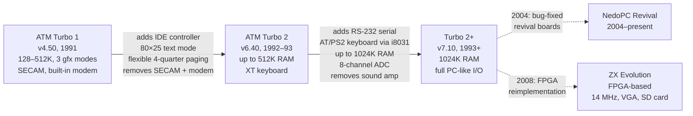
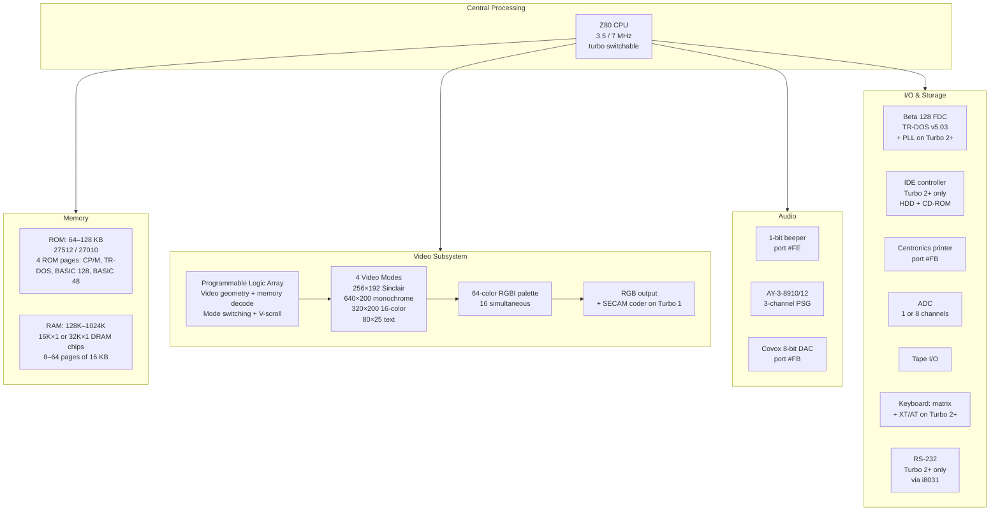

[← Home](../../README.md) · [Clone Hardware](README.md)

# ATM Turbo — Spectrum with CP/M, EGA Graphics, and IDE storage

The Pentagon was the people's Spectrum — cheap, simple, built from discrete TTL by hobbyists. But the team at **ATM** ("Association of Creative Youth," later "Association for Technics and Microelectronics") in Moscow wanted something more. They wanted a computer that could compete with the IBM PC: **80-column text**, **hard drive storage**, **multi-color graphics**, and **CP/M** — all while running the entire ZX Spectrum software library.

The result was the **ATM Turbo** (1991): a Pentagon-derived clone with **7 MHz turbo mode**, **512K–1024K RAM**, **four video modes** including 320×200 16-color and 640×200 monochrome, **built-in IDE** (possibly the world's first IDE controller for a ZX Spectrum), an **AY-3-8910** sound chip, a **Covox DAC**, and a **64-color RGBI palette**. It was designed by the creative team **MicroART** and sold as a "serious" machine for professional users — databases, word processing, telecommunications — not just gaming.

What made the ATM Turbo technically remarkable was how it achieved these capabilities on a Z80 architecture never designed for them. The 320×200 16-color-per-pixel mode used a clever trick: doubling the video RAM access frequency via dual RAM banks and a meander pixel pattern (`%RLRRRLLL`), cramming two 4-bit pixel values into each byte pair. The 640×200 mode provided crisp 80-column text for CP/M. A programmable logic array (PLA) handled the video geometry — and as a side effect, enabled **hardware vertical scroll**. And the memory manager, starting with the Turbo 2, could map **any RAM or ROM page into any of the four 16 KB quarters** of the Z80 address space — a more flexible scheme than the Sinclair 128K's fixed bank assignments.

The ATM Turbo line went through three major hardware revisions — **Turbo 1** (v4.x, 1991), **Turbo 2** (v6.x, 1992–1993), and **Turbo 2+** (v7.x, mid-1990s) — each adding capabilities. After MicroART ceased production around 1996, the **NedoPC** group revived the platform in 2004 with bug-fixed boards, and the **ZX Evolution** FPGA project (2008+) provided full ATM Turbo 2+ compatibility in reconfigurable hardware. As of the 2020s, the community remains active, with new demos and games still being released.

> [!NOTE]
> This article covers ATM Turbo **hardware architecture, models, video modes, memory paging, I/O ports, sound, and storage** in full technical detail. For clone video timing comparison (frame size, contention, INT position), see [clone_timing.md](clone_timing.md). For clone video modes overview, see [clone_video_modes.md](../../05_development/05_display_and_timing/clone_video_modes.md). For the full I/O port reference across all models, see [io_port_map.md](../../10_references/io_port_map.md).

---
## History & Development Timeline

The ATM Turbo was born from the same Moscow ecosystem that produced the Pentagon. The firm **ATM** had been selling Pentagon 128 variants (also called "ATM-128" or "Pentagon 2+") since 1990, advertised in *Radio* magazine. But ATM's target market was different from the hobbyist crowd: they wanted to sell the Spectrum as a **serious alternative to the IBM PC** — for professional users who needed word processing, databases, spreadsheets, and communications.

### The Players

| Entity | Role | Location |
|--------|------|----------|
| **ATM** (firm) | Production, marketing, distribution | VDNKh, Dom Kultury "Sozidatel," Moscow |
| **MicroART** (creative team) | Hardware design, schematics, prototyping | Moscow |
| **INTER-LINK** (firm) | Connectors, TV adapters, SECAM coder | Moscow |
| **NedoPC** (group) | Revived production (2004+), community support | Moscow / nedopc.org |

### Timeline

```
1990    ATM sells Pentagon 128 / ATM-128 — enhanced Pentagon with disk + printer
        │
1991    ATM Turbo 1 (v4.10–4.50) launched
        │  • MicroART designs hardware for ATM, based on their Pentagon variant
        │  • 128K–512K RAM, 7 MHz turbo, 3 graphics modes, AY-3-8910, Covox
        │  • SECAM coder, built-in modem, CP/M 2.2 support
        │  • First ad: Radio magazine, September 1991
        │
1992    ATM Turbo 2 (v6.00–6.40) introduced
        │  • MicroART parts with ATM, produces independently
        │  • NEW: IDE controller (world's first for ZX Spectrum!)
        │  • NEW: 80×25 text mode
        │  • NEW: flexible memory manager — any page in any 16K quarter
        │  • Memory expansion port hidden behind Beta disk ports for compatibility
        │  • First ad: Radio magazine, October 1992
        │
1993    ATM Turbo 2+ (v7.00–7.18) — incremental upgrade
        │  • NEW: RS-232 serial via i8031 microcontroller
        │  • NEW: XT/AT (PS/2) keyboard support via same microcontroller
        │  • NEW: up to 1024K RAM
        │  • Modem removed (sold externally instead)
        │  • SECAM coder removed (RGB output only)
        │
1996    Commercial production ceases (~300 software titles accumulated)
        │
2004    NedoPC revives ATM Turbo 2+ with bug-fixed boards (~50 units/batch)
        │
2008+   ZX Evolution FPGA project — full ATM Turbo 2+ compatibility in hardware
        │
2015    Zorel releases updated ATM Turbo 2+ PCB (v7.18) with reliability fixes
        │
2021    30th anniversary — community releases v8.10 firmware mod
```

### The MicroART Innovation

MicroART's approach to the ATM Turbo was fundamentally different from other clone manufacturers. While Pentagon and Scorpion focused on Spectrum compatibility, MicroART built toward **IBM PC equivalence**:

1. **Graphics modes matched IBM PC resolutions** — 320×200 and 640×200, not arbitrary clone-specific formats. This enabled direct ports of PC EGA games.
2. **IDE before anyone else** — the Turbo 2's IDE controller (1992–1993) was likely the first hard drive interface for any ZX Spectrum. CD-ROM was supported when it became affordable.
3. **CP/M in ROM** — the ATM Turbo could boot CP/M 2.2 directly, with the BIOS adapted for the hardware. This gave access to the CP/M software library — word processors, spreadsheets, databases.
4. **16-color palette matching EGA** — the 64-color RGBI palette (16 simultaneous) was chosen to match the IBM EGA standard, simplifying software conversion.

The first ATM Turbo games were direct copies of IBM PC titles — *Color Lines*, *Minesweeper*, *Prince of Persia* (1994, by Honey Soft), *Gobliiins* (1994). The ports were so faithful that game passwords matched the originals exactly.

---
## Model Comparison — ATM Turbo 1 vs 2 vs 2+

The three major ATM Turbo revisions differ significantly in hardware capabilities. The table below provides the **full specification comparison** as documented in the original MicroART/NedoPC source material.

### Full Specification Table

| Feature | ATM Turbo 1 (v4.50) | ATM Turbo 2 (v6.40) | Turbo 2+ (v7.10) |
|---------|---------------------|---------------------|------------------|
| **CPU** | Z80 | Z80 | Z80 |
| **Clock speed** | 3.5 MHz standard / **7 MHz turbo** | 3.5 MHz / **7 MHz turbo** | 3.5 MHz / **7 MHz turbo** |
| **ROM** | 64 KB (2× 27512) | 64 KB (27512) or 128 KB (27010) | 128 KB (27010) |
| **RAM** | 128 KB (16× 5) or **512 KB** (16× 7) | 128 KB or **512 KB** (16× 7) | 512 KB or **1024 KB** (32× 7) |
| **Memory manager** | 128K-compatible + `#FDFD` extension | Flexible: any page in any quarter | Same as Turbo 2 + extra page bit |
| **Turbo switch** | Hardware switch (front panel) | Port-controlled | Port-controlled |
| **Compatibility switch** | Hardware (Profi-style) | Not needed (hidden ports) | Not needed |
| **Video mode 1** | Sinclair 256×192 (16 colors, attributes) | Same | Same |
| **Video mode 2** | 640×200 monochrome ("hardware multicolor") | Same | Same |
| **Video mode 3** | 320×200, **16 colors per pixel** (EGA-style) | Same | Same |
| **Video mode 4** | — | **80×25 text mode**, 16 colors, 8×8 chars | Same |
| **Palette** | 64 colors (RGBI), 16 simultaneous | Same | Same |
| **Hardware scroll** | Yes (PLA-based, vertical) | Yes (320×200 and 640×200 modes) | Same |
| **Video output** | RGB + **SECAM coder** (TV) | RGB (SECAM removed) | RGB |
| **Beeper** | Yes (standard ZX) | Yes | Yes |
| **Covox DAC** | Yes (port `#FB`, 8-bit, К572ПА1) | Yes | Yes |
| **AY-3-8910/12** | Yes (3 channels) | Yes (3 channels, 8910 or 8912) | Yes (3 channels) |
| **ADC** | No | **Yes** (1 channel, К1113ПВ1, 9-bit) | **Yes** (8 channels, К5712ПВ1 / 1108ПВ1 + К155ИД17, ~200 kHz) |
| **Floppy controller** | Beta 128 (TR-DOS v5.03) | Beta 128 with **PLL** (digital phase-locked loop) | Beta 128 with PLL |
| **IDE controller** | **No** | **Yes** (HDD + CD-ROM) | **Yes** (HDD + CD-ROM) |
| **Port #FF** | No | **Yes** (floating bus / attribute read) | Yes |
| **Sound amplifier** | Yes (2×1 W stereo) | Yes (2×1 W stereo) | No (removed) |
| **Centronics printer** | Yes | Yes | Yes |
| **Beta 128 second FDC** | No | No | Yes (second floppy controller) |
| **Parallel DAC (tape)** | Yes | Yes | No |
| **Tape interface** | Yes | Yes | Yes |
| **Keyboard** | Sinclair matrix (40 or 64 keys) | Same + **XT keyboard** (КР537ХТ10) | Same + **XT/AT keyboard** (1816ВЕ31 / i8031) |
| **RS-232 serial** | No | No | **Yes** (via 1816ВЕ31 / i8031) |
| **Sinclair joystick** | Yes | Yes | Yes |
| **Kempston joystick** | No | No | Yes (via RS-232 port + external adapter) |
| **Mouse** | No | No | Yes (via RS-232 port) |
| **Modem** | **Yes** (built-in, DAC-based) | Yes | No (external via RS-232) |
| **PROM programmer** | Yes (port `#FA`) | Yes | Yes |
| **Real-time clock** | Yes (КР1556ХХ8, battery-backed) | Yes (КР1556ХХ8) | Yes (КР1556ХХ8) |
| **PCB dimensions** | 312×132 mm | 335×190 mm | 335×190 mm |
| **Power supply** | +5V, +12V | +5V, +12V (optional −12V for FDC) | +5V, +12V (optional −12V for FDC) |
| **Power consumption** | 99 chips | ~Moderate | 127 chips |
| **Case** | "Mikrosha" case or PC case | PC AT case | PC AT case |
| **SW compatibility (ZX)** | 60% generic / 90–95% with compatibility tests | 90% generic / 95–96% with tests | Same |

### The PC Drift — From Spectrum to Workstation

Most Soviet clones — Pentagon, Scorpion, Kay — stayed true to the Spectrum's DNA: game machines for hobbyists, built cheap, improved only in memory and clock speed. The ATM Turbo took a fundamentally different path. Every design decision pushed it **toward the IBM PC** while keeping one foot in the Spectrum's software library. This was not an accident — MicroART explicitly targeted the **"serious" customer** who needed a computer for databases, word processing, and communications, not just gaming.

The result was a machine that is architecturally schizophrenic: a ZX Spectrum at its core, but wrapped in a layer of PC-compatible subsystems that make it capable of things no Spectrum was ever designed to do.

#### The PC Convergence Matrix

Each row shows a subsystem where the ATM Turbo adopted IBM PC conventions rather than Spectrum conventions:

| Subsystem | ZX Spectrum 128K (baseline) | Pentagon 128K (clone baseline) | ATM Turbo 2+ (PC drift) | IBM PC Equivalent |
|-----------|-----------------------------|-------------------------------|------------------------|-------------------|
| **Video resolution** | 256×192 — TV-oriented, non-standard | Same — no change | **320×200 and 640×200** — matches CGA/EGA standard modes | CGA: 320×200 16-color, 640×200 mono; EGA: identical |
| **Color model** | 15-color proprietary ULA palette | Same — no change | **64-color RGBI** (6-bit, 16 simultaneous) — bit-for-bit EGA palette | EGA: 64-color RGBI, 16 on screen |
| **Text display** | 32×24 characters, 8×8 attribute cells | Same — no change | **80×25 hardware text mode** with RAM-based character generator — PC console standard | MDA/CGA/EGA text: 80×25 |
| **Color per pixel** | 2 (INK/PAPER per 8×8 block — attribute clash) | Same — no change | **16 per pixel** (320×200 mode, no clash) — like EGA 16-color | EGA: 16 colors per pixel at 320×200 |
| **Mass storage** | Tape (primary); +3 DOS floppy (optional) | Tape → TR-DOS floppy (standard) | **IDE hard drive + CD-ROM** in ROM — boot from HDD like a PC | ATA/IDE, CD-ROM via ATAPI |
| **Operating system** | BASIC 48/128 in ROM | Same + TR-DOS | **CP/M 2.2 in ROM** + TR-DOS + BASIC — multi-OS boot, like a PC's BIOS → OS handoff | MS-DOS / PC-DOS from disk |
| **Keyboard** | 40-key rubber membrane (Sinclair layout) | Same or 64-key matrix | **XT/AT (PS/2) keyboard** via i8031 microcontroller — standard PC peripheral | 101-key AT keyboard |
| **Serial I/O** | None | None | **RS-232** with full modem control (DTR, RTS, CTS, DSR, DCD) — PC serial port | 16450/8250 UART serial |
| **Printer** | ZX Interface 1 (rare) or add-on | Centronics add-on | **Built-in Centronics** parallel port — PC LPT standard | LPT parallel port |
| **Expansion** | ZX Bus edge connector | Ribbon cable (no standard bus) | **No system bus** — just dedicated ports (PROM programmer, disk) | ISA slots |
| **Clock speed** | 3.5 MHz fixed | 3.5 MHz fixed (turbo = aftermarket mod) | **7 MHz turbo, factory standard, software-switchable** | 4.77 MHz → 7.16 MHz (PC AT) |
| **Case/form factor** | Integrated keyboard (rubber dome) | Bare board (DIY case) | **PC AT tower case** — looks and feels like an IBM PC | PC AT desktop/tower |

#### What This Means in Practice

The convergence is not superficial. An ATM Turbo 2+ user in 1994 could:

- **Boot CP/M from ROM** — then load a word processor (WordStar), spreadsheet (SuperCalc), or database (dBase II) from a **hard drive**
- **Work in 80-column text** — at a resolution readable on a real monitor, not a TV screen
- **Type on a standard IBM keyboard** — with full Cyrillic/Latin switching
- **Print to a Centronics printer** — connected directly, no interface module needed
- **Connect a modem via RS-232** — and dial into FidoNet or the early internet
- **Play EGA games** — *Prince of Persia*, *Color Lines*, *Gobliiins* — ported from the PC with graphics that closely matched the originals
- **Switch to Spectrum mode** — and run the entire 48K/128K software library, including the thousands of Russian games and demos

No other Spectrum clone offered this combination. The Pentagon was a gaming machine. The Scorpion was a developer's machine. The Profi was a competitor in the same "serious" niche, but it used its own graphics modes (512×256) rather than matching PC standards, and it lacked the IDE controller. The ATM Turbo was the **only Spectrum derivative that systematically replicated IBM PC hardware conventions**.

#### Why It Worked — and Why It Ultimately Didn't

The strategy was viable in 1991–1993, when an IBM PC cost the equivalent of 5–10 months' average salary in the post-Soviet economy, and the ATM Turbo undercut it significantly. For a professional user — an engineer, accountant, or small business owner — the ATM Turbo offered 80% of the PC's productivity at perhaps 40% of the cost, while also running the Spectrum gaming library. The CP/M software catalog, while not as vast as MS-DOS, included serious productivity tools.

But by 1995–1996, the PC price collapse made the argument collapse with it. Why buy a Z80-based machine that runs CP/M when a real 80286 PC running MS-DOS costs only slightly more? MicroART itself was forced to sell PCs alongside the ATM Turbo, and eventually stopped production. The Pentagon survived longer because it never competed with the PC — it was a cheap gaming machine, and remained viable in that niche for years.

The ATM Turbo's PC drift was its defining ambition and its ultimate limitation. It created the most capable Spectrum clone ever built — and the one most directly in competition with the platform it was trying to become.

#### Model Evolution Diagram



> [!NOTE]
> The firmware version number (v4.x, v6.x, v7.x) is the definitive way to identify an ATM Turbo model. The version corresponds to the PCB revision and determines which ports and features are available. Software that detects the ATM Turbo typically reads version-specific registers or tests for the presence of Turbo 2+ features (IDE, text mode, `#FF77` system port).

---
## Hardware Architecture

The ATM Turbo is built entirely from **discrete TTL logic chips** (Soviet КР1533 / К555 series = 74LS equivalents), with a **programmable logic array (PLA)** for video geometry and memory decoding. There is no ULA, no CPLD, and no FPGA on the original hardware — only the later NedoPC revival boards and the ZX Evolution use programmable logic.



### CPU & Turbo Mode

All ATM Turbo models use a standard **Zilog Z80** (or Soviet КР1858ВМ1 equivalent) running at **3.5 MHz** in standard mode — the same base clock as the ZX Spectrum 48K/128K and the Pentagon. The **turbo mode** doubles this to **7.0 MHz**.

| Parameter | ZX Spectrum 128K | Pentagon 128K | ATM Turbo |
|-----------|-----------------|---------------|-----------|
| **CPU** | Z80A (3.5 MHz rated) | Z80A or КР1858ВМ1 | Z80A or КР1858ВМ1 |
| **Standard clock** | 3.546900 MHz | 3.500000 MHz | 3.500000 MHz |
| **Turbo clock** | N/A | N/A (some mods) | **7.000000 MHz** |
| **Turbo activation** | N/A | Hardware mod | Hardware switch (Turbo 1) / Port write (Turbo 2+) |
| **T-states/frame @ 3.5 MHz** | 70,908 (228T × 311 lines) | 71,680 (224T × 320 lines) | **~69,888** (224T × 312 lines) |
| **T-states/frame @ 7 MHz** | N/A | N/A | **~139,776** (doubled) |
| **Clock source** | 14.11 MHz crystal ÷ 4 | 14.0 MHz crystal ÷ 4 | 14.0 MHz crystal ÷ 4 / ÷ 2 |

Key differences from the 128K and Pentagon:

- **Turbo mode is standard** — unlike the Pentagon where 7 MHz requires aftermarket modification, every ATM Turbo has turbo built in from the factory
- **Turbo 1**: physical front-panel "TURBO" button on the case
- **Turbo 2+**: turbo is software-controlled via port writes, no physical button needed. The turbo state can be toggled at runtime
- **At 7 MHz, memory access timing changes** — the CPU runs twice as fast but DRAM access speed remains the same. The ATM Turbo handles this by using the turbo mode only when the video circuit is not accessing RAM, or by using wait states for incompatible timing windows
- **I/O timing at 7 MHz** — port accesses complete faster, which affects any software with cycle-counted I/O loops

> [!WARNING]
> Software that uses cycle-exact timing (multicolor effects, tape loading routines, floppy access) will **not work correctly in 7 MHz turbo mode** without adjustment. The standard approach is to switch to 3.5 MHz for timing-critical operations and back to 7 MHz for computation-heavy work.

---
## Memory Architecture & Paging

The ATM Turbo's memory system is its most significant architectural departure from both the ZX Spectrum 128K and the Pentagon. While the 128K and Pentagon only page RAM into the top 16 KB (`#C000`–`#FFFF`), the ATM Turbo 2+ can map **any RAM or ROM page into any of the four 16 KB quarters** of the Z80's address space.

### Memory Comparison: 128K vs Pentagon vs ATM Turbo

| Feature | ZX Spectrum 128K | Pentagon 128K–1024K | ATM Turbo 1 (v4.50) | ATM Turbo 2/2+ (v6.40–7.10) |
|---------|-----------------|---------------------|---------------------|------------------------------|
| **Total RAM** | 128 KB (8 banks) | 128–1024 KB (8–64 pages) | 128–512 KB | 128–1024 KB |
| **Total ROM** | 32 KB (2 banks) | 32 KB (2 banks) + TR-DOS | 64 KB (4 ROM pages) | 128 KB (4 ROM pages) |
| **Page size** | 16 KB | 16 KB | 16 KB | 16 KB |
| **`#C000` paging** | `#7FFD` bits 0–2 (8 banks) | `#7FFD` bits 0–2 + `#EFF7` ext bits | `#7FFD` + `#FDFD` | `#7FFD` + `#FDFD`/`#FF77` system |
| **`#4000` paging** | **Fixed** (always Bank 5) | **Fixed** (always Bank 5) | **Fixed** (always Bank 5) | **Switchable** — any page |
| **`#8000` paging** | **Fixed** (always Bank 2) | **Fixed** (always Bank 2) | **Fixed** (always Bank 2) | **Switchable** — any page |
| **`#0000` paging** | ROM 0/1 (bit 4) or TR-DOS | ROM 0/1 or TR-DOS | ROM 0–3 or RAM-0 (CP/M user mode) | ROM or RAM — any page |
| **CP/M user mode** | N/A | N/A | **Yes** — RAM-0 at `#0000` | **Yes** — RAM-0 at `#0000` |
| **Max addressable** | 128 KB | 1024 KB | 512 KB | **1024 KB** |
| **Contention** | Banks 1, 3, 5, 7 | **None** | **None** | **None** |

### Memory Map — Operating Modes

The ATM Turbo operates in several distinct memory configurations depending on the active ROM/RAM selection. The table below shows the memory layout for each mode:

#### ATM Turbo 1 (v4.50) Memory Modes

```
Mode           Spectrum-128    Spectrum-48     TR-DOS          CP/M-system     CP/M-users
─────────────────────────────────────────────────────────────────────────────────────────
ROM select     ROM2=0          ROM2=1          ROM2=0(!)       ROM2=x          ROM2=x
#0000-#3FFF    ROM-2 (BASIC128) ROM-3 (BASIC48) ROM-1 (TR-DOS) ROM-0 (CP/M)    RAM-0
#4000-#7FFF    RAM-5           RAM-5           RAM-5           RAM-5           RAM-4
#8000-#BFFF    RAM-2           RAM-2           RAM-2           RAM-2           RAM-2
#C000-#FFFF    per #7FFD       per #7FFD       per #7FFD       RAM-1 or RAM-3  RAM-3
─────────────────────────────────────────────────────────────────────────────────────────
```

#### ATM Turbo 2/2+ (v6.40–7.10) Memory Modes

```
Mode           Spectrum-128    Spectrum-48     TR-DOS          CP/M-system     CP/M-users
─────────────────────────────────────────────────────────────────────────────────────────
ROM select     ROM2=0          ROM2=1          ROM2=0(!)       ROM2=1          ROM2=0
#0000-#3FFF    ROM-#3E         ROM-#3C         ROM-#3D         ROM-#3F         RAM-0
#4000-#7FFF    RAM-5           RAM-5           RAM-5           RAM-5           RAM-4
#8000-#BFFF    RAM-2           RAM-2           RAM-2           RAM-2           RAM-2
#C000-#FFFF    per #7FFD       per #7FFD       per #7FFD       RAM-1 or RAM-3  RAM-3
─────────────────────────────────────────────────────────────────────────────────────────
```

> [!NOTE]
> The ROM page numbering differs between Turbo 1 and Turbo 2+. On the Turbo 2+ with a 128 KB ROM (27100/27010 chip), pages 0–3 are "main" system ROMs and pages 4–7 mirror them with localization variants. The ROM page is selected via the CPSYS signal (port `#FB` bit A7) and `#7FFD` bit 4.

#### ROM Page Contents

| ROM Page | Contents |
|----------|----------|
| ROM-0 | **CP/M 2.2** system (BIOS 1.03–1.07) |
| ROM-1 | **TR-DOS v5.03** (with memory manager support) |
| ROM-2 | **BASIC 128** editor ROM |
| ROM-3 | **BASIC 48** ROM (Sinclair-compatible) |

### Paging Ports — Detailed Comparison

| Port | ZX Spectrum 128K | Pentagon 128K | ATM Turbo 1 | ATM Turbo 2/2+ |
|------|-----------------|---------------|-------------|----------------|
| `#7FFD` | Bank 0–2, screen, ROM, lock | Same + `#EFF7` for ext | Same + `#FDFD` for ext | Same, but also used for paging upper quarters |
| `#EFF7` | N/A | Extended bank bits (512K/1024K) | N/A | N/A |
| `#FDFD` | N/A | N/A | **512K extension** — 2 extra bank bits | **Extended paging** (2 bits for 512K/1024K) |
| `#FF77` | N/A | N/A | N/A | **System port** — video mode, turbo, RAM/ROM page in all quarters |
| `#1FFD` | N/A | Beta 128 FDC | Beta 128 FDC | Beta 128 FDC (overlaps with +2A/+3 — different function!) |

### CP/M Memory Model

In CP/M "user" mode, the ATM Turbo maps **RAM page 0 at `#0000`–`#3FFF`** instead of ROM. This is essential for CP/M operation — CP/M needs writable low memory for its BIOS page zero vectors and BDOS entry points. This is a feature the Sinclair 128K and Pentagon do not have.

The CP/M "system" mode keeps ROM at `#0000` for boot, then switches to user mode after CP/M initialization.

---
## Video Modes — Detailed

The ATM Turbo supports **four video modes**, a dramatic expansion over the single mode on the ZX Spectrum 128K and Pentagon. Each mode was designed with a specific purpose — Spectrum compatibility, CP/M text display, IBM PC game porting, or high-resolution monochrome work.

### Mode Overview — Comparison with 128K and Pentagon

| Mode | ZX Spectrum 128K | Pentagon 128K | ATM Turbo |
|------|-----------------|---------------|-----------|
| Standard ZX Spectrum | **256×192**, 8×8 attributes, 16 colors from 15-color palette | Same | Same |
| Hardware multicolor | N/A | N/A (GigaScreen only — temporal) | N/A (different approach) |
| High-resolution mono | N/A | N/A | **640×200**, 2 colors per 8×1 strip |
| High-color per pixel | N/A | N/A | **320×200**, 16 colors per pixel |
| Text mode | N/A | N/A | **80×25**, 16 colors, 8×8 character generator |
| Palette | 15 colors (ULA) + border (8th color) | Same as 128K | **64 colors** (RGBI), 16 simultaneous |
| Attribute clash | Yes (8×8 blocks) | Yes (same) | **No** in 320×200 and text modes |
| Hardware scroll | N/A | N/A | **Yes** (vertical, PLA-based) |

### Video Mode Switching

Mode selection differs between hardware revisions:

#### ATM Turbo 1 (v4.50) — Port `#FE` Address Bits

On the Turbo 1, video mode is selected via **address lines A5 and A6** when writing to port `#FE` (the standard ZX Spectrum border/beeper port). This is an unusual encoding — the mode is selected by *which address* you write to, not by the data byte:

```
OUT (#FE), A — where the address encoding determines video mode:

  A6  A5   Mode
  ──────────────────────────────────────────────
   1   1   Sinclair 256×192 standard mode
   0   1   640×200 monochrome ("hardware multicolor")
   0   0   320×200, 16 colors per pixel (EGA-style)
   1   0   (undefined / unused)
```

Additionally, address line **A3** controls the BRIGHT inversion for non-standard modes:

```
A3 = 0 → BRIGHT 1 active (extends palette effectively from 8 to 16 colors)
A3 = 1 → BRIGHT 0 (standard palette)
```

> [!WARNING]
> Because the Turbo 1 uses address bits on `#FE` for mode selection, any standard Spectrum code that writes to `#FE` for border color or beeper may **inadvertently switch video modes**. The address must be carefully constructed: bits A5=1 and A6=1 must be set to maintain Sinclair mode.

#### ATM Turbo 2/2+ (v6.40–7.10) — Port `#FF77`

The Turbo 2+ moved mode switching to a dedicated system port `#FF77`, leaving `#FE` compatible with standard Spectrum usage. This was a major compatibility improvement:

```
OUT (#FF77), A — system configuration register (Turbo 2+):

  Bit 0 (RG0) ─┐
  Bit 1 (RG1) ─┤   Video mode select:
  Bit 2 (RG2) ─┘
                 RG0  RG1  RG2   Mode
                 ─────────────────────────────────────────────
                  1    1    0    Sinclair 256×192 standard
                  0    1    0    640×200 monochrome
                  0    0    0    320×200 EGA (16 colors per pixel)
                  0    1    1    80×25 text mode (16 colors)

  Bit 3   RAM page select for #0000-#3FFF (0 = ROM, 1 = RAM-0)
  Bit 4   ROM page bit 0 (0-3 = main, 4-7 = localized)
  Bit 5   Extended RAM page bit (for 1024K: pages above 512K)
  Bit 6   = 1: ROM banking / = 0: RAM banking at #0000-#3FFF
  Bit 7   Enable separate paging for #0000-#3FFF window
```

The `#FF77` port is also known as the "soft port" because it can be accessed via multiple address aliases (`#BD77`, `#BF77`, `#FD77`, `#FE77`, `#FF77`), each controlling different subsystems (palette, PLL FDC, shadow screen, paging).

---

### Mode 1: Sinclair 256×192 (Standard Spectrum Mode)

This mode is **100% compatible** with the ZX Spectrum 128K and Pentagon. The pixel bitmap lives at `#4000`–`#57FF` (6,144 bytes) and attributes at `#5800`–`#5AFF` (768 bytes). The nonlinear screen layout (three inter-leaved thirds) is preserved.

```
Pixel memory:    #4000–#57FF  (6,144 bytes) — 256×192 pixels, 1 bit per pixel
Attribute memory: #5800–#5AFF  (768 bytes) — 32×24 grid, 8×8 pixel blocks
Attribute byte:   INK(0-2) | PAPER(3-5) | BRIGHT(6) | FLASH(7)
```

| Feature | ZX Spectrum 128K | Pentagon 128K | ATM Turbo |
|---------|-----------------|---------------|-----------|
| Screen address | `#4000`–`#5AFF` | Same | Same |
| Attribute resolution | 8×8 pixels | Same | Same |
| Colors per attribute | 2 (INK + PAPER) from 8+7 palette | Same | Same (but with enhanced palette) |
| Shadow screen | Bank 7 (via `#7FFD` bit 3) | Same | Same |
| Contention during screen draw | Banks 1, 3, 5, 7 contended | **None** | **None** |
| Palette | 15-color ULA palette | Same as 128K | **64-color RGBI** (16 usable at once) |

> [!NOTE]
> Even in Sinclair mode, the ATM Turbo's RGBI palette circuit is active. The 16 standard Spectrum colors are mapped into the 64-color palette space, so standard software looks identical. But software that knows about the ATM palette can redefine any of the 16 colors to any of 64 values.

---

### Mode 2: 640×200 Monochrome

The 640×200 mode provides **80-column text** capability and crisp monochrome graphics. It was designed primarily for CP/M applications that need 80-character-wide terminals.

```
Memory layout:    Linear — no ZX Spectrum nonlinear addressing
Screen size:      640×200 pixels, 1 bit per pixel
Memory required:  640 × 200 / 8 = 16,000 bytes
Color:            2 colors per 8×1 pixel strip (INK + PAPER from palette)
```

**How it works**: The video circuit reads pixel data at **double the standard frequency**, using both RAM banks simultaneously. Each byte represents 8 horizontal pixels. The attribute byte for each 8×1 cell determines INK and PAPER colors — effectively giving a 640×200 display with 2 colors per 8-pixel horizontal strip.

| Feature | ZX Spectrum 128K | Pentagon 128K | ATM Turbo 640×200 |
|---------|-----------------|---------------|-------------------|
| Resolution | 256×192 | Same | **640×200** (2.5× horizontal) |
| Pixels per byte | 8 | Same | Same |
| Color attributes | 8×8 blocks | Same | **8×1 strips** (8× finer vertical resolution) |
| Total screen memory | 6,912 bytes | Same | **16,000 bytes** |
| Address layout | Nonlinear (thirds) | Same | **Linear** (sequential scan) |

> [!NOTE]
> The 640×200 mode's linear memory layout is **fundamentally different** from the ZX Spectrum's nonlinear screen. Screen position calculations used in standard Spectrum code will not work. Address = `base + (y × 80) + (x / 8)`, bit position = `7 - (x % 8)`.

---

### Mode 3: 320×200, 16 Colors Per Pixel (EGA-Style)

This is the ATM Turbo's signature graphics mode — **16 colors per pixel with no attribute clash**. It was designed to match the IBM PC EGA 320×200 16-color mode, enabling direct porting of PC games like *Prince of Persia*, *Color Lines*, and *Gobliiins*.

```
Screen size:      320×200 pixels
Color depth:      16 colors per pixel (4 bits per pixel)
Memory required:  320 × 200 / 2 = 32,000 bytes (2 pixels per byte)
Color palette:    16 colors selected from 64-color RGBI palette
```

**How it works** — this is the clever part:

1. **Hardware multicolor via address multiplexing** — the video circuit reads attribute data at the same rate as pixel data, providing per-pixel color information
2. **Doubled RAM access frequency** — the authors used both RAM lines simultaneously, reading from both banks at once. This doubles the effective video bandwidth without stopping the CPU
3. **Meander pixel pattern** — instead of reading pixel data and attribute data separately, the circuit reads only the attribute register and substitutes a meander pattern (`%RLRRRLLL`) for pixel data:

```
Byte layout in memory: %RLRRRLLL
  LLLL = left pixel (4-bit color index, 0-15)
  RRRR = right pixel (4-bit color index, 0-15)

Each byte encodes TWO adjacent horizontal pixels.
The meander alternates which pixel pair is read on each access cycle.
```

4. **Separate geometry counter** — the higher address bits are detached from the Spectrum's screen geometry counters and fed by an independent counter, producing the 320×200 raster instead of the Spectrum's 256×192

| Feature | ZX Spectrum 128K | Pentagon 128K | ATM Turbo 320×200 |
|---------|-----------------|---------------|-------------------|
| Resolution | 256×192 | Same | **320×200** |
| Colors per pixel | 2 (attribute-based) | Same | **16** (per pixel, no clash) |
| Attribute clash | Yes (8×8 blocks) | Yes | **None** |
| Color depth | Effectively ~8 colors per pixel | Same | **4 bits per pixel** |
| Total screen memory | 6,912 bytes | Same | **32,000 bytes** |
| Address layout | Nonlinear (thirds) | Same | **Linear** |
| Comparable to | N/A | N/A | IBM PC EGA 320×200 16-color |

> [!NOTE]
> The 320×200 mode requires 32 KB of contiguous screen memory — nearly half the Z80's address space. The ATM Turbo handles this by using its memory paging system to make screen memory span multiple RAM pages. The video circuit reads directly from physical RAM, bypassing the CPU's paged view.

---

### Mode 4: 80×25 Text Mode (Turbo 2+ Only)

Added in the ATM Turbo 2, this mode provides a true **hardware text console** with 80 columns and 25 rows — exactly matching the CP/M standard terminal dimensions.

```
Screen size:      80×25 characters
Character cell:   8×8 pixels (same as Spectrum font)
Total pixels:     640×200
Colors:           16 colors per character (foreground + background)
Character set:    Configurable — stored in RAM, 256 characters × 8 bytes = 2,048 bytes
```

The text mode uses a character generator that maps ASCII/character codes to 8×8 pixel patterns. Each character cell has an associated attribute byte specifying foreground and background colors from the 16-color palette.

| Feature | ZX Spectrum 128K | Pentagon 128K | ATM Turbo Text Mode |
|---------|-----------------|---------------|---------------------|
| Text columns | 32 (standard) | Same | **80** |
| Text rows | 24 (standard) | Same | **25** |
| Character cell | 8×8 | Same | Same |
| Colors per cell | 2 (INK + PAPER) | Same | **16** (foreground + background, no clash) |
| Character generator | In ROM (fixed) | Same | **In RAM** (redefinable) |
| Screen memory for text | 768 bytes (attributes) | Same | 80×25×2 = **4,000 bytes** (char + attr pairs) |

> [!NOTE]
> The text mode character generator is stored in **RAM, not ROM**. This means programs can redefine the font at runtime — useful for custom character sets, icons, or double-height text. This is similar to how the Commodore 64 or IBM PC character generators work.

---

### Palette System — 64-Color RGBI

The ATM Turbo's color palette is a **64-color RGBI (Red, Green, Blue, Intensity)** system, identical to the IBM EGA standard. Up to 16 colors can be active simultaneously, selected from the 64-color space.

```
RGBI encoding (6 bits per color, 2 bits per channel):
  R1 R0 G1 G0 B1 B0  →  64 possible colors

Standard Spectrum colors mapped to RGBI:
  Black:      000000
  Blue:       000001
  Red:        100000
  Magenta:    100001
  Green:      001000
  Cyan:       001001
  Yellow:     101000
  White:      111111
  (Bright variants use the I bit or higher R/G/B bits)
```

**Palette programming**: The palette is accessed through the "disk controller" ports — when the CPU accesses certain ports in the `#xFF` range, the data bus value is latched as a palette entry:

| Port | Address (A15–A0) | Function |
|------|-------------------|----------|
| `#FF` | `xxxxxxxx1xxxxx11` | Palette write (Turbo 1: `#7DFD`) — D0-D5 = BRGbrg color value |
| `#FF77` | soft port | Palette + PLL + shadow screen control (Turbo 2+) |

On the Turbo 1, palette is set via `OUT (#7DFD), A` where A contains the 6-bit color value. The color index being set is determined by the current attribute output from the video circuit — you write the color data, and the hardware latches it into whichever palette slot corresponds to the current display position.

On the Turbo 2+, palette control moved to the `#FF77` system port family, with more precise address decoding.

> [!WARNING]
> The palette ports **overlap with Beta 128 disk interface ports** on the Turbo 1. Writing palette values while a disk operation is in progress can corrupt both the palette and the disk access. Always disable interrupts and verify disk controller state before writing palette entries on the Turbo 1.

---

### Hardware Vertical Scroll

A side effect of the PLA-based video geometry is **hardware vertical scrolling**. The video counter chain includes a register whose value offsets the starting scan line — writing a different value scrolls the entire display up or down without any CPU overhead.

This feature was discovered by demo coders and used in productions like *Catdemo* and *Info Guide #10*. It is accessed through the same PLA registers that control video mode and geometry — it was not documented in the original ATM Turbo manuals.

| Feature | ZX Spectrum 128K | Pentagon 128K | ATM Turbo |
|---------|-----------------|---------------|-----------|
| Hardware scroll | **None** | **None** | **Yes** — vertical, PLA-based |
| Software scroll | CPU-intensive (LDIR per row) | Same (faster — no contention) | Same (or use hardware scroll) |
| Scroll granularity | 1 pixel (CPU) | Same | **1 scan line** (hardware) |

---
## I/O Ports — Complete Reference

The ATM Turbo uses a complex I/O port scheme that evolved significantly between revisions. The Turbo 1 reused standard Spectrum ports (`#FE`) with overloaded address bits, causing compatibility issues. The Turbo 2+ moved most functions to dedicated ports (`#FF77` family), improving compatibility dramatically.

### Port Summary — Comparison with 128K and Pentagon

| Port | ZX Spectrum 128K | Pentagon 128K | ATM Turbo 1 (v4.50) | ATM Turbo 2+ (v7.10) |
|------|-----------------|---------------|---------------------|----------------------|
| `#FE` | Border, beeper, MIC, keyboard | Same | Border, beeper, MIC, keyboard **+ video mode via A5/A6** | Standard (mode moved to `#FF77`) |
| `#FF` | Floating bus | Different / absent | Not used | **Attribute read** (floating bus equivalent) |
| `#7FFD` | Paging: bank, ROM, screen, lock | Same + `#EFF7` ext | Same + `#FDFD` ext | Same (write), **IDE/ADC status** (read) |
| `#BFFD` | AY data write | Same | Same | Same |
| `#FFFD` | AY register select | Same (overlaps FDC!) | Same (overlaps FDC!) | Same |
| `#FB` | N/A | N/A | **Printer, Covox DAC, CP/M sys** | Same |
| `#FA` | N/A | N/A | **PROM programmer** | Same |
| `#FDFD` | N/A | N/A | **512K memory extension** | Extended paging (2 bits) |
| `#FF77` | N/A | N/A | N/A | **System: video mode, turbo, paging** |
| `#7DFD` | N/A | N/A | **Palette write / ADC data read** | Palette / ADC data |
| `#FFE7` | N/A | N/A | N/A | XT keyboard controller (v6.40 only) |
| `#EF` family | N/A | N/A | N/A | **IDE interface** (v6.40+) |
| `#1F`/`#3F`/`#5F`/`#7F`/`#FF` | N/A | Beta 128 FDC | Beta 128 FDC | Beta 128 FDC + `#FF` palette |
| `#EFF7` | N/A | Extended mem (512K+) | N/A | N/A |
| `#1FFD` | N/A | Beta 128 ROM page | Beta 128 ROM page | Beta 128 ROM page |

---

### Port `#FE` — ULA Register (Border, Beeper, Keyboard)

#### Write — Turbo 1 (v4.50)

```
OUT (#FE), A — address bits A5, A6 select video mode:

  Address pattern: %nnnnnnnn XXAnX1A0

  D0–D2:   Border color (8 values: BRG) — same as ZX Spectrum
  D3:      MIC output (tape)
  D4:      EAR output (beeper/speaker)
  D5–D7:   Unused

  A0 = 0:  Port selected (standard decode)
  A3:      BRIGHT inversion (A3=0 → BRIGHT 1, A3=1 → BRIGHT 0)
  A5 (RG1): Video mode select bit 1
  A6 (RG0): Video mode select bit 0
```

| A6 | A5 | Video Mode |
|----|----|------------|
| 1 | 1 | Sinclair 256×192 (standard) |
| 0 | 1 | 640×200 monochrome |
| 0 | 0 | 320×200 16-color (EGA) |
| 1 | 0 | Undefined |

#### Write — Turbo 2+ (v7.10)

```
OUT (#FE), A — standard Spectrum-compatible:

  Address pattern: %nnnnnnnn nnnnX110

  D0–D2:   Border color (BRG)
  D3:      MIC output
  D4:      EAR output (beeper)
  D5–D7:   Unused
```

The Turbo 2+ decodes `#FE` more tightly (`A2=1, A1=1, A0=0`), matching the pattern used by Scorpion and Profi. Video mode is no longer controlled from this port.

| Decoding | ZX Spectrum 128K | Pentagon 128K | ATM Turbo 1 | ATM Turbo 2+ |
|----------|-----------------|---------------|-------------|--------------|
| Lines checked | A0=0 only | A0=0 only | A0=0 (+ A5, A6 for mode) | `A2=1, A1=1, A0=0` |

#### Read — All Models

```
IN A,(#FE) — keyboard + status:

  D0–D4:   Keyboard row data (5 bits, active low)
  D5:      (Turbo 1) Disk motor status / (Turbo 2+) status bit Z
  D6:      Tape input (EAR)
  D7:      (Turbo 1) Disk data / (Turbo 2+) INT pending status

  A8–A15:  Keyboard row select (same as standard Spectrum)
```

---

### Port `#FF` — Attribute / Floating Bus

| Model | Function | Notes |
|-------|----------|-------|
| ZX Spectrum 128K | Floating bus — returns current ULA attribute byte | Used for raster sync |
| Pentagon 128K | **Different** — returns screen data from independent video counter | Not reliable for sync |
| ATM Turbo 1 | **Not used** | |
| ATM Turbo 2+ | **Attribute read** — returns current video attribute byte | Works like 128K floating bus |

```
Read:  IN A,(#FF) — returns attribute byte from current scan position

Decoding (Turbo 2+): %xxxxxxxxxxxxx111 (only low 3 address lines checked)
```

---

### Port `#7FFD` — Memory Paging Register

#### Write

```
OUT (#7FFD), A — paging register:

  Bit  Value  Function
  ──── ────── ────────────────────────────────────────
  0–2  B0-B2 RAM bank at #C000–#FFFF (0–7, or 0–63 with extensions)
  3    SCR   Screen select (0 = Bank 5, 1 = Bank 7 shadow)
  4    ROM   ROM select (0 = BASIC 128, 1 = BASIC 48)
  5    DIS   Disable paging lock (1 = lock #7FFD for 48K compatibility)
  6–7  —     Unused on standard
```

| Feature | ZX Spectrum 128K | Pentagon 128K | ATM Turbo |
|---------|-----------------|---------------|-----------|
| Bank bits 0–2 | 8 banks | 8 banks (+ `#EFF7` ext) | 8 banks (+ `#FDFD` ext) |
| Screen bit 3 | Yes | Yes | Yes |
| ROM bit 4 | Yes (2 ROMs) | Yes | Yes (4 ROM pages via CPSYS) |
| Lock bit 5 | Bit 5 on some, bit 7 on others | Bit 7 | **Bit 5** — locks `#7FFD` for 48K mode |
| Read back | Write-only | Write-only | **Readable** — returns status (IDE, ADC) |

#### Read (ATM Turbo 2+ only)

```
IN A,(#7FFD) — returns status register:

  D0–D3:   Unused
  D4–D5:   (v6.40) BELL and ULINE status from Centronics port
  D6:      IDE wait request (WIRQ) — 1 = waiting
  D7:      (v6.40) XT keyboard data available / (v7.10) paging extension status
```

> [!WARNING]
> Reading from `#7FFD` is **not possible** on the ZX Spectrum 128K or Pentagon — the port is write-only. Software that attempts to read `#7FFD` on those machines gets a floating bus value. On the ATM Turbo, the read returns meaningful status — but code must detect the ATM Turbo first to avoid misinterpreting floating bus noise as data.

---

### Port `#FDFD` — Extended Memory Paging

| Model | Function |
|-------|----------|
| ZX Spectrum 128K | **N/A** |
| Pentagon 128K | **N/A** (uses `#EFF7` instead) |
| ATM Turbo 1 | **512K extension** — provides 2 additional bank select bits |
| ATM Turbo 2+ | Extended paging — 2 bits for 512K/1024K |

```
OUT (#FDFD), A — extended memory control:

  D0–D1:   Extended bank select bits (combined with #7FFD bits 0–2)
            Total bank = D1·D0 concatenated with #7FFD D2·D1·D0
            2 extra bits → 4× more banks → 512K or 1024K

  (Turbo 2+ v7.10: bit D5 of #FF77 adds another page bit for 1024K)

IN A,(#FDFD):  Returns ADC data byte (8-bit, from Covox/DAC circuit)
```

Decoding: `%1nnnnn0n nnnnnn0n` — A15=1, A1=0, A0=0.

---

### Port `#FF77` — System Configuration Register (Turbo 2+ Only)

This is the **master control port** for the ATM Turbo 2+. It handles video mode, turbo mode, ROM/RAM banking, and extended paging — all the features that were added beyond the Turbo 1.

```
OUT (#FF77), A — system register:

  Address pattern: %xLxxxxKJ 0nn10111
    where L, K, J select subsystem:
      L=0,K=0,J=1: Palette + PLL FDC + Shadow screen
      L=0,K=1,J=1: Palette + PLL FDC only
      L=1,K=0,J=1: Shadow screen only
      L=1,K=1,J=0: Paging disable + CP/M ROM → CPU pages 0–3

  Data byte:
    D0 (RG0) ─┐ Video mode select (see Video Modes section above)
    D1 (RG1) ─┤
    D2 (RG2) ─┘
    D3:        RAM/ROM select for #0000-#3FFF (0 = ROM, 1 = RAM-0)
    D4:        ROM page bit (0-3 main, 4-7 localized variants)
    D5:        Extended RAM page (for 1024K — selects above 512K)
    D6:        RAM/ROM banking mode (1 = ROM, 0 = RAM at #0000-#3FFF)
    D7:        Enable separate paging for #0000-#3FFF quarter
               When D7=1, the #0000-#3FFF window uses its own page select,
               independent of #7FFD. Also affects #3Dxx area for TR-DOS hooks.
```

The `#FF77` port family has **multiple aliases** based on the L, K, J address bits:

| Soft Port | Address | L K J | Function |
|-----------|---------|-------|----------|
| `#0177` / `#BD77` / `#FF77` | base | 0 0 1 | Palette + PLL FDC + Shadow on |
| `#0177` / `#BF77` / `#FF77` | | 0 1 1 | Palette + PLL FDC on |
| `#4177` / `#FD77` / `#FF77` | | 1 0 1 | Shadow screen on |
| `#4277` / `#FE77` / `#FF77` | | 1 1 0 | Paging off + CP/M ROM mapping |

---

### Port `#FB` — Printer / Covox DAC / CP/M System

```
OUT (#FB), A — parallel port / DAC:

  Address pattern: %nnnnnnnn Xnnnn011

  D0–D7:   Data byte sent to:
             • Centronics printer (parallel port)
             • Covox DAC (8-bit audio output)
             • Both simultaneously (they share the port)

  A7 = 0:  Normal mode — printer + Covox
  A7 = 1:  CP/M system select — determines which ROM/RAM page at #0000

  (The A7 bit acts as CPSYS signal — selecting CP/M vs normal mode)
```

```
IN A,(#FB) — Centronics status:

  D7:      BUSY (0 = printer busy, 1 = ready)
  D6:      ULINE — underline status
  D0–D5:   Tied to 1 (unused)

  A7 = 1:  Returns CPSYS state (which ROM page is active)
```

| Feature | ZX Spectrum 128K | Pentagon 128K | ATM Turbo |
|---------|-----------------|---------------|-----------|
| Printer port | N/A (uses ZX Interface 1 or add-on) | Port `#FB` (add-on) | **Built-in** Centronics |
| Covox DAC | N/A | Add-on | **Built-in** (8-bit, К572ПА1) |
| Port sharing | N/A | N/A | Printer + DAC share same port |

---

### Port `#FA` — PROM Programmer

```
IN/OUT (#FA), A — PROM programmer interface:

  Address pattern: %nnnnnnnn nnnnn010

  Used for reading/writing EPROM chips via the on-board programmer.
  D0–D7:   Data bus to/from the PROM being programmed
  A0–A7:   Address lines to the PROM

  Compatible with UNIPROG software for EPROM programming.
```

This port is unique to the ATM Turbo — no other ZX Spectrum clone has a built-in PROM programmer. It was intended for users to burn their own ROM chips with custom firmware or game cartridges.

---

### Port `#7DFD` — Palette Write / ADC Data

```
OUT (#7DFD), A — palette register (Turbo 1):

  Address pattern: %0nnnnn0n nnnnnn0n

  D0–D5:   Color value in RGBI format: BRGbrg
           (B = blue hi, R = red hi, G = green hi, b = blue lo, r = red lo, g = green lo)
           NOTE: Bits are inverted! 0 = color active, 1 = color off

  The color index being set is determined by the current video position —
  the hardware latches the value into the palette slot for whatever color
  index the video circuit is currently outputting.
```

```
IN A,(#7DFD) — ADC data read:

  D0–D7:   8-bit ADC sample value
```

Decoding: `%0xxxxx0xxxxxxx0x` — A15=0, A9=0 (Turbo 1), A1=0, A0=0.

> [!WARNING]
> On the Turbo 1, port `#7DFD` is used for **both** palette writes and ADC reads. The direction (read vs write) determines which function is active. On the Turbo 2+, the palette function moved to the `#FF77` system, and `#7DFD` is primarily used for ADC data with `A9=0` distinguishing it from palette writes.

---

### Port `#FF` — Beta 128 / Palette (Turbo 2+)

On the Turbo 2+, `OUT (#FF)` controls the **palette** when the PEN2 signal is active:

```
OUT (#FF), A — palette write (Turbo 2+, when PEN2=0):

  D0:  B (blue)
  D1:  R (red)
  D2:  1 = monochrome mode
  D3:  1 = disable color
  D4:  G (green)
  D5:  b (blue low bit)
  D6:  r (red low bit)
  D7:  g (green low bit)

  NOTE: All bits inverted — Dx=0 means color active, Dx=1 means off.
  Color index is set by sequential writes (0-15).
```

---

### IDE Interface Ports (Turbo 2+ Only)

The ATM Turbo 2+ IDE controller uses ports in the `#xEF` range:

| Port | Address | Function |
|------|---------|----------|
| `#FEEF` / `#FFEF` | `xxxxxxxAxxx01111` | IDE data (8-bit or 16-bit) |
| `#FF2F` | `xxxxxxxx00101111` | IDE error / parameters |
| `#FF4F` | `xxxxxxxx01001111` | IDE sector count |
| `#FF6F` | `xxxxxxxx01101111` | IDE sector number (start sector) |
| `#FF8F` | `xxxxxxxx10001111` | IDE cylinder low |
| `#FFAF` | `xxxxxxxx10101111` | IDE cylinder high |
| `#FFCF` | `xxxxxxxx11001111` | IDE device/head select |
| `#FFEF` | `xxxxxxxx11101111` | IDE command / status |

**8-bit vs 16-bit data access**:

```
; 8-bit data transfer:
OUT (#FEEF), A    ; write one byte
IN  A,(#FEEF)     ; read one byte

; 16-bit data transfer (using A8 to toggle byte select):
OUT (#FFEF), A    ; write low byte (latched into register)
OUT (#FEEF), A    ; write high byte → both bytes sent to HDD
IN  A,(#FEEF)     ; read low byte (from latched register)
IN  A,(#FFEF)     ; read high byte

; Fast block transfer using INIR:
LD   B,#00         ; 256 bytes
LD   C,#EF         ; port base
INIR               ; reads 256 bytes from IDE
INIR               ; reads 256 more → total 512 bytes (one sector)
```

Address line **A8** toggles between the two bytes of a 16-bit IDE word. The IDE controller supports both 8-bit and 16-bit devices — the Z80's 8-bit bus requires two port accesses per 16-bit word.

---

### AY-3-8910 Sound Chip Ports

| Port | ZX Spectrum 128K | Pentagon 128K | ATM Turbo |
|------|-----------------|---------------|-----------|
| `#FFFD` | AY register select (write) | Same (overlaps FDC!) | Same |
| `#BFFD` | AY data read/write | Same | Same |

Decoding (128K/Pentagon/ATM): `#FFFD` = `%11nnnn1n nnnnnn0n`, `#BFFD` = `%10nnnn1n nnnnnn0n`.

> [!WARNING]
> On the Pentagon and ATM Turbo, the AY register select port `#FFFD` **overlaps** with the Beta 128 FDC status register. The TR-DOS ROM handles this conflict by carefully sequencing accesses. Do not access the AY chip while a disk operation is in progress.

---

### Beta 128 Disk Interface Ports

| Port | Function | Notes |
|------|----------|-------|
| `#1F` | Beta 128 command/status | Same on Pentagon, Scorpion |
| `#3F` | Beta 128 track register | |
| `#5F` | Beta 128 sector register | |
| `#7F` | Beta 128 data register | |
| `#FF` | Beta 128 system register | Also used for palette on Turbo 2+ |

Decoding: `%nnnnnnnn XXXnnn11` — only low 2 address lines matter for the base function.

---

### Kempston Joystick Port

| Model | Port | Present? | Notes |
|-------|------|----------|-------|
| ZX Spectrum 128K | `#1F` | Add-on only | External Kempston interface |
| Pentagon 128K | `#1F` | **Built-in** | Always present on motherboard |
| ATM Turbo 1/2 | `#1F` | **No** | Not included |
| ATM Turbo 2+ | `#1F` | **Yes** | Via RS-232 port + external adapter |

See [clone_joysticks.md](clone_joysticks.md) for detailed joystick comparison across clones.

---
## Sound Subsystem

The ATM Turbo has **three independent sound sources** — the same configuration as the Pentagon but with an important addition: a built-in Covox DAC.

### Sound Comparison: 128K vs Pentagon vs ATM Turbo

| Feature | ZX Spectrum 128K | Pentagon 128K | ATM Turbo |
|---------|-----------------|---------------|-----------|
| **Beeper** | Yes — 1-bit, port `#FE` bit 4 | Same | Same |
| **AY-3-8910/12** | Yes — 3 channels, ports `#FFFD`/`#BFFD` | Same | Same (8910 or 8912 variant) |
| **Covox DAC** | N/A | Add-on only | **Built-in** — 8-bit, port `#FB`, К572ПА1 chip |
| **ADC** | N/A | N/A | **Built-in** — 1 channel (Turbo 2) or 8 channels (Turbo 2+) |
| **TurboSound** (dual AY) | N/A | Add-on | N/A (only on ZX Evolution) |
| **Sound amp** | N/A | Add-on | **Built-in** — 2×1 W stereo (Turbo 1 and 2; removed on 2+) |
| **AY chip model** | AY-3-8912 | AY-3-8910/12 or YM2149 | **AY-3-8910 or 8912** |

### Beeper

Standard ZX Spectrum beeper — a 1-bit output controlled via port `#FE` bit 4. Identical behavior across all models. Used for simple tones and 1-bit music engines.

### AY-3-8910/12 PSG

The ATM Turbo includes a **General Instrument AY-3-8910** (or AY-3-8912) programmable sound generator, accessed through the standard ports:

```
OUT (#FFFD), A — select AY register (0-15)
OUT (#BFFD), A — write data to selected register
IN  A,(#FFFD) — read data from selected register (if register is readable)
```

The AY chip provides **3 channels** of square-wave synthesis, a noise generator, and an envelope generator. This is identical to the ZX Spectrum 128K implementation.

| AY Feature | ZX Spectrum 128K | Pentagon 128K | ATM Turbo |
|------------|-----------------|---------------|-----------|
| Chip model | AY-3-8912 | AY-3-8910/12 or YM2149 | AY-3-8910 or 8912 |
| Channels | 3 | Same | Same |
| Port select | `#FFFD` | Same | Same |
| Port data | `#BFFD` | Same | Same |
| I/O ports | AY port A used for keypad | Port A: joystick on some | Port A: varies |
| FDC conflict | No | **Yes** — `#FFFD` overlaps Beta 128 | **Yes** — same overlap |

### Covox DAC

The Covox is an **8-bit digital-to-analog converter** connected to the printer port (`#FB`). Writing a byte to port `#FB` outputs an analog voltage proportional to the byte value — enabling sample playback and digital audio.

```
OUT (#FB), A — Covox DAC output (8-bit unsigned):
  A = 0x00 → silence (0V)
  A = 0x80 → midpoint
  A = 0xFF → maximum output
```

| Feature | Pentagon 128K | ATM Turbo |
|---------|---------------|-----------|
| Covox present | Add-on only | **Built-in** |
| DAC chip | Varies (simple R-2R ladder or К572ПА1) | **К572ПА1** (precision 8-bit DAC) |
| Port | `#FB` (same as printer) | `#FB` (same as printer) |
| Port sharing | Printer + DAC | Printer + DAC (same port) |

The Covox was used for playing IBM PC digital music — a replayer called "Scream Tracker Player" (or simply "COVOX") was sold with the computer. This allowed ATM Turbo users to hear the same digital audio that PC users had.

### ADC (Analog-to-Digital Converter)

The ATM Turbo 2 added an ADC for digitizing external signals:

| Model | ADC Channels | Chip | Resolution | Sample Rate |
|-------|-------------|------|------------|-------------|
| Turbo 1 | **None** | — | — | — |
| Turbo 2 | **1 channel** | К1113ПВ1 | ~9-bit | ~Limited |
| Turbo 2+ | **8 channels** | К5712ПВ1 (1108ПВ1) + К155ИД17 multiplexer | ~8-bit effective | ~200 kHz max |

The ADC was originally used for the built-in modem (Turbo 1) — it digitized the phone line signal for the "АОН-Секретарь" (caller ID / phone secretary) software. When the modem was removed (Turbo 2+), the ADC remained for general-purpose analog input — sensor interfacing, voice recording, etc.

ADC data is read from port `#7DFD`, and status from `#7FFD` read.

---

## Storage Interfaces

The ATM Turbo's storage options were its strongest selling point for professional use. It supported **four storage technologies**: tape, floppy disk, hard drive, and CD-ROM.

### Storage Comparison: 128K vs Pentagon vs ATM Turbo

| Feature | ZX Spectrum 128K | Pentagon 128K | ATM Turbo 1 | ATM Turbo 2+ |
|---------|-----------------|---------------|-------------|--------------|
| **Tape** | Yes — EAR/MIC via `#FE` | Yes | Yes | Yes |
| **Floppy** | +3 FDC (8272) on +3 only | Beta 128 (WD1793/VG93) | Beta 128 | Beta 128 **+ PLL** |
| **Hard drive** | N/A | N/A | **N/A** | **IDE** (ATA) |
| **CD-ROM** | N/A | N/A | N/A | **Yes** (via IDE) |
| **Disk format** | +3 DOS / CP/M | TR-DOS | TR-DOS + CP/M | TR-DOS + CP/M + iS-DOS |
| **TR-DOS version** | N/A | v5.03 | v5.03 | v5.03 (with memory manager support) |

### Beta 128 Floppy Disk Interface

All ATM Turbo models include a **Beta 128-compatible** floppy disk controller, using the WD1793 (or Soviet КР1818ВГ93) FDC chip. This provides full TR-DOS compatibility — the same disk format and operating system used by the Pentagon and most Russian clones.

```
Beta 128 ports (same on Pentagon and ATM Turbo):
  #1F — Command/status
  #3F — Track register
  #5F — Sector register
  #7F — Data register
  #FF — System register (disk motor, density, side select)
```

The Turbo 2+ added a **digital phase-locked loop (PLL)** for more reliable floppy data timing. This improved read/write reliability on marginal diskettes and non-standard drive speeds.

### IDE Interface (Turbo 2+ Only)

The ATM Turbo 2's IDE controller was likely the **first IDE interface for any ZX Spectrum** (circa 1992–1993). It provides:

- **ATA/IDE hard drive** support — up to 2 devices (master/slave)
- **ATAPI CD-ROM** support — when CD-ROMs became affordable
- **8-bit and 16-bit** data transfer modes
- Direct connection via 40-pin IDE cable

The IDE ports are documented in the [I/O Ports section](#ide-interface-ports-turbo-2-only) above. HDD support was included in the CP/M BIOS (in ROM), allowing the ATM Turbo to boot from a hard drive — approaching IBM PC capabilities.

> [!NOTE]
> The IDE interface was so advanced for its era that when CD-ROMs became widespread in the late 1990s, the ATM Turbo could play CD video — a remarkable feat for a ZX Spectrum derivative. The game *Time Gal* (2006) used CD video playback via this interface.

---

## Keyboard & Input

### Keyboard Evolution

| Feature | ZX Spectrum 128K | Pentagon 128K | ATM Turbo 1 | ATM Turbo 2 | ATM Turbo 2+ |
|---------|-----------------|---------------|-------------|-------------|--------------|
| **Matrix keyboard** | Yes (8 half-rows × 5 keys) | Same | Same (40 or 64 keys) | Same | Same |
| **XT keyboard** | N/A | N/A | N/A | **Yes** (КР537ХТ10) | Yes |
| **AT / PS/2 keyboard** | N/A | N/A | N/A | N/A | **Yes** (via 1816ВЕ31 / i8031) |
| **Keyboard read port** | `#FE` (A8–A15 row, D0–D4 data) | Same | Same | Same | Same |
| **Mouse** | N/A | N/A | N/A | N/A | **Yes** (via RS-232) |

### Matrix Keyboard

The standard Sinclair matrix keyboard is read via port `#FE`:

```
IN A,(#FE) — keyboard read:
  A8–A15:  Select keyboard half-row (one bit = 0 selects the row)
  D0–D4:   Key state for the selected row (0 = pressed, 1 = not pressed)
```

This is identical across all ZX Spectrum models and clones. The ATM Turbo's matrix keyboard supports 40 keys (compact) or 64 keys (full layout), including Cyrillic characters.

### XT/AT Keyboard Support

The Turbo 2 added support for **IBM XT keyboards** via the КР537ХТ10 controller chip. The Turbo 2+ upgraded this to support **AT and PS/2 keyboards** via an 1816ВЕ31 (i8031-compatible) microcontroller, which also provided the RS-232 serial interface.

The i8031 microcontroller translates XT/AT scancodes to Spectrum matrix positions, making the PC keyboard appear as a standard Spectrum keyboard to software. Language switching (Cyrillic/Latin) is controlled via software commands (#0A/#0B) sent to the microcontroller.

### RS-232 Serial Interface (Turbo 2+ Only)

The Turbo 2+'s i8031 microcontroller provides a full **RS-232 serial port** with configurable baud rates:

```
Baud rates supported (command #C3h to microcontroller):
  Data byte   Baud rate
  ──────────────────────
  1           115200
  2           57600
  3           38400
  6           19200
  12          9600
  24          4800
  48          2400
  96          1200
```

The RS-232 port supports standard modem control signals (DTR, RTS, CTS, DSR, DCD, RI) and was used for connecting external modems (for internet access — Kamil' Karimov successfully pinged the internet via modem in 2005) and mice.

---
## Software Ecosystem

The ATM Turbo accumulated approximately **300 software titles** during its commercial lifetime (1991–1996) and beyond, with community development continuing into the 2020s.

### Operating Systems

| OS | ZX Spectrum 128K | Pentagon 128K | ATM Turbo | Notes |
|----|-----------------|---------------|-----------|-------|
| **BASIC 48** | In ROM | In ROM | In ROM (page 3) | Sinclair-compatible |
| **BASIC 128** | In ROM | In ROM | In ROM (page 2) | Sinclair-compatible |
| **TR-DOS** | N/A | v5.03 in ROM | v5.03 in ROM (page 1) | With memory manager support |
| **CP/M 2.2** | +3 only (boot disk) | N/A | **In ROM** (page 0) | BIOS 1.03–1.07 |
| **iS-DOS / TASiS** | N/A | N/A | **Yes** | Reworked for Turbo 2+ hardware |
| **DNA OS** | N/A | N/A | **Yes** | Open source, uses ATM paging |
| **xBIOS** | N/A | Some | **Yes** (eXtra BIOS v1.32) | Virtual floppy support |

### Notable Games

These titles showcase the ATM Turbo's unique hardware capabilities:

| Game | Year | Author | Video Mode | Notes |
|------|------|--------|------------|-------|
| *Color Lines* | ~1992 | MicroART | 320×200 16-color | IBM PC port |
| *Prince of Persia* | 1994 | Honey Soft | 320×200 16-color | Faithful PC port — passwords match original |
| *Gobliiins* | 1994 | MicroART | 320×200 16-color | 100% IBM PC copy |
| *Ball Quest* | 2006 | Alone Coder / Shiru | 640×200 | 2nd place, Chaos Constructions 2006 |
| *Time Gal* | 2006 | Alone Coder / Shiru | CD video | Full-motion video via CD-ROM + IDE |
| *Rusted Souls* | 2015 | Community | 320×200 | Modern release |
| *Space Mercenary* | 2015 | Community | 320×200 | Modern release |

### Notable Demos

| Demo | Year | Event / Place | Effects |
|------|------|---------------|---------|
| *Catdemo* | ~1993 | — | Hardware vertical scroll |
| *The Link* | 2009 | Chaos Constructions — 1st place | Advanced graphics |
| *The Board II* | 2013 | ZX AAA — 2nd place | 256-color palette effects |

---

## Detection Techniques

Detecting the ATM Turbo is important for software that needs to use its extended features. Common detection methods:

### Method 1: Check for Port `#FF77` (Turbo 2+ Only)

```z80
; Test if #FF77 system port responds (Turbo 2+ only)
; Write a known value, read it back via the soft-port mirror
    LD   A,#07           ; Sinclair mode = RG0=1,RG1=1,RG2=0
    LD   BC,#FF77
    OUT  (C),A           ; Try to set video mode
    ; Now verify by checking if the video mode changed
    ; (This requires a visual test or secondary port read)
```

### Method 2: Check for `#FDFD` Extended Paging

```z80
; Test for ATM Turbo memory extension
; Page in an extended bank via #FDFD, write a marker, read it back
    LD   A,#01           ; Select extended bank group 1
    LD   BC,#FDFD
    OUT  (C),A           ; Extended paging
    LD   A,#AA           ; Marker byte
    LD   (#FFFF),A       ; Write to top of memory
    LD   B,A             ; Save marker
    LD   A,(#FFFF)       ; Read back
    CP   B               ; If matches → extended paging works → ATM Turbo
    JR   Z,likely_atm
```

### Method 3: Read `#7FFD` Status (Turbo 2+ Only)

```z80
; On the ATM Turbo 2+, #7FFD is readable and returns status
; On 128K/Pentagon, reading #7FFD returns floating bus garbage
    IN   A,(#7FFD)       ; Read status
    AND  #C0             ; Check bits 6-7 (should be meaningful on ATM)
    ; If consistent values across multiple reads → ATM Turbo
    ; If random → 128K or Pentagon (floating bus)
```

### Method 4: XOR A / IN A,(#FE) PC-XT Detection

```z80
; The standard PC-XT clone detection sequence:
; Used by CP/M and PC-compatible software on the ATM Turbo 2+
    XOR  A
    IN   A,(#FE)         ; Read #FE — on ATM Turbo 2+ with XT controller,
                         ; the accumulator reflects keyboard controller state
```

> [!WARNING]
> There is no single 100% reliable hardware ID register for the ATM Turbo. The most reliable approach combines multiple tests: check for absence of contention (like Pentagon), then test for ATM-specific ports (`#FF77`, `#FDFD`, readable `#7FFD`). See [clone_timing.md](clone_timing.md) for broader clone detection strategies.

---

## Overall Comparison Summary

### Feature Matrix: ZX Spectrum 128K vs Pentagon vs ATM Turbo

| Category | Feature | 128K | Pentagon | ATM Turbo 2+ |
|----------|---------|------|----------|--------------|
| **CPU** | Clock | 3.5 MHz | 3.5 MHz | 3.5 / **7 MHz** |
| **RAM** | Max | 128 KB | 1024 KB | **1024 KB** |
| **ROM** | Size | 32 KB | 32 KB | **128 KB** (4 pages) |
| **Video** | Modes | 1 (256×192) | 1 (same) | **4 modes** |
| | Max resolution | 256×192 | 256×192 | **640×200** |
| | Colors per pixel | 2 (attribute) | 2 | **16** (320×200 mode) |
| | Palette | 15 colors | 15 | **64** (RGBI) |
| | Hardware scroll | No | No | **Yes** (vertical) |
| **Sound** | Beeper | Yes | Yes | Yes |
| | AY chip | Yes | Yes | Yes |
| | Covox DAC | No | Add-on | **Built-in** |
| **Storage** | Tape | Yes | Yes | Yes |
| | Floppy | +3 only | Beta 128 | Beta 128 + PLL |
| | IDE HDD | No | No | **Yes** |
| | CD-ROM | No | No | **Yes** |
| **I/O** | RS-232 | No | No | **Yes** |
| | Centronics | No | Add-on | **Built-in** |
| | PROM programmer | No | No | **Built-in** |
| | ADC | No | No | **8 channels** |
| **Keyboard** | PC keyboard | No | No | **XT/AT/PS/2** |
| | Mouse | No | No | **Yes** (RS-232) |
| **OS** | CP/M | +3 only | No | **In ROM** |
| | iS-DOS / DNA | No | No | **Yes** |
| **Timing** | T-states/frame | 70,908 | 71,680 | ~69,888 |
| | Contention | Banks 1,3,5,7 | **None** | **None** |
| | INT position | T=0 | T=67,968 | T=0 (48K-like) |
| **Bus** | Expansion | ZX Bus | Ribbon cable | Ports only (no bus) |

---
## Emulation & Modern Relevance

### Emulator Support

The ATM Turbo is supported by several ZX Spectrum emulators:

| Emulator | ATM Turbo 1 | ATM Turbo 2+ | Year Added | Notes |
|----------|-------------|--------------|------------|-------|
| **Unreal Speccy** | Yes | Yes | 2002 / 2004 | Full video mode support (text, EGA, hires) |
| **ZXMAK / ZXMAK2** | Yes (2002) | Yes (2012) | 2002 / 2012 | Alex Makeev |
| **EmuZWin** | Yes | Yes | 2005 | Vladimir Kladov |
| **Xpeccy** | — | Yes | 2012 | |
| **MAME** | Improved | Improved | 2022 (v0.249) | Improved I/O emulation for ATM family |
| **ZX Evolution** (hardware) | — | **Full** | 2010 | FPGA-based, real-time execution |

### ZX Evolution — FPGA ATM Turbo

The **ZX Evolution** (PentEvo, 2008+) is a modern FPGA-based computer that provides full ATM Turbo 2+ compatibility in reconfigurable hardware. It uses Altera EP1K50 FPGA for core logic, with a real Z80 CPU:

| Feature | ATM Turbo 2+ (original) | ZX Evolution |
|---------|------------------------|--------------|
| CPU | Z80 (discrete) | Z80 (real chip) + FPGA logic |
| Logic | Discrete TTL + PLA | **Altera EP1K50 FPGA** |
| RAM | 512K–1024K | **4 MB** |
| ROM | 128 KB | **512 KB flash** |
| Turbo | 3.5 / 7 MHz | 3.5 / 7 / **14 MHz** |
| Video | RGB only | RGB + **VGA** (scan doubler) |
| SD card | No | **Yes** (SDHC, BIOS-level) |
| ZXBUS | No | **Yes** (2 slots) |
| RTC | Yes (КР1556ХХ8) | **Yes** (Mr Gluk, CR2032) |

> [!NOTE]
> FPGA emulators can recreate the ATM Turbo 2+ from a Pentagon base by changing approximately **200 lines of Verilog code**. The two architectures are closely related — the ATM Turbo extends the Pentagon's design with video modes, IDE, and flexible paging.

### Impact on FPGA/Emulation

Several implementation concerns for hardware reproduction:

1. **Video mode switching** — the Turbo 1's address-bit encoding on `#FE` (A5/A6) is non-obvious and easy to get wrong. FPGA implementations must decode these address bits during writes to `#FE`.
2. **Palette port overlap** — the palette ports on the Turbo 1 overlap with Beta 128 disk ports. Emulators must handle this priority correctly — disk operations take precedence.
3. **Meander pixel pattern** — the `%RLRRRLLL` encoding for 320×200 mode requires careful implementation of the video address counter and pixel serializer.
4. **Memory manager flexibility** — the Turbo 2+'s ability to map any page into any quarter is more complex than the 128K/Pentagon's fixed-bank-at-`#4000`/`#8000` scheme. FPGA implementations need a 4-entry page table for the four 16K windows.
5. **`#7FFD` readability** — the ATM Turbo returns status from `#7FFD` reads, unlike the 128K/Pentagon. Emulators must implement this read path.
6. **IDE timing** — the 8-bit/16-bit data access via A8 toggling requires precise bus timing simulation.

---

## Cross-References

- [clone_timing.md](clone_timing.md) — Clone video timing: Pentagon, Scorpion, Kay, ATM Turbo, FPGA implementations, detection techniques
- [clone_joysticks.md](clone_joysticks.md) — Clone joystick ports across all Soviet machines
- [clone_video_modes.md](../../05_development/05_display_and_timing/clone_video_modes.md) — Clone video modes: GigaScreen, ATM Turbo hires, Profi, Kay, TS-Conf
- [memory_and_io_128k.md](../../05_development/03_memory_and_io/memory_and_io_128k.md) — ZX Spectrum 128K memory and ports (baseline)
- [memory_and_io_pentagon.md](../../05_development/03_memory_and_io/memory_and_io_pentagon.md) — Pentagon memory and ports (closest relative)
- [io_port_map.md](../../10_references/io_port_map.md) — Complete I/O port reference, all models, decoding bitmasks
- [io_port_decoding.md](../../05_development/03_memory_and_io/io_port_decoding.md) — Partial address decoding concepts
- [contention_model.md](../../05_development/03_memory_and_io/contention_model.md) — Unified contention reference (ATM Turbo: none)
- [cpm.md](../../04_operating_systems/cpm.md) — CP/M 2.2 on Spectrum, including ATM Turbo
- [trdos.md](../../04_operating_systems/trdos.md) — TR-DOS disk operating system
- [evo_os.md](../../04_operating_systems/evo_os.md) — ZX Evolution BIOS/OS, ATM Turbo configuration
- [rom_versions.md](../../04_operating_systems/rom_versions.md) — ROM catalog including ATM Turbo ROMs
- [sound_overview.md](../../06_sound/hardware/sound_overview.md) — Sound hardware overview
- [ay_3_8912.md](../../06_sound/hardware/ay_3_8912.md) — AY-3-8910/12 PSG chip details
- [covox_sounDrive.md](../../06_sound/hardware/covox_sounDrive.md) — Covox DAC details

## References

- **ATM Turbo official site** — [atmturbo.nedopc.com](http://atmturbo.nedopc.com/) — NedoPC community resource, software archive, documentation
- **MicroART** — [microart.ru](https://microart.ru/dopolnitelno/novosti/novosti/atmturbo-30-let) — Original hardware designers, 30th anniversary article
- **Alone Coder, "ATM-Turbo and others"** — [zxpress.ru](https://zxpress.ru/article.php?id=18519&lng=eng) — Detailed history of ATM Turbo, Profi, and Condor development
- **ATM Turbo description (Russian)** — [atmturbo.nedopc.com/atmdscr.htm](http://atmturbo.nedopc.com/atmdscr.htm) — Original hardware specification document (MicroART/NedoPC)
- **Black_Cat's ZX Ports Full Table** — BC Info Guide #4, 2008, preserved in [tslabs/zx-evo repository](https://github.com/tslabs/zx-evo/blob/master/pentevo/docs/ZX/zx-ports-full-table.txt)
- **ZX Evolution user manual** — [nedopc.com/zxevo](http://nedopc.com/zxevo/zxevo_user_manual_revc_eng.pdf) — FPGA-based ATM Turbo 2+ successor
- **List of ZX Spectrum clones** — [en.wikipedia.org](https://en.wikipedia.org/wiki/List_of_ZX_Spectrum_clones)
- **Demoozoo ATM Turbo tag** — [demozoo.org](https://demozoo.org/productions/tagged/atm-turbo/) — Software catalog
- **Alone Coder software list** — [alonecoder.nedopc.com](http://alonecoder.nedopc.com/atmsoft.txt) — ~300 ATM Turbo titles catalogued
