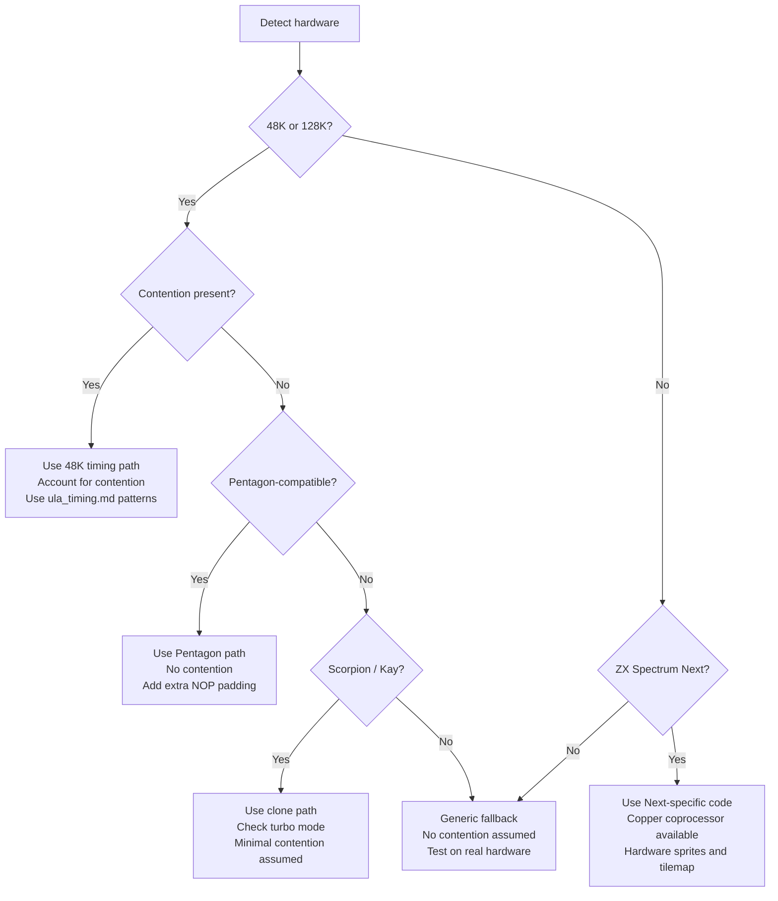

[← Home](../../README.md) · [Clone Hardware](README.md)

# Clone Video Timing — Pentagon, Scorpion, Kay, ATM Turbo, and FPGA Implementations

The ZX Spectrum's Ferranti ULA was a **single custom chip** — manufactured under contract by Ferranti using a semi-custom gate array process. It could not be purchased off-the-shelf, and its exact design was never publicly documented until Chris Smith reverse-engineered it in the 2000s. For clone manufacturers — especially in the Soviet Union and post-Soviet Russia — this meant the ULA had to be **replaced entirely** with discrete logic chips. CPLDs and FPGAs were prohibitively expensive in the 1990s; they only became viable for Spectrum clones in the 2000s.

This article covers the **video timing characteristics of non-ULA clone hardware**: how their video counters work, whether they have memory contention (most don't), their frame timing parameters, and the practical impact on software development. For the original Ferranti ULA and Amstrad gate array timing, see [ula_timing.md](../original/ula_timing.md). For Z80-intrinsic timing (T-states, M-cycles), see [z80_timing.md](../../01_cpu/z80_timing.md).

> [!NOTE]
> This article focuses on **timing differences that affect software behavior** — contention models, frame sizes, interrupt positions, and turbo modes. Hardware-level signal descriptions belong in the respective hardware articles (planned in `02_hardware/`).

---

## Why Clones Are Different

The Ferranti ULA performs several functions simultaneously: clock generation, video signal generation, DRAM refresh, CPU bus arbitration (contention), and interrupt generation. Clone hardware must replicate all of these, but the implementation approach varies dramatically:

```mermaid
graph TD
    ULA[Ferranti ULA<br/>Single custom chip] --> CLONE[Clone must replicate<br/>all ULA functions]
    CLONE --> DISCRETE[Discrete Logic<br/>К555/КР1533 counters<br/>74LS-series glue logic]
    CLONE --> CPLD[CPLD<br/>Altera MAX7000 series<br/>modern recreations]
    CLONE --> FPGA[FPGA<br/>Xilinx Spartan-6 / Artix-7<br/>(Next), Altera Cyclone V<br/>(MiSTer)]
    DISCRETE --> PENT[Pentagon 128K]
    DISCRETE --> SCORP[Scorpion ZS-256]
    DISCRETE --> KAY[Kay 1024]
    DISCRETE --> ATM[ATM Turbo]
    DISCRETE --> PROF[Profi]
    DISCRETE --> LEN[Leningrad<br/>early Soviet clones]
    CPLD --> SIZIF[Sizif-512<br/>Karabas-128]
    CPLD --> KAY2[Kay 2006 NB<br/>Altera EPM7064]
    CPLD --> EVE[ZX Evolution<br/>Altera EPM7128 + EPM3032]
    FPGA --> NEXT[ZX Spectrum Next]
    FPGA --> MISTER[MiSTer FPGA core]
```

| Implementation | Contention | Frame timing | Turbo modes | Video enhancements |
|---------------|-----------|-------------|-------------|-------------------|
| **Discrete logic** (Pentagon, Scorpion, Kay, ATM Turbo, Profi) | Usually **none** — no bus arbitration | Often matches 48K exactly | Rare (some 7 MHz) | Minimal |
| **CPLD** (Sizif-512, Karabas-128, Kay 2006 NB, **ZX Evolution**) | Varies — some implement contention | Often matches 48K base | Common (7 MHz) | Some (extra colors, modes) |
| **FPGA** (Next, MiSTer) | **Configurable** — can emulate any model | **Configurable** per target model | Multiple speeds (3.5–28 MHz) | Extensive (extra resolutions, colors) |

The most important difference for programmers: **most discrete-logic clones have no memory contention**. Code in the upper 16K runs at full speed at all times. This is because the 74-series counters used for video address generation run independently of the CPU bus — there is no ULA-style bus arbitration circuit. This means any software that relies on contention timing (multicolor effects) will break on these machines without separate code paths.

---

## Pentagon 128K

The Pentagon (Пентагон) is the most popular ZX Spectrum clone in Russia and the former Soviet Union. Designed in 1989, it was built entirely from off-the-shelf discrete logic chips — no custom ICs, no ULA. The video circuit uses standard counters (КР1533-series = 74LS equivalents) to generate sync signals and address the screen RAM.

### Frame Timing

The Pentagon's frame timing is **significantly different** from the ZX Spectrum 48K. The discrete logic video counter generates a longer frame with more scanlines:

| Parameter | ZX Spectrum 48K | Pentagon 128K |
|-----------|----------------|--------------|
| CPU clock | 3.500000 MHz | 3.500000 MHz |
| T-states per frame | **69,888** | **71,680** |
| T-states per scanline | **224** | **224** |
| Total scanlines | **312** | **320** |
| Screen RAM | `#4000`–`#57FF` (pixel), `#5800`–`#5AFF` (attributes) | Same |
| Contention | `#4000`–`#7FFF` (6-5-4-3-2-1-0-0 pattern) | **None** |
| Interrupt position | T=0 (start of frame) | T=67,968 (line 304, near end of frame) |
| Paper starts at | T=14,335 (line 64) | T=17,989 (line 80) |
| Frame rate | 50.08 Hz | ~48.83 Hz |

The CPU clock is the **same 3.5 MHz** (derived from the same 14 MHz crystal ÷ 4). The T-states per scanline are the **same 224T**. But the video counter chain wraps at a different count, producing **320 lines** instead of the 48K's 312 — an extra 8 lines per frame:

```
Clock derivation (both 48K and Pentagon):
  14 MHz crystal → ÷ 4 → 3.5 MHz CPU clock → 224 T-states per scanline

  48K Ferranti ULA:    312 lines × 224T = 69,888 T-states → 19.97 ms → 50.08 Hz
  Pentagon counters:   320 lines × 224T = 71,680 T-states → 20.48 ms → 48.83 Hz
  Difference:          +2.56% T-states / +2.56% frame duration / −2.50% frame rate
```

For the practical impact on emulation and cycle-exact accuracy requirements, see [cycle_exact_accuracy.md](../../09_emulation/software/cycle_exact_accuracy.md).

```
Pentagon frame layout (320 lines × 224 T-states = 71,680 T-states):

  Lines     T-states       Region
  ──────    ────────       ───────────────────────────────────
  0–15      0–3,583        Off-screen (vertical retrace, not displayed)
  16–79     3,584–17,919   Upper border (64 lines)
  80–271    17,920–60,927  Paper area (192 lines × 256 pixels)
  272–319   60,928–71,679  Lower border (48 lines)

  INT fires at scan line 304 = T-state 67,968 (like "preliminary" interrupt at the end of previous frame)
  INT duration: 32 T-states
```

Compare with the 48K frame layout:

```
ZX Spectrum 48K frame layout (312 lines × 224 T-states = 69,888 T-states):

  Lines     T-states       Region
  ──────    ────────       ───────────────────────────────────
  0–63      0–14,335       Upper border (64 lines)
  64–255    14,336–57,119  Paper area (192 lines × 256 pixels)
  256–311   57,120–69,887  Lower border + vertical blank (56 lines)

  INT fires at line 0 = T-state 0
  INT duration: 32 T-states
```

Key differences:

- **8 extra lines** — the Pentagon frame is 71,680 T-states vs the 48K's 69,888 — roughly **2.6% longer**
- **Different INT position** — the Pentagon fires INT at line 304 (near the bottom of the frame), not at T=0 like the 48K. The first 16 lines after INT are off-screen (vertical retrace), then the upper border starts
- **Paper offset** — the paper area starts 3,654 T-states later than on the 48K (T=17,989 vs T=14,335)
- **Lower frame rate** — 71,680 / 3,500,000 ≈ 48.83 Hz vs the 48K's 69,888 / 3,500,000 ≈ 50.08 Hz
- **Horizontal timing within each line** is also different: 32T off-screen + 36T left border + 128T screen + 28T right border (Pentagon) vs the 48K's different horizontal phase alignment

> **Why 320 lines instead of 312?** The Ferranti ULA was a **custom gate array** — its designers could implement any arbitrary counter modulus to produce exactly 312 lines for standard PAL timing (50 Hz). The Pentagon uses **off-the-shelf binary counters** (КР1533ИЕ7/КР1533ИЕ10 = 74LS193/74LS161) which naturally divide in powers of 2. The counter chain wraps at 320 lines, which is close enough to PAL for most CRT monitors to sync, but is technically **non-standard** — the Pentagon produces ~48.83 Hz instead of 50 Hz. This was considered an acceptable trade-off: simpler circuit design at the cost of slightly wrong frame timing.

### Interrupt Position Within the Frame

The INT position — where the interrupt pulse fires relative to the video frame — varies significantly across models. This is a **separate issue from frame length**. Two machines can have the same frame length but different INT positions, or different frame lengths with similar INT offsets:

| Model | Frame (T-states) | INT fires at | Offset from frame start | INT relative to display |
|-------|-----------------|-------------|----------------------|---------------------|
| 48K | 69,888 | **T=0** (line 0) | 0 — start of frame | Top of vertical retrace, 64 lines before paper |
| 128K / +2 | 70,908 | **T=0** (line 0) | 0 — start of frame | Same as 48K (63 lines before paper) |
| +2A / +3 | 70,908 | **T=0** (line 0) | 0 — start of frame | Same as 128K |
| **Pentagon** | **71,680** | **T=67,968** (line 304) | **94.8%** into the frame | Near bottom of frame, 16 lines before frame wraps |

The Sinclair machines (48K, 128K, +2A/+3) all fire INT at **T=0** — the very start of the frame, during vertical retrace. The ISR (interrupt service routine) then has the entire upper border period to set up before paper begins. This is the natural position: the CPU is notified at the top of the frame.

The Pentagon fires INT at **line 304** — only 16 lines before the frame wraps around to line 0. This means the ISR runs during the last 16 lines of the old frame and the first part of the new frame. The Pentagon FAQ describes this as the interrupt being "formed wrong" — the discrete logic that generates the INT signal is derived from the same counter chain that generates vertical sync, and the designers either chose or were forced by counter geometry to place the INT near the bottom rather than the top.

The practical impact: code that assumes INT fires at the top of the frame (like most 48K/128K software) still works on the Pentagon because the relative position of the paper area within the frame is the same — paper always starts at T=17,989 after INT. But the absolute position within the video signal is different, which affects any code that measures absolute T-state counts from power-on or synchronizes with external hardware.

### No Contention

The Pentagon has **zero memory contention**. Unlike the Ferranti ULA, which pauses the CPU by asserting the WAIT pin during screen memory reads, the Pentagon's discrete logic video circuit has **no mechanism to stall the CPU at all** — there is no WAIT generator connected to the screen address range.

Instead, the video counters and CPU share the RAM bus through **asynchronous time-division multiplexing**:

```mermaid
graph LR
    CLK[14 MHz master clock] --> DIV[÷4 divider<br/>3.5 MHz CPU clock]
    CLK --> VCTR[Video counter<br/>КР1533ИЕ7 / КР1533ИЕ10<br/>(74LS193 / 74LS161)<br/>4-bit binary counters]
    VCTR --> VADR[Video address<br/>pixel + attribute]
    VADR --> RAM[4164 DRAM<br/>shared data bus]
    DIV --> CPU[Z80 CPU]
    CPU --> RAM
    RAM --> SHIFT[Pixel shift register<br/>КР1533ИР8 (74LS165)<br/>8-bit parallel-in serial-out]
```

The video counter runs from the same 14 MHz master clock that derives the CPU clock. It generates a continuous sequence of pixel and attribute addresses, reading 2 bytes per 8-pixel character cell (1 pixel byte + 1 attribute byte). These reads are synchronized to the video timing, not to the CPU bus state. The key insight:

| Aspect | Ferranti ULA (48K) | Pentagon discrete logic |
|--------|-------------------|----------------------|
| Video read timing | Synchronized to CPU — ULA waits for bus idle, or stalls CPU | **Asynchronous** — video counter runs independently |
| Bus conflict resolution | ULA asserts WAIT, CPU pauses | **No conflict resolution** — both access freely |
| CPU stalling | Yes — contention pattern 6,5,4,3,2,1,0,0 per 8T window | **None** — CPU never waits |
| Video data reliability | Guaranteed — ULA always gets correct data | **Usually correct** — timing works out due to Z80 bus gaps |
| DRAM used | 4116 (lower 16K) + 4532 (upper 16K) | 4164 (64K × 1 bit × 8 chips) |

In practice, the Pentagon's video reads rarely collide with CPU access because the Z80 bus has natural idle periods:

- **M1 opcode fetch**: T3–T4 are used for instruction decode and DRAM refresh — the data bus is free
- **Memory read/write**: The 3T bus cycle leaves gaps between consecutive accesses
- **Internal processing**: Multi-T-state instructions (e.g., 16-bit arithmetic) don't use the bus at all

When a collision does occur, the video circuit simply reads whatever is on the bus — but the designers timed the video counter so that reads fall in the gaps.

> [!WARNING]
> The "no contention" design means the CPU is never slowed down, but it also means there is **no guaranteed bandwidth reservation** for video. If the CPU performs extremely dense memory access to screen RAM (e.g., unrolled `LD (HL),A` in a tight loop), it can theoretically corrupt the video output. In practice this is rarely visible because the Z80's bus usage pattern leaves enough gaps for the video counter to read correctly.

Practical consequences:

- `LD (HL),A` from `#4000`–`#7FFF` **always** takes exactly 7T — never 7T + contention
- `LDIR` filling the screen (6144 bytes) takes exactly 129,024 T-states — 1.80 Pentagon frames (not 1.85 48K frames), never more
- Code executing from screen RAM runs at the same speed as code in ROM
- The CPU is ~10–15% faster overall during the paper display area compared to a real 48K (due to no contention)

### Interrupt Timing Nuances

The Pentagon's interrupt fires at line 304, not at the start of the frame like the 48K. This means the first 16 lines after INT (T-states 0–3,583) are invisible — the CRT beam is in vertical retrace. This is a fundamental difference from the 48K, where INT at T=0 means the upper border starts immediately.

Additionally, the interrupt position may vary slightly between individual units due to manufacturing tolerances in the discrete logic. This is why multicolor drivers for the Pentagon often include a calibration delay. The different INT position also means that software which measures frame position by counting T-states from INT will get different absolute screen positions on the Pentagon vs the 48K.

### Detecting the Pentagon

There is no single reliable hardware register to detect a Pentagon. Common techniques:

```z80
; Method 1: Check for absence of contention
; Run a timed loop in contended memory and measure
; If the loop takes exactly the expected T-states → no contention → likely Pentagon

; Method 2: Check for Beta 128 disk interface
IN   A,(#1F)         ; Beta 128 status port
CP   #FF             ; If not #FF, Beta 128 is present
JR   NZ,likely_pentagon

; Method 3: Check Pentagon-specific ports
; Some Pentagon models respond to port #7FFD differently
; This is not 100% reliable across all revisions
```

> [!WARNING]
> Multicolor effects designed for the 48K will **not** work on the Pentagon without modification. There are **three independent reasons** for this:
> 1. **No contention** — code runs faster, every T-state count that assumed contention delays will be wrong
> 2. **Different frame length** — 71,680 T-states (Pentagon) vs 69,888 T-states (48K), so timing loops calibrated for 48K frames will drift
> 3. **Different INT position** — INT fires at line 304 (near end of frame), not at T=0, so all frame-relative T-state offsets are different
>
> The standard approach is to maintain separate code paths: one for 48K and one for Pentagon, with different delay tables and INT handling.

### Pentagon Memory Expansion: 128K → 512K → 1024K → 2048K

The original Pentagon 128K uses the same memory paging as the Sinclair 128K: `port #7FFD` bits 0–2 select one of 8 RAM pages (16K each) to map at `#C000–#FFFF`. Subsequent expansions extended this scheme with additional paging bits, while the video timing remained **unchanged** — 71,680 T-states/frame, 320 lines, 224 T-states/line, no contention.

| Variant | Total RAM | Pages (16K each) | Paging mechanism | Hardware |
|---------|----------|-----------------|-----------------|----------|
| Pentagon 128K | 128K | 8 | `#7FFD` bits 0–2 (same as Sinclair 128K) | Discrete TTL |
| Pentagon 512K | 512K | 32 | `#7FFD` bits 0–2 + **bits 6–7** as extra page select | **CPLD** (Altera EPM7128) replaces TTL decoding |
| Pentagon 1024K | 1024K | 64 | `#7FFD` + `#1FFD` extended paging bits | **CPLD** |
| Pentagon 2048K | 2048K | 128 | `#7FFD` + `#1FFD` further extended paging | **CPLD** |

**Pentagon 512K** was the first expansion. It repurposed bits 6–7 of `port #7FFD` (which are unused on the Sinclair 128K) as additional page select bits, giving a 5-bit page number (bits 0–2 + bits 6–7) → 32 pages × 16K = 512K. This required replacing the discrete TTL address decoding with a CPLD (typically Altera EPM7128S) to handle the wider page multiplexing.

**Pentagon 1024K** added a sixth page select bit via `port #1FFD`, extending to 64 pages × 16K = 1024K. This became the de facto standard for Russian Pentagon-based systems in the late 1990s and 2000s.

**Pentagon 2048K** added one more bit, reaching 128 pages × 16K = 2048K. This is the maximum practical expansion on the standard Pentagon paging scheme.

All variants — regardless of memory size — share the same video timing, same lack of contention, and same 48.83 Hz frame rate. The only hardware difference is the address decoding logic: 128K uses discrete TTL, 512K+ uses CPLDs to implement the wider page selection.

---

## Scorpion ZS-256

The Scorpion ZS-256 (Скорпион), designed by Sergey Zonov in St. Petersburg (1996), is a more sophisticated clone than the Pentagon. It is built entirely from discrete logic chips (К555/КР1533 series — Soviet 74LS equivalents), supports 256K of RAM, and includes a 7 MHz turbo mode. Later "Black Edition" revisions replaced some older 565РТ5 PROM chips with GAL16V8/GAL22V10 devices, but the core glue logic remains discrete TTL. It was widely used in the Russian demoscene.

### Frame Timing

| Parameter | ZX Spectrum 48K | Scorpion ZS-256 |
|-----------|----------------|-----------------|
| CPU clock (standard) | 3.500000 MHz | 3.500000 MHz |
| CPU clock (turbo) | N/A | **7.0 MHz** |
| T-states per frame | **69,888** | **69,888** |
| T-states per scanline | **224** | **224** |
| Total scanlines | **312** | **312** |
| Contention | `#4000`–`#7FFF` | Implementation-dependent |
| ROM | Sinclair ROM | Custom Scorpion ROM |
| Paper starts at | T=14,335 | T=14,344 |
| Horizontal timing | ~48T left border + 128T screen + ~48T right border | 40T off-screen + 24T left border + 128T screen + 32T right border |

The base frame size matches the 48K (312 lines × 224T = 69,888 T-states), but the **horizontal timing within each line is different**: the Scorpion's sync and border phases are shifted. The paper area also starts 9 T-states later (T=14,344 vs T=14,335).

### Contention

The Scorpion's contention behavior varies by revision. Early models had limited or no contention — later revisions implemented a contention model closer to the 48K ULA for better software compatibility. For demoscene programming, the Scorpion is typically treated as having **mild or no contention** and tested on real hardware.

### 7 MHz Turbo Mode

The Scorpion's turbo mode doubles the CPU clock to 7 MHz:

- **Effective T-states per frame double**: 139,776 T-states at 7 MHz in the same 69,888-T-state frame period
- **Memory access still uses the same bus timing** — the CPU runs faster but RAM access speed doesn't change, so some memory-intensive operations don't scale linearly
- **I/O timing changes** — port access at 7 MHz completes faster
- Software must explicitly enable turbo mode via a port write
- Not all software is compatible with turbo mode — timing-sensitive code (interrupt handlers, multicolor) must account for the doubled clock

### Enhanced Features

- **256K RAM** with bank switching via port `#7FFD` and additional Scorpion-specific ports
- **ROM configuration** — 2 ROM pages selectable via hardware
- **Beta 128 disk interface** built-in
- **Kempston joystick** port built-in
- The Scorpion's discrete logic design is more complex than the Pentagon's, but still does not fully replicate the Ferranti ULA's bus arbitration — contention behavior varies by revision

---

## Kay 1024

The Kay 1024 (Кэй), manufactured by NEMO company in St. Petersburg (1998), is a high-end clone with 1024K of RAM and optional 7 MHz turbo mode. The base Kay 1024 uses discrete logic (КР1533 series), like most 1990s clones. Later revisions (Kay 2006 NB) added an Altera EPM7064 CPLD for enhanced video capabilities.

### Frame Timing

| Parameter | ZX Spectrum 48K | Kay 1024 |
|-----------|----------------|---------|
| CPU clock (standard) | 3.500000 MHz | 3.500000 MHz |
| CPU clock (turbo) | N/A | **7.0 MHz** |
| T-states per frame | **69,888** | **69,888** |
| T-states per scanline | **224** | **224** |
| Total scanlines | **312** | **312** |
| Contention | `#4000`–`#7FFF` | **None** |
| RAM | 48K | 1024K (61 pages) |

Base frame timing matches the 48K and Pentagon.

### No Contention

Like the Pentagon, the Kay 1024 has **no memory contention**. The CPU runs at full speed regardless of what address it accesses. This is a common trait among Russian discrete-logic clones — without the Ferranti ULA's custom bus arbitration circuit, there is simply no mechanism to stall the CPU during screen memory access.

### Enhanced Video Modes

The later Kay 2006 NB revision includes an Altera EPM7064 CPLD that provides:

- **Multicolor mode** — per-scanline attribute changes without contention interference
- **GigaScreen** — alternating two attribute sets on even/odd frames to simulate 8×1 color resolution
- **512×192 pixel mode** — double horizontal resolution in 2 colors

These modes don't change the base frame timing (69,888 T-states), but they affect how the video circuit reads the attribute and pixel RAM.

### Nemo-Bus

The Kay 1024 uses the **Nemo-bus** expansion system with three dedicated slots. Peripherals (IDE controller, Beta Turbo floppy, General Sound) connect without soldering. The bus timing is compatible with standard ZX Spectrum I/O port decoding.

---

## ATM Turbo

The ATM Turbo is an enhanced ZX Spectrum clone that diverges more significantly from the original timing. Like all 1990s Russian clones, it is built from discrete logic chips. It was designed for compatibility with both ZX Spectrum software and CP/M, featuring enhanced video modes and a turbo CPU.

### Frame Timing

| Parameter | ZX Spectrum 48K | ATM Turbo |
|-----------|----------------|----------|
| CPU clock (standard) | 3.500000 MHz | 3.500000 MHz |
| CPU clock (turbo) | N/A | **7.0 MHz** |
| T-states per frame | **69,888** | **~69,888** |
| T-states per scanline | **224** | **224** (standard mode) |
| Contention | `#4000`–`#7FFF` | Minimal / none |

### Enhanced Video Modes

The ATM Turbo supports several video modes beyond the standard ZX Spectrum display:

- **640×200 monochrome** — 80-column text mode for CP/M
- **ZX Spectrum compatible** — standard 256×192 with attributes
- Additional text modes with configurable character generators

Mode switching is done via dedicated I/O ports. The standard ZX Spectrum mode maintains timing compatibility with the 48K, making most software work without modification.

### CP/M Compatibility

The ATM Turbo's 640×200 video mode and CP/M support mean its video timing was designed to accommodate both PAL video output and the 80-column display requirement. The frame timing in CP/M mode may differ from the ZX Spectrum-compatible mode.

---

## Modern FPGA Implementations

Modern recreations of the ZX Spectrum use FPGAs to implement the entire machine — CPU, video, audio, and I/O — in a single chip. Their timing behavior is **configurable**: they can emulate any model's timing precisely, or run at accelerated speeds.

### ZX Spectrum Next

The ZX Spectrum Next (2017–2020) is the most capable FPGA-based Spectrum:

| Parameter | Value | Notes |
|-----------|-------|-------|
| FPGA | Xilinx Spartan-6 (KS1) / Artix-7 (KS2) | KS1 = Issue 2B, KS2 = Issue 4 |
| CPU speeds | 3.5 / 7 / 14 / 28 MHz | 4 speed modes, switchable at runtime |
| Base timing | 48K-compatible | 69,888 T-states, 224T/line at 3.5 MHz |
| Contention | **Configurable** | Can emulate 48K, 128K, +2A, Pentagon, or disable entirely |
| Enhanced video | Layer 2 (256×192×256 colors), tilemap, sprites | Hardware-accelerated, doesn't affect base timing |
| Copper coprocessor | Programmable raster timing | Can change hardware registers at exact scanline positions |

The Next's copper coprocessor is a game-changer for timing-sensitive effects — it's a tiny programmable state machine that runs in parallel with the CPU and can write to hardware registers at precisely defined T-state positions within the frame. This eliminates the need for carefully timed CPU loops for many effects.

At 28 MHz (8× base speed), the CPU has 8× the T-states per frame — approximately 559,104 T-states — while the video timing remains locked to the original frame structure.

### ZX Evolution

The ZX Evolution (Резидент / PentEvo, 2008–2011) is a Russian hybrid clone: it uses a **real Z80 CPU** and **real SRAM/DRAM**, with **Altera MAX CPLDs** (EPM7128S + EPM3032A) handling only address decoding, memory paging, and I/O port mapping — not implementing the core machine logic as an FPGA would.

- **Pentagon-compatible base timing** — 71,680 T-states, 320 lines, no contention
- **Turbo mode** — 7 MHz and 14 MHz
- **Enhanced video** — multicolor, GigaScreen
- **CPLDs**: Altera EPM7128S (main glue logic) + EPM3032A (auxiliary decoding) — used as programmable logic replacements for discrete TTL decoders, not as FPGA core implementations
- Designed for maximum compatibility with the existing Russian ZX Spectrum software library
- Also known as PentEvo (Pentagon Evolution) because it emulates the Pentagon 1024 SL at hardware level

### MiSTer FPGA

The MiSTer FPGA platform (based on the Terasic DE10-Nano board with an Altera Cyclone V SoC) hosts **multiple ZX Spectrum cores**, each targeting different models or offering universal configurability:

**Main ZX Spectrum core** (sorgelig) — a single core with runtime model switching:
- ZX Spectrum 48K, 128K, +2A/+3, Pentagon 48K/128K/1024K, Profi 1024K
- Each model uses its own correct CPU and video timing (T-states per frame, contention pattern, INT position)
- Pentagon modes: 71,680 T-states, 320 lines, no contention
- 48K/128K modes: correct ULA contention and frame timing
- Turbo modes: 7 / 14 / 28 / 56 MHz
- ULA+ palettes, Timex HiColor/HiRes video modes

**Separate cores** exist for platforms that differ too radically to share a single core:
- **ZX Spectrum Next** — dedicated core implementing the Next's extended hardware (Layer 2, tilemap, sprites, copper, Z80N CPU)
- **TSConf** — core for the ZX Evolution's TS-Config enhanced video modes

Because MiSTer cores are written in Verilog and open-source, **any clone can be recreated as a separate core** — or integrated into the universal core with adjustable video frame timings, port decoding, and memory mapping. The platform's flexibility means timing accuracy is limited only by the core author's diligence, not by hardware constraints.

### Other FPGA Projects

- **Turbo Spectrum Next clones** — various community FPGA cores
- **ZX-Uno** — Xilinx Spartan-6 (XC6SLX9), compact FPGA board with configurable Spectrum timing
- **Multicore boards** (MC1.7, etc.) — Russian FPGA boards with Pentagon-compatible timing

---

## Per-Clone Comparison

| Clone | T-states/frame | T-states/line | Lines | Contention | Turbo | Video enhancements |
|-------|---------------|---------------|-------|-----------|-------|--------------------|
| **Pentagon 128** | **71,680** | 224 | **320** | **None** | None | None |
| **Pentagon 512K** | **71,680** | 224 | **320** | **None** | None | None (CPLD address decoding) |
| **Pentagon 1024K** | **71,680** | 224 | **320** | **None** | None | None (CPLD address decoding) |
| **Pentagon 2048K** | **71,680** | 224 | **320** | **None** | None | None (CPLD address decoding) |
| **Scorpion ZS-256** | 69,888 | 224 | 312 | Varies by revision | 7 MHz | 256K RAM |
| **Kay 1024** | 69,888 | 224 | 312 | **None** | 7 MHz | GigaScreen, 512x192 (Kay 2006) |
| **ATM Turbo** | ~69,888 | 224 | ~312 | Minimal | 7 MHz | 640x200, CP/M text mode |
| **ZX Spectrum Next** | 69,888 (base) | 224 | 312 | **Configurable** | 7/14/28 MHz | Layer 2, tilemap, sprites, copper |
| **ZX Evolution** | 71,680 (Pentagon) | 224 | 320 | **None** (Pentagon) | 7/14 MHz | GigaScreen, multicolor |
| **MiSTer FPGA** | **Configurable** | **Configurable** | **Configurable** | **Configurable** | Variable | Depends on selected core |

Compare with original Sinclair/Amstrad models:

| Model | T-states/frame | T-states/line | Lines | Contention |
|-------|---------------|---------------|-------|-----------|
| 48K | 69,888 | 224 | 312 | `#4000`–`#7FFF` (6-5-4-3-2-1-0-0) |
| 128K / +2 | 70,908 | 228 | 311 | Banks 1,3,5,7 |
| +2A / +3 | 70,908 | 228 | 311 | Banks 4,5,6,7 (gate array) |
| NTSC 48K | 69,816 | 224 | ~311 | `#4000`–`#7FFF` |

---

## Impact on Demoscene Development

### Why Two Platforms Dominate

The Russian demoscene primarily targets **two platforms**: the ZX Spectrum 48K and the Pentagon 128K. This is because:

1. **48K** — the original hardware, the "ground truth" for timing. Every emulator supports it.
2. **Pentagon** — the most common hardware in Russia, no contention, identical frame size

Most demos include a machine detection routine at startup and branch to the appropriate timing code. Some effects work on both platforms (no timing sensitivity), but multicolor effects always need separate code paths.

### The Clone Timing Landscape



### Detection Techniques

Clone detection is notoriously unreliable — there is no standard hardware ID register. Common approaches:

```z80
; --- Check for contention ---
; Run a timed loop accessing contended memory
; Compare actual T-states elapsed vs expected
; No contention → Pentagon, Kay, or clone

; --- Check for 128K ---
LD   A,(#5C5C)     ; FLAGS system variable
BIT  4,A           ; Bit 4 = 128K flag
JR   Z,is_48k      ; 0 = 48K mode

; --- Check for Pentagon (via Beta disk interface) ---
IN   A,(#1F)       ; Beta 128 status port
CP   #FF           ; Beta not present → #FF
JR   NZ,likely_pentagon

; --- Check for ZX Spectrum Next ---
; Next has a unique hardware ID register
LD   BC,#243B      ; Next register select port
LD   A,#0          ; Register 0 = hardware ID
OUT  (C),A
INC  B             ; BC = #253B, Next register data port
IN   A,(C)         ; Read hardware ID
; Non-zero → ZX Spectrum Next detected
```

---

## References

- **Ivan Roshchin, "Display Driver for the Pentagon-128"** (ZX Review #3-4, 1997) — Practical multicolor on the Pentagon with timing details
- **Sinclair Wiki, "Contended Memory"** ([sinclair.wiki.zxnet.co.uk](https://sinclair.wiki.zxnet.co.uk/wiki/Contended_memory)) — Per-model contention patterns including +2A/+3 gate array
- **ZX Spectrum Next Developer Reference** ([zxspectrumnext.dev](https://zxspectrumnext.dev)) — Next-specific timing, copper coprocessor, and enhanced video modes
- **Scorpion ZS-256 Programmer's Reference** (ZXPress) — Scorpion I/O ports and configuration
- **List of ZX Spectrum clones** ([en.wikipedia.org](https://en.wikipedia.org/wiki/List_of_ZX_Spectrum_clones)) — Comprehensive catalog

### Cross-References

- [ula_timing.md](../original/ula_timing.md) — Ferranti ULA and Amstrad gate array timing, memory contention, multicolor effects
- [z80_timing.md](../../01_cpu/z80_timing.md) — Z80-intrinsic timing: T-states, M-cycles, bus timing
- [z80_interrupts.md](../../01_cpu/z80_interrupts.md) — Interrupt timing per model, contention during interrupt handling
- [z80_coding_practices.md](../../01_cpu/z80_coding_practices.md) — T-state budgeting, contention-aware coding patterns
- [io_port_map.md](../../08_references/io_port_map.md) — Complete I/O port reference with per-model decoding bitmasks