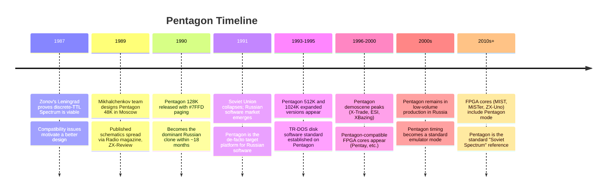
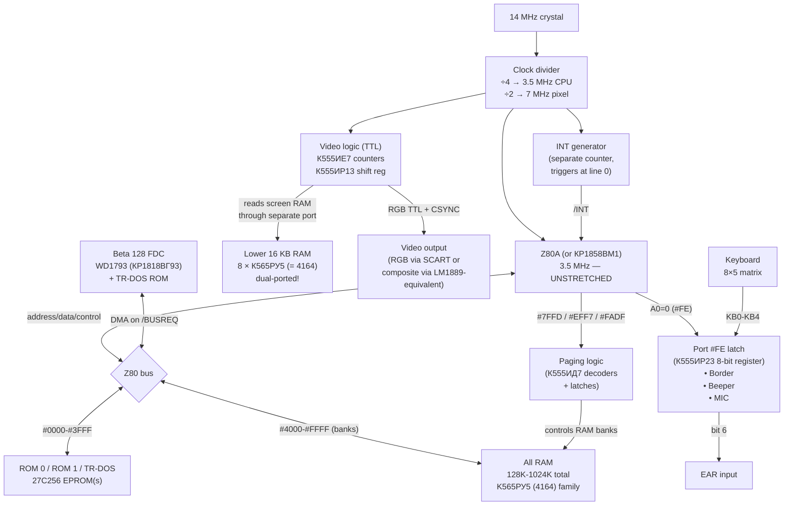

[← Home](../../README.md) · [Clone Hardware](README.md)

# Pentagon 48K / 128K — The People's Spectrum: Soviet Discrete-TTL Reimplementation That Outsold the Original

The **Pentagon** is the most successful ZX Spectrum clone ever built. Designed in **1989** by **Dmitry Mikhalchenkov** (Moscow, mathematician) and his collaborators — frequently credited under the bylines **"MikroPRO"** or simply **"the Pentagon group"** — the Pentagon was the Soviet answer to a simple question: *"how do you build a Spectrum when you cannot buy a Ferranti ULA?"* The answer was: rebuild the entire machine from cheap, mass-produced Soviet TTL logic (К555/КР1533 series = Western 74LS equivalents), with no custom silicon at all.

The result was a Spectrum that **anyone could build**. The schematics were published openly in hobbyist magazines (*ZX-Review*, *Radio*); the parts were available at any Soviet radio-parts store; the layout was simple enough to assemble at home. The Pentagon became the dominant Spectrum in the post-Soviet space through the 1990s — estimates suggest **over a million** Pentagon-family machines were built, in versions ranging from 48K bare-board DIY kits through 1024K professional systems with hard drives. By 1993 the Pentagon had displaced every other clone in the Russian software market: nearly all Russian demoscene productions, AY music, and game software from 1991 to 2000 was authored on and targeted at a Pentagon.

The Pentagon's defining technical characteristic — beyond its mass popularity — is its **fundamentally non-Sinclair video timing**. Because the design uses simple 8-bit binary counters rather than the Ferranti ULA's precisely-tuned state machines, the frame has **320 scanlines** (not 312), runs at **~48.83 Hz** (not ~50.08 Hz), has **INT at a different T-state offset**, and — most importantly for programmers — has **zero memory contention**. Code that relies on 48K-specific timing, contention delays, or the floating bus behaves completely differently on the Pentagon. The reverse is also true: code relying on the Pentagon's 320-line frame or zero-contention model breaks on Sinclair hardware. Understanding the Pentagon is therefore **essential for any demoscene or Soviet-software work**, and for any code that must run on both East and West.

This article covers the Pentagon as a **system**: history, the design philosophy of TTL reimplementation, hardware architecture, memory map, I/O ports, video timing differences, the Beta 128 disk interface integration, the Soviet ROM ecosystem, and the cultural impact that made the Pentagon the "real" Spectrum for an entire generation of Russian programmers. For the **detailed video frame timing**, see [video_frame_pentagon.md](../../05_development/05_display_and_timing/video_frame_pentagon.md); for the **memory map and I/O port reference**, see [memory_and_io_pentagon.md](../../05_development/03_memory_and_io/memory_and_io_pentagon.md); for the **broader clone timing landscape**, see [clone_timing.md](clone_timing.md).

---

## History and Development

### The Soviet Spectrum Situation (1986–1989)

The ZX Spectrum reached the Soviet Union through two channels: **smuggled original hardware** (rare, expensive — a 48K Spectrum could cost a month's salary on the black market in 1987) and **published schematics** (the ZX81's and Spectrum's circuit diagrams appeared in Western electronics magazines that occasionally reached the USSR through diplomatic and academic channels). The Ferranti ULA, however, was **unobtainable**: it was a semi-custom chip that Ferranti would not sell to Soviet buyers, and Soviet semiconductor fabs of the era could not produce a die-compatible equivalent.

The Soviet solution, pioneered by **Serge Zonov's Leningrad** (1987) and other early DIY clones, was to **reimplement the ULA's function from scratch using discrete TTL logic**. The Leningrad, in particular, was a brilliantly minimalist design — under 50 ICs — but it had significant compatibility problems: incorrect `#FF` floating-bus behavior, improperly formed INT signal, missing black-level clamping, and no memory expansion beyond 48K. The Leningrad proved the approach was viable but revealed how much careful engineering the Ferranti ULA hid.

### The Pentagon Project (1989)

In 1989, Dmitry Mikhalchenkov and a small team in Moscow began designing a Spectrum clone that would improve on the Leningrad's compatibility issues while keeping its discrete-TTL philosophy. The design goals were:

1. **Full 128K** memory (the Leningrad was 48K only), matching the Sinclair 128K's `#7FFD` paging register
2. **Improved INT signal** — properly shaped, properly timed
3. **Better video output** — cleaner sync, proper black-level clamping
4. **Disk-storage ready** — built-in support for the Beta 128 FDC interface (the Soviet de-facto standard, based on the WD1793)
5. **Open design** — schematics freely publishable, parts list restricted to commonly-available Soviet logic ICs

The result, demonstrated in late 1989, was the **Pentagon 48K** — followed quickly by the **Pentagon 128K** in 1990–1991. The name "Pentagon" reportedly came from the five-sided shape of the original PCB layout (though the actual production boards were conventionally rectangular). The Pentagon design was published in *Radio* magazine and *ZX-Review*, and within a year it had become the **most-built Spectrum clone in the USSR**.



### Why the Pentagon Won

The Soviet clone market had dozens of competitors — the Leningrad, Kay, Profi, Scorpion, ATM Turbo, Byte, Hobbit, Composite, Quorum, and many more. The Pentagon displaced them all through a combination of:

| Factor | Pentagon | Other Clones |
|---|---|---|
| **Simplicity** | ~50 ICs, all standard Soviet TTL | Scorpion had 100+ ICs; Profi was complex; ATM had non-standard video modes |
| **Documentation** | Full schematics in magazines, free to copy | Scorpion was commercially closed-source; Kay was proprietary |
| **Compatibility** | Sinclair 128K `#7FFD` paging, Beta 128 FDC standard | Profi added non-standard modes; ATM drifted toward EGA/PC |
| **Cost** | ~200 rubles for parts (1 week's salary, 1990) | Scorpion was 800+ rubles; original imports were 1500+ |
| **Open ecosystem** | Anyone could manufacture and sell kits | Scorpion was locked to one firm; Kay was one-company |
| **Software library** | All Russian software targeted Pentagon timing by 1993 | Software written for Pentagon timing breaks on Scorpion (which uses 48K timing) |

The irony of the Pentagon's success: it won *because* its timing was non-standard. Once the Russian software market committed to Pentagon timing (48.83 Hz, 320 scanlines, INT at line 0), every Russian developer wrote for that timing — and that software then *failed* on the Scorpion's correct-48K-timing hardware, reinforcing the Pentagon's dominance. The "wrong" timing became the standard.


---

## Hardware Architecture — A Spectrum Without a ULA

The Pentagon's central design decision is that **there is no ULA**. Where the Sinclair Spectrum collapses video, DRAM arbitration, I/O, and clock generation onto one Ferranti chip, the Pentagon rebuilds each function from discrete 74-series TTL — and in doing so, **removes the part of the design that causes memory contention**.

### Block Diagram



### The Critical Difference: Dual-Ported Video RAM

The key architectural insight of the Pentagon is the **dual-port arrangement for the screen RAM**. On the Sinclair 48K/128K, the ULA reads pixel and attribute bytes from the same single-ported DRAM bank the CPU uses — and arbitrates conflicts by **stretching the CPU clock**. This is the physical cause of memory contention.

The Pentagon takes a different approach: the video logic **reads the screen bytes through a separate bus port** that does not contend with the CPU. The exact mechanism varies by Pentagon revision (some use a true dual-ported RAM bank, others use fast-cycle time-sharing that completes the video fetch during the CPU's `/RFSH` cycle), but the **programmer-visible effect is the same**:

- **Zero memory contention** at any address, at any time
- CPU runs at full 3.5 MHz **uninterrupted**
- No clock stretching, no wait states, no 6-5-4-3-2-1-0 contention pattern
- No usable floating bus (the bus is never left floating)

This single design choice — removing contention — is what gives the Pentagon its reputation as a "fast" Spectrum. Code that fits in the contended range (`#4000`–`#7FFF`) runs measurably faster on a Pentagon than on a Sinclair 48K, because every contended access on the 48K is a stolen T-state. The downside is that code which **depends on** contention delays — for example, some multicolor effects that race the beam using the known 6-5-4-3-2-1-0 pattern — breaks completely.

### The Soviet IC Equivalents

The Pentagon is built entirely from Soviet-produced logic and memory ICs, all of which are pin-compatible with Western counterparts:

| Soviet part | Western equivalent | Function |
|---|---|---|
| КР1858ВМ1 | Z80A / Z0840004 | CPU |
| К565РУ5 (4164-equivalent) | 4164 / TMS4164 | 64 Kbit × 1 DRAM |
| К537РУ8 (sometimes) | 6264 / similar | 8 KB SRAM (upper RAM on some revisions) |
| КР555ИД7 (155ИД7) | 74LS138 | 3-to-8 decoder (address decode) |
| КР555ИР23 (155ИР23) | 74LS374 | Octal register (port #FE latch) |
| КР555ИЕ7 (155ИЕ7) | 74LS161 | 4-bit synchronous counter (video counters, cascaded) |
| КР555ИР13 (155ИР13) | 74LS299 | 8-bit universal shift register (pixel shift) |
| КР1818ВГ93 | WD1793 | Floppy disk controller (Beta 128 interface) |
| 27C256 (or КР573РФ6А) | 27C256 / similar | 32 KB UV-EPROM (BASIC ROM + TR-DOS) |

The decision to use only standard Soviet parts was strategic: it meant the Pentagon could be assembled by any hobbyist with access to a Soviet parts shop, which in 1989 was essentially every electronics enthusiast in the USSR. No special-order chips, no custom silicon, no waiting for imports.


---

## Video Timing — The Defining Differences

The Pentagon's video timing is the most important thing to understand about the machine, because it is the most common cause of software incompatibility between Russian and Western Spectrum code.

### Headline Numbers

| Parameter | Sinclair 48K | Sinclair 128K / +2 | Pentagon 128K |
|---|---|---|---|
| **Scanlines per frame** | 312 | 311 | **320** |
| **T-states per scanline** | 224 | 228 | **224** |
| **T-states per frame** | 69,888 | 70,908 | **71,680** |
| **Frame rate** | ~50.08 Hz | ~49.90 Hz | **~48.83 Hz** |
| **Top border** | 64 lines | 64 lines | **48 lines** |
| **Paper area** | 192 lines | 192 lines | 192 lines |
| **Bottom border** | 56 lines | 56 lines | **48 lines** |
| **VBlank / unused** | 0 (in 312 total) | 311 leftover | **32 lines** |
| **INT position** | T=0 (line 0) | T=0 (line 0) | **T=0 (line 0)** |
| **INT duration** | 32 T-states | 32 T-states | 32 T-states |
| **Memory contention** | `#4000`–`#7FFF` | banks 1/3/5/7 | **NONE** |
| **Contention pattern** | 6-5-4-3-2-1-0-0 | 6-5-4-3-2-1-0-0 | **N/A** |
| **Floating bus** | Yes (with TR6) | Yes | **No** |

### Why 320 Scanlines?

The 48K's Ferranti ULA uses a precisely tuned state machine to generate exactly 312 scanlines per frame. This number is not arbitrary — it is the smallest value that produces a valid PAL signal at the 48K's clock frequencies.

The Pentagon's video counter, by contrast, is built from **cascaded 4-bit binary counters** (`К555ИЕ7` = 74LS161). An 8-bit binary counter wraps at 256; a 9-bit counter wraps at 512. The Pentagon detects 320 by a simple AND of the high bits:

```
320 decimal = 101000000 binary
Detection: bit 8 = 1 AND bit 6 = 1 → reset counter
```

This was simpler to implement in 74LS-series logic than a 312-count decoder (which would have required comparing all 9 bits). The Pentagon's designers traded **timing accuracy** for **logic simplicity**, knowing that Russian TVs were tolerant enough to sync to a 48.83 Hz signal — and that no Russian software existed yet to break.

### Software Consequences

The 320-line frame has profound software consequences:

1. **Music plays ~2.5% slower.** AY music players run their note-update routine once per frame; on a Pentagon, the frame is 48.83 Hz instead of 50.08 Hz, so the same tune plays 2.5% slower and at a slightly lower pitch. Modern emulators that support both timings (Fuse, ZEsarUX, etc.) let you choose; demos that target both have to either time-detector switch or accept the difference.

2. **Code that uses T-state-per-frame math fails.** Anything that assumes exactly 69,888 T-states per frame — for example, a precise 50 Hz ISR-calibrated timer — breaks. Code that "races the beam" based on absolute T-state positions (e.g., multicolor effects at a known scanline) also breaks: the same T-state offset corresponds to a different scanline on the Pentagon.

3. **The Pentagon has 32 lines of vertical blank at the bottom.** Code that uses this region for off-screen raster effects (a common multicolor trick on the 48K) finds the geometry shifted.

4. **Contention delay loops run fast.** Code that inserts fixed delays via repeated `LD A,(#4000)` reads (a classic technique that relies on the known contention cost per access) runs much faster on the Pentagon — there is no contention to wait for.

5. **The floating bus is unusable.** Beam-position detection based on floating-bus reads (a standard raster-sync technique) doesn't work — the bus returns `#FF` or undefined. Code must use other techniques (frame-based HALT, INT-based counting).

For the full per-T-state Pentagon frame layout, INT timing, and cross-platform strategies, see [video_frame_pentagon.md](../../05_development/05_display_and_timing/video_frame_pentagon.md) and [clone_timing.md](clone_timing.md).


---

## Memory Map — 128K to 1024K

The Pentagon's memory map is built on the Sinclair 128K's `#7FFD` paging scheme and is **fully register-compatible** with the original 128K. Extended models (512K, 1024K) add the Pentagon-specific `#EFF7` port for high bank bits.

### Default Memory Map (128K, `#7FFD` only)

```
#0000 - #3FFF   ROM 0 (128K BASIC editor)  OR  ROM 1 (48K BASIC)  OR  TR-DOS ROM
                Selected by #7FFD bit 4 (ROM 0/1) or Beta 128 port (TR-DOS)

#4000 - #7FFF   RAM Bank 5 (FIXED — never pages out)
                Contains screen pixels + attributes for "default" display

#8000 - #BFFF   RAM Bank 2 (FIXED — never pages out)
                Standard location for machine code (uncontended on 128K,
                still uncontended on Pentagon)

#C000 - #FFFF   RAM Bank 0..7 (switchable via #7FFD bits 0–2)
                Most demos and games switch this freely per frame
```

This is byte-for-byte identical to the Sinclair 128K's `#7FFD` paging scheme. Software written for the 128K that uses only standard paging works unmodified on the Pentagon.

### Extended Memory Map (512K and 1024K)

The Pentagon 128K's EFF7 extension (later standardized on the Pentagon 1024) adds an extra port for high bank bits:

```
OUT (#EFF7), A   Pentagon extended memory control:

  Bits 0–2:  High bank bits
  Bit 3:     ROM page select (rarely used)
  Bit 4:     Additional select on 1024K boards

Effective bank at #C000 = (#EFF7 bits 0-2) × 8 + (#7FFD bits 0-2)
  Pentagon   512K:  32 banks of 16K = 512 KB
  Pentagon  1024K:  64 banks of 16K = 1024 KB
```

This `#EFF7` port is **Pentagon-specific** — it does not exist on the Sinclair 128K, +2, +2A, or +3. Software that uses it is Pentagon-family-only (though some emulators and FPGA cores replicate it for compatibility).

### Screen Location

The default screen is at `#4000`–`#57FF` (pixels) / `#5800`–`#5AFF` (attributes) — in Bank 5, exactly as on the Sinclair 128K. Selecting bit 3 of `#7FFD` switches to Bank 7 for the alternate screen (`#C000`–`#D7FF` pixels / `#D800`–`#DAFF` attributes). This is the same mechanism as the Sinclair 128K.

---

## I/O Ports

The Pentagon supports all the standard Spectrum I/O ports plus a few Pentagon-specific extensions:

| Port | Function | Notes |
|---|---|---|
| `#FE` (A0=0) | Border/beeper/MIC (write), keyboard/EAR (read) | Sinclair-compatible |
| `#FF` | Floating-bus read | Returns `#FF` (no usable floating bus) — see [Contention Model](../../05_development/03_memory_and_io/contention_model.md) |
| `#7FFD` | Paging register | Sinclair 128K-compatible |
| `#EFF7` | Extended memory (Pentagon-specific) | High bank bits for 512K/1024K |
| `#1FFD` | Beta 128 disk interface control | Different function from +2A/+3's `#1FFD`! |
| `#1F` | Kempston joystick | Standard Soviet clone convention — built in |
| `#FADF` / `#FBDF` / `#FFDF` | AY-3-8912 (or YM2149F) registers | Sinclair 128K-compatible |
| `#BFFD` / `#FFFD` | AY-3-8912 data port | Sinclair 128K-compatible |

### Beta 128 Disk Interface

The Pentagon's built-in **Beta 128 disk interface** is the most important Pentagon-specific feature for software. Based on the Western Digital **WD1793** FDC (Soviet clone: `КР1818ВГ93`), the Beta 128 interface provides:

- A **TR-DOS ROM** that pages into `#0000`–`#3FFF` when accessed (overriding the normal ROM), via a control bit on the Beta 128's own port
- A **DMA path** via `/BUSREQ` for fast disk transfers — the FDC takes over the bus during sector reads/writes
- A **5.25" floppy drive** connector (later Pentagons added 3.5" support)
- A **TR-DOS file system** with a Russian/localised command interface layered on top of the BASIC editor

The TR-DOS became the **de-facto disk standard** for the entire Soviet clone ecosystem. Pentagon TR-DOS disk images (`.TRD` files) are the standard distribution format for Russian Spectrum software, and the TR-DOS file system is supported by every modern Spectrum emulator.

For the Beta 128 hardware and the TR-DOS ROM banking mechanism, see [beta_disk_interface.md](../../03_io/storage/beta_disk_interface.md) (separate article). For the full Pentagon I/O port reference, see [memory_and_io_pentagon.md](../../05_development/03_memory_and_io/memory_and_io_pentagon.md).

### Built-in Kempston Joystick

Unlike the original Sinclair Spectrum, which required an external Kempston joystick interface, the Pentagon has **Kempston joystick decoding built in** at port `#1F`. This is standard across the Soviet clone ecosystem and is documented in [clone_joysticks.md](clone_joysticks.md).


---

## Pentagon Models and Variants

The "Pentagon" name covers a family of related machines, all sharing the same basic video timing and `#7FFD` paging but expanding in memory and features over time.

| Model | Year | RAM | Notable features |
|---|---|---|---|
| **Pentagon 48K** | 1989 | 48 KB | Original Mikhalchenkov design; minimal, ~50 ICs |
| **Pentagon 128K** | 1990 | 128 KB | Most common; `#7FFD` paging, Beta 128 FDC, Kempston built in |
| **Pentagon 128K + EFF7** | 1992 | 512 KB | Extended memory via `#EFF7` port (32 banks of 16K) |
| **Pentagon 1024 / 1024SL** | 1995 | 1024 KB | 64 banks of 16K; some added IDE and GS sound |
| **Pentagon "Turbo"** | various | varies | 7 MHz turbo mode (rare, not standardized) |

The **Pentagon 1024SL** (Сергей Лемехов / Sergei Lemekhov) became the high-end standard in the late 1990s, adding IDE hard disk support and (optionally) a General Sound card. It is the standard target for "maximum Pentagon" software and is the model most often emulated by modern FPGA cores (Pentay, MiSTer, ZX-Uno).

### Pentagon-Compatible Variants

Beyond the "official" Pentagon line, several derivative designs adopted Pentagon timing and I/O for software compatibility:

- **Pentagon-E / Pentagon-2** — minor board revisions from different manufacturers
- **Hobbit** — a more sophisticated Russian clone with Pentagon timing
- **ATM Turbo 1/2** — Russian clone that *also* matches Pentagon timing in its base mode, while adding turbo and extended graphics modes
- **Pentay / Pentagon FPGA** — FPGA cores implementing Pentagon timing for modern hardware

The Pentagon timing model is also one of the standard modes in every major Spectrum emulator (Fuse, ZEsarUX, Unreal, Spectaculator, etc.) and on FPGA platforms (MiSTer, MiST, ZX-Uno, Multicore).

---

## ROM Ecosystem

A standard Pentagon has **three ROMs** that can appear at `#0000`–`#3FFF`:

| ROM | Source | Contents |
|---|---|---|
| **ROM 0** | `#7FFD` bit 4 = 0 | 128K BASIC editor (Russian-localised version, or English 128K ROM) |
| **ROM 1** | `#7FFD` bit 4 = 1 | 48K BASIC ROM (Sinclair-compatible) |
| **TR-DOS** | Beta 128 FDC port | TR-DOS disk operating system (Russian, based on CP/M DOS calls) |

### The Russian 128K ROM

The Pentagon's ROM 0 is typically a **Russian-localised 128K editor ROM** — either the official Sinclair 128K ROM (English, with some patches), or a community-modified version with Russian-language prompts and keyboard mappings. Several Russian ROM variants exist (e.g. `TR-DOS 5.04 ROM`, custom localised editors) — the choice of ROM varies by Pentagon manufacturer and was often user-selectable via a physical jumper.

### TR-DOS

The TR-DOS ROM is the Pentagon's disk operating system. It is loaded automatically when the user issues a disk command from BASIC. TR-DOS provides:

- A `CAT`, `LOAD`, `SAVE`, `ERASE`, `FORMAT`, `COPY` command set layered onto BASIC
- A disk file format (`.TRD` images on emulators) with 80 tracks × 16 sectors × 256 bytes = 320 KB per 5.25" disk
- A hook-code API for assembly-language programs that need to access disk I/O

TR-DOS went through multiple versions: **TR-DOS 5.01, 5.02, 5.03, 5.04** being the most common. **TR-DOS 5.04** is the de-facto standard for software compatibility. See [trdos_programming.md](../../05_development/08_dos_tape/trdos_programming.md) for the assembly interface.

---

## Cultural Impact

The Pentagon's effect on the post-Soviet computing landscape is hard to overstate. For an entire generation of Russian, Ukrainian, Belarusian, and Kazakh programmers and enthusiasts, **the Pentagon was the Spectrum** — the original Sinclair machines were rare collector's items, while every school and apartment block had someone with a Pentagon.

### Demoscene

The Russian demoscene — which produced some of the most technically accomplished Spectrum demos ever made — was **almost exclusively a Pentagon scene**. Notable groups and productions:

- **X-Trade** (Тольятти / Tolyatti): one of the most prolific groups; their demos often pushed the Pentagon's particular timing
- **ESI** (Extreme Software Investigations): legendary for *Zoom* (1997), one of the first polygonal 3D demos
- **XBazing**: known for innovative music and visual effects
- **Alpha*, Brutal, Machineworks, Prospek, Skrju**: dozens of other groups active through the late 1990s and 2000s

These groups targeted Pentagon timing exclusively. Their demos do not run correctly on a Sinclair 48K or 128K — the music plays too fast, the raster effects miss their targets, and some effects that rely on zero-contention timing simply do not work.

For more on the Soviet scene, see [soviet_demo_scene.md](../../07_demoscene/soviet_demo_scene.md).

### AY Music

The Russian AY music scene — which produced the `.PT3` format and the entire Vortex Tracker / Pro Tracker ecosystem — was developed on and for the Pentagon. The 50.08 Hz / 48.83 Hz frame rate difference means that PT3 modules play 2.5% slower on a Pentagon than on a Sinclair 128K. Modern AY players and emulators let the user choose the target timing; for Russian music, the canonical timing is the Pentagon's 48.83 Hz. See [tracker_history.md](../../06_sound/trackers_and_formats/tracker_history.md) and [pt3_format.md](../../06_sound/trackers_and_formats/pt3_format.md).

### Software Distribution

Russian software distribution moved to **5.25" TR-DOS floppies** in the early 1990s, displacing cassette tape. The `.TRD` disk image format — 80 tracks × 16 sectors × 256 bytes = 655,360 bytes (often written as 320 KB because half the disk is the system area) — became the universal Russian software distribution format. The TR-DOS file format is supported by every major Spectrum emulator.

The FidoNet `ZX.SPECTRUM` echomail conference (active 1993–2005) was the primary online distribution channel for Russian Spectrum software and the social hub of the Russian scene.

---

## FAQ

**Is the Pentagon "compatible" with the Sinclair Spectrum?**
Functionally, yes — the standard Spectrum software model is preserved (memory map, screen format, `#FE` port, BASIC ROM, etc.). Timing-wise, no — the 320-line / 48.83 Hz frame and zero contention are fundamentally different. Software that ignores timing runs fine; software that depends on it breaks.

**Can a Pentagon run original Sinclair software?**
Mostly yes. Commercial Western games written for the 48K or 128K run, but with the frame rate 2.5% slower and without contention effects. Some games that rely on contention-delay loops or precise beam timing may glitch.

**Can a Sinclair Spectrum run Pentagon software?**
Mostly no. Russian demoscene productions that target Pentagon timing run with wrong music speed and broken raster effects. Music in `.PT3` format can be played on a Sinclair 128K, but will play 2.5% fast.

**Is the Pentagon still being made?**
Yes, in small numbers — Russian hobbyists continue to build Pentagon-family boards from kits, and several modern board designs (Pentagon 1024 SL v6, Pentagon 2.xxB) are produced in low volume. The Pentagon is also a standard mode on every major FPGA platform.

**Why don't Russian demos use multicolor effects?**
Some do, but the techniques are different. The Pentagon's zero-contention model makes some 48K multicolor tricks harder (no contention-delay race) and others easier (more CPU time per scanline). The result is a different family of multicolor effects optimized for Pentagon timing.

**Is the floating bus really unusable on the Pentagon?**
Yes. The Pentagon's video logic never leaves the data bus floating — the bus is driven (or pulled up) at all times, so reads from `#FF` return `#FF`. Beam-position detection must use other techniques: HALT for frame sync, INT-based scanline counting, or specific port-read timing tricks.

---

## References

- Mikhalchenkov, D., *Pentagon Schematics* (originally published in *Radio* and *[ZX-Review](https://zxpress.ru/library/)*, 1989–1991; various re-publications online)
- *[ZX-Review](https://zxpress.ru/library/)* magazine archives (1991–1996) — Pentagon documentation, software listings, hardware variants
- [ZX Spectrum Pentagon article — Wikipedia](https://en.wikipedia.org/wiki/Pentagon_(computer)) — overview
- [Pentagon-1024 SL documentation (Russian)](http://pentagon-1024.narod.ru/) — Lemekhov's expanded Pentagon reference
- Boris Kuznetsov, *TR-DOS Manual* — TR-DOS 5.04 API reference
- [Chris Smith, *The ZX Spectrum ULA](http://www.zxdesign.info/)* — Appendix on Soviet clone TTL reimplementation strategies

### Cross-References

- [Video Frame — Pentagon](../../05_development/05_display_and_timing/video_frame_pentagon.md) — per-T-state frame layout, INT timing
- [Clone Timing](clone_timing.md) — Pentagon vs Scorpion vs Kay vs ATM Turbo, detection techniques
- [Memory & I/O — Pentagon](../../05_development/03_memory_and_io/memory_and_io_pentagon.md) — full port reference
- [Clone Joysticks](clone_joysticks.md) — Kempston conventions across Soviet clones
- [Contention Model](../../05_development/03_memory_and_io/contention_model.md) — why the Pentagon has none
- [Beta Disk Interface](../../03_io/storage/beta_disk_interface.md) — [WD1793](https://www.worldofspectrum.org/hardware.html) FDC + TR-DOS ROM banking
- [TR-DOS Programming](../../05_development/08_dos_tape/trdos_programming.md) — disk I/O from assembly
- [Soviet Demo Scene](../../07_demoscene/soviet_demo_scene.md) — Pentagon-centric scene, FidoNet era
- [PT3 Format](../../06_sound/trackers_and_formats/pt3_format.md) — Russian AY music format born on the Pentagon
- [Tracker History](../../06_sound/trackers_and_formats/tracker_history.md) — Sound Tracker → Pro Tracker → [Vortex Tracker](http://bulba.unterground.net/) lineage
- [Pentagon 1024](pentagon_1024.md) — expanded-memory successor (planned)
- [Scorpion ZS-256](scorpion.md) — the developer's clone with correct 48K timing
- [ATM Turbo](atm_turbo.md) — Pentagon-timing-compatible with extended graphics modes
