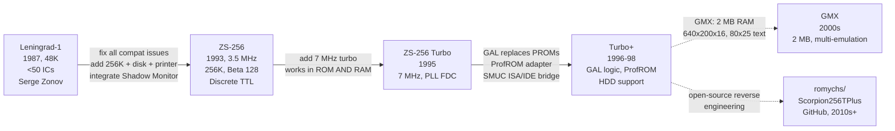
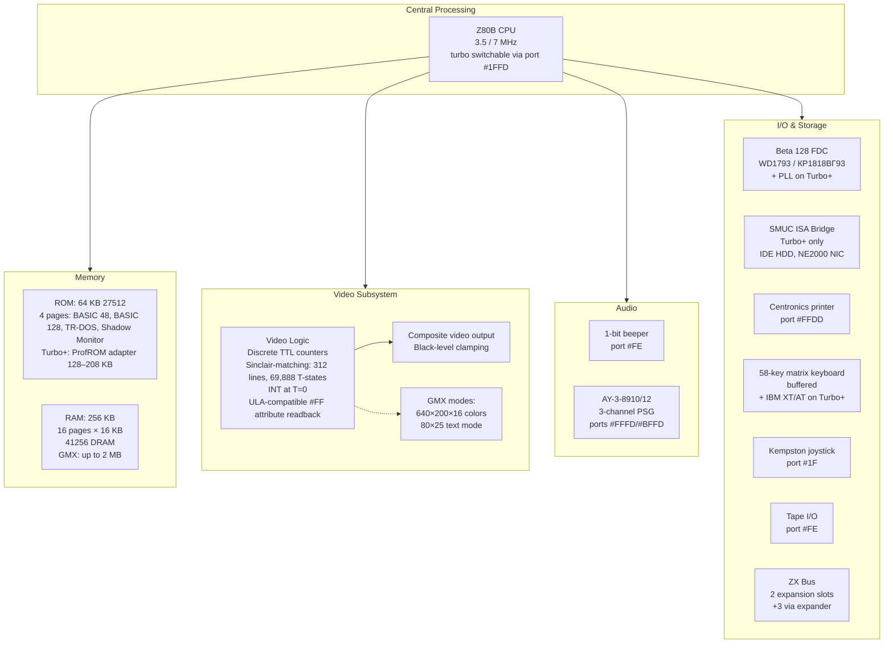
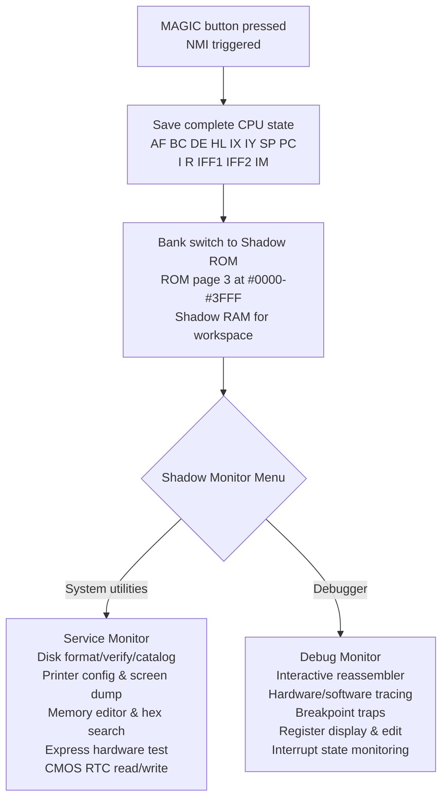
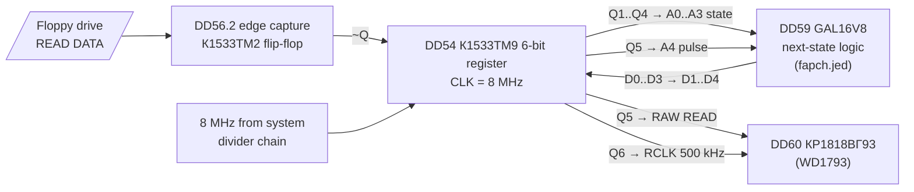
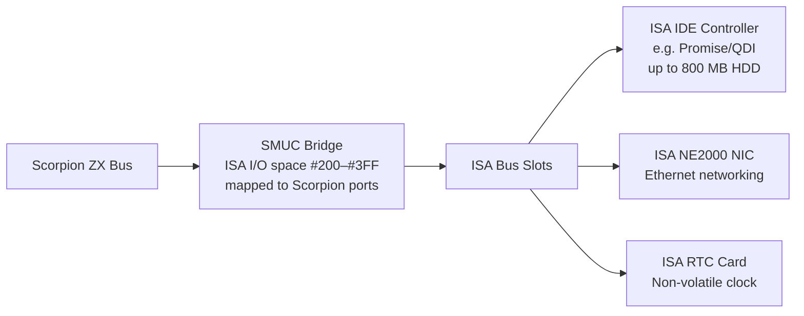

[← Home](../../README.md) · [Clone Hardware](README.md)

# Scorpion ZS-256 — The Developer's Spectrum with Shadow Monitor and True 48K Timing

The Pentagon was the people's Spectrum — cheap, simple, built from discrete TTL by hobbyists. The ATM Turbo was the "serious" Spectrum, drifting toward the IBM PC with EGA graphics and IDE hard drives. But the **Scorpion ZS-256** (1993) was something else entirely: the **developer's Spectrum** — a machine designed by a programmer, for programmers, with the most advanced built-in debugging tools of any ZX Spectrum clone ever made.

Designed by **Serge Zonov** in St. Petersburg as the professional successor to his popular **Leningrad** DIY clone (see [History & Development Timeline](#history--development-timeline)), the Scorpion packed a complete system onto a single board: **256K RAM**, **7 MHz turbo**, a built-in **Beta 128 disk controller**, **AY-3-8910/12 sound**, a **Centronics printer port**, and — uniquely — a **Shadow Service Monitor**: a full machine-code debugger with interactive reassembler, hardware/software tracing, and breakpoint support, burned into ROM and accessible at the press of a button.

The Scorpion's defining technical characteristic was its **compatibility-first design**. Where the Pentagon adopted a non-standard frame timing (320 lines, 71,680 T-states — convenient for demoscene, but not Sinclair-matching) and the ATM Turbo added non-standard video modes, the Scorpion was engineered to be a **better ZX Spectrum 48K than the real thing**. Its video timing matches the 48K exactly: 312 lines, 69,888 T-states/frame, INT at T=0, proper `#FF` attribute readback, and black-level clamping on the video output. The result was a machine that ran 99% of ZX Spectrum software without modification — not just games, but also timing-sensitive productions that required adjustment on the Pentagon.

The Scorpion line went through three major revisions — **ZS-256** (1993, 3.5 MHz), **ZS-256 Turbo** (1995, 7 MHz), and **ZS-256 Turbo+** (1996–1998, 7 MHz with GAL chips replacing older PROMs). The **GMX** (Graphic Memory eXpander) mainboard expanded RAM to 2 MB and added 640×200×16 and 80×25 text video modes. The **SMUC** (Scorpion & MOA Universal Controller) bridged a real PC ISA bus onto the machine, enabling IDE hard drives and NE2000 networking. After production ceased around 1998, the community kept the platform alive: the [**romychs/Scorpion256TPlus**](https://github.com/romychs/Scorpion256TPlus) GitHub project reverse-engineered the Turbo+ schematics and PCB, producing open-source board revisions (v16.2.x "Black Edition") still being built by enthusiasts in the 2020s.

> [!NOTE]
> This article covers Scorpion ZS-256 **hardware architecture, models, memory paging, I/O ports, video timing, Shadow Service Monitor, storage, and keyboard** in full technical detail. For clone video timing comparison (frame size, contention, INT position), see [clone_timing.md](clone_timing.md). For the full I/O port reference across all models, see [io_port_map.md](../../10_references/io_port_map.md).

---
## History & Development Timeline

### Serge Zonov and the Leningrad Lineage

The Scorpion cannot be understood without the **Leningrad** — the clone that preceded it. In 1987–1988, **Serge Yurievich Zonov**, an electronics engineer in Leningrad (now St. Petersburg), designed a simplified ZX Spectrum 48K clone using fewer than 50 integrated circuits. The Leningrad (also called "Zonov's" or "Zona" in St. Petersburg) became the **most widely-built DIY Spectrum clone in the Soviet Union**.

The Leningrad's success was rooted in three factors:

1. **Radical simplicity** — under 50 ICs, all Soviet-made (КР1533/К555 series = 74LS equivalents), with a minimalist video circuit that replaced the unobtainable Ferranti ULA
2. **Full documentation** — schematics and PCB layouts were published in magazines like *Radio* and *ZX-Review*, freely copied and distributed
3. **Open architecture** — anyone could build one, modify it, or improve it

But the Leningrad had significant compatibility problems: incorrect `#FF` floating bus behavior, improperly formed INT signal, missing black-level clamping on video output, and no memory expansion beyond 48K. These issues were patched by hobbyists with "add-ons" and "refinements" published in magazines, but commercial sellers often cut corners, producing unreliable machines.

Zonov recognized these problems and decided to build a proper successor — not another hobbyist board, but a **commercial-quality machine** with the Leningrad's strengths (simplicity, documentation, open architecture) and none of its weaknesses.

### Development Goals (1990–1993)

In 1990, Zonov (now operating through his firm **"Scorpion"**, co-founded with software developer **Andrey Larchenko**) began developing the Scorpion ZS-256 with three explicit goals:

> **Goal 1**: "Eliminate all identified shortcomings of the previous model, and make it if not 100%, then at least 99% software-compatible with ZX Spectrum." — *ZX-Review #4, 1994*

This meant: correct `#FF` port, proper INT signal formation, black-level clamping, and every other known compatibility issue fixed.

> **Goal 2**: "Implement on a single board the most complete configuration of external hardware — 256K RAM, buffered keyboard, built-in printer and joystick interfaces, and floppy disk controller."

The machine was designed as **disk-first** from the start — tape was supported only for BASIC compatibility, with the expectation that all serious software would come on floppy disk via the built-in Beta 128 controller.

> **Goal 3**: "Integrate the built-in software and supplement it with service capabilities."

This third goal — the integration of professional system software into ROM — was the Scorpion's distinguishing feature. No other clone offered a built-in debugger.

### The Players

| Entity | Role | Location |
|--------|------|----------|
| **Serge Zonov** | Hardware design, firm leadership | St. Petersburg |
| **Andrey Larchenko** | Software: Shadow Service Monitor, debugger | St. Petersburg |
| **Firm "Scorpion"** | Production, sales, warranty repair | St. Petersburg, P.O. Box 083 |
| **"InForCom"** | Publishing (ZX-Review magazine) | Moscow |

### Timeline

```
1987    Serge Zonov designs the Leningrad-1
        │  • Simplified ZX Spectrum 48K clone, <50 ICs
        │  • Becomes the most popular DIY clone in the USSR
        │  • Published schematics spread via Radio magazine, hobbyist networks
        │
1990    Zonov begins Scorpion ZS-256 development
        │  • Goals: 99% compat, all-in-one board, CP/M path, integrated software
        │
1991    First prototype demonstrated (October 1991)
        │  • Built on a wired Leningrad board
        │  • Hardware debugging begins — will take ~1 year
        │
1993    Commercial release of Scorpion ZS-256
        │  • ZX-Review article (issue #4, 1994) announces the machine
        │  • 64 KB ROM with Shadow Service Monitor v2.x
        │  • Serial numbers on each board for anti-piracy
        │
1994    Scorpion ZS-256 Turbo announced
        │  • 7 MHz turbo mode (works in both ROM and RAM)
        │  • Retrofittable to older ZS-256 boards
        │
1995    IBM keyboard/mouse controller released
        │  • XT and AT auto-detect, 5 layout options
        │  • Kempston mouse with joystick emulation
        │  • MIDI interface controller
        │
1996    Scorpion ZS-256 Turbo+ (production starts)
        │  • GAL16V8/GAL22V10 replace older 565РТ5 PROM chips
        │  • ProfROM expansion (27010/27020 adapter: 80–208 KB built-in SW)
        │  • SMUC ISA bridge controller
        │  • HDD support (up to 800 MB, multi-OS partitions)
        │
1998    Commercial production ceases
        │
2000s   GMX mainboard — 2 MB RAM, 640×200×16 + 80×25 text modes
        │  • Pentagon emulation mode
        │
2010s   [romychs/Scorpion256TPlus](https://github.com/romychs/Scorpion256TPlus) open-source reverse-engineering
        │  • Schematics reversed from molodcov_alex files
        │  • PCB "Black Edition" (v16.2.x), still being built
        │
2020s   Community builds continue, new demos released
```

### The Piracy Problem

The Scorpion was one of the few Soviet clones where the designers actively fought against piracy. Each board had a **unique serial number**, displayed in the top-right corner of the screen when entering the Shadow Service Monitor. Authentic boards came with a printed "Passport-Certificate of Quality" stamped with the Scorpion firm's seal, including the serial number and date of manufacture.

Counterfeit "Scorpions" were common — unauthorized copies of the PCB, often with simplified circuits and no quality control. Zonov warned buyers that pirate boards would "hang in the most diverse places, confuse executing programs, arbitrarily exit to the shadow monitor, and corrupt diskettes." The authentic boards had free lifetime warranty (only paying for replaced parts), which pirate boards obviously lacked.

The ProfROM — the expanded professional ROM with hard disk support, tape-to-disk converter, and the MaGos multitasking shell — was deliberately designed to **work only on Turbo hardware**. This served as both a technical requirement (the software was too slow at 3.5 MHz) and a copy-protection measure (pirate boards without turbo mode could not run the ProfROM).

---
## Model Comparison — ZS-256 vs Turbo vs Turbo+ vs GMX

The Scorpion evolved through four major hardware configurations. The table below compares the full specifications.

### Full Specification Table

| Feature | ZS-256 (1993) | ZS-256 Turbo (1995) | Turbo+ (1996–98) | GMX (2000s) |
|---------|---------------|---------------------|-------------------|-------------|
| **CPU** | Z80 | Z80B | Z80B (Z84C0020 compatible) | Z80B |
| **Clock** | 3.5 MHz only | 3.5 / **7 MHz** turbo | 3.5 / **7 MHz** turbo | 3.5 / **7 MHz** turbo |
| **Turbo switch** | N/A | Hardware + software | Hardware + software | Hardware + software |
| **Turbo in RAM** | N/A | **Yes** (both ROM and RAM) | Yes | Yes |
| **ROM** | 64 KB (27512) | 64 KB (27512) | 64 KB base + **ProfROM** adapter (128–208 KB) | 512 KB |
| **RAM** | **256 KB** (16 pages × 16 KB) | 256 KB | 256 KB (41256 DRAM) | **2 MB** (GMX expansion) |
| **Memory paging** | `#7FFD` + `#1FFD` | Same | Same | `#7FFD` + `#1FFD` + `#DFFD` + `#78FD` |
| **Video modes** | 256×192 Sinclair | Same | Same | Sinclair + **640×200×16** + **80×25 text** |
| **Frame timing** | 48K-exact (69,888 T-states) | Same | Same | Same |
| **Contention** | Implementation-dependent | Same | Same | Configurable |
| **Port `#FF`** | Proper attribute readback | Same | Same | Same |
| **INT formation** | Correct (T=0, like 48K) | Same | Same | Same |
| **Beeper** | Yes (port `#FE`) | Yes | Yes | Yes |
| **AY-3-8910/12** | Yes (ports `#FFFD`/`#BFFD`) | Yes | Yes (AY-3-8910 or 8912) | Yes |
| **Floppy controller** | Beta 128 (WD1793/ВГ93) | Beta 128 + **PLL** | Beta 128 + PLL | Beta 128 + PLL |
| **Hard drive** | N/A | N/A | **SMUC** (ISA/IDE bridge) | SMUC |
| **Centronics printer** | Yes (port `#FFDD`) | Yes | Yes (port `#FFDD`) | Yes |
| **RS-232 serial** | Via expansion | Via expansion | Via expansion | Via expansion |
| **Kempston joystick** | Yes (port `#1F`) | Yes | Yes | Yes |
| **Keyboard** | 58-key matrix (buffered) | Same | Same | Same |
| **PC keyboard** | N/A | N/A | **IBM XT/AT** controller | IBM XT/AT controller |
| **Mouse** | N/A | N/A | **Kempston mouse** + joystick emulation | Kempston mouse |
| **MIDI** | N/A | N/A | Via expansion | Via expansion |
| **RTC** | N/A | N/A | **CMOS RTC** (on HDD controller) | CMOS RTC |
| **ZX Bus** | **2 slots** (+3 via expander) | Same | Same | Same |
| **PROM programmer** | Connectable via bus | Same | Same | Same |
| **Glue logic** | Discrete TTL (К555/КР1533) | Discrete TTL | **GAL16V8 / GAL22V10** replace 565РТ5 PROMs | CPLD |
| **Unique serial #** | Yes | Yes | Yes | — |
| **Shadow Monitor** | v2.x | v2.92+ | v2.95 + **ProfROM** | ProfROM |
| **PCB dimensions** | ~235×160 mm | Same | ~335×190 mm | — |
| **Power supply** | +5V | +5V | +5V (+12V optional for bus) | +5V |
| **Case** | Bare board or PC case | Same | PC AT tower case | PC AT case |

### What Changed Between Models

**ZS-256 → Turbo**: The turbo mode was added as a hardware retrofit. Critically, the Scorpion turbo was designed to accelerate code in **both ROM and RAM** — unlike some competing designs (e.g., Profi) where turbo only helped ROM-based code. The turbo could be activated both via software (RST 8 interface) and via a hardware button.

**Turbo → Turbo+**: The most significant hardware revision. Older 565РТ5 PROM chips (mask ROMs used for glue logic) were replaced with **GAL16V8 and GAL22V10** programmable logic devices, making the board easier to manufacture and repair. The ProfROM adapter was introduced: a miniature daughterboard that plugged into the standard ROM socket, carrying a 27010 (128 KB) or 27020 (256 KB) chip and expanding the built-in software from 16 KB to 80–208 KB.

**Turbo+ → GMX**: The GMX (Graphic Memory eXpander) was a new mainboard that expanded RAM to 2 MB and added two new video modes (640×200×16 and 80×25 text). It could also emulate a Pentagon 128 and four other Spectrum variants.

### Model Evolution Diagram



---
## The Compatibility-First Philosophy

Every Soviet clone designer faced the same question: what should the clone be *for*? The answer determined every design decision.

The **Pentagon** answered: *gaming*. Keep it cheap, keep it simple, don't worry about perfect compatibility — the games work well enough. The **ATM Turbo** answered: *productivity*. Make it like a PC — EGA graphics, IDE hard drive, 80-column text, CP/M. The **Scorpion** answered differently: *software development*. Make it the most accurate ZX Spectrum possible, then layer professional tools on top.

This was not a trivial distinction. It meant that Zonov spent a year debugging the hardware to fix issues that the Pentagon team never bothered with, and it meant that the Scorpion added features (the Shadow Monitor, the debugger, the serial number system) that no other clone manufacturer considered.

### The Compatibility Matrix

The following table summarizes the key compatibility dimensions. For the full timing parameter comparison (T-states, scanlines, frame rate, paper offset), see [Video & Display](#standard-zx-spectrum-mode).

| Issue | ZX Spectrum 48K (original) | Pentagon 128K | ATM Turbo 2+ | **Scorpion ZS-256** |
|-------|---------------------------|---------------|--------------|---------------------|
| **Frame timing** | Sinclair-standard (312 lines, 69,888 T-states) | **Non-standard** (320 lines, 71,680 T-states) | Sinclair-matching | **Sinclair-matching** |
| **INT position** | T=0 (start of frame) | T=67,968 (line 304) — **non-standard** | T=0 | **T=0** |
| **Port `#FF`** | ULA floating bus: current attribute byte | **Different** — independent video counter, not ULA-compatible | Attribute read | **ULA-compatible** floating bus |
| **Black-level clamping** | Yes (ULA sync tip) | **Missing** — can cause display issues | Yes | **Yes** — fixed from Leningrad |
| **Memory contention** | Yes (ULA delays CPU during screen read) | **None** | Minimal/none | **Implementation-dependent** (some revisions implement 48K-like contention) |
| **Software compatibility** | 100% (by definition) | ~90% generic, 95% with testing | ~90% generic, 95% with testing | **~99%** — the design target |

### Design Tradeoffs

| Clone | Primary Goal | Tradeoff |
|-------|-------------|---------|
| **Pentagon** | **Cost and simplicity** | Non-Sinclair timing (320-line frame, different INT) — but the extra 8 border lines and simpler binary counter chain gave demoscene more headroom for raster effects; no `#FF` floating bus, no contention model |
| **ATM Turbo** | **PC-level productivity** | Spectrum purity (added non-standard video modes, changed `#FE` behavior on Turbo 1, drifted away from Spectrum architecture) |
| **Scorpion** | **Compatibility and developer experience** | Higher cost and smaller market — but no features sacrificed for Sinclair compatibility |

### Why This Mattered for the Demoscene

The Scorpion's Sinclair-matching timing meant that software developed on it would work on real Sinclair hardware without timing surprises. Demos using cycle-exact raster effects, `#FF` floating bus reads, or contention-dependent multicolor timing behaved identically to the 48K reference.

However, the Pentagon's non-standard timing was not necessarily a disadvantage for the demoscene — in fact, it had practical benefits. The 320-line frame gave **8 more border lines** for multicolor effects and raster bars, and the binary counter chain was simpler to build. Many Russian demos were written for the Pentagon first and treated its timing as the de facto standard. The Scorpion never displaced the Pentagon's dominance — the Pentagon was simply more common, with thousands of cheap boards in homes across Russia. The Scorpion's real strength was in **software development tools**: the Shadow Service Monitor debugger made it the machine of choice for programmers who wrote the games and demos that would later run on everyone else's Pentagon.

---
## Hardware Architecture

The Scorpion is built entirely from **discrete TTL logic chips** (Soviet К555 / КР1533 series = 74LS equivalents). The Turbo+ revision replaced some older mask ROM chips (565РТ5) with **GAL16V8 and GAL22V10** programmable logic devices. There is no ULA, no custom ASIC — all logic is implemented with standard 7400-series gates, counters, and latches.



### CPU & Turbo Mode

The Scorpion uses a **Z80B** CPU (or Soviet КР1858ВМ1 equivalent). The "B" suffix indicates a 6 MHz-rated part, but the Scorpion runs it at **3.5 MHz standard** (matching the original ZX Spectrum) and **7.0 MHz in turbo mode**.

| Parameter | ZX Spectrum 128K | Pentagon 128K | Scorpion ZS-256 | ATM Turbo |
|-----------|-----------------|---------------|-----------------|-----------|
| **CPU** | Z80A (3.5 MHz rated) | Z80A or КР1858ВМ1 | Z80B (6+ MHz rated) | Z80A or КР1858ВМ1 |
| **Standard clock** | 3.546900 MHz | 3.500000 MHz | 3.500000 MHz | 3.500000 MHz |
| **Turbo clock** | N/A | N/A (some mods) | **7.000000 MHz** | **7.000000 MHz** |
| **Turbo activation** | N/A | Hardware mod | **Hardware button + software** (port `#1FFD`) | Hardware switch (Turbo 1) / Port write (Turbo 2+) |
| **Turbo in RAM** | N/A | N/A | **Yes** — both ROM and RAM accelerated | Yes |
| **T-states/frame @ 3.5 MHz** | 70,908 (228T × 311 lines) | 71,680 (224T × 320 lines) | **69,888** (224T × 312 lines) | ~69,888 (224T × 312 lines) |
| **T-states/frame @ 7 MHz** | N/A | N/A | **~139,776** (doubled) | ~139,776 (doubled) |
| **Clock source** | 14.11 MHz ÷ 4 | 14.0 MHz ÷ 4 | 14.0 MHz ÷ 4 / ÷ 2 | 14.0 MHz ÷ 4 / ÷ 2 |

The Scorpion's turbo mode is notable for being **fully functional in RAM** — some competing turbo designs (notably the Profi) only accelerated code executing from ROM. On the Scorpion, a user running a CPU-intensive program from RAM — compression, data processing, compilation — gets the full 2× speedup.

Turbo mode is activated via two methods:

1. **Hardware button** — a front-panel "TURBO" switch toggles between 3.5 and 7 MHz
2. **Software control** — via `RST 8` with parameter `#87` (turbo on) or `#88` (turbo off), or by writing to port `#1FFD`

The `RST 8` interface is part of the Shadow Service Monitor's API and allows programs to selectively enable turbo for computation-heavy sections while remaining at 3.5 MHz for timing-sensitive operations (disk access, tape, audio).

> [!WARNING]
> Software using cycle-exact timing (multicolor effects, tape loading, floppy access) must run at 3.5 MHz. The standard pattern: disable turbo, perform timing-critical I/O, re-enable turbo for computation. The `RST 8` interface handles this cleanly.

### Turbo+ Glue Logic — the Three Decoded GALs

The Turbo+ replaced the unobtainable 565РТ5 mask PROMs with three Lattice GALs, and their JEDEC fuse maps — published in the [romychs/Scorpion256TPlus](https://github.com/romychs/Scorpion256TPlus) repository as `GAL/turbo.jed`, `GAL/profrom.jed` and `GAL/fapch.jed`, all generated by ispLEVER 6.1 in 2007 — are the closest thing the machine has to a netlist of its core control logic:

| Fuse map | Device | RefDes | Role | Details |
|----------|--------|--------|------|---------|
| `turbo.jed` | GAL22V10D-10LP | DD30 | CPU clock steering, WAIT generation, DRAM `RAS`/`WE` control | this section |
| `profrom.jed` | GAL22V10D-10LP | DD41 | ProfROM plane select — ROM A16/A17 | [ProfROM Plane Switching](#profrom-plane-switching--the-read-triggered-protocol-dd41) |
| `fapch.jed` | GAL16V8D-10LP | DD59 | Floppy data-separator PLL, next-state logic | [The Digital PLL Data Separator](#the-digital-pll-data-separator-dd59--dd54) |

How to read these fuse maps: `0` = fuse intact (the input line participates in the product term), `1` = fuse blown (input disconnected). A row of all `1`s is a term that is always true — an AND gate with no inputs pulls high; a row of all `0`s — or a row omitted under the `F0` default — has every input and its complement connected and is always false. On the GAL22V10 the 44 columns are the 22 inputs as true/complement pairs in the order `1, 2, 23, 3, 22, 4, 21, 5, 20, 6, 19, 7, 18, 8, 17, 9, 16, 10, 15, 11, 14, 13`; fuse row 0 is the asynchronous reset, row 131 the synchronous preset, and `L5808` holds two architecture bits per output cell: **S1** (1 = combinational, 0 = registered) and **S0** (1 = active-high, 0 = inverted).

#### turbo.jed — CPU Clock, WAIT and DRAM Control (DD30)

The largest GAL implements the 7 MHz machinery. Pin assignment, straight from the `NOTE PINS` block of the file:

| Pin | Name | Configuration |
|-----|------|---------------|
| 1 | `CLK_7MHZ` | input, clock |
| 4 | `IORQ_` | input |
| 5 | `WR_EN` | input |
| 6 | `RAM_` | input |
| 7 | `INT` | input |
| 8 | `TRB_IN` | input — turbo request from the port/button logic |
| 9 | `BORDER_` | input — **appears in no product term** |
| 10 | `M1_` | input |
| 11 | `H0` | input — **unused** |
| 13 | `H1` | input |
| 14 | `H1M` | combinational, active-high |
| 15 | `Pin13` | **registered (D flip-flop), inverted — the only register in the device** |
| 16 | `WR_BUFF` | combinational, active-high (feedback latch) |
| 17 | `RAS_` | combinational, active-low |
| 18 | `TRB` | combinational, active-low, output enable off (internal feedback node) |
| 19 | `WE` | combinational, active-low |
| 20 | `CLK_CPU` | combinational, active-high |
| 21 | `WAIT_` | combinational, active-high |
| 22, 23 | — | unused (free OLMCs) |

The complete fuse map (fuse checksum `C9413`):

```jed
ispLEVER 6.1.01.54.51.06.SP2006.01 Lattice Semiconductor Corp.
JEDEC file for: P22V10G V9.0
Created on: Sun Mar 04 15:33:56 2007

TURBO 15.3
*
QP24* QF5892* QV0* F0*
 X0*
NOTE DEVICE NAME: GAL22V10D-10LP*
NOTE Table of pin names and numbers*
NOTE PINS CLK_7MHZ:1 IORQ_:4 WR_EN:5 RAM_:6 INT:7 TRB_IN:8 BORDER_:9*
NOTE PINS M1_:10 H0:11 H1:13 H1M:14 WR_BUFF:16 RAS_:17 WE:19 CLK_CPU:20 WAIT_:21*
NOTE PINS VCC:22*
NOTE Table of node names and numbers*
NOTE NODES Pin13:15 TRB:18*
L0924 11111111111111111111111111111111111111111111*
L0968 11111111111111111111110111111111111111111111*
L1012 11111111111111111111111111011111111011111110*
L1056 11111111111111111111111111011111101011111111*
L1100 11111111111111111011011111111111111011111111*
L1496 11111111111111111111111111111111111111111111*
L1540 01111111111111111111111011111111111111111111*
L1584 11111111111111111111110111101111111111111111*
L2156 11111111111111111111111111111111111111111111*
L2200 11111111111111111111110111111111111111111101*
L2244 11111111111111111111111111111111011111111101*
L2288 11111111111111111111111111011111111111111111*
L2332 11111111111111111011111111111111111111111111*
L2948 11111111111111111111111011111111111111111101*
L2992 11111111111111111111111011101111111111111111*
L3036 11111111111111110111111011111111111111111111*
L3080 11111111111111111111101011111111111111111111*
L3124 11111111111111111011011101011011111111111110*
L3652 11111111111111111111111111111111111111111111*
L3696 11111111111111111111111111111111111111110111*
L4312 11111111111111111111111111111111111111111111*
L4356 11111111111111111111111111111111111111110110*
L4400 11111111111111111111111011111111101111110111*
L4928 11111111111111111111111111111111110111111111*
L4972 11111111111101111111111111111111111111111111*
L5368 11111111111111111111111111111111111111111111*
L5412 11111111111111111111110111111111111111111101*
L5456 11111111111111111111111111111111011111111101*
L5808 00001111101010110011*
C9413*
9BB9
```

The equations this fuse map implements (`!` = NOT, `·` = AND, `+` = OR, `=` = combinational, `:=` = registered output):

```text
WAIT_   = INT + TRB_IN·!M1_·!H1 + TRB_IN·!WR_BUFF·!M1_ + !CLK_CPU·WE·!M1_
CLK_CPU = CLK_7MHZ·!INT + INT·!TRB_IN
!WE     = INT·H1 + WR_BUFF·H1 + TRB_IN + !CLK_CPU
!TRB    = !INT·H1 + !INT·!TRB_IN + CLK_CPU·!INT + !WE·!INT
        + !CLK_CPU·WE·TRB·TRB_IN·!RAS_·!H1
!RAS_   = H1M
WR_BUFF = H1M·!H1 + !INT·!WR_BUFF·H1M
!Pin13 := M1_ + WAIT_
H1M     = INT·H1 + WR_BUFF·H1
```

What this reveals:

- **`WAIT_` is the turbo compatibility mechanism.** It asserts during interrupt processing and — when turbo is requested (`TRB_IN`) — on `M1` opcode fetches and on write cycles. At 7 MHz the DRAM and the I/O periphery cannot always complete in one CPU clock, so selected cycles are stretched; everywhere else the CPU runs at the full rate.
- **`CLK_CPU` normally follows `CLK_7MHZ`**, but while `INT` is asserted it is driven by `!TRB_IN` instead — the interrupt entry path is forced into a defined clock phase regardless of the turbo state.
- **DRAM steering is minimal**: `RAS_` simply follows `H1M`, and `WE` is forced inactive during `INT` and `H1` phases (`!WE` contains the terms `INT·H1` and `WR_BUFF·H1`) — a write-timing guard.
- **`TRB` and `WR_BUFF` are not registers.** They are combinational latches built from their own output feedback (`WR_BUFF = H1M·!H1 + !INT·!WR_BUFF·H1M` holds itself). The single D flip-flop in the device is pin 15, clocked by `CLK_7MHZ`, latching `M1_ + WAIT_`.

Two myths this fuse map kills: pin 22 is a **free OLMC**, not a "VCC pull-up"; and `BORDER_` (pin 9) together with `H0` (pin 11) appears in **no term whatsoever** — there is no "wait states during the border" logic in the Turbo+.

---
## Memory Architecture & Paging

The Scorpion's memory system provides **256 KB of RAM** organized as 16 pages of 16 KB, plus **64 KB of ROM** in four 16 KB pages. The paging scheme extends the Sinclair 128K model with Scorpion-specific ports.

### Memory Comparison: 128K vs Pentagon vs Scorpion vs ATM Turbo

| Feature | ZX Spectrum 128K | Pentagon 128K–1024K | Scorpion ZS-256 | ATM Turbo 2+ |
|---------|-----------------|---------------------|-----------------|--------------|
| **Total RAM** | 128 KB (8 banks) | 128–1024 KB | **256 KB** (16 pages) | 128–1024 KB |
| **Total ROM** | 32 KB (2 banks) | 32 KB + TR-DOS | **64 KB** (4 pages) + ProfROM | 128 KB (4 pages) |
| **Page size** | 16 KB | 16 KB | 16 KB | 16 KB |
| **`#C000` paging** | `#7FFD` bits 0–2 | `#7FFD` bits 0–2 + `#EFF7` | `#7FFD` bits 0–2 + **`#1FFD` bit 4** | `#7FFD` + `#FDFD`/`#FF77` |
| **`#4000` paging** | **Fixed** (Bank 5) | **Fixed** (Bank 5) | **Fixed** (Bank 5) | **Switchable** |
| **`#8000` paging** | **Fixed** (Bank 2) | **Fixed** (Bank 2) | **Fixed** (Bank 2) | **Switchable** |
| **`#0000` paging** | ROM 0/1 or TR-DOS | ROM 0/1 or TR-DOS | ROM 0–3 or RAM-0 | ROM or RAM — any page |
| **Extended paging** | N/A | `#EFF7` | **`#1FFD`** (banks 8–15) | `#FDFD` / `#FF77` |
| **Contention** | Banks 1, 3, 5, 7 | **None** | **Implementation-dependent** | **None** |

### Memory Map — Operating Modes

```
Mode           Spectrum-128    Spectrum-48     TR-DOS          Shadow Monitor
─────────────────────────────────────────────────────────────────────────────
#0000-#3FFF    ROM 0 (128K)    ROM 1 (48K)     TR-DOS ROM      Shadow Monitor ROM
               or RAM-0 (CP/M) or RAM-0         (via #1FFD)     (via MAGIC button)
#4000-#7FFF    RAM-5 (fixed)   RAM-5           RAM-5           RAM-5
#8000-#BFFF    RAM-2 (fixed)   RAM-2           RAM-2           RAM-2
#C000-#FFFF    per #7FFD       per #7FFD       per #7FFD       per #7FFD
               (0–7 + ext 8–15 via #1FFD bit 4)
─────────────────────────────────────────────────────────────────────────────
```

### ROM Page Contents

| ROM Page | Contents |
|----------|----------|
| ROM 0 | **BASIC 128** editor ROM (Sinclair-compatible) |
| ROM 1 | **BASIC 48** ROM (Sinclair-compatible) |
| ROM 2 | **TR-DOS** disk operating system (v5.03) |
| ROM 3 | **Shadow Service Monitor** + debugger (Andrey Larchenko) |

> [!NOTE]
> On Turbo+ boards with the ProfROM adapter (27010/27020 chip), the ROM space expands to 128–208 KB. See [Shadow Service Monitor → ProfROM Expansion Contents](#profrom-expansion-contents) for the full list of built-in software.

### Paging Ports — Detailed Comparison

#### Port `#7FFD` — Standard 128K Paging (Write)

Identical to the Sinclair 128K and Pentagon:

```
OUT (#7FFD), A — standard paging register:

  Bits 0–2:  RAM bank at #C000–#FFFF (0–7)
  Bit  3:    Screen select (0 = Bank 5, 1 = Bank 7 shadow)
  Bit  4:    ROM select (0 = ROM 0 BASIC 128, 1 = ROM 1 BASIC 48)
  Bit  5:    Disable paging (1 = lock #7FFD for 48K mode)
```

#### Port `#1FFD` — Extended Paging + Turbo (Read/Write)

The Scorpion's `#1FFD` is its **most distinctive port** — it handles both turbo mode control and extended memory banking. This is a completely different function from the Sinclair +2A/+3 `#1FFD` (which handles ROM paging) and from the Pentagon `#1FFD` (which handles Beta 128 FDC).

```
OUT (#1FFD), A — Scorpion extended control:

  Address pattern: %00xxxxxxxx1xxx01

  Bit  0:    RAM/ROM select at #0000-#3FFF
             0 = ROM (standard), 1 = RAM page 0 (CP/M user mode)
  Bit  1:    ROM expansion select
             0 = standard ROM, 1 = expansion ROM (Shadow Monitor extension)
  Bit  4:    Extended RAM bank enable
             0 = banks 0–7 (128K), 1 = banks 8–15 (256K full range)

  Turbo control (via specific address patterns):
  #1FFD with A11=1:  Turbo ON
  #BFFD with A11=1:  Turbo OFF (read returns turbo status)
```

```
IN A,(#1FFD) — turbo status (Scorpion Turbo/Turbo+):

  Returns turbo mode state:
  Address pattern for turbo ON read:  %01xxxxxxxx1xxx01 → Trb-ON(6)
  Address pattern for turbo OFF read: %00xxxxxxxx1xxx01 → Trb-OFF(6)

  (Reads from #1FFD on non-Turbo boards return #FF)
```

| Port `#1FFD` Function | ZX Spectrum 128K | Pentagon | Scorpion | ATM Turbo |
|----------------------|-----------------|----------|----------|-----------|
| Extended paging | +2A/+3: ROM + disk | Beta 128 FDC | **Turbo + extended RAM + ROM/RAM at #0000** | Beta 128 FDC |
| Readable | No (write-only) | No | **Yes** — returns turbo status | No |

> [!WARNING]
> The `#1FFD` port is a common source of port conflicts. On the Sinclair +2A/+3, `#1FFD` controls ROM banking. On the Pentagon, `#1FFD` controls the Beta 128 disk interface. On the Scorpion, `#1FFD` controls turbo mode and extended memory. Software written for one machine that writes to `#1FFD` will have **completely different effects** on another. See [io_port_map.md](../../10_references/io_port_map.md) for the full cross-model reference.

### CP/M Memory Model

The Scorpion supports CP/M 2.2. In CP/M "user" mode, **RAM page 0 is mapped at `#0000`–`#3FFF`** instead of ROM, giving CP/M writable low memory for BIOS vectors and BDOS entry points. This is activated via `#1FFD` bit 0. For the CP/M software ecosystem and development tools, see [Software Ecosystem → CP/M Support](#cpm-support).

### GMX Expansion — Up to 2 MB RAM

The GMX (Graphic Memory eXpander) mainboard adds two additional paging ports for accessing up to 2 MB of RAM:

| Port | Function |
|------|----------|
| `#DFFD` | Extended memory paging — selects from up to 128 pages × 16 KB = 2 MB |
| `#78FD` | Secondary memory window — maps additional pages into a second 16K window |

The GMX also supports Profi-1024 and Pentagon paging standards via `#DFFD`, making it compatible with software written for those machines.

---
## Video & Display

The Scorpion's video subsystem is its most carefully engineered component — and the area where it differs most fundamentally from the Pentagon.

### Standard ZX Spectrum Mode

In standard mode, the Scorpion displays **256×192 pixels** with 8×8 attribute blocks — identical to the original ZX Spectrum. The pixel bitmap lives at `#4000`–`#57FF` and attributes at `#5800`–`#5AFF`.

But the **timing** is where the Scorpion excels:

| Parameter | ZX Spectrum 48K | Pentagon 128K | Scorpion ZS-256 | ATM Turbo |
|-----------|----------------|---------------|-----------------|-----------|
| **Frame size** | **69,888** T-states | **71,680** — non-standard | **69,888** — Sinclair-matching | ~69,888 |
| **Scanlines** | 312 | **320** — non-standard | **312** — Sinclair-matching | ~312 |
| **T-states/line** | 224 | 224 | 224 | 224 |
| **INT position** | **T=0** (start of frame) | **T=67,968** (line 304) — non-standard | **T=0** — Sinclair-matching | T=0 |
| **Frame rate** | 50.08 Hz | **48.83 Hz** — non-standard | **50.08 Hz** — Sinclair-matching | ~50 Hz |
| **Paper starts at** | T=14,335 | T=17,989 | T=14,344 (+9T offset) | — |
| **Contention** | Yes (ULA delays CPU) | **None** | Implementation-dependent | Minimal |
| **`#FF` floating bus** | Returns current ULA attribute byte | **Different** — independent counter, unreliable | **Proper** — returns current attribute | Attribute read |
| **Black-level clamping** | Yes | **No** | **Yes** | Yes |

The Scorpion's video counters are built from discrete TTL (КР1533ИЕ7/ИЕ10 = 74LS193/74LS161) — the same type of chips as the Pentagon. But where the Pentagon's counter chain wraps at 320 lines (a power-of-2 natural division), the Scorpion's counter chain is designed to wrap at **exactly 312 lines**, matching the 48K.

The **9 T-state paper offset** (T=14,344 vs T=14,335 on the 48K) is a minor difference in horizontal timing — the sync and border phases are shifted slightly. This rarely affects software compatibility.

### Port `#FF` — Proper Floating Bus Implementation

On the original ZX Spectrum 48K, reading port `#FF` returns the **attribute byte currently being output by the ULA** during screen drawing — the so-called "floating bus." This is used by demoscene code for raster synchronization.

The Pentagon's `#FF` implementation is **fundamentally different**: it returns screen data from an independent video counter that runs asynchronously from the CPU, rather than the ULA's attribute fetch. This is a permanent incompatibility — code that relies on `#FF` floating bus timing must be rewritten for the Pentagon.

The Scorpion implements `#FF` **to match the Sinclair ULA** — it returns the attribute byte from the current scan position, exactly as the 48K does. This is one of the key compatibility fixes Zonov made from the Leningrad, which shared the Pentagon's `#FF` behavior.

```
Read: IN A,(#FF) — returns attribute byte from current scan position

Decoding (Scorpion): %xxxxxxxxxx1xxx11 — checks A4, A3, A1, A0
                      (more selective than 48K's A0-only decode)
```

### Contention

The Scorpion's contention behavior **varies by revision**. Early ZS-256 models had limited or no contention (like the Pentagon). Later revisions — particularly the Turbo+ — implemented a contention model closer to the 48K ULA for better software compatibility. For demoscene programming, the Scorpion is typically treated as having **mild or no contention** and tested on real hardware.

The key insight: because the Scorpion's frame timing matches Sinclair (69,888 T-states, 312 lines, INT at T=0), contention-free code still runs at the expected speed relative to the video frame — unlike the Pentagon, where the non-standard frame size means code written for 48K timing drifts relative to the Pentagon's raster position.

### GMX Video Modes

The GMX mainboard adds two non-standard video modes (not available on standard ZS-256 boards):

| Mode | Resolution | Colors | Use Case |
|------|-----------|--------|----------|
| **640×200×16** | 640×200 | 16 colors per pixel | High-resolution graphics, matching IBM PC EGA |
| **80×25 text** | 80×25 characters | 16 colors (foreground + background) | Text console for CP/M and system tools |

These modes are similar to the ATM Turbo's video modes, but they are a GMX-only feature — they do not exist on the standard Scorpion ZS-256 or Turbo+.

---
## I/O Ports — Complete Reference

The Scorpion's port scheme is notable for its **clean decode design** — the `#FE` port uses more selective address decoding than the standard Spectrum, reducing mirror conflicts. The Scorpion-specific `#1FFD` port handles turbo and extended paging in a single register.

> [!NOTE]
> **How to read port decoding notation.** During an I/O operation, the Z80 places a 16-bit address on lines A0–A15. Peripheral hardware uses a subset of these lines (combined with `/IORQ`, `/RD`, `/WR`) to decide whether it should respond. When we say a port checks "`A4=1, A3=1, A1=1, A0=0`", it means the hardware only activates when those specific address lines hold those specific values — the remaining lines are "don't care" (`x`). Fewer lines checked means more **mirror addresses** trigger the same port. For example, the 48K checks only `A0=0` for port `#FE`, so any even address (`#FE`, `#FC`, `#FA`, `#F8`, …) activates it — giving ~32K mirrors. The Scorpion checks four lines (`A4, A3, A1, A0`), so far fewer addresses trigger `#FE`, reducing accidental side effects. See [io_port_decoding.md](../../05_development/03_memory_and_io/io_port_decoding.md) for the full theory.

### Port Summary — Comparison with 128K, Pentagon, and ATM Turbo

| Port | ZX Spectrum 128K | Pentagon 128K | Scorpion ZS-256 | ATM Turbo 2+ |
|------|-----------------|---------------|-----------------|--------------|
| `#FE` | Border, beeper, MIC, keyboard (A0=0) | Same (A0=0) | Border, beeper, MIC, keyboard, **printer** (`A4,A3,A1,A0` checked) | Border, beeper (A2,A1,A0 checked) |
| `#FF` | Floating bus (A0=0... any odd) | Different/absent | **Attribute read** (`A4,A3,A1,A0`) | Attribute read (`A2,A1,A0`) |
| `#7FFD` | Paging (write-only) | Same + `#EFF7` | Same (write-only) | Same (read/write on Turbo 2+) |
| `#1FFD` | +2A/+3: ROM paging | Beta 128 FDC | **Turbo + extended RAM + ROM/RAM** (read/write) | Beta 128 FDC |
| `#1F` | N/A | Kempston joystick | **Kempston joystick** (`A0,A1,A3,A4`) | N/A |
| `#FFDD` | N/A | N/A | **Centronics printer** | N/A |
| `#FFFD` | AY register select | Same (overlaps FDC!) | Same (overlaps FDC!) | Same |
| `#BFFD` | AY data write | Same | Same | Same |
| `#1F`/`#3F`/`#5F`/`#7F` | N/A | Beta 128 FDC | **Beta 128 FDC** | Beta 128 FDC |
| `#DFFD` | N/A | N/A | **GMX extended paging** (GMX only) | N/A |
| `#EFF7` | N/A | Extended mem (512K+) | N/A | N/A |

---

### Port `#FE` — ULA Register

#### Write

```
OUT (#FE), A — border, beeper, tape, MIC:

  Address pattern: %xxxxxxxxxx1xxx10 — checks A4, A3, A1, A0
  (More selective than Pentagon's A0-only decode)

  D0–D2:   Border color (BRG)
  D3:      MIC output (tape)
  D4:      EAR output (beeper/speaker)
  D5–D7:   Unused
```

| Decoding | ZX Spectrum 128K | Pentagon 128K | Scorpion ZS-256 | ATM Turbo 2+ |
|----------|-----------------|---------------|-----------------|--------------|
| Lines checked | A0=0 only | A0=0 only | **`A4=1, A3=1, A1=1, A0=0`** | `A2=1, A1=1, A0=0` |

The Scorpion's more selective `#FE` decoding means it has **fewer mirror ports** than the Pentagon or standard Spectrum. Only addresses matching `xxxxxxxxxx1xxx10` respond to `#FE` writes — other "mirror" addresses that would also trigger `#FE` on a standard Spectrum are ignored. This reduces accidental side effects from software that writes to `#FE` mirrors.

#### Read

```
IN A,(#FE) — keyboard + status:

  A8–A15:  Keyboard row select (one bit = 0 selects the row)
  D0–D4:   Key state for the selected row (0 = pressed, 1 = not pressed)
  D6:      Tape input (EAR)
```

The Scorpion also routes printer status through `#FE` reads when additional address lines are active — the Centronics printer port is multiplexed onto the `#FE` read path.

---

### Port `#FF` — Attribute / Floating Bus

```
Read:  IN A,(#FF) — returns attribute byte from current scan position

Decoding (Scorpion): %xxxxxxxxxx1xxx11 — checks A4, A3, A1, A0
```

This is a **proper floating bus implementation** — it returns the same type of data as the 48K's `#FF` port (the attribute byte currently being displayed), unlike the Pentagon's non-standard implementation.

---

### Port `#1FFD` — Extended Paging + Turbo (Read/Write)

The Scorpion's most distinctive port. See the [Memory Architecture section](#port-1ffd--extended-paging--turbo-readwrite) above for the full bit layout.

Key behaviors:
- **Write**: Controls extended RAM banking (bit 4), ROM/RAM at `#0000` (bit 0), ROM expansion select (bit 1)
- **Read** (Turbo/Turbo+ only): Returns turbo mode status — `Trb-ON` or `Trb-OFF`
- **Turbo toggle**: Writing with address bit A11=1 activates turbo; reading from `#BFFD` (vs `#1FFD`) distinguishes turbo on/off status

---

### Port `#FFDD` — Centronics Printer

```
OUT (#FFDD), A — Centronics printer data:

  Address pattern: %xxxxxxxxxx0xxx01 — checks A1=0, A0=1

  D0–D7:   Data byte to printer
```

```
IN A,(#FFDD) — Centronics printer status:

  D7:      BUSY (0 = printer busy, 1 = ready)
  Other:   Printer-dependent status lines
```

The Centronics port is **built-in** on the Scorpion — no external interface module required. This was one of the design goals: "the most complete configuration of external hardware on a single board."

---

### Port `#1F` — Kempston Joystick

```
IN A,(#1F) — Kempston joystick:

  Address pattern: %xxxxxxxx0x0xxx11 — checks A4=0, A1=1, A0=1

  D0:  Right
  D1:  Left
  D2:  Down
  D3:  Up
  D4:  Fire
  D5–D7: Unused (0)
```

| Model | Kempston Port | Present? | Notes |
|-------|--------------|----------|-------|
| ZX Spectrum 128K | `#1F` | Add-on only | External Kempston interface |
| Pentagon 128K | `#1F` | **Built-in** | Always on motherboard |
| **Scorpion ZS-256** | `#1F` | **Built-in** | Decoded with A4, A1, A0 |
| ATM Turbo 1/2 | `#1F` | **No** | Not included |
| ATM Turbo 2+ | `#1F` | Via RS-232 adapter | External |

---

### AY-3-8910/12 Sound Chip Ports

| Port | Function | Decoding |
|------|----------|----------|
| `#FFFD` | AY register select (write) / AY register read | `%111xxxxxxx1xxx01` — checks A15, A14, A4, A3, A1, A0 |
| `#BFFD` | AY data read/write | `%101xxxxxxx1xxx01` — checks A15, A13, A4, A3, A1, A0 |

> [!WARNING]
> Like the Pentagon and ATM Turbo, the Scorpion's AY register select port `#FFFD` **overlaps** with the Beta 128 FDC status register at `#1F`/`#3F`/`#5F`/`#7F`/`#FF`. The TR-DOS ROM handles this conflict by carefully sequencing accesses. Do not access the AY chip while a disk operation is in progress.

---

### Beta 128 Disk Interface Ports

Standard Beta 128 port layout — identical to Pentagon:

| Port | Function |
|------|----------|
| `#1F` | Beta 128 command/status |
| `#3F` | Beta 128 track register |
| `#5F` | Beta 128 sector register |
| `#7F` | Beta 128 data register |
| `#FF` | Beta 128 system register (disk motor, density, side select) |

Decoding: `%xxxxxxxx0BA11111` — address bits B and A select the register.

---

### SMUC Ports (Turbo+ Only)

The SMUC (Scorpion & MOA Universal Controller) bridges a PC ISA bus onto the Scorpion, enabling connection of ISA expansion cards:

| Port | Function |
|------|----------|
| `#18E6`–`#7FFE` | ISA bus bridge — maps ISA I/O space `#200`–`#3FF` onto Scorpion ports |
| `#5FBA` | SMUC version read |
| `#5FBE` | SMUC revision read |

The SMUC was used to connect **ISA IDE hard drive controllers**, **NE2000-compatible ISA network cards**, and **ISA RTC chips**. See [ide_interface.md](../../03_io/storage/ide_interface.md) for details on the SMUC IDE implementation.

---
## Shadow Service Monitor

The Shadow Service Monitor — designed by **Andrey Anatolyevich Larchenko** — is the Scorpion's defining feature. No other ZX Spectrum clone, before or since, shipped with a comparable built-in debugging environment in ROM. The ZX-Review article described it as "a long-time dream of one of the authors, inspired by ideas from the Laser-Genius monitor program."

### Architecture: Two Components in One ROM

The Shadow Service Monitor is not a single program but **two distinct components** sharing ROM page 3 (the fourth 16K bank):



**1. The Service Monitor** — a utility suite for system configuration and disk operations. It handles printer setup (baud rate, control codes for Centronics), screen content printing, disk formatting/verification/cataloging, and memory editing. Crucially, the disk utilities here are **completely independent of TR-DOS** — they operate autonomously, providing low-level floppy read/write, track formatting, and sector scanning without paging in the TR-DOS ROM.

**2. The Debug Monitor** — the machine-code debugger. This is the component Larchenko described as his "long-time dream." The incomplete description alone occupies **three-quarters of the 48-page documentation** (printed in small font). Its capabilities exceeded what was available on contemporary IBM PC debuggers, according to the authors.

### NMI Entry and State Preservation

The monitor is activated by the **MAGIC button** (labeled NEW-MAGIC on the Scorpion), wired to the Z80's NMI (non-maskable interrupt) line. When pressed:

1. The Z80 completes the current instruction and pushes the return address onto the stack
2. The hardware **banks in the Shadow ROM** at `#0000`–`#3FFF` (replacing whatever was there — user ROM, TR-DOS, or RAM)
3. A dedicated **shadow RAM workspace** is paged in for the monitor's own variables, leaving the user's memory untouched
4. The complete CPU state is saved: all primary registers (AF, BC, DE, HL, IX, IY), the stack pointer (SP), the program counter (PC), and critically the **often-forgotten registers** — I (interrupt vector), R (refresh), IFF1/IFF2 (interrupt flip-flops), and IM (interrupt mode)

When the user exits the monitor, the state is **restored exactly** — including interrupt mode and refresh register. This is essential for debugging copy-protected software that checks R register values or relies on specific interrupt timing.

### NMI Protection Countermeasures — How the Shadow Monitor Defeats Anti-Debugging

Copy-protected software on the ZX Spectrum employed several techniques to resist NMI-based debugging (see [protection_techniques.md §3](../../08_reverse_engineering/protection_techniques.md#3-nmi--snapshot-protection--defenses-against-hardware-debuggers) for the comprehensive treatment, or [z80_interrupts.md → NMI as an Attack Vector](../../01_cpu/z80_interrupts.md#nmi-as-an-attack-vector-and-anti-debugging-countermeasures) for the CPU-level mechanics). The Shadow Service Monitor's hardware-backed design overcomes most of them:

| Protection Technique | How Software Uses It | How Shadow Monitor Defeats It |
|---------------------|---------------------|-------------------------------|
| **`#0066` vector hijacking** | In RAM mode, user code overwrites the NMI handler at `#0066` with a crash or decoy routine | **Hardware ROM banking** — the MAGIC button triggers hardware that banks Shadow ROM at `#0000`–`#3FFF` *before* the CPU reads `#0066`. User code at the vector is never executed |
| **R register checking** | Protected code reads R at two points; if R advanced beyond expected, a debugger is single-stepping | **Exact R preservation** — the monitor saves R on entry and restores it on exit. Debugging leaves no R trace, unlike software debuggers (STS, MONS) that corrupt R |
| **Stack canary** | Software places a known value at SP and checks it later; NMI's 2-byte push overwrites it | **SP saved immediately** — the monitor captures SP before any further stack use, and restores the original SP on exit. However, the 2 bytes pushed by the Z80 hardware are **permanently lost** (unavoidable — the Z80 pushes PC to SP before any code runs) |
| **Stack relocation** | SP points at ROM, I/O ports, or video RAM to corrupt debuggers that expect a valid stack | **Internal shadow stack** — the monitor switches to its own shadow RAM workspace immediately on entry, never relying on the user's stack for its operations |
| **Interrupt state corruption** | Code checks IFF1/IFF2/IM after the debugger returns; software debuggers corrupt these | **Full interrupt state save** — IFF1, IFF2, and IM are saved on entry and restored via `RETN` on exit. The monitor is the only Spectrum debugger that preserves and displays all three |
| **Timing-window checks** | Tight raster loops detect extra cycles injected by NMI or single-stepping | **Minimal NMI latency** — the monitor's NMI handler is in fast ROM (no contention). `RETN` restores exact pre-NMI timing. However, the 11+ T-states of the NMI itself are unavoidable |

> [!NOTE]
> The one protection technique **no NMI-based debugger can defeat** is the timing-window check. The Z80 NMI always costs at minimum 11 T-states (the interrupt acknowledge cycle), plus whatever the handler takes. If protected code measures the frame with cycle-exact precision and an NMI fires during that window, the measurement will be off. The Shadow Monitor minimizes this by being fast and restoring exact state, but cannot eliminate it. This is a fundamental Z80 hardware limitation.

### Debugger Features — Deep Dive

| Feature | How It Works | Why It Matters |
|---------|-------------|---------------|
| **Interactive reassembler** | Type Z80 assembly mnemonics at any address; the monitor assembles them in place, showing the resulting bytes | Modify running code without leaving the machine — no need for a separate assembler. Unlike a disassembler (read-only), the reassembler writes new instructions directly into memory |
| **Breakpoint traps** | Set execution breakpoints at target addresses; when the PC reaches a trap, execution halts and the monitor takes over | The gold standard for debugging. "Traps" (ловушки) allow examining program state at specific code paths without modifying the code itself |
| **Software tracing** | Single-step through instructions one at a time; after each step, all registers are displayed | Watch register values change instruction-by-instruction — essential for understanding algorithm behavior and finding logic errors |
| **Hardware tracing** | Trace program execution at full speed, logging instruction addresses to a buffer for later review | Capture the execution path of code that behaves differently under single-stepping (timing-sensitive code, interrupt handlers, self-modifying code) |
| **Interrupt monitoring** | Track and display the masked interrupt state (IM 0/1/2, IFF1/IFF2) during debugging | Essential for debugging interrupt-driven code — most debuggers corrupt interrupt state. The Shadow Monitor preserves and displays it accurately |
| **R register handling** | Correctly saves, restores, and displays the DRAM refresh register | Copy-protected software often reads R to detect debugging; the Shadow Monitor's transparent R handling means protection schemes continue to work during debugging |

### Comparison with Other Spectrum Debuggers

| Tool | Type | Built-in? | Reassembler | Tracing | R Register | Interrupt State |
|------|------|----------|-------------|---------|------------|----------------|
| **STS** (Super Turbo Speaker) | Software, loaded into RAM | No — occupies user memory | Disassemble only | Single-step | Not preserved | Corrupted |
| **MONS** (DevPac monitor) | Software, loaded into RAM | No | Disassemble only | Single-step | Not preserved | Corrupted |
| **Zeus Monitor** | Software, loaded into RAM | No | Limited | Single-step | Not preserved | Not shown |
| **Shadow Service Monitor** | **Firmware, in ROM** | **Yes** — always available | **Interactive reassembler** | **Hardware + software** | **Preserved** | **Preserved & displayed** |

The critical distinction: STS, MONS, and Zeus are **software debuggers** loaded into the same RAM as the program being debugged. They consume memory, corrupt interrupt state, and cannot trace timing-sensitive code. The Shadow Service Monitor operates from its **own ROM bank** using its **own shadow RAM**, leaving the user's program memory completely intact.

### The RST 8 Software Interface

The Shadow Service Monitor is not only a manual debugging tool — its functionality is **accessible to external programs** via the `RST 8` software interrupt interface. This turns the monitor into a system services API:

```z80
; RST 8 interface — call Shadow Monitor functions from user code
; Each call is: RST 8 followed by a command byte (DB xx)

    RST  8
    DB   #87         ; Turbo ON (enable 7 MHz mode)

    RST  8
    DB   #88         ; Turbo OFF (return to 3.5 MHz)

    RST  8
    DB   serial_cmd  ; Read board serial number
                       ; Returns unique ID in registers
```

The RST 8 API provides access to:

| Service | Function |
|---------|----------|
| **Printer driver** | Output text/graphics to Centronics printer; configure baud rate, control codes |
| **Disk I/O** | Low-level floppy read/write/format independent of TR-DOS — 28-byte FCB (file control block) operations |
| **CMOS RTC** | Read/write time and date from non-volatile clock chip (binary or ASCII format) |
| **Turbo control** | Enable/disable 7 MHz mode from user code |
| **Serial number** | Read the board's unique serial number for software binding |
| **Screen window management** | Custom screen window allocation |

This API meant that programs written for the Scorpion could use the system's built-in drivers rather than reimplementing them — and the drivers were already debugged and optimized by Larchenko.

### The FORTH Resident Analyzer

The ProfROM expansion introduced a unique debugging technology: the **Resident FORTH Analyzer**. This is a FORTH language interpreter built into ROM that runs as a **resident system extension** — it lives in the background while user programs execute, and can be invoked at any time (including during debugging) to:

- **Inspect and modify memory** using FORTH words (named commands) rather than raw hex addresses
- **Define custom inspection routines** — write a FORTH word that, e.g., reads a specific data structure and formats it for display
- **Profile execution** — the analyzer can track which code paths execute and how often, providing a primitive call-graph/profile
- **Script debugging sessions** — chain FORTH words together to automate repetitive debugging tasks

The FORTH basis is significant: FORTH's stack-oriented, extensible nature makes it ideal for a **resident analyzer** because it can define new debugging commands at runtime without recompilation. This was decades before similar capabilities appeared in mainstream PC debuggers. The FORTH interpreter was small enough to coexist with the Shadow Monitor in the expanded ROM space.

> [!NOTE]
> The Resident FORTH Analyzer was part of the ProfROM expansion (Turbo+ only). It required turbo mode — the FORTH interpreter was too slow at 3.5 MHz for practical use. This served as both a technical constraint and a copy-protection measure, since pirate boards without turbo capability could not run the ProfROM.

### MAGIC Button → NEW-MAGIC

On older Soviet Spectrum clones, the MAGIC button was wired to NMI and triggered a simple "snapshot save to disk" — useful for cracking tape games. The Scorpion redefined it as **NEW-MAGIC**: pressing it enters the Shadow Service Monitor instead.

This transformed MAGIC from a one-shot snapshot tool into a **full interactive debugging environment**. Pressing MAGIC during a running game now let the user: examine memory, disassemble code, set breakpoints, modify variables, trace execution, and then resume the program exactly where it stopped — with CPU state, interrupt mode, and refresh register all preserved.

### Unique Serial Number

Each Scorpion board has a **unique serial number** stored in ROM. The serial number and manufacturing date appear in the top-right corner of the screen when entering the Shadow Service Monitor. This serves two purposes:

1. **Anti-piracy** — counterfeit boards cannot replicate the serial number system, making unauthorized copies identifiable
2. **Software protection** — programs can "bind" to a specific serial number via the RST 8 API, preventing copying to other machines. This was used for commercial software distribution on the Scorpion platform.

### ProfROM Expansion Contents

The Turbo+ model introduced the **ProfROM** — a miniature adapter board that plugs into the standard 27512 ROM socket and carries a larger 27010 (128 KB) or 27020 (256 KB) chip. This expanded the built-in software from 16 KB to 80–208 KB without modifying the mainboard:

| Component | Function |
|-----------|----------|
| **Resident FORTH Analyzer** | Stack-oriented extensible debugging/profiling system — define custom inspection words at runtime |
| **Tape-to-disk converter** | Converts tape programs to disk format — superior to TR-DOS MAGIC button: supports full 256K memory save, stores in compressed format |
| **CMOS RTC support** | Read/write time and date from the non-volatile CMOS clock chip (on HDD controller board) |
| **Disk Doctor** | Low-level disk diagnostics and repair |
| **MaGOS** | Multitasking shell — turns the Scorpion into a pseudo-multitasking machine with multiple virtual screens |
| **ZX-Word** | Word processor |
| **Money Commander** | Norton Commander clone for file management |
| **ROM disk** | Frequently used programs stored in ROM for instant loading |
| **Kempston mouse/joystick support** | Integrated into the shadow monitor menu |

> [!NOTE]
> The ProfROM requires **Turbo mode** to function. This was both a technical decision (the software is too slow at 3.5 MHz) and a copy-protection measure — pirate boards without turbo capability cannot use the ProfROM.

### ProfROM Plane Switching — the Read-Triggered Protocol (DD41)

The ProfROM adapter replaces the 64 KB ROM with a 256 KB W27C020 (DD29) holding four 64 KB **planes**, plus the GAL22V10 selector (DD41). The ROM address is composed as:

| ROM address bit | Source | Meaning |
|-----------------|--------|---------|
| A0–A13 | Z80 A0–A13 | offset inside the 16 KB page |
| A14 | `CS27` | 0 = BASIC128/Service, 1 = BASIC48/TR-DOS (the usual `#7FFD` bit 4 / TR-DOS logic) |
| A15 | `CS1` | 0 = BASIC pages, 1 = Service Monitor / TR-DOS |
| A16, A17 | GAL DD41 plane register | **plane 0–3** |

Plane 0 is the classic 64 KB Scorpion ROM (BASIC 128, BASIC 48, Service Monitor, TR-DOS); planes 1–3 carry the ProfROM tool set. Crucially, **the plane applies to all four pages at once** — with plane 1 selected, the `RST 0` vector, both BASICs, the NMI monitor and the TR-DOS entry at `#3D00` are all read from plane 1. Every plane must therefore be self-sufficient for whatever can happen while it is mapped: interrupts, NMI, RST vectors.

**There is no I/O port for switching.** The plane changes on a **memory read** of `#0100 + 4·S` while the Service Monitor page is mapped:

| Condition | Value |
|-----------|-------|
| ROM mapped at `#0000`–`#3FFF` (`#1FFD` bit 0 = 0) | required |
| Service Monitor page mapped (`#1FFD` bit 1 = 1) | required |
| Address | `#0100`, `#0104`, `#0108`, `#010C` — `A3:A2` = selector `S` |
| Access type | memory **read** (opcode fetch also counts) |

Why a read trigger: no I/O address is consumed, so the Spectrum port map is untouched; ordinary programs cannot switch planes by accident — they never run with the Service page mapped, since `#1FFD` bit 1 is a system-only feature; and the trigger costs nothing in hardware, because the GAL already sees the address bus and the ROM read strobe.

The new plane is a function of the selector `S` **and the current plane** — `S` does not name the target directly:

| `S` | Read address | From 0 | From 1 | From 2 | From 3 |
|---|---|---|---|---|---|
| 0 | `#0100` | 0 | 1 | 2 | 3 — no-op |
| 1 | `#0104` | 3 | 3 | 3 | 2 |
| 2 | `#0108` | 2 | 2 | 0 | 1 |
| 3 | `#010C` | 1 | 0 | 1 | 0 |

Every plane is reachable from every other in one step, and `S` = 3 (or `S` = 2 from plane 2) always returns to plane 0. Because the `S` = 0 read at `#0100` is a no-op, each plane's Service page keeps a **signature** there: byte `#0101` holds the plane number in bits 3:2 — `(#0101 >> 2) & 3` — so software can identify the current plane without disturbing it. Bytes `#0102`–`#010F` are zero, so the trigger addresses decode as `NOP` if ever executed.

#### The GAL Side (profrom.jed)

DD41 is clocked by the ROM read strobe `RDR-`, sees Z80 A2–A13 plus `CS1`/`CS27`, and drives ROM A16/A17. The complete fuse map shipped in the repository (fuse checksum `C3D22`):

```jed
ispLEVER 6.1.01.54.51.06.SP2006.01 Lattice Semiconductor Corp.
JEDEC file for: P22V10G V9.0
Created on: Sun Mar 04 19:03:55 2007

*
QP24* QF5892* QV0* F0*
 X0*
NOTE DEVICE NAME: GAL22V10D-10LP*
NOTE Table of pin names and numbers*
NOTE PINS clk:1 A15:2 A14:15 A13:21 A12:3 A11:18 A10:17 A9:19 A8:20 A7:4*
NOTE PINS A6:5 A5:6 A4:7 A3:8 A2:9 A17:23 A16:22 p16:16*
NOTE Table of node names and numbers*
NOTE NODES sw:14*
L0044 11111111111111111111111111111111111111111111*
L0088 11101111111111111111111111111111111111101111*
L0132 11011111111111111111111111110111101111011111*
L0176 11101111111111111111111111111011111111111111*
L0220 11111111111111111111111111111011011111011111*
L0440 11111111111111111111111111111111111111111111*
L0484 11111110111111111111111111111111111111101111*
L0528 11111101111111111111111111111111011111011111*
L0572 11101110111111111111111111111111101111111111*
L0616 11011110111111111111111111111011111111111111*
L5368 11111111111111111111111111111111111111111111*
L5412 11110111101010011010101010101111111011111111*
L5808 10100101010101000111*
C3D22*
E9F7
```

Decoded (`p10`/`p11` are the unwired pins 10/11, pulled low on the board; `p16` is OLMC 16, `sw` a free node):

```text
!A17 = !CS1·!p11 + CS1·A10·!p16·p11 + !CS1·!A10 + !A10·p16·p11
!A16 = !A12·!p11 + A12·p16·p11 + !CS1·!A12·!p16 + CS1·!A12·!A10
 sw  = A17·!A16·A6·!A3·!A4·!A5·!A7·!A8·!A9·!A11·!A13·!p10
 p16 := (no D terms — constant)
```

With `p10 = p11 = 0`, as wired, this reduces to `A17 = CS1`, `A16 = A12`, and `sw` decoding `#0040`–`#0043` while driving nothing.

> [!WARNING]
> **This published file does not implement plane switching.** There is no state in it — `p16` is a registered output with no D terms (a constant), and nothing latches A16/A17. Blown as-is, the 256 KB image cannot work: the `#0000`–`#0FFF` window would come from plane 0, `#1000`–`#1FFF` from plane 1, and so on. The 2007 ispLEVER file is a stub or a version that never matched the board; production machines must have run a different, so-far-unrecovered programming.

The logic the GAL *must* implement to match the verified protocol fits the 22V10 comfortably (≤ 10 product terms per output; the plane reset to 0 on `RES-` goes into the AR fuse row):

```text
T  = CS1·!CS27·A8·!A13·!A12·!A11·!A10·!A9·!A7·!A6·!A5·!A4   ; service page, address #01xx

P1 := !T·P1 + T·!A3·A2 + T·A3·!A2·!P1
P0 := !T·P0 + T·!A3·A2·!(P1·P0) + T·A3·!A2·P1·P0 + T·A3·A2·!P0
```

(A0/A1 do not reach the GAL, so `#0100`–`#0103` are hardware-equivalent.)

#### Software Rules

1. **Run the switch from RAM** — the instant the plane changes, the ROM you were executing from is gone. The ROM images copy their return stub to `#5BEE`.
2. **Disable interrupts** — in IM1 the `#0038` vector is in ROM, in whichever plane is mapped. IM2 with a RAM vector table is the only way to keep interrupts live across a switch.
3. **Do not touch `#0100`–`#010F`** with the Service page mapped unless you mean it: an `LDIR` over ROM, a disassembler, a "ROM checksum" utility — all of them switch planes. (`S` = 0 reads are safe.)
4. **Return to plane 0** before handing control back to BASIC/TR-DOS — they live in plane 0.
5. **NMI (MAGIC)** maps the Service page of the *current* plane; a plane without a monitor must at least provide sane `#0066` handling.

Minimal switch stub — functionally what the ROM itself does at `#0111` of every extension plane:

```z80
; In: A = selector S (0..3). Run from RAM, DI, stack in RAM.
switch_plane:
        and     3
        add     a,a
        add     a,a                 ; S*4
        ld      l,a
        ld      h,#01               ; HL = #0100 + 4*S
        ld      bc,#1FFD
        ld      a,2
        out     (c),a               ; Service page in
        ld      a,(hl)              ; <-- the plane changes on this read
        xor     a
        out     (c),a               ; Service page out — new plane's BASIC/DOS visible
        ret
```

Reading the current plane is equally cheap — the signature byte is not a trigger on hardware (the GAL is blind to A0/A1, so `#0101` fires the same harmless `S` = 0):

```z80
; Out: A = current plane 0..3. DI, run from RAM.
get_plane:
        ld      bc,#1FFD
        ld      a,2
        out     (c),a
        ld      a,(#0101)           ; signature byte
        rrca
        rrca
        and     3
        push    af
        xor     a
        out     (c),a
        pop     af
        ret
```

Because the selector depends on the current plane, jumping to an *absolute* plane goes through the inverse of the transition table — `sel_tab[current*4 + target]`:

```z80
; Selector for target:      0  1  2  3
sel_tab:        db          0, 3, 2, 1      ; from plane 0
                db          3, 0, 2, 1      ; from plane 1
                db          2, 3, 0, 1      ; from plane 2
                db          3, 2, 1, 0      ; from plane 3
```

Every extension plane starts with a 34-byte stub (`di / jp #0103`, the signature at `#0100`, then code that copies the return stub to `#5BEE`, switches back to plane 0 and jumps to the cold start), so a `RST 0` while an extension plane is mapped is safe — it simply reboots plane 0. Emulators model the whole mechanism with the 4×4 `plane_map[S][current]` table on the same conditions; MAME (`sinclair/scorpion.cpp`, `prof_plane_map`) additionally gates the trigger on `(addr & 3) == 0`, which the real GAL — blind to A0/A1 — does not.

For ROMs larger than 256 KB (Scorpion GMX, ZS-1024) the design changed to a **port-based** scheme: port `#7EFD` bits D4–D6 → A16–A18 of a 512 KB 28F400, with a "fixrom" latch that blocks further changes. That scheme is not compatible with the read-triggered protocol.

---
## Storage Interfaces

The Scorpion was designed as a **disk-first machine** from the beginning — tape was supported only for BASIC compatibility, with the expectation that all serious software would come on floppy disk.

### Storage Comparison: 128K vs Pentagon vs Scorpion vs ATM Turbo

| Feature | ZX Spectrum 128K | Pentagon 128K | Scorpion ZS-256 | ATM Turbo 2+ |
|---------|-----------------|---------------|-----------------|--------------|
| **Tape** | Yes — EAR/MIC via `#FE` | Yes | Yes (legacy, BASIC only) | Yes |
| **Floppy** | +3 FDC (8272) on +3 only | Beta 128 (WD1793/VG93) | Beta 128 + **PLL** (Turbo+) | Beta 128 + PLL |
| **Hard drive** | N/A | N/A | **SMUC** (ISA/IDE bridge, Turbo+) | **IDE** (ATA) |
| **CD-ROM** | N/A | N/A | Via SMUC (ISA ATAPI) | Yes (via IDE) |
| **Disk format** | +3 DOS / CP/M | TR-DOS | TR-DOS + CP/M + iS-DOS | TR-DOS + CP/M + iS-DOS |
| **Max HDD** | N/A | N/A | **800 MB** (via SMUC) | Yes (ATA) |

### Beta 128 Floppy Disk Interface

All Scorpion models include a **Beta 128-compatible** floppy disk controller using the WD1793 (or Soviet КР1818ВГ93) FDC chip. This provides full TR-DOS compatibility — the same disk format and operating system used by the Pentagon and most Russian clones.

The Turbo+ model added a **digital phase-locked loop (PLL)** data separator for more reliable floppy timing, improving read/write reliability on marginal diskettes and non-standard drive speeds. See [The Digital PLL Data Separator](#the-digital-pll-data-separator-dd59--dd54) below for the full decoded circuit.

### The Digital PLL Data Separator (DD59 + DD54)

**Why a separator is needed at all.** A floppy disk stores flux transitions, not bits. In MFM at 250 kbit/s (the TR-DOS "double density" format) a transition may occur only at multiples of a 2 µs half-cell, and the controller must reconstruct *where those slots are* — the disk carries no clock line. Three disturbances make that hard:

| Disturbance | Magnitude | Character |
|-------------|-----------|-----------|
| Spindle speed error (drive-to-drive, temperature, belt wear) | ±1–2 % | slow drift; slot boundaries slip a full slot every ~50–100 slots |
| Instantaneous speed variation (wow/flutter) | ~0.5 % | slow wander around the mean |
| **Peak shift** — neighbouring transitions repel magnetically | up to ±20–25 % of a slot (≈ ±400 ns) | fast, data-dependent jitter; does not accumulate |

The separator must track the slow drift while ignoring the fast jitter — a PLL with a low-pass loop filter. The WD1793 expects two inputs: `RAW READ` (pin 27) — one narrow active-low pulse per flux transition — and `RCLK` (pin 26), a square wave at the 500 kHz slot rate **phase-locked** to those pulses. Per the WD179X-02 datasheet: *"Phasing (i.e. RCLK transitions) relative to RAW READ is important but polarity is not."* If `RCLK` drifts, pulses are assigned to the wrong slot, the MFM decoder loses clock/data framing, and sector CRCs fail.

**The circuit.** The Scorpion separator is a small all-digital PLL: a GAL16V8 (DD59, `fapch.jed`) holds the next-state logic, and a К1533ТМ9 6-bit D register (DD54) holds the state, stepped at **8 MHz**:



Signal roles, matching the `NOTE PINS` block of the JED:

| GAL pin | Name | Connected to | Role |
|---------|------|--------------|------|
| 7, 8, 9, 6 | A0, A1, A2, A3 | DD54 Q1–Q4 | current phase-counter state (feedback) |
| 5 | A4 | DD54 Q5 | synchronized data pulse, **0 = transition present** |
| 14, 13, 12 | D0, D1, D2 | DD54 D1–D3 | next state, bits 0–2 (inverted outputs) |
| 15 | D3 | DD54 D4 | next state, bit 3 — MSB (non-inverted output) |

The GAL is purely combinational (simple mode, `SYN=1 AC0=0`); all the memory lives in the ТМ9 register. Together they form a 4-bit synchronous state machine stepped at 8 MHz — **16 states per 2 µs slot**, i.e. 125 ns phase resolution. The pulse path: a flux transition clocks the edge-capture flip-flop (DD56.2, `D=1`), the ТМ9 samples its `~Q` on the next 8 MHz edge (`Q5`), and `Q5` both feeds the GAL (`A4`) and drives the FDC's `RAW READ`; the same edge resets the capture flip-flop, so a pulse lasts exactly one 8 MHz period. Feeding the FDC and the PLL from the *same* register output guarantees the pulse and the recovered clock see identical pipeline delay; `Q6` re-registers the counter MSB (`Q4`) and delivers it as `RCLK`.

The complete fuse map (fuse checksum `C626B`):

```jed
ispLEVER 6.1.01.54.51.06.SP2006.01 Lattice Semiconductor Corp.
JEDEC file for: P16V8AS V9.0
Created on: Sun Feb 25 00:00:47 2007

*
QP20* QF2194* QV0* F0*
 X0*
NOTE DEVICE NAME: GAL16V8D-10LP*
NOTE Table of pin names and numbers*
NOTE PINS A4:5 A3:6 A2:9 A1:8 A0:7 D3:15 D2:12 D1:13 D0:14*
L1024 11111111111111110111111110111111*
L1056 11111111111111110111111111111011*
L1088 11111111111101110111101111111111*
L1120 11111111111101111011011101110111*
L1280 11111111111110110111111101111011*
L1312 11111111111111111011011111110111*
L1344 11111111111101111111011111111111*
L1376 11111111111110111111101101111011*
L1408 11111111111110110111101101111111*
L1536 11111111111101111111011101111111*
L1568 11111111111101111111101110111111*
L1600 11111111111110111111101101110111*
L1632 11111111111110111111011110111011*
L1664 11111111111110110111101101111111*
L1696 11111111111110110111111101110111*
L1728 11111111111110111011011110111111*
L1760 11111111111110111011111110111011*
L1792 11111111111111111111101110111011*
L1824 11111111111101111111011101110111*
L1856 11111111111101111111101111111011*
L1888 11111111111101111111111110111011*
L1920 11111111111110110111111101110111*
L1952 11111111111110111011101110111111*
L1984 11111111111110111011111111111011*
L2048 00001000*
L2128 1111111111111111111111111111111111111111111111111111111111111111*
L2192 1*
C626B*
155A
```

`L2048` is the XOR polarity word — only pin 15 (D3) is non-inverted, the other three outputs are inverted OLMCs. The decoded equations:

```text
 D3 = A3·!A1 + A3·!A2 + A4·A3·!A0 + A4·!A3·A0·A1·A2

!D0 = !A4·A3·A1·!A2 + !A3·A0·A2 + A4·A0 + !A4·!A0·A1·!A2 + !A4·A3·!A0·A1

!D1 = A4·A0·A1 + A4·!A0·!A1 + !A4·!A0·A1·A2 + !A4·A0·!A1·!A2
    + !A4·A3·!A0·A1 + !A4·A3·A1·A2 + !A4·!A3·A0·!A1 + !A4·!A3·!A1·!A2

!D2 = !A0·!A1·!A2 + A4·A0·A1·A2 + A4·!A0·!A2 + A4·!A1·!A2
    + !A4·A3·A1·A2 + !A4·!A3·!A0·!A1 + !A4·!A3·!A2
```

Evaluated over all 32 input combinations, the machine behaves as follows. With no pulse (`A4` = 1) it is a free-running counter: `S' = (S + 1) mod 16`. With a pulse present (`A4` = 0) it applies a phase correction (`S` = current state `A3..A0`, correction in 125 ns units relative to what the counter would have done anyway):

| S | S' | Correction | | S | S' | Correction |
|---|----|------------|-|---|----|------------|
| 0 | 1 | 0 | | 8 | B | +2 |
| 1 | 1 | −1 | | 9 | D | +3 |
| 2 | 2 | −1 | | A | C | +1 |
| 3 | 3 | −1 | | B | E | +2 |
| 4 | 3 | −2 | | C | F | +2 |
| 5 | 4 | −2 | | D | F | +1 |
| 6 | 5 | −2 | | E | 0 | +1 |
| 7 | 6 | −2 | | F | 1 | +1 |

Reading the table as a PLL:

- The **lock point** is the counter wrap `F → 0` — which is also the MSB transition, i.e. an `RCLK` edge. In lock, every flux transition arrives exactly at state 0 and the counter simply continues `0 → 1`.
- If the disk runs **slow**, pulses arrive after the wrap (states 1–7): the counter is held or stepped back, so the next wrap comes later — `RCLK` slows down to follow.
- If the disk runs **fast**, pulses arrive before the wrap (states 8–F): the counter jumps ahead toward 0/1, so the next wrap comes sooner — `RCLK` speeds up.

The correction is **non-linear**: ±1 step near the lock point, up to −2/+3 steps far from it — and that non-linearity *is* the loop filter. Small phase errors, which is what peak-shift jitter looks like, get the smallest possible nudge, so a single shifted pulse cannot drag the window away. Large errors — start-up, a genuine speed change — are removed within about six pulses, well inside the 12-byte sync preamble of every ID/data field. Because one correction can never exceed 3 of 16 steps (~19 % of a slot), a single noisy pulse moves the window by at most 375 ns and the loop re-locks on the following pulses.

Why 8 MHz and 16 states: 125 ns resolution is ~6 % of a slot, fine enough that a ±1-step correction stays below the peak-shift amplitude (so the loop does not hunt); 8 MHz is already available from the system divider chain that also feeds the FDC its 1 MHz clock; the counter MSB *is* the 500 kHz `RCLK`, no extra divider needed; and a 4-bit state plus one input fits a GAL16V8 with room to spare.

**The alternatives, and why they lost:**

| Approach | Speed tracking | Peak-shift immunity | Cost |
|----------|---------------|---------------------|------|
| Fixed crystal `RCLK` | none — a ±1 % speed error slips a full slot every ~100 slots; unreadable | none | trivial |
| Hard-reset separator (counter reset by every pulse — e.g. the ИЕ7-based Pentagon circuit) | instant | **none** — every pulse re-syncs the window, so ±20 % peak shift moves the whole window by 20 % | few chips |
| **Digital PLL (this GAL)** | within a few pulses | averages jitter out; survives ≥ ±3 steps (~19 % of slot) per pulse | two chips |
| Analogue PLL (VCO + RC filter — FDC9216-class) | true proportional/integral response | good | needs trimming, temperature- and tolerance-sensitive |
| Integrated separator (WD1772, 37C65, the Scorpion GMX's own logic) | on-chip | on-chip | none — but not available for a WD1793 board |

> [!NOTE]
> `FAPCH` is the transliteration of **ФАПЧ** — *фазовая автоподстройка частоты*, "phase-locked loop". The name refers to the separator's function; it has nothing to do with "frequency/address patch".

### SMUC — ISA Bridge (Turbo+ Only)

The **SMUC** (Scorpion & MOA Universal Controller) is the Scorpion's hard drive solution. Rather than implementing a custom IDE controller (like the ATM Turbo), the SMUC bridges a **real PC ISA bus** onto the Scorpion's ZX Bus:



The SMUC approach is fundamentally different from the ATM Turbo's built-in IDE:
- **ATM Turbo**: Custom IDE port mapped to Scorpion-specific `#xEF` ports — direct but non-standard
- **Scorpion + SMUC**: Real ISA bus — can use off-the-shelf PC expansion cards (IDE, network, sound)

The tradeoff: the SMUC is more flexible (any ISA card works) but requires a separate expansion board and PC-compatible ISA cards, which were expensive in 1990s Russia.

The SMUC's HDD support includes **multi-OS partitioning**: a single hard drive (up to 800 MB) can be divided into TR-DOS, CP/M, and iS-DOS partitions, accessible from the respective operating systems. The TR-DOS partition is further divided into 800 KB "pseudo-disks" (logical drives C and D), managed by the ProfROM's built-in software.

### Tape Interface

The tape interface is standard ZX Spectrum: EAR input on port `#FE` bit 6, MIC output on port `#FE` bit 3. However, the Scorpion's design treated tape as legacy: "The cassette recorder, as an external storage device, has outlived its usefulness, and is supported only by the built-in BASIC."

---
## Keyboard & Input

### Keyboard Evolution

| Feature | ZX Spectrum 128K | Pentagon 128K | Scorpion ZS-256 | Turbo+ |
|---------|-----------------|---------------|-----------------|--------|
| **Matrix keyboard** | 40-key rubber membrane | Same or 64-key matrix | **58-key matrix** (buffered) | Same |
| **PC keyboard** | N/A | N/A | N/A | **IBM XT + AT** (auto-detect) |
| **Mouse** | N/A | N/A | N/A | **Kempston mouse** + joystick emulation |
| **MIDI** | N/A | N/A | N/A | Via expansion controller |
| **MAGIC button** | N/A (NMI add-on) | N/A (NMI add-on) | **NEW-MAGIC** → Shadow Monitor | Same |
| **RESET button** | Power switch | Add-on | **Built-in** | Built-in |

### Matrix Keyboard

The Scorpion's standard keyboard is a **58-key buffered matrix** — "buffered" meaning the keyboard has its own buffer IC, preventing key-rollover problems common on simpler Spectrum keyboard designs. The keyboard connects via a ribbon cable to the mainboard.

### IBM XT/AT Keyboard Controller

The Turbo+ model introduced a **universal keyboard/mouse controller** that supports:

- **Both IBM-XT and IBM-AT keyboards** — type detected automatically
- **Five keyboard layout options** — customizable for different software
- **Any active mouse** from IBM-compatible computers (auto-detected)
- **Passive mice** from ЕС1840, Korvet, Poisk, etc.

The controller's key innovation: **joystick emulation mode**. In programs that support Kempston Mouse, the mouse works natively. In programs that don't support the mouse (the vast majority), the user can select emulation of any joystick type — Kempston, Sinclair, Cursor, or Interface 2 — by pressing a key combination on the IBM keyboard. This makes the IBM keyboard + mouse combo work with **virtually all** Spectrum software.

This was a significant improvement over competing keyboard controllers (Profi, Kay-256) which:
1. Generated excessive WAIT signal duration, causing "howls" in programs that combine sound and keyboard polling
2. Had rigidly defined, unchangeable key layouts
3. Only supported the outdated XT keyboard (not AT/PS2)
4. Only worked with passive mice, and only with ~20-25 programs supporting Kempston Mouse

### Kempston Mouse with Joystick Emulation

The Scorpion's mouse controller works as both:

1. **Kempston Mouse** (for software that supports it — ~20-25 programs)
2. **Joystick emulator** (for software that doesn't support mouse) — Kempston, Sinclair, Cursor, or Interface 2 joystick, selected from the IBM keyboard

The **AutoFire** function is also available via the mouse, useful for shooter games.

### MIDI Interface

An optional **MIDI interface controller** was developed for the Scorpion, allowing connection of MIDI musical instruments. This turned the computer into a **music workstation** with sequencer, score editor, and arrangement capabilities. The controller was marketed as having "all the capabilities inherent in similar devices for Atari, Amiga, etc., at several times less cost."

---
## Software Ecosystem

### Operating Systems

| OS | ZX Spectrum 128K | Pentagon 128K | Scorpion ZS-256 | Notes |
|----|-----------------|---------------|-----------------|-------|
| **BASIC 48** | In ROM | In ROM | In ROM (page 1) | Sinclair-compatible |
| **BASIC 128** | In ROM | In ROM | In ROM (page 0) | Sinclair-compatible |
| **TR-DOS** | N/A | v5.03 in ROM | v5.03 in ROM (page 2) | Standard Soviet DOS |
| **CP/M 2.2** | +3 only (boot disk) | N/A | **Yes** — RAM-0 at #0000 | For system programmers |
| **iS-DOS** | N/A | N/A | **Yes** | Iskra-Soft RAM-disk driver for Scorpion's extended memory |
| **xBIOS** | N/A | Some | Some | Virtual floppy support |

### CP/M Support

The Scorpion's CP/M mode was included specifically for **system programmers** who needed professional development tools. Zonov acknowledged that 80-column text on a standard Spectrum screen was impractical for everyday use, but CP/M gave access to:

- **Multiple macro assemblers**
- **High-level languages**: C, Pascal, Fortran, Ada
- **Linker system**: assemble programs from library modules written in different languages
- **C library**: Scorpion team prepared a C library allowing compilation of programs that work in normal TR-DOS mode
- **Application software**: Russian-English and English-Russian dictionaries were developed for CP/M on the Scorpion

### iS-DOS Support

The iS-DOS operating system (developed by Iskra-Soft) received special support on the Scorpion: the Iskra-Soft team provided an **electronic RAM-disk driver** that used the Scorpion's extended memory (pages 8–15) as a fast virtual disk, significantly improving iS-DOS performance.

### Notable Software

The Scorpion accumulated a modest but dedicated software ecosystem, with some titles exploiting its unique features:

| Category | Title | Notes |
|----------|-------|-------|
| **System** | Shadow Service Monitor | Built-in debugger (the defining Scorpion software) |
| **System** | ProfROM tools | Tape-to-disk converter, Disk Doctor, MaGOS, ZX-Word |
| **Utility** | Scorpion Track Copier (1993) | Floppy disk duplication utility |
| **Utility** | HDDcat | Hard drive cataloging tool (XLNC Systems) |
| **System** | Brain Commander (1998) | File manager demo with multi-peripheral integration |
| **Productivity** | Money Commander | Norton Commander clone (in ProfROM) |
| **Productivity** | MaGOS | Pseudo-multitasking shell (in ProfROM) |

### Demoscene Role

The Scorpion played a special role in the St. Petersburg demoscene as the preferred development machine. For the full analysis of why its Sinclair-matching timing and Shadow Service Monitor mattered for demoscene programmers — and why the Pentagon's non-standard timing nonetheless became the de facto standard — see [The Compatibility-First Philosophy → Why This Mattered for the Demoscene](#why-this-mattered-for-the-demoscene).

Productions from 1993–1995 showcased hardware-specific effects: 3D rendering via interrupts, full utilization of 256 KB RAM for complex animations, and paging demos. Later productions (2000s) tested the GMX's high-resolution modes.

---
## Detection Techniques

Detecting the Scorpion requires testing for its unique combination of features: turbo port readability, correct 48K timing, and presence of the `#1FFD` extended paging port.

### Method 1: Read Turbo Status from `#1FFD`

```z80
; The Scorpion Turbo/Turbo+ returns turbo status from #1FFD reads
; Non-Turbo Scorpions and other machines return #FF (floating bus)
    LD   BC,#1FFD
    IN   A,(C)           ; Try to read turbo status
    CP   #FF             ; If not #FF, likely a Scorpion Turbo
    JR   NZ,scorpion_turbo
    ; Could still be a non-Turbo Scorpion — continue testing
```

### Method 2: Test for `#1FFD` Extended Paging

```z80
; Test for Scorpion extended paging by switching RAM banks via #1FFD
; Page in extended bank (8-15) via #1FFD bit 4, write marker, read back
    DI                  ; Disable interrupts — #1FFD writes are sensitive
    LD   A,#10          ; Bit 4 = 1 → extended banks 8-15
    LD   BC,#1FFD
    OUT  (C),A          ; Enable extended banking
    LD   A,#03          ; Select bank 3 in upper 128K (bank 11 total)
    LD   BC,#7FFD
    OUT  (C),A
    LD   A,#AA          ; Marker byte
    LD   (#FF00),A      ; Write to extended bank
    LD   B,A            ; Save marker
    LD   A,(#FF00)      ; Read back
    CP   B              ; If matches → extended paging works → Scorpion
    JR   Z,scorpion_detected
    EI
```

### Method 3: Check Frame Timing (Sinclair-Standard)

```z80
; The Scorpion has Sinclair-standard timing (69,888 T-states/frame, INT at T=0)
; The Pentagon has non-standard timing (71,680 T-states, INT at line 304)
; Run a timed loop and measure frames — if timing matches 48K, likely Scorpion
; (Also matches original Sinclair hardware, so this alone is not definitive)

; This method distinguishes Scorpion from Pentagon:
; 1. Pentagon: no contention + non-standard frame size → code runs at different speed
; 2. Scorpion: Sinclair-standard frame size → code runs at 48K speed
```

### Method 4: Read Unique Serial Number

```z80
; Access the Shadow Service Monitor API via RST 8
; to read the board's unique serial number
    RST  8              ; Shadow Monitor entry
    DB   serial_cmd     ; Command code for serial number read
    ; Returns unique serial number in DE or specific registers
    ; Only Scorpion has this — definitive identification
```

> [!WARNING]
> There is no single 100% reliable hardware register for Scorpion identification. The most reliable approach combines: `#1FFD` read test (turbo status), extended paging test, and timing measurement. The unique serial number is definitive but requires Shadow Monitor API access. See [clone_timing.md](clone_timing.md) for broader clone detection strategies.

---
## Overall Comparison Summary

For the analytical comparison of design tradeoffs and philosophies, see [The Compatibility-First Philosophy](#the-compatibility-first-philosophy) above.

### Feature Matrix: ZX Spectrum 128K vs Pentagon vs Scorpion vs ATM Turbo

| Category | Feature | 128K | Pentagon | Scorpion Turbo+ | ATM Turbo 2+ |
|----------|---------|------|----------|-----------------|--------------|
| **CPU** | Clock | 3.5 MHz | 3.5 MHz | 3.5 / **7 MHz** | 3.5 / **7 MHz** |
| **RAM** | Max | 128 KB | 1024 KB | **256 KB** (2 MB w/ GMX) | **1024 KB** |
| **ROM** | Size | 32 KB | 32 KB | **64 KB** (208 KB w/ ProfROM) | **128 KB** |
| **Video** | Modes | 1 (256×192) | 1 (same) | 1 (+2 w/ GMX) | **4 modes** |
| | Max resolution | 256×192 | 256×192 | 256×192 (**640×200** w/ GMX) | **640×200** |
| | Colors per pixel | 2 (attribute) | 2 | 2 (**16** w/ GMX) | **16** (320×200) |
| | Palette | 15 colors | 15 | 15 | **64** (RGBI) |
| | Hardware scroll | No | No | No | **Yes** (vertical) |
| **Timing** | T-states/frame | 70,908 | **71,680** (non-std) | **69,888** (Sinclair-match) | ~69,888 |
| | Contention | Banks 1,3,5,7 | **None** | **Implementation-dependent** | **None** |
| | INT position | T=0 | **T=67,968** (non-std) | **T=0** (Sinclair-match) | T=0 |
| | `#FF` floating bus | Yes | **No** (different) | **Yes** (Sinclair-match) | Yes |
| **Sound** | Beeper | Yes | Yes | Yes | Yes |
| | AY chip | Yes | Yes | Yes | Yes |
| | Covox DAC | No | Add-on | No | **Built-in** |
| **Storage** | Tape | Yes | Yes | Yes (legacy) | Yes |
| | Floppy | +3 only | Beta 128 | Beta 128 + PLL | Beta 128 + PLL |
| | IDE HDD | No | No | **SMUC** (ISA bridge) | **Built-in IDE** |
| | Max HDD | No | No | 800 MB | Yes |
| **I/O** | RS-232 | No | No | Via expansion | **Yes** |
| | Centronics | No | Add-on | **Built-in** | **Built-in** |
| | PROM programmer | No | No | Via bus | **Built-in** |
| | ADC | No | No | No | **8 channels** |
| **Keyboard** | PC keyboard | No | No | **XT/AT/PS2** | **XT/AT/PS2** |
| | Mouse | No | No | **Yes** (Kempston + emulation) | **Yes** (RS-232) |
| **Debugger** | Built-in | No | No | **Shadow Service Monitor** | No |
| | Unique serial # | No | No | **Yes** | No |
| **OS** | CP/M | +3 only | No | **Yes** | **In ROM** |
| | iS-DOS | No | No | **Yes** | **Yes** |
| **Bus** | Expansion | ZX Bus | Ribbon cable | ZX Bus (2 slots) | Ports only |

---
## Emulation & Modern Relevance

### Emulator Support

The Scorpion ZS-256 is supported by some of ZX Spectrum emulators:

| Emulator | ZS-256 | Turbo+ | GMX | Notes |
|----------|--------|--------|-----|-------|
| **Unreal Speccy** | Yes | Yes | Yes | Full video mode support, turbo timing |
| **ZXMAK / ZXMAK2** | Yes | Yes | — | Alex Makeev, since 2002 |
| **EmuZWin** | Yes | Yes | — | Vladimir Kladov |
| **Fuse** | Yes | Yes | — | International emulator, added Scorpion support |
| **Xpeccy** | Yes | Yes | Yes | Modern cross-platform emulator |
| **MAME** | Yes | Yes | — | `sinclair/scorpion.cpp` driver — models the ProfROM plane switch (`prof_plane_map`) |

### Open-Source Hardware Revival

The [**romychs/Scorpion256TPlus**](https://github.com/romychs/Scorpion256TPlus) GitHub project is a community-driven reverse-engineering of the Scorpion ZS-256 Turbo+ schematics and PCB:

| Aspect | Details |
|--------|---------|
| **Based on** | molodcov_alex schematics + "Black Edition" PCB by Pavel Ryabtsov |
| **Also known as** | "Black Cat's schematic" (from Black_Cat, the ports table author) |
| **Key improvements** | GAL16V8/GAL22V10 replace unavailable 565РТ5 PROMs; power routing optimized; component placement improved |
| **Latest version** | v16.2.8 (with AY-3-8910 replacing rare 8912, reset button on PCB edge, Nemo-Bus power jumpers, RGB-VGA scrambler connector) |
| **Active community** | ZX-PK forum thread, Telegram chat "ZS Scorpion" |

The project enables anyone to manufacture a new Scorpion Turbo+ board using modern, readily available components. Multiple users have successfully built boards from the open-source Gerber files.

### ZX Evolution — FPGA Scorpion

The **ZX Evolution** (PentEvo, 2008+) FPGA project provides Scorpion ZS-256 Turbo+ compatibility in reconfigurable hardware, alongside its primary Pentagon compatibility. It uses a real Z80 CPU with Altera CPLDs for logic:

| Feature | Scorpion Turbo+ (original) | ZX Evolution |
|---------|---------------------------|--------------|
| CPU | Z80B (discrete) | Z80 (real chip) + FPGA logic |
| Logic | Discrete TTL + GAL | Altera EPM7128S + EPM3032A |
| RAM | 256K | **4 MB** |
| Turbo | 3.5 / 7 MHz | 3.5 / 7 / **14 MHz** |
| Video | Composite only | RGB + **VGA** (scan doubler) |
| SD card | No | **Yes** (SDHC) |
| ZXBUS | 2 slots | **2 slots** |
| SMUC | Yes (ISA bridge) | Compatible |

### Impact on Hardware Reproduction

Key implementation concerns for FPGA/emulator developers:

1. **Correct 48K timing** — unlike Pentagon emulation (320 lines), the Scorpion requires exact 312-line, 69,888-T-state timing with INT at T=0
2. **`#FF` floating bus** — must return attribute bytes from the current scan position (not independent counter data like Pentagon)
3. **`#1FFD` dual function** — turbo control AND extended paging share the same port, with address bits selecting function
4. **`#FE` selective decode** — checks A4, A3, A1, A0 (not just A0), reducing mirror ports
5. **Shadow Service Monitor** — requires accurate NMI handling and complete CPU state save/restore (including R and IFF registers)
6. **ProfROM plane switching** — implement the read-triggered protocol (read of `#0100 + 4·S` with the Service page mapped, 4×4 transition table, plane applies to all four pages at once — see [ProfROM Plane Switching](#profrom-plane-switching--the-read-triggered-protocol-dd41)). Note that the published `profrom.jed` is a non-functional stub


---
## Cross-References & References

### Related Articles in This Knowledge Base

| Article | Relevance |
|---------|-----------|
| [clone_timing.md](clone_timing.md) | Scorpion video timing (312 lines, 69,888 T-states, INT at T=0) vs Pentagon (320 lines, different INT) — detailed comparison and detection techniques |
| [atm_turbo.md](atm_turbo.md) | The other "professional" Soviet clone — comparison of design philosophies: Scorpion's compatibility-first vs ATM's PC-power approach |
| [clone_joysticks.md](clone_joysticks.md) | Scorpion's built-in Kempston joystick port and mouse support with multi-standard emulation |
| [io_port_map.md](../../10_references/io_port_map.md) | Complete I/O port reference — model code 6 (Scorpion), including `#1FFD`, `#FFDD`, and `#FE` selective decode masks |
| [memory_and_io_pentagon.md](../../05_development/03_memory_and_io/memory_and_io_pentagon.md) | Pentagon memory/paging patterns for comparison with Scorpion's `#7FFD`/`#1FFD` scheme |
| [z80_undocumented.md](../../01_cpu/z80_undocumented.md) | MEMPTR (WZ) register — used by the Shadow Service Monitor for tracing; BM1 clone detection relevant to Scorpion's CPU |
| [floating_bus.md](../../05_development/05_display_and_timing/floating_bus.md) | `#FF` floating bus behavior — Scorpion's Sinclair-matching implementation vs Pentagon's different one |
| [beta_disk_interface.md](../../03_io/storage/beta_disk_interface.md) | Beta 128 FDC — the standard Soviet disk interface built into the Scorpion |
| [fdc_vg93.md](../../03_io/storage/fdc_vg93.md) | WD1793 / КР1818ВГ93 controller chip — register model, and the `RCLK`/`RAW READ` data-separator interface that the Turbo+ digital PLL feeds |
| [ide_interface.md](../../03_io/storage/ide_interface.md) | IDE/SMUC ISA bridge — port map includes the Scorpion SMUC variant |
| [cpm.md](../../04_operating_systems/cpm.md) | CP/M 2.2 on the Scorpion — memory mode with RAM-0 at `#0000` |
| [is_dos.md](../../04_operating_systems/is_dos.md) | iS-DOS RAM-disk driver exploiting Scorpion extended memory banks |
| [rom_versions.md](../../04_operating_systems/rom_versions.md) | Clone ROMs section — Scorpion BASIC 48, BASIC 128, TR-DOS 5.03, Shadow Service Monitor |
| [contention_model.md](../../05_development/03_memory_and_io/contention_model.md) | Memory contention patterns — Scorpion's implementation-dependent contention vs Pentagon's zero contention |

### Primary Sources

| Source | Description |
|--------|-------------|
| **ZX-Review #4 (1994)** — [zxpress.ru](https://zxpress.ru/book_articles.php?id=439) | Serge Zonov's own article describing the Scorpion ZS-256 design goals, architecture, and philosophy. The primary technical reference. |
| **romychs/Scorpion256TPlus** — [GitHub](https://github.com/romychs/Scorpion256TPlus) | Open-source reverse-engineering of the Turbo+ schematics and PCB (v16.2.x "Black Edition"). Includes the three GAL JED fuse maps (`turbo.jed`, `profrom.jed`, `fapch.jed`), Gerber files, and component placement. |
| **grokipedia.com** — Scorpion ZS-256 article | Comprehensive encyclopedic article with full port tables, model comparison, and software ecosystem coverage. |
| **interface1.net** — Scorpion clone page | Hardware specifications, model comparison, and photo gallery. |
| **ZX Format #01** — [zxart.ee](https://zxart.ee) | Early article on Scorpion hardware innovations, Shadow Service Monitor, and the GMX expansion. |
| **Leningrad history** — [tech-in-japan.github.io](https://tech-in-japan.github.io) | History of the Leningrad clone and Serge Zonov's earlier work — context for understanding the Scorpion's design lineage. |

### Technical References

| Source | Description |
|--------|-------------|
| **Black_Cat ports table** | The definitive Scorpion I/O port decoding reference, integrated into [io_port_map.md](../../10_references/io_port_map.md). |
| **MAME `sinclair/scorpion.cpp`** | Emulator model of the Scorpion, including the ProfROM plane-switch behavior (`prof_plane_map`) — the behavioral reference for the read-triggered ROM protocol. |
| **boo_boo / Vladimir Kladov (2006)** | MEMPTR (WZ) register documentation — [research gist](https://gist.github.com/drhelius/8497817). Relevant to Scorpion emulator accuracy and Z80 clone detection. |
| **ZX-PK forum** | Active Scorpion community discussions, hardware repair threads, and ProfROM documentation. |

---

*Article version: 1.0 · Last updated: 2025 · License: [CC BY-SA 4.0](../../LICENSE)*
