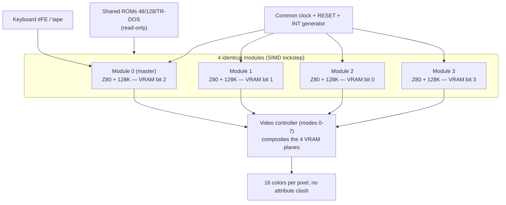

[← Home](../../README.md) · [Soviet Clones](README.md)

# ZX-Poly — Four Lockstep Z80s Against Attribute Clash (1994 Concept, Never Manufactured)

The ZX Spectrum's most infamous defect is attribute clash: one ink/paper pair per 8×8 cell, so any two colors meeting inside a cell bleed into blocks. Igor Maznitsa's (**Raydac**) 1994 answer, originally named **ZM-Polyhedron** and later **ZX-Poly**, keeps everything else about the Spectrum 128 identical — but runs **four synchronously locked Z80 CPUs, each owning one bitplane of the final pixel color**. CPU0 holds bit 2, CPU1 bit 1, CPU2 bit 0, CPU3 bit 3 of each pixel's 4-bit palette index: every pixel carries its own color, and attribute clash vanishes. The inspiration was the Pixar Image Computer, which processed each color component on a dedicated processor; ZX-Poly applies that decomposition to a home computer.

The platform was **never manufactured** — mid-90s negotiations with Russian clone makers concluded the market was gone. The reference "hardware" is therefore the [raydac/zxpoly](https://github.com/raydac/zxpoly) Java emulator (GPL-3), quirks included, together with a corpus of adapted games published between 2017 and 2024.

> [!NOTE]
> This article covers ZX-Poly as a **platform and execution model** (analysis of the emulator sources). Its Spec256 board mode — 1 master + 8 satellite GFX cores for the 256-color extension — is covered separately in [Spec256](../../05_development/05_display_and_timing/spec256.md).

---

## The Enabling Theory: Deterministic Lockstep

The whole platform rests on one theorem (the author's own words): *stable synchronous systems without internal random processes, built from the same components and started synchronously from the same state, remain in the same state at any time — provided all components receive the same inputs at the same time.* Consequences:

- All four CPUs share **one clock, one RESET, one INT generator**. No bus arbitration, no cache — every CPU fetches the same instruction stream.
- **Code never needs modification**: the same program loaded into all four address spaces executes identically on each CPU. It is a SIMD machine by construction.
- The only thing that may diverge is **data** — memory the program *writes* (graphics) rather than *reads* (logic). Adaptation means changing the graphics data in the three slave planes while the master plane keeps the original bitmap.
- Anything the program **reads back** from divergent memory breaks the lockstep and desynchronizes the machine — the fundamental constraint of every game adaptation.

The platform can also run MIMD (CPUs independent, re-aligned with sync primitives), but all adapted content runs SIMD.

## Hardware Structure

Each **module** is a complete ZX Spectrum 128 minus keyboard and video: one Z80 at 3.5 MHz, its own 128 KB RAM, its own `#7FFD` paging latch, and four platform registers R0–R3 on dedicated ports. Modules are electrically peers; one is designated master.

The **video controller** composites the four VRAMs; its mode set includes the standard ZX mode, the 16-colors-per-pixel mode, and a 512×384 mode with 8×8 attributes. Total memory: 512 KB RAM (4×128) + 32 KB shared ROM. A TR-DOS controller exists, visible to a CPU only in IO-mapped mode.

## History and Corpus

| Year | Event |
|---|---|
| 1994 | Idea (as **ZM-Polyhedron**): four Z80s in sync, 1-bit planes combined into 4-bit color; programs unmodified, only graphics data changed |
| 1999 | first test emulator; trial colorization of an *After The War* fragment |
| 2007 | the Java emulator; project takes the name **ZX-Poly** |
| 2017–2024 | adapted games released: *OFC* (2017), *Buratino* (2018), *Flying Shark* (2019), *Alien 8* (2021), *Comando Quatro* (2024, by its original programmer), *Summer Santa 2022*; *After The War 2* and *ZX-Word* as TRD builds |

The adaptation pipeline (Sprite Corrector projects, per-plane data edits, the desynchronization audit that checks nothing reads back divergent memory) is as much a part of the platform as the hardware model.

## Why It Matters

- It is the only Soviet-lineage answer to attribute clash built on **replication rather than a new video chip** — the same philosophical bet as the Sprinter's PLD or TS-Conf's TSU, taken to the CPU itself.
- The lockstep theorem and its read-back constraint are a clean, teachable case of **deterministic SIMD emulation** — which is exactly why the model generalizes: ZX-Poly's Spec256 board mode (one master + 8 GFX cores) is the same scheduler with eight satellites.
- Every fact above is verifiable against an open-source reference implementation — a luxury almost no unmanufactured platform offers.

## Emulation Notes

- The four CPUs must step **in lockstep with identical timing**; any per-CPU timing divergence accumulates into desynchronization — the emulator schedules all cores from one instruction budget.
- I/O must broadcast: `#FE` keyboard reads are seen by all modules; a write from any module lands in that module's memory only.
- The sync primitives (R0–R3) and the master designation are the only asymmetric state — everything else is four identical machines.
- Snapshot/TTD formats need per-module memory + the sync registers; a machine whose "interesting state" is replicated fourfold stresses naive serialization.

---

## Cross-References

- [Spec256](../../05_development/05_display_and_timing/spec256.md) — the 256-color extension whose FPGA-era implementations reuse ZX-Poly's multi-core model
- [Pentagon 1024 — 16-color mode](pentagon_1024.md) — the same war on attribute clash, won with a 4-plane memory reinterpretation instead of extra CPUs
- [Attribute clash](https://en.wikipedia.org/wiki/Attribute_clash) — the enemy
- [Clone timing](clone_timing.md) — where ZX-Poly sits (identical timing × 4)

## References

- **[raydac/zxpoly](https://github.com/raydac/zxpoly)** — the Java reference emulator (GPL-3) and the adapted-games corpus (verified live, September 2026)
- **[SpeccyWiki — ZX-Poly](https://speccy.info/ZX-Poly)** — platform history (Russian)
- Igor Maznitsa's lockstep theorem and adaptation pipeline — zxpoly repository documentation
