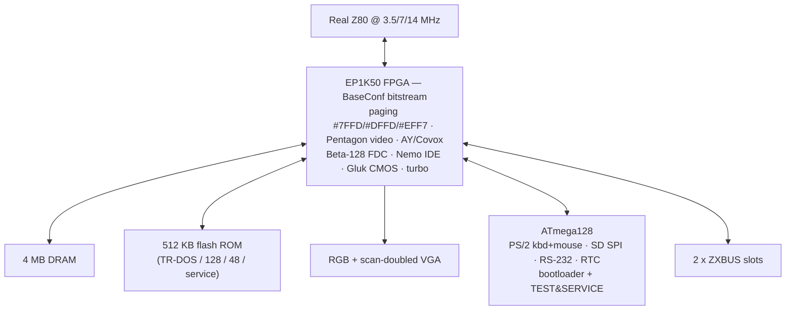

[← Home](../../README.md) · [New Gen Hardware](README.md) · [ZX Evolution](zx_evo.md)

# BaseConf — The ZX Evolution's Default Firmware

**BaseConf** is the default **firmware configuration** for the ZX Evolution — the bitstream loaded into the board's Altera EP1K50 FPGA and ATmega128 MCU that defines what hardware the Z80 sees. Designed by **Roman Chunin (`CHRV`)** (ATmega128 firmware) and **Vadim Akimov (`LVD`)** (EP1K50 FPGA bitstream) at **NedoPC** as the ZX Evolution's launch configuration, BaseConf implements the full **Pentagon 1024** specification plus a set of well-documented extensions: 3.5 / 7 / 14 MHz turbo, IDE storage, Beta 128 disk, SD(HC) card, PS/2 keyboard and mouse, RS-232, RTC, and RGB/VGA video output with a scan doubler.

> [!NOTE]
> **Hardware authors.** The ZX Evolution physical board was designed by three engineers at NedoPC: **Vadim Akimov (`LVD`)** and **Roman Chunin (`CHRV`)** (hardware) plus **Dmitry Dmitriev (`DDP`)** (who wrote the ATmega128 bootloader and the `TEST&SERVICE` diagnostic firmware). The EVO RESET SERVICE / EVO DOS / EVO PROF ROM images were written by **Vyacheslav Savenkov (`Savelij`)**. Today the board is sold and supported by **Vitaliy (`tetroid`)** in Novosibirsk — contact `tetroid@inbox.ru`, site `tetroid.nedopc.com`.

For software developers, BaseConf is the **"known-good target"** for ZX Evolution software. If your program runs under BaseConf, it runs on the vast majority of ZX Evolution boards in the field. This article covers BaseConf as a programmer-visible configuration: what hardware it presents, how the memory map differs from a bare Pentagon 1024, what extra ports it exposes, and what compatibility pitfalls exist.

> [!NOTE]
> This article covers the **firmware configuration** (what the Z80 sees). For the underlying hardware platform (real Z80 + CPLD + ATmega), see [zx_evo.md](zx_evo.md). For the **OS-level details** (boot ROM, dot commands, file system), see [evo_os.md](../../04_operating_systems/evo_os.md). For the enhanced firmware alternative (sprites, tilemap, DMA, RGB555 CRAM), see [ts_conf.md](ts_conf.md); for the FT812 video card of the TS-Conf family, see [vdac2.md](vdac2.md).

---

## What BaseConf Defines

A BaseConf is a **complete hardware definition** — changing it changes everything the Z80 sees:

| Aspect | Defined by BaseConf |
|---|---|
| **CPU clock** | **Real Z80** at 3.5 MHz (default) / 7 MHz (turbo, no wait states) / 14 MHz (mega-turbo, with wait states — see [CPU Waits](#cpu-waits-and-emulated-contention)) |
| **Memory** | **4 MB RAM** (64 banks × 16 KB via Pentagon paging) + **512 KB ROM** (multiple ROM images selectable) |
| **Video** | Standard Spectrum 256×192 + scan-doubled VGA output (RGB also available) |
| **Sound** | **AY-3-8910** at `#FFFD`/`#BFFD`, beeper, Covox (PWM) |
| **Disk interfaces** | Beta 128 FDC (**WDC1793 / KR1818VG93** compatible), IDE (1 channel, 2 devices), SD(HC) via ATmega SPI |
| **Peripherals** | PS/2 keyboard, PS/2 mouse, RS-232 (with USB bridge on rev.C), RTC, tape I/O |
| **I/O ports** | Pentagon `#7FFD` / `#DFFD` / `#EFF7` + Kay-compatible IDE ports `#A0`–`#B7` |
| **Board** | MiniITX form factor (172 × 170 mm), 2 ZXBUS slots, ATX or +5/+12 V power |

In short, BaseConf is the **hardware definition of the ZX Evolution as the Z80 sees it**. Changing the BaseConf changes what hardware the Z80 sees.

---

## The Default Profile — Pentagon 1024

The default BaseConf implements the **Pentagon 1024** standard — the most widely-supported Russian Spectrum configuration. Most Russian software is tested against it.

| Feature | Pentagon 1024 BaseConf | Notes |
|---|---|---|
| **RAM** | **1024 KB**, 64 banks of 16 KB | Paged via `#7FFD` + extended port |
| **Video** | Standard Spectrum 256×192 | Plus multicolor and text modes via port `#FF` and ATM Turbo ports |
| **Sound** | AY-3-8910 at `#FFFD`/`#BFFD` | Standard Pentagon clock |
| **Disk** | Beta 128 at standard Pentagon ports | Optional secondary FDC |
| **I/O layout** | Standard Pentagon + extensions | See port summary below |

This is the **compatibility configuration** — it runs the vast majority of Russian Spectrum software. Most users keep their ZX Evolution in this configuration most of the time.

---

## Memory Map — The Three Paging Ports

BaseConf implements three paging ports, providing flexibility beyond a bare Pentagon 128:

### Port `#7FFD` — 128K Paging (Standard)

The standard Sinclair 128K paging port. Works identically to a Pentagon 128 — selects among the first 8 RAM banks (0–7), toggles the screen between banks 5 and 7, and selects ROM 0 / ROM 1.

### Port `#DFFD` — Pentagon Extended Paging

Provides access to banks beyond the first 8. The bit layout differs slightly from other clones:

| Bit | Function |
|---|---|
| 0–2 | **Extended bank bits** — combined with `#7FFD` bits 0–2 to form a 6-bit bank number |
| 3 | Reserved |
| 4 | (varies by BaseConf version) |
| 5 | Reserved |
| 6 | (varies by BaseConf version) |
| 7 | Reserved |

The full bank number is `(#DFFD & #07) × 8 + (#7FFD & #07)`, giving 64 banks = 1024 KB. This is identical to the Pentagon 1024 formula.

### Port `#EFF7` — Pentagon 1024 Extended Paging

The "true" Pentagon 1024 extension port — uses a full 8-bit identity decode (zero aliases). On BaseConf, this port provides the same 6-bit bank number as `#DFFD`, but with **full address decoding** — writes to other addresses do not affect the bank register. Software targeting the original Pentagon 1024 hardware should use `#EFF7`.

> [!WARNING]
> **Do not mix `#DFFD` and `#EFF7` writes.** Both ports affect the same bank register on BaseConf, but with different decode masks. Mixing them produces inconsistent behavior across BaseConf revisions. Pick one and stick with it.

---

## BaseConf Extensions Beyond Pentagon

BaseConf adds several features the original Pentagon 1024 lacked. These extensions are presented through additional I/O ports that do not conflict with the Pentagon port layout.

### Turbo Mode

BaseConf supports CPU speeds of **3.5 MHz, 7 MHz, and 14 MHz** — switchable at runtime via a port write. Turbo mode accelerates all CPU-bound code but does not affect video timing (the frame rate stays at 48.83 Hz).

| Port | Bits | Function |
|---|---|---|
| `#DFFD` (in some BaseConf versions) | 6 | Turbo enable (1 = 14 MHz) |
| `#1FFD` (Scorpion-style, in some versions) | 5–6 | Turbo speed select |

> [!WARNING]
> Turbo mode accelerates access to **all** peripherals, including the Beta 128 FDC and the AY chip — which expect 3.5 MHz timing. Always restore 3.5 MHz before accessing these peripherals, or use the BIOS wrappers that handle it automatically.

### CPU Waits and Emulated Contention

The BaseConf RTL (`pentevo/fpga/base_trdemu`: `z80/zclock.v`, `z80/zmem.v`, `dram/arbiter.v`, `video/video_sync_h.v`) shows exactly when the Z80 is held:

| Condition | CPU delay |
|---|---|
| Pentagon raster (default), 3.5 / 7 MHz | **None.** The DRAM arbiter works in blocks of 8 DRAM cycles and gives the video 1/8 (ZX modes) or 1/4 (other modes) of them, so the CPU always finds a free cycle |
| 48K or 128K raster (chosen in the AVR setup), **3.5 MHz only** | **Emulated Sinclair contention** by stalling the clock with the 48K pattern: `#4000`–`#7FFF`, plus `#C000`–`#FFFF` with an odd page in the 128K raster, and even ports. The RTL comments call it "only 48k by now"; the +2A/+3 pattern is marked as probably incorrect |
| 14 MHz | **Variable waits per access**, depending on the DRAM phase: an M1 waits 3–6 and a read 2–5 cycles of the 28 MHz clock; writes do not wait. External I/O drops to 7 MHz, and clock switches happen only at a refresh cycle |
| DOS ROM switching in or out | A short stall |
| `#BFF7` / `#BEF7` (Gluk clock), `#xxEF` (RS-232) | WAIT until the ATmega services the access (`z80/zwait.v`) |

See [contention_model.md](../../05_development/03_memory_and_io/contention_model.md) for the cross-model picture.

### IDE Interface — Nemo IDE, 16-bit words over two byte accesses

BaseConf builds in the **Nemo IDE** controller (the IDE logic lives in the same RTL for BaseConf and TS-Conf: [`pentevo/fpga/base/z80/zports.v`](https://github.com/tslabs/zx-evo/blob/master/pentevo/fpga/base/z80/zports.v)). The ATA data register is **16 bits**, assembled from two 8-bit Z80 accesses; the hardware accepts **both byte orders** and tells them apart automatically:

| Order | Read | Write |
|---|---|---|
| **Nemo** | `IN #10` = low byte, `IN #11` = latched high byte | `OUT #11,hi` then `OUT #10,lo` writes the word |
| **DivIDE** | first `IN #10` = low, second `IN #10` = high | first `OUT #10,lo`, second `OUT #10,hi` |

The port decode uses the low address byte: `rrr10000` (`#10`, `#30` … `#F0`) select ATA registers via `A7..A5`, `#C8` is the alternate-status/control port, and `#11` is the high-byte latch (not a bus cycle). An access to any other IDE port cancels a half-completed pair. Compared with an 8-bit Kay-style interface this halves the port traffic per sector — software written for the Nemo IDE (including ZX-Evo BIOS and the emulators' `NEMO-DIVIDE` scheme) works unchanged.

### SD Card via SPI

BaseConf exposes an SD card interface via the ATmega's SPI controller, accessible through a port pair (typically `#57` and `#77`). This is a software-driven SPI — the ATmega handles the bit-banging, the Z80 just reads/writes bytes. SD cards up to 32 GB are supported (FAT16/FAT32).

### PS/2 Keyboard and Mouse

The ATmega handles the PS/2 protocol for both keyboard and mouse, presenting a simplified byte-stream interface to the Z80. Keyboard scan codes are read from a port (typically `#FE` for compatibility, with extended keys available at a secondary port); mouse movement is read from a separate port pair.

### Real-Time Clock (RTC)

A battery-backed RTC (typically DS12887 or similar) is accessible via a port pair, providing date and time. The BIOS uses this for filesystem timestamps.

---

## ROM Configuration

BaseConf supports **multiple ROM images** stored in flash memory, selectable at boot time. The standard ROM set:

| ROM slot | Contents |
|---|---|
| `0` | **TR-DOS ROM** — Russian disk operating system (used for disk operations) |
| `1` | **128K BASIC ROM** — standard 128K BASIC editor |
| `2` | **48K BASIC ROM** — for 48K software compatibility |
| `3` | **Service ROM** — diagnostic and configuration menus |
| `4`–`7` | **Custom ROMs** — user-flashed ROM images (e.g., alternative DOS, BIOS extensions) |

The boot menu (accessible via a key combination at power-on) lets the user select which ROM to boot from, configure turbo mode, and set other options.

### ROM Banking and TR-DOS Coexistence

The TR-DOS ROM is **banked into the memory map on demand** — when software calls the TR-DOS entry point at `#3D13`, the BIOS pages the TR-DOS ROM into `#0000`–`#3FFF` and transfers control. When TR-DOS returns, the original ROM is paged back in. This is the same mechanism the Pentagon 128 uses; existing TR-DOS software works unchanged.

---

## Compatibility Profiles

Beyond the default Pentagon 1024 profile, the AVR setup selects the **raster/contention profile** (Pentagon default with no contention; 48K or 128K raster with emulated Sinclair contention at 3.5 MHz), and the boot menu selects among several **machine personalities**:

| Profile | What it does |
|---|---|
| **Pentagon 1024** (default) | Most Russian software; default daily use |
| **Pentagon 128 / 48K / 128K raster** | Older software expecting 128K paging locks or Sinclair contention |
| **ATM Turbo** | ATM Turbo-specific software (alternative Russian clone with its own video modes) |
| **TS-Conf** (separate firmware, not a BaseConf profile) | Modern TS-Conf-aware software — see [ts_conf.md](ts_conf.md) and [vdac2.md](vdac2.md) |

Switching profiles is a **reboot operation** — the user selects the new BaseConf in the boot menu, and the CPLD is reprogrammed on the next power cycle. This is fundamentally different from the ZX Spectrum Next's runtime mode switching.

---

## Updating BaseConf

Updating BaseConf is similar to updating the boot ROM:

1. **Load a new bitstream** from the SD/CF card (`zxevo_fw.bin`)
2. **Use the boot ROM's BaseConf update utility** (the ATmega128 bootloader) to reflash the FPGA configuration flash and the ATmega firmware
3. **Reboot** — the FPGA and MCU are reconfigured at the next power-on

The flashing procedure requires the **SOFT RESET (jumper J6) + HARD RESET (jumper J9)** sequence to enter the ATmega bootloader's recovery mode, which can write a new `zxevo_fw.bin` to the on-board flash from the SD card. See [zx_evo.md](zx_evo.md) for the full jumper procedure.

Because BaseConf is the lowest layer of the system (it defines the hardware itself), a corrupt BaseConf is a more serious problem than a corrupt boot ROM. If BaseConf is corrupted, the FPGA will not be configured, and the board will be completely non-functional until the bitstream is rewritten via JTAG.

The community therefore recommends **keeping a known-good BaseConf image on a separate SD card** for emergencies.

## Alternative Firmware Configurations

BaseConf is not the only firmware that runs on the ZX Evolution hardware. Several alternative configurations exist, each presenting a different machine personality to the Z80:

| Firmware | Author | What it does |
|---|---|---|
| **BASECONF FE** | **CHRV + LVD** (NedoPC) | Default Pentagon-1024-compatible configuration (this article) |
| **TS-Conf** ("ZXEVO TS") | **Aleksandr Zhuravlev (`tsl`)** | Enhanced video: sprites, tilemap, DMA, 4 MB addressing — see [ts_conf.md](ts_conf.md) |
| **ScorpEvo** (v6.1+) | Community | Implements **Serge Zonov's Scorpion ZS-256 turbo+** — alternative Russian clone personality |
| **EVO RESET SERVICE** | **Vyacheslav Savenkov (`Savelij`)** | Service ROM for recovery / low-level diagnostics |
| **EVO DOS FE** / **EVO PROF** | Savelij | Disk-oriented and professional variants |
| **TEST&SERVICE** | **Dmitry Dmitriev (`DDP`)** | Bootable test and diagnostic configuration (essential for newly-soldered boards) |
| **BOOTLOADER** | DDP | The ATmega128 bootloader itself — only flashed via a hardware programmer |

Switching configurations is a **reboot operation** — the user selects the new firmware in the boot menu, and the FPGA is reprogrammed on the next power cycle. This is fundamentally different from the ZX Spectrum Next's runtime mode switching.

## Hardware Revisions

The ZX Evolution has gone through three PCB revisions at NedoPC:

| Revision | Status | Key changes |
|---|---|---|
| **A** | Not manufactured | First design — abandoned before production |
| **B** | Production | PS/2 connector fixes, ICS501 OE fix, larger 78M05 pattern, AY-printer interface added, ferrite pattern enlarged, board size reduced, jumper changes, FDD key pin, ZXBUS pin-1 direction, WD1793 reset fix, board silkscreen text ("HDD Led", "PWR Led", "Slot1", "Slot2", etc.), VGA connector placement |
| **C** (current) | Production | **MiniITX form factor (172 × 170 mm)**, removed on-board PAL coder (now external), added AY-printer interface, frequency multiplier control, audio-in (3 inputs total), **CPU Z80 in QFP package**, removed RGB connector (via VGA instead), **RS232-USB bridge** added, removed AT power connector, added PAL coder expansion connector |

If you have a board without revision markings, the **QFP-packaged Z80** and **MiniITX dimensions** identify a rev. C board (the only currently-sold revision).

---

## Cross-References

- [ZX Evolution hardware platform](zx_evo.md) — physical board, real Z80 + CPLD + ATmega
- [TS-Conf firmware](ts_conf.md) — the enhanced firmware (sprites, tilemap, DMA, CRAM)
- [VDAC2 — FT812 video card](vdac2.md) — the GPU extension of the TS-Conf family
- [ZX Evolution FPGA internals](../../11_emulation/fpga/zxevo.md) — CPLD design, bitstream architecture
- [Evo OS](../../04_operating_systems/evo_os.md) — OS-level details, dot commands, file system
- [Pentagon 128](../clones/pentagon.md) — the BaseConf's primary compatibility target
- [Pentagon 1024](../clones/pentagon_1024.md) — the maximum Pentagon configuration
- [Kay 1024](../clones/kay.md) — Kay's IDE interface (BaseConf's IDE is Kay-compatible)
- [ATM Turbo](../clones/atm_turbo.md) — alternative Russian clone (BaseConf has an ATM Turbo profile)

---

## References

All links verified live (October 2026).

- **BaseConf RTL sources** — [tslabs/zx-evo `pentevo/fpga/base`](https://github.com/tslabs/zx-evo/tree/master/pentevo/fpga/base) (LVD's Verilog; the `base_trdemu` contention-emulation variant is cited in the RTL notes), released alongside TS-Conf in the same repository
- **NedoPC ZX Evolution page** — [nedopc.com/zxevo/zxevo_eng.php](http://nedopc.com/zxevo/zxevo_eng.php): schematics (rev B/C), bill of materials, user and soldering manuals, firmware downloads
- [zxevo.ru](https://zxevo.ru) — community wiki and file hub (Russian)
- **TS-Conf** — the sibling firmware: [ts_conf.md](ts_conf.md), sources [tslabs/zx-evo](https://github.com/tslabs/zx-evo); its FT812 video card: [vdac2.md](vdac2.md)
- **BruXy ZX Evolution review** ([bruxy.regnet.cz](https://bruxy.regnet.cz/web/8bit/EN/zx-evolution/)) — independent hands-on review with hardware photos and monitor compatibility tests
- **Andrew Lazarev's ZX Evolution site** ([zx.andrew-lazarev.com/en/](https://zx.andrew-lazarev.com/en/)) — community programming guides and software archive
- **[zx-pk.ru](https://zx-pk.ru) forum** — *ZX Evolution* subforum: BaseConf programming guides, SD/IDE/RTC tutorials (Russian)
- **Tetroid (Novosibirsk) distribution** — `tetroid@inbox.ru`, `tetroid.nedopc.com` — current manufacturer and support contact
