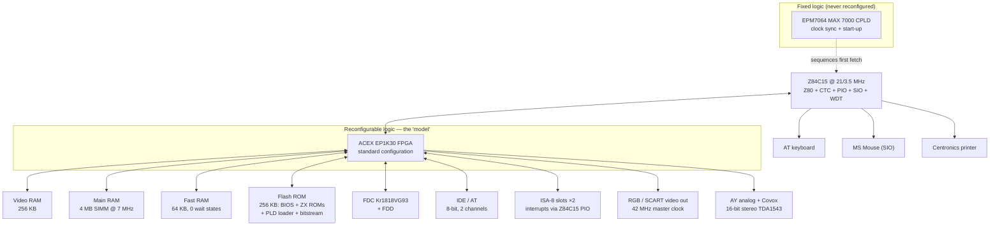

[← Home](../../README.md) · [New Gen Hardware](README.md)

# Sprinter — Peters Plus's Z80 PC with Reprogrammable Logic

The **Sprinter** (Russian: **Спринтер**) is a late-era Russian Spectrum-family computer produced by **Peters Plus, Ltd.** of St. Petersburg, with the **Sp2000** motherboard launching around 1999–2001. It takes a different path from the FPGA-based machines (Next, ZX Evolution, ZX-Uno) covered elsewhere in this section. Where those machines use FPGAs to recreate classic Spectrum hardware, the Sprinter is a **Z80-based personal computer** built around an **Altera ACEX EP1K30 FPGA**, paired with a real Zilog Z84C15 CPU, 4 MB of RAM, 256 KB of ROM, a hardware disk controller, IDE/AT hard disk support, two ISA-8 expansion slots, and a 16-bit Philips TDA1543 DAC for digital audio.

Designed primarily by **Ivan Makarchenko ("Ivan Mak", PLD configurations and board)** and **Denis Parinov (BIOS and OS)** at Peters Plus, the Sprinter is binary-compatible with the Spectrum 128K and Pentagon (for the existing Russian software library) but provides enough PC-style hardware that **new software could be written for it that had nothing to do with the Spectrum** — word processors, file managers, BBS clients, CD-ROM audio players, and even a port of Doom.

This article covers the Sprinter as a hardware platform: its architecture, memory map, video modes, ports, and programming model. For the firmware layer — PLD configurations, the BIOS version history, the Estex DSS operating system, the copy accelerator internals, and where all the sources live — see [sprinter_firmware.md](sprinter_firmware.md). For the demoscene context, see [Soviet demo scene](../../07_demoscene/soviet_demo_scene.md). For the Sprinter's place in the clone-timing landscape, see [clone_timing.md](../clones/clone_timing.md).

> [!IMPORTANT]
> The Sprinter's defining feature is its **reprogrammable logic**. The machine's hardware — memory banking, video controller, the AY sound chip, the copy accelerator, port decoding — is a **59,215-byte bitstream** stored in the 256 KB flash ROM (at offset `#30100`), streamed into the FPGA at every power-on. Running a flash utility on the Sprinter itself rewrites the ROM in approximately three minutes, **changing the computer's hardware architecture without any component replacement**. Peters Plus separated the *board* (sp97, sp2000, sp2000s…) from the *model* ("Sprinter" = a set of FPGA configurations) precisely to make the hardware a software product.

---

## Why the Sprinter Is Different

By the late 1990s, the Russian Spectrum scene had a problem: the hardware was old. The Pentagon 128 was a 1989 design built around discrete TTL logic, with a slow 3.5 MHz CPU and tape-based software distribution. The scene wanted modern features — fast CPU, disk storage, VGA-compatible output, PS/2 keyboard, mouse — without abandoning the thousands of existing Spectrum programs.

Two solutions emerged:

1. **The ZX Evolution** (Vladimir "vslav" Kladov and the NedoPC team, 2007+) — use an FPGA to recreate the Pentagon while adding modern peripherals (see [zx_evo.md](zx_evo.md)).
2. **The Sprinter** (Ivan Mak / Denis Parinov / Peters Plus, prototype 1996, final model 07.08.2000) — build a **new Z80-based computer** around a reprogrammable FPGA, with a 128K/Pentagon compatibility layer implemented as one of several loadable configurations.

The Sprinter is the "more radical" approach: it does not try to clone the Pentagon's video timing or contention behavior at the hardware level. Instead, it provides a modern PC-style architecture with a Spectrum compatibility configuration. The result is a machine that is **binary-compatible with Pentagon software at the API level** (TR-DOS calls, BIOS calls, video memory layout) but has **completely different underlying hardware**.

| Criterion | Sprinter (Sp2000) | ZX Evolution | ZX Spectrum Next |
|---|---|---|---|
| **Year** | ~1999–2001 | 2007 | 2017 |
| **Architecture** | Z80 + Altera ACEX FPGA + MAX CPLD | Z80 + Altera FPGA + CPLDs + ATmega MCU | FPGA soft-core (Z80N) |
| **CPU** | Real Z84C15 @ 21 MHz / 3.5 MHz | Real Z80 @ 3.5 / 7 / 14 MHz | Z80N @ 3.5 / 7 / 14 / 28 MHz |
| **RAM** | **4 MB** (SIMM, hardware limit 64 MB) | 4 MB | 2 MB |
| **Video** | FPGA-based (320×256×256, 640×256×16, mixed per 8×8 cell) | Pentagon-style + extensions | Layer 2 / sprites / tilemap / copper |
| **Storage** | IDE/AT + Kr1818VG93 FDC + 3.5"/5.25" FDD | IDE + SD card + Beta 128 | SD card |
| **Keyboard** | **101-key AT PC keyboard** | PS/2 | Built-in + PS/2 |
| **Mouse** | **MS Mouse** (serial, via Z84C15 SIO) | PS/2 | PS/2 |
| **Audio** | **AY-3-8910 (in FPGA)** + **16-bit stereo DAC (Philips TDA1543)** | AY-3-8912 + beeper | Dual AY + DMA-driven PCM |
| **Expansion** | **Two ISA-8 slots** | Pentagon edge connector | Edge connector + expansion |
| **RTC** | Dallas DS12887A (CMOS clock) | Battery-backed via ATmega | Software |
| **Compatibility target** | Pentagon (software-level) | Pentagon (cycle-level) | 48K/128K/Pentagon (cycle-level) |

---

## Hardware Architecture

| Component | Specification |
|---|---|
| **CPU** | **Zilog Z84C15** at 21 MHz (turbo) or 3.5 MHz (compatibility) — a Z80 with integrated CTC, PIO, SIO and watchdog |
| **Main logic** | **Altera ACEX EP1K30QC208-3 FPGA** — loaded from flash at every power-on, reconfigurable from the machine itself |
| **Boot logic** | **Altera EPM7064SLC100 (MAX 7000 CPLD)** — fixed, never reconfigured: clock synchronization and initial start-up |
| **RAM** | **4 MB 72-pin SIMM** (installed standard) — hardware supports up to 64 MB; no bitstream exists for >4 MB |
| **Fast RAM** | **64 KB dedicated fast RAM** ("cache", zero wait states; the main DRAM runs at 7 MHz, so at 21 MHz accesses to it wait — code in fast RAM runs "without waiting") |
| **ROM** | **256 KB flash** — BIOS, ZX ROMs, PLD loader and the bitstream itself |
| **Video RAM** | **256 KB** dedicated (512 KB footprint; the second half was never used by any firmware) |
| **FDC** | **Kr1818VG93** (Soviet WD1793 clone) — 3.5" (1.44 MB / 720 KB) and 5.25" (720 KB) |
| **HDD controller** | **IDE / AT** — 8-bit transfers, MS-DOS FAT-16 partitions up to 2 GB; second channel activated by the community BIOS (2022+) |
| **Clock** | **Dallas DS12887A** or ODIN OED12C887 — battery-backed CMOS real-time clock |
| **Keyboard** | **101-key AT PC keyboard** (PS/2 connector on the 2016 board revision) |
| **Mouse** | **MS Mouse** serial, via one Z84C15 SIO channel |
| **Audio** | **AY-3-8910 analog (in FPGA)**, Pentagon-compatible + **16-bit stereo DAC Philips TDA1543** (Covox ports `#FB`/`#4F`; 10 bits currently exercised for simultaneous 8-bit Covox + AY) |
| **Video output** | 15.625 kHz horizontal sync: **CGA-style RGB monitor**, **TV via SCART**, RGB via DIN |
| **Joystick** | **Kempston** at `#1F` (re-addressed to `#0F` in the Sprinter-1 configuration) |
| **Printer** | Centronics parallel port |
| **Expansion** | **Two standard ISA-8 slots** (removed on the sp2000-light board) |
| **Graphics modes** | **320×256×256** and **640×256×16**, mixed freely per 8×8 cell; ZX Spectrum mode; community additions 352×280×256, 704×280×16 (EP1K50) |
| **Power** | Standard PC AT supply (+5, −5, +12, −12 V); ATX connector on the 2016 revision |

### Block diagram



### Why an ACEX FPGA plus a MAX CPLD?

The Sprinter was designed in the late 1990s, when large FPGAs were expensive and hard to source in Russia. The **ACEX EP1K30** (an FPGA with embedded array blocks — the same family as the ZX Evolution's later EP1K50) held the entire machine: banking, video, AY, accelerator, port decoding. The small **MAX 7000 CPLD** next to it never changes — it exists purely to sequence clocks and hand the CPU its first fetch while the FPGA is blank. The Russian documentation calls the pair **ППЛМ** (*перепрограммируемая логическая матрица*, reprogrammable logic device), which has led some sources to misdescribe the main chip as a "PLD"; it is a fully reprogrammable FPGA, and that is exactly what makes the Sprinter field-upgradable.

The 2016 community board revision (sp2016s) accepts either the EP1K30 or the **EP1K50**, and the current community BIOS ships a universal loader plus 1K30/1K50 bitstreams — see [sprinter_firmware.md](sprinter_firmware.md).

---

## Memory Architecture

Main memory is organized as **256 banks ("pages") of 16 KB** (4 MB), plus separate video RAM, fast RAM and flash. The Z80's four 16 KB windows are steered by dedicated page registers:

| Port | Function |
|---|---|
| `#82` | **PAGE0** — RAM page replacing the ROM (when switched in via `#1FFD`) |
| `#A2` | **PAGE1** — RAM page at `#4000–#7FFF` |
| `#C2` | **PAGE2** — RAM page at `#8000–#BFFF` |
| `#E2` | **PAGE3** — RAM page at `#C000–#FFFF`; can map any of the 16 Scorpion-scheme pages |

The page registers are **readable as well as writable**, so code can save and restore the mapping trivially — the BIOS does this for every call. Special pages occupy fixed slots:

- **Page `#40`** — the **port map** (see below);
- **Pages `#50–#5F`** — video RAM in graphics-mode addressing (linear per raster line);
- **Pages below `#80`** — write-protected when mapped as ROM via the hidden ROM ports.

### Spectrum Compatibility Mode (ZX-Spectrum+AY)

In **ZX mode** (a boot-menu selection, not a runtime switch), the classic ports take over:

- `#7FFD` — 128K banking (ROM select, screen, RAM bank at `#C000`)
- `#1FFD` — Scorpion ZS-256 extension
- `#FE`, `#BFFD`/`#FFFD` — ULA register, AY ports
- `#1F`/`#0F` — Kempston joystick

The ZX configuration "practically coincides with Sprinter-1". There is **no memory contention** in any mode: video RAM is a separate chip on its own bus, so screen access never delays the CPU. The community BIOS (3.05+) lets Setup choose the **INT timing** — Scorpion, Pentagon or Spectrum — and the vertical frame length (312 lines @ 50 Hz or 320 lines @ 49 Hz), applied live.

> [!NOTE]
> The Sprinter's Pentagon compatibility is "good enough" for **most** Pentagon software — roughly 80–90% of games and demos run correctly. The failures are typically cycle-exact demos that depend on exact T-state timing or floating-bus behavior. See [clone_timing.md](../clones/clone_timing.md) for the timing comparison.

### The soft port map — port decoding as data

The Sprinter's most unusual system feature: **I/O port decoding lives in RAM**. A cycle to any port first reads a byte from the port map on page `#40`, which says which internal device (if any) is attached to that address pattern. Consequences:

- **Four port maps** coexist on the page, switched through the system port (`#3C`/`#7C`, values `#04`, `#0C`, `#14`, `#1C`) — instant reconfiguration for ZX software running beside Sprinter BIOS services.
- Map address bits encode the qualifiers: A0–A2 and A5–A7 carry the port address bits, A9 = read vs. write, A10 = DOS on/off, plus a Pentagon-port lock bit. One device can therefore be read-only, DOS-only, or visible only when the Pentagon port is open.
- A program can **open its own ports** by writing map bytes (the manual's example maps a virtual device to `#7785`), or move the standard ones.

Standard addresses in the native configurations (all remappable): `#FE` keyboard/border, `#7FFD`, `#1FFD`, `#1F`/`#0F` Kempston, `#BFFD`/`#FFFD` AY, `#FB`/`#4F` Covox, `#82/#A2/#C2/#E2` pages, `#89` RGADR (graphics Y coordinate / ZX screen page), `#C9` RGMOD (screen mode page), HDD block at `#xx50–#xx55`, and the unmovable Z84C15-internal ports (`#10–#1F`, `#EE–#F4`). **Hidden ROM ports** (BASIC48, BASIC128, TR-DOS, EXPANSION, SYSTEM) let software bank any RAM page below `#80` in as write-protected ROM — that is how the community BIOS serves the ZX ROMs from flash.

---

## Video Modes

The FPGA's video controller is driven by a **42 MHz master clock**, divided to 14 MHz (640-pixel modes) and 7 MHz (320-pixel modes) pixel clocks. The screen is a grid of **56×39/40 squares** (8×8 pixels at 320-wide; 16×8 at 640-wide); 40×32 squares are visible, matching **312 (320) lines per frame** at a 15.625 kHz line rate — a PAL-family frame of 50.08 Hz (48.83 Hz in 320-line mode), not VGA. Interrupts come from vertical sync.

The twist: **the display mode is programmed per square**, as data in video RAM. Each 8×8 cell has mode bytes in VRAM blocks 24–29 (two switchable "mode pages", selected by bit 0 of port `#C9` RGMOD), specifying one of:

| Mode | Resolution | Colors | Notes |
|---|---|---|---|
| **ZX-40** | 256×192 visible | 8×2 attr + FLASH | Spectrum screen; three font sets, standard Spectrum layout |
| **ZX-80** | 640×256 text | attr-based | 80 columns, 2 chars per square, up to 36 fonts per screen |
| **GR-256-8** | **320×256** | **256 of 16.7 M** | Linear per-line addressing; think 40×32 tiles of 64-byte glyphs |
| **GR-16-16** | **640×256** | **16 of 16.7 M** | 16×8 squares; the upper 4 pixel-register bits double as the color index |

Different modes can coexist on one screen — text headers over a 256-color canvas, ZX status bar under a graphics window. The **palette is RAM too**: 1024-byte palette lines in VRAM hold RGB triplets; in ZX mode the palette address is attribute+pixel+FLASH, so a full 8×2-with-blink display comes from palette indirection rather than ULA silicon.

Community-era additions (2020s, EP1K50 boards and current bitstreams): **352×280×256**, **704×280×16** (both two mode pages, four palettes), and an experimental 368×288 visible only through a scandoubler or SCART-HDMI adapter.

### Video output

The Sprinter targets **15.625 kHz horizontal sync** monitors — CGA-style analog RGB, a TV via the bundled SCART cable, or RGB via DIN. It does not produce VGA; a VGA monitor must be a 15 kHz-capable model, or use the community's VGA converter board.

---

## The Copy Accelerator

The native configurations include a block-copy engine inside the FPGA: a 1..256-byte buffer that the CPU loads once and replays many times, with fill, block copy, **vertical-line copy/fill for the graphics screen**, and XOR/OR/AND logic variants. It is programmed not through ports but through **"NOP" instructions** (`LD B,B` disable, `LD D,D` set size, `LD C,C`/`LD E,E` fill, `LD L,L`/`LD A,A` copy, `LD H,H` reserved) — the accelerator redefines the instruction stream while armed. A full 320×256 screen copy takes about **1.2 frame interrupts**; throughput is bounded by the 7 MHz DRAM bus.

The DooM configuration's hardware line stretching survives as **scale port `#C7`**: a write programs a fixed-point step that advances the source index on every accelerated access, stretching or shrinking vertical/horizontal lines with zero CPU arithmetic. Full semantics, working code and performance model: [sprinter_firmware.md](sprinter_firmware.md#the-ram-copy-accelerator--a-dma-engine-dressed-as-opcodes).

---

## Software Ecosystem

The Sprinter shipped with a substantial **bundled software package**, distributed free of charge with the Sp2000 board:

### Operating Systems and System Software

| Software | Function |
|---|---|
| **Estex DSS** | The Sprinter's own DOS, MS-DOS-like with FAT12 floppies and FAT12/16 hard disks (see [sprinter_firmware.md](sprinter_firmware.md#estex-dss--the-operating-system)) |
| **BIOS** | Boot ROM with hardware init, configuration loader and the `RST`-based function API |
| **Sprinter-ZX configuration** | Spectrum compatibility mode (Pentagon/Scorpion INT timing, community BIOS) |

### Applications

| Software | Function |
|---|---|
| **Flex Navigator** | File manager (Norton Commander style; actively updated by the community) |
| **Black Cat Modem Terminal** | Terminal — X/Y/Z-modem |
| **GFX-viewer** | Image viewer for BMP, PCX and ZX Spectrum formats |
| **CD-Player / CD-Browser** | Audio CD playback and CD-ROM file browsing via IDE CD-ROM |
| **DOS Commander** | Text-mode dual-panel file manager |
| **TASM** | Multi-text editor and assembler (Sprinter-native) |
| **2D-Studio** | Graphics editor for BMP (320×256, 256 colors) |
| **FORTH** | Forth systems (at least three exist for the machine) |

### Games and Demos

| Software | Function |
|---|---|
| **Doom demo** | First-person shooter wall renderer using the `#C7` scale register (2002; its 1999 predecessor used the Sp97 DooM configuration) |
| **Thunder in the Deep** | Platformer that loads its own **Game configuration** (`GAME_00.ACX`) into the FPGA at run time; recovered and re-released by the community in 2025 |

The bundled IDE support and FAT file system made the Sprinter a credible **general-purpose 8-bit PC**, not just a gaming machine. The 2020s community extends this further: the **UNet** network stack (RTL8019AS and 3C509B ISA network cards, ESP8266 WiFi via the SprinterESP adapter), a gopher browser, a weather client, and an ISA-8 video card project (Sprinter-FT, FT812).

---

## Hardware Self-Upgrade — Reprogramming the FPGA

The Sprinter's most innovative feature is its **field-upgradable hardware logic**. At power-on the FPGA is blank; a loader in ROM page 0 streams the bitstream in (from ROM, or from the 64 KB fast RAM when the `ACEX_30K_LOADING` flag says a new configuration was staged), erasing the flag as it goes — so a hardware RESET always returns the machine to the stock configuration. A broken experimental bitstream cannot brick the board. The full mechanism, including the 8×-rotated write stream emulators hash for identification, is documented in [sprinter_firmware.md](sprinter_firmware.md#the-configuration-concept--board-vs-model).

This means **upgrading the Sprinter's hardware is a software operation**:

1. Run the flash utility on the Sprinter (an `.EXE`);
2. It rewrites the 256 KB flash in approximately **3 minutes**;
3. Reboot — the new architecture (BIOS pages *and* FPGA bitstream together) loads at power-on.

The Sprinter could rewrite its own hardware description years before the ZX Evolution, MiSTer or similar platforms normalized in-field FPGA updates. Building a configuration, however, required Altera **MAX+plus II** on a PC — the Sprinter can load configurations but never compile them.

### Upgrade roadmap, planned vs. delivered

- **>4 MB RAM** — board supports up to 64 MB; no bitstream was ever written for it (still true).
- **New video modes** — planned by Peters Plus, delivered 2020s by the community (352×280, 704×280 on EP1K50).
- **Second IDE channel** — hardware present but dead under Peters Plus firmware; activated by the community BIOS in 2022–2025.
- **PCI bus** — discussed, never implemented.

Peters Plus committed to **never releasing a new board revision** — all improvements as bitstream updates. Reality intervened (see below), but the sp2016s recreation and the current BIOS line honor the promise.

---

## Board History and the Community Era

| Board | Date | What changed |
|---|---|---|
| **Sp97** | 1996–2001 | The predecessor: Altera **FLEX EPF10K10** + MAX CPLD, 128 KB BIOS ROM with three encrypted configurations each; DooM/Video/Game bitstreams date from here |
| **Sp2000** | announced 18.12.2000 | The classic: ACEX EP1K30, first photo 24.02.2001; initial batch had layout errors |
| **Sp2000-light** | 17.03.2001 | Cost-reduced: **85 USD** — no ISA slots, no second IDE, 256 KB VRAM (the "missing" second 256 KB was never used anyway) |
| **Sp2000 (2nd batch)** | 10.12.2001 | Corrected layout; schematic v1.62 published 13.02.2003 as final |
| **Sp2000s** | 11.06.2003 | SOJ-package VRAM (Alliance chips); required the PLD rework of BIOS 3.03/3.04 against video artifacts; project stopped the same year |
| **Sp2003s** | built post-2009 | The never-released "SPRIN_3M" design found in the opened archives with ready Gerbers; a small batch made by loxic |
| **Sp2016s** | 2016 | Modern recreation (Mick, micklab.ru): SMD passives, ATX power, redone 3.3 V/2.5 V regulators for the FPGA, PS/2 keyboard spot (2017); accepts **EP1K50** |

Production totaled about **115 Sp2000 boards** (~200 machines with Sp97). In 2005, with the project stalled, Peters Plus offered the whole thing — license, sources, client base, 36 boards of stock — for **280,000 rubles**; nobody bought it, and the NedoPC group that had tried to organize the purchase started development of its own machine, the **ZX Evolution**. On 01.02.2007 Peters Plus handed everything to Ivan Mak free of charge ("Sprinter Resurrection 2"); he opened the **master archives** (today mirrored at [winglion.sprinter.ru](https://winglion.sprinter.ru)) until his death in 2013.

The **"Third Coming"** began 24.11.2020 with the Telegram group *zx_sprinter* and the GitLab group [gitlab.com/sprinter-computer](https://gitlab.com/sprinter-computer). The Sprinter Team (Tolik-Trek, Sayman, romych, Mick and others) has since shipped BIOS 3.05→3.07 beta, DSS 1.70/1.71, the 1K30/1K50 universal loader, the UNet network stack, reverse-engineered *Thunder in the Deep*, and maintains [doc.sprinter.ru](https://doc.sprinter.ru) and [app.sprinter.ru](https://app.sprinter.ru).

### Firmware and hardware sources

All firmware sources are public; the full annotated catalog (with verified commits) is in [sprinter_firmware.md](sprinter_firmware.md#source-code-repositories):

- **FPGA/CPLD AHDL sources** — [gitlab.com/sprinter-computer/hard](https://gitlab.com/sprinter-computer/hard) (Peters Plus) and [github.com/SaymanNsk/Sprinter200x](https://github.com/SaymanNsk/Sprinter200x) (GPL-3.0, community); Sp97 FLEX sources in [zxgit.org/Sprinter/97](https://zxgit.org/Sprinter/97)
- **BIOS** — 2.17 sources + all release bitstreams in [gitlab.com/sprinter-computer/bios](https://gitlab.com/sprinter-computer/bios); community 3.05–3.07 in [zxgit.org/Tolik-Trek/Sprinter-BIOS](https://zxgit.org/Tolik-Trek/Sprinter-BIOS)
- **DSS** — [gitlab.com/sprinter-computer/dos](https://gitlab.com/sprinter-computer/dos) (1.52–1.70) + community tree
- **Board files** — [zxgit.org/Sprinter/2000](https://zxgit.org/Sprinter/2000)

---

## Sprinter Community and Distribution

### Distribution

The Sprinter Sp2000 board was sold by Peters Plus directly, either from their St. Petersburg office or by mail order after full prepayment:

> **Peters Plus, Ltd.**  
> Russia, 191014 St. Petersburg  
> st. Uprising 35-31  
> Tel: +7 (812) 327-3531  
> E-mail: sprinter@petersplus.ru  
> Web: petersplus.ru / petersplus.com  
> FidoNet: 2:5030/529.56

**Price** (circa 2001): **3,255 Russian rubles** for the assembled Sp2000 board with installed 4 MB SIMM and 256 KB video RAM; the sp2000-light board was **85 USD**. Delivery within Russia was approximately 7% of the order cost. Bare boards and kits were **not** sold — only fully assembled and tested units.

### International Adoption

By late 2001, Peters Plus reported **over 50 Sprinter owners** across multiple countries — Russia, Belarus, Hungary, Poland, Austria, Italy, Denmark, the USA and Argentina. Many international users were programmers interested in developing Sprinter software; English-language documentation was limited, and international users relied heavily on machine-translated Russian docs.

### Warranty and Support

- **1-year warranty** against manufacturing defects
- **Free technical support** via e-mail and FidoNet
- **BIOS and bitstream updates** free for all owners
- **Software consultations** for Sprinter-native developers

After 2007 the master archives became the support channel; since 2020 the Telegram/Discord community and the GitLab/zxgit repositories fill that role.

---

## Programming the Sprinter

### Detecting a Sprinter

The page registers are readable, which gives a clean detection path: write a page number far beyond any clone's reach to PAGE3 and read it back.

```z80
detect_sprinter:
        in   a, (#E2)          ; PAGE3 register is readable
        ld   (saved_page), a   ; save the #C000 window mapping
        ld   a, #80            ; page 128 — exists only with >=2 MB
        out  (#E2), a
        in   a, (#E2)          ; read the register back
        cp   #80
        jr   nz, .not_sprinter
        ld   a, (saved_page)
        out  (#E2), a
        scf                    ; carry set = Sprinter detected
        ret
.not_sprinter:
        ld   a, (saved_page)
        out  (#E2), a
        or   a                 ; carry clear = not a Sprinter
        ret
```

> [!WARNING]
> On clones, `OUT (#E2)` may hit unmapped or differently-used hardware. Production code combines this probe with a check of the BIOS signature strings in ROM page 0 (the boot menu and version banner) before trusting the result.

### Switching Between Modes

The configuration (native Sprinter vs. ZX-Spectrum+AY) is selected at the boot menu, not switched at runtime; Sprinter-1 ↔ Sprinter-2 switch through the system port. The community BIOS adds a *ZX-Sprinter* ROM boot that enters ZX mode without loading DSS, and Setup options that change INT timing and frame length live. This is coarser-grained than the ZX Spectrum Next's per-write runtime reconfiguration — the Sprinter instead reconfigures *the whole machine* by loading a different bitstream (which the Game configuration demonstrates at run time from inside a game).

### Using the 16-bit DAC

The Philips TDA1543 provides **16-bit stereo output** (Covox ports `#FB`/`#4F`; current firmware exercises 10 bits for simultaneous 8-bit Covox plus AY-3-8910 mixing):

```z80
; Mono 8-bit sample to the Covox (left port #FB; #4F is the right channel)
play_dac_sample:
        ld   a, (hl)           ; 8-bit sample
        sla  a                 ; scale into the DAC's upper bits
        out  (#FB), a          ; left channel (repeat via #4F for right)
        inc  hl
        ret
```

The bundled CD-Player and the demoscene use the DAC; for block sound, the Game configuration's **Covox-Blaster** mode moves whole 15 kHz blocks with one access, freeing the CPU.

---

## Historical Significance

1. **Late-era Z80 PC** — along with the ATM Turbo, it represents the "Spectrum as a real computer" approach: fast Z80, large RAM, hard disk, modern peripherals.
2. **First mass-produced Russian computer with field-upgradable hardware logic** — the flash-backed FPGA architecture predates similar capability in Western retro hardware by years.
3. **Direct ancestor (by rejection) of the ZX Evolution** — when Peters Plus's 2005 license offer collapsed, NedoPC built its own machine; the ZX Evolution even uses the same ACEX 1K family (EP1K50).
4. **Small but international community** — users across Europe and the Americas by 2001; a production run of ~200 machines whose *entire* firmware and hardware corpus now lives in public repositories — a preservation outcome most bigger platforms never achieved.

The Sprinter was commercially superseded by the ZX Evolution after 2007, but unlike most dead platforms it is **actively developed again**: new BIOS and DSS releases shipped in 2025–2026, new boards are being built, and the original sources are open.

---

## Cross-References

- [Sprinter firmware & sources](sprinter_firmware.md) — configurations, BIOS/DSS history, copy accelerator deep dive, repositories
- [Sprinter video frame](../../05_development/05_display_and_timing/video_frame_sprinter.md) — 42 MHz clock tree, 312/320-line frame, INT timing
- [ZX Evolution](zx_evo.md) — the FPGA machine NedoPC started after failing to buy the Sprinter project
- [Pentagon 128](../clones/pentagon.md) — the Sprinter's compatibility target
- [ATM Turbo](../clones/atm_turbo.md) — another late-era Russian "Z80 PC" with extended graphics
- [Profi](../clones/profi.md) — earlier clone with ISA bus and RGBI graphics
- [Clone timing](../clones/clone_timing.md) — Sprinter's relationship to other clone timings
- [Soviet demo scene](../../07_demoscene/soviet_demo_scene.md) — cultural context

---

## References

- **Designer's manual** — Ivan Mak, *Sprinter. Руководство по программированию Sp2000* (15.08.2003): [PDF](https://github.com/SaymanNsk/Sprinter200x/blob/master/docs/sp2000_man.pdf) · mirror: [winglion.sprinter.ru/sp2000.pdf](https://winglion.sprinter.ru/sp2000.pdf); web edition: [doc.sprinter.ru](https://doc.sprinter.ru) ([architecture](https://doc.sprinter.ru/introduction/architect.html), [specification](https://doc.sprinter.ru/introduction/specification.html), [port addresses](https://doc.sprinter.ru/blocks/ports/defines.html))
- **Sprinter FAQ** — Alex Goryachev / Peters Plus, 17.12.2001, reprinted via ZXPress (Sinclair Club #05)
- **Board history** — [zxgit.org/Sprinter/2000](https://zxgit.org/Sprinter/2000) README (sp2000 → light → s; license offer; handover to Ivan Mak)
- **Master archives** — [winglion.sprinter.ru](https://winglion.sprinter.ru) (recreated by Sprinter Team)
- **Sources** — [gitlab.com/sprinter-computer](https://gitlab.com/sprinter-computer) (`hard`, `bios`, `dos`, `apps`); [github.com/SaymanNsk/Sprinter200x](https://github.com/SaymanNsk/Sprinter200x); [zxgit.org/Tolik-Trek/Sprinter-BIOS](https://zxgit.org/Tolik-Trek/Sprinter-BIOS)
- **Habr: "8-битный компьютер Sprinter"** (2021) — [habr.com/ru/articles/563598](https://habr.com/ru/articles/563598/) (production numbers, community history, modern video modes)
- **Emulators** — MAME [src/mame/sinclair/sprinter.cpp](https://github.com/mamedev/mame/blob/master/src/mame/sinclair/sprinter.cpp) · ZXMAK2 [github.com/zxmak/zxmak2](https://github.com/zxmak/zxmak2) · UnrealSpeccy family [github.com/mkoloberdin/unrealspeccy](https://github.com/mkoloberdin/unrealspeccy) — the practical verification path for Sprinter behavior
- [SpeccyWiki](https://speccy.info) — Sprinter article with photos and specification tables
- [zx-pk.ru](https://zx-pk.ru) forum, Sprinter subforum; [nedopc.org](http://www.nedopc.org/forum/viewforum.php?f=60)
