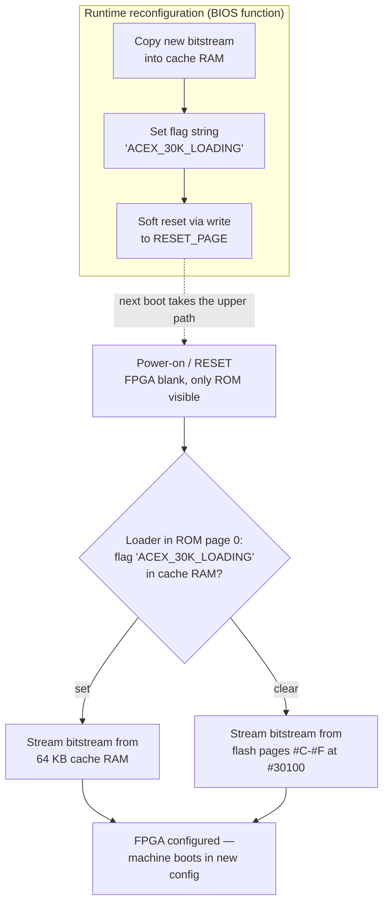
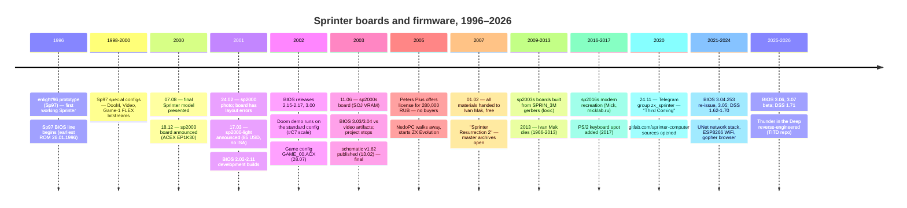

[← Home](../../README.md) · [New Gen Hardware](README.md)

# Sprinter Firmware — PLD Configurations, BIOS, Estex DSS, 1996–2026 Evolution

The Sprinter's hardware is a file. The board carries a real Zilog Z84C15 CPU, 4 MB of RAM and an Altera **ACEX EP1K30** FPGA — but the *machine itself*, the memory map, the video controller, the AY sound chip, the copy accelerator, exists only as a **59,215-byte bitstream** that the boot ROM streams into the FPGA at every power-on. Change the file and you change the computer: the same board ships as a Sprinter, a ZX Spectrum with Pentagon or Scorpion timing, a game machine with block-transfer sound, or a Doom renderer with hardware line stretching.

That single design decision — **hardware as a loadable configuration** — produced a thirty-year firmware story with three distinct eras: the Peters Plus commercial era (1996–2003, ~200 boards sold), the "master archives" era after designer Ivan Mak opened the sources (2007–2013), and the community "Third Coming" era (2020–present) that is still shipping BIOS, DOS, and FPGA releases today. This article documents that evolution, the configuration architecture it is built on, and **where every surviving source tree lives**.

> [!NOTE]
> This article covers the **firmware layer**: PLD configurations, the copy accelerator, BIOS versions, the Estex DSS operating system, and the source repositories. For the hardware platform itself (board, memory paging, video modes, ports), see [sprinter.md](sprinter.md). For video frame timing, see [video_frame_sprinter.md](../../05_development/05_display_and_timing/video_frame_sprinter.md).

---

## The Configuration Concept — Board vs. Model

Peters Plus separated two ideas most clone makers never separated:

- The **board** (*sp97*, *sp2000*, *sp2000-light*, *sp2000s*, later *sp2003s* and *sp2016s*) is just the substrate: CPU, RAM, ROM, FDC, IDE, ISA slots.
- The **model** — the computer called "Sprinter" — is a *set of configurations* compiled into the FPGA. Announcing the sp2000 board on 18.12.2000, the company explicitly framed it this way: a new board name was needed "to separate the concepts of *the computer's board* and *the computer's model*".

A **configuration** (the designer's manual calls it that, *конфигурация*) is one complete schematic loaded into the programmable logic. The same board runs several of them; some are selectable from the boot menu, one (the "Game" configuration) is even loaded by a running game.

### How a configuration loads

At power-on or RESET the FPGA is **blank**. The CPU is disconnected from all peripherals; its address space contains only the flash ROM, and *any memory write goes into the FPGA's configuration port*. The ROM's first job is to stream the bitstream in; only then does the machine boot normally.



Two details make this robust:

- The flag is **erased as it is used**, so pressing the hardware RESET button always returns the machine to the stock configuration — a broken experimental bitstream cannot brick the board.
- The transfer format is not a file read; the ROM loader writes each of the 59,215 bytes **eight times, rotated right** (bit 0 first), for exactly 473,720 writes. Emulators (MAME, unreal-ng) identify a configuration by hashing this write stream, not the file bytes.

On the Sp2000 the bitstream lives at offset `#30100` of the 256 KB BIOS flash (pages `#C`–`#F`), so **upgrading the FPGA design and upgrading the BIOS are the same operation** — one flash rewrite, about three minutes, run from the machine itself.

> [!IMPORTANT]
> Building a configuration required Altera **MAX+plus II** on a PC ("everything was done on a Pentium-166", the manual notes). The Sprinter can *load* configurations but could never *compile* them. This is why the community still cross-compiles the design from AHDL sources today.

### The FPGA itself, across boards

| Board | Year | Main programmable chip | Bitstream | Fixed CPLD |
|---|---|---|---|---|
| **Sp97** | 1996–2001 | Altera **FLEX EPF10K10** | 14,751 bytes | Altera MAX (peripheral glue, near the CPU) |
| **Sp2000 / -light / -s** | 2000–2003 | Altera **ACEX EP1K30QC208-3** | 59,215 bytes | **EPM7064SLC100** — fixed, clock sync + initial start-up |
| **Sp2003s** ("SPRIN_3M") | never released; built post-2009 | EP1K30 (as sp2000) | 59,215 bytes | EPM7064 |
| **Sp2016s** (modern recreation) | 2016 | EP1K30 or **EP1K50** | 59,215 bytes (1K30/1K50) | EPM7064 |

The EPM7064 CPLD never changes — it exists to sequence clocks and hand the CPU its first fetch. Everything else is field-upgradeable. The EP1K50 column is not hypothetical: the community BIOS ships a **universal loader for both 1K30 and 1K50 bitstreams**, and current releases carry both (`K30.ACX`, `K50.ACX`).

---

## The Configuration Catalog

The designer's manual lists six configurations. Three were burned into the Sp2000's stock flash:

| Configuration | What it is | Where it survives |
|---|---|---|
| **Sprinter-2** | The main native configuration: full banking, both graphics modes, copy accelerator with logic ops, AY + Covox | In the stock bitstream (`SP2K_*.BIN` of every BIOS 2.12–3.04) |
| **Sprinter-1** | Sprinter-2 with Spectrum-era ports re-addressed (Kempston `#1F` → `#0F`), for stricter ZX compatibility | Same stock bitstream; selected via the boot menu / system port |
| **ZX-Spectrum+AY** | Pentagon/Scorpion-compatible ZX Spectrum; "practically coincides with Sprinter-1", AY available | Same stock bitstream; ZX ROMs in flash pages 2–4 (community builds) |
| **Game-1** | Game-oriented: accelerator **without** logic functions, plus **Covox-Blaster** (15 kHz block sound that frees CPU time) | `GAME_00.ACX` (Ivan Mak, 28.07.2002) — the game *Thunder in the Deep* loads it at run time |
| **DooM** | Game-1 + accelerator extension: **hardware stretching/shrinking of vertical and horizontal lines** (fixed-point step register per access) | **Sp97 only** (`SPRINT08.DM`, 23.01.1999). On Sp2000 the function moved into the *standard* configuration as scale port `#C7` |
| **Video** | Game-1 + a path that writes **hard-disk data straight into video RAM during the sector read**; last version adds `GR-256-4x4` mode (160×128 clips doubled to full screen) | **Sp97 only** (`SPRINT04/08/11.VID`, 1998–2000). The Sp2000 standard config has matching HDD→memory logic; no Sp2000 bitstream was ever found |

> [!WARNING]
> A common misconception is that the Sp2000 "lost" the DooM and Video configurations. It did not — their features were **merged into the standard configuration** (the `#C7` scale register; HDD data steering into the memory path), which is why no separate Sp2000 files exist. The Sp97 FLEX bitstreams run on no Sp2000: different chip, different size, different loader count (118,008 vs. 473,720 writes).

The Sp97 BIOS ROMs carried **three configurations each, encrypted** (a protection tool and its decoded output survive in the sources); the Sp2000 ROM loader made encryption unnecessary.

---

## The RAM Copy Accelerator — a DMA Engine Dressed as Opcodes

The Sprinter's most unusual peripheral is its **copy accelerator** (*акселератор операций с ОЗУ*), present in the native Sprinter configurations. It exists because the machine's DRAM runs at 7 MHz while the CPU runs at up to 21 MHz — every LDIR over main memory is wait-stated. The accelerator hides that: a 1..256-byte block buffer inside the FPGA that the CPU fills once and then replays as many times as needed.

The interface is the radical part. There are **no port writes** — the accelerator is controlled by instructions that are effectively NOPs everywhere else:

| Opcode | Function |
|---|---|
| `LD B,B` | Disable the accelerator |
| `LD D,D` | Enter *block size* mode; the next `LD A,n` sets the block size (1..256; `LD A,0` = 256) |
| `LD C,C` | **Fill** — the next `LD (HL),A` fills `size` bytes with `A` |
| `LD E,E` | Fill for the graphics screen — fills **vertical lines** (one byte per raster line) |
| `LD L,L` | **Block copy** — `LD A,(HL)` loads the buffer from `(HL)`, `LD (HL),A`/`LD (DE),A` writes it out |
| `LD A,A` | Block copy for the graphics screen — copies **vertical lines** |
| `LD H,H` | Reserved |

The graphics variants are the point: in the 320×256 and 640×256 modes the video RAM is addressed linearly per raster line, so "copy a vertical line" is exactly the operation a side-scroller or a Doom-style wall renderer needs. Combined with logic operations (`XOR (HL)`, `OR (HL)`, `AND (HL)` run through the buffer), the accelerator is a 2D BLiTTER:

```z80
; Copy one full 320×256 screen page to another (official manual example).
; Both screen pages are mapped at #C000 (page switching via port #E2).
LD   HL,#C040      ; source: start of screen line 1
LD   DE,#C180      ; destination: start of screen line 2
LD   BC,#140       ; horizontal length
DI                 ; interrupts MUST be off (see warning)
LD   D,D           ; accelerator: set block size
LD   A,0           ; block size = 256 bytes
LD   A,A           ; accelerator: copy vertical lines
LDIR               ; the whole screen copies "for free" (~1.2 frames)
LD   B,B           ; disable the accelerator
EI
```

```z80
; XOR a 256-byte block (decode a masked sprite) — logic-op mode.
LD   HL,ADRES_1    ; destination block
LD   DE,XOR_DAT    ; the XOR mask block
DI
LD   D,D           ; set block size mode
LD   A,0           ; 256 bytes
LD   L,L           ; copy mode
LD   A,(DE)        ; load mask into accelerator RAM
XOR  (HL)          ; XOR destination data with the buffer
LD   (HL),A        ; store the result
LD   B,B
EI
```

**Performance model** (from the manual): an accelerated instruction costs its normal execution time **plus** `bytes / 7,000,000` seconds — the accelerator is limited only by DRAM bandwidth, i.e. it moves data at the 7 MHz memory bus rate while the CPU idles through the instruction. A full 320×256 screen copy takes about **1.2 frame interrupts**.

> [!WARNING]
> The accelerator **redefines the instruction stream** — while it is armed, interrupt handlers would execute garbage semantics. `DI` before arming is mandatory. The last Peters Plus firmware added an interrupt-tolerant mode (the accelerator auto-disables on INT and re-arms on `RETI`), which the manual itself advises to use with care.

### The DooM scale register — `#C7`

The DooM configuration's hardware line stretching survived into the standard configuration as a dedicated accelerator port, DCP code `#C7` (`WR_C7`, `ALT_ACC` path in `ACCELER.TDF`). Writing a step value programs a fixed-point increment (`XCNT:XAGR + AAGR` per access); every subsequent accelerated access advances the source index by that step, stretching or shrinking a line without any CPU arithmetic. This is how the walls of the 2002 Doom demo are drawn — the demo merely opens port `#C7` in the port map and runs; it loads no bitstream. MAME models it as `m_alt_acc`; unreal-ng as `SprinterAccelerator::OnScaleWrite`.

---

## The BIOS — 256 KB of Flash, 2001 to 2026

The Sp2000 BIOS is one 256 KB flash image, 16 pages of 16 KB:

```
┌──────────────────────────────────────────────────────────────┐
│ Sprinter Sp2000 BIOS flash layout (256 KB)                   │
├──────────────────────────────────────────────────────────────┤
│ page 0    SETUP + disk drivers (boot menu, config selector)  │
│ page 1    logo (community builds: 128×72, 256 colors)        │
│ pages 2-4 ZX ROMs: 48K BASIC, 128K, TR-DOS (community)       │
│ page 8    BIOS proper (function table, RST #08 API)          │
│ pages 5-7,9-11  recovery ROM disk, 96 KB FAT12 + DSS (comm.) │
│ pages #C-#F      PLD loader + ACEX bitstream at #30100       │
└──────────────────────────────────────────────────────────────┘
```

Peters Plus filled pages 0, 8 and `#C`–`#F`; the community builds (3.05+) added the logo, ZX ROMs and the recovery disk, so a board with **no working disk at all** still boots a full DSS with `FDISK`, `FORMAT`, `SYS` and `MENU` from ROM.

### Version history

The screen identifies builds as "Sprinter BIOS: ver X" (Peters Plus) or "Firmware vX" (community).

| Version | Date | Era | Notes |
|---|---|---|---|
| 2.02–2.14 | 06–12.2001 | Peters Plus dev | monthly development builds (2.02 shipped with the first boards) |
| 2.15 | 18.02.2002 | **release** | `_SP_215.ZIP` |
| 2.16–2.17 | 02–03.03.2002 | **release** | **2.17 = the last version with public Peters Plus sources** |
| 3.00 | 07.04.2002 | Peters Plus | |
| 3.03–3.04 | 05–17.06.2003 | Peters Plus | built for the sp2000s board's Alliance VRAM (artifact fixes); never officially released; 3.04 is the emulator default (MAME, unreal-ng) |
| 3.04.253 | 06.06.2021 | community re-issue | the app.sprinter.ru firmware pack: 3.04 image + MAX CPLD `.pof` files (EPM7064-7/-10, 7128-10, 7160-10) |
| 3.05 | 01.09.2022 | **community** | recovery ROM disk; never published outside the MAME ROM set |
| 3.06 RC2 / 3.06 | 06.2025 | **community** | official updater `up306.exe`; universal 1K30/1K50 loader |
| 3.06 Hotfix 2 | 19.01.2026 | community | FAT16/32 detect, `OPEN_FN` fixes |
| **3.07 BETA 1** | **24.09.2026** | community | current `beta` branch; `K30.ACX` "ALL_MODE readable" bitstream |

### What the community BIOS added

The 3.05–3.07 changelog reads as a hardware-revival log — much of it changes how the *fixed* parts of the board behave:

- **Universal bitstream loader for EP1K30 and EP1K50** (unlocks the bigger FPGA on modern boards)
- **Second IDE channel activated** (the second connector had never worked under Peters Plus firmware); IDE device numbering reworked sequential → physical; boot device selectable per physical channel
- **Boot from RAM disk and from the ROM-disk RECOVERY image**
- Setup options for **INT timing** (`Scorpion` / `Pentagon` / `Spectrum`) and **vertical sync** (312 lines @ 50 Hz / 320 lines @ 49 Hz) — applied live
- New BIOS functions: `FN_SINC` (`#F2`, INT mode + vsync + wait-state control), `FN_RESET` (`#FD`), `GET_RAMD_NUM` (`#9B`), `BLK_RD_WR` (`#C8`, 256/512-byte sector I/O incl. ROM disk), `DCP_CONFIG` (`#F4`, port-map control), `DRV_GET_PAR` (device parameters incl. CD-ROM type and CHS/LBA flag)
- ZX ROM pages freed for general use; ZX-Sprinter boot without loading DSS
- Ctrl+Alt+Del key-stuck fix, CMOS sanity check, ~1.5 KB more free RAM at boot

---

## Estex DSS — the Operating System

Estex DSS (Disk Sub System) is the Sprinter's own DOS: MS-DOS-like, FAT12 floppies, FAT12/16 hard disks, booting from a PC-format floppy or IDE partition (boot sector `Starting...` → `SYSTEM.DOS` kernel + `SYSTEM.EXE` shell). Peters Plus wrote it; the community maintains it.

| Version | Date | Author | Notes |
|---|---|---|---|
| 1.52–1.60R | 1999–02.2003 | Peters Plus | 1.60R = the last official release |
| 1.61 patch 2 | 25.10.2006 | Vasil Ivanov | patch of 1.60R, base of 1.62 |
| 1.62.0–1.62.79 | 2014–2020 | Sayman (romych) | FIB/handle rework, faster cluster math (shifts), BIOS-in-cache (`ecache`/`dcache`), mouse fixes, sjasmplus port |
| 1.62.92–93 | 03–04.2021 | Sayman | floppy releases |
| 1.70 beta 990 | 20.06.2024 | Tolik-Trek | public beta branch |
| **1.71** | 25.06.2025 | Tolik-Trek | "Release DSS v1.71.57, Shell v1.2.522"; boot floppy carries the BIOS 3.06 updater |
| 1.71 hotfixes | 07.2025–01.2026 | Tolik-Trek | FAT16/32 detection, `OPEN_FN` |
| 1.71.66 | 2026 (built) | Tolik-Trek sources | built from `master` with sjasmplus 1.21.1; newest binary to date |

---

## Thirty Years in One Timeline



Total production: about **115 Sp2000 boards**, roughly **200 machines** counting Sp97. By retro-computing standards the Sprinter was a commercial failure that became a preservation success — every BIOS, DSS, bitstream and schematic from both eras now lives in public repositories.

---

## Source Code Repositories

The user-facing question this section answers: *where are the FPGA/CPLD firmware sources?* All links verified live (October 2026).

### FPGA / CPLD design sources

| Repository | Contents | Verified |
|---|---|---|
| **[gitlab.com/sprinter-computer/hard](https://gitlab.com/sprinter-computer/hard)** | Peters Plus PLD design in AHDL (MAX+plus II): `ACEX/` (the standard design, internally named "2.18", 10.03.2002), `MAX/` (EPM7064/7128/7160 glue), `UNUSED/` | commit `67480d0` |
| **[github.com/SaymanNsk/Sprinter200x](https://github.com/SaymanNsk/Sprinter200x)** | The community-maintained design, **GPL-3.0**: `Altera_1K30/Last/` — current AHDL sources (`SP2_1K30.TDF` top level, `ACCELER.TDF`, `DCP.TDF` [disk copy / port control], `VIDEO.TDF`, `VIDEO2.TDF`, `KBD.TDF`, `AY.TDF`, `DATA_MUX.TDF`); `Sp2000/` — compiled outputs | commit `1039391` |
| **[zxgit.org/Sprinter/97](https://zxgit.org/Sprinter/97)** | The Sp97 era: `fw/` — FLEX EPF10K10 sources (`src/flex/`, incl. `SPRINT08.TDF` with the DooM/Video/Game presets), the BIOS-ROM encryption tool (`protect/`), 12 Sp97 BIOS ROMs (1996–2001), and the `master/` zips (`sp97-fw-master.zip`, `sp97-bios-master.zip` with every FLEX bitstream: `.DM`, `.VID`, `.GAM`, `.AY`, ...) | commit `56d4b1e` |

### BIOS and OS sources

| Repository | Contents | Verified |
|---|---|---|
| **[gitlab.com/sprinter-computer/bios](https://gitlab.com/sprinter-computer/bios)** | Peters Plus BIOS **2.17** sources + `ALTERA/SP2K_*.BIN` — the compiled EP1K30 bitstreams of BIOS 2.12, 2.15, 2.16=2.17, 3.00, 3.03, 3.04 (59,215 bytes each) | commit `1273243` |
| **[zxgit.org/Tolik-Trek/Sprinter-BIOS](https://zxgit.org/Tolik-Trek/Sprinter-BIOS)** | The **community BIOS 3.05–3.07** (branch `beta` = newest); `Build/ACEX/K30.ACX`, `K50.ACX` bitstreams; 110 recovery-disk images in git history | branch `beta` |
| **[zxgit.org/Tolik-Trek/Shared_Includes](https://zxgit.org/Tolik-Trek/Shared_Includes)** | `SP2000.inc` and the other constants the BIOS needs | |
| **[gitlab.com/sprinter-computer/dos](https://gitlab.com/sprinter-computer/dos)** | Estex DSS sources, 1.52–1.70 history (`asm/`), utilities, the 1.60R binary release | commit `c7f0de8` |
| **[zxgit.org/Tolik-Trek/Estex-DSS](https://zxgit.org/Tolik-Trek/Estex-DSS)** (community tree, in `sources/estex-dss-tt`) | The community DSS, `master` + `1.70.990` public beta | |

### Hardware, software and research

| Repository / site | Contents |
|---|---|
| **[zxgit.org/Sprinter/2000](https://zxgit.org/Sprinter/2000)** | Board files for sp2000, sp2000-light, sp2000s, sp2003s (+ BOM) and sp2016s |
| **[winglion.sprinter.ru](https://winglion.sprinter.ru)** | Ivan Mak's **master archives** — the single original source of everything (recreated by Sprinter Team via web.archive.org) |
| **[gitlab.com/sprinter-computer/apps](https://gitlab.com/sprinter-computer/apps)** | Collected Sprinter software sources (Sayman, Konamiman, OrgAsm...) |
| **[zxgit.org/Tolik-Trek/TITD](https://zxgit.org/Tolik-Trek/TITD)** | *Thunder in the Deep* reverse engineering: the extracted `K30.ACX` game configuration, notes |
| **[zxgit.org/romych](https://zxgit.org/romych)** | `SprinterESP` (ESP8266 WiFi), `ESPKit`, `SprinterSerial`, `Sprinter-FT` (ISA-8 FT812 video card, 2026) |
| **[github.com/witchcraft2001](https://github.com/witchcraft2001)** | The UNet network stack: `sprinter-rtl8019a`, `sprinter-3C509B` (ISA NICs), `sprinter_wifi` (ESP-AT 2.2.2 custom firmware), `unet_libs_core/c/asm`, gopher browser, weather client |
| **[doc.sprinter.ru](https://doc.sprinter.ru)** | Web edition of the designer's manual (the source of most facts in this article) |
| **[app.sprinter.ru](https://app.sprinter.ru)** | Software catalog + the 3.04.253 firmware pack with MAX CPLD `.pof` files |

> [!NOTE]
> **Licenses are uneven.** The GitLab group's `hard`/`bios`/`dos` carry no license file ("believed public domain" per the handover); Sayman's Sprinter200x is **GPL-3.0**; the zxgit Sprinter/97 archives state no license. Treat redistribution accordingly.

### What is *not* in any repository

- BIOS sources later than 2.17 (the 3.00–3.04 Peters Plus binaries were never accompanied by sources; the community 3.05+ line is a fresh tree)
- A Sp2000 (ACEX) build of the DooM or Video configurations — never existed; the features were merged into the standard configuration
- The `SPRINT11` Sp97 design sources (only the compiled `.VID` bitstream survives)
- BIOS 2.00–2.01, 2.05, 2.08, 2.14 images — no copy has surfaced

---

## Working with the Sources

**Toolchain.** The AHDL designs target **Altera MAX+plus II** (Windows 9x/NT era). On modern systems the community uses MAX+plus II in a VM, or imports the `.TDF` files into Quartus (conversion is manual; pin assignments are in the `.ACF` files). The BIOS and DSS assemble with **sjasmplus** (the 2026 DSS 1.71.66 build used sjasmplus 1.21.1); Peters Plus originals used TASM/ALASM-era tooling.

**Encoding.** The Russian sources and changelogs are in **CP866/CP1251**, not UTF-8. `iconv -f CP866 -t UTF-8` before reading comments, or they render as garbage.

**Building the flash image.** The community BIOS repository contains `make-bios.py`, which assembles the 256 KB image: page 0 SETUP, page 8 BIOS, ZX ROM pages, recovery ROM disk (pages 5–7, 9–11) and the PLD loader + bitstream into pages `#C`–`#F`. A build is therefore reproducible end-to-end from public sources.

**Emulator verification.** MAME (`src/mame/sinclair/sprinter.cpp`), ZXMAK2 and unreal-ng implement the Sp2000; unreal-ng additionally models the "Game" bitstream and identifies configurations by the loader-write hash described above. When modifying the PLD design, booting the result in an emulator first is the standard workflow — a broken bitstream on real hardware means a blind 3-minute flash rewrite.

---

## Impact on FPGA/Emulation

- The **loader write-stream** (8 rotated writes per byte, 473,720 total) is the externally visible fingerprint of a configuration; emulators must reproduce it exactly, or detection and "different bitstream" logic breaks.
- The **port map is data, not logic**: the RAM page-`#40` port map with four switchable banks means an emulator cannot hardcode port decoding — it must implement the map RAM lookup, including the `/WR`, `/DOS` and Pentagon-lock qualifier bits (an emulator that decodes `#FE` statically is wrong the moment software remaps ports).
- The **copy accelerator changes instruction semantics** (`LD r,r` stops being a NOP): disassemblers, timing calculators and cycle-accurate cores all need an "accelerator armed" state.
- The `#C7` scale register (fixed-point source stepping) is required for correct Doom-demo rendering; it interacts with the graphics-mode vertical-line addressing.
- Sp97 emulation (FLEX 10K10, 14,751-byte streams, encrypted ROM configs) is a separate machine — different chip, memory map and loader — and is explicitly out of scope for the Sp2000 emulators.

---

## FAQ

**Can an Sp2000 load a DooM or Video bitstream?** No. Those are 14,751-byte FLEX 10K10 streams for the Sp97; the Sp2000 loader always streams 59,215 bytes into an ACEX 1K30. The functionality was re-implemented inside the standard configuration (`#C7` scale; HDD data steering).

**Can I upgrade my Sp2000's FPGA?** The board's socket takes ACEX 1K family chips; the sp2016s recreation and the community BIOS explicitly support the **EP1K50**, with a universal loader and a 1K50 bitstream (`K50.ACX`). The 1K50's extra logic is what the newest video experiments (352×280, 704×280 modes) build on.

**Is the FPGA design open source?** Sayman's Sprinter200x tree is GPL-3.0. The Peters Plus `hard` tree has no license file but was publicly released by the designer's successor; zxgit Sp97 archives have none.

**What is the newest firmware?** BIOS **3.07 BETA 1** (24.09.2026, `beta` branch) and DSS **1.71.66** (built 2026 from `master`). Watch `git ls-remote https://zxgit.org/Tolik-Trek/Sprinter-BIOS.git` for branch heads.

---

## Cross-References

- [Sprinter hardware platform](sprinter.md) — board, memory paging, video modes, port system
- [Sprinter video frame](../../05_development/05_display_and_timing/video_frame_sprinter.md) — 42 MHz clock tree, 312/320-line frame, INT modes
- [ZX Evolution](zx_evo.md) — the machine NedoPC built after failing to buy the Sprinter project in 2005
- [BaseConf](baseconf.md), [TS-Conf](ts_conf.md) — the other ACEX-based firmware family (ZX Evolution)
- [Estex DSS programming](../../04_operating_systems/README.md) — DOS API articles
- [Clone timing](../clones/clone_timing.md) — Pentagon/Scorpion INT timing the BIOS selects between

---

## References

All links verified live (October 2026) and cached in the [Wayback Machine](https://web.archive.org).

- **Designer's manual** — Ivan Mak, *Sprinter. Руководство по программированию Sp2000* (15.08.2003): [PDF](https://github.com/SaymanNsk/Sprinter200x/blob/master/docs/sp2000_man.pdf) · mirror: [winglion.sprinter.ru/sp2000.pdf](https://winglion.sprinter.ru/sp2000.pdf) · web edition [doc.sprinter.ru](https://doc.sprinter.ru): [architecture](https://doc.sprinter.ru/introduction/architect.html) · [specification](https://doc.sprinter.ru/introduction/specification.html) · [configuration loading](https://doc.sprinter.ru/introduction/loading.html) · [copy accelerator](https://doc.sprinter.ru/blocks/ram-accelerator.html) · [video controller](https://doc.sprinter.ru/blocks/video-ram/output.html) · [port map](https://doc.sprinter.ru/blocks/ports/defines.html)
- **Board history** — [zxgit.org/Sprinter/2000](https://zxgit.org/Sprinter/2000) README (sp2000 → light → s → 2003s → 2016s, license offer, handover); Sp97 archive: [zxgit.org/Sprinter/97](https://zxgit.org/Sprinter/97) ([firmware master zip](https://zxgit.org/Sprinter/97/raw/branch/master/master/sp97-fw-master.zip), [BIOS master zip](https://zxgit.org/Sprinter/97/raw/branch/master/master/sp97-bios-master.zip))
- **PLD sources** — Peters Plus AHDL: [gitlab.com/sprinter-computer/hard](https://gitlab.com/sprinter-computer/hard); community GPL-3.0 design: [github.com/SaymanNsk/Sprinter200x](https://github.com/SaymanNsk/Sprinter200x)
- **BIOS sources** — Peters Plus 2.17 + bitstreams: [gitlab.com/sprinter-computer/bios](https://gitlab.com/sprinter-computer/bios); community 3.05–3.07: [zxgit.org/Tolik-Trek/Sprinter-BIOS](https://zxgit.org/Tolik-Trek/Sprinter-BIOS), changelog [doc/changes.txt](https://zxgit.org/Tolik-Trek/Sprinter-BIOS/raw/branch/master/doc/changes.txt) (CP866)
- **DSS sources** — [gitlab.com/sprinter-computer/dos](https://gitlab.com/sprinter-computer/dos); version history: [doc.sprinter.ru/dss/history.html](https://doc.sprinter.ru/dss/history.html)
- **Habr: "8-битный компьютер Sprinter"** — Gennadij_Kalin20, 19.06.2021, [habr.com/ru/articles/563598](https://habr.com/ru/articles/563598/) (the "three comings" narrative, production numbers, modern video modes)
- **Emulators** — MAME [src/mame/sinclair/sprinter.cpp](https://github.com/mamedev/mame/blob/master/src/mame/sinclair/sprinter.cpp) · ZXMAK2 [github.com/zxmak/zxmak2](https://github.com/zxmak/zxmak2) · UnrealSpeccy family [github.com/mkoloberdin/unrealspeccy](https://github.com/mkoloberdin/unrealspeccy)
