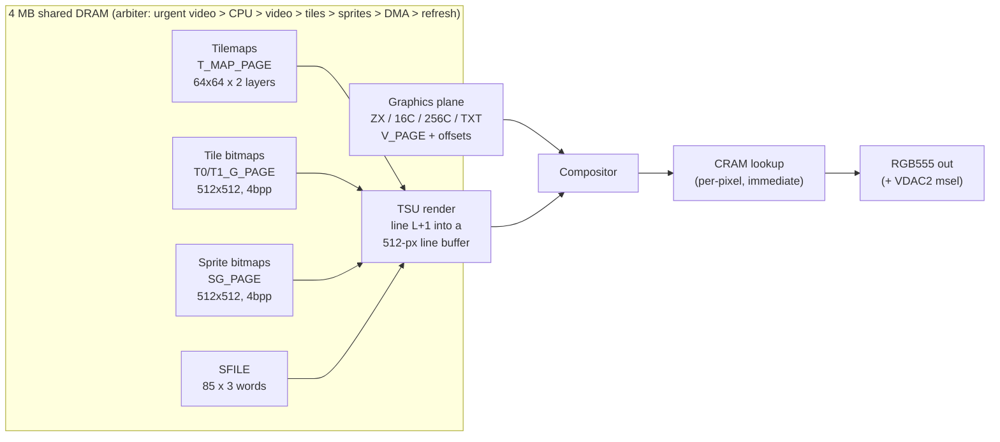

[← Home](../../README.md) · [New Gen Hardware](README.md) · [ZX Evolution](zx_evo.md)

# TS-Conf — The ZX Evolution's Enhanced Video Firmware

**TS-Conf** is an alternative **firmware configuration** (FPGA bitstream) for the ZX Evolution, designed by **Aleksandr Zhuravlev (`tsl`)** and published in the [tslabs/zx-evo](https://github.com/tslabs/zx-evo) repository (`pentevo/fpga/current/`). Where the default [BaseConf](baseconf.md) targets Pentagon 1024 compatibility, TS-Conf is a **from-scratch machine**: a tile/sprite compositor with two tile layers and 85 sprites, four pixel modes from ZX attributes to 256-color linear, a programmable RGB555 palette, a nine-task DMA engine, a 512-byte CPU cache that makes 14 MHz usable, and a shared-DRAM architecture in which the CPU, video, sprites and DMA arbitrate for the same 4 MB.

For software developers, TS-Conf is the target for **new Russian Spectrum software** that wants modern graphics without leaving the ZX Evolution ecosystem. It is **not binary-compatible** with Pentagon software at the new-feature level — but it boots Pentagon-style (TS-BIOS, TR-DOS 5.04T, 128/48 ROMs in mapped mode) and its geometry-0 ZX mode reproduces the classic screen.

> [!NOTE]
> This article covers TS-Conf as a **programmer-visible configuration**, with every fact re-verified against the Verilog sources and the `TSconf.xls` register workbook in [tslabs/zx-evo](https://github.com/tslabs/zx-evo). For the underlying hardware, see [zx_evo.md](zx_evo.md); for the default firmware, see [baseconf.md](baseconf.md); for the FT812 video card that extends TS-Conf, see [vdac2.md](vdac2.md).

---

## Machine Overview (verified constants)

| Property | Value |
|---|---|
| CPU | Z80, **3.5 / 7 / 14 MHz** (`SYS_CONFIG[1:0]`, register `0x20`; clock switch takes effect immediately) |
| RAM | **4096 KB** = 256 pages × 16 KB, 22-bit physical space — CPU, video, TSU and DMA all share it (**no separate VRAM**) |
| ROM | **512 KB** = 32 pages, selected by `Page0[4:0]` |
| Palette | **CRAM** — 256 × 16 bit (RGB555 + flag bit), dual-port, writes take effect **immediately** |
| Sprites | **SFILE** — 256 × 16 bit = **85 descriptors** of 3 words (**85 sprites per frame**, a hard cap) |
| Raster | **448 dots × 320 lines**, 7 MHz dot clock (14 MHz in TXT mode) |
| Frame | 224 T/line × 320 = **71,680 T-states ⇒ 48.828 Hz**, 20,480 µs |
| Visible window | up to **360×288** (geometry 3); TXT hires doubles X → **720×288** |
| Interrupts | **4 sources, fixed vectors**: frame `0xFF`, line `0xFD`, DMA `0xFB`, wait-port `0xF9` |
| Floating bus | unclaimed ports read **`0xFF`** |

### TS-Conf vs BaseConf — at a glance

| Feature | BaseConf | TS-Conf |
|---|---|---|
| **Compatibility target** | Pentagon 1024 | New TS-Conf software (+ ZX boot mode) |
| **Sprites** | none | **85 per frame**, 3 layers, 8–64 px per axis, X/Y flip, 4 bpp |
| **Tile layers** | none | **2** × 64×64 tiles, per-tile palette + X/Y flip |
| **Pixel modes** | ZX | ZX / 16c / 256c / TXT, **4 geometries** 256×192 → 360×288 |
| **Palette** | fixed | **CRAM RGB555 × 256**, immediate, 16 palette banks |
| **DMA** | none | **9 tasks**: RAM/BLT1/BLT2/FILL/SPI/IDE/CRAM/SFILE/wait-port |
| **CPU cache** | none | **512 B, 256 word-entries** (per-window enable) |
| **INT sources** | frame | **frame / line / DMA / wait-port**, IM2 vectors |
| **Turbo** | 3.5 / 7 / 14 MHz | same (with cache making 14 MHz practical) |
| **Firmware family** | `pentevo/fpga/base` | `pentevo/fpga/current` (`quartus`, `quartus_vdac`, `quartus_vdac2`) |

> [!IMPORTANT]
> TS-Conf is **not a runtime mode** — it is a different FPGA bitstream, selected in the boot menu and loaded at power-on. Unlike the ZX Spectrum Next's NextReg switching, the machine boots into one configuration and stays there.

---

## Memory Model

### Four windows, four page registers

All configuration registers live in the **`#xxAF` port space**: any port whose **low byte is `0xAF`**, with the register number in `A[15:8]` (`0x00AF` = register 0, `0x10AF` = register `0x10`, …). A `#xxAF` hit blocks the external ZX bus, so ISA-style devices never answer it.

| Window | Range | Register (port) | Default | Readable |
|---|---|---|---|---|
| W0 | `#0000–#3FFF` | `PAGE0` (`#10AF`) | 0 (ROM: TS-BIOS) | no (reads `0xFF`) |
| W1 | `#4000–#7FFF` | `PAGE1` (`#11AF`) | 5 | no |
| W2 | `#8000–#BFFF` | `PAGE2` (`#12AF`) | 2 | **yes** |
| W3 | `#C000–#FFFF` | `PAGE3` (`#13AF`) | 0 | **yes** |

**Only registers `0x00` (STATUS), `0x12`, `0x13` and `0x27` (DMA_STATUS) are readable; every other `#xxAF` read returns `0xFF`** — an IM1 interrupt handler therefore cannot ask the machine which INT fired.

### Window 0 policy — `MEM_CONFIG` (`0x21`)

| Bit | Name | Meaning |
|---|---|---|
| 0 | `ROM128` | mirror of `#7FFD` bit 4 — 0 = BASIC-128, 1 = BASIC-48 |
| 1 | `W0_WE` | window 0 writable |
| 2 | `!W0_MAP` | 0 = **mapped mode** (ROM-set formula), 1 = normal (`PAGE0` directly) |
| 3 | `W0_RAM` | window 0 shows RAM instead of ROM |
| 7:6 | `LCK128` | `#7FFD` decode mode (below) |

In **mapped mode** the W0 page is `{PAGE0[7:2], ~DOS, ROM128}` — four ROM slots per `PAGE0[7:2]` group, in the exact order the shipped 512 KB `zxevo.rom` carries them:

| `~DOS, ROM128` | Slot | Content |
|---|---|---|
| 1, 0 | +0 | **TS-BIOS** service ROM ("TS-BIOS Setup Utility") |
| 1, 1 | +1 | **TR-DOS 5.04T** |
| 0, 0 | +2 | 128K BASIC (1986) |
| 0, 1 | +3 | 48K BASIC (1982) |

DOS switches by a **fetch trap**: an M1 fetch in window 0 at `#3D00–#3DFF` (with `ROM128=1`, mapped mode) turns the DOS page on; any fetch at `#4000+` turns it off. Clearing `ROM128` while in DOS selects the service page.

### `#7FFD` compatibility — `LCK128` and the auto trap

`#7FFD` is decoded as A15=0 with low byte `#FD`. A write updates `MEM_CONFIG[0]`, switches the video page (`V_PAGE = D3 ? 7 : 5`, immediately) and sets `PAGE3` per mode:

| `LCK128` | Mode | `PAGE3` from `#7FFD` |
|---|---|---|
| `00` | 512 KB | `{000, D7, D6, D2..D0}` |
| `01` | 128 KB | `{00000, D2..D0}` (Pentagon-128 standard) |
| `10` | auto | 128 KB rule if the latched opcode was `out (n),a`, else 512 KB |
| `11` | 1024 KB | `{00, D5, D7, D6, D2..D0}` (Pentagon-1024 standard) |

The **auto mode** latches `!(D7^D6)` of every M1 opcode: `OUT (n),a` (`#D3`) → 128 KB behavior, `OUT (C),r` / `OUTI` family → 512 KB. And `#7FFD` bit 5 sets **`lock48`**: while set, all later `#7FFD` writes are ignored (a lock taken before switching to 1024K stays in force). Pentagon software that pokes `#7FFD` for side effects behaves exactly as on its home machine.

### vdos — virtual Beta drives in RAM

`FDD_VIRT` (`0x29`) marks drives A–D virtual and bit 7 opens the Beta ports outside DOS. Accessing a Beta port (`#1F/#3F/#5F/#7F/#FF`) on a virtual drive swaps **RAM page `0xFF` into window 0** (writable); the "drive" is then Z80 code in that page. Interrupts are gated while vdos is active — events **defer, not lost**. The emulator-side lesson: nothing is served host-side, only the page swap.

### The FM window — CRAM, SFILE and registers as memory

`FMAPS` (`0x15`) places a **4 KB window** anywhere (bits 3–0 = `A[15:12]`):

| Offset in window | Target |
|---|---|
| `+0x000–0x1FF` | **CRAM** — 16-bit entries at `A[8:1]` (even byte latched, odd byte commits) |
| `+0x200–0x3FF` | **SFILE** — same pairing |
| `+0x400–0x4FF` | **TS registers** — a write to `+0x400+n` ≡ `OUT (n<<8)|0xAF` |

Writes **also land in the underlying RAM/ROM** (the FM path does not suppress the normal write); reads always see the underlying memory (FM is write-only). This is the fast path for palette and sprite updates — and DMA codes `0xC`/`0xD` target CRAM/SFILE directly.

---

## Video

### Raster and geometries

The raster is **448 dots × 320 lines** (7 MHz dots; TXT pixels 14 MHz). `V_CONFIG[7:6]` selects the geometry, and it **applies to every mode, including ZX**:

| Geom | Window | Origin (dot, line) | TXT hires |
|---|---|---|---|
| 0 | 256×192 | (140, 80) | 64×24 = 512×192 |
| 1 | 320×200 | (108, 76) | 80×25 = 640×200 |
| 2 | 320×240 | (108, 56) | 80×30 = 640×240 |
| 3 | 360×288 | (88, 32) | 90×36 = **720×288** |

Outside the window the screen shows `BORDER` (`0x0F`) — a full 8-bit CRAM index, so the border can be any palette color.

### Pixel modes — `V_CONFIG[1:0]`

| Mode | Format | Address in DRAM | CRAM index |
|---|---|---|---|
| `0` **ZX** | 1 bpp + attrs, flash/bright | `V_PAGE<<14` + Spectrum layout, attrs at `+0x1800` | `{PAL_SEL[3:0], BRIGHT, ink/paper}` |
| `1` **16C** | 4 bpp, **high nibble = left pixel** | `(V_PAGE&0xF8)<<14 \| y<<8 \| x>>1` | `{PAL_SEL[3:0], nibble}` |
| `2` **256C** | 8 bpp linear | `(V_PAGE&0xF0)<<14 \| y<<9 \| x` | the byte itself |
| `3` **TXT** | 1 bpp font, 14 MHz pixels | row = 256 B at `V_PAGE` (128 chars + 128 attrs); font at page `V_PAGE^1`, `char*8 + line` | `{PAL_SEL[3:0], dot ? attr[3:0] : attr[7:4]}` |

`V_PAGE` (`0x01`) is line-latched; the 9-bit `G_X_OFFS`/`G_Y_OFFS` (`0x02–0x05`) wrap at 512 and apply in every mode (TXT vertical scroll included). `V_CONFIG` bits: `[5] NOGFX` (show border, stop graphics fetch — frees DRAM bandwidth), `[4] NOTSU`, `[3] GFXOVR` (graphics wins over TSU where "visible"), `[2] **VDAC2 msel**` (see [vdac2.md](vdac2.md)).

### CRAM — the RGB555 palette

Each entry: `[14:10]` R, `[9:5]` G, `[4:0]` B, `[15]` **VDAC flag** (forwarded to the external video DAC, ignored by the FPGA). CRAM is dual-port — **a mid-line write changes the rest of that line**. On boards without a VDAC, the 5-bit channels pass through a 2-bit DAC plus temporal PWM (levels 24–31 saturate); on 5-bit-VDAC boards bit 15 selects direct output. Power-on contents come from `video_cram.mif`: entries `0x00–0x3F` an RGB222 cube, `0x40–0xFF` twelve ZX palettes — so an unconfigured machine still shows sane ZX colors.

### The TSU — two tile layers, 85 sprites, three sprite layers

Fixed compositing order (bottom → top): **S0, T0, S1, T1, S2** — later layers overwrite earlier ones, and a TSU pixel is opaque only when its 4-bit color nibble ≠ 0.



**Tilemaps** (`T_MAP_PAGE`, 16 KB): 64×64 entries per layer; byte address `row*256 + layer*128 + col*2`. Entry: `[11:0]` tile number, `[13:12]` palette, `[14]` X-flip, `[15]` Y-flip. **Tile 0 is transparent unless `T0Z`/`T1Z`** is set in `T_CONFIG`. Tile bitmaps are 512×512 at 4 bpp (128 KB at `page & 0xF8`), 4096 cells of 8×8; `TNUM[11:6]` picks the 8-line row, `TNUM[5:0]` the 8-px column. Tilemap fetch runs **16 lines ahead** (prefetch ring), so a layer's Y-scroll bits `[8:3]` take effect ~16 lines late while bits `[2:0]` apply immediately.

**Sprites** — the SFILE descriptor format (3 words each):

| Word | Bits |
|---|---|
| W0 | `[8:0]` Y · `[11:9]` height = (n+1)×8 · `[13]` ACT · `[14]` **LEAP** · `[15]` Y-flip |
| W1 | `[8:0]` X · `[11:9]` width = (n+1)×8 · `[15]` X-flip |
| W2 | `[11:0]` TNUM · `[15:12]` palette |

Width and height are independent (8..64 px). Descriptors are consumed **sequentially**: S0 runs until the first `LEAP` bit, S1 resumes after it, S2 runs to descriptor 84 — the LEAP bits carve the 85 descriptors into the three sprite layers, and LEAP counts on inactive descriptors too. **85 is a per-frame hard cap**; more sprites require mid-frame SFILE rewrites (the DMA makes that cheap). The TSU renders line L+1 into one of two line buffers while line L is displayed; objects not finished by the next line start (DRAM starvation) are dropped for that line.

The TS window covers the geometry window — or the full 360×288, border included, when `T_CONFIG[0]` is set. Sprite/tile coordinates are relative to the TS window and wrap mod 512.

---

## Interrupts

Four sources, **fixed vectors driven during INTACK** (read `(I<<8)|vector` in IM2; IM1 goes to `#38` regardless):

| Source | `INT_MASK` bit | Vector | Event | Notes |
|---|---|---|---|---|
| Frame | 0 (reset 1) | `0xFF` | `vcount == VS_INT && hcount == {HS_INT,0}` | `HS_INT`/`VS_INT` (`0x22–0x24`) place the INT anywhere in the frame |
| Line | 1 | `0xFD` | dot 447 of **every one of the 320 lines** | with VDAC2 + msel: the FT812 INT instead |
| DMA | 2 | `0xFB` | busy 1→0 | |
| Wait-port | 3 | `0xF9` | AVR wait-port DMA completion | |

Priority frame > line > DMA > wait-port; an ack clears only the source served. Writing 0 to an `INT_MASK` bit **clears that pending INT**. During vdos the INT output is gated but events **defer and fire after vdos ends**.

---

## DMA — Nine Tasks, One Engine

Addresses are **21-bit word addresses** into DRAM only (`addr = AX<<14 | (AH&0x3F)<<8 | AL&0xFE`); ROM is unreachable. `DMA_LEN` (`0x26`) = words−1 (1..256), `DMA_NUM` (`0x28`, **8-bit**) = blocks−1; `S_ALGN`/`D_ALGN` wrap the low 7/8 word bits inside a block (screen-shaped copies). `DMA_CTRL` (`0x27`) launches; bit 7 of the read-back (`DMA_STATUS`) is busy. The task is `{bit7, bits[2:0]}`:

| Code | Task | Notes |
|---|---|---|
| `0x1` | RAM → RAM copy | |
| `0x9` | **BLT1** — copy, keep destination where **source** = 0 | masked blit |
| `0x2` / `0xA` | **SPI ↔ RAM** | 2 SPI bytes per word — SD card and VDAC2 upload path |
| `0x3` / `0xB` | **IDE ↔ RAM** (16-bit words) | IDE_HDD build only; hangs in VDAC builds |
| `0x4` | **FILL** — read first word once, write it everywhere | |
| `0x6` | **BLT2** — dst += src per byte/nibble, saturating with `OPT` | XTR_FEAT builds |
| `0x7` | wait-port (AVR) transfer | |
| `0xC` | RAM → **CRAM** | dst byte-address `[8:1]` |
| `0xD` | RAM → **SFILE** | bulk sprite updates |

Register writes **during** a transfer take effect live (addresses move the live counters; another `DMA_CTRL` write relaunches with no INT from the aborted run). Undefined codes **hang with busy=1** until the next `DMA_CTRL` write or reset.

> [!WARNING]
> **The CPU cache and DMA do not talk.** A CPU RAM write invalidates a cached word; **DMA and video writes do not** — reading DMA-written data through a cached window returns stale bytes. The software contract (tsconf_en.md) is to overwrite 512 bytes after such a DMA. The cache itself (`CACHE_CONFIG`, `0x2B`) is 256 one-word entries indexed by `A[8:1]`; a hit is served at every CPU speed, only the timing benefit is 14 MHz-specific.

Arbitration: 448 DRAM slots per line, **urgent video > CPU > pending video > tilemap > sprites > DMA > refresh**. At 3.5/7 MHz the CPU stalls only when video takes the full block budget; at 14 MHz an M1 miss costs 3–6 fclk and a read 2–5.

---

## Storage, Sound, Peripherals

- **SD card (FPGA SPI master)**: ports `#57` (byte exchange — a read returns the previous exchange's byte and starts a new one) and `#77` (CS bits: `[1]` SD, `[2]` **FT812**, `[3]` SD2, `[4]` ESP32; read returns `0x00`). SDHC protocol, 512-byte sectors; the intended texture-upload path is **DMA code 0x2/0xA**.
- **Beta-128** (`#1F/#3F/#5F/#7F/#FF`, low-byte decode, DOS-gated) with the vdos virtual-drive mechanism above.
- **Nemo IDE** (standard `quartus` build only — the VDAC builds reuse the pins): 16-bit data register fed by two byte accesses in either **Nemo order** (`IN #10` low, `IN #11` latched high) or **DivIDE order** (two `#10`s); DMA codes 0x3/0xB move whole sectors as 16-bit words.
- **Sound**: one AY-3-8912 at the `#FFFD/#BFFD` pair, **fixed 1.75 MHz** (no TurboSound select — `SYS_CONFIG[4:3]` latch exists but is not wired); beeper and Covox (`xxFB`) share **one 8-bit PWM register, last write wins**.
- **Gluk CMOS** at `#DFF7/#BFF7/#EFF7` with the Gluk extension at regs `0xF0–0xFF` (config version, **PS/2 scancode log**, modes); Kempston joystick `#1F` (outside DOS), Kempston mouse `#FADF/#FBDF/#FFDF`; COM/ZiFi relayed to the AVR through the `#xEF` wait-port. No NMI.

---

## The Firmware Family and VDAC_VER

The tree ships **three compiled builds**; software tells them apart by `STATUS[2:0]` (`VDAC_VER`, read `#00AF`):

| Build dir | Defines | `VDAC_VER` | Meaning |
|---|---|---|---|
| `quartus` | `IDE_HDD` | 0 | standard ZX-Evo: Nemo IDE built, no XTR_FEAT |
| `quartus_vdac` | `IDE_VDAC`, `XTR_FEAT` | 3 | external 5-bit VDAC (VDAC1) |
| `quartus_vdac2` | `IDE_VDAC2`, `ESP32_SPI`, `XTR_FEAT` | **6** (7 without ESP32) | **VDAC2**: FT812 card + ESP32 — see [vdac2.md](vdac2.md) |

`XTR_FEAT` gates BLT2, `GFXOVR` and the 360-wide TS window. Defined but **never built**: `COPPER`, `FDR`, `PENT_312`, `AUTO_INT`, `ENABLE_60HZ`, `SD_CARD2`, `FREE_IORQ`, `DISABLE_TSU`, `SPI_MODE_EN` — the much-rumored TS-Conf copper does not exist in any shipped bitstream.

## Programming Examples

```z80
; --- Switch to 320x200, 256-color mode, page #20 -------------------
        ld   bc, #01AF          ; V_PAGE
        ld   a, #20             ; 256C needs a 16-page-aligned page
        out  (c), a
        ld   bc, #00AF          ; V_CONFIG: geom 1 (320x200) << 6 | mode 256C (2)
        ld   a, %01000010
        out  (c), a             ; line-latched: takes effect next line

; --- Place a 16x16 sprite at (100, 50) via the FM window -----------
        ld   bc, #15AF          ; FMAPS: enable, window at #C000 (A[15:12]=C)
        ld   a, %00011100       ; MEN | 1100
        out  (c), a
        ld   hl, #C200          ; SFILE area of the window, descriptor 0
        ld   de, $0232          ; W0: Y=50, height code 1 = 16 px
        call wword              ; even byte then odd byte commits the entry
        ld   de, $0264          ; W1: X=100, width code 1 = 16 px
        call wword
        xor  a                  ; W2: tile 0, palette 0
        ...
        ld   bc, #06AF          ; T_CONFIG: S_EN only
        ld   a, %10000000
        out  (c), a

; --- DMA: fill 256 words at page 8, offset 0 with #1234 ------------
        ld   hl, fillword       ; the pattern word (FILL reads source once)
        ld   (target), hl       ; target = #8000 mapped to page 8 first
        ld   bc, #1AAF          ; DMAS_AL/AH/AX = #00,#00,#08 -> word addr
        ld   a, #00 : out (c), a
        inc  b : out (c), a     ; #1BAF AH = 0
        inc  b : ld a,#08 : out (c), a  ; #1CAF AX = 8 (page 8)
        ; DMAD_* (#1DAF..#1FAF) likewise
        ld   bc, #26AF          ; DMA_LEN = 255 (256 words)
        ld   a, #FF : out (c), a
        ld   bc, #28AF          ; DMA_NUM = 0 (1 block)
        xor  a : out (c), a
        ld   bc, #27AF          ; DMA_CTRL: FILL = device 4, bit7 = 0
        ld   a, %00000100
        out  (c), a             ; completion raises the DMA INT (vector #FB)
```

> [!WARNING]
> **Do not probe TS-Conf like a Pentagon.** Only `#00AF`/`#12AF`/`#13AF`/`#27AF` read back; everything else in the `#xxAF` space returns `0xFF`, and a *write* to an unimplemented register is silently accepted. Detection idiom: roundtrip `PAGE3` (`#13AF`), then read `STATUS` (`#00AF`): bit 6 `PWR_UP` (clears on read), bits `[2:0]` `VDAC_VER`.

## Software Ecosystem

- **Wild Commander Improved** — the de-facto shell (v1.11i fork current), with the `ftview` viewer (JPEG/PNG/AVI on VDAC2) and the ZiFi WiFi client (`zifi.spg`, ESP32-S3)
- **Games**: *R-Type Arcade* (VDAC2, v1.01), *Zuma Deluxe* (VDAC2, v1.1), *Heroes of Might and Magic II* (VDAC2, pre-release) — all MIT sources by Andrew Lazarev; TS-Conf-native titles before VDAC2 (platformers, shooters using the TSU)
- **SDK**: `pentevo/sdk/ft812sdk` (TSLib FT812 macros), asm demos (`ft_pong`, `tunnel`) in `pentevo/demos/examples`, the DXT texture converter `pentevo/tools/dxt_conv`
- **Emulators**: [tslabs/zx-evo-unreal](https://github.com/tslabs/zx-evo-unreal) (Unreal fork — the reference, incl. VDAC2), [ZEsarUX](https://github.com/chernandezba/zesarux) (`src/machines/tsconf.c`), unreal-ng (community)
- **TSR drivers**: TSFDRV (SD/FAT file I/O), TSGUI, TSFNT, TSBDOS — the friendly API layer loaded at boot

---

## Impact on FPGA/Emulation

- The `#xxAF` register space is **flat 256 registers over mirrored ports** — an emulator must decode `A[7:0]==0xAF`, not `A==0x00AF`.
- **Register reads**: only 4 of 256 read back; emulators that return stored values everywhere break INT-source detection code paths designed around the `0xFF` behavior.
- **Line-latched vs immediate registers** differ per register (`V_CONFIG`, `V_PAGE`, `PAL_SEL`, tile G-pages latched; `T_MAP_PAGE`, `SG_PAGE`, offsets-Y immediate) — raster effects depend on the distinction.
- **The cache is a correctness feature, not only a speedup**: a hit returns the cached word even if DMA changed RAM underneath — stale-data behavior is hardware-correct and software relies on the 512-byte rewrite idiom.
- **DMA undefined codes hang** (busy=1, no INT) — a tolerant emulator hides software bugs that real hardware exposes.
- **7FFD auto mode** keys off the *preceding opcode* — cycle-accurate M1 tracking is required for Pentagon-1024 software to page correctly.

## Pitfalls

1. **The 85-sprite trap** — 85 is the SFILE size (per frame), not "per scanline". Budget descriptors; use LEAP deliberately to assign layers.
2. **Stale cache after DMA** — overwrite 512 bytes of a cached window after any DRAM-to-DRAM DMA touches it.
3. **`lock48` lockout** — a Pentagon program setting `#7FFD` bit 5 freezes further `#7FFD` writes until reset; `#xxAF` still works. Plan recovery paths.
4. **Geometry applies to ZX mode** — ZX in geometry ≠ 0 reads past the attribute area for rows ≥192 and wraps columns at 32 bytes: real garbage on real hardware, not an emulator bug.
5. **Tile Y-scroll latency** — tilemap prefetch runs 16 lines ahead; large Y jumps appear one frame late, fine scrolls `[2:0]` immediate.
6. **TXT flattens to 4 bits** — border and TSU pixels are cut to the low nibble; there is no flash or bright in TXT.

---

## Cross-References

- [ZX Evolution hardware platform](zx_evo.md) — the board TS-Conf runs on
- [BaseConf firmware](baseconf.md) — the default Pentagon-compatible firmware
- [VDAC2 — the FT812 video card](vdac2.md) — the GPU extension of the TS-Conf family
- [ZX Evolution frame](../../05_development/05_display_and_timing/video_frame_zxevo.md) — raster timing in context
- [ZX Spectrum Next](zx_next.md) — the Western parallel (sprites/tilemap/copper)
- [Pentagon 128](../clones/pentagon.md) / [Pentagon 1024](../clones/pentagon_1024.md) — the compatibility baseline

---

## References

All links verified live (October 2026).

- **Sources and spec** — [tslabs/zx-evo](https://github.com/tslabs/zx-evo): TS-Conf RTL [`pentevo/fpga/current`](https://github.com/tslabs/zx-evo/tree/master/pentevo/fpga/current) · register workbook [`pentevo/docs/TSconf/TSconf.xls`](https://github.com/tslabs/zx-evo/tree/master/pentevo/docs/TSconf) (with `tsconf_en.md`, `memory.txt`) · chip documents in [tslabs/zx-evo-docs](https://github.com/tslabs/zx-evo-docs)
- **ROM** — the 512 KB `zxevo.rom` (TS-BIOS 28.04.2018 / TR-DOS 5.04T / 128 / 48) shipped with the emulators
- **Reference emulator** — [tslabs/zx-evo-unreal](https://github.com/tslabs/zx-evo-unreal) (`Unreal/tsconf.cpp`, `Unreal/io.cpp`); cross-checks: [ZEsarUX](https://github.com/chernandezba/zesarux) `src/machines/tsconf.c`, MAME `src/mame/sinclair/evo/`
- **TS-Labs forum** — VDAC2 thread: [forum.tslabs.info/viewtopic.php?f=40&t=651](https://forum.tslabs.info/viewtopic.php?f=40&t=651)
- **Community** — [zx-pk.ru](https://zx-pk.ru) ZX Evolution / TS-Conf subforums; [zxevo.ru](https://zxevo.ru)
- **VDAC2 software** — [R-Type Arcade](https://github.com/andrewinsidelazarev/R-Type-Arcade-VDAC2-FT812) · [Zuma Deluxe](https://github.com/andrewinsidelazarev/Zuna-Deluxe-VDAC2-FT812) · [Heroes of Might and Magic II](https://github.com/andrewinsidelazarev/Heroes-of-Might-and-Magic-II-for-VDAC2) — MIT sources with TS-Conf/VDAC2 textbooks in `Docs/`
