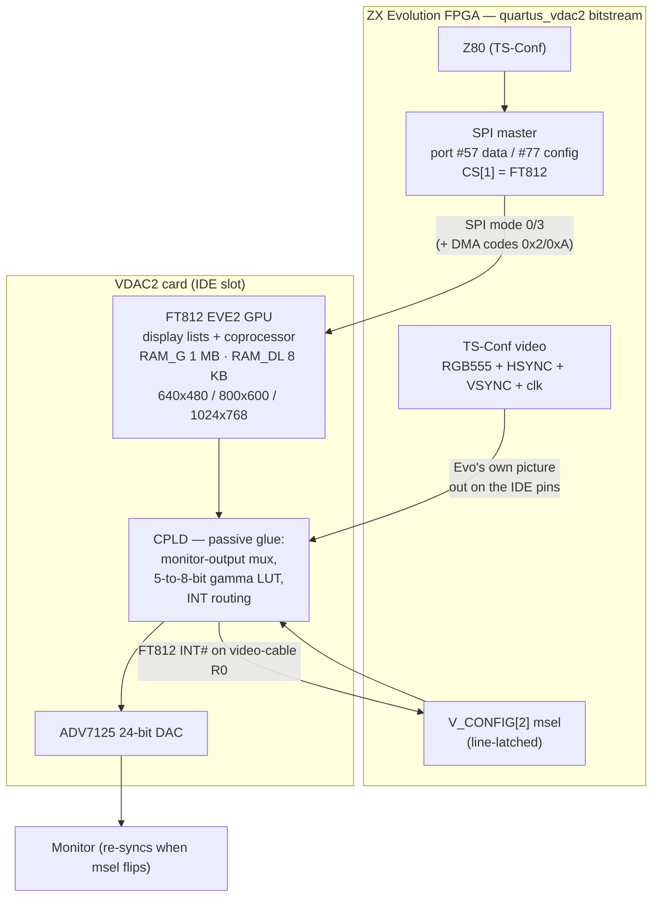

[← Home](../../README.md) · [New Gen Hardware](README.md) · [TS-Conf](ts_conf.md)

# VDAC2 — The FT812 Video Card for ZX Evolution and TS-Conf

In 2025–2026 the ZX Evolution gained something no Spectrum-family machine ever had: a **GPU**. TS-Labs' **VDAC2** is an expansion card that plugs into the Evo's **IDE connector** and carries a Bridgetek **FT812** — a full Embedded Video Engine with display lists, a coprocessor, a 1 MB graphics RAM, hardware bitmap scaling and rotation — plus a 24-bit **ADV7125** video DAC. A Z80 machine from 2009 suddenly drives **640×480, 800×600 and 1024×768 at 57–85 Hz in up to 16.7 million colors**, while the same board can still boot Pentagon software.

The trick that makes it possible is the same one the Sprinter pioneered and TS-Conf inherited: **the hardware is a bitstream**. The `quartus_vdac2` firmware build replaces the Nemo IDE controller (`IDE_HDD`) with `IDE_VDAC2` — the IDE pins become a video bus and an SPI link — so the card needs no new connectors and no new CPU ports. Everything is verified against the Verilog, the card's CPLD source, its PCB, and the games' own Z80 code.

> [!NOTE]
> This article covers the **VDAC2 card and its TS-Conf integration**. For the TS-Conf machine itself (sprites, tiles, DMA, `#xxAF` registers), see [ts_conf.md](ts_conf.md); for the board, [zx_evo.md](zx_evo.md). A primer-level article ("VDAC2 #2 — Первые шаги") and a full TS-Conf+VDAC2 textbook ship inside the game repositories (see References).

---

## Lineage

| Card / build | Firmware define | `STATUS.VDAC_VER` | What it is |
|---|---|---|---|
| (none) | `IDE_HDD` | 0 | standard ZX-Evo: Nemo IDE in the slot |
| **VDAC1** | `IDE_VDAC` | 3 | first-generation external **5-bit** video DAC |
| **VDAC2** | `IDE_VDAC2` (+`ESP32_SPI`) | **6** with ESP32, **7** without | **FT812 GPU card + ADV7125 DAC** — this article |
| **VDAC3** (hinted) | `ESP32_SPI` | — | ESP32-S3 as FT8xx bus master; firmware exists in [`pentevo/esp32`](https://github.com/tslabs/zx-evo/tree/master/pentevo/esp32) |

Software detects the generation through `VDAC_VER` (bits `[2:0]` of TS-Conf `STATUS`, read `#00AF`). Note the trap: the current `quartus_vdac2` build with `ESP32_SPI` reports **6**, while the released games test for **7**.

> [!IMPORTANT]
> **A real board has either IDE or a VDAC — never both.** The VDAC builds compile the Nemo IDE logic out and reuse its pins; the corresponding TS-Conf DMA codes (`0x3`/`0xB`, IDE↔RAM) then hang. An emulator may offer the superset, but real-hardware software assumes the trade.

---

## System Architecture

The card is a passive daughterboard: a 99-line EPM-family CPLD, the FT812, the ADV7125 DAC, and the IDE connector. The intelligence is split between the Evo's FPGA (SPI master, video output) and the FT812 itself.

### What rides on the IDE pins

| Signal group | IDE pins | Direction | Purpose |
|---|---|---|---|
| Evo picture | `ide_d[15:0]` = PAL_SEL, B[4:0], G[4:3], G[1:0], R[4:0], G[2] | FPGA → card (msel = 0) | the Evo's RGB 5:5:5 — **the card is the machine's video output** |
| Syncs + clock | `ide_cs0_n` = HSYNC, `ide_cs1_n` = VSYNC, `ide_a[2]` = pixel clock | FPGA → card | timing of the Evo picture |
| msel | `ide_dir`, `ide_wr_n` | FPGA → card | 1 = show the FT812 picture; turns `ide_d` into an input |
| SPI to FT812 | `ide_a[0]` = SCK, `ide_a[1]` = MOSI, `ide_rd_n` = CS_n, `ide_rdy` = MISO | both | the FT812 control channel |
| FT812 INT_n | `ide_d[1]` (msel = 1 only) | card → FPGA | the CPLD drives video-cable R0 with it |

Two facts that are easy to get wrong (and that early reviews did):

- The FT812 picture **never enters the FPGA**. The card's CPLD switches the monitor output **as a whole** — RGB, syncs *and the pixel clock* come either from the Evo or from the FT812. When `msel` changes, the monitor sees a different resolution and refresh rate and must re-sync; the two pictures are never blended.
- The CPLD is pure glue: a video mux, a hard-coded 5→8-bit gamma lookup per channel for the native path, and INT routing. There is no protocol logic on the card to emulate.

---

## Programming Model — No New Ports

The Z80 talks to the GPU through the **standard TS-Conf SPI controller** that already serves the SD card:

| Port | R/W | Function |
|---|---|---|
| `#57` (`SDDAT`) | W | start an SPI exchange sending D |
| `#57` | R | return the byte from the **previous** exchange, start a new one sending `#FF` |
| `#77` (`SDCFG`) | W | chip selects: bit 1 SD, **bit 2 FT812**, bit 3 SD2, bit 4 ESP32; bit 0 SPI mode 0/3 |

The FT812 is **CS index 1**. A byte takes 16 fclk (SCK 14 MHz) — effectively instant to the CPU — and TS-Conf's **DMA codes `0x2`/`0xA` (SPI↔RAM)** move whole buffers without CPU attention, which is the intended texture and display-list upload path. A typical frame is: build the next display list / coprocessor script in RAM, DMA it to the FT812, then flip `msel` or ask for a `DLSWAP`.

Selection and interrupts:

- **`V_CONFIG[2]`** (register `0x00`, port `#00AF`) is the **msel** bit — line-latched, so the switch lands cleanly at a line boundary.
- With msel set, the TS-Conf **line-interrupt source switches from the internal raster to the FT812 sync** (`int_start_lin(vdac2_msel ? int_start_ft : line_start_s)`); the FT812's own `INT#` (touch, swap/detect via `REG_INT_MASK`) returns over the video cable's R0 line.

---

## The FT812 in Spectrum Terms

For a developer coming from ULA-land, the FT812 (an "EVE2" chip, also used on Gameduino 2/3 boards) inverts the usual model: there is **no frame buffer to poke**. The chip executes a **display list** — up to 2048 32-bit commands in `RAM_DL` (8 KB) — *every frame*, in scan order, drawing straight to the DAC. A **coprocessor** (fed by a 4 KB ring buffer, `RAM_CMD`) expands higher-level commands — `CMD_INFLATE` (decompress), `CMD_MEMCPY`, matrix ops, `CMD_TEXT` with the **19 built-in ROM fonts**, `CMD_LOADIMAGE` (JPEG/PNG decode), `CMD_PLAYVIDEO` (AVI M-JPEG streaming) — into display-list commands or `RAM_G` writes. Display lists are double-buffered: build, then swap at end of frame.

What the shipping VDAC2 software actually uses (measured across the three games' sources):

- **Bitmaps**: `PALETTED4444` as the workhorse, plus ARGB4, RGB565, ARGB1555 and the linear L1/L4/L8 formats; `BITMAP_TRANSFORM_A..F` for hardware scaling/rotation, NEAREST/BILINEAR, BORDER/REPEAT
- **Primitives**: BITMAPS, RECTS, POINTS, LINES, LINE_STRIP; scissor, blend (`BLEND_FUNC`), color masks
- **The "DXT" trick** (TS-Labs' texture compression, built *from* FT812 blending): an L1/L4 mask writes destination alpha while two quarter-size RGB565 layers are scaled ×4 and mixed through `DST_ALPHA`/`ONE_MINUS_DST_ALPHA` — destination alpha, blend factors and scaling must be exact or the picture falls apart. The `dxt_conv` tool produces these from source images
- **Control flow**: `CALL`/`RETURN`, `JUMP`, `MACRO`, `DISPLAY`; coprocessor `CMD_DLSTART`/`CMD_SWAP`, `CMD_INFLATE`, matrices, and (in the Wild Commander `ftview` plugin) `CMD_LOADIMAGE` + `CMD_MEDIAFIFO`/`CMD_PLAYVIDEO` for JPEG/PNG/AVI

---

## Software and Ecosystem

| Item | What | Source |
|---|---|---|
| **R-Type Arcade** | arcade port, v1.01 (2026) | [andrewinsidelazarev/R-Type-Arcade-VDAC2-FT812](https://github.com/andrewinsidelazarev/R-Type-Arcade-VDAC2-FT812) (MIT) |
| **Zuma Deluxe** | puzzle port, v1.1 (2026) | [andrewinsidelazarev/Zuna-Deluxe-VDAC2-FT812](https://github.com/andrewinsidelazarev/Zuna-Deluxe-VDAC2-FT812) (MIT) |
| **Heroes of Might and Magic II** | strategy port, pre-release v022 (2026-09) | [andrewinsidelazarev/Heroes-of-Might-and-Magic-II-for-VDAC2](https://github.com/andrewinsidelazarev/Heroes-of-Might-and-Magic-II-for-VDAC2) (MIT) |
| **TSLib / FT812 SDK** | Z80 macros for every FT812 command, test programs | [tslabs/zx-evo `pentevo/sdk/ft812sdk`](https://github.com/tslabs/zx-evo/tree/master/pentevo/sdk/ft812sdk) |
| **Demos** | `ft_pong`, `tunnel` (asm) | [tslabs/zx-evo `pentevo/demos/examples`](https://github.com/tslabs/zx-evo/tree/master/pentevo/demos/examples) |
| **dxt_conv** | the DXT texture converter | [tslabs/zx-evo `pentevo/tools/dxt_conv`](https://github.com/tslabs/zx-evo/tree/master/pentevo/tools/dxt_conv) |
| **ftview** | Wild Commander viewer plugin: JPEG/PNG/AVI on VDAC2 | ships with [Wild Commander](https://github.com/tslabs/zx-evo) |
| **Textbooks** | "VDAC2 #2 — Первые шаги", TS-Conf+VDAC2 учебник, RAM_G maps | in the game repos' `Docs/` |

The game repositories double as the best existing documentation: complete Z80 sources, asset pipelines, and learning texts written against real hardware.

---

## Emulation

Only one emulator runs VDAC2 software today: TS-Labs' own Unreal fork, [tslabs/zx-evo-unreal](https://github.com/tslabs/zx-evo-unreal), which does **not** emulate the FT812 itself — it wraps Bridgetek's proprietary [bt8xxemu](https://github.com/Bridgetek/EVE_Emulator) DLL (`Unreal/ft812.cpp`). That library (by Jan Boon/Kaetemi) contains the chips' ROM images — including the 19 ROM fonts and a coprocessor implemented as a J1-style stack CPU — and runs the *real* coprocessor firmware, but models no FT812 interrupts, so the reference emulator synthesizes INT externally.

Neither [ZEsarUX](https://github.com/chernandezba/zesarux) (TS-Conf only, `src/machines/tsconf.c`) nor MAME has any EVE-family device. The unreal-ng project's design calls for a clean-room **high-level emulation library**: reproduce what each display-list command and coprocessor command *does*, load the extracted ROM fonts (the font table is inside the public emulator DLL), and skip the internal processor — the games' measured command vocabulary (§ above) defines the scope. No existing open-source core (Gameduino emulators included) covers FT81x.

---

## Impact on FPGA/Emulation

- **VDAC2 is "just" SPI device CS[1]** on the existing TS-Conf SPI controller — an emulator needs no new port decoding, only a device model on the bus plus the msel/INT plumbing.
- **msel changes the machine's visible output** (another resolution, another pixel clock) — the emulator's video pipeline must switch targets at a line boundary, exactly like a monitor re-sync.
- **`VDAC_VER` is a contract**: reporting 6 vs 7 decides whether current games run; an emulator must let the user pick the variant.
- The **DXT pictures are a blending correctness test**: destination-alpha writes, scaled layers and `COLOR_MASK` must be bit-exact or the compressed images render wrong — a good canary for any HLE implementation.
- **INT semantics differ from the silicon**: the reference DLL models no interrupts; real hardware raises `INT#` on touch and swap. Emulators must choose the hardware behavior, not the DLL's.

## Pitfalls

1. **`VDAC_VER` 6 vs 7** — the ESP32-enabled build reports 6; the released games test for 7. Know your bitstream before blaming the code.
2. **No IDE with a VDAC** — DMA codes `0x3`/`0xB` hang in VDAC builds; software must not assume both devices exist.
3. **Monitor re-sync on msel** — switching picture sources mid-frame is fine electrically (line-latched) but the monitor blanks momentarily; don't flip msel inside timing-sensitive sequences.
4. **SPI read latency** — `IN #57` returns the *previous* exchange's byte; off-by-one byte shifts are the classic first bug.
5. **The coprocessor ring is 4 KB** — a display-list script larger than `RAM_CMD` stalls; chunk with `CMD_APPEND`/`CMD_MEMCPY` from `RAM_G`.

---

## Cross-References

- [TS-Conf](ts_conf.md) — the firmware the card extends (`#xxAF` registers, SPI, DMA, INT)
- [ZX Evolution](zx_evo.md) — the host board
- [BaseConf](baseconf.md) — the default firmware (and why IDE and VDAC2 are exclusive)
- [ZX Evolution frame](../../05_development/05_display_and_timing/video_frame_zxevo.md) — the native raster the FT812 replaces on the monitor
- [ZX Spectrum Next](zx_next.md) — the Western machine whose Layer 2/sprites occupy a similar niche

---

## References

All links verified live (October 2026).

- **Hardware sources** — [tslabs/zx-evo](https://github.com/tslabs/zx-evo): FPGA build [`pentevo/fpga/current/quartus_vdac2`](https://github.com/tslabs/zx-evo/tree/master/pentevo/fpga/current/quartus_vdac2) (`tune.v`) · card CPLD + PCB (RevA/RevB, P-CAD + Gerbers) [`pentevo/vdac/vdac2`](https://github.com/tslabs/zx-evo/tree/master/pentevo/vdac/vdac2) · ESP32 firmware [`pentevo/esp32`](https://github.com/tslabs/zx-evo/tree/master/pentevo/esp32)
- **FT812 documentation** — [FT81X Series Programmer's Guide v1.2](https://brtchip.com/wp-content/uploads/Support/Documentation/Programming_Guides/ICs/EVE/FT81X_Series_Programmer_Guide.pdf) · [FT81x datasheet (glyn)](https://www.glyn.de/Daten/Datenblaetter/FTDI/FT81x/Datasheets/DS_FT81x.pdf) · [FT812/813 datasheet (DigiKey)](https://mm.digikey.com/Volume0/opasdata/d220001/medias/docus/7130/1613_762.pdf) · [AN_281 emulator library guide](https://brtchip.com/wp-content/uploads/Support/Documentation/Programming_Guides/ICs/EVE/AN_281_FT800_Emulator_Library_User_Guide.pdf)
- **Community** — TS-Labs forum thread "IDE Video DAC2 на FT812" (13 pages): [forum.tslabs.info/viewtopic.php?f=40&t=651](https://forum.tslabs.info/viewtopic.php?f=40&t=651) · video: [YouTube](https://www.youtube.com/watch?v=OjSbMH9WKf4) / [Rutube](https://rutube.ru/video/9e1d5210d92516fb09cb355ff219caf3/) · zx-pk dev thread: [Разработка игры-космосима под ZX Evo Tsconf + VDAC2](https://zx-pk.ru/threads/32689-razrabotka-igry-kosmosima-pod-zx-evo-tsconf-vdac2.html)
- **Emulation** — [tslabs/zx-evo-unreal](https://github.com/tslabs/zx-evo-unreal) (`Unreal/ft812.cpp`) · [Bridgetek EVE_Emulator](https://github.com/Bridgetek/EVE_Emulator) (binaries + headers) · no FT8xx in [ZEsarUX](https://github.com/chernandezba/zesarux) or MAME (checked 2026)
- **VDAC2 games and textbooks** — [R-Type](https://github.com/andrewinsidelazarev/R-Type-Arcade-VDAC2-FT812) ([release v1.01](https://github.com/andrewinsidelazarev/R-Type-Arcade-VDAC2-FT812/releases/tag/v1.01)) · [Zuma Deluxe](https://github.com/andrewinsidelazarev/Zuna-Deluxe-VDAC2-FT812) ([release v1.1](https://github.com/andrewinsidelazarev/Zuna-Deluxe-VDAC2-FT812/releases/tag/v1.1)) · [Heroes II](https://github.com/andrewinsidelazarev/Heroes-of-Might-and-Magic-II-for-VDAC2)
