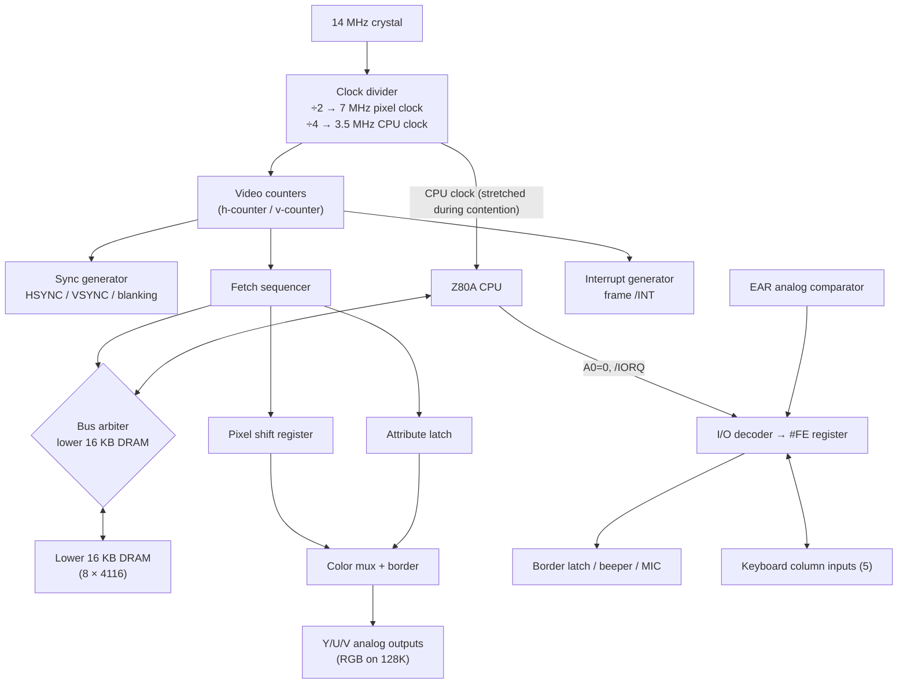

[← Home](../../README.md) · [Original Hardware](README.md)

# ULA Architecture — Inside the Ferranti Gate Array: Video Pipeline, Memory Arbitration, Keyboard and Tape I/O

## Overview

The ZX Spectrum has no dedicated video chip, no sound chip, no memory controller, and no I/O chip — it has **one chip doing all four jobs**. The ULA (Uncommitted Logic Array), a semi-custom gate array built by Ferranti, generates the video signal byte by byte, arbitrates every access to the lower 16 KB of RAM, scans the keyboard matrix, drives the beeper, and reads and writes cassette tapes. A 48K Spectrum motherboard carries barely a dozen large ICs; the ULA is why.

This economy came at a price every Spectrum programmer eventually pays. Because the ULA must read the screen from the same DRAM the CPU wants, it simply **stalls the Z80's clock** when both need the bus — memory contention is not a quirk, it is the direct consequence of the ULA's internal fetch pipeline. Because one I/O port, `#FE`, was decoded with a single address line, the border color, speaker, tape output, and 40 keys all live in one byte. Understanding the ULA's internal structure explains nearly every "weird" behavior of the machine: contention, the floating bus, the snow effect, issue-dependent keyboard behavior, and why clones that replaced the ULA with TTL logic ended up with different timing.

This article covers the ULA as a piece of silicon: what is inside it, how the video pipeline works cycle by cycle, how it arbitrates memory, what the revisions changed, and how Soviet clones and modern replacements reimplemented it. For the programmer-facing consequences — exact contention patterns, frame T-state maps, raster timing — see [ULA Timing](ula_timing.md), [Contention Model](../../05_development/03_memory_and_io/contention_model.md), and [Floating Bus](../../05_development/05_display_and_timing/floating_bus.md). The definitive hardware reference is Chris Smith's [*The ZX Spectrum ULA: How to Design a Microcomputer*](https://www.amazon.com/dp/0956507107), which reverse-engineered the chip from die photographs.

---

## What the ULA Is

A ULA is Ferranti's brand of **semi-custom gate array**: a wafer pre-fabricated with a grid of uncommitted logic cells, customized for a single customer with one or two final metal interconnect layers. Compared with a fully custom ASIC, a ULA was cheap and fast to design in small volumes — exactly what Sinclair needed. Sinclair was one of Ferranti's earliest adopters: the ZX80's discrete TTL logic was folded into the ZX81's `2C158E` ULA (with an NMI-generation circuit added), and the Spectrum's ULA grew from that lineage.

The Spectrum ULA is a **40-pin DIP** containing on the order of a few thousand gates, plus something a pure digital gate array should not have: **analog peripheral cells** in Ferranti's process, which Sinclair used for the cassette interface comparator and the Y/U/V color-difference outputs. Those analog cells are the reason the ULA proved hard to replicate for decades — a CPLD can copy the digital logic, but not the analog corners.

What the chip contains, in functional terms:

| Block | Function |
|---|---|
| Video counters | Horizontal/vertical position counters generating the frame structure and sync |
| Fetch sequencer | Reads one pixel byte + one attribute byte per 8 pixels from DRAM |
| Shift register | Serializes pixel bytes to the 7 MHz pixel stream |
| Attribute latch | Holds the attribute byte; drives color selection for the current 8 pixels |
| Color encoder interface | Analog Y/U/V outputs (48K) or RGB outputs (128K) to the video modulator |
| DRAM controller | Address multiplexing, `/RAS` and `/CAS` generation for the lower 16 KB |
| Bus arbiter | Decides whether the CPU or the video fetch owns the lower 16 KB each cycle |
| Clock generator | Divides the 14 MHz master crystal into the CPU clock (÷4) and pixel clock (÷2) |
| I/O decoder | Single-bit port decode (A0=0) with the `#FE` register |
| Keyboard interface | Five column inputs with internal pull-ups |
| Tape interface | EAR input comparator, MIC output driver |
| Interrupt generator | Produces the frame-synchronized `/INT` pulse |

Everything else in a 48K Spectrum is commodity parts: a Z80A, one or two ROMs, eight `4116` DRAMs for the lower 16 KB, eight `4532`/`4164` DRAMs for the upper 32 KB (48K model), an LM1889 color modulator, a 7805 regulator, and a handful of TTL glue. The ULA is the machine.

---

## Internal Architecture

The ULA's blocks form a single synchronous pipeline clocked from one 14 MHz master oscillator. The video counters are the heartbeat — everything else is a slave to the beam position.



Key observations from the diagram:

- **The CPU clock is an output of the ULA.** The Z80 does not free-run — the ULA feeds it 3.5 MHz and can stretch that clock at will. This is the physical mechanism behind memory contention.
- **The video fetch and the CPU share one port** into the lower 16 KB. The arbiter is the single most consequential block for software.
- **The keyboard, border, beeper, MIC, and EAR all converge on one decoder** — there is exactly one I/O register in the chip.

---

## Clock Generation

The master crystal is **14 MHz** (14.000 MHz on 48K issue boards). On 48K boards, this crystal is paired with a small trimmer capacitor (TC1). Because the ULA's clock cascades down to the video timing, slight variations in the crystal would cause the color subcarrier to drift. Adjusting this trimmer with a plastic screwdriver to fix a black-and-white picture is a classic rite of passage for 48K hardware repair.

The ULA divides this 14 MHz master clock internally:

| Clock | Frequency | Derived by | Used for |
|---|---|---|---|
| Master | 14 MHz | crystal | ULA internal timing |
| Pixel clock | 7 MHz | ÷2 | Shift register, video counters |
| CPU clock | 3.5 MHz | ÷4 | Z80A (stretched during contention) |

Because the CPU clock is the pixel clock ÷2, every T-state is exactly **2 pixel-clock cycles**, and the video geometry locks to the CPU:

- **224 T-states per scanline** = 448 pixel clocks → 7 MHz / 448 = **15.625 kHz** line rate (PAL standard)
- **312 scanlines** = 69888 T-states per 48K frame → **50.08 Hz** frame rate

The 128K models run the ULA's counters slightly differently (228 T-states/line, 311 lines, 70908 T-states/frame) — see [ULA Timing](ula_timing.md). Soviet clones re-derived these numbers from their own counter designs, which is why a Pentagon produces 320 lines and 48.83 Hz.

The **PAL color subcarrier (4.43361875 MHz)** does not come from the ULA. On the 48K a separate crystal drives the LM1889 modulator, which receives Y (luminance) and U/V (color difference) as analog levels from the ULA's peripheral cells. On the 128K the ULA outputs digital RGB instead, and a TEA2000 handles PAL encoding.

---

## Video Generation Pipeline

The pipeline has four stages, all driven by the horizontal counter.

### Stage 1 — Counters and geometry

Two counters track the beam: the horizontal counter counts 448 pixel clocks (224 T-states) per line; the vertical counter counts 312 lines. Comparators on these counters generate horizontal sync, vertical sync, blanking, and the fetch-enable windows. The paper (bitmap) area occupies lines 64–255 of the frame and the middle 128 T-states of each of those lines; everything else is border or blanking.

### Stage 2 — Dual fetch (the core of the design)

For every group of 8 horizontal pixels during the paper area, the fetch sequencer performs **two DRAM reads**:

1. **Pixel (bitmap) byte** — from the display file at `#4000`–`#57FF`
2. **Attribute byte** — from the attribute file at `#5800`–`#5AFF`, same cell coordinates

The screen's strange address layout exists to make these fetches cheap. The ULA builds the fetch address from its own counters: the attribute address is simply the pixel address with the high bits re-pointed at `#5800` — the famous three-thirds, character-row-interleaved layout means the counters can stay simple binary counters with fixed bit substitutions. No multiplication, no adder. See [Screen Layout](../../05_development/03_memory_and_io/screen_layout.md) for the programmer view.

```
Horizontal position (within paper, per 8-pixel cell):
┌─────────┬─────────┬─────────┬─────────┐
│ T 0..1  │ T 2..3  │ T 4..5  │ T 6..7  │
│ PIXEL   │ ATTR    │  next   │  next   │
│ fetch   │ fetch   │  cell   │  cell   │
└─────────┴─────────┴─────────┴─────────┘
     ↓          ↓
 shift reg   attr latch ──→ 8 pixels emerge 1 cell later
```

Each scanline of paper fetches **32 pixel bytes + 32 attribute bytes = 64 DRAM reads**, times 192 paper lines = **12,288 bytes read per frame**, purely by the ULA.

### Stage 3 — Serialization

The fetched pixel byte loads into an 8-bit shift register clocked at 7 MHz; bits emerge MSB-first, one per pixel clock. Because the fetch pipeline has latency, the pixels a fetch produces appear on screen **8 pixels later** — the ULA is always fetching one cell ahead of what it is displaying.

### Stage 4 — Attribute application and color

The attribute latch holds INK, PAPER, BRIGHT, and FLASH for the current cell. For each emerging pixel bit the color mux selects INK (bit set) or PAPER (bit clear), applies BRIGHT, and — during border or blanking — substitutes the border color from the `#FE` latch. FLASH is implemented by swapping INK and PAPER at ~1.5 Hz, timed from the frame counter. The selected color drives the analog Y/U/V output cells (48K) or RGB pins (128K).

> [!NOTE]
> The border is not stored anywhere — it is the color mux's default when the paper window is closed. That is why border effects are "free" (one port write) and why border timing equals beam timing. See [Border Effects](../../05_development/05_display_and_timing/border_effects.md).

### DRAM control

For the lower 16 KB the ULA is also the DRAM controller: it multiplexes the 14-bit address onto the 7 address pins of the `4116` chips and generates `/RAS` and `/CAS`. The upper 32 KB (48K models) uses separate address multiplexing TTL and is never touched by the video fetch — which is why only the lower 16 KB is contended.

---

## Memory Arbitration — How the ULA Steals the Bus

The lower 16 KB has one address/data port and two masters: the Z80 and the fetch sequencer. The arbiter resolves conflicts with a brutally simple rule: **during a fetch, the video wins; the CPU waits**.

On the 48K (Ferranti ULA) the mechanism is **clock stretching**. Unlike other systems that assert the Z80's `/WAIT` pin to pause the CPU, the Ferranti ULA ignores `/WAIT` entirely. It generates the CPU clock, and to know *when* to stretch it, the ULA physically monitors the Z80's `A14`, `A15`, and `/MREQ` lines. If the Z80 attempts to access the `0x4000-0x7FFF` range (A14=1, A15=0) while `/MREQ` goes low at the wrong moment, the ULA simply **holds the clock high** — the Z80 physically freezes mid-cycle until the fetch completes. The CPU does not know this happened; it just sees time pass. This is why contention costs are counted in stolen T-states, and why the stolen amount follows the repeating **6-5-4-3-2-1-0-0 pattern** as the fetch window sweeps past each 8-pixel cell.

On the +2A/+3 the Amstrad gate array uses a different scheme (a fixed wait pattern of 1-0-7-6-5-4-3-2, applied to a different set of banks), and the Pentagon's TTL video controller does not arbitrate at all — its dual-ported video RAM arrangement leaves the CPU running at full speed, giving the Pentagon its famous **zero contention**. The full per-model patterns, costs, and cross-platform strategy are documented in [Contention Model](../../05_development/03_memory_and_io/contention_model.md); what matters here architecturally is:

- Contention is a **consequence of the single-ported lower 16 KB design**, not a separate feature. Anything that changes the fetch schedule (clone counters, turbo modes) changes or removes contention.
- Because the CPU clock is stretched, **contended access time depends on where in the fetch cycle you arrive** — the root of all "impossible to time" complaints from developers porting 48K code to other models.
- **I/O contention** is the same fight on a different resource: port `#FE` lives inside the ULA, so even I/O to it must wait for the video logic. The 5C102E/5C112E revisions handled this badly — see the revisions section.

Two side effects of this design deserve their own articles and have them: the **floating bus** (reading a port nobody drives returns the byte the ULA just fetched — [Floating Bus](../../05_development/05_display_and_timing/floating_bus.md)) and the **snow effect** (pointing the Z80's `IR` register pair at the screen area makes DRAM refresh cycles collide with video fetches — [ULA Timing](ula_timing.md#snow-effect--dram-refresh--ula-bus-collision)).

---

## Port #FE Internals — One Register, Five Jobs

The ULA decodes I/O with **a single address line: A0=0**. Any port write with A0 low hits the ULA's only register; any read with A0 low reads its input mux. The canonical address is `#FE`, but `#00`, `#02`, `#FC00`, `#7FFE` (when A0=0) all alias to it — with the caveat that other peripherals decode other address lines, so in practice you always use `#FE` (writes) and `#FE`/half-row addresses (keyboard reads).

| Port | Decoding | R/W | Description |
|---|---|---|---|
| `#FE` | A0=0 only | W | Border (bits 0–2), MIC (bit 3), beeper (bit 4) |
| `#FE` | A0=0 only | R | Keyboard columns (bits 0–4), EAR input (bit 6) |

Write path — a small latch inside the ULA:

| Bits | Function | Hardware effect |
|---|---|---|
| 0–2 | Border color | Color mux default — visible within a few T-states, see [Border Effects](../../05_development/05_display_and_timing/border_effects.md) |
| 3 | MIC output | Drives the tape-save output level via the analog cell |
| 4 | Beeper | Drives the speaker transistor — every 1-bit sound engine toggles this bit; see [Beeper Synthesis](../../06_sound/synthesis/beeper_synthesis.md) |
| 5–7 | Unused | Ignored on write |

Read path — an input mux:

| Bits | Function | Notes |
|---|---|---|
| 0–4 | Keyboard columns | Active-low; which 5 of 40 keys depends on the half-row selected by A8–A15 |
| 5 | Unused | Reads as 1 |
| 6 | EAR input | Analog comparator output; also tied to tape-load behavior that varies by ULA revision |
| 7 | Unused | Reads as 1 |

> [!CAUTION]
> Because the ULA greedily decodes I/O using just `A0=0`, third-party peripheral designers had to navigate this carefully. Hardware like the Kempston joystick (port 31 / `#1F`) had to ensure their decoding required `A0=1`, otherwise they would cause a data bus collision with the ULA during I/O reads.

The entire user-facing I/O of a 48K Spectrum — 40 keys, tape in, tape out, sound, and border — is this one byte.

---

## Keyboard Matrix Interface

The keyboard is a passive **8 × 5 matrix** of membrane switches. The ULA owns only the five **column inputs** (`KB0`–`KB4`), each with an internal pull-up. The eight **row selects are not driven by the ULA at all** — they are wired directly to CPU address lines **A8–A15** through diodes.

To read a half-row, the CPU performs an `IN` from a port whose high byte has one of A8–A15 low:

```z80
; Read half-row CAPS SHIFT ... V (row selected by A8 = 0)
        ld      bc, #FEFE       ; B = #FE → A8 low during IN ; C = #FE (A0 low)
        in      a, (c)          ; bits 0-4: CAPS,Z,X,C,V — 0 = pressed
        ; 11 T-states (contended I/O — may stretch)
```

| High byte | Row line | Keys (bits 0→4) |
|---|---|---|
| `#FE` | A8 | CAPS SHIFT, Z, X, C, V |
| `#FD` | A9 | A, S, D, F, G |
| `#FB` | A10 | Q, W, E, R, T |
| `#F7` | A11 | 1, 2, 3, 4, 5 |
| `#EF` | A12 | 0, 9, 8, 7, 6 |
| `#DF` | A13 | P, O, I, U, Y |
| `#BF` | A14 | ENTER, L, K, J, H |
| `#7F` | A15 | SPACE, SYMBOL SHIFT, M, N, B |

Consequences of putting the row select on the address bus:

- **Reading with multiple row lines low** (e.g., `#00FE`) ANDs the rows together — a cheap "any key on these rows" test, and the standard way to detect *any* key (`IN A,(#FE)` with port `#00FE`... but note this contends with every other peripheral).
- **Ghosting**: pressing three keys at matrix corners can phantom a fourth — there are no anti-ghost diodes per key. Games avoid this by choosing control keys on the same half-row (the classic QAOP/QAOPM layouts live on rows A8–A10 and A15).
- The keyboard costs the ULA nothing per scan — the CPU does all the work, one `IN` per half-row. Full matrix scan = 8 `IN`s ≈ 88 T-states plus masking.

---

## Tape and Sound — The Analog Cells

Ferranti's process let Sinclair put analog peripheral cells on the ULA die, and three of the machine's most distinctive features live there:

- **EAR input** — a comparator with a nominal threshold around the tape signal level. The ROM loader polls bit 6 of `#FE` and measures pulse widths in software; the ULA contributes nothing but level detection. Loading is a **CPU-intensive software task**, which is why loaders show border stripes — the border is the only "free" output during a tight timing loop.
- **MIC output** — bit 3 of `#FE` drives the save signal. The ROM serializer toggles it under software timing.
- **Beeper** — bit 4 of `#FE` drives the internal speaker. There is no oscillator: sound exists only while the CPU keeps toggling. The entire 1-bit music scene ([1-Bit Music Scene](../../07_demoscene/1bit_music_scene.md), [Ear Shaver Analysis](../../06_sound/synthesis/shiru_ear_shaver_analysis.md)) is built on the fact that this output is a plain software-controlled level with zero hardware assistance.

On the 128K ULA (`7K010E-5`), MIC and EAR have **separate pins** — but they are tied together on the PCB to preserve 48K behavior. The 48K ties them inside the package, and revision differences in this circuitry are behind the issue-dependent EAR quirks covered below. Additionally, before reaching the ULA, the incoming audio signal passes through a notoriously complex and somewhat fragile resistor/capacitor network on the motherboard designed to filter the tape audio.

---

## Interrupt Generation

Once per frame, as the vertical counter leaves the paper/border region, the ULA pulls `/INT` low for **32 T-states**. On the 48K this lands at T-state 0 of the frame by convention (the frame reference point); on the 128K and clones it lands at different offsets — the per-model numbers are in [ULA Timing](ula_timing.md) and [Clone Timing](../clones/clone_timing.md).

The ULA generates `/INT` unconditionally; the Z80 decides whether to honor it (`IFF1`). This frame pulse is the master metronome of nearly all Spectrum software — game loops, `HALT`-based raster sync, and AY music players all chain off it. Programmer-facing details (IM modes, vector tables, `EI` latency) are in [Z80 Interrupts](../../01_cpu/z80_interrupts.md) and [Interrupt Programming](../../05_development/04_interrupts/interrupt_programming.md).

---

## ULA Revisions — Six Silicon Spins, Two Infamous Mods

The 48K ULA went through multiple revisions across Issue 1–6A boards, and the early ones were buggy enough to require **factory retrofits soldered on top of the PCB**. Revision identity matters to this day: keyboard behavior, the floating bus, and repair compatibility all depend on it.

| ULA | Found in | Key behavior / defect | Fix |
|---|---|---|---|
| `5C102E` | Issue 1, some Issue 2 | Broken I/O contention — unreliable keyboard reads from machine code | "Cockroach" mod: a `74LS00` dead-bug soldered over the PCB (later a daughterboard) |
| `5C112E` / `-2` / `-3` | Issue 2 | Over-aggressive I/O contention — contended ports that didn't need it | "Spider" mod: a ZTX313 transistor over the CPU; became PCB-mounted **TR6** from Issue 3. Without it, **no floating bus** |
| `6C001E-5` | Late Issue 2 (date codes 8320–8324, in YYWW format) | New low-power 6C process. TV timing change **shifts the picture one character left**; internal pull-up change makes the **EAR bit float** until warm-up; marginal `/RAS` timing | Small capacitor fitted on the lower-RAM `/RAS` line |
| `6C001E-6` | Late Issue 2, most Issue 3/3B | Fixes the `/RAS` timing of `-5`; otherwise identical | — |
| `6C001E-7` | Issue 4A onward | Final 48K revision; improved memory signal timing. The **only ULA documented to work in every 48K issue**. Late examples carry Plessey markings (Plessey absorbed Ferranti's semiconductor business in 1988) | — |
| `7K010E-5` / Amstrad `40056` | 128K "toastrack", grey +2 | Functionally identical to each other. **RGB outputs** instead of Y/U/V; **separate MIC/EAR pins** (tied together on the PCB to emulate 48K behavior) | — |

> [!NOTE]
> The Ferranti ULAs (especially the later 6C001E-series) ran notoriously hot, functioning as a significant heat source on the board. This thermal stress is a major reason why the `6C001E-6/-7` chips frequently fail with age, and why many modern owners retrofit small heatsinks to them.

Compatibility per the Sinclair service manual: `5C102E` needs the cockroach on Issue 1/2 boards; `5C112E` works in Issue 1 (cockroach removed) and Issue 2; `6C001E-5/-6` fit Issues 1–3; `6C001E-7` fits everything. `7K010E-5` and `40056` are interchangeable with no modifications.

The practical takeaways for software are the two behavioral landmines:

1. **The EAR bit is not stable across revisions.** On 5C-series ULAs bit 6 of `#FE` idles at 1; on the `6C001E-5` it floats between 0 and 1 until the chip warms up. Any keyboard routine that compares the whole byte instead of masking bits 0–4 will break on some real machines. This exact bug shipped in commercial games.
2. **The floating bus depends on TR6.** A machine with a missing or failed spider transistor behaves like a +2A/+3 — floating-bus raster sync reads constant `#FF`. Cross-model sync strategies are covered in [Raster Timing](../../05_development/05_display_and_timing/raster_timing.md).

---

## The Amstrad Gate Arrays — Same Job, Different Chip

After Amstrad bought Sinclair's computer business in 1986, the Ferranti ULA was phased out:

| Chip | Machine | What changed |
|---|---|---|
| `40056` (= `7K010E-5`) | Grey +2 | Still the Ferranti die under an Amstrad part number — RGB out, heatsink, otherwise a 128K ULA |
| `40077` | +2A, +3 | **Not a ULA** — a full Amstrad gate array in QFP absorbing the ULA, PCF, and HAL chips (video, paging, and decode glue) into one package. Different contention model (`1-0-7-6-5-4-3-2`), different contended banks, **no I/O contention**, no usable floating bus |

The `40077` is a massive architecture break: it integrates memory paging (`#7FFD`/`#1FFD`), video, and I/O decode into one package designed in the Amstrad CPC gate-array tradition rather than the Ferranti lineage. In the earlier 128K "Toastrack" and grey +2, the memory paging (Port `#7FFD`) wasn't handled by the ULA at all, but by a separate external custom logic chip (the `HAL10H8` or `ZX8401`). The `40077` subsumed all of this functionality. Software consequences — the different contention pattern and porting checklist — are in [+2A/+3 Video Frame](../../05_development/05_display_and_timing/video_frame_plus2a_plus3.md) and [+2A/+3 Memory & I/O](../../05_development/03_memory_and_io/memory_and_io_plus3.md). No modern replacement exists for the `40077`; fortunately it rarely fails.

---

## Soviet Clones — The ULA Reinvented in TTL

Soviet engineers could not buy Ferranti ULAs, so they rebuilt the *function* from discrete 74-series TTL and Soviet equivalents (`К555`/`КР1533` series counters, multiplexers, shift registers). The Pentagon, Scorpion, Leningrad, Kay, and Profi each implement their own **TTL video controller** that mimics the ULA's screen format but not its internals:

- **Different counter geometry** — the Pentagon line/frame counters produce 320 lines and a 48.83 Hz frame rate; the Profi offsets the paper start; the ATM Turbo runs a second 7 MHz mode. Numbers per clone: [Clone Timing](../clones/clone_timing.md) and [Pentagon Video Frame](../../05_development/05_display_and_timing/video_frame_pentagon.md).
- **No clock stretching** — most clones gave the CPU an unimpeded clock and used separate video RAM arbitration, so **contention simply doesn't exist** on a Pentagon. Code relying on 48K contention delays runs fast and mistimed.
- **No floating bus** — nothing left undriven on the data bus in the same way.
- **New video modes** — freed from the Ferranti design, clones added what the ULA never could: GigaScreen (frame-interleaved dual attributes), ATM 640×200 hires, Profi 512×256, and CPLD-based modes on the Kay. Catalog: [Clone Video Modes](../../05_development/05_display_and_timing/clone_video_modes.md).

The architectural lesson: the ULA's limitations were *one company's cost optimization*, not laws of physics. The moment the design was reimplemented with 1989-era TTL budgets, contention and the fixed geometry evaporated — at the cost of fragmenting the timing model across the clone ecosystem.

---

## Modern Replacements and FPGA Reimplementations

The Ferranti process is long dead and original ULAs fail with age (the `6C001E-6/-7` have a reputation for dying), so a replacement ecosystem emerged. The analog peripheral cells made this hard — a digital-only replica misses the tape comparator and Y/U/V outputs.

| Replacement | Target | Approach |
|---|---|---|
| **NebULA** | `6C001E-7` and earlier (48K) | Drop-in replacement by Phil Ruston and Alessandro Dorigatti |
| **SLAM128** | `7K010E-5` / `40056` (128K, grey +2) | Drop-in by Mark Smith, manufactured by Piotr Bugaj (zaxon) |
| **vLA82 / vLA128** | 48K and 128K respectively | Drop-in replacements by Charlie Ingley; ULAplus-capable |
| **Harlequin / Sizif-512** | Whole machine | The ULA recreated from discrete TTL / CPLD on a new PCB — a proven reference design for ULA behavior |
| **ZX Spectrum Next (TBBlue)** | New Gen | ULA reimplemented in FPGA alongside Layer 2, sprites, and 28 MHz modes — see [Next Memory & I/O](../../05_development/03_memory_and_io/memory_and_io_next.md) |
| **ZX-Uno, MiSTer cores** | FPGA | HDL reimplementations verified against documented ULA behavior |

ULAplus deserves a special mention: it began as a **plug-in enhancement** (64-color programmable palette by re-purposing unused `#FE`-space writes) and lives on in the vLA replacements and FPGA cores — see [Color System](../../05_development/05_display_and_timing/color_system.md).

---

## Historical Context — The Cheapest Possible Computer

Sinclair's goal in 1982 was not the best home computer but the **cheapest one that could run real software** — the 16K Spectrum launched at £125 against the Commodore 64's £299+. The ULA was the instrument of that strategy: collapsing video, memory control, and I/O into one semi-custom chip cut board area, chip count, power, and assembly cost in a single move.

The competitive landscape shows what everyone else spent on the same problem:

| Platform | Video chip | Memory arbitration | Sound | Chip cost philosophy |
|---|---|---|---|---|
| **ZX Spectrum 48K** (1982) | ULA (also memory + I/O) | CPU clock stretched — CPU waits | 1-bit beeper, CPU-toggled | One semi-custom chip, minimal everything |
| **Commodore 64** (1982) | VIC-II — sprites, smooth scroll | Badlines steal CPU cycles (same idea, more bandwidth) | SID — 3-voice synthesizer | Two large custom chips, premium features |
| **Amstrad CPC** (1984) | Gate array + Motorola 6845 CRTC | Gate array inserts waits | AY-3-8912 PSG | Custom gate array + off-the-shelf CRTC |
| **MSX** (1983) | TI TMS9918 VDP — sprites, own VRAM | VDP has private 16 KB VRAM; CPU never contends | AY-3-8910 PSG | Standard chips, zero custom silicon |
| **BBC Micro** (1981) | 6845 CRTC + custom video ULA | Dual-bank RAM, no contention at 2 MHz | SN76489 PSG | No expense spared, £399 |

**The honest trade-off.** The ULA gave the Spectrum the lowest entry price of the generation and an orthogonally simple programming model — one port, one screen format, one interrupt. It took away sprites, hardware scroll, per-cell 8×1 color (resulting in the famous "attribute clash" or "color clash" where 8×8 blocks must share two colors), and CPU time: contention taxes the Z80 precisely when it touches the screen, which is when a game can least afford it. The VIC-II's badlines do the same thing to the 6510, but the C64 bought sprites and scroll with the savings; the Spectrum bought nothing — the cycles are simply gone. What the Spectrum got instead was accidental: the constraint was so tight that a generation of programmers treated T-state counting as a first-class creative tool, and the Soviet scene rebuilt the machine without the constraint entirely.

The cultural consequence is hard to overstate: a ULA-less design cloned in TTL was manufacturable in any Soviet radio-amateur workshop from 1989 onward. The Pentagon exists precisely because the Spectrum's video logic was simple enough to redraw on a single sheet of paper — no VIC-II-class chip was ever cloned in a garage.

## Modern Analogies

| ULA block | Closest modern equivalent |
|---|---|
| Video counters + fetch + shift register | Display controller scan-out engine (CRTC in a GPU/SoC) |
| Dual pixel+attribute fetch | Tiled framebuffer fetch with a separate palette/attribute plane |
| DRAM controller + arbiter | SoC memory controller with QoS arbitration between display and CPU |
| Clock stretching the CPU | Display-priority memory arbitration; DDR bandwidth contention with the iGPU |
| `#FE` register | A single GPIO bank where video, audio, and input pins share one register |
| Keyboard on address lines | Scanning a GPIO matrix by driving row selects |
| Beeper (CPU-toggled bit) | Bit-banged PWM on a microcontroller GPIO |
| Frame `/INT` | VBlank interrupt |

The whole chip maps, with eerie completeness, onto the display-plus-southbridge corner of a modern SoC — implemented with ~1981 gate budgets.

---

## Practical Example — One Port, All Five Jobs

This complete program demonstrates the architectural point: keyboard input, border output, and beeper output are the **same register**. It shows a moving border bar whose color cycles with Q/A (rows read through the ULA's column inputs) and clicks the speaker on every change — every byte touches `#FE` and nothing else. Assemble with sjasmplus.

```z80
; ula_one_port.asm — keyboard, border, and beeper through port #FE only
; 48K/128K compatible. sjasmplus: sjasmplus ula_one_port.asm --raw=ula.bin

        org     #8000           ; uncontended RAM — no clock stretching here

start:
        di                      ; we drive the frame ourselves
        ld      d, 1            ; current border color (D survives IN via C)

main_loop:
        ; ---- Wait for the frame interrupt pulse (ULA-generated) ----
        ei
        halt                    ; IM 1 wakes us once per frame
        di

        ; ---- Read Q (bit 0 of half-row A10) and A (bit 0 of A9) ----
        ; IN A,(C) puts BC on the address bus: B selects the half-row,
        ; C = #FE keeps A0 low. (IN A,(n) would ignore B and use A as
        ; the high byte — a classic bug; see Pitfall 2.)
        ld      bc, #FBFE       ; A10 low → row Q W E R T
        in      a, (c)          ; 12 T-states; contended I/O
        bit     0, a            ; Q pressed? (0 = pressed)
        jr      nz, try_down
        inc     d
        call    click
try_down:
        ld      bc, #FDFE       ; A9 low → row A S D F G
        in      a, (c)
        bit     0, a            ; A pressed?
        jr      nz, apply
        dec     d
        call    click

apply:
        ld      a, d
        and     7               ; border lives in bits 0-2
        ld      d, a
        out     (#FE), a        ; bits 3-4 clear: MIC off, speaker low
        jr      main_loop

        ; ---- Short beeper click: toggle bit 4 a few hundred times ----
click:
        push    bc
        ld      b, 200
.click_loop:
        ld      a, d
        and     7
        or      #10             ; set bit 4 (speaker high), keep border
        out     (#FE), a
        ld      a, d
        and     7               ; speaker low, keep border
        out     (#FE), a
        djnz    .click_loop
        pop     bc
        ret

        end     start
```

Note what the code had to respect because of the ULA's design:

1. **Bits 0–2 must be preserved on every write** — there is one latch; the beeper toggles rewrite the border bits too. Forget this and the border flickers black.
2. **The keyboard reads are I/O-contended** — on a 48K the `IN` instructions stretch near the screen area; here it only adds harmless jitter.
3. **There is no sound hardware to "release"** — the speaker is silent only because the loop stops toggling bit 4. Every cycle of sound costs CPU time, always.

---

## Pitfalls & Common Mistakes

### Pitfall 1 — The Unmasked Keyboard Read

```z80
        in      a, (#FE)        ; any key on... wait, which row?
        cp      #FF             ; BAD: compares EAR and unused bits too
        jr      z, no_key
```

**Why it fails:** bits 5 and 7 are fixed at 1, but **bit 6 is the EAR input** — and its idle state depends on the ULA revision. On 5C-series ULAs it idles at 1; on the `6C001E-5` it floats until the chip warms up. A whole-byte compare that assumes bit 6 = 1 breaks on a subset of real machines. This bug shipped in commercial titles.

**Correct:** always mask to the five key bits, and compare against `#1F`:

```z80
        in      a, (#FE)
        and     #1F             ; keep key columns only
        cp      #1F
        jr      z, no_key
```

### Pitfall 2 — `IN A,(n)` When You Meant `IN A,(C)`

```z80
        ld      b, #F7          ; want half-row 1 2 3 4 5 (A11 low)
        in      a, (#FE)        ; BAD: B is ignored!
```

**Why it fails:** `IN A,(n)` is the immediate-port form — it puts `n` on A0–A7 and **the accumulator** on A8–A15. Whatever A happened to contain selects the row(s); the `#F7` you loaded into B is never used. The result reads some arbitrary AND of rows and changes with program state.

**Correct:** use the register-indirect form, which puts BC on the address bus:

```z80
        ld      bc, #F7FE       ; B = row select, C = port (A0 = 0)
        in      a, (c)
```

### Pitfall 3 — The Border-Clobbering Beep

```z80
        ld      a, #10          ; speaker high — but border bits are 0!
        out     (#FE), a        ; BAD: border snaps to black
```

**Why it fails:** there is exactly one latch. A write that sets only bit 4 also writes bits 0–2 as zero. Sound loops that don't carry the border color produce a strobing black border — sometimes used deliberately, usually a bug.

**Correct:** keep the current border in a register and merge it into every write (see `click` in the practical example above). The same applies to MIC (bit 3) in tape routines.

### Pitfall 4 — Assuming One ULA Behavior

Code that assumes the 48K Ferranti ULA's arbitration model — contention delays, floating bus, INT offset — breaks on the `40077` gate array (+2A/+3), which has a different contention pattern and no I/O contention, and on Soviet clones, which removed contention entirely. **Correct:** detect the machine at runtime (frame T-state count, port behavior — see [Clone Timing](../clones/clone_timing.md)) and select timing tables per model. Never hard-code 48K constants.

---

## Impact on Emulation and FPGA

The ULA is the accuracy bottleneck of every Spectrum reimplementation. A passable emulator fakes it; a cycle-exact one must reproduce:

- **Clock stretching at fetch-cycle granularity** — the 6-5-4-3-2-1-0 pattern, timed from the actual fetch sequence, not approximated per scanline. Multicolor effects like Bifrost² fail on anything less.
- **The floating bus** — requires modeling *which byte the fetch sequencer last touched*, including during border/blanking, and the attribute-vs-pixel alternation. See [Floating Bus](../../05_development/05_display_and_timing/floating_bus.md).
- **Contended I/O** — including the 5C102E/5C112E quirks if you emulate specific issues, and the absence of I/O contention on the `40077`.
- **The snow effect** — the collision between Z80 DRAM refresh (`IR` in the screen range) and ULA fetches.
- **Analog corners** — EAR comparator threshold and revision-dependent idle state matter for fast loaders that sample bit 6.

Verification references: Chris Smith's ULA book documents the internal state machines from die analysis; the Harlequin/Sizif-512 designs are proven open hardware recreations; emulator authors should also consult [Cycle-Exact Accuracy](../../11_emulation/software/cycle_exact_accuracy.md) for frame-sync consequences. For FPGA cores, the ULA is usually the *easy* part — the hard part is matching its interaction with real DRAM timing.

---

## FAQ

**Is the `40077` in the +2A/+3 a ULA?**
No. It's an Amstrad gate array that subsumes the ULA plus the paging and decode chips. It behaves differently enough (contention, I/O, floating bus) that treating it as "a ULA" causes real porting bugs.

**Why does only the lower 16 KB contend?**
Because only that bank is read by the video fetch — it's the DRAM the ULA controls directly. The upper 32 KB has its own TTL address multiplexing, and the ULA never touches it.

**Can I detect which ULA revision a machine has from software?**
Partially. The EAR idle state and floating bus behavior distinguish some revisions, but there is no revision register. For model-level detection (48K vs 128K vs Pentagon), use timing and paging probes — see [Clone Timing](../clones/clone_timing.md).

**Why did the Soviets not just copy the ULA die?**
No access to Ferranti's process, and no economic reason to — 74-series TTL was available and cheap. Reimplementing the function (rather than the chip) was the rational path, and it is why clones diverged in timing.

---

## References

- Chris Smith, [*The ZX Spectrum ULA: How to Design a Microcomputer*](https://www.amazon.com/dp/0956507107) — the definitive reverse engineering of the chip from die photography
- [ZX Spectrum ULA Types — Spectrum for Everyone](https://www.spectrumforeveryone.com/technical/zx-spectrum-ula-types/) — revision table, cockroach/spider mods, replacement ULAs
- Sinclair ZX Spectrum Service Manual — official ULA/board issue compatibility
- [Complete I/O Port Map](../../10_references/io_port_map.md) — port decoding across all models

### Cross-References

- [ULA Timing](ula_timing.md) — frame structure, contention patterns, snow effect
- [Clone Timing](../clones/clone_timing.md) — Soviet reimplementation timings and detection
- [Contention Model](../../05_development/03_memory_and_io/contention_model.md) — unified per-model contention reference
- [Screen Layout](../../05_development/03_memory_and_io/screen_layout.md) — why the framebuffer is three-thirds
- [Floating Bus](../../05_development/05_display_and_timing/floating_bus.md) — the arbiter's data-bus side effect
- [48K Memory & I/O](../../05_development/03_memory_and_io/memory_and_io_48k.md) — the programmer view of `#FE`
- [Border Effects](../../05_development/05_display_and_timing/border_effects.md) — racing the beam on the border latch
- [Beeper Synthesis](../../06_sound/synthesis/beeper_synthesis.md) — what bit 4 can do
- [Z80 Interrupts](../../01_cpu/z80_interrupts.md) — what the frame `/INT` drives
