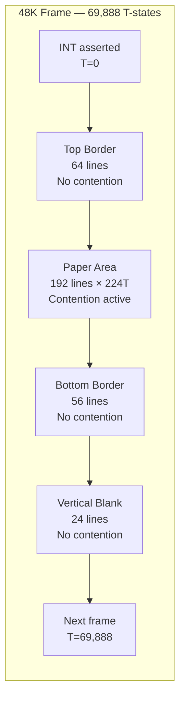
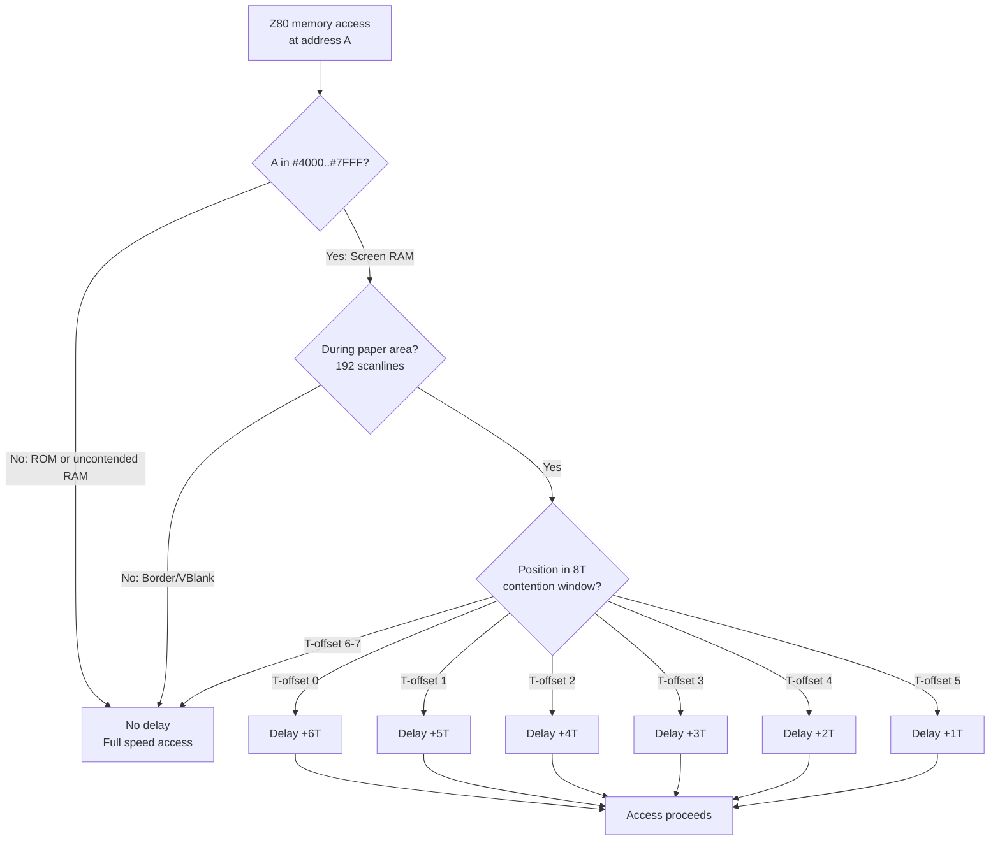
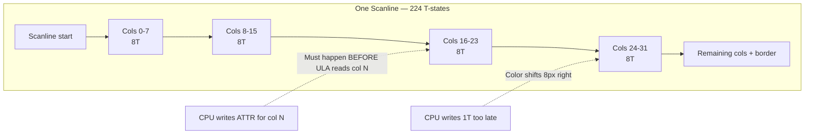

[← Home](../../README.md) · [Original Hardware](README.md)

# ULA Timing — Frame Structure, Memory Contention, Multicolor Constraints, and Per-Model Differences

The Ferranti ULA is the ZX Spectrum's video and glue-logic chip — and it dominates the machine's timing behavior. The ULA generates the video signal, derives the CPU clock, asserts the frame interrupt, and **steals bus cycles from the CPU** whenever it needs to read screen memory. This last behavior — **memory contention** — is the single most important timing constraint on the ZX Spectrum. It makes code in the upper 16K of RAM run slower during screen display, it makes instruction timing unpredictable without per-T-state accounting, and it makes multicolor effects (changing attributes mid-scanline) the hardest programming challenge on the platform.

This article covers everything the ULA imposes on the CPU's timing: **frame structure per model**, **the contention mechanism**, **multicolor constraints**, **early/late timing drift**, and **the performance budget**. For the Z80's own timing fundamentals — T-states, M-cycles, and per-instruction costs — see [z80_timing.md](../../01_cpu/z80_timing.md).

> [!NOTE]
> This article focuses on the **ULA's timing behavior** — how the ULA's video generation interacts with CPU execution. For the Z80's own bus timing (M-cycles, wait states, the WAIT pin), see [z80_timing.md](../../01_cpu/z80_timing.md). For contention's interaction with interrupts, see [z80_interrupts.md](../../01_cpu/z80_interrupts.md).

---

## Frame Timing — Per-Model

### ZX Spectrum 48K (PAL)

The 48K ULA generates a PAL video signal at **~50.08 Hz**:

| Parameter | Value | Notes |
|-----------|-------|-------|
| T-states per frame | **69,888** | 312 scanlines × 224 T-states/line |
| T-states per scanline | **224** | |
| Total scanlines | **312** | |
| Visible scanlines (border + paper) | **288** | 48 top border + 192 paper + 48 bottom border |
| Paper scanlines | **192** | |
| Top border | 64 lines (8 at top of frame + 56 top border) | |
| Bottom border | 56 lines | |
| Vertical blank | 24 lines | No ULA memory access |
| Interrupt asserted at T-state | **0** (start of frame) | |
| Interrupt duration | **32 T-states** | Must be acknowledged within this window |
| Screen RAM | `#4000`–`#57FF` (pixel), `#5800`–`#5AFF` (attributes) | |
| Contended range | `#4000`–`#7FFF` | Upper 16K of RAM |

```
Frame layout (48K, 69888 T-states):
┌─────────────────────────────────────────────┐ T=0
│ Interrupt asserted                          │
│ Top border (64 lines, no contention)        │
│                                             │
├─────────────────────────────────────────────┤ T=14335
│ Paper area (192 lines, contention active)   │
│ 224 T-states per line                       │
│ Contention pattern: 6,5,4,3,2,1,0,0...      │
│                                             │
├─────────────────────────────────────────────┤ T=57343
│ Bottom border (56 lines, no contention)     │
│                                             │
├─────────────────────────────────────────────┤ T=69864
│ Vertical blank (24 lines, no contention)    │
│                                             │
└─────────────────────────────────────────────┘ T=69888
  Next frame starts
```



### ZX Spectrum 128K / +2 (PAL)

| Parameter | Value | Difference from 48K |
|-----------|-------|---------------------|
| T-states per frame | **70,908** | +2,020 |
| T-states per scanline | **228** | +4 |
| Total scanlines | **311** | −1 |
| Contended range | RAM banks 1, 3, 5, 7 | Bank-based, not address-based |
| Contention start | T=14361 | T=14335 on 48K |

### ZX Spectrum +2A / +3 (PAL)

The +2A and +3 use an **Amstrad gate array** instead of the Ferranti ULA. The contention model is significantly different:

| Parameter | Value | Notes |
|-----------|-------|-------|
| T-states per frame | **70,908** | Same as 128K/+2 |
| T-states per scanline | **228** | Same as 128K/+2 |
| Contended pages | Banks 4, 5, 6, 7 | Different from 128K! |
| Contention type | Gate array — **MREQ only** | Less contention than Ferranti ULA |
| Contention pattern | **1,0,7,6,5,4,3,2** | Completely different from Ferranti's 6,5,4,3,2,1,0,0 |

The +2A/+3 contention pattern:

```
T-state offset:  0  1  2  3  4  5  6  7
Contention delay: 1  0  7  6  5  4  3  2
                 ↑↑               ↑
            Minimal delay    Maximum delay
```

Key differences from the Ferranti ULA:

1. **The pattern is shifted and inverted** — peak delay (7T) is at offset 2, not offset 0
2. **MREQ-only contention** — the gate array only delays memory requests (when MREQ is active). The Ferranti ULA delays on any access to the contended range, even without MREQ
3. **Different contended banks** — banks 4,5,6,7 instead of 1,3,5,7
4. **No early/late timing drift** — the gate array doesn't exhibit the thermal drift of the Ferranti ULA

> [!NOTE]
> The +2A/+3 contention pattern is often misunderstood. Many early emulators applied the Ferranti ULA's 6,5,4,3,2,1,0,0 pattern to the +2A/+3, causing subtle timing incompatibilities. For detailed per-instruction contention breakdowns, see the Sinclair Wiki "Contended Memory" article.

### Pentagon 128K (Soviet Clone)

| Parameter | Value | Notes |
|-----------|-------|-------|
| T-states per frame | **69,888** | Same as 48K |
| T-states per scanline | **224** | Same as 48K |
| Total scanlines | **312** | Same as 48K |
| Contention | **None** | Pentagon has no ULA — no contention at all |
| Interrupt timing | Same as 48K | |

> The Pentagon's lack of contention is a major difference. Code that relies on precise contention delays (multicolor effects) **will not work correctly on the Pentagon** — the timing will be off because there are no wait states. Conversely, the Pentagon is faster for CPU-intensive code that accesses `#4000`–`#7FFF`. For full clone timing details, see [clone_timing.md](../clones/clone_timing.md).

### Per-Model Frame Timing Comparison

| Model | T-states/frame | T-states/line | Lines | Contention | Screen position |
|-------|---------------|---------------|-------|------------|-----------------|
| 48K | 69,888 | 224 | 312 | `#4000`–`#7FFF` | Ferranti ULA |
| 128K / +2 | 70,908 | 228 | 311 | Banks 1,3,5,7 | Ferranti ULA |
| +2A / +3 | 70,908 | 228 | 311 | Banks 4,5,6,7 | Amstrad gate array |
| Pentagon | 71,680 | 224 | 320 | None | FPGA / discrete logic |
| NTSC 48K | 69,816 | 224 | ~311 | `#4000`–`#7FFF` | Ferranti ULA |

---

## Memory Contention — The ULA Bus Arbitration

Before diving into the details, here is the decision flowchart the ZX Spectrum 48K applies to every Z80 memory access:



### Why Contention Exists

The ZX Spectrum shares its **upper 16K of RAM** (`#4000`–`#7FFF`) between the Z80 CPU and the Ferranti ULA. The ULA reads this RAM to generate the video display — it needs **16 bytes per scanline** (8 attribute bytes + 8 pixel bytes) to produce 256 pixels of display. The ULA reads these bytes during each scanline's active display period.

The problem: **a single DRAM chip cannot serve two masters simultaneously**. When both the ULA and CPU want to access RAM on the same T-state, one must wait. The ULA **always wins** — if it didn't, the screen would corrupt. The CPU is paused via its **WAIT pin** until the ULA finishes its read.

### The Contention Pattern (48K)

During the paper display area (192 scanlines), the ULA reads screen memory in a repeating 8-T-state cycle. The contention delay depends on where in this cycle the CPU access falls:

```
T-state offset:  0  1  2  3  4  5  6  7
Contention delay: 6  5  4  3  2  1  0  0
                 ↑                    ↑↑
            Maximum delay        No delay (ULA idle)
```

- The pattern repeats every **8 T-states** within each scanline
- After the 8-T-state contention window, there are **no delays** for the remainder of the scanline
- The contention window starts at the beginning of each pixel display line
- Total: 128 T-states of potentially contended access per scanline, 96 T-states free

### What Gets Contended

| Access Type | Contended? | Notes |
|-------------|-----------|-------|
| Opcode fetch from `#4000`–`#7FFF` | **Yes** | The M1 cycle is delayed |
| Memory read from `#4000`–`#7FFF` | **Yes** | Any read operation |
| Memory write to `#4000`–`#7FFF` | **Yes** | Any write operation |
| Opcode fetch from `#0000`–`#3FFF` (ROM) | No | ROM is not shared with ULA |
| Memory access `#8000`–`#FFFF` | No | Lower 32K is uncontended |
| I/O port access | **Special** | See Contended I/O below |

### Contended I/O

I/O port access on the ZX Spectrum has special contention behavior. When accessing any port where **A0=0** (which includes the ULA port `#FE`), the ULA may insert wait states:

- The Z80's I/O instructions already have one built-in wait cycle (automatic Tw)
- The ULA adds **additional contention** on top of this wait cycle
- The exact contention depends on the T-state position within the scanline

For the 48K ULA: accessing port `#FE` (or any port with A0=0) during the display area adds the same contention pattern as memory access.

### Contention Example (48K)

```z80
; Code executing at PC=#4500 (contended memory) at T-state 14335
LD   (HL),A       ; Normal cost: 7 T-states

; What actually happens:
; T=14335: Start M1 opcode fetch from #4500 — contention delay 6T
; T=14341: M1 completes (4T)
; T=14345: Memory write to (HL) — contention delay 4T  
; T=14349: Write completes (3T)
; T=14352: Total cost = 17T instead of 7T!
```

Compare with code at an uncontended address:

```z80
; Code executing at PC=#8000 (uncontended memory) at T-state 14335
LD   (HL),A       ; If HL points to contended memory:
; T=14335: M1 fetch from #8000 — no contention delay (4T)
; T=14339: Memory write to (HL) — contention delay 2T
; T=14341: Write completes (3T)
; T=14344: Total cost = 9T instead of 7T

; If HL points to uncontended memory too:
; T=14335: M1 fetch — 4T
; T=14339: Memory write — 3T (no contention)
; T=14342: Total cost = 7T (normal)
```

> [!WARNING]
> Contention depends on **both** the instruction address AND the data address. Code in ROM (`#0000`–`#3FFF`) is not contended on opcode fetch, but if it accesses screen memory (`#4000`–`#7FFF`), the data access IS contended. Code in screen memory is contended on both fetch and data access — potentially double contention.

---

## Snow Effect — DRAM Refresh / ULA Bus Collision

During the paper area, the ULA fetches screen bytes from RAM continuously — two memory accesses every 8 T-states (one pixel byte, one attribute byte). Most of the time the ULA wins the bus and the CPU is stalled by contention. But during the Z80's **DRAM refresh cycle**, the CPU drives the address bus with the current value of the **`I` (interrupt vector) and `R` (refresh) registers** (`I` as high byte, `R` as low byte). If that address lands in the ULA's display area, both chips drive the bus simultaneously.

The visible result is **snow**: random single-byte corruption of the bitmap or attribute stream, appearing as bright speckles along the raster.

### When Snow Occurs

| `I` register value | Points to | Snow? |
|-------------------|-----------|-------|
| `I < #40` | ROM | **No** — ROM is not on the shared bus |
| `#40 <= I <= #7F` | Screen RAM (`#4000`–`#7FFF`) | **Yes** — ULA and CPU both drive the DRAM bus |
| `#80 <= I <= #BF` (48K) | Uncontended RAM (`#8000`–`#BFFF`) | **No** — different physical RAM |
| `#C0 <= I <= #FF` (128K) | Banked RAM at `#C000` | **Depends** — snow appears if the visible screen bank (5 or 7) is paged there |

### Per-Machine Snow Behavior

| Machine | Snow? | Notes |
|---------|-------|-------|
| ZX Spectrum 48K / 128K / +2 / +3 | **Yes** | Classic Sinclair ULA arbitration produces snow when `I >= #40` |
| Pentagon 128K / 1024 | **No** | Different memory access scheme, no contention, no refresh/ULA conflict |
| Scorpion ZS-256 | **No** | Same as Pentagon — discrete logic, no bus conflict |
| Most Soviet/Eastern European clones | **No** | Many use discrete logic replacing the ULA and don't reproduce the bus arbitration quirk |
| ZX Spectrum Next | **Not by default** | Contention is emulated in configurable modes; snow is not emulated by default |
| Emulators (Fuse, ZEsarUX, CSpect) | **Optional** | Many do not model snow; those that do usually offer it as a toggle |

### Practical Implications

1. **Avoid snow**: Keep `I < #40` (the BASIC ROM convention). The ROM's interrupt vector table at `#3C00`–`#3FFF` ensures no snow during normal operation.

2. **Snow as a bug source**: Programs tested only on Pentagon (no snow) may have latent bugs — setting `I` into `#4000`–`#7FFF` causes corruption on real Sinclair hardware.

3. **Snow as a demo effect**: Some demos intentionally set `I` into the display file to produce free animated noise — the snow effect costs zero CPU time.

---

## Early vs. Late Timing

On Ferranti ULA-based machines (48K, 128K, +2), there is a phenomenon known as **early timing** vs. **late timing**:

- **Early timing**: Contention starts at the documented T-state values
- **Late timing**: All contention T-state values are shifted by **+1 T-state**

The cause: as the Ferranti ULA chip heats up during operation, its internal timing drifts slightly. A cold machine uses early timing; after running for a while, it transitions to late timing.

| State | When | Contention Start |
|-------|------|-----------------|
| Early | Cold start, first few minutes | T=14335 |
| Late | After warming up | T=14336 |

> [!WARNING]
> This means multicolor effects that work perfectly on a cold 48K Spectrum may be off by 1 T-state (8 pixels) on a warm one. Emulators typically offer an "early/late timing" toggle. The Amstrad gate array models (+2A, +3) do **not** exhibit this drift.

---

## Why Precision Matters — Multicolor Effects

### The Problem

The ZX Spectrum's screen has a fixed color resolution of **8×8 pixel attribute cells**. Each cell has one ink color and one paper color. Within a cell, you cannot change colors. This is the infamous **color clash**.

**Multicolor effects** defeat this limitation by changing the attribute bytes **mid-scanline** — the CPU writes new colors to the attribute file while the ULA is drawing the current scanline. If you change `ATTR` at exactly the right T-state, the ULA reads the new color for the next pixel group.

### The Timing Constraint

On a 48K ZX Spectrum:
- Each scanline is **224 T-states**
- The ULA reads 32 attribute bytes per scanline (for 32 columns)
- Each attribute byte covers 8 pixels = **8 T-states of display time** (approximately)
- To change the color of column N, you must write the new attribute **before the ULA reads that column's attribute byte**
- The window is approximately **1 T-state wide**

This means: **a timing error of even 1 T-state shifts the color change by 8 pixels.** Multicolor effects require absolute T-state precision.



### How Contention Affects Multicolor

Contention makes multicolor programming **extremely difficult** because:

1. You cannot predict exact T-state positions without accounting for contention
2. Different code addresses (contended vs. uncontended) execute at different speeds
3. Self-modifying code in contended memory has unpredictable write timing
4. The contention pattern varies per scanline position

The standard approach: **run your multicolor routine from uncontended ROM or upper RAM**, and carefully count T-states including all contention delays on screen memory writes.

### Real-World Example: Bifrost²

Bifrost² (by Einar Saukas) is a multicolor engine that displays 16×16 pixel tiles in 8 colors per tile. It achieves this by:

1. Synchronizing with the interrupt to know the exact T-state
2. Running the core loop from uncontended memory
3. Pre-computing attribute changes and their exact T-state positions
4. Using precise `NOP` padding to align writes to the correct T-state
5. Accounting for contention on every screen memory write

The result: **up to 512 independent color cells per screen** instead of the normal 768 cells with only 2 colors each.

---

## Timing-Sensitive Code Patterns

### Interrupt Synchronization

The first step for any timing-sensitive code is to synchronize with the frame interrupt:

```z80
; Wait for interrupt (IM 1 mode)
HALT               ; Wait until INT fires — Z80 halts here
; At this point we're at approximately T-state 0 of the frame
; "Approximately" because HALT wakes up 4T after the interrupt,
; and there may be contention from the previous instruction

; Precise sync: wait for a specific scanline
LD   BC,#7FFE      ; Port address for keyboard row
loop:
INC  B             ; Waste time to align...
DJNZ loop          ; ...to exact T-state position

; Now execute timing-critical code
LD   A,#2          ; New attribute (RED ink, BLACK paper)
LD   (#5800),A     ; Write attribute at column 0, row 0
```

### Timing Padding

When you need code to execute at an exact T-state, you pad with `NOP` (4T) and other fixed-time instructions:

```z80
; Pad to specific T-state count
NOP                ; +4T
NOP                ; +4T
NOP                ; +4T
LD   A,#7          ; +7T (4T fetch + 3T immediate read)
; Total: 19T of padding
```

### The Contention-Aware Loop

```z80
; Fill one scanline of attributes (32 bytes) with precise timing
; Running from uncontended memory, writing to contended screen RAM
LD   HL,#5800      ; Attribute file start
LD   A,#42         ; Color to write
LD   B,#32         ; 32 columns
fill:
LD   (HL),A        ; Write attribute — contended! (7T + variable)
INC  HL            ; Next position — 6T, no contention (HL not in screen range yet)
DJNZ fill          ; 13T/8T — B decrement + conditional jump
```

---

## Performance Budget

### How Much CPU Time Do You Have?

At 3.5 MHz with 69,888 T-states per frame:

| Activity | T-states | % of Frame |
|----------|----------|------------|
| Full frame budget | 69,888 | 100% |
| One scanline | 224 | 0.32% |
| Screen display (192 lines) | 43,008 | 61.5% |
| Non-display time | 26,880 | 38.5% |
| Interrupt handler (typical) | 50–200 | 0.07–0.29% |

### Throughput Reference

| Operation | T-states/byte | Throughput at 3.5 MHz |
|-----------|--------------|----------------------|
| `LDIR` | 21 | 166 KB/s |
| `LDI` manual loop | 26 | 134 KB/s |
| `LD (HL),r` + INC HL | 13 | 269 KB/s |
| `LD r,(HL)` + INC HL | 13 | 269 KB/s |
| `LDIR` filling screen (6144 bytes) | 21 | ~129,024 T-states = 1.85 frames |
| `LD (HL),A` loop filling screen | 13 | ~79,872 T-states = 1.14 frames |
| `LDIR` filling full RAM (48K) | 21 | ~1,032,192 T-states = 14.77 frames |

### Screen Update Timing

The full pixel display is 6144 bytes (`#4000`–`#57FF`). Attributes are 768 bytes (`#5800`–`#5AFF`).

| Method | T-states | Frames | Notes |
|--------|----------|--------|-------|
| `LDIR` fill pixels | 129,024 | 1.85 | Too slow for 50 Hz update |
| `LDIR` fill attributes | 16,128 | 0.23 | Fast enough for 50 Hz |
| Unrolled `LD (HL),A` + INC HL | 79,872 | 1.14 | Still more than 1 frame |
| Stack-based fill (PUSH x N) | ~24,576 | 0.35 | Fastest screen fill method |

---

## Best Practices

1. **Count T-states for all timing-critical code** — write the count in comments next to each instruction.
2. **Run multicolor code from uncontended memory** — ROM (`#0000`–`#3FFF`) or upper RAM (`#8000`–`#FFFF`).
3. **Account for contention on every screen memory access** — use the contention pattern table to calculate actual T-states.
4. **Synchronize with the interrupt** — use `HALT` or a polling loop to establish a known T-state baseline.
5. **Pad with exact-cost instructions** — `NOP` (4T), `LD A,A` (4T), `OR A` (4T) are your alignment tools.
6. **Test on real hardware** — emulators are getting better, but contention behavior still differs subtly.
7. **Design for the slowest target** — if your code must run on both 48K and 128K, calculate timing for both (different frame sizes).
8. **Prefer uncontended access patterns** — read data from upper RAM, write results to screen RAM in a single batch.

---

## Antipatterns

### The Contention Ignorer

```z80
; BAD: Ignoring contention when calculating timing
; "I need exactly 224 T-states for this scanline effect"
LD   B,#28         ; 40 iterations
loop:
LD   (HL),A        ; 7T (says the manual)
INC  HL            ; 6T
DJNZ loop          ; 13T
; Calculated: 28 × (7+6+13) = 728T → WAY more than 224T/scanline!
; AND the actual cost is HIGHER because of contention on LD (HL),A
```

```z80
; GOOD: Account for contention in uncontended code
; Run this from ROM, with HL pointing to screen
; Each (HL) write costs 7T base + 0-6T contention
; Use NOP padding to align, test on real hardware
```

### The Wrong Model Assumption

```z80
; BAD: Assuming 48K timing on a 128K machine
; 48K: 224 T-states/line, contention starts at T=14335
; 128K: 228 T-states/line, contention starts at T=14361
; Code that works on 48K will be 4T/line off on 128K!
```

```z80
; GOOD: Detect model and adjust
LD   A,(#5C5C)     ; Read FLAGS system variable
BIT  4,A           ; Test bit 4 = 128K flag
JR   Z,is_48k      ; 0 = 48K mode
; Use 128K timing constants
```

### The Pentagon Timing Trap

```z80
; BAD: Multicolor effect designed with 48K contention
; On Pentagon: NO contention → code runs FASTER
; All carefully timed writes happen EARLIER than expected
; Result: colors shifted left by many pixels
```

```z80
; GOOD: Detect Pentagon and adjust timing
; Pentagon has no ULA → no contention → NOP padding needed differs
; Many demos have separate code paths for Pentagon vs. 48K
```

---

## Historical Context

### Why the ZX Spectrum Has Contention

The ZX Spectrum was designed to be as cheap as possible. The Ferranti ULA (Uncommitted Logic Array) consolidated most of the machine's logic into a single custom chip. To minimize chip count:

- **No dedicated video RAM** — the screen shares main RAM with the CPU
- **No bus arbitration logic** — the ULA simply pauses the CPU when it needs the bus
- **No DMA controller** — the ULA reads screen memory directly, stealing cycles

This was a common cost-saving measure in 1982. The Commodore 64 used dedicated VIC-II video RAM; the BBC Micro used a 6845 CRTC with proper bus arbitration. Both were more expensive and more complex.

The Commodore 64 had **no CPU contention** for screen memory (separate RAM), but had badlines (VIC-II steals 40 cycles per scanline every 8 lines for character fetch). The ZX Spectrum's contention is more evenly distributed — 6,5,4,3,2,1,0,0 per 8-T-state window — but affects ALL code in the upper 16K.

### Modern Analogy

| ZX Spectrum Concept | Modern Equivalent |
|---------------------|-------------------|
| T-state counting | GPU shader cycle counting for demoscene effects |
| Memory contention | Cache miss penalties (but deterministic, not probabilistic) |
| ULA bus stealing | DMA transfers competing with CPU for memory bandwidth |
| Multicolor timing | V-sync raster effects, scanline tricks |
| Frame budget | Frame time budget in game engines (16.67ms at 60 FPS) |
| Contended memory | NUMA remote memory access latency on multi-socket servers |

---

## Impact on Emulation and FPGA

1. **Contention must be modeled per-T-state, not per-instruction** — the delay depends on the exact T-state within the scanline, not just whether the instruction touches contended memory. An instruction that spans multiple T-states may be contended on some T-states but not others.

2. **The instruction breakdown matters** — each Z80 instruction's internal M-cycle sequence determines which T-states perform memory accesses. `LD A,(HL)` is: fetch (4T, contended if PC in `#4000`+), then read (3T, contended if HL in `#4000`+). The contention applies to each memory-accessing T-state independently.

3. **I/O contention is different from memory contention** — the ULA contends I/O differently: the automatic wait cycle of I/O instructions interacts with ULA contention. See the Sinclair Wiki contended I/O reference.

4. **Early/late timing must be configurable** — emulators should offer both modes for 48K/128K. The +2A/+3 gate array does not have this issue.

5. **Pentagon emulation needs zero contention** — many emulators default to Pentagon with contention disabled, which is correct.

6. **The floating bus** — when the CPU reads from uncontended memory while the ULA is reading screen memory, the CPU may receive the byte the ULA just read. This "floating bus" behavior is yet another timing-dependent feature used by some programs for synchronization.

---

## References

- **Sinclair Wiki, "Contended Memory"** ([sinclair.wiki.zxnet.co.uk](https://sinclair.wiki.zxnet.co.uk/wiki/Contended_memory)) — Definitive contention reference with per-instruction breakdown
- **World of Spectrum, "48K Technical Reference"** ([worldofspectrum.org](https://worldofspectrum.org/faq/reference/48kreference.htm)) — Frame timing, memory map, ULA behavior
- **Chris Smith, "The ZX Spectrum ULA: How to design a microcomputer"** — Hardware-level explanation of ULA bus arbitration
- **Ramsoft, "The Complete ZX Spectrum Fault-Logging ROM Test"** — Real hardware timing measurements
- **Bedazzle, "SpectraLab — ZX Spectrum Graphics Guide"** ([github.com/Bedazzle/SpectraLab](https://github.com/Bedazzle/SpectraLab)) — Snow effect per-machine behavior, DRAM refresh bus collision details
- **Einar Saukas, "Bifrost² Multicolor Engine"** — Practical multicolor implementation with T-state counting

### Cross-References

- [z80_timing.md](../../01_cpu/z80_timing.md) — Z80-intrinsic timing: T-states, M-cycles, bus timing, per-instruction costs
- [clone_timing.md](../clones/clone_timing.md) — Clone video timing: Pentagon, Scorpion, Kay, ATM Turbo, FPGA implementations
- [z80_instruction_set.md](../../01_cpu/z80_instruction_set.md) — Per-instruction T-state costs
- [z80_interrupts.md](../../01_cpu/z80_interrupts.md) — Interrupt timing, contention during interrupt handling
- [z80_undocumented.md](../../01_cpu/z80_undocumented.md) — How prefix bytes affect T-state counts
- [z80_architecture.md](../../01_cpu/z80_architecture.md) — CPU internal structure and bus interface
- [io_port_map.md](../../08_references/io_port_map.md) — Complete I/O port reference with per-model decoding bitmasks
