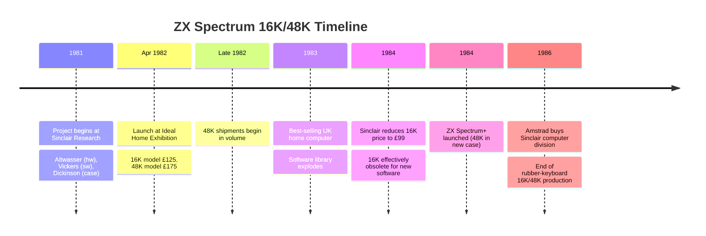
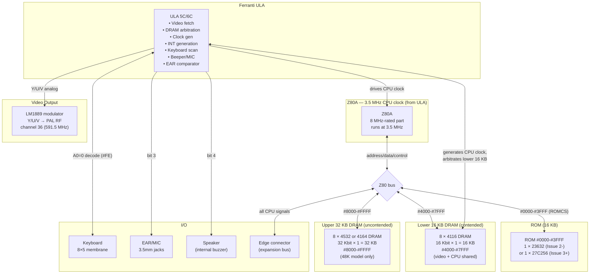
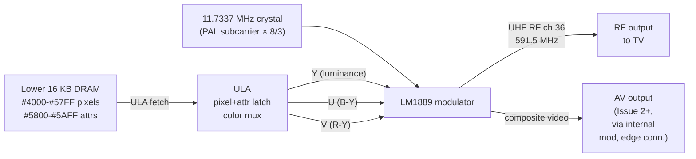

[← Home](../../README.md) · [Original Hardware](README.md)

# ZX Spectrum 16K / 48K — The Canonical Sinclair: Architecture, Board Issues, and the Rubber-Keyboard Machine That Defined a Platform

The **ZX Spectrum 16K** (launched 23 April 1982, £125) and its **48K** sibling (£175, or £70 for the upgrade kit) are not just the original Sinclair Spectrums — they are the **reference implementation** against which every later model, clone, emulator, and FPGA core is measured. When demoscene coders say "Spectrum timing" they mean the 48K's 69,888-T-state, 312-line, 50.08 Hz frame; when Russian engineers say "Spectrum" they mean a TTL reimplementation of this exact machine's video controller; when the *Fuse* emulator reports "100% accurate" it means it matches this exact Ferranti ULA.

The design is famous for its **economy**. A 48K Spectrum motherboard carries barely a dozen large ICs — a Z80A, one or two ROMs, eight `4116` DRAMs for the lower 16 KB, eight `4532`/`4164` DRAMs for the upper 32 KB, a Ferranti ULA, an LM1889 color modulator, a 7805 regulator, a handful of TTL glue, and the keyboard. There is no sound chip, no video chip, no I/O chip, no memory controller in the modern sense: the ULA does **all four jobs**. The cost was a machine with no sprites, no hardware scroll, no per-cell 8×1 color, and a CPU that is repeatedly stalled by the video logic — but the price was £125 and the rest is history.

This article covers the 16K/48K as a **system**: history, board issues, bill of materials, memory map, video and audio signal chain, tape interface, expansion bus, and the differences between the 16K and 48K variants. For the **internal architecture of the ULA** itself, see [ULA Architecture](ula_architecture.md); for **frame timing and contention**, see [ULA Timing](ula_timing.md); for the **keyboard matrix**, see [keyboard_matrix.md](keyboard_matrix.md). The programmer-facing view of memory and ports is in [48K Memory & I/O](../../05_development/03_memory_and_io/memory_and_io_48k.md).

---

## History and Launch

### The ZX Spectrum Project (1981–1982)

After the success of the ZX81, Sinclair Research began work on its successor in mid-1981. The design goals were set by Clive Sinclair's commercial philosophy: **the cheapest possible color home computer**. Where the Commodore 64 (launched August 1982, £299 at introduction) was designed around two large custom chips (VIC-II video, SID audio) with sprite support, hardware collision, scroll, and a three-voice synthesiser, the Spectrum was designed around the question *"what is the minimum hardware that can produce color graphics and run real software?"* The answer was: one Z80A, one ROM, one Ferranti ULA, some DRAM, and almost nothing else.

The Spectrum was designed by a small team at Sinclair Research:

| Designer | Responsibility |
|---|---|
| **Richard Altwasser** | Hardware — the ULA architecture, the PCB, the memory map, the expansion bus |
| **Steve Vickers** | Software — the 16 KB ROM (BASIC interpreter, editor, calculator, tape, I/O) |
| **Rick Dickinson** | Industrial design — the rubber-keyboard case, later the ZX Spectrum+ and QL cases |

The ULA was the project's defining decision. Ferranti had supplied the simpler `2C158E` ULA for the ZX81 (a single chip that absorbed the ZX80's discrete TTL logic and added an NMI-generation circuit for the display-blank-during-computation trick). For the Spectrum, Altwasser expanded this approach into a far more ambitious gate array that handled video generation, DRAM arbitration, keyboard, tape, and the beeper — collapsing what would have been 30–40 TTL chips onto one die. The trade-off was that Ferranti's ULA process could not provide sprites, smooth scroll, or hardware graphics acceleration: every pixel on a Spectrum is the result of the CPU writing a byte to a contended framebuffer.

### Launch and Reception (23 April 1982)

The ZX Spectrum was announced on 23 April 1982 and demonstrated at the Ideal Home Exhibition in London. Orders opened the same day. The initial product line was:

| Model | Price (launch) | RAM | Notes |
|---|---|---|---|
| **ZX Spectrum 16K** | £125 | 16 KB | Entry model — no upper RAM fitted |
| **ZX Spectrum 48K** | £175 | 48 KB | Full model — 16 KB lower + 32 KB upper RAM |
| **16K → 48K upgrade kit** | £60 | +32 KB | User-installed internal upgrade |

The 16K model shipped first, with a backlog of tens of thousands of orders building through the summer and autumn of 1982. The 48K model followed later in the year. The £60 upgrade kit contained the eight `4532` (or `4164`) DRAMs plus the TTL multiplexing chips required for the upper 32 KB bank — see [16K → 48K Upgrade](#16k--48k-upgrade-path) below for the install procedure.

The Spectrum's success was immediate and durable. By 1983 it was the best-selling home computer in the UK; by 1985 it had outsold the C64 in Europe by a wide margin. Its cultural reach — through thousands of magazine type-in listings, a software library estimated at over 10,000 commercial titles, and a Soviet clone ecosystem that produced millions of units — far exceeded what its modest hardware would have predicted.

### Why the 48K Became the Reference

The 16K Spectrum was the price-leader, but software outgrew it almost immediately. By 1983, major commercial releases such as *Manic Miner* (1983) and *Jet Set Willy* (1984) required 48K, and by 1984 the 16K model was effectively obsolete. The **48K Spectrum** therefore became the machine for which essentially all Spectrum software was written, and its hardware characteristics — the 69,888-T-state frame, the `#4000`–`#7FFF` contended range, the floating bus, the 32 KB upper RAM with separate TTL multiplexing — became the canonical "Spectrum timing" that everything else had to match.



---

## System Architecture

The 16K/48K Spectrum is organized around a single bus and a small number of bus masters. The Z80 is the only programmable processor; the ULA is the only other device that can drive the lower 16 KB of DRAM (during video fetch). Everything else — keyboard, tape, beeper, border — is reached through one I/O port (`#FE`).



Key observations from the diagram:

- **The ULA generates the Z80's clock** and can stretch it — this is the physical mechanism behind memory contention. The Z80 does not free-run.
- **The lower 16 KB is dual-master** (CPU + ULA video fetch); the upper 32 KB is CPU-only. Only `#4000`–`#7FFF` is contended.
- **ROM, RAM, and the expansion bus share one address/data/control bus.** The ULA does not gate ROM or upper-RAM accesses; only the lower 16 KB is arbitrated.
- **Everything user-facing — keyboard, tape, beeper, border — is one I/O port.** There is exactly one I/O register inside the ULA, decoded by `A0=0`.

---

## Bill of Materials

The 48K Spectrum's IC inventory is famously small. A complete Issue 4A–6A 48K board carries roughly:

| IC | Qty | Function | Notes |
|---|---|---|---|
| **Zilog Z80A** (or Z0840004PSC / NEC μPD780C-1 / SGS Z8400AB1) | 1 | CPU | 8 MHz-rated part run at 3.5 MHz |
| **Ferranti ULA `6C001E-7`** (Issue 4A+) | 1 | Video, DRAM ctrl, I/O, sound | Earlier issues use `5C102E`, `5C112E`, `6C001E-5/-6` — see [ULA revisions](#ula-revisions-and-board-issues) |
| **ROM** | 1 | 16 KB BASIC OS | Issue 1–2 used a mask ROM (`23632`, 2364-equivalent 8 KB × 2 or 16 KB × 1); Issue 3+ used a `27C256` (32 KB EPROM with half unused) or a mask part |
| **4116 DRAM** (`4116`, `MCM4116`, `TMS4116`, `MB8116E`) | 8 | Lower 16 KB | 16 Kbit × 1, organized as **16 KB × 8 bits**. **Three supply rails: +5V, +12V, −5V.** The −5V rail is the infamous failure point of the 4116 |
| **4532 or 4164 DRAM** | 8 | Upper 32 KB (48K only) | 32 Kbit × 1 (`4532`, a partial-spec `4164`) or 64 Kbit × 1 (`4164`, half unused). **Single +5V rail** — far more reliable than the 4116 |
| **LM1889** (National Semiconductor) | 1 | Video modulator / color encoder | Combines Y (luminance) + U/V (color difference) into PAL RF on UHF channel 36 (591.5 MHz). Driven by ULA's analog peripheral cells |
| **7805** regulator | 1 | +5V linear regulator | TO-220 package; dissipates ~2W; gets hot |
| **7905** regulator (Issue 1 only) | 1 | −5V regulator | Removed from Issue 2+ in favor of a simpler zener-derived −5V |
| **74LS00, 74LS02, 74LS04, 74LS08, 74LS32, 74LS157, 74LS158** | a handful | Address multiplexing, ROMCS generation, wait logic | Glue logic |
| **BC184 / BC214 / ZTX313 transistors** | several | Video output amp, speaker driver, EAR signal conditioning | Issue 2+ has TR6 ("spider mod") for floating-bus behavior |

### The 4116 DRAM Problem

The 8 × `4116` chips that form the lower 16 KB are the single most common hardware failure on a 48K Spectrum today. The `4116` was the dominant 16 Kbit DRAM of the late 1970s and was used in countless computers and arcade machines — but it has three traits that make it fragile:

1. **Three supply rails** — +5V, +12V, and −5V. If any rail is missing or out of sequence at power-up (the −5V is particularly critical), the chip can be permanently damaged.
2. **`Vbb` (−5V) bias requirement** — the substrate bias must be present before `Vdd` (+12V); otherwise the chip enters latch-up. The Spectrum has no proper power-sequencing circuit; in practice the rails come up roughly together, but a flaky 7805/7905 or a failing decoupling capacitor can break the sequence.
3. **Heat** — the 4116 dissipates more power than later single-rail DRAMs, and runs noticeably warm even when healthy.

**Diagnostic symptom of failing 4116 RAM:** RAM-cleared but with garbage pixels in the lower 16 KB, or a Spectrum that boots to random colored squares and crashes immediately. The standard repair is socket-and-replace — fit a turned-pin socket and swap chips one at a time until the bad one is found. A modern repair often replaces all eight with new-old-stock `4116` parts or fits a replacement SRAM adaptor that emulates the 4116 on a single +5V rail.

> [!CAUTION]
> **Never power up a 48K Spectrum with the lower 16 KB RAM socket empty or partial** — the missing −5V load on the floating rail can damage the regulator and surrounding decoupling capacitors. Always populate all 8 sockets or fit a known-good working bank.

---

## Memory Map

The 16K and 48K Spectrums share an identical memory map in the lower 48 KB; the 48K adds the upper 16 KB. The map is hardwired by address decoding logic and is **not banked** — there is no `#7FFD` or paging register on the original Sinclair 16K/48K models.

```
            16K model                          48K model
   #FFFF ┌─────────────────┐             #FFFF ┌─────────────────┐
         │      (empty)    │                   │                 │
         │   not present   │                   │  Upper 32 KB    │
         │      on 16K     │                   │  DRAM (4532/    │
         │                 │                   │  4164)          │
         │                 │                   │   #8000-#FFFF   │
         │                 │                   │  uncontended    │
   #8000 ├─────────────────┤             #8000 ├─────────────────┤
         │                 │                   │                 │
         │   Lower 16 KB   │                   │  Lower 16 KB    │
         │       DRAM      │                   │       DRAM      │
         │  8 × 4116       │                   │  8 × 4116       │
         │   #4000-#7FFF   │                   │   #4000-#7FFF   │
         │  contended !    │                   │  contended !    │
         │                 │                   │                 │
   #4000 ├─────────────────┤             #4000 ├─────────────────┤
         │                 │                   │                 │
         │   16 KB ROM     │                   │   16 KB ROM     │
         │  BASIC OS +     │                   │  BASIC OS +     │
         │  character set  │                   │  character set  │
         │   #0000-#3FFF   │                   │   #0000-#3FFF   │
         │                 │                   │                 │
   #0000 └─────────────────┘             #0000 └─────────────────┘
```

### Subdivision of the Lower 16 KB

The `#4000`–`#7FFF` range is the most heavily used and most heavily documented block on the machine. From the programmer's view, it is divided as follows:

| Range | Size | Contents | Notes |
|---|---|---|---|
| `#4000`–`#57FF` | 6,144 B | **Pixel (display) file** | 256×192 pixel bitmap, 1 byte = 8 pixels — see [Screen Layout](../../05_development/03_memory_and_io/screen_layout.md) |
| `#5800`–`#5AFF` | 768 B | **Attribute file** | 32×24 attribute bytes (INK/PAPER/BRIGHT/FLASH per 8×8 cell) |
| `#5B00`–`#7FFF` | ~9.5 KB | **Free RAM** (BASIC workspace, printer buffer, system variables, machine code) | Bottom portion holds the 182-byte system variables block (`#5C00`–`#5CB5`) and the channel/stream workspace; the rest is the BASIC program area, variables, and the user's machine code |

The system variables at `#5C00`–`#5CB5` are the ROM's persistent state — the FRAMES counter, keyboard buffer pointers, CHARS pointer (defaulting to `#3C00` to point at the ROM font at `#3D00`–`#3FFF`), and similar. See [system_variables.md](../../04_operating_systems/system_variables.md) for the complete table.

### ROM Address Space

The ROM occupies `#0000`–`#3FFF` (16 KB) and is **always mapped** in this range — there is no mechanism on the 16K/48K to page it out or substitute a different ROM bank. (The 128K introduced ROM banking, and Soviet clones added their own banking schemes.) The ROM contains:

- Reset vector and cold-start initialisation (`#0000`)
- RST entry points (`#0008`, `#0010`, `#0018`, `#0020`, `#0028`, `#0030`)
- IM1 interrupt handler (`#0038`)
- NMI handler (`#0066`)
- Keyboard scan and decode (`#028E`)
- Beeper routine (`#03B5`)
- Cassette tape load/save routines (`#04C2`, `#056C`, etc.)
- Character printing and screen handling (`#0EDF` CLS, `#0E9B` CLALL, etc.)
- Floating-point calculator (`#1A9C` calculator tables, `#1098` engine)
- BASIC tokeniser, parser, interpreter (`#1D9C`, `#24FB`)
- Editor and channel/stream management (`#24FC`)
- 96 character pixel patterns (`#3D00`–`#3FFF`, 768 bytes)

The complete ROM map with every routine's address is in [rom_48k.md](../../04_operating_systems/rom_48k.md); the character set and font layout are covered in [character_set.md](../../10_references/character_set.md).

---

## ROM and the ULA `ROMCS` Signal

The ROM is enabled by the ULA's `ROMCS` output, which is asserted when the CPU places an address in the range `#0000`–`#3FFF` on the bus (i.e. `A14=0 AND A15=0`) AND `/MREQ` is low. The same signal is available on the edge connector so that external devices can disable the internal ROM and substitute their own — this is how the Interface 1's RS-232/printer ROM, the Microdrive ROM, and shadow-Monitor clones (Scorpion, Kay) take control of the address space.

The 16K/48K has **no software mechanism** to disable the ROM: there is no `#7FFD` paging register and no `ROMCS` write port. To disable the ROM you have to pull the physical `ROMCS` pin (edge connector pin 25B) low with external hardware. This was a deliberate simplification — bank-switching was added only on the 128K — and it shaped the entire Soviet clone ecosystem: when Russian designers wanted to add a TR-DOS shadow ROM, they had to build their own banking logic from scratch.

---

## RAM and Address Multiplexing

### Lower 16 KB — The Contended Bank

The lower 16 KB DRAM (`#4000`–`#7FFF`) is the most important bank on the machine, because it is **shared between the CPU and the ULA's video fetch**. The ULA is also this bank's DRAM controller: it multiplexes the 14-bit CPU address onto the 7 address pins of the `4116` chips and generates `/RAS` (row-address strobe) and `/CAS` (column-address strobe).

Because the video fetch is hard-wired to read from this bank, the ULA must arbitrate every CPU access. The mechanism is **clock stretching**: the ULA generates the Z80's 3.5 MHz CPU clock and **stalls it when a CPU access to `#4000`–`#7FFF` collides with a video fetch cycle**. This is the physical basis of memory contention — see [ULA Architecture § Memory Arbitration](ula_architecture.md#memory-arbitration--how-the-ula-steals-the-bus) for the cycle-by-cycle detail and [Contention Model](../../05_development/03_memory_and_io/contention_model.md) for the per-address contention pattern.

### Upper 32 KB — The Uncontended Bank

The upper 32 KB (`#8000`–`#FFFF`) on the 48K model uses a **completely separate DRAM bank** with its own TTL address multiplexing (typically `74LS157`/`74LS158` multiplexers). The ULA never reads this bank for video, so the CPU has **uncontended access** — code running here runs at full speed regardless of beam position. This is why almost all timing-critical Spectrum code (game engines, demos, ISRs, music players) is placed in upper RAM whenever possible.

The upper bank is built from 8 × `4532` (32 Kbit × 1, essentially hand-sorted `4164` parts) or 8 × `4164` (64 Kbit × 1, half the capacity unused). The `4164` is a single-+5V-rail part and is dramatically more reliable than the triple-rail `4116`.

### The 16K Model's Empty Upper Bank

On the 16K Spectrum the upper bank is **physically absent** — no DRAM chips and no multiplexing TTL are fitted. Address reads from `#8000`–`#FFFF` return whatever the data bus floats to (typically `#FF` on a healthy machine, but undefined). The ROM's cold-start code detects RAM size by writing and reading back a pattern at progressively higher addresses and stops when the read fails — on a 16K machine this returns `#7FFF`, on a 48K machine `#FFFF`. The detected value is stored in the `P_RAMT` system variable at `#5CB4` and is used by BASIC's memory allocator.

---

## ULA — Summary and Cross-References

The Ferranti ULA dominates the machine's behavior so completely that it has its own deep-dive article. This section gives the high-level summary; for everything else, follow the cross-references.

The ULA's jobs on the 16K/48K:

| Job | What it does |
|---|---|
| **Clock generation** | Divides the 14 MHz master crystal into 7 MHz pixel clock and 3.5 MHz CPU clock; can stretch the CPU clock for contention |
| **Video generation** | Reads pixel + attribute bytes from DRAM, shifts to 7 MHz pixel stream, applies attribute (INK/PAPER/BRIGHT/FLASH), generates Y/U/V analog outputs |
| **Sync generation** | Generates HSYNC, VSYNC, and blanking signals for the LM1889 modulator; produces PAL frame at ~50.08 Hz |
| **DRAM control** | Generates `/RAS` and `/CAS` for the lower 16 KB; performs address multiplexing |
| **Memory arbitration** | Stalls the CPU during video fetch of `#4000`–`#7FFF` |
| **Interrupt generation** | Pulls `/INT` low for 32 T-states at the start of each frame (T-state 0 by convention) |
| **Keyboard scanning** | Reads 5 column inputs; row select comes from CPU address bus A8–A15 |
| **`#FE` I/O register** | Border color, beeper, MIC output (writes); keyboard + EAR input (reads) |
| **Tape I/O** | EAR analog comparator (input), MIC driver (output) — all done in ULA peripheral cells |

### ULA Revisions and Board Issues

The ULA went through **six silicon revisions** across the 16K/48K's production lifetime, and the earliest revisions were buggy enough to require factory retrofits soldered on top of the PCB. The full revision table is in [ULA Architecture § ULA Revisions](ula_architecture.md#ula-revisions--six-silicon-spins-two-infamous-mods); the summary:

| ULA | Found in | Notes |
|---|---|---|
| `5C102E` | Issue 1, some Issue 2 | Broken I/O contention — needs "cockroach" mod (`74LS00` dead-bug) |
| `5C112E` / `-2` / `-3` | Issue 2 | Needs "spider" mod (TR6 transistor) — without it, **no floating bus** |
| `6C001E-5` | Late Issue 2 | First low-power 6C; EAR bit floats until warm-up |
| `6C001E-6` | Late Issue 2, Issue 3 | Fixes `/RAS` timing of `-5` |
| `6C001E-7` | Issue 4A onward | Final 48K ULA; works in every issue |

### PCB Issue Numbers

The 16K/48K motherboard itself went through seven revisions, mostly minor:

| Issue | Highlights |
|---|---|
| **Issue 1** | First production boards (April 1982). `5C102E` ULA. Cockroach mod required for reliable keyboard |
| **Issue 2** | Major revision. `5C112E` ULA. Spider mod (TR6 transistor) required for floating bus |
| **Issue 3 / 3B** | TR6 integrated onto PCB. `6C001E-6` ULA. C16 capacitor added to fix lower-RAM `/RAS` |
| **Issue 4A** | `6C001E-7` ULA — the "modern" 48K. Heatsink on ULA. Most common Issue among surviving machines |
| **Issue 5 / 6 / 6A** | Minor component shuffles; functionally identical to Issue 4A |

Most working 48K Spectrums encountered today are **Issue 4A through 6A** with a `6C001E-7` ULA. Earlier-issue machines are collector's items and frequently need capacitor/transistor restoration before they will boot reliably.


---

## Video Signal Chain

The Spectrum produces a PAL composite-color video signal. The signal path has three stages, two of which live in the ULA:



### The 14 MHz Master Crystal

The ULA's video counters are driven by a **14 MHz master crystal** (14.000 MHz on 48K issues). This is **not** the PAL color subcarrier (4.43361875 MHz) — that comes from a **separate 11.7337 MHz crystal** on the LM1889 modulator daughterboard, divided down internally. The 14 MHz / 4.43 MHz mismatch is the reason the Spectrum's color is "almost but not quite" subcarrier-locked, and explains the slight color fringeing visible on real hardware.

A small trimmer capacitor (TC1) on the 48K board lets the user fine-tune the 14 MHz crystal. Adjusting this with a plastic screwdriver to fix a black-and-white picture (caused by color subcarrier drift) is a classic rite of passage for 48K hardware repair.

### The LM1889 Modulator

The **LM1889** is a National Semiconductor RF video modulator IC that takes the ULA's Y/U/V analog outputs and combines them into a PAL RF signal on **UHF channel 36 (591.5 MHz)**. It also drives the composite video output available on the edge connector (and on the 3.5mm AV jack of Issue 2+ machines retrofitted with the modification).

The LM1889 daughterboard is a separate small PCB mounted vertically on the main board. It contains:
- The 11.7337 MHz crystal for PAL color subcarrier generation
- The LM1889 IC itself
- A handful of passive components for color burst and sync shaping

The modulator's RF output connects to the TV via a coaxial cable with a Belling-Lee (IEC 169-2) connector — the standard European TV aerial plug of the era.

### Why Real Hardware Looks Different from Emulators

The 14 MHz crystal's tolerance, the LM1889's analog color encoding, the modulator's frequency response, and the CRT's phosphor decay all contribute to a video output that is **subtly different from any emulator**. Emulator palettes (see [color_palette.md](../../10_references/color_palette.md)) approximate real hardware; the FUSE, Skoolkid, and ZEsarUX palettes represent different attempts to capture the analog look on modern displays.

---

## Audio — The 1-Bit Beeper

The 16K/48K Spectrum has **no sound chip**. The only audio output is the **beeper** — a single bit driven by bit 4 of port `#FE`. The beeper signal path:

```
Z80 OUT (#FE),A
       │ bit 4
       ↓
    ULA latch ──→ transistor driver ──→ internal speaker (piezo buzzer, 50mm)
                                          and edge connector pin 28B (SND)
```

There is no oscillator, no envelope generator, no volume control. Sound exists only while the CPU keeps toggling bit 4. The entire 1-bit music scene — WHAM, Qchan, Special FX, FuzzClick, Ear Shaver, and dozens more — is built on this single bit, producing up to 3 channels of polyphonic audio through software PWM and timing tricks. See [beeper_synthesis.md](../../06_sound/synthesis/beeper_synthesis.md) and [1bit_music_scene.md](../../07_demoscene/1bit_music_scene.md).

The internal "speaker" is actually a **50mm piezoelectric buzzer**, not a moving-coil speaker. It produces tinny, harsh sound with very little low-frequency response — but it is direct-coupled to the ULA's bit 4 output, so timing is bit-exact. The same signal appears on edge connector pin 28B (`SND`), allowing external amplifiers (and the later AY-3-8912 sound chip on the 128K) to be driven.

> [!TIP]
> **Beeper mixing tip:** any write to port `#FE` that sets bit 4 also writes bits 0–2 (border color) and bit 3 (MIC). Sound loops must merge the current border color into every write to avoid border strobing — see [Pitfall 3 in ULA Architecture](ula_architecture.md#pitfall-3--the-border-clobbering-beep).


---

## Tape Interface — EAR and MIC

The 16K/48K's only mass-storage interface is **cassette tape**, via two 3.5mm jacks on the right side of the case: **EAR** (input from tape recorder's headphone output) and **MIC** (output to tape recorder's microphone input). Both signals pass through analog circuitry inside the ULA's peripheral cells.

### Hardware Signal Path

```
 EAR jack ──→ R/C network ──→ ULA EAR comparator ──→ bit 6 of port #FE (read)
                                                          ↓
                                                  ROM polls bit 6,
                                                  measures pulse widths

 MIC jack ←── RC filter ←──── ULA MIC driver ←──── bit 3 of port #FE (write)
                                                          ↓
                                                  ROM toggles bit 3
                                                  under timing control
```

The EAR input is a **comparator** with a nominal threshold around the tape signal level. There is no schmitt trigger, no hardware PLL, no Manchester decoder — the ULA contributes nothing but level detection. The ROM loader polls bit 6 of `#FE` and measures pulse widths in software, distinguishing pilot tone (2,168 Hz) from sync pulse (667 Hz) from data bits (alternating 797/1489 Hz for 0/1). The loading is therefore a **CPU-intensive software task**, which is why tape loaders display border stripes — the border is the only "free" output during a tight timing loop.

The MIC output is bit 3 of port `#FE`. The ROM serializer toggles this bit under software timing to produce the pilot tone, sync, and data pulses. Output is roughly 0/0.7V at the MIC jack.

### EAR and MIC on Issue 2 vs Issue 3+

On **Issue 2 boards**, EAR and MIC are tied together inside the ULA through the analog cell circuitry. On **Issue 3+ boards**, the design changed slightly, with revision differences in the analog cell affecting EAR idle state. The `6C001E-5` ULA in particular has an EAR bit that floats between 0 and 1 until the chip warms up — this is behind the issue-dependent EAR quirks documented in [ULA Architecture § ULA Revisions](ula_architecture.md#ula-revisions--six-silicon-spins-two-infamous-mods).

### Tape Format

The Sinclair tape format modulates data as a series of pulse widths:

| Section | Pulse width | Frequency | Purpose |
|---|---|---|---|
| Pilot tone | 2,168 T-states | ~2,168 Hz | Synchronise the loader's pulse-width discriminator |
| Sync pulse | 667 T-states | ~667 Hz | Mark end of pilot, start of data |
| Data bit 0 | 723 + 723 T-states | ~1,489 Hz | Each bit is two pulses |
| Data bit 1 | 1,446 + 1,446 T-states | ~797 Hz | Each bit is two pulses |

A full block has a **pilot tone (~5 seconds for header, ~2 seconds for data)**, sync, then the data. The first block loaded is always a 17-byte header (filename, data length, params); subsequent blocks contain the actual data. See [tape_programming.md](../../05_development/08_dos_tape/tape_programming.md) for the programmer view of both load and save.

### Custom Turbo Loaders

Commercial software quickly replaced the ROM loader with **custom turbo loaders** — Speedlock, Alkatraz, Bleepload, and dozens of others. These reduced pilot length, used shorter pulses, and packed data more densely to cut loading times from ~5 minutes to ~2 minutes for a 48K game. The technique and the resulting protection schemes are covered in [protection_techniques.md](../../08_reverse_engineering/protection_techniques.md).


---

## Edge Connector — The Expansion Bus

The 16K/48K's only expansion interface is a **56-pin (28-pin × 2 sides) PCB edge connector** on the rear of the machine. The connector exposes the full Z80 bus plus the ULA-specific signals (`ROMCS`, `SND`, video Y/U/V, EAR/MIC), allowing external devices to act as bus masters, page their own ROM/RAM in and out, and tap into the video and audio signals.

### Pinout

The connector has two rows of 28 fingers each, conventionally labeled **A** (rear, component side) and **B** (front, solder side). Key pins:

| Pin | Side | Signal | Function |
|---|---|---|---|
| 1A | A | `A15` | Z80 address bus bit 15 |
| 1B | B | `A14` | Z80 address bus bit 14 |
| 2A–7A, 2B–7B | both | `A13–A0` | Z80 address bus bits 0–13 (split across both sides) |
| 8A | A | `D7` | Z80 data bus bit 7 |
| 8B | B | `D6` | Z80 data bus bit 6 |
| 9A–11A, 9B–11B | both | `D5–D0` | Z80 data bus bits 0–5 (split) |
| 10A | A | `+9V` | +9V DC input (from external adapter, when used via edge) |
| 11A | A | `+9V` | +9V DC input (parallel with 10A) |
| 12A | A | `−5V` | −5V rail (for 4116 substrate bias) |
| 13A | A | `0V` | Ground |
| 14A | A | `0V` | Ground |
| 15A | A | `/RAS` | ULA `/RAS` to lower 16 KB DRAM |
| 16A | A | `/MREQ` | Z80 memory request |
| 17A | A | `/IORQ` | Z80 I/O request |
| 18A | A | `/RD` | Z80 read strobe |
| 19A | A | `/WR` | Z80 write strobe |
| 20A | A | `/HALT` | Z80 halt state |
| 22A | A | `/BUSREQ` | Z80 bus request |
| 23A | A | `/BUSACK` | Z80 bus acknowledge |
| 24A | A | `/WAIT` | Z80 wait input (unused on most 16K/48K — see [ULA Architecture § Memory Arbitration](ula_architecture.md#memory-arbitration--how-the-ula-steals-the-bus)) |
| 25A | A | `/ROMCS` | ROM chip-select (pulled low by external device to disable internal ROM) |
| 26A | A | `/RFSH` | Z80 refresh strobe |
| 27A | A | `/INT` | Maskable interrupt (driven by ULA at frame rate) |
| 28A | A | `/NMI` | Non-maskable interrupt input |
| 6B | B | `/M1` | Z80 machine cycle 1 signal |
| 28B | B | `SND` | Beeper audio output (from ULA bit 4 latch) |
| 14B | B | `EAR` | EAR tape input (parallel with 3.5mm jack) |
| 15B | B | `MIC` | MIC tape output (parallel with 3.5mm jack) |
| 16B | B | `Y` | ULA luminance (analog) output to LM1889 |
| 17B | B | `U` | ULA B-Y chrominance (analog) |
| 18B | B | `V` | ULA R-Y chrominance (analog) |
| 21B | B | `+12V` | +12V rail (from internal regulator) |

> [!NOTE]
> This is a **summary** of the most-used pins. The complete pinout with all 56 signals is documented in the Sinclair ZX Spectrum Service Manual and mirrored in [pinouts.md](../../10_references/pinouts.md).

### What the Edge Connector Enabled

The edge connector was the foundation of the Spectrum's **peripheral ecosystem**. Notable devices:

| Device | Function | Edge pin(s) used |
|---|---|---|
| **Sinclair ZX Printer** | Spark-eraser aluminised paper printer | `/BUSREQ`, `/IORQ`, data bus |
| **Sinclair ZX Interface 1** | Microdrives, RS-232, Sinclair Network | `ROMCS` (shadow ROM), `IORQ` decode |
| **Sinclair ZX Interface 2** | ROM cartridge port + joystick | `ROMCS`, `IORQ` decode |
| **Kempston Joystick Interface** | Atari-style joystick → port `#1F` | `IORQ` decode |
| **Opus Discovery** | 3.5" floppy disk + 64K RAM | `ROMCS`, `BUSREQ`, full bus master |
| **Beta Disk Interface** | 5.25" floppy via WD1793 FDC + TR-DOS ROM | `ROMCS`, `IORQ`, DMA on `/BUSREQ` |
| **DivIDE / DivMMC** | IDE hard disk + ESXDOS SD card | `ROMCS`, full bus master |
| **Currah µSpeech** | Speech synthesis (SP0256A-AL2) | `ROMCS`, `IORQ` |
| **Multiface One/Three/128** | Snapshot/reset device for crackers | `ROMCS`, `BUSREQ`, full bus monitor |
| **ZX Spectrum+2 / +3 internal** | Same physical connector on rear | Same pinout |

The edge connector also exposed the **Y/U/V analog video signals**, allowing third-party RGB mods (and the eventual 128K's RGB output) without modifying the ULA's outputs. Modern users frequently fit composite video mods by tapping the Y signal on pin 16B and grounding the chrominance input on the LM1889, producing cleaner composite output than the modulator's RF.

---

## 16K → 48K Upgrade Path

The 16K Spectrum was designed from the outset to be **upgradeable to 48K** by the user. The upgrade kit, sold by Sinclair for £60, contained:

- **8 × `4532` DRAM chips** (32 Kbit × 1 = 32 Kbit each, organized as 4 KB × 8 bits across the bank)
- **2 × `74LS157` multiplexer ICs** (or `74LS158` on some kits) — to multiplex the upper RAM's 15-bit address onto the 7 address pins of the DRAMs
- **A small PCB or wire jumpers** for the address-decode logic
- **A screwdriver and instructions**

The install procedure:

1. Open the case (4 screws underneath, plus 5 screws holding the keyboard).
2. Remove the keyboard assembly carefully (the membrane is fragile).
3. Insert the 8 DRAM chips into the empty upper RAM sockets (IC19–IC26 on Issue 2 boards).
4. Insert the 2 multiplexer ICs into the empty multiplexer sockets (IC27/IC28).
5. Add the wire jumpers (or fit the daughterboard) to enable the address decode for `#8000`–`#FFFF`.
6. Reassemble the case.

After installation, the ROM's cold-start RAM-size detection (`P_RAMT` probe) finds `#FFFF` instead of `#7FFF` and the machine boots as a 48K Spectrum. No ROM change is required — the ROM auto-detects the RAM size on every cold start.

Many users botched the upgrade with bent DRAM pins, broken membrane connectors, or misoriented multiplexers, producing a half-working machine that booted but crashed at `#8000` accesses. Sinclair service centers did a brisk trade in repairing botched upgrades. Modern practice is to fit turned-pin sockets rather than soldering DRAMs directly, so individual chips can be replaced.


---

## 16K vs 48K — Differences Table

The two models are **functionally identical** except for the upper RAM bank. There is no model register, no jumper, no ROM variant — the only difference is whether the upper 32 KB DRAM bank and its multiplexing TTL are populated.

| Aspect | 16K Spectrum | 48K Spectrum |
|---|---|---|
| **Total RAM** | 16 KB (`#4000`–`#7FFF`) | 48 KB (`#4000`–`#FFFF`) |
| **Lower 16 KB** | 8 × `4116` DRAM, contended | 8 × `4116` DRAM, contended (identical) |
| **Upper 32 KB** | Empty (not populated) | 8 × `4532` or `4164` DRAM, uncontended |
| **ROM** | 16 KB (`#0000`–`#3FFF`), same ROM | 16 KB (`#0000`–`#3FFF`), same ROM |
| **`P_RAMT` system variable** | `#7FFF` | `#FFFF` |
| **Code placement** | Lower 16 KB only (contended) | Upper 32 KB available (uncontended, faster) |
| **Software compatibility** | Pre-1983 tape software; demos/games that fit in 16 KB | Vast majority of Spectrum software |
| **Launch price** | £125 | £175 |
| **Common ULA** | `5C102E`, `5C112E`, `6C001E-5/-6/-7` (same as 48K) | Same |
| **PSU, modulator, keyboard** | Identical to 48K | Identical to 16K |
| **Upgrade** | Yes — £60 user-install kit to 48K | n/a |

The same ROM, ULA, keyboard, power supply, modulator, and case were used in both models — Sinclair saved money by sharing as much as possible. From a programmer's perspective, the 16K is just a 48K with `P_RAMT=#7FFF`; software that runs on the 16K will run unchanged on the 48K (but the converse is true only if the software's footprint fits in 16 KB and doesn't touch the upper bank).

---

## Keyboard

The 16K/48K keyboard is the famous **40-key rubber-membrane Chiclet-style keyboard**, designed by Rick Dickinson. The keys are arranged in a **8 × 5 matrix** scanned by the CPU through port `#FE`. For the matrix layout, scanning routine, joystick mappings, and game keyset conventions, see the dedicated article:

→ [keyboard_matrix.md](keyboard_matrix.md)

Notable hardware points relevant to this article:

- The keyboard is a **passive 8 × 5 matrix of membrane switches**. The ULA owns only the 5 column inputs (`KB0`–`KB4`); the 8 row selects come directly from CPU address lines A8–A15 through diodes on the membrane.
- The rubber domes are formed from a single molded sheet; the key labels are printed on the rubber surface, which wears with use ("worn smooth" keys are a defining trait of well-used Spectrums).
- There is **no keyboard controller** and no auto-repeat hardware; the ROM scans the matrix in software during the IM1 interrupt and implements auto-repeat via a counter in the `REPDEL`/`REPPER` system variables.
- **The keyword system** (pressing `J` in extended mode produces `LOAD`) is implemented entirely in ROM: the same physical key sends a different code based on the current editor mode. This is why a Spectrum keyboard needs only 40 keys where a modern keyboard needs 80+.

---

## FAQ

**Why does my 48K Spectrum show colored squares and crash on power-up?**
Almost always a failed `4116` DRAM in the lower 16 KB. The `-5V` substrate bias rail or one of the chip's internal storage cells has failed. Swap chips one at a time with a known-good part to identify the bad one. See [The 4116 DRAM Problem](#the-4116-dram-problem).

**Can I write code that detects whether it's running on a 16K or 48K Spectrum?**
Yes — read the `P_RAMT` system variable at `#5CB4`. On a 16K machine it reads `#7FFF`; on a 48K machine it reads `#FFFF`. The ROM initialisation does this detection automatically during cold-start.

**Why does code in upper RAM (`#8000`–`#FFFF`) run faster than code in lower RAM (`#4000`–`#7FFF`)?**
Because the lower 16 KB is **contended** — the ULA's video fetch can steal bus cycles, causing the CPU clock to be stretched by 0–6 T-states per access. The upper 32 KB is uncontended. See [Contention Model](../../05_development/03_memory_and_io/contention_model.md) for the per-T-state pattern.

**Can I disable the internal ROM to run my own firmware at `#0000`–`#3FFF`?**
Yes, but only with external hardware — pull the `ROMCS` pin (edge connector 25A) low. The 16K/48K has no software mechanism for ROM banking; that came with the 128K. See [ROM and the ULA `ROMCS` Signal](#rom-and-the-ula-romcs-signal).

**Why does my 48K's video have visible color fringeing on edges?**
The 14 MHz master crystal is not phase-locked to the PAL subcarrier crystal (4.43 MHz) on the LM1889 modulator. Slight tolerance drift between the two crystals produces color fringeing on sharp luminance transitions. Adjusting TC1 (the trimmer capacitor on the 14 MHz crystal) can minimize this.

**What's the difference between Issue 2 and Issue 3 boards?**
Issue 3 added the TR6 "spider" transistor (originally a factory retrofit on Issue 2 for the `5C112E` ULA) and changed minor analog circuitry. Issue 3 also fixed the `/RAS` timing problem of the `6C001E-5` ULA. See [PCB Issue Numbers](#pcb-issue-numbers) above.

**Is the 16K Spectrum worth owning today?**
As a collector's item, yes. For practical use, no — almost all interesting Spectrum software requires 48K. Most 16K machines have been upgraded with the official kit, leaving the original 16K motherboards as a small minority.

---

## References

- Sinclair Research, *ZX Spectrum 14/48 Service Manual* — official schematic, BOM, ULA issue compatibility
- Chris Smith, [*The ZX Spectrum ULA: How to Design a Microcomputer*](https://www.amazon.com/dp/0956507107) — the definitive hardware reference
- Dr. Ian Logan & Dr. Frank O'Hara, *The Complete Spectrum ROM Disassembly* (Melbourne House, 1983) — routine-by-routine ROM analysis
- [ZX Spectrum for Everyone](https://www.spectrumforeveryone.com/) — ULA revisions, board issues, repair guides
- [The Cliff Lawson Spectrum page (archived)](https://www-users.cs.york.ac.uk/~susan/spectrum/refs.htm) — historical material

### Cross-References

- [ULA Architecture](ula_architecture.md) — internal ULA design: video pipeline, DRAM arbitration, `#FE` register, revisions
- [ULA Timing](ula_timing.md) — frame timing, contention pattern, multicolor constraints, early/late timing drift
- [Keyboard Matrix](keyboard_matrix.md) — 8 × 5 matrix layout, half-row scanning, joystick mappings
- [48K Memory & I/O](../../05_development/03_memory_and_io/memory_and_io_48k.md) — programmer view of memory and ports
- [Contention Model](../../05_development/03_memory_and_io/contention_model.md) — unified per-model contention reference
- [Screen Layout](../../05_development/03_memory_and_io/screen_layout.md) — three-thirds framebuffer addressing
- [Floating Bus](../../05_development/05_display_and_timing/floating_bus.md) — the arbiter's data-bus side effect
- [Border Effects](../../05_development/05_display_and_timing/border_effects.md) — racing the beam on the border latch
- [Color System](../../05_development/05_display_and_timing/color_system.md) — attribute byte, attribute clash, BRIGHT/FLASH
- [Color Palette](../../10_references/color_palette.md) — reference hex values for the standard 15-color palette
- [Character Set](../../10_references/character_set.md) — code ranges, ROM font layout, UDG, tokens
- [48K ROM](../../04_operating_systems/rom_48k.md) — ROM map and cold-start sequence
- [System Variables](../../04_operating_systems/system_variables.md) — `CHARS`, `P_RAMT`, `FRAMES`, and the rest
- [Beeper Synthesis](../../06_sound/synthesis/beeper_synthesis.md) — what bit 4 of `#FE` can do
- [Tape Programming](../../05_development/08_dos_tape/tape_programming.md) — ROM LOAD/SAVE, turbo loaders, custom formats
- [Protection Techniques](../../08_reverse_engineering/protection_techniques.md) — Speedlock, Alkatraz, Bleepload
- [128K Memory & I/O](../../05_development/03_memory_and_io/memory_and_io_128k.md) — what changed from 48K to 128K
