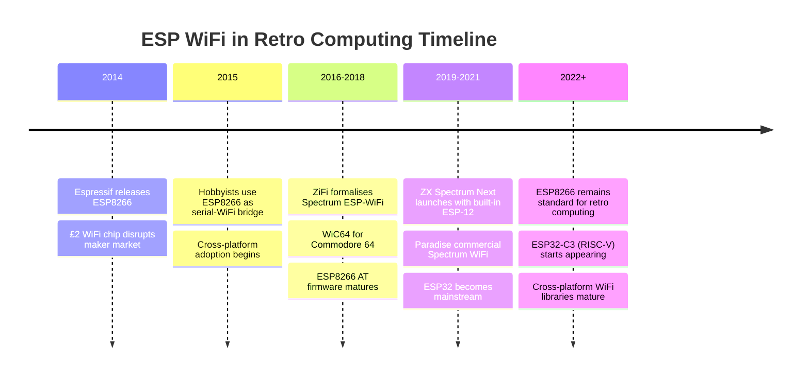

[← Home](../../README.md) · [Networking](README.md)

# ESP WiFi — The Broader Family of ESP8266/ESP32 Solutions for the ZX Spectrum

While [ZiFi](zifi.md) is the most formally-named ESP8266-based WiFi project for the ZX Spectrum, it is far from the only one. A whole **family of ESP8266 and ESP32-based solutions** has emerged in the retro-computing community since 2014, each adapting Espressif's chips to different Spectrum hardware and use cases. This article covers the broader ESP WiFi ecosystem: the chip families (ESP8266, ESP32, ESP32-C3, ESP32-S2, ESP32-S3), the standard module formats, the connection topologies (serial, SPI, I²C, edge-connector), the firmware choices (stock AT, custom firmware, Spectrum-specific protocols), and the Spectrum-specific projects beyond ZiFi — including the **Spectrum Next's built-in WiFi**, the **ZX-Uno WiFi add-on**, and various hobbyist-built bridges.

ESP8266/ESP32-based WiFi has become the **de facto standard** for retrofitting WiFi to retro microcomputers in general. The Spectrum-specific adaptations draw on a common pool of knowledge shared with the Amstrad CPC, Commodore 64, BBC Micro, MSX, Atari 8-bit, and Apple II communities. Where 1980s networking solutions varied wildly between platforms (each manufacturer had its own proprietary scheme), the modern ESP-WiFi ecosystem is largely cross-platform — the same ESP-01 module and AT firmware works equally well on a Spectrum, a C64, or a BBC Master.

For the Spectrum-specific **ZiFi** project, see [zifi.md](zifi.md). For the **ZX Spectrum Next's** built-in WiFi (which uses an ESP-12 module), see [zx_next_wifi.md](zx_next_wifi.md).

---

## History

### Espressif and the ESP8266 (2014)

Espressif Systems, founded in 2008 in Shanghai, spent its early years developing RF and WiFi silicon. The company's breakthrough product was the **ESP8266**, introduced in **2014**. Originally positioned as a simple WiFi adapter for microcontrollers (a "wireless modem on a chip"), the ESP8266 proved to be far more capable than its marketing suggested — its 32-bit Tensilica core, ample RAM, and GPIO made it a full microcontroller in its own right. Hobbyists quickly started writing custom firmware for the chip, and a thriving open-source ecosystem emerged around tools like the **NodeMCU firmware**, the **Arduino ESP8266 core**, and Espressif's own **ESP-IDF** (the official IoT development framework).

The ESP8266's killer feature for retro-computing was **price**: at around £2 per module, it cost less than a typical Spectrum expansion port connector. This made WiFi affordable for hobbyists in a way that earlier solutions (the [Spectranet](spectranet.md) at ~£60) had not been.

### ESP32 and Successors (2016+)

In **2016**, Espressif released the **ESP32** — a dual-core (or single-core in the ESP32-S2/S3 variants) successor to the ESP8266 with significantly more capability:

| Chip | Year | CPU | Cores | WiFi | Bluetooth | Notes |
|---|---|---|---|---|---|---|
| **ESP8266** | 2014 | Tensilica L106 | 1 | 802.11 b/g/n | — | The classic £2 chip |
| **ESP32** | 2016 | Tensilica LX6 | 2 | 802.11 b/g/n | BT 4.2 BLE | Much more powerful |
| **ESP32-S2** | 2019 | Xtensa LX7 | 1 | 802.11 b/g/n | — | Single-core, low-power |
| **ESP32-S3** | 2020 | Xtensa LX7 | 2 | 802.11 b/g/n | BT 5.0 BLE | With AI instructions |
| **ESP32-C3** | 2021 | RISC-V | 1 | 802.11 b/g/n | BT 5.0 BLE | RISC-V core |
| **ESP32-C6** | 2022 | RISC-V | 1 | 802.11 a/b/g/n + WiFi 6 | BT 5.0 BLE + Zigbee | Latest |

For retro-computing use, the **ESP8266 remains the workhorse** — it is the cheapest, has the simplest firmware ecosystem (including the AT firmware that ZiFi uses), and is more than fast enough for the Spectrum's modest bandwidth needs. The ESP32 family is occasionally used in projects that need more capability (e.g., emulating multiple peripherals simultaneously, or running a full TCP/IP stack with HTTPS), but the ESP8266's price-to-performance ratio remains unbeaten for basic WiFi bridging.

### Retro-Computing WiFi Adoption (2015–present)

The ESP8266 was adopted rapidly across the retro-computing community:

- **2014–2015**: Early experiments with ESP8266 as serial-WiFi bridge on Arduino, then on retro micros
- **2016–2018**: Formalised Spectrum projects (ZiFi), C64 projects (WiC64, Strikelight WiFi), Amstrad CPC projects, BBC Master WiFi
- **2019–2021**: ZX Spectrum Next launches with built-in ESP-12 module; commercial WiFi products like **Paradise** emerge
- **2022+**: ESP32-C3 and other newer chips start appearing in retro hardware, but ESP8266 remains the dominant solution

The retro-computing WiFi scene shares techniques and code across platforms. A Spectrum-side driver that speaks the ESP8266 AT command set is essentially the same as a C64-side driver; only the UART hardware differs. This cross-pollination has accelerated the development of WiFi solutions across all the major 8-bit platforms.

---

## Hardware: Chips and Modules

### ESP8266 Module Variants

The ESP8266 die is packaged into many **modules** — small PCBs with the chip, a flash memory, a crystal oscillator, a WiFi antenna (PCB trace or ceramic), and the minimum required support components. For Spectrum use, the relevant variants are:

| Module | Antenna | GPIO | Flash | Size (mm) | Typical use |
|---|---|---|---|---|---|
| **ESP-01** | PCB trace | 2 | 512 KB–1 MB | 14.3 × 24.8 | Cheapest, minimal; standard ZiFi module |
| **ESP-01S** | PCB trace, improved | 2 | 1 MB | 14.3 × 24.8 | ESP-01 with better antenna and LED |
| **ESP-03** | Ceramic | 7 | 512 KB | 18 × 18 | Slightly larger, more GPIO |
| **ESP-07** | External (U.FL/SMA) | 12 | 4 MB | 17 × 16 | External antenna for metal-cased Spectrums |
| **ESP-12** | PCB trace | 16 | 4 MB | 24 × 16 | Full GPIO; used by ZX Spectrum Next |
| **ESP-12E/F** | PCB trace, improved | 22 | 4 MB | 24 × 16 | ESP-12 with more exposed GPIO |
| **NodeMCU** | PCB trace | 11 | 4 MB | 31 × 58 | Dev board with USB-serial; prototyping |
| **Wemos D1 Mini** | PCB trace | 11 | 4 MB | 25 × 34 | Compact dev board with USB-serial |

For Spectrum ZiFi use, the **ESP-01** is the standard choice because:

- It's the cheapest (around £1–£3)
- It has the minimum required pins (VCC, GND, TX, RX, CH_PD, RST) plus 2 GPIO
- It's small enough to fit in any Spectrum case or external box

The **ESP-12** is the standard for the ZX Spectrum Next's built-in WiFi, because it offers more GPIO (allowing the Next's FPGA to control additional ESP8266 functions beyond the UART).

### ESP8266 Boot Modes

The ESP8266 boots in one of several modes, selected by the state of GPIO0 and GPIO2 at power-up:

| GPIO0 | GPIO2 | Mode |
|---|---|---|
| 0 | 1 | UART bootloader (for flashing firmware) |
| 1 | 1 | Normal boot (run AT firmware) |
| 0 | 0 | SDIO boot (not used for ZiFi) |

In normal ZiFi use, GPIO0 is pulled high (via a 10 kΩ resistor) so the module boots into AT firmware. To flash new firmware, GPIO0 is pulled low at power-up and the module is connected to a USB-to-serial adapter.

### ESP32 Considerations

For most Spectrum WiFi projects, the ESP8266 is sufficient. The ESP32 family offers advantages only for specific use cases:

- **ESP32 (dual-core LX6)** — when the project needs to run additional services (e.g., a Spectrum file server that also serves a web admin interface)
- **ESP32-S2/S3** — when USB peripheral/device mode is required
- **ESP32-C3** — when lower power consumption matters (battery-powered Spectrum setups, which are rare)

For ZiFi-style WiFi bridges, the ESP32's extra power is wasted — the bottleneck is the Spectrum-side UART speed, not the ESP's CPU. An ESP8266 running at 80 MHz with AT firmware is more than fast enough to saturate a 115200 baud serial link.

---

## Connection Topologies

ESP modules can be connected to the Spectrum via several different topologies, each with trade-offs:

### Serial (UART) Connection — The Standard

The most common topology is **serial (UART)**, used by ZiFi and most hobbyist projects. The ESP8266's hardware UART (3.3V logic-level TX/RX pins) is connected to a Spectrum serial port (5V logic, via level shifters). The Spectrum sends AT commands as text, receives responses, and parses incoming `+IPD` notifications.

Advantages:

- **Simple** — two signal wires (TX, RX) plus power and ground
- **Compatible** with any Spectrum serial interface (Interface 1, Kempston SIO, Beta 128, +2A/+3, etc.)
- **Cross-platform** — the same ESP8266 module and AT firmware works on a Spectrum, C64, BBC, etc.

Disadvantages:

- **Throughput-limited** by the serial baud rate (typically 9600–115200 baud = 1–11 KB/s)
- **Latency** — every network operation requires a serial round-trip

### SPI Connection — The High-Performance Option

The ESP8266 includes an SPI slave peripheral. By connecting the SPI pins (MOSI, MISO, SCK, CS) to a Spectrum SPI master (via a custom interface or the ZX Spectrum Next's FPGA), throughput can be increased by 10–50× versus UART.

This is the topology used by:

- **ZX Spectrum Next** — ESP-12 connected via SPI to the Next's FPGA
- **Custom high-performance ZiFi builds** — hobbyists who want maximum throughput

Advantages:

- **High throughput** — SPI at 4–10 MHz gives 100–500 KB/s, vs ~5–10 KB/s for serial
- **Low latency** — direct register access, no serial command parsing

Disadvantages:

- **Requires SPI hardware** on the Spectrum side (only the Next has this natively)
- **Custom firmware** on the ESP8266 (not stock AT firmware) — the SPI slave interface is not part of Espressif's standard AT firmware
- **More complex wiring** — 4 signal wires (MOSI, MISO, SCK, CS) plus interrupts

### Parallel / Memory-Mapped Connection

The most advanced topology, used by a few experimental projects, is **parallel memory-mapped** access — the ESP8266 is connected via its GPIO ports to a parallel latch on the Spectrum's edge connector, appearing as a memory-mapped peripheral. This offers the highest possible throughput but requires substantial hardware design.

This is rarely used in practice; the SPI connection is simpler and fast enough for any realistic Spectrum networking task.

---

## Firmware Choices

The ESP8266/ESP32 is a blank-slate microcontroller; what it does depends entirely on its firmware. For retro-computing use, several firmware options exist:

### Espressif AT Firmware (Stock)

The **standard Espressif AT firmware** is what ZiFi uses. It exposes the WiFi and TCP/IP functionality via the Hayes AT command set (see [zifi.md](zifi.md) for the command reference). This firmware is:

- **Pre-flashed** on most ESP-01 modules (and many ESP-12 modules) as sold
- **Well-documented** by Espressif
- **Stable and reliable** for typical WiFi bridge use
- **Cross-platform** — any UART-equipped host can use it

The stock AT firmware is the right choice for the vast majority of ZiFi builds. Versions include:

- **v0.x** — early, limited versions (2014–2015)
- **v1.x** — the most widely deployed versions (2016+)
- **v2.x** — newer versions with SSL/TLS support and bug fixes

### Espressif ESP-NOW

**ESP-NOW** is a connectionless protocol from Espressif that lets ESP8266/ESP32 modules communicate directly with each other without going through a WiFi access point. It uses a vendor-specific IEEE 802.11 frame format and supports up to 250-byte payloads per message.

For retro-computing, ESP-NOW enables interesting possibilities:

- **Multi-Spectrum wireless networking** — analogous to ZX Net (see [zx_net.md](zx_net.md)) but without wires
- **Spectrum-to-Spectrum file transfer** without a router
- **Multiplayer gaming** between Spectrums in the same room

ESP-NOW is rarely used in practice because the Spectrum-side driver is more complex than the simple AT command interface, and the typical ZiFi use case involves connecting to existing Internet services rather than Spectrum-to-Spectrum communication.

### Custom Firmware

Some ZiFi-style projects replace the stock AT firmware with **custom firmware** that exposes a more efficient or more capable protocol. Examples:

- **Paradise** (Spectrum Next WiFi) — uses custom firmware for high-throughput SPI-based communication
- **WiC64** (Commodore 64) — custom firmware with a binary protocol optimized for the C64
- Various hobbyist projects that implement Spectrum-specific file transfer protocols over TCP

Custom firmware is appropriate when:

- The stock AT command overhead is too slow for the application
- The project needs features the AT firmware doesn't expose (e.g., UDP broadcast, raw IP frames)
- The firmware should serve additional roles (e.g., file server, web admin interface)

The cost of custom firmware is the development effort — writing, debugging, and maintaining ESP8266 firmware in C using ESP-IDF or the Arduino ESP8266 core is non-trivial.

### NodeMCU Lua Firmware

The **NodeMCU Lua firmware** allows the ESP8266 to be programmed in the Lua scripting language. While this is popular in the broader maker community for IoT projects, it is rarely used in retro-computing contexts because:

- It's slower than compiled C firmware
- It doesn't expose a stable host interface for the Spectrum to use
- The AT firmware already does what most Spectrum users need

---

## Spectrum-Specific ESP WiFi Projects

Beyond ZiFi, several named projects have brought ESP-based WiFi to the ZX Spectrum:

### ZX Spectrum Next Built-In WiFi

The **ZX Spectrum Next** (released 2017+) includes a **built-in ESP-12 module** as standard hardware, connected to the Next's FPGA via SPI rather than via the Z80's UART. This gives the Next substantially higher throughput than serial-based ZiFi bridges (limited by SPI, not UART), and exposes the WiFi functionality through custom Z80N-side APIs.

See [zx_next_wifi.md](zx_next_wifi.md) for the Next-specific WiFi documentation.

### Paradise WiFi

**Paradise** is a commercial WiFi expansion for the ZX Spectrum (and other retro micros) developed by **Byteverse** / various independent sellers. It typically uses an ESP-12 or ESP-32 module with custom firmware, providing:

- Serial connection to the Spectrum
- Custom binary protocol (more efficient than stock AT)
- Bundled Spectrum-side driver software
- Sometimes additional features (e.g., file server, web admin)

Paradise bridges the gap between hobbyist ZiFi builds (cheap, DIY) and the Spectranet (expensive, sophisticated) — offering a commercial product at moderate price (~£30–£50).

### Hobbyist Bridges

Many Spectrum enthusiasts build their own ESP8266-to-Spectrum bridges from off-the-shelf parts:

- **ESP-01 module** (~£2)
- **3.3V regulator and capacitors** (~£1)
- **Level shifter or resistor divider** (~£1)
- **Prototype board or 3D-printed case** (~£1–£5)

These homebrew bridges vary in quality and features but share the same basic design — a serial connection to a Spectrum serial port, with AT firmware on the ESP8266. The Spectrum-side driver is often shared open-source code from the ZiFi project.

### Cross-Platform ESP WiFi (Companion Projects)

The Spectrum community shares code and techniques with other retro-computing platforms that use ESP WiFi:

- **WiC64** — Commodore 64 WiFi module using ESP8266, with custom firmware and a C64-side driver. The WiC64 project influenced many Spectrum-side designs and vice versa
- **WiFi232** — Atari 8-bit WiFi, similar in design to ZiFi
- **UP2000 / UP400** — various other retro WiFi bridges

The cross-platform sharing has accelerated development across all platforms. A bug found in the ESP8266 AT firmware, or a technique for handling `+IPD` notifications efficiently, gets reported once and applied across multiple retro-computing communities.

---

## FAQ

**Q: ESP8266 vs ESP32 — which should I use?**

A: For Spectrum WiFi, **use the ESP8266** (specifically the ESP-01 module). It's cheaper, simpler, has well-established AT firmware, and is more than fast enough for any Spectrum networking task. Reserve the ESP32 family for projects that need its extra capabilities (dual-core, BLE, USB) — which most Spectrum projects don't.

**Q: Where do I get ESP modules and how do I flash them?**

A: ESP-01 and ESP-12 modules are available from any electronics supplier (Adafruit, Pimoroni, AliExpress, etc.). They typically come pre-flashed with AT firmware. To reflash or update the firmware, you need a **USB-to-serial adapter** (FTDI FT232, CH340, CP2102) and Espressif's **esptool** Python utility. The flash procedure is:

1. Connect the USB-serial adapter to the ESP8266 (TX↔RX, RX↔TX, VCC↔3.3V, GND↔GND, plus GPIO0↔GND to enter bootloader mode)
2. Plug into a USB port; verify the module responds to `AT`
3. Run `esptool.py --port /dev/ttyUSB0 write_flash #0 AT_firmware.bin`

**Q: My Spectrum's metal case blocks the WiFi signal. What can I do?**

A: Two options:

- **Use an ESP-07 module with an external antenna** — connect an SMA-connected 2.4 GHz antenna via a length of coax
- **Move the ESP module outside the Spectrum** — mount it in an external box with the level-shifters and regulator, connected to the Spectrum's serial port by a short cable. Most ZiFi designs use external mounting for this reason.

**Q: Can I use the same ESP8266 module for multiple Spectrums?**

A: No — the ESP8266 has a single UART and can connect to only one host at a time. For multi-Spectrum networking, each Spectrum needs its own ESP8266 module, communicating through the WiFi network (and optionally using ESP-NOW for direct Spectrum-to-Spectrum traffic).

**Q: What's the relationship between ZiFi, Paradise, and the Next's WiFi?**

A: They are all **ESP8266-based WiFi solutions** for the Spectrum, but with different designs:

- **ZiFi** — the formal hobbyist project using ESP-01 + serial connection + AT firmware
- **Paradise** — a commercial product using ESP-12/ESP-32 + custom firmware
- **Next's WiFi** — built-in ESP-12 module + SPI connection + custom firmware, integrated into the Next's hardware and OS

All three achieve similar functionality (TCP/IP over WiFi), but with different trade-offs in cost, performance, and integration.

**Q: Can I write my own ESP8266 firmware?**

A: Yes — the ESP8266 can be programmed in C using **ESP-IDF** (Espressif's official SDK) or **Arduino-ESP8266** (the Arduino core for the ESP8266). Custom firmware is appropriate if you want to:

- Use a more efficient protocol than AT commands
- Run additional services (file server, web admin)
- Use SPI for higher throughput

The learning curve is moderate — basic C familiarity and understanding of the ESP8266's boot/runtime model is enough to get started. Espressif's documentation is extensive.

**Q: Does ESP WiFi work with Russian Spectrum clones?**

A: Yes — the Pentagon, Scorpion, Profi, and other Russian clones typically have a Beta 128 disk interface with a serial port, which is ideal for ESP WiFi connection. The Russian scene has been particularly active in ESP8266 adoption, given the lower cost of components versus Spectranet-class hardware.

---

## Summary

The ESP8266/ESP32 family has transformed retro-computing networking. What was a niche, expensive hobby in the Spectranet era (~£60 per interface, custom TCP/IP stack development) has become routine and cheap (~£5–£10 in ESP8266 parts, off-the-shelf AT firmware). The same chip that powers IoT lightbulbs and smart doorbells gives ZX Spectrums (and C64s, BBC Masters, Amstrad CPCs, and other 8-bit micros) WiFi and TCP/IP connectivity that exceeds anything available in their original era.

The Spectrum-specific ESP WiFi ecosystem includes the formally-named ZiFi project, commercial products like Paradise, the Next's built-in ESP-12, and countless hobbyist-built bridges. All draw on a shared knowledge base — the AT command protocol, ESP8266 datasheets, and Spectrum-side driver techniques — that is largely cross-platform and continuously improving.

For 99% of users who just want to telnet to a BBS from their Spectrum, an ESP-01 module wired to a serial port with stock AT firmware is all that's needed. For the 1% who need higher performance, custom features, or commercial-grade reliability, the ESP ecosystem offers many upgrade paths.

---

## References

### Primary Sources

- Espressif Systems. **[ESP8266](https://www.espressif.com/en/support/documents/technical-documents) Datasheet** and **ESP8266EX Hardware User Guide**
- Espressif Systems. **[ESP8266](https://www.espressif.com/en/support/documents/technical-documents) AT Instruction Set** — the canonical AT command reference
- Espressif Systems. **[ESP-IDF](https://www.espressif.com/en/support/documents/technical-documents) Programming Guide** — for custom firmware development
- [Arduino-ESP8266 core](https://www.espressif.com/en/support/documents/technical-documents) documentation — for Arduino-style firmware development

### Spectrum-Specific Sources

- [ZiFi project](https://zx-pk.ru/) documentation (Polish/Russian community sources)
- ZX Spectrum Next technical reference — built-in ESP-12 WiFi
- [Paradise WiFi](https://zx-pk.ru/) product documentation
- [World of Spectrum](https://worldofspectrum.org/) forums — ESP8266 and ZiFi discussion threads

### Cross-Platform Sources

- [WiC64](https://www.wic64.de/) project (Commodore 64) — code and techniques that cross-pollinated with Spectrum projects
- Retro WiFi bridges community (Twitter, Discord, retro-computing forums)
- Various demoscene releases using ESP WiFi for network-controlled effects

### Cross-References

- [ZiFi](zifi.md) — the formal Spectrum-specific [ESP8266](https://www.espressif.com/en/support/documents/technical-documents) project using serial + AT commands
- [ZX Spectrum Next WiFi](zx_next_wifi.md) — built-in ESP-12 module on the Next
- [[Spectranet](https://github.com/spectrum-pi/spectranet)](spectranet.md) — the older Ethernet-based TCP/IP interface
- [Modems](modems.md) — the 1980s dial-up era that ESP WiFi replaced
- [ZX Net](zx_net.md) — Sinclair's 1983 classroom LAN
