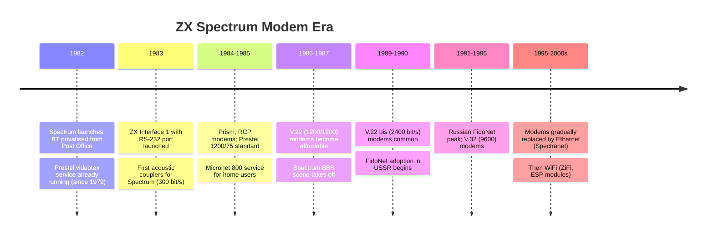

[← Home](../../README.md) · [Networking](README.md)

# Modems — Telephone-Line Connectivity for the ZX Spectrum

A **modem** (modulator-demodulator) is a device that converts digital data to and from an analog signal suitable for transmission over a telephone line. For the ZX Spectrum era (1982–1990s), modems were the **only practical means of wide-area network connectivity** — connecting a Spectrum to remote computers, information services, bulletin boards (BBSes), and (eventually) the Internet.

The Spectrum's modem story spans the 1980s and 1990s and divides into several eras:

- **1982–1984**: Acoustic couplers (300 bit/s) attached to the Spectrum via the Interface 1 RS-232 port or via custom interfaces. Used for accessing [Prestel](https://en.wikipedia.org/wiki/Prestel) (the UK's videotex service) and a handful of early BBSes.
- **1985–1989**: Direct-connect modems at 1200/75 bit/s (Prestel standard) and 1200/1200 bit/s (V.23, for general-purpose BBS access). Spectrum-specific modems from Prism, RCP, and others.
- **1989–1995**: Higher-speed modems (V.22 bis 2400 bit/s, V.32 9600 bit/s) on +3, +2A, and Russian clones. FidoNet adoption in Russia.
- **1995–2000s**: Modems gradually replaced by Ethernet/WiFi solutions like [Spectranet](spectranet.md) and [ZiFi](zifi.md).

This article covers modem hardware, the protocols they used, the Spectrum interfaces they connected through, the software ecosystem (BBSes, FidoNet, Internet), and the modern alternatives that have replaced dial-up modems.

---

## History

### The Telephone Era

The ZX Spectrum launched in 1982 into a world where **the public switched telephone network (PSTN) was the only widely-available wide-area network**. The Internet existed (as ARPANET and its successors) but was confined to academic and military sites. The World Wide Web did not exist. Connectivity for home computers meant **dial-up modems** over telephone lines.

In the UK, telephone lines were owned and operated by **British Telecom (BT)**, which had been privatised from the Post Office in 1981. BT's pricing structure (per-minute charges for local calls, even more expensive for national calls) made modem use expensive and influenced the design of the UK's videotex and BBS ecosystem — connections were kept short, and protocols were designed to minimize connect time.

The Soviet Union had its own telephone network, with poor quality lines and limited availability of home telephone lines through the 1980s. Russian-scene modem use came later than in the West, but FidoNet adoption in the 1990s was substantial and culturally important.

### UK Modem Era (1982–1989)

The first UK modem users connected Spectrums to **Prestel** — the Post Office's (later BT's) videotex service, launched in 1979. Prestel displayed pages of text/graphics on a TV set via a telephone-line modem, similar to the French Minitel system. Prestel pages covered news, weather, travel, banking, and special-interest content. Access required a modem compatible with the UK Prestel standard: **1200/75 asymmetric** (1200 bit/s downstream to the user, 75 bit/s upstream — a design optimized for the asymmetric browsing pattern of mostly-receive, occasionally-send-a-page-request).

For general-purpose computer networking (BBSes, file transfer, micro-to-micro communication), **symmetric modems** were preferred:

- **V.21** (300 bit/s symmetric, FSK) — early-1980s standard, slow but reliable
- **V.23** (1200/75 or 1200/1200) — UK mainstay for Prestel and general use
- **V.22** (1200 bit/s symmetric, PSK) — international standard, late 1980s
- **V.22 bis** (2400 bit/s) — mid-1980s, became affordable by late 1980s
- **V.32** (9600 bit/s) — late 1980s, expensive but used for serious BBSing

The Spectrum's Interface 1 RS-232 port (introduced 1983) supported baud rates up to 9600, making all these modem types technically compatible.

---

## Hardware

### Spectrum-to-Modem Interfaces

A modem is an analog device; the Spectrum is digital. The two connect through a **serial interface**, of which the Spectrum had several options:

| Interface | Baud rate | Era | Notes |
|---|---|---|---|
| **ZX Interface 1 RS-232** | up to 9600 | 1983+ | Sinclair's official RS-232 port, exposed as `STREAMS 2` in BASIC |
| **ZX Spectrum+ RS-232** | up to 9600 | 1984+ | Built into the +, +2 (some models), +2A, +3 |
| **Kempston SIO** | up to 19200 | 1984+ | Third-party RS-232 expansion |
| **TAS Microcode ROM Pack** | up to 9600 | 1984+ | ROM-based RS-232 implementation |
| **Disciple / +D serial** | up to 9600 | 1986+ | Disk interface with serial port |
| **Beta 128 serial** | up to 9600 | 1986+ | TR-DOS interface with serial port (Russian) |

For 48K Spectrums without Interface 1, the **Kempston SIO** and similar third-party RS-232 cards were the standard options. These attached to the Spectrum's edge connector and provided a standard 25-pin D-sub RS-232 port compatible with off-the-shelf modems.

### Modem Types

#### Acoustic Couplers (1982–1985)

An **acoustic coupler** is a modem that connects to the telephone handset rather than the telephone line directly. The user dials the remote number by hand, then places the telephone handset into rubber cups on the coupler; data passes through the handset's microphone and speaker as audio. This design avoids the regulatory problems of connecting non-approved equipment directly to the telephone line.

Acoustic couplers for the Spectrum operated at **300 bit/s** (V.21 standard) using frequency-shift keying (FSK):

- **Mark** (1 bit): 1270 Hz originate / 2225 Hz answer
- **Space** (0 bit): 1070 Hz originate / 2025 Hz answer

Acoustic couplers were slow (~30 bytes/second, so a 16 KB program took 9 minutes to transfer) but **legally simple** — they worked with any telephone and required no BT approval. Prism's "Prism Modem" and several other UK products served the early-1980s Spectrum modem market.

#### Direct-Connect Modems (1985+)

By the mid-1980s, BT had approved several direct-connect modems for use on UK telephone lines. A direct-connect modem plugs into the BT socket directly (via a BT 431A plug), eliminating the acoustic-coupler step and improving signal quality.

The UK standards:

| Standard | Speed | Direction | Use case |
|---|---|---|---|
| **Prestel 1200/75** | 1200 down, 75 up | Asymmetric | Videotex / Prestel / Micronet 800 |
| **V.23** | 1200/1200 | Symmetric | General BBS use |
| **V.22** | 1200/1200 | Symmetric | International BBS |
| **V.22 bis** | 2400/2400 | Symmetric | Late-1980s BBS |
| **V.32** | 9600/9600 | Symmetric | Late 1980s / 1990s, file transfer |
| **V.34** | 28800/28800 | Symmetric | 1990s, Internet |

Direct-connect modems were more expensive than acoustic couplers (£150–£300 for a 1200/75 modem in 1985) but offered 4× to 30× the speed and better reliability.

#### The Prism VTX-5000

The **Prism VTX-5000** was the most iconic Spectrum-specific modem of the 1980s. Designed for Prestel/Micronet 800 access, it offered:

- 1200/75 bit/s Prestel-standard operation
- Direct-connect to BT line
- Built-in Prestel-terminal software in ROM
- Snap-on Spectrum case design (matched the Spectrum aesthetic)

The VTX-5000 was widely used in UK homes to access **Micronet 800** — BT's consumer videotex service that provided news, software downloads, message boards, and games. Micronet 800 was, in effect, the UK's first mass-market online service, and the VTX-5000 was its primary consumer terminal.

#### Russian Modems

The Russian clone scene developed its own modems in the late 1980s and 1990s. These typically connected to the Beta 128 disk interface's serial port or to custom RS-232 interfaces for Pentagon and Scorpion clones:

- **Analog 14400** — Russian 14400 bit/s modem, V.32 bis compatible
- **Idustria** — Russian 2400/9600 bit/s modem
- Various homemade modems — Russian hobbyists frequently built their own from schematics published in *Radio* magazine and other electronics publications

Russian modems were used heavily for **FidoNet** — the store-and-forward BBS network that connected Russian Spectrum users through the 1990s (see below).

---

## Software Ecosystem

### Prestel and Micronet 800 (1982–1989)

**Prestel** was BT's videotex service, running from 1979 to 1994. Pages of text and block graphics were delivered to user terminals via 1200/75 bit/s modems. The Spectrum (with Interface 1 and a Prestel-compatible modem) ran **terminal emulation software** that displayed Prestel pages on the TV.

**Micronet 800** was a Prestel-based service run by **Telemap Ltd** from 1983, aimed specifically at home-computer users. Micronet 800 offered:

- **News and information pages** — computing news, product reviews, software listings
- **Downloadable software** — Spectrum programs transferred as Prestel pages of encoded bytes, decoded by the Spectrum-side software into runnable code
- **Message boards** — chat and discussion areas for Spectrum enthusiasts
- **Multi-user games** — early online multiplayer experiments, including the legendary **MUD1** (the first multiplayer text adventure, written by Roy Trubshaw and Richard Bartle at Essex University)

Micronet 800 subscription cost £7.75/month plus telephone charges, plus the modem hardware cost. At its peak (1985–1987), Micronet 800 had roughly 10,000 subscribers — modest by today's standards but significant for the era.

### BBSes (1985–1995)

A **Bulletin Board System (BBS)** was a remote computer that modem users dialled into to exchange messages, download files, and play online games. The UK BBS scene developed from 1984 onwards, with several Spectrum-specific BBSes operating through the late 1980s and 1990s:

- **Croydon BBS** — one of the first UK BBSes accessible to Spectrum users
- **Commstar** — message-and-file BBS popular in the late 1980s
- **NetStar** and **Nimbus BBS** — file distribution BBSes for Spectrum software

BBS software for the Spectrum itself (allowing a Spectrum to **act as** a BBS host) included:

- **BBStar** — full-featured BBS host software
- **Fast-Chat** — chat-only BBS
- **Spectrum Commstar** — message-board BBS

### FidoNet

**FidoNet** was a store-and-forward message network connecting BBSes worldwide, using nightly telephone calls to exchange messages between nodes. FidoNet was particularly important in the **former Soviet Union** in the 1990s — it provided a low-cost communication channel at a time when international phone calls were prohibitively expensive for most Russian citizens.

Russian Spectrum clones (Pentagon, Scorpion) ran FidoNet node software, connecting to the global FidoNet network via Z-modem file transfers over analog modems at 2400–14400 bit/s. Russian FidoNet was culturally significant through the 1990s — it was where many Russians first experienced online community and where much of the early post-Soviet Spectrum scene coordination happened.

Spectrum-specific FidoNet software included **T-mail** (a popular Russian FidoNet mailer that ran on Spectrum clones) and several BBS packages.

### Internet Access

Direct Internet access from a Spectrum was rare but possible in the late 1990s. TCP/IP stacks existed (notably the **Spectranet** firmware and the smaller **SpeccyTCP** project), allowing Spectrums to act as telnet clients, retrieve files via FTP, and (with appropriate client software) browse text-only websites. The practical bandwidth limit was the modem speed — V.34 at 28800 bit/s was barely adequate for text-based web pages.

By the 2000s, the cost of always-on Internet vs the cost of dial-up telephone calls made modem-based Spectrum Internet access unattractive. Modern solutions like [Spectranet](spectranet.md) (Ethernet) and [ZiFi](zifi.md) (WiFi) replaced modems entirely.

---

## Modern Alternatives

Modems are obsolete for Spectrum use. Several modern alternatives provide far higher bandwidth at lower cost:

| Alternative | Speed | Connection | Notes |
|---|---|---|---|
| **[Spectranet](spectranet.md)** | ~10 Mbit/s | Ethernet/TCP/IP | Modern, supported, full TCP/IP stack |
| **[ZiFi](zifi.md)** | ~1 Mbit/s | WiFi | WiFi module with AT command interface |
| **[ESP WiFi](esp_wifi.md)** | ~1 Mbit/s | WiFi | ESP8266/ESP32-based DIY solutions |
| **[ZX Spectrum Next WiFi](zx_next_wifi.md)** | ~1 Mbit/s | WiFi | Built-in WiFi on the Next |
| **Emulator** | unlimited | runs on PC | Modern emulators have full Internet access |

For modern retro-computing, the Spectranet is the established choice; the WiFi options are gaining popularity for cable-free operation. Modems remain interesting for historical exploration but are not practical for daily use.

---

## Frequently Asked Questions

### Can I still use a Spectrum modem today?

In theory, yes — the PSTN still exists, and Spectrum-compatible modems can dial other modems. In practice:

1. **Telephone lines** are increasingly Voice-over-IP (VoIP), which often distorts modem signals beyond usability
2. **Dial-up Internet** has been discontinued by most ISPs
3. **BBSes** are very few; most are accessible via telnet over the Internet rather than dial-up

For modern "BBS" access, use a Spectranet/WiFi module and telnet to a telnet-accessible BBS (several dozen are listed at the [Telnet BBS Guide](https://tbbs.net)).

### Was the Spectrum ever used as a BBS host?

Yes. Spectrum-specific BBS host software (BBStar, Commstar) allowed a Spectrum with a modem to act as a single-line BBS — one caller at a time. Several Spectrum users ran BBSes from their Spectrums in the late 1980s and early 1990s, often leaving the machine running overnight to take calls.

### How did Russian clone users connect to FidoNet?

Russian Spectrum clones (Pentagon, Scorpion) typically used:

1. A custom RS-232 interface attached to the clone's expansion bus
2. A Russian-built modem (Analog 14400, Idustria, or similar)
3. **T-mail** or similar FidoNet mailer software
4. Nightly scheduled calls to the upstream FidoNet node

Connections were expensive (per-minute telephone charges) and slow (2400–14400 bit/s), but FidoNet store-and-forward design made it practical. Russian FidoNet was the primary online community for many Russian Spectrum users through the 1990s.

### Did the Spectrum support Minitel?

Minitel was the French videotex service, technically similar to Prestel. With appropriate terminal software and a Minitel-compatible modem (1200/75 bit/s), a Spectrum could in principle access Minitel. In practice, this was rare outside France, and the Minitel-specific modem hardware was not common among Spectrum users.

---

## Summary

Modems were the **ZX Spectrum's primary wide-area network connectivity** from 1982 through the 1990s. The Spectrum's modem story spans the acoustic-coupler era (300 bit/s), the Prestel/Micronet 800 era (1200/75 bit/s, the UK's first mass-market online service), the V.22/V.32 BBS era (1200–9600 bit/s, FidoNet in Russia), and the early-Internet era (V.34 28800 bit/s, telnet/FTP access).

The Spectrum was a credible modem terminal through all these eras, supported by Interface 1 RS-232, Kempston SIO, and various disk-interface serial ports. Spectrum-specific BBS host software and FidoNet mailers ran on real hardware, particularly in Russia where the Spectrum clone scene was the largest online community of the 1990s.

Modems are now obsolete for Spectrum use. Modern alternatives — [Spectranet](spectranet.md), [ZiFi](zifi.md), [ESP WiFi](esp_wifi.md), and the [ZX Spectrum Next WiFi](zx_next_wifi.md) — provide 1–10 Mbit/s bandwidth at lower cost and complexity than maintaining a working modem setup.

---

## References

### Primary Sources

- [Sinclair Research — ZX Interface 1 Manual](https://worldofspectrum.org/) — RS-232 port documentation and BASIC `STREAMS` interface
- [Prism — VTX-5000 User Manual](https://archive.org/) — the canonical Spectrum-specific modem reference
- [BT — Prestel User Guide](https://archive.org/) — the videotex service documentation

### Contemporary Coverage

- [Micronet 800 documentation](https://worldofspectrum.org/) — service guides and software downloads, archived at World of Spectrum and other retro-computing sites
- [CRASH magazine modem reviews](https://archive.org/details/crash-magazine) — contemporary assessments of Prism, RCP, and other Spectrum modems
- *Your Spectrum* and *[Sinclair User](https://archive.org/details/sinclair-user-magazine)* articles on BBSing and online services (1984–1989)
- *Radio* magazine (Russian, 1988–1995) — Russian-language modem schematics and FidoNet tutorials

### Modern Sources

- [Telnet BBS Guide](http://tbbs.net) — modern listing of telnet-accessible BBSes for retro modem experimentation
- [World of Spectrum modem archive](https://worldofspectrum.org/) — documentation of Spectrum-specific modem hardware
- [Spectranet project](https://github.com/spectrum-pi/spectranet) — modern TCP/IP alternative that replaced modems for Spectrum use

### Related Articles in This Knowledge Base

- [ZX Net](zx_net.md) — Sinclair's earlier (1983) classroom LAN product, predating widespread modem use
- [[Spectranet](https://github.com/spectrum-pi/spectranet)](spectranet.md) — the modern Ethernet/TCP/IP alternative to modems
- [ZiFi](zifi.md) — modern WiFi module replacing modems
- [ESP WiFi](esp_wifi.md) — DIY ESP-based WiFi alternatives
- [ZX Spectrum Next WiFi](zx_next_wifi.md) — the Next's built-in WiFi
