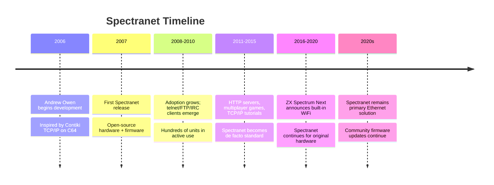

[← Home](../../README.md) · [Networking](README.md)

# Spectranet — Modern Ethernet and TCP/IP for the ZX Spectrum

The **Spectranet** is a modern (2007+) networking interface for the ZX Spectrum, providing **Ethernet connectivity** and a **full TCP/IP protocol stack** to original Sinclair hardware and clones. Designed by **Andrew Owen** and developed by the Spectranet team, the Spectranet plugs into the Spectrum's edge connector and exposes a ROM-resident TCP/IP stack through BASIC extensions, a C API, and a socket interface. The Spectranet transformed the Spectrum from a 1980s microcomputer with no real networking capability into a TCP/IP Internet host capable of telnetting to BBSes, fetching files via FTP, and even serving HTTP requests.

Before Spectranet, Spectrum Internet connectivity required [modems](modems.md) (slow, dial-up, expensive per-minute telephone charges) or hobbyist-built serial-to-PC bridges. The Spectranet, by contrast, provides always-on Ethernet at multi-megabit bandwidth, with full TCP, UDP, ICMP, DHCP, DNS, HTTP, FTP, and telnet support in firmware. It is the de facto modern networking solution for serious Spectrum enthusiasts, and the technical foundation that later WiFi solutions like [ZiFi](zifi.md) build on.

This article covers the Spectranet's history, hardware design, firmware TCP/IP stack, the ROM API exposed to BASIC and C programs, the software ecosystem that has developed around it, and its place in the modern Spectrum community. For earlier networking approaches, see [zx_net.md](zx_net.md) (1983 classroom LAN) and [modems.md](modems.md) (1980s–1990s telephone connectivity). For WiFi alternatives, see [zifi.md](zifi.md), [esp_wifi.md](esp_wifi.md), and [zx_next_wifi.md](zx_next_wifi.md).

---

## History

### The Need for Modern Connectivity

By the mid-2000s, the Internet had transformed computing but the ZX Spectrum was essentially cut off from it. The Russian clone scene had used [FidoNet](modems.md) through the 1990s, but FidoNet was in decline worldwide. The original UK Spectrum scene had never had substantial Internet connectivity — the few TCP/IP experiments (SpeccyTCP, early Internet utilities) required awkward modem setups.

The problem was fundamental: the Spectrum had no networking hardware designed for TCP/IP. The Interface 1's ZX Net was a 9600 bit/s polling LAN; the RS-232 port could drive a modem but at analog-telephone-line speeds. The Internet ran on Ethernet at megabit speeds with TCP/IP packet switching — none of which the Spectrum could do without new hardware.

### Development (2006–2007)

**Andrew Owen** began developing the Spectranet in **2006**, inspired by the success of similar projects for other retro platforms (notably the **Contiki** TCP/IP stack ported to the Commodore 64). The goal was a modern Ethernet interface for the Spectrum, with a TCP/IP stack optimized for the Z80's limited resources.

Key design decisions:

- **Ethernet controller chip**: the **ENC28J60** from Microchip — a single-chip 10base-T Ethernet controller with SPI interface, suitable for connection to a Z80-based host
- **Firmware location**: an on-board **flash ROM** holding the TCP/IP stack, paged into the Spectrum's memory map on demand
- **API exposure**: BASIC extensions via the `*` command prefix, plus a socket API callable from machine code and C
- **Open source firmware**: the Spectranet firmware source is publicly available, allowing community contributions

The Spectranet was released as both assembled boards (for users who wanted a plug-and-play solution) and as PCB artwork + firmware (for users who wanted to build their own). The project was open-source throughout.

### Release and Adoption (2007–present)

The Spectranet shipped in **2007** and was adopted enthusiastically by the Spectrum retro-computing community. By the 2010s, several hundred Spectranets were in active use worldwide, and a software ecosystem had developed:

- **Telnet clients** for accessing BBSes and other online services
- **FTP clients** for file retrieval
- **HTTP servers** running on Spectrums (a curiosity rather than a practical use)
- **IRC clients** for real-time chat
- **Spectrum-specific protocols** built on TCP/IP (e.g., for remote multiplayer gaming)

The Spectranet remains the most capable Spectrum networking solution. Even after WiFi options like ZiFi emerged, the Spectranet has retained its position for users who want maximum bandwidth and lowest latency.



---

## Hardware

### The ENC28J60 Ethernet Controller

The Spectranet's hardware design centers on the **Microchip ENC28J60** Ethernet controller, a single-chip 10base-T IEEE 802.3-compliant controller with an SPI interface. The ENC28J60 handles:

- **Physical layer (PHY)** — the analog Ethernet signaling, collision detection, link integrity
- **Media access control (MAC)** — Ethernet framing, source/destination MAC addressing, CRC generation/checking
- **Buffer management** — internal 8 KB packet buffer for transmit and receive

The ENC28J60 exposes the packet buffer and configuration registers through a 4-wire SPI interface (clock, MOSI, MISO, chip select). The Spectrum, as SPI master, reads and writes packets by sending SPI commands.

The SPI clock rate on the Spectranet is roughly **4–8 MHz** depending on the host Spectrum model — fast enough to handle the full 10 Mbit/s Ethernet bandwidth without packet loss, though the Z80's processing speed limits practical throughput to perhaps **100 KB/s** in each direction (limited by Z80 packet processing, not the Ethernet hardware).

### On-Board Flash ROM

The Spectranet includes **32 KB of flash ROM** (typically an AT49F002 or similar), holding:

- **Bootloader** — initializes the ENC28J60 and loads the firmware into the Spectrum's address space
- **TCP/IP stack** — the firmware implementation of TCP, UDP, ICMP, DHCP, DNS, and supporting protocols
- **BASIC command interpreter hooks** — extends Sinclair BASIC with `*` network commands
- **Socket API** — the machine-code-callable interface for C and assembly programs
- **Utility routines** — hostname resolution, MAC address handling, configuration storage

The flash ROM is **memory-mapped** into the Spectrum's address space when the Spectranet is active — typically paged into the `#0000–#3FFF` range when the firmware needs to be invoked. The paging mechanism uses a small latch on the Spectranet board, controlled by writes to specific I/O ports.

### Hardware Compatibility

The Spectranet is designed to work with the widest possible range of Spectrum-compatible hardware:

- **Original Sinclair hardware**: 16K, 48K, 48K+, 128K, +2 (grey), +2A, +3
- **Western clones**: Amstrad CPC 464/664/6128 (with appropriate adapter — the Spectranet predates these but is sometimes adapted)
- **Russian clones**: Pentagon, Scorpion, ATM Turbo, Profi, Kay
- **Modern clones**: ZX Spectrum Next, Harlequin, ZX-Uno (built-in or via adapter)

The Spectranet's edge connector pinout matches the standard Sinclair edge connector; Russian clones with non-standard edge connectors require simple adapter boards.

### Power Requirements

The Spectranet draws roughly **100–150 mA** at 5V — within the original Spectrum's expansion-port power budget but tight on heavily-loaded systems. On a real 48K Spectrum with a worn power supply, adding a Spectranet alongside other expansion devices can exceed the supply's rating. Modern switching-power-supply replacements solve this problem.

---

## Firmware and the TCP/IP Stack

The Spectranet's firmware, written in Z80 assembly, implements a substantial portion of the TCP/IP protocol suite in roughly 24 KB of code. The firmware's design is influenced by **Contiki** (the embedded TCP/IP stack) and by classic BSD socket conventions, adapted to the Z80's architecture.

### Protocol Coverage

| Protocol | Layer | Purpose |
|---|---|---|
| **Ethernet II / IEEE 802.3** | Link | Frame format, MAC addressing |
| **ARP** | Link | MAC-to-IP address resolution |
| **IPv4** | Network | IP packet routing |
| **ICMP** | Network | Ping, error reporting |
| **IGMP** | Network | Multicast group management |
| **TCP** | Transport | Reliable stream connections |
| **UDP** | Transport | Unreliable datagrams |
| **DHCP** | Application | Automatic IP configuration |
| **DNS** | Application | Hostname-to-IP resolution |
| **HTTP** | Application | Web page retrieval (client and server) |
| **FTP** | Application | File transfer |
| **Telnet** | Application | Terminal remote login |
| **NTP** | Application | Network time synchronization |

The Spectranet's TCP implementation handles the full TCP state machine: connection establishment (three-way handshake), data transfer with sliding window, acknowledgements, retransmission timeouts, and connection teardown. This is a substantial amount of code for a Z80 to manage, and the Spectranet firmware represents one of the most sophisticated TCP/IP stacks ever written for an 8-bit microcomputer.

### Memory Management

The Spectranet firmware manages memory carefully to coexist with the user's programs:

- **The firmware itself** resides in the on-board flash ROM, paged into the Spectrum's address space only when called
- **Connection state** (TCBs, socket tables) lives in a small region of Spectrum RAM reserved by the Spectranet on initialisation
- **Packet buffers** are in the ENC28J60's internal buffer; the Spectrum only sees the bytes being transferred
- **User data** flows through a small bounce buffer in Spectrum RAM, allowing the firmware to stream arbitrarily large amounts of data without consuming all RAM

### The ROM API

The Spectranet exposes its functionality through several layers:

#### BASIC Extensions

Sinclair BASIC is extended with new commands using the `*` prefix (hooked into the Interface 1-style `*` command mechanism):

```basic
10 *BROWSE "http://example.com/spectrum/index.html"
20 *FN DEF fna() = 1
30 *HTTP GET "http://worldofspectrum.org/"
40 *TELNET "bbs.example.com"
```

The `*` commands are interpreted by the Spectranet ROM when present, allowing BASIC programs to perform network operations inline.

#### The Socket API (Assembly / C)

For machine-code and C programs, the Spectranet exposes a **socket API** modeled on BSD sockets:

| Function | Purpose |
|---|---|
| `socket(domain, type, protocol)` | Create a socket |
| `bind(socket, addr, len)` | Bind to a local address/port |
| `listen(socket, backlog)` | Listen for incoming connections |
| `accept(socket, addr, len)` | Accept an incoming connection |
| `connect(socket, addr, len)` | Establish a connection |
| `send(socket, buf, len, flags)` | Send data |
| `recv(socket, buf, len, flags)` | Receive data |
| `close(socket)` | Close a socket |
| `gethostbyname(name)` | DNS resolution |
| `inet_addr(string)` | Convert dotted-quad string to IP |

The API is callable via `RST #08` (a hook code in the Spectranet ROM) with a function number in the A register and parameters in other registers. A C wrapper (provided with the z88dk C compiler) makes the API directly usable from C programs.

---

## Software Ecosystem

### Telnet Clients

The most popular Spectranet application class is the **telnet client** — used to access modern telnet-accessible BBSes and remote Spectrum emulators. Several telnet clients exist:

- **SpeccyTelnet** — Andrew Owen's reference telnet client
- **SpecTel** — a more feature-rich telnet client with terminal emulation
- **Various homebrew telnet clients** — community-contributed, often optimized for specific BBSes

The [Telnet BBS Guide](https://tbbs.net) lists several dozen BBSes accessible via telnet, covering retro-computing, demoscene, and general-interest topics. A Spectrum with a Spectranet can telnet to any of them.

### FTP Clients

FTP clients for the Spectranet allow file retrieval from Internet FTP servers. Common uses include:

- **Downloading software** from World of Spectrum's FTP archive
- **Retrieving new demoscene productions** from scene FTP sites
- **Transferring development files** between the developer's PC and the Spectrum (via an intermediate FTP server)

### HTTP Clients and Servers

The Spectranet supports both HTTP client and HTTP server roles. The **Spectrum HTTP server** is a curiosity — running a tiny website from a Spectrum's TCP port 80. Several example sites have been hosted from Spectrums over the years, demonstrating the protocol stack's completeness rather than serving any practical purpose.

More practically, **HTTP clients** can fetch web pages. Given the Spectrum's display limitations (32×24 text, no graphics without custom rendering), most web content is unusable, but text-only sites (and Spectrum-specific sites with appropriate markup) work fine.

### IRC Clients

**Internet Relay Chat (IRC)** clients for the Spectranet connect Spectrum users to IRC networks, allowing real-time text chat with the global retro-computing community. Several IRC clients exist; the most popular is **SpeccyIRC**.

### Multiplayer Gaming

The Spectranet enables **real-time multiplayer gaming** between Spectrums (and between Spectrums and other platforms via TCP/IP). Several modern homebrew games include Spectranet-based multiplayer modes. The low latency of TCP/IP (compared to 1980s modem-based multiplayer) makes fast-paced games practical.

---

## Frequently Asked Questions

### Is the Spectranet still available?

The Spectranet hardware design is **open source**, with PCB artwork, firmware source, and bill of materials publicly available. Several retro-computing retailers stock assembled Spectranet boards; alternatively, hobbyists can etch their own PCBs and assemble the board from components. The firmware is regularly updated by the community.

### Does the Spectranet work on the ZX Spectrum Next?

Yes, but the Next has built-in WiFi (via an ESP module — see [zx_next_wifi.md](zx_next_wifi.md)), making the Spectranet redundant for Next users. The Spectranet remains the primary networking solution for original Sinclair hardware and Western/Russian clones.

### How does the Spectranet compare to ZiFi?

| Aspect | Spectranet | ZiFi |
|---|---|---|
| **Connection** | Ethernet (wired) | WiFi (wireless) |
| **Bandwidth** | ~10 Mbit/s (Ethernet), ~100 KB/s practical | ~1 Mbit/s, ~30 KB/s practical |
| **Latency** | Sub-millisecond | ~10–50 ms |
| **Setup complexity** | Plug into router, configure IP | Configure SSID/password |
| **Cable required** | Yes (Ethernet cable to router) | No |
| **Cost** | Higher (Ethernet hardware) | Lower (WiFi module only) |
| **Reliability** | High (Ethernet is robust) | WiFi-dependent |

The Spectranet is the choice for users who want maximum bandwidth and reliability; ZiFi is the choice for users who want cable-free convenience. Both run the same TCP/IP protocol stack.

### Can the Spectranet access the modern web (HTTPS, JavaScript, video)?

**No.** The modern web is built on TLS encryption (HTTPS), JavaScript execution, CSS rendering, and substantial bandwidth — none of which the Spectrum can practically support. The Spectranet provides the **transport layer** (TCP/IP) but cannot run modern web clients. Practical web access from a Spectranet-equipped Spectrum is limited to:

- **Telnet to BBSes** — works well, modern BBSes support it
- **HTTP (not HTTPS) sites** with simple text content
- **FTP** — works well for file retrieval
- **IRC** — works well for chat
- **Email via POP3/SMTP** — works in principle

For modern HTTPS sites, an intermediate proxy server is required to strip TLS and serve content over plain HTTP. A few community-maintained proxies exist for this purpose.

### Does the Spectranet support IPv6?

The original Spectranet firmware is **IPv4-only**. An IPv6 stack would be technically possible but would require substantial firmware development; as of the 2020s, no IPv6-capable Spectranet firmware has been released. IPv4 remains adequate for most retro-computing use cases (especially since most home networks still support IPv4).

---

## Summary

The **Spectranet** is the de facto modern networking interface for the ZX Spectrum. Released in 2007 by Andrew Owen, the Spectranet provides Ethernet connectivity and a ROM-resident TCP/IP stack supporting TCP, UDP, DHCP, DNS, HTTP, FTP, telnet, IRC, and NTP. The firmware is one of the most sophisticated TCP/IP implementations ever written for an 8-bit microcomputer.

The Spectranet's hardware centers on the ENC28J60 single-chip Ethernet controller, communicating with the Spectrum via SPI. The firmware exposes both BASIC extensions (via the `*` command prefix) and a BSD-style socket API for C and assembly programs. A substantial software ecosystem has developed around the Spectranet, including telnet clients, FTP clients, HTTP clients/servers, IRC clients, and multiplayer games.

For modern retro-computing, the Spectranet is the choice for users who want maximum bandwidth and lowest latency. WiFi alternatives like [ZiFi](zifi.md) and [ESP WiFi](esp_wifi.md) offer cable-free convenience at lower bandwidth. The ZX Spectrum Next includes built-in WiFi that effectively replaces the Spectranet for Next users.

---

## References

### Primary Sources

- [Andrew Owen — Spectranet documentation](https://github.com/spectrum-pi/spectranet) — the canonical hardware, firmware, and API documentation, hosted at the Spectranet project site
- [Spectranet firmware source code](https://github.com/spectrum-pi/spectranet) — open-source Z80 assembly implementing the TCP/IP stack, available on GitHub
- [Spectranet PCB artwork and bill of materials](https://github.com/spectrum-pi/spectranet) — open-source hardware design files

### Software and Documentation

- [SpeccyTelnet, SpeccyIRC](https://github.com/spectrum-pi/spectranet) — Andrew Owen's reference client implementations
- [z88dk Spectranet wrapper](https://github.com/z88dk/z88dk) — C-callable Spectranet API for z88dk C programs
- [Telnet BBS Guide](http://tbbs.net) — modern listing of telnet-accessible BBSes

### Community

- [Spectranet wiki and forums](https://github.com/spectrum-pi/spectranet) — active community documentation and Q&A
- [World of Spectrum forums](https://worldofspectrum.org/) — discussion of Spectranet hardware, firmware, and software
- **ZX Spectrum Next forum** — comparisons between Spectranet and the Next's built-in WiFi

### Related Articles in This Knowledge Base

- [ZX Net](zx_net.md) — Sinclair's 1983 classroom LAN, the predecessor concept
- [Modems](modems.md) — telephone-line connectivity that [Spectranet](https://github.com/spectrum-pi/spectranet) replaced
- [ZiFi](zifi.md) — WiFi alternative to [Spectranet](https://github.com/spectrum-pi/spectranet)
- [ESP WiFi](esp_wifi.md) — DIY ESP-based WiFi modules
- [ZX Spectrum Next WiFi](zx_next_wifi.md) — the Next's built-in WiFi
- [Cross-Platform Toolchain](../../09_toolchain/cross_platform_toolchain.md) — [z88dk](https://github.com/z88dk/z88dk)'s Spectranet C wrapper
