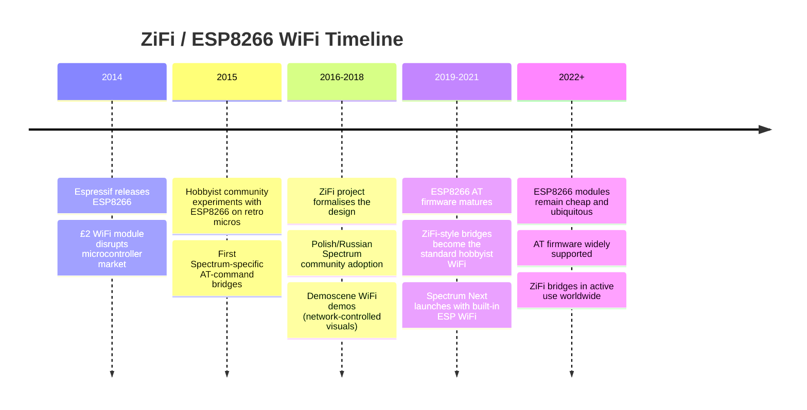

[← Home](../../README.md) · [Networking](README.md)

# ZiFi — WiFi for the ZX Spectrum via ESP8266 AT Commands

**ZiFi** is a WiFi networking interface for the ZX Spectrum and compatible clones, built around the **Espressif ESP8266** WiFi microcontroller and accessed from the Spectrum side via the ESP8266's standard **"AT" command set** over a serial link. ZiFi provides TCP and UDP connectivity over WiFi, giving a 1980s 8-bit microcomputer wireless access to modern networks — telnet BBSes, IRC, HTTP retrieval, file downloads, and any TCP/IP service that can fit in the Spectrum's memory and bandwidth budget.

Where the [Spectranet](spectranet.md) added Ethernet via an SPI-attached ENC28J60 and a flash-ROM-resident TCP/IP stack, ZiFi takes a fundamentally different architectural path: **the ESP8266 runs the TCP/IP stack** in its own onboard firmware, and the Spectrum issues high-level connect/send/recv commands to it over a UART. This moves the heavy networking work off the Z80 and onto a modern 32-bit core, at the cost of latency (every network operation is a serial round-trip) and protocol coverage (limited to whatever the ESP8266 AT firmware exposes).

ZiFi emerged in the early-to-mid 2010s as ESP8266 modules became absurdly cheap (~£2 per module), and became one of the most popular Spectrum WiFi solutions for hobbyists — alongside the related [ESP WiFi projects](esp_wifi.md) and the [ZX Spectrum Next's built-in WiFi](zx_next_wifi.md). This article covers ZiFi's history, hardware design, AT command interface, software ecosystem, and the trade-offs it makes versus the Spectranet.

---

## History

### WiFi Comes to the Spectrum (2010s)

The ZX Spectrum's networking history runs through several eras: the 1983 [ZX Net](zx_net.md) classroom LAN, the 1980s–1990s [modem](modems.md) era with Prestel/BBS/FidoNet, and the 2007+ [Spectranet](spectranet.md) bringing Ethernet and TCP/IP. Through the 2000s and early 2010s, the Spectranet remained the only practical Internet interface for original Spectrum hardware — but it required Ethernet cabling to a router, which was awkward for hobbyists using a Spectrum in the living room or at demoscene parties.

The technical breakthrough that changed the calculus was the **Espressif ESP8266**, released in 2014. The ESP8266 was a remarkable chip: a 32-bit Tensilica core running at 80 MHz, with built-in WiFi (IEEE 802.11 b/g/n), TCP/IP stack in firmware, GPIO pins, and SPI/I²C/UART interfaces — all for around £2–£3 per module. It was originally marketed as a cheap WiFi adapter for microcontrollers, but the hobbyist community quickly realized it could be used in the other direction: as a WiFi bridge for *any* device with a UART, including 1980s 8-bit micros like the Spectrum.

### ZiFi Development

The **ZiFi** project was one of several early efforts to bring ESP8266-based WiFi to the ZX Spectrum, alongside related projects like **WiFi232** (for the Atari 8-bit family), **Paradise** (Spectrum Next WiFi), and various one-off hobbyist builds. ZiFi was developed by the ZX Spectrum retro community — primarily Polish and Russian contributors, building on the long Eastern European tradition of Spectrum hardware hacking that had produced the Pentagon, Scorpion, Profi, and other clones in the 1990s.

Key design decisions:

- **ESP8266 as the WiFi engine** — typically the **ESP-01** module (the cheapest, smallest ESP8266 variant with 2 GPIO pins and a UART)
- **Connection to the Spectrum via serial port** — usually through the ZX Interface 1's RS-232 port, the +2A/+3 serial port, or custom edge-connector interfaces (Kempston SIO, Beta 128 serial)
- **AT command firmware** — the ESP8266 runs Espressif's stock AT firmware, which exposes WiFi and TCP/UDP operations as text commands (`AT+CWMODE=1`, `AT+CWJAP="ssid","pass"`, `AT+CIPSTART`, etc.)
- **Open design** — schematics and Spectrum-side driver code published openly

### Adoption and Influence (2015–present)

ZiFi-style ESP8266 WiFi bridges became popular through the late 2010s for several reasons:

- **Cost** — a complete WiFi solution for under £10 in parts, vs ~£60+ for a Spectranet
- **Simplicity** — no need to open the Spectrum or modify its memory map; just a serial connection to an external module
- **No firmware development on the Spectrum side** — the TCP/IP stack lives on the ESP8266, so the Spectrum sees only high-level connect/send/recv commands
- **Availability** — ESP-01 modules are mass-produced and available from any electronics supplier

By 2020, ZiFi and similar ESP8266-based WiFi solutions had largely replaced the Spectranet for hobbyist use, though the Spectranet retained its position for users who needed maximum throughput or Ethernet-grade reliability.



---

## Hardware

### The ESP8266 Module

The ESP8266 is the heart of any ZiFi design. Espressif Systems (a Chinese fabless semiconductor company based in Shanghai) released the chip in **2014**, originally as an inexpensive WiFi adapter for other microcontrollers. The chip's capabilities made it far more — it is essentially a complete WiFi-enabled microcontroller on a single die:

| Feature | Specification |
|---|---|
| **CPU** | Tensilica Xtensa Diamond Standard 106Micro, 32-bit, 80 MHz (overclockable to 160 MHz) |
| **RAM** | ~32 KB instruction, ~80 KB user data, plus WiFi buffer RAM |
| **WiFi** | IEEE 802.11 b/g/n (2.4 GHz), WPA/WPA2 |
| **Flash** | External SPI flash (typically 512 KB–4 MB) holding AT firmware |
| **GPIO** | 17 GPIO pins, multiplexed with SPI, I²C, UART, PWM, ADC |
| **UART** | Hardware UART up to 921600 baud (in practice 9600–115200 for Spectrum use) |
| **TCP/IP** | LwIP-based stack in firmware, exposing BSD-like socket API |

The ESP8266 is packaged in many different **module** formats, of which the most relevant for ZiFi are:

- **ESP-01** — 8-pin module with 2 GPIO + UART + WiFi antenna; the cheapest and most common ZiFi module
- **ESP-12** / **ESP-12E** / **ESP-12F** — 22-pin module with more GPIO and PCB antenna; more capable but harder to wire
- **ESP-07** — with SMA antenna connector for external antenna; used when the Spectrum's metal case blocks WiFi signal
- **NodeMCU / Wemos D1 Mini** — dev-board formats with USB-serial built in; useful for prototyping but bulky for permanent installation

### Spectrum-Side Connection

The ESP8266 is a 3.3V device; the Spectrum's edge connector and serial ports operate at **TTL 5V levels** (the Sinclair RS-232 port uses 0V/5V signaling, not true ±12V RS-232). Directly connecting a 5V signal to the ESP8266's 3.3V inputs can damage it; conversely, the ESP8266's 3.3V output is technically within the Spectrum's 5V logic threshold and usually works, but level shifting is recommended.

The ZiFi hardware therefore consists of three elements:

1. **ESP8266 module** (typically ESP-01)
2. **3.3V power supply** — a small linear or switching regulator from the Spectrum's 5V rail (the ESP8266 draws 80 mA peak during WiFi transmit, more than the Spectrum's edge connector can comfortably supply without a separate supply)
3. **Level shifters** — for the TX/RX lines between Spectrum (5V) and ESP8266 (3.3V). A simple resistor divider suffices for the Spectrum→ESP8266 direction; a buffer or transistor is needed for ESP8266→Spectrum.

Several Spectrum interfaces provide serial ports suitable for ZiFi:

| Interface | Baud rate | Notes |
|---|---|---|
| **ZX Interface 1 RS-232** | up to 9600/19200 | Sinclair's official RS-232 port; common on 48K systems |
| **ZX Spectrum+ / +2 / +2A / +3 RS-232** | up to 19200 | Built-in serial port on later Sinclair models |
| **Kempston SIO** | up to 38400+ | Third-party dual-channel serial card |
| **Beta 128 serial** | up to 115200 | Russian disk-interface serial port; common on Pentagon/Scorpion clones |
| **ZX Spectrum Next ESP port** | up to 921600 | Built-in header for ESP-12 module; the Next's own WiFi implementation |

The Beta 128 serial port is particularly popular in the Russian scene because it's standard on Pentagon/Scorpion clones and supports high baud rates — important for AT command throughput.

### Power Supply Considerations

The ESP8266 is unusual among low-cost microcontrollers in having **high peak current draw** during WiFi transmission (~80 mA at 3.3V, with brief spikes up to 300 mA). The Spectrum's +5V rail is rated for ~1.5 A on a stock 48K power supply (and less with age), and adding an ESP8266 alongside a disk interface and a divMMC or similar storage device can push the supply near its limit.

Practical ZiFi designs use:

- **A dedicated 5V→3.3V switching regulator** (e.g., LM2596, MP1584) for the ESP8266 — efficient and capable of delivering 300 mA without stressing the Spectrum's supply
- **Bulk capacitance** near the ESP8266 — a 100 µF–470 µF electrolytic plus a 0.1 µF ceramic, to absorb transmit-current spikes
- **A stable 3.3V reference** — the ESP8266 brownout-detects below ~2.8V and resets unpredictably

---


## The AT Command Interface

### ESP8266 AT Firmware

The ESP8266's standard firmware, distributed by Espressif, implements the **Hayes AT command set** — the same text-based command protocol that 1980s modems used (see [modems.md](modems.md)). Commands are sent as ASCII text terminated by `\r\n`, and responses come back as ASCII text.

The AT command set was originally designed in the early 1980s by Dennis Hayes for the Smartmodem 300, and was extended for various modem families. The ESP8266 AT firmware extends it with WiFi and TCP/IP commands, identified by the `+CW` (WiFi) and `+CIP` (TCP/IP) prefixes. The result is a familiar, easy-to-drive interface for any host with a UART — including the Spectrum's Z80.

### WiFi Configuration Commands

Connecting the ESP8266 to a WiFi network involves:

| Command | Purpose |
|---|---|
| `AT` | Test command — ESP8266 responds `OK` |
| `AT+RST` | Reset the ESP8266 |
| `AT+CWMODE=1` | Set WiFi mode (1 = station, 2 = access point, 3 = both) |
| `AT+CWJAP="ssid","password"` | Join Access Point (connect to WiFi) |
| `AT+CWQAP` | Quit Access Point (disconnect from WiFi) |
| `AT+CIFSR` | Get local IP address |
| `AT+CWMODE?` | Query current WiFi mode |

The Spectrum-side driver typically runs `AT+CWJAP` once at boot (or loads saved credentials from a config file), then proceeds to TCP operations.

### TCP/UDP Commands

Once WiFi is connected, TCP and UDP operations are exposed through:

| Command | Purpose |
|---|---|
| `AT+CIPSTART="TCP","host",port` | Establish a TCP connection to host:port |
| `AT+CIPSTART="UDP","host",port` | Establish a UDP connection |
| `AT+CIPSEND=length` | Send `length` bytes of data; ESP8266 waits for the data after this command |
| `AT+CIPSEND=id,length` | Send on connection `id` (multi-connection mode) |
| `AT+CIPCLOSE` | Close the current connection |
| `AT+CIPCLOSE=id` | Close connection `id` (multi-connection mode) |
| `AT+CIPMUX=0` | Single-connection mode (one TCP at a time) |
| `AT+CIPMUX=1` | Multi-connection mode (up to 4 simultaneous connections) |
| `AT+CIPSERVER=1,port` | Start a TCP server on `port` |

Incoming data from a remote peer is delivered to the Spectrum as unsolicited result codes:

```
+IPD,length:data
```

or in multi-connection mode:

```
+IPD,id,length:data
```

The Spectrum-side driver parses these notifications and delivers the received bytes to the application.

### A Typical Session

A ZiFi telnet session from a Spectrum BASIC program might look like this on the serial port:

```
> AT+CWMODE=1
< OK
> AT+CWJAP="MyWiFi","secret123"
< WIFI CONNECTED
< WIFI GOT IP
< OK
> AT+CIPSTART="TCP","bbs.example.com",23
< CONNECT
< OK
> AT+CIPSEND=5
< OK
> >
< Recv 5 bytes
< SEND OK
< +IPD,12:Hello, Spectrum!
```

Each line marked `>` is sent by the Spectrum; each line marked `<` is received from the ESP8266. The `AT+CIPSEND` command triggers a prompt (`>`) from the ESP8266, after which exactly the requested number of bytes is read from the UART.

### Spectrum-Side Driver

The Spectrum-side driver is typically written in Z80 assembly (or C, compiled with z88dk). It must:

1. **Manage the serial port** — initialize the chosen serial interface (Interface 1 RS-232, Beta 128 serial, etc.) at the agreed baud rate
2. **Send AT commands** — assemble command strings with arguments, append `\r\n`, transmit
3. **Parse responses** — wait for `OK`, `ERROR`, or `FAIL`; handle unsolicited `+IPD` notifications
4. **Manage receive notifications** — interrupt-driven or polling, deliver received data to the application
5. **Handle timeouts** — TCP connections can hang; the driver must time out and report errors

Because the Z80 is single-threaded, the typical driver design is a polling loop with a finite-state-machine structure. Spectrum applications that need both network activity and user input (a chat client, say) must use interrupt-driven serial I/O to avoid blocking.

### Throughput and Latency

The ESP8266 AT command interface has inherent performance limits:

- **Throughput ceiling**: the serial port rate (typically 9600–115200 baud = ~1–11 KB/s) is the hard limit; in practice, AT command overhead reduces this to perhaps 70–80% of nominal
- **Latency per operation**: every `AT+CIPSEND` requires a round-trip (Spectrum sends command, ESP8266 echoes prompt, Spectrum sends data, ESP8266 acknowledges); this adds ~10–100 ms per send, depending on baud rate
- **Receive path**: incoming `+IPD` notifications include a length prefix, so the driver must read exactly that many bytes; if the application doesn't read fast enough, data can be lost

In practice, ZiFi achieves roughly **2–8 KB/s sustained throughput** for typical applications — plenty for telnet (where the bottleneck is reading speed), acceptable for HTTP retrieval of small pages, but painful for large file downloads.

---


## Software Ecosystem

### Telnet Clients

Telnet to BBSes remains the most common ZiFi use case. Many BBSes that originally ran on 1980s hardware (and on the modem-connected Spectrums of the 1990s) have been revived as telnet-accessible servers, often running on emulated hardware or modern recreations. A ZiFi-connected Spectrum can telnet to these BBSes and exchange messages, download files, and play door games — exactly as users did over modems in 1985, but without the per-minute telephone charges.

ZiFi-compatible telnet software for the Spectrum includes both standalone programs and modular libraries:

- **ESPTerm** and similar minimalist telnet clients written specifically for AT-command WiFi
- **Adapted modem terminal software** — older Spectrum comms programs (like **DeskTopdee** or **Fast-Chat**) can sometimes be configured to talk to the ESP8266 instead of a modem, using the AT command set

### File Retrieval

ZiFi users can download software from the modern Spectrum archive ecosystem:

- **FTP clients** for the Spectrum (using `AT+CIPSTART="TCP",host,21`) — though the FTP protocol is heavy on the Spectrum side
- **HTTP retrieval** — fetching small files from web servers, using the ESP8266 to make the HTTP request and stream the response
- **Direct binary downloads** — Spectrum-specific protocols over TCP, e.g., a custom "spectrum file server" that streams a `.tap`, `.z80`, or `.sna` snapshot directly

### IRC and Chat

IRC clients for the Spectrum using ZiFi exist but are uncommon, due to the IRC protocol's verbosity and the difficulty of fitting a usable IRC client into 128 KB of RAM. The Spectranet community developed more substantial IRC clients (see [spectranet.md](spectranet.md)), but the ZiFi ecosystem has lagged behind.

### Multiplayer Gaming

Several Spectrum multiplayer games have been adapted for TCP/IP play over ZiFi:

- **NetElite** — networked versions of the classic space-trading game Elite
- **Spectrum Chess** — remote chess opponents via telnet
- Various **demoscene-style networked visualizations** — where a Spectrum receives control data over TCP and produces audiovisual output

### ZiFi vs Spectranet — Choosing a Solution

| Aspect | ZiFi (ESP8266) | Spectranet (ENC28J60) |
|---|---|---|
| **Physical layer** | WiFi (802.11 b/g/n) | Ethernet (10base-T) |
| **TCP/IP location** | On the ESP8266 (off-board) | On the Spectrum (flash ROM) |
| **Spectrum-side API** | AT commands over UART | BSD socket API via RST #08 |
| **Throughput** | 2–8 KB/s (UART-limited) | ~100 KB/s (SPI-limited, Z80 processing) |
| **Latency** | 10–100 ms per send | <1 ms per send |
| **Cost** | ~£5–£10 in parts | ~£60 assembled |
| **Setup complexity** | Medium (level-shifting, power) | Low (plug and play) |
| **Programming** | Driver talks AT commands to UART | Direct socket calls from Z80/C |
| **Protocol coverage** | TCP/UDP only (no DNS, HTTP server, FTP server) | Full TCP/IP suite |
| **Hardware compatibility** | Anything with a serial port | Original Sinclair + clones |

The choice typically comes down to:

- **Use ZiFi** if you want cheap, easy WiFi, don't need high throughput, and are comfortable with serial-port programming
- **Use Spectranet** if you want maximum performance, a rich socket API for serious software development, or are running a Spectrum as a server (HTTP server, BBS host)

---

## FAQ

**Q: Can I use any ESP8266 module?**

A: Yes, almost any ESP8266 module with an AT-firmware-compatible image works. The ESP-01 is the most common choice because it's cheap and has the minimum required pins (TX, RX, VCC, GND, CH_PD, RST). The ESP-12 series offers more GPIO but isn't needed for ZiFi's basic WiFi use.

**Q: What baud rate should I use?**

A: 9600 is the safe default and works on every Spectrum serial interface. 19200 works on Interface 1, +2A/+3, and Kempston SIO. 38400 and above require Kempston SIO or Beta 128 serial. The ESP8266's default AT firmware boots at 115200, but this is easily changed with `AT+UART_DEF=9600,8,1,0,0`.

**Q: Does ZiFi support SSL/TLS (HTTPS)?**

A: Some newer ESP8266 AT firmware versions support SSL (`AT+CIPSTART="SSL",host,port`), enabling HTTPS connections. However, SSL negotiation is slow on the ESP8266 (several seconds per connection), and many retro-targeted services still offer plaintext HTTP/telnet. HTTPS use is therefore possible but uncommon.

**Q: Can I use ZiFi with a 16K Spectrum?**

A: Yes, but the application software must fit in the limited RAM. A minimal telnet client fits comfortably in 16K; a full FTP or HTTP client probably doesn't. 48K or 128K Spectrums are the practical baseline.

**Q: How does ZiFi differ from the ZX Spectrum Next's built-in WiFi?**

A: The Next has an **ESP-12 module** built into the case, connected to the FPGA via SPI rather than via the Z80's UART. This gives the Next much higher throughput (limited by SPI, not serial) and a custom API rather than AT commands. See [zx_next_wifi.md](zx_next_wifi.md).

**Q: Can I write my own firmware for the ESP8266 instead of using AT commands?**

A: Yes — the ESP8266 is a general-purpose microcontroller and many ZiFi-style projects replace the AT firmware with custom firmware. Common choices include a custom TCP-bridge protocol (more efficient than AT commands) or porting a Spectrum-friendly protocol like **D64-over-TCP** for disk images. Programming the ESP8266 requires a USB-to-serial adapter and Espressif's esptool.

---

## Summary

ZiFi represents the **pragmatic modern answer** to the question of how to give a ZX Spectrum network access. By leveraging a £2 WiFi microcontroller running an established 1980s-era command protocol, ZiFi delivers TCP/IP connectivity to the Spectrum at a fraction of the cost and complexity of the alternatives. The trade-offs — lower throughput, higher latency, and a coarser API than the Spectranet — are acceptable for most hobbyist use, especially for telnet-based BBS access (the most common Spectrum networking activity today).

The ZiFi approach has been so successful that **built-in ESP8266 WiFi** is now standard on modern Spectrum-compatible hardware like the [ZX Spectrum Next](zx_next_wifi.md), and ZiFi-style AT-command bridges have spread to other retro computing communities (Commodore 64, Amstrad CPC, MSX). The ESP8266 has, in effect, become the universal retro-computing networking solution.

---

## References

### Primary Sources

- Espressif Systems. **ESP8266 Datasheet** and **ESP8266 AT Instruction Set** — the official hardware and AT command references
- Espressif Systems. **ESP8266EX Hardware User Guide** — schematic and PCB design guidance
- ZiFi project documentation (Polish and Russian community sources)

### Modern Sources

- [World of Spectrum](https://worldofspectrum.org/) forums — ZiFi and ESP8266 discussions
- [ZX Spectrum Next documentation](https://specnext.dev/) — built-in WiFi and ESP-12 integration
- Defence Review UK / Factor (Polish magazine) — articles on Russian/Polish scene WiFi projects
- Various Spectrum demoscene releases that use ZiFi for network-controlled effects

### Cross-References

- [[Spectranet](https://github.com/spectrum-pi/spectranet)](spectranet.md) — the alternative Ethernet-based TCP/IP solution
- [ESP WiFi](esp_wifi.md) — broader family of ESP8266/ESP32-based Spectrum networking solutions
- [ZX Spectrum Next WiFi](zx_next_wifi.md) — built-in ESP WiFi on the Next
- [Modems](modems.md) — the 1980s dial-up era that WiFi replaced
- [ZX Net](zx_net.md) — Sinclair's 1983 classroom LAN
