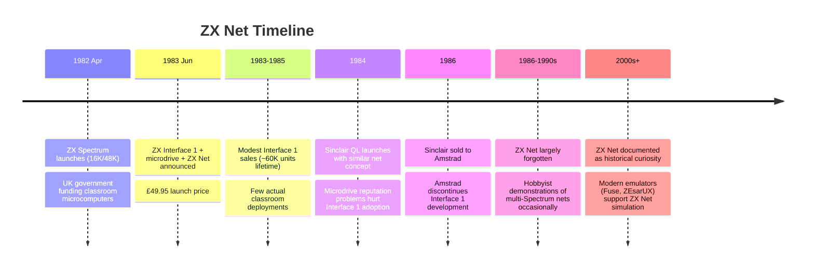
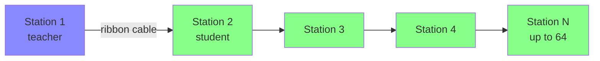

[← Home](../../README.md) · [Networking](README.md)

# ZX Net — Sinclair's 1983 Classroom Local Area Network for the ZX Spectrum

**ZX Net** was Sinclair Research's local area networking system for the ZX Spectrum, introduced with the **ZX Interface 1** peripheral in **1983**. ZX Net allowed up to **64 ZX Spectrums** to be daisy-chained into a single network using proprietary ribbon-cable wiring, with each station addressed by a unique network identity in the range 1–64. The system was designed primarily for the **classroom market** — schools deploying banks of Spectrums for computer-literacy education — and shipped with ROM-based network primitives exposed as Sinclair BASIC extensions.

ZX Net was, by most accounts, a commercial failure. The Interface 1 itself sold modestly (~60,000 units through the Spectrum's commercial life), and classroom deployments of multi-Spectrum ZX Net networks were rare. But ZX Net is historically significant as **the first LAN product for a home computer**, predating Novell NetWare's broader PC adoption by several years and demonstrating that microcomputer networking was technically feasible at the consumer-peripheral price point.

The Interface 1 also introduced **microdrives** (Sinclair's string-loop tape cartridge system) and the **RS-232 interface** — these are covered in the broader storage documentation under [Storage Formats](../storage/README.md). This article covers **only the ZX Net networking** capability.

---

## History

### The Classroom Market (1982–1983)

When the ZX Spectrum launched in April 1982, the UK government's **Computers in Schools** initiative was funding microcomputer purchases by secondary schools. Several manufacturers competed for this market — Acorn (BBC Micro), Research Machines (380Z), and Commodore (PET) all had classroom-ready products. Sinclair's position was unusual: the Spectrum was the cheapest serious machine (£125–£175 vs £400+ for the BBC Micro), but it lacked the networking that classroom use demanded.

A classroom with 16–32 networked microcomputers needed to:

- **Distribute software** from a central machine to all student stations simultaneously (avoiding the minutes-long tape-load per machine)
- **Collect student work** back to the teacher's machine for review
- **Broadcast messages** from teacher to students
- **Share peripherals** (printers, disk storage) across the network

Sinclair's answer was the **ZX Interface 1 + ZX Net** combination, launched in 1983 alongside the microdrive. The Interface 1 was a wedge-shaped peripheral that attached to the Spectrum's edge connector, providing microdrive cartridges, an RS-232 port, and the ZX Net network interface. Priced at £49.95, the Interface 1 made Spectrum networking affordable in theory — but the practical classroom deployments were few.

### The 1983 Launch

The Interface 1 launched in mid-1983 with a software stack that included:

- **Sinclair NET** — the network operating system, in 8 KB of ROM inside the Interface 1
- **Network BASIC extensions** — new BASIC commands like `*LOAD name N`, `*SAVE name N`, `*ERASE name N` to access network resources
- **Network-aware microdrive** — files could be loaded from a remote microdrive on another station

The Interface 1's 8 KB of ROM (the "dock") expanded the Spectrum's I/O capabilities significantly. From BASIC, the network was exposed through the `*` (star) command prefix that the dock ROM hooked into the Spectrum's command interpreter.



---

## Hardware

### Physical Connector and Cabling

ZX Net used a **proprietary 9-pin D-sub connector** on the Interface 1 itself, but the inter-station cabling was **two-conductor ribbon cable** (signal + ground) fitted with 3.5mm jack plugs at each end. Each Spectrum on the network had two jacks — one for "in" from the previous station, one for "out" to the next — forming a daisy chain. The physical topology was thus a **bus**, electrically, with the daisy-chained ribbon cable providing the shared medium.

The cabling was simple and cheap but had limitations:

- **Cable length** — Sinclair recommended no more than ~10 meters between adjacent stations, limiting total network span to perhaps 100 meters for a 10-station net
- **No termination** — the bus relied on the Interface 1's input impedance rather than proper termination resistors, leading to signal reflections on longer runs
- **Single-point failure** — unplugging a cable in the middle of the daisy chain disconnected everything downstream
- **Electrical noise** — unshielded ribbon cable was susceptible to classroom-environment interference (fluorescent lights, CRT monitors)

### Network Identity

Each Interface 1 was assigned a **network station number** in the range 1–64 by the user, via the `*NET` command:

```basic
*NET 1      ; this station is #1
```

The station number was stored in Interface 1 RAM and persisted until power-off (it had to be re-entered on each cold boot). Station 0 was reserved for broadcast — packets addressed to station 0 were received by all stations.

### Electrical Signaling

ZX Net used **single-wire serial signaling** at roughly **9600 bit/s** — comparable to the Spectrum's RS-232 baud rate. The protocol was asynchronous, byte-framed with start and stop bits. The Interface 1's ROM contained a simple device driver that bit-banged the network line using a Z80 timer loop.

The 9600 bit/s rate sounds slow by modern standards, but in 1983 it was competitive with the alternatives (acoustic couplers ran at 300 bit/s; the BBC Micro's Econet ran at similar speeds). Transferring a 16 KB program between two Spectrums took roughly 15 seconds over ZX Net — versus several minutes for a tape load.



### Why 64 Stations?

The 64-station limit was a consequence of the **6-bit address field** in the ZX Net packet format (2^6 = 64 possible addresses, with 0 reserved for broadcast). This gave 63 unicast addresses plus broadcast — adequate for a single classroom but too few for whole-school deployments.

The Econet (Acorn's competing network for the BBC Micro) supported up to 254 stations using an 8-bit address field, making it more suitable for whole-school networks. ZX Net's smaller address space reflected Sinclair's narrower target market.

---

## Protocol

### Packet Format

ZX Net's protocol was a simple **packet-switched bus** design. Every packet was transmitted on the shared wire and visible to every station; each station's Interface 1 ROM inspected the destination address and either accepted the packet or ignored it. There was no collision detection (CSMA/CD) — Sinclair relied on the ROM's centralised polling scheme to avoid collisions.

The packet format (reconstructed from Interface 1 ROM disassembly):

| Field | Length | Purpose |
|---|---|---|
| Destination | 1 byte | Station number (0 = broadcast, 1–63 = unicast) |
| Source | 1 byte | Originating station number |
| Length | 1 byte | Payload length (max 255 bytes) |
| Control | 1 byte | Packet type (data, control, file transfer, etc.) |
| Payload | N bytes | The actual data |
| Checksum | 1 byte | XOR of all preceding bytes |

The 255-byte payload limit meant file transfers required **fragmentation** — a 16 KB program required roughly 64 packets, each with its own header overhead. The Interface 1 ROM handled fragmentation transparently for `*LOAD` / `*SAVE` operations.

### Media Access: Polling, Not Contention

ZX Net's most distinctive protocol feature was its **polling-based media access control (MAC)**. Rather than the CSMA/CD approach that Ethernet would popularise, ZX Net designated **station 1** as the network controller. Station 1 polled each other station in turn, offering it a transmit window:

```
Station 1: "Station 2, do you have traffic?"
Station 2: "No."
Station 1: "Station 3, do you have traffic?"
Station 3: "Yes. Here is a packet for Station 5."
Station 1: "Acknowledged. Station 4, do you have traffic?"
...
```

This **token-passing-like** scheme avoided collisions entirely but had two costs:

1. **Latency** — a station had to wait for its poll before transmitting. On a 32-station network, worst-case latency was 32 poll cycles.
2. **Single point of failure** — if station 1 was switched off or crashed, the entire network stopped. There was no automatic election of a new controller.

### The ROM API

The Interface 1's 8 KB "dock" ROM exposed the network through Sinclair BASIC extensions. The key commands:

| Command | Function |
|---|---|
| `*NET n` | Set this station's network number (1–64) |
| `*SAVE "name" N` | Save file to a remote station's microdrive (named by `name`) |
| `*LOAD "name" N` | Load file from a remote station |
| `*ERA "name" N` | Erase a file on a remote station |
| `*CAT N` | List files on the network controller's microdrive |
| `*FORMAT "n", N` | Format a microdrive cartridge on station N |
| `*COPY` | Copy files, optionally across the network |
| `*REN old new N` | Rename a file on a remote station |

The `N` suffix indicated "network operation" — without it, the same commands operated on the local station's microdrive. This made network access transparent to the BASIC programmer.

A teacher's machine (station 1) could thus distribute a program to all student machines with a single command:

```basic
*SAVE "lesson1" N        ; to network controller
```

Each student could then load it:

```basic
*LOAD "lesson1" N
```

### File Naming and the Network Catalog

ZX Net used the microdrive file naming convention — file names up to 10 characters, alphanumeric, no directories. The Interface 1 maintained a **per-cartridge file catalog** that consumed the first few tracks of each microdrive. The catalog had **no hierarchical structure** — just a flat list of (name, length, start-track) entries.

When a station requested a file via `*LOAD name N`, the network protocol located the file by querying the network controller (station 1), which maintained the authoritative catalog. This centralised the file system and made station 1's microdrive the de facto file server.

---

## Software Ecosystem

### Educational Software

ZX Net's intended market was computer-literacy education. A handful of educational software packages were produced for ZX Net deployments in 1983–1985:

- **Sinclair's own classroom suite** — basic word processing, spreadsheet-like calculations, and simple educational games, distributed on microdrive and intended for teacher-to-student network distribution
- **CLE (Computer Literacy Education)** packages — third-party educational programs from MEJ Computer Services and other educational publishers
- **Network-aware BASIC teaching tools** — class-management software allowing the teacher to view student screens (in theory; in practice the bandwidth was too low)

The educational software ecosystem was thin. Most schools that did adopt Spectrums used standalone tape-based software, not networked deployments.

### Hobbyist Use

Outside classrooms, ZX Net saw occasional hobbyist use for multiplayer experiments. Multi-player games over ZX Net were technically feasible (the 9600 bit/s rate was adequate for turn-based and slow real-time games), but few were produced because the installed base of Interface 1s was small. Documented ZX Net multiplayer games include **Netx** (a turn-based strategy game) and a few homebrew chat programs.

### The Barley and Sinclair Research

Several academic papers from 1983–1985 analyzed ZX Net's design — notably **Ian Logan and Mike O'Hare's** disassembly of the Interface 1 ROM, which revealed the polling-based MAC and the packet format. These papers remain the primary technical reference for ZX Net today.

### Why ZX Net Failed Commercially

ZX Net's commercial failure had several causes:

1. **Microdrive reputation** — The Interface 1's microdrives were notoriously unreliable (string-loop breakage, head alignment drift). Schools that tried Interface 1s for storage often abandoned them, taking ZX Net with them.
2. **Econet competition** — Acorn's Econet, while more expensive, was more reliable and supported by Acorn's classroom-focused sales and support infrastructure. UK schools standardising on networking chose Econet.
3. **Price/performance** — At £49.95 per Interface 1, networking a 16-station classroom cost £800 just for the interfaces, plus cabling. A BBC Micro with Econet was more expensive per station but had better support.
4. **No compelling software** — The educational software ecosystem never developed enough demand to justify deployment.
5. **Sinclair's broader business troubles** — By 1984–1985, Sinclair was distracted by the QL and the C5; Interface 1 development was effectively frozen.

The result: ZX Net shipped in 1983, sold modestly through 1985, and was effectively dead by the time Amstrad acquired Sinclair in 1986. The network capability was not continued in Amstrad's +2/+3 line.

---

## Legacy

### Historical Significance

ZX Net was the **first local area networking product for a home computer** at consumer-affordable prices. It predated:

- **AppleTalk** (1985)
- **Novell NetWare** for PCs (1983, but at much higher cost)
- **ARCnet** (1977, but commercial cards for PCs were expensive)

ZX Net demonstrated that home-computer-scale networking was technically feasible. The product was commercially unsuccessful, but the design choices (polling-based MAC, simple packet format, ROM-resident protocol stack) influenced later microcomputer networking efforts.

### Modern Emulation

Modern Spectrum emulators support ZX Net simulation, allowing multi-station networks to be explored in software:

- **Fuse** — supports networked operation between multiple Fuse instances
- **ZEsarUX** — supports ZX Net simulation with detailed debugger access to the protocol
- **SpecEmu** — supports networked operation

These emulators preserve ZX Net's design and allow modern developers to study the protocol without requiring vintage hardware.

### Documentation

The most authoritative technical references for ZX Net are:

- **Ian Logan & Mike O'Hare — *Sinclair ZX Interface 1 — Software ROM Disassembly*** (1984) — the canonical disassembly of the Interface 1 dock ROM
- **The ZX Interface 1 manual** (Sinclair Research, 1983) — user-facing documentation of `*` commands
- **World of Spectrum's Interface 1 documentation** — modern HTML transcription of the original manuals

---

## Frequently Asked Questions

### Can I use ZX Net today?

Real-hardware ZX Net requires working Interface 1s (rare and failure-prone after 40+ years) and intact ribbon cabling. Modern hobbyists occasionally demonstrate multi-Spectrum ZX Net setups at retro-computing events. For software exploration, **Fuse** or **ZEsarUX** provide complete ZX Net simulation between multiple emulator instances.

### Was ZX Net ever used in production outside classrooms?

Rarely. A few small businesses tried ZX Net for sharing printers between Spectrums, but the cost and reliability issues made dedicated print servers more practical. ZX Net was almost exclusively a classroom-targeted product.

### How did ZX Net compare to Econet?

Econet was the competing classroom networking product for Acorn's BBC Micro. Key differences:

| Aspect | ZX Net | Econet |
|---|---|---|
| **Max stations** | 64 (6-bit address) | 254 (8-bit address) |
| **Baud rate** | ~9600 bit/s | ~8000 bit/s (similar) |
| **MAC** | Polling (single controller) | Token passing (distributed) |
| **Cabling** | Unshielded ribbon | Twisted pair (better noise immunity) |
| **Hardware cost** | £49.95 per station | £100+ per station |
| **Real-world deployment** | Few | Widespread in UK schools |
| **Software ecosystem** | Thin | Substantial (Acorn-subsidised) |

Econet won the classroom market decisively. ZX Net's lower price was not enough to overcome Econet's reliability and software support advantages.

### Did the Russian clone scene implement ZX Net?

No. Russian clones (Pentagon, Scorpion, etc.) generally did not implement the ZX Interface 1's networking capability. The Russian scene focused on TR-DOS disk storage and direct peer-to-peer connections via serial ports for file exchange. ZX Net was a Western-only product.

### Is there a modern TCP/IP bridge to ZX Net?

Several hobbyist projects have built bridges between real ZX Net hardware and modern TCP/IP networks, allowing Internet-to-Spectrum communication. These are niche hobbyist efforts; for modern TCP/IP on the Spectrum, the [Spectranet](spectranet.md) is the established hardware solution.

---

## Summary

ZX Net was **Sinclair's ambitious 1983 attempt to bring local area networking to the home-computer classroom**. Bundled with the ZX Interface 1, ZX Net allowed up to 64 Spectrums to share files and resources over ribbon-cable wiring using a polling-based MAC protocol in the Interface 1's dock ROM.

Commercially unsuccessful (defeated by Econet's reliability, microdrive's reputation, and the absence of compelling educational software), ZX Net nevertheless demonstrated that home-computer-scale networking was technically feasible at consumer prices. Its design choices — polling-based media access, ROM-resident protocol stack, BASIC-level API — influenced later microcomputer networking efforts.

For modern exploration, **Fuse and ZEsarUX** provide complete ZX Net simulation. The Interface 1 ROM disassembly by Ian Logan and Mike O'Hare (1984) remains the definitive technical reference.

---

## References

### Primary Sources

- [Ian Logan & Mike O'Hare — Sinclair ZX Interface 1 — Software ROM Disassembly](https://worldofspectrum.org/) — the canonical disassembly of the dock ROM, including the ZX Net protocol implementation
- [Sinclair Research — ZX Interface 1 Manual](https://worldofspectrum.org/) — the user-facing documentation of `*` commands including `*NET`, `*LOAD name N`, etc.
- **Sinclair Research — *ZX Microdrive Manual*** (1983) — companion documentation for the microdrive file system that ZX Net exposed

### Contemporary Coverage

- [CRASH magazine Interface 1 review](https://worldofspectrum.org/) — contemporary assessment of ZX Net's classroom potential
- [Sinclair User](https://archive.org/details/sinclair-user-magazine) and **Your Spectrum** articles (1983–1985) — coverage of Interface 1 hardware, microdrive reliability, and educational deployments
- **Comparative reviews of ZX Net vs Econet** (1984–1985) — contemporary discussion of the classroom-networking market

### Modern Sources

- [World of Spectrum Interface 1 documentation](https://worldofspectrum.org/) — modern HTML transcription of the original Sinclair manuals
- [Fuse emulator documentation](https://fuse-emulator.sourceforge.net/) — ZX Net simulation between Fuse instances
- [ZEsarUX documentation](https://github.com/chernandezba/zesarux) — ZX Net simulation with debugger access to the protocol state

### Related Articles in This Knowledge Base

- [Modems](modems.md) — early Internet connectivity via telephone lines
- [Spectranet](spectranet.md) — modern TCP/IP networking hardware for the Spectrum
- [ZiFi](zifi.md) — modern WiFi module for the Spectrum
- [ESP WiFi](esp_wifi.md) — [ESP8266](https://www.espressif.com/en/support/documents/technical-documents)/ESP32-based WiFi modules
- [ZX Spectrum Next WiFi](zx_next_wifi.md) — the Next's built-in WiFi capability
- [Storage Formats](../storage/README.md) — [Interface 1](https://worldofspectrum.org/) microdrive and RS-232 documentation
