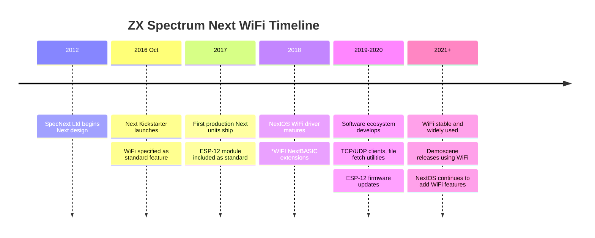

[← Home](../../README.md) · [Networking](README.md)

# ZX Spectrum Next WiFi — Built-In ESP8266 over SPI

The **ZX Spectrum Next** includes an **on-board ESP-12 WiFi module** as standard hardware, connected to the Next's FPGA via SPI rather than through a UART. This design gives the Next WiFi and TCP/IP connectivity **integrated into the machine itself** — no external dongles, no ribbon cables, no fragile level-shifter boards. From the user's perspective, WiFi is just another built-in peripheral, alongside the SD card slot, the layer 2 graphics, and the Z80N CPU.

The Next's WiFi represents the most integrated Spectrum networking solution ever shipped. Compared to the older [Spectranet](spectranet.md) (external Ethernet interface), [ZiFi](zifi.md) (external ESP8266 via serial), or the broader [ESP WiFi](esp_wifi.md) family, the Next's built-in WiFi offers:

- **Highest throughput** of any Spectrum networking option (SPI-based, not UART-limited)
- **Tightest integration** with the host machine (NextOS WiFi layer, NextBASIC `*WIFI` commands)
- **No external hardware** — the ESP-12 is inside the case, powered by the Next's supply
- **Custom firmware** on the ESP-12, designed specifically for the Next's needs

This article covers the Next's WiFi hardware, the SPI-based protocol between FPGA and ESP-12, the NextOS WiFi driver layer, the NextBASIC extensions exposed to user programs, the software ecosystem, and the relationship to other Spectrum WiFi solutions. For the broader ESP8266 family, see [esp_wifi.md](esp_wifi.md); for the most directly comparable ZiFi project (which the Next's WiFi effectively replaces for Next owners), see [zifi.md](zifi.md).

---

## History

### The ZX Spectrum Next Project (2012–2017)

The ZX Spectrum Next was conceived in **2012** by the **SpecNext Ltd** team, a group led by Jim Bagley, Victor Trucco, and others. Their goal was to create a modern Spectrum-compatible machine — not an emulator, not a clone, but a true evolution of the original Sinclair hardware, built around an FPGA and adding substantial new capabilities while remaining backward-compatible with original Spectrum software.

The Next was **crowdfunded on Kickstarter** in **October 2016**, raising over £500,000 from more than 3,000 backers. The first production units shipped in **2017–2018**, with the larger "TBBlue" board (with full expansion connector) following later. The Next includes:

- An **FPGA** implementing the Spectrum chipset (ULA, Z80, memory banking, etc.) with extensions
- The **Z80N** — a Spectrum-compatible CPU with new instructions and addressing modes
- Up to **2 MB of RAM** (vs 128 KB on the original +2A/+3)
- **Layer 2 graphics** — high-resolution, hardware-sprite, hardware-scroll graphics
- **Hardware sprites**, tilemap, and other enhanced graphics modes
- An **SD card** interface for mass storage
- A **Raspberry Pi Zero** socket for hardware-level expansion
- **WiFi** via the built-in ESP-12 module

The Next's WiFi was a significant differentiator — no other Spectrum-compatible machine had ever shipped with built-in WiFi. The decision to include it reflected the Next team's ambition to make the machine a viable modern Internet-connected computer, not just a retro gaming console.

### WiFi Hardware Choice

The Next team selected the **ESP-12 module** (an ESP8266 variant) for the WiFi subsystem. This choice was driven by several factors:

- **Cost** — ESP-12 modules cost under £3 in volume, keeping the Next's BOM manageable
- **Capability** — ESP8266 has built-in 802.11 b/g/n WiFi and a full TCP/IP stack
- **Maturity** — by 2016, ESP8266 firmware was well-established and reliable
- **Community** — the ESP8266 had a large hobbyist community, useful for development and troubleshooting
- **GPIO availability** — the ESP-12 exposes 16+ GPIO pins, allowing the Next's FPGA to control additional ESP8266 functions beyond the SPI bus

The ESP-12 was connected to the Next's FPGA via **SPI**, not via the Z80's UART. This was a deliberate design choice to avoid the throughput ceiling of the UART-based ZiFi approach (see [zifi.md](zifi.md)) — SPI at multi-megahertz clock rates gives the Next WiFi throughput that approaches the underlying WiFi bandwidth, rather than being serial-port-limited.

### Software Development (2016–2020)

The Next's WiFi software stack was developed in parallel with the hardware. Key components:

- **ESP-12 firmware** — custom firmware written by the Next team, exposing a binary protocol optimized for SPI-based communication with the FPGA. This is not the stock Espressif AT firmware (though that could be flashed if desired)
- **NextOS WiFi driver** — a layer in the NextOS ROM that translates Z80-side calls into SPI transactions with the ESP-12
- **NextBASIC extensions** — `*WIFI` commands exposing WiFi configuration, connection, and TCP/UDP operations to BASIC programs
- **Esxdos WiFi integration** — file-system operations that can transparently fetch files over the network

The NextOS WiFi layer reached maturity around 2020, and continues to be refined as the NextOS firmware is updated.



---


## Hardware

### The ESP-12 Module

The Next uses an **ESP-12 module** (typically ESP-12E or ESP-12F), which contains:

- The **ESP8266EX chip** — Tensilica L106 32-bit core at 80 MHz, with WiFi radio
- **4 MB of SPI flash** — holding the firmware (larger than the 512 KB–1 MB typical of ESP-01)
- **PCB trace antenna** — for WiFi reception
- **22 GPIO pins** — exposed on the ESP-12 module (vs only 2 on the ESP-01)

The 4 MB flash is significant because it allows the Next's custom firmware to be larger and more capable than the stock AT firmware (which fits in 512 KB). The Next team's firmware includes a full LwIP TCP/IP stack, a custom SPI-slave protocol handler, and utility routines — totalling several hundred KB of compiled code.

### SPI Connection to the FPGA

The ESP-12 is connected to the Next's FPGA (the **Cyclone IV** on the TBBlue board) via an SPI bus. This is fundamentally different from ZiFi's UART-based connection (see [zifi.md](zifi.md)):

| Aspect | ZiFi (UART) | Next WiFi (SPI) |
|---|---|---|
| **Bus** | Asynchronous serial (TX/RX) | Synchronous serial (MOSI/MISO/SCK/CS) |
| **Clock speed** | Baud rate 9600–115200 | SPI clock 4–40 MHz |
| **Throughput** | 1–11 KB/s | 100 KB/s – 1+ MB/s |
| **Protocol** | Text (AT commands) | Binary (custom firmware commands) |
| **Latency** | 10–100 ms per op | Sub-millisecond per op |
| **GPIO usage** | 2 (TX, RX) | 4+ (MOSI, MISO, SCK, CS, INT) |

The SPI connection allows the FPGA to issue commands and read responses at multi-megahertz clock rates. In practice, the Next's WiFi throughput is limited by:

- The ESP8266's WiFi bandwidth (max ~1-2 Mbit/s real-world TCP throughput on 802.11n)
- The Z80N's processing speed when handling large data transfers
- The NextOS driver's efficiency

Realistic Next WiFi throughput is roughly **100–500 KB/s** for sustained transfers — 10–50× faster than ZiFi.

### Additional Control Pins

Beyond the SPI bus, the FPGA connects to several ESP-12 GPIO pins for control and status:

- **ESP reset** — allows the FPGA to reset the ESP-12 (useful for recovery)
- **ESP boot mode (GPIO0)** — allows the FPGA to force the ESP-12 into UART bootloader mode, for firmware updates via the Next's serial port
- **ESP interrupt (GPIO5 or similar)** — the ESP-12 can assert an interrupt when data arrives or status changes, allowing interrupt-driven driver design
- **ESP chip select (CS)** — SPI slave select

This rich set of control pins makes the Next's WiFi hardware more capable than a typical ZiFi bridge. The FPGA can fully manage the ESP-12, including firmware updates, reset, and interrupt-driven operation.

### Power Supply

The ESP-12 is powered by the Next's 3.3V rail, which is regulated from the Next's main 5V supply. The Next's power supply was designed from the start to handle the ESP-12's ~300 mA peak current draw (during WiFi transmission), with substantial bulk capacitance near the ESP-12 module. This eliminates the power-supply problems that plague ZiFi builds on original Spectrums.

---

## Firmware and Driver Layer

### ESP-12 Firmware

The Next's ESP-12 runs **custom firmware** developed by the Next team, not the stock Espressif AT firmware. This custom firmware exposes a binary SPI-based protocol optimized for the Next's needs:

- **Binary framing** — fixed-size command/response packets rather than text AT commands
- **SPI slave protocol** — the firmware acts as an SPI slave, reading commands from the FPGA and writing responses back
- **TCP/IP stack** — a full LwIP-based stack with TCP, UDP, DNS, DHCP, and limited SSL/TLS support
- **Connection management** — supports up to 8 simultaneous TCP/UDP connections
- **Status reporting** — connection state, error codes, signal strength, IP configuration

The custom firmware is several years more modern than the stock AT firmware, with bug fixes and performance improvements that the Next team has accumulated through extensive testing. It is updated periodically via NextOS updates.

### NextOS WiFi Driver

The NextOS ROM includes a **WiFi driver layer** that translates Z80-side API calls into SPI transactions with the ESP-12. From the application programmer's perspective, this layer is the WiFi interface — the SPI mechanics are hidden.

The driver provides:

- **Connection management** — connect to an access point, query status, disconnect
- **Socket operations** — open TCP/UDP connections, send and receive data, close connections
- **Hostname resolution** — DNS lookups (returns IP addresses from hostnames)
- **File retrieval helpers** — convenience routines for fetching files via HTTP

The driver is invoked via NextOS system calls (typically through `RST #08` or similar hook codes) and is accessible from both NextBASIC and Z80N machine-code programs.

### Memory Layout

The Next's WiFi driver uses a portion of the machine's memory:

- **Driver code itself** — in the NextOS ROM, paged into the Spectrum address space as needed
- **Connection state** — in dedicated RAM, typically a few hundred bytes per active connection
- **Packet buffers** — in main Spectrum RAM, allocated by the application for send/receive operations
- **ESP-12's internal buffers** — packet data on the ESP-12 side, in its own RAM (not visible to the Z80N directly)

This is similar to the Spectranet's memory model (see [spectranet.md](spectranet.md)) — the application provides the buffers, and the driver copies data between the application buffers and the ESP-12.

---


## NextBASIC `*WIFI` Commands

The Next extends NextBASIC with a family of `*WIFI` commands that expose the WiFi subsystem to BASIC programs. These commands are interpreted by the NextOS WiFi driver, which translates them into SPI transactions with the ESP-12.

### WiFi Configuration

| Command | Purpose |
|---|---|
| `*WIFI ON` | Power on the ESP-12 module |
| `*WIFI OFF` | Power off the ESP-12 module |
| `*WIFI SCAN` | Scan for available WiFi networks |
| `*WIFI CONNECT "ssid","password"` | Connect to an access point |
| `*WIFI DISCONNECT` | Disconnect from the current AP |
| `*WIFI STATUS` | Query current connection status |
| `*WIFI IP` | Show the assigned IP address |
| `*WIFI MAC` | Show the ESP-12's MAC address |
| `*WIFI SSID` | Show the connected SSID |

A typical NextBASIC WiFi setup looks like:

```basic
10 *WIFI ON
20 *WIFI CONNECT "MyWiFi","secret123"
30 *WIFI STATUS
```

The `*WIFI STATUS` command returns the connection state as a string, which the BASIC program can inspect.

### TCP/UDP Operations

For TCP and UDP, NextBASIC provides socket-style commands:

| Command | Purpose |
|---|---|
| `*WIFI TCP CONNECT host$,port` | Open a TCP connection to host:port |
| `*WIFI TCP SEND socket%,data$` | Send data on a TCP socket |
| `*WIFI TCP RECV socket%,len% TO buf$` | Receive data on a TCP socket |
| `*WIFI TCP CLOSE socket%` | Close a TCP connection |
| `*WIFI UDP OPEN port` | Open a UDP socket |
| `*WIFI UDP SEND ...` | Send a UDP datagram |

The exact syntax has evolved across NextOS versions — early versions had simpler commands, while later versions added more complete socket APIs supporting multiple simultaneous connections.

### File Retrieval Helpers

The Next provides convenience commands for fetching files via HTTP:

```basic
10 *HTTP GET "http://example.com/spectrum/file.tap" TO "SD:/downloads/file.tap"
```

This makes the file appear on the SD card as if it had been copied from another machine. The NextOS WiFi driver handles the HTTP protocol details, including DNS resolution, TCP connection, and HTTP request formatting.

### Comparison to Other APIs

The Next's `*WIFI` API is more accessible than the alternatives:

- **vs ZiFi AT commands** — NextBASIC commands are higher-level than raw AT commands; the driver handles framing, escaping, and parsing
- **vs Spectranet socket API** — similar capabilities but integrated into NextBASIC syntax rather than exposed via `*` extensions
- **vs raw machine code** — NextBASIC `*WIFI` is easier to use for simple programs; for performance-critical applications, the underlying driver can be called directly from Z80N code

---

## Software Ecosystem

### Telnet Clients

The Next has several telnet clients that use the built-in WiFi, including ports of classic Spectrum telnet software and Next-native implementations. Because the Next has more RAM and faster I/O than original Spectrums, Next telnet clients can offer richer terminal emulation, larger scrollback buffers, and faster screen updates than ZiFi-based equivalents.

### File Browsers and Fetchers

Next-specific file browsers (such as the **BeeSec** browser and various Next-OS-integrated file managers) can fetch files from Internet archives directly. This is particularly useful for retro Spectrum software — the user can browse the World of Spectrum archive and download a `.tap` or `.z80` file directly to the Next's SD card without leaving the machine.

### Network Games

Several multiplayer Spectrum games have Next-specific network modes:

- **Real-time multiplayer** — fast WiFi allows real-time play (vs the polling-based gameplay on slower ZiFi bridges)
- **Demoscene releases** — Next demos that fetch data over WiFi during the demo (e.g., streaming graphics or audio that exceeds the Next's local storage)

### Remote Display and Control

Some Next software uses WiFi for remote display and control — a desktop computer or mobile phone can connect to the Next over the network and view the Next's screen, send keystrokes, or transfer files. This is invaluable for users who want to interact with the Next from a modern device without a dedicated monitor.

### Demoscene Use

The Next's WiFi has been used by the demoscene for various creative purposes:

- **Live-coded demos** — receiving demo code over WiFi at a demoscene party
- **Network-controlled visuals** — multiple Nexts coordinating their visual output via WiFi
- **Internet-connected demos** — fetching live data (weather, news, social media) and incorporating it into the demo's visuals

### Comparison with ZiFi and Spectranet

| Aspect | Next WiFi | ZiFi | Spectranet |
|---|---|---|---|
| **Hardware** | Built-in ESP-12 | External ESP-01 | External ENC28J60 + flash ROM |
| **Connection** | SPI to FPGA | UART to serial port | SPI to Z80 memory bus |
| **Throughput** | 100–500 KB/s | 2–8 KB/s | ~100 KB/s |
| **Latency** | Sub-ms | 10–100 ms | Sub-ms |
| **Cost** | Free (built into Next) | ~£5–£10 in parts | ~£60 |
| **API** | NextBASIC `*WIFI` + Z80N syscalls | AT commands over UART | BSD socket API |
| **TCP/IP location** | ESP-12 firmware | ESP8266 firmware | Spectrum ROM |
| **Hardware compatibility** | Next only | Any Spectrum with serial port | Most Spectrums |

The Next's WiFi is unambiguously the best Spectrum WiFi solution **for Next owners** — it has the highest throughput, the tightest integration, and the lowest cost (free, being built-in). For original Spectrum hardware, ZiFi and Spectranet remain the options, with their respective trade-offs.

---


## FAQ

**Q: Does the Next WiFi work with WPA2/WPA3?**

A: Yes — the ESP-12 firmware supports WPA, WPA2, and WPA3 (the latter with firmware updates). WPA2 is the standard for home and enterprise networks and works reliably. WPA3 support is more recent and may require updating the ESP-12 firmware via a NextOS update.

**Q: How do I update the ESP-12 firmware?**

A: Through a NextOS update. The NextOS team periodically releases updates that include newer ESP-12 firmware; running the NextOS update process automatically updates both the NextOS ROM and the ESP-12 firmware. This is a substantially smoother process than reflashing an external ESP-01 module (as ZiFi users must do).

**Q: Can I replace the Next's custom firmware with stock AT firmware?**

A: Technically yes — the ESP-12 can be forced into UART bootloader mode and flashed with the stock Espressif AT firmware via the Next's serial port. However, this is strongly discouraged because:

- The NextOS WiFi driver expects the custom firmware's SPI-slave binary protocol, not AT commands
- Installing AT firmware would break all NextOS WiFi functionality
- Reverting to the custom firmware requires another flash cycle

If you want to experiment with AT firmware on an ESP8266, use a separate ESP-01 module connected via serial, not the Next's built-in ESP-12.

**Q: Can I use the Next's WiFi to share files with another Next?**

A: Yes — there are several file-sharing utilities that use TCP/UDP over WiFi to transfer files between Nexts on the same local network. This is the modern equivalent of ZX Net's classroom file distribution (see [zx_net.md](zx_net.md)), but using TCP/IP over WiFi instead of ZX Net's polling protocol over ribbon cable.

**Q: How does the Next handle WiFi credentials?**

A: The NextOS WiFi driver stores the last-connected SSID and password in non-volatile memory (typically the SD card or a dedicated configuration sector). On boot, the driver attempts to reconnect automatically — if the network is in range, the Next reconnects without prompting the user.

**Q: Can I use the Next as a WiFi access point?**

A: Some ESP8266 firmware versions support access-point mode, but the Next's custom firmware is designed for station mode (connecting to an existing AP). AP mode would require custom firmware modifications and is not standard.

**Q: What's the maximum number of simultaneous TCP connections?**

A: The Next's WiFi driver supports up to **8 simultaneous TCP/UDP connections** — more than enough for any realistic Spectrum networking application. Each connection consumes some driver state and a small amount of RAM for buffers.

**Q: Does the Next's WiFi work with HTTPS?**

A: Yes, with limitations. The ESP-12 firmware includes SSL/TLS support for HTTPS connections, but SSL negotiation is slow on the ESP8266 (several seconds per connection), and certificate verification may not be complete. For accessing modern HTTPS-only services, this works but may require accepting certificate warnings. Many retro-targeted services still offer plaintext HTTP for compatibility.

---

## Summary

The ZX Spectrum Next's built-in WiFi is the **most integrated, highest-performance networking solution** in the Spectrum ecosystem. By building the ESP-12 module directly into the Next's hardware and connecting it via SPI to the FPGA, the Next team achieved throughput and integration that no external solution (ZiFi, Spectranet, ESP WiFi bridges) can match. The custom firmware and NextOS WiFi driver layer expose this capability through accessible NextBASIC `*WIFI` commands and lower-level Z80N system calls.

For Next owners, the WiFi is essentially free — included with the machine, powered by the Next's supply, integrated into the OS. For original Spectrum hardware owners, the Next's WiFi solution doesn't apply, but the design choices made for the Next (SPI over UART, custom firmware over stock AT, integrated rather than external) demonstrate what is possible when a Spectrum-compatible machine is designed from the ground up for modern networking.

The Next's WiFi represents, in many ways, **what 1980s Sinclair might have built** had WiFi existed in 1982 and had Sinclair had the resources to integrate it properly. It is the spiritual successor to the 1983 [ZX Net](zx_net.md) — providing the easy, integrated networking that ZX Net aspired to, but achieving it with technology that didn't exist for another 30 years.

---

## References

### Primary Sources

- **ZX Spectrum Next Documentation** — official technical reference for the Next hardware and NextOS
- **NextOS source code and release notes** — WiFi driver implementation and changelog
- **SpecNext forum and wiki** — community-contributed WiFi documentation and troubleshooting
- **ESP-12 module datasheet** (Espressif Systems) — for hardware-level reference

### Modern Sources

- ZX Spectrum Next Kickstarter updates — design rationale for built-in WiFi
- Demoscene releases that use Next WiFi (e.g., party demos with network-controlled visuals)
- Next community software (telnet clients, file browsers, multiplayer games) on GitHub

### Cross-References

- [ESP WiFi](esp_wifi.md) — the broader family of ESP8266/ESP32-based Spectrum WiFi solutions
- [ZiFi](zifi.md) — the most directly comparable external solution (serial + AT commands)
- [Spectranet](spectranet.md) — the older Ethernet-based TCP/IP interface
- [Modems](modems.md) — the 1980s dial-up era that WiFi replaced
- [ZX Net](zx_net.md) — Sinclair's 1983 classroom LAN (spiritual predecessor)
