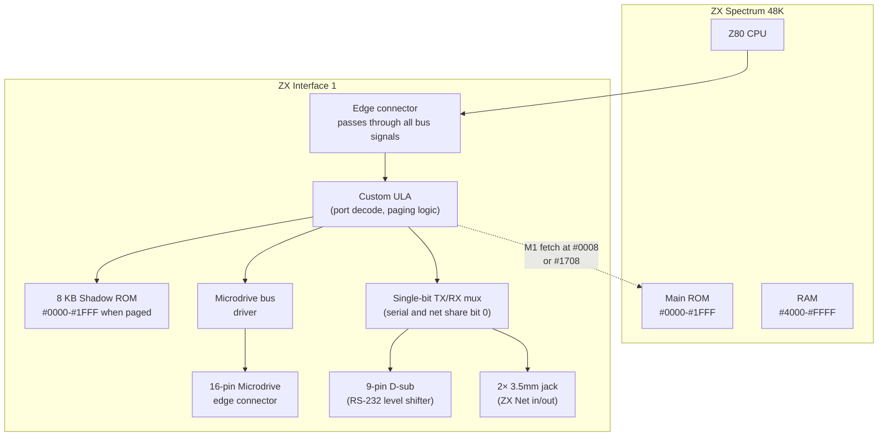

[← Home](../../README.md) · [Peripherals](README.md)

# ZX Interface 1 — Microdrive, RS-232, ZX Net, and the Shadow ROM Hook

## Overview

The ZX Spectrum, as Sinclair shipped it in April 1982, had **one storage device** (a 1500-baud cassette interface), **one expansion port** (a 28×2 edge connector), and **no opinion** about networking, disks, or serial peripherals. By 1983 the competition — the BBC Micro with its Econet LAN, the Commodore 64 with its IEEE-488 bus, the Apple II with its slots — was making that minimalism look embarrassing. Sinclair's answer, launched in November 1983 alongside the ZX Microdrive, was the **ZX Interface 1**: a £49.95 wedge that sat under the Spectrum and added **three** mutually unrelated subsystems on a single board.

The three subsystems were (a) a controller for up to **eight ZX Microdrives** — Sinclair's proprietary tape-loop cartridges, ~85 KB formatted at ~16 KB/s; (b) an **RS-232-C serial port** running at up to 9600 baud, software-framed; and (c) a **Sinclair Local Area Network** ("ZX Net") port allowing up to 64 Spectrums to be daisy-chained on a single wire for file transfer and multi-user games. Driving all three was an **8 KB shadow ROM** at `#0000–#1FFF` that paged in and out of the CPU's view via a hardware trick on the `#0008` instruction fetch — the same trick later used by the DISCiPLE, +D, and Beta 128 interfaces. The shadow ROM extended the channel system ([ROM 48K — Streams and Channels](../../04_operating_systems/rom_48k.md#streams-and-channels)) with three new device types — `M` (microdrive), `N` (network), `T` (RS-232) — and the BASIC syntax with `OPEN #`, `CLOSE #`, `CAT`, `ERASE`, `MOVE`, `FORMAT`, and `*` (serial/network output).

The Interface 1 was Sinclair's most ambitious peripheral, and in many ways Sinclair's most flawed. The Microdrive was slow, noisy, and fragile — the 200-foot tape loop stretched with use and wore out after a few hundred hours; the headline "100 KB per cartridge" was, after formatting and overhead, **85 KB** of usable storage; the RS-232 port, lacking a hardware UART, bit-banged through a single output bit and dropped characters above 9600 baud; and the ZX Net, while clever, never saw the classroom uptake Sinclair had hoped for. By 1985, third-party floppy interfaces — the **Opus Discovery** (1984, 800 KB), the **MGT DISCiPLE** (1985, 800 KB), and the **Rotronics Wafadrive** (1984, 128 KB stringy-floppy) — were eating the Microdrive's market. By 1987, the Amstrad **+3** shipped with a real 3" floppy built in, the Interface 1 was quietly dropped, and the Microdrive became a footnote.

But the Interface 1 mattered. It was the first widely-deployed demonstration that the Spectrum's ROM channel architecture — a Unix-like stream layer bolted onto a 1982 home computer — could host real devices. Its shadow-ROM paging trick became the de facto expansion mechanism: every later Spectrum storage interface copied it. Its hook-code API (`RST 8` + byte) is the closest thing the Spectrum has to a driver ABI. And its microdrive format, with its 254 sectors × 543 bytes and its 15-byte headers, is still preserved verbatim in `.MDR` files recognized by every modern emulator.

This article documents the Interface 1 as a programming target — ports, bit layouts, ROM hooks, the microdrive format, the RS-232 framing, and the ZX Net protocol — verified against the Sinclair service manual, the Ian Logan / Andrew Donoho Shadow ROM disassembly (Melbourne House, 1984), and the primary-source pinout and timing analyses on the Sinclair Wiki. For comparison with later Western floppy interfaces see [Opus Discovery / MGT Format](../storage/opus_discovery_format.md); for the Soviet Beta Disk Interface see [Beta Disk Interface](../storage/beta_disk_interface.md); for ROM internals see [ROM 48K](../../04_operating_systems/rom_48k.md); for the system variables the shadow ROM adds see [System Variables — Interface 1 Variables](../../04_operating_systems/system_variables.md#interface-1-variables-5cb6-5cef).

---


## Hardware Architecture

The Interface 1 is a wedge-shaped PCB that fits between the Spectrum's rubber-keyboard case and its rear edge connector. Electrically, it presents the full Spectrum bus to through-going expansion slots on its back edge, and adds a single 16-pin edge connector on its side for the Microdrive daisy chain. Three subsystems share the board:



The board uses a single **custom ULA** (uncommitted logic array, manufactured by Ferranti — the same vendor as the Spectrum's own ULA) to do three jobs at once: decode the three I/O ports `#F7`, `#EF`, `#E7`, manage the **shadow ROM paging** based on instruction fetches at `#0008` (the `RST 8` error handler entry) and `#1708` (a back-door entry used internally), and bit-bang both the RS-232 serial and the ZX Net signals through a single output bit (the path is selected by the **Comms Data** flag — see the port table below). A discrete level-shifter (a stock SN75188 line driver and SN75189 line receiver) converts TTL levels to ±12 V for the RS-232 D-sub.

The shadow ROM is a standard **2764 8 KB EPROM** sitting electrically parallel to the main ROM; the ULA's paging logic gates `/ROMCS` to either chip based on whether the last `M1` cycle fetch came from `#0008` (or `#1708`). This is the same paging trick that the later Beta Disk Interface, Opus Discovery, and DISCiPLE would all copy. There are **two editions of the shadow ROM** — Issue 1 and Issue 2 — which differ in internal addresses but expose identical hook codes; software that uses the hook-code API rather than absolute addresses works on both.

### Power and physical layout

- **+9 V input**: passed through from the Spectrum's PSU; the IF1 draws ~150 mA idle, ~300 mA with one Microdrive running.
- **+/-12 V**: generated on-board by a small switching regulator for the RS-232 line drivers.
- **Through bus**: a second edge connector on the back of the IF1 passes every bus signal through, so further expansions (Interface 2, ZX Printer, Multiface) can stack behind it.
- **Microdrive bus**: a 16-pin PCB-edge connector on the right side carries 7 signal pins + 9 V supply + several grounds to the daisy-chained drives.

### The three I/O ports

The IF1 decodes only three addresses — `#F7`, `#EF`, `#E7` — using address lines A0–A3. All other lines are ignored, so every alias of these three ports works (`#00F7`, `#1FF7`, `#FFF7`, etc. all hit the same register). Each port has a different read/write meaning depending on the access direction:

| Port | A0–A3 | Read                                                                                                                                                                                                                                                                                                       | Write                                                                                                                                                                                                                                                                          |
|------|-------|------------------------------------------------------------------------------------------------------------------------------------------------------------------------------------------------------------------------------------------------------------------------------------------------------------|--------------------------------------------------------------------------------------------------------------------------------------------------------------------------------------------------------------------------------------------------------------------------------|
| `#F7` | `0111` | **RX byte**: bit 7 = **TX Data** (last byte sent, looped back for echo cancel), bit 0 = **Net Input** (current ZX Net line state). Other bits read 0. The full RX byte is assembled in software by sampling bit 0 at the baud rate. | **TX byte**: bits are clocked out, one per bit-time, to either the RS-232 line (if Comms Data = 1) or the ZX Net line (if Comms Data = 0). Net output drives the open-collector ZX Net bus; serial output drives the level shifter. |
| `#EF` | `1110` | **Status**: bit 4 = **Busy** (RS-232 handshake, DTR active), bit 3 = **DTR** (data-terminal-ready from the remote end), bit 2 = **Gap** (Microdrive — ULA detected a gap between sectors), bit 1 = **Sync** (Microdrive — ULA detected a sync preamble), bit 0 = **Write Protect** (Microdrive). Bits 5–7 read 0. | **Control**: bit 5 = **Wait** (network sync — held by a slave to signal busy), bit 4 = **CTS** (clear-to-send, RS-232 handshake output), bit 3 = **Erase** (Microdrive erase head — active 2 ms before write), bit 2 = **R/W** (Microdrive — 1=read, 0=write), bit 1 = **Comms Clock** (drive-select shift clock for the Microdrive chain), bit 0 = **Comms Data** (serial data bit OR drive-select shift data — selects destination). Bit 7 unused. |
| `#E7` | `0110` | **Microdrive data read**: the next raw data byte from the active Microdrive head, shifted in by the ULA. Read in a tight loop while the head sweeps past the desired sector. | **Microdrive data write**: the next raw data byte to the active Microdrive head. Write in a tight loop, alternating with bytes from the other head (the IF1 interleaves bytes from two physical heads in the cartridge). |

> [!WARNING]
> The bit assignments above come from the Sinclair service manual and the Sinclair Wiki. Many secondary references (including some emulator source comments) print them in conflicting order or with inverted polarity — when in doubt, **the IF1 ROM source in the Logan-Donoho disassembly is authoritative**, because it is the code that actually drove the hardware.


## The Shadow ROM and Hook Codes

### The paging trick

The 8 KB shadow ROM sits electrically parallel to the Spectrum's main ROM at `#0000–#1FFF`, but is normally invisible — the main ROM owns those addresses. The Interface 1's ULA watches the bus for **`M1` cycles (instruction fetches) at address `#0008`** (or, for back-door entry, `#1708`). When it sees one, it flips a flip-flop that gates `/ROMCS` to the shadow ROM instead of the main ROM. The fetch of the byte at `#0008` is the last main-ROM instruction executed; from `#0009` onward, the CPU reads from the shadow ROM. The shadow ROM returns control to the main ROM by re-fetching an address that triggers the flip-flop back.

Why `#0008`? Because that's the entry point of the Spectrum's **error handler** — `RST 8`. The 48K ROM's `RST 8` routine (`#0008`, "REPORT-D") is invoked every time BASIC encounters an unknown token or syntax error, with the offending token's address in the system variable CH_ADD. The shadow ROM replaces this handler with its own syntax-checking code: it looks up the token, and if it's an IF1 command (`OPEN #`, `ERASE`, `CAT`, `*`, `MOVE`, `FORMAT`), it executes the corresponding routine; otherwise it jumps back to the main ROM's original error handler. This is exactly the mechanism described in [ROM 48K — Streams and Channels](../../04_operating_systems/rom_48k.md) for adding new channels, except here it's wired into hardware.

The same trick was later copied by:

| Interface | Trigger address | Shadow ROM size |
|---|---|---|
| **ZX Interface 1** | `#0008` or `#1708` | 8 KB |
| **DISCiPLE / +D** | `#0008` | 8 KB |
| **Beta Disk Interface** (Soviet) | `#3D00–#3DFF` | 16 KB TR-DOS ROM |
| **Opus Discovery** | `#0008` | 8 KB |

The Beta Disk Interface uses a slightly different scheme — the M1 fetch must occur in the `#3D00–#3DFF` range, not at `#0008` — see [Beta Disk Interface — TR-DOS ROM banking](../storage/beta_disk_interface.md#tr-dos-rom-banking).

### Hook codes — the IF1's driver API

The shadow ROM exposes a stable, ROM-edition-independent API called **hook codes**. A hook code is a two-byte sequence — `RST 8` followed by a byte in the range `#1B`–`#32` (decimal 27–50). The shadow ROM intercepts the `RST 8`, reads the next byte, looks it up in a table, and calls the corresponding routine. Hook codes are the ONLY safe way to call shadow-ROM routines from machine code; absolute addresses differ between Issue 1 and Issue 2 ROMs.

Example — test whether a key has been pressed, using hook code `#20`:

```z80
        LD      B, 0FFh         ; "no key" sentinel
        RST     08h             ; hook code restart
        DB      20h             ; hook code 20H = test keypress
        ; returns A = 0FFh if no key, A = keycode otherwise
        ; clobbers all main registers, may corrupt HL'
```

From BASIC, the same hook can be invoked indirectly with `RANDOMIZE USR` after placing the bytes in memory, but the canonical BASIC interface is via the new token commands (`CAT 1`, `LOAD *"M";1;"name"`, etc.).

Complete hook-code table (Issue 1 and Issue 2 share this list):

| Hook | Mnemonic | Action |
|------|----------|--------|
| `#1B` | — | Accept a character from the keyboard |
| `#1C` | — | Output a character to stream 2 (upper screen) |
| `#1D` | — | Output a character to stream 3 (printer, if attached) |
| `#1E`–`#1F` | reserved | — |
| `#20` | KBTEST | Test keyboard for keypress |
| `#21` | — | Initialize Interface 1 system variables |
| `#22` | — | Prepare a microdrive channel |
| `#23` | — | Open a microdrive file |
| `#24` | — | Delete a file (microdrive) |
| `#25` | — | Read sequential record |
| `#26` | — | Write record |
| `#27` | — | Read random record |
| `#28` | — | Read from specified sector |
| `#29` | — | Read from next sector |
| `#2A` | — | Write to specified sector |
| `#2B` | — | Fetch bytes from microdrive |
| `#2C` | — | Open a network channel |
| `#2D` | — | Open an RS-232 channel |
| `#2E` | — | Close a network channel |
| `#2F` | — | Fetch a packet from network |
| `#30` | — | Send a packet over network |
| `#31` | SVMAKE | Create IF1 system variables (called at power-up and after `NEW`) |
| `#32` | HD11 | General-purpose call: page in shadow ROM, call routine at address held in `HD-11` (system variable at `#5CED`), page main ROM back in |

> [!NOTE]
> Hook code `#32` is the **gateway for arbitrary shadow-ROM calls** — set `HD-11` (`#5CED`) to the routine's address, issue `RST 8 / DB 32H`, and you get transparent shadow-ROM execution. Programs that want to page the shadow ROM in directly (rather than call a single routine) set `HD-11` to point at a no-op in the shadow ROM and rely on the side effect of the paging flip-flop.

### System variables added by the Interface 1

The shadow ROM, on power-up (or after `NEW`), populates a 58-byte area of system variables at `#5CB6–`#5CEF` with IF1 state. Without the IF1 attached, this area is the standard CHANS data (the K/S/R/P channel definitions). With the IF1 attached, the system variables shift to make room for the new M/N/T channels and IF1's internal state. The full layout is in [System Variables — Interface 1 Variables](../../04_operating_systems/system_variables.md#interface-1-variables-5cb6-5cef); the most important entries:

| Address | Name | Size | Purpose |
|---|---|---|---|
| `#5CB6` | `STRMS-1` | — | Stream table grows by 38 bytes (M/N/T channels) |
| `#5CC9` | `SECTOR` | 2 | Counter of sectors examined during Microdrive ops |
| `#5CCE` | `CURPRT` | 2 | Print-stream destination |
| `#5CD0` | `FETCH`/`MERROR` | 1 | Bootstrap flag / error flag |
| `#5CD1` | `NMI` | 1 | NMI-active flag |
| `#5CD6` | `HD-0`…`HD-11` | 26 | Twelve 2-byte cells used by hook codes (entry points for #1B–#32) |

If you write code that needs to detect the IF1's presence, the standard test is to inspect the system variable `CHANS` (`#5C4F`) and check whether the channel data at the address it points to contains entries for `M`, `N`, `T` channels. If so, the IF1 is attached and its shadow ROM is active. (Without the IF1, `CHANS` points at K/S/R/P only.)


## The Microdrive Subsystem

The ZX Microdrive is a small plastic-encased tape-loop drive manufactured by Sinclair Research, designed to be Sinclair's answer to the floppy disk at a fraction of the cost. Each Microdrive contains:

- A **200-foot (60 m) loop of 1.9 mm magnetic tape** spliced into a continuous loop, running at 30 inches per second (0.76 m/s).
- **Two read/write heads**, used to read two interleaved tracks simultaneously — the IF1 reads or writes byte 0 from head 0, byte 1 from head 1, byte 2 from head 0, and so on, doubling the effective data rate.
- A small **erase head** that runs ~2 ms ahead of the write head during writes, ensuring a clean write zone.
- A **drive-select shift register**: the IF1 clocks an 8-bit selection word serially through up to 8 daisy-chained Microdrives, and only the drive whose bit is set turns on its motor.

### Performance characteristics

| Property | Value |
|---|---|
| Tape loop length | 200 ft (60 m), giving ~8-second loop cycle |
| Tape speed | 30 in/s (0.76 m/s) |
| Encoding | **Biphase FM** (similar to credit-card magnetic-stripe encoding) |
| Raw data rate | 160 kbit/s (20 KB/s raw) |
| Usable data rate | ~16 KB/s after sector overhead |
| Maximum formatted capacity | ~85 KB per cartridge (Sinclair advertised "100 KB", never delivered) |
| Sectors per cartridge | up to **254** (`#FF`–`#01`), numbered downward |
| Bytes per sector (raw) | **543** (15-byte header + 528-byte data record) |
| Bytes per sector (usable) | **512** (one sector = one record) |
| Cartridge write cycles | a few hundred before wear-out |
| Power | 9 V at ~150 mA (idle), ~300 mA (running) |

The "directoryless" data structure (more precisely, sector-mapped rather than FAT-mapped) means there is no central file table — every file's location is discovered by **reading every sector header on the tape**, which is why a `CAT 1` takes 8 seconds (a full loop). Writes are even slower: the IF1 must scan the whole tape to build an in-RAM sector map before writing, because there is no cartridge-change detection and no guarantee that the map built during the previous operation is still valid.

### Sector format

Each sector is two records on the tape, one immediately after the other: a **15-byte sector header** (the map of which sector this is and which cartridge), followed by a **528-byte data record** (the file's actual content, addressed by record number). Both records begin with **12 sync bytes** (6 per channel, alternated) that the ULA uses to lock onto the read signal, and both end with a single **checksum byte** computed by the shadow ROM's bespoke checksum algorithm (described below).

```
+--------------------------------------------------------+
|  Sector header (15 bytes after 12 sync bytes)          |
+--------------------------------------------------------+
| Offset | Byte  | Meaning                               |
|--------|-------|---------------------------------------|
|  #00   | RECFLG | bit 0 set = sector header marker     |
|  #01   | SECTOR | sector number (#FF to #01)           |
|  #02   | —      | reserved                             |
|  #03   | —      | reserved                             |
|  #04-  | CART-  | 10-byte cartridge name (set by       |
|  #0D   | NAME   | FORMAT "M";1;"name")                 |
|  #0E   | CHKSUM | header checksum byte                 |
|  #0F   | —      | wasted byte (future checksum parity) |
+--------------------------------------------------------+
|  Data record (528 bytes after 12 sync bytes)           |
+--------------------------------------------------------+
| Offset | Byte  | Meaning                               |
|--------|-------|---------------------------------------|
|  #00   | RECFLG | bit 2 = in use; bit 1 = EOF          |
|        |        | (0x04 = mid-file, 0x06 = last)       |
|  #01   | RECNO | record segment # (0x00–0xFF)          |
|  #02-  | RECLEN| 2 bytes little-endian; always        |
|  #03   |       | #0200 unless RECFLG = 0x06           |
|  #04-  | FNAME | 10-byte filename, padded with spaces |
|  #0D   |       |                                       |
|  #0E   | CHKSUM| record header checksum                |
|  #0F-  | HEADER| 9-byte file header (only in record 0 |
|  #17   |       | of any file)                          |
|  #18-  | DATA  | 503 bytes of file data (or 512 if not |
|  #1E   |       | record 0)                             |
|  #217  | CHKSUM| data checksum byte                    |
+--------------------------------------------------------+
```

The **9-byte file header** at the start of record 0 of any file mirrors the tape-format header described in [Tape Format](../storage/tape_format.md), because the IF1 ROM reuses the same BASIC file-saving code paths:

| Offset | Size | Field |
|---|---|---|
| `#00` | 1 | File type (0 = BASIC, 1 = numeric array, 2 = char array, 3 = CODE) |
| `#01` | 2 | File length (little-endian) |
| `#03` | 2 | Start address (CODE) / variables pointer (BASIC) |
| `#05` | 2 | Variable name (arrays) or `#FFFF` |
| `#07` | 2 | Auto-run line number (BASIC), or `#FFFF` |

### The bespoke checksum

The IF1 checksum is not a simple sum, CRC, or two's-complement — it is a custom algorithm with a property: **the running checksum is never allowed to equal `#FF` at any intermediate step**. This avoids a sync-byte ambiguity that would otherwise occur when `#FF` appears in the data stream.

The shadow ROM's checksum routine (at `#1426` for headers, `#142B` for records) iterates over the buffer:

```z80
; HL points to the buffer on entry
; BC = byte count (#0E for header, #0200 for record)
; returns Z flag set if (HL) == calculated checksum
; writes the correct checksum to (HL) regardless

sum_loop:
        LD      A, E            ; A = current running checksum
        ADD     A, (HL)         ; add byte from buffer
        INC     HL              ; advance pointer
        ADC     A, 01H          ; add 1, plus carry if overflow
        JR      Z, skip         ; if A wrapped to 0 (was FF), skip DEC
        DEC     A               ; undo the +1 we just added
skip:
        LD      E, A            ; store back to running checksum
        DEC     BC              ; count down
        LD      A, B
        OR      C
        JR      NZ, sum_loop
        ; ... compare and store ...
```

In pseudocode:

```
checksum = 0
for byte in buffer:
    checksum = checksum + byte
    if checksum == 255:
        checksum = 0
    elif checksum > 255:
        checksum = (checksum mod 256) + 1
```

The algorithm is its own thing — neither additive, CRC, nor two's complement — and is preserved exactly in modern `.MDR` microdrive image files.

### Selecting a drive and reading a sector

To turn on a specific Microdrive, the IF1 writes 8 bits to `#EF` bit 0 (Comms Data), clocked by 8 pulses on `#EF` bit 1 (Comms Clock), with exactly one bit set. The last bit shifted in corresponds to drive 1; the first to drive 8. Once a drive is selected, its motor starts automatically and stays on until deselected (writing 0 to all 8 select bits). The head signal then appears on `#E7` reads/writes; sector gaps and sync preambles are flagged via the Gap and Sync bits on `#EF` reads.

A typical sector-read loop, simplified:

```z80
; Select drive 1 (bit 7 of the shift word)
        LD      A, 80H          ; bit 7 set = drive 1
        CALL    shift_out_8     ; clock 8 bits into the drive chain
        ; motor now running on drive 1

wait_for_gap:
        IN      A, (0EFH)
        BIT     2, A            ; Gap bit
        JR      Z, wait_for_gap ; not yet

wait_for_sync:
        IN      A, (0EFH)
        BIT     1, A            ; Sync bit
        JR      Z, wait_for_sync

        ; read 12 sync bytes, then 15 header bytes, then 528 data bytes
        LD      HL, sector_buffer
        LD      B, 15
read_header:
        IN      A, (0E7H)       ; read next raw byte
        LD      (HL), A
        INC     HL
        DJNZ    read_header
        ; ...validate header, then read data record similarly...
```

In practice, the shadow ROM does all this for you via hook codes `#25` (read sequential) or `#28` (read specified sector) — direct port access is only needed if you are writing a custom loader, a microdrive copier, or a non-IF1-compatible ROM extension.


## RS-232 Serial Port

The Interface 1's RS-232 port is a **single-bit, software-framed serial implementation** — there is no UART. The shadow ROM bit-bangs one byte at a time through port `#F7` bit 0 (output to the Comms Data line, then through the level shifter to the D-sub), and reads incoming bytes by sampling port `#F7` bit 0 (Net Input — see the bit table in §3) at the configured baud rate. Handshaking uses the `CTS` and `DTR`/`Busy` bits on port `#EF`.

### Configuration

| Parameter | Value |
|---|---|
| Connector | 9-pin D-sub (DE-9), IBM-PC pinout |
| Voltage levels | ±12 V via on-board SN75188/SN75189 |
| Baud rates | 50, 110, 300, 600, 1200, 2400, 4800, 9600, 19200 (19200 unreliable in practice) |
| Framing | 1 start bit, 7 or 8 data bits, 1 or 2 stop bits, optional parity |
| Handshaking | Software polled `DTR`/`CTS` (no hardware flow control) |
| Buffering | **None** — every received byte must be read before the next arrives, or it is lost |

The baud rate and framing are set at BASIC level via the `FORMAT` token applied to the T channel: `FORMAT "T";baud;bits;parity;stop;handshake` (e.g., `FORMAT "T";9600;8;0;1;0` for 9600 baud, 8 data bits, no parity, 1 stop bit, no handshake). The shadow ROM stores these in the channel's `M`-chan control block in RAM.

### Programming model — BASIC

```basic
10 REM Open the T (RS-232) channel as stream 4
20 OPEN #4,"T"
30 FORMAT "T";9600;8;0;1;0     : REM 9600 8N1, no handshake
40 PRINT #4,"Hello, serial world!"
50 INPUT #4,A$                 : REM read a line from serial
60 CLOSE #4
```

The `T` channel integrates with the rest of the Spectrum's stream system (see [ROM 48K — Streams and Channels](../../04_operating_systems/rom_48k.md#streams-and-channels)): `PRINT #4`, `INPUT #4`, `LIST #4`, and `COPY #4` to a printer attached to the serial port all work transparently.

### Programming model — machine code

The slow path is hook codes — `#2D` opens a serial channel, the standard `PUT`/`GET` syntax routines in the main ROM do I/O through it. The fast path, used by terminal software and high-baud-rate copiers, is to disable interrupts and bit-bang `#F7` directly:

```z80
; Send a byte in A via RS-232, no handshake, 9600 baud 8N1
; At 3.5 MHz, 1 bit-time at 9600 baud = 365 T-states
; ISR must be disabled for the entire send

send_byte:
        DI
        LD      B, 8            ; 8 data bits
        LD      C, A            ; save the byte
        ; --- start bit ---
        LD      A, 00H          ; bit 0 = 0 = start bit
        OUT     (0F7H), A
        CALL    bit_delay
        ; --- 8 data bits, LSB first ---
send_loop:
        LD      A, C
        AND     01H             ; isolate next bit
        OUT     (0F7H), A
        CALL    bit_delay
        RR      C               ; shift byte right
        DJNZ    send_loop
        ; --- stop bit ---
        LD      A, 01H          ; bit 0 = 1 = stop / idle
        OUT     (0F7H), A
        CALL    bit_delay
        CALL    bit_delay       ; 2 stop bits for safety
        EI
        RET

bit_delay:
        ; precisely tuned delay loop, here for 9600 baud at 3.5 MHz
        ; 365 T-states minus the OUT (11) and CALL (17) overhead
        LD      HL, 49          ; tuned constant
delay_loop:
        DEC     HL
        LD      A, H
        OR      L
        JR      NZ, delay_loop
        RET
```

Receiving is harder — you must poll `IN A,(#F7)` and `BIT 0,A` in a tight loop waiting for the start bit, then sample bit 0 at exact bit-time intervals. Miss by even one T-state and you get framing errors. **The standard solution is `IM2` with the bit-sampling routine in the interrupt handler**, but this is fragile: see [Interrupt Programming](../../05_development/04_interrupts/interrupt_programming.md) for the pattern.

> [!WARNING]
> **The IF1 RS-232 port has no hardware UART and no receive buffer.** Above 9600 baud, or with interrupt latency higher than one bit-time, characters are dropped silently. Real-world terminal software limited itself to 4800 or 9600 baud and used XON/XOFF flow control rather than relying on hardware handshaking.


## ZX Net — The Sinclair Local Area Network

The third IF1 subsystem is the **Sinclair Local Area Network** ("ZX Net"), a single-wire, open-collector bus designed for school classrooms — the original design intent of the IF1, before Sinclair added microdrives and RS-232 to broaden its market. Up to **64 ZX Spectrums** can be daisy-chained via 3.5 mm jack leads, with each IF1's two Net jacks acting as in/out pass-throughs to the next machine in the chain.

### Physical layer

| Property | Value |
|---|---|
| Topology | Daisy chain (each IF1 has 2 jacks, in and out, pass-through) |
| Cable | 3.5 mm jack-to-jack audio leads, max 3 m (10 ft) between stations |
| Maximum stations | 64 (limited by 6-bit station address) |
| Signaling | **Open-collector single-wire bus** — any station can pull the line low; idle state is high |
| Baud rate | 9600 baud, software-framed (same bit-bang code path as RS-232) |
| Frame format | 1 start bit + 9 data bits + 1 stop bit (the 9th bit distinguishes token from data, see below) |
| Arbitration | **Token-passing** with implicit token = 9-bit-set |

The physical layer is brutally simple: every IF1's Net Out drives the open-collector line through a transistor, and every IF1's Net Input reads the same line via a Schmitt trigger. If two stations drive simultaneously, no damage occurs — the line just reads low (a collision). The protocol resolves collisions by giving every station a unique address and passing a token.

### Protocol

Each station has a station number (0–63) set at software level. The bus alternates between two phases:

1. **Token phase**: the current token holder broadcasts a token frame containing the next station's address. Only the addressed station accepts the token; everyone else sees it as data and ignores it.
2. **Data phase**: the token holder can send one or more 9-bit data frames. The 9th bit is **1** for token frames, **0** for data frames, allowing receivers to distinguish them. Each data frame is acknowledged by the addressed receiver toggling the **Wait** bit (port `#EF` bit 5).

The shadow ROM provides this as a transparent file-system layer: `OPEN #4,"N";station` opens a stream to a remote station, and `PRINT #4,...` / `INPUT #4,...` send and receive through the network just as they would for any other channel. From the BASIC programmer's perspective, ZX Net looks like a slightly slow serial port that happens to connect 64 machines.

### Real-world use

ZX Net saw limited adoption outside of a few UK schools. It was undermined by:

- **The microdrive's slowness** — most file transfers in classrooms were of programs saved to microdrive, which already took 8 seconds before any network transfer overhead.
- **Token-passing delays** — on a 64-station network at 9600 baud, the worst-case wait for the token was ~70 ms, which was tolerable for file transfer but unplayable for real-time games.
- **Sinclair's pricing** — £49.95 per IF1 plus £5 per network cable meant a 32-station classroom network cost as much as 16 BBC Micros with built-in Econet.

The protocol was, however, influential: the MGT DISCiPLE and +D interfaces supported ZX Net as well, and the FDD3000 reused a similar 9-bit framing scheme. Modern recreations of the Spectrum classroom — for retro-computing demos, museums — sometimes still wire 32 real Spectrums together via ZX Net to demonstrate the original vision.


## BASIC Syntax Extensions

With the IF1 attached, Sinclair BASIC gains the following commands. All of them are dispatched via the shadow ROM's `RST 8` handler; without the IF1, typing them produces `REPORT N — Statement lost` or `REPORT C — Nonsense in BASIC`.

| Command | Example | Purpose |
|---|---|---|
| `CAT n` | `CAT 1` | List files on microdrive n |
| `ERASE "M";n;"name"` | `ERASE "M";1;"GAME"` | Delete a file |
| `FORMAT "M";n;"name"` | `FORMAT "M";1;"DATA"` | Format cartridge n with the given name |
| `MOVE "S";n;"M";m` | `MOVE "S";1;"M";1` | Copy a file from one device to another |
| `OPEN #n,"M";d;"name"` | `OPEN #4,"M";1;"DATA"` | Open microdrive file as stream n |
| `OPEN #n,"T"` | `OPEN #4,"T"` | Open RS-232 stream |
| `OPEN #n,"N";station` | `OPEN #4,"N";3` | Open network stream to station |
| `CLOSE #n` | `CLOSE #4` | Close stream |
| `FORMAT "T";baud;bits;parity;stop;hs` | `FORMAT "T";9600;8;0;1;0` | Configure serial channel |
| `* filename` | `* SEROUT` | Load and run a file from microdrive/network (with a single `*`, file is run as BASIC; with `**`, as machine code) |
| `LOAD/SAVE *"M";n;"name"` | `SAVE *"M";1;"GAME" LINE 10` | Standard tape commands, redirected to microdrive |
| `LOAD/SAVE *"N";station` | `LOAD *"N";3` | Send/receive a program over the network |
| `LOAD/SAVE *"T"` | `SAVE *"T"` | Send/receive a program over RS-232 |

The `*` redirection operator is the universal glue: any command that takes `"name"` (LOAD, SAVE, MERGE, VERIFY) can instead take `"M";n;"name"`, `"N";station`, or `"T"` to redirect to microdrive, network, or serial. The shadow ROM handles the routing through the channel system.

## Comparison with the Competition

| Interface | Year | Storage | Capacity | Cost (UK, 1984) | Won? |
|---|---|---|---|---|---|
| **ZX Interface 1 + Microdrive** | 1983 | Stringy-floppy tape loop | ~85 KB | £49.95 + £49.95 per drive + £14.95 per cart | Briefly; undercut by 1985 |
| **Rotronics Wafadrive** | 1984 | Stringy-floppy (2 drives built-in) | ~64–128 KB | £129.95 | No — same medium, same flaws |
| **Opus Discovery** | 1984 | 3.5" floppy (WD1770) | 800 KB | £149.00 + drive | Yes, in the West — for business users |
| **MGT DISCiPLE** | 1985 | 3.5"/5.25" floppy (WD1772) | 800 KB | £99.95 + drive | Yes — in schools and the demoscene |
| **MGT +D** | 1987 | 3.5" floppy (WD1772) | 800 KB | £79.95 + drive | Yes — minimalist DISCiPLE |
| **Amstrad +3** (built-in) | 1987 | 3" floppy (WD1772-PH) | 720 KB | £199 (whole machine, incl. drive) | Yes — replaced everything |
| **Beta Disk Interface** (Soviet) | 1985 | 5.25" floppy (WD1793) | 800 KB | N/A in USSR, but cheap | Yes — utterly dominated the Soviet scene; see [Beta Disk Interface](../storage/beta_disk_interface.md) |

The Microdrive was a perfectly reasonable answer to "what storage can we ship for under £100?" in 1983; it was a poor answer in 1985, when 3.5" floppy mechanisms had fallen to the same price point. Sinclair's pricing never adjusted. The same year the Opus Discovery shipped at £149 with a real floppy, Sinclair was still asking £99.90 (IF1 + 1 Microdrive + 1 cartridge) for less than 1/9 the capacity at 1/4 the data rate.

## Software Ecosystem

Software that actually depended on the Microdrive is rare today — the format was obsolete by 1990 — but a few categories of historical interest exist:

- **Sinclair's own applications**: Tasword 2 (word processor), Vu-3D (3D modeller), Masterfile (database). All shipped on microdrive, with tape versions as backups.
- **Adventure games**: many Level 9 and Scott Adams adventures shipped on microdrive in the UK, because their data files exceeded 48K tape's comfortable capacity.
- **Productivity**: Quill/Designer/Wordwise occasionally used microdrives for multi-file projects.
- **Networking demos**: a handful of UK educational packages — including Sinclair's own *Discovering the Network* — used ZX Net for classroom collaboration.

In the Soviet Union and post-Soviet Russia, the Microdrive was essentially unknown — the Beta Disk Interface (1985) had already won the storage market there by the time IF1 might have arrived, and the Beta's WD1793-based real-floppy architecture was strictly superior. See [Beta Disk Interface — Comparison with Western Interfaces](../storage/beta_disk_interface.md#comparison-with-western-interfaces) for the full analysis.

For preservation purposes, every major emulator (Fuse, ZEsarUX, UnrealSpeccy, ZXMAK2) can mount `.MDR` microdrive images, which preserve the raw 254-sector × 543-byte cartridge layout. The `.MDR` format is documented in [esxdos documentation](../../04_operating_systems/esxdos.md) and preserved at the World of Spectrum archive.

## Modern Recreations and Clones

There are no exact modern recreations of the IF1 itself — the device was obsolete by 1990 and not missed. However, several modern Spectrum peripherals recreate the parts that mattered:

- **DivIDE / DivMMC** (1999–present): provides IDE/SD storage and a TR-DOS/ESXDOS-compatible DOS — the "modern Microdrive" in everything but format. See [DivIDE / DivMMC](../storage/divide_divmmc.md).
- **ZX Spectrum Next's internal SD card slot** (2017): the spiritual successor — FAT-formatted SD card accessed via NextZXOS dot commands. See [NextZXOS](../../04_operating_systems/nextzxos.md).
- **Harlequin / Sizif / Karabas** modern clones: these generally do NOT include a microdrive controller, but the ZX Spectrum Next's layer architecture is a direct descendant of the IF1's "expansion via shadow ROM" model.

Modern recreations of IF1 hardware exist for collectors — the "ZX-Uno" FPGA core includes an IF1 implementation — but the practical case for plugging in a real Microdrive in 2024 is purely sentimental.


## Pitfalls

1. **The microdrive is not a floppy disk.** Treating it as one — expecting random access, FAT, or directory listing to be fast — produces slow, broken software. A `CAT 1` takes 8 seconds. A `LOAD` of any non-record-0 file requires scanning the entire tape to build the sector map. The sector map is then held in RAM only for the current operation; subsequent operations re-scan. Plan accordingly.

2. **The shadow ROM clobbers registers.** Hook codes do not preserve the main register set; some corrupt `HL'` (the return address to BASIC). Always `PUSH`/`POP` everything around a hook call, and if your routine uses `EXX`, save `HL'` explicitly.

3. **`#0008` paging is dangerous.** Any `RST 8` — not just IF1 hook codes — pages in the shadow ROM. The main ROM's own error handler (`RST 8` followed by the report code byte) works only because the shadow ROM checks the byte first and jumps back if it doesn't recognize it. Custom hardware that triggers spurious `M1` cycles at `#0008` will randomly page in the shadow ROM and crash the machine.

4. **The RS-232 has no buffering and no hardware flow control.** At 9600 baud, your ISR must respond within one bit-time (~100 µs, ~360 T-states). The standard 50 Hz INT ISR is too slow. If you need reliable high-speed serial, use XON/XOFF and keep frames under 80 bytes.

5. **Issue 1 vs Issue 2 ROMs.** Absolute addresses inside the shadow ROM differ between editions. Software that calls shadow-ROM routines by address (rather than via hook codes) works on one edition and crashes on the other. Detection: read the byte at shadow-ROM address `#0009` — Issue 1 has `#F3`, Issue 2 has `#ED` (the first byte of the `LDIR`-like routine that the shadow ROM begins with).

6. **The microdrive wear-out.** A single cartridge has a useful life of a few hundred write cycles; the tape loop stretches with use, and stretched tape produces unreadable sectors at the join. For data you care about, keep multiple cartridges and refresh by copying every few years.

7. **The shadow ROM + main ROM interaction with NMI.** If an NMI occurs while the shadow ROM is paged in (e.g., during a microdrive operation), the NMI handler in the main ROM is unreachable, and the machine typically crashes. The IF1 itself avoids this by polling rather than using interrupts; if your code uses NMI (e.g., for a Multiface), make sure the shadow ROM is not paged when the NMI fires.

## When to Use — and When NOT to Use

**Use the IF1 if:**

- You are writing historical reconstruction software and want to demonstrate the original Sinclair ecosystem
- You need a real RS-232 port on a 48K machine and have no other option
- You are working with `.MDR` images for preservation

**Do NOT use the IF1 if:**

- You need reliable mass storage — use a DivIDE/DivMMC, +3 floppy, or Beta Disk Interface instead
- You need fast serial — use a modern interface with a hardware UART
- You need networking — ZX Net is dead; use a Spectranet, ZiFi, or an ESP-based WiFi module
- You are writing new software for modern Spectrums — the ZX Spectrum Next's SD card is what you want

## Modern Analogies

| Spectrum IF1 concept | Modern equivalent |
|---|---|
| Shadow ROM paging via `M1` fetch | BIOS Option ROMs on PC, paged into the UEFI address space |
| Hook codes (`RST 8` + byte) | System calls (`int 0x80` on Linux, `syscall` on modern x86) |
| Channel system (M/N/T) | Unix device files (`/dev/md0`, `/dev/ttyS0`) |
| Microdrive (stringy-floppy) | Iomega Zip disk — same capacity-vs-reliability tradeoff, same market fate |
| RS-232 bit-bang | Bit-banged USB or 1-wire on modern microcontrollers |
| ZX Net (open-collector single-wire bus, token-passing) | CAN bus, LIN bus — same single-wire-with-arbitration design |
| Bespoke non-CRC checksum | Custom checksums in network protocols that predate CRC adoption (e.g., IPv4 header checksum) |
| Two-ROM paging model | Banked memory in MS-DOS drivers, "upper memory blocks" |

## References

### Primary sources

- **Ian Logan and Andrew Donoho, *The Spectrum Microdrive Book*** (Melbourne House, 1984) — the complete disassembly of the IF1 shadow ROM, with full commentary. Available at the [Internet Archive](https://archive.org/details/spectrum-microdrive-book).
- **The Shadow ROM Disassembly** (Rudy Biesma / George Chirtoacă, 2006) — modern electronic edition of the Logan-Donoho disassembly with corrections. The most authoritative source for hook code semantics and per-routine behavior. Available at [rhc14.grey-panther.net](https://rhc14.grey-panther.net/doc/technical/specifications/SpectrumShadowROMDisassembly.rtf).
- **ZX Interface 1 + ZX Microdrive Service Manual** (Sinclair Research, 1983) — official hardware service manual with pinouts, electrical specs, and the canonical port assignments. Mirror at [spectrumforeveryone.com](https://spectrumforeveryone.com/wp-content/uploads/2017/08/ZX-Interface-1-2-Microdrive-Service-Manual.pdf).
- **ZX Interface 1 manual** (Sinclair Research, 1983) — the user-facing manual, including BASIC syntax extensions. Mirror at the [World of Spectrum archive](https://archive.org/details/World_of_Spectrum_June_2017_Mirror/World%20of%20Spectrum%20June%202017%20Mirror.zip/World%20of%20Spectrum%20June%202017%20Mirror/sinclair/books/m/MicrodriveAndInterface1Manual.html).
- **The Complete Spectrum ROM Disassembly** (Ian Logan and Frank O'Hara, Melbourne House, 1983) — documents the `RST 8` error-handler mechanism the IF1 hooks into. Mirror at [primrosebank.net](http://www.primrosebank.net/computers/zxspectrum/docs/CompleteSpectrumROMDisassemblyThe.pdf).
- **Gosh Wonderful ROM source** (Geoff Wearmouth, 1999) — annotated source for an IF1-compatible replacement ROM. Documented at [k1.spdns.de](http://k1.spdns.de/Vintage/Sinclair/82/Sinclair%20ZX%20Spectrum/ROMs/gw03%20'gosh,%20wonderful'%20(Geoff%20Wearmouth)/gw03%20rom%20source.htm); the comment at the `RST 8` vector is explicit: *"An instruction fetch on address $0008 may page in a peripheral ROM such as the Sinclair Interface 1 or Disciple Disk Interface."*

### Secondary analyses

- **ZX Interface 1** — [Sinclair Wiki](https://sinclair.wiki.zxnet.co.uk/wiki/ZX_Interface_1). Port bit assignments, pinout, sector format details.
- **ZX Interface 1** — [Wikipedia](https://en.wikipedia.org/wiki/ZX_Interface_1). Historical overview, photograph of the hardware.
- **ZX Microdrive** — [Speccy4Ever service manual mirror](https://speccy4ever.speccy.org/doc/mdi1i2sm.pdf). Hardware datasheet for the IF1 and Microdrive.

### Cross-references within this knowledge base

- [Beta Disk Interface](../storage/beta_disk_interface.md) — the Soviet competitor that won where the IF1 lost; uses the same shadow-ROM paging trick at `#3D00` instead of `#0008`.
- [[Opus Discovery](https://worldofspectrum.org/) / MGT Format](../storage/opus_discovery_format.md) — the Western floppy interface that replaced the Microdrive in the UK.
- [ROM 48K — Streams and Channels](../../04_operating_systems/rom_48k.md#streams-and-channels) — the channel/stream architecture the IF1 extends.
- [System Variables — [Interface 1](https://worldofspectrum.org/) Variables](../../04_operating_systems/system_variables.md#interface-1-variables-5cb6-5cef) — the 58-byte area at `#5CB6–#5CEF` populated by the shadow ROM.
- [Interrupt Programming](../../05_development/04_interrupts/interrupt_programming.md) — for IM2-based RS-232 receive patterns.
- [Tape Format](../storage/tape_format.md) — the 9-byte file header reused verbatim in IF1 microdrive file records.
- [Z80 Snapshot Format .Z80](../snapshots/z80_format.md) — preserves IF1 hardware state (hardware ID 1 = 48K + IF1).
- [SZX Snapshot Format](../snapshots/szx_format.md) — the `IF1 ` chunk stores microdrive, serial, and network state.
- [[DivIDE](https://github.com/westonrf/divide-ide) / DivMMC](../storage/divide_divmmc.md) — the modern "spiritual successor" providing IDE/SD storage.
- [[NextZXOS](https://gitlab.com/thesmog358/tbblue)](../../04_operating_systems/nextzxos.md) — the ZX Spectrum Next's modern successor to the IF1/ESXDOS storage model.

---

*License: [CC BY-SA 4.0](https://creativecommons.org/licenses/by-sa/4.0/).*
