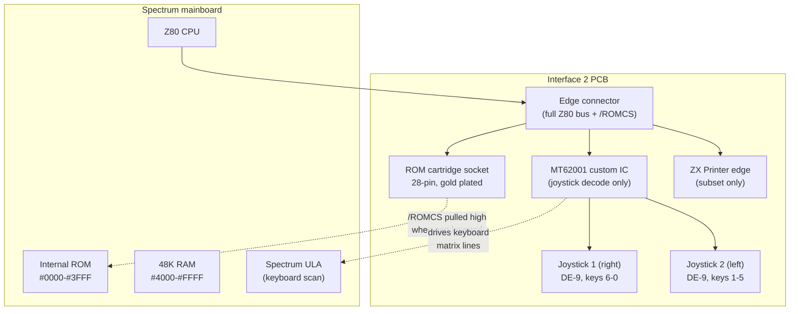

# ZX Interface 2 — ROM Cartridges, Twin Joysticks, and the Cart That Wouldn't Page

## Overview

The **ZX Interface 2** is Sinclair Research's second rear-expansion peripheral for the ZX Spectrum, launched in September 1983 at £19.95 (interface alone) or £29.95 with one joystick. Two functions only:

1. **Two Atari-style DE-9 joystick ports** wired passively into the Spectrum's keyboard matrix
2. **One ROM cartridge slot** holding a 16 KB cartridge that, when inserted, electrically disables the Spectrum's internal ROM at power-up and takes over the lower 16 KB of address space

The Interface 2 is dramatically simpler than the Interface 1: there is no custom ULA, no shadow ROM, no paging logic, no Microdrive electronics. The cartridge socket literally exposes the Spectrum's address/data bus plus `/ROMCS` line, with the cartridge itself doing all the work via two chip-enable pins. The joysticks are decoded by a single custom IC (the **MT62001** "MCE 8344") that drives the keyboard matrix lines.

Sinclair's vision was that the Interface 2 would let game publishers ship **cartridge versions** of popular titles — instant load, no tape wait, no piracy. The reality was a commercial disaster: only ten cartridges were ever released, all 16 KB re-releases of existing 16K Spectrum tape games (Jet Pac, Pssst, Cookie, Tranz Am, Three Weeks in Paradise, Chess, Backgammon, Hungry Horace, Molecule, The Streets of London). The 16 KB limit and the inability to access the BASIC ROM's routines killed the format.

The Interface 2's cultural impact is therefore mostly through its **joystick half**, which established the "Sinclair 1 / Sinclair 2" joystick standard that survives in every emulator and every modern interface's mode menu. The cartridge slot, despite its commercial failure, became the basis for hobbyist expansions (the famous "two-diode mod" lets the IF2 work on the +2A/+3), and a small but persistent cartridge-homebrew scene exists to this day.

This article covers the cartridge pinout, the joystick decode logic, the failure of the cartridge format, the +2A/+3 incompatibility, and the modern homebrew scene. For the joystick protocol itself (the matrix encoding, the `#EFFE`/`#F7FE` read ports, and how to write software that supports it), see [joystick.md](joystick.md). For the broader expansion ecosystem, see [interface1.md](interface1.md) (the predecessor that introduced the through-bus convention the IF2 inherits).

---

## Why Cartridges Failed

Sinclair's pitch was compelling on paper: **instant load** (no 5-minute tape wait), **no piracy** (the cartridge is a physical ROM), **reliable** (no tape stretching, no leader block, no turbo-loading tricks). The reality was different:

1. **The 16 KB limit.** The Interface 2 cannot page ROM. Once a cartridge is inserted, the cartridge ROM is permanently mapped to `#0000-#3FFF` and the internal ROM is permanently disabled. Software that needs anything from the BASIC ROM (channel I/O, the editor, the floating-point routines, anything) has to duplicate that code inside its 16 KB. This made every cartridge a self-contained 16K Spectrum program — fine for the 16K Spectrum's game library, useless for the 48K Spectrum's.

2. **No access to Interface 1 routines.** Cartridges cannot page in the IF1 shadow ROM. If a game wanted to save high scores to Microdrive, or do a network sync, it had to reimplement those routines itself — duplicating copyrighted Sinclair code, which the publishers refused to do.

3. **Production cost.** Sinclair Research required a minimum run of 1000 units per cartridge title. For a publisher, that meant tying up thousands of pounds per game in inventory before a single sale.

4. **Price.** Cartridges retailed at £15-£20 — comparable to or more expensive than tape versions of the same games, which by 1984 typically cost £5.99-£9.99. Consumers could not justify paying double for "instant load" when tape versions of the same games already existed.

5. **The Spectrum's price was dropping fast.** By 1984 the 48K Spectrum was £129, and Interface 1 + Microdrive offered 85 KB of rewritable storage for £99. A read-only 16 KB cartridge at £20 was not competitive.

6. **Sinclair's own pivot.** By late 1984 Sinclair was focused on the QL, the Spectrum 128 (with its built-in RS-232 and AY chip), and the Microdrive ecosystem. The Interface 2 was orphaned; nofollow-up cartridge titles were commissioned and existing stock was cleared at discount.

The Interface 2 remained in production (mostly for its joystick half) until Sinclair sold the Spectrum range to Amstrad in 1986. Amstrad's +2 (grey, 1987) and +2A/+3 (1987-88) shipped with built-in joystick ports using the same `#EFFE`/`#F7FE` Sinclair matrix encoding — making the Interface 2's joystick half redundant on those machines too.

---

## Hardware Architecture

The Interface 2 PCB is shockingly simple. It contains:

- **One custom IC (MT62001, marked "MCE 8344")** — decodes the two joystick ports from the address bus
- **One 28-pin ROM cartridge socket** wired almost 1:1 to the Spectrum edge connector
- **Two DE-9 joystick sockets** driven by the MT62001
- **One ZX Printer edge connector** on the rear, carrying only the signals needed by the ZX Printer (not the full bus)
- **A small handful of passive components** (decoupling caps, pull-up resistors)

No ULA. No flip-flops. No paging logic. The whole interface can be understood in an afternoon.



### How the cartridge disables the internal ROM

When a cartridge is inserted, a trace on the cartridge PCB shorts the Interface 2's `/ROMCS` line (pin 25 of the Spectrum edge connector) to `+5V`. The Spectrum's internal ROM is therefore deselected on every memory cycle. The cartridge ROM, wired with:

- **A0-A13** straight through from the CPU (14 address pins, 16384 addresses)
- **D0-D7** straight through to the CPU data bus
- **A14** to `/CE` (chip enable — low when address < 16384)
- **A15** to `/OE2` (second output enable — low when address < 32768)
- **`/MREQ`** to `/OE1` (first output enable — low when memory cycle)

…becomes the only device driving the data bus during any memory access in the `#0000-#3FFF` range. The CPU fetches its first instruction from the cartridge, not the internal ROM.

That's it. There is no flip-flop, no paging register, no "cartridge present" detection. The CPU simply sees the cartridge ROM where the internal ROM used to be. If the user removes the cartridge while power is on, the bus floats and the machine crashes — Sinclair's manual told users not to do this, with a small icon of a hand pulling out a cartridge in a no-entry circle.

### Joystick decode logic

The MT62001 watches the Z80 address bus for two specific patterns during `IORQ` + `RD` cycles:

- `A0=0, A11=0, A12=1, A15=1` (i.e. address `#EFFE`) → read joystick 1
- `A0=0, A11=1, A12=0, A15=1` (i.e. address `#F7FE`) → read joystick 2

When the pattern matches, the MT62001 drives the data bus with 5 bits encoding the joystick state (active-low). The bits map directly onto the Spectrum's keyboard matrix row for keys 1-5 (joystick 2) or 6-0 (joystick 1), so the ULA's own keyboard read at `#FE` returns the same information — software can read either port.

Importantly, the MT62001's outputs are **open-collector with weak pull-ups**: when the joystick isn't pressed, the bits read as `1`. When the joystick is pressed, the MT62001 pulls the bit low, and the ULA's own pull-down on the same bus line wins (so the ULA still sees its own key press). This bi-directional behavior is why a joystick press and the corresponding key press are indistinguishable to software.


---

## ROM Cartridge Pinout

The Interface 2 cartridge socket is a 28-pin PCB edge (not a DIP socket — the cartridge is a small PCB that slides in). The pinout mirrors a JEDEC 27128 (16K × 8) EPROM pinout exactly, with one substitution:

```
                ┌─────────┐
        /ROMCS  │ 1    28 │ VCC     (+5V)
            A12 │ 2    27 │ /PGM    → A15 (paging logic)
             A7 │ 3    26 │ /OE1    → /MREQ (from Spectrum)
             A6 │ 4    25 │ A11
             A5 │ 5    24 │ A9
             A4 │ 6    23 │ A8
             A3 │ 7    22 │ A13
             A2 │ 8    21 │ /CE     → A14 (paging logic)
             A1 │ 9    20 │ /OE2    → A15 (paging logic)
             A0 │ 10   19 │ D7
             D0 │ 11   18 │ D6
             D1 │ 12   17 │ D5
             D2 │ 13   16 │ D4
             GND │ 14   15 │ D3
                └─────────┘
                Interface 2 cartridge
                (top view, pins 1-28)
```

The differences from a stock 27128 EPROM are:

- **Pin 1** (`/ROMCS` instead of `Vpp`): pulled high to `+5V` inside the cartridge. This disables the Spectrum's internal ROM via the edge connector's `/ROMCS` line.
- **Pin 27** (`/PGM` repurposed as A15 input): the second chip-enable.
- **Pin 22** (`/CE`): connected to A14 from the Z80.
- **Pin 20** (`/OE2`): connected to A15 from the Z80 (so pin 27 and pin 20 are both tied to A15 — the JEDEC multiplexing trick).
- **Pin 24** (`/OE1`): connected to `/MREQ` from the Z80.

The cartridge ROM is enabled (its tri-state outputs driving the data bus) only when **all of** `/CE = 0`, `/OE1 = 0`, and `/OE2 = 0`. This means:

- `A14 = 0` → address is in `#0000-#3FFF` (the low 16K)
- `A15 = 0` → reinforces (already implied by A14=0)
- `/MREQ = 0` → CPU is doing a memory cycle, not an I/O cycle or refresh

Note: the cartridge socket does **not** carry `/RD`, `/WR`, or `/RFSH`. This means the ROM responds identically to reads, writes, and refresh cycles whose refresh address happens to fall in `#0000-#3FFF`. In practice this doesn't cause problems because:

- Writes to ROM are accepted by the CPU but go nowhere useful — there's nothing to write to
- Refresh cycles don't drive `/MREQ` low on the 8-bit refresh address... actually they do drive `/RFSH` low and `/MREQ` low, but the high byte of the address bus is driven from the I register during refresh, and I is normally set to a system variable area like `#3C` or `#5C`, so the high byte is non-zero and the cartridge doesn't enable

The classic failure mode is a program with `I = #00XX` (which is a bug anyway), where every refresh cycle activates the cartridge ROM and corrupts the bus.

### The "two-diode" +2A/+3 modification

Amstrad removed `/ROMCS` from the +2A/+3 expansion bus and replaced it with `/ROM1OE` and `/ROM2OE` (the two internal ROM bank enables), at different edge-connector pins. This broke the Interface 2's cartridge slot: the Spectrum's internal ROM is no longer disabled when a cartridge is inserted.

The fix, documented by Paul Farrow and others, is to solder two diodes inside the +2A/+3 (NOT inside the Interface 2 — the mod is on the Spectrum side). The diodes OR together `/ROM1OE` and `/ROM2OE` and feed the result back to the edge connector pin that the Interface 2 expects to find `/ROMCS` on. With this mod, inserting a cartridge disables both internal ROM banks and the cartridge works.

The joysticks are unaffected by the +2A/+3 change — they continue to work as long as no built-in joystick is also pressed at the same time (the +2A/+3 built-in joystick ports are not open-collector and a bus fight can damage both devices).

---

## Joystick Ports

### DE-9 pinout

Both joystick ports are female DE-9 (also called "DB9" or "Atari 2600" style). Pinout:

```
        ┌─────────┐
   Up   │ 1    6  │ Fire (button)
  Down  │ 2    7  │ (not connected — no +5V for auto-fire)
  Left  │ 3    8  │ (not connected)
 Right  │ 4    9  │ (not connected)
  GND   │ 5       │
        └─────────┘
```

The Interface 2 deliberately does **not** provide +5V on pin 7. This means **auto-fire joysticks that need power won't work**. The pin is reserved for joystick button 2 on later standards (Mega Drive, etc.) but is unused on the IF2.

### Reading the joysticks from software

The two ports share the address space with the keyboard's row read at `#FE`. The MT62001 decodes only A0, A11, A12, and A15:

| Read port | A15 | A12 | A11 | A0 | Reads | Bit assignment (active-low) |
|-----------|-----|-----|-----|----|-------|-----------------------------|
| `#F7FE` | 1 | 0 | 1 | 0 | Joystick 2 | `xxx F U D R L` (F=fire) |
| `#EFFE` | 1 | 1 | 0 | 0 | Joystick 1 | `xxx L R D U F` (note different bit order!) |
| `#FE` | 0 | 0 | 0 | 0 | ULA keyboard row | depends on high byte A8-A15 (row select) |

Note the **bit-order swap** between the two joysticks: joystick 1 (`#EFFE`) has the bits in order `LRDUF` (reading bits 4-0), while joystick 2 (`#F7FE`) has them in order `FUDRL` (reading bits 4-0). This is a hardware quirk of the MT62001 — the chip mirrors the keyboard matrix's natural column ordering for each half-row.

Reading the joystick is a single instruction:

```z80
read_joy1:
        LD   BC, #EFFE
        IN   A, (C)         ; A = #FF | (active-low joystick bits)
        CPL                  ; invert: now 1 = pressed
        AND  #1F             ; mask to 5 bits
        RET
```

For the full treatment — including the keyboard-matrix reading alternative, the cursor/Sinclair/Kempston comparison, and how to write a game that supports all four standards — see [joystick.md](joystick.md).


---

## The Ten Released Cartridges

Only ten cartridge titles were ever commercially released. All are 16 KB re-releases of 16K-era Spectrum tape games. All date from 1983-1984.

| # | Title | Publisher | Year | Notes |
|---|-------|-----------|------|-------|
| 1 | Jet Pac | Ultimate Play the Game | 1983 | Launch title |
| 2 | Pssst | Ultimate Play the Game | 1983 | |
| 3 | Cookie | Ultimate Play the Game | 1983 | |
| 4 | Tranz Am | Ultimate Play the Game | 1983 | |
| 5 | Master Chess | CDS Microsystems | 1983 | |
| 6 | Backgammon | CDS Microsystems | 1983 | |
| 7 | Hungry Horace | Psion | 1983 | |
| 8 | Horace and the Spiders | Psion | 1983 | |
| 9 | Molecule | PSS | 1983 | |
| 10 | The Streets of London | PSS | 1983 | Sometimes named "London" |

Six of the ten are by **Ultimate Play the Game** (later Rare), reflecting their dominance of the early Spectrum game library. The rest are by **CDS Microsystems**, **Psion**, and **PSS**.

Notably absent: games by Sinclair Research itself (no Sinclair-published cartridge), and no educational or utility cartridges despite Sinclair's stated intention to release things like Micro-Prolog on cartridge.

### Modern homebrew cartridges

Since the 2000s, hobbyists have made their own cartridges:

- **27C128 EPROMs** wired to a custom PCB with the right pinout — the cheapest and easiest route. Single-game, 16 KB.
- **27C256 / 27C512 EPROMs** with a bank-switch circuit — the cartridge contains multiple 16 KB images and a small switch (or a software-triggered register) selects which one. Requires modifying the IF2 to add paging logic; see the "Doityourself" section of the k1.spdns.de archive.
- **Thomas Heckmann's multi-ROM cartridge** ([github.com/thomasheckmann/zx-interface-2-rom](https://github.com/thomasheckmann/zx-interface-2-rom)) — open-source PCB design supporting 16 KB images and manual bank switching, behaves like the original cartridges
- **Flash-based repro carts** — modern eBay/Amazon sellers offer newly manufactured "Jet Pac" and similar repro cartridges using flash memory; these typically work with unmodified Interface 2 hardware

For loading ROM images in emulators, the standard file extensions are `.rom` (raw 16 KB image) and `.if2` (Interface 2-specific wrapper, rarely seen). See [04_operating_systems/esxdos.md](../../04_operating_systems/esxdos.md) for the `.if2` loading convention used by ESXDOS.

---

## Compatibility Across Spectrum Models

| Model | Cartridge works? | Joystick works? | Notes |
|-------|------------------|-----------------|-------|
| 16K Spectrum | ✅ | ✅ | Fully supported |
| 48K Spectrum (Issue 1-6) | ✅ | ✅ | Fully supported |
| 48K+ (Spanish) | ✅ | ✅ | |
| Spectrum 128 (toastrack) | ✅ | ✅ | |
| +2 (grey, 1987) | ✅ | ✅ (but built-in ports duplicate) | Built-in joystick ports use same encoding — IF2 redundant |
| +2A, +2B (1987) | ❌ without mod | ⚠️ | Cartridge: needs two-diode mod. Joystick: works but bus-fight risk |
| +3, +3B (1988) | ❌ without mod | ⚠️ | Same as +2A |
| +2A/+3 with two-diode mod | ✅ | ⚠️ | Mod is soldered inside the Spectrum, not the IF2 |
| Russian clones (Pentagon, Scorpion) | ❌ | N/A | No cartridge slot. Joystick: usually Kempston only |
| ZX Spectrum Next | ✅ (emulated) | ✅ (emulated) | Cartridge loaded from SD; joystick via built-in ports |

The ZX Printer edge connector on the back of the IF2 also loses the +9V line on the +2A/+3 (Amstrad removed it), so even with the two-diode mod for the cartridge, the ZX Printer cannot be powered through the IF2 on those machines.

---

## Common Pitfalls

1. **Don't insert or remove a cartridge with power on.** The `/ROMCS` line floats briefly during insertion and the machine may crash. The Sinclair manual explicitly warns against this with a no-entry symbol.

2. **The 16 KB limit is a hard ceiling.** Don't try to write a 48K game as a cartridge — it won't fit. If you need paging, build it into the cartridge (a 27C256 with a 74LS161 counter to bank-switch), and accept that the IF2 itself provides no paging support.

3. **No `/RD` on the cartridge socket.** The cartridge ROM responds to any memory cycle in `#0000-#3FFF`, including writes and refresh cycles. Most software doesn't care, but code that reads ROM via `/RFSH` accidentally (e.g., due to a misconfigured I register) can produce weird bugs.

4. **No +5V on joystick pin 7.** Auto-fire joysticks that need power won't work. This is by design — the IF2 was launched in 1983, before auto-fire became standard.

5. **The two joysticks have different bit orders.** Code that reads joystick 1 (`#EFFE`) and assumes the same bit layout for joystick 2 (`#F7FE`) will read directions wrong. Always check which joystick you're reading.

6. **Joystick 2 reads as `xxx F U D R L`, joystick 1 as `xxx L R D U F`.** The MT62001 mirrors the keyboard matrix's column ordering, which is different for the two half-rows.

7. **The +2A/+3 incompatibility.** Don't plug an unmodified IF2 into a +2A or +3 expecting the cartridge slot to work — it won't, because Amstrad removed `/ROMCS`. The joystick ports will work but might fight the built-in ports. Use the two-diode mod (on the Spectrum side, not the IF2 side).

8. **ZX Printer connector on the back is not a full bus.** It only carries the signals the ZX Printer needs. Don't plug another peripheral (interface, multiface, etc.) into it expecting it to work.

9. **The MT62001 is unobtainium.** If your IF2 joystick half breaks, you cannot buy a replacement MT62001 — it was a custom chip made for Sinclair in 1983 and never second-sourced. The only fix is to replace the joystick decode logic with discrete TTL (74LS138 + 74LS244 or similar) on a small adapter PCB.

---

## When to Use the Interface 2 (Today)

| Use case | Recommendation |
|----------|----------------|
| Playing original cartridges on real 48K hardware | Original Interface 2 — works perfectly |
| Building a homebrew cartridge | Use a 27C128 EPROM on a custom PCB matching the IF2 pinout, or Thomas Heckmann's open-source design |
| Playing cartridge games in an emulator | No IF2 needed — emulators load `.rom` and `.if2` files directly |
| Two-player joystick gaming on a 48K Spectrum | Original IF2 works, but a Kempston dual-port interface is more compatible with later games |
| Using the IF2 on a +2A/+3 | Apply the two-diode mod to the Spectrum; don't expect the IF2 joystick ports to coexist with built-in ports |
| Cartridge development today | Use an emulator (xFuse, ZEsarUX) for development; flash to a real cartridge for final testing |

---

## Comparison Matrix

| Feature | Interface 1 (1983) | Interface 2 (1983) | Multiface 1 (1986) | DISCiPLE (1985) |
|---------|--------------------|--------------------|--------------------|-----------------|
| Price | £49.95 | £19.95 (no joystick) / £29.95 (with) | £39.95 | £99.95 |
| Cartridge/ROM slot | ❌ | ✅ 16 KB | ❌ | ❌ |
| Joystick ports | ❌ | ✅ 2× DE-9 (Sinclair matrix) | ✅ 1× Kempston | ✅ 2× DE-9 (Kempston) |
| Through bus | ✅ Full | ⚠️ ZX Printer subset only | ✅ Full | ✅ Full |
| Custom IC | Ferranti ULA | MT62001 (joystick only) | TTL only | Custom PAL + WD1772 FDC |
| Shadow ROM | ✅ 8 KB | ❌ | ❌ | ✅ 16 KB |
| Mass storage | ✅ Microdrive | ❌ | ❌ | ✅ Floppy disk |
| Networking | ✅ ZX Net | ❌ | ❌ | ❌ |
| RS-232 | ✅ | ❌ | ❌ | ❌ |
| NMI button | ❌ | ❌ | ✅ | ✅ |
| Memory overlay | ✅ Shadow ROM at #0000-#1FFF | ✅ Cartridge at #0000-#3FFF | ✅ Overlay at #0000-#3FFF | ✅ Shadow ROM |

---

## Modern Analogies

- **The IF2 = the Nintendo Entertainment System's cartridge slot, minus the paging logic.** Nintendo solved the 16K limit by adding a mapper chip on each cartridge; Sinclair didn't.
- **The IF2 joystick half = the de facto "Sinclair standard" for Spectrum joysticks.** Every emulator's "Sinclair 1" / "Sinclair 2" mode is a homage to the IF2 port numbering.
- **The two-diode +2A/+3 mod ≈ the modern "third-party adapter" pattern.** When a vendor changes a connector and breaks compatibility, the community ships a small adapter; here, the "adapter" is two diodes soldered inside the Spectrum.
- **The cartridge format's failure ≈ the laserdisc format's failure.** Both were technically superior to the incumbent (tape / VHS), both had strong vendor backing, both failed because the price/performance ratio was wrong and the incumbent's user experience was "good enough".
- **The ten released cartridges = a fascinating historical artifact.** Like the Virtual Boy's 22-game library, the IF2's tiny catalog tells you everything about why the format failed.

---

## Cross-References

- [joystick.md](joystick.md) — Detailed coverage of all joystick interfaces (Kempston, Sinclair 1/2, Cursor, Fuller)
- [interface1.md](interface1.md) — The predecessor; IF2 inherits the through-bus convention from IF1
- [multiface.md](multiface.md) — Different overlay approach (NMI + RAM, not cartridge)
- [02_hardware/original/keyboard_matrix.md](../../02_hardware/original/keyboard_matrix.md) — Why the IF2 joysticks map onto keys 1-5 and 6-0
- [02_hardware/clones/clone_joysticks.md](../../02_hardware/clones/clone_joysticks.md) — Soviet clones standardized on Kempston, not Sinclair
- [02_hardware/newgen/zx_next.md](../../02_hardware/newgen/zx_next.md#joystick-system) — Next's emulation of Sinclair 1/2 (with the "Sinclair numbering trap" warning)
- [04_operating_systems/esxdos.md](../../04_operating_systems/esxdos.md) — `.if2` cartridge loading in ESXDOS
- [09_toolchain/native_toolchain.md](../../09_toolchain/native_toolchain.md) — Laser Genius cartridge-based assembler (the only non-game cartridge ever shipped)
- [10_references/io_port_map.md](../../10_references/io_port_map.md) — Sinclair joystick port table
- [04_operating_systems/rom_48k.md](../../04_operating_systems/rom_48k.md) — How the cartridge overlays the standard ROM at `#0000-#3FFF`

---

## Primary Sources

1. **Paul Farrow** — *ZX Interface 2 — Circuitry* page, with the full circuit diagram, ROM cartridge pinout, joystick decode analysis, and the +2A/+3 incompatibility investigation. `fruitcake.plus.com/Sinclair/Interface2/Interface/Interface2_Circuitry.htm`. This is the canonical technical reference for the IF2.
2. **k1.spdns.de IF2 Technical Specs** — second-source analysis with the JEDEC 27128 EPROM comparison, the joystick bit-order observation, and the refresh-cycle caveat. `k1.spdns.de/Vintage/Sinclair/82/Peripherals/IF2 Cartridge Interfaces/Sinclair Interface 2/Tech Specs/`.
3. **Sinclair Research** — *ZX Interface 2 Manual* (1983). Reproduced at `retrocomputing.com.ar/ContenidoObjetoAccion.do?id=96`.
4. **World of Spectrum peripherals FAQ** — `worldofspectrum.org/faq/reference/peripherals.htm`.
5. **Thomas Heckmann** — Open-source multi-ROM cartridge PCB design. `github.com/thomasheckmann/zx-interface-2-rom`.
6. *Crash Magazine* issue 1 (1984) — launch reviews of the IF2 and the first cartridge titles.
7. *Sinclair User* issues 23-28 (1983-84) — contemporary coverage of cartridge releases as they appeared.
