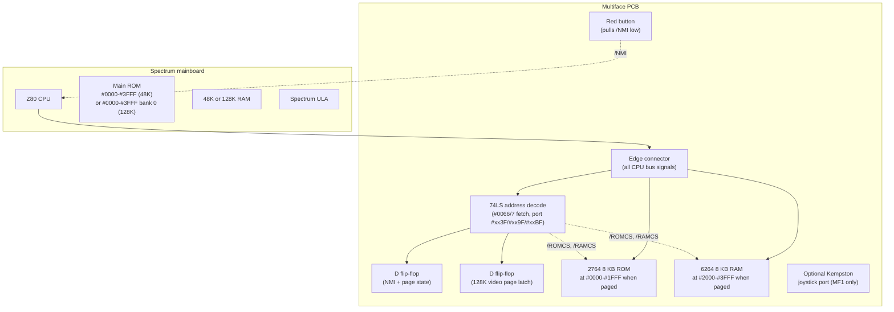

# Multiface — Snapshot Tool, Poke Finder, and the Red Button

## Overview

The **Multiface** is a family of hardware overlay peripherals made by **Romantic Robot UK Ltd**, sold from October 1986 onward for the ZX Spectrum and its successors. Three principal models exist:

- **Multiface One** (1986) — for the 16K/48K Spectrum
- **Multiface 128** (1987) — for the Spectrum 128 and +2 (grey)
- **Multiface 3** (1988) — for the Spectrum +2A/+2B and +3/+3B

Each Multiface is a small black box with a red button on top that plugs into the Spectrum's rear expansion port. Pressing the button triggers a **non-maskable interrupt (NMI)**, which pages the Multiface's own 8 KB ROM and 8 KB RAM into the CPU's address space and presents a menu. From that menu the user can:

1. **Dump the entire Spectrum memory** to tape, microdrive, +D, DISCiPLE, Opus, Beta 128, or `+3` disk
2. **Browse and modify memory** — the famous "POKE" facility that powered a decade of cheat codes
3. **Load optional tool ROMs** into the on-board 8 KB RAM buffer — most notably **Genie** (a machine-code disassembler) and **Lifeguard** (an "unlimited lives finder" that watched which memory cells changed between button presses)
4. **Take screenshots**, **print screens** (Multiface 3), and **issue DOS commands** in 48K mode (Multiface 3)

The Multiface's cultural footprint is enormous. Magazine cheat pages in *Your Sinclair*, *Crash*, and *Sinclair User* printed **POKE lists** that only made sense with a Multiface in hand — every emulator written since 1995 (xFuse, Spectaculator, ZEsarUX, SpecEmu) emulates one because the snapshot `.z80` and `.szx` formats carry a `MULF` block to record its state. See [03_io/snapshots/z80_format.md](../snapshots/z80_format.md) and [03_io/snapshots/szx_format.md](../snapshots/szx_format.md).

This article covers the hardware paging mechanism, the three model variants, the I/O port map, the backup file format (including the .Z80 snapshot Multiface block), the Genie/Lifeguard tool ecosystem, and the relationship with disk interfaces and later clone hardware. For the underlying NMI mechanism on the Z80, see [01_cpu/z80_interrupts.md](../../01_cpu/z80_interrupts.md); for the snapshot formats themselves, see the [snapshots section](../snapshots/).

---

## Why the Multiface Mattered

The 48K Spectrum has no battery-backed RAM, no hard disk, no resume feature. Once you switch off, your game position is gone. By 1986 the average Speccy game took 5–10 minutes to load from tape; losing that investment because Mum turned off the TV was a constant frustration. Romantic Robot's solution was elegantly brutal:

- The user is playing a game.
- They hit the **red button**. The CPU is yanked into NMI.
- The Multiface pages in, captures the **entire 16 KB ROM space, 48 KB RAM, CPU registers, and interrupt state** into its 8 KB internal buffer in under a frame, and shows a menu.
- The user picks "Save to tape" (or disk, microdrive, etc.).
- A few seconds later, the snapshot is on storage.
- The user picks "Return". The Multiface pages out. The game resumes from exactly where it left off.

Loading the snapshot later required the Multiface to be present (a copy-protection measure). The same trick — capture a complete machine state to byte-exact storage — is exactly what modern emulator `.z80` and `.szx` files do. The Multiface was, in 1986, a hardware snapshot tool that anticipated the software-only snapshot file formats by nearly a decade.

The secondary use — memory editing — was just as important. The 1980s UK games magazines ran monthly **POKE pages**. A POKE is a `POKE address, value` BASIC statement that writes one byte into memory; the Multiface let the user enter these without restarting the game. **Infinite lives, infinite energy, level skip, wallhack** — the entire 8-bit cheat ecosystem ran through the Multiface's POKE menu.

---

## Hardware Architecture

All three Multiface models share the same core design: a small PCB behind the rear expansion connector, populated with one 8 KB EPROM (type 2764), one 8 KB static RAM (type 6264), and a handful of 74LS-series TTL to decode addresses, manage the NMI line, and bank-switch the overlay.



### What the decode logic does

The Multiface's TTL does four jobs:

1. **Watches the bus for the NMI entry point.** When the CPU fetches an instruction from address `#0066` or `#0067` (the NMI vector — the Z80 jumps there on `/NMI`), the decode logic sets a flip-flop that **pages the Multiface ROM and RAM in**, replacing the main ROM at addresses `#0000-#1FFF` (ROM) and `#2000-#3FFF` (RAM). The main ROM is electrically disconnected via its `/ROMCS` line. The CPU, having fetched the first NMI-handler byte from the *main* ROM at `#0066`, then continues fetching from `#0067` onward — and finds itself executing the Multiface's own NMI handler. This trick — the same hardware pattern used by the Interface 1 shadow ROM (see [interface1.md](interface1.md#shadow-rom-paging-trick)) and by the Beta Disk Interface — lets the Multiface inject code transparently without the running program ever knowing.

2. **Decodes three I/O ports** (with partial address-line decoding) for paging in, paging out, and (on the 128) latching the current video bank:

| Model | Page-in port (IN) | Page-out port (OUT) | Video-bank latch port |
|-------|------------------|--------------------|-----------------------|
| Multiface One | `#9F` | `#1F` | — (48K only) |
| Multiface 128 | `#BF` (Disciple variant: `#9F`) | `#3F` | write to any port with `A15=0, A1=0` (e.g. `#FE`) |
| Multiface 3 | `#3F` | `#BF` | reads `#7FFD` and `#1FFD` via the back door (`#7F3F` and `#1F3F`) |

3. **Pulls `/NMI` low when the red button is pressed.** A debounced switch tied directly to the `/NMI` bus line; the Z80 services the interrupt at the end of the current instruction.

4. **On the 128/+3, spies on writes to the paging ports `#7FFD` and `#1FFD`** so that the Multiface can reconstruct the exact video bank the user was looking at when they pressed the button. Without this, returning from the Multiface would restore the wrong screen and the user would see garbage.

### Stealth mode

The Multiface 128 and later models added a **stealth mode** flip-flop. When stealth is on, writes to the Multiface's page-in port are ignored unless they come from a "magic" sequence — typically `IN A, (#BF)` followed by a specific pattern. This prevents games from accidentally (or deliberately, as an anti-cheat measure) disabling the Multiface by writing to the wrong port. A side effect: certain commercial games detected the Multiface by attempting to disable it on startup and would refuse to run if it was present, so the stealth circuit let the player hide.

### Through port

From the Multiface 128 onward, the back of the unit carries a second edge connector that passes through every bus signal. This means a Multiface can sit between the Spectrum and another peripheral (a disk interface, a printer, a joystick). The Multiface 3's thru-port additionally injects the `A15` line via a 1N4004 diode, which is how it spies on the `+3` paging ports without interfering with normal I/O.

---

## I/O Port Map (Summary)

The complete port map lives in [10_references/io_port_map.md#multiface-ports](../../10_references/io_port_map.md#multiface-ports). Quick reference:

| Port | A7-A0 pattern | Model | Direction | Effect |
|------|--------------|-------|-----------|--------|
| `#9F` | `1001 1111` | MF1 (IN), MF128 Disciple (IN) | read | Page in (overlay ROM+RAM) |
| `#1F` | `0001 1111` | MF1 (OUT) | write | Page out (restore main ROM) |
| `#3F` | `0011 1111` | MF128 (OUT), MF3 (IN) | mixed | MF128: page out. MF3: page in |
| `#BF` | `1011 1111` | MF128 (IN) | read | Page in |
| `#1FFD` spy via `#1F3F` | `0001 1111 0011 1111` | MF3 | read | Read +3 paging register |
| `#7FFD` spy via `#7F3F` | `0111 1111 0011 1111` | MF3 | read | Read 128 paging register |


---

## Model Variants

### Multiface One (1986)

- **Target**: 16K/48K Spectrum
- **Price at launch**: £39.95
- **Internal memory**: 8 KB ROM (2764 EPROM) + 8 KB RAM (6264 SRAM)
- **Joystick**: Kempston-compatible port on the side (the only Multiface to include one)
- **Page-in**: `IN A, (#9F)` after pressing the red button
- **Page-out**: `OUT (#1F), A` (any value)
- **Save targets**: tape, microdrive (via IF1), Opus Discovery, +D, DISCiPLE, Beta 128
- **Limitations**: 48K only — not aware of the 128K paging registers. Also slightly fragile against software that probed the `#9F`/`#1F` ports directly: a few games detected the Multiface by writing `#1F` and checking whether reads from `#9F` returned the same value, and refused to run if it did.

### Multiface 128 (1987)

- **Target**: Spectrum 128, +2 (grey)
- **Price at launch**: £34.95
- **Internal memory**: 8 KB ROM + 8 KB RAM (same chips)
- **Joystick port removed** (the Kempston port went away; users were expected to have a separate joystick interface)
- **Two sub-variants**: standard (page-in port `#BF`) and the "Disciple variant" (page-in port `#9F`, designed not to clash with the DISCiPLE disk interface)
- **Page-out port moved to `#3F`** to avoid conflict with the Spectrum 128's own use of the `#1F` address range
- **Save targets**: tape, microdrive (IF1), +D, DISCiPLE, Opus, Beta, Wafadrive
- **128K aware**: spies on writes to `#7FFD` to reconstruct which of the 8 RAM banks contains the screen, so on resume the correct bank is paged in
- **Limitations**: **does not work on the +2A, +2B, or +3**. Those machines changed the paging port layout (added `#1FFD`) and changed the ROM banking; the Multiface 128's decode logic doesn't recognize the new signals. Romantic Robot released the Multiface 3 specifically for these machines.

### Multiface 3 (1988)

- **Target**: +2A, +2B, +3, +3B
- **Price**: around £35–£50 depending on configuration (with or without thru-port)
- **Page-in**: `IN A, (#3F)` after NMI
- **Page-out**: `OUT (#BF), A`
- **Back-door reads** of `#7FFD` and `#1FFD`: `IN A, (#7F3F)` returns the last value written to `#7FFD`; `IN A, (#1F3F)` returns the last value written to `#1FFD`. The Multiface 3 latches these on every write the CPU makes to those ports, so it can perfectly reconstruct the machine state.
- **Save targets**: tape, `+3` disk (CP/M format and Spectrum DOS), microdrive (IF1), +D, DISCiPLE
- **New features**: DOS commands available in 48K mode; screen-to-printer copy; expanded toolkit
- **Thru-port**: optional on some batches. The A15 line from the thru-port is wired in via a 1N4004 diode (the famous "lone via" on the PCB)

### Other variants and clones

- **Multiprint** — an earlier Romantic Robot peripheral that was a cut-down Multiface focused only on screen printing. Predates the Multiface 1.
- **Multiface One stereo (unofficial)** — third-party mods that added an AY chip on the same PCB; rare
- **DivIDE / DivMMC + Multiface emulation** — modern DivIDE-based interfaces include a software-emulated Multiface in their firmware. See [03_io/storage/divide_divmmc.md](../storage/divide_divmmc.md).
- **ZX Spectrum Next** — has a Multiface emulator built into the FPGA core; controlled via NextReg `0x06` bit 3 and `0x08` bit 3. See [02_hardware/newgen/zx_next_joystick.md](../../02_hardware/newgen/zx_next_joystick.md#multiface-port-clash) for the port clash with the Covox DAC.
- **Russian clones** — Pentagon, Scorpion, Profi all include Multiface circuitry in their default I/O decode

---

## The Backup File Format

When the user picks "Save to tape" (or disk/microdrive), the Multiface dumps a structured binary that contains everything needed to restore the machine state. The format is **not** the same as a `.z80` snapshot — it's the Multiface's own internal layout, designed to be loaded only by a Multiface.

The file layout (Multiface 128 dump):

| Offset | Length | Contents |
|--------|--------|----------|
| `#0000` | 1 | Signature byte (identifies dump source: MF1 / MF128 / MF3) |
| `#0001` | 1 | Hardware model flag (0 = 48K, 1 = 128K) |
| `#0002` | 2 | Stack pointer at moment of capture |
| `#0004` | 2 | Program counter (return address after NMI) |
| `#0006` | 22 | Z80 register dump: AF, BC, DE, HL, AF', BC', DE', HL', IX, IY, I, R |
| `#001C` | 2 | Last value written to `#7FFD` (128K mode only) |
| `#001E` | 1 | Border color, IM mode, IFF1/IFF2 packed into 3 bits |
| `#001F` | 49152 | Full 48K RAM image (or 128K with banks in MF128+disk systems) |
| `#C01F` | 16384 | ROM image captured at moment of NMI (if 48K mode) |

The load routine, on startup, checks the signature byte and refuses to continue if a Multiface isn't installed. This was Romantic Robot's only copy-protection measure — bypassed almost immediately by patch tools, but enough to make casual copying awkward.

The **`.z80` snapshot format** (used by every modern emulator) was originally reverse-engineered from the Multiface dump format; the v1 `.z80` header is essentially a cleaned-up version of the Multiface header above. See [03_io/snapshots/z80_format.md#history](../snapshots/z80_format.md) for the lineage. The `.szx` format (used by the xFuse emulator) carries an explicit `MULF` block — see [03_io/snapshots/szx_format.md#mulf-block](../snapshots/szx_format.md).


---

## The NMI Handler (What Happens When You Press the Button)

The complete flow, step by step:

1. **Idle state.** The Multiface is electrically invisible. The Spectrum is running a game. The red button is open. The page-in flip-flop is reset. The Multiface's `/ROMCS` and `/RAMCS` outputs are high (its memory is disconnected).

2. **Press the button.** The red switch shorts the `/NMI` bus line to ground. The Z80 finishes the current instruction, pushes the return address onto the stack, and jumps to `#0066`.

3. **The CPU fetches `#0066`.** This is an instruction fetch (`M1` cycle) at the NMI vector. The Multiface's decode logic — built from a 5-input NOR gate (74LS260) feeding an 8-input NAND (74LS30) and a 3-input NOR (74LS27) — recognises `A0=0, A1=1, A2=1, A3=0, ..., A15=0` combined with `M1=0, MREQ=0, RD=0`. It clocks the page-in flip-flop.

4. **Page-in.** The flip-flop's output drives the Multiface's `/ROMCS` and `/RAMCS` low and asserts a signal that disables the main ROM. From the next bus cycle onward:
   - Reads from `#0000-#1FFF` return bytes from the Multiface ROM
   - Reads from `#2000-#3FFF` return bytes from the Multiface RAM
   - The main ROM is electrically isolated

5. **The CPU reads the byte at `#0066` from the Multiface ROM.** On a 48K Spectrum, the byte at `#0066` in the main ROM is the start of the standard NMI handler (a jump to the warm-restart routine at `#1F05`); on the Multiface ROM it's a jump to the Multiface's own handler, typically around `#0070`. The CPU follows that jump and is now executing Multiface code.

6. **Multiface initialisation.** The handler saves all registers, copies the running program's full 48K RAM image (or 128K pages, on the 128) into the Spectrum's own RAM in a structured format suitable for later dumping, snapshots the register state into a header, reads the border color from the Spectrum's `BORDCR` system variable, reads the current video bank from the latched paging-port value (on 128/+3), and prepares to draw its menu.

7. **Menu display.** The Multiface writes its own menu to the screen. On the 48K, the screen is at `#4000-#57FF` (the same physical memory the game was using) — so the menu overwrites the game's display. That's fine; the game's display will be restored on exit because the Multiface kept a copy of the screen in its RAM buffer.

8. **User interaction.** The user navigates the menu (Save, Load, Poke, Toolkit, Help, Return). All I/O during this phase is handled by the Multiface ROM — it has its own keyboard scanner, tape handler, and disk interface drivers.

9. **Page-out.** When the user picks "Return", the Multiface ROM issues an `OUT (#1F/#3F/#BF), A` to its own page-out port. The flip-flop resets, `/ROMCS` and `/RAMCS` go high, the main ROM is reconnected, and the next instruction fetch comes from the main ROM again.

10. **Resume.** The handler restores registers, writes back the paging-port values to set the correct video bank, jumps to the saved PC, and the game continues as if nothing happened. The interrupt state (IM0/1/2, IFF1, IFF2) is also restored.

The whole cycle takes typically 1–3 frames (20–60 ms) — fast enough that real-time games don't notice.

---

## The POKE Menu

The single most-used feature. From the main menu, the user picks **"Poke"** and is presented with a simple line-based interface:

```
POKE  <addr> <value>
PEEK  <addr>
POKES <addr> <string>
FIND  <bytes>
LIST  <start> <end>
```

The classic cheat workflow:

1. Run the game. Note your current lives (e.g., 3).
2. Press the red button. In the POKE menu: `POKES #5C00,#03` is wrong — that's a system variable. Instead, the user finds the right address by trial and error.
3. The Multiface doesn't know which address holds "lives". The user has to find it by:
   - Searching the entire 48K for the byte `0x03` (lots of hits)
   - Returning to the game, losing a life (now `0x02`)
   - Pressing the red button again, narrowing the previous search to "values that were `0x03` and are now `0x02`"
   - Repeating until one address remains — that's the lives counter
4. Apply the cheat: `POKE <addr>, #63` (99 lives), return to the game.

**Lifeguard** automates this. Lifeguard is a separate ROM that loads into the Multiface's 8 KB RAM buffer and presents a friendlier "unlimited lives finder" — the user just tells Lifeguard "value decreased" or "value unchanged" after each button press, and Lifeguard narrows the candidate list itself.

**Genie** is the machine-code counterpart: a full disassembler/debugger that runs from the Multiface RAM. Genie lets the user single-step through Z80 code, set breakpoints, examine and modify registers, and trace execution. It was the standard reverse-engineering tool for the ZX Spectrum until emulators with built-in debuggers (xFuse, ZEsarUX) superseded it in the 2000s. See [08_reverse_engineering/README.md](../../08_reverse_engineering/README.md) for the modern equivalents.


---

## Programming Examples

### Triggering the Multiface manually (instead of pressing the button)

For software that wants to invoke the Multiface on purpose (e.g., a save-game system that uses the Multiface as backend):

```z80
; Manual Multiface 128 page-in.
; Assumes the device is installed and not in stealth mode.
        DI                      ; interrupts off while we fiddle
        IN   A, (#BF)           ; page in MF128
        ; Multiface ROM is now at #0000-#1FFF, RAM at #2000-#3FFF
        ; The NMI vector at #0066 in MF ROM points at the menu entry.
        ; Just call it directly:
        RST  0                  ; warm start from MF ROM
```

### Hiding from a game that probes for the Multiface

Some games (notably those from Ultimate Play the Game) check on startup whether a Multiface is present by writing to `#1F` and reading `#9F`:

```z80
; Game's anti-cheat check
probe_mf1:
        LD   A, #00
        OUT  (#1F), A           ; MF1 page-out
        IN   A, (#9F)           ; should be #FF if no MF1
        CP   #FF
        JR   Z, no_mf1          ; not installed, proceed
        ; installed — refuse to run
        RST  0
no_mf1:
        ; ...continue
```

The workaround: enable stealth mode on the MF128 (via the boot-time menu), or replace the MF1 with an MF128 (whose page-in port `#BF` doesn't clash with `#1F` reads).

### Reading the +3 paging state via the Multiface 3 back door

```z80
; Recover the last value written to #7FFD via MF3
read_7ffd:
        IN   A, (#7F3F)         ; MF3 back-door read
        ; A now contains the last byte written to #7FFD
        ; (bits 0-2 = RAM bank, bit 3 = screen select, bit 4 = ROM select)
        RET

; Recover the last value written to #1FFD via MF3
read_1ffd:
        IN   A, (#1F3F)         ; MF3 back-door read
        ; A now contains the last byte written to #1FFD
        ; (+2A/+3 special paging mode bits)
        RET
```

This is useful even when you don't want the Multiface menu: a Multiface 3 effectively gives you **read access to write-only paging ports**, which is otherwise impossible on a `+3`.

---

## Common Pitfalls

1. **Multiface 128 will not work on a +2A or +3.** The hardware is similar but the paging port layout changed. Buy a Multiface 3 (or an emulator) for those machines.

2. **The page-out port is not the same across models.** Code written for an MF1 (`OUT (#1F), A`) will crash on an MF128 (which uses `#3F`). The MF3 flips it again (`#BF`). Always check the hardware target.

3. **NMI is non-maskable.** Unlike INT, you cannot `DI` your way out of it. If the red button is pressed while the CPU is in an undefined state (e.g., during a tape load with broken timing), the Multiface may capture garbage.

4. **The 8 KB RAM buffer is volatile.** Anything loaded into it (Genie, Lifeguard, user tools) is lost when the Spectrum is switched off. The Multiface has no battery.

5. **The disk interface drivers in the MF ROM are specific to certain disk systems.** An MF128 cannot dump directly to a +3 disk — that's what the MF3 was built for. Conversely, an MF3 cannot dump to a +D or DISCiPLE disk; it expects `+3` DOS.

6. **Stealth mode hides the Multiface from games but also from the user.** If stealth is enabled and you forget the magic sequence, you can't page the device in. The factory reset is to power-cycle (which clears the flip-flop) and then immediately press the red button before the running program writes anything to the page-out port.

7. **The thru-port on the MF128 partially decodes `A15` — it's not a true passthrough.** Some peripherals (notably the Beta Disk Interface in non-Disciple configuration) check `A15` themselves and may glitch when stacked behind a Multiface. Test before relying on it.

8. **The MF128 Disciple variant uses page-in port `#9F`** (same as MF1) to avoid clashing with the DISCiPLE disk interface, which uses ports in the `#E3`-`#1FF` range. If you're shopping for an MF128 and intend to use it with a DISCiPLE, make sure you get the Disciple variant.

9. **Modern DivIDE-based clones have an emulated Multiface in firmware.** The page-in port is typically software-configurable; check the DivIDE / DivMMC documentation ([03_io/storage/divide_divmmc.md](../storage/divide_divmmc.md)) for the current setting.

---

## When to Use the Multiface (Today)

For modern users:

| Use case | Recommendation |
|----------|----------------|
| Cheating at original Spectrum games on real hardware | Original MF1 / MF128 / MF3, or a DivIDE-based clone with emulation |
| Reverse-engineering original games | Use an emulator with built-in debugger (xFuse, ZEsarUX, SpecEmu). The Multiface UI is primitive by modern standards. See [09_toolchain/debugging.md](../../09_toolchain/debugging.md). |
| Capturing snapshots of running games for archival | Modern emulators save `.z80` / `.szx` directly. The Multiface's own dump format is mostly of historical interest. |
| Reading write-only paging ports on a +3 | A real Multiface 3 (or its emulator in modern hardware like the Next) is the only way |
| Studying 1980s anti-piracy / anti-cheat techniques | Essential primary source — many games' detection routines can be traced through the MF manuals |

For developers writing Spectrum software today:

- **Don't assume a Multiface is present.** Probe for it politely (or just check the snapshot block in the emulator) and degrade gracefully.
- **If you're writing a game with anti-cheat, document your detection logic.** Modern users will want to disable your detection to use legitimate MF features (snapshot/restore).
- **If you're writing a snapshot tool**, study the MF dump format as a starting point — the `.z80` v1 header is essentially a cleaned-up version.

---

## Comparison Matrix

| Feature | MF1 (1986) | MF128 (1987) | MF3 (1988) |
|---------|-----------|--------------|------------|
| Target hardware | 16K/48K | Spectrum 128, +2 (grey) | +2A/+2B/+3/+3B |
| Price at launch | £39.95 | £34.95 | £35–£50 |
| Internal ROM | 8 KB (2764) | 8 KB (2764) | 8 KB (2764) |
| Internal RAM | 8 KB (6264) | 8 KB (6264) | 8 KB (6264) |
| Page-in port | `#9F` IN | `#BF` IN | `#3F` IN |
| Page-out port | `#1F` OUT | `#3F` OUT | `#BF` OUT |
| Kempston joystick port | ✅ | ❌ | ❌ |
| Thru-port | Some units | Some units | Optional |
| 128K paging awareness | ❌ | ✅ | ✅ |
| +3 paging awareness | ❌ | ❌ | ✅ |
| Save targets | Tape, µdrive, +D, DISCiPLE, Opus, Beta | + Wafadrive | + +3 disk |
| Screenshot capture | ✅ | ✅ | ✅ |
| Screen-to-printer | ❌ | ❌ | ✅ |
| DOS commands in 48K mode | ❌ | ❌ | ✅ |
| Genie 1 / 128 compatible | ✅ | ✅ | ❌ (Genie DOS only) |
| Lifeguard compatible | ✅ | ✅ | ❌ |
| Stealth mode | ❌ | ✅ | ✅ |
| Back-door read of `#7FFD` | ❌ | ❌ | ✅ (via `#7F3F`) |
| Back-door read of `#1FFD` | ❌ | ❌ | ✅ (via `#1F3F`) |

---

## Modern Analogies

- **The Multiface = the 1986 version of a Game Genie + save-state feature combined.** The Game Genie (1990, NES) did only the POKE side. The Multiface did both.
- **The MF dump format ≈ the `.z80` snapshot format.** Both capture full machine state for resumption. The `.z80` format was directly inspired by the MF dump.
- **The MF NMI page-in trick ≈ Linux's kdump / kexec.** A small reserved memory region, invisible during normal operation, that takes control when something unusual happens (NMI / kernel panic).
- **The red button ≈ a hardware "pause" button** on a console — except instead of pausing, it snapshots the entire machine state to storage.
- **The Genie tool ≈ a modern disassembler** (Ghidra, IDA Free) — except it ran in 8 KB of RAM, with no symbols, no decompiler, and only a hex display.

---

## Cross-References

- [interface1.md](interface1.md) — ZX Interface 1's shadow ROM uses the same NMI / `M1`-fetch paging trick
- [03_io/snapshots/z80_format.md](../snapshots/z80_format.md) — v3 `.z80` snapshots record Multiface state
- [03_io/snapshots/szx_format.md](../snapshots/szx_format.md) — `.szx` `MULF` block records Multiface state
- [03_io/storage/opus_discovery_format.md](../storage/opus_discovery_format.md) — Multiface coexisted with Opus / DISCiPLE / +D
- [03_io/storage/divide_divmmc.md](../storage/divide_divmmc.md) — Modern DivIDE-based interfaces emulate the Multiface
- [01_cpu/z80_interrupts.md](../../01_cpu/z80_interrupts.md) — NMI behavior and the `#0066` vector
- [05_development/04_interrupts/interrupt_programming.md](../../05_development/04_interrupts/interrupt_programming.md) — Multiface's use of NMI vs INT
- [02_hardware/newgen/zx_next_joystick.md](../../02_hardware/newgen/zx_next_joystick.md) — Next's built-in Multiface emulator and the `#1F` port clash
- [09_toolchain/debugging.md](../../09_toolchain/debugging.md) — xFuse and ZEsarUX debuggers superseded Genie
- [10_references/io_port_map.md#multiface-ports](../../10_references/io_port_map.md) — Canonical port table
- [04_operating_systems/rom_48k.md](../../04_operating_systems/rom_48k.md) — Standard NMI handler at `#0066` that the MF replaces

---

## Primary Sources

1. **Romantic Robot** — *Multiface 128 User Manual v3.5* (1987). Reproduced at `speccy4ever.speccy.org/doc/Manuale%20Multiface%20128%20v3.5.pdf`.
2. **Sinclair Wiki** — Multiface article, with detailed decode-logic analysis from the PCB reverse-engineering by k1.spdns.de. `https://sinclair.wiki.zxnet.co.uk/wiki/Multiface`.
3. **Romantic Robot ROM archive** — ROM images for MF1 (`mf1.rom`), MF128 (`mf128 vs.87.2.rom`), MF3 (`mfplus3.rom`), Genie 128 (`genie128.rom`), Genie DOS (`geniedos.rom`, `geniedos-plusd.rom`). Hosted at `k1.spdns.de/Vintage/Sinclair/82/Peripherals/Multiface I, 128, and +3 (Romantic Robot)/`.
4. **Lost Retro Tapes** — Multiface 128 re-creation project with photos of original PCB. `lostretrotapes.com/romantic-robot-multiface-128-re-creation/`.
5. *Crash Magazine* issue 75 (April 1990) — contemporary review of the MF128 and accessory ecosystem.
6. *Your Sinclair* issue 91 — coverage of the MF3 launch.
7. *Sinclair User* issue 72 (March 1988) — first review of the MF3.
