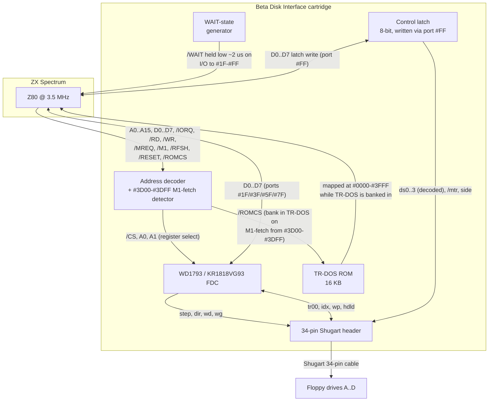

# Beta Disk Interface

**Scope:** Hardware and host-glue aspects of the Beta Disk Interface — the address decoder, port map, TR-DOS ROM bank switching, drive/motor/side control, cable, variants, and common issues. The floppy controller chip itself (WD1793 / KR1818VG93) is covered in the sibling article [fdc_vg93.md](fdc_vg93.md); the TR-DOS logical disk format (directory, file types, disk parameters) is covered in [trd_disk_format.md](trd_disk_format.md).

**Audience:** Emulator authors, hardware reverse-engineers, modern Spectrum-clone designers, and demoscene coders who need to know exactly how the original 1985 Beta Disk Interface exposed the WD1793 to the Z80 — what ports to hit, in what order, with what side effects.

**Prerequisites:** A working knowledge of the Z80 CPU and a basic familiarity with floppy drive signals (step / dir / motor / index). It is strongly recommended to read [fdc_vg93.md](fdc_vg93.md) first or in parallel, because most of the Beta Disk Interface's host-visible behaviour is a thin wrapper around the FDC's register file.

**Depth:** Deep. Pin-level and byte-level detail, including the exact port addresses, the address decoder that produces them, the WAIT-state logic used to slow down the Z80's I/O cycles, and the Soviet clones that introduced subtle incompatibilities.

---

## §1. The Beta Disk Interface

### 1.1 Origins and product positioning

The Beta Disk Interface was released in 1985 by **Technology Research Ltd (Technology Research UK / TR Ltd.)**, a small British company founded by Andrew Owen. It was the first affordable **true floppy-disk** storage system for the ZX Spectrum — a distinction it holds over Sinclair's earlier **ZX Interface 1 + Microdrive** (1983), which was a tape-loop stringy-floppy rather than a real disk. The Beta Disk Interface predated Sinclair's first true floppy machine, the +3 with its internal 3" drive, by two years.

The interface shipped with two products:

- **The hardware**: a black plastic cartridge-style module that plugs onto the rear edge connector of the Spectrum (16/48 / 48+ / 128 / +2 / +3 — mechanically compatible with all Toastrack/Amstrad-era machines through adapter cables). It exposes a single **Shugart 34-pin** floppy connector and supports up to four drives (A, B, C, D).
- **The software**: a 16 KB **TR-DOS ROM** (versions 5.0, 5.1, 5.2, 5.3, 5.4 — the canonical version is 5.03 / 5.04) that, when banked in, takes over the **entire** `#0000–#3FFF` window (displacing the BASIC ROM), and adds BASIC keywords (`CAT`, `LOAD`, `SAVE`, `MERGE`, `ERASE`, `FORMAT`, `COPY`, `MOVE`) plus a `*` command-line interface for disk operations. The banking is triggered automatically by the interface's address decoder whenever the CPU fetches an instruction from the 256-byte window `#3D00–#3DFF`; no software `OUT` is required. See §4 for the full mechanism.

The original 1985 hardware used a Western Digital **WD1793** floppy controller (single-sided, single-density). The revised **Beta 128** model (1986) used double-density-capable WD2793 or the Soviet KR1818VG93 clone; the host interface is identical in all cases. The Beta 128 is the canonical model that dominated ex-USSR computing.

### 1.2 UK launch pricing and competitive landscape

Contemporary UK retail prices for the Beta Disk Interface and its direct competitors:

| Product | Year | Price |
|---|---|---|
| ZX Interface 1 + Microdrive + 4 carts (bundle) | 1983 | £99.95 |
| Opus Discovery, single 3" drive | 1984 | £199.95 |
| Opus Discovery, dual drive | 1984 | £329.95 |
| **Beta Disk Interface** (interface only) | 1985 | **£109.25** |
| **Beta Disk Interface + one drive** | 1985 | **£249.75** |
| **Beta 128** (revised interface) | 1986 | comparable |
| Sinclair +3 (whole computer, drive included) | 1987 | £199.99 |

The Beta Disk Interface sat between the cheap-but-limited Microdrive bundle and the more expensive Opus Discovery. Its UK market position was ultimately eroded by the +3 (1987), which included a drive in the base machine for less than the cost of a Beta Disk + standalone drive. In the West, the Beta Disk Interface was a niche product by 1988.

### 1.3 The ex-USSR replication

In 1985, the Spectrum's only storage was cassette tape. Loading a 48 KB program from tape took 3–5 minutes (more for protected loaders); loading the same program from a TR-DOS floppy took 1–3 seconds. In the West, that speed-up was a convenience; in the Soviet bloc, it became the foundation of an entire software market that lasted until the early 2000s.

The Beta Disk Interface's UK commercial life was short. After 1987, the +3 (with its integrated drive and +3DOS) and cheaper tape-based loaders eroded its Western market share. The opposite happened in the USSR and Eastern Bloc: the Beta Disk Interface (and its locally-made clones) became the **de facto** disk standard, and TR-DOS remained the dominant disk operating system for the Spectrum until the platform's commercial death.

### 1.4 The replication timeline

The Beta 128's migration into Soviet computing followed a chain of **sample-and-reverse-engineer**, not commercial import. There is no evidence of mass sales or even quantity imports of the original UK hardware: a single unit (or at most a handful) entered the USSR in 1987, was studied, and within a year had been cloned from Soviet-made parts. From that point on, every Beta Disk controller in the Eastern Bloc was a domestic clone — the Western product itself was no longer needed.

| Year | Event |
|---|---|
| **1986** | Beta 128 released in UK by Technology Research Ltd. |
| **1987** | A small number of Beta 128 units is imported into the USSR — not for resale, but as a specimen to study. The Italian-language *Spectrumpedia* (Grussu, citing [Mac Buster's Pentagon FAQ v1.0.2, 2001](https://web.archive.org/web/20160318222622/http://zxspectrum.hal.varese.it/static/documenti/pentagon.txt)) frames the import explicitly as an attempt "to copy its code". In parallel, the 128K Spectrum's ULA has by now been reverse-engineered by Sergey Patsyuk and Vyacheslav Bogomyatov's NTK Plus group in Moscow, enabling local 128K clones (the "Moscow" machine). |
| **1988** | The Beta 128's circuit diagram is reconstructed from the imported specimen and published in a Czechoslovak hobbyist journal. NTK Plus adapts it to Soviet-made logic ICs and produces the first local Beta 128 clone. The **KR1818VG93** — a Soviet second-source of the WD1793/WD1797 FDC, originally developed in the mid-1980s for state-funded computers like the Elektronika 85 and Corvette — becomes freely available on the grey market and is adopted as the standard FDC. |
| **1989** | NPVO Variant of Saint Petersburg begins production of the "Moskovskaya" controller — the first commercially-sold Soviet Beta 128 clone, on a single large PCB with a GRMP connector. |
| **1989** | **Pentagon 48K** released in Moscow — the first Soviet clone with a Beta 128 controller **built into the motherboard** rather than as a separate cartridge. Named "Pentagon" after the pentagonal ground-plane layout of its PCB. |
| **1990** | **Pentagon 128K** (with AY sound and ZX-Lprint printer interface added). |
| **1991–1996** | Pentagon PCB is "copied all over the ex-USSR". Mass production runs through state electronics plants, frequently assembled after-hours on programmable soldering stations. |
| **1992** | Approximately 3 million Spectrum users in the ex-USSR (per Pentagon FAQ). **Scorpion ZS-256** (Sergey Zonov, St. Petersburg) launches as a high-end, also Beta-compatible, alternative. |

### 1.5 Why Beta Disk locked in

Three factors compounded to make Beta 128 effectively unchallengeable in the ex-USSR market:

1. **It was cracked first.** The Beta 128 circuit was reverse-engineered and publicized in mid-1988, before any competing Western disk interface reached the Soviet Union. Once the schematic and the KR1818VG93 chip were in the wild, copying was free — state fabs stamped the FDC by the thousand, and any competing interface would have had to overcome Beta 128's head start.

2. **TR-DOS lived in EPROM.** Because the OS was burned into a 16 KB ROM, not loaded from disk, every clone "just worked" with the same DOS — no driver fragmentation, no chicken-and-egg boot problem, no version skew. A user could swap disks between a Pentagon, a Scorpion, and a Profi without thinking about it.

3. **Pentagon integrated it onboard.** By soldering the Beta 128 controller directly onto the motherboard (rather than as a separate cartridge), the Pentagon made every Pentagon machine a Beta Disk machine by default. The Pentagon was the cheapest and most-copied Soviet clone, so its design choice became the de facto standard. Buyers did not choose Beta Disk; they got it whether they wanted it or not.

The lock-in was total. An often-quoted observation from the era: by 1992, "every new program (game or system one) released in ExUSSR will be Beta 128 only." Tape effectively vanished from the Soviet scene years before it did from the Western one — the inverse of the conventional history, where the West kept tape dominant for games until the late 1980s.

### 1.6 Modern hardware inheritance

Modern Spectrum-clone and FPGA hardware still implements the Beta Disk port map for backward compatibility with the TR-DOS software catalogue:

- **ZX Evolution** (Pentagon-based FPGA redesign) — full Beta 128 compatibility.
- **ZX Spectrum Next** — Beta 128 port map implemented in the FPGA, in addition to the newer DivMMC/SD storage.
- **Karabas** (open-hardware Pentagon successor) — same.
- **DivMMC/DivIDE boot path** — emulates a Beta 128 floppy during the ESXDOS boot sequence, so TR-DOS software can launch from SD card.

The Beta Disk Interface is, as a result, the longest-lived storage interface in the Spectrum ecosystem: designed in 1985, locked in by 1990, and still emulated in 2024 — a forty-year run driven almost entirely by its ex-USSR adoption.

---

## §2. Hardware Block Diagram

### 2.1 The major components

A real Beta Disk Interface cartridge contains the following components:

| Component | Purpose | Notes |
|---|---|---|
| **Edge connector** | Plugs onto the Spectrum's rear expansion bus | All 86 pins of the ZX Spectrum edge connector are passed through to a second connector on the back of the cartridge, allowing further peripherals to be daisy-chained. |
| **Address decoder** | Decodes I/O ports `#1F`, `#3F`, `#5F`, `#7F`, `#FF` and the instruction-fetch trigger window `#3D00–#3DFF` (together with `/M1`, `/MREQ`, `/RD`) | Implemented as a small PAL or as discrete 74LS-series logic depending on the board revision. |
| **TR-DOS ROM** | 16 KB EPROM (27128 or equivalent) holding the TR-DOS 5.x code | Mapped into the Spectrum's `#0000–#3FFF` slot when paged in. |
| **WD1793 / KR1818VG93 FDC** | The floppy controller chip itself | See [fdc_vg93.md](fdc_vg93.md) for full details. |
| **Control latch (74LS273 or equivalent)** | 8-bit latch holding drive-select / motor / side bits | Written via port `#FF`. |
| **Clock oscillator** | 8 MHz crystal or RC oscillator | Drives the WD1793's CLK pin (8 MHz → 6/12/20/30 ms step rates, 250 kbit/s MFM data rate). |
| **WAIT-state generator** | Small monostable or RC delay that holds the Z80's `/WAIT` line low for ~2 µs on every I/O access to ports `#1F`–`#7F` | Necessary because the WD1793 needs ≥1 µs of address-setup time before `/RD` or `/WR` is asserted, but the Z80's I/O cycle is too fast for that at 3.5 MHz. |
| **Data bus buffer (74LS245)** | Bidirectional buffer between the Spectrum's data bus and the WD1793 / latch / ROM | Used to drive the WD1793's data lines strongly enough to survive the long cable runs of a daisy-chained Spectrum. |
| **Shugart 34-pin header** | Connects to the floppy drive cable | Carries the WD1793's step/dir/wg/wd signals plus the latched drive/motor/side signals. |

### 2.2 Signal flow



A few corrections from the older ASCII version of this diagram: the FDC does **not** output `ds0..3` (drive-select lines come exclusively from the control latch's 2-to-4 decoder fed by port `#FF` bits 0–1, see §5.1); and the FDC's handshake with the drive is **bidirectional** — `step`/`dir`/`wd`/`wg` are outputs, while `tr00`/`idx`/`wp`/`hdld` are inputs.

The key thing to notice in this diagram is that **all host-visible control flows through three places**: the WD1793 register file (ports `#1F`, `#3F`, `#5F`, `#7F`), the control latch (port `#FF`), and the TR-DOS ROM paged into memory. There is no other software-visible state in the cartridge.

### 2.3 Why a WAIT-state generator is needed

The WD1793's `/CS`, `A0`, `A1` inputs require ≥150 ns of address-setup time before `/RE` or `/WE` is asserted, and the read-data output needs ~150 ns after `/RE` is de-asserted before the bus can be released. At the Spectrum's 3.5 MHz Z80 clock, an I/O cycle is 4 T-states = ~1.14 µs, of which `/IORQ` is low for only 2 T-states (~570 ns). That's plenty of time for the address setup, but the WD1793 also requires the address to be stable for a full read or write — and the WD1793's output drivers are not strong enough to drive the long, capacitive Spectrum expansion bus at full speed.

The WAIT-state generator inserts ~2 µs of wait time at the start of every I/O cycle to ports `#1F`, `#3F`, `#5F`, `#7F`, `#FF`. This guarantees the WD1793 sees stable addresses and the data bus has time to settle. The cost is that I/O operations to the Beta Disk Interface take roughly 5–6 µs each (vs. ~2 µs for an unthrottled Z80 I/O cycle). The TR-DOS ROM code is written with this assumption in mind.

This is also why a Beta Disk Interface clone built with a fast modern microcontroller or FPGA can be **much** faster than the original: the WAIT state is no longer needed if the FDC replacement is fast enough to keep up with the Z80.

---

## §3. Port Map

### 3.1 The five host-visible ports

The Beta Disk Interface occupies five ports in the Z80's I/O address space:

| Port | Read (`IN`) | Write (`OUT`) | Action |
|---|---|---|---|
| `#1F` | Status register | Command register | Selects WD1793 register 0 (A0=0, A1=0). |
| `#3F` | Track register | Track register | Selects WD1793 register 1 (A0=1, A1=0). |
| `#5F` | Sector register | Sector register | Selects WD1793 register 2 (A0=0, A1=1). |
| `#7F` | Data register | Data register | Selects WD1793 register 3 (A0=1, A1=1). |
| `#FF` | (system variable read, see §3.4) | Control latch | Drive select, motor, side, ROM-page control. |

Note the pattern: bits 5 and 6 of the port number are `01` (this is what the address decoder recognises as "the Beta Disk Interface range"); bits 0, 1, and 2 select which WD1793 register to access (`00` = status/command, `01` = track, `10` = sector, `11` = data); bits 3, 4, and 7 are **don't-care** in the original hardware. This is why the Beta Disk Interface aliases across `#1F`, `#3F`, `#5F`, `#7F`, `#9F`, `#BF`, `#DF`, `#FF` — only bits 5 and 6 are actually decoded as 01 for the FDC.

Modern emulators and FPGA clones should decode bits 5 and 6 only (treating the FDC ports as a "select /CS low if bits 5,6 = 01"), and the control latch as a separate decode ("select /CS low if A0=1 and A1=1 and bits 5,6 = 11" — i.e. ports `#FF`, `#DF`, `#BF`, `#9F` all alias to the latch). Pentagon and Scorpion hardware does exactly this.

### 3.2 The WD1793 ports `#1F`, `#3F`, `#5F`, `#7F`

These four ports pass straight through to the WD1793's register-select pins, with `/CS` asserted. See [fdc_vg93.md §3](fdc_vg93.md) for the full description of what each register contains; for reference:

| Port | A1 | A0 | `/RE=0` (read) | `/WE=0` (write) |
|---|---|---|---|---|
| `#1F` | 0 | 0 | Status | Command |
| `#3F` | 0 | 1 | Track  | Track   |
| `#5F` | 1 | 0 | Sector | Sector  |
| `#7F` | 1 | 1 | Data   | Data    |

There is no wait between successive accesses — the TR-DOS ROM code is written with the assumption that every `IN` / `OUT` to these ports takes at least 5 µs (because of the WAIT-state generator in §2.3). Code that polls the status register in a tight loop will hit the WAIT state on every iteration.

### 3.3 The control latch port `#FF`

Writing to port `#FF` latches an 8-bit byte into the Beta Disk Interface's **system control register**. The bit assignment below applies **uniformly** to the original Western Beta Disk Interface (Beta, Beta Plus, Beta 128) and to every Soviet clone (Pentagon, Scorpion, Profi, Kay, ATM Turbo, Leningrad). It is the single most important register in the entire interface:

| Bit | Write (control) |
|---|---|
| 7 | (unused on original; see §3.3.4 for Soviet-clone use) |
| 6 | (unused) |
| 5 | Density select (0 = FM / single-density, 1 = MFM / double-density) |
| 4 | Head / side select (0 = side 0 / bottom, 1 = side 1 / top) |
| 3 | HLT gate (0 = blocks `/HLT` to FDC, 1 = normal — `/HLT` flows from FDC) |
| 2 | `/MR` (FDC master reset, active low — 0 = reset, 1 = normal) |
| 1 | Drive select bit 1 (together with bit 0) |
| 0 | Drive select bit 0 (together with bit 1) |

The drive-select field is **binary-encoded**, not one-hot: the four possible values select drives A through D.

| Bit 1 | Bit 0 | Selected drive |
|---|---|---|
| 0 | 0 | A |
| 0 | 1 | B |
| 1 | 0 | C |
| 1 | 1 | D |

This encoding means **only one drive can ever be selected at a time** — there is no way to spin up multiple drives simultaneously by writing a combined value. Compare this with the IBM PC floppy controller, which uses separate `/MOTOR ON` and drive-select lines and allows concurrent motor spin-up.

The conventional values written to port `#FF` for the four drives, with all other bits in their normal-operating state (`/MR=1`, `HLT=1`, side 0, MFM density), are therefore:

| Drive | Conventional byte |
|---|---|
| A | `#0C` (binary `00001100`) |
| B | `#0D` (binary `00001101`) |
| C | `#0E` (binary `00001110`) |
| D | `#0F` (binary `00001111`) |

For side 1, set bit 4 (`+ #10`). For a hardware FDC reset, clear bit 2 (`& #FB`, then restore).

#### 3.3.1 Why the head/side select lives on port `#FF`, not in the FDC

A common misconception (and the source of much misinformation in Western documentation) is that the Beta Disk Interface relies on the WD1793's `s` bit (bit 3 of the Type II command byte) for side selection. This is **not** how the Beta Disk hardware is wired. On the Beta Disk Interface, bit 4 of port `#FF` is routed directly to the drive's side-select line on the Shugart connector — the FDC's side-compare logic is used only for verifying the sector ID field, not for physically switching heads. Software that needs to read side 1 must write `bit 4 = 1` to port `#FF` *before* issuing the read command, not just rely on the command byte.

This is also why the Soviet clones kept the same bit assignment: every existing piece of TR-DOS software depends on this layout, and changing it would have broken the entire disk-software catalogue.

#### 3.3.2 Density select (bit 5)

Although bit 5 selects between FM (single-density) and MFM (double-density) recording, **TR-DOS itself only ever uses MFM**. The FM mode exists in the hardware because the WD1793 supports it, but no commercial Soviet software ships in FM format — the capacity penalty (250 KB/side vs. 500 KB/side for MFM) was too steep. FM is used only by hobbyists for cross-platform disk exchange with older FM-only systems (e.g. CP/M machines using the IBM 3740 format).

Software that wants to remain compatible with the entire Soviet software library should leave bit 5 at `1` (MFM) at all times.

#### 3.3.3 The /MR (master reset) bit

Bit 2 of port `#FF` is routed to the WD1793's `/MR` (Master Reset) input. Writing `0` to this bit holds the FDC in reset; writing `1` releases it. TR-DOS performs a reset sequence at startup: it writes a byte with `bit 2 = 0`, waits briefly, then writes the normal-operating byte with `bit 2 = 1`. This guarantees a known initial state regardless of what the FDC was doing before.

The reset behaviour of the WD1793 itself differs between the original WD1793 and the WD1793-02 / KR1818VG93 — see [fdc_vg93.md §8.7](fdc_vg93.md) for details.

#### 3.3.4 Note on bits 6 and 7

On the **original Western Beta Disk Interface**, bits 6 and 7 are not connected on write — software should write them as `0`. Soviet clones (Pentagon, Scorpion) leave them unused as well, but a few later clone families (notably the ATM Turbo 2+ and some Profi revisions) repurpose bit 7 as a software-controlled TR-DOS ROM page-lock override. Software targeting the original hardware should not rely on this. See §4.2.4 for the discussion of the Soviet-clone `#FF` bit 7 override.

### 3.4 Reading port `#FF` — the status register

Reading port `#FF` returns a **status byte** assembled from the WD1793's two most important handshake lines:

| Bit | Read (status) |
|---|---|
| 7 | INTRQ (command completion interrupt request) |
| 6 | DRQ (data request — byte ready in data register) |
| 5 | (undefined; usually 0) |
| 4 | (undefined; usually 0) |
| 3 | (undefined; usually 0) |
| 2 | (undefined; usually 0) |
| 1 | (undefined; usually 0) |
| 0 | (undefined; usually 0) |

This is the standard polling interface used by all TR-DOS software (and by machine-code disk routines in games, demos, and copiers). The typical poll loop for waiting on a data byte during a sector read is:

```z80
wait_drq:  IN A, (#FF)        ; read status byte
           AND #40            ; isolate DRQ
           JR Z, wait_drq     ; loop until DRQ=1
           IN A, (#7F)        ; read the byte from the FDC data register
```

Similarly for waiting on command completion:

```z80
wait_int:  IN A, (#FF)
           AND #80            ; isolate INTRQ
           JR Z, wait_int
           IN A, (#1F)        ; read FDC status to clear INTRQ
```

The previous claim that port `#FF` is write-only on the original Western hardware and returns "undefined floating-bus data" is **wrong**. The DRQ/INTRQ readback works on all Beta Disk Interface revisions from the original 1984 Beta through to modern FPGA clones. Some Soviet clone revisions additionally mirror the written control byte into the low 6 bits of the readback (so that software can verify its current drive / side / density settings), but this is non-standard and should not be relied upon.

### 3.5 The `#3D00–#3DFF` instruction-fetch trigger

The Beta Disk Interface also monitors the CPU's address bus and control lines. When the Z80 performs an **instruction fetch** — that is, when `/M1`, `/MREQ`, and `/RD` are all asserted (low) simultaneously — and the address bus carries a value in `#3D00–#3DFF`, the interface activates the TR-DOS ROM in place of the BASIC ROM. The 256-byte window is the **trigger**, not the ROM's mapping range; once activated, the TR-DOS ROM occupies the full `#0000–#3FFF`. Note that the trigger fires only on an instruction fetch — a data read such as `LD A, (#3D2A)` does **not** activate TR-DOS. The full mechanism is described in §4.

---

## §4. TR-DOS ROM Bank Switching

### 4.1 Why a separate ROM is needed

The ZX Spectrum's ROM (`#0000–#3FFF`, 16 KB) contains the BASIC interpreter and the cassette LOAD/SAVE routines. It cannot be modified in place, and the cassette routines are far too primitive to handle floppy disk. The TR-DOS is therefore supplied as a separate 16 KB ROM that takes over the `#0000–#3FFF` window whenever disk operations are needed.

When TR-DOS is paged in, the BASIC interpreter is gone — there is no BASIC, no syntax checking, no editor. The TR-DOS ROM is a self-contained piece of code that handles disk operations and then returns control to the original ROM. This is conceptually similar to how the +3 uses its `+3DOS` calls (the `DOS` hook at `#0008`), but the mechanism is different.

### 4.2 The paging mechanism: M1-fetch-triggered address decode

The Beta Disk Interface banks its ROM in and out by **watching the Z80's instruction-fetch cycle**. A small piece of combinational logic monitors the address bus (A0–A15) together with the `/M1`, `/MREQ`, and `/RD` lines, and toggles a flip-flop that selects which of two 16 KB ROMs — the Spectrum's on-board BASIC ROM or the TR-DOS ROM — responds to the `#0000–#3FFF` window.

The decode logic:

| Condition | Effect on flip-flop |
|---|---|
| `/M1` asserted **and** address in `#3D00–#3DFF` | **Set** the flip-flop → TR-DOS ROM active |
| `/M1` asserted **and** address in `#4000–#FFFF` | **Clear** the flip-flop → BASIC ROM active |
| `/M1` asserted **and** address in `#0000–#3CFF` | No change (whichever ROM is currently selected stays selected) |
| `/M1` negated (data read, write, interrupt acknowledge) | No change |

The flip-flop's output drives a multiplexer on the `#0000–#3FFF` chip-select lines. The currently-selected ROM responds to **all** memory accesses in that window, not just instruction fetches — but the flip-flop itself only changes state on instruction-fetch events.

#### 4.2.1 Why `#3D00–#3DFF`?

In the standard Spectrum ROM, the 256-byte region `#3D00–#3DFF` holds the **character font bitmap** (the 8×8 pixel patterns for the ASCII characters). It is data, never code: the BASIC interpreter never executes instructions there. Intercepting instruction fetches in this range is therefore unambiguous — no legitimate BASIC ROM code path is ever broken by the swap. The choice of `#3D00–#3DFF` as the trigger window is a direct consequence of this: it lets the Beta Disk Interface hijack the address bus without ever conflicting with normal BASIC execution.

#### 4.2.2 What activates and what does not

The trigger fires only on an actual instruction fetch (opcode read) — **not** on a data read, a write, or an interrupt-vector read. Concretely:

- `RANDOMIZE USR 15619` from BASIC → the CPU eventually does an M1 fetch at `#3D03` → **TR-DOS activates**.
- `LD A, (#3D2A)` → ordinary data read at `#3D2A` → **no effect** (BASIC ROM stays active).
- `LD (#3D2A), A` → write at `#3D2A` → **no effect**.
- `CALL #3D03` from a machine-code program → M1 fetch at `#3D03` → **TR-DOS activates**.

The first instruction the CPU executes after the swap is whatever byte the TR-DOS ROM happens to have at the trigger offset. TR-DOS is laid out so that the bytes at `#3D00`, `#3D03`, `#3D13`, `#3D2F` are deliberately placed `JP` / `NOP` / `RET` opcodes that route execution to the appropriate TR-DOS routine. See §4.4 for the entry-point table.

#### 4.2.3 Automatic page-out

The hardware does not require (or accept) any explicit "page-out" instruction. The moment the CPU's next instruction fetch lands in `#4000–#FFFF` — i.e., the CPU jumps to code in RAM — the flip-flop clears and the BASIC ROM returns to the `#0000–#3FFF` window. This is what makes TR-DOS calls transparent: the user's `RANDOMIZE USR 15619` pushes a return address (in RAM), the CPU fetches the first byte of the TR-DOS entry at `#3D03`, the ROM swaps in, TR-DOS runs, and when TR-DOS executes `RET` the CPU pops the return address (in RAM) and fetches its next instruction there — at which point the BASIC ROM is back.

#### 4.2.4 Soviet clones: the `#FF` bit 7 override

The original Beta Disk Interface relies solely on the M1-fetch decode described above. Some Soviet clones (in particular the Pentagon and Scorpion families) add an **optional software override**: bit 7 of port `#FF` (see §3.3) forces the TR-DOS ROM to stay mapped regardless of the address bus. This was added so that machine-code loaders could keep TR-DOS paged in while running their own code in RAM at `#4000–#FFFF` — useful for custom disk-copy routines that need to interleave user code in RAM with TR-DOS calls without the constant ROM-swapping overhead. Software targeting the original Beta Disk Interface cannot rely on this bit.

### 4.3 How the TR-DOS ROM hooks BASIC

When the TR-DOS ROM is paged in, it copies a small set of hooks into the Spectrum's RAM (specifically, it patches the BASIC command table and the channel definitions). After this, the BASIC keywords `LOAD`, `SAVE`, `MERGE`, `VERIFY`, etc. are redefined to call TR-DOS routines instead of the cassette routines. The `*` (star) command is also installed, allowing direct access to TR-DOS commands like `*CAT`, `*FORMAT`, `*COPY`.

The hook installation is performed by entering TR-DOS via its **cold entry point** at `#3D00` (decimal 15616 — the user types `RANDOMIZE USR 15616`). The M1 fetch at `#3D00` triggers the address-bus decoder (see §4.2), the TR-DOS ROM takes over `#0000–#3FFF`, and the TR-DOS init routine patches the BASIC command table in RAM. From this point, all disk operations go through TR-DOS transparently: each installed hook routine internally executes `CALL #3D03` to re-trigger the banking whenever a disk operation is needed.

### 4.4 The entry points

The Beta Disk Interface does **not** inject any hidden stub bytes into the Spectrum's memory map. When TR-DOS is inactive, the bytes at `#3D00–#3DFF` are simply the BASIC ROM's character font bitmap — there is no bootloader lurking in that range. The banking hardware triggers purely on the address-bus state during an instruction fetch (see §4.2); the first byte the CPU actually executes after the swap is the byte the TR-DOS ROM has at the fetched offset, which TR-DOS deliberately lays out as a jump or a no-op.

The user-visible entry points, all located inside the `#3D00–#3DFF` trigger window:

| Address | Decimal | Purpose |
|---|---|---|
| `#3D00` | 15616 | **Cold entry**. Initialise the interface, format a fresh disk if requested, drop to the `*` command prompt. Invoked from BASIC as `RANDOMIZE USR 15616`. |
| `#3D03` | 15619 | **Warm entry**. Re-enter TR-DOS after the BASIC keyword hooks are already installed. Used internally by the patched `LOAD` / `SAVE` / `*CAT` keywords. |
| `#3D13` | 15635 | Low-level entry used by some machine-code loaders for raw sector reads/writes. |
| `#3D2F` | 15663 | **Indirect-call trampoline**. The caller pushes the TR-DOS subroutine address onto the stack, then `JP #3D2F`. The M1 fetch at `#3D2F` banks TR-DOS in, the trampoline `RET`s into the requested subroutine, and the subroutine's final `RET` pops the caller's address (in RAM) — at which point the BASIC ROM is back. This is the standard way for machine-code programs to call TR-DOS internal routines without writing their own banking glue. |

When the user types `RANDOMIZE USR 15616`, the Spectrum BASIC interpreter pushes the return address (a location in RAM around `#5Cxx`), then the CPU performs an M1 fetch at `#3D00`. The Beta hardware triggers on the address-bus state, the TR-DOS ROM takes over the `#0000–#3FFF` window mid-cycle, and the CPU reads the TR-DOS ROM's byte at offset `#3D00` (typically a `JP` to the cold-init routine elsewhere in the TR-DOS ROM) and executes it.

### 4.5 What happens during TR-DOS execution

Once TR-DOS is paged in, the spectrum's `#0000–#3FFF` window contains TR-DOS code. The interrupt vector table at `#0000–#00FF` is replaced, so RST instructions go to TR-DOS handlers. The TR-DOS code uses the WD1793 ports (`#1F`, `#3F`, `#5F`, `#7F`) and the control latch (`#FF`) to perform disk I/O, and it uses the Spectrum's normal RAM (`#4000–#FFFF`) for buffers and state.

When TR-DOS finishes a command, it executes `RET`. The CPU pops the caller's return address (which is in RAM, somewhere in `#4000–#FFFF`) and fetches its next instruction from there; the moment that M1 fetch lands in `#4000–#FFFF`, the Beta Disk Interface's address decoder clears the TR-DOS-active flip-flop and the BASIC ROM returns to the `#0000–#3FFF` window automatically. No explicit "page-out" write is performed, and none is needed.

The BASIC command hooks installed by TR-DOS (see §4.3) remain resident in RAM. The next time the user types `LOAD`, `SAVE`, or `*`, the hook routine — which lives in RAM — executes a `CALL #3D03`, which again triggers the M1-fetch mechanism, banks TR-DOS back in, and the cycle repeats. From the user's point of view, TR-DOS is "always there" once activated, even though the TR-DOS ROM itself is only mapped into `#0000–#3FFF` during the actual disk operation.

### 4.6 Compatibility with the 128K / +2 / +3

The 128K, +2, and +3 Spectra have a more sophisticated memory management system than the 48K: they can page 16 KB RAM banks into the `#0000–#3FFF` window, and they have a separate "ROM 0 / ROM 1" selection mechanism for the BASIC ROMs. The Beta Disk Interface's paging logic interferes with these mechanisms in a few subtle ways:

- On the 128K / +2 (Toastrack / Grey +2), TR-DOS works as on the 48K: paging the TR-DOS ROM in simply replaces the BASIC ROM. The 128K's `+3DOS` calls (which use the `DOS` hook at `#0008`) are not used.
- On the +2A / +3 (Black +2 / +3), the paging mechanism is different (the `+3` uses a custom MMU). The Beta Disk Interface works, but TR-DOS coexists awkwardly with the +3's own `+3DOS` ROM — usually TR-DOS takes over and the +3's floppy controller is disabled via software.
- On the Soviet clones (Pentagon, Scorpion), TR-DOS is the default and only disk operating system; there is no conflict.

See §7 for a full discussion of variants.

---

## §5. Drive Select, Side, Density, Motor, and Reset

Section §3.3 specifies the port `#FF` bit layout; this section walks through what each control field actually does at the drive end. The Shugart 34-pin cable is what physically connects the Beta Disk Interface to the drive, and many of the latch bits route directly to specific pins on that cable (see §6.1 for the full pinout).

### 5.1 Drive selection (bits 0–1, binary-encoded)

The Beta Disk Interface supports up to four floppy drives, labelled **A**, **B**, **C**, **D**. Drive selection uses **bits 0 and 1 of port `#FF` as a 2-bit binary field** (not one-hot). A 2-to-4 decoder inside the cartridge translates the binary value into one of four active-low `/DS0`–`/DS3` lines on the Shugart cable:

| Bit 1 | Bit 0 | Decoder output asserted | Drive |
|---|---|---|---|
| 0 | 0 | `/DS0` (pin 10) | A |
| 0 | 1 | `/DS1` (pin 12) | B |
| 1 | 0 | `/DS2` (pin 14) | C |
| 1 | 1 | `/DS3` (pin 6)  | D |

The decoder is typically a 74LS155 or equivalent (the Soviet clone uses a КР1533ИД4 or simple discrete logic). Because the field is decoded, **it is physically impossible to assert two `/DSn` lines simultaneously** — exactly one drive is selected for any value of bits 0–1, including the `11` value that selects D. Writing `#00` to bits 0–1 selects A, not "no drive".

If software needs to deselect all drives (e.g., to park the heads or stop the spindle on real floppy hardware), it must do so by clearing the head-load condition on the WD1793 and waiting for the motor to spin down — there is no "no drive selected" state exposed by port `#FF`.

See §3.3 for the conventional full-byte values `#0C`, `#0D`, `#0E`, `#0F` used to select drives A–D with the rest of the latch in its normal-operating state.

### 5.2 Side selection (bit 4)

**Bit 4 of port `#FF` is routed directly to the floppy cable's `/SIDE1` line (pin 32)**, with no involvement from the WD1793. The Beta Disk Interface cartridge does **not** use the WD1793's internal `s` bit (bit 1 of the Type II/III command byte) for physical head selection. The FDC's `s` bit only affects which sector ID side field the FDC compares against when matching a sector — see [fdc_vg93.md §5](fdc_vg93.md) for the FDC-side semantics.

This wiring choice is a frequent source of confusion in Western documentation. The implication for software:

- To read side 0: write `bit 4 = 0` to port `#FF`, then issue the Type II command with `s = 0`.
- To read side 1: write `bit 4 = 1` to port `#FF`, **then** issue the Type II command with `s = 1` (so the ID-field compare also matches side 1).

Software that flips only the WD1793 `s` bit without also flipping port `#FF` bit 4 will read the same physical head twice and get either duplicate data or `RECORD NOT FOUND`. Software that flips only port `#FF` bit 4 without setting `s = 1` will switch the head but the FDC's ID compare will reject every sector as side-mismatch. TR-DOS handles both consistently; custom loaders must do the same.

The physical `/SIDE1` signal takes a few milliseconds to settle on real drives (it moves the head stacker solenoid). Reading immediately after toggling bit 4 may catch the head mid-transition.

### 5.3 Density (bit 5)

Bit 5 routes to the WD1793's `DDEN` (double-density enable) input: `0` selects FM (single density, 250 kbit/s), `1` selects MFM (double density, 500 kbit/s). See §3.3.2 for the practical guidance — TR-DOS uses MFM exclusively, and software should leave bit 5 at `1` at all times.

The `DDEN` signal is also used by the cartridge's data-separator glue (on original Beta 128 hardware, a free-running PLL built around a 74LS124 or equivalent). Switching `DDEN` mid-track is electrically valid but produces garbage at the boundary; software that wants to mix FM and MFM sectors on the same disk (rare, used by some cross-platform copiers) must do so only at the index hole.

### 5.4 Motor control: implicit via head-load

The Beta Disk Interface has **no dedicated motor-on bit**. The spindle motor on a Shugart-bus drive starts automatically when the drive is selected **and** the head is loaded. The cartridge exploits this by tying the floppy cable's `/MOTOR ON` (pin 16) to the logical OR of "some drive is selected" and "/HDLD is asserted". In practice, this means:

1. Software writes the conventional drive-select byte to port `#FF` (e.g., `#0C` for drive A). The selected drive's `/DSn` goes low. On most drives this alone starts the spindle motor.
2. Software issues a Type I command (RESTORE / SEEK / STEP) with the **head-load flag** (`h`) set. The WD1793 asserts its `/HDLD` output, which on the Beta Disk Interface also drives the drive's `/HDLD` cable line (pin 4 on some variants) and reinforces the motor-on condition.
3. The motor keeps running as long as `/DSn` stays asserted (i.e., until software writes a different value to bits 0–1 of port `#FF`). There is no automatic motor-off timeout on the cartridge side.

**Consequence for software:** the motor on a real Beta Disk Interface keeps spinning for as long as a drive is selected — typically the entire duration of a TR-DOS session. The motor does **not** automatically stop between disk commands; this is fine for Soviet hardware (where the motor on a 3.5" drive uses negligible power) but it wears out 5.25" drives faster.

**Consequence for `RESTORE` on power-up:** the very first Type I command after a reset takes ≥6 index pulses (~1.2 seconds at 300 RPM) to complete, because the WD1793's internal spin-up timer must elapse. See §5.5.

On Soviet clone hardware (Pentagon, Scorpion, ATM Turbo, Profi), the same logic applies — the motor bit, if any, is wired in parallel with the drive-select logic so that the motor runs whenever any drive is selected. There is no need for software to manipulate a separate motor bit, despite the persistent myth that Pentagon uses port `#FF` bit 7 for the motor (it does not — see §7.3).

### 5.5 Drive spin-up timing

After the spindle motor starts, the floppy disk takes time to reach its operating speed (300 RPM for both 5.25" and 3.5" drives). The WD1793 has a built-in **spin-up timer** (the `u` bit in Type I commands, sometimes called the "spin-up flag"): when set, the FDC waits for 6 index pulses (~1.2 seconds at 300 RPM) before completing the Type I command. This guarantees the disk is at full speed before any Type II/III command runs.

TR-DOS's startup `RESTORE` command always uses `u = 1`, so the first disk access on power-up takes ~1.2 seconds. Subsequent seeks are fast (a few milliseconds per track step, set by the step-rate bits `r0`, `r1` — typically 6 ms on Soviet hardware).

Software that knows the motor is already spinning (e.g., a second access within a few seconds of the first) can clear `u` to skip the spin-up delay. Most custom loaders do this after their initial `RESTORE` to gain ~1 second of load-time reduction.

### 5.6 Reset state and the `/MR` bit

On power-up or after a `/RESET`, the Beta Disk Interface's control latch is reset to `#00`. This means:

- Bits 0–1 = `00` → drive A selected (decoder default).
- Bit 2 = `0` → **the WD1793 is held in `/MR` (master reset)**. See [fdc_vg93.md §8.7](fdc_vg93.md) for what `/MR` does to the FDC's internal state (track register, command state machine, etc.).
- Bit 3 = `0` → `/HLT` blocked (the head-load timing does not gate Type I commands).
- Bit 4 = `0` → side 0.
- Bit 5 = `0` → FM (single density).

Because the FDC is held in reset, software cannot issue any FDC command until it has explicitly released `/MR` by writing a byte with `bit 2 = 1` to port `#FF`. This is the very first thing TR-DOS does after being banked in:

```z80
           LD   A, #0C         ; drive A, /MR=1 (release reset), HLT=1,
                               ; side 0, MFM
           OUT  (#FF), A
```

After this, the FDC is live and software can issue commands. The host's `/RESET` line (asserted by the Spectrum on power-up or when the RESET button is pressed) also forces the latch back to `#00` and re-asserts `/MR`.

For the rest of the boot sequence (TR-DOS ROM banking, entry points), see §4.

---

## §6. Cable Pinout and Drive Compatibility

### 6.1 The Shugart 34-pin connector

The Beta Disk Interface uses the industry-standard **Shugart 34-pin** floppy connector. This is the same connector used by 5.25" and 3.5" floppy drives on the IBM PC and almost every other home computer of the era, with one important difference: **the Shugart bus uses drive-select jumpers, while the IBM PC bus uses a twisted cable.**

The pinout of the 34-pin header on the Beta Disk Interface:

| Pin | Signal | Direction | Notes |
|---|---|---|---|
| 2  | `/REDWC` (reduced write current) | out | Usually unused on the Beta Disk Interface. |
| 4  | `/HDLD` (head load) | out | Driven by the WD1793's `/HDLD` output when a Type I command is issued with `h = 1`. Used by some drives to gate spindle motor start. |
| 6  | `/DS3` (drive select 3) | out | Asserted (active low) when bits 0–1 of port `#FF` = `11` (drive D). |
| 8  | `/INDEX` | in | From the currently-selected drive; routed to the WD1793's `/IDX` input. |
| 10 | `/DS0` (drive select 0) | out | Asserted when bits 0–1 of port `#FF` = `00` (drive A). |
| 12 | `/DS1` (drive select 1) | out | Asserted when bits 0–1 of port `#FF` = `01` (drive B). |
| 14 | `/DS2` (drive select 2) | out | Asserted when bits 0–1 of port `#FF` = `10` (drive C). |
| 16 | `/MOTOR ON` | out | Wired as logical-OR of "any `/DSn` active" and `/HDLD` from the WD1793. There is no separate motor bit on port `#FF`. |
| 18 | `/DIR` (direction select) | out | From the WD1793's `/DIR` output. |
| 20 | `/STEP` | out | From the WD1793's `/STEP` output. |
| 22 | `/WDATE` (write data) | out | From the WD1793's `WD` output. |
| 24 | `/WGATE` (write enable) | out | From the WD1793's `WG` output. |
| 26 | `/TRK00` (track 0) | in | From the currently-selected drive; routed to the WD1793's `/TR00` input. |
| 28 | `/WPT` (write protect) | in | Routed to the WD1793's `/WPRT` input. |
| 30 | `/RDATE` (read data) | in | Routed to the WD1793's `RAW READ` input. |
| 32 | `/SIDE1` (side select) | out | Driven **directly by bit 4 of port `#FF`**, not by the WD1793. See §5.2. |
| 34 | `/READY` (disk ready) | in | Often unused; the WD1793 uses index pulses for spin-up detection instead. Some clones (e.g. Scorpion ZS-256) wire `/READY` to a separate status input for explicit motor-up detection. |
| Odd pins (1, 3, 5, ..., 33) | GND | — | Ground; all odd pins are tied to ground. |

**Critical**: the `/DS0`–`/DS3` lines are not directly bit-for-bit from port `#FF`; they are the output of a 2-to-4 decoder fed by port `#FF` bits 0 and 1 (see §5.1). Similarly, `/SIDE1` does **not** come from the WD1793 — the FDC's `/SID` pin is left unconnected on the Beta Disk Interface, because the FDC's internal side-compare logic operates on the sector ID field, not on a separate physical pin.

### 6.2 Drive compatibility

The Beta Disk Interface works with **any** Shugart-bus floppy drive: 5.25" 40-track (40 tracks × 1 side, 40 tracks × 2 sides), 5.25" 80-track (80 tracks × 2 sides, "quad density"), 3.5" 80-track (standard PC floppy drive), and 3" drives (used by the Amstrad CPC / +3 — though the +3 uses its own internal interface, an external Beta Disk Interface connected to a 3" drive works fine).

To use a drive with the Beta Disk Interface:

1. **Set the drive-select jumper** on the drive to match the cable position. Shugart-bus drives have a small DIP switch or solder jumper that selects `/DS0`, `/DS1`, `/DS2`, or `/DS3`. The first drive on the cable should be set to `/DS0` (drive A); the second to `/DS1` (drive B); etc.
2. **Terminate the last drive on the cable**. The last drive in the chain should have its termination resistor pack installed (or the terminating jumper set). Intermediate drives should have their termination removed to avoid bus contention.
3. **Set the proper drive-ready configuration**. Some drives have a `/READY` jumper; the Beta Disk Interface does not use `/READY`, so it does not matter, but if the drive requires `/READY` to be pulled low before it responds, this jumper should be set to "always ready" or tied to ground.

### 6.3 IBM PC drives: the twist problem

Standard IBM PC floppy drives use a **twisted cable** instead of drive-select jumpers: the cable has a 7-wire twist between the connectors for drive A and drive B, so that drive A responds to `/DS1` (because the twist routes `/DS0` from the controller to the drive's `/DS1` pin), and drive B responds to `/DS0`. This means an unmodified IBM PC drive connected to a Beta Disk Interface (which does not have the twist) will be on the wrong drive-select line.

To use an IBM PC 3.5" drive on a Beta Disk Interface, you must either:
- Use a cable with the IBM twist (and live with the fact that drive A responds to port `#FF` bit 1, not bit 0), or
- Modify the drive (often a small solder jumper on the drive's PCB) to change it from `/DS1` to `/DS0`, then use a straight cable.

Soviet clones often shipped with IBM-twist cables for compatibility with cheap surplus IBM PC drives, so Soviet software does not assume a specific mapping of port `#FF` bits to cable positions.

### 6.4 Drive geometry and TR-DOS

TR-DOS 5.x assumes **80 tracks × 2 sides × 10 sectors/track × 512 bytes/sector** by default (the standard TR-DOS 80-track format, see [trd_disk_format.md](trd_disk_format.md)). However, the underlying hardware supports any reasonable geometry:

- 40-track 5.25" drives (single-sided or double-sided) — TR-DOS 5.0 / 5.1 supports these via the `*FORMAT` command with reduced track count.
- 80-track 5.25" drives — standard TR-DOS format.
- 80-track 3.5" drives — standard TR-DOS format; the most common configuration on Soviet hardware.
- 80-track 3" drives (as used by the Amstrad CPC and the +3) — supported by TR-DOS, though rarely used because of the +3's separate internal controller.

The WD1793's step rate must match the drive's track-to-track step time. TR-DOS uses a 6 ms step rate (clock bit pattern `00` in the Type I command), which works for all standard 5.25" and 3.5" drives. Faster drives (e.g., 3 ms on some 3.5" drives) are supported by changing the step rate bits in the Type I command byte.

### 6.5 Cable length and signal integrity

The Shugart bus is rated for a maximum cable length of about 1 metre (≈3 feet). The Beta Disk Interface itself is at the end of the Spectrum's expansion bus, which adds another ~30 cm of bus length before the cable even starts. Long cables (more than 1.5 metres total) cause signal reflections and timing problems — particularly on the high-impedance `/RDATE` line, where reflections can produce phantom data transitions that the WD1793's PLL will misinterpret.

In practice, Soviet Beta Disk Interface clones used short cables (typically 30–50 cm) and a single drive per cable, with no signal-integrity problems. Multi-drive setups with long cables often required termination resistors at both ends of the cable to absorb reflections.

---

## §7. Variants: Beta 48, Beta 128, Soviet Clones, Pentagon Integration

### 7.1 The original Beta 128 vs. Beta 48

The original Beta Disk Interface shipped in two main revisions:

- **Beta 48** (1985) — for the 16K / 48K Spectrum. Provides ports `#1F`–`#7F` and the control latch on port `#FF`. The TR-DOS ROM is a 16 KB EPROM that pages into the Spectrum's `#0000–#3FFF` window. Supports up to 4 drives. Uses a WD1793 FDC.
- **Beta 128** (1986) — for the 128K, +2, and +3. Functionally identical to the Beta 48, but with revised address-decoding logic that works correctly with the 128K's more complex memory management. Some Beta 128 revisions used the WD2793 (double-density-capable) FDC, though TR-DOS never officially used double-density mode.

The host-visible port map and the control-latch bit assignment are **identical** on both revisions, so TR-DOS software runs on either without modification.

### 7.2 Soviet clones

After the Beta Disk Interface's hardware was reverse-engineered in the late 1980s, dozens of Soviet companies and hobbyists produced clones. The most common ones are:

- **Moscow / Leningrad / Kay Beta Disk clones** (various, 1989–1992) — direct PCB-level clones of the Beta 128, typically using the Soviet **KR1818VG93** second-source FDC (see §7.7). Compatible with TR-DOS 5.x without modification.
- **Pentagon onboard FDC** (Pentagon 48, Pentagon 128, Pentagon 512, 1991–1996) — the Pentagon home-brew computer has the Beta Disk Interface port map built into its motherboard. Uses the KR1818VG93. The control latch on port `#FF` has the **same bit assignment as the original Beta Disk Interface**: bits 0–1 = drive select (binary), bit 2 = `/MR`, bit 3 = `HLT`, bit 4 = side, bit 5 = density, bits 6–7 = unused. The persistent Western myth that Pentagon uses port `#FF` bit 7 for the motor is wrong: the spindle motor on a Pentagon motherboard is wired exactly as on the original Beta Disk (logical-OR of "any drive selected" and `/HDLD`), and there is no separate motor bit anywhere in the Pentagon's port map.
- **Scorpion ZS-256 onboard FDC** (Scorpion, 1992) — port-identical to the Pentagon and to the original Beta Disk. Uses KR1818VG93 or КР1818VG93 (interchangeable). Adds extra system ports elsewhere (`#1F` for memory banking, `#7F` for video page, etc.) but **does not** alter the Beta Disk Interface port `#FF` bit assignment.
- **ATM Turbo 2+** and **Profi** — same Beta Disk port map, same `#FF` bits. Both machines add their own system ports for memory banking and video, but the FDC interface is the standard Beta Disk port map.
- **ZX Evolution** (2010+) — modern Russian FPGA-based clone with a real floppy connector. The Beta Disk port map is implemented bit-for-bit in the FPGA, including the WAIT-state generator and the M1-fetch-triggered ROM banking. Bit-for-bit software compatible with the original.

The reason all Soviet clones use the same `#FF` bit assignment is straightforward: TR-DOS 5.x ROMs were burned by the thousand and distributed as binaries, and any clone that deviated from the bit layout would have broken every existing piece of Soviet disk software. The economic pressure for compatibility was enormous.

### 7.3 The non-existent "port `#FF` chaos"

A persistent claim in some Western documentation is that Soviet clones "added motor and side bits to port `#FF` without standardising", creating a tangle of incompatible variants. This claim is **false**. The port `#FF` bit assignment is **unified across every Soviet clone** and matches the original Western Beta Disk Interface bit-for-bit:

| Bit | Original Beta Disk (1984–87) | Pentagon | Scorpion | ATM Turbo | Profi | ZX Evolution |
|---|---|---|---|---|---|---|
| 7 | (unused, see §3.3.4) | (unused) | (unused) | (unused) | (unused) | (unused) |
| 6 | (unused) | (unused) | (unused) | (unused) | (unused) | (unused) |
| 5 | Density (DDEN) | Density | Density | Density | Density | Density |
| 4 | Side (`/SIDE1`) | Side | Side | Side | Side | Side |
| 3 | HLT gate | HLT gate | HLT gate | HLT gate | HLT gate | HLT gate |
| 2 | `/MR` | `/MR` | `/MR` | `/MR` | `/MR` | `/MR` |
| 1 | Drive bit 1 | Drive bit 1 | Drive bit 1 | Drive bit 1 | Drive bit 1 | Drive bit 1 |
| 0 | Drive bit 0 | Drive bit 0 | Drive bit 0 | Drive bit 0 | Drive bit 0 | Drive bit 0 |

There are no "Pentagon bit 7 motor" or "Scorpion bit 4 side" variants. The likely origin of the myth:

1. Some early Western emulators implemented the Beta Disk Interface from the WD1793 datasheet alone, without access to Soviet documentation, and made up plausible-sounding motor and side bits.
2. A few one-off homebrew Soviet PCBs (not the mainstream Pentagon / Scorpion / ATM Turbo / Profi lines) experimented with extra system ports that collided with `#FF` and required patching TR-DOS. These experiments were never standardised.
3. The fact that TR-DOS 6.x, ETR-DOS, and Mr Gluk Reset Service *do* probe the hardware at boot is real — but they probe for memory-banking and video-page variants, not for `#FF` bit-layout variants.

Modern emulators (UnrealSpeccy, ZEsarUX, FUSE, SpecEmu, Speccy2010, etc.) all implement the unified port `#FF` layout described in this article. Software that targets the Soviet clone scene can and should assume this layout.

A small subset of later Soviet machines (notably the **ATM Turbo 2+** in its CP/M mode, and the **Profi 5.x** in its "OS 9/X" experimental mode) repurpose port `#FF` bit 7 as a software-controlled TR-DOS ROM page-lock override for a small portion of their boot sequence. This override is invisible to TR-DOS software and does not affect the standard port `#FF` semantics.

### 7.4 Pentagon / Scorpion specifics

On Pentagon and Scorpion hardware, the Beta Disk Interface port map is **wired directly to the motherboard** — there is no external cartridge. The port addresses are the same (`#1F`–`#7F`, `#FF`), but the WAIT-state generator is implemented as part of the motherboard's Z80 I/O logic, not as a separate monostable.

Both machines also have an **onboard TR-DOS ROM** (typically version 5.03 or 5.04) banked in using the same M1-fetch-triggered mechanism as the original Beta Disk Interface (see §4.2) — an instruction fetch from `#3D00–#3DFF` activates the TR-DOS ROM in place of the machine's main ROM. The TR-DOS ROM is soldered to the motherboard (often as part of a larger "BIOS" / system ROM that also contains a BASIC ROM and CP/M loader). Pentagon and Scorpion additionally expose the `#FF` bit 7 software override described in §4.2.4, which the original Beta Disk Interface does not have.

### 7.5 Western variants and uncommon drives

A few Western companies produced Beta Disk Interface variants:

- **Technology Research Beta 128 with WD2793** — Western Digital's WD2793 is a double-density-capable upgrade of the WD1793. Some Beta 128 boards shipped with this chip and offered a `*DD` (double-density) TR-DOS command. The format was not officially TR-DOS-compatible, but some software supported it.
- **Opus Discovery** — a different interface entirely, using its own FDC (WD1770) and disk format. Not Beta Disk-compatible; see [opus_discovery_format.md](opus_discovery_format.md).
- **Rotronics Wafadrive** — not Beta Disk-compatible; uses its own tape-loop storage.

For software that needs to detect which interface is present: as documented in §3.4, reading port `#FF` returns `DRQ` on bit 6 and `INTRQ` on bit 7 on every Beta Disk revision and every Soviet clone. The low 6 bits of the readback are not connected to the latch (the latch itself is write-only; the read mux is a separate circuit). Detecting a Pentagon vs. a Scorpion vs. an original Beta Disk requires probing the machine's other system ports (memory-banking port, video-page port, etc.) — the FDC behaviour itself is identical.

### 7.6 Emulator assumptions

Modern emulators (UnrealSpeccy, ZEsarUX, FUSE, SpecEmu, Speccy2010, etc.) typically emulate the **Pentagon variant** of the Beta Disk Interface by default, because the Pentagon is the most common Soviet Spectrum clone and most active TR-DOS software targets it. The Pentagon variant of the FDC is bit-for-bit identical to the original Beta Disk 128's port map (see §7.3) — the only differences are the absence of the WAIT-state generator (irrelevant in emulation) and the absence of the +3DOS coexistence quirks.

Emulators usually have a configuration option to switch between Pentagon, Scorpion, and "original Beta Disk" modes. The differences are mostly about the surrounding machine (memory map, video hardware, timing), not the FDC. For 100% accurate original-Beta-Disk emulation, the emulator should implement the ~5–6 µs WAIT state on every FDC/latch I/O cycle (see §2.3) and correctly emulate the implicit motor control via the WD1793's head-load mechanism.

### 7.7 WD1793 second-sources and the Soviet FDC ecosystem

The WD1793 was a popular chip and was second-sourced by several manufacturers under license or as functional equivalents. All of the parts below are **drop-in register-compatible** with the WD1793-02 at the host-programming level; the differences are in supply voltage, clock generation, and minor timing margins. The Beta Disk Interface's port map (§3) works identically with any of them, which is why Soviet hardware could move freely between WD1793, KR1818VG93, and Fujitsu MB8877 chips without software changes.

| Manufacturer | Part number | Notes |
|---|---|---|
| **Western Digital** | WD1793, WD1793-02 | The original. 40-pin DIP, requires +5 V and +12 V supplies, external 1 MHz / 2 MHz clock on the `CLK` input. The -02 revision fixed bugs in the original WD1793 and is the part cloned by the Soviets. |
| **Fujitsu** | **MB8876** | Second-source of the **WD1791** (single-density / FM-only variant). Pin-compatible, register-compatible, but no MFM support. Used in some early single-density-only systems; never used in mainstream Spectrum hardware. |
| **Fujitsu** | **MB8877, MB8877A** | Second-source of the **WD1793** (FM + MFM, internal data separator). Pin- and register-compatible. The major hardware difference from the WD1793 is that the MB8877 requires **only a +5 V supply** (the WD1793's +12 V pin is no-connect on the Fujitsu part). The MB8877A is a later revision with marginally tighter PLL timing. Modern Spectrum repair hobbyists routinely substitute MB8877 / MB8877A for an original WD1793 (or KR1818VG93) by leaving the +12 V pin unconnected; this is the cheapest commonly-available FDC chip on the surplus market today. |
| **SGS-Thomson** (later STMicroelectronics) | TS9206 | A late (mid-1990s) European second-source. Electrically similar to the MB8877. Rarely encountered in Spectrum hardware. |
| **NEC** | μPD765 family | **Not** a second-source; this is the IBM-PC-standard FDC, an entirely different architecture with a different register file (the μPD765 uses a multi-byte FIFO command protocol, not the WD1793's single-byte command register). **Not compatible** with the Beta Disk Interface port map. Mentioned here only to dispel the common confusion. |
| **Soviet — Angstrem (Zelenograd)** | **KR1818VG93** (КР1818ВГ93) | The standard Soviet clone of the WD1793-02. Produced from the late 1980s onward. Pin- and register-compatible. Some revisions include minor bug-for-bug reproductions of WD1793-02 quirks, while others have quirks of their own (notably in `/MR` behaviour and step-rate timing — see [fdc_vg93.md §7 and §8](fdc_vg93.md) for the full comparison). Used in virtually every Soviet-made Beta Disk clone. |
| **Soviet — Angstrem (Zelenograd)** | KR1818VG91 | Second-source of the WD1691 (write-precompensation / support chip). Used alongside the KR1818VG93 on some Soviet Beta Disk clones that implemented write precompensation for inner tracks. Most Pentagon / Scorpion boards omit it. |
| **Soviet — Angstrem (Zelenograd)** | KR1818VG97 | Second-source of the WD1797 (extended FDC with separate input/output shift registers). Used in some Soviet industrial and military systems, **never** in Soviet Spectrum clones. |
| **Modern — Western Digital Center** | **WDC1793** | A modern reissue (sometimes packaged as PLCC rather than DIP) sold by some Western Digital licensees in the 2000s. Used on the ZX Evolution's floppy module. Functional equivalent of WD1793-02. |

**Why second-sources mattered for the ex-USSR scene.** The Soviet Union's microelectronics programme operated on a strict "second-source everything strategic" principle, and the WD1793 was classified as strategically important because it was used in military and industrial computers (the Corvette educational machine, the Elektronika 85 workstation, several industrial process-control PCs). By the time the Beta 128 circuit was reverse-engineered in 1988, the KR1818VG93 was already in mass production at Angstrem and freely available on the grey market. Without a domestic FDC source, the Soviet Beta Disk clone ecosystem could not have happened; with it, the entire Soviet disk-based software market emerged within two years.

For the chip-level electrical and programming details of the WD1793 itself — pinout, register file, command set, status bits, undocumented quirks, and the KR1818VG93's specific differences from the WD1793-02 — see the companion article [fdc_vg93.md](fdc_vg93.md). This article covers only the Beta Disk Interface cartridge and its host-visible ports.

---

## §8. Common Issues and Maintenance

### 8.1 Edge-connector contact oxidation

The most common hardware failure on a real Beta Disk Interface is **oxidation of the Spectrum's edge-connector contacts**. The contacts are gold-flashed copper, and over 30+ years the gold flash wears off and the copper underneath corrodes. Symptoms include intermittent disk errors, the TR-DOS ROM not paging in reliably, and the Spectrum crashing when the cartridge is plugged in.

The fix is mechanical: clean the edge-connector contacts on both the Spectrum and the Beta Disk Interface with isopropyl alcohol and a soft cloth, or use a specialised contact cleaner. Inserting and removing the cartridge several times can also break through the oxide layer.

### 8.2 Drive belt failure (5.25" drives)

Older 5.25" floppy drives use a rubber belt to drive the spindle. Over decades, the belt perishes — it either snaps, stretches, or turns into a sticky goo. Symptoms include the disk not spinning at the correct speed (read errors), the motor running but the disk not moving (snapped belt), or a grinding noise and a stuck disk (gooey belt jamming the mechanism).

Replacement belts are still available from specialty suppliers. The belt size is typically a "square belt" of about 50–80 mm length; the exact size depends on the drive model.

3.5" drives do not have a belt — they use a direct-drive motor — so this problem does not affect them.

### 8.3 Head alignment drift

After years of use, the read/write head on a floppy drive can drift out of alignment with the track positions. Symptoms include a disk that was formatted and written on the drive reading fine, but failing to read on a different drive (or vice versa). The standard fix is to write a "calibration disk" on a known-good drive and adjust the head-positioner stepper motor until the calibration disk reads correctly.

TR-DOS does not have a built-in head-alignment utility. The closest thing is `*COPY`, which copies a disk track-by-track; if `*COPY` succeeds for tracks 0–39 but fails for tracks 40–79, the head is likely misaligned.

### 8.4 Disk media failure

Magnetic media degrade over time. The most common failure mode is **magnetic domain decay**: the recorded bits gradually lose their magnetic orientation, and after 20–30 years the disk becomes unreadable. There is no fix for this — once the data is gone, it is gone. The only mitigation is to copy data off old disks onto newer media (or into disk image files like .TRD or .SCL) before they degrade.

A second failure mode is **mould growth on the disk surface**, particularly common for disks stored in damp conditions. Mould physically damages the oxide layer and contaminates the drive head. Cleaning mould-contaminated disks is a delicate process involving isopropyl alcohol and Q-tips, and the drive head must also be cleaned afterwards.

### 8.5 Software incompatibilities

Software written for Soviet clones (Pentagon, Scorpion, ATM Turbo, Profi) **does** run correctly on an original Beta Disk Interface at the FDC level, because the port `#FF` bit assignment is unified (see §7.3) and the WD1793 / KR1818VG93 / Fujitsu MB8877 / SGS-Thomson 9206 family are all register-compatible (see §7.7). The actual sources of incompatibility are environmental, not bit-layout-related:

- **Memory map differences.** Soviet software that uses 128K banking, video-page switching, or ATM Turbo's CP/M mode relies on system ports that do not exist on a 48K / 128K Spectrum. The software will crash not because of the FDC, but because of the missing memory hardware.
- **Timing assumptions.** Custom loaders written for fast Soviet clones (no WAIT state, ~2 µs I/O cycles) may poll the FDC status register faster than an original Beta Disk Interface can update it (~5–6 µs per I/O cycle on real hardware). The fix is to run the software in an emulator that matches the target clone's timing, or to patch the loader's poll loops.
- **CPU timing assumptions.** Some Soviet software is timed against the Pentagon's slightly-off 3.5467 MHz clock vs. the Spectrum's nominal 3.5000 MHz. This affects only cycle-counted effects (multicolour, AY tunes), not FDC operations.
- **TR-DOS version dependencies.** Software that hooks into TR-DOS at a specific entry point (e.g. a particular offset into the `CAT` routine) will break on a different TR-DOS version. See §10 for the version matrix.
- **Disk format extensions.** Some Soviet software ships on 80-track extended-TRD disks (with non-standard sector interleaving, extra diagnostic sectors, or copy protection). These disks may not read correctly on a real Beta Disk Interface with a 5.25" 40-track drive, regardless of software.

For software that genuinely needs to detect whether it is running on an original Beta Disk vs. a Soviet clone, the most reliable method is to probe the machine's non-FDC system ports (memory banking, video page, etc.). See the model-detection routines in [TR-DOS 5.04 unpacked](https://zxart.ee/) for reference code.

### 8.6 Power supply considerations

The Beta Disk Interface draws its power from the Spectrum's +5 V and +12 V lines (via the edge connector). The +12 V is used for the floppy drive's spindle motor; the +5 V is used for the interface's logic. A weak or aged Spectrum power supply may not deliver enough current for both the Spectrum and a power-hungry 5.25" drive, leading to crashes when the drive spins up.

A separate +12 V power supply for the floppy drive (or a modern switched-mode replacement for the Spectrum's original linear supply) is the standard fix.

---

## §9. Modern Replacements

### 9.1 Onboard FDC on modern Spectrum clones

Most modern FPGA-based Spectrum clones include the Beta Disk Interface port map in their HDL, so software written for the Beta Disk Interface runs without modification. Notable examples:

- **ZX Spectrum Next** (2017+) — implements the Beta Disk Interface port map in its FPGA, but does **not** include a physical floppy connector. A "Layer 2" (video layer) widget called the **Pi-zero interface** or a layer-3 expansion can add a real floppy port. By default, the Next reads disk images from the SD card and presents them to TR-DOS via an emulated FDC.
- **ZX Evolution** (2010+) — Russian FPGA-based clone with a real 34-pin floppy connector and an onboard WD1793 (or KR1818VG93) chip. The Beta Disk Interface port map is bit-for-bit compatible with the original, including the WAIT-state generator. Supports both real floppy drives and disk images on SD card.
- **Karabas Pro / Karabas 128** (2018+) — modern Z80-based hardware with a CPLD that implements the Beta Disk Interface port map. Real floppy connector included.
- **ZX-Uno** (2016+) — small FPGA-based Spectrum with an optional floppy expansion that implements the Beta Disk Interface port map.

All of these clones can run original TR-DOS 5.x ROMs and original TR-DOS disk software. The port map is identical; only the underlying hardware (real WD1793 vs. FPGA emulation vs. microcontroller emulation) differs.

### 9.2 Gotek / HxC floppy emulators

The most popular modern replacement for a real floppy drive is the **Gotek** floppy emulator: a small device with a 34-pin Shugart connector that emulates a floppy drive, but reads disk images from a USB stick instead of a physical disk. With the **FlashFloppy** or **HxC** firmware, the Gotek can read .TRD, .SCL, .DSK, and other disk image formats directly.

The Gotek connects to the Beta Disk Interface exactly like a real floppy drive: drive-select jumpers, termination, and the 34-pin cable all work the same way. From the TR-DOS software's point of view, the Gotek is indistinguishable from a real drive (except that it is much faster, more reliable, and never suffers from media degradation).

The original Gotek firmware (the "factory" firmware) reads a proprietary image format (.img with a strict sector layout). The FlashFloppy firmware is recommended because it supports the standard .TRD / .SCL formats and the standard IBM-sector DSK format.

### 9.3 SD-card emulators: DivMMC / Smuc / Nemo IDE

For Spectrum users who want to abandon floppy entirely, the **DivMMC**, **SMUC**, and **Nemo IDE** interfaces provide IDE / SD-card storage that is many orders of magnitude faster than any floppy system. These interfaces use modern mass-storage formats (FAT16, FAT32) and bypass TR-DOS entirely.

However, even these modern interfaces often **emulate the Beta Disk Interface port map** at the software level, so TR-DOS software can run unmodified. The DivMMC, for example, includes an "ESXDOS" ROM that hooks TR-DOS system calls and redirects them to the SD card. The user can still type `LOAD "x"` in BASIC and the file is loaded from SD card instead of floppy.

See [divide_divmmc.md](divide_divmmc.md) and [hdd_overview.md](hdd_overview.md) for details.

### 9.4 Cycle-exact FDC emulation for software preservation

For emulator authors, the gold standard is **cycle-exact** emulation of the original Beta Disk Interface hardware, including:
- The WAIT-state generator (every I/O cycle takes 5–6 µs).
- The WD1793's command state machine (see [fdc_vg93.md](fdc_vg93.md)).
- The exact timing of the TR-DOS ROM's polling loops.
- The implicit motor control via the drive-select decoder and `/HDLD` (see §5.4).
- The side-select wiring: bit 4 of port `#FF` drives the cable's `/SIDE1` line directly; the WD1793's `/SID` pin is unused (see §5.2).

This level of accuracy is necessary to run protected loaders, custom-format disk software, and demoscene productions that abuse the WD1793's undocumented features. ZEsarUX, UnrealSpeccy, and FUSE all implement approximately cycle-exact Beta Disk Interface emulation; the ZX Spectrum Next's onboard emulator is bit-exact for the original hardware.

The .SCP flux-level format (see [scp_format.md](scp_format.md)) is the gold standard for preserving Beta Disk Interface disks at the flux level, allowing cycle-exact re-emulation of even the most heavily protected loaders.

---

## §10. TR-DOS Versions and the Soviet DOS Ecosystem

The 16 KB TR-DOS ROM that ships with the Beta Disk Interface is not a single fixed product. Between 1985 and the early 2000s, the official TR-DOS went through several revisions, and the Soviet scene produced a parallel ecosystem of compatible-but-extended DOS ROMs. Software compatibility across this matrix is not automatic — software written against TR-DOS 5.03 entry points may crash on 5.04, and software that assumes ATM Turbo memory banking will not run on a real Pentagon.

This section lists the major versions and their distinguishing features. For the binary-level entry-point tables, see the disassembly of each ROM (links below).

### 10.1 Official TR-DOS 5.0 / 5.01 / 5.02 (1985–1986)

The first three TR-DOS releases shipped with the original Beta Disk Interface (1985) and the early Beta 128 (1986):

- **5.0** — the original release, supplied with the very first Beta Disk Interface in 1985. Supports 40-track and 80-track drives, single-sided operation by default. Has several known bugs in the `MERGE` and `COPY` commands.
- **5.01** — bug-fix release. Fixes the `MERGE` crash and several edge cases in `*COPY`. Adds proper 80-track double-sided geometry as the default.
- **5.02** — minor maintenance release. Most users never see this version; it was quickly superseded by 5.03.

The 5.0 / 5.01 / 5.02 family is identifiable by its **drive-testing code**: on cold boot, TR-DOS issues a series of seeks and reads to each connected drive to detect what is present. This is slow (~3 seconds per empty drive bay), and is one of the things 5.03 removed.

### 10.2 TR-DOS 5.03 — the canonical version (1986)

TR-DOS 5.03 is the version that conquered the ex-USSR. Its ROM image was burned into virtually every Soviet Beta Disk clone, and the entire Soviet disk-software catalogue targets it. The features that distinguish it from 5.01 / 5.02:

- **No drive testing on boot.** Cold-start time drops from ~10 seconds (5.01, with 4 empty drive bays) to ~0.5 seconds. This alone was enough to make 5.03 the standard.
- **Faster sector reads.** The polling loops in the read/write routines are tighter, saving ~10% on bulk data transfer.
- **Reorganised entry-point table.** The call vectors at `#3D00`–`#3DFF` are re-arranged; software that hard-calls into the 5.01 entry table will likely crash on 5.03.
- **`FORMAT` works correctly on 80-track drives** with any reasonable step rate. Earlier versions had a step-rate bug that could corrupt track 0.
- **`VERIFY` is faster** (overlapped with the next-sector seek).

5.03 is the version supplied with every Soviet clone (Pentagon, Scorpion, Kay, Profi, Leningrad) and the version that all modern emulators default to.

### 10.3 TR-DOS 5.04 (1987)

A late Western release by Technology Research. Functionally very similar to 5.03 (Pomortzev's book notes "5.03 is very different; 5.04 at addresses more is similar to 5.03"). 5.04 fixes a few minor bugs in 5.03's `*COPY` and adds a `/V` (verify) switch to `SAVE`. Most Soviet clones did **not** adopt 5.04 — they had already standardized on 5.03 — but a handful of late Russian PCBs ship with 5.04 in ROM.

Some Soviet community-produced "TR-DOS 5.04" ROMs are actually 5.03 with patches back-ported from the Western 5.04 source. These are typically labelled "5.04 (unpacked)" or "5.04 patched".

### 10.4 TR-DOS 6.x (ATM Turbo fork, 1991+)

A family of post-Soviet TR-DOS forks created for the **ATM Turbo** computer series (MicroArt / ATM, Moscow, from 1991 onward). These add support for the ATM Turbo's paged memory, IDE hard drive, and high-resolution video modes. The most widely-deployed versions:

- **6.00** — initial ATM Turbo 1 release (1991). Based on 5.03 with patches for the ATM Turbo's 4×16 KB memory paging.
- **6.03, 6.04, 6.07** — incremental fixes through 1992–1995.
- **6.10E** — the late-1990s "internationalised" release. Adds English-language error messages alongside the Russian ones. This is the version bundled with the Mr Gluk Reset Service distribution (see §10.6).

TR-DOS 6.x is **largely backward-compatible** with TR-DOS 5.03 software, but software that uses the ATM Turbo's IDE controller or 1024 KB memory obviously will not run on a Pentagon or an original Beta Disk.

### 10.5 ETR-DOS (Extended TR-DOS)

ETR-DOS (Russian: ЭТР-ДОС) is a late-1990s community-developed extension of TR-DOS 5.03 that adds:

- A driver framework for non-Beta-Disk storage (IDE, SD).
- Long filenames (up to 32 characters, vs. the 8-character TR-DOS standard).
- Subdirectory support.
- A CP/M-style command-line interface alongside the BASIC `*` extensions.

ETR-DOS never achieved TR-DOS 5.03's ubiquity, but it was popular with power users running multiple storage devices. Several distributions of ETR-DOS exist, each with slightly different driver sets; the most common is the one packaged with the Mr Gluk Reset Service.

### 10.6 Mr Gluk Reset Service (1996)

The **Mr Gluk Reset Service** is a 16 KB boot-loader / BIOS ROM created in 1996 by **Renat Mamedov ("Mr Gluk")** and **Roman Gavrilov ("Reanimator")** in Ivanovo, Russia. It is not a DOS in itself; rather, it is a **service layer** that sits below TR-DOS and handles:

- Hardware detection and initialization (memory size, video mode, FDC variant, IDE presence).
- A boot menu (accessible via the **MAGIC button** or by holding a key at reset — see §11.3).
- A resident driver table that subsequent TR-DOS / ETR-DOS / CP/M ROMs can query.
- A real-time clock driver (the "Mr Gluk clock", a battery-backed RTC chip on ATM Turbo 2+ and later machines).
- File-management utilities (P or C hotkey) that operate without booting a full DOS.

Mr Gluk Reset Service was widely adopted on ATM Turbo 2 / 2+ and is the standard boot ROM on the ZX Evolution's ATM-compatible mode. Multiple versions exist (v6.3r, v6.4, v7.0, v7.1, etc.); they are largely compatible at the user-facing level.

### 10.7 vTR-DOS (Virtual TR-DOS, ATM Turbo)

**vTR-DOS** is an ATM Turbo-specific extension of TR-DOS 6.x that emulates up to four virtual floppy drives in RAM. A virtual drive is a `.TRD` disk image loaded into a memory bank; reads and writes go to RAM instead of to the physical FDC. This is roughly analogous to what `SUBST` does on MS-DOS.

vTR-DOS ships as a TSR (terminate-and-stay-resident) utility that hooks into TR-DOS's command dispatch. Once loaded, the user can mount a `.TRD` image with a single command and use `LOAD`, `CAT`, etc. against it as if it were a physical disk.

### 10.8 iS-DOS (not Beta Disk-compatible)

**iS-DOS** (Russian: ИС-ДОС), developed by D. Sokolov, is a Unix-influenced operating system for the ZX Spectrum / Soviet clones that uses the ATM Turbo's IDE controller natively. **It is not a TR-DOS variant and does not run on the Beta Disk Interface** — it bypasses the WD1793 entirely and goes straight to IDE. Mentioned here only because the name is similar; the two are not interchangeable.

### 10.9 Version compatibility matrix

| Software targets… | Runs on… | Notes |
|---|---|---|
| TR-DOS 5.03 (standard Soviet catalog) | Any Beta Disk or Soviet clone with TR-DOS 5.03–5.04 in ROM | The baseline. |
| TR-DOS 5.03 with custom loader | Any Beta Disk or Soviet clone | Loader bypasses TR-DOS; only needs the FDC ports. |
| TR-DOS 5.04 | Any Beta Disk or Soviet clone with 5.04 in ROM | Minor incompatibilities if software hard-codes 5.03 entry points. |
| TR-DOS 6.x (ATM Turbo) | ATM Turbo 1 / 2 / 2+ only | Uses ATM-specific memory banking. |
| ETR-DOS | Any Soviet clone with ETR-DOS ROM installed | Requires ~32 KB of resident driver space. |
| Mr Gluk Reset Service | Required on ATM Turbo 2+; optional elsewhere | Below-DOS service layer. |
| iS-DOS | ATM Turbo 2+ with IDE | Not Beta Disk compatible. |

### 10.10 Identifying the active TR-DOS version

From BASIC, type `PRINT PEEK 15619`. The byte at address `#3D03` (the warm-entry point) encodes the TR-DOS version family:

- `0xF3` (`#F3`) → TR-DOS 5.03
- `0xF4` (`#F4`) → TR-DOS 5.04
- `0x06` followed by a minor-version byte → TR-DOS 6.x

This is the standard detection used by installers and launcher menus. For Mr Gluk Reset Service, the version string is at a fixed offset in its ROM and can be read with `PEEK 0` after the Mr Gluk ROM is paged in.

---

## §11. Custom Disk Loaders, the MAGIC Button, and Disk Protection

The TR-DOS ROM provides a high-level file-based API (`LOAD`, `SAVE`, `MERGE`, `CAT`) that is sufficient for most software. But commercial Soviet games and demos almost universally **bypass TR-DOS** and use a hand-written disk loader instead. The reasons are technical, economic, and protective:

- **Speed.** A hand-tuned loader can read a track in ~10 ms (a single index rotation), vs. ~50 ms for TR-DOS's `READ SECTOR` with its verify-and-retry logic.
- **Custom disk formats.** Many games use non-standard sector layouts (sector numbers out of order, larger sectors, extra diagnostic sectors) that TR-DOS cannot read.
- **Copy protection.** A loader that reads raw MFM (via the WD1793's READ TRACK command, Type III) can detect intentionally-written "weak bits" and disk-specific signatures that defeat naive `*COPY`.
- **Memory footprint.** TR-DOS leaves ~3 KB of itself resident in RAM after a `LOAD`; a custom loader can use all of RAM once it has finished.
- **CRUNCH.** Most loaders also decompress ("crunch") the loaded data in-place using one of several dozen Soviet or Western compression formats (see [exe_crunchers.md](../../03_loader_and_exec_format/exe_crunchers.md)).

This section covers the three pillars of the custom-loader world: the loaders themselves, the hardware **MAGIC button** that enables snapshotting, and the protection schemes that loaders commonly implement.

### 11.1 Anatomy of a custom loader

A typical Soviet-era custom disk loader does the following:

1. **Issue a `RESTORE` to track 0** (Type I command `#0B` with `h=1`, `u=1`), waiting for INTRQ via port `#FF` bit 7.
2. **For each track containing game data**, in order:
   - Set the side (write port `#FF` bit 4).
   - Issue a `SEEK` to the target track (Type I command with `u=0` since the motor is already spinning).
   - Issue a `READ TRACK` (Type III command `#E0`) and stream the raw MFM bytes into RAM via port `#7F` as each DRQ fires.
   - OR: issue a series of `READ SECTOR` (Type II `#80`) commands for each sector, with custom interleave.
3. **Decompress / decrunch** the loaded buffer in-place.
4. **Disable interrupts, swap out TR-DOS**, and jump to the game's entry point.

The key technique is using **READ TRACK** (Type III) instead of READ SECTOR (Type II). READ TRACK returns every byte the drive head sees on a single rotation: gaps, sync fields, sector headers, and data fields alike. The loader's software then parses this raw stream and extracts the data bytes. This is faster (one rotation vs. ten) and exposes the raw disk for protection checks.

### 11.2 IM2-based loaders: interrupt-driven data transfer

A subset of Soviet loaders go further and use the Z80's **interrupt mode 2 (IM2)** to drive the per-byte data transfer. The technique:

1. Build a 257-byte interrupt vector table in RAM, with every entry pointing to the loader's DRQ handler.
2. Load the I register with the table's high byte, and execute `IM 2`.
3. Issue a READ SECTOR or READ TRACK command. The WD1793's `DRQ` line is wired (via the Beta Disk Interface's glue logic) to the Z80's maskable interrupt input `/INT`.
4. On each byte that arrives in the FDC's data register, `/INT` fires. The Z80 vector-fetches through the IM2 table, lands in the handler, and executes `IN A, (#7F)` to grab the byte and store it.
5. The handler returns with `RETI`, re-enabling interrupts for the next byte.

The advantage over polled DRQ is that the loader's main loop can do useful work (e.g., updating a loading screen, decrypting previously-read data) while the FDC streams in the next sector. The disadvantage is the ~30-cycle interrupt overhead per byte, but at the WD1793's 500 kbit/s MFM rate (one byte every ~16 µs, ~56 T-states), this is well within budget.

TR-DOS 5.03 itself runs with **interrupts disabled** during sector reads (polling DRQ in a tight loop), so loaders that want to use IM2 must take over the FDC completely and not call into TR-DOS until the load is finished.

### 11.3 The MAGIC button: /NMI at address 0066h

The **MAGIC button** is a hardware feature of the Beta Plus and Beta 128 cartridges (and reproduced on every Soviet clone that copies the circuit). It is a small push-button on the cartridge that, when pressed, asserts the Z80's **non-maskable interrupt (NMI)** line.

The Z80's response to an NMI is unconditional (it cannot be masked by software) and well-defined: the CPU jumps to address `#0066`. On a Spectrum with the Beta Disk Interface connected, address `#0066` lies in the Spectrum's ROM — specifically, inside the LPRINT-CHAR routine — which is not useful. The Beta Disk Interface's address decoder (see §4) is wired so that an NMI fetch from `#0066` **also activates the TR-DOS ROM**, replacing the BASIC ROM at that address. The TR-DOS ROM has an NMI handler installed at `#0066` that performs a snapshot function:

1. Saves the CPU registers and the Spectrum's memory banks to a free area of RAM.
2. Banks TR-DOS back in cleanly (if it was not already).
3. Writes the saved state to disk as a `.SNA`-style snapshot file.
4. Restores the saved state and returns from the NMI, allowing the user's program to continue as if nothing happened.

This is the hardware basis for the Soviet-era "snapshot copier" software genre (Best Shot, Magic Copy, etc.). The user runs a game, presses the MAGIC button at a chosen moment (typically after the game's protection check has passed), and then has a snapshot file that can be reloaded on any TR-DOS-compatible machine.

On Soviet clones without the physical MAGIC button, the same effect is achieved by adding a push-button to the `/NMI` line on the expansion bus, or by software that issues a virtual NMI via a custom I/O port. Modern emulators typically map the MAGIC button to a hot-key (F12 in UnrealSpeccy, Scroll Lock in ZEsarUX).

The Mr Gluk Reset Service (§10.6) repurposes the MAGIC button: pressing it during boot enters the Mr Gluk boot menu, where the user can choose which DOS to load, run file-management utilities, or change system settings.

### 11.4 Common disk protection schemes

The Soviet scene invented and refined dozens of floppy-disk protection schemes. Most exploit specific WD1793 behaviour that is difficult to replicate with a generic `*COPY`. See [05_reversing/custom_loaders_and_drm.md](../../05_reversing/custom_loaders_and_drm.md) for the full catalogue; the most common ones encountered on Beta Disk software:

- **Weak-bit protection.** The original disk has a track where the magnetic flux is written at a level that is on the edge of the drive's read amplifier threshold. Each read produces a slightly different bit pattern. The protection check reads the track twice and compares; if they match (because a copier wrote deterministic bits), the software refuses to run. READ TRACK (Type III) is the command used to capture the raw bytes.
- **Non-standard sector IDs.** Sectors are numbered, e.g., `0x01, 0x02, 0x80, 0x81, 0x82, ...` instead of `1, 2, 3, 4, ...`. TR-DOS's READ SECTOR will fail to find them; only a custom loader that issues READ SECTOR with the right sector number will succeed.
- **Extra-long tracks.** The disk is written with 11 or 12 sectors per track instead of the standard 10. TR-DOS 5.03's `*COPY` assumes 10 sectors per track and misses the extras.
- **Cross-track sectors.** A single logical "sector" spans the gap between two physical tracks. The FDC's READ SECTOR command alone cannot read this; only a custom loader that issues READ TRACK and stitches the data together can.
- **Spurious CRC errors.** The disk is written with intentional CRC errors in some sectors. The WD1793 normally rejects such sectors; the custom loader uses READ TRACK and accepts the bad-CRC data anyway.
- **Spin-up timing checks.** The loader measures the time between successive index pulses and compares it to a reference. If the disk is being read on a drive with a different RPM (e.g., a 360 RPM "high-speed" drive instead of the standard 300 RPM), the check fails.
- **Drive-select tricks.** A few loaders deliberately select drives C or D (which are usually empty) and use the WD1793's "no drive present" timeout as a cryptographic entropy source.

For the defensive side — bypassing these protections to make a backup — see the [unpacking_and_decrunching.md](../../05_reversing/unpacking_and_decrunching.md) and [patching_techniques.md](../../05_reversing/patching_techniques.md) articles in the reversing section.

### 11.5 Notable custom loaders

A non-exhaustive list of historically important Soviet custom loaders:

- **TR-DOS 5.03 boot sector** — the standard TR-DOS loader itself. Reads the disk catalogue, finds the file marked `BOOT`, and loads it into RAM.
- **Alasm loader** — a small custom loader used by many assembled-in-RAM demos. Reads raw tracks into a designated buffer with no error checking, for maximum speed.
- **Best Shot / Magic Copy** — snapshot copiers built around the MAGIC button (§11.3). Take a memory snapshot at a keypress, save it to disk as a runnable `.SNA`.
- **LD0 / LOADERS BY LAS / SHR** — the various one-file and multi-file game loaders used by Soviet disk magazines and cracker groups. Most have a small protected header that contains the decryption key and the disk geometry.
- **Boot-trap loaders** — the smallest possible loaders (often under 64 bytes) that fit entirely within the 256-byte `#3D00`–`#3DFF` trigger window. Used by some demoscene productions to load the rest of the demo in a single read.

---

## §12. Cross-references

### 12.1 Within the storage section

- [fdc_vg93.md](fdc_vg93.md) — the companion article to this one. Covers the WD1793 / KR1818VG93 chip in depth: register file, command set, execution phases, status bits, undocumented quirks, and turbo modifications. Read this first to understand what the Beta Disk Interface's ports actually do.
- [trd_disk_format.md](trd_disk_format.md) — the logical disk format used by TR-DOS on a Beta Disk Interface disk. Covers the directory structure, file types (B, C, D, M, #), and disk parameters (80 tracks × 10 sectors × 512 bytes × 2 sides).
- [plus3_floppy.md](plus3_floppy.md) — the +3's internal floppy hardware, which uses the WD1772-PH controller instead of the WD1793. Different port map (single port `#1F` plus side/motor on a system port), but same Shugart 34-pin cable and same disk mechanics.
- [mfm_encoding.md](mfm_encoding.md) — the signal layer recorded on the floppy disk by the Beta Disk Interface's WD1793.
- [disk_format_overview.md](disk_format_overview.md) — the IBM 3740 physical sector layout shared by TR-DOS, +3 DOS, CP/M, and Opus formats.
- [trd_scl_formats.md](trd_scl_formats.md), [dsk_fdi_formats.md](dsk_fdi_formats.md), [udi_format.md](udi_format.md), [scp_format.md](scp_format.md) — disk image formats used to preserve and emulate Beta Disk Interface disks.
- [hdd_overview.md](hdd_overview.md), [ide_interface.md](ide_interface.md), [divide_divmmc.md](divide_divmmc.md) — the modern IDE/SD storage interfaces that displaced the Beta Disk Interface.

### 12.2 Adjacent hardware references

- [plus3_floppy.md](plus3_floppy.md) — for comparison: the +3's integrated WD1772-PH controller and its (different) port map.
- For Spectrum clone onboard FDCs (Pentagon, Scorpion, ATM Turbo, Profi, Kay, ZX Evolution, Karabas): see §7 above, and the [02_hardware/](../../02_hardware/) section.

### 12.3 Reverse engineering and demoscene angles

- For custom loaders, protection schemes, and disk-based DRM that run on a Beta Disk Interface: see §11 of this article for the overview, and [05_reversing/custom_loaders_and_drm.md](../../05_reversing/custom_loaders_and_drm.md) for the full catalogue.
- For unpacking / decrunching custom loaders: see [05_reversing/unpacking_and_decrunching.md](../../05_reversing/unpacking_and_decrunching.md) and [05_reversing/patching_techniques.md](../../05_reversing/patching_techniques.md).
- For cycle-exact Beta Disk Interface emulation in modern emulators: see [11_emulation/](../../11_emulation/).
- For TR-DOS extensions and modern disk operating systems that build on the Beta Disk Interface (ESXDOS, FatFS, etc.): see [04_operating_systems/](../../04_operating_systems/). The TR-DOS version matrix is in §10 of this article.

### 12.4 External references

- **Pomortzev, A. — *TR-DOS for professionals and amateurs* (1994)** — the standard Russian-language reference for TR-DOS internals. Covers 5.03 vs 5.04 differences, command-level behavior, and the entry-point table. Available as a digitised PDF on chibiakumas.com and several Russian Spectrum archives.
- **Larchenko, V. & Rodionov, A. — *TR-DOS disk controller programming* (ZX-Review 1994, no. 3–4)** — the canonical Russian-language article on the WD1793 / Beta Disk port map. Available in English translation on zxpress.ru.
- **The Sinclair ZX Specifications (problemkaputt.de)** — Martin Korth's reference pages on the Spectrum hardware, including the Beta Disk Interface port map, the `#FF` bit assignment, and the MAGIC button `/NMI` semantics.
- **Mac Buster's Pentagon FAQ v1.0.2 (2001)** — the standard reference for Pentagon-specific hardware, including the onboard FDC. Archived at <https://web.archive.org/web/20160318222622/http://zxspectrum.hal.varese.it/static/documenti/pentagon.txt>; live mirror at <https://zxspectrum.hal.varese.it/static/documenti/pentagon.txt>.
- **Spectrumpedia (Grussu, A.)** — English-, Italian- and Spanish-language encyclopedia of the ZX Spectrum, including articles on the Soviet clone ecosystem and the Mr Gluk Reset Service. Italian first edition archived at <https://web.archive.org/web/20240121061245/https://worldofspectrum.net/pub/sinclair/books/s/Spectrumpedia.pdf>; author's site with revised editions at <https://www.alessandrogrussu.it/zx/>.
- **The TR-DOS 5.03 ROM source code** — disassemblies are widely available (e.g. on the WoS archive, zxevo.ru, and [programandala.net/tr-dos](https://github.com/programandala-net/tr-dos)). Reading the TR-DOS source is the best way to understand how the Beta Disk Interface ports are used in practice.
- **The Beta Disk Interface schematic** — original schematics are rare, but several reverse-engineered schematics circulate in the Spectrum community. The Pentagon and Scorpion motherboard schematics are also useful because they include the onboard FDC circuitry.
- **Andrew Owen's "ZX Spectrum Hardware" pages** — original documentation on the Beta Disk Interface, with pinouts and address-decoder details.
- **The comp.sys.sinclair FAQ** — historical context on the Beta Disk Interface and its competitors (Opus Discovery, Plus D, Rotronics Wafadrive, Microdrive).
- **The "Beta 128 Disk Interface" entry on the World of Spectrum archive** — software compatibility lists and historical information.

---

## License

This article is licensed under [Creative Commons Attribution-ShareAlike 4.0 International (CC BY-SA 4.0)](https://creativecommons.org/licenses/by-sa/4.0/).

You are free to:

- **Share** — copy and redistribute the material in any medium or format.
- **Adapt** — remix, transform, and build upon the material for any purpose, even commercially.

Under the following terms:

- **Attribution** — you must give appropriate credit (a link to this article is sufficient), indicate if changes were made, and indicate the license under which the original is released.
- **ShareAlike** — if you remix, transform, or build upon the material, you must distribute your contributions under the same license as the original.

The full legal text is available at the link above.

The trademarks **Beta Disk Interface**, **Beta 48**, **Beta Plus**, **Beta 128**, **TR-DOS**, **ETR-DOS**, **vTR-DOS**, **iS-DOS**, **ESXDOS**, **Mr Gluk Reset Service**, **EVO Reset Service**, **WD1793**, **WD1793-02**, **WD1691**, **WD1791**, **WD1797**, **WD1770**, **WD1772**, **WD2793**, **WDC1793**, **KR1818VG91**, **KR1818VG93**, **KR1818VG97**, **MB8876**, **MB8876A**, **MB8877**, **MB8877A**, **TS9206**, **μPD765**, **ZX Spectrum**, **ZX Spectrum 48K / 128K / +2 / +2A / +3**, **ZX Spectrum Next**, **ZX Evolution**, **Pentagon**, **Pentevo**, **Scorpion ZS-256**, **ATM Turbo 1 / 2 / 2+**, **Profi**, **Kay 1024**, **Leningrad**, **Karabas Pro**, **Karabas 128**, **Peridot**, **ZX-Uno**, **DivIDE**, **DivMMC**, **Nemo IDE**, **SMUC**, **Gotek**, **FlashFloppy**, **HxC**, **Western Digital**, **Fujitsu**, **SGS-Thomson**, **NEC**, **Angstrem**, **Shugart**, **IBM PC**, **UnrealSpeccy**, **ZEsarUX**, **FUSE**, **SpecEmu**, **Speccy2010**, and others mentioned in this document are the property of their respective owners and are used here for identification and educational purposes only. No endorsement by, or affiliation with, any of these trademark holders is implied.
