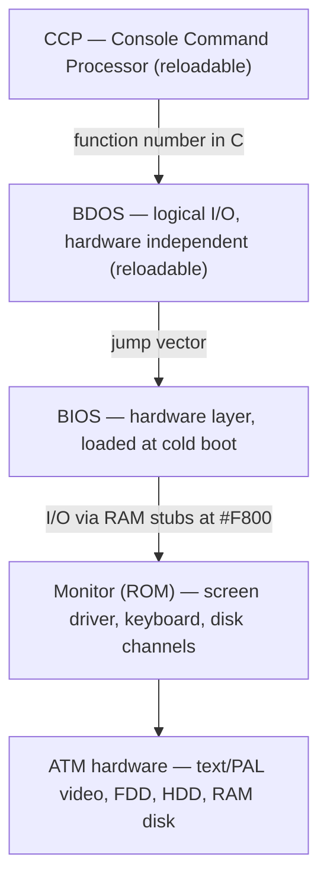

[← Home](../README.md) · [Operating Systems](README.md)

# ATM Turbo CP/M — BIOS, BDOS, Monitor, and Disk Channels

The ATM Turbo CP/M system is MicroART's custom implementation of the CP/M 2.2 I/O layer (BDOS + BIOS) plus a ROM-resident monitor, built for the ATM Turbo 1/2/2+ hardware. This article is the complete English reference for its API surface: the BDOS function set called through `#0005`, the BIOS jump vector with three ATM-specific extensions, the disk parameter tables (DPH/DPB), the ROM monitor interface at `#F800`, the screen driver's control sequences, and the channel-based disk monitor. For general CP/M background see [cpm.md](cpm.md); for the hardware see [atm_turbo.md](../02_hardware/clones/atm_turbo.md).

> [!NOTE]
> **Source and attribution.** This article is a faithful English translation and adaptation of the original MicroART document *"BIOS и BDOS"* (Moscow, 1993), as published in Russian (Windows-1251 encoding) on the ATM Turbo information site: **http://atmturbo.nedopc.com/inf/bios_cpm.htm** (NedoPC community hosting). MicroART's companion documents referenced by the original are: [1] *"Описание, схема ПК ATM-turbo 2"* (ATM Turbo 2 description and schematic, 1993), [2] *"ОС CP/M"* (The CP/M Operating System, 1993), [4] *"Описание программатора UniProg"* (UniProg EPROM programmer description). Cyrillic abbreviations from the original are translated throughout: БУФ → FCB, СБО → system DMA buffer, БНУ → IOBYTE. Where the original document is internally inconsistent, the discrepancy is flagged rather than silently resolved.

**Track applicability:** Soviet track only (ATM Turbo 1, ATM Turbo 2, ATM Turbo 2+). The APIs described here do not exist on Sinclair/Amstrad machines or on Pentagon/Scorpion clones. The +3's own CP/M port is covered in [plus3dos.md](plus3dos.md).

---

## Roadmap

1. **Architecture** — BDOS, BIOS, and monitor layering; memory map after boot
2. **BDOS calling convention** — entry point, registers, return values, unimplemented numbers
3. **BDOS function reference** — all 37 implemented functions, grouped
4. **Disk and file structure** — extents, directory, file references, the FCB
5. **BDOS error messages** — the four fatal messages
6. **BIOS interface** — jump vectors, v1.01 extensions, DPH/DPB tables
7. **BIOS error reporting** — `BIOS ERROR` format, R/I/A/F responses, error codes
8. **The monitor** — ROM entry table at `#F800`
9. **Screen driver** — control characters and the full ESC sequence set
10. **Disk monitor** — channels, request blocks, channel descriptors, driver types
11. **MUX** — the functional monitor entry (version, keyboard, clock)
12. **Practical examples** — assembling code against BDOS, BIOS, and the monitor
13. **Pitfalls and quirks** — ATM deviations from standard CP/M behavior
14. **When to use / when not to use**
15. **Impact on emulation and FPGA**
16. **FAQ**
17. **References and attribution**

---

## §1. Architecture — Three Layers over ATM Hardware

The ATM Turbo's CP/M control system follows the classic CP/M split — a hardware-independent BDOS over a hardware-specific BIOS — but adds a third, ATM-specific layer: a **monitor** in ROM that owns the screen, keyboard, and all disk devices. The BIOS does not drive hardware itself; it forwards physical I/O to the monitor through a RAM-resident jump table at `#F800` (§8). This is why the same BIOS could later grow a hard-disk driver without touching CP/M: the driver lives in the monitor's channel layer (§10).



### 1.1 Memory map after CP/M loads

DOS loads during CP/M's initial (cold) boot [2]. Afterwards, memory is organized as follows (addresses in the left column are hex; `addr1..addr3` are computed at load time):

```
#0000 ┌──────────────────────────────────────┐
        │ System parameter area (page zero)    │ JP WBOOT at #0000
        │                                      │ JP BDOS  at #0005
#0100 ├──────────────────────────────────────┤
        │ TPA — transient program area         │ .COM programs load and run here
  addr1 ├──────────────────────────────────────┤
        │ CCP — console command processor      │
  addr2 ├──────────────────────────────────────┤
        │ BDOS — logical I/O system            │
  addr3 ├──────────────────────────────────────┤
        │ BIOS — physical I/O system           │
        ├──────────────────────────────────────┤
        │ ...free / driver tables...           │
#F800 ├──────────────────────────────────────┤
        │ Monitor interface (RAM jump table)   │ entries into the ROM monitor (§8)
        └──────────────────────────────────────┘
```

The load-time addresses are linked through page zero:

- `addr3 + 3` (WBOOT entry) is stored in the word at `#0001` — the operand bytes of the `JP` instruction at `#0000`.
- `addr2` (BDOS base) is stored in the word at `#0006` — the operand of the `JP` at `#0005`.
- `addr1 = addr2 − #0806` — the CCP sits a fixed distance below the BDOS.

### 1.2 Loading and reload behavior

- **BDOS and CCP** are reloaded into RAM from the system disk on every **warm start** ("горячий старт" — function `#00`, equivalent to `JP #0000`).
- **BIOS** is loaded during the **cold boot** procedure ("начальная загрузка") and stays resident; its WBOOT re-patches page zero (`JP bios+3` at `#0000`, `JP BDOS` at `#0005`) and passes control to the CCP with the previously active disk in C.
- The **monitor** is mask-programmed in ROM; only its 52-byte interface (jump table at `#F800`) lives in RAM.

### 1.3 Logical devices

The BDOS names four logical devices; application code addresses these, never the hardware:

| Device | Full name | Direction | Physical default |
|---|---|---|---|
| `CON` | Console | in/out | ATM keyboard and screen driver (§9) |
| `RDR` | Reader | input | paper-tape reader |
| `PUN` | Punch | output | paper-tape punch |
| `LST` | List | output | printer |

On the ATM, `RDR` and `PUN` map to monitor entries `RIN`/`POUT`, which are **not implemented** in this BIOS version (§8) — the names exist for CP/M software compatibility.

### 1.4 The BDOS area as scratch space

Programs that perform no peripheral I/O ("pure processor" tasks) may use the BDOS's memory area as workspace. Such a program must end with a **warm start** (jump to `#0000`), which reloads CCP and BDOS from disk and returns to the command level. This is the documented way to reclaim the ~5.5 KB occupied by BDOS+CCP on a machine with no better use for it — the RAM below TPA top is the scarce resource on a 64 KB CP/M system.

### 1.5 Historical context

MicroART (Moscow, "Association for Technics and Microelectronics") shipped this BIOS family with the ATM Turbo 1 (BIOS 1.03) and extended it for the Turbo 2/2+ (BIOS 1.07.12, adding the HDD driver — §10.4). Version 1.01 of the BIOS added three non-standard jump-vector entries (§6.2) for channel assignment and a multiplexed entry — features standard CP/M 2.2 BIOSes never had, anticipating the error-handler registration and driver layering of later systems such as MS-DOS terminate-and-stay-resident hooks and MP/M's XIOS. The original 1993 documentation [3] predates the Turbo 2+'s IDE support; the driver-type notes below reflect the site's later annotations.

---

## §2. BDOS Calling Convention

User programs reach the DOS through a single entry point: an unconditional jump at address `#0005` (patched by WBOOT). Before the call, the program must set up:

- **Function number** in register **C**.
- **Parameters** in register pair **DE** (when passing an address) or in register **E** (when passing a single byte).

On return:

- A one-byte result comes back in **A**.
- A two-byte result comes back in **HL**.
- Additionally, on exit from DOS the contents of **A and L match, as do B and H** — a documented aliasing some size-optimized programs rely on.

If the function involves disk I/O, records transfer through the **system DMA buffer** ("системный буфер обмена"), defaulting to `#0080`; its address is moved with function 26 (`#1A`). All directory operations work in a reserved scratch area and do **not** disturb the DMA buffer — with the exception of Search First / Search Next, which deliberately return directory data through it.

### 2.1 Implemented function numbers

| Code | Dec | Name | Group |
|---|---|---|---|
| `#00` | 0 | Warm start (reload CCP+BDOS) | system |
| `#01` | 1 | Console input | console |
| `#02` | 2 | Console output | console |
| `#03` | 3 | Reader (RDR) input | console |
| `#04` | 4 | Punch (PUN) output | console |
| `#05` | 5 | List (LST) output | console |
| `#06` | 6 | Direct console I/O (no echo) | console |
| `#07` | 7 | Get IOBYTE | console |
| `#08` | 8 | Set IOBYTE | console |
| `#09` | 9 | Print `$`-terminated string | console |
| `#0A` | 10 | Buffered console line input | console |
| `#0B` | 11 | Console status | console |
| `#0D` | 13 | Reset disk system | disk |
| `#0E` | 14 | Select disk | disk |
| `#0F` | 15 | Open file | file |
| `#10` | 16 | Close file | file |
| `#11` | 17 | Search first | file |
| `#12` | 18 | Search next | file |
| `#13` | 19 | Delete file | file |
| `#14` | 20 | Read sequential | file |
| `#15` | 21 | Write sequential | file |
| `#16` | 22 | Make (create) file | file |
| `#17` | 23 | Rename file | file |
| `#18` | 24 | Get login vector | system |
| `#19` | 25 | Get current disk | system |
| `#1A` | 26 | Set DMA address | system |
| `#1B` | 27 | Get allocation vector address | system |
| `#1C` | 28 | Write-protect disk | system |
| `#1D` | 29 | Get R/O vector | system |
| `#1E` | 30 | Set file attributes | file |
| `#20` | 32 | Get/set user number | system |
| `#21` | 33 | Read random | random |
| `#22` | 34 | Write random | random |
| `#23` | 35 | Compute file size | random |
| `#24` | 36 | Set random record | random |
| `#25` | 37 | Reset drive write protection | system |
| `#28` | 40 | Write random with zero fill | random |

### 2.2 Unimplemented numbers

The original document states that functions `#0C` (12), `#18` (24), `#1B` (27), `#1F` (31), `#26` (38), `#27` (39), and everything above `#28` (40) are **not used**: calling them returns to the caller immediately with **register state undefined**.

> [!WARNING]
> The source is internally inconsistent here: `#18` (24, login vector) and `#1B` (27, allocation vector) are listed as unimplemented in §3 of the original, yet both carry full specifications in §4.24 and §4.27. This article treats them as **implemented** (as documented) and flags the §3 list as erroneous. Definitely absent are `#0C` (12, version number), `#1F` (31, DPB address), `#26` (38), `#27` (39), and all functions above 40.
>
> The missing **function 12** matters in practice: many commercial CP/M programs verify the system version through it before running, and fail on the ATM with garbage in A. This is the single most common portability break between stock CP/M software and the ATM implementation.

The numbering follows standard Digital Research CP/M 2.2 decimal function codes exactly — the ATM is function-number compatible with standard CP/M 2.2 software for the implemented subset.

---

## §3. BDOS Function Reference

Only the logical (BDOS) level is available to user programs; the BIOS and monitor layers below are reachable directly but are considered system internals (§6, §8).

### 3.1 Console functions

#### Function `#00` (0) — Warm start

**Entry:** C = `00h`.

Reloads CCP and BDOS into RAM and transfers control to the CCP level; the CCP then selects drive A. The action is fully equivalent to an unconditional jump to `#0000`.

#### Function `#01` (1) — Console input

**Entry:** C = `01h`. **Exit:** A = character code.

Reads a character from the console into A. Printable characters plus CR, LF, and BSP are echoed to the screen. `^I` (TAB) moves the cursor to the next tab stop, 8 positions right. The BDOS also checks `^P` (toggle parallel printer echo) and `^S` (pause/resume console output). Control does not return until a character has been typed.

#### Function `#02` (2) — Console output

**Entry:** C = `02h`, E = character code.

Writes the character in E to the console. The `^I`, `^S`, and `^P` processing is the same as for console input.

#### Function `#03` (3) — Reader input

**Entry:** C = `03h`. **Exit:** A = character code.

Reads a character from logical device RDR into A; returns only after a character arrives. On the ATM the underlying monitor entry `RIN` is not implemented (§8).

#### Function `#04` (4) — Punch output

**Entry:** C = `04h`, E = character code.

Writes the character in E to logical device PUN. Monitor entry `POUT` is not implemented on the ATM (§8).

#### Function `#05` (5) — List output

**Entry:** C = `05h`, E = character code.

Writes the character in E to the list device (printer). The physical device is the monitor's `LOUT` (§8).

#### Function `#06` (6) — Direct console I/O

**Entry:** C = `06h`, E = `#FF`/`#FE` for input modes, or the character to write. **Exit:** A = character or console status.

The raw, unechoed console path:

- If E = `#FF` (input without echo / status poll): A returns `00` if the console has no character ready, or the character itself if one is waiting.
- If E = `#FE` (status only): A returns `0` when not ready, non-zero when ready.
- If E holds anything other than `#FE` or `#FF`, the value is taken as a character to output.

No editing of control characters is performed — unlike function `#0A`, which interprets them. Programs that need to poll the keyboard in the background (editors, terminal software) use this function.

#### Function `#07` (7) — Get IOBYTE

**Entry:** C = `07h`. **Exit:** A = IOBYTE value.

Returns the current device-assignment byte ("байт назначения устройств", the CP/M IOBYTE described in [1]).

#### Function `#08` (8) — Set IOBYTE

**Entry:** C = `08h`, E = new IOBYTE value.

Replaces the system IOBYTE. (Note that the ATM BIOS itself ignores the IOBYTE — §6.3; it is meaningful only to software that reads it.)

#### Function `#09` (9) — Print string

**Entry:** C = `09h`, DE = string address.

Prints the string at DE to the console. The string must be terminated by `$` (the `$` itself is not printed). `^S`, `^P`, and `^I` processing applies during output.

#### Function `#0A` (10) — Buffered console input

**Entry:** C = `0Ah`, DE = buffer address. **Exit:** characters in the console buffer.

Reads a line from the console into the buffer at DE, which must be preformatted:

```z80
; DE → input buffer layout (set up before the call)
; +0   MX   maximum number of characters accepted (#01..#FF)
; +1   NC   number of characters read (filled by function 10)
; +2.. C1,C2,C3,... the characters themselves
;      remaining bytes are the uninitialized buffer tail
buf:    DB 32                 ; MX - room for 32 characters
        DB 0                  ; NC - filled in by BDOS
        DS 32                 ; character area
```

The function returns on CR or LF, or when MX characters have been entered. While reading, the following control characters edit the line:

| Key | Action |
|---|---|
| `^C` | warm start (only if typed as the first character of the line) |
| `^E` | physical newline — the next character starts a new screen line (CR/LF) |
| `^J` | terminates input (acts as CR) |
| `^M` | terminates input (acts as LF) |
| `^P` | toggle parallel printer echo |
| `^R` | reprint the current edited buffer contents |
| `^U` | erase the console buffer and newline (erased characters stay visible on screen) |
| `DEL` | delete one character from the buffer and echo it back |
| `^X` | erase the buffer **and** the entered line on screen; cursor returns to the start of the input prompt |

#### Function `#0B` (11) — Console status

**Entry:** C = `0Bh`. **Exit:** A = console status.

Returns `01h` in A if a console character is waiting, `00h` otherwise. This is the standard idle-loop poll used by programs that do background work between keystrokes.

### 3.2 Disk system functions

#### Function `#0D` (13) — Reset disk system

**Entry:** C = `0Dh`. **Exit:** A = `#FF` if `$$$.SUB` exists on the system drive, `#00` otherwise.

Resets the directory checksum vectors for all drives. The return value reports whether a submit file (`$$$.SUB`) is present on the system disk — used by the SUBMIT batch mechanism.

#### Function `#0E` (14) — Select disk

**Entry:** C = `0Eh`, E = drive number.

Activates the drive given in E: `E = 00h` selects drive A, `E = 01h` selects drive B. The drive remains selected until the next cold or warm start. Subsequent file operations act on the selected drive whenever the drive field in the FCB is zero; FCB drive codes `#01` and `#02` explicitly reference drives A and B respectively.

If the medium in the selected drive is changed while active, the drive is automatically placed in **R/O** (read-only) mode until the next reset — the standard CP/M disk-change guard.

### 3.3 Sequential file functions

Functions `#0F`–`#17` operate on files named through an FCB ("блок управления файлом", §4.4) whose address is passed in DE. They are described in the source's §§4.13–4.35 together with the random-access group.

#### Function `#0F` (15) — Open file

**Entry:** C = `0Fh`, DE = FCB address. **Exit:** A = directory index.

Copies placement information for the named file into the FCB. Before the call the program must fill FCB bytes 0–12: drive number, file name, file type, and the extent number to open (normally the zeroth extent). The BDOS scans the drive directory for an entry matching FCB positions 1–12.

- On a match, the extent's placement data is copied from the directory entry into the corresponding FCB bytes, and A returns the found entry's index.
- On no match, A returns `#FF`.

For sequential access the current-record field (FCB byte 32) must contain 0. After a successful open, all other file operations are valid against this FCB.

#### Function `#10` (16) — Close file

**Entry:** C = `10h`, DE = FCB address. **Exit:** A = directory index.

Writes the current FCB information back into the file's directory entry. A returns the directory-entry index on success or `#FF` on failure.

If a file was only read, closing is optional. If it was written, **closing is mandatory** — otherwise the directory never receives the complete placement information and the written data may be unreachable. This is the classic CP/M data-loss trap.

#### Function `#11` (17) — Search first

**Entry:** C = `11h`, DE = FCB address. **Exit:** A = directory index (0–3).

Searches the directory of the given drive for the first entry matching the FCB. On a match, A returns the entry's index and the 128-byte directory record containing it is placed in the DMA buffer — so the found entry starts at offset `A*32` within the buffer. If nothing matches, A returns `#FF`.

The `?` character (code `#3F`) acts as a wildcard in the name, type, and extent fields. If the FCB's drive field itself contains `?`, the first directory entry of the selected drive — allocated or free — is returned; this is the idiom for scanning the whole directory state (paired with function 18). Note that Search First/Search Next are the only directory operations that use the DMA buffer.

#### Function `#12` (18) — Search next

**Entry:** C = `12h`, DE = FCB address. **Exit:** A = directory index.

Continues the scan from the last entry that matched function `#11`. When the two functions are used together, function 18 need not reload DE — the FCB address set by function 17 is retained internally.

The canonical directory enumeration loop:

```text
SEARCH FIRST   → first entry found
SEARCH NEXT    → second entry found
SEARCH NEXT    → third entry found
...            → and so on
SEARCH NEXT    → A = #FF, no entry found
END OF SEARCH
```

#### Function `#13` (19) — Delete file

**Entry:** C = `13h`, DE = FCB address. **Exit:** A = directory index.

Erases every directory entry matching the name given in the FCB (wildcards allowed in name/type — but **not** in the drive field). A returns the index of an erased entry, or `#FF` if nothing matched.

#### Function `#14` (20) — Read sequential

**Entry:** C = `14h`, DE = FCB address. **Exit:** A = `00` on success, non-zero on error.

Reads the 128-byte record at the FCB's current record number into the DMA buffer. The file must have been opened first (function `#0F`). After the read, the current record number is automatically incremented — the next call reads the next record.

When the record field overflows the current extent, the next read automatically opens the next extent and resets the record field — extent chaining is transparent to sequential readers.

#### Function `#15` (21) — Write sequential

**Entry:** C = `15h`, DE = FCB address. **Exit:** A = `00` on success, non-zero on error.

Writes 128 bytes from the DMA buffer to the file's current record position. The file must have been opened (`#0F`) or created (`#16`) first. As with reading, the record counter auto-increments and extents chain automatically.

Writing to a position that was previously occupied simply replaces the record — the new data goes into the same allocation blocks. A returns `00` on success, non-zero otherwise.

#### Function `#16` (22) — Make (create) file

**Entry:** C = `16h`, DE = FCB address. **Exit:** A = directory index, or `#FF`.

Creates a new directory entry from the FCB: zeroes FCB bytes 13–31 and writes the descriptor to the directory. As with Open, the program must first fill bytes 0–12 (drive, name, type; extent normally 0). Duplicate file names on one drive are not allowed.

A returns the new entry's directory index, or `#FF` when the directory is full. Like Open, a successful Make leaves the FCB ready for all subsequent operations.

#### Function `#17` (23) — Rename file

**Entry:** C = `17h`, DE = FCB address. **Exit:** A = directory index, or `#FF`.

Renames a file: the old name occupies FCB bytes 0–12, the new name occupies bytes 16–28. The drive code is given only in byte 0; byte 16 must always be 0. A returns the entry index on success, `#FF` on failure.

### 3.4 System information and utility functions

#### Function `#18` (24) — Get login vector

**Entry:** C = `18h`. **Exit:** HL = active drive vector.

Returns a 16-bit vector in HL: bit 0 of L corresponds to drive A, bit 1 to drive B, and so on. A set bit marks a drive logged in — either by Select Disk (`#0E`) or by any file operation that named the drive explicitly in an FCB.

#### Function `#19` (25) — Get current disk

**Entry:** C = `19h`. **Exit:** A = current drive number.

Returns the number of the active drive: `#00` = A, `#01` = B.

#### Function `#1A` (26) — Set DMA address

**Entry:** C = `1Ah`, DE = buffer address.

The DMA buffer is the 128 bytes of RAM through which all file records transfer. Cold and warm start reset it to `#0080`. This function moves it to the address in DE; the new address persists until changed again or until the next warm/cold start.

#### Function `#1B` (27) — Get allocation vector address

**Entry:** C = `1Bh`. **Exit:** HL = allocation vector address.

The allocation (block placement) vector is maintained in main memory for every logged-in drive; system utilities use it to compute free space. The function returns the vector's base address for the **currently selected** drive.

#### Function `#1C` (28) — Write-protect disk

**Entry:** C = `1Ch`.

Marks the currently selected disk temporarily write-protected. Until the next warm/cold start, any write attempt produces:

```text
DOS ERR ON D: R/O
```

(D is the drive letter.)

#### Function `#1D` (29) — Get R/O vector

**Entry:** C = `1Dh`. **Exit:** HL = R/O vector.

Returns a bit vector in HL flagging drives currently in R/O state; least-significant bit = drive A, next bit = drive B.

#### Function `#1E` (30) — Set file attributes

**Entry:** C = `1Eh`, DE = FCB address. **Exit:** A = directory index.

Sets the file's access indicator from the FCB: if bit 7 of byte 9 (the T1 field) is 1 the file becomes R/O; if 0 it becomes R/W. This is the programmatic equivalent of the `STAT` command's R/O and R/W settings.

#### Function `#20` (32) — Get/set user number

**Entry:** C = `20h`, E = `#FF` (query) or user number. **Exit (query):** A = current user number.

With E = `#FF` the current user number returns in A; any other value in E becomes the new current user number.

#### Function `#25` (37) — Reset drive write protection

**Entry:** C = `25h`, DE = reset vector (same encoding as the login vector, function `#18`).

Clears the write-protection state of every drive whose bit is set in the DE vector; drives with a 0 bit keep their current protection state. This is the recovery path for a `#1C` write-protect.

### 3.5 Random-access functions

The random group reads and writes records by explicit number through FCB bytes 33–35 (§4.4) instead of the auto-incrementing sequential counter.

#### Function `#21` (33) — Read random

**Entry:** C = `21h`, DE = FCB address. **Exit:** A = error code, `00` = success.

Like sequential read, but the record comes from the random-record field (FCB bytes 33–34). Pre-requirements: open the file first, load the record number into bytes 33–34, and pre-clear byte 35 — a non-zero byte 35 means the disk's address range has overflowed.

Unlike sequential read, the random-record field is **not** incremented by the call — repeating the call re-reads the same record. On success the record is in the DMA buffer.

Error codes returned in A:

| Code | Meaning |
|---|---|
| `01h` | reading a record that was never written |
| `02h` | not used in random read |
| `03h` | error closing the current extent (transient; retry or re-open) |
| `04h` | attempt to open a non-existent extent |
| `05h` | not used in random read |
| `06h` | physical end of disk (FCB byte 35 non-zero) |

Codes `01h` and `04h` occur when the read reaches a data block or extent that was never allocated. Code `03h` should not appear in normal operation. Code `06h` appears when byte 35 of the FCB is non-zero.

#### Function `#22` (34) — Write random

**Entry:** C = `22h`, DE = FCB address. **Exit:** A = error code, `00` = success.

Writes the DMA buffer to the record number in FCB bytes 33–34. If the target extent or data block has not been allocated yet, disk space is allocated automatically. As with random read, the record number is left unchanged. The current extent number and the current record-in-extent are computed from the given random number and stored back into the FCB.

Error codes match random read, except `05h` here means: **a new extent cannot be created because the directory is full**.

#### Function `#23` (35) — Compute file size

**Entry:** C = `23h`, DE = FCB address. **Exit:** random-record field (FCB bytes 33–35) set.

Computes the size of the named file and returns it in FCB bytes 33–35. The value is actually the **one-past-the-last record number** of the file — the position just after the final record.

To append records to an existing file: get this number, perform one random write with it, then continue writing with incremented record numbers. For a sequentially written file the returned size equals the record count; for a file created by random access with "holes", the true number of stored records is smaller than the reported size.

#### Function `#24` (36) — Set random record

**Entry:** C = `24h`, DE = FCB address. **Exit:** random-record field (FCB bytes 33–34) set.

Converts the FCB's current extent number and current record-in-extent into the equivalent random-record number. This is the bridge used when switching a file from sequential to random access: read sequentially to the desired point, call `#24`, then continue with random reads/writes from that position.

#### Function `#28` (40) — Write random with zero fill

**Entry:** C = `28h`, DE = FCB address. **Exit:** A = error code.

Identical to random write, except that any **newly allocated block is zero-filled** before the data is written — sparing the reader from stale disk contents in the unwritten tail of the last block.

---

## §4. Disk and File Structure

### 4.1 Logical disk layout

A "disk" in CP/M is a logical device: a direct-access storage medium that can be read and written. It is divided into three areas:

```text
┌───────────────────────────────┐
│ Reserved area                 │ holds CCP + BDOS (the bootable system)
├───────────────────────────────┤
│ Directory area                │ a whole number of allocation blocks
├───────────────────────────────┤
│ File area                     │ allocation blocks of constant size
└───────────────────────────────┘
```

The directory and file areas are organized in **allocation blocks of constant size**; each block contains a multiple of 8 records. The BDOS exchanges data with the disk in **128-byte records**, numbered from zero; every file is a sequence of records.

The first few blocks are reserved for the **directory**. The directory consists of 32-byte **descriptors** (entries) holding file names and placement data. Each descriptor defines one **extent** — an area of the disk devoted to a file or a portion of a file — and contains the name, type, extent number, record count, and the list of allocation blocks assigned to that extent. The descriptor format is identical to FCB bytes 0–31 (§4.4). An empty descriptor contains code `#E5` in byte 0.

Four descriptors pack into one 128-byte directory record. A descriptor's position within its record (0–3) is its **index** — the value returned in A by the search/open/make functions.

Files may span multiple extents and therefore own multiple descriptors; each extent is reachable through its descriptor in both sequential and direct (random) mode. A file may contain any number of records, from zero up to the full capacity of the disk.

### 4.2 File references

CP/M works with named files. A full name is *drive name* + *file name* + *file type*:

- **Drive name** — `A` or `B` on the base configuration documented by the source.
- **File name** — 1 to 8 characters, none of them a space.
- **File type** — 1 to 3 characters. The types reserved by the system:

| Type | Contents |
|---|---|
| `MAC` | macro-assembler source text |
| `BAS` | BASIC source text |
| `FOR` | FORTRAN source text |
| `COB` | COBOL source text |
| `PLM` | PL/M source text |
| `PRN` | compiler/assembler listing |
| `HEX` | hexadecimal machine code in character form |
| `COM` | absolute machine code program (invoked from CCP without its type) |
| `REL` | relocatable machine code |
| `BAK` | editor backup source |
| `SUB` | CCP command (batch) file |
| `LIB` | editor auxiliary source |
| `$$$` | editor intermediate source |

For group operations, programs use an **ambiguous file reference** (wildcard pattern): the drive number, pseudo-name, and pseudo-type placed in an FCB act as a template against which directory entries are matched. An entry matches when every character of its name and type equals the template — except at template positions holding `?` (code `#3F`), which match anything.

### 4.3 Record numbering summary

- Record = 128 bytes; numbering starts at 0.
- Sequential access: FCB byte 32 (`CR`) auto-increments; extents chain automatically.
- Random access: FCB bytes 33–35 hold the absolute record number; never auto-incremented.
- Allocation blocks are addressed by number in descriptor bytes 16–31; byte-sized when the drive's `DSM < 256`, word-sized when `DSM > 256` (see §6.3).

### 4.4 The FCB (File Control Block)

The FCB ("блок управления файлом") is a RAM structure created by the program (or its compiler) to describe a file to the BDOS. Every file being accessed needs one. It is **33 bytes** for sequential access and **36 bytes** for random access; the first 32 bytes share the directory-descriptor format:

```text
┌────┬────┬────┬────┬────┬────┬────┬────┬────┬────┬────┬────┬────┐
│ DR │ F1 │ F2 │ .. │ F8 │ T1 │ T2 │ T3 │ EX │ S1 │ S2 │ RC │ D0 │  bytes 0..15
├────┼────┼────┼────┼────┼────┼────┼────┼────┼────┼────┼────┼────┤
│ .. │ Dn │ CR │ R0 │ R1 │ R2 │                                      │ bytes 16..35
└────┴────┴────┴────┴────┴────┴────┴────┴────┴────┴────┴────┴────┘
```

| Byte(s) | Field | Meaning |
|---|---|---|
| 0 | `DR` | Drive: 0 = currently selected drive, 1 = drive A, 2 = drive B (values 0–2) |
| 1–8 | `F1..F8` | File name, 1–8 uppercase Latin letters/digits with zero high bits; short names padded right with spaces |
| 9–11 | `T1..T3` | File type, 1–3 uppercase letters/digits, space-padded. **Bit 7 of T1 = R/O flag** (1 → read-only). High bits of T2/T3 reserved by the system |
| 12 | `EX` | Current extent number; usually set to 0 by the program |
| 13 | `S1` | Reserved for internal use |
| 14 | `S2` | Reserved for internal use |
| 15 | `RC` | Record count in the current extent, 0–128 |
| 16–31 | `D0..Dn` | Allocation block numbers of the extent; filled by the system |
| 32 | `CR` | Current record number within the extent; usually 0 for sequential work |
| 33–34 | `R0,R1` | Random record number, 16-bit little-endian: **R0 = low byte, R1 = high byte** |
| 35 | `R2` | Random record overflow byte (non-zero = address overflow) |

Usage protocol, as documented:

1. The programmer fills bytes 0–12 (drive, name, type, extent to open/create).
2. Open File (`#0F`) or Make File (`#16`) fills in the rest of the placement fields.
3. During subsequent I/O the BDOS itself updates the FCB, automatically opening/creating and closing the file's current extents.
4. When finished, Close File (`#10`) writes the current FCB state back to the directory.

> [!WARNING]
> The Z80 is little-endian, and the random-record field is no exception: `R0` is the **low** byte of the record number. Code ported from big-endian conventions (68000, Amiga) that stores the high byte first will silently read record `N*256` instead of `N`.

---

## §5. BDOS Error Messages

During operation the DOS can print these messages (D = drive letter):

| Message | Condition |
|---|---|
| `DOS ERR ON D: BAD SECTOR` | read/write error on the disk |
| `DOS ERR ON D: SELECT` | non-existent device number |
| `DOS ERR ON D: R/O` | write attempt on an R/O disk |
| `DOS ERR ON D: FILE R/O` | write attempt on an R/O file |

All four are terminal at the BDOS level: CP/M restarts after the operator's response. The richer, interactive BIOS-level error path is described in §7.

---

## §6. BIOS Interface

### 6.1 Standard jump vector

The BDOS and CCP call the BIOS through the jump table at the very start of the BIOS (`bios` = BIOS base address, obtained from the word at `#0001` minus 3):

| Offset | Name | Purpose |
|---|---|---|
| `bios+00h` | `BOOT` | Cold start. Sets the IOBYTE and current drive, then calls WBOOT |
| `bios+03h` | `WBOOT` | Warm start. Reloads BDOS and CCP; places `JP bios+3` at `#0000` and `JP BDOS` at `#0005`; puts the active drive number in C (normally a copy of the byte at address 4) and transfers control to the CCP |
| `bios+06h` | `CONST` | Console status: A = `#FF` if a character is ready, `0` otherwise |
| `bios+09h` | `CONIN` | Read console character into A; returns only after a key is pressed |
| `bios+0Ch` | `CONOUT` | Write console character from C |
| `bios+0Fh` | `LIST` | Write printer character from C |
| `bios+12h` | `PUNCH` | Write punch character from C |
| `bios+15h` | `READER` | Read reader character into A |
| `bios+18h` | `HOME` | Position the currently selected drive to track 0 |
| `bios+1Bh` | `SELDSK` | Select drive (C = 0 → A, 1 → B, ...); bit 0 of E is set if this drive was already selected since the last disk reset. Returns HL = DPH address (§6.3) or 0 if the drive does not exist |
| `bios+1Eh` | `SETTRK` | Set track (BC = track number, 0-based) for subsequent reads/writes |
| `bios+21h` | `SETSEC` | Set sector (BC = sector number, 1-based) for subsequent reads/writes |
| `bios+24h` | `SETDMA` | Set disk transfer address (BC = buffer address) |
| `bios+27h` | `READ` | Read the sector chosen by SELDSK/SETTRK/SETSEC into the SETDMA address. A = `0` on success, `1` on error. **The BIOS must perform its own retries before reporting an error — the BDOS treats error 1 as immediate `BAD SECTOR`** |
| `bios+2Ah` | `WRITE` | Write a sector; addressing and errors as READ. C carries the sector-type flag: 0 = normal data sector, 1 = directory sector, 2 = first sector of a new data block (its previous content is irrelevant) |
| `bios+2Dh` | `LISTST` | Printer status: A = `#FF` when the printer can accept the next character, 0 otherwise |
| `bios+30h` | `SECTRAN` | Translate logical sector to physical: BC = logical sector (0-based), DE = translate table address; returns HL = physical sector (1-based) |

### 6.2 ATM extensions (BIOS 1.01+)

Three additional vector entries distinguish the ATM BIOS from a stock CP/M 2.2 BIOS:

| Offset | Name | Purpose |
|---|---|
| `bios+33h` | `ASSIGN` | Assign a channel and disk. Entry: B = disk number, C = channel number, DE = pointer to channel descriptor (§10.3). Exit: A = status. **Warning:** this call rebuilds the disk system — afterwards the program must warm-start CP/M or call BDOS function 13 (disk reset) |
| `bios+36h` | `GETCH` | Query a disk's channel assignment. Entry: C = disk number, DE = buffer for the channel descriptor. Exit: A = status, C = channel number attached to the given disk |
| `bios+39h` | `BMUXBIOS` | Multiplexed BIOS entry. Entry: C = function number; function numbers above 127 are redirected to monitor functions 0–127 (§11). Exit: A = status. Function 0: get/set the **critical error handler** — entry HL = address of the new handler, exit HL = address of the previous handler. When the BIOS invokes the handler: A = error code, BC = pointer to the request block; the handler returns A = reaction code: 0 `ABORT`, 1 `RETRY`, 2 `IGNORE`, 3 `FAIL` |

The critical-error hook (function 0 of `BMUXBIOS`) is how well-behaved ATM software replaces or suppresses the interactive `BIOS ERROR ... SELECT` prompt of §7 with its own policy.

### 6.3 Disk parameter tables — DPH and DPB

CP/M supports varied disk hardware through two per-drive tables: the **DPH** (Disk Parameter Header) and the **DPB** (Disk Parameter Block). The mechanism fixes the number of tracks and of 128-byte blocks per track for each device. One DPH exists per disk device; the BDOS learns its address from `SELDSK`. DPH layout (all fields are words):

```text
┌───────┬───────┬───────┬───────┬─────────┬───────┬───────┬───────┐
│  XLT  │   0   │   0   │   0   │ DirBuf  │  DPB  │  CSV  │  ALV  │
└───────┴───────┴───────┴───────┴─────────┴───────┴───────┴───────┘
  sector      reserved for CP/M        directory  disk    check-  alloca-
  translate                            buffer     params  sum     tion
  table                                                   area    vector
```

| Field | Meaning |
|---|---|
| `XLT` | Address of the logical→physical sector translate table (passed to `SECTRAN` in DE), or 0 when no translation is needed. Several DPHs may share one table |
| `0`,`0`,`0` | Reserved for CP/M |
| `DirBuf` | Address of the 128-byte scratch buffer for directory operations — may be shared by all DPHs in the system |
| `DPB` | Address of the drive's DPB (below). May be shared between DPHs |
| `CSV` | Address of the disk-change checksum area — **must be unique per DPH** |
| `ALV` | Address of the disk-fullness (allocation) tracking area — **must be unique per DPH**; size = `(DSM/8)+1` bytes |

The DPB fixes the drive geometry:

```text
┌───────┬───────┬───────┬───────┬───────┬───────┬───────┬───────┬───────┬───────┐
│  SPT  │  BSH  │  BLM  │  EXM  │  DSM  │  DRM  │  AL0  │  AL1  │  CKS  │  OFF  │
└───────┴───────┴───────┴───────┴───────┴───────┴───────┴───────┴───────┴───────┘
   word   byte   byte   byte   word   word   byte   byte   word   word
```

| Field | Meaning |
|---|---|
| `SPT` | Sectors (128 bytes each) per track |
| `BSH` | Data shift: number of bit shifts that turn a 128-byte record number into a block number |
| `BLM` | Block mask = (block_size / 128) − 1 |
| `EXM` | Extent mask: with `EXM = 0` one directory entry addresses at most 16 KB, `EXM = 1` at most 32 KB, and so on |
| `DSM` | Number of blocks on the drive − 1 (system tracks excluded). If `DSM < 256`, block numbers in directory entries are one byte; if greater, they are words |
| `DRM` | Directory entries − 1 |
| `AL0`,`AL1` | 16-bit map of directory-reserved blocks, MSB of AL0 first. Number of leading 1-bits = `(DRM + BLS/32) / (BLS/32)` |
| `CKS` | Size of the CSV area: `(DRM+1)/4` for removable media, 0 for fixed media |
| `OFF` | Number of reserved (system) tracks at the start of the disk |

The standard block-size relationships, as tabulated by the source:

| BLS (block size, bytes) | BSH | BLM | EXM when `DSM < 256` | EXM when `DSM > 256` |
|---|---|---|---|---|
| 1024 | 3 | 7 | 0 | — |
| 2048 | 4 | 15 | 1 | 0 |
| 4096 | 5 | 31 | 3 | 1 |
| 8192 | 6 | 63 | 7 | 3 |
| 16384 | 7 | 127 | 15 | 7 |

### 6.4 ATM implementation specifics

The ATM BIOS **does not honor the IOBYTE**: functions 7 and 8 preserve it for software that reads it, but the BIOS routes console/printer traffic regardless of it. For all physical I/O the BIOS calls the **monitor** (§8), whose RAM-resident interface sits directly after the BIOS in memory; the monitor body lives in ROM.

---

## §7. BIOS Error Reporting

When a disk-monitor operation fails, the BIOS prints an interactive error message:

```text
BIOS ERROR <num> AT <chan>: <com>: <track>: <block>
SELECT ((R)ETRY, (I)GNORE, (A)BORT, (F)AIL):
```

All four parameters are hexadecimal numbers:

- `<num>` — error code (table below)
- `<chan>` — disk-monitor channel number. The corresponding CP/M drive is not shown, but can be discovered, e.g., with the `ASS` utility (via the `ASSIGN`/`GETCH` calls of §6.2)
- `<com>` — disk-monitor command that failed (§10.2)
- `<track>` — track number from the failed command
- `<block>` — block number (1 block = 128 bytes, so the sector number is directly derivable)

Worked example from the source:

```text
BIOS ERROR 08 AT 00:01:60:01
```

An addressing error (`08`) on command `01` (seek): channel 0 was told to seek to track `60h` (96). The device attached to channel 0 has no track 96.

The BIOS then waits for exactly one of four responses:

| Key | Reaction |
|---|---|
| `R` | **Retry** — repeat the failed command |
| `I` | **Ignore** — pretend the command succeeded. Dangerous: the data returned by the monitor is invalid and can crash the system |
| `A` | **Abort** — CP/M warm-restarts |
| `F` | **Fail** — the BIOS returns the error to CP/M, which typically reports `BDOS ERR ON C: BAD SECTOR` and restarts |

These same four reactions (0 `ABORT`, 1 `RETRY`, 2 `IGNORE`, 3 `FAIL`) are the return codes of a custom critical-error handler installed through `BMUXBIOS` (§6.2) — the interactive prompt is simply the built-in default handler.

### 7.1 Disk-monitor error codes

| Code | Symbol | Meaning |
|---|---|---|
| `#08` | `_ADRERR` | Addressing error — no such track or sector |
| `#09` | `_CHNFND` | Channel not assigned |
| `#40` | `_HRDERR` | Hardware error |
| `#41` | `_INVALID` | Driver/hardware mismatch |
| `#50` | `_DTYPER` | Invalid driver number in channel |
| `#51` | `_DRNFND` | Driver absent |
| `#52` | `_COMERR` | Forbidden command |
| `#53` | `_IOERR` | Input/output error |
| `#54` | `_WR$PROT` | Write protection |
| `#56` | `_FATAL$ERROR` | Unhandled fatal error |
| `#59` | `_NRDY` | Hardware not ready (timeout) |
| `#81` | `_NO$DATA` | Sector not found (read error) |
| `#82` | `_NO$ADDR$MARK` | Address marker not found (read error) |
| `#83` | `_OVERRUN` | Data lost — CPU too slow |
| `#84` | `_CRC$ERR` | CRC error (read error) |

Other codes are non-standard and should not occur in normal operation.

---

## §8. The Monitor — ROM Interface at `#F800`

The monitor performs all exchanges with the screen, keyboard, and disks. Its body resides in ROM; a jump-table interface to it is placed in RAM at `#F800`. The calling convention matches the BIOS vector style (registers in, registers out, one entry per function):

| Address | Name | Purpose |
|---|---|---|
| `#F800` | `RUN` | Full reset — exit to the boot-loader menu |
| `#F803` | `CIN` | Console input into A (the BIOS `CONIN` forwards here) |
| `#F806` | `RIN` | Reader input (paper tape) — **not implemented** |
| `#F809` | `COUT` | Console output from C (the BIOS `CONOUT`) |
| `#F80C` | `POUT` | Punch output — **not implemented** |
| `#F80F` | `LOUT` | Printer output from C (the BIOS `LIST`) |
| `#F812` | `CSTS` | Console status into A (the BIOS `CONST`) |
| `#F815` | `IOCHK` | Read I/O status into A (a copy of the IOBYTE) |
| `#F818` | `IOSET` | Set I/O status from C |
| `#F81B` | `MEMCK` | Top of RAM query — **not used** |
| `#F81E` | `USRIO` | Install user I/O routines — **not implemented** |
| `#F821` | `IRUN` | Restart CP/M |
| `#F824` | `RQDIO` | Disk-monitor call — the workhorse entry (§10) |
| `#F827` | `RQRES` | Reset disk-monitor buffers |
| `#F82A` | `RQSET` | Assign a disk-monitor channel (shortcut for `_SETCH`) |
| `#F82D` | `RQCHK` | Query a disk-monitor channel assignment (shortcut for `_GETCH`) |
| `#F830` | `MUX` | Functional (multiplexed) monitor entry (§11) |

> [!NOTE]
> The `RUN` entry is the documented way for CP/M software to leave CP/M entirely and return to the ATM boot menu — the equivalent of pressing the machine's reset button, but under software control.

---

## §9. Screen Driver

The monitor's `COUT` entry feeds the screen driver. Characters print at the current cursor position, which then advances — always staying inside the current **window** (§9.2 `ESC W`). Character codes at or above space (`#20`) print literally (when not part of a control sequence); the remaining codes are handled specially:

| Code | Name | Reaction |
|---|---|---|
| `#07` | `BELL` | audible beep |
| `#08` | `BS` | cursor one position left |
| `#09` | `TAB` | cursor to the next position right that is a multiple of 8 |
| `#0A` | `LF` | line feed — cursor down one line; scrolls when leaving the window's bottom |
| `#0D` | `CR` | carriage return — cursor to the start of the line, within the window |
| `#0E` | `SI` | switch to the **Latin** character generator |
| `#0F` | `SO` | switch to the **Russian** character generator |
| `#1B` | `ESC` | the next several characters form a control sequence (§9.2) |

The `SI`/`SO` charset switching is the key to the ATM's bilingual text support and pairs with the `ESC R` remap tables below.

### 9.1 Parameter notation

The source uses two conventions, kept here:

- `<ESC>` is the escape character (`#1B`). Other items in angle brackets are parameters.
- **SpShifted**: the parameter's numeric value is transmitted as *value + 32* (the code of space). To pass decimal 10, emit `*` (`#2A` = 32 + 10).
- `{N×<params>}` denotes N-fold repetition: `{3×<y><q>}` ≡ `<y><q><y><q><y><q>`.

### 9.2 Control sequences

#### Cursor and screen

| Sequence | Action |
|---|---|
| `ESC @` c | Direct character print. The SpShifted parameter is not processed by the driver but printed raw (after subtracting 32). Example: `ESC @ (` prints the up-arrow character |
| `ESC A` | Cursor up one line |
| `ESC B` | Cursor down one line |
| `ESC C` | Cursor right one position |
| `ESC D` | Cursor left one position |
| `ESC H` | Cursor to top-left of the current window |
| `ESC I` | Reverse line feed — cursor up; scrolls the window down when leaving the top |
| `ESC J` | Clear from cursor to end of screen (within window) |
| `ESC K` | Clear from cursor to end of line (within window) |
| `ESC E` | Clear the window; cursor to its top-left corner |
| `ESC _` | Screen reset: clear, window = full screen, cursor to top-left |
| `ESC Y` y x | Position cursor; SpShifted coordinates, window origin (0,0) |
| `ESC S` | Insert a blank line under the cursor; rest of window shifts down |
| `ESC T` | Delete the cursor's line; rest of window shifts up, bottom line cleared |
| `ESC P` | Insert character: space under cursor, rest of line shifts right (within window) |
| `ESC Q` | Delete character at cursor; rest of line shifts left, trailing space fills |

#### Windows and scrolling

| Sequence | Action |
|---|---|
| `ESC W` x1 y1 x2 y2 | Set window: SpShifted x1 (left), y1 (top), x2 (right), y2 (bottom); screen origin is (0,0); cursor moves to the window's top-left |
| `ESC X` d | Scroll window one position: d = 0 up, 1 down, 2 right, 3 left |

#### Color and palette

| Sequence | Action |
|---|---|
| `ESC F` ink paper | Set print color. Parameters are hex digits, or `N` (leave that color unchanged), or `I` (set contrast to the other parameter — both `I` is invalid). Example: `ESC F 1 N` = blue ink, background unchanged |
| `ESC N` c g r b | Set palette entry c (hex) — g, r, b are digits 0–3 giving green/red/blue intensity. Example: `ESC N 0 0 0 3` makes color 0 (initially black) bright blue |
| `ESC N T` {16× grb} | Set all 16 palette entries |
| `ESC N R` | Restore the default palette |
| `ESC U` ru lat | Border color, per charset mode: hex digit applied (and maintained) while Russian (`SO`) or Latin (`SI`) mode is active |
| `ESC '` {16× c} | *Internal:* set palette |

#### Mode switching — `ESC M`

Formally `ESC M1` is documented as a screen-driver reset (clear, full window, white-on-black). In reality it **switches screen modes**, swapping the character-print driver accordingly — with machine-dependent behavior:

| Machine | Sequence | Result |
|---|---|---|
| ATM Turbo 1 | `ESC M1` (any odd digit) | 640×200 mode, text scaled 80×25 |
| ATM Turbo 1 | `ESC M0` (any even digit) | 320×200 mode, text scaled 40×25 |
| ATM Turbo 2(+) | `ESC M1` | hardware text console 80×25 — the natural CP/M screen |
| ATM Turbo 2(+) | `ESC M0` | 320×200 mode — **no print driver**, so printing yields colored dots on screen |
| ATM Turbo 2(+) | `ESC M2` | 640×200 mode — **no print driver**, colored dots as above |

Any other digit after `M` behaves like `0`. This sequence is the documented software path between the ATM's video personalities (see [atm_turbo.md](../02_hardware/clones/atm_turbo.md) for the hardware view of the four modes).

#### Character sets — `ESC R`

`ESC R` t {8× n} loads one of three **remap tables**. CP/M traffics in 7-bit ASCII, while the full character generator has 256 glyphs, so the driver translates codes on output. The 256-glyph space is split into 16 groups (`0`–`F`); the ASCII input range is likewise split into 8 intervals, and each input interval can be mapped to any generator group:

- t = `0` — the currently active table (the one in actual use)
- t = `1` — the Russian table (activated by `SO`)
- t = `2` — the Latin table (activated by `SI`)

> [!WARNING]
> When a character with code above 127 is output, remapping always uses table 1 (Russian) — in that situation the Russian table acts as the second half (intervals 8–15) of the active table.

#### Cursor and keyboard control

| Sequence | Action |
|---|---|
| `ESC Z` t | Cursor type. `0` — cursor off; `1` — cursor on; `2` — flexible (visible only while waiting for a key). **The state is a counter**: after N calls of `ESC Z0`, N calls of `ESC Z1` are needed to re-enable; flexible mode increments the same counter |
| `ESC [` s | Cursor blink rate. Parameter is an extended hexadecimal number from `0` to `V` (characters `0`–`9`, `A`–`V`); higher values blink slower |
| `ESC ]` s e | Cursor start/end scan line within the cell, digits 0–7 (0 = bottom, 7 = top). `ESC ] 0 0` = underline cursor; `ESC ] 0 7` = block cursor |
| `ESC \` [arep] [adel] | Keyboard auto-repeat rate and pre-repeat delay; parameter encoding as in `ESC [` |
| `ESC a` c | *Internal:* set cursor blink speed |
| `ESC b` c c | *Internal:* set keyboard auto-repeat/delay |

#### Driver flags — `ESC ^`

| Sequence | Action |
|---|---|
| `ESC ^ T` f | f=1: skip all attribute handling on output and scroll — faster, but monochrome |
| `ESC ^ F` f | f=1: faster scrolling, at the cost of a visible "layer-splitting" effect during the scroll |
| `ESC ^ O` f | f=1: printed characters overlay the old screen content instead of erasing the cell |
| `ESC ^ B` f | f=1/0: enable/disable breaking programs with `<EXT><SPACE>` |
| `ESC ^ R` f | f=1/0: enable/disable screen scrolling |

#### Reserved

`ESC G` is reserved for a graphic interpreter; `ESC O` for the sound-processor control; `ESC V` for a screen-driver status query.

### 9.3 Sequence abort rule

Every sequence above consists solely of printable characters (≥ space) plus `ESC`. If the driver encounters any other character mid-sequence, reception of that sequence stops immediately and the part already received is **annulled**. One exception: `ESC N T ...` — the palette portion already received is kept, though the palette is not applied on that call.

---

## §10. Disk Monitor

CP/M reaches disk devices through the monitor's disk subsystem — the **disk monitor**. Every possible disk device corresponds to a **channel**; this version allows up to **10 simultaneously open channels**. The BIOS binds CP/M drives to disk-monitor channels (via `ASSIGN`/`GETCH`, §6.2).

A disk device's parameters are defined by its **channel descriptor** (§10.3).

### 10.1 Request blocks and the `RQDIO` entry

The disk monitor is invoked through the monitor entry `RQDIO` (`#F824`):

- **Entry:** C = channel number, DE = pointer to the request block.
- **Exit:** A = status (0 = no error, otherwise the error number of §7.1).

Request block layout, as listed in the source:

```z80
; Request block for RQDIO (8 bytes)
RQCOM:   DS 1      ; command (see 10.2)
RQBLN:   DS 1      ; block count for read/write
RQTRACK: DS 2      ; track          (little-endian word)
RQBLOCK: DS 2      ; block          (little-endian word)
RQBADR:  DS 2      ; buffer address (little-endian word)
```

### 10.2 Commands

The channel commands, from the source's assembly equates:

```z80
_RESET  EQU 0      ; reset the channel
_SEEK   EQU 1      ; position heads to RQTRACK
_FORMT  EQU 2      ; format a track (RQBLN = filler byte,
                   ;                RQBADR = interleave factor)
_RECAL  EQU 3      ; recalibrate the drive
_READ   EQU 4      ; read RQBLN blocks
_WRITE  EQU 5      ; command forbidden
_WSECT  EQU 6      ; write RQBLN blocks
_SETCH  EQU 7      ; set channel descriptor (RQBADR = its address)
_GETCH  EQU 8      ; get channel descriptor (RQBADR = buffer address)
```

The last two are also reachable directly through the monitor entries `RQSET`/`RQCHK` (`#F82A`/`#F82D`), with C = channel number and DE = descriptor address (`RQSET`) or buffer address (`RQCHK`).

> [!NOTE]
> The prose list in the source's BIOS-error section assigns codes 03 = "read sector" and 04 = "recalibrate", disagreeing with the `_READ EQU 4` / `_RECAL EQU 3` equates above. The equate listing is canonical; treat the prose list as a typo in the original. (The `BIOS ERROR 08 AT 00:01:60:01` example — command `01` = seek — agrees with both.)

### 10.3 Channel descriptor

The channel descriptor carries the full geometry and low-level format parameters of one device, in this field order (word fields are little-endian):

```z80
        ORG 0                ; offsets in bytes; '+' = set by user
DVALID:  DS 1      ; validity flag - ignored by set/get descriptor
DTYP:    DS 1      ; + driver type (see 10.4)
DUS:     DS 1      ; + drive (unit) number
DDTYP:   DS 1      ; - drive code (internal)
DHEADF:  DS 1      ; + number of fixed heads
DHEADR:  DS 1      ; + number of removable heads
DCYLN:   DS 2      ; + cylinders on the disk
DSECTT:  DS 1      ; + sectors per track
DBYTES:  DS 2      ; + bytes per sector
DALTCYL: DS 1      ; + number of system tracks
DBEGCYL: DS 2      ; + starting cylinder - used to partition hard disks
DBLDR:   DS 2      ; + blocks on the disk
DBLTR:   DS 2      ; + blocks per track
DTRACK:  DS 2      ; + tracks on the disk
DSECTL:  DS 1      ; + block-number length within a sector
DDIRENT: DS 2      ; + directory entries
DIF0:    DS 1      ; + interleave factor, first track
DIF1:    DS 1      ; + interleave factor, second track
DIF2:    DS 1      ; + interleave factor, remaining tracks
DTIF:    DS 1      ; ? first-sector offset
DF8:     DS 1      ; + 8-inch disk flag, or starting head number
DFMFM:   DS 1      ; + recording density (MFM/FM)
DFN:     DS 1      ; + sector size code: 0=128, 1=256, 2=512 bytes...
DFGPL:   DS 1      ; + GAP3 for read/write
DFGPF:   DS 1      ; + GAP3 for format
DFSRHUT: DS 1      ; + head step time, or step time on SEEK
DFHLT:   DS 1      ; + head settling time, or step time on RECALIBRATE
DFMOTOR: DS 1      ; + motor-on flag
```

Notes from the source:

- `DVALID` is neither checked nor transferred by `_SETCH`/`_GETCH`.
- `DBEGCYL` implements **partitioning of winchester (hard) disks** — a channel can expose a cylinder range of a larger physical disk.
- `DIF0`, `DIF1`, `DIF2` are the interleave (sector-spread) factors for the first formatted track, the second, and all the rest.
- All quantities expressed in **blocks** are derived from the base parameters at 1 block = 128 bytes.

### 10.4 Driver types (`DTYP`)

The driver number in the channel descriptor selects the backend:

| `DTYP` | Device | Availability |
|---|---|---|
| 0 | (reserved) | — |
| 1 | ROM disk — extra software mask-programmed into a 271000/27010 EPROM | **planned, never implemented** |
| 2 | Electronic disk (RAM disk) | ATM Turbo 1, BIOS 1.03 |
| 3 | Floppy disk drive (НГМД) | ATM Turbo 1, BIOS 1.03 |
| 4 | Hard disk (HDD) | ATM Turbo 2(+), BIOS 1.07.12 |
| 5 | NET — network disk, files fetched from another machine over a LAN | **planned, never implemented** |
| 6–7 | (reserved) | — |

The BIOS on all ATM machines can address **eight drivers, numbered 0–7** (`MAXDRVN = 7`). The unimplemented ROM-disk and NET plans are documented aspirations of the BIOS authors, not shipping features.

---

## §11. MUX — Functional Monitor Entry

The monitor's multiplexed entry (`MUX` at `#F830`, also reached through `BMUXBIOS` for numbers > 127, §6.2) provides system services beyond plain I/O:

**Entry:** C = function number. **Exit:** A = status (0 = no error, otherwise error number).

| Function | Service | Details |
|---|---|---|
| 0 | Get monitor version | HL = version number |
| 1 | Load CP/M | |
| 2 | Set CP/M reload address | HL = address of the WBOOT (warm restart) procedure |
| 3 | Read keyboard | (a) character available: A = 0, C = character code, H = scan code, L = keyboard type (always 0), D = bits 7–6 = CapsShift (CS) and SymbolShift (SS) flags. (b) buffer empty: H = −1 (`#FF`), D = CS/SS flags |
| 4 | Keyboard status | (a) character available: A = 0, L = type (0), D = CS/SS flags. (b) empty: A = 1, L = type, D = flags |
| 5 | Get current time | Time in **20 ms ticks** returned in HL:DE |
| 6–9 | — | Present in BIOS 1.03+; the original documentation says "description being sought" — they were never documented |

Functions 3 and 4 require monitor version 1.01 or later; function 5 requires 1.02 or later.

Function 5 is the ATM CP/M software clock: at 20 ms per tick, the 32-bit HL:DE counter wraps after roughly 2.3 years of uptime — and, like all RAM clocks, it resets at every warm start, so it measures elapsed time, not wall-clock time.

---

## §12. Practical Examples

All examples assemble with sjasmplus (adjust `ORG` to taste; CP/M transient programs normally start at `#0100`).

### 12.1 Print a string and read a key (BDOS)

```z80
        ORG #0100
        LD   DE,hello       ; function 9 prints a '$'-terminated string
        LD   C,9
        CALL #0005
        LD   C,1            ; function 1: wait for a key (echoed)
        CALL #0005          ; returns the code in A
        LD   C,0            ; function 0: warm start back to CCP
        JP   #0005
hello:  DB   'ATM CP/M says hello. Press a key.$'
```

### 12.2 Open, read, close a file (BDOS)

```z80
        ORG #0100
        LD   DE,fcb         ; function 15: open
        LD   C,#0F
        CALL #0005
        CP   #FF
        JR   Z,nofile
loop:   LD   DE,fcb         ; function 20: read next 128-byte record
        LD   C,#14          ; (into the default DMA buffer at #0080)
        CALL #0005
        OR   A
        JR   NZ,eof
        JR   loop
eof:    LD   DE,fcb         ; function 16: close (mandatory after writes;
        LD   C,#10          ; good hygiene after reads too)
        CALL #0005
nofile: LD   C,0            ; warm start
        JP   #0005
fcb:    DB   0              ; DR: current drive
        DB   'DATA    '     ; 8-character name
        DB   'TXT'          ; 3-character type
        DB   0              ; EX: extent 0
        DS   21             ; remainder of the 33-byte FCB
```

### 12.3 A windowed, colored status line (screen driver via BDOS)

`$` cannot appear inside the string, and the strings rely on the driver's abort rule never triggering — all bytes are printable:

```z80
        ORG #0100
        LD   DE,setw        ; window: ESC W x1 y1 x2 y2 (SpShifted)
        LD   C,9
        CALL #0005          ; x1=0,y1=0,x2=79,y2=0 -> top line
        LD   DE,setc        ; color: ESC F ink paper  (1=blue on 0=black)
        LD   C,9
        CALL #0005
        LD   DE,text
        LD   C,9
        CALL #0005
        LD   C,0
        JP   #0005
setw:   DB   #1B,'W',' ',' ','o',' ','$'     ; x1=0, y1=0, x2=79 ('o'=79+32), y2=0
setc:   DB   #1B,'F','1','0','$'
text:   DB   ' STATUS: CP/M 2.2 on ATM TURBO $'
```

### 12.4 Direct disk-monitor read (monitor `RQDIO`)

Reading outside the BDOS — for a disk editor or format tool. The word at `#0001` holds `bios+3` (WBOOT), which is the documented way to locate the BIOS base:

```z80
        ORG #0100
; Locate the BIOS base once (little-endian word at #0001 = bios+3):
        LD   A,(#0002)      ; high byte
        LD   H,A
        LD   A,(#0001)      ; low byte
        LD   L,A
        DEC  HL             ; HL = bios base (useful for 12.6)
; Direct read of 2 blocks (256 bytes) from disk-monitor channel 0:
        LD   C,0            ; channel number
        LD   DE,rqblk
        CALL #F824          ; monitor entry RQDIO
        OR   A              ; A = 0 -> both blocks read
        RET  NZ             ; non-zero: error code, see 7.1
        RET                 ; 256 bytes now at 'buffer' - process them
rqblk:  DB   4              ; RQCOM  = _READ
        DB   2              ; RQBLN  = 2 blocks (256 bytes)
        DW   1              ; RQTRACK = track 1
        DW   0              ; RQBLOCK = block 0
        DW   buffer         ; RQBADR = destination
buffer: DS   256
```

### 12.5 Reading the 20 ms clock (MUX)

```z80
        LD   C,5            ; MUX function 5: time in 20 ms ticks
        CALL #F830          ; HL:DE = tick count (32-bit)
        ; ... e.g. seed a PRNG with the low word DE
```

### 12.6 Installing a critical-error handler (`BMUXBIOS`)

`BMUXBIOS` sits at `bios+39h`; since the word at `#0001` gives `bios+3`, add `#36` to reach it:

```z80
        ORG #0100
        LD   A,(#0002)
        LD   H,A
        LD   A,(#0001)
        LD   L,A            ; HL = bios+3
        LD   BC,#0036
        ADD  HL,BC          ; HL = bios+39h (BMUXBIOS)
        LD   (bmux+1),HL    ; patch the CALL operand below
        LD   HL,myhandler
        LD   C,0            ; function 0: set critical-error handler
bmux:   CALL #0000          ; -> BMUXBIOS; returns HL = previous handler
        LD   (oldhandler),HL
        RET
myhandler:                 ; entered with A = error code,
        LD   (lasterr),A    ;              BC = request block pointer
        LD   A,3            ; react with FAIL (0=ABORT,1=RETRY,2=IGNORE)
        RET
oldhandler: DW 0
lasterr:   DB 0
```

---

## §13. Pitfalls and Quirks

Each pitfall pairs the broken pattern with the working one, following the source's own warnings.

### 13.1 The Version-Check Gambler

**Bad:** trust function 12 (return version) to detect CP/M:

```z80
        LD   C,12           ; !! not implemented on ATM -
        CALL #0005          ; !! A is UNDEFINED on return
        CP   #22            ; !! comparison is garbage
        JR   C,notcpm
```

**Why it fails:** the ATM implements no function 12; the call returns immediately with undefined registers (§2.2). Generic CP/M installers and copy-checks fail here.

**Good:** detect the platform positively — e.g., query the monitor via `MUX` function 0 or probe for the `#F800` jump table — and skip the version test entirely on the ATM.

### 13.2 The Unclosed Writer

**Bad:** create, write, exit without closing:

```z80
        LD   DE,fcb
        LD   C,#16          ; make file
        CALL #0005
        LD   DE,fcb
        LD   C,#15          ; write one record
        CALL #0005
        JP   0              ; warm start - directory never updated!
```

**Why it fails:** the directory entry receives its final record count and block list only at Close (function 16). The data may be on disk but unreachable — or overwritten.

**Good:** always call function 16 after the last write (§3.3).

### 13.3 The Big-Endian Random Record

**Bad:**

```z80
        LD   HL,#0003       ; record 3... stored H first?
        LD   (fcb+33),H     ; !! R0 must be the LOW byte
        LD   (fcb+34),L
```

**Why it fails:** `R0` is the low byte, `R1` the high byte (little-endian, §4.4). The code above asks for record `#300`.

**Good:** `LD (fcb+33),L` then `LD (fcb+34),H` — or simply `LD (fcb+33),HL` (Z80 stores little-endian).

### 13.4 The Random Auto-Increment Assumption

Sequential functions advance the record counter; **random ones do not** (§3.5). A loop of bare function-33 calls re-reads the same record forever. Either increment `R0/R1` by hand between calls or switch to sequential reads.

### 13.5 The IOBYTE Believer

CP/M's device-assignment byte is readable and writable through functions 7/8, but the ATM BIOS **ignores it** when routing I/O (§6.4). Software that redirects CON: to LST: via the IOBYTE silently keeps printing to the screen. Use explicit device functions (`#02` vs `#05`) instead.

### 13.6 The Control-Char Injection

**Bad:** embed a CR inside an ESC sequence (e.g., to "pretty-print" a window setup):

```z80
seq:    DB   #1B,'W',0Dh,' ','O',' ','O',' ','$'  ; !! CR aborts
```

**Why it fails:** sequences accept only printable characters; any control character aborts and annuls the sequence (§9.3). The window is never set.

**Good:** keep all parameters SpShifted printable digits (space…`O` for values ≤ 79).

### 13.7 The Cursor-Counter Confusion

`ESC Z0` does not simply "switch the cursor off" — it **decrements a counter** (§9.2). Code that hides the cursor twice (`ESC Z0` at two nesting levels) must call `ESC Z1` twice to restore it. Symmetric hide/show discipline avoids invisible cursors.

### 13.8 The M0 Writer

On the Turbo 2(+), `ESC M0`/`ESC M2` switch to 320×200/640×200 with **no text print driver**: subsequent text output lands as colored dots (§9.2). Only `ESC M1` (80×25 text console) is safe for text on the Turbo 2+; the Turbo 1 additionally text-scales its graphics modes. Portable programs should set the mode explicitly at start rather than inherit whatever the previous program left.

### 13.9 ASSIGN-and-Forget

`ASSIGN` (§6.2) rebuilds the disk system. A program that reassigns channels and then continues issuing BDOS file calls without a warm start or BDOS function 13 operates against stale DPH/ALV state — corrupting the allocation accounting. Always follow `ASSIGN` with function 13 (or a warm start).

---

## §14. When to Use / When NOT to Use

**Use the ATM CP/M stack when:**

- Running the CP/M applications catalog (WordStar, Turbo Pascal, dBase II, Microsoft BASIC-80) on original Soviet-track hardware or its FPGA re-creations.
- Writing tools that need the ATM's unique services: ESC-sequence windows/palette, raw keyboard scan codes (MUX 3/4), or the channel-level disk access (formatters, partitioners, disk editors).
- Targeting the 7 MHz Turbo mode with an 80×25 hardware console — the fastest "serious computing" configuration in the Spectrum-compatible world of its era.

**Do not use it when:**

- Portability to the Amstrad +3 CP/M world matters — the +3's BIOS differs (51-column screen, no channels, no ESC driver). Write against plain BDOS functions 0–40 and avoid `#F8xx`/`BMUXBIOS` entirely.
- The program relies on BDOS function 12, 27/31 availability per stock CP/M 2.2 — see §2.2 for the gaps.
- Sub-millisecond timing is required: the only clock is the 20 ms MUX tick, and no BIOS service exposes the video frame counter.
- Writing a Spectrum (TR-DOS/48K) game: CP/M hides the ULA screen and attributes entirely; use the Spectrum personality instead (see [atm_turbo.md](../02_hardware/clones/atm_turbo.md) for mode switching).

---

## §15. Impact on Emulation and FPGA

The interfaces documented here are the compatibility surface any ATM Turbo re-creation must provide:

- **The `#F800` monitor table** is the arbiter of "is it an ATM": software probes these entries rather than hardware registers. Emulators and FPGA cores (Unreal/ZXMAK-class emulators, the ZX Evolution's BaseConf ATM personality, modern MiSTer-class Turbo 2 re-creations) must place the RAM stubs at exactly these addresses with exactly these semantics.
- **ESC sequence behavior** — especially the machine-dependent `ESC M` mode table (§9.2) — separates Turbo 1 from Turbo 2(+) personalities; a core that answers `ESC M2` with working text on a "Turbo 2" is wrong, and one that dots-out text after `ESC M0` on a "Turbo 1" is equally wrong.
- **Channel/driver layer**: the `RQDIO` request-block format and the `DTYP` 2/3/4 driver set define what disk images a re-creation must accept; `MAXDRVN=7` bounds the descriptor space even though drivers 1 and 5 were never shipped.
- **Error paths**: the R/I/A/F prompt and the `BMUXBIOS` handler protocol are observable by software; installers used them to detect the BIOS version. Cores that return "no error" for everything break such detection.

For the hardware-level view (ports `#FF77`, window registers, `#FDFD` extensions) see [atm_turbo.md](../02_hardware/clones/atm_turbo.md), and for the ZX Evolution's ATM-compatible configuration see [evo_os.md](evo_os.md).

---

## §16. FAQ

**Q: Is ATM CP/M just standard CP/M 2.2?**
Function-number compatible, yes — the BDOS accepts the standard decimal codes 0–40 (minus the gaps in §2.2). But the layers below the BDOS are entirely MicroART's: a BIOS that ignores the IOBYTE, three extra vector entries, and a ROM monitor with channels instead of raw FDC access. Software that stays on the BDOS level is portable; software that touches the monitor is ATM-only.

**Q: Why do CP/M programs that run on a +3 fail here (or vice versa)?**
Most often function 12 (§13.1) or screen assumptions: the +3 presents 51 columns in its default CP/M screen, the ATM presents 80×25 on the Turbo 2+ (40×25/80×25 depending on mode on the Turbo 1). Full-screen programs written for one geometry garble on the other.

**Q: How many drives does ATM CP/M support?**
The file-reference layer of the source describes drives A and B (FCB drive codes 0–2). The channel layer underneath is far larger — up to 10 simultaneous channels across 8 driver types (RAM disk, FDD, HDD, and the unimplemented ROM/NET plans) — and the `ASSIGN` entry binds CP/M drive letters to those channels, so the effective count is a configuration decision, not a hard limit.

**Q: Where does the boot loader fit?**
Before CP/M, the monitor's `RUN` entry (`#F800`) lands in the boot menu; from CP/M, calling `RUN` is the documented software path back to that menu (§8).

**Q: What is the `ASS` utility mentioned in §7?**
A MicroART-era utility that displays channel-to-drive assignments through the `ASSIGN`/`GETCH` calls — cited by the source as the way to decode the `<chan>` field of a `BIOS ERROR` message.

---

## §17. References and Attribution

### 17.1 Primary source

- **MicroART, *"BIOS и BDOS"* (BIOS & BDOS), Moscow, 1993** — the document this article translates and restructures. Published in Russian (Windows-1251) at the ATM Turbo information site: **http://atmturbo.nedopc.com/inf/bios_cpm.htm** (NedoPC community). © MicroART; hosted with the ATM Turbo documentation collection.

### 17.2 MicroART documents cited by the original

- [1] *"Описание, схема ПК ATM-turbo 2"* — ATM Turbo 2 description and schematic, MicroART, 1993. Defines the base machine configuration and the IOBYTE conventions.
- [2] *"ОС CP/M"* — The CP/M Operating System, MicroART, 1993. Boot procedure and CP/M concepts.
- [3] *"BIOS и BDOS"* — this document (see 17.1).
- [4] *"Описание программатора UniProg"* — UniProg EPROM programmer description, MicroART.

### 17.3 Cross-references in this repository

- [cpm.md](cpm.md) — CP/M on the Spectrum: architecture, BDOS/CCP/BIOS theory, the software library, §6.2 covers the ATM port at survey level
- [atm_turbo.md](../02_hardware/clones/atm_turbo.md) — ATM Turbo hardware: video modes, memory paging, `#FF77` system port, IDE interface, Turbo 2 window registers
- [cpm_disk_format.md](../03_io/storage/cpm_disk_format.md) — CP/M 2.2 disk formats including the ATM Turbo variant
- [plus3dos.md](plus3dos.md) — the Western-track CP/M implementation for comparison
- [evo_os.md](evo_os.md) — ZX Evolution BIOS/OS with its ATM Turbo-compatible configuration
- [fuzix.md](fuzix.md) — the modern Unix-like alternative that also runs on ATM hardware

### 17.4 External resources

- **atmturbo.nedopc.com** — the ATM Turbo information site: schematics, ROMs, and the original Russian documentation set
- **zx-pk.ru** — the primary Russian-language forum preserving ATM Turbo experience, ROM variants, and repair notes
- **nedopc.com** — NedoPC community projects (Sprinter, NedoDOS, and the ATM documentation mirror)

---

## License

This article is licensed under [Creative Commons Attribution-ShareAlike 4.0 International](https://creativecommons.org/licenses/by-sa/4.0/). Attribute as: "ATM Turbo CP/M — BIOS, BDOS, Monitor, and Disk Channels, from the ZX Spectrum Knowledge Base; adapted from MicroART's *BIOS и BDOS* (1993) via atmturbo.nedopc.com."
