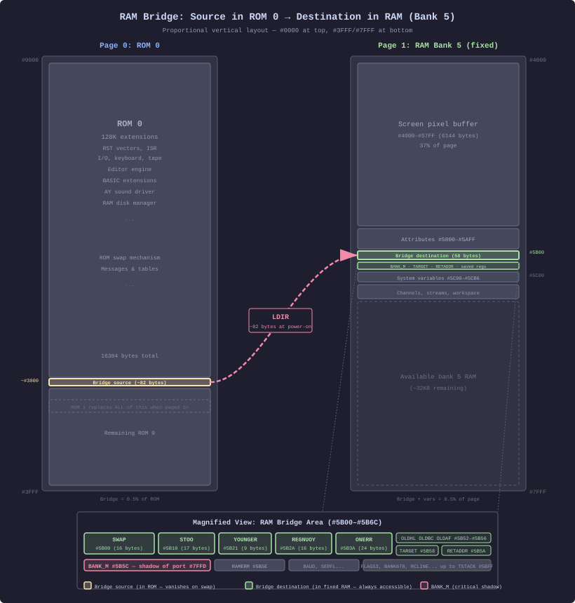
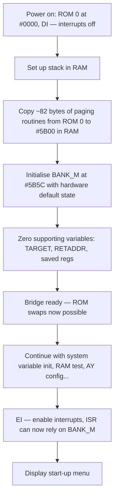
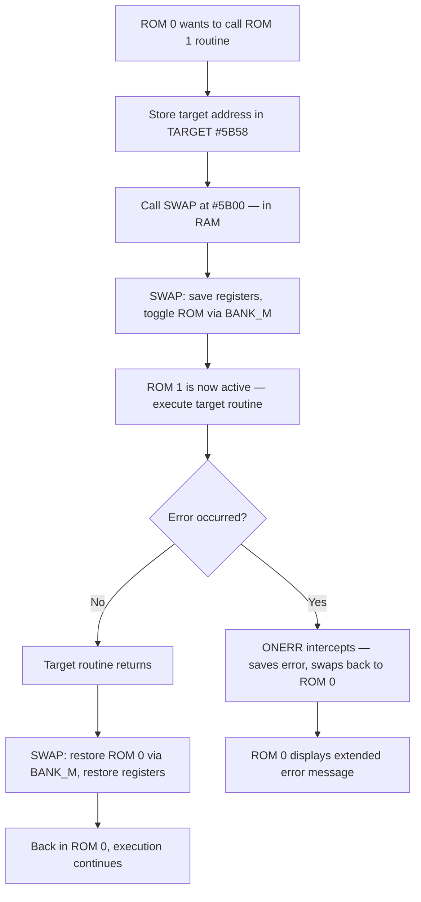
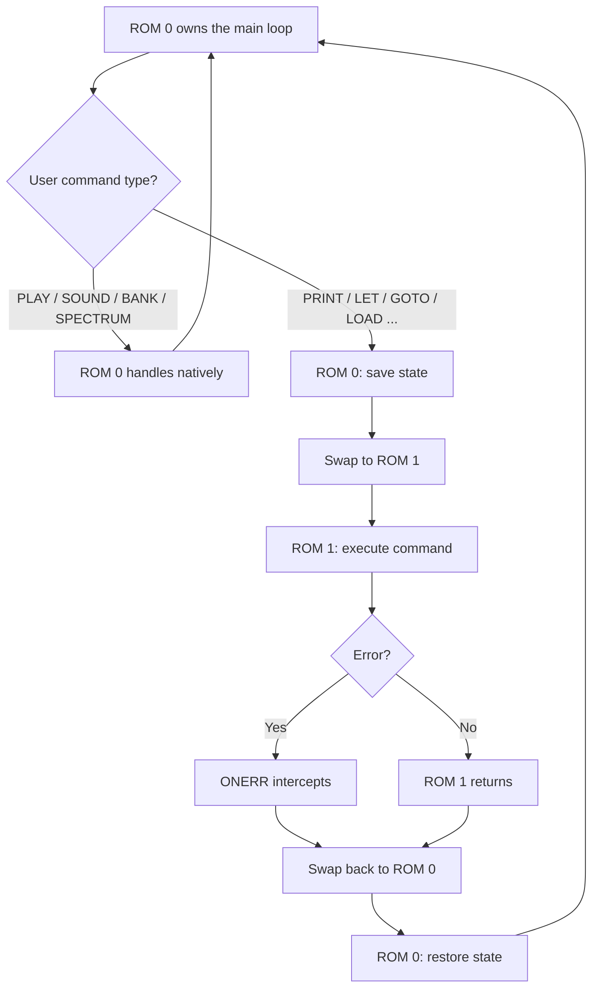
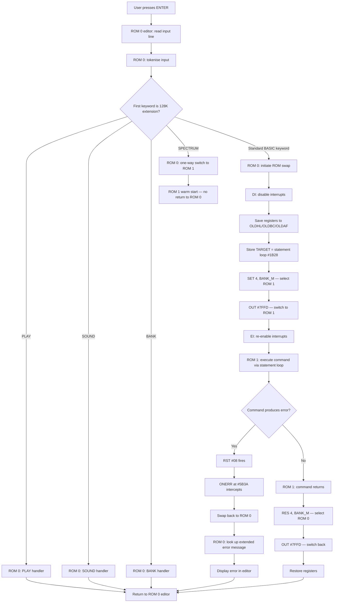
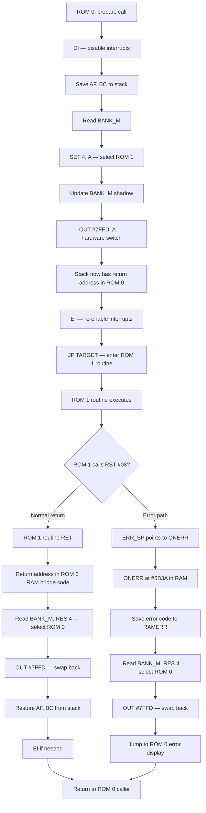
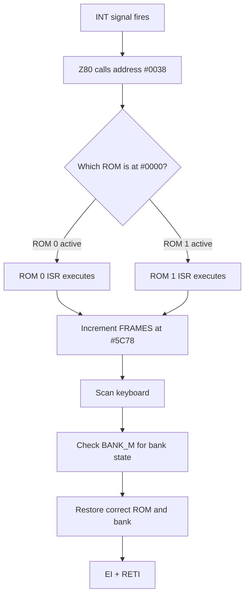
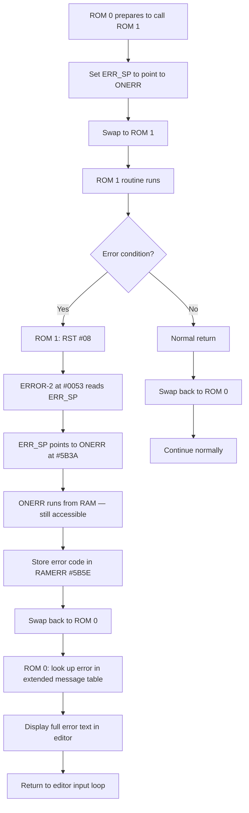
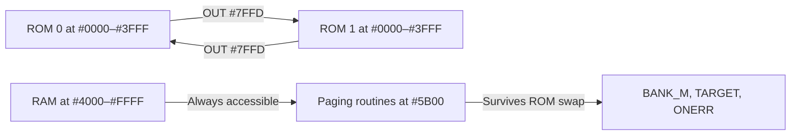
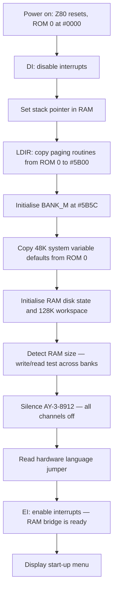

[← Home](../README.md) · [Operating Systems](README.md)

# 128K ROM — Menu System, BASIC Extensions, and RAM Disk

The ZX Spectrum 128K (1986) and its Amstrad successors (+2, +2A, +3) ship with two ROM chips: **ROM 0** (the 128K-specific menu system and extended BASIC) and **ROM 1** (the original 48K ROM, retained for backward compatibility). This article covers the 128K ROM 0 features that distinguish it from the 48K ROM.

The 128K was designed by Sinclair Research (later Amstrad) as a follow-up to the 48K. Rather than rewrite the entire ROM, the engineers kept the proven 48K ROM intact as ROM 1 and created a new ROM 0 that adds a menu system, full-screen editor, AY sound driver, and RAM disk — calling into ROM 1 when it needs the standard BASIC interpreter. This split-ROM architecture is the defining characteristic of the 128K software platform.

For the 48K ROM baseline, see [rom_48k.md](rom_48k.md). For the memory banking that makes dual-ROM possible, see [memory_and_io_128k.md](../05_development/03_memory_and_io/memory_and_io_128k.md).

---

## ROM Layout

| ROM | Address range | Content |
|-----|--------------|---------|
| ROM 0 | `#0000`–`#3FFF` (when selected) | 128K menu system, BASIC extensions, AY sound driver, RAM disk, full-screen editor |
| ROM 1 | `#0000`–`#3FFF` (when selected) | Standard 48K ROM — binary-identical to the Issue 3 48K ROM |

ROM selection is controlled by **bit 4 of port `#7FFD`**:

| Bit 4 value | ROM selected | When used |
|-------------|-------------|-----------|
| 0 | ROM 0 | Menu, editor, 128K BASIC extensions |
| 1 | ROM 1 | Standard 48K BASIC, all original ROM routines |

At reset, ROM 0 is paged in and displays the start-up menu.

### ROM 0 Internal Map

ROM 0 is a complete 16K ROM with its own subsystems. The following table shows the approximate address ranges for the major functional areas. Note that exact addresses differ between the original 128K (Investronica), the Amstrad +2 (grey), and the +2A/+3 — the ranges below are for the original 128K / +2 ROM 0:

| Address range | Subsystem | Description |
|---------------|-----------|-------------|
| `#0000`–`#0007` | RST vectors | `RST #00` (start/reset), `RST #08` (error handler — similar to 48K but routes through paging) |
| `#0008`–`#0037` | RST vectors | `RST #10` through `RST #30` — most redirect through the ROM swap mechanism |
| `#0038`–`#0052` | Interrupt handler | 128K-specific ISR: FRAMES, keyboard, and bank-aware processing |
| `#0053`–`#0065` | Error handling | Error report generation, routes through ONERR paging handler |
| `#0066`–`#0073` | NMI handler | Non-maskable interrupt handling |
| `#0074`–`#0FFF` | Low-level I/O | Keyboard scanning, AY register access, RS-232, tape routines (some shared with ROM 1) |
| `#1000`–`#17FF` | Editor engine | Full-screen editor: cursor movement, scrolling, line editing, keyword recognition |
| `#1800`–`#1FFF` | BASIC extensions | PLAY parser, SOUND handler, BANK handler, SPECTRUM command, RENUM implementation |
| `#2000`–`#27FF` | AY sound driver | Note-to-frequency tables, AY register programming, PLAY execution engine |
| `#2800`–`#2FFF` | RAM disk manager | RAM disk catalog, file allocation, bank switching for data storage |
| `#3000`–`#37FF` | ROM swap mechanism | Paging subroutines, error routing, ROM-to-ROM call dispatcher |
| `#3800`–`#3FFF` | Messages and data | Extended error messages (English/Spanish), menu text, command help strings, lookup tables |

The +2A/+3 ROM 0 is significantly restructured — it uses different paging registers (`#1FFD`) and contains +3 DOS support code, making its internal map substantially different from the 128K/+2 version.

---

## The ROM Swap Mechanism

The two ROMs share the same address range (`#0000`–`#3FFF`) — only one is visible at a time. When ROM 0 needs to call a ROM 1 routine, or vice versa, it performs a **ROM swap**: switch the ROM bank, call the routine, then switch back.

This is not transparent. The swap routine at a well-known address in ROM 0 handles the switch by:

1. Saving the return address and register state
2. Switching bit 4 of `#7FFD` to page in the target ROM
3. Jumping to the target routine
4. On return, restoring the original ROM bank

The swap mechanism is the reason 128K software must be careful with interrupts — if an interrupt fires while ROM 0 is active, the ISR at `#0038` is ROM 0's handler, not ROM 1's. The 128K ROM 0 ISR handles this by duplicating the essential functionality (FRAMES increment, keyboard scan) and adding bank-awareness.

> [!WARNING]
> Machine code programs that switch ROM banks must ensure interrupts are either disabled during the switch or that the ISR is prepared for whichever ROM is active. A `DI`/`EI` pair around the `OUT (#7FFD),A` is the simplest safeguard.

### The RAM Bridge — Overview

#### The Problem

The 128K has two 16K ROMs that share the same address range (`#0000`–`#3FFF`). Only one is visible at a time. When ROM 0 needs to call a routine in ROM 1 (or vice versa), it faces a paradox: the code that performs the switch **lives in the ROM being switched out**, so it vanishes mid-execution.

The solution: copy the switch code into **RAM** first, where it survives any ROM swap.

#### What the Bridge Is

The **RAM bridge** is a small block of machine code (about 82 bytes) that ROM 0 copies from its own address space into the printer buffer area of RAM at `#5B00`–`#5B3A` during the very first moments of start-up. Once in RAM, these routines are always reachable — regardless of which ROM is currently paged into `#0000`–`#3FFF`.

The bridge provides three capabilities:

| Capability | What it enables | Key routine |
|------------|----------------|-------------|
| ROM switching | Call any routine in the other ROM and return cleanly | `SWAP` (#5B00) |
| ROM return | Page back to ROM 0 from ROM 1 | `YOUNGER` (#5B21) / `REGNUOY` (#5B2A) |
| Cross-ROM errors | Route errors from ROM 1 back to ROM 0 for display | `ONERR` (#5B3A) |

#### Memory Layout: Where the Bridge Lives

The diagram below shows the 128K memory map at power-on, with the bridge source in ROM 0 and its RAM destination highlighted:



The bridge source at ~`#3000` in ROM 0 is **template code** — it cannot run in place because ROM 0 vanishes during a swap. The `LDIR` at power-on copies it to the printer buffer at `#5B00` in bank 5 (which is always mapped and never paged out). Once copied, the routines and their supporting variables (`BANK_M`, `TARGET`, `RETADDR`, saved registers) all reside in the `#4000`–`#7FFF` range — permanently accessible to both ROMs.

Bank 5 is **fixed** at `#4000`–`#7FFF` on the 128K (it cannot be paged out). This guarantees the bridge is reachable from any context: during ROM swaps, from any RAM bank configuration, and from either ROM.

A companion variable, `BANK_M` at `#5B5C`, acts as a **shadow copy** of port `#7FFD`. Because port `#7FFD` is write-only, the bridge needs a RAM record of the current ROM, RAM bank, and screen state. Every paging routine reads `BANK_M`, modifies the relevant bits, writes back to `BANK_M`, then writes the same byte to `#7FFD`. If `BANK_M` is out of sync with the hardware, the system crashes.

#### Bridge Creation at Start-Up (High Level)



The bridge is built **before** interrupts are enabled and **before** any ROM swap is attempted. The destination (`#5B00`) is the 48K ROM's printer buffer — a 256-byte RAM region that's only used during `COPY` operations, repurposed by the 128K ROM because it sits safely in the `#4000`–`#FFFF` range that always survives ROM swaps.

#### What the Bridge Does at Run Time (High Level)

Once the bridge is in place, every cross-ROM call follows the same pattern:



The same `BANK_M` read-modify-write pattern is also used for **RAM bank switching** (bits 0–2 of `#7FFD`) — the bridge routines happen to be convenient for any paging operation, not just ROM swaps:

- **RAM disk access** — page in banks 4 or 6 to read/write file data
- **Shadow screen** — page in bank 7 for double buffering
- **BANK command** — page in any bank for display
- **Editor buffers** — page in banks for large program listings

In every case: save `BANK_M`, modify the relevant bits, write to `BANK_M` and `#7FFD`, do the work, restore. Interrupts must be disabled during the switch if the ISR might also touch `BANK_M`.

#### Bridge Components Quick Reference

**Paging routines** (machine code in RAM):

| Address | Name | Size | Purpose |
|---------|------|------|--------|
| `#5B00` | `SWAP` | 16 | Main ROM swap — save regs, toggle ROM, call target, restore |
| `#5B10` | `STOO` | 17 | Stripped-down entry (caller handles DI and register save) |
| `#5B21` | `YOUNGER` | 9 | Unconditionally page in ROM 0 (the "younger" ROM) |
| `#5B2A` | `REGNUOY` | 16 | Page in ROM 0 and return to caller (YOUNGER backward) |
| `#5B3A` | `ONERR` | 24 | Intercept ROM 1 errors and route to ROM 0 display |

**Supporting variables** (data in RAM):

| Address | Name | Description |
|---------|------|------------|
| `#5B52` | `OLDHL` | Saved HL during ROM swap |
| `#5B54` | `OLDBC` | Saved BC during ROM swap |
| `#5B56` | `OLDAF` | Saved AF during ROM swap |
| `#5B58` | `TARGET` | Address of the routine to call in the other ROM |
| `#5B5A` | `RETADDR` | Return address for resuming the caller |
| `#5B5C` | `BANK_M` | Shadow copy of port `#7FFD` — ROM, bank, and screen state |

### The RAM Bridge — Internals

The following subsections drill into the exact mechanics: how each routine works instruction by instruction, which bits of `#7FFD` control what, and when each type of switch occurs.

#### Bridge Construction in Detail

The source data for the paging routines lives within ROM 0 itself (approximately at `#3000`–`#3050`, within the "ROM swap mechanism" address range). At power-on, ROM 0 is the only active ROM and runs its own code directly. The copy sequence:

1. ROM 0 sets HL to the source address in its own address space
2. Sets DE to `#5B00` — the destination in the RAM printer buffer
3. Sets BC to ~82 bytes — the total size of all five routines plus padding
4. Executes `LDIR` — copies the block from ROM to RAM byte by byte
5. Initialises `BANK_M` (`#5B5C`) to `%00000000`: ROM 0 (bit 4 = 0), bank 0 (bits 0–2 = 0), screen from bank 5 (bit 3 = 0)
6. Zeros `TARGET` (`#5B58`), `RETADDR` (`#5B5A`), and the saved-register slots (`OLDHL`, `OLDBC`, `OLDAF`)

At this point the bridge is functional but interrupts are still disabled. Only after the entire initialisation completes (system variables, RAM size detection, AY configuration, language selection) does ROM 0 execute `EI`. From that moment on, the ISR at `#0038` depends on `BANK_M` being correct.

#### Shared Pattern: BANK_M Read-Modify-Write

All paging routines share a single pattern — they manipulate port `#7FFD` through the `BANK_M` shadow:

1. Read `BANK_M` to learn the current paging state
2. Modify the relevant bits (ROM, bank, or screen)
3. Write the new value back to `BANK_M` (update shadow)
4. Write the new value to port `#7FFD` (apply hardware change)

This pattern is used for **every** paging operation — ROM swaps, RAM bank switches, and screen toggles. The reason is that port `#7FFD` is write-only and controls multiple functions simultaneously (ROM selection, RAM bank, screen bank, paging lock). Without `BANK_M`, a routine that only wants to change the ROM would lose track of which RAM bank and screen were active.

#### SWAP (#5B00) — Step by Step

The main cross-ROM call bridge. This is the routine most code calls directly:

1. `PUSH AF` / `PUSH BC` — save caller's registers
2. `LD A,(#5B5C)` — read BANK_M
3. `XOR #10` — toggle bit 4 (flip between ROM 0 and ROM 1)
4. `LD (#5B5C),A` — update shadow
5. `OUT (#7FFD),A` — switch the ROM hardware
6. `LD HL,(#5B58)` — read TARGET
7. `JP (HL)` — jump to the target routine in the other ROM
8. **The target routine executes.** When it returns, execution resumes at the next instruction — which is still in RAM at `#5B00`+offset, always accessible regardless of which ROM is active
9. `LD A,(#5B5C)` / `XOR #10` / `LD (#5B5C),A` / `OUT (#7FFD),A` — switch the ROM back
10. `POP BC` / `POP AF` / `RET`

Steps 1–7 are the "call" path. Steps 8–10 are the "return" path. The key insight: step 8's return address lands in RAM (the SWAP routine itself), so it doesn't matter that ROM 0 or ROM 1 is currently active — the code continues from RAM either way.

#### STOO (#5B10) — Stripped-Down Entry

For callers that have already disabled interrupts and saved registers themselves. Performs steps 2–7 of SWAP (read BANK_M, toggle bit 4, write BANK_M, OUT, read TARGET, JP) without the PUSH/POP wrapper. Used by ROM 0's internal dispatch code when it needs tighter control over the calling sequence.

#### YOUNGER (#5B21) — Page In ROM 0

Pages in ROM 0 unconditionally: reads `BANK_M`, clears bit 4 (ROM 0 = "younger/newer" ROM, an Amstrad naming convention), writes back to `BANK_M` and `#7FFD`. Used when ROM 1 code needs to return to ROM 0 — typically called by ONERR and by the return path of delegated calls.

#### REGNUOY (#5B2A) — ROM 0 Return Trampoline

"YOUNGER" spelled backward. Combines two actions in one sequence:

1. Perform the same bit-clearing as YOUNGER (switch to ROM 0)
2. `JP` through `RETADDR` to resume the original ROM 0 caller

Used as a trampoline: ROM 1 stores its return address in `RETADDR` (`#5B5A`) and jumps to REGNUOY. REGNUOY handles the ROM switch and the return in one seamless operation — the caller in ROM 0 receives the result as if ROM 1 had returned normally.

#### ONERR (#5B3A) — Cross-ROM Error Propagation

Intercepts errors that occur in ROM 1 and routes them to ROM 0 for display:

1. `LD (#5B5E),A` — save the error code to `RAMERR`
2. Call YOUNGER — page in ROM 0
3. `JP` to ROM 0's error display routine

ROM 0 installs ONERR as the `ERR_SP` target before any ROM 1 delegation. When ROM 1 code encounters an error, it calls `RST #08` which chains through `ERR_SP` to ONERR. Because ONERR lives in RAM, it's accessible regardless of which ROM is active. ONERR saves the error code, swaps back to ROM 0, and hands off to ROM 0's extended error message display.

#### Port #7FFD Bitfield

Every paging operation writes to port `#7FFD`, which controls three independent functions in a single byte:

| Bits | Function | Values |
|------|----------|--------|
| 0–2 | RAM bank at `#C000` | Banks 0–7 |
| 3 | Screen display bank | 0 = bank 5, 1 = bank 7 (shadow) |
| 4 | ROM selection | 0 = ROM 0 (128K), 1 = ROM 1 (48K) |
| 5 | Paging lock | 0 = normal, 1 = lock `#7FFD` until reset |

A write to `#7FFD` sets **all** functions simultaneously — you cannot change the ROM without also specifying the RAM bank and screen. This is why `BANK_M` is essential: it records the current state of all bits so that a ROM switch (bit 4) can preserve the existing RAM bank and screen settings, or a RAM bank switch (bits 0–2) can preserve the ROM selection.

```z80
; Example: switch RAM bank to 7 while keeping ROM 0 active
    LD   A,(#5B5C)        ; BANK_M — current state
    AND  %11111000        ; Clear bank bits (0–2)
    OR   %00000111        ; Set bank = 7
    LD   (#5B5C),A        ; Update shadow
    OUT  (#7FFD),A        ; Bank 7 now at #C000
```

#### Switch Types and When They Occur

| Switch type | When | Bits changed |
|-------------|------|-------------|
| ROM 0 → ROM 1 | Delegating standard BASIC commands to 48K ROM | Bit 4: 0→1 |
| ROM 1 → ROM 0 | Returning from delegated call | Bit 4: 1→0 |
| RAM bank switch | Accessing RAM disk data, shadow screen, banked data | Bits 0–2 |
| Screen swap | Double-buffering (main ↔ shadow) | Bit 3 |
| Combined switch | Some operations change ROM and bank simultaneously | Bits 0–4 |
| Paging lock | Security measure — prevents further `#7FFD` writes until reset | Bit 5 |

### Calling Convention

To call a ROM 1 routine from code running with ROM 0 active:

```z80
; Call CLS (#0D6B, a ROM 1 routine) from ROM 0 context
    DI                    ; Disable interrupts
    LD   A,(#5B5C)        ; BANK_M — current paging state
    SET  4,A              ; Select ROM 1 (bit 4 = 1)
    LD   (#5B5C),A        ; Update shadow copy
    OUT  (#7FFD),A        ; Perform the switch
    CALL #0D6B            ; CLS is now accessible
    ; Now restore ROM 0
    LD   A,(#5B5C)
    RES  4,A              ; Select ROM 0 (bit 4 = 0)
    LD   (#5B5C),A
    OUT  (#7FFD),A
    EI                    ; Re-enable interrupts
```

Alternatively, use the SWAP routine at `#5B00` which handles the save/switch/call/restore sequence:

```z80
; Use the ROM's built-in SWAP routine
    LD   HL,#0D6B         ; TARGET = CLS address
    LD   (#5B58),HL       ; Store target
    CALL #5B00            ; SWAP — switches to ROM 1, calls CLS, returns
```

> [!IMPORTANT]
> The `BANK_M` variable at `#5B5C` is **critical** — every write to port `#7FFD` must also update `BANK_M`. The ROM's interrupt handler reads `BANK_M` to determine which ROM was active before the interrupt, and restores it on return. If `BANK_M` is out of sync with the actual port state, the ISR will page in the wrong ROM, causing a crash.

## ROM Call Bridge Architecture

The 128K dual-ROM design follows a fundamental principle: **ROM 0 never duplicates ROM 1 functionality**. Instead, ROM 0 acts as a thin extension layer that intercepts 128K-specific commands and delegates everything else to the existing 48K ROM. The two ROMs collaborate at runtime through the bank-switching call bridge described above.

### Design Philosophy

The 128K engineers at Sinclair Research (later Amstrad) faced a constraint: the 48K ROM was a proven, debugged 16K image that thousands of programs depended on. Rather than risk breaking compatibility by modifying it, they kept it **byte-for-byte identical** (ROM 1) and built ROM 0 as an overlay:

- **ROM 1** (48K ROM) — the complete BASIC interpreter, editor, calculator, I/O system. Untouched.
- **ROM 0** (128K extension) — menu, new editor, AY driver, RAM disk, and a thin dispatch layer that routes commands to ROM 1 when needed.

ROM 0 is only 16K because it does **not** contain a BASIC interpreter — it borrows one from ROM 1 through the swap mechanism.

### What ROM 0 Handles Natively

ROM 0 contains code only for features that do not exist in ROM 1:

| Function | Why ROM 0 must handle it |
|----------|--------------------------|
| Start-up menu | 48K has no menu system |
| PLAY / SOUND / AY driver | 48K has no AY-3-8912 support |
| BANK / RAM disk | 48K has no banked memory |
| Full-screen editor | 48K uses a different (single-line) editor |
| RENUM | 48K has no renumber command |
| SPECTRUM command | 48K is always in "48K mode" |
| ROM swap mechanism | Only needed because there are two ROMs |
| Extended error messages | 48K uses single-character report codes |

### What ROM 0 Delegates to ROM 1

For all standard BASIC operations, ROM 0 swaps in ROM 1 and calls its routines directly:

| ROM 1 Routine | Address | Called by ROM 0 for |
|---------------|---------|--------------------|
| Statement loop / command dispatch | `#1B28` | Executing standard BASIC commands |
| Line scanning and tokenisation | `#2070` | Converting typed text to tokenised form |
| Line management (add/remove) | `#196E` | Inserting and deleting BASIC program lines |
| Calculator entry | `#3A5B` | All floating-point arithmetic |
| PRINT handler | `#1FCD` | Text and number output |
| BEEP handler | `#03F8` | Sound generation (routed to AY on 128K hardware) |
| Tape I/O | `#0605` | LOAD, SAVE, VERIFY, MERGE |
| Character output | `#1536` | All character rendering |
| CLS | `#0D6B` | Clearing the screen |
| Keyboard scan | `#028E` | Reading the keyboard |
| Channel I/O | `#1601` | Stream and channel operations |
| PRINT_FP (format number) | `#2DE3` | Formatting a FP number as decimal text |
| Error-2 (report error) | `#0053` | Generating error reports |

ROM 0 never reimplements any of these — it calls them through the swap bridge.

### Overall Collaboration Model



ROM 0 is always in control — it owns the editor, the main loop, and the screen. ROM 1 is called as a **subroutine library** whenever the user invokes standard BASIC functionality.

### Command Dispatch Flow

When the user enters a BASIC line in the 128K editor, the system must decide which ROM handles it:



### ROM-to-ROM Call Sequence (Detail)

Every individual ROM 1 routine call follows a precise sequence through the RAM-resident paging routines:



Note the critical detail: the return address pushed onto the stack by `CALL TARGET` points to code in ROM 0 — but that code is in the **RAM-resident paging routines** at `#5B00`–`#5B3A`, not in ROM 0 itself. This is why those routines must live in RAM: the moment ROM 1 is paged in, all of ROM 0's address space (`#0000`–`#3FFF`) is replaced by ROM 1. The only code that survives the switch is code in RAM (`#4000`–`#FFFF`).

### Interrupt Handling Across ROM Boundaries

The interrupt handler at `#0038` must work correctly regardless of which ROM is paged in. Since only one ROM is visible at a time, whichever ROM is active determines which ISR runs:



When ROM 0 is active (normal 128K operation), its own ISR handles the interrupt. When ROM 1 is active (during a delegated call), ROM 1's standard 48K ISR runs. Both ISRs increment FRAMES and scan the keyboard, but only ROM 0's ISR tracks bank state via `BANK_M` to ensure the correct ROM is restored on return.

This is why `DI`/`EI` around the actual `OUT (#7FFD)` instruction is essential: if an interrupt fires **between** the ROM switch and the `EI`, the wrong ISR would execute, and `BANK_M` would be corrupted.

### Error Propagation Across ROM Boundaries

Errors that occur inside ROM 1 routines must propagate back to ROM 0 for display with the extended error messages. This is handled by the **ONERR** routine at `#5B3A` (in RAM):



ROM 0 sets `ERR_SP` to point to the ONERR routine **before** delegating to ROM 1. This way, any `RST #08` call in ROM 1 (the standard error reporting mechanism) is caught by ONERR, which lives in RAM and remains accessible regardless of which ROM is active. ONERR saves the error code, swaps back to ROM 0, and displays the error using the extended message table.

### Why the RAM Bridge Exists

The need for RAM-resident paging routines is a direct consequence of the swap architecture:



When ROM 0 switches to ROM 1, **all** of ROM 0 disappears from the address space. Any code that needs to run **during** the switch or **after** ROM 1 returns must be in RAM. The paging routines, `BANK_M`, `TARGET`, `RETADDR`, and `ONERR` all live in RAM for this reason. The 48K system variables (`#5C00`–`#5CB6`) are also in RAM and accessible to both ROMs.

### Summary: Two-ROM Division of Labour

| Aspect | ROM 0 (128K) | ROM 1 (48K) |
|--------|--------------|-------------|
| **Role** | Main controller, owns editor and menu | Subroutine library, called on demand |
| **Always in control?** | Yes — main loop runs here | No — entered via swap, exits via swap |
| **Handles tokens?** | Intercepts 128K commands first | Handles all standard BASIC tokens |
| **Owns the display?** | Yes — full-screen editor | No — ROM 0 manages the screen |
| **Error display?** | Extended messages in ROM 0 | Report codes generated, displayed by ROM 0 |
| **Interrupt handler?** | Own ISR when ROM 0 is active | Own ISR when ROM 1 is active |
| **Size** | ~16K (no BASIC interpreter) | ~16K (complete interpreter) |

The result: a 16K ROM 0 that adds significant new functionality without reimplementing anything ROM 1 already provides. Every standard BASIC operation — tokenisation, line management, the calculator, tape I/O, character output — flows through the RAM bridge to ROM 1 and back.

---

## Start-Up Sequence and Menu

When the 128K powers on, ROM 0 executes a detailed initialisation sequence before presenting the user with a menu.

### Initialisation



1. **Hardware reset** — disable interrupts, set stack pointer in the bank 0 area (`#C000`–`#FFFF` range), configure Z80 registers. At this point ROM 0 is paged in and no RAM bank switching has occurred — the hardware default bank is 0 at `#C000`
2. **Build the RAM bridge** — copy the paging routine templates from ROM 0's own address space (approx. `#3000`–`#3050`) to `#5B00`–`#5B3A` in RAM via `LDIR`. Initialise `BANK_M` (`#5B5C`) to `%00000000` (ROM 0, bank 0, screen 0). Zero `TARGET`, `RETADDR`, and saved-register locations. See [How the Bridge Is Built at Start-Up](#how-the-bridge-is-built-at-start-up) for the full detail
3. **Initialise all 48K system variables** — ROM 0 contains the same default values table as the 48K ROM. It copies them to `#5C00`–`#CB6` using the same process the 48K ROM uses at its own cold start. This is a direct copy, not a delegation to ROM 1
4. **Set up 128K extensions** — initialise `RAMERR` (`#5B5E`), RS232 parameters (`BAUD`, `SERFL` at `#5B5F`–`#5B61`), column/width settings, `FLAGS3` (`#5B66`), and `BANK678` (`#5B67` for +2A/+3). Clear RAM disk catalog area
5. **Determine RAM size** — write a test pattern to each bank at `#C000`, read it back, count how many banks respond. Configure `BANK_M` accordingly. On a 128K machine, banks 0–7 all respond. On a 64K machine (rare), only banks 0–3 respond
6. **Configure the AY-3-8912** — write to the mixer register (R7) to silence all channels, set amplitude registers (R8–R10) to zero. The AY is accessed via `#FFFD`/`#BFFD` ports, which work independently of the ROM paging
7. **Select language** — on the Investronica 128K, a hardware jumper determines English vs Spanish. ROM 0 reads the jumper and selects the appropriate message table. On the Amstrad +2/+2A/+3, English is always selected
8. **Enable interrupts** — `EI` is executed now that `BANK_M` is valid and the paging routines are in RAM. The ISR at `#0038` (ROM 0's handler) can now safely use `BANK_M` to track the paging state
9. **Display the start-up menu**

### The Menu

```
  128K BASIC
  Calculator
  Tape Loader
```

On the Spanish Investronica 128K, the menu is in Spanish (`"128K BASIC"`, `"Calculadora"`, `"Cargador de cinta"`). On the Amstrad +2, the menu adds `GOTO 48 BASIC` as an option.

Selecting **128K BASIC** enters the full-screen editor. **Tape Loader** runs a simple tape-loading poll loop. **Calculator** starts a calculator mode (rarely used). The menu itself is driven by a simple polling loop — it uses the standard IM1 interrupt handler.

After the menu, the machine typically sits in ROM 0 with the editor active. When the user types a BASIC command that isn't a 128K extension, ROM 0 swaps to ROM 1 to execute it through the standard 48K interpreter.

### Start-Up from Machine Code Perspective

After the menu selection and transition to the editor, the system state is:

```
ROM: ROM 0 active (bit 4 of #7FFD = 0)
Banks: 5 at #4000, 2 at #8000, 0 at #C000
Stack: In bank 0 area (#C000–#FFFF)
ISR: ROM 0's handler at #0038
BANK_M: Reflects ROM 0, bank 0, screen 0
```

---

## 128K BASIC Extensions

The 128K ROM 0 adds several commands beyond the 48K BASIC set. These are handled by ROM 0 itself — when the interpreter encounters one, it intercepts before passing control to ROM 1.

| Command | Description |
|---------|-------------|
| `PLAY` | AY-3-8912 music — plays note sequences through the sound chip. Supports up to 3 channels with tempo control |
| `SOUND` | Direct AY register access from BASIC. `SOUND register, value` writes to an AY register |
| `BANK` | Memory bank management — examine and manage RAM banks. Used for RAM disk operations |
| `SPECTRUM` | Switch to 48K BASIC mode (pages in ROM 1 permanently). Cannot return to 128K mode without `NEW` |

### PLAY Command Syntax

```
PLAY "string"
```

The string contains note definitions for channels A, B, and C:

| Character | Meaning |
|-----------|---------|
| `A`–`G` | Note in current octave |
| `#` or `+` | Sharp |
| `$` | Flat |
| `O1`–`O8` | Set octave (default O4) |
| `N` | Rest |
| `.` | Dotted note (1.5× duration) |
| `1`–`9` | Note length (1 = whole, 9 = semibreve) |
| `(`, `)` | Enclose a chord |
| `W`–`Y` | Channel selectors (W = ch A, X = ch B, Y = ch C) |

Example: `PLAY "WAO4CDEFGAB>XAO5C"` — plays a C major scale on channel A.

### AY Sound from BASIC

`PLAY` and `BEEP` on the 128K output through the AY-3-8912 rather than the ULA beeper. However, this is done **synchronously** — the ROM programs the AY tone registers and then busy-waits (via the FRAMES counter) for the note duration to elapse. The AY chip's interrupt output pin is **never enabled** by the standard ROM. For interrupt-driven audio, assembly language and IM2 are required.

### Command Handler Details

#### PLAY Handler

The PLAY command parser in ROM 0 processes the music string character by character. For each note, it:

1. **Determine the note letter** (`A`–`G`) — convert to a scale degree within the current octave
2. **Apply accidentals** — `#` or `+` raises one semitone, `$` lowers one semitone
3. **Look up the frequency** — a lookup table in ROM 0 maps note+octave to a 12-bit AY **tone period** value. The AY period is `clock / (16 × frequency)` where clock = 1,773,447.5 Hz on the PAL 128K
4. **Program the AY registers** — write the period to the channel's tone coarse/fine registers (R0/R1 for channel A, R2/R3 for B, R4/R5 for C)
5. **Set the amplitude** — enable the channel's amplitude register (R8/R9/R10) with a fixed volume or envelope mode
6. **Busy-wait for the duration** — use the FRAMES counter to count the appropriate number of 1/50th-second intervals
7. **Advance to the next note** in the string

Channel selection is explicit: `W` selects channel A, `X` selects channel B, `Y` selects channel C. The default channel at the start of the string is A. Multiple channels can play simultaneously by interleaving their notes with channel selectors.

#### SOUND Handler

`SOUND register, value` provides direct access to the AY-3-8912 register bus:

1. Evaluate `register` (0–13) and `value` (0–255) as numeric expressions
2. Select the AY register by writing `register` to port `#FFFD`
3. Write `value` to port `#BFFD`

No validation is performed — writing to invalid register numbers (14+) is harmless (the chip ignores them), but writing incorrect values to the mixer register (R7) can silence all channels or produce unexpected sounds.

#### BANK Handler

The BANK command provides memory bank management and RAM disk operations:

| Syntax | Action |
|--------|--------|
| `BANK` | Display RAM disk status and available banks |
| `BANK n` | Display the contents of RAM bank n (hex dump) |

Internally, the BANK handler:
1. Evaluates the bank number parameter
2. Saves the current `BANK_M` state
3. Pages in the requested bank at `#C000`
4. Displays or processes the bank contents
5. Restores the original bank

#### SPECTRUM Command

`SPECTRUM` permanently switches the machine into 48K mode:

1. Sets bit 4 of `BANK_M` to select ROM 1
2. Writes the new value to port `#7FFD`
3. Clears the 128K-specific system variables
4. Jumps to the 48K ROM's warm start at `#1F05`

This is a **one-way operation** — there is no `128K` command to switch back. The only way to return to 128K mode is to execute `NEW`, which resets the entire BASIC system.

### AY-3-8912 Register Map

The AY sound chip has 14 read/write registers:

| Register | Function | Bits |
|----------|----------|------|
| R0–R1 | Channel A tone period | R0 = fine (8 bits), R1 = coarse (4 bits) |
| R2–R3 | Channel B tone period | R2 = fine, R3 = coarse |
| R4–R5 | Channel C tone period | R4 = fine, R5 = coarse |
| R6 | Noise period | 5 bits |
| R7 | Mixer/enable | Bits 6–0: I/O port direction, noise/tone enable per channel (1 = disable) |
| R8–R10 | Channel A/B/C amplitude | Bits 4–3: envelope mode (0=fixed), bits 3–0: volume |
| R11–R12 | Envelope period | R11 = fine, R12 = coarse |
| R13 | Envelope shape | 4 bits: continue, attack, alternate, hold |
| R14–R15 | I/O port A/B | Bidirectional port (A is input-only on AY-3-8912) |

The AY is accessed via three I/O ports:

- `#FFFD` (write) — select register number
- `#BFFFD` (write) — write data to selected register
- `#FFFD` (read) — read data from selected register

On the 128K, these ports are activated by the `#7FFD` paging register. The full address decode requires A15=0 and A14=1 for the `#FFFD` register select, and A15=0, A14=1, A13=1 for the `#BFFFD` data write. In practice, any I/O operation to `#FFFD` or `#BFFD` (with appropriate A14/A13) will access the AY.

#### Programming the AY from Assembly

```z80
; Play a 440 Hz tone (A4) on channel A
    ; AY period = clock / (16 * freq) = 1773447 / (16 * 440) = 252
    LD   BC,#FFFD         ; AY register select port
    LD   A,#00            ; Register 0 (channel A fine period)
    OUT  (C),A            ; Select register
    LD   BC,#BFFD         ; AY data write port
    LD   A,252 & #FF      ; Fine period = 252
    OUT  (C),A            ; Write value

    LD   BC,#FFFD
    LD   A,#01            ; Register 1 (channel A coarse period)
    OUT  (C),A
    LD   BC,#BFFD
    LD   A,252 >> 8       ; Coarse = 0
    OUT  (C),A

    LD   BC,#FFFD
    LD   A,#07            ; Register 7 (mixer)
    OUT  (C),A
    LD   BC,#BFFD
    LD   A,%00111110      ; Enable tone on channel A only
    OUT  (C),A

    LD   BC,#FFFD
    LD   A,#08            ; Register 8 (channel A amplitude)
    OUT  (C),A
    LD   BC,#BFFD
    LD   A,#0F            ; Full volume, fixed level
    OUT  (C),A
    ; Tone is now playing
```

---

## RAM Disk

The 128K ROM implements a software RAM disk using **banks 4 and 6** as storage (256 KB total on a 512 KB machine). BASIC can save/load data to the RAM disk as if it were tape, but at RAM speed. The RAM disk is managed through the `BANK` command and stores data in a proprietary format.

RAM disk parameters are tracked in system variables at `#5CC5`–`#5CFF`:

| Address | Name | Description |
|---------|------|-------------|
| `#5CC5` | `BANK_M` | Backup of the last value written to port `#7FFD` |
| `#5CC6` | `RAMRST` | Reset flag for RAM disk |
| `#5CC7` | `RAMERR` | RAM disk error status |

The RAM disk is only available when the machine is in 128K mode (ROM 0 active). Switching to 48K mode via `SPECTRUM` loses access to the RAM disk.

### RAM Disk Data Structures

The RAM disk stores its data in **banks 4 and 6**, which are paged into the `#C000`–`#FFFF` address range as needed. Data is organized as a simple file system:

#### Catalog Structure

The first sector of the RAM disk contains a **file catalog** with entries in the following format:

| Offset | Size | Field |
|--------|------|-------|
| 0 | 10 | Filename (padded with spaces, null-terminated) |
| 10 | 1 | File type (same as tape: 0=PROGRAM, 1=NUMERIC ARRAY, 2=CHAR ARRAY, 3=CODE) |
| 11 | 2 | Data length in bytes (LE) |
| 13 | 2 | Start bank number |
| 15 | 2 | Offset within bank (LE) |
| 17 | 2 | Parameter 1 (as in tape header) |
| 19 | 2 | Parameter 2 |

The catalog can hold up to approximately 40 file entries. An empty catalog slot has a filename of all spaces.

#### Data Storage

File data is stored sequentially across banks 4 and 6. When a file is saved:

1. The ROM finds free space in the catalog
2. The data is written to the current allocation position in banks 4/6
3. The bank number and offset are recorded in the catalog entry
4. If the data spans a bank boundary, it continues in the next available bank

Banks 4 and 6 provide 32 KB of storage total (2 × 16 KB). On a 128K machine, this leaves banks 0, 1, 3, and 7 (besides the fixed banks 2 and 5) available for user programs.

#### RAM Disk Operations from Machine Code

```z80
; Access RAM disk data by paging in bank 4
    DI
    LD   A,(#5B5C)        ; BANK_M
    PUSH AF
    RES  4,A              ; ROM 0 (required for RAM disk)
    AND  %11111000        ; Clear bank bits
    OR   4                ; Select bank 4
    LD   (#5B5C),A
    OUT  (#7FFD),A
    ; Bank 4 is now at #C000–#FFFF
    LD   HL,#C000         ; Access data
    ; ... read/write ...
    POP  AF
    LD   (#5B5C),A
    OUT  (#7FFD),A        ; Restore original bank
    EI
```

> [!NOTE]
> The RAM disk uses banks 4 and 6 for storage, which means those banks are **not available** for user programs. If you need all 8 banks for your own code, you must forgo the RAM disk.

---

## Editor Differences

The 128K editor is significantly improved over the 48K keyword-entry system. It is a **full-screen editor** that occupies the entire display:

- **Full-screen editing**: The cursor can move anywhere on screen using arrow keys. Multiple lines of the program are visible simultaneously.
- **Keyword spelling**: Type keywords letter-by-letter (`P-R-I-N-T` instead of pressing the `PRINT` key combination). The ROM auto-tokenises when you press ENTER.
- **Extended error messages**: Full descriptions like `"Variable not found"` instead of the 48K's cryptic `"2"` (or the single-letter report codes).
- **BASIC renumber**: Built-in `RENUM` utility (not available on 48K).
- **Delete key**: The 128K has a proper `DELETE` key (Caps Shift + 0 on 48K), plus `EDIT` (shift+1) recalls the current line.
- **Syntax checking**: Errors are highlighted immediately when entering a line, rather than at runtime.

### The Editor Display

The editor uses the full 24-line display. Lines above the cursor are the program listing (or the most recent output); lines below are available for input. The bottom two lines show the current edit line and status information.

The full-screen editor is the single biggest usability improvement in the 128K ROM. It transforms the Spectrum from a keyword-hunting experience into something approaching a modern text editor.

### Editor Internals

The full-screen editor occupies the entire 24-line display and is implemented entirely in ROM 0:

**Screen layout:**
- Lines 0–19: Program listing (scrollable)
- Line 20: Divider/status line
- Lines 21–23: Input area (the current edit line)

**Keyword recognition:** Unlike the 48K editor where pressing a key combination directly produces a token, the 128K editor lets the user type characters letter-by-letter. When the user presses ENTER, the editor scans the input line from left to right:
1. At each position, it attempts to match the longest keyword in the token table
2. If a match is found, the matched characters are replaced with the corresponding single-byte token
3. If no match is found, the character is kept as a literal

This means `P`, `R`, `I`, `N`, `T` typed individually is recognized as the token for `PRINT` (`#F5`) when ENTER is pressed. The process is transparent — the program listing shows keywords expanded back to their full text.

**RENUM implementation:** The `RENUM` command (built into ROM 0, not available on 48K) renumbers the BASIC program:
1. First pass: scan all lines and build a mapping of old line numbers to new line numbers
2. Second pass: walk through all tokenised BASIC text and replace line number references in `GOTO`, `GOSUB`, `LIST`, `RUN`, `RESTORE`, and `IF...THEN` with the new numbers
3. Third pass: renumber the actual line headers

RENUM uses the system variables `RCLINE` (`#5B73`), `RCSTART` (`#5B75`), and `RCSTEP` (`#5B77`) to control the renumbering process.

**Error message system:** ROM 0 contains a table of full descriptive error strings (e.g., `"Variable not found"` instead of the 48K's `"2"`). The error number is used to index into this string table. On the Investronica model, a parallel Spanish-language string table is selected based on the hardware language jumper.

---

## Interrupt Handling

The 128K ROM 0 has its own interrupt handler at `#0038` that is aware of the dual-ROM architecture:

1. **Increments FRAMES** — same as 48K
2. **Scans keyboard** — same as 48K
3. **Handles bank switching** — ensures the correct ROM is paged in before accessing bank-dependent data

The 128K ISR must not accidentally switch ROM banks while servicing an interrupt — this could corrupt the main program's state. The handler uses `BANK_M` (`#5CC5`) to track which ROM/bank combination was active before the interrupt.

See [interrupt_programming.md](../05_development/04_interrupts/interrupt_programming.md) for details on hooking the 128K ISR and the bank-switching implications.

---

## +2 and +3 Variants

The Amstrad-produced successors use the same ROM 0/ROM 1 split with minor modifications:

| Model | ROM 0 differences | ROM 1 differences |
|-------|-------------------|-------------------|
| +2 (grey) | Adds `GOTO 48 BASIC` to menu; fixes a few 128K ROM 0 bugs | Identical to 48K Issue 3 |
| +2A / +3 | Rewritten ROM 0 with different memory paging (`#1FFD` port for ROM selection); supports +3 DOS and floppy disk | Based on 48K ROM with minor patches |

The +2A/+3 are **not fully compatible** with 128K software due to the different paging scheme. The `#7FFD` port still works, but the +2A/+3 add a second paging register at `#1FFD` that controls ROM selection independently — some 128K programs that directly manipulate `#7FFD` bit 4 may behave incorrectly.

### +2A/+3 Paging Architecture

The +2A/+3 use a **horizontal ROM switching** scheme controlled by port `#1FFD` (write-only):

| `#1FFD` bit | Function |
|------------|----------|
| 0 | ROM selection: 0 = ROM 0/1 (normal), 1 = ROM 2/3 (DOS/48K) |
| 1 | RAM configuration (see below) |
| 2 | RAM configuration (see below) |
| 3 | Disk motor control (1 = on) |
| 4 | Centronics strobe |
| 5–7 | Unused |

The +2A/+3 have **4 RAM configurations** selected by bits 1–2 of `#1FFD`:

| Config | `#0000`–`#3FFF` | `#4000`–`#7FFF` | `#8000`–`#BFFF` | `#C000`–`#FFFF` |
|--------|-----------------|-----------------|-----------------|-----------------|
| 0 | ROM 0/1 | Bank 5 | Bank 2 | Bank 0 |
| 1 | ROM 0/1 | Bank 5 | Bank 2 | All RAM (bank at #0000) |
| 2 | RAM bank 4/5/6/7 | Bank 5 | Bank 2 | Bank 0 |
| 3 | RAM bank 4/5/6/7 | Bank 5 | Bank 2 | All RAM |

Configurations 2 and 3 allow **full RAM mode** — no ROM is visible at all, which is essential for CP/M and +3 DOS operation.

The +2A/+3 have **4 ROM banks** (not 2):

| ROM | Content |
|-----|---------|
| ROM 0 | 128K Editor ROM (similar to original 128K ROM 0) |
| ROM 1 | 128K Syntax/BASIC handler |
| ROM 2 | +3 DOS ROM (disk operating system) |
| ROM 3 | 48K BASIC ROM (equivalent to original 48K ROM) |

The shadow copy of `#1FFD` is stored in `BANK678` (`#5B67`). As with `BANK_M`, this must be kept in sync with the actual port value.

#### +3 DOS Jump Table

When ROM 2 is paged in and RAM bank 7 is at `#C000`, the +3 DOS provides a jump table at `#0100` for disk operations:

| Address | Function |
|---------|----------|
| `#0100` | DOS initialization |
| `#0103` | DOS open file |
| `#0106` | DOS close file |
| `#0109` | DOS read bytes |
| `#010C` | DOS write bytes |
| `#010F` | DOS catalog |
| `#0112` | DOS delete file |
| `#0115` | DOS rename file |
| `#011E` | DOS catalog (alternative entry) |

Each DOS call requires RAM bank 7 paged at `#C000`, ROM 2 at `#0000`, the stack between `#4000` and `#BFE0`, and interrupts enabled. See the *Sinclair ZX Spectrum +3 Manual*, Part 27 for complete DOS API documentation.

---

## Practical Use Cases

### 1. Detecting 128K vs 48K

```z80
; Check if this is a 128K machine
detect_128k:
    LD   BC,#7FFD
    LD   A,%00000111     ; Bank 7, ROM 0, screen 0
    OUT  (C),A            ; Try to switch banks
    IN   A,(#FE)          ; Read keyboard port (safe probe)
    ; If we got here without crashing, paging works
    ; On a 48K, writing to #7FFD is harmless (no hardware responds)
    ; More reliable: check if bank 7 shadow screen exists
    LD   HL,#C000         ; Bank 7 when paged in
    LD   (hl),#AA
    LD   BC,#7FFD
    LD   A,%00001111      ; Switch to bank 7
    OUT  (C),A
    LD   A,(hl)           ; Read back
    CP   #AA
    JR   Z,is_128k
    ; Not 128K or bank not as expected
    JR   is_48k
is_128k:
    ; Restore default bank
    LD   A,%00001000      ; Bank 0, screen 1 (shadow)
    OUT  (C),A
    ; ... or restore original BANK_M value
```

### 2. Double Buffering with Shadow Screen

```z80
; Draw to shadow screen (bank 7) then swap
    ; Page in bank 7 at #C000
    LD   BC,#7FFD
    LD   A,%00001111      ; Bank 7, ROM 0, shadow screen
    OUT  (C),A

    ; Draw to shadow screen at #C000 (offset #8000 from normal screen)
    ; Shadow pixels: #C000–#D7FF, shadow attrs: #D800–#DFFF
    LD   HL,#C000
    LD   (HL),#FF         ; Example: set pixels

    ; Now make shadow screen visible
    LD   A,%00001000      ; Bank 0, ROM 0, shadow screen active
    OUT  (C),A
    ; Display now shows bank 7's content
```

### 3. Bank Switching for Data Storage

```z80
; Store data across multiple banks
    LD   B,8              ; Number of banks to use
    LD   C,0              ; Bank counter
store_loop:
    LD   A,C
    AND  %00000111        ; Mask to 0-7
    OR   %00000000        ; ROM 0, screen 0
    LD   (bank_state),A
    OUT  (#7FFD),A        ; Page in bank
    ; Write data to #C000 area
    LD   HL,#C000
    ; ... store data ...
    INC  C
    DJNZ store_loop
    ; Restore default bank
    LD   A,(#5B5C)        ; BANK_M
    OUT  (#7FFD),A
```

### 4. Calling ROM 1 Routines Safely

```z80
; Safely call a ROM 1 routine (e.g., PRINT_FP at #2DE3)
    DI                    ; Disable interrupts during swap
    LD   A,(#5B5C)        ; BANK_M
    OR   %00010000        ; Set bit 4 = ROM 1
    LD   (#5B5C),A
    OUT  (#7FFD),A        ; Switch to ROM 1

    ; Set up parameters for PRINT_FP
    ; ... calculator stack must have a value ...
    CALL #2DE3            ; PRINT_FP

    ; Restore ROM 0
    LD   A,(#5B5C)
    AND  %11101111        ; Clear bit 4 = ROM 0
    LD   (#5B5C),A
    OUT  (#7FFD),A
    EI                    ; Re-enable interrupts
```

### 5. AY Sound Effects from Assembly

```z80
; Play a rapid "beep" on channel B using AY
ay_beep:
    LD   BC,#FFFD
    LD   A,#02            ; R2 = channel B fine period
    OUT  (C),A
    LD   BC,#BFFD
    LD   A,#CD            ; Period fine byte (high pitch)
    OUT  (C),A

    LD   BC,#FFFD
    LD   A,#03            ; R3 = channel B coarse period
    OUT  (C),A
    LD   BC,#BFFD
    LD   A,#00            ; Period coarse byte
    OUT  (C),A

    LD   BC,#FFFD
    LD   A,#07            ; R7 = mixer
    OUT  (C),A
    LD   BC,#BFFD
    LD   A,%00111101      ; Enable tone on channel B only
    OUT  (C),A

    LD   BC,#FFFD
    LD   A,#09            ; R9 = channel B amplitude
    OUT  (C),A
    LD   BC,#BFFD
    LD   A,#0C            ; Volume 12
    OUT  (C),A

    ; Wait 10 frames (200ms)
    LD   B,10
.wait:
    HALT
    DJNZ .wait

    ; Silence channel B
    LD   BC,#FFFD
    LD   A,#09
    OUT  (C),A
    LD   BC,#BFFD
    LD   A,#00            ; Volume 0
    OUT  (C),A
    RET
```

### 6. Installing a Bank-Aware Custom ISR

```z80
; IM2 handler that preserves ROM banking
my_isr:
    PUSH AF
    PUSH HL
    LD   HL,(#5C78)      ; Read FRAMES (like standard ISR)
    INC  HL
    LD   (#5C78),HL
    ; Do NOT scan keyboard here (that requires ROM 1!)
    ; Just do your own work
    ; ... custom code ...
    POP  HL
    POP  AF
    EI
    RETI
```

A fully bank-aware ISR must either:
- Avoid calling ROM routines entirely (safest)
- Save `BANK_M`, switch to ROM 1, call the ROM keyboard scanner, restore `BANK_M` (complex but compatible)
- Run with interrupts disabled during ROM-sensitive operations (simplest for games)

---

## Key Differences from 48K ROM

| Feature | 48K ROM | 128K ROM 0 |
|---------|---------|------------|
| Editor | Single-line, keyword-entry | Full-screen, type-ahead |
| Sound | ULA beeper only (`BEEP`) | AY-3-8912 (`PLAY`, `SOUND`, `BEEP` through AY) |
| Storage | Cassette only | Cassette + RAM disk (banks 4/6) |
| Error messages | Single-character codes (`0`–`9`, `A`–`R`) | Full descriptive text |
| BASIC commands | Standard Sinclair BASIC | Extensions: `PLAY`, `SOUND`, `BANK`, `SPECTRUM` |
| Memory | Flat 48K RAM | Banked 128K via `#7FFD` |
| Interrupt handler | Simple: FRAMES + keyboard | Bank-aware, ROM-swap-aware |
| Keyword entry | Key-combination system | Spell-out keywords |
| RENUM | Not available | Built-in |

---

## Cross-References

- **48K ROM** (baseline ROM reference): [rom_48k.md](rom_48k.md)
- **System variables** (FRAMES, BANK_M, RAM disk state): [system_variables.md](system_variables.md)
- **128K memory map** (bank layout, paging): [memory_and_io_128k.md](../05_development/03_memory_and_io/memory_and_io_128k.md)
- **Bank switching patterns**: [bank_switching_patterns.md](../05_development/03_memory_and_io/bank_switching_patterns.md)
- **Interrupt programming** (AY interrupt, IM2, bank switching in ISR): [interrupt_programming.md](../05_development/04_interrupts/interrupt_programming.md)
- **I/O ports** (#7FFD paging, #FFFD AY register): [memory_and_io_128k.md](../05_development/03_memory_and_io/memory_and_io_128k.md)

## References

### External references

- **128K ROM Disassembly** (community-maintained, on WoS archive) — the canonical annotated 128K editor ROM source; covers ROM 0 (48K BASIC, identical to the standalone 48K ROM), ROM 1 (128K editor + 48K BASIC + tape editor), and the editor's menu system.
- **Complete Spectrum ROM Disassembly** (Logan / O'Hara, 1982) — the canonical reference for the underlying 48K ROM routines that ROM 0 wraps; every routine inherited from the 48K is documented here.
- **Sinclair 128K Service Manual** (Sinclair Research, 1986) — the canonical hardware reference covering ROM chip select, the `#7FFD` paging port, and the AY-3-8912 audio chip ports that the 128K ROM drives.
- **Sinclair ZX Specifications** (Martin Korth, `problemkaputt.de/zxdocs.htm`) — cross-model hardware reference; documents the 128K ROM's relationship to the +2 (grey), +2A, +3 ROMs and the regional variants.
- **Spectrumpedia** (Grussu) — print reference for the Spanish / Italian / Russian / French 128K ROM variants; documents the modified editor menu text and the locale-specific BASIC keywords.
