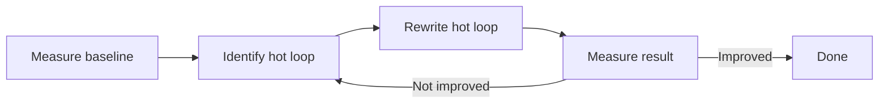

[← Plan](../../PLAN.md) · [Assembly](README.md)

# Z80 Performance Optimization — Cycle Counting, Lookup Tables, Self-Modifying Code

The 48K ZX Spectrum completes **69,888 T-states** per video frame. The CPU runs at 3.5 MHz, so each frame is 19.968 milliseconds — fifty frames per second. Of those 69,888 T-states, the screen-draw period consumes roughly 30,000 with the CPU stalled by memory contention, the IM1 interrupt service routine consumes another 4,000 to 8,000, and the floating-point `FRAMES` increment eats more. What is left for the application is about **30,000 to 40,000 T-states per frame** — enough for one full-screen scroll, one sprite batch, one game logic tick, and not much else. A modern CPU in 2026 executes roughly 50 billion instructions per second; the Z80 in the Spectrum executes 3.5 million. There is no cache, no pipeline, no branch prediction, no out-of-order execution. Every T-state is visible.

This article is the performance handbook for ZX Spectrum assembly. It covers the **optimization workflow** (measure → identify hot loop → rewrite → re-measure), the **T-state budget** (what a 50fps game spends its cycles on), the **techniques** (lookup tables, SMC, loop unrolling, register allocation), and a **cookbook** of common optimizations. It is the fifth article in the [Assembly series](README.md) and assumes you have read the previous four: [assembly_intro.md](assembly_intro.md), [rom_calls.md](rom_calls.md), [stack_and_rst.md](stack_and_rst.md), and [assembly_patterns.md](assembly_patterns.md).

> [!NOTE]
> For micro-level optimization (which `LD` variant is fastest, when `JR` beats `JP`, etc.), see [z80_coding_practices.md](../../01_cpu/z80_coding_practices.md) and the [Z80 timing reference](../../01_cpu/z80_timing.md). This article focuses on **macro-level optimization**: strategies, algorithms, and the optimization workflow.

---

## The Optimization Workflow

The single most important rule: **never optimize without measurement**. Intuition about Z80 performance is wrong as often as it is right. The workflow is:



### Step 1 — Establish a Baseline

Before changing anything, measure the current code. Two measurements:

- **Total frame time**: how many T-states does one frame take? Use the `FRAMES` system variable (`#5C78`) or a hardware-precise timing loop.
- **Hot loop identification**: which subroutine accounts for the most T-states? Use the emulator's instruction profiler, or insert cycle counters around suspected hot spots.

### Step 2 — Identify the Hot Loop

The 80/20 rule on the Z80 is more like **95/5**: 95% of execution time is spent in 5% of the code. Finding that 5% is the key. Tools:

| Tool | What it measures |
|---|---|
| Fuse debugger with breakpoints | Cycles between two breakpoints — useful for measuring a single call |
| ZEsarUX profiler | Total cycles per subroutine across an entire frame |
| z88dk-ticks | T-states for a standalone routine (no full-program context) |
| `FRAMES` counter | Wall-clock frame count — measures total frame time |
| Manual T-state counting | Add up T-states in the disassembly — most accurate, slowest |

### Step 3 — Rewrite the Hot Loop

Only when you know what is slow do you start rewriting. Pick from the techniques in this article (lookup tables, SMC, unrolling, register reassignment).

### Step 4 — Re-Measure

After the change, measure again. The new code must be measurably faster, not just feel faster. If it is not, revert and try a different approach.

### Premature Optimization Is the Enemy

Every optimization has a cost: code size, readability, correctness risk. Optimizing code that is not hot is pure cost with no benefit. The classic example: optimizing the print routine when the game spends 80% of its time in the sprite blit. The print optimization feels productive but does not move the needle.

> [!WARNING]
> The ZX Spectrum has no compiler optimizations to undo. If you write `LD A, 0`, that is what executes. There is no "the compiler will optimize it." Every cycle counts because every cycle is real.

---

## T-State Budgeting

To plan performance, you need to know what a frame costs. Here is a representative 50fps game's budget:

| Component | T-states | % of 69,888 frame |
|---|---|---|
| **IM1 interrupt service routine** | 4,000–6,000 | 6–9% |
| **Memory contention during screen draw** | ~30,000 (192 lines × contention per line) | ~43% |
| **Game logic (state machine, AI, collision)** | 5,000–10,000 | 7–14% |
| **Sprite rendering (8×8 sprites × 16)** | 8,000–15,000 | 11–21% |
| **Sound (beeper ISR mixing)** | 3,000–8,000 | 4–11% |
| **Background scroll / tile draw** | 5,000–10,000 | 7–14% |
| **Idle (HALT)** | 0–10,000 | 0–14% |
| **Total available** | 69,888 | 100% |

The two biggest costs are **contention** (the ULA stealing cycles) and the **ISR** (the ROM's frame-tick routine). Both are essentially fixed — you cannot reduce contention, and replacing the ISR is a major surgery.

What you control is the **game logic** and **rendering** columns. Every T-state you save in those columns goes to either more sprites, smoother scroll, or more idle time (which means easier 50fps).

### Contentious Memory Awareness

Memory access during the screen draw period (192 of 311 scanlines per frame) is subject to contention delays. The exact contention model varies by hardware — see [ula_contention.md](../../02_hardware/original/ula_contention.md) for the deep dive. Key facts:

| Memory range | Contention on 48K |
|---|---|
| `#0000`–`#3FFF` (ROM) | None |
| `#4000`–`#7FFF` (RAM bank 0, containing screen) | Contended — ULA steals cycles |
| `#8000`–`#BFFF` (RAM banks 1, 2, 3 on 48K) | None |
| `#C000`–`#FFFF` (RAM banks 4, 5, 6, 7 on 48K) | None (top 16K) |

> [!WARNING]
> **Requires contended memory timing.** Any code that executes in `#4000`–`#7FFF` during the screen draw period runs slower than expected. Move time-critical code to uncontended memory (`#8000`–`#FFFF`) or count contention cycles explicitly.

### Reading FRAMES for Profiling

The `FRAMES` system variable at `#5C78` is a 3-byte counter incremented by the ISR every 20 ms (50 Hz). Read it before and after a code section to measure wall-clock time:

```z80
    DI                       ; disable interrupts during measurement
    LD   BC, (#5C78)         ; read FRAMES low 2 bytes
    LD   (start_time), BC
    EI
    
    ; ... code to measure ...
    
    DI
    LD   BC, (#5C78)
    LD   (end_time), BC
    EI
    
    ; (subtract end_time - start_time to get elapsed 20ms units)
```

For sub-frame measurements, use a manual T-state counter via the R register or via cycle-counting in the listing file.

---

## Hot-Loop Optimization Techniques

When you have identified a hot loop, here are the techniques that work. Listed roughly in order of impact.

### 1 — Move Loop Invariants Out

If a calculation does not change between iterations, move it before the loop.

```z80
; BAD: re-computes base address every iteration
draw_sprites:
    LD   B, 16
.loop:
    PUSH BC
    LD   HL, sprite_table
    ; ... use HL ...
    POP  BC
    DJNZ .loop
    RET
```

```z80
; GOOD: compute base once
draw_sprites:
    LD   HL, sprite_table
    LD   B, 16
.loop:
    PUSH BC
    ; ... use HL ...
    POP  BC
    DJNZ .loop
    RET
```

Savings: 4 T-states and 3 bytes per iteration. For 16 iterations, that is 64 T-states — not huge, but free.

### 2 — Reassign Registers

The Z80's registers are not equal. The cost hierarchy:

| Operation | A | B | C | D | E | H | L |
|---|---|---|---|---|---|---|---|
| `LD r, n` | 7T | 7T | 7T | 7T | 7T | 7T | 7T |
| `LD r, (HL)` | 7T | 7T | 7T | 7T | 7T | — | — |
| `ADD A, r` | 4T | 4T | 4T | 4T | 4T | 4T | 4T |
| `INC r` | 4T | 4T | 4T | 4T | 4T | 4T | 4T |
| `DEC r` | 4T | 4T | 4T | 4T | 4T | 4T | 4T |
| `LD rp, nn` | 10T | 10T | 10T | 10T | 10T | 10T | 10T |
| `LD rp, (nn)` | 20T | 20T | 20T | 20T | 20T | 20T | 20T |
| `INC rp` | 6T | 6T | 6T | 6T | 6T | 6T | 6T |
| `ADD HL, rp` | 11T | — | — | 11T | — | — | — |

Key observations:

- **A is the accumulator.** Every arithmetic and logic operation has a one-byte shorter, faster variant when one operand is A.
- **HL is the pointer.** `LD r, (HL)` is 7T; `LD r, (IX+d)` is 19T. Use HL.
- **B is the loop counter.** `DJNZ label` is one byte, 13T taken. No other register has this.
- **BC and DE** are second-class for arithmetic but can be 16-bit pointers via `LD A, (BC)` / `LD A, (DE)` (7T each — same as HL).
- **IX and IY** cost a 4-T-state prefix per instruction. Avoid in hot loops.

### 3 — Use LDI/LDD/LDIR/LDDR for Bulk Operations

The Z80 block instructions move bytes between memory and HL/DE:

| Instruction | Encoding | T-states per byte | Effect |
|---|---|---|---|
| `LDI` | `#ED #A0` | 16 | (DE) ← (HL); HL++; DE++; BC-- |
| `LDD` | `#ED #A8` | 16 | (DE) ← (HL); HL--; DE--; BC-- |
| `LDIR` | `#ED #B0` | 16/byte (21 last) | LDI until BC = 0 |
| `LDDR` | `#ED #B8` | 16/byte (21 last) | LDD until BC = 0 |

For copying 1000 bytes, `LDIR` takes 16 × 999 + 21 = **16,005 T-states**. A manual `LD A, (HL); LD (DE), A; INC HL; INC DE; DEC BC; JP NZ, loop` takes roughly 50 T-states per byte = 50,000 T-states — **3× slower**.

For small counts (<4), `LDIR` setup overhead exceeds its savings. Use unrolled `LDI`:

```z80
; Copy exactly 4 bytes
    LDI
    LDI
    LDI
    LDI
```

No loop overhead, no setup. 4×16 = 64 T-states.

### 4 — DJNZ for Loop Counters

`DJNZ label` decrements B and jumps if B ≠ 0. One byte, 13T taken, 8T not taken. The fastest loop construct on the Z80.

```z80
    LD   B, 8                ; 8 iterations
loop:
    ; ... body ...
    DJNZ loop                ; 1 byte, 13T taken
```

If you need B for something else, use `DEC C; JR NZ` (2 bytes, 12T taken — slightly faster but 1 byte more).

### 5 — Loop Unrolling

For very tight loops, unroll to eliminate `DJNZ` overhead:

```z80
; Rolled loop: 8 iterations
clear_8_bytes:
    LD   B, 8
    LD   HL, addr
.loop:
    LD   (HL), 0
    INC  HL
    DJNZ .loop               ; 13T per iteration (except last)
    RET
; Total: 8 × (10T body + 13T DJNZ) - 5T (last DJNZ not taken) = 8×23 - 5 = 179T (plus setup)

; Unrolled: 8 iterations, no loop
clear_8_bytes_unrolled:
    LD   HL, addr
    LD   (HL), 0
    INC  HL
    LD   (HL), 0
    INC  HL
    LD   (HL), 0
    INC  HL
    LD   (HL), 0
    INC  HL
    LD   (HL), 0
    INC  HL
    LD   (HL), 0
    INC  HL
    LD   (HL), 0
    INC  HL
    LD   (HL), 0
    RET
; Total: 8 × (10T LD + 6T INC) = 128T — 28% faster, but 21 bytes vs 9
```

**The unrolling threshold**: for the Z80, unrolling typically wins when the loop body is <10 T-states and the iteration count is <16. Beyond that, code size dominates.

---

## Lookup Tables

The single most powerful Z80 optimization technique. The Z80 has no multiply, no divide, no barrel shifter, no trigonometric instructions. All of these are slow when emulated in software. Lookup tables trade **memory for time**: precompute the answer for every possible input, then index into the table at runtime.

### The Pattern

```z80
; Precomputed table of squares (0-15)
squares:
    DEFB 0, 1, 4, 9, 16, 25, 36, 49, 64, 81, 100, 121, 144, 169, 196, 225

; Compute A = squared of low nibble of A
; Entry: A = value (0-15)
; Exit: A = A²
square_low_nibble:
    AND  #0F                 ; mask to low nibble
    LD   L, A
    LD   H, 0
    LD   DE, squares
    ADD  HL, DE              ; HL = address of entry
    LD   A, (HL)
    RET
```

Cost: ~30 T-states per lookup vs ~400 T-states for shift-and-add multiplication. **13× faster**, at the cost of 16 bytes of table.

### Common Tables

| Table | Size | Use |
|---|---|---|
| **8×8 multiply** | 64 KB (full) or 256 bytes (low-only) | Fast multiplication |
| **Sin/cos** | 256 bytes | Trigonometry for animations, 3D |
| **Pixel address** | 192 bytes (Y-coord) + 32 bytes (X-mask) | Screen pixel plotting |
| **Attribute address** | 192 bytes | Attribute byte access |
| **Reciprocal** | 256 bytes (or log table) | Fast division |
| **Log/antilog** | 512 bytes each | Multiplication via log+add+antilog |
| **Random numbers** | 256-65536 bytes | Game randomness without computing |

### Sine Table Worked Example

For smooth animation, sinusoidal motion is essential. Computing `sin(x)` via the ROM calculator takes ~6,000 T-states. A lookup table takes 30.

```z80
; 256-entry sine table, values in range -128 to +127
; Index: angle in 256-degree units (0 = 0°, 64 = 90°, 128 = 180°, 192 = 270°)
; Value: sin(angle) × 127, rounded

sin_table:
    DB $00, $03, $06, $09, $0C, $10, $13, $16
    DB $19, $1C, $1F, $22, $25, $28, $2B, $2E
    DB $31, $33, $36, $39, $3B, $3E, $40, $43
    DB $45, $47, $49, $4B, $4D, $4F, $51, $53
    DB $55, $56, $58, $59, $5B, $5C, $5D, $5E
    DB $5F, $60, $61, $61, $62, $63, $63, $63
    DB $64, $64, $64, $64, $63, $63, $63, $62
    DB $62, $61, $60, $5F, $5E, $5D, $5C, $5B
    DB $59, $58, $56, $55, $53, $51, $4F, $4D
    DB $4B, $49, $47, $45, $43, $40, $3E, $3B
    DB $39, $36, $33, $31, $2E, $2B, $28, $25
    DB $22, $1F, $1C, $19, $16, $13, $10, $0C
    DB $09, $06, $03, $00, $FD, $FA, $F7, $F4
    ; ... 256 entries total

sin_a:
    ; Entry: A = angle (0-255)
    ; Exit: A = sin(angle) × 127
    LD   L, A
    LD   H, 0
    LD   DE, sin_table
    ADD  HL, DE
    LD   A, (HL)
    RET
```

Cost: 7+7+10+11+7 = 42 T-states. Versus 6,000+ for ROM SIN. **140× faster.**

For higher precision, use a 1024-entry table (1 KB) with 16-bit values.

### Multiplication Tables

Two strategies:

**Strategy 1: 64 KB table** for full 8×8 → 16 multiply. Slow to build, fast to use. Impractical for a 48K Spectrum — uses the entire address space.

**Strategy 2: 256-byte low-byte table** for the low byte of `A × B`. Combined with shift-and-add for the high byte, gives a fast hybrid.

```z80
; squares_low: 256 bytes, squares_low[A] = (A²) AND #FF
squares_low:
    ; ... 256 entries ...

; Fast multiply: A × B → HL
multiply_a_b:
    LD   C, A
    LD   A, B
    ADD  A, C                ; A = A + B
    LD   L, A
    LD   H, 0
    LD   DE, squares_low
    ADD  HL, DE
    LD   A, (HL)             ; A = (A+B)² low byte
    LD   (sum_sq), A
    
    LD   A, B
    SUB  C                   ; A = B - A (note: was original B)
    LD   L, A
    LD   H, 0
    LD   DE, squares_low
    ADD  HL, DE
    LD   A, (HL)             ; A = (B-A)² low byte
    LD   (diff_sq), A
    
    LD   A, (sum_sq)
    LD   HL, diff_sq
    SUB  (HL)                ; A = (A+B)² - (B-A)² = 4AB
    ; (Divide by 4 for AB — or just use 4AB if that is what you need)
    RET
```

This is the classic identity `A × B = ((A+B)² - (A-B)²) / 4`. Two table lookups, one subtract. Roughly 100 T-states total.

---

## Fast Multiply Without Tables

When you cannot afford a 256-byte table, use shift-and-add. The classic 8×8 → 16 multiply:

```z80
; Multiply H × L → HL
multiply_hl:
    ; Entry: H, L = factors
    ; Exit: HL = H × L (mod 65536)
    LD   B, 8                ; 8 bits to process
    LD   A, H                ; A = multiplier
    LD   H, 0                ; HL = 0:multiplicand
    LD   D, H
    LD   E, L                ; DE = multiplicand
    XOR  A                  ; we will count multiplicand in HL
    ; (Algorithm: shift A right, add DE to HL if carry)
.mul_loop:
    RR   A                   ; shift multiplier right, low bit → carry
    JR   NC, .no_add
    ADD  HL, DE              ; add multiplicand to result
.no_add:
    SLA  E                   ; shift multiplicand left
    RL   D
    DJNZ .mul_loop
    RET
```

Cost: roughly 8 × (4 + 7+12 + 8+8 + 13) = 8 × 52 = **416 T-states**, plus setup. Slower than the table approach but uses no data.

### 16-Bit Multiply

A 16×16 → 32 multiply uses the same shift-and-add pattern but iterates 16 times and uses two 16-bit accumulator halves. Roughly **1,500 T-states** — practical for one-off calculations, too slow for hot loops.

For 16-bit multiply in a hot loop, precompute via lookup tables during level load, then read the results during the frame.

---

## Fast Divide Without Tables

Division is harder than multiplication. The shift-subtract algorithm:

```z80
; Divide HL by C → HL = quotient, C = remainder
divide_hl_c:
    ; Entry: HL = dividend, C = divisor
    ; Exit: HL = quotient, C = remainder
    XOR  A
    LD   B, 16              ; 16 bits
div_loop:
    ADD  HL, HL              ; shift HL left, top bit → carry
    RL   A                   ; carry into A
    CP   C                   ; compare A (partial dividend) with C (divisor)
    JR   C, .no_sub
    SUB  C                   ; subtract divisor
    INC  L                   ; set bit 0 of quotient (just shifted in)
.no_sub:
    DJNZ div_loop
    ; A now holds the remainder
    LD   C, A
    RET
```

Cost: 16 × (11+4+4+7+12+8) ≈ 16 × 46 = **736 T-states**. Faster than the ROM divide (~4,000 T-states), slower than multiply.

For division by constants, multiply by the reciprocal. To divide by 10, multiply by 26 (≈ 1/10 × 256) and shift right 8 bits:

```z80
; Divide A by 10 → A = quotient
; Uses multiply by 26 (approximately 1/10 × 256)
divide_a_by_10:
    LD   L, A
    LD   H, 0
    LD   E, 26
    LD   D, 0
    CALL multiply_hl_de       ; HL = A × 26
    ; Now divide HL by 256 (just take H)
    LD   A, H
    RET
```

Cost: roughly 420 T-states (multiply) + 10 (setup) = 430 T-states, versus 736 for general divide. Saves about 40%.

---

## Self-Modifying Code (SMC) in Hot Loops

When every T-state counts, SMC can eliminate an instruction by patching an immediate operand at runtime.

### Pattern: Patching an Immediate

```z80
; Inner loop with SMC-injected count
clear_pixels_smc:
    LD   A, (frame_count)    ; some runtime value
    LD   (patch+1), A        ; patch the LD B, imm
patch:
    LD   B, 0                ; ← B is set to runtime value
.loop:
    LD   (HL), 0
    INC  HL
    DJNZ .loop
    RET
```

Without SMC, you would write `LD B, A` (4T) before the loop — adding 4 T-states per call. With SMC, the patching is done outside the loop, so the loop itself is shorter.

### Pattern: Patching an Address

For a blit that copies from a variable source to a variable destination, patch both addresses:

```z80
blit_smc:
    LD   A, (src_low)
    LD   (patch_src+1), A
    LD   A, (src_high)
    LD   (patch_src+2), A
patch_src:
    LD   HL, #0000           ; ← patched to actual source
    
    LD   A, (dst_low)
    LD   (patch_dst+1), A
    LD   A, (dst_high)
    LD   (patch_dst+2), A
patch_dst:
    LD   DE, #0000           ; ← patched to actual destination
    
    LD   A, (count)
    LD   (patch_cnt+1), A
    LD   B, 0
patch_cnt:
    LD   C, 0                ; ← patched to actual count
    LDIR
    RET
```

This pattern eliminates 6 `LD` instructions (12 bytes, 42 T-states) inside the routine. The patching cost is 9 instructions outside, but for a routine called once per frame, the savings compound.

### When SMC Wins and Loses

| Situation | SMC wins? |
|---|---|
| Tight inner loop called many times | Yes |
| Routine called rarely | No (patching cost > savings) |
| Code in ROM | No (cannot patch ROM) |
| Code in bank-switched memory | No (patches lost on bank change) |
| Multiple threads execute same code | No (race condition) |
| Code shared between callers | Maybe (only the last patch wins) |

For modern development, prefer non-SMC unless you are writing tight demoscene code where every cycle is essential. SMC's readability cost is high.

---

## Memory Access Patterns

The Z80 has no cache, but it has **contention** — the ULA steals cycles from CPU memory access during screen draw. The pattern of memory access matters.

### Contended vs Uncontended Memory

| Memory range | Contention |
|---|---|
| `#0000`–`#3FFF` (ROM) | None — but reads are slow (1T extra) |
| `#4000`–`#7FFF` (bank 0) | Contended during screen draw |
| `#8000`–`#BFFF` (banks 1-3) | None |
| `#C000`–`#FFFF` (banks 4-7) | None on 48K; varies on 128K |

For time-critical code, **put it in `#8000`–`#BFFF`** if possible. This is uncontended and executes at full speed.

### Contention Per Access

On the 48K, every memory access to `#4000`–`#7FFF` during the screen-draw period (scanlines 64-255 of each frame) incurs an extra delay. The exact pattern is documented in [ula_contention.md](../../02_hardware/original/ula_contention.md); the short version is:

- The ULA performs a memory access every 8 T-states during the screen draw
- If the CPU tries to access contended memory at the same time, it stalls until the next 8-T-state boundary
- This adds 1-6 T-states per contended access, averaging about 2-3

For a routine that does 100 contended memory accesses, expect 200-300 T-states of contention delay. For most routines this is acceptable; for race-the-beam effects (multicolor), it is fatal.

### Optimizing Memory Layout

- **Code**: place in uncontended memory (`#8000`-`#BFFF`)
- **Stack**: same (SP set to `#FFF0` is fine — top 16K is uncontended)
- **Hot data** (read in inner loops): same
- **Cold data** (level data, music): can go anywhere
- **Screen**: must be at `#4000` for the ULA to see it
- **Attributes**: must be at `#5800`

### Memory Access Reordering

The Z80 has no pipeline, but bus contention acts like a soft pipeline. If two consecutive instructions both access memory, the second one's access may collide with the ULA. Reordering to interleave memory access with ALU operations can sometimes help:

```z80
; Both instructions hit memory
    LD   A, (HL)             ; memory access
    LD   (DE), A             ; memory access — possible contention

; Interleaved: memory, ALU, memory, ALU
    LD   A, (HL)             ; memory
    ADD  A, B                ; register-only
    LD   (DE), A             ; memory
    INC  HL                  ; register-only
```

This rarely matters on the Z80 (no real pipeline), but it can help slightly in contended regions.

---

## Instruction Reordering for the Z80

Unlike modern CPUs, the Z80 has no pipeline, no branch prediction, no cache. Instruction reordering does not help with hazards or stalls. The only thing that matters is the **total T-state count** of the code path actually taken.

There is one micro-optimization worth knowing: **branch direction matters**. `JR NZ, label` is 12T if taken, 7T if not. For loops, the taken case is the common case, so the cost is 12T per iteration.

```z80
; Loop where the exit is rare
    LD   B, 16
.loop:
    ; ... body that usually continues ...
    DJNZ .loop               ; taken 15 times, not taken 1 time
```

If the loop body usually exits early, consider an `JR Z, exit` at the top:

```z80
    LD   B, 16
.loop:
    ; ... body that usually exits ...
    JR   Z, .exit            ; usually taken → 12T
    DJNZ .loop
.exit:
```

This is a 5-T-state saving per non-exit iteration if the exit is usually taken. Worth considering for tight loops.

---

## Pitfalls

### Pitfall 1: Premature Optimization

```z80
; Over-optimized code that is never in a hot loop
convert_bcd_to_ascii:
    ; 30 lines of unrolled, SMC-patched lookup-table code
    ; saves 20 T-states per call
    ; called twice per game over screen, not in the frame loop
```

Don't do this. Optimization has a readability cost. Apply it only where measurement shows it matters.

### Pitfall 2: Forgetting Contention in Tight Loops

```z80
; BAD: time-critical code in contended memory
    ORG  #5000              ; contended region
race_the_beam:
    ; ... cycle-counted code that assumes no contention ...
```

If you place race-the-beam code at `#5000`, the ULA will steal cycles at unpredictable times, and your carefully counted timing will be wrong. Always put cycle-counted code in uncontended memory.

### Pitfall 3: SMC in ROM

Writes to ROM are silently ignored. SMC patches appear to work in the listing but do nothing at runtime. Always verify your SMC code is in RAM.

### Pitfall 4: Wrong LDIR Threshold

`LDIR` is faster than manual loops for 4+ bytes. For 1-3 bytes, unrolled `LDI` is faster (no setup overhead). Knowing where the threshold is saves cycles:

```z80
; 1 byte: just LD
    LD   A, (HL)
    LD   (DE), A

; 2 bytes: 2 LDIs
    LDI
    LDI

; 3 bytes: 3 LDIs
    LDI
    LDI
    LDI

; 4+ bytes: LDIR
    LD   BC, count
    LDIR
```

### Pitfall 5: LDIR for Time-Critical Code

`LDIR` is not deterministic in contended memory — each byte access is subject to contention delays. If you need to know exactly how many T-states a copy takes (e.g., for race-the-beam), unrolled `LDI` with manual counting is more predictable.

---

## Performance Cookbook — 10 Recipes

Ten short recipes for common optimizations.

### Recipe 1 — Clear Screen with LDIR

```z80
clear_screen:
    LD   HL, #4000
    LD   (HL), 0
    LD   DE, #4001
    LD   BC, 6143
    LDIR                     ; 6143 × 16 + 21 = 98,309T
    RET
```

98,309 T-states = 1.41 frames. Faster alternatives: unrolled `LDI` or SMC fill.

### Recipe 2 — Set Attribute to Constant

```z80
set_attrs:
    LD   HL, #5800
    LD   (HL), #38          ; bright white paper, black ink
    LD   DE, #5801
    LD   BC, 767
    LDIR
    RET
```

### Recipe 3 — strlen (Count Until Null)

```z80
strlen:
    ; Entry: HL = string
    ; Exit: BC = length
    LD   BC, 0
.loop:
    LD   A, (HL)
    AND  A
    RET  Z
    INC  HL
    INC  BC
    JR   .loop
```

### Recipe 4 — Multiply A by 10

```z80
multiply_a_by_10:
    ; A × 10 = A × 8 + A × 2 = (A << 3) + (A << 1)
    LD   B, A
    SLA  A                   ; × 2
    SLA  A                   ; × 4
    SLA  A                   ; × 8
    ADD  A, B                ; × 9 — wait, that's wrong. Restart.
    ; Correct version:
    LD   B, A
    SLA  A                   ; × 2
    ADD  A, B                ; × 3 — still wrong. Use the bit-shift identity:
    ; A × 10 = (A × 5) × 2 = (A + A × 4) × 2 = (A + (A << 2)) << 1
    LD   B, A
    SLA  A                   ; A × 2
    SLA  A                   ; A × 4
    ADD  A, B                ; A × 5
    SLA  A                   ; A × 10
    RET
```

### Recipe 5 — Divide A by 10 (Approximate)

```z80
; Divide A by 10 → A = quotient (approximate, ±1)
; Uses multiply by 205/256 ≈ 1/10 × 256 × 8 (then shift right 3)
divide_a_by_10:
    LD   L, A
    LD   H, 0
    LD   DE, 205
    CALL multiply_hl_de       ; HL = A × 205
    ; Now HL ≈ A × 10.002, divided by 256 is H ≈ A × 0.39 — wrong
    ; Correct: A × 205 / 2048 ≈ A / 10
    ; Shift HL right 11 times: keep top 5 bits of H
    ; For small A, this gives the right quotient
    ; (Implementation left as exercise — or use a real divide routine)
    RET
```

Approximate division via reciprocal multiplication is tricky on the Z80 because of the 16-bit accumulator limit. For exact division, use the shift-subtract routine.

### Recipe 6 — Bit Reverse A

```z80
; Reverse bits in A: bit 0 ↔ bit 7, bit 1 ↔ bit 6, etc.
reverse_bits:
    LD   B, 8
    LD   C, A
    XOR  A
.loop:
    RR   C                   ; low bit of C → carry
    RL   A                   ; carry → low bit of A
    DJNZ .loop
    RET
```

### Recipe 7 — Endianness Swap (BC)

```z80
swap_bc:
    LD   A, B
    LD   B, C
    LD   C, A
    RET
```

### Recipe 8 — Test if A Is Power of 2

```z80
is_power_of_2:
    ; Entry: A
    ; Exit: Z if power of 2 (and nonzero), NZ otherwise
    AND  A
    RET  Z                   ; 0 is not a power of 2
    LD   B, A
    DEC  B
    AND  B                   ; A AND (A-1) = 0 iff A is power of 2
    RET
```

### Recipe 9 — Fast Random Number (LFSR)

```z80
; 8-bit linear-feedback shift register
rng_state: DEFB 1

random_a:
    LD   HL, rng_state
    LD   A, (HL)
    AND  A
    RL   A                   ; shift left
    RL   (HL)
    ; XOR feedback from bits 3, 4, 5, 7 (Galois LFSR)
    LD   A, (HL)
    RRA
    JR   NC, .no_fb
    XOR  #B8                 ; feedback polynomial
    LD   (HL), A
.no_fb:
    LD   A, (HL)
    RET
```

### Recipe 10 — Inline Fast Reverse HL Bytes

```z80
; Swap high and low byte of HL
swap_hl:
    LD   A, H
    LD   H, L
    LD   L, A
    RET
```

---

## Cross-References

- **[assembly_intro.md](assembly_intro.md)** — first contact; mentions optimization briefly
- **[rom_calls.md](rom_calls.md)** — comparison of ROM routine performance vs custom code
- **[stack_and_rst.md](stack_and_rst.md)** — register swap costs, shadow register use
- **[assembly_patterns.md](assembly_patterns.md)** — SMC and dispatch table patterns
- **[z80_coding_practices.md](../../01_cpu/z80_coding_practices.md)** — micro-level instruction selection
- **[z80_timing.md](../../01_cpu/z80_timing.md)** — complete T-state table for every instruction
- **[z80_instruction_set.md](../../01_cpu/z80_instruction_set.md)** — full ISA reference
- **[ula_contention.md](../../02_hardware/original/ula_contention.md)** — contention model, deep dive
- **[ula_timing.md](../../02_hardware/original/ula_timing.md)** — frame timing per model
- **[debugging.md](../../09_toolchain/debugging.md)** — profiler tools

## References

- *Z80 CPU User Manual* by Zilog — official timing tables
- *Programming the Z80* by [Rodnay Zaks](https://en.wikipedia.org/wiki/Rodnay_Zaks) — multiplication and division algorithms
- Henry S. Warren Jr. — *Hacker's Delight* — bit-twiddling tricks, many of which apply to Z80
- [z88dk wiki — Optimization](https://www.z88dk.org/wiki/) — community optimization guide
- [chibiakumas.com Z80 tutorials](https://www.chibiakumas.com/z80/) — modern optimization examples
- [Z80 Heaven — Optimization](http://www.z80.info/z80sflag.htm) — community Z80 optimization wiki
