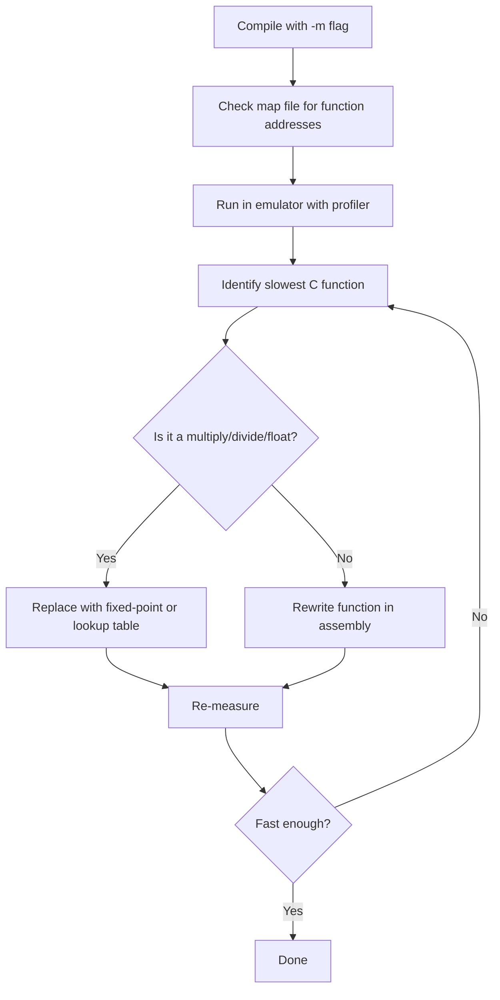

[← Plan](../../PLAN.md) · [Assembly](README.md)

# Mixed C and Assembly Programming — z88dk, SDCC, Calling Conventions, Project Structure

The 1990s wisdom was absolute: "C is too slow for the ZX Spectrum." That changed. The modern z88dk toolchain ships two production-quality C compilers — **sccz80** (z88dk's native compiler) and **zsdcc** (a Z80-targeting fork of SDCC) — backed by a hand-optimized assembly library called `newlib`. Code compiled with z88dk in 2024 routinely outperforms casually written assembly, because the library routines were profiled and tuned by people who count T-states for fun. The practical answer for modern Spectrum development is **mix**: C for structure, logic, and maintainability; assembly for hot loops, timing-critical routines, and direct hardware access.

This article is the sixth and final in the [Assembly series](README.md). It assumes you have read [assembly_intro.md](assembly_intro.md), [rom_calls.md](rom_calls.md), [stack_and_rst.md](stack_and_rst.md), [assembly_patterns.md](assembly_patterns.md), and [assembly_optimization.md](assembly_optimization.md). It does **not** duplicate the [z88dk toolchain reference](../../09_toolchain/z88dk.md) or the [SDCC reference](../../09_toolchain/sdcc.md) — those cover installation, configuration, and command-line options. This article covers the **interface between C and assembly**: calling conventions, data layout, project structure, and the decision of which language to use where.

> [!NOTE]
> If you are coming from desktop C development, the biggest mental shift is this: on the Z80, every C operation maps to concrete assembly instructions. There is no optimizer hiding behind abstractions. When you write `a = b * c;` in C, the compiler emits a call to a multiply subroutine that takes 400+ T-states. Knowing what the compiler generates is the difference between a playable game and a slideshow.

---

## Why Mix C and Assembly

Pure assembly gives maximum performance and full hardware control, but development is slow and maintenance is painful. Pure C gives rapid development and type safety, but certain operations are expensive on the Z80's 8-bit architecture. The mixed approach gets the best of both.

### The Tradeoff

| Factor | C | Assembly | Mixed |
|---|---|---|---|
| **Development speed** | Fast (structs, functions, loops) | Slow (manual everything) | Medium |
| **Performance** | Moderate (library routines are fast; generated code varies) | Maximum | High (asm in hot paths) |
| **Code clarity** | High (readable logic) | Low (register juggling) | High in C sections |
| **Maintainability** | High (type system, modularity) | Low (conventions only) | Medium-high |
| **Hardware access** | Via library calls or inline asm | Direct | Direct where needed |
| **Timing determinism** | Hard (compiler may reorder) | Exact (you write every cycle) | Per-section |
| **Binary size** | Moderate (newlib is compact) | Minimal (you control every byte) | Moderate |

### The 80/20 Rule

In a typical ZX Spectrum game:

| Component | % of CPU time | Language choice |
|---|---|---|
| Sprite rendering / pixel pushing | 40-60% | **Assembly** |
| Game logic (state machine, AI, collision) | 15-25% | C is usually fine |
| Input handling | 1-5% | C |
| Sound mixing | 10-20% | **Assembly** (timing-critical) |
| Level loading, menus, text display | 5-10% | C |
| Initialization, setup | <1% | C |

The hot 20% (sprite rendering, sound) accounts for 60-80% of CPU time. Writing that 20% in assembly and the rest in C gives near-peak performance with most of the productivity benefits of C.

### When Pure Assembly Is Still Right

| Scenario | Why asm |
|---|---|
| Demoscene productions (1K, 4K, 16K) | Binary size is the constraint; C's runtime overhead is too large |
| Timing-exact effects (raster splits, multicolor) | Cycle-precise instruction placement required |
| Interrupt service routines | The ISR must be minimal and deterministic |
| Learning Z80 internals | You need to understand the hardware |

### When Pure C Is Fine

| Scenario | Why C |
|---|---|
| Text adventures | Performance is irrelevant; logic complexity dominates |
| Board games, puzzle games | No real-time rendering; 50fps is easy |
| Utilities, tools | Correctness and features matter more than speed |
| Prototyping | Get the logic right first, optimize later |

---

## The Two Compilers

z88dk provides two C compilers. Both target the Z80 (and variants), both integrate with the same library and assembler, but they have different lineages, optimizations, and calling conventions.

### sccz80 — z88dk's Native Compiler

**sccz80** is z88dk's own compiler, derived from Small C and heavily extended over two decades. It is the default compiler when you run `zcc` without specifying `-compiler=sdcc`.

| Characteristic | Detail |
|---|---|
| **Lineage** | Small C → z88dk's sccz80 (continuous development since ~1998) |
| **Optimization** | Good peephole optimizer; generates compact code |
| **Calling convention** | Traditional stack-based (see below) |
| **Standard support** | C89 subset, with some C99 features |
| **Strengths** | Compact output, stable, well-integrated with z88dk library |
| **Weaknesses** | Less aggressive optimization than zsdcc for complex expressions |

### zsdcc — Z80-Targeting SDCC

**zsdcc** is z88dk's patched version of SDCC (Small Device C Compiler), retargeted for the Z80. It uses SDCC's more aggressive optimization passes but runs through z88dk's assembler and linker.

| Characteristic | Detail |
|---|---|
| **Lineage** | SDCC (open-source, cross-platform) → z88dk patch |
| **Optimization** | More aggressive loop optimization, better register allocation |
| **Calling convention** | SDCC's own convention (`__sdcccall(0)` by default) |
| **Standard support** | C89, partial C99 |
| **Strengths** | Better code for complex expressions, active SDCC development |
| **Weaknesses** | Slightly larger binaries in some cases; convention differs from sccz80 |

### Choosing Between Them

| Criterion | Use sccz80 | Use zsdcc |
|---|---|---|
| Smallest binary | Often | Sometimes |
| Fastest generated code | Usually no | Often yes |
| Compatibility with existing asm | sccz80 convention is simpler | SDCC convention is more complex |
| C99 features | More supported | Fewer |
| Default | Yes (`zcc` without `-compiler=`) | No (`-compiler=sdcc`) |

> [!TIP]
> For new projects, try both and benchmark. Compile your code with `zcc` (sccz80) and `zcc -compiler=sdcc` (zsdcc), compare binary size and frame time. The difference is often 10-20% and is not always in the same direction.

For full compiler installation and command-line details, see [z88dk.md](../../09_toolchain/z88dk.md) and [sdcc.md](../../09_toolchain/sdcc.md).

---

## Calling Conventions

The calling convention is the contract between caller and callee: how parameters are passed, how return values come back, and which registers are preserved. When mixing C and assembly, you must match the convention exactly — a mismatch produces silent data corruption that is agonizing to debug.

This section is the heart of mixed-language programming. If you read nothing else in this article, read this.

### sccz80 Classic Convention

**sccz80** (z88dk's default compiler) uses a stack-based calling convention:

| Aspect | Convention |
|---|---|
| **Parameter passing** | Parameters pushed right-to-left onto the stack |
| **Stack cleanup** | Caller cleans up (caller pops parameters after the call) |
| **Return value (8-bit)** | L register |
| **Return value (16-bit)** | HL register |
| **Return value (32-bit)** | DEHL (D=high, E, H, L=low) |
| **Preserved registers** | None guaranteed — assume all registers trashed |

#### Example: sccz80 Stack Layout

```c
/* C function: int add(int a, int b) */
int add(int a, int b)
{
    return a + b;
}
```

When sccz80 compiles a call to `add(10, 20)`:

```z80
; Caller's code for: result = add(10, 20);
        LD   HL, 20             ; rightmost parameter (b)
        PUSH HL
        LD   HL, 10             ; leftmost parameter (a)
        PUSH HL
        CALL _add               ; call the function
        POP  BC                 ; caller cleanup: pop param a
        POP  BC                 ; caller cleanup: pop param b
        LD   (result), HL       ; HL holds the return value
```

Inside `_add`, the function reads parameters from the stack:

```z80
_add:
        POP  HL                 ; save return address
        POP  DE                 ; DE = a (leftmost param)
        POP  BC                 ; BC = b (rightmost param)
        PUSH HL                 ; restore return address
        ; Now: DE = a, BC = b
        ; Compute a + b -> HL
        LD   H, B               ; HL = b
        LD   L, C
        ADD  HL, DE             ; HL = a + b
        RET
```

Note the stack dance: the function pops its own return address, reads parameters, then pushes the return address back. This is because sccz80's convention has the caller clean up — the parameters stay on the stack during the call.

### sccz80 `__FASTCALL__`

For functions with a **single parameter**, sccz80 offers `__FASTCALL__` (also written as `__FASTCALL`), which passes the parameter in registers instead of on the stack:

```c
int square(int x) __FASTCALL__;
```

| Aspect | Convention |
|---|---|
| **Parameter passing** | Single parameter in HL (16-bit) or L (8-bit) |
| **Stack cleanup** | No stack cleanup needed (nothing was pushed) |
| **Return value** | HL (16-bit) or L (8-bit) |
| **Saved T-states** | ~20T per call (no PUSH/POP pair) |

```z80
; Caller's code for: result = square(42);
        LD   HL, 42             ; parameter in HL
        CALL _square
        ; HL = return value

_square:
        ; HL = x
        ; Compute x * x -> HL (using a multiply routine)
        ; ... (simplified)
        RET                     ; no stack cleanup needed
```

`__FASTCALL__` is ideal for small, frequently-called functions where the PUSH/POP overhead of the stack convention would dominate.

### SDCC `__sdcccall(0)` — Default

**zsdcc** (z88dk's patched SDCC) uses a different convention by default:

| Aspect | Convention |
|---|---|
| **Parameter passing** | Parameters pushed left-to-right onto the stack |
| **Stack cleanup** | **Callee cleans up** (the function does `RET nn` or pops before RET) |
| **Return value (8-bit)** | L register |
| **Return value (16-bit)** | HL register |
| **Return value (32-bit)** | DEHL |
| **Preserved registers** | None guaranteed |

The key differences from sccz80:
1. **Parameter order is reversed**: leftmost parameter is pushed first (ends up highest on stack).
2. **Callee cleans up**: the called function adjusts SP before returning, not the caller.

#### Example: SDCC Stack Layout

```z80
; Caller's code for: result = add(10, 20);
        LD   HL, 10             ; leftmost parameter (a)
        PUSH HL
        LD   HL, 20             ; rightmost parameter (b)
        PUSH HL
        CALL _add               ; call the function
        ; No cleanup here — callee did it
        ; HL = return value

_add:
        ; Stack layout (after CALL):
        ;   (SP+0) = return address low
        ;   (SP+1) = return address high
        ;   (SP+2) = b low    (rightmost param, pushed last)
        ;   (SP+3) = b high
        ;   (SP+4) = a low    (leftmost param, pushed first)
        ;   (SP+5) = a high
        ;
        ; Read parameters via IX offset or direct stack access:
        PUSH IX
        LD   IX, 0
        ADD  IX, SP             ; IX = SP (before pushes)
        ; Now IX+4 = a, IX+2 = b
        LD   L, (IX+4)          ; L = a_low
        LD   H, (IX+5)          ; H = a_high
        LD   E, (IX+2)          ; E = b_low
        LD   D, (IX+3)          ; D = b_high
        ADD  HL, DE             ; HL = a + b
        ; Cleanup: pop IX, then RET with stack adjust
        POP  IX
        LD   A, 4               ; pop 2 params (4 bytes)
        ADD  A, L               ; (wrong - this is just showing the pattern)
        ; Actually, SDCC typically does:
        ; The callee pops parameters by adjusting SP:
        POP  BC                 ; save return address
        INC  SP                 ; pop param b (2 bytes)
        INC  SP
        INC  SP                 ; pop param a (2 bytes)
        INC  SP
        PUSH BC                 ; re-push return address
        RET
```

> [!WARNING]
> The SDCC callee-cleanup pattern is more complex than sccz80's caller-cleanup. When writing assembly functions for zsdcc, be careful with the stack adjustment. The safest approach is to let the compiler generate a wrapper.

### SDCC `__sdcccall(1)` — Register-Passed (Experimental)

SDCC's `__sdcccall(1)` convention passes parameters in registers for functions with 1-2 parameters:

| Parameter count | Registers used |
|---|---|
| 1 param (8-bit) | L |
| 1 param (16-bit) | HL |
| 2 params (8-bit each) | L, H |
| 2 params (8-bit + 16-bit) | L, DE |

This is faster than stack-based passing but is still experimental on Z80 as of z88dk's latest release. Enable it with `#pragma calling_convention sdcccall(1)` or the `-sdcccall=1` flag.

### The `__preserves_regs` Annotation

z88dk provides a non-standard extension to declare which registers an assembly function preserves:

```c
extern void set_border(unsigned char color) __preserves_regs(iy);
```

This tells the compiler that `set_border` does not trash `IY`. The compiler can then skip saving and restoring IY around the call. Without this annotation, the compiler assumes the function trashes all registers.

This is critical for functions that call into the ZX Spectrum ROM, because the ROM uses `IY` as a system register. If you call a ROM routine from C, you must either:
1. Save and restore IY inside your assembly function, or
2. Declare `__preserves_regs(iy)` and save IY in the C wrapper.

### Convention Comparison Summary

| Feature | sccz80 classic | sccz80 `__FASTCALL__` | zsdcc `__sdcccall(0)` | zsdcc `__sdcccall(1)` |
|---|---|---|---|---|
| **Param order** | Right-to-left | N/A (one param) | Left-to-right | N/A (in regs) |
| **Cleanup** | Caller | None | Callee | None |
| **Params on stack?** | Yes | No | Yes | No |
| **Single-param overhead** | ~20T (PUSH/CALL/POP×2) | 0T | ~17T (PUSH/CALL) | 0T |
| **Multi-param overhead** | ~10T per extra param | N/A | ~10T per extra param | N/A |
| **Best for** | Multi-param functions | Single-param functions | SDCC compatibility | Experimental fast path |

---

## C Calling Assembly

The most common mixed-language pattern: the main loop and game logic are in C, and specific performance-critical routines are written in assembly. The C code calls the assembly function as if it were a normal C function.

### The Three-Step Process

1. **Declare the function in C** with `extern` and the correct calling-convention decorators.
2. **Write the function in assembly** following the declared convention exactly.
3. **Compile and link** both sources together via `zcc`.

### Step 1 — C Declaration

For sccz80 (default), a simple declaration with matching convention:

```c
/* fast_fill: fills BC bytes at address HL with byte E */
extern void fast_fill(void *dest, unsigned int count, unsigned char value) __FASTCALL__;
```

Wait — `__FASTCALL__` only works for a single parameter. For multiple parameters, use the standard convention:

```c
/* For sccz80: standard convention, params pushed right-to-left, caller cleans up */
extern void fast_fill(void *dest, unsigned int count, unsigned char fill_byte);

/* For zsdcc: use the sdcc calling convention */
#pragma calling_convention sdcchole
extern void fast_fill(void *dest, unsigned int count, unsigned char fill_byte);
```

For single-parameter functions, `__FASTCALL__` is ideal:

```c
/* Single param via __FASTCALL__: value passed in HL */
extern unsigned char read_port(unsigned char port) __FASTCALL__;

/* Single 16-bit param via __FASTCALL__: address in HL */
extern void clear_screen_fast(void *screen_addr) __FASTCALL__;
```

### Step 2 — Assembly Implementation

Here is a complete example: a C-callable `memset_fast` that uses `LDIR` to fill memory. We write it for sccz80's standard convention (right-to-left, caller cleanup):

```z80
; ----------------------------------------------------------
; void memset_fast(void *dest, unsigned int count, unsigned char fill_byte)
; sccz80 convention: params pushed right-to-left
;   Stack (after CALL): return_addr, fill_byte, count_low, count_high, dest_low, dest_high
;   But since caller cleans up, the function reads params from stack.
; ----------------------------------------------------------

    SECTION code_user

    PUBLIC _memset_fast

_memset_fast:
    ; After CALL, stack has:
    ;   (SP+0) = return address low
    ;   (SP+1) = return address high
    ;   (SP+2) = fill_byte (pushed last = rightmost param)
    ;   (SP+4) = count (2 bytes, pushed second)
    ;   (SP+6) = dest (2 bytes, pushed first = leftmost param)
    ;
    ; sccz80 pushes right-to-left: fill_byte, count, dest
    ; So stack order is: dest, count, fill_byte, return_addr

    POP  HL                  ; HL = return address
    POP  AF                  ; A = fill_byte (rightmost, top of stack)
    POP  BC                  ; BC = count
    POP  DE                  ; DE = dest
    PUSH HL                  ; restore return address

    ; Now: A = fill_byte, BC = count, DE = dest
    LD   H, A                ; H = fill_byte (for fill)
    LD   L, A
    ; Wait — we need A in a form LDIR can use. LDIR copies (HL) to (DE).
    ; For fill, we need to store the byte directly. Use a different approach:
    ;
    ; Actually, memset is fill, not copy. We need to write the same byte
    ; to every location. The trick: write the first byte, then use LDIR
    ; to copy from dest to dest+1 (self-referential copy = fill).

    LD   (DE), A             ; write first byte
    DEC  BC                  ; count - 1 (first byte done)
    LD   H, D                ; HL = DE (source = dest)
    LD   L, E
    INC  DE                  ; DE = dest + 1
    LDIR                     ; fill remaining BC-1 bytes
    RET
```

This function takes roughly `16 × count` T-states for the `LDIR` portion — faster than any C loop the compiler could generate.

### Step 3 — Build Command

```bash
# Compile C + assembly together
zcc +zx -vn main.c memset_fast.asm -o game.bin -create-app
```

The `zcc` front-end handles compilation, assembly, and linking in one step. It recognizes `.asm` files and passes them to z88dk's assembler (`z80asm`).

### For zsdcc Convention

If you are using zsdcc (`-compiler=sdcc`), the assembly function must follow the callee-cleanup convention:

```z80
    PUBLIC _memset_fast

_memset_fast:
    ; zsdcc convention: params pushed left-to-right
    ;   Stack: return_addr, dest(2), count(2), fill_byte(1, padded to 2)
    ;   Actually zsdcc promotes all params to at least int (2 bytes)
    ;
    ; Use IX-relative addressing:
    PUSH IX
    LD   IX, 0
    ADD  IX, SP
    ; IX+4 = return address
    ; IX+2 = fill_byte (rightmost, pushed last)
    ; IX+0 = count (high byte), IX-2 = count (low byte)
    ; Actually layout depends on exact zsdcc version. Check the map file.

    LD   A, (IX+2)           ; fill_byte
    LD   E, (IX+0)           ; count low
    LD   D, (IX+1)           ; count high
    LD   L, (IX-2)           ; dest low
    LD   H, (IX-1)           ; dest high

    LD   (HL), A             ; write first byte
    DEC  DE
    PUSH HL
    POP  BC                  ; BC = dest
    INC  BC                  ; BC = dest + 1
    EX   DE, HL             ; DE = dest+1, HL = count
    ; ... (simplified for clarity — real code needs more care)

    POP  IX
    ; Callee cleanup: pop 6 bytes of params + return addr
    RET  6                   ; RET with stack adjustment (z80asm syntax)
```

> [!WARNING]
> The zsdcc convention is more complex due to callee cleanup. If you are writing assembly by hand for zsdcc, **test with a debugger** and verify the stack is balanced before and after each call. Use z88dk's [z80asm](../../09_toolchain/z88dk_z80asm.md) which supports the `RET nn` syntax for callee cleanup.

---

## Assembly Calling C

The reverse direction: your main loop is in assembly (for timing control), and it calls C functions for game logic, level loading, or text rendering.

### The Protocol

When assembly calls a C function:

1. **Push parameters** in the correct order (right-to-left for sccz80, left-to-right for zsdcc).
2. **CALL** the function (C functions have a leading underscore: `_my_func`).
3. **Clean up the stack** (for sccz80) — pop the parameters you pushed.
4. **Read the return value** from L (8-bit) or HL (16-bit).
5. **Save IY** if the C function might call into ROM.

### Worked Example

```c
/* score.c — compiled C function */
typedef struct {
    unsigned int score;
    unsigned char lives;
    unsigned char level;
} game_state_t;

void update_score(game_state_t *state, unsigned int points)
{
    state->score += points;
    if (state->score >= 1000 * state->level) {
        state->level++;
    }
}
```

Assembly caller (sccz80 convention):

```z80
    EXTERN _update_score     ; declare external C function

main_loop:
    ; ... game logic ...

    ; Call update_score(&game_state, 100)
    LD   HL, 100             ; rightmost param: points
    PUSH HL
    LD   HL, game_state      ; leftmost param: &state
    PUSH HL
    CALL _update_score
    POP  BC                  ; cleanup: pop &state
    POP  BC                  ; cleanup: pop points

    ; update_score returns void, so no return value to read
    ; Continue game loop...
    JR   main_loop

game_state:
    DEFW 0                   ; score
    DEFB 3                   ; lives
    DEFB 1                   ; level
```

### Critical: Save IY

The ZX Spectrum ROM uses `IY` as a system register (it points to system variables at `#5C3A`). If your C function calls any ROM routine, or if the compiler-generated code uses IY as a frame pointer (zsdcc does this), IY will be modified.

```z80
    ; Save IY before calling C functions
    PUSH IY

    LD   HL, 100
    PUSH HL
    LD   HL, game_state
    PUSH HL
    CALL _update_score
    POP  BC
    POP  BC

    POP  IY                 ; restore IY
```

If you forget to save IY and an interrupt fires (the IM1 ISR uses IY), your program will crash or corrupt system variables.

### When the C Function Returns a Value

```c
/* C function returning a value */
unsigned char get_input(void)
{
    return in_KeyDown(KEY_SPACE) ? 1 : 0;
}
```

```z80
    EXTERN _get_input

    CALL _get_input
    ; L = return value (0 or 1)
    LD   A, L
    AND  A
    JR   Z, .no_input
    ; ... handle input ...
.no_input:
```

---

## Inline Assembly

For very short snippets (1-5 instructions), inline assembly inside C code avoids the overhead of a function call. Use the `__asm` / `__endasm` keywords:

```c
void set_border_color(unsigned char color)
{
    color;   /* ensure color is evaluated (compiler may optimize otherwise) */
    __asm
        LD   A, L           ; L holds the parameter (sccz80 passes 8-bit in L)
        OUT  (#FE), A       ; write to ULA port
    __endasm;
}
```

### Register Access in Inline Assembly

Inline assembly has **no automatic register allocation**. You must know where the compiler puts variables:

| Compiler | 8-bit param location | 16-bit param location |
|---|---|---|
| sccz80 (standard) | Stack | Stack |
| sccz80 (`__FASTCALL__`) | L | HL |
| zsdcc (`__sdcccall(0)`) | Stack (via IX) | Stack (via IX) |
| zsdcc (`__sdcccall(1)`) | L or H | HL or DE |

### When to Use Inline vs External Assembly

| Situation | Recommendation |
|---|---|
| 1-3 instructions, no labels | Inline assembly |
| 4-10 instructions | Inline or external (your choice) |
| 10+ instructions | External `.asm` file |
| Needs labels or loops | External `.asm` file |
| Needs precise register control | External `.asm` file |
| Accessed from multiple C functions | External `.asm` file |

### Clobbering Warning

The compiler does **not** know which registers your inline assembly modifies. If you trash a register the compiler was using, you get silent corruption:

```c
int bad_function(int x)
{
    int y = x + 10;
    __asm
        LD   HL, #5000      ; TRASHES HL!
        LD   (#5C78), HL    ; overwrites FRAMES
    __endasm;
    return y + x;           /* y may be wrong — compiler had y in HL */
}
```

The fix: save and restore any register you touch:

```c
int safe_function(int x)
{
    int y = x + 10;
    __asm
        PUSH HL             ; save whatever HL held
        LD   HL, #5000
        LD   (#5C78), HL
        POP  HL             ; restore
    __endasm;
    return y + x;
}
```

> [!WARNING]
> Inline assembly is the most common source of mysterious bugs in mixed C/asm projects. If something works in isolation but breaks when you add more C code, suspect inline assembly clobbering. When in doubt, use an external assembly function with `__preserves_regs`.

---

## Shared Global Variables

C and assembly can share global variables. This is the simplest form of interop for data: declare a variable in C, access it from assembly by name, or vice versa.

### C Defines, Assembly Reads

```c
/* game.c */
unsigned int score = 0;
unsigned char player_lives = 3;
unsigned char current_level = 1;
```

```z80
; sprites.asm — access C globals
    EXTERN _score            ; underscore prefix required for C symbols
    EXTERN _player_lives
    EXTERN _current_level

award_bonus:
    LD   HL, (_score)        ; read the C global
    LD   DE, 100
    ADD  HL, DE
    LD   (_score), HL        ; write it back
    RET
```

The underscore prefix (`_score` for C's `score`) is a C convention: C compilers prepend an underscore to all global symbols to avoid collisions with assembly reserved words. Both sccz80 and zsdcc follow this convention.

### Assembly Defines, C Reads

```z80
; timer.asm — assembly defines a global
    PUBLIC _frame_counter

_frame_counter:
    DEFW 0                   ; 16-bit counter, incremented by ISR
```

```c
/* main.c */
extern unsigned int frame_counter;   /* links to _frame_counter */

void wait_frames(unsigned int n)
{
    unsigned int start = frame_counter;
    while (frame_counter - start < n) {
        /* wait */
    }
}
```

### Endianness and Layout

The Z80 is **little-endian**: the low byte is stored at the lower address. This matters when reading multi-byte C values from assembly:

```
C declaration:     unsigned int value = 0x1234;

Memory layout:     addr+0: 0x34   (low byte)
                   addr+1: 0x12   (high byte)

Assembly read:     LD   HL, (value)    ; H=0x12, L=0x34
                   ; Correct: HL = 0x1234
```

For C `struct`s, the layout is sequential, with padding rules:

```c
struct sprite {
    unsigned char x;       /* offset 0 */
    unsigned char y;       /* offset 1 */
    unsigned char *data;   /* offset 2-3 (pointer, 2 bytes) */
    unsigned char attr;    /* offset 4 */
};                        /* total: 5 bytes */
```

```z80
; Access sprite fields from assembly
; HL = pointer to sprite struct
    LD   A, (HL)           ; A = x (offset 0)
    INC  HL
    LD   A, (HL)           ; A = y (offset 1)
    INC  HL
    LD   E, (HL)           ; E = data low (offset 2)
    INC  HL
    LD   D, (HL)           ; D = data high (offset 3)
    INC  HL
    LD   A, (HL)           ; A = attr (offset 4)
```

> [!WARNING]
> zsdcc and sccz80 may pad structs differently. Check the compiler documentation or use `sizeof()` and inspect the map file. For maximum portability, use `#pragma pack(1)` or pack structs manually.

---

## Project Structure

A typical mixed C/asm project has this layout:

```
mygame/
+- src/
|   +- main.c              ; C entry point, game loop
|   +- game.c              ; game logic (state machine, AI)
|   +- levels.c            ; level data loading
|   +- input.c             ; keyboard reading (calls asm for port I/O)
|   +- sprites.asm         ; sprite rendering (hot path)
|   +- scroll.asm          ; screen scrolling (hot path)
|   +- sound.asm           ; beeper sound driver (timing-critical)
|   +- isr.asm             ; custom interrupt service routine
|   +- data/
|       +- sprites.bin     ; compiled sprite data
|       +- levels.bin      ; level maps
|       +- music.bin       ; music data
+- include/
|   +- game.h              ; shared declarations
|   +- sprites.h           ; extern declarations for asm functions
+- build/
|   +- (output files go here)
+- Makefile
```

### Linking C and Assembly Symbols

The linker resolves symbols across C and assembly files:

| Symbol type | C side | Assembly side |
|---|---|---|
| C function called from asm | `void func()` | `EXTERN _func` |
| Asm function called from C | `extern void func();` | `PUBLIC _func` |
| C global read from asm | `int var;` | `EXTERN _var` |
| Asm global read from C | `extern int var;` | `PUBLIC _var` |

### Header File for Assembly Functions

Create a header that declares every assembly function with the correct calling convention:

```c
/* sprites.h */
#ifndef SPRITES_H
#define SPRITES_H

/* Draw a single 8x8 sprite at (x, y) with given pattern */
extern void draw_sprite(unsigned char x, unsigned char y, void *pattern);

/* Draw all sprites from the sprite table (fast path) */
extern void draw_all_sprites(void *sprite_table, unsigned char count);

/* Clear the sprite area of the screen */
extern void clear_sprite_area(void *screen_addr) __FASTCALL__;

/* Read the keyboard matrix directly (faster than ROM) */
extern unsigned char read_keys(unsigned char row) __FASTCALL__;

#endif
```

This header is `#include`d by C files, and the corresponding `.asm` file uses `PUBLIC` to export the same symbols.

### Makefile Example

```makefile
# Makefile for mixed C/asm ZX Spectrum project

ZCC     = zcc
TARGET  = +zx
SOURCES = src/main.c src/game.c src/levels.c src/input.c \
          src/sprites.asm src/scroll.asm src/sound.asm src/isr.asm

CFLAGS  = -vn -O3 -clib=new
ASMFLAGS = -O3
LDFLAGS = -create-app -subtype=wav

OUTPUT  = build/mygame

all: $(OUTPUT).tap

$(OUTPUT).tap: $(SOURCES) include/*.h
	$(ZCC) $(TARGET) $(CFLAGS) $(SOURCES) -o $(OUTPUT).bin $(LDFLAGS)

# Alternative: zsdcc compiler
sdcc: $(SOURCES) include/*.h
	$(ZCC) $(TARGET) -compiler=sdcc -vn -O3 $(SOURCES) -o $(OUTPUT)_sdcc.bin $(LDFLAGS)

clean:
	rm -f build/*
```

---

## Build Pipeline with zcc

The `zcc` front-end is the single entry point for compilation. It handles C files, assembly files, linking, and output format conversion.

### Basic Commands

```bash
# Compile a mixed C/asm project to a .tap file (sccz80)
zcc +zx -vn -O3 -clib=new main.c sprites.asm -o game.bin -create-app

# Same project with zsdcc
zcc +zx -vn -O3 -clib=new -compiler=sdcc main.c sprites.asm -o game.bin -create-app

# Generate a .sna snapshot instead of .tap
zcc +zx -vn -O3 main.c sprites.asm -o game.bin -create-app -subtype=sna

# Output a binary at a specific address
zcc +zx -vn -O3 main.c -o game.bin -org=24064
```

### Key Flags

| Flag | Effect |
|---|---|
| `+zx` | Target: 48K ZX Spectrum |
| `+zx128` | Target: 128K ZX Spectrum |
| `-compiler=sdcc` | Use zsdcc instead of default sccz80 |
| `-clib=new` | Use newlib (recommended for all new projects) |
| `-O3` | Optimization level 3 (maximum) |
| `-vn` | Verbose names (shows what each stage does) |
| `-create-app` | Generate an application file (.tap/.sna) |
| `-subtype=wav` | Output a .wav file for tape loading |
| `-subtype=sna` | Output a .sna snapshot |
| `-org=NNNNN` | Place code at address NNNNN (decimal) |
| `-m` | Generate a map file (for debugging) |

### Map File

The `-m` flag generates a `.map` file listing every symbol and its address:

```
_main                          = #8000
_draw_sprite                   = #8234
_clear_sprite_area             = #8278
_score                         = #C000
_frame_counter                 = #C002
```

This is essential for debugging — it tells you exactly where each function and variable lives in memory. See [debugging.md](../../09_toolchain/debugging.md) for how to use the map file with emulators.

---

## Performance Patterns — What C Does Slowly

The Z80 is an 8-bit CPU. Some C operations that are trivial on modern CPUs are expensive here. Knowing which operations are slow helps you decide what to write in assembly.

### The Slow Operations Table

| C operation | Z80 cost | Why | Assembly alternative |
|---|---|---|---|
| `a * b` (8x8 multiply) | ~400T | Calls library `l_mul` | Shift-and-add (~200T), lookup table (~100T) |
| `a / b` (8-bit divide) | ~400T | Calls library `l_div` | Shift-subtract (~300T), reciprocal table |
| `a % b` (modulo) | ~400T | Same as divide, returns remainder | Reciprocal or subtraction loop |
| `a *= b` (16x16 multiply) | ~1,500T | Calls `l_long_mul` | Shift-and-add 16-bit (~800T) |
| `a / b` (16-bit divide) | ~1,500T | Calls `l_long_div` | Unrolled shift-subtract |
| Floating point (`float`) | 2,000-10,000T | Software FP emulation | Fixed-point arithmetic |
| Struct passed by value | 200T+ per field | Copies each field onto stack | Pass struct pointer (always) |
| Function pointer call | ~30T extra | PUSH addr + RET trick | Direct CALL |
| 32-bit arithmetic | 4x the 8-bit cost | Software 32-bit emulation | Use 16-bit where possible |
| Array bounds check | 10-20T per access | Compiler inserts CP/JP | Disable with compiler flag or asm |

### Fixed-Point Instead of Floating Point

Floating-point arithmetic on the Z80 is catastrophically slow. A single multiply can take 5,000+ T-states. The solution is **fixed-point**: represent fractional values as integers scaled by a power of 2.

```c
/* 8.8 fixed-point: 8 bits integer, 8 bits fraction */
typedef unsigned int fixed_t;    /* 16-bit: 8.8 format */

#define INT_TO_FIXED(x)  ((fixed_t)(x) << 8)
#define FIXED_TO_INT(x)  ((x) >> 8)
#define FIXED_MUL(a, b)  ((fixed_t)((long)(a) * (long)(b) >> 8))

/* Example: sine lookup in fixed point */
static const fixed_t sin_table[64] = {
    /* pre-computed sin(0..63 * 360/64 degrees) in 8.8 format */
};

fixed_t get_sin(unsigned char angle)
{
    return sin_table[angle & 0x3F];  /* 64-entry table */
}
```

The `FIXED_MUL` macro uses a 16x16 multiply (which is still ~1,500T), but that is 3x faster than a floating-point multiply. For many game applications, lookup tables avoid even the multiply.

### Struct Pointers, Not Struct Values

```c
/* BAD: struct passed by value — copies 5 bytes onto stack */
void update_sprite_bad(struct sprite s)
{
    s.x += 1;
}

/* GOOD: struct passed by pointer — only 2 bytes (pointer) */
void update_sprite_good(struct sprite *s)
{
    s->x += 1;
}
```

The pointer version is faster in **every case** — fewer bytes pushed, no copy overhead, and the function can modify the original struct.

### Profiling a C Hot Loop

The workflow for optimizing a C loop:



---

## When to Use C vs Assembly — Decision Matrix

| Code type | Performance requirement | Recommendation |
|---|---|---|
| Sprite rendering | 50fps required | **Assembly** |
| Screen scrolling | 50fps required | **Assembly** |
| Sound driver | Timing-critical | **Assembly** |
| Interrupt service routine | Minimal latency | **Assembly** |
| Game state machine | 50fps, but per-frame cost is low | C is fine |
| AI / pathfinding | Moderate | C, optimize if profiler flags it |
| Collision detection | Moderate | C, use asm for pixel-perfect checks |
| Level loading | One-time cost | C |
| Menu / text display | Low | C |
| Math (multiply, divide) | Hot path | **Assembly** or lookup table |
| Input reading | Low | C or inline asm |
| Initialization | One-time | C |
| Data decompression | Could be hot | Benchmark, then decide |

### The Pragmatic Rule

> If the profiler says a function is less than 5% of frame time, leave it in C. If it is more than 15%, rewrite in assembly. Between 5% and 15%, try C-level optimizations first (lookup tables, algorithmic changes), then rewrite in assembly only if those are insufficient.

---

## Library Interop — z88dk's Hand-Optimized Routines

z88dk's `newlib` contains assembly routines that are faster than what most programmers would write by hand. Instead of reinventing these, call them from your code.

### Key Library Functions

| C function | Assembly routine | T-states | Notes |
|---|---|---|---|
| `memcpy(dest, src, n)` | `l_memcpy` / `l_ldir` | 16T/byte | Uses LDIR |
| `memset(dest, val, n)` | `l_memset` | ~16T/byte | LDIR-based fill |
| `strlen(s)` | `l_strlen` | ~13T/byte | Scans for null terminator |
| `strcpy(dest, src)` | `l_strcpy` | ~16T/byte | LDIR until null |
| `memcmp(a, b, n)` | `l_memcmp` | ~20T/byte | Byte-by-byte compare |
| Multiply (`a * b`) | `l_mul` | ~416T | Standard 8x8 multiply |
| Divide (`a / b`) | `l_div` | ~400T | Standard 8-bit divide |

### Calling Library Routines from Assembly

```z80
    ; Call l_memcpy directly from assembly
    ; Prototype: void *memcpy(void *dest, const void *src, size_t n)
    ; sccz80 convention: push right-to-left

    LD   HL, 256              ; n = 256 bytes
    PUSH HL
    LD   HL, source_addr
    PUSH HL
    LD   HL, dest_addr
    PUSH HL
    CALL _memcpy             ; z88dk library function
    POP  BC                  ; cleanup
    POP  BC
    POP  BC
```

> [!TIP]
> Always benchmark library routines against your hand-written alternative. z88dk's library routines are highly optimized, but they are general-purpose. For a specific case (e.g., always copying exactly 256 bytes), a custom unrolled loop may be faster.

---

## Worked Multi-File Project

Here is a complete, minimal mixed C/asm project that demonstrates all the patterns in this article: C main loop, assembly sprite drawing, shared global variables, and proper calling conventions.

### File 1 — `include/game.h`

```c
#ifndef GAME_H
#define GAME_H

/* Shared game state */
typedef struct {
    unsigned char x;
    unsigned char y;
    unsigned char pattern_id;
    unsigned char active;
} sprite_t;

/* Global game state */
extern sprite_t sprites[16];
extern unsigned char sprite_count;
extern unsigned int frame_counter;

/* Assembly functions */
extern void draw_all_sprites(void);
extern void clear_screen_fast(void *addr) __FASTCALL__;
extern void setup_isr(void);

/* C functions */
void game_init(void);
void game_update(void);
unsigned char read_input(void);

#endif
```

### File 2 — `src/main.c`

```c
#include <arch/zx.h>
#include <intrinsic.h>
#include "game.h"

sprite_t sprites[16];
unsigned char sprite_count = 0;
unsigned int frame_counter = 0;

int main(void)
{
    intrinsic_di();          /* disable interrupts during setup */
    setup_isr();             /* install custom ISR (assembly) */
    intrinsic_ei();          /* re-enable interrupts */

    game_init();             /* C: initialize game state */

    while (1) {
        intrinsic_halt();    /* wait for vertical blank (50fps) */

        unsigned char input = read_input();
        game_update();       /* C: update game logic */

        clear_screen_fast((void *)0x4000);  /* asm: fast clear */
        draw_all_sprites();                 /* asm: render sprites */
    }
    return 0;
}

void game_init(void)
{
    sprites[0].x = 128;
    sprites[0].y = 88;
    sprites[0].pattern_id = 0;
    sprites[0].active = 1;
    sprite_count = 1;
}

void game_update(void)
{
    /* Simple movement */
    sprites[0].x++;
    if (sprites[0].x > 240) {
        sprites[0].x = 16;
    }
}

unsigned char read_input(void)
{
    /* Use z88dk's input library */
    return in_KeyPressed(IN_KEY_SCANCODE_SPACE) ? 1 : 0;
}
```

### File 3 — `src/sprites.asm`

```z80
; sprites.asm — sprite rendering in assembly
; Uses sccz80 calling convention

    SECTION code_user
    PUBLIC _draw_all_sprites
    PUBLIC _clear_sprite_area

    EXTERN _sprites           ; C global: sprite_t sprites[16]
    EXTERN _sprite_count      ; C global: unsigned char sprite_count

; void clear_screen_fast(void *addr) __FASTCALL__
; HL = screen address
_clear_sprite_area:
    LD   (HL), 0             ; clear first byte
    LD   D, H                ; DE = HL
    LD   E, L
    INC  DE                  ; DE = HL+1
    LD   BC, 6143            ; screen size - 1
    LDIR                     ; fill entire screen with zeros
    RET

; void draw_all_sprites(void)
; Reads the C sprite table and draws each active sprite
_draw_all_sprites:
    PUSH IX                  ; save IX (zsdcc uses it)
    PUSH IY                  ; save IY (ROM uses it)

    LD   IX, _sprites        ; IX = base of sprite table
    LD   B, (IX + 0)         ; B = sprite_count
    ; Wait — sprite_count is a separate global, not in the struct.
    ; Let's use a direct memory read:
    LD   A, (_sprite_count)
    LD   B, A
    LD   IY, _sprites        ; IY = base of sprite table

.draw_loop:
    ; Check if sprite is active (offset 3 in struct)
    LD   A, (IY + 3)         ; active flag
    AND  A
    JR   Z, .next_sprite

    ; Get X, Y (offsets 0, 1)
    LD   A, (IY + 0)         ; x
    LD   C, (IY + 1)         ; y
    ; ... pixel address calculation (simplified) ...
    ; ... draw 8x8 sprite bytes ...

.next_sprite:
    LD   DE, 4               ; sizeof(sprite_t) = 4 bytes
    ADD  IY, DE              ; advance to next sprite
    DJNZ .draw_loop

    POP  IY                  ; restore IY
    POP  IX                  ; restore IX
    RET
```

### File 4 — `src/isr.asm`

```z80
; isr.asm — custom interrupt service routine
; Increments frame_counter and returns

    SECTION code_user
    PUBLIC _setup_isr
    EXTERN _frame_counter

    ; The ISR address for IM1 is #0038 (in ROM)
    ; To install a custom ISR, we point the mode 2 vector or
    ; replace the ROM ISR. For simplicity, we use IM1 and
    ; hook into the ROM's ISR via system variables.

_setup_isr:
    DI
    ; Point ERR_SP or use a different technique
    ; For this example, we set IM2
    LD   A, #FE              ; interrupt vector table at #FE00
    LD   I, A
    IM   2
    ; Set vector table entry
    LD   HL, #FE00
    LD   (HL), # isr_entry   ; low byte
    INC  HL
    LD   (HL), # isr_entry >> 8  ; high byte
    EI
    RET

isr_entry:
    PUSH AF
    PUSH HL
    LD   HL, (_frame_counter)
    INC  HL
    LD   (_frame_counter), HL
    POP  HL
    POP  AF
    EI
    RETI
```

### Build Command

```bash
zcc +zx -vn -O3 -clib=new \
    src/main.c src/sprites.asm src/isr.asm \
    -Iinclude \
    -o build/game.bin \
    -create-app -subtype=tap
```

This produces `build/game.tap`, loadable in any ZX Spectrum emulator.

---

## Pitfalls

### 1 — Wrong Calling Convention = Silent Corruption

Mixing sccz80 and zsdcc conventions without specifying which to use is the most common source of data corruption. If the C code uses sccz80 (caller cleanup) and the assembly function assumes zsdcc (callee cleanup), the stack becomes unbalanced and the program crashes or returns garbage.

**Fix**: Always specify the convention explicitly in the C declaration. Use `#pragma calling_convention` or function-level attributes. Verify with the map file.

### 2 — Forgetting to Save IY

The ZX Spectrum ROM ISR uses IY. If your C function or assembly routine trashes IY and an interrupt fires, the ISR reads garbage system variables.

**Fix**: Save and restore IY in any function that modifies it:
```z80
    PUSH IY
    ; ... function body ...
    POP  IY
```

Or declare the function with `__preserves_regs(iy)` and ensure the compiler handles it.

### 3 — Missing `__critical` Around ISR-Shared State

If the main loop reads a variable that the ISR modifies, the read can be non-atomic (16-bit values require two byte reads). The ISR can fire between the two reads, corrupting the value.

```c
/* BAD: non-atomic read of 16-bit ISR-modified variable */
extern unsigned int frame_counter;
unsigned int current = frame_counter;  /* two byte reads, ISR can fire between */

/* GOOD: wrap in __critical to disable interrupts */
unsigned int current;
__critical {
    current = frame_counter;  /* interrupts disabled during read */
}
```

### 4 — Compiler Optimizations Breaking Assembly Assumptions

At `-O3`, the compiler may inline functions, reorder code, or eliminate variables. If your inline assembly assumes a specific variable is at a specific stack offset, the optimizer can break it.

**Fix**: Never rely on stack layout in inline assembly. Use `__FASTCALL__` (parameter in HL) or an external assembly function. If you must use inline assembly, compile with `-O0` for that file.

### 5 — Struct Padding Differences

sccz80 and zsdcc may pad structs differently. A struct that is 5 bytes in sccz80 might be 6 bytes in zsdcc (due to alignment).

**Fix**: Use `#pragma pack(1)` to force byte alignment, or always use `sizeof()` and never hard-code struct sizes in assembly.

### 6 — Unsigned vs Signed Mismatch

C's `char` may be signed or unsigned depending on the compiler. If your assembly assumes unsigned bytes but C passes a signed value, comparisons and arithmetic will be wrong.

**Fix**: Always use `unsigned char` explicitly in C declarations for interop with assembly.

---

## Cross-References

- **[assembly_intro.md](assembly_intro.md)** — first article; toolchain setup that applies to C+asm projects
- **[rom_calls.md](rom_calls.md)** — calling ROM routines; relevant when C code needs ROM services
- **[stack_and_rst.md](stack_and_rst.md)** — calling conventions from the assembly perspective
- **[assembly_patterns.md](assembly_patterns.md)** — dispatch tables, state machines usable from C
- **[assembly_optimization.md](assembly_optimization.md)** — T-state budgeting for mixed projects
- **[z88dk.md](../../09_toolchain/z88dk.md)** — full z88dk toolchain reference (installation, configuration)
- **[sdcc.md](../../09_toolchain/sdcc.md)** — SDCC compiler reference
- **[z88dk_z80asm.md](../../09_toolchain/z88dk_z80asm.md)** — z80asm assembler (used by z88dk)
- **[vscode_integration.md](../../09_toolchain/vscode_integration.md)** — IDE setup for C+asm development
- **[debugging.md](../../09_toolchain/debugging.md)** — debugging mixed C/asm with emulators

## References

- [z88dk Wiki — Calling Conventions](https://www.z88dk.org/wiki/doku.php?id=temp:ports:epzx) — definitive reference for sccz80 and zsdcc conventions
- [z88dk Wiki — newlib](https://www.z88dk.org/wiki/doku.php?id=library:newlib) — hand-optimized library documentation
- [SDCC Manual — Z80 Port](https://sdcc.sourceforge.net/doc/sdccman.pdf) — official SDCC Z80 documentation
- [chibiakumas.com — C on Z80](https://www.chibiakumas.com/z80/) — modern C+asm tutorials
- *ZX Spectrum Next Programming* — mixed-language patterns for Next hardware
- [z88dk](https://github.com/z88dk/z88dk) GitHub repository — example projects in `examples/` directory
