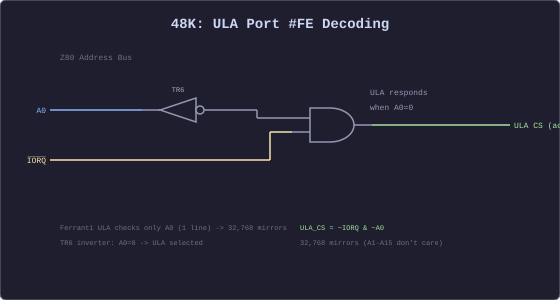
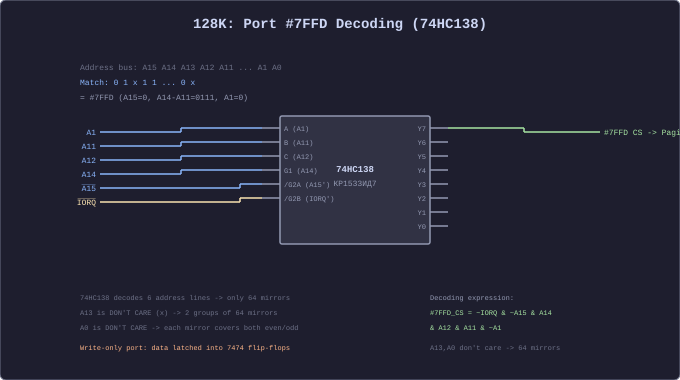
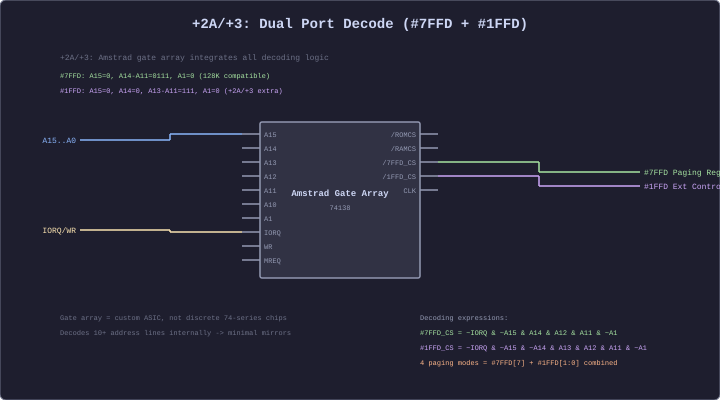

[← Home](../../README.md) · [Memory & I/O](README.md)

# I/O Port Decoding — How the Spectrum Address Bus Really Works

The Z80 has a separate **16-bit I/O address space** accessed via `IN` and `OUT` instructions (distinct from the 64 KB memory space). On the ZX Spectrum, the hardware uses **partial address decoding** — only a few address lines are actually checked by each peripheral. This means a single physical port appears at **thousands of addresses**, and different peripherals can accidentally overlap if their decoding masks conflict.

> [!NOTE]
> This article covers the **concept of I/O port decoding** — how it works, why it matters, and how to read decoding masks. It also includes **schematic diagrams** (74-series / Soviet chip equivalents) and **Verilog behavioral equivalents** for each model's decoding circuit. For the actual ports on each machine, see the model-specific articles: [memory_and_io_48k.md](memory_and_io_48k.md), [memory_and_io_128k.md](memory_and_io_128k.md), [memory_and_io_plus3.md](memory_and_io_plus3.md), [memory_and_io_pentagon.md](memory_and_io_pentagon.md), [memory_and_io_next.md](memory_and_io_next.md).

---

## How OUT and IN Place Addresses on the Bus

When the Z80 executes I/O instructions, the address bus carries the port number:

```
OUT (n), A:    A0–A7 = n (immediate operand), A8–A15 = A (accumulator)
OUT (C), r:    A0–A7 = C, A8–A15 = B
IN A, (n):     A0–A7 = n, A8–A15 = A (accumulator)
IN r, (C):     A0–A7 = C, A8–A15 = B
```

The hardware does **not** decode all 16 address lines. Each peripheral checks only the lines it cares about — this is partial address decoding.

---

## Partial Decoding by Example

```
Example: OUT (#FE), A
  Address bus:  A15–A8 = #FF (accumulator, don't care for ULA)
                A7–A0  = #FE = 11111110

  ULA checks:   A0 = 0 (only one line!)
                All other lines are DON'T CARE

  ULA responds to ANY address where A0 = 0:
    #FE, #FC, #FA, #F8, #F6, #F4, ... #00, #02, #04, ...
    That's 32,768 addresses — half the entire I/O space!
```

The **more lines a peripheral checks**, the **fewer addresses** it mirrors to — and the less chance of conflict with other peripherals.

---

## Decoding Masks

Each peripheral can be described by a **decoding bitmask**: which address bits it checks and what values it expects:

```
Port #FE (ULA):
  Mask:   _______0    (only A0 is checked)
  Match:  xxxxxxx0    (A0 must be 0)
  Mirrors: 32,768 addresses

Port #1F (Kempston joystick):
  Mask:   _____xxxx   (A0–A3 checked, A4 varies by implementation)
  Match:  xxxx_11111  (low bits = #1F)
  Mirrors: 2,048–65,536 (depends on implementation quality)

Port #7FFD (128K paging):
  Mask:   _______0 1111_110_  (A15=0, A14–A11=#7, A1=0 — checks 6 lines)
  Match:  xxxxxxxx 0111_110x
  Mirrors: 64 addresses

Port #FFFD (AY register select):
  Mask:   ________ _______1   (A0=1)
  Match:  xxxxxxxx xxxxxxx1
  Mirrors: 32,768 addresses

Port #BFFD (AY register data):
  Mask:   ________ _____x_1   (A1=1, A0=1)
  Match:  xxxxxxxx xxxxxx11
  Mirrors: 16,384 addresses
```

---

## Why Partial Decoding Matters

### Port Mirrors

Every mirror address works identically to the canonical one:

```z80
; These are ALL the same port on the hardware:
OUT (#FE), A     ; Canonical
OUT (#FC), A     ; Mirror (A0 still 0)
OUT (#FA), A     ; Mirror
OUT (#00), A     ; Mirror
OUT (#7FFE), A   ; Mirror (A0=0, A8–A15 don't matter)
```

> [!IMPORTANT]
> Always use the **canonical address** (e.g., `OUT (#FE), A`, not `OUT (#FC), A`). The ROM always uses canonical addresses, and some peripherals may decode more lines on certain machines.

### Port Conflicts

Because peripherals share the I/O space with minimal decoding, some ports **overlap**:

```
#FE (ULA, A0=0):     32,768 mirrors → overlaps with almost everything
#7FFD (paging):        64 mirrors → relatively well-decoded
#FFFD/#BFFD (AY):   32K/16K mirrors → can conflict with other A0/A1 devices
#1F (Kempston):     varies widely → cheap interfaces may conflict with #FE
#1FFD (Beta 128):     depends on clone → may conflict with +3 #1FFD
```

The classic conflict: **writing to `#7FFD` (paging) also writes to the ULA port `#FE`** on some machines, because `#7FFD` has A0=1 (not 0), so there is no overlap. But `#7FFC` (a mirror of `#7FFD` with A0=0) would hit the ULA too — this is why you must use the canonical address.

### Cross-Model Differences

The same port number can decode differently on different machines:

| Port | 48K | 128K/+2 | +2A/+3 | Pentagon |
|------|-----|---------|--------|----------|
| `#FE` | ULA (border/EAR/keyboard) | Same | Same | Same |
| `#7FFD` | Not present | Paging (bank/ROM/screen) | Same + lock bit | Same + EFF7 extension |
| `#1FFD` | Not present | Not present | Extended paging + disk | Beta 128 FDC (different!) |
| `#FFFD`/`#BFFD` | Not present (no AY) | AY register select/data | Same | Same |
| `#1F` | Kempston (if interface) | Same | Same | Built-in |
| `#EFF7` | Not present | Not present | Not present | Extended memory (512K+) |

> [!WARNING]
> Port `#1FFD` on the +2A/+3 controls **paging and disk motor**, but on the Pentagon/Scorpion it controls the **Beta 128 FDC** — completely different function, same port number. Software must detect the machine before using model-specific ports.

---

## Schematic Perspective — How Hardware Decodes Ports

Every I/O port access on the Z80 follows the same physical sequence:

```
Z80 CPU                        Decoding Logic                  Peripheral
────────                       ───────────────                 ──────────
IORQ ────────────────────────── AND gate ──── CS (chip select) ──── ULA / AY / RAM
RD / WR ────────────────╱─────╱
Address bus (A15..A0) ──╱─ Decoder (gates / comparator / custom ASIC)
```

The Z80 places the port address on A15–A0, then asserts `IORQ` (active low). The decoding logic checks specific address lines and, if they match, asserts the peripheral's chip-select (`CS`) line. If `RD` is low, the peripheral drives the data bus; if `WR` is low, the peripheral latches the data bus.

On real hardware this decoding is built from:

- **Discrete gates** — NOT, AND, NAND, OR, NOR (74HC00 series or Soviet KR1533 series)
- **Decoder chips** — 74HC138 (3-to-8 decoder) for multi-line address matching
- **Comparators** — 74HC688 (8-bit identity comparator) for exact port matching
- **Custom ASICs** — Ferranti ULA (48K), Amstrad gate array (+2A/+3), EPLD (Scorpion)
- **FPGAs** — ZX Spectrum Next, MiSTer core — behavioral Verilog

The **number of address lines checked** directly determines how many mirror addresses exist:

```
Lines checked   Mirror count   Example
─────────────   ────────────   ──────────────────
1               32,768         ULA #FE (A0 only)
3               8,192          Kempston #1F (A0-A2)
6               64             128K #7FFD (6 lines via 74138)
8+              2-4            Pentagon #EFF7 (74688 comparator)
16              1              Full decode (FPGA only)
```

---

## Model-Specific Decoding Circuits

### 48K: ULA Port #FE — Single-Line Decode



The original Sinclair 48K uses the Ferranti ULA custom chip. Its port decoding is the simplest possible: transistor **TR6** inverts address line **A0**. When A0 is low (and `IORQ` is asserted), the ULA is selected.

Only **1 address line** is checked, giving **32,768 mirror addresses** — any address with A0=0 activates the ULA. This is why `OUT (#FE), A` and `OUT (#00), A` produce identical results.

```verilog
// 48K ULA port decode (Verilog behavioral equivalent)
assign ula_cs = ~iorq & ~a0;           // A0=0 selects ULA
assign ula_wr = ula_cs & ~wr;           // write: border/beeper/mic
assign ula_rd = ula_cs & ~rd;           // read:  keyboard/ear
```

> Full details: [memory_and_io_48k.md](memory_and_io_48k.md)

### 128K: Port #7FFD — 74HC138 Decoder



The 128K Toastrack (and Grey +2) use a **74HC138** 3-to-8 decoder (Soviet equivalent: **KR1533ID7**) to decode the paging port. Six address lines are checked:

```
74HC138 inputs:    A (A1)    B (A11)    C (A12)    G1 (A14)    /G2A (A15')    /G2B (IORQ')
Match for Y7:      0         1          1          1            0               0
= A15=0, A14=1, A12=1, A11=1, A1=0, IORQ asserted
= port address %0111_1111_1111_110x = #7FFD (with A0 as don't-care)
```

The 74138's **Y7 output** goes active-low when all inputs match, selecting the paging register. This gives only **64 mirror addresses** (A0 and A13 are don't-care).

```verilog
// 128K port #7FFD decode (Verilog behavioral equivalent)
wire [2:0] dec_input = {a12, a11, a1};     // C, B, A
assign port_7ffd_cs = ~iorq                 // IORQ asserted
                    & ~a15                  // A15 = 0
                    & a14                   // A14 = 1 (enable G1)
                    & (dec_input == 3'b110); // C=1,B=1,A=0 -> Y7

// Data latched on write (7474 flip-flops / KR1533TM2)
reg [7:0] paging_reg;
always @(posedge clk)
    if (port_7ffd_cs & ~wr)
        paging_reg <= cpu_data;
```

> Full details: [memory_and_io_128k.md](memory_and_io_128k.md)

### +2A/+3: Dual Port Decode — Gate Array ASIC



The Amstrad +2A and +3 use a **custom gate array** (not discrete 74-series chips) that integrates all address decoding, memory management, and timing into a single ASIC. It decodes **two paging ports** simultaneously:

- **#7FFD** — compatible with the 128K paging register (same bit layout)
- **#1FFD** — extended control: 4 paging modes, disk motor, ROM bank selection

The gate array checks **10+ address lines** internally, giving very few mirrors. The combined 7FFD+1FFD bits select one of 4 paging modes (compatible, RAM at #0000, full remap, flexible remap).

```verilog
// +2A/+3 dual port decode (Verilog behavioral equivalent)
assign port_7ffd_cs = ~iorq & ~a15 & a14 & a13 & a12 & a11 & ~a1;
assign port_1ffd_cs = ~iorq & ~a15 & ~a14 & a13 & a12 & a11 & ~a1;

reg [7:0] reg_7ffd, reg_1ffd;
always @(posedge clk) begin
    if (port_7ffd_cs & ~wr) reg_7ffd <= cpu_data;
    if (port_1ffd_cs & ~wr) reg_1ffd <= cpu_data;
end

// Paging mode from combined register bits
wire [1:0] paging_mode = {reg_1ffd[0], reg_7ffd[5]};
```

> Full details: [memory_and_io_plus3.md](memory_and_io_plus3.md)

### Pentagon: #7FFD + #EFF7 — Two-Stage Extended Decoding


The Pentagon uses **two separate decoding circuits** to support extended memory (512K and 1024K):

1. **74HC138** (KR1533ID7) — decodes **#7FFD** identically to the 128K (6 lines, 64 mirrors)
2. **74HC688** (KR1533SP1) — 8-bit **identity comparator** decodes **#EFF7** with an exact match

The 74688 compares 8 address lines (P inputs) against hardwired Q inputs (tied to Vcc/GND to match the pattern #EFF7 = `1110_1111_1111_0111`). When all 8 lines match and `IORQ` is asserted, the output goes low, selecting the extended memory register.

Because **8 lines are checked**, #EFF7 has essentially **one unique address** — no mirrors. This allows clean extended paging without aliasing issues.

```verilog
// Pentagon two-stage decode (Verilog behavioral equivalent)
// Stage 1: standard #7FFD (same as 128K)
assign port_7ffd_cs = ~iorq & ~a15 & a14 & a13 & a12 & a11 & ~a1;

// Stage 2: exact match #EFF7 via comparator
wire [7:0] cmp_p = {1'b1, a15, a12, a11, a10, a9, a5, a0};
wire [7:0] cmp_q = 8'b1111_0111;  // hardwired jumper pattern
assign port_eff7_cs = ~iorq & (cmp_p == cmp_q);

// Extended bank register
reg [7:0] ext_bank_reg;
always @(posedge clk)
    if (port_eff7_cs & ~wr)
        ext_bank_reg <= cpu_data;
```

> Full details: [memory_and_io_pentagon.md](memory_and_io_pentagon.md)

### Scorpion: EPLD-Based Programmable Decode

The Scorpion uses an **EPLD** (Electrically Programmable Logic Device) instead of discrete gates. This allows the entire port decoding map to be defined in a single programmable chip, supporting:

- Standard #7FFD paging (128K compatible)
- Extended memory ports
- SMUC ISA bus controller ports
- On-board peripheral select (8255, FDC, RTC)

The EPLD is functionally equivalent to a large PAL/GAL — the decode logic is defined by a fuse map rather than physical wires.

```verilog
// Scorpion EPLD decode (Verilog behavioral equivalent)
assign port_7ffd_cs = ~iorq & (addr & 16'h8002 == 16'h0000) & (addr & 16'h7800 == 16'h7000);
assign port_eff7_cs = ~iorq & (addr == 16'hEFF7);  // exact match
assign smuc_cs      = ~iorq & (addr[7:0] == 8'hBE) & addr[15];
```

### ZX Spectrum Next: FPGA MMU

The Next implements all port decoding in an **FPGA** with a full 16-bit decode. In its native mode, the Next has an 8-slot **MMU** (Memory Management Unit) where each slot maps to an 8 KB page from a 2 MB address space. The MMU is programmed via ports `#50`–`#57`.

```verilog
// ZX Spectrum Next MMU (Verilog behavioral equivalent)
reg [7:0] mmu_slot [0:7];   // 8 MMU slots, each maps to an 8KB page

assign port_50_57_cs = ~iorq & (addr[15:8] == 8'h00) &
                       (addr[7:3] == 5'b01010);  // #50-#57

integer i;
always @(posedge clk)
    if (port_50_57_cs & ~wr)
        mmu_slot[addr[2:0]] <= cpu_data;

// Translate CPU address to physical RAM address
wire [7:0]  slot_page = mmu_slot[cpu_addr[15:13]];
wire [20:0] phys_addr = {slot_page, cpu_addr[12:0]};
```

> Full details: [memory_and_io_next.md](memory_and_io_next.md)

---

## FPGA Perspective — Verilog Equivalents

Port decoding in hardware directly maps to common Verilog patterns. Here are the five fundamental patterns used across all Spectrum models:

### Pattern 1: Simple Bit Check

The simplest decode — check one address line. Used by ULA #FE on the 48K.

```verilog
assign ula_cs = ~iorq & ~a0;  // A0 = 0 -> ULA selected
```

### Pattern 2: Masked Decode

Check specific bits using a bitmask. Used by #7FFD on 128K machines.

```verilog
// Port #7FFD: check 6 bits, don't-care about the rest
assign port_7ffd_cs = ~iorq & ((addr & 16'hF802) == 16'h7000);
// Mask:  1111_1000_0000_0010 (check A15,A14-A11,A1)
// Match: 0111_0000_0000_0000 (A15=0, A14-A11=0111, A1=0)
```

### Pattern 3: Comparator-Based Exact Match

Use an equality check for the full address. Used by Pentagon #EFF7.

```verilog
// Port #EFF7: exact 16-bit match
assign port_eff7_cs = ~iorq & (addr == 16'hEFF7);
// Only 1 address decodes -> no mirrors
```

### Pattern 4: Registered Output (Latching)

Most write-only ports latch the data bus value into a register when written:

```verilog
reg [7:0] paging_reg;

always @(posedge clk) begin
    if (port_cs & ~wr)
        paging_reg <= cpu_data;
end
```

On real hardware, this is implemented with **7474 dual D-type flip-flops** (KR1533TM2) — one chip per 2 bits, so 4 chips for an 8-bit register.

### Pattern 5: Priority Encoding

When multiple peripherals may respond to the same address (due to partial decoding), priority logic resolves the conflict:

```verilog
// Priority: later assignments override earlier ones
wire ula_cs   = ~iorq & ~a0;              // 32K mirrors (very broad)
wire ay_cs    = ~iorq & ~a1 & a0;         // AY register select
wire ram_cs   = ~iorq & (addr == 16'h7FFD) & ~wr;  // exact match

// On 128K: #FFFD hits BOTH ULA (A0=1? No, A0=1 -> ULA NOT selected)
// and AY. Clean separation because A0=1 excludes ULA.
```

```
Port    Decoding       Direction   Function                        Models
──────────────────────────────────────────────────────────────────────────────
#FE     A0=0           R/W         ULA: border, EAR, keyboard      All
#1F     A5–A0=011111   R           Kempston joystick               All (if present)
#7FFD   6 lines        W           RAM bank, ROM, screen, lock     128K+
#1FFD   varies         W           +3: paging/disk; Clone: FDC     +2A/+3, clones
#FFFD   A1=0,A0=1      R/W         AY register select              128K+
#BFFD   A1=1,A0=1      W           AY register data                128K+
#EFF7   varies         W           Pentagon extended memory        Pentagon 512K+
#DFFD   varies         W           Pentagon alternative paging     Some Pentagons
──────────────────────────────────────────────────────────────────────────────

For the COMPLETE port map covering ALL peripherals (FDC, IDE, mouse, sound cards),
see the reference: [io_port_map.md](../../08_references/io_port_map.md)
```

---

## Canonical Port Quick Reference

```
Port    Decoding       Direction   Function                        Models
──────────────────────────────────────────────────────────────────────────────
#FE     A0=0           R/W         ULA: border, EAR, keyboard      All
#1F     A5–A0=011111   R           Kempston joystick               All (if present)
#7FFD   6 lines        W           RAM bank, ROM, screen, lock     128K+
#1FFD   varies         W           +3: paging/disk; Clone: FDC     +2A/+3, clones
#FFFD   A1=0,A0=1      R/W         AY register select              128K+
#BFFD   A1=1,A0=1      W           AY register data                128K+
#EFF7   varies         W           Pentagon extended memory        Pentagon 512K+
#DFFD   varies         W           Pentagon alternative paging     Some Pentagons
──────────────────────────────────────────────────────────────────────────────

For the COMPLETE port map covering ALL peripherals (FDC, IDE, mouse, sound cards),
see the reference: [io_port_map.md](../../08_references/io_port_map.md)
```

---

## Cross-References

- **48K memory and ports** (ROM, screen, #FE, keyboard): [memory_and_io_48k.md](memory_and_io_48k.md)
- **128K/+2 memory and ports** (#7FFD, AY, shadow screen): [memory_and_io_128k.md](memory_and_io_128k.md)
- **+2A/+3 memory and ports** (#1FFD, 4 paging modes): [memory_and_io_plus3.md](memory_and_io_plus3.md)
- **Pentagon memory and ports** (EFF7, extended paging, TR-DOS): [memory_and_io_pentagon.md](memory_and_io_pentagon.md)
- **ZX Spectrum Next memory and ports** (2MB MMU, copper): [memory_and_io_next.md](memory_and_io_next.md)
- **Z80 I/O timing** (T-states for IN/OUT): [z80_timing.md](../../01_cpu/z80_timing.md)
- **Hardware ports reference** (World of Spectrum): [ports.htm](https://worldofspectrum.org/faq/reference/ports.htm)
- **Black_Cat's full port table** (per-model differences): [zx-ports-full-table.txt](https://github.com/tslabs/zx-evo/blob/master/pentevo/docs/ZX/zx-ports-full-table.txt)
