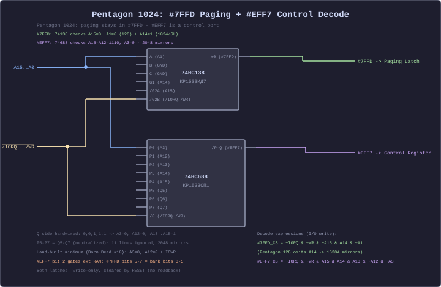

[← Home](../../README.md) · [Memory & I/O](README.md)

# Pentagon 128K / 512K / 1024K — Memory Map and I/O Ports

The Pentagon is the **most popular Soviet ZX Spectrum clone**, designed in 1989 by enthusiasts in Moscow. It uses discrete TTL logic instead of a ULA, which changes several key behaviors: **zero memory contention**, different interrupt timing, and extended memory paging via additional ports.

The base Pentagon 128K is register-compatible with the Sinclair 128K at port `#7FFD`, making most 128K software work out of the box. Expanded models (512K, 1024K) add port `#EFF7` for extended bank selection. Most Pentagons also include a **Beta 128 disk interface** with TR-DOS ROM, which pages into `#0000`–`#3FFF` via its own port.

> [!NOTE]
> This article covers the **Pentagon memory map and I/O ports**. For Pentagon video timing differences (different scanline count, different INT position), see [video_frame_pentagon.md](../05_display_and_timing/video_frame_pentagon.md). For the Sinclair 128K baseline, see [memory_and_io_128k.md](memory_and_io_128k.md).

---

## Memory Map — Base 128K (Compatible Mode)

In default configuration, the Pentagon is identical to the Sinclair 128K:

```
Address range    Contents               Control
──────────────────────────────────────────────────────────
#0000 - #3FFF   ROM 0 or ROM 1         #7FFD bit 4
                (or TR-DOS ROM)         Beta 128 port
#4000 - #7FFF   Bank 5 (fixed)         Always Bank 5
#8000 - #BFFF   Bank 2 (fixed)         Always Bank 2
#C000 - #FFFF   Banks 0–7 (switchable) #7FFD bits 0–2
──────────────────────────────────────────────────────────
```

The Pentagon's `#7FFD` implementation is **fully compatible** with the Sinclair 128K. All 128K software that uses standard paging works without modification.

### ROM Configuration

The Pentagon typically has **three ROM images** available:

| ROM | Contents | Selected by |
|-----|----------|-------------|
| ROM 0 | 128K editor (Russian or English version) | `#7FFD` bit 4 = 0 |
| ROM 1 | 48K BASIC ROM (Sinclair-compatible) | `#7FFD` bit 4 = 1 |
| TR-DOS | TR-DOS disk operating system | Beta 128 FDC port |

The TR-DOS ROM is paged in via the Beta 128 interface's port `#1FFD` (different function from the +2A/+3 `#1FFD`!). When TR-DOS is active, it overrides the normal ROM at `#0000`–`#3FFF` regardless of `#7FFD` bit 4.

---

## I/O Port — #7FFD (Standard Paging)

Identical to the Sinclair 128K:

```
OUT (#7FFD), A — paging register (write-only):

  Bits 0–2: RAM bank at #C000 (0–7)
  Bit  3:   Screen select (0=Bank 5, 1=Bank 7)
  Bit  4:   ROM select (0=ROM 0, 1=ROM 1)
  Bit  7:   Disable paging (1 = lock until reset)
```

The lock bit (bit 7) is respected on the Pentagon, just like the Sinclair 128K. Some Soviet software relies on this.

---

## I/O Port — #EFF7 (Extended Memory, 512K/1024K)

The Pentagon 128K with the EFF7 extension (most common configuration) adds an extra paging port for banks 8 and above:

```
OUT (#EFF7), A — Pentagon extended memory control (write-only):

  Bits 0–2: Extended bank bits (high bits of bank number)
  Bit 3:   ROM page select for shadow ROM area
  Bit 4:   512K/1024K select (some configurations)

Combined with #7FFD bits 0–2:
  Total bank number = (#EFF7 bits 0–2) × 8 + (#7FFD bits 0–2)
  512K: 32 banks of 16K = 512 KB
  1024K: 64 banks of 16K = 1024 KB
```

### Paging Extended Banks

```z80
; Pentagon 512K: Page in bank 20 (beyond the base 8)
; Bank 20 = extended group 2, low bits 4
; #EFF7 bits 0-2 = 2 (group), #7FFD bits 0-2 = 4 (within group)

    LD   A,#02           ; Extended bits = 2 (group 2: banks 16-23)
    LD   BC,#EFF7
    OUT  (C),A

    LD   A,#04           ; Low bits = 4 (bank 16+4 = 20)
    ; Must merge with ROM/screen bits from BANK_M
    LD   HL,(#5CC5)      ; Get current #7FFD state
    AND  #07
    OR   (HL)            ; Preserve ROM/screen bits
    AND  #1F             ; Safety mask
    LD   BC,#7FFD
    OUT  (C),A
    LD   (#5CC5),A
```

> [!NOTE]
> Extended memory paging requires the EFF7 CPLD extension. The base Pentagon 128K (discrete TTL only) cannot address beyond 128K. Most real Pentagons have the EFF7 modification.

---

## I/O Port — Beta 128 FDC (TR-DOS)

The Beta 128 disk interface is present on almost all Pentagons. It has its own port decoding that pages the TR-DOS ROM:

```
Port #1FFD (Beta 128 FDC — NOT the same as +2A/+3 #1FFD):
  Write: Bit 0 = TR-DOS ROM page enable (1 = TR-DOS active at #0000-#3FFF)
         Other bits control FDC functions

Port #3FFD: WD1793 / KR1818VG93 FDC data register
Port #FFFD: FDC status/command register (aliases with AY — careful!)
Port #5FFD: FDC track register
Port #7FFD: FDC sector register (aliases with paging — conflict!)
```

> [!WARNING]
> The Beta 128's port decoding **overlaps** with `#7FFD` (paging) and `#FFFD` (AY register select). The TR-DOS ROM contains code that carefully sequences port accesses to avoid conflicts. Do not access the FDC directly from user code without understanding the overlap — use TR-DOS hook codes instead. See [trdos.md](../../04_operating_systems/trdos.md) and [fdc_vg93.md](../../03_io/storage/fdc_vg93.md).

---

## I/O Port — Shadow Port #77

Some Pentagon configurations add a **shadow port** at `#77` (or `#0077`) for additional features:

```
Port #77 (Pentagon shadow port, not present on all machines):
  Bit 0: Turbo mode enable (7 MHz on some configurations)
  Bit 1: Cache enable
  Bit 2: Memory wait states control
  Other bits: vary by implementation
```

This is not standardized across all Pentagon revisions. Check the specific hardware before using.

---

## Port Decoding Circuits

The Pentagon uses **two separate decoding circuits** — one for the standard 128K-compatible paging, and one for extended memory:



| Circuit | Chip | Port | Lines Checked | Mirrors |
|---------|------|------|---------------|--------|
| 128K paging | 74HC138 / KR1533ID7 | `#7FFD` | 6 | 64 |
| Extended memory | 74HC688 / KR1533SP1 | `#EFF7` | 8 | 1 |

The 74138 decoder works identically to the Sinclair 128K (see [memory_and_io_128k.md](memory_and_io_128k.md)). The 74688 comparator provides an **exact match** — 8 address lines are compared against hardwired Vcc/GND inputs matching `#EFF7 = 1110_1111_1111_0111`, yielding zero alias addresses. Full decoding details and Verilog equivalents: [io_port_decoding.md](io_port_decoding.md).

---

## Contention — None

The Pentagon has **zero memory contention**. Video address generation uses discrete counter chips that run independently of the CPU bus. Code runs at full speed regardless of address or display position.

This means:
- **All code runs at the same speed** — whether in screen area, ROM, or upper RAM
- **Multicolor effects that depend on contention delays will not work** without adaptation
- **Floating bus behavior is absent or different** — reading contended memory during screen display does NOT return the byte the ULA is fetching (unlike 48K/128K)
- **I/O timing is deterministic** — `IN` and `OUT` take exactly the documented number of T-states

> [!TIP]
> Code that works perfectly on a Pentagon but breaks on a 48K almost certainly has a contention-related timing bug that the Pentagon's lack of contention masks. Always test on both.

See [contention_model.md](contention_model.md) for cross-model contention comparison.

---

## Memory Map — 512K Configuration

```
Bank    Address when paged    Physical RAM     Notes
──────────────────────────────────────────────────────────
0       #C000–#FFFF           16 KB           Base bank
1       #C000–#FFFF           16 KB           Base bank
2       #8000–#BFFF (fixed)   16 KB           Fixed
3       #C000–#FFFF           16 KB           Base bank
4       #C000–#FFFF           16 KB           Base bank
5       #4000–#7FFF (fixed)   16 KB           Screen bank (fixed)
6       #C000–#FFFF           16 KB           Base bank
7       #C000–#FFFF           16 KB           Shadow screen
8–31    #C000–#FFFF           16 KB each      Extended banks via #EFF7
──────────────────────────────────────────────────────────

Total: 32 banks × 16 KB = 512 KB
```

### Memory Map — 1024K Configuration

Same structure but 64 banks (0–63) via `#EFF7`, giving 1024 KB total. Banks 0–7 are always accessible via `#7FFD` alone; banks 8–63 require `#EFF7` first.

---

## Quick Reference — Port Summary

```
Port    Function                                     Pentagon specific
────────────────────────────────────────────────────────────────────
#FE     Border, EAR, keyboard                       No (same as all models)
#7FFD   Primary paging: bank, ROM, screen, lock     Compatible with 128K
#EFF7   Extended memory (512K/1024K)                YES — Pentagon + clones
#DFFD   Alternative extended paging (some configs)  Some Pentagons
#1FFD   Beta 128 FDC / TR-DOS ROM page              YES — different from +3!
#77     Shadow port: turbo, cache, waits             Some configurations
#FFFD   AY register select / FDC status              Overlaps with Beta 128!
#BFFD   AY register data                             No
#1F     Kempston joystick (built-in)                 No (but always present)
────────────────────────────────────────────────────────────────────
```

---

## Cross-References

- **128K/+2 memory and ports** (#7FFD, AY, shadow screen baseline): [memory_and_io_128k.md](memory_and_io_128k.md)
- **+2A/+3 memory and ports** (#1FFD, 4 paging modes): [memory_and_io_plus3.md](memory_and_io_plus3.md)
- **I/O port decoding** (partial decoding, masks, conflicts): [io_port_decoding.md](io_port_decoding.md)
- **Contention model** (Pentagon: no contention): [contention_model.md](contention_model.md)
- **Pentagon video frame** (timing differences): [video_frame_pentagon.md](../05_display_and_timing/video_frame_pentagon.md)
- **Clone timing** (all Soviet clone differences): [clone_timing.md](../../02_hardware/clones/clone_timing.md)
- **TR-DOS** (disk operating system): [trdos.md](../../04_operating_systems/trdos.md)
- **Beta 128 FDC** (WD1793/VG93): [fdc_vg93.md](../../03_io/storage/fdc_vg93.md)
- **Pentagon hardware**: [pentagon.md](../../02_hardware/clones/README.md)
- **Complete I/O port map** (all ports, all models, decoding bitmasks): [io_port_map.md](../../10_references/io_port_map.md)

---

## References

### External references

- [zx-pk.ru — Pentagon hardware subforum](https://zx-pk.ru/) — the primary Russian-language knowledge base for the Pentagon 128/512/1024, including schematics for the `#7FFD` / `#DFFD` / `#EFF7` paging ports and the various memory extensions (1 MB, 4 MB "shadow RAM").
- [SpeccyWiki — Pentagon (speccy.info)](https://speccy.info/) — Russian-language wiki article covering the Pentagon's architectural deviations from the 128K, including the absence of contention and the divergent TR-DOS banking.
- [Black_Cat — *ZX Port Map* (tslabs/zx-evo)](https://github.com/tslabs/zx-evo/blob/master/pentevo/docs/ZX/zx-ports-full-table.txt) — comprehensive port-decoding reference covering Pentagon-specific ports (`#7FFD`, `#DFFD`, `#EFF7`, `#BFF7`) and their partial-decode mirrors.
- [Pentagon Schematics Archive — Pentagon 128 / 512 / 1024 SL V2 (zx-pk.ru)](https://zx-pk.ru/) — community-verified schematic scans documenting the discrete logic that implements the `#7FFD` banking and the `#DFFD` extended bank selector on the 512 KB variants.
- [ZXM-Phoenix / Pentagon hardware reference (chibiakumas.com)](https://chibiakumas.com/) — English-language translations of Russian hardware articles covering the Pentagon's design lineage from the Leningrad and the design choices that led to its de facto standard status in the post-Soviet scene.
