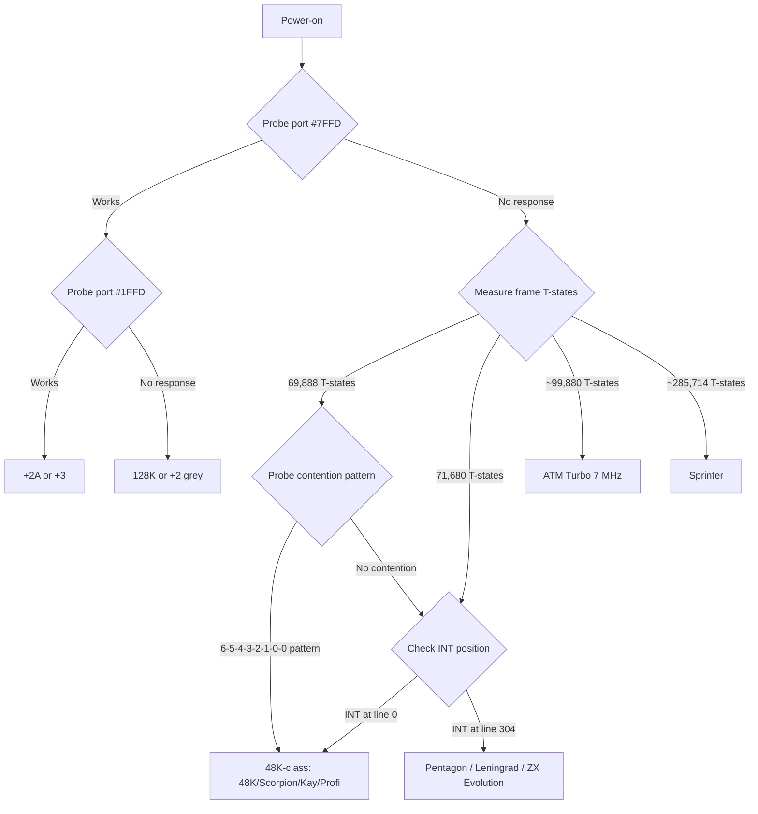

[← Home](../../README.md) · [Display & Timing](README.md)

# Video Frame Comparison — All Models Side-by-Side

This is the **synthesis article** for the display-and-timing section: a single reference comparing every ZX Spectrum-compatible platform's video frame timing on a uniform set of axes. If you need to know "what's the difference between model X and model Y?" or "will my software run on this machine?", start here.

Each row in the tables below links to the dedicated per-model article for full details. For the underlying PAL fundamentals, see [video_frame_overview.md](video_frame_overview.md). For clone detection routines, see [clone_timing.md § Clone Detection](../../02_hardware/clones/clone_timing.md#clone-detection).

---

## The Master Comparison Table

Every Spectrum-class machine, with the parameters that matter for software:

| Model | T-states/frame | Lines | T-states/line | Frame rate | INT position | Contention | Turbo | Article |
|---|---|---|---|---|---|---|---|---|
| **Sinclair 48K** | **69,888** | 312 | 224 | 50.08 Hz | Line 0, T=0 | Ferranti 6-5-4-3-2-1-0-0 | — | [48K](video_frame_48k.md) |
| **Sinclair 128K / +2** | **70,908** | 311 | 228 | 50.02 Hz | Line 0, T=0 | Ferranti (odd banks only) | — | [128K](video_frame_128k.md) |
| **Amstrad +2A / +3** | **70,908** | 311 | 228 | 50.02 Hz | Line 0, T=0 | Amstrad 1-0-7-6-5-4-3-2 | — | [+2A/+3](video_frame_plus2a_plus3.md) |
| **Pentagon 128/1024** | **71,680** | **320** | 224 | **48.83 Hz** | Line 304, T=0 | **None** | — | [Pentagon](video_frame_pentagon.md) |
| **Scorpion ZS-256** | 69,888 | 312 | 224 | 50.08 Hz | Line 0, T=0 | Revision-dep (+9 T shift) | 7 MHz | [Scorpion](video_frame_scorpion.md) |
| **Kay 1024** | 69,888 | 312 | 224 | 50.08 Hz | Line 0, T=0 | **None** | 7 MHz | [Other Soviet](video_frame_other_soviet.md) |
| **ATM Turbo 2+ (3.5 MHz)** | ~69,888 | ~312 | 224 | 50.08 Hz | Line 0, T=0 | Minimal | — | [Other Soviet](video_frame_other_soviet.md) |
| **ATM Turbo 2+ (7 MHz)** | **~99,880** | ~312 | 224 (×2 nominal) | 50.08 Hz | Line 0, T=0 | Minimal | 7 MHz | [Other Soviet](video_frame_other_soviet.md) |
| **Profi 5.03** | 69,888 | 312 | 224 | 50.08 Hz | Line 0, T=0 | **None** | 5–7 MHz | [Other Soviet](video_frame_other_soviet.md) |
| **Byte, Quorum, LEC** | 69,888 | 312 | 224 | 50.08 Hz | Line 0, T=0 | **None** | — | [Other Soviet](video_frame_other_soviet.md) |
| **Leningrad 1/2** | **71,680** | **320** | 224 | **48.83 Hz** | Line 304, T=0 | **None** | — | [Other Soviet](video_frame_other_soviet.md) |
| **Peters Plus Sprinter** | **~285,714** | ~525 | SVGA-derived | **70.00 Hz** | SVGA VSYNC | **None** | (base = 20 MHz) | [Sprinter](video_frame_sprinter.md) |
| **ZX Evolution (BaseConf)** | **71,680** | **320** | 224 | **48.83 Hz** | Line 304, T=0 | **None** | 7/14 MHz | [ZX Evolution](video_frame_zxevo.md) |
| **ZX Evolution (TS-Conf)** | 71,680 | 320 | 224 | 48.83 Hz | Line 304, T=0 | **None** | 7/14 MHz | [ZX Evolution](video_frame_zxevo.md) |
| **ZX Spectrum Next (48K mode)** | 69,888 | 312 | 224 | 50.08 Hz | Line 0, T=0 | Configurable (Ferranti) | 7/14/28 MHz | [Next](video_frame_next.md) |
| **ZX Spectrum Next (128K mode)** | 70,908 | 311 | 228 | 50.02 Hz | Line 0, T=0 | Configurable | 7/14/28 MHz | [Next](video_frame_next.md) |
| **ZX Spectrum Next (Pentagon mode)** | 71,680 | 320 | 224 | 48.83 Hz | Line 304, T=0 | Configurable (none) | 7/14/28 MHz | [Next](video_frame_next.md) |
| **ZX-Uno** | Configurable | Configurable | Configurable | Configurable | Configurable | Configurable | 7/14/28 MHz | [clone_timing.md](../../02_hardware/clones/clone_timing.md) |
| **MiSTer FPGA core (48K mode)** | 69,888 | 312 | 224 | 50.08 Hz | Line 0, T=0 | Ferranti (exact) | 7/14/28/56 MHz | [clone_timing.md](../../02_hardware/clones/clone_timing.md) |

---

## The Three Timing Families

Most Spectrum-class machines fall into one of three timing families:

### Family A: Sinclair-derived (48K base)

```
T-states/frame:  69,888      ← 48K
                 70,908      ← 128K/+2/+2A/+3 (slightly different)
Lines:           311-312
T-states/line:   224 (48K) or 228 (128K/+2/+2A/+3)
Frame rate:      ~50 Hz
INT position:    Line 0, T=0
```

Members: Sinclair 48K, 128K, +2, +2A, +3, Scorpion, Kay, Profi, Byte, Quorum, LEC, ATM Turbo at 3.5 MHz, plus the Next's 48K/128K/+2A modes and the MiSTer's 48K/128K modes.

**Software implication**: code written for 48K mostly works on all Family A machines. Timing-critical code may break between Ferranti and Amstrad gate array machines (48K vs +2A/+3 contention differs).

### Family B: Pentagon-derived

```
T-states/frame:  71,680      ← Pentagon
Lines:           320         ← Pentagon's distinctive signature
T-states/line:   224
Frame rate:      48.83 Hz    ← Slower than Sinclair
INT position:    Line 304, T=0  ← Different from Sinclair!
Contention:      None        ← The Pentagon's defining feature
```

Members: Pentagon 128/512/1024/2048, Leningrad 1/2, ZX Evolution (BaseConf/TS-Conf), plus the Next's Pentagon mode and the MiSTer's Pentagon modes.

**Software implication**: Family B code runs cleanly on any Family B machine. Family A code may run on Family B but timing-sensitive effects (race-the-beam multicolor) will be off. Music tempo runs 2.4% slower.

### Family C: Divergent

```
Sprinter:        ~285,714 T-states/frame, 70 Hz, SVGA-derived
ATM Turbo 7 MHz: ~99,880 T-states/frame (memory-bus bottleneck)
```

Members: Sprinter, ATM Turbo in turbo mode.

**Software implication**: Family C machines need software **specifically adapted**. Stock Spectrum software often does not work unmodified.

---

## Compatibility Matrix — Will Software Run?

For each software type, how it behaves on each timing family:

| Software type | Family A (48K) | Family A (+2A/+3) | Family B (Pentagon) | Family C (Sprinter) |
|---|---|---|---|---|
| Pure CPU algorithms | Works | Works | Works (slightly slower) | Works (much faster) |
| Standard 256×192 graphics | Works | Works | Works | Works (re-timed) |
| AY music at 50 Hz | Works at correct tempo | Works at correct tempo | **Plays 2.4% slower** | **Plays 40% faster** |
| 48K multicolor (race-the-beam) | Works | **Breaks** (different contention) | **Breaks** (no contention) | **Breaks** |
| Pentagon-targeted multicolor | **Breaks** | **Breaks** | Works | **Breaks** |
| Floating-bus raster sync | Works | Unreliable | **Absent** | **Absent** |
| Tape loaders | Works (48K) | Works (128K ROM) | Works via TR-DOS | **N/A** (no tape) |
| FRAMES-based timing | Correct | Correct | **2.4% slow** | **40% fast** |
| GigaScreen | N/A | N/A | Works | Works (different timing) |
| TS-Conf sprite/tile | N/A | N/A | Works on ZX Evolution only | N/A |

---

## Why Two Platforms Dominate

The ZX Spectrum demoscene and software ecosystem overwhelmingly target **two platforms**:

1. **Sinclair 48K** — the original hardware, "ground truth" for timing. Every emulator supports it. Western demoscene targets it.
2. **Pentagon 128K** — the most common Soviet clone, no contention, slightly slower frame rate. Russian demoscene targets it.

Together they cover ~95% of all ZX Spectrum software ever written. Other machines are either:
- **Binary-compatible** (128K, +2, +2A, +3, Kay, Scorpion, Profi) — software for the 48K runs with caveats
- **Pentagon-compatible** (Leningrad, ZX Evolution, ATM Turbo at 3.5 MHz) — software for the Pentagon runs unchanged
- **Divergent** (Sprinter, ZX Spectrum Next with custom modes) — need specifically targeted software

For new software development today, the recommended target is:
- **48K** for maximum compatibility with the entire library
- **Pentagon** if you need no-contention timing for fast 3D or demoscene effects
- **ZX Spectrum Next** if you want modern hardware (sprites, tilemap, copper) and are willing to require a Next

---

## INT Position — The Hidden Incompatibility

The most important single difference between Sinclair-derived and Pentagon-derived machines is **where INT fires within the frame**:

```
Sinclair 48K / 128K / +2A / +3:
  INT fires at LINE 0, T=0  (top border start)
  Paper begins at T=14,336 (line 64)  → 14,336 T-states of free time after INT
  
Pentagon / Leningrad / ZX Evolution:
  INT fires at LINE 304, T=0  (near end of frame)
  Paper begins at line 80      → ISR runs AFTER paper has been drawn
```

This means **ISR code that prepares the current frame's screen on a 48K prepares the NEXT frame's screen on a Pentagon**. The code is structurally different.

```
48K ISR pattern:
  HALT                    ; Wait for INT at line 0
  ; ISR runs DURING top border (before paper)
  ; Update screen for THIS frame
  
Pentagon ISR pattern:
  HALT                    ; Wait for INT at line 304
  ; ISR runs DURING bottom border (after paper)
  ; Update screen for NEXT frame
```

Software that hardcodes the 48K ISR pattern (HALT, then immediately update screen) will write to the screen **while it's being displayed** on a Pentagon — causing visible tearing.

---

## Contention Pattern Comparison

The exact delay tables for contended-memory accesses:

| Machine | Delay pattern (per 8-T slot) | Worst delay | I/O contended? |
|---|---|---|---|
| Sinclair 48K | `6-5-4-3-2-1-0-0` | +6T | Yes (A0=0 ports) |
| Sinclair 128K / +2 | `6-5-4-3-2-1-0-0` (odd banks only) | +6T | Yes (A0=0 ports) |
| Amstrad +2A / +3 | `1-0-7-6-5-4-3-2` | **+7T** | **No** |
| Pentagon / Leningrad / ZX Evolution | None | 0T | No |
| Scorpion | Revision-dependent | 0-6T | No |
| Kay / Profi / ATM Turbo / Byte / Quorum / LEC | None | 0T | No |
| Sprinter | None | 0T | No |
| ZX Spectrum Next | Configurable per mode | 0-7T | Configurable |
| MiSTer FPGA | Per selected model | matches selected | matches selected |

See [contention_timing.md](contention_timing.md) for the per-instruction T-state cost tables.

---

## Detection Decision Tree

To identify which machine your code is running on at startup:



Practical detection code is in [clone_timing.md § Clone Detection](../../02_hardware/clones/clone_timing.md#clone-detection) and [video_frame_pentagon.md § Runtime Detection](video_frame_pentagon.md).

---

## Per-Model Quick Reference Card

```
┌─────────────────────────────────────────────────────────────────┐
│   IF YOU NEED TO SUPPORT...                TARGET THIS TIMING   │
├─────────────────────────────────────────────────────────────────┤
│                                                                 │
│   Original Western software              →  48K (69,888 T-states)│
│   1980s games, British demos                                              │
│                                                                 │
│   Russian software, demoscene            →  Pentagon (71,680 T)  │
│   Most post-1990 Russian work                                              │
│                                                                 │
│   Maximum compatibility                  →  48K + Pentagon dual  │
│   Modern cross-platform releases                                           │
│                                                                 │
│   Modern hardware features               →  ZX Spectrum Next     │
│   Sprites, tilemap, copper, 28 MHz                                         │
│                                                                 │
│   Faithful Russian recreation            →  ZX Evolution         │
│   With TS-Conf enhancements                                                │
│                                                                 │
│   Business / CP/M applications           →  Sprinter (70 Hz)     │
│   With SVGA output                                                         │
│                                                                 │
└─────────────────────────────────────────────────────────────────┘
```

---

## Test Software Per Model

The classic test suite for validating machine-detection and timing code:

| Test | 48K | 128K | +2A | Pentagon | Notes |
|---|---|---|---|---|---|
| `HALT` + measure FRAMES delta | 69,888 | 70,908 | 70,908 | 71,680 | Distinguishes 48K from Pentagon |
| Read floating bus at paper start | Reliable | Works | Unreliable | Absent | Distinguishes ULA from non-ULA |
| Time a fixed loop in screen RAM | Slower | Slower (odd banks) | Different pattern | **Full speed** | Detects contention presence |
| Probe `OUT (#FE),A` contention | +6T worst | +6T worst | **0T** | 0T | Distinguishes Ferranti from gate array |
| Check `#7FFD` paging | No response | Works | Works | Works (typically) | Distinguishes 48K from 128K+ |
| Check `#1FFD` extended paging | No response | No response | Works | Varies | Distinguishes +2A/+3 |
| Time `LDIR` of 16,384 bytes in screen | ~330,000 T | ~330,000 T | ~330,000 T | ~286,000 T | Confirms no-contention clones |

For real-world detection code, see [video_frame_pentagon.md](video_frame_pentagon.md) and the cross-platform sync strategy in [raster_timing.md](raster_timing.md).

---

## Cross-References — Where to Go Next

### Per-Model Deep Dives

- [Video frame 48K](video_frame_48k.md) — Sinclair 48K reference
- [Video frame 128K](video_frame_128k.md) — Sinclair 128K / +2 grey
- [Video frame +2A/+3](video_frame_plus2a_plus3.md) — Amstrad gate array
- [Video frame Pentagon](video_frame_pentagon.md) — Russian reference
- [Video frame Scorpion](video_frame_scorpion.md) — 48K-compatible with 7 MHz turbo
- [Video frame other Soviet](video_frame_other_soviet.md) — Kay, ATM Turbo, Profi, Byte, Quorum, Leningrad, LEC
- [Video frame Sprinter](video_frame_sprinter.md) — SVGA 70 Hz, 20 MHz
- [Video frame ZX Evolution](video_frame_zxevo.md) — Pentagon base with TS-Conf
- [Video frame Next](video_frame_next.md) — Configurable, 28 MHz, copper

### Cross-Cutting Topics

- [Video frame overview](video_frame_overview.md) — PAL fundamentals, frame structure
- [Raster timing](raster_timing.md) — beam position calculation, sync techniques
- [Contention timing](contention_timing.md) — per-T-state delay tables
- [Contention model](../03_memory_and_io/contention_model.md) — conceptual reference
- [Floating bus](floating_bus.md) — raster sync via ULA reads
- [Border effects](border_effects.md) — practical timing code
- [Color system](color_system.md) — palette, attributes, BRIGHT, FLASH
- [Clone video modes](clone_video_modes.md) — GigaScreen, hires, multicolor
- [Interlace and flicker](interlace_and_flicker.md) — perception physics, CRT vs LCD
- [CRT output](crt_output.md) — developer view of display types

### Hardware References

- [Clone timing overview](../../02_hardware/clones/clone_timing.md) — per-clone comparison and detection
- [ULA timing](../../02_hardware/original/ula_timing.md) — hardware-level contention mechanism
- [ULA architecture](../../02_hardware/original/ula_architecture.md) — Ferranti ULA internals
- [Video output hardware](../../03_io/peripherals/video_output.md) — connectors, cables, modulators

---

## Primary Sources

- **Unreal Speccy emulator** ([github.com/mkoloberdin/unrealspeccy](https://github.com/mkoloberdin/unrealspeccy)) — the de facto reference for per-model frame timings. `unreal.ini` defines `FRAME=`, `PAPER=`, `CONTENTION=` for each model preset:
  - `FRAME=69888 PAPER=14364 CONTENTION=1` (48K)
  - `FRAME=69888 PAPER=14364 CONTENTION=0` (Scorpion/Kay/ATM 3.5MHz/Profi)
  - `FRAME=71680 PAPER=14364 CONTENTION=0` (Pentagon/Leningrad)
  - `FRAME=99880 PAPER=14364 CONTENTION=0` (ATM Turbo 7 MHz)
- **ZXMAK2 emulator** ([github.com/zxmak/zxmak2](https://github.com/zxmak/zxmak2)) — 16+ clone models with separate contention profiles. Source documents per-revision Scorpion contention and the ATM Turbo speedup anomaly.
- **Fuse emulator** ([github.com/fuse-emulator/fuse](https://github.com/fuse-emulator/fuse)) — Western reference for Sinclair 48K/128K/+2/+2A/+3 timing. The `peripherals/ula.c` and `peripherals/plus3.c` files document exact contention patterns.
- **ZEsarUX emulator** ([github.com/chernandezba/zesarux](https://github.com/chernandezba/zesarux)) — Implements both Ferranti and Amstrad contention with detailed per-cycle accuracy; supports ZX Spectrum Next and TS-Conf.
- **Chris Smith, *The ZX Spectrum ULA: How to Design a Microcomputer*** (2010) — the definitive hardware reference for the Sinclair-derived timing family.
- **zx-pk.ru forum** — Russian-language real-hardware measurements confirming emulator timings. Notable threads include "Pentagon 1024 timing measurements", "TS-Conf sprite timing", "ATM Turbo 7MHz real speed", "Evo 14MHz speed test".
- **SpeccyWiki (speccy.info)** — Russian-language clone encyclopedia with per-clone hardware specifications.
- **spectrum-computing.co.uk** — hardware catalogue with original documentation links for Soviet and modern clones.
- **ZX Spectrum Next official documentation** ([specnext.com](https://specnext.com)) — copper, Layer 2, tilemap, sprite timing reference.
