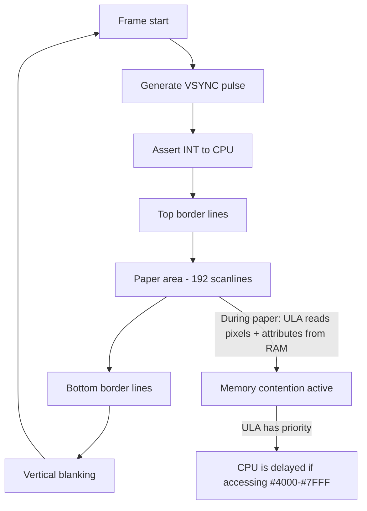

[← Home](../../README.md) · [Display & Timing](README.md)

# Video Frame Overview — PAL Fundamentals and the ULA Frame Cycle

Every **50 times per second** (on original PAL hardware), the Ferranti ULA generates a complete video frame: 312 scanlines of border, pixel data, and blanking, while simultaneously arbitrating memory access with the CPU and asserting the frame interrupt. Understanding this cycle is the foundation for everything from simple border effects to cycle-exact multicolor demos.

> [!NOTE]
> This article covers the **PAL timing fundamentals and ULA frame generation mechanism** common to all ULA-based Spectrum models (48K, 128K, +2, +2A/+3). Per-model differences (contention patterns, INT position, scanline count) are covered in individual model articles. Clone timing (Pentagon, Scorpion, etc.) differs fundamentally — see [clone_timing.md](../../02_hardware/clones/clone_timing.md).

---

## PAL Television Basics

The ZX Spectrum outputs a **PAL composite video signal** designed for European CRT televisions. PAL (Phase Alternating Line) defines:

```
PAL specification:
  Frame rate:        50 Hz (interlaced: 25 frames/s × 2 fields/s)
  Lines per frame:   625 (interlaced: 312.5 per field)
  Line duration:     64 µs (microseconds)
  Horizontal freq:   15,625 Hz (= 625 × 25)
  Active video:      ~52 µs per line
  Horizontal blank:  ~12 µs per line
  Color subcarrier:  4.43 MHz
```

### Interlaced vs Progressive

Standard PAL is **interlaced**: odd-numbered lines are drawn in the first field, even-numbered in the second. However, the ZX Spectrum generates a **progressive (non-interlaced)** signal — it draws all 312 scanlines in a single field, repeated at ~50 Hz. This simplification means:

- No interlace flicker
- All 192 visible scanlines are stable
- The frame rate is actually **~50.08 Hz** (48K) rather than exactly 50 Hz

> [!NOTE]
> The Spectrum's "312 lines" is a simplification. Standard PAL has 312.5 lines per field (625/2). The Spectrum always outputs the same field, effectively running at 50.08 Hz rather than 50.00 Hz. Some clones (Pentagon) use exactly 320 lines for a different frame rate (~48.83 Hz).

---

## The ULA Frame Cycle

The Ferranti ULA is a **state machine** that generates the video signal, frame interrupt, and memory contention in lockstep. It runs at the CPU clock frequency (3.5 MHz) and produces exactly **224 T-states per scanline**:



### Frame Structure (48K)

```
                     T-state   Scanline  Region
                     ────────  ────────  ──────────────────────────
Frame start (#0038) → T=0       Line 0    INT asserted
                     T=0        Line 0    Top border begins
                     T=14336    Line 64   Paper area begins (contention starts)
                     T=57344    Line 256  Paper area ends (contention stops)
                     T=69888    Line 312  Bottom border + blanking end
                     ────────  ────────  ──────────────────────────
Total: 312 scanlines × 224 T-states/line = 69,888 T-states/frame
```

```
Visual representation of one frame (48K):

  ┌──────────────────────────────────────────────┐ Line 0, T=0
  │  INTERRUPT (INT asserted for ~32 T-states)   │
  │                                              │
  │  Top border (64 lines)                       │ ← No contention
  │  Color controlled by OUT (#FE), bits 1-3     │
  │                                              │
  ├──────────────────────────────────────────────┤ Line 64, T=14336
  │                                              │
  │  Paper area (192 lines)                      │ ← CONTENTION ACTIVE
  │  256×192 pixel display                       │   ULA reads pixels
  │  ULA fetches 32 bytes pixels + 32 bytes      │   + attributes
  │  attributes per scanline from RAM            │   per scanline
  │                                              │
  ├──────────────────────────────────────────────┤ Line 256, T=57344
  │                                              │
  │  Bottom border (56 lines)                    │ ← No contention
  │                                              │
  ├──────────────────────────────────────────────┤ Line 312, T=69888
  │  Vertical blank (no visible output)          │ ← No contention
  │  (24 lines on 48K... see note below)         │
  └──────────────────────────────────────────────┘ = 312 lines total
```

Wait — the 48K has 312 scanlines total, not 336. Let me correct:

```
48K Frame: 312 scanlines = 69,888 T-states

  Lines   0–63:    Top border (64 lines) — no contention
  Lines  64–255:   Paper area (192 lines) — contention active
  Lines 256–311:   Bottom border + vertical blank (56 lines) — no contention

  64 + 192 + 56 = 312 lines ✓
```

The vertical blank is not a separate region in the line count — the last few scanlines of the bottom border are during vertical blanking (VSYNC pulse). The ULA stops fetching from RAM during these lines.

---

## What the ULA Does Each Scanline

During the **paper area** (scanlines 64–255 on 48K), the ULA performs the following for each scanline:

```
Per-scanline activity during paper area:

1. Fetch 32 bytes of pixel data from screen RAM (#4000–#57FF)
   → 32 memory reads, stealing bus cycles from CPU

2. Fetch 32 bytes of attribute data from attribute RAM (#5800–#5AFF)
   → 32 memory reads, stealing bus cycles from CPU

3. Generate composite video signal from fetched data
   → Pixels serialized to 1-bit stream at ~6.94 MHz
   → Attributes determine ink/paper color for each 8-pixel group

4. Arbitrate bus access with CPU
   → If CPU accesses #4000–#7FFF during a ULA fetch cycle,
     CPU is delayed (contention pattern: 6,5,4,3,2,1,0,0 T-states)

Total bus cycles stolen per scanline: 64 (32 pixel + 32 attribute)
Available bus cycles per scanline:    224 total - 64 stolen = 160 for CPU
Effective CPU throughput reduction:   ~29% slower in contended area
```

During **border lines** (top border, bottom border, vertical blank):
- ULA generates border color (from port `#FE` bits 1–3) for the entire scanline
- No pixel or attribute fetching → **no memory contention**
- CPU runs at full speed in all RAM

---

## Frame Timing Parameters by Model

All ULA-based models share the same fundamental structure but differ in details:

| Parameter | 48K | 128K/+2 | +2A/+3 | Pentagon |
|-----------|-----|---------|--------|----------|
| T-states/line | 224 | 224 | 224 | 224 |
| Total scanlines | 312 | 312 | 312 | **320** |
| Total T-states | 69,888 | 69,888 | 69,888 | **71,680** |
| Frame rate | ~50.08 Hz | ~50.08 Hz | ~50.08 Hz | **~48.83 Hz** |
| Top border lines | 64 | 64 | 64 | **48** |
| Paper lines | 192 | 192 | 192 | **192** |
| Bottom border lines | 56 | 56 | 56 | **48** |
| Vertical blank | included in border | included | included | **32** |
| INT position | T=0, line 0 | T=0, line 0 | T=0, line 0 | **T=0, line 0** |
| INT duration | 32 T-states | 32 T-states | 32 T-states | 32 T-states |
| Contention model | Ferranti 6-5-4-3-2-1-0-0 | Same as 48K | Amstrad 1-0-7-6-5-4-3-2 | **None** |

> [!IMPORTANT]
> The Pentagon has **320 scanlines** (not 312) because its video counter is built from binary counters that naturally wrap at 320 (8-bit counter with specific bit positions). This gives a different frame rate of ~48.83 Hz, which is close enough for most PAL TVs to sync to but causes problems with modern fixed-rate displays. See [clone_timing.md](../../02_hardware/clones/clone_timing.md) for details.

---

## The Frame Interrupt

At the start of each frame (T-state 0 on 48K), the ULA asserts the **INT line** to the Z80:

```
INT timing:
  Asserted at:  T-state 0 of the first scanline (top border)
  Duration:     32 T-states (≈9.14 µs at 3.5 MHz)
  CPU response: If interrupts are enabled (IM1), Z80 calls #0038
  
Important: The interrupt fires at the START of the top border, NOT at the
start of the paper area. There are 64 scanlines (14,336 T-states) between
the interrupt and the first visible paper scanline.
```

This gives the programmer **14,336 T-states** of uncontended time after the interrupt fires before the paper area begins. This is critical for timing-sensitive operations:

```
T-state budget after INT:
  T=0:       INT fires
  T=0–14335: Top border (no contention) — 14,336 T-states of free time
  T=14336:   Paper area begins — contention starts
  T=57343:   Paper area ends
  T=57344–69887: Bottom border (no contention) — 12,544 T-states of free time
  T=69888:   Frame wraps → new INT
```

---

## Contentious vs Non-Contentious Time

The frame naturally divides into **contended** and **non-contended** windows:

```
Available CPU T-states per frame (48K):

  Non-contended:   14,336 (top border) + 12,544 (bottom border) = 26,880 T-states
  Contended:       192 lines × 224 T-states = 42,888 T-state positions
                   But each line has ~64 stolen cycles → effective ~30,000 useful T-states
  Total effective: ~57,000 useful T-states per frame (out of 69,888 total)
  
  At 3.5 MHz: 69,888 / 3,500,000 = 19.968 ms per frame
  Time available for code: ~57,000 / 3,500,000 = 16.3 ms per frame
```

### Strategy: What Goes Where

```z80
; Recommended frame layout for a game or demo:

; IM1 ISR fires at T=0 (start of top border)
.org #0038
    PUSH AF
    PUSH HL
    ; ... save registers ...
    
    ; === TOP BORDER (14,336 T-states, no contention) ===
    ; Ideal for:
    ; - Music player update
    ; - Game logic / AI
    ; - Bank switching
    ; - Copy data to contended area from non-contended area
    
    CALL UpdateMusic
    
    ; === PAPER AREA (42,888 T-states, contention) ===
    ; Still usable for most code:
    ; - Code in #8000+ is NOT contended (only #4000-#7FFF)
    ; - Contended area: avoid time-critical loops in screen RAM
    ; - Screen updates: accept the slowdown or wait for border
    
    CALL GameLogic        ; Code in upper RAM, runs at full speed
    
    ; === BOTTOM BORDER (12,544 T-states, no contention) ===
    ; Good for:
    ; - Screen updates (write to #4000-#7FFF without contention)
    ; - Stack operations, data copying
    ; - Preparing buffers for next frame
    
    ; ... restore registers ...
    POP HL
    POP AF
    EI
    RET
```

---

## Per-Model Articles

For detailed timing diagrams, contention patterns, and model-specific behavior:

- **48K**: [video_frame_48k.md](video_frame_48k.md) — exact T-state map, contention pattern, floating bus
- **128K/+2**: [video_frame_128k.md](video_frame_128k.md) — shadow screen, contention differences
- **+2A/+3**: [video_frame_plus2a_plus3.md](video_frame_plus2a_plus3.md) — Amstrad gate array contention
- **Pentagon**: [video_frame_pentagon.md](video_frame_pentagon.md) — 320-line frame, no contention, binary counter
- **Other clones**: [clone_timing.md](../../02_hardware/clones/clone_timing.md)

---

## Cross-References

- **ULA timing deep dive** (contention patterns, early/late timing): [ula_timing.md](../../02_hardware/original/ula_timing.md)
- **Z80 interrupt system**: [z80_interrupts.md](../../01_cpu/z80_interrupts.md)
- **Interrupt programming**: [interrupt_overview.md](../04_interrupts/interrupt_programming.md)
- **Race the beam** (timing-critical effects): [race_the_beam.md](raster_timing.md)
- **Screen pixel layout**: [screen_layout.md](../03_memory_and_io/screen_layout.md)
- **Emulation implications** (non-standard frame rates on modern displays): [cycle_exact_accuracy.md](../../11_emulation/software/cycle_exact_accuracy.md)

## References

### External references

- **Chris Smith — *The ZX Spectrum ULA*** (book) — the definitive reference for the 48K / 128K frame parameters compared in this article (scanline counts, contention pattern, INT pulse placement).
- **Sinclair ZX Specifications** (Martin Korth, `problemkaputt.de/zxdocs.htm`) — the canonical cross-model hardware reference covering the 48K, 128K, +2, +2A, +3 line and T-state counts.
- **Spectrumpedia** (Alessandro Grussu) — the most complete cross-model comparison table in print form, including the Soviet clones and the modern FPGA reimplementations.
- **`cycle_exact_accuracy.md`** — internal cross-link to the emulator-side discussion of non-standard frame rates on modern 50 Hz / 60 Hz / variable-refresh displays.
- **WoS archive hardware reference pages** — community-maintained tables of per-model frame parameters, originally compiled for use by emulator authors.
