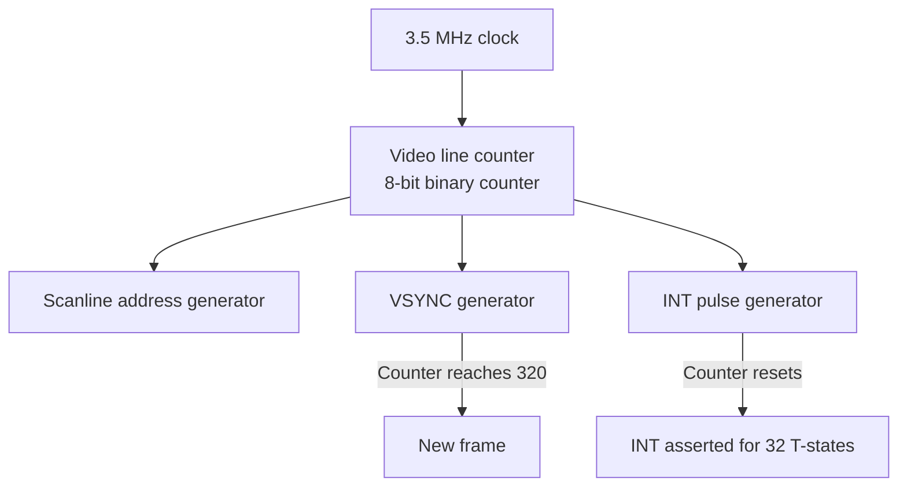

[← Home](../../README.md) · [Display & Timing](README.md)

# Pentagon Video Frame — 320 Scanlines, Binary Counter Timing, and Zero Contention

The Pentagon 128K is the most popular ZX Spectrum clone in Russia and the former Soviet Union. Its video timing is **fundamentally different** from the original 48K: it generates **320 scanlines per frame** (not 312), runs at **~48.83 Hz** (not ~50.08 Hz), and has **no memory contention at all**. Code that relies on 48K-specific timing will break on the Pentagon — and vice versa.

> [!NOTE]
> This article covers **only the Pentagon's video frame timing**. For the hardware design (discrete logic, binary counters), see [pentagon.md](../../02_hardware/clones/pentagon.md). For the general clone timing overview, see [clone_timing.md](../../02_hardware/clones/clone_timing.md). For 48K frame reference, see [video_frame_48k.md](video_frame_48k.md).

---

## Frame Parameters (Pentagon)

```
┌────────────────────────────────────────────────────┐
│  Pentagon 128K Frame Timing                        │
├────────────────────────────────────────────────────┤
│  T-states per scanline:     224   (same as 48K)    │
│  Total scanlines:           320   (NOT 312!)       │
│  Total T-states per frame:  71,680 (NOT 69,888!)   │
│  Frame rate:                3,500,000 / 71,680     │
│                             ≈ 48.828 Hz            │
│  Frame duration:            20.48 ms (vs 19.97 ms) │
│                                                    │
│  Top border:       48 lines  (vs 64 on 48K)        │
│  Paper area:      192 lines  (same as 48K)         │
│  Bottom border:    48 lines  (vs 56 on 48K)        │
│  Vertical blank:   32 lines  (not separate on 48K) │
│                                                    │
│  INT position:    T=0, line 0 (same as 48K)        │
│  INT duration:    32 T-states (same as 48K)        │
│                                                    │
│  Contention:      NONE — zero contention           │
│  Memory speed:    Full speed at all times          │
└────────────────────────────────────────────────────┘
```

---

## Why 320 Scanlines? The Binary Counter

The Pentagon was designed in 1989 using **discrete TTL logic chips** — no custom ULA, no FPGA. The video counter is built from standard 74-series (К555/КР1533) binary counters:



The counter uses binary counting — it counts from 0 to 319 (320 values), then wraps. The number **320** comes from the counter's bit pattern:

```
320 = 256 + 64 = 2^8 + 2^6 = 101000000 binary

The counter wraps at 320 because:
  - An 8-bit counter would wrap at 256 (too few lines for PAL)
  - A 9-bit counter wraps at 512 (too many lines)
  - The Pentagon uses extra logic to detect 320 and reset:
    Counter bits: 1 0100 0000 (= 320) triggers reset
    Detection: bit 8 AND bit 6 (simple AND gate)
```

This is fundamentally different from the 48K ULA, which uses a precisely tuned counter that wraps at 312.

---

## Frame Structure

```
Pentagon frame layout (320 scanlines = 71,680 T-states):

┌──────────────────────────────────────────────────┐ Line 0, T=0
│  INTERRUPT (INT asserted for 32 T-states)        │
│  Top border (48 lines, NO contention)            │
├──────────────────────────────────────────────────┤ Line 48, T=10752
│  Paper area (192 lines, NO contention)           │
│  256×192 pixel display                           │
│  ULA reads pixels + attributes BUT...            │
│  ...CPU is NEVER delayed (no bus arbitration)    │
├──────────────────────────────────────────────────┤ Line 240, T=53760
│  Bottom border (48 lines, NO contention)         │
├──────────────────────────────────────────────────┤ Line 288, T=64512
│  Vertical blank (32 lines, NO contention)        │
└──────────────────────────────────────────────────┘ Line 320 = 0

48 + 192 + 48 + 32 = 320 scanlines ✓
320 × 224 = 71,680 T-states ✓
```

### Compared to 48K

```
                 48K              Pentagon
Line count:      312              320  (+8 scanlines)
T-states:        69,888           71,680 (+1,792)
Frame rate:      50.08 Hz         48.83 Hz (-1.25 Hz)
Top border:      64 lines         48 lines (-16)
Paper:           192 lines        192 lines (same)
Bottom border:   56 lines         48 lines (-8)
V-blank:         (included)       32 lines
Contention:      Yes (6-5-4-...)  None
```

---

## No Memory Contention

The most significant difference for programmers: **the Pentagon has no memory contention**. Code runs at full speed at all times, in all memory banks, during all parts of the frame.

### Why No Contention

```
48K ULA contention mechanism:
  The ULA and CPU share the same DRAM bus
  When ULA needs to fetch pixels, it asserts WAIT to delay CPU
  This is bus arbitration — the ULA has priority

Pentagon approach:
  The video counter generates addresses independently
  Pixel data is fetched from a separate buffer or during blank periods
  CPU bus is never interrupted by video fetches
  Result: CPU always runs at full 3.5 MHz, no delays
```

Actually, the Pentagon does fetch from the same RAM as the CPU — but the discrete logic implementation does not implement the wait-state mechanism of the original ULA. The CPU and video circuit access memory on different phases of the clock cycle, so they naturally interleave without contention.

### Practical Impact

```z80
; On 48K: this loop is SLOW during the paper area
; because screen RAM (#4000-#7FFF) is contended
FillScreen48K:
    LD   HL,#4000
    LD   DE,#4001
    LD   BC,6144
    LD   (HL),#FF
    LDIR              ; ~7 T-states per byte + contention
    RET
; Effective time: ~30,000+ T-states during paper area

; On Pentagon: same code runs at FULL SPEED
; No contention means every byte transfer takes exactly 7 T-states
FillScreenPentagon:
    LD   HL,#4000
    LD   DE,#4001
    LD   BC,6144
    LD   (HL),#FF
    LDIR              ; Always 7 T-states per byte
    RET
; Time: 6144 × 7 ≈ 43,008 T-states — 20-30% faster than 48K during paper
```

---

## INT Timing and the Border Period

The Pentagon's INT fires at the same logical position (start of frame), but the border period is **16 scanlines shorter**:

```
                    48K                    Pentagon
INT → Paper:        64 lines (14,336 T)   48 lines (10,752 T)
                    ↑ 29% more setup time  ↑ less setup time

Paper area:         192 lines              192 lines (same)

Paper → Frame end:  56 lines (12,544 T)   80 lines (17,920 T)
                    ↑ less post-paper      ↑ more post-paper time
```

### Impact on ISR Design

```z80
; 48K ISR: has 14,336 T-states of uncontended time after INT
; Pentagon ISR: has only 10,752 T-states

; If your ISR does too much work in the top border period,
; it may still be running when the paper area starts on Pentagon.

; 48K:  14,336 T-states before paper = plenty of time
; Pentagon: 10,752 T-states before paper = 25% less time!

; However, Pentagon has NO contention, so ISR code is slightly
; faster (no contention delays on memory access).

; Net effect: the shorter border period is partially compensated
; by faster execution, but timing-critical ISRs may need adjustment.
```

---

## The 48.83 Hz Frame Rate Problem

The Pentagon's non-standard frame rate of **~48.83 Hz** causes problems with:

1. **Modern LCD monitors** (fixed 60 Hz): Frame rate mismatch causes judder and tearing. See [cycle_exact_accuracy.md](../../09_emulation/software/cycle_exact_accuracy.md) for a complete analysis.

2. **PAL CRT TVs**: Most PAL TVs accept ±10% (45–55 Hz), so 48.83 Hz is **within tolerance** (only 2.34% below nominal 50 Hz). The picture will sync correctly.

3. **NTSC displays**: 48.83 Hz is too far from 60 Hz — will not sync without conversion.

4. **VRR displays** (G-Sync/FreeSync): Perfect — the display adapts to 48.83 Hz.

```
48.83 Hz on a 60 Hz LCD:
  Guest frame: 20.481 ms
  Host frame:  16.667 ms
  Ratio: 60/48.83 ≈ 1.229
  
  Every ~4.4 host frames, one guest frame is duplicated → visible judder
  ~11.2 duplicated frames per second
  
  On a VRR display: no judder, display runs at 48.83 Hz natively
```

---

## Detecting Pentagon at Runtime

Many multi-platform programs need to detect whether they're running on a Pentagon or an original Spectrum:

```z80
; Pentagon detection via frame timing
; Method: measure the time between two consecutive INTs

DetectPentagon:
    DI                  ; Disable interrupts
    LD   HL,0           ; Counter
    
    ; Wait for first INT (poll the IFF2 flag via LD A,I)
.waitInt1:
    LD   A,R            ; R is always accessible
    JP   M,.waitInt1    ; Wait for interrupt flag
    
    ; Count T-states until next INT
.countLoop:
    INC  HL
    LD   A,R
    JP   P,.countLoop   ; Loop until interrupt flag set again
    
    ; HL now contains a count proportional to frame duration
    ; 48K: HL ≈ some threshold (corresponds to 69,888 T-states)
    ; Pentagon: HL ≈ higher value (corresponds to 71,680 T-states)
    
    ; Compare against threshold
    LD   DE,THRESHOLD   ; Calibrated value
    AND  A              ; Clear carry
    SBC  HL,DE
    JR   NC,isPentagon  ; HL > threshold = Pentagon
    
is48K:
    ; ... 48K-specific setup ...
    RET
    
isPentagon:
    ; ... Pentagon-specific setup ...
    RET
```

> [!NOTE]
> This is a simplified example. Real detection routines account for variation in loop timing and may use more sophisticated methods (e.g., measuring with the FRAMES system variable at `#5C78`).

---

## Summary: Pentagon vs 48K Frame

| Property | 48K | Pentagon |
|----------|-----|----------|
| Scanlines | 312 | **320** |
| T-states | 69,888 | **71,680** |
| Frame rate | ~50.08 Hz | **~48.83 Hz** |
| Top border | 64 lines | **48 lines** |
| Bottom border | 56 lines | **48 lines** |
| V-blank | included in border | **32 lines** |
| Contention | Yes (6-5-4-3-2-1-0-0) | **None** |
| Floating bus | Present | **Different / unreliable** |
| INT position | T=0, line 0 | T=0, line 0 (same) |
| ISR safe time | 14,336 T-states | **10,752 T-states** |
| CPU effective speed | ~82% during paper | **100% always** |

### What Breaks When Porting 48K → Pentagon

1. **Contention-dependent timing**: Code that relies on exact contention delays (multicolor effects) runs **too fast** on Pentagon — effects appear shifted.

2. **Frame-length assumptions**: Any code that assumes 69,888 T-states per frame will drift — the Pentagon has 1,792 extra T-states.

3. **Top border effects**: Only 48 lines (vs 64) of top border — raster bars and border effects have less space.

4. **Floating bus tricks**: May not work reliably on Pentagon hardware.

5. **Audio timing**: Music players that use the frame interrupt for tempo will play ~2.3% slower on Pentagon (48.83 Hz vs 50.08 Hz).

### What Gets Better on Pentagon

1. **Full-speed RAM access**: No contention means code in screen RAM runs at full speed — games and demos get a significant performance boost.

2. **Predictable timing**: Without contention, every instruction takes exactly its documented T-state count — no variability.

3. **Larger post-paper window**: 17,920 T-states of uncontended time after paper area (vs 12,544 on 48K) — more time for screen updates.

---

## Cross-References

- **Clone timing overview** (all Soviet clones): [clone_timing.md](../../02_hardware/clones/clone_timing.md)
- **Pentagon hardware** (design, discrete logic): [pentagon.md](../../02_hardware/clones/pentagon.md)
- **48K frame** (base reference): [video_frame_48k.md](video_frame_48k.md)
- **128K frame** (contention differences): [video_frame_128k.md](video_frame_128k.md)
- **Pentagon memory** (512K/1024K expansions): [memory_map_pentagon.md](../03_memory_and_io/memory_map_pentagon.md)
- **Emulation implications** (48.83 Hz on modern displays): [cycle_exact_accuracy.md](../../09_emulation/software/cycle_exact_accuracy.md)
- **Video frame comparison** (all models side-by-side): [video_frame_comparison.md](video_frame_comparison.md)
