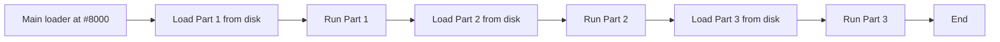

[← Plan](../../PLAN.md) · [DOS & Tape](README.md)

# TR-DOS Programming — Hook Codes, File Operations, Sector I/O

TR-DOS is the disk operating system that dominated the Soviet and post-Soviet ZX Spectrum demoscene. Every Pentagon, Scorpion, and Kay clone shipped with TR-DOS in ROM. Every Russian-language disk magazine, megademo, and game distributed on 5.25-inch floppy used TR-DOS file formats. If you are programming for the clone hardware that most real-iron Spectrum enthusiasts use today, TR-DOS is your filesystem.

This article covers TR-DOS from the assembly programmer's perspective. It is the second article in the [DOS and Tape series](README.md) and assumes you have read [tape_programming.md](tape_programming.md). It does **not** duplicate the [TR-DOS system reference](../../04_operating_systems/trdos.md) — that article covers the history, BASIC commands, disk format, and hook code API as a system-level reference. This article is the **practical code tutorial**: complete working examples of file loading, saving, catalog access, sector I/O, and the demoscene streaming patterns that make TR-DOS so powerful.

> [!NOTE]
> TR-DOS 5.04 is the de-facto standard version. All code examples in this article are verified against 5.04. Code that uses 5.03-specific or 5.05-specific features will be noted explicitly. For version differences, see [trdos.md](../../04_operating_systems/trdos.md) section 9.

---

## Entering TR-DOS Mode

TR-DOS lives in a 16 KB ROM on the Beta 128 disk interface card. This ROM is **not** normally visible in the Spectrum's address space — the BASIC ROM occupies `#0000`-`#3FFF`. To call TR-DOS routines, you must first **page in** the TR-DOS ROM.

### The ROM Paging Mechanism

The switch is controlled by bit 5 of port `#FF` (the Beta 128 system control port):

```
Port #FF bit layout:
  bit 0-1: Drive select (0=A, 1=B, 2=C, 3=D)
  bit 2:   Reserved
  bit 3:   Side select (0=side 0, 1=side 1)
  bit 4:   Density (0=FM single, 1=MFM double)
  bit 5:   ROM page bit 0 (TR-DOS ROM on/off)
  bit 6:   ROM page bit 1
  bit 7:   System ROM off (1=disable BASIC ROM)
```

When you write to port `#FF` with bit 5 set, the BASIC ROM is replaced by the TR-DOS ROM at `#0000`-`#3FFF`. Writing with bit 5 clear restores the BASIC ROM.

For the hardware details behind this mechanism, see [beta_disk_interface.md](../../03_io/storage/beta_disk_interface.md).

### The Standard Entry Sequence

The good news: the TR-DOS entry point at `#3D13` handles the ROM paging **automatically**. When you `CALL #3D13`, the first thing the TR-DOS code does is page itself in. You do not need to manually toggle port `#FF` before calling hook codes.

However, the `CALL #3D13` instruction itself must be reachable while the ROM is switching. Since the switch happens inside the `CALL`, the instruction at `#3D13` is in the TR-DOS ROM — but your `CALL` instruction is in your code (presumably in RAM at `#8000`+). The sequence works because the Z80 reads the `CALL` instruction from your code in RAM, then jumps to `#3D13` which is in the TR-DOS ROM (after it pages itself in).

The practical takeaway: **you do not need to manage ROM paging for hook code calls**. Just `CALL #3D13` with the hook code in B.

### Register Preservation

TR-DOS preserves **none** of the standard registers. After a hook code call, assume `AF`, `BC`, `DE`, `HL`, `IX`, and `IY` are all trashed. Save what you need before the call:

```z80
    PUSH IX                  ; save registers TR-DOS will trash
    PUSH IY
    PUSH DE
    PUSH HL

    LD   B, #04              ; hook code: READ_FILE
    LD   HL, filename        ; 9-byte filename
    LD   DE, #8000           ; load address
    CALL #3D13               ; dispatch

    POP  HL                  ; restore registers
    POP  DE
    POP  IY
    POP  IX
    JR   C, .success         ; carry set = success
    ; handle error (A = error code)
.success:
```

> [!WARNING]
> The IM1 interrupt service routine uses `IY` (pointing to system variables at `#5C3A`). If TR-DOS trashes IY and an interrupt fires before you restore it, the ISR reads garbage system variables. Always disable interrupts (`DI`) before TR-DOS calls if your program has interrupts enabled.

---

## Hook Codes — The File I/O API

TR-DOS provides nine standard hook codes for file and disk operations. All are called via the single dispatch address `#3D13` with the hook code in the B register.

### The Nine Hook Codes

| B | Name | Purpose | Parameters | Returns |
|---|---|---|---|---|
| `#00` | INIT | Re-initialize TR-DOS, select drive A | None | Carry set = ok |
| `#01` | SEEK | Seek to a specific track | A = track number | Carry set = ok |
| `#02` | READ-SECTOR | Read one sector into memory | A = track, C = sector (1-based), DE = dest addr | Carry set = ok |
| `#03` | WRITE-SECTOR | Write one sector from memory | A = track, C = sector (1-based), DE = source addr | Carry set = ok |
| `#04` | READ-FILE | Read a file by name into memory | HL = filename (9 bytes), DE = load address | Carry set = ok |
| `#05` | WRITE-FILE | Write memory to a new file | HL = filename (9 bytes), DE = start, BC = length | Carry set = ok |
| `#06` | READ-CAT-ENTRY | Read the Nth catalog entry | C = entry index (0-127), IX = 16-byte buffer | Carry set = ok |
| `#07` | SCAN-CAT | Find a file by name | HL = filename (9 bytes) | Carry set = found (C = index) |
| `#08` | DELETE-FILE | Delete a file by name | HL = filename (9 bytes) | Carry set = ok |

### Error Codes

When a hook code returns with carry clear (error), the A register holds an error code:

| A | Meaning |
|---|---|
| `#01` | Disk write-protected |
| `#02` | Disk not ready (no disk in drive) |
| `#03` | Disk I/O error (bad sector, CRC) |
| `#04` | Disk full |
| `#05` | File not found |
| `#06` | File already exists (WRITE-FILE) |
| `#07` | Directory full (128 entries max) |
| `#0A` | Seek error (track not found) |

### Filenames in TR-DOS

TR-DOS filenames are 9 bytes: 8 characters of name (space-padded) followed by 1 character of type extension. There is **no null terminator**.

```
Filename:  "GAME    C"
           ^^^^^^^^ ^
           |        |
           name     type (C=code, B=basic, D=data, #=screen)
           (8 chars, space-padded)
```

Common type characters:

| Type | Meaning |
|---|---|
| `B` | BASIC program |
| `C` | Code block (machine code) |
| `D` | Data array |
| `#` | Screen dump (6912 bytes at #4000) |
| `S` | SOTMA (custom, varies by software) |

The type character is a convention — TR-DOS does not enforce it. You can load a file of any type into any address.

---

## File Operations

### Loading a File

The most common TR-DOS operation: load a file by name into a known memory address. Hook code `#04` (READ-FILE).

```z80
; ============================================================
; trdos_load_file — load a file from disk
;
; Entry: HL = address of 9-byte filename string
;        DE = destination address in memory
; Exit:  carry set = success, carry clear = error (A = code)
; ============================================================
trdos_load_file:
    DI                       ; disable interrupts
    PUSH DE                  ; save destination
    PUSH IX                  ; save IX (TR-DOS trashes it)
    PUSH IY                  ; save IY

    LD   B, #04              ; hook code: READ_FILE
    CALL #3D13               ; dispatch

    POP  IY                  ; restore registers
    POP  IX
    POP  DE
    EI                       ; re-enable interrupts
    RET

; Usage example:
load_game_data:
    LD   HL, game_filename   ; 9-byte filename
    LD   DE, #8000           ; load to #8000
    CALL trdos_load_file
    JR   C, .ok              ; carry set = success
    ; Error handling
    CP   #05                 ; file not found?
    JR   Z, .missing
    ; Other error — display code
    CALL show_error
    RET
.missing:
    LD   HL, missing_msg
    CALL print_string
    RET
.ok:
    ; File loaded successfully at #8000
    RET

game_filename:   DB "GAMEDATA C"   ; 9 bytes: 8 + type
missing_msg:     DB "File not found", #0D, 0
```

### Saving a File

To write memory to a new file, use hook code `#05` (WRITE-FILE). Note: TR-DOS **refuses to overwrite** existing files. Delete first if needed.

```z80
; ============================================================
; trdos_save_file — save a memory block to a new file
;
; Entry: HL = 9-byte filename
;        DE = source address
;        BC = byte length
; Exit:  carry set = success
; ============================================================
trdos_save_file:
    DI
    PUSH IX
    PUSH IY

    LD   B, #05              ; hook code: WRITE_FILE
    CALL #3D13

    POP  IY
    POP  IX
    EI
    RET

; Save a high score table
save_scores:
    LD   HL, score_filename
    LD   DE, score_table     ; source address
    LD   BC, 64              ; 64 bytes of score data
    CALL trdos_save_file
    JR   C, .saved
    CP   #06                 ; file already exists?
    JR   Z, .replace
    RET                     ; other error
.replace:
    ; Delete the old file, then save again
    PUSH BC
    PUSH DE
    LD   B, #08              ; hook code: DELETE_FILE
    CALL #3D13
    POP  DE
    POP  BC
    JR   trdos_save_file     ; try again
.saved:
    RET

score_filename:   DB "SCORES   D"
score_table:      DEFS 64
```

### Deleting a File

```z80
trdos_delete:
    DI
    PUSH IX
    PUSH IY
    LD   B, #08              ; hook code: DELETE_FILE
    CALL #3D13
    POP  IY
    POP  IX
    EI
    RET
```

---

## Catalog Reader

Reading the disk directory programmatically is essential for file browsers, disk magazines, and game loaders that let the player select from multiple files on the disk.

### Reading a Single Catalog Entry

Hook code `#06` (READ-CAT-ENTRY) reads one of the 128 possible directory entries into a 16-byte buffer:

```z80
; ============================================================
; read_catalog_entry — read the Nth file from disk catalog
;
; Entry: C  = entry index (0-127)
;        IX = address of 16-byte buffer
; Exit:  carry set = entry exists, carry clear = end of catalog
; ============================================================
read_catalog_entry:
    DI
    PUSH HL
    PUSH DE
    PUSH BC

    LD   B, #06              ; hook code: READ_CAT_ENTRY
    CALL #3D13

    POP  BC
    POP  DE
    POP  HL
    EI
    RET
```

The 16-byte catalog entry has this structure:

| Offset | Size | Content |
|---|---|---|
| 0-7 | 8 bytes | Filename (space-padded, no type char) |
| 8 | 1 byte | File type (same as TR-DOS type character byte value) |
| 9-10 | 2 bytes | File length (little-endian, in bytes) |
| 11-12 | 2 bytes | Sector count |
| 13 | 1 byte | Starting track |
| 14 | 1 byte | Starting sector |
| 15 | 1 byte | Status flags |

### Printing the Full Catalog

Here is a complete routine that reads and displays all files on the disk:

```z80
print_catalog:
    LD   C, 0                ; start at entry 0
.cat_loop:
    LD   IX, cat_buf         ; buffer for entry
    CALL read_catalog_entry
    JR   NC, .cat_done        ; carry clear = no more entries

    ; Print the filename from cat_buf
    LD   HL, cat_buf         ; filename is first 8 bytes
    LD   B, 8
.print_name:
    LD   A, (HL)
    AND  A                   ; skip null bytes
    JR   Z, .skip_char
    CALL #16C0               ; ROM PRINT_CHAR (approximate addr)
.skip_char:
    INC  HL
    DJNZ .print_name

    ; Print file type
    LD   A, (cat_buf + 8)    ; type byte
    CALL print_char_a

    ; Print file size
    LD   A, ' '
    CALL print_char_a
    LD   HL, (cat_buf + 9)   ; file length
    CALL print_decimal

    ; Newline
    LD   A, #0D
    CALL print_char_a

    INC  C                   ; next entry
    LD   A, C
    CP   128                 ; max 128 entries
    JR   NZ, .cat_loop
.cat_done:
    RET

cat_buf:   DEFS 16           ; catalog entry buffer
```

### Finding a File by Name

Hook code `#07` (SCAN-CAT) searches the catalog for a specific filename:

```z80
; ============================================================
; find_file — check if a file exists on disk
;
; Entry: HL = 9-byte filename
; Exit:  carry set = found (C = catalog index)
;        carry clear = not found
; ============================================================
find_file:
    DI
    PUSH IX
    PUSH IY
    LD   B, #07              ; hook code: SCAN_CAT
    CALL #3D13
    POP  IY
    POP  IX
    EI
    RET

; Usage: check if a save file exists
check_save:
    LD   HL, save_filename
    CALL find_file
    JR   C, .exists
    ; File not found — new game
    XOR  A
    RET
.exists:
    LD   A, #FF              ; save exists
    RET

save_filename:   DB "SAVEGAME D"
```

---

## Direct Sector I/O

For maximum control and speed, you can bypass the filesystem entirely and read or write raw disk sectors. Hook codes `#02` (READ-SECTOR) and `#03` (WRITE-SECTOR) give direct access to any sector on the disk.

### Disk Geometry

A standard TR-DOS disk has 80 tracks (0-79), 2 sides, 16 sectors per track (1-16), and 256 bytes per sector. Total capacity: 80 x 2 x 16 x 256 = 655,360 bytes (~640 KB).

```
Track 0, Side 0, Sector 1    = first sector on disk
Track 0, Side 0, Sector 16   = last sector on track 0 side 0
Track 0, Side 1, Sector 1    = first sector on track 0 side 1
Track 1, Side 0, Sector 1    = first sector on track 1
...
Track 79, Side 1, Sector 16  = last sector on disk
```

### Reading a Sector

```z80
; ============================================================
; read_sector — read one disk sector
;
; Entry: A  = track number (0-79)
;        C  = sector number (1-16)
;        DE = destination address
; Exit:  carry set = success
; ============================================================
read_sector:
    DI
    PUSH IX
    PUSH IY
    PUSH HL
    PUSH BC

    LD   B, #02              ; hook code: READ_SECTOR
    CALL #3D13

    POP  BC
    POP  HL
    POP  IY
    POP  IX
    EI
    RET

; Read sector 1 of track 0 (contains the disk catalog)
read_directory_sector:
    XOR  A                   ; track 0
    LD   C, 1                ; sector 1
    LD   DE, dir_buffer      ; destination
    CALL read_sector
    JR   C, .ok
    ; Error reading disk
    RET
.ok:
    ; dir_buffer now contains 256 bytes of raw sector data
    RET

dir_buffer:   DEFS 256
```

### Writing a Sector

```z80
; ============================================================
; write_sector — write one disk sector
;
; Entry: A  = track number
;        C  = sector number
;        DE = source address
; Exit:  carry set = success
; ============================================================
write_sector:
    DI
    PUSH IX
    PUSH IY
    PUSH HL
    PUSH BC

    LD   B, #03              ; hook code: WRITE_SECTOR
    CALL #3D13

    POP  BC
    POP  HL
    POP  IY
    POP  IX
    EI
    RET
```

> [!WARNING]
> Writing raw sectors bypasses the filesystem. If you write to catalog sectors (track 0, sectors 1-8), you can corrupt the directory structure. Always backup disk images before testing sector-writing code.

### Sector Editor Example

Here is a minimal sector reader that displays any sector in hex:

```z80
; Read and display a sector
; Entry: user selects track/sector via keyboard
sector_viewer:
    ; Get track number
    CALL get_track_input     ; returns A = track
    LD   (viewer_track), A
    ; Get sector number
    CALL get_sector_input    ; returns A = sector
    LD   C, A
    ; Read sector
    LD   A, (viewer_track)
    LD   DE, viewer_buf
    CALL read_sector
    JR   NC, .read_err

    ; Display 256 bytes in hex format
    LD   HL, viewer_buf
    LD   B, 16               ; 16 rows of 16 bytes
.row_loop:
    PUSH BC
    LD   B, 16               ; 16 bytes per row
.col_loop:
    LD   A, (HL)
    CALL print_hex_byte      ; print A as 2-digit hex
    LD   A, ' '
    CALL print_char_a
    INC  HL
    DJNZ .col_loop
    LD   A, #0D
    CALL print_char_a
    POP  BC
    DJNZ .row_loop
    RET
.read_err:
    LD   HL, read_err_msg
    CALL print_string
    RET

viewer_track:   DEFB 0
viewer_buf:     DEFS 256
read_err_msg:   DB "Disk read error", #0D, 0
```

---

## Streaming from Disk — Demoscene Pattern

The most powerful use of TR-DOS is **streaming**: loading parts of a program sequentially from disk while displaying effects. This is how megademos and disk magazines work — each "part" is a separate file on disk, loaded just before it runs.

### The Basic Pattern



The main loader stays resident in memory at a fixed address. Each part is loaded into a temporary area, executed, and then overwritten by the next part.

```z80
; ============================================================
; Demo streaming loader
; Loads and runs parts sequentially from disk
; ============================================================

demo_loader:
    ; Load and run each part in sequence
    LD   HL, part1_name
    LD   DE, #C000           ; load part 1 to #C000
    CALL trdos_load_file
    JR   C, .run_part1
    JP   disk_error
.run_part1:
    CALL #C000               ; run part 1

    LD   HL, part2_name
    LD   DE, #C000           ; overwrite with part 2
    CALL trdos_load_file
    JR   C, .run_part2
    JP   disk_error
.run_part2:
    CALL #C000               ; run part 2

    LD   HL, part3_name
    LD   DE, #C000           ; overwrite with part 3
    CALL trdos_load_file
    JR   C, .run_part3
    JP   disk_error
.run_part3:
    CALL #C000               ; run part 3
    RET                      ; demo complete

part1_name:   DB "PART1    C"
part2_name:   DB "PART2    C"
part3_name:   DB "PART3    C"
disk_error:   ; handle error
    RET
```

### Double-Buffering on 128K

On a 128K Spectrum (or Pentagon), you can use RAM banks for double-buffering: load the next part into bank 7 while the current part runs from bank 5. The switch is instant.

```z80
; ============================================================
; 128K double-buffered streaming
; Uses RAM banks at #C000 for background loading
; ============================================================

stream_next_part:
    ; Switch to bank 7 (loading buffer)
    LD   A, 7                ; bank 7
    LD   BC, #7FFD           ; paging port
    LD   (current_bank), A
    CALL page_bank           ; switch

    ; Load next part into bank 7 at #C000
    LD   HL, next_part_name
    LD   DE, #C000
    CALL trdos_load_file
    JR   NC, stream_error

    ; Switch back to bank 5 (display code)
    LD   A, 5
    CALL page_bank
    RET

; Switch RAM bank at #C000
; Entry: A = bank number (0-7)
page_bank:
    LD   BC, #7FFD
    OR   #10                 ; keep screen in bank 5
    LD   (BC), A
    RET

current_bank:   DEFB 5
next_part_name: DB "PART5    C"
stream_error:   RET
```

### Continuous Data Streaming

For demoscene effects that need continuous data (large sprite tables, audio samples), you can stream sectors from disk while the effect runs. The technique:

1. **Pre-load a buffer** with the first few sectors
2. **Run the effect**, consuming data from the buffer
3. **In the vertical blank interrupt**, load the next sector from disk
4. **Repeat** until the effect ends

This requires a custom ISR that calls `READ-SECTOR` during the vertical blank period. The key constraint: the disk read must complete within the ~30,000 T-states of vblank time. A single sector read (256 bytes) takes about 5,000-10,000 T-states on a WD1793 — fast enough for one sector per frame.

```z80
; Custom ISR that streams one sector per frame
; HL = current buffer position
; C  = current sector
; B  = track

stream_isr:
    EX   AF, AF'             ; save A and flags
    EXX                      ; save BC, DE, HL

    ; Read next sector
    LD   A, (stream_track)
    LD   C, A                ; sector
    LD   A, (stream_track + 1) ; track
    LD   DE, (stream_buf_ptr)
    PUSH DE
    LD   B, #02              ; READ_SECTOR
    CALL #3D13
    POP  DE

    ; Advance buffer pointer
    LD   HL, (stream_buf_ptr)
    LD   DE, 256
    ADD  HL, DE
    LD   (stream_buf_ptr), HL

    ; Increment sector/track
    LD   A, (stream_sector)
    INC  A
    CP   17                  ; sector 16 is last
    JR   NZ, .same_track
    LD   A, 1                ; reset to sector 1
    LD   HL, stream_track
    INC  (HL)                ; next track
.same_track:
    LD   (stream_sector), A

    EXX                      ; restore registers
    EX   AF, AF'
    EI
    RETI

stream_track:    DEFB 0, 0     ; sector, track
stream_sector:   DEFB 1
stream_buf_ptr:  DEFW #C000
```

> [!WARNING]
> The streaming ISR calls TR-DOS, which trashes all registers. The ISR must save and restore the alternate register set (`EXX`, `EX AF,AF'`) to protect the main loop's state. If the main loop also uses the alternate registers, you need a different approach (push/pop the full register set).

---

## Error Handling

### Common Disk Errors

| Scenario | Error Code | Recovery |
|---|---|---|
| No disk in drive | `#02` | Display message, prompt user to insert disk |
| Write-protected disk | `#01` | Display message, prompt user |
| File not found | `#05` | Check filename spelling, try alternate names |
| Disk full | `#04` | Prompt user to free space or use another disk |
| Directory full | `#07` | Delete unused files first |
| Bad sector (CRC error) | `#03` | Retry 2-3 times, then skip or abort |
| Seek error | `#0A` | Re-initialize drive (hook code `#00`), retry |

### Retry Logic with User Feedback

```z80
; Robust file loader with retry and user prompts
robust_load:
    LD   B, 3               ; max retries
.retry:
    PUSH BC
    CALL trdos_load_file     ; HL = filename, DE = dest
    POP  BC
    JR   C, .success

    ; Error handling based on code
    CP   #02                 ; no disk?
    JR   Z, .no_disk
    CP   #05                 ; file not found?
    JR   Z, .not_found
    CP   #03                 ; I/O error? (retryable)
    JR   Z, .retryable
    ; Non-retryable error
    CALL show_fatal_error
    RET
.retryable:
    DJNZ .retry              ; try again
    CALL show_retry_failed
    RET
.no_disk:
    LD   HL, no_disk_msg
    CALL prompt_user         ; "Insert disk and press any key"
    JR   robust_load         ; start over
.not_found:
    LD   HL, not_found_msg
    CALL print_string
    RET
.success:
    ; File loaded successfully
    XOR  A                   ; A = 0 = success
    RET

no_disk_msg:    DB "Insert disk in drive A, press any key", #0D, 0
not_found_msg:  DB "File not found on disk", #0D, 0
```

---

## Pitfalls

### 1 — IY Corruption

TR-DOS does not preserve `IY`. If an interrupt fires while IY holds a wrong value, the ROM ISR will crash or corrupt system variables.

**Fix**: Always `DI` before hook code calls and `EI` after. Alternatively, save/restore IY around the call.

### 2 — TR-DOS 5.03 vs 5.04 API Differences

Hook codes `#00`-`#08` are stable across all versions. However, hook codes above `#08` (rename, format, etc.) differ between 5.03 and 5.04. Code that uses these extended hook codes may fail on the "wrong" version.

**Fix**: Detect the TR-DOS version at startup and branch accordingly. The version string is at a known location in the TR-DOS ROM — see [trdos.md](../../04_operating_systems/trdos.md) section 9 for the detection method.

### 3 — Interrupt Timing During Sector Reads

If interrupts are enabled during a `READ-SECTOR` call, the IM1 ISR can fire at a critical moment and cause the WD1793 to lose data. TR-DOS disables interrupts internally, but if you call the WD1793 directly (bypassing hook codes), you must manage interrupts yourself.

**Fix**: Always `DI` before direct FDC access. Use `RETI` at the end of any ISR that touches disk I/O.

### 4 — Bank Switching Conflicts on 128K

On a 128K machine, TR-DOS uses RAM bank 0 at `#C000`-`#FFFF` as workspace. If your program has a different bank paged in at `#C000`, TR-DOS calls will corrupt your data.

**Fix**: Before calling TR-DOS hook codes, page in bank 0 at `#C000`:
```z80
    LD   A, #10              ; bank 0 at #C000, screen in bank 5
    LD   BC, #7FFD
    LD   (BC), A
    ; Now safe to call TR-DOS
```

### 5 — Write-File Always Creates New Entries

`WRITE-FILE` (hook code `#05`) always allocates a new catalog slot. If a file with the same name already exists, you get error `#06` (file exists). You cannot overwrite in place.

**Fix**: Always `DELETE-FILE` before `WRITE-FILE` when updating an existing file. Be aware that a failed write leaves a partially-written catalog entry — call `DELETE-FILE` to clean up.

### 6 — System Variable Area Collision

TR-DOS uses system variables at `#5CF6`-`#5CFB` for its own state (drive selection, catalog pointer, etc.). If your program writes to these addresses, TR-DOS will malfunction.

**Fix**: Never use the address range `#5CF6`-`#5CFF` for your own variables. Use addresses above `#5CC0` only after checking [system_variables.md](../../04_operating_systems/system_variables.md) for TR-DOS reservations.

---

## Cross-References

- **[trdos.md](../../04_operating_systems/trdos.md)** — TR-DOS system reference (history, BASIC commands, disk format, hook code details)
- **[beta_disk_interface.md](../../03_io/storage/beta_disk_interface.md)** — Beta 128 hardware (port layout, ROM banking, WD1793)
- **[trd_disk_format.md](../../03_io/storage/trd_disk_format.md)** — TR-DOS disk geometry, directory structure, file allocation
- **[trd_scl_formats.md](../../03_io/storage/trd_scl_formats.md)** — .TRD and .SCL file format reference (for emulator images)
- **[fdc_vg93.md](../../03_io/storage/fdc_vg93.md)** — WD1793 FDC complete reference (direct sector access without hook codes)
- **[system_variables.md](../../04_operating_systems/system_variables.md)** — system variable addresses used by TR-DOS
- **[tape_programming.md](tape_programming.md)** — tape loading (the slower alternative to disk)
- **[dos_programming.md](dos_programming.md)** — Western DOS APIs (+3 DOS, ESXDOS) for comparison
- **[assembly_patterns.md](../02_assembly/assembly_patterns.md)** — dispatch tables for multi-part demo loaders
- **[file_format_handling.md](file_format_handling.md)** — parsing .TRD disk images from code

## References

- *TR-DOS 5.03 Disassembly* by programandala.net — annotated source code on GitHub
- *Beta Disk Interface Manual V4* — Technology Research official documentation
- [TR-DOS Wikipedia](https://en.wikipedia.org/wiki/TR-DOS) — version history and feature summary
- Pentagon and Scorpion clone documentation on [zx-pk.ru](https://zx-pk.ru) forums
- [trdos.md](../../04_operating_systems/trdos.md) — canonical in-repo TR-DOS reference (885 lines)
