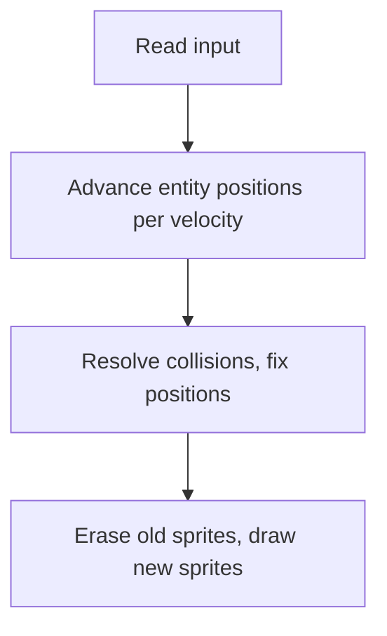

[← Game Dev](README.md) · [Entities, Collision, AI](entities_collision_ai.md)

# Entities, Collision Detection, and Game AI — The Architectural Backbone

> **Scope**: This article covers the engine subsystem that sits between the main loop (see [game_loop.md](game_loop.md)) and the renderer (see [sprites_and_masking.md](../06_graphics/sprites_and_masking.md)). It is the **`update_world` call** in the universal game loop: the per-frame work of advancing every active entity, detecting collisions, and applying AI behavior.

For *how* to draw an entity once its position is updated, see the [Graphics Techniques series](../06_graphics/README.md). For *how* to structure the per-frame dispatch that calls entity updates, see [game_loop.md](game_loop.md). This article covers what happens *inside* the entity update: storage strategies, update ordering, collision detection algorithms, and the AI patterns that drive non-player entities.

---

## Article Roadmap

- §1 — Entity storage: fixed pools vs linked lists vs hybrid schemes
- §2 — The update phase: ordering, determinism, dual-phase (erase + draw)
- §3 — Collision detection: broad phase vs narrow phase, the four canonical algorithms
- §4 — Tile-based world collision: platforms, walls, slopes, one-way floors
- §5 — AI patterns: finite state machines, steering, pathfinding on 8-bit
- §6 — Performance budgets and pitfalls

---

## 1. Entity Storage — Pools, Lists, and Tables

A ZX Spectrum game has at most a few dozen active entities at any moment: the player, a handful of enemies, some projectiles, a few items. There is no benefit to dynamic data structures — the costs of allocation, pointer chasing, and fragmentation are entirely overhead. **Every commercial Spectrum game uses a fixed-size table of entity records.**

### The canonical object pool

```z80
; Entity record: 8 bytes per entity
STRUC ENTITY
        .x         DEFB 1            ; X position (pixel, 0-255)
        .y         DEFB 1            ; Y position (pixel, 0-191)
        .xsub      DEFB 1            ; X sub-pixel (fractional part for smooth motion)
        .ysub      DEFB 1            ; Y sub-pixel
        .vx        DEFB 1            ; X velocity (signed, in 1/256 pixels per frame)
        .vy        DEFB 1            ; Y velocity
        .type      DEFB 1            ; Entity type (player, enemy, item, projectile)
        .state     DEFB 1            ; Per-entity state byte (FSM state, animation frame, etc.)
ENDSTruc

; The pool: 16 entities, fixed
ENTITY_COUNT EQU 16
entity_pool   ENTITY ENTITY_COUNT    ; 16 × 8 = 128 bytes
```

Total cost: 128 bytes for 16 entities with 8 bytes of state each. *Manic Miner* uses 4 entities (player + up to 3 guardians); *Jet Set Willy* uses 16; *Knight Lore* uses ~32 (player + multiple room objects). The pool is allocated at assembly time, statically, in the engine's data segment. There is no `malloc`, no `free`, no fragmentation.

### Slot allocation

Each entity occupies a fixed slot in the pool. The convention:

- **Slot 0** — the player. Always active. Always the first entity updated.
- **Slots 1–7** — primary entities (enemies, NPCs). Active or inactive based on level state.
- **Slots 8–15** — projectiles, transient effects (explosions, particles). Spawned and despawned during gameplay.

The `type` byte distinguishes what each entity *is*; the slot index is just where it lives. Slot 4 might hold a guardian in one room and a projectile in another. The engine code dispatches on `type`, not on slot index.

```z80
; Per-frame entity update: iterate the pool, dispatch on type
update_entities:
        LD    HL,entity_pool
        LD    B,ENTITY_COUNT
.ent_loop:
        LD    A,(HL+ENTITY.type)
        OR    A
        JR    Z,.ent_skip            ; type=0: slot is empty
        ; Dispatch on type
        CP    TYPE_PLAYER
        JR    Z,.update_player
        CP    TYPE_GUARDIAN
        JR    Z,.update_guardian
        CP    TYPE_PROJECTILE
        JR    Z,.update_projectile
        ; ... etc
.ent_skip:
        LD    DE,ENTITY_SIZE
        ADD   HL,DE
        DJNZ .ent_loop
        RET

.update_player:
        ; ... update slot 0 ...
        JR    .ent_skip

.update_guardian:
        ; ... update guardian AI ...
        JR    .ent_skip
```

The cost of this iteration is **~40 T-states per entity** (load type, dispatch JR, advance pointer). For 16 entities, that is 640 T-states just for the dispatch — well under 1% of the frame budget.

### The "active" bit and spawn/despawn

Entities that are conceptually present in the world but not currently active (a guardian that has not yet entered the player's screen, a projectile that has expired) use the `type` byte as a presence indicator: `type = 0` means empty slot. Spawning a new entity is just:

```z80
; Spawn a projectile in the first empty slot
spawn_projectile:
        LD    HL,entity_pool + 8 * ENTITY_SIZE    ; Skip player + guardian slots
        LD    B,8                                  ; 8 transient slots
.find_slot:
        LD    A,(HL+ENTITY.type)
        OR    A
        JR    Z,.found
        LD    DE,ENTITY_SIZE
        ADD   HL,DE
        DJNZ .find_slot
        RET                                       ; No slot available — projectile not spawned

.found:
        LD    (HL+ENTITY.type),A2                 ; Wait, A was 0; set it to TYPE_PROJECTILE
        LD    A,TYPE_PROJECTILE
        LD    (HL+ENTITY.type),A
        ; Copy in initial position/velocity from registers
        ; ...
        RET
```

Despawn is just `LD (HL+ENTITY.type),0`. No deallocation, no memory fragmentation, no garbage collection.

### Why no linked lists?

Linked lists are the data structure of choice for variable-size collections on modern hardware — they support O(1) insertion and deletion, and the cost of pointer chasing is hidden by the cache. On the ZX Spectrum:

1. There is no cache. Every pointer dereference costs the full memory access time.
2. There is no dynamic allocation. The heap does not exist; `malloc` is not in the runtime.
3. Fixed pool sizes are small enough (16–32 entities) that linear scan is faster than pointer chasing.

Linked lists exist in **system-level data structures** — the ROM's `CHANS`, `PROG`, `VARS` area is a linked list of channel and variable records — but **not in game engines**. The closest analog in commercial Spectrum code is *Jet Set Willy*'s use of fixed-size guardian slots (4 horizontal + 4 vertical guardians per room), which is functionally a pool.

---

## 2. The Update Phase — Ordering and Determinism

The order in which entities update matters. If entity A moves before entity B checks collision with A's old position, B sees stale data. If A moves first and the renderer draws before B updates, B's sprite is one frame behind.

### The canonical order: input → update → collide → render



This is the order used by *every* commercial Spectrum platformer. Key properties:

1. **Input is fresh.** The player's button press affects this frame's update, not last frame's.
2. **All positions advance before any collision is tested.** This avoids "phantom collisions" where A's old position blocks B's new movement.
3. **Collision resolution modifies positions in-place.** If A overlaps B, one or both are moved back; the renderer sees the corrected positions.
4. **Rendering happens once, at the end.** No mid-frame sprite redraws.

### The dual-phase erase/draw pattern

For software-sprite games (every game without Layer 2 / Next hardware sprites), each entity must be **erased from its old position** before being **drawn at its new position**. The naive approach:

```z80
; Wrong: erase + draw each entity in one pass
for each entity:
    erase_entity_at_old_position
    update_position
    draw_entity_at_new_position
```

This fails when entity A's new position overlaps entity B's old position — erasing B before drawing A leaves a hole. The fix is the **dual-phase pattern**:

```z80
; Phase 1: erase all entities at their old positions
for each entity:
    erase_entity_at_old_position
; Phase 2: update positions
for each entity:
    update_position
; Phase 3: draw all entities at their new positions
for each entity:
    draw_entity_at_new_position
```

This is what *Manic Miner*, *Jet Set Willy*, *Chuckie Egg*, and every other software-sprite game does. The cost is two passes through the entity table (~80 T-states × 16 entities = 1,280 T-states total), but the correctness is worth it.

> [!NOTE]
> The "old position" for erase can be the entity's current `(x, y)` at the start of the frame, or it can be a separately stored `(prev_x, prev_y)` pair. The latter costs 2 extra bytes per entity but allows the erase to happen at any point during the frame, including during the ISR.

### Determinism — why update order matters

If two entities are adjacent and both try to move into the same tile, the result depends on which one moves first. The convention: **update the player first, then enemies in slot order**. This means the player always has initiative — if the player moves into a guardian's tile, the player moves *through* and dies; if a guardian moves into the player's tile, the guardian catches up and kills the player. The visible effect is the same (player dies), but the deterministic order makes the game fair: the player can always react one frame before the AI.

For multi-entity interactions (two guardians colliding), the convention is slot-order: lower slot number wins ties. This is what every Manic Miner / Jet Set Willy clone does.

### Skipping inactive entities

With a 16-entity pool, typically 5–10 are active at any moment. The dispatch loop checks `type = 0` and skips — but the cost of skipping is still paid (load, test, advance pointer). For very large pools (32+ entities), a separate **active-list** of slot indices can be maintained, and the loop iterates the active-list instead of the full pool. This is rare on the Spectrum — most pools are small enough that linear scan is faster than maintaining a secondary list.

---

## 3. Collision Detection — Four Canonical Algorithms

Collision detection on the Spectrum is dominated by **AABB (axis-aligned bounding box)** tests, because they reduce to four integer comparisons. Pixel-perfect collision is rarer (more expensive, often unnecessary). Tile-based world collision is universal in platformers.

### Algorithm 1 — AABB overlap test (entities vs entities)

```z80
; Test if entity at (HL) collides with entity at (DE)
; Both records have .x, .y, .w, .h (width, height)
; Returns: Z flag set if collision
aabb_test:
        ; Compute entity A's right edge
        LD    A,(HL+ENTITY.x)
        ADD   A,(HL+ENTITY.w)       ; A = A.x + A.w (A.right)
        ; Compare against entity B's left edge
        CP    (DE+ENTITY.x)         ; A.right < B.x?
        JR    C,.no_collide          ; If A.right < B.x, no collision
        ; Compute entity B's right edge
        LD    A,(DE+ENTITY.x)
        ADD   A,(DE+ENTITY.w)
        CP    (HL+ENTITY.x)
        JR    C,.no_collide          ; If B.right < A.x, no collision
        ; Now do Y axis (same logic)
        LD    A,(HL+ENTITY.y)
        ADD   A,(HL+ENTITY.h)
        CP    (DE+ENTITY.y)
        JR    C,.no_collide
        LD    A,(DE+ENTITY.y)
        ADD   A,(DE+ENTITY.h)
        CP    (HL+ENTITY.y)
        JR    C,.no_collide
        ; All four tests failed to find separation → collision
        CP    A                       ; Set Z flag
        RET
.no_collide:
        OR    1                       ; Clear Z flag
        RET
```

Cost: ~80 T-states per pair. For 16 entities, full pairwise testing is 16 × 16 / 2 = 128 pairs × 80 T-states = **10,240 T-states per frame**. This is well within budget for most games.

The bounding box is typically **smaller than the sprite** — a 16×16 sprite might use a 12×12 collision box, centered. This gives the player "forgiveness" — close calls that visually look like collisions but do not register, making the game feel fair. *Manic Miner* uses an 8×12 box for the player against a 16×16 sprite; *Jet Set Willy* uses 6×12.

### Algorithm 2 — Grid-based broad phase

For 32+ entities, pairwise AABB becomes expensive (~40,000 T-states). The **broad phase** reduces the work by partitioning the world into a coarse grid and only testing entities within the same (or neighboring) cells.

```z80
; Build the grid: each entity is placed in a cell based on (x/16, y/16)
build_grid:
        LD    HL,entity_pool
        LD    B,ENTITY_COUNT
.ent_loop:
        LD    A,(HL+ENTITY.type)
        OR    A
        JR    Z,.ent_next
        ; Compute grid cell
        LD    A,(HL+ENTITY.x)
        RRCA / RRCA / RRCA / RRCA     ; Divide by 16
        AND  #0F                       ; 16 columns
        LD    C,A
        LD    A,(HL+ENTITY.y)
        RRCA / RRCA / RRCA / RRCA
        AND  #0F
        ; Compute grid index = col * 16 + row
        ; ... store entity slot in grid[cell] list ...
.ent_next:
        ; ... advance HL ...
        DJNZ .ent_loop
        RET
```

Each cell holds a list of entities currently in it. Collision testing then iterates cells and tests pairs *within the same cell*. For uniformly distributed entities, this reduces work from O(n²) to O(n).

This pattern is **rare in 8-bit games** because most have small entity counts. It appears in some later Russian RPGs and in shoot-em-ups with dozens of bullets on screen.

### Algorithm 3 — Pixel-precise collision

For cases where AABB is too coarse (a small projectile hitting a large enemy with internal transparency), pixel-precise collision checks the actual sprite masks at the overlap region.

```z80
; Pixel-precise test: check if any non-transparent pixel overlaps
pixel_collision:
        ; Find overlap rectangle
        CALL  compute_overlap        ; Returns overlap in (x0,y0)-(x1,y1)
        ; If overlap area is empty, return no-collision
        LD    A,(overlap_w)
        OR    A
        RET   Z
        ; For each row of overlap:
        LD    B,(overlap_h)
.row_loop:
        ; For each pixel in row:
        ;   read pixel from sprite A
        ;   if transparent, skip
        ;   read pixel from sprite B
        ;   if transparent, skip
        ;   both opaque → collision!
        ; ...
        DJNZ  .row_loop
        RET
```

Cost: highly variable, but typically 200–500 T-states per pair, depending on overlap size. Used sparingly — usually only for player-vs-guardian in platformers, where the player expects pixel-perfect fairness. *Chuckie Egg* uses pixel-precise collision between the player and the chickens; *Jet Set Willy* uses it for the player-vs-guardian test (with the AABB test as a broad-phase filter).

### Algorithm 4 — Attribute-based collision

The ZX Spectrum's attribute file (`#5800`–`#5AFF`) is a 32×24 grid of 8×8 cells. Each byte encodes the ink/paper colors of one cell. Some games exploit this for collision detection: a particular ink color is reserved for "solid" cells (walls, floors), and the player's collision test reads the attribute at the player's position to check for solid.

```z80
; Test: is the cell at (B=x/8, C=y/8) solid?
; Returns: Z flag set if solid
is_solid:
        LD    A,C                     ; Y / 8 = char row
        RRCA / RRCA / RRCA
        AND  #1F
        ADD  A,A                       ; × 64 (each row is 32 bytes, but × 32 = RLCA 5 times)
        LD    L,A
        LD    H,#58                    ; Attribute file base
        LD    A,(HL)
        AND  #07                       ; Test ink color
        CP    INK_SOLID                ; Solid color (e.g., blue)
        RET
```

Cost: ~30 T-states per test. **Attribute-based collision is the cheapest tile-collision method**, used in *Manic Miner*, *Jet Set Willy*, *Chuckie Egg*, and many others. The level data encodes which cells are walls (via the screen-layout attribute bytes); the engine reads them directly.

The trade-off: collision is at 8×8 granularity. The player cannot stand on a 4-pixel-wide ledge or pass through a 6-pixel-wide gap. For most platformers this is acceptable; for fine-grained movement (e.g., isometric games like *Knight Lore*), it is not.

---

## 4. Tile-Based World Collision — Platforms, Walls, Slopes

For platformers, the world is a grid of tiles. Collision detection reduces to: "is the tile at (player_x, player_y + player_h) solid?". The player's position is updated, then resolved tile-by-tile against the world.

### The four-direction resolution

A player moving diagonally into a corner must be resolved on each axis independently: first X (try to move horizontally, stop at wall), then Y (try to move vertically, stop at floor). This is the **axis-separated resolution** pattern.

```z80
; Player wants to move (dx, dy) this frame
move_player:
        ; Save old position
        LD    HL,(player_x)
        LD    (player_old_x),HL
        ; Apply X movement
        LD    A,(player_x)
        ADD   A,(player_dx)
        LD    (player_x),A
        ; Check if new X position is inside a wall
        CALL  check_player_horizontal_collision
        JR    NC,.x_ok                ; No collision: keep new X
        LD    A,(player_old_x)        ; Collision: revert to old X
        LD    (player_x),A
.x_ok:
        ; Apply Y movement (same pattern)
        LD    A,(player_y)
        ADD   A,(player_dy)
        LD    (player_y),A
        CALL  check_player_vertical_collision
        JR    NC,.y_ok
        LD    A,(player_old_y)
        LD    (player_y),A
        LD    A,0                     ; Also zero the Y velocity (landed on floor or hit ceiling)
        LD    (player_dy),A
.y_ok:
        RET
```

Axis separation is essential. If both axes are tested together, the player cannot slide along walls — touching a wall while moving diagonally stops all movement, which feels broken.

### Gravity, jumping, and the floor check

The player's Y velocity accumulates gravity each frame: `vy = vy + GRAVITY`. When the floor check returns "collided", vy is reset to zero and the player is snapped to the top of the tile.

```z80
apply_gravity:
        LD    A,(player_vy)
        ADD   A,GRAVITY_CONST         ; Typically 1 or 2 (sub-pixel)
        LD    (player_vy),A
        ; If vy is now large, cap it (terminal velocity)
        CP    MAX_FALL_SPEED
        JR    C,.vy_ok
        LD    A,MAX_FALL_SPEED
        LD    (player_vy),A
.vy_ok:
        RET
```

A jump is just `player_vy = -JUMP_STRENGTH` for one frame. The rest of the jump arc is the gravity simulation doing its work. *Manic Miner*'s jump is fixed-height (the player cannot interrupt a jump once started); *Jet Set Willy* uses variable-height jumps (the player can release jump early for a shorter hop).

### One-way platforms

A common platformer feature: the player can jump up *through* a platform from below and land on top of it. The collision rule is: the tile is solid only when tested from above (player falling onto it), not from below (player rising).

```z80
check_one_way_platform:
        ; Only collide if player is FALLING (vy > 0)
        LD    A,(player_vy)
        BIT   7,A                     ; Sign bit
        JR    NZ,.not_collide          ; vy < 0 (rising): pass through
        ; Only collide if player's feet were ABOVE the platform last frame
        LD    A,(player_old_y)
        ADD   A,PLAYER_H
        ; ... compute platform's Y in same coordinate system ...
        CP    platform_y
        JR    NC,.not_collide          ; Player was below platform last frame: pass through
        ; Otherwise: collide
        CP    A
        RET
.not_collide:
        OR    1
        RET
```

One-way platforms appear in *Jet Set Willy* (the carpets and beds in some rooms), *Monty on the Run*, and most later platformers.

### Slopes

True slope collision (the player walking up a 30-degree incline) is rare in Spectrum games because it requires sub-tile resolution and careful case analysis. The standard approach is **stair-stepping**: the world uses tiles of different heights, and the player snaps up by one tile when walking into a step that is exactly one tile high. *Head Over Heels* and *Batman* use this for their pseudo-3D rooms; *Knight Lore* does not have true slopes but uses "ramps" implemented as a series of small steps.

### The conveyor belt

*Manic Miner* introduces a special case: the conveyor belt. The tile attribute signals "conveyor left" or "conveyor right", and the player's X position is adjusted by one pixel per frame in the conveyor's direction, in addition to the player's own input. This is implemented in the horizontal collision resolution:

```z80
check_player_horizontal_collision:
        ; ... standard wall checks ...
        ; Conveyor adjustment: read the floor tile's attribute
        CALL  get_floor_attr            ; Returns attribute byte at player's feet
        AND  #07                        ; Ink bits
        CP    INK_CONVEYOR_LEFT
        JR    NZ,.not_left
        ; Move player 1 pixel left
        LD    A,(player_x)
        DEC   A
        LD    (player_x),A
.not_left:
        CP    INK_CONVEYOR_RIGHT
        RET   NZ
        LD    A,(player_x)
        INC   A
        LD    (player_x),A
        RET
```

This is how *Manic Miner*'s "The Menagerie" conveyor works, and the same pattern appears in *Jet Set Willy* and many platformers that borrow the Matthew Smith engine conventions.

---

## 5. Game AI Patterns — FSMs, Steering, and Pathfinding

Game AI on the ZX Spectrum is not modern game AI. There is no behavior tree library, no A* pathfinding through a navigation mesh, no utility-system reasoner. What there is: **finite state machines**, **fixed-path waypoints**, and **simple steering toward the player**. These are sufficient for arcade gameplay because the player's reaction time (≈150 ms) is much longer than a frame (20 ms), so the AI only needs to be unpredictable on the timescale of seconds, not milliseconds.

### Pattern 1 — The finite state machine (universal)

Every Spectrum game entity with non-trivial behavior has a state byte that selects its current behavior. Transitions are explicit rules: "if in state X and condition Y holds, go to state Z".

```z80
; Guardian AI: state byte drives behavior
GSTATE_PATROL EQU 0       ; Walk back and forth between two waypoints
GSTATE_CHASE  EQU 1       ; Move toward the player
GSTATE_ATTACK EQU 2       ; Attack animation playing
GSTATE_FLEE   EQU 3       ; Move away from the player
GSTATE_DEAD   EQU 4       ; Death animation, then despawn

update_guardian:
        LD    A,(HL+ENTITY.state)
        CP    GSTATE_PATROL
        JR    Z,.do_patrol
        CP    GSTATE_CHASE
        JR    Z,.do_chase
        CP    GSTATE_ATTACK
        JR    Z,.do_attack
        CP    GSTATE_FLEE
        JR    Z,.do_flee
        CP    GSTATE_DEAD
        JR    Z,.do_death
        RET

.do_patrol:
        ; Move toward current waypoint
        ; If reached waypoint, switch to next waypoint (or reverse direction)
        ; If player is within AGGRO_RADIUS, switch to GSTATE_CHASE
        ; ...
        RET

.do_chase:
        ; Move toward player's position
        ; If close enough to attack, switch to GSTATE_ATTACK
        ; If player moves out of LEASH_RADIUS, switch to GSTATE_PATROL
        ; ...
        RET
```

This is exactly the pattern used in *Manic Miner* (guardians in state "patrol between two points"), *Jet Set Willy* (more complex patrol patterns), and almost every commercial platformer through 1990. *Head Over Heels* adds sub-states within "patrol" for animation frames and facing direction.

### Pattern 2 — Fixed-path waypoints

Many enemies in Spectrum games follow a **fixed path**: a sequence of waypoints stored in the level data. The entity moves toward waypoint N; when it reaches N, it advances to N+1; at the end of the list, it loops or reverses. This is the dominant AI for *Manic Miner*'s horizontal guardians (two waypoints: left extreme and right extreme) and *Jet Set Willy*'s guardians (some have 4–8 waypoints).

```z80
; Waypoint data: 4 bytes per waypoint (target_x, target_y, speed, flag)
waypoints:
        DB  32, 80, 1, 0          ; Move to (32, 80) at speed 1
        DB  200, 80, 1, 0         ; Then move to (200, 80)
        DB  200, 140, 1, 0        ; Then down to (200, 140)
        DB  32, 140, 1, 0         ; Then back to (32, 140)
        DB  0                      ; End sentinel

update_waypoint_entity:
        ; Load current waypoint
        LD    A,(HL+ENTITY.state)   ; state = current waypoint index
        LD    C,A
        LD    B,0
        LD    DE,waypoints
        ; Each waypoint is 4 bytes; index into the table
        ; ... load (target_x, target_y) ...
        ; Move toward (target_x, target_y)
        ; If reached, increment state
        ; If waypoint 0 sentinel reached, loop back to 0
        RET
```

The cost is ~100 T-states per entity for the movement logic. Waypoint entities are extremely cheap because the AI is entirely deterministic from the level data — no global planning, no reaction to the player.

### Pattern 3 — Steering toward the player

For enemies that hunt the player (homing missiles, chasing zombies), the simplest pattern is **direct steering**: move one pixel per frame toward the player's position.

```z80
steer_toward_player:
        ; Compute (player_x - entity_x) sign
        LD    A,(player_x)
        SUB   (HL+ENTITY.x)
        JR    Z,.x_aligned
        JR    C,.entity_right_of_player
        ; entity_left_of_player: move right
        INC   (HL+ENTITY.x)
        JR    .x_done
.entity_right_of_player:
        DEC   (HL+ENTITY.x)
.x_done:
.x_aligned:
        ; Same for Y
        LD    A,(player_y)
        SUB   (HL+ENTITY.y)
        JR    Z,.y_aligned
        JR    C,.entity_below_player
        INC   (HL+ENTITY.y)
        JR    .y_done
.entity_below_player:
        DEC   (HL+ENTITY.y)
.y_done:
.y_aligned:
        RET
```

Cost: ~60 T-states. This produces the classic "homing missile" behavior seen in *Chuckie Egg* (the chickens home toward the player weakly) and many shoot-em-ups. The drawback is that the entity takes diagonal paths — if the player is at (100, 100) and the entity is at (50, 0), the entity moves at 45 degrees, taking √2× longer than necessary to close on the player. For more sophisticated homing, the entity can be weighted to move faster on the longer axis (Bresenham-style), but most 8-bit games do not bother.

### Pattern 4 — The "Manic Miner guardian" pattern

A specialized pattern from *Manic Miner*, used for horizontal and vertical guardians: the entity moves between two endpoints at a constant speed, and the speed is set so the entity arrives at each endpoint on a frame-accurate schedule. The 7-byte guardian data block in each room encodes (start_x, start_y, end_x, end_y, speed, current_progress, frame_counter).

```z80
; Manic Miner horizontal guardian update
update_mm_guardian:
        ; Increment frame counter
        LD    A,(HL+ENTITY.frame_counter)
        INC   A
        LD    (HL+ENTITY.frame_counter),A
        ; If counter >= speed, advance progress
        CP    (HL+ENTITY.speed)
        RET   C
        ; Reset counter, toggle direction if at endpoint
        LD    (HL+ENTITY.frame_counter),0
        LD    A,(HL+ENTITY.progress)
        INC   A                       ; Move one step right (or left if reversing)
        LD    (HL+ENTITY.progress),A
        ; Check if at endpoint
        ; ... if so, reverse direction ...
        ; Update entity.x from progress
        ; ...
        RET
```

This is the AI that powers the Eugene's kitchen guardian, the conveyor-belt enemies in "The Menagerie", and dozens of similar guardians across the Manic Miner / Jet Set Willy family. It is the most-copied AI pattern in 8-bit platformer history.

### Pattern 5 — Pathfinding (very rare)

True A* pathfinding is too expensive for the ZX Spectrum: each step requires heap operations, and the open/closed sets do not fit comfortably in 48K. The closest most games get is **BFS on the tile grid** with a severely bounded search depth.

```z80
; BFS pathfinding: bounded to MAX_DEPTH steps
MAX_DEPTH EQU 16

find_path:
        ; Initialize queue with start position
        ; For each step (up to MAX_DEPTH):
        ;   Dequeue (x, y, depth)
        ;   If (x, y) == target, return path
        ;   For each of 4 neighbors:
        ;     If neighbor is walkable and not visited:
        ;       Mark visited, enqueue
        ; ...
        RET
```

Cost: 5,000–15,000 T-states for a 16-deep search. Used in *Spy vs Spy* (the AI opponent finds paths through the embassy), *Finders Keepers*, and some Russian RPGs. Most games avoid pathfinding entirely by **level design**: enemies are placed in corridors with no branching, so they cannot get lost.

---

## 6. Performance Budgets and Sprite Composition Integration

The entity subsystem's per-frame cost is the sum of three phases:

| Phase | Cost for 16 entities | Notes |
|---|---|---|
| Dispatch + iterate | ~640 T-states | Fixed overhead |
| AI update (FSM dispatch + behavior) | ~2,000–5,000 T-states | Depends on entity complexity |
| Collision (pairwise AABB) | ~10,000 T-states | Worst case; usually less |
| Tile-collision resolution (player) | ~500 T-states | Only the player does this |
| Total | ~13,000–16,000 T-states | ~20% of frame budget |

The other ~80% goes to **rendering** — and rendering cost is dominated by software sprite drawing, which is the topic of [sprites_and_masking.md](../06_graphics/sprites_and_masking.md). The entity subsystem's job is to deliver, per entity, an `(old_x, old_y)` and a `(new_x, new_y)` pair that the renderer can use for erase + draw.

### The integration interface

The entity subsystem exposes to the renderer:

```z80
; After update_entities + collision resolution, the pool holds:
;   (x, y)        — new position (to be drawn this frame)
;   (prev_x, prev_y) — old position (to be erased first)
;   (type)        — selects sprite to draw
;   (state)       — selects animation frame within sprite

render_entities:
        ; Phase 1: erase all at old positions
        LD    HL,entity_pool
        LD    B,ENTITY_COUNT
.erase_loop:
        LD    A,(HL+ENTITY.type)
        OR    A
        JR    Z,.erase_next
        PUSH  HL
        PUSH  BC
        LD    A,(HL+ENTITY.prev_x)
        LD    B,A
        LD    A,(HL+ENTITY.prev_y)
        LD    C,A
        LD    A,(HL+ENTITY.type)
        CALL  erase_sprite_at          ; Calls into the sprite renderer
        POP   BC
        POP   HL
.erase_next:
        LD    DE,ENTITY_SIZE
        ADD   HL,DE
        DJNZ  .erase_loop
        ; Phase 2: draw all at new positions (similar loop)
        ; ...
        RET
```

The key design principle: **the entity subsystem never touches the screen**. It computes positions; the renderer translates positions into pixels. This separation allows the entity code to be platform-independent (the same AI logic runs on 48K, 128K, or Next), with the renderer being the only platform-specific layer.

### When rendering becomes the bottleneck

If the entity pool is large (16+) and each sprite is 16×16 masked, the render phase can easily exceed 30,000 T-states — more than half the frame budget. Options:

1. **Reduce sprite size.** 8×8 sprites are 4× cheaper than 16×16.
2. **Drop the mask.** XOR sprites (no mask) are ~30% cheaper than masked sprites but produce visible artifacts over busy backgrounds.
3. **Limit sprite count on screen at once.** Many games enforce a maximum of 8–12 visible entities even if the pool has 16 slots.
4. **Use hardware sprites on the Next.** The Next's 64 hardware sprites are nearly free (the GPU draws them); the CPU only writes the sprite attribute bytes. See [next_graphics.md](../06_graphics/next_graphics.md).

---

## 7. Cross-References

- [game_loop.md](game_loop.md) — The outer loop that calls `update_world` once per frame. This article covers what happens inside that call.
- [sprites_and_masking.md](../06_graphics/sprites_and_masking.md) — The renderer's primitive operations: pre-shifted tables, masked blitting, XOR compositing. The entity subsystem delivers positions; this article draws them.
- [scrolling_and_buffering.md](../06_graphics/scrolling_and_buffering.md) — For scrolling games, entity positions are world-relative; the camera offset transforms them to screen-relative for rendering.
- [level_data_and_worlds.md](level_data_and_worlds.md) — The tile map that drives world collision (Section 4 of this article) is described there.
- [input_sound_integration.md](input_sound_integration.md) — Player input drives the player entity's velocity; sound effects fire on collision events.
- [interrupt_programming.md](../04_interrupts/interrupt_programming.md) — For IM2-driven entity update splitting (advanced pattern, rare in commercial games).
- [contention_model.md](../03_memory_and_io/contention_model.md) — Why entity tables in upper RAM (`#8000+`) update faster than tables in contended RAM.
- [game_case_studies.md](game_case_studies.md) — How the patterns in this article appear in *Manic Miner*, *Jet Set Willy*, *Knight Lore*, and *Head Over Heels*.

---

## 8. Common Pitfalls

### Pitfall 1 — Entity-update order dependency

If entities are updated in slot order (0, 1, 2, ...) and collision is tested immediately after each entity's update, then slot 1 sees slot 0's new position, slot 2 sees slots 0 and 1's new positions, etc. This creates a **bias**: lower-slot entities effectively move "first". The fix is to split the loop into **advance phase** (all entities update velocity and position) and **resolve phase** (all collisions tested). This is the canonical dual-phase pattern from Section 2.

### Pitfall 2 — Tile-collision check at wrong corner

The classic platformer bug: the player's collision box is checked only at its top-left corner, so the player can walk partway into a wall before stopping. The correct test checks **multiple points** along the leading edge: top-left + bottom-left when moving right, top-right + bottom-right when moving left, top-left + top-right when moving down, etc.

### Pitfall 3 — Gravity never zeroed on landing

If `player_vy` is not reset to zero when the floor check fires, the player accumulates downward velocity each frame while standing on the ground. When the player walks off a ledge, the first frame of fall uses the accumulated velocity, producing a sudden lurch. Always reset `vy = 0` (and `on_ground = true`) when the floor check succeeds.

### Pitfall 4 — AABB using signed vs unsigned comparisons

The Z80's `CP` instruction performs signed comparison via the S flag and unsigned comparison via the C flag. AABB tests rely on unsigned comparison (positions are 0–255). If positions are stored as signed bytes (e.g., for off-screen entities), the test breaks. Either store positions as unsigned and use a separate "world X" high byte for large worlds, or convert to unsigned before testing.

### Pitfall 5 — Single-frame jitter from sub-pixel rounding

Sub-pixel positions (Section 1's `xsub`, `ysub` fields) let the player move at less than 1 pixel per frame, producing smooth motion. But rounding rules matter: `x = integer_part(x + dx + 0.5)` rounds to nearest, `x = integer_part(x + dx)` truncates. Truncation produces visible jitter when the player moves slowly. Always round to nearest.

### Pitfall 6 — Spawning during iteration

If a collision event spawns a new entity (e.g., killing a guardian creates a particle effect), and the new entity is added to the pool before the iteration completes, the new entity will be **updated in the same frame it was spawned** — leading to double-logic or, worse, an infinite spawn loop. Defer spawns to a queue and process the queue after the main update loop completes.

---

## 9. References

- **Richard Dymond (SkoolKit)**, [*Manic Miner* RAM disassembly](https://skoolkit.ca/disassemblies/manic_miner/) — Annotated disassembly of the Matthew Smith engine. The guardian AI is in the `GUARDIAN` routine group.
- **Richard Dymond (SkoolKit)**, [*Jet Set Willy* RAM disassembly](https://skoolkit.ca/disassemblies/jet_set_willy/) — More complex AI patterns, including multi-waypoint guardians.
- **John Elliott**, [*Jet Set Willy: The Disassembly*](https://www.icemark.com/dataformats/jsw/) — Companion commentary on the JSW engine, including its object-pool structure.
- **Andrew Broad**, [*Manic Miner Room-Format*](https://www.icemark.com/dataformats/manic/mmformat.htm) — The 7-byte horizontal guardian and 8-byte vertical guardian formats, with detailed behavior notes.
- **Robin Verhagen-Guest (Arcade badger)**, *ZX Spectrum Game Programming in Assembly* — Modern tutorial covering entity subsystems with worked examples.
- **Jonathan Cauldwell**, *How to Write ZX Spectrum Games* (2008) — Practical guide by the author of *Egghead* and dozens of other modern Spectrum games. Covers object pools, FSMs, and the dual-phase erase/draw pattern from a working developer's perspective.
- **Arjun Guha and Joe Gibbs**, [*Sprite Kit: A Z80 Game Engine*](https://github.com/) — Modern open-source engine; well-documented example of entity pooling on the Spectrum.

---

## License

This article is released under **Creative Commons Attribution-ShareAlike 4.0 International (CC BY-SA 4.0)**. You are free to share and adapt the material, provided you credit the original source and license derivative works under the same terms.

