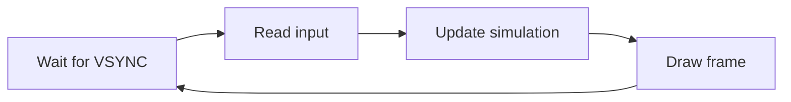

[← Game Dev](README.md) · [Game Loop](game_loop.md)

# Game Loop Architectures — Frame Synchronization, State Machines, and Memory Models

> **Scope**: This article covers the architectural shape of a ZX Spectrum game's main loop — the per-frame code path that reads input, advances the simulation, and drives the renderer. It is written for programmers who already understand [interrupts](../04_interrupts/interrupt_programming.md) and [frame timing](../05_display_and_timing/video_frame_overview.md) and now need to assemble them into a working game.

For *how* to draw sprites and backgrounds, see the [Graphics Techniques series](../06_graphics/README.md). For *how* entities collide and behave, see [entities_collision_ai.md](entities_collision_ai.md). For *input and audio* integration, see [input_sound_integration.md](input_sound_integration.md). This article covers the loop that calls all of those once per frame.

---

## The Universal 8-bit Game Loop

Every Spectrum game, from *Manic Miner* (1983) to modern Next homebrew, has the same conceptual loop:



The differences between games are entirely in **how each phase is bounded** and **how state flows between them**. Four architectural decisions dominate everything else:

1. **Synchronization source** — does the loop block on the VBLANK interrupt, poll the floating bus, or rely on a carefully timed ISR? (Section 1)
2. **Update determinism** — does the simulation run once per frame (locked to video), or does it decouple from rendering? (Section 2)
3. **State machine shape** — is the game a flat sequence of rooms, a hierarchical state machine, or something else? (Section 3)
4. **Memory model** — does everything fit in 16 KB above the screen, or does the game bank-switch code and data across pages? (Section 4)

Get these four right and the rest of the engine falls out naturally. Get any of them wrong and you will be patching around the mistake for the entire project.

---

## 1. Synchronization — Three Established Patterns

The Spectrum's video hardware asserts INT at the start of every frame (50.08 Hz on 48K, 50.02 Hz on 128K/+2, 48.83 Hz on Pentagon). Every game uses INT as its master clock — there is no other source of frame-accurate timing on the platform. What differs is *how* the loop waits for INT.

### Pattern 1 — HALT Loop (simplest, most common in 48K era)

The CPU executes `HALT` and the Z80 sleeps until INT fires. The ISR runs (typically just `EI / RET` or a tiny music tick), then the main loop continues.

```z80
main_loop:
        HALT                  ; Wait for INT. Z80 wakes at line 0 of next frame.
        EI                    ; Interrupts were disabled during ISR; re-enable.
        CALL  read_input      ; Poll Kempston / keyboard matrix.
        CALL  update_world    ; Advance entities, AI, physics.
        CALL  draw_frame      ; Erase old sprites, draw new sprites, scroll.
        CALL  play_music      ; Tick the music player (if not in ISR).
        JR    main_loop
```

This is the loop shape used by *Manic Miner*, *Jet Set Willy*, *Chuckie Egg*, and most early single-load games. Its great strength is **simplicity**: there is no ISR coordination, no shared state, no race between foreground and background code. The drawback is that **music and the main loop share one CPU**: a `play_music` call costs 600–2,200 T-states (depending on player and TurboSound complexity), and that comes straight out of the rendering budget.

> [!IMPORTANT]
> On real hardware, the ISR fires *during* `HALT`, and the Z80 returns to the instruction after `HALT` with interrupts *disabled* (the `EI` instruction enables them after the next instruction, not immediately). The `EI / RET` pair at the end of every ISR exists to handle exactly this case — `RET` executes with interrupts still off, then the foreground's `EI` followed by the next instruction re-arms them.

### Pattern 2 — ISR-Driven Loop (the 128K / Ocean / Rare pattern)

Instead of `HALT`, the main loop runs continuously and the ISR does most of the per-frame work. The main loop becomes a "lazy" stream of game logic; the ISR handles timing-critical concerns (music, multicolor raster effects, sprite buffer preparation).

```z80
; ISR (fires once per frame, ~50 Hz)
isr:
        EX    AF,AF'          ; 4T — save AF to shadow
        EXX                   ; 4T — save BC, DE, HL to shadow
        PUSH  IX
        PUSH  IY
        CALL  music_tick      ; Advance AY player (~600 T-states)
        CALL  prepare_sprites ; Copy sprite patterns into VRAM bank
        LD    A,(frame_flag)
        OR    A
        JR    NZ,isr_done
        LD    A,1
        LD    (frame_flag),A  ; Signal main loop: a new frame has begun
isr_done:
        POP   IY
        POP   IX
        EXX
        EX    AF,AF'
        EI
        RETI                  ; or RET, depending on IM1 vs IM2

; Main loop (runs continuously, yields when frame_flag is set)
main_loop:
        HALT                  ; Sleep until ISR has fired
        XOR   A
        LD    (frame_flag),A  ; Acknowledge frame
        CALL  read_input
        CALL  update_world
        CALL  render          ; Writes to shadow screen for double-buffer
        JR    main_loop
```

The `frame_flag` byte is the **synchronization primitive**: the ISR asserts it once per frame, the main loop acknowledges it. This decouples "when to do work" from "what work to do". *Ocean*'s 128K titles (*Chase H.Q.*, *RoboCop*, *Green Beret*) used exactly this pattern, as did *Rare*'s late-Spectrum releases.

The reason this pattern is dominant on the 128K is **banking**: on a 128K machine, the screen at `#5800`–`#7FFF` lives in bank 5 of physical RAM. The game code can write to a *shadow* screen in a different bank, and the ISR performs the bank-switch + copy to the visible screen during vertical blank, invisible to the player. The 48K machine has no banked RAM, so double-buffering requires either a custom 16 KB buffer in uncontended upper memory (rare and expensive) or accepting tearing.

### Pattern 3 — Cycle-Counted Tight Loop (rare, demoscene)

For effects that must hit specific raster positions — *multicolor* (8×1 attribute effects), *raster bars*, *sync scrollers* — the loop is hand-tuned to the cycle. There is no `HALT`; the loop is a fixed sequence of instructions whose total T-state count equals exactly one frame (69,888 on 48K, 70,908 on 128K, 71,680 on Pentagon).

This pattern is **not used for games** — games need flexible, variable-length update logic — but it is what *copper bars* and *twister effects* in demos do. See [race_the_beam.md](../04_interrupts/race_the_beam.md) and [multicolor_engines.md](../06_graphics/multicolor_engines.md) for the technique. The reason it cannot apply to games is that **game update time is data-dependent**: a frame with 5 active enemies takes more T-states than a frame with 1. A fixed cycle budget cannot accommodate this variance.

---

## 2. Frame-Synchronized vs Decoupled Update

Modern game engines (Unity, Unreal, Godot) use a **decoupled update loop**: the simulation runs at a fixed timestep (e.g., 60 Hz) while rendering runs at whatever the display supports (60, 120, 144 Hz). The renderer interpolates between simulation steps. This pattern does not exist on the ZX Spectrum in any commercial title, for two good reasons:

1. The hardware has **one** refresh rate (~50 Hz), so there is nothing to decouple from.
2. Interpolation requires keeping two simulation states in memory — an expense the 48K Spectrum cannot afford.

Every commercial Spectrum game is **frame-synchronized**: the simulation advances exactly one step per video frame. If the simulation cannot fit in one frame's T-state budget, the game slows down rather than skipping simulation steps.

### Frame-synchronized budgeting

The 48K Spectrum's frame budget is **69,888 T-states**. Of those:

| Component | Typical cost | Notes |
|---|---|---|
| ISR overhead (EX/EXX/PUSH/POP + EI/RETI) | ~80 T-states | Fixed cost |
| Music player (PT3 single AY) | ~600–1,200 T-states | Depends on pattern density |
| Music player (TurboSound, 2 AY) | ~1,500–2,200 T-states | Bank-select adds overhead |
| Sprite erase + redraw (8 sprites, 16×16 masked) | ~12,000–20,000 T-states | Dominates the budget |
| Tilemap / scrolling redraw | ~5,000–15,000 T-states | Heavily data-dependent |
| Game logic (input, AI, collision, FSM) | ~3,000–8,000 T-states | Usually the cheapest |
| **Available headroom** | **~25,000–45,000 T-states** | For game-specific work |

For comparison, the Pentagon's 71,680-T-state frame gives **1,792 more T-states** — about 2.5% more work per frame. Most developers target 48K as the lowest common denominator and treat Pentagon's extra time as bonus headroom.

### What happens when the budget overflows

If a single frame's work exceeds the budget, the next INT fires *while the main loop is still running*. With `EI` cleared (the default during ISR entry), nothing breaks immediately — the INT is just ignored. But on the next `HALT`, the Z80 sleeps for an *entire additional frame*, because the INT signal has already passed. The visible result is **frame dropping**: the game runs at 25 Hz instead of 50 Hz, the music slows with it, and the player perceives "lag".

This is why almost every Spectrum game has a **measured worst-case frame budget**: the developer runs the heaviest possible scene (most enemies, longest scroll distance, biggest music pattern) in a cycle-exact emulator and verifies the total is under ~65,000 T-states, leaving ~5,000 for safety margin.

> [!WARNING]
> A common bug: the music player takes longer on certain rows (those with dense effect writes or instrument changes). A 50-frame average may fit the budget while a single pathological frame exceeds it. Always profile the worst single frame, not the average.

---

## 3. Game State Machines

The "game loop" is rarely a single loop. The player is sometimes in the title screen, sometimes in the gameplay, sometimes in a pause menu, sometimes in a game-over sequence. Each of these has different input handling, different rendering, and different music. The standard solution is a **top-level state machine** that dispatches to a per-state loop.

### The flat state machine (most common)

```z80
; Game state constants
ST_TITLE    EQU 0
ST_PLAYING  EQU 1
ST_PAUSED   EQU 2
ST_GAMEOVER EQU 3
ST_BONUS    EQU 4

main_loop:
        HALT
        LD    A,(game_state)
        OR    A
        JR    Z,title_loop       ; ST_TITLE
        CP    ST_PLAYING
        JR    Z,playing_loop
        CP    ST_PAUSED
        JR    Z,paused_loop
        CP    ST_GAMEOVER
        JR    Z,gameover_loop
        CP    ST_BONUS
        JR    Z,bonus_loop
        ; Unknown state — fall back to title
        XOR   A
        LD    (game_state),A
        JR    main_loop

title_loop:
        CALL  title_input
        CALL  title_render
        CALL  title_music
        JR    main_loop          ; Re-dispatch on next frame
```

The key property: **each state has its own per-frame work, but the outer `HALT` is shared**. State transitions are just `LD (game_state),A` writes; the next frame's dispatch picks up the new state. There is no state-initialization ceremony because each state's loop checks a "first frame" flag if it needs setup work.

This pattern is what *Manic Miner* uses — the game has 20 rooms plus the title, plus the death sequence, all selected by a state byte that the per-room code writes to.

### The hierarchical state machine (Ultimate, Rare, late Ocean)

For games with sub-states (a room can be in "playing", "entering via portal", "exiting via portal", "death animation in progress"), a flat machine becomes unwieldy. The hierarchical approach:

```z80
; Top-level state
ST_TITLE       EQU 0
ST_INGAME      EQU 1
ST_GAMEOVER    EQU 2

; Sub-state when ST_INGAME
SUB_ENTER      EQU 0          ; Player entering room (portal animation)
SUB_PLAYING    EQU 1          ; Normal gameplay
SUB_DYING      EQU 2          ; Death animation playing
SUB_LEAVING    EQU 3          ; Player exiting via portal

playing_loop:
        LD    A,(sub_state)
        OR    A
        JR    Z,sub_enter
        CP    SUB_PLAYING
        JR    Z,sub_playing
        CP    SUB_DYING
        JR    Z,sub_dying
        CP    SUB_LEAVING
        JR    Z,sub_leaving
        RET
```

*Knight Lore* uses a three-level hierarchy (game mode → room phase → animation step), which is one of the reasons its disassembly is so dense.

### State transitions as data

For non-interactive sequences (title screen animation, game-over screen, cutscenes), the cleanest design is often **data-driven transitions**: a small table describes (state, condition, next state, transition function pointer). This is overkill for two or three states but pays off in games with a dozen or more states — *Jet Set Willy*'s title → bed → walking → room transitions fit this pattern well.

```z80
; Transition table: (state, trigger, next_state, transition_fn)
transition_table:
        DB  ST_TITLE,   TRIGGER_KEY,    ST_PLAYING,  transition_title_to_play
        DB  ST_PLAYING, TRIGGER_DEATH,  ST_GAMEOVER, transition_play_to_over
        DB  ST_PLAYING, TRIGGER_PAUSE,  ST_PAUSED,   transition_play_to_pause
        DB  ST_PAUSED,  TRIGGER_KEY,    ST_PLAYING,  transition_pause_to_play
        DB  0           ; Sentinel
```

The transition function runs **once**, between frames: it loads the new screen, resets entity positions, switches music tracks, etc. The main loop's `HALT` is not disturbed.

---

## 4. Memory Models — 48K Flat vs 128K Banked

The game loop's structure is constrained by which machine it targets. The 48K Spectrum has 16 KB of ROM (fixed) + 32 KB of contiguous RAM (of which 6.9 KB is the screen and 0.75 KB is the attribute file, leaving ~24 KB for code and data). The 128K / +2 / +3 adds bank-switched RAM: 8 banks of 16 KB, with one bank paged into the upper 16 KB (`#C000`–`#FFFF`) via port `#7FFD`.

### The 48K flat model

In a 48K game, all code, all data, all entity state, and all level data coexist in a single 24 KB address space (above the screen). The game loop is a single program; there is no paging, no overlay loading, no bank switching. This is the model used by *Manic Miner*, *Jet Set Willy*, *Knight Lore*, *Alien 8*, *Head Over Heels*, *Chuckie Egg*, and most Western commercial releases through 1987.

The constraint shapes the engine:

- **Code is small.** A complete game engine in 8–16 KB of Z80 is normal. The Matthew Smith engine (Manic Miner + Jet Set Willy) is ~9 KB.
- **Level data dominates.** Manic Miner allocates 20 rooms × 1 KB = 20 KB to levels — more than half the available RAM.
- **Sprite data is pre-shifted at fixed addresses.** No runtime shifting means tighter per-frame budget, but each 16×16 sprite costs 8 shifts × 32 bytes = 256 bytes. A game with 32 sprites spends 8 KB just on pre-shift tables.
- **Music is beeper-only**, unless the game is on tape with a multiload for music + level data per stage.

The 48K model forces **tight, opinionated engine design**: there is no room for generality. Every byte is allocated for a specific purpose.

### The 128K banked model

The 128K Spectrum exposes 128 KB of physical RAM organized as 8 banks of 16 KB. Bank 0 is fixed at `#0000`–`#3FFF` (it contains the screen — `#4000`–`#7FFF` is bank 5, paged separately). Bank 5 is the screen at all times; bank 2 is the visible ROM (the 128K has two ROMs, switchable via port `#7FFD` bit 4). The bank at `#C000`–`#FFFF` is selectable at runtime.

This unlocks patterns impossible on 48K:

- **Double-buffered screens.** Render the next frame in bank 7, then page it in as the new screen at vertical blank. Eliminates tearing.
- **Code overlays.** Engine code lives in bank 0; per-level code (custom boss AI, unique room rendering) lives in paged banks. Switching banks mid-game is one `OUT (#FD),A` instruction (17 T-states).
- **Music in dedicated bank.** The music player and its module data occupy one full bank (16 KB — enough for a 5-minute PT3 module). The ISR switches to the music bank, ticks the player, switches back. Main loop never touches music code.
- **Per-level data banks.** Each level occupies its own bank, loaded from disk during transitions. *Dizzy* series used this pattern.

The cost is complexity: every bank switch is a context that must be saved and restored. The ISR must save the current bank, switch to the music bank, call the player, switch back. Foreground code must verify which bank is currently paged before accessing data. Bugs from bank-switch races are the 128K equivalent of pointer-aliasing bugs in C.

```z80
; Bank-switched ISR (128K pattern, used by Ocean/Rare)
isr:
        EX    AF,AF'
        EXX
        ; Save current bank
        LD    BC,#7FFD
        IN    A,(C)              ; Read current #7FFD state
        LD    (saved_bank),A
        ; Switch to music bank (bank 4 in this example)
        LD    A,(saved_bank)
        AND   #F8                ; Clear bank-select bits 0-2
        OR    4                  ; Bank 4
        OUT   (C),A
        ; Call music player
        CALL  music_tick
        ; Restore bank
        LD    A,(saved_bank)
        OUT   (C),A
        EXX
        EX    AF,AF'
        EI
        RET
```

### Hybrid: 48K engine, 128K data

A common late-period pattern (1987–1990): the game engine runs as a 48K program — single contiguous code, simple `HALT` loop — but uses 128K banking **only** to access additional level data. Each level lives in its own bank; the foreground code pages the bank in to read level data, then pages it out. The game loop itself is unaware of banking.

This is the pattern used by *Wally Bear*, later *Codemasters* titles, and most Soviet clone-era games. It preserves the simplicity of the 48K loop while gaining effectively unlimited level storage.

---

## 5. ROM / RAM Layout Patterns

Where code and data sit in the address space determines what the engine can do. The four canonical layouts:

### Layout A — All-RAM (tape-loaded game)

```
#0000 ────────────────────────────
  ROM contents (banked out at runtime if needed)
#4000 ────────────────────────────
  Screen (pixel buffer + attributes)  ←  #4000-#57FF, #5800-#5AFF
#5B00 ────────────────────────────
  System variables / printer buffer / spare
#5C00 ────────────────────────────
  Game code (entry point at #8000 typically)
#8000 ────────────────────────────
  Game state, entity tables, level data
#FF00 ────────────────────────────
  Stack (grows down from #FF40)
#FF58 ────────────────────────────
  RAMTOP, set by the loader
```

This is the standard layout for tape-loaded games. The game's code is one contiguous block starting at `#8000`. The stack sits at the top of RAM. The screen is fixed. System variables (`#5C00`–`#5CBF`) are used sparingly — usually just the frame counter (`FRAMES` at `#5C78`) and the interrupt mode byte.

### Layout B — ROM cartridge (Interface 2)

The Sinclair Interface 2 maps a 16 KB ROM into `#0000`–`#3FFF`. The game runs entirely from ROM — no loading time, but limited to 16 KB total. Only a handful of titles shipped in this format (*Jetpac*, *Tranz Am*, *Cookie*, *Pssst*, *Three Weeks in Paradise*). The ROM is read-only, so all mutable state (entity tables, score, level progression) must live in `#4000`–`#FFFF`. The layout:

```
#0000 ────────────────────────────
  Game code (ROM, read-only)         ← #0000-#3FFF
#4000 ────────────────────────────
  Screen (still required)
#5B00 ────────────────────────────
  Game state, entity tables, level data
#FF00 ────────────────────────────
  Stack
```

ROM has one critical advantage: **contention-free execution**. Code running from `#0000`–`#3FFF` is never delayed by the ULA's video fetches, unlike code in `#4000`–`#7FFF`. A tight inner loop (sprite drawing, multicolor raster effect) runs measurably faster from ROM than from the same address in screen RAM.

### Layout C — Banked 128K

Already covered in Section 4. Code typically lives in bank 0 (always paged at `#0000`–`#3FFF`), screen is bank 5 (fixed), data lives in paged banks at `#C000`–`#FFFF`. The foreground loop never knows which bank is currently paged unless it explicitly checks.

### Layout D — Multiload (tape or disk)

For games larger than 24 KB, the loader program pulls in segments as the player progresses. Each level loads its own code + data into the same RAM region, overwriting the previous level. The game loop itself is unchanged, but **state that must persist across levels** (player inventory, score, completed-levels bitmap) lives in a fixed region that the loader is careful not to overwrite.

The classic pattern:

```
#8000-#9FFF    Per-level code (overwritten each level)
#A000-#B7FF    Per-level level data (overwritten each level)
#B800-#BFFF    Persistent game state (score, inventory, flags) — never overwritten
#C000-#FFFF    Engine code (never overwritten)
```

This is what *Dizzy* series, *Magic Knight Rayearth*, and most tape-multiload games use.

---

## 6. Load Screens and Streaming

The game loop must also handle **loading**: from tape (slow, sequential, 50 Hz-compatible), from disk (faster, but blocks the CPU for ~3 seconds), or from ROM (instant). The loading phase has its own loop, distinct from gameplay.

### The title-screen loading loop

The classic pattern: the tape-load screen is the title screen. The player sees a static image with a prompt like "PRESS PLAY ON TAPE" while the actual game data streams in. The load loop's job is to:

1. Drive the ROM's tape-loading routine (or a custom loader for speed/copy protection).
2. Update a progress indicator (typically the border color or a percentage).
3. Tick music if the loader is custom and CPU is available.
4. Detect load errors and abort cleanly.

For custom loaders (Speedlock, Alkatraz, Bleepload), the loop is hand-tuned to the bit-cell timing of the tape format and may not use the standard ISR at all — see [code_crunching.md](../../08_reverse_engineering/code_crunching.md) and [protection_techniques.md](../../08_reverse_engineering/protection_techniques.md) for the loader internals.

### Disk loading on 128K

The 128K's TR-DOS provides fast disk access (~9 KB/second typical). Loading a full 16 KB bank from disk takes ~1.8 seconds, during which the main game loop is **paused** — TR-DOS uses the CPU and the FDC, leaving no time for rendering. The standard solution is a **loading screen with animation**:

```z80
; While loading a level from disk:
load_loop:
        LD    A,(loading_progress)
        CP    100
        JR    NC,load_done
        CALL  render_loading_anim    ; Spinning cursor, animated text
        ; TR-DOS read is in progress; ISR continues to tick music
        JR    load_loop
load_done:
        ; Bank is loaded; switch to playing state
        LD    A,ST_PLAYING
        LD    (game_state),A
```

The TR-DOS ROM is banked into `#0000`–`#3FFF` during read calls; the game's code in upper memory runs normally between read calls. The music player (in a separate bank) can continue playing because the bank-switch for music is independent of the TR-DOS bank-switch.

### In-game streaming

Rare on the 48K (no disk), common on 128K disk games: as the player moves through the world, new chunks stream in from disk without pausing. This requires splitting the world into **chunks** that fit in disk sectors (typically 1–8 KB each) and loading them into spare banks before the player crosses the boundary. *Elite*'s 128K version streams galaxy data this way; later Russian RPGs (*Black Raven*, *Spirit of Adventure*) use extensive streaming.

---

## 7. Debugging the Game Loop

Game-loop bugs have characteristic signatures:

### Symptom: game runs at half speed

**Cause**: A single frame's work exceeds 69,888 T-states, so the next `HALT` waits for two INT periods. Profile the worst-case frame in a cycle-exact emulator (Fuse's profiler or ZEsarUX's instruction trace).

### Symptom: music slows but visuals don't (or vice versa)

**Cause**: The music player's per-frame cost is variable, and certain patterns exceed the budget. Some games move music to a separate ISR (running at 100 Hz on alternating frames) to smooth this out, but this is rare.

### Symptom: game crashes on transition between rooms

**Cause**: The transition function overwrites part of the engine code or the persistent state region. Check the multiload memory map (Layout D above) — the persistent state region must not collide with the per-level code region.

### Symptom: input feels laggy

**Cause**: The input is read *after* the simulation update, so the player's button press affects the *next* frame, not the current one. The correct order is **read input → update simulation → draw** (as in the universal loop diagram at the top of this article). Some games read input in the ISR for even lower latency; this is fine if the ISR is fast, but introduces double-read bugs if the main loop also reads input.

### Symptom: random crashes during music

**Cause**: On 128K, the ISR's bank-switch did not restore the previous bank correctly. Verify that the ISR saves and restores the `#7FFD` byte on every entry, and that the music player does not page in its own bank without restoring it.

---

## 8. Cross-References

- [interrupt_programming.md](../04_interrupts/interrupt_programming.md) — ISR construction, IM1 vs IM2, vector tables. The game loop's synchronization depends entirely on this.
- [race_the_beam.md](../04_interrupts/race_the_beam.md) — Cycle-exact raster synchronization, the technique that powers multicolor and raster bars. Games rarely need this; demos and loaders often do.
- [video_frame_overview.md](../05_display_and_timing/video_frame_overview.md) — Frame timing across models (48K / 128K / Pentagon / Next). The T-state budgets in this article come from there.
- [timing_reference.md](../../10_references/timing_reference.md) — Lookup tables for instruction costs, contention, and per-model timings.
- [sprites_and_masking.md](../06_graphics/sprites_and_masking.md) — The dominant cost in the draw phase of most game loops. This article assumes you understand the per-sprite budget.
- [scrolling_and_buffering.md](../06_graphics/scrolling_and_buffering.md) — Double-buffered rendering, which pairs naturally with the ISR-driven loop pattern (Section 1.2).
- [entities_collision_ai.md](entities_collision_ai.md) — The contents of the `update_world` call in the universal loop.
- [level_data_and_worlds.md](level_data_and_worlds.md) — What the engine renders; ties into the memory model choice.
- [input_sound_integration.md](input_sound_integration.md) — What the loop reads and what it ticks each frame.
- [game_case_studies.md](game_case_studies.md) — How the techniques in this article are combined in real commercial engines.
- [contention_model.md](../03_memory_and_io/contention_model.md) — Why code in `#4000`–`#7FFF` is slower than in upper RAM; affects loop placement decisions.

---

## 9. Common Pitfalls

### Pitfall 1 — Disabling interrupts during a long operation

```z80
        DI
        CALL  long_operation    ; 50,000 T-states
        EI
```

If `long_operation` exceeds one frame, the music stutters (ISR does not fire) and the frame timing drifts. The rule: never hold `DI` for more than ~5,000 T-states in a game loop. If a long critical section is unavoidable, manually call `music_tick` from inside it.

### Pitfall 2 — Reading input inside the ISR

Reading the keyboard matrix or Kempston port from the ISR seems efficient (zero cost in the main loop) but introduces two bugs: (a) the input byte changes mid-frame if the player releases a key, causing "phantom presses" in the simulation; (b) the ISR becomes longer, eating into the music player's budget. **Read input once, in the main loop, after `HALT`.**

### Pitfall 3 — Stack collisions with game state

The stack starts at `RAMTOP` (typically `#FF40`) and grows down. If game state grows up from `#8000` and the stack grows down from `#FF40`, they will collide somewhere around `#C000`–`#D000` in a heavily nested game. The result is a corrupted return address and a crash. Always verify stack depth during the deepest call chain, and reserve at least 256 bytes of headroom.

### Pitfall 4 — Forgetting that `EI` is deferred

`EI` enables interrupts *after the next instruction executes*, not immediately. The pattern `EI / HALT` is safe because `HALT` is the next instruction and the Z80 will accept the next INT. But `EI / RET` returns with interrupts still off — the caller must re-enable them. Every ISR ends with `EI / RETI` (or `RET` in IM1) for this reason.

### Pitfall 5 — Per-frame allocations

Modern engines allocate memory freely because garbage collection hides the cost. ZX Spectrum engines cannot. Any byte allocated per-frame must be freed per-frame, and on a 48K machine with no heap, "allocate" usually means "use a slot in a fixed-size table". Never design an entity system that grows unboundedly — pre-allocate a fixed pool at startup and reuse slots. See [entities_collision_ai.md](entities_collision_ai.md) §1 for the canonical object-pool pattern.

### Pitfall 6 — Bank-switching inside an ISR without saving

```z80
isr:
        LD    A,(music_bank)
        LD    BC,#7FFD
        OUT   (C),A           ; Switch bank — but didn't save the old one!
        CALL  music_tick
        ; ...and return with the wrong bank paged in
```

Foreground code expecting bank 0 at `#C000` will read garbage after the ISR returns. Always save and restore.

---

## 10. References

- **Richard Dymond (SkoolKit)**, [*Manic Miner* RAM disassembly](https://skoolkit.ca/disassemblies/manic_miner/) — Complete annotated disassembly. The Matthew Smith engine's main loop is at address `#8901` in the original Bug-Byte release.
- **Richard Dymond (SkoolKit)**, [*Jet Set Willy* RAM disassembly](https://skoolkit.ca/disassemblies/jet_set_willy/) — JSW's loop is more complex due to the persistent-room-state model.
- **John Elliott**, [*Jet Set Willy: The Disassembly*](https://www.icemark.com/dataformats/jsw/) — Companion to Andrew Broad's room-format documentation, with engine-level commentary.
- **Andrew Broad**, [*Manic Miner Room-Format*](https://www.icemark.com/dataformats/manic/mmformat.htm) — The canonical technical specification of the 1024-byte room layout. invaluable for understanding how level data fits the 48K memory model.
- **Raster Magazine**, issues 1991–1994 — Russian-language articles on game engine design in the TR-DOS era. Available at [zxpress.ru](https://zxpress.ru).
- **The Wakefield Compiler Club**, *ZX Spectrum Game Engine Architecture* (1995) — Russian-language text on 128K banking patterns in commercial games.
- **Einar Saukas**, [*BIFROST* Engine documentation](https://worldofspectrum.org/forums/discussion/39941/) — Modern engine framework; well-documented example of the ISR-driven pattern.

---

## License

This article is released under **Creative Commons Attribution-ShareAlike 4.0 International (CC BY-SA 4.0)**. You are free to share and adapt the material, provided you credit the original source and license derivative works under the same terms.
