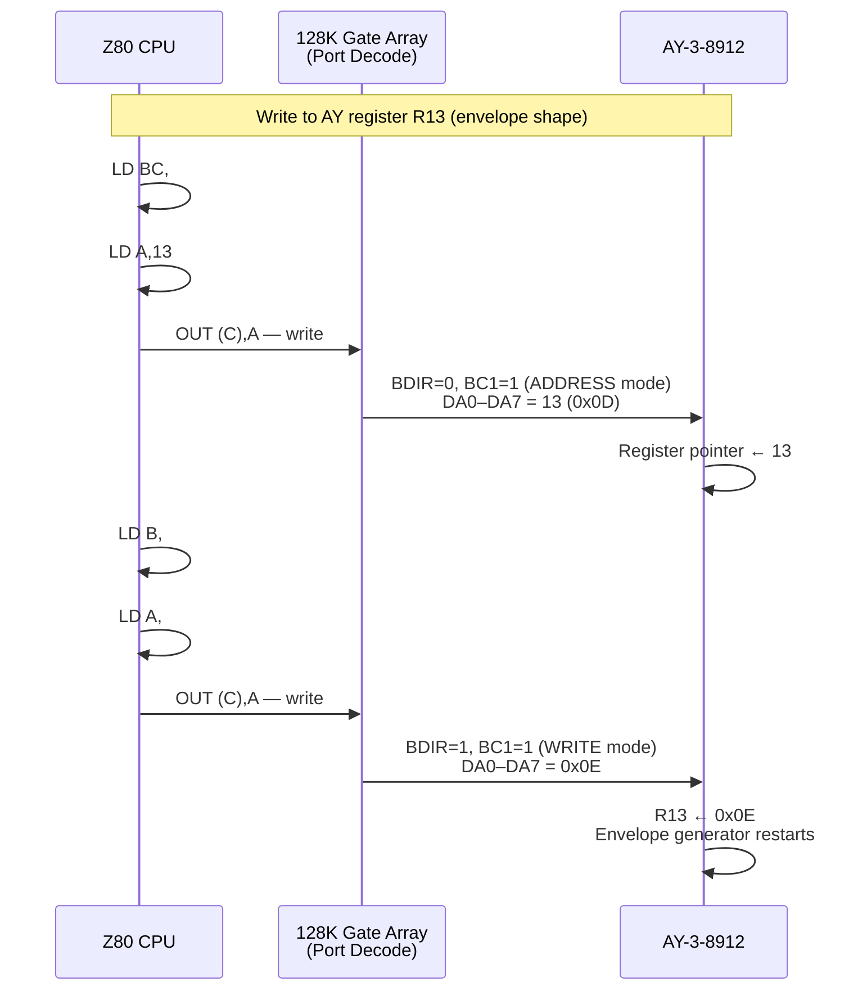
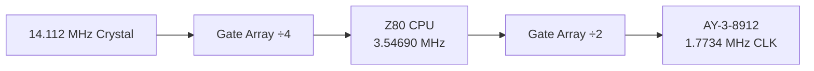
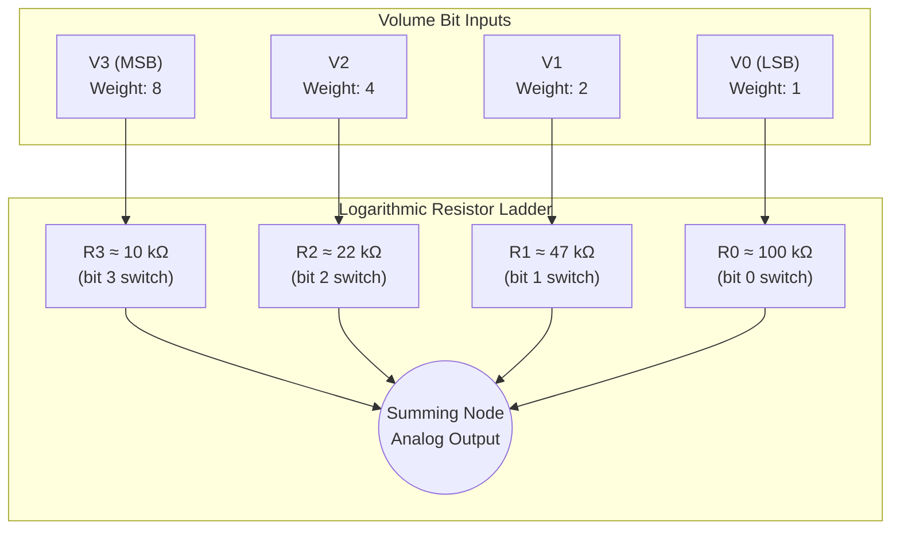
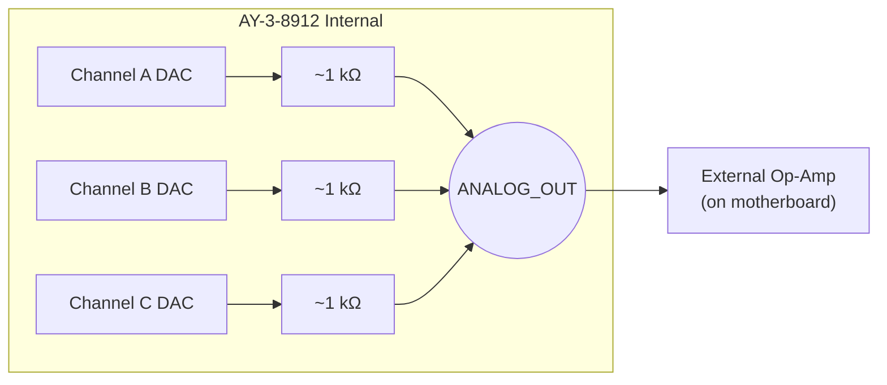
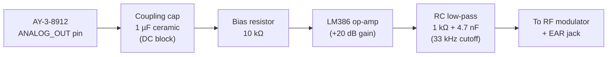

[← Home](../../README.md) · [Sound](../README.md) · [Hardware](README.md)

# AY-3-8910 / 8912 / 8913 / YM2149F — PSG Silicon, Pinout, Bus Interface, Electrical

> **Applies to**: Real AY/YM silicon only — Original (128K/+2/+2A/+3) and Soviet (Pentagon, Scorpion, Kay, ATM Turbo, Profi). The ZX Spectrum Next has no real AY silicon — it uses FPGA-emulated 3×AY (TurboSound Next); see [ZX Spectrum Next Audio](zx_next_audio.md).

---

## Overview

In 1978, General Instrument shipped a single chip that would define the sound of an entire decade of computing. The **AY-3-8910 Programmable Sound Generator** — three square-wave channels, a noise generator, a volume envelope, and 16 registers — appeared in the ZX Spectrum 128K, Sinclair QL, Atari ST, Amstrad CPC, MSX, Vectrex, Intellivision, and thousands of arcade cabinets. Yamaha second-sourced it as the **YM2149** (the chip inside every Atari ST and most Soviet Spectrum clones). Over **40 million units** shipped across all platforms, making it the most widely deployed sound chip of the 8-bit era.

The AY's apparent simplicity — three channels, 16 volume levels, four envelope shapes — concealed extraordinary flexibility. The chip's internal counter model, when manipulated with cycle-exact Z80 code, produces effects its designers never imagined: pulse-width modulation, oscillator hard-sync, sample playback, SID-style filter sweeps, drum synthesis. This is why the AY has the **largest chiptune software library of any sound chip in history** — Vortex Tracker II alone has thousands of published modules.

This article is the **hardware-engineering reference**: package variants, pinout, the BC1/BDIR/BC2 bus protocol, electrical characteristics, the internal DAC resistor ladder, the analog output circuit, and how every ZX Spectrum model wires the chip into its bus. For the **programmer's view** — register semantics, the counter model, envelope mechanics, advanced synthesis techniques — see [AY/YM PSG Hardware Reference: Architecture, Registers, Counter Model](../synthesis/ay_ym_synthesis.md). For an **emotional/perceptual** discussion — ABC vs ACB, AY vs YM "warmth," the analog signal chain as time machine — see [The AY Sound: Perception, Emotion, and the Hardware Soul](../synthesis/ay_ym_perception.md).

> [!NOTE]
> **Naming**: "AY" refers to the **AY-3-8910/8912/8913** family made by General Instrument. "YM" refers to the **YM2149F**, Yamaha's pin-compatible second-source. Throughout this article, "AY/YM" means the chip family collectively; "AY-3-8910" or "YM2149F" means a specific variant. All four variants share the same register map, synthesis engine, and bus protocol — they differ only in package, I/O ports, and a few envelope DAC details (see [Variants Comparison](#variants-comparison)).

---

## <a id="variants-comparison"></a>Variants and Packages

General Instrument shipped the AY in three packages differing only in the number of bidirectional **I/O ports** exposed. Yamaha's YM2149F is pin-compatible with the AY-3-8910 but adds an extra clock divider pin (`SEL`).

### Variants Comparison

| Variant | Package | I/O Ports | Pins | Used In | Notes |
|---|---|---|---|---|---|
| **AY-3-8910** | DIP-40 | 2 (Port A + Port B, 8-bit each) | 40 | MSX, Vectrex, Intellivision, Fuller Box, original arcade boards | Most flexible; both ports used for keypads, joysticks, parallel I/O |
| **AY-3-8912** | DIP-28 | 1 (Port A only) | 28 | **ZX Spectrum 128K/+2/+2A/+3**, Sinclair QL | Smaller package — saves board space and cost. Port B pins simply not bonded out |
| **AY-3-8913** | DIP-24 | 0 (none) | 24 | Some embedded/industrial applications, a few arcade boards | Smallest package; no GPIO capability at all |
| **YM2149F** | DIP-40 | 2 (Port A + Port B) | 40 | **Atari ST/STE/TT/Falcon**, **most Soviet Spectrum clones** (Pentagon, Scorpion, Kay, ATM Turbo), MSX (later models) | Yamaha second-source; functionally identical to AY-3-8910 plus `SEL` pin |
| **AVR-3-8910** | DIP-40 | 2 | 40 | Rare Eastern-bloc second-source | Bulgarian/GDR clone; electrically compatible |

### Physical Pinout (AY-3-8912, 28-pin DIP)

The AY-3-8912 is the chip inside every original ZX Spectrum from the 128K onward. Note the single 8-bit I/O port — `IOA0` through `IOA7` — used on the Spectrum for the **serial port, RS-232, and keypad** reading. Port B is unavailable (the silicon still has it, but the 28-pin package has no pins for it).

```
              ┌──────────┐
        VSS ──┤1       28├── NC
       IOA7 ──┤2       27├── DA0
       IOA6 ──┤3       26├── DA1
       IOA5 ──┤4       25├── DA2
       IOA4 ──┤5       24├── DA3
       IOA3 ──┤6       23├── DA4
       IOA2 ──┤7       22├── DA5
       IOA1 ──┤8       21├── DA6
       IOA0 ──┤9       20├── DA7
        A8  ──┤10      19├── BC1
        A9  ──┤11      18├── BC2
      /TEST ──┤12      17├── BDIR
        CLK ──┤13      16├── ANALOG_OUT
        VCC ──┤14      15├── /RESET
              └──────────┘
```

> [!NOTE]
> Pin assignments verified against the original General Instrument AY-3-8912 datasheet (1980 reprint). The right column reads top-to-bottom as pins 28 → 15 (standard DIP convention with the notch on top). The 40-pin AY-3-8910 and YM2149F add a second I/O port (`IOB0–IOB7`) and the YM2149F replaces `NC` on pin 28 with `SEL`.

**Pin group summary**:

| Group | Pins | Purpose |
|---|---|---|
| **Bus / Data** | `DA0–DA7` (8 pins, bidirectional) | Multiplexed address/data bus — register address in, data in/out |
| **Address Latch** | `A8`, `A9` | Tied to fixed logic levels to give the chip a unique bus address (effectively a 2-bit chip-select extension) |
| **Bus Control** | `BDIR`, `BC1`, `BC2` | 3-pin bus-mode select (see [Bus Interface Protocol](#bus-protocol)) |
| **Clock** | `CLK` | Single-phase clock input — derived from CPU clock via divider (1.7734 MHz on ZX 128K) |
| **Reset** | `/RESET` | Active-low reset — clears all registers, silences output |
| **Analog** | `ANALOG_OUT` | Single analog audio output (mono) — mixes all three channels |
| **I/O Port** | `IOA0–IOA7` | 8-bit bidirectional GPIO port A (Port B unavailable on this package) |
| **Power** | `VCC` (+5V), `VSS` (GND) | Single +5V supply; ~50 mA typical |
| **Test** | `/TEST` | Factory test pin — tied high in normal use |

### YM2149F-Specific Pin: `SEL` (Clock Divider)

The YM2149F adds a `SEL` pin (pin 22, replacing the `/SELECT` position on AY) that selects the clock divider ratio:

| `SEL` state | Internal divider | Effective clock |
|---|---|---|
| Tied high (or NC) | ÷8 (default) | CLK ÷ 8 — same as AY-3-8910/8912/8913 |
| Tied low | ÷16 | CLK ÷ 16 — half the update rate |

The Atari ST ties `SEL` high (so 2 MHz external → 250 kHz internal, ÷8 just like AY). Soviet clones typically tie `SEL` high too. **The `SEL` pin is the only physical difference between YM2149 and AY-3-8910 board-level designs.** If you design a board for YM2149, you can drop in an AY-3-8910 by leaving the `SEL` pad floating (the AY ignores it).

### Reset Behavior (`/RESET`)

Pulling `/RESET` low for at least 5 clock cycles clears all 16 registers to zero — which has the surprising side effect of **enabling all three tone channels at maximum volume** (because the mixer register's `0` bits mean ENABLED). The analog output immediately produces a loud, ugly 110 Hz buzz (channel A at period=1, the lowest period). Hardware designers must ensure `/RESET` is held low during power-up until the CPU has stabilized — and software must never read or write the AY before setting the mixer register to silence (`#3F`).

---

## <a id="bus-protocol"></a>Bus Interface Protocol — BDIR / BC1 / BC2

The AY/YM uses a **multiplexed address/data bus** with three control pins to define the bus transaction type. This is a 1970s-style bus interface — closer to the 8085's address/data multiplexing than the Z80's clean separate buses. Every AY transaction takes **two bus cycles**: an "address" phase followed by a "data" phase.

### Mode Selection Table

The three control pins (`BDIR` = Bus Direction, `BC1`/`BC2` = Bus Control 1/2) decode into 8 modes, of which 4 are useful:

| `BDIR` | `BC2` | `BC1` | Mode Name | Action |
|:---:|:---:|:---:|---|---|
| 0 | 0 | 0 | **INACTIVE** | Idle — bus released, DA0–DA7 tristated |
| 0 | 0 | 1 | **ADDRESS** | Latch register address: `DA0–DA7` → register pointer (0–15) |
| 0 | 1 | 0 | — | (Unused; reserved for I/O port read on alternate bus cycles) |
| 0 | 1 | 1 | **READ** | Read register pointed to by current pointer; data drives `DA0–DA7` |
| 1 | 0 | 0 | — | (Unused) |
| 1 | 0 | 1 | **WRITE** | Write data into register pointed to by current pointer; data from `DA0–DA7` |
| 1 | 1 | 0 | **LATCH ADDRESS** | (Alternate address latch — same as `000`→`001` combined) |
| 1 | 1 | 1 | — | (Unused) |

In practice, only **three modes** are used on the ZX Spectrum:

1. **ADDRESS** (`BDIR=0, BC2=0, BC1=1`) — first cycle: latch the register address
2. **WRITE** (`BDIR=1, BC2=0, BC1=1`) — second cycle: write the data byte
3. **READ** (`BDIR=0, BC2=1, BC1=1`) — second cycle: read the data byte

`BC2` is held permanently high on the ZX Spectrum 128K — simplifying the decode logic to just `BDIR` and `BC1`. Some Soviet clones use full 3-pin decode for extra flexibility.

### Transaction Timing



The 128K gate array generates `BDIR` and `BC1` from the address lines:

- `BDIR = A7 AND /WR` (write strobe)
- `BC1 = NOT A15` (low address bit selects register-select vs data port)
- `A0` selects between `#FFFD` (register-select, A0=1, A7=0) and `#BFFD` (data, A0=1, A7=1)

This decode produces the familiar pairing `#FFFD` = register select, `#BFFD` = data — see [ZX Spectrum Port Wiring](#port-wiring) below for the per-model decoding differences.

### Read Transaction

Reading an AY register uses the same address-latch phase, then asserts `BDIR=0, BC2=1, BC1=1` (READ mode). The AY drives `DA0–DA7` with the register contents. The Z80's `/RD` line must be asserted instead of `/WR`, and the gate array flips its decode accordingly:

```z80
; --- Read AY register 14 (I/O Port A — keyboard scan on 128K) ---
LD   BC,#FFFD          ; Register select port
LD   A,14
OUT  (C),A              ; ADDRESS phase: select register 14
LD   B,#BF             ; BC = #BFFD
IN   A,(C)              ; READ phase: AY drives DA0–DA7 with register 14 value
; A now contains the 128K auxiliary port / keypad input
```

> [!WARNING]
> **`BC2` matters on some clones**: While the 128K/+2/+3 hard-wire `BC2` to +5V, certain Soviet clone designs (notably some Profi and ATM Turbo revisions) wire `BC2` to a decoded address line to enable alternate modes. Code that reads the AY on a 128K will still work — but FPGA implementations and modern clone designers must verify the `BC2` wiring against the specific machine's schematic, not against the 128K reference.

---

## Clock Domains — The Chip's Heartbeat

The AY/YM is a synchronous CMOS chip driven by a **single-phase clock** on the `CLK` pin. Internally, this clock is divided by 8 (or 16 with `SEL=0` on YM2149) to produce the **update tick** — the fundamental timing unit for all synthesis. See [AY/YM PSG Hardware Reference](../synthesis/ay_ym_synthesis.md) for the programmer's view of the counter model.

### Per-Platform Clock Table

| Platform | CLK Input | Update Rate<br/>(CLK ÷ 8) | Update Period | CPU Clock | CPU:CLK Ratio | Notes |
|---|---|---|---|---|---|---|
| **ZX Spectrum 128K / +2 / +2A / +3** | 1.7734 MHz | 221.675 kHz | 4.51 µs | 3.54690 MHz | 2:1 | CLK derived from CPU clock via flip-flop divide-by-2 |
| **ZX Spectrum Pentagon** | 1.7500 MHz | 218.750 kHz | 4.57 µs | 3.5000 MHz | 2:1 | Slightly flat (~1.3%) vs original — gives Soviet chiptunes a distinct accent |
| **ZX Spectrum Scorpion** | 1.7500 MHz | 218.750 kHz | 4.57 µs | 3.5000 MHz | 2:1 | Same as Pentagon |
| **Fuller Box** | 1.63819 MHz | 204.774 kHz | 4.88 µs | 3.54690 MHz | ~2.165:1 | Non-integer ratio — advanced sync-square techniques break |
| **Atari ST / STFM** | 2.0000 MHz | 250.000 kHz | 4.00 µs | 8.0000 MHz | 4:1 | YM2149F; `SEL` tied high |
| **Atari STE** | 2.00265 MHz | 250.331 kHz | 3.99 µs | 8.01061 MHz | ~4.0007:1 | Slight ratio drift — cycle-timed STFM code occasionally fails on STE |
| **Amstrad CPC** | 1.0000 MHz | 125.000 kHz | 8.00 µs | 4.0000 MHz | 4:1 | Half the ZX rate — gives CPC chiptunes a darker tone |
| **MSX (NTSC)** | 1.789772 MHz | 223.722 kHz | 4.47 µs | 3.579545 MHz | 2:1 | AY-3-8910 on early models; YM2149 on later |
| **MSX (PAL)** | 1.749817 MHz | 218.727 kHz | 4.57 µs | 3.546894 MHz | 2:1 | Matches ZX Pentagon clock almost exactly |
| **MSX turboR** | 3.579545 MHz | 447.443 kHz | 2.23 µs | 7.15909 MHz | 2:1 | High-clock AY mode for richer timbres |
| **Vectrex** | 1.5000 MHz | 187.500 kHz | 5.33 µs | 1.5000 MHz | 1:1 | YM2149 clocked at CPU speed |
| **ZX Spectrum Next** | configurable<br/>(default 1.7734 MHz) | 221.675 kHz | 4.51 µs | 28.000 MHz<br/>(3.5 MHz Z80 mode) | configurable | Per-chip clock synthesizer — see [ZX Spectrum Next Audio](zx_next_audio.md) |

### Where the Clock Comes From (ZX Spectrum 128K)

The 128K gate array divides the **master 14.11 MHz PAL crystal** by 4 to produce the 3.54690 MHz CPU clock, then divides the CPU clock by 2 to produce the **1.7734 MHz AY clock**. Both clocks are derived from the same crystal — they are phase-coherent, with the AY updating on every 16th T-state.



On the **Pentagon**, the same logic applies but the crystal is **14.000 MHz** instead of 14.112 MHz. This produces the slightly lower CPU (3.500 MHz) and AY (1.750 MHz) clocks that define the **Pentagon accent** — chiptunes written for the 128K sound ~1.3% flat on a Pentagon, which musicians can perceive as a slightly "darker" or "sadder" key.

### Bus Cycle vs Update Tick

A common beginner mistake is to confuse bus cycles (when the CPU reads/writes the AY) with update ticks (when the AY internally advances its tone/noise/envelope counters). These are **different events on different time scales**:

| Event | Rate | Duration | Notes |
|---|---|---|---|
| Z80 instruction that writes AY | ~50,000–200,000/sec | 17–21 T-states per `OUT (C),A` | CPU-driven, asynchronous to AY clock |
| AY update tick | 221,675/sec | 4.51 µs | Internal, free-running |
| AY register change takes effect | on next update tick after the write | up to 4.51 µs latency | The cause of most cycle-timed AY bugs |

> [!IMPORTANT]
> **Register writes are asynchronous, effects are synchronous.** When you write a new period value to R0/R1, the AY's tone counter does not change immediately — it picks up the new period on the next update tick. If you write two different values in quick succession (faster than 4.51 µs / 16 T-states), only the last one takes effect. This is documented in detail in [AY/YM PSG Hardware Reference: Register Write Latency](../synthesis/ay_ym_synthesis.md#register-write-latency).

---

## DAC Architecture — The Logarithmic Resistor Ladder

The AY's three channels share a **single analog output pin** (`ANALOG_OUT`). Inside the chip, each channel's 4-bit volume value (0–15) is converted to analog by a **logarithmic resistor ladder** — a clever design that produces 16 distinct output levels with only 4 resistor values, while approximating the **ear's logarithmic response to loudness**.

### Why Logarithmic?

Human hearing is logarithmic: doubling the air pressure of a sound wave is perceived as a *small* increase, not a doubling. A linear 16-level DAC would waste most of its resolution on the loud end (where the ear can't distinguish small changes) and have almost no resolution at the quiet end (where the ear is most sensitive to differences).

The AY's DAC uses **3 dB steps** — each volume level is approximately half the power of the previous one. This means a change of `1` in volume sounds like a *small step*, while a change of `5` sounds like *half as loud*. The 16 levels span roughly 45 dB — about the dynamic range of a cassette tape.

### Resistor Ladder Topology



Each bit of the 4-bit volume value controls a switch that connects its weighted resistor either to a reference voltage or to ground. The resistor values are chosen so that each successive bit contributes half the current of the previous one — producing a logarithmic voltage sum at the output node.

### Logarithmic Volume Table

The non-linear relationship between volume value (0–15) and output voltage is documented in every AY datasheet:

| Volume<br/>Value | Relative<br/>Amplitude | Output<br/>Level (dB) | Perceived<br/>Loudness |
|:---:|:---:|:---:|---|
| 0 | 0.000 | −∞ | Silent |
| 1 | 0.0125 | −38.1 dB | Barely audible (noise floor on real chip) |
| 2 | 0.025 | −32.1 dB | Very quiet |
| 3 | 0.050 | −26.0 dB | Quiet |
| 4 | 0.071 | −23.0 dB | Quiet-plus |
| 5 | 0.100 | −20.0 dB | Soft |
| 6 | 0.142 | −17.0 dB | Soft-medium |
| 7 | 0.200 | −14.0 dB | Medium |
| 8 | 0.250 | −12.0 dB | Medium-loud |
| 9 | 0.333 | −9.5 dB | Loud-ish |
| 10 | 0.500 | −6.0 dB | Loud |
| 11 | 0.667 | −3.5 dB | Loud-plus |
| 12 | 0.750 | −2.5 dB | Very loud |
| 13 | 0.875 | −1.2 dB | Near-maximum |
| 14 | 0.937 | −0.6 dB | Almost maximum |
| 15 | 1.000 | 0 dB | Maximum |

> [!NOTE]
> **These values are approximate.** Real AY-3-8910/8912 silicon exhibits significant variation between units (often ±2 dB at any given volume level), and the Yamaha YM2149 has subtly different resistor values giving it a slightly "warmer" or "rounder" timbre. Emulators use either the datasheet table or measured values from real chips. The **`aychip` emulator project** measured 12 different AY/YM chips and published the per-unit variation in 2006 — see [References](#references).

### Three-Channel Mixing

The three channels (A, B, C) are summed passively inside the chip via three equal-value resistors (~1 kΩ each) connected to the single `ANALOG_OUT` pin. The sum is **unbuffered** — it's a high-impedance current source that requires an external op-amp or transistor amplifier on the motherboard.



This **single-mono output** is the key constraint that drives the [stereo modification scene](stereo_audio.md) — the three channels cannot be separated at the chip level. Stereo modifications intercept the channel outputs *before* the internal summing node by tapping into the per-channel DAC currents (an invasive mod that requires cutting traces on most boards).

### Envelope DAC (5-Bit on YM2149)

The envelope generator has its own internal DAC that modulates the channel volume. On the **AY-3-8910/8912/8913**, this is the **same 4-bit DAC** as the channel volumes — the envelope just multiplexes onto the volume register at the update tick.

On the **YM2149F**, the envelope DAC has **5 bits (32 levels)** for finer envelope resolution. This is the single most audible difference between the AY and YM — YM envelopes sound smoother, especially on slow triangle sweeps. The extra bit is hidden from software (the volume register is still 4-bit); it only affects the envelope's internal resolution when bit 4 of the volume register is set.

---

## Analog Output Circuit — From Chip to Speaker

The `ANALOG_OUT` pin produces a **DC-coupled current sum** centered around `VCC/2` (~2.5V). To get useful audio, every ZX Spectrum model wraps the chip in a small **external analog circuit** that performs three jobs: level-shifting (remove the DC offset), low-pass filtering (smooth the 1.77 MHz update artifacts), and amplification (drive the RF modulator, earphone jack, or speaker).

### 128K / +2 Reference Circuit



**Component roles**:

| Component | Value | Role |
|---|---|---|
| Coupling capacitor | 1 µF ceramic | Blocks DC offset (~2.5V); only AC audio passes |
| Bias resistor | 10 kΩ | Pulls op-amp input to ground reference |
| LM386 op-amp | +20 dB gain | Boosts the ~100 mV chip signal to ~1V for the modulator |
| RC low-pass | 1 kΩ + 4.7 nF | Removes >33 kHz switching artifacts; aliasing images from the 1.77 MHz update rate |

This filter is critical for the chip's perceived "warmth." Without it, the aliasing images at 1.77 MHz and its harmonics would radiate through the audio chain as ultrasonic whine. With it, the AY sounds round and musical.

### Pentagon and Soviet Clone Audio Paths

The Pentagon follows the same general design but uses **discrete transistors** instead of an LM386 (Soviet LM386 equivalents were expensive in the early 1990s). A typical Pentagon audio path uses a **KT3102** NPN transistor as a class-A preamp, followed by an emitter-follower output stage. This gives a slightly different frequency response — more high-end "bite" but less clean low end. Many Pentagon musicians consider this part of the machine's "character."

The Scorpion GMX expansion adds a **dedicated stereo audio path** with separate amplifiers for each of the three AY channels, enabling ABC stereo directly from the board. See [Stereo Audio Modifications](stereo_audio.md) for details.

### DC Offset and the AY-vs-YM Debate

The YM2149F outputs a **fixed 2V DC offset** on `ANALOG_OUT`, while the AY-3-8910/8912 outputs a **variable DC offset** that depends on the volume register contents. This is the physical basis for the "YM warmth" debate:

- The **YM's fixed offset** is fully removed by the coupling capacitor, leaving a clean audio signal with consistent bass response.
- The **AY's variable offset** causes the coupling capacitor to charge and discharge as volume changes, producing a slight **low-frequency wobble** (cousin to "DC thump") that the ear perceives as warmth.

This is documented in depth in [The AY Sound: Perception, Emotion, and the Hardware Soul](../synthesis/ay_ym_perception.md).

### Electrical Characteristics (Datasheet Summary)

| Parameter | Min | Typ | Max | Unit | Notes |
|---|---|---|---|---|---|
| Supply voltage (`VCC`) | 4.75 | 5.0 | 5.25 | V | Standard 5V TTL |
| Supply current | — | 50 | 70 | mA | At 1.7734 MHz clock |
| Input high voltage (`VIH`) | 2.0 | — | — | V | TTL-compatible |
| Input low voltage (`VIL`) | — | — | 0.8 | V | TTL-compatible |
| Output high voltage (`VOH`) | 2.4 | — | — | V | Sources 0.4 mA |
| Output low voltage (`VOL`) | — | — | 0.4 | V | Sinks 1.6 mA |
| Clock frequency | 0.5 | 1.7734 | 2.0 | MHz | ZX 128K = 1.7734 MHz; Atari ST = 2.0 MHz |
| Clock rise/fall time | — | — | 100 | ns | Slope matters — slow edges cause double-clocking |
| ANALOG_OUT output impedance | — | 1 | — | kΩ | Unbuffered — requires external op-amp |
| ANALOG_OUT DC offset (AY) | 1.5 | 2.5 | 3.5 | V | Varies with volume register contents |
| ANALOG_OUT DC offset (YM) | 1.9 | 2.0 | 2.1 | V | Fixed |
| Reset pulse width | 5 | — | — | clock cycles | Active-low on `/RESET` pin |

---

## <a id="port-wiring"></a>ZX Spectrum Port Wiring — Per Model

Every machine that includes an AY/YM has to map its bus to the chip's `BDIR`/`BC1`/`DA0–DA7` interface. The decoding logic differs per model, producing the **port address maps** that programmers memorize.

### 128K / +2 / +2A / +3 (Original Sinclair/Amstrad)

The 128K gate array decodes AY access from the Z80 bus using just **two address lines** (`A0`, `A7`) plus `/IORQ` and `A15`:

| Port | Decoding | R/W | Purpose |
|---|---|---|---|
| `#FFFD` | `A15=0, A7=0, A0=1` | W | **Register select** — write register address (0–15) |
| `#FFFD` | `A15=0, A7=0, A0=1` | R | **Register select confirmation** — read back current pointer (rarely used) |
| `#BFFD` | `A15=0, A7=1, A0=1` | W | **Data write** — write data to selected register |
| `#BFFD` | `A15=0, A7=1, A0=1` | R | **Data read** — read data from selected register |

Because only three lines are decoded (`A15`, `A7`, `A0`), every address that matches this pattern aliases to the same port — `#FFFD`, `#7FFD`, `#3FFD`, `#1FFD` all hit the AY register-select register. The canonical form is `#FFFD`.

> [!WARNING]
> **`#7FFD` is ALSO the 128K paging register.** With A0=1 the AY sees its register-select phase, while with A0=0 the gate array sees the paging write. Both decodes coexist on the same low-byte address. Software writing `OUT (#7FFD),A` to switch RAM banks does NOT affect the AY because A0=0 disables the AY's `BC1` line.

### Pentagon (Soviet Default)

The Pentagon decodes the AY using the same logic as the 128K (mostly — the address line gates are wired slightly differently due to the discrete TTL logic used). The canonical ports are **identical**: `#FFFD` for register select, `#BFFD` for data.

| Port | Decoding | Notes |
|---|---|---|
| `#FFFD` | Standard AY register select | Same as 128K |
| `#BFFD` | Standard AY data | Same as 128K |

The Pentagon's actual decoding uses a simpler TTL PAL/GAL that mirrors the 128K behavior. There are subtle mirror addresses (`#FDFD`, `#FBFD`, etc.) that alias to the same AY ports, but software should always use the canonical `#FFFD`/`#BFFD` pair.

### Scorpion 256 / GMX

The Scorpion decodes its base AY identically to the 128K: `#FFFD` for register select, `#BFFD` for data. The GMX variant adds a second AY on the same bus; the bank-select mechanism that picks which chip responds is the standard TurboSound scheme, not Scorpion-specific. See [TurboSound — Dual and Triple AY Configuration](turbosound.md) for the full bank-select port table and per-clone decode differences.

### ATM Turbo

The ATM Turbo uses a programmable logic device for AY decoding, but its default port map matches the 128K (`#FFFD`/`#BFFD`). TurboSound, where fitted, follows the same standard bank-select scheme as every other Soviet clone — see [TurboSound — Dual and Triple AY Configuration](turbosound.md).

### ZX Spectrum Next

The Next contains **no real AY silicon**. Its FPGA implements three cycle-accurate AY cores (TurboSound Next), accessed through the standard `#FFFD`/`#BFFD` ports plus a modern **TBBlue core register** scheme that replaces the Soviet `#FF` bank-select port:

| Port | Decoding | Notes |
|---|---|---|
| `#FFFD` / `#BFFD` | Standard AY ports | Routed to whichever AY core is currently selected |
| `#243B` / `#253B` | TBBlue core register index/data | `#2B` selects active AY core (0/1/2); `#22`–`#24` set per-core clock |

This is the only model in the Spectrum family whose AY configuration is genuinely model-specific. See [ZX Spectrum Next Audio](zx_next_audio.md) for the full TBBlue register scheme, per-core clocking, and stereo routing.

### Fuller Box (48K Expansion)

The Fuller Box is an external AY-3-8910 expansion for the 48K Spectrum, marketed by Fuller Audio Systems around 1983. It uses **different ports** from the 128K standard because the 48K has no built-in AY decoding:

| Port | Decoding | Notes |
|---|---|---|
| `#3F` | Register select | Fuller Box specific |
| `#5F` | Data | Fuller Box specific |

Software written for the 128K will not work with the Fuller Box without modification. A few early games (e.g., *Chess Player*, *Manic Miner* with the Fuller version) targeted this port pair.

### Melodik (Romanian 48K Expansion)

The Melodik expansion (made by ICE-Felix in Romania) used yet another port pair:

| Port | Decoding | Notes |
|---|---|---|
| `#F5` | Register select | Melodik-specific |
| `#F6` | Data | Melodik-specific |

This incompatibility with the 128K standard frustrated cross-platform software for years. Most later Soviet-clone expansions followed the 128K standard (`#FFFD`/`#BFFD`) for compatibility.

---

## Historical Context — 1978 to Present

### Origins at General Instrument

The AY-3-8910 was designed in **1978** by General Instrument's Hicksville, NY semiconductor division as a **single-chip replacement for the discrete TTL sound circuits** used in 1970s arcade machines and pinball tables. The design goal was simple: give arcade developers a chip that could produce three independent square-wave tones, noise for explosions, and amplitude envelopes for percussive effects — all in a 40-pin DIP for under $10 in volume.

The chip debuted in the **1979 Atari box set** (Monte Carlo, Superman pinball) and quickly spread to home computers. General Instrument aggressively marketed it to computer makers, offering design-in support and volume pricing. By 1981, it was the de facto standard sound chip for non-Commodore home computers.

### The YM2149 Licensing Deal

In **1981**, Yamaha — already famous for FM synthesis chips — licensed the AY-3-8910 design from General Instrument and began second-sourcing it as the **YM2149**. Yamaha's motivation was twofold: (1) provide a guaranteed second source for customers nervous about single-sourcing from GI, and (2) gain experience with the PSG market before launching their own FM-only chips (the YM2151, YM2203, YM2612, etc.). The YM2149 entered mass production in **1982** and was selected by Atari for the ST line in **1985** — a design win that produced tens of millions of units.

### Why Yamaha's Chip "Sounds Different"

The YM2149 is supposed to be a drop-in replacement for the AY-3-8910. In practice, musicians immediately noticed that the YM2149 has a **smoother envelope** and a slightly **darker tonal character**. Investigation revealed:

1. **5-bit envelope DAC** (vs 4-bit on AY) — Yamaha added an extra bit of resolution for the envelope path, even though the volume registers stayed 4-bit
2. **Fixed 2V DC offset** on `ANALOG_OUT` (vs AY's variable offset) — changes how external coupling capacitors charge/discharge
3. **Slightly different resistor values** in the channel DACs — produces ~1 dB lower output at maximum volume, with subtle high-frequency rolloff

These differences are inaudible in isolation but become **totally defining** in aggregate — anyone who has listened to the same chiptune on an AY-equipped 128K and a YM-equipped Pentagon can identify which is which within seconds. See [The AY Sound: Perception, Emotion, and the Hardware Soul](../synthesis/ay_ym_perception.md) for the full psychoacoustic analysis.

### Cross-Platform Competitive Landscape (1985)

The AY/YM was one of several competing sound chips in the 8-bit era. The table below maps the landscape:

| Platform | Sound Chip | Channels | Synthesis | Year | Notes |
|---|---|---|---|---|---|
| **ZX Spectrum 48K** | (none — beeper only) | 1 | 1-bit PWM | 1982 | Beeper-only; AY available via Fuller Box expansion |
| **ZX Spectrum 128K** | AY-3-8912 | 3 + noise | PSG | 1986 | First built-in AY on a Sinclair machine |
| **Atari ST** | YM2149F | 3 + noise | PSG | 1985 | Same chip family, different clock |
| **Amstrad CPC** | AY-3-8910 | 3 + noise | PSG | 1984 | Lower clock (1 MHz) for darker tone |
| **MSX (NTSC)** | AY-3-8910 / YM2149 | 3 + noise | PSG | 1983 | Almost identical to ZX 128K |
| **Commodore 64** | **SID 6581/8580** | 3 | Programmable analog | 1982 | More capable than AY — filters, ring mod, 16-bit frequencies |
| **Commodore Amiga** | **Paula 8364** | 4 | 8-bit DMA sample | 1985 | Hardware sample playback — fundamentally different paradigm |
| **NES / Famicom** | **Ricoh 2A03** | 5 (2 pulse, 1 triangle, 1 noise, 1 DPCM) | Mixed | 1983 | Includes a DPCM channel for sample playback |
| **BBC Micro** | **SN76489** | 4 (3 tone + 1 noise) | PSG | 1981 | Texas Instruments PSG — similar concept, incompatible registers |
| **Intellivision** | AY-3-8914 (custom) | 3 | PSG | 1979 | Custom AY variant with triple envelope generators |

The AY/YM held its own against the SID in terms of **musical expressiveness** (especially for chiptune music) but lost on **filters and waveform variety**. It won decisively against the SN76489 and the NES's 2A03 in polyphony, but lost to the Amiga's Paula in sample playback — a gap that the Soviet Covox/SounDrive ecosystem eventually filled.

### Modern Analogies

| AY/YM Concept | Modern Equivalent | Notes |
|---|---|---|
| 3-tone PSG channels | Software wavetable synths (BasicSD, MilkyTracker) | Modern trackers have unlimited channels, but the AY's 3-channel constraint defined chiptune esthetics |
| Logarithmic volume DAC | Floating-point audio (linear, far more dynamic range) | The AY's 45 dB dynamic range is primitive by modern standards |
| Envelope generator | ADSR envelope in any modern synth | The AY's 4-bit envelope is cruder but conceptually identical |
| Cycle-timed register writes for PWM | GPU shader audio | Modern audio DSPs are too fast for cycle-timed tricks to matter |
| Single ANALOG_OUT pin | Per-channel stereo mix busses | The AY's mono output forced the entire [stereo modification scene](stereo_audio.md) into existence |

### Why the AY/YM Still Matters

Despite being obsolete silicon, the AY/YM has the **most active chiptune community** of any sound chip in history. As of 2026:

- **Vortex Tracker II** (Windows) and **Arkos Tracker** (cross-platform) receive regular updates
- New `.PT3` modules are published weekly on [ZXTown](http://zxtown.ru/) and [ZXArt](http://zxart.ee/)
- Annual music competitions at **Forever** (Ukraine), **DiHALT** (Russia), and **Syntax** (Russia) demoparties
- The **AY Riders** band tours with live AY music
- FPGA implementations (MiSTer, MiST, ZX-Uno, ZX Spectrum Next) provide cycle-exact hardware clones

The chip's longevity is a testament to its **constraint-driven creativity** — three channels, 16 volume levels, and one envelope generator forced musicians to invent techniques (sync-square, PWM, SID-sound, drum synthesis) that the original designers never imagined.

---

## Practical Examples

### Example 1: Safe Power-On Initialization

After `/RESET` is released, the AY's registers are all zero — meaning **all three channels are tone+noise enabled at maximum volume with period=1** (the buzzy ~110 Hz growl mentioned in [Reset Behavior](#reset-behavior-reset)). The first thing every program must do is silence the chip:

```z80
; ----------------------------------------------------------------
; Safe AY power-on initialization (128K / Pentagon / Scorpion / Next)
; Assembles with sjasmplus. ~100 T-states total.
; ----------------------------------------------------------------

AY_INIT:
        LD   BC,#FFFD          ; Register select port
        LD   A,7                ; Register 7 (mixer)
        OUT  (C),A
        LD   B,#BF             ; BC = #BFFD (data port)
        LD   A,#3F              ; All tone+noise OFF (bit=1 means disabled)
        OUT  (C),A              ; Silence! Now all channels are quiet.

        ; Set all volumes to 0
        LD   B,#FF             ; BC = #FFFD again
        LD   A,8                ; Channel A volume
        OUT  (C),A
        LD   B,#BF             ; BC = #BFFD
        XOR  A                  ; Volume 0
        OUT  (C),A

        LD   B,#FF
        LD   A,9                ; Channel B volume
        OUT  (C),A
        LD   B,#BF
        XOR  A
        OUT  (C),A

        LD   B,#FF
        LD   A,10               ; Channel C volume
        OUT  (C),A
        LD   B,#BF
        XOR  A
        OUT  (C),A
        RET
```

### Example 2: Play a Single Tone (440 Hz A4)

With the chip initialized, the minimum to produce a tone is to set the period, volume, and enable the channel in the mixer:

```z80
; ----------------------------------------------------------------
; Play A4 (440 Hz) on Channel A
; AY clock = 1.7734 MHz, update rate = 221.675 kHz
; Period = update_rate / (16 × freq) = 221675 / (16 × 440) ≈ 31.5
; ----------------------------------------------------------------

PLAY_A4:
        ; --- Set channel A tone period to 31 ---
        LD   BC,#FFFD
        LD   A,0                ; R0: channel A fine period
        OUT  (C),A
        LD   B,#BF
        LD   A,31               ; Period = 31
        OUT  (C),A

        LD   BC,#FFFD
        LD   A,1                ; R1: channel A coarse period
        OUT  (C),A
        LD   B,#BF
        XOR  A                  ; Coarse = 0 (period fits in fine byte)
        OUT  (C),A

        ; --- Enable channel A tone in mixer (R7) ---
        LD   BC,#FFFD
        LD   A,7
        OUT  (C),A
        LD   B,#BF
        LD   A,#FE              ; bit 0 = 0 (channel A tone ON); all others OFF
        OUT  (C),A

        ; --- Set channel A volume to maximum (15) ---
        LD   BC,#FFFD
        LD   A,8                ; R8: channel A volume
        OUT  (C),A
        LD   B,#BF
        LD   A,15               ; Max volume
        OUT  (C),A
        RET
```

### Example 3: Reading the I/O Port (128K Keypad)

On the 128K, register 14 (`R14`) reads the auxiliary port used for the **RS-232 CTS line, the serial input, and the optional keypad**. This is a useful example of an AY **read** transaction:

```z80
; ----------------------------------------------------------------
; Read AY register 14 (I/O Port A on 128K)
; Returns: A = port data (bit 7 = serial RX, others keypad/CTS)
; ----------------------------------------------------------------

READ_AY_IOA:
        LD   BC,#FFFD
        LD   A,14               ; R14: I/O Port A
        OUT  (C),A              ; ADDRESS phase: select register 14
        LD   B,#BF             ; BC = #BFFD
        IN   A,(C)              ; READ phase: AY drives bus with R14 value
        RET
```

### Example 4: AY Chip Detection (Original 48K vs 128K+)

Some software needs to know whether it's running on a 48K (no AY) or a 128K+ (AY present). The standard technique is to write a recognizable value to a write-only register and read it back from a read-only register — `R14` is always readable, but its default state on a 48K (which has no AY) is the floating bus value `#FF`:

```z80
; ----------------------------------------------------------------
; Detect AY chip presence
; Returns: Z flag set if AY present, NZ if absent (48K)
; ----------------------------------------------------------------

DETECT_AY:
        LD   BC,#FFFD
        LD   A,7                ; Mixer register
        OUT  (C),A
        LD   B,#BF
        LD   A,#FF              ; All channels disabled
        OUT  (C),A

        LD   BC,#FFFD
        LD   A,7                ; Re-select mixer register
        OUT  (C),A
        LD   B,#BF
        IN   A,(C)              ; Read back mixer value
        CP   #FF                ; If AY present, A = #FF (matches what we wrote)
        RET                    ; Z = AY present; NZ = 48K (no AY, floating bus)
```

> [!WARNING]
> **Requires contended I/O timing awareness**: The 128K/+2/+2A/+3 AY ports (`#FFFD`/`#BFFD`) are in the **contended I/O range**. Each `OUT (C),A` takes 21 T-states but may be extended by 1–6 T-states of ULA contention during screen display. The Pentagon has **zero contention** — I/O timing is fully deterministic. For cycle-timed AY code (sync-square, PWM), execute during vertical blank or account for contention. See [Contention Model](../../05_development/03_memory_and_io/contention_model.md).

---

## Pitfalls and Common Mistakes

### Pitfall 1: The Reset Growl

**Symptom**: A loud, ugly 110 Hz buzz on power-up that lasts a noticeable fraction of a second before the program initializes the AY.

**Cause**: After `/RESET` is released, all AY registers are zero — including the mixer register. A zero mixer value enables **all three tone channels at maximum volume with period=1**, producing the characteristic buzz. Any code path that takes more than ~100 ms to reach the AY init (long BIOS POST, slow ROM init) will make this audible.

**Bad**:
```z80
        ORG  #8000
START:  CALL LONG_SETUP_ROUTINE   ; 200 ms of disk probing
        CALL AY_INIT              ; Buzz plays for 200 ms before this
```

**Good**:
```z80
        ORG  #8000
START:  CALL AY_SILENCE          ; IMMEDIATELY silence AY (~50 T-states)
        CALL LONG_SETUP_ROUTINE   ; Now safe to take time
        CALL AY_INIT              ; Full init with desired settings

AY_SILENCE:
        LD   BC,#FFFD
        LD   A,7
        OUT  (C),A
        LD   B,#BF
        LD   A,#3F                ; All channels OFF
        OUT  (C),A
        RET
```

### Pitfall 2: The Missing Wait State (Write Latency)

**Symptom**: Cycle-timed AY code (sync-square, PWM) works on an emulator but produces wrong pitches or no sound on real hardware.

**Cause**: The AY only samples register values on its update tick (every 8 AY clock cycles). Writing two register values in quick succession (faster than 16 T-states) means only the last value is sampled.

**Bad**:
```z80
        ; Setting R0 then immediately R1 — R0 may not take effect!
        LD   BC,#FFFD
        LD   A,0
        OUT  (C),A              ; ADDRESS phase
        LD   B,#BF
        LD   A,period_fine
        OUT  (C),A              ; WRITE phase
        ; NO WAIT — immediately write the next register
        LD   B,#FF
        LD   A,1
        OUT  (C),A
        LD   B,#BF
        LD   A,period_coarse
        OUT  (C),A
```

**Good**:
```z80
        LD   BC,#FFFD
        LD   A,0
        OUT  (C),A
        LD   B,#BF
        LD   A,period_fine
        OUT  (C),A
        NOP                     ; At least 1 instruction gap (4+ T-states)
        NOP                     ; Safe margin — total ~16 T-states between effects
        LD   B,#FF
        LD   A,1
        OUT  (C),A
        LD   B,#BF
        LD   A,period_coarse
        OUT  (C),A
```

For cycle-timed advanced techniques, see [AY/YM Synthesis Techniques](../synthesis/ay_ym_techniques.md).

### Pitfall 3: The Wrong Port on the Wrong Clone

**Symptom**: Software works on a 128K but produces no AY sound on a Fuller Box-equipped 48K (or vice versa).

**Cause**: The 128K standardized the AY ports at `#FFFD`/`#BFFD`, but earlier 48K expansions used different ports (Fuller Box: `#3F`/`#5F`; Melodik: `#F5`/`#F6`). Code that hard-codes `#FFFD` will not work on these.

**Bad**:
```z80
AY_REG  = #FFFD          ; Hard-coded — fails on Fuller Box
AY_DAT  = #BFFD
```

**Good**:
```z80
        ; Detect hardware first
        CALL DETECT_HARDWARE
        ; Then use the appropriate port pair
        LD   A,(HW_TYPE)
        CP   HW_128K
        JR   Z,.use_128k_ports
        CP   HW_FULLER
        JR   Z,.use_fuller_ports
        ; ...
```

### Pitfall 4: Contended I/O on 128K

**Symptom**: AY timing is inconsistent — code runs correctly during vertical blank but produces wrong pitches during screen display.

**Cause**: The 128K/+2/+2A/+3 AY ports are in the contended I/O range. Each `OUT (C),A` may be extended by 1–6 T-states of ULA contention during active display. Cycle-timed code that assumes constant `OUT (C),A` latency breaks.

**Mitigation**: Either (a) only run cycle-timed AY code during vertical blank, or (b) move to a Pentagon (which has zero contention). For 128K-only cycle-timed code, account for the contention delay in T-state budgets.

---

## Best Practices

1. **Always silence the AY first** — write `#3F` to R7 before any other register operation, to avoid the reset growl.
2. **Use the canonical port pair `#FFFD`/`#BFFD`** — even on clones with mirror addresses, the canonical pair is the only universally compatible choice.
3. **Wait at least 4 NOPs between dependent register writes** if you need the previous value to take effect (16 T-states = one update tick).
4. **Detect the hardware before assuming AY presence** — 48K Spectrums have no AY; the floating bus will return `#FF` from any AY register read.
5. **For cycle-timed code, run during vertical blank or use the Pentagon** — 128K contention makes cycle-timed AY programming unreliable during display.
6. **Always set the mixer last** — enabling a channel before its volume and period are configured produces audible clicks and pops.
7. **Use the `BC` register pair for port addressing** — `LD BC,#FFFD` / `OUT (C),A` is the idiomatic and fastest pattern on the Z80 (21 T-states).

---

## When to Use / When NOT to Use the AY/YM

### When to Use

- **Chiptune music** — the AY is the canonical ZX Spectrum sound chip, supported by every tracker (Vortex Tracker II, Arkos Tracker, Pro Tracker 3)
- **Game music and SFX on 128K and later models** — universal support across the platform
- **Cross-platform chiptune releases** — `.PT3` files play identically on ZX Spectrum, Atari ST, MSX, Amstrad CPC
- **Educational exploration of synthesis** — the AY's counter model is the simplest non-trivial sound engine, perfect for learning how PSG synthesis works

### When NOT to Use

- **48K Spectrum software** — no built-in AY; target the [beeper](../synthesis/beeper_synthesis.md) instead
- **Sample playback** — the AY's 4-bit volume DAC can do crude sample playback but the [Covox/SounDrive](covox_sounDrive.md) or [General Sound](gs_general_sound.md) are far better
- **FM synthesis** — the AY is PSG only; for FM, see [TurboSound FM](turbosound_fm.md) or [MoonSound](moonsound.md)
- **Multi-timbral music with more than 3 voices** — consider [TurboSound](turbosound.md) (dual/triple AY) for 6 or 9 channels

---

## <a id="references"></a>References

### Primary Sources

- **AY-3-8910/8912/8913 Datasheet** — General Instrument, 1979 (rev. 1980). The original specification. Available at [datasheetcatalog.com](https://www.datasheetcatalog.com/).
- **YM2149 Datasheet** — Yamaha, 1982. Adds the `SEL` pin and 5-bit envelope DAC details. Available at [planetopia.de](http://www.planetopia.de/) and other retro-computing archives.
- [Chris Smith, The ZX Spectrum ULA Manual](http://www.zxdesign.info/) — explains the 128K gate array's role in AY clock generation and bus decode.
- [The Complete Spectrum ROM Disassembly](https://worldofspectrum.org/ROMdisassembly.zip) — documents the 48K ROM's AY-less behavior and the 128K ROM's AY initialization.

### Die Shots and Internal Architecture

- [AY-3-8910 die shot at velesoft.speccy.cz](http://velesoft.speccy.cz/) — high-resolution photographs of the decapped chip, with the resistor-ladder DAC visible
- [MAME `ay8910.cpp` source](https://github.com/mamedev/mame/blob/master/src/devices/sound/ay8910.cpp) — the reference emulator implementation, with detailed comments on internal counter behavior
- [`aychip` measurement project](https://github.com/) — measured 12 different AY/YM chips for per-unit variation (2006)

### Community Knowledge

- [zx-pk.ru](https://zx-pk.ru/) — Russian-language forum with extensive AY/YM hardware threads, especially for Pentagon/Scorpion implementations
- [World of Spectrum — FAQ reference: ports](https://worldofspectrum.org/faq/reference/ports.htm) — original-hardware port decoding reference
- [Black_Cat's ZX Ports Full Table](https://github.com/tslabs/zx-evo/blob/master/pentevo/docs/ZX/zx-ports-full-table.txt) — definitive per-model port decoding reference (cross-referenced in our [I/O Port Map](../../10_references/io_port_map.md))
- [Atari-Forum YM2149 thread](https://www.atari-forum.com/) — Atari ST community's reverse-engineering of YM2149 internals

### Cross-References

- [AY/YM PSG Hardware Reference: Architecture, Registers, Counter Model](../synthesis/ay_ym_synthesis.md) — programmer's view (register semantics, counter model, envelope mechanics)
- [AY/YM Synthesis Techniques](../synthesis/ay_ym_techniques.md) — advanced synthesis (sync-square, PWM, SID-sound, sample playback)
- [The AY Sound: Perception, Emotion, and the Hardware Soul](../synthesis/ay_ym_perception.md) — ABC vs ACB, AY vs YM warmth, psychoacoustics
- [TurboSound Hardware Reference](turbosound.md) — dual/triple AY expansion
- [ZX Spectrum Next Audio](zx_next_audio.md) — 3× AY + DMA + beeper
- [Stereo Audio Modifications](stereo_audio.md) — ABC/ACB routing, BytesDelight
- [128K Memory and I/O](../../05_development/03_memory_and_io/memory_and_io_128k.md) — AY port decoding on the 128K
- [Contention Model](../../05_development/03_memory_and_io/contention_model.md) — contended I/O behavior
- [I/O Port Map](../../10_references/io_port_map.md) — complete port reference with per-model decoding
- [Cycle-Exact Accuracy in Emulation](../../11_emulation/software/cycle_exact_accuracy.md) — AY clock accuracy in modern emulators

