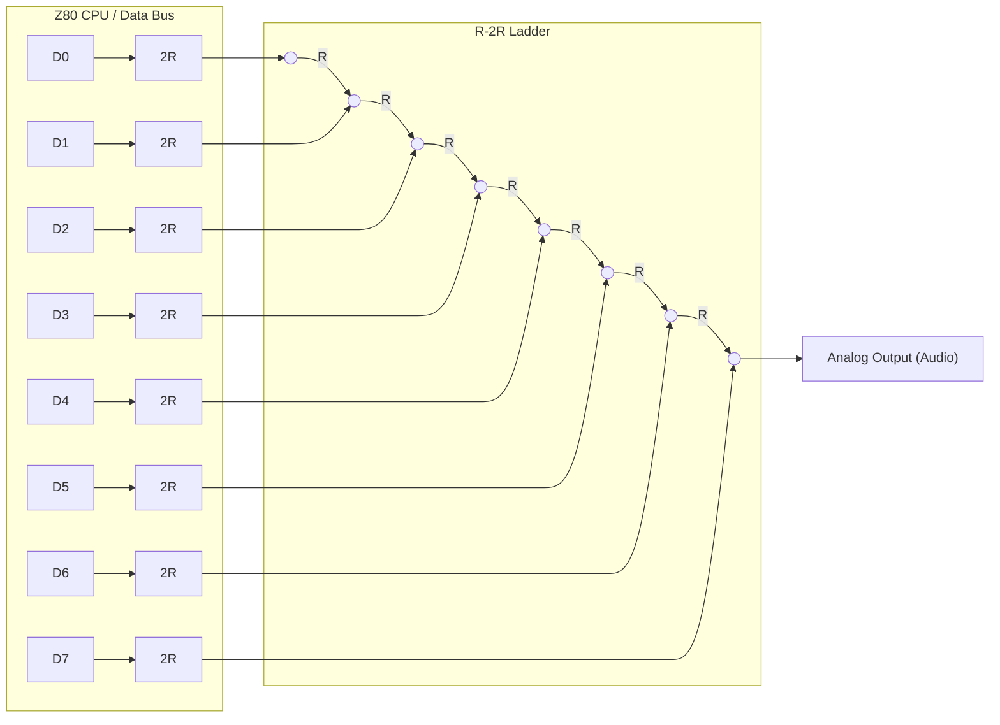
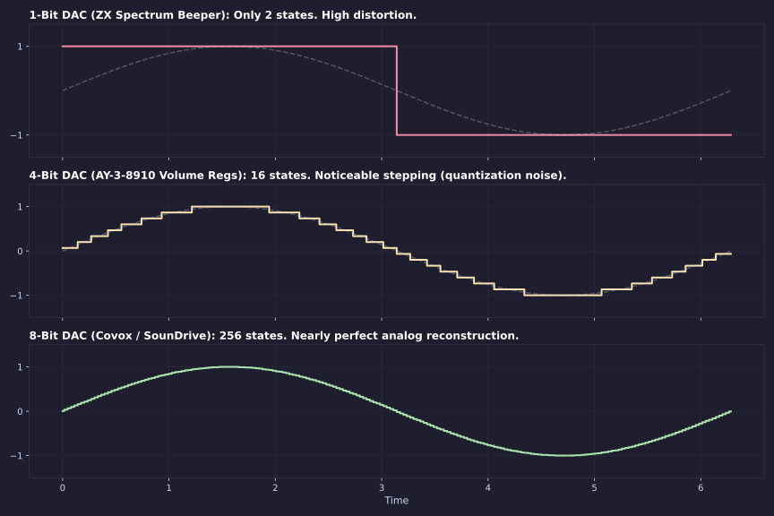
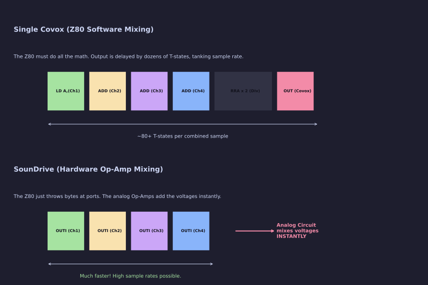
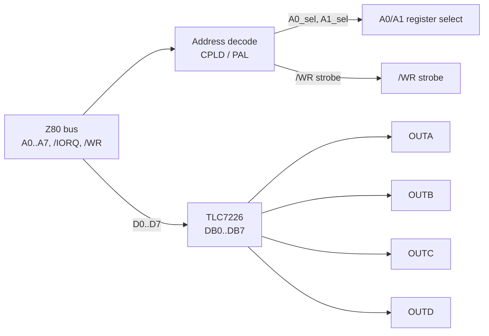

[← Home](../../README.md) · [Sound](../README.md) · [Hardware](README.md)

# Covox & SounDrive — Brute-Force PCM Playback

By the early 1990s, the demoscene and game developers were desperate for digitized sound. Trackers on the Commodore Amiga were pumping out incredible 4-channel sampled music (MOD files), making the ZX Spectrum's AY-3-8910 chip sound decidedly anachronistic. 

Developers tried to force the AY chip to play PCM samples by rapidly changing its volume registers (see [SID-sound and Sample Playback](../synthesis/ay_ym_techniques.md)). But the AY's volume DAC is only 4-bit, non-linear (logarithmic), and requires massive CPU overhead to convert linear 8-bit samples into 4-bit logarithmic equivalents via lookup tables. The results were gritty, quiet, and consumed nearly 100% of the Z80's CPU time.

The solution didn't come from a complex new sound chip. It came from a crude hack invented for IBM PCs in 1987: the **Covox Speech Thing**. It was literally just a handful of resistors plugged into a parallel printer port. Soviet hardware hackers brought this exact concept to the ZX Spectrum, evolving it from a single-channel curiosity into **SounDrive** — a massive 4-channel hardware mixer that bypassed the Z80's mathematical bottlenecks and brought Amiga-quality MOD playback to the Speccy.

---

## 1. Hardware Architecture: The Resistor Ladder

A Covox is nothing more than an **R-2R resistor ladder DAC** (Digital-to-Analog Converter). It uses a network of resistors with only two values ($R$ and $2R$) to convert an 8-bit digital value into an analog voltage.



For the Z80, the brilliance of Covox lies in its sheer simplicity. There are no registers to select. There is no status flag to poll. There is no initialization sequence. **Playing a sample is just a single `OUT` instruction.**

```z80
    LD A, (HL)    ; 7 T-states : Fetch sample from memory
    OUT (C), A    ; 12 T-states: Output directly to speaker voltage!
```



---

## 2. The Single Channel Era: Covox

Initially, clone builders wired a single Covox DAC to a spare I/O port (often hijacking a parallel printer port). If you wrote an 8-bit value to the port, the speaker cone moved to that exact position.

| Clone / Interface | Covox Port | Decoding Mask | R/W | Notes |
|-------------------|------------|---------------|-----|-------|
| **Profi** | `#DF` | `xxxxxxxx11011111` | W | Official Covox port on Profi boards |
| **ATM Turbo** | `#FB` | `xxxxxxxx11111011` | W | Built-in DAC on ATM |
| **Pentagon** | `#FB` | `xxxxxxxx11111011` | W | Often wired to the LPT port |

### The T-State Mixing Problem

A single Covox channel is great for playing a single sound effect (like a gunshot). But to play music, you need multiple instruments simultaneously. 

Because there is only one hardware DAC, the Z80 has to act as a **software mixer**. To play four channels, the Z80 must fetch four samples, add them together, divide by four (to prevent overflow), and then output the final byte. 

The Z80 has no hardware multiply or divide instructions. Addition (`ADD A, B`) is fast, but doing it four times per sample, plus boundary checking, consumes dozens of T-states per output cycle. A 3.5 MHz Z80 simply cannot mix 4 channels in software fast enough to achieve a decent sample rate.

---

## 3. The SounDrive Revolution

In 1995, a Russian demoscene group called **Flash Inc.** realized that if software mixing was too slow, they should mix in *hardware*. 

They designed the **SounDrive** interface. Instead of one Covox, SounDrive put **four independent Covox DACs** on a single expansion board. Each DAC was wired to a different I/O port. The outputs of these four DACs were then sent into an analog op-amp mixer (two for the left ear, two for the right).

### SounDrive v1.05 Port Map

SounDrive uses incomplete address decoding, checking only the low byte (`A7–A0`).

| Channel | Port | Decoding | Pan | Notes |
|---------|------|----------|-----|-------|
| **A** | `#0F` | `xxxxxxxx00001111` | Left | |
| **B** | `#1F` | `xxxxxxxx00011111` | Right | *Conflicts with Kempston Joystick!* |
| **C** | `#4F` | `xxxxxxxx01001111` | Right | |
| **D** | `#5F` | `xxxxxxxx01011111` | Left | |

> [!WARNING]
> **The Kempston Collision:** Port `#1F` is the canonical address for the Kempston Joystick. If a user has a cheap Kempston interface with poor address decoding plugged in alongside a SounDrive, writing a sample to channel B will cause a bus collision.

### Why This Changed Everything

With SounDrive, the Z80 no longer has to do any math. It just fetches a byte for Channel A and throws it at `#0F`. It fetches a byte for Channel B and throws it at `#1F`. The analog circuitry handles the addition instantly. This removed the software mixing bottleneck, allowing developers to write incredibly tight, unrolled playback loops that pushed the ZX Spectrum's sample rate into the 15–20 kHz range—rivaling the Amiga.



### The TLC7226CN — Single-Chip Quad DAC

The original 1995 SounDrive built its four channels from discrete TTL: four octal latches (typically `74HC273`), four R-2R resistor networks (eight resistors each — thirty-two total), and four op-amp buffers (a quad LM324 or similar). That is roughly forty discrete parts dedicated to mixing. It works, but it consumes board space, requires close-tolerance resistors for linearity, and the resistor mismatch between channels causes audible stereo imbalance.

Modern SounDrive implementations replace that entire parts pile with a single 20-pin IC: the **Texas Instruments TLC7226CN** — a monolithic **quad 8-bit digital-to-analog converter** with per-channel input latches, on-chip output buffer amplifiers, and a microprocessor-compatible bus interface. Four DACs, four latches, four op-amps, one chip.

| Parameter | Value |
|---|---|
| **Resolution** | 8 bits (256 levels) per channel |
| **Channels** | 4 (A, B, C, D) — independent latches |
| **Package** | 20-pin DIP (also available in PLCC/SOIC) |
| **Output type** | Voltage-mode with buffered amplifier, ~5 mA source/sink |
| **Reference** | Single `Vref` pin shared by all 4 DACs (2 V to `VDD`−4 V) |
| **Supplies** | `VDD` +5 V, `VSS` −5 V (or 0 V for single-supply) |
| **Bus interface** | 8-bit data (`DB0..DB7`) + `A0`/`A1` register select + `/WR` strobe + `/CS` (tied low in SounDrive use) |
| **Settling time** | ~6 µs typical (1 LSB accuracy) |

### TLC7226CN Pinout (20-pin DIP)

The pin layout deliberately separates analog (pins 1–6 and 19–20) from digital (pins 7–18) to minimize crosstalk. In typical SounDrive use the chip is strapped for single-supply operation (`VSS` = 0 V = `AGND`), `/CS` is tied low so the chip responds whenever `/WR` falls, and the four `OUTA..OUTD` pins route directly to the stereo op-amp mixer.

```
              ┌────────────┐
        OUTB ─┤1         20├── OUTC
        OUTA ─┤2         19├── OUTD
         VSS ─┤3         18├── VDD
         REF ─┤4         17├── A0
        AGND ─┤5         16├── A1
        DGND ─┤6         15├── /WR
         DB7 ─┤7         14├── DB0
         DB6 ─┤8         13├── DB1
         DB5 ─┤9         12├── DB2
         DB4 ─┤10        11├── DB3
              └────────────┘
```

> [!NOTE]
> The `A0`/`A1` inputs form a 2-bit register-select that picks which of the four DAC latches captures `DB0..DB7` on the rising edge of `/WR`. The four combinations map cleanly to SounDrive channels A/B/C/D, so the chip is functionally four SounDrive ports in one package.

### Single-Chip vs. Discrete SounDrive

The table below compares the two SounDrive hardware families. Both produce the same output to software — four bytes written to four I/O ports, four analog outputs summed into stereo — but the engineering trade-offs differ significantly.

| Aspect | Original SounDrive (Flash Inc. 1995) | TLC7226CN SounDrive (e.g., Mick Lab ZXM-SoundCard) |
|---|---|---|
| **DAC core** | Discrete R-2R ladder (8 resistors/channel) | Monolithic thin-film R-2R on TLC7226 die |
| **Input latches** | 4 × `74HC273` (or similar) octal latches | 4 on-chip latches included in TLC7226 |
| **Output buffers** | 4 × op-amp (LM324 / LM358 quad) | 4 on-chip buffer amplifiers included in TLC7226 |
| **Total parts for 4 channels** | ~40 components | 1 IC + 4 mixing resistors |
| **Linearity** | ±1–2 LSB best-case; varies with resistor tolerance | ±1 LSB guaranteed by datasheet |
| **Channel-to-channel match** | Limited by resistor matching (1% recommended) | Tight, all on same die |
| **Settling time** | ~1 µs (limited by op-amp slew) | ~6 µs (slower — on-chip buffered output) |
| **Cost (modern)** | Cheap jellybean parts | TLC7226CN now hard to find; often ~$5–10 NOS |
| **Software compatibility** | Identical — both respond to ports `#0F`/`#1F`/`#4F`/`#5F` |

The practical takeaway: for software, both families look identical. For hardware builders, the TLC7226 reduces board area and component count dramatically, but the original discrete design is easier to source parts for and faster in terms of analog settling time.

### TLC7226 Bus Interface and Legacy Port Compatibility

The TLC7226 exposes four register slots through `A0`/`A1`: `00`=DAC A, `01`=DAC B, `10`=DAC C, `11`=DAC D. In the simplest decoding scheme the four channels would occupy four consecutive ports (`#FB`, `#FC`, `#FD`, `#FE`). But Soviet SounDrive software expects the original Flash Inc. port map (`#0F`, `#1F`, `#4F`, `#5F`). A TLC7226-based SounDrive must therefore include a small programmable logic device (CPLD or PAL) that decodes the legacy port addresses and translates them into the correct `A0`/`A1` combination for the TLC7226.



The decoding logic also handles the Kempston collision (`#1F`) by either routing that address to the joystick port exclusively or by gating SounDrive writes on a configuration bit set by the user.

### Real-World Example: Mick Lab ZXM-SoundCard

The **ZXM-SoundCard** series by Mick Laboratory (`micklab.ru`) is a documented real-world TLC7226-based SounDrive implementation. It is a multi-function sound card for ZX-Bus / Nemo-Bus machines (ZXM-Phoenix, KAY-256/1024) that combines:

- **TSFM part** — two YM2203 OPN chips (ports `#BFFD` / `#FFFD`, NedoPC-compatible)
- **SAA1099 part** — Philips PSG chip (ports `#FF` / `#1FF` write, `#04FF` / `#05FF` in later revisions)
- **SounDrive part** — single TLC7226CN providing four 8-bit DAC channels

The SounDrive part appears only in the **Middle** and **Extreme** board revisions; earlier revisions (00–03, Light) omit it. The card uses a CPLD for address decoding: an Altera **EPM7032STC44** in the Light/Middle revisions and an **EPM7064STC100** in the Extreme revision. The Extreme revision also adds software-selectable clock sources for the YM2203 chips (standard / Amstrad CPC / Atari ST frequencies) via a `#FFFC` configuration port.

> [!NOTE]
> The ZXM-SoundCard is interesting not because it is unique — there are several TLC7226-based SounDrive implementations in the Soviet clone ecosystem — but because the Mick Lab documentation includes full schematics, CPLD firmware source, and bill of materials for every revision. It is the best-documented reference for how a TLC7226 SounDrive is actually wired.

---

## 4. Practical Implementation

To get high-quality audio, the sample output loop must be as tight as physically possible. Every wasted T-state drops the sample rate and muddies the treble frequencies.

Here is a highly optimized 4-channel SounDrive playback loop. Note that we don't use `OUT (C), A`. We use the `OUTI` (Output, Increment, and Decrement) instruction, which is heavily abused here to fetch from `(HL)`, write to port `(C)`, and increment `HL` all in a single 16-T-state sweep.

```z80
; SounDrive 4-Channel Playback Kernel
; Requires Contended Memory Timing awareness! 
; If this runs in contended RAM, the sample rate will jitter wildly.

PlayFrame:
    ; Set up BC for Channel A (Port #0F)
    LD BC, #000F        ; C = Port #0F, B = 0 (we don't care about B here)
    LD HL, (ChanAPtr)   ; HL = Pointer to Channel A sample data
    OUTI                ; 16 T: Read (HL), write to port C, HL++, B--

    ; Set up BC for Channel B (Port #1F)
    LD C, #1F           ; 7 T: Just change the port (C)
    LD HL, (ChanBPtr)   
    OUTI                ; 16 T: Output Channel B

    ; Set up BC for Channel C (Port #4F)
    LD C, #4F           
    LD HL, (ChanCPtr)   
    OUTI                ; 16 T: Output Channel C

    ; Set up BC for Channel D (Port #5F)
    LD C, #5F           
    LD HL, (ChanDPtr)   
    OUTI                ; 16 T: Output Channel D

    ; ... (Save pointers, calculate next pitch step, etc) ...
```

### Performance Reality Check

At 3.5 MHz, the Z80 executes 3,500,000 T-states per second.
If our 4-channel loop (fetching, outputting, advancing pointers, and checking loop bounds) takes **180 T-states** per iteration:

$$ 3,500,000 \div 180 = 19,444 \text{ Hz} $$

A 19.4 kHz sample rate is excellent for 8-bit audio, producing crisp drums and clear vocals. (For comparison, the Amiga's Paula chip typically maxed out around 28 kHz for most MODs).

---

## 5. Antipatterns & Pitfalls

### Antipattern 1: The `IM2` Jitter Trap

A common mistake for beginners is trying to play PCM samples inside the standard 50Hz Vblank interrupt (`IM2`). 

**Why it fails:** The interrupt only fires 50 times a second. If you play a chunk of samples inside the interrupt, the timing between chunks will vary depending on what the main loop was doing when the interrupt hit. Furthermore, standard Z80 interrupts have a variable latency of up to ~23 T-states depending on which instruction was interrupted. This creates brutal, audible clicking and phase jitter.

**The Fix:** Disable interrupts (`DI`). PCM playback must own the entire CPU. If you need to sync with the screen, use the [Floating Bus port `#FF`](../../10_references/io_port_map.md) to poll for the electron beam.

### Antipattern 2: The `LDIR` Myth

You might think: *"If `LDIR` is the fastest way to move memory, I should use `OUTI` in a block repeat (`OTIR`) to blast a sample to the Covox!"*

**Why it fails:** `OTIR` executes in 21 T-states per byte. At 3.5 MHz, that's an output rate of **166 kHz**. The human ear can't hear that, and standard tape-loaded samples are encoded at 8–16 kHz. `OTIR` will finish playing a 1-second sample in a fraction of a tenth of a second, resulting in a microscopic high-pitched "blip."

**The Fix:** You must artificially delay the output to match the sample's target frequency. The playback loop *is* the clock.

---

## 6. Decision Matrix: Choosing a DAC

If you are developing a modern game or demo and want to play digital samples, you have four main options. These are **output method choices**, not platform choices — most methods span multiple hardware tracks. The deciding factor is not what machine the user has, but what sound hardware is fitted to it.

| Output Method | Typical Hardware | CPU Load | Quality / Polyphony |
|---|---|---|---|
| **1-Bit Beeper (PWM)** | Any 48K/128K (built-in speaker port) | **100%** (halts game) | 1–4 channels, heavily distorted, gritty. |
| **AY Volume Registers** | Any AY-equipped machine | **100%** (halts game) | 3 channels. 4-bit logarithmic. Quiet and muddy. |
| **Covox / SounDrive** | Any machine with the expansion fitted | **100%** (halts game) | 4 channels. 8-bit linear stereo. Clear, punchy Amiga-like audio. |
| **[General Sound (GS)](gs_general_sound.md)** | Soviet clones with expansion slot | **0%** (fire and forget) | 4 channels, 8-bit. Handled entirely by the GS card's dedicated Z80. |

> [!IMPORTANT]
> These methods are **not exclusive to the platforms listed in column two** — those are simply where each method is most commonly encountered. The AY chip is built into every Pentagon; Covox works fine on an original 128K with a suitable expansion; a 48K without any sound add-on can still do beeper PWM. Choose the method first, then state your hardware requirement honestly to the user.

> [!WARNING]
> **The CPU load column is not a sliding scale.** Beeper, AY-sample, and Covox/SounDrive are all software-driven playback — the CPU is the playback clock. At a 19 kHz sample rate (see [Performance Reality Check](#performance-reality-check) below), a 4-channel SounDrive loop consumes the **entire** ~70,000-T-state frame budget. There is no leftover for any other activities during audible playback exceot brief keyboard polling. The advantage of Covox over AY-sample playback is **audio quality** (8-bit linear vs 4-bit logarithmic, plus true stereo), not CPU savings. Only the GS card actually offloads the CPU.

---

## 7. Use Cases in the Scene

SounDrive transformed the Soviet demoscene. Trackers like **FlashTracker** and **Digital Studio** allowed musicians to compose traditional 4-channel MOD files directly on the Spectrum. Demos like *Satisfaction* and *Illusion* used SounDrive to blast high-fidelity techno tracks while pushing minimal graphics to the screen, proving that the Spectrum could punch far above its weight class when the CPU was freed from audio math.

---

## References & Further Reading

- [I/O Port Map](../../10_references/io_port_map.md) — Complete port decoding for all clones, including SounDrive and Kempston conflicts.
- [AY/YM Hardware Synthesis](../synthesis/ay_ym_synthesis.md) — Why the AY chip is bad at playing samples.
- [General Sound (GS)](gs_general_sound.md) — The ultimate solution: putting a second Z80 entirely in charge of the audio.
- [Texas Instruments TLC7226 Datasheet (PDF)](https://www.ti.com/lit/gpn/TLC7226) — Official datasheet for the TLC7226 quad 8-bit DAC used in modern single-chip SounDrive implementations.
- [Mick Laboratory: ZXM-SoundCard](http://micklab.ru/My%20Soundcard/ZXMSoundCard.htm) *(in Russian)* — The best-documented TLC7226-based SounDrive reference. Full schematics, CPLD firmware source, and bill of materials for every board revision (00 through Extreme). The SounDrive part appears in the Middle and Extreme revisions alongside TSFM and SAA1099 sections.
