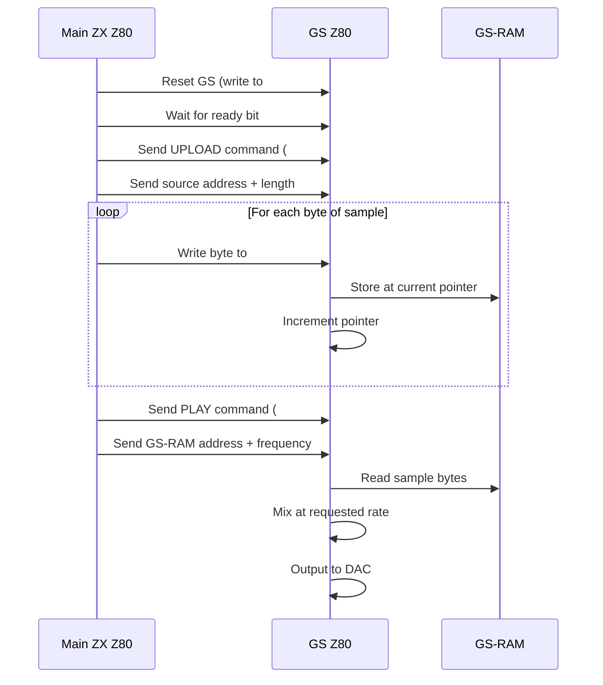

[← Home](../../README.md) · [Sound](../README.md) · [Hardware](README.md)

# General Sound — The ZX Spectrum's Dedicated Z80 Sound Card

> **Applies to**: **Soviet** — original General Sound (GS) expansion card (1994+), NeoGS modern redesign, GMX-bundled GS on Scorpion. **New Gen**: software-emulated GS in some FPGA cores. The GS was never released outside the post-Soviet clone ecosystem.

---

## Overview

Every other sound expansion covered in this section adds **a chip** to the ZX Spectrum. General Sound (GS) adds **an entire second computer**. The GS is a self-contained daughterboard with its own Z80 CPU running at 14 MHz, its own 64 KB or 128 KB of RAM, its own 4-channel 8-bit DAC mixing hardware, and its own firmware. The main Spectrum CPU talks to the GS through a small set of I/O ports, sending high-level commands like "play sample X at note Y on channel Z". The GS's onboard Z80 handles all the sample mixing, freeing the main CPU entirely.

This is the architecture the Soviet scene arrived at by 1994 — three years after TurboSound, two years after the Covox, and one year before the Profi 5.1. The problem with the Covox was that the main CPU had to feed it byte-by-byte, leaving no time for graphics or game logic. The problem with the AY and TurboSound was that they could not play recorded samples convincingly — only synthesized square waves. General Sound solved both problems: it offloaded sample playback to dedicated hardware and gave the Spectrum its first true **digitally mixed multichannel audio**, years before the Amiga's Paula made the concept famous in the West.

> [!IMPORTANT]
> **The GS is a coprocessor, not a peripheral.** It has its own CPU, its own memory map, its own firmware, and its own boot sequence. The main Spectrum writes commands to a small mailbox in shared I/O space; the GS reads the commands, processes them, and writes acknowledgments back. The two CPUs run in parallel and never directly call each other.

This article covers the GS hardware architecture, the command protocol, sample format and storage, programming model, and the differences between original GS and NeoGS. For comparison with the simpler Covox (which the GS replaces) and the synthesized AY (which complements it), see [Sound Hardware Ecosystem Overview](sound_overview.md).

### Naming Convention

| Term | Meaning |
|---|---|
| **GS** | General Sound — the original hardware, released ~1994 |
| **NeoGS** | Modern redesign (2000s+) with improved firmware, larger RAM, faster Z80 |
| **GMX** | The Scorpion GMX's integrated GS — same firmware, motherboard-mounted |
| **GS firmware** | The ROM image that runs on the GS Z80 — provides the command interpreter |
| **Channel (GS sense)** | One of 4 independent sample-mixing voices on the GS DAC |

> [!NOTE]
> **GS firmware versions vary.** The original GS shipped with multiple firmware revisions, some incompatible. NeoGS uses an extended firmware that supports more commands. Software targeting GS should probe the firmware version at startup and degrade gracefully if commands are missing. Most production software assumes the **v1.4 or later** firmware.

---

## Hardware Architecture

The GS board is a self-contained computer. The main Spectrum's only role is to send commands; the GS does everything else.

```mermaid
graph TB
    subgraph "Main ZX Spectrum"
        ZXCPU[Main Z80 @ 3.5 MHz]
        ZXBUS[ZX Bus]
        ZXPORTS["ZX I/O Ports
#B3 / #B7 / #BB / #BF"]
    end
    
    subgraph "General Sound Board"
        BUSIF["Bus Interface
frozen state controller"]
        RESET[Reset Controller
+ jumpers]
        GSROM["Firmware ROM
16 KB"]
        GSRAM["Main RAM
64 KB / 128 KB"]
        GSCPU["GS Z80 @ 14 MHz"]
        MIX["4-channel DAC Mixer
8-bit signed samples"]
        DAC["4-channel Audio DAC
+ low-pass filter"]
        AMP[LM358 Audio Amp
+ line/headphone out]
    end
    
    ZXCPU -->|OUT / IN instructions| ZXBUS
    ZXBUS -->|partial decode
A15=0, A7=1, #B3..#BF| ZXPORTS
    ZXPORTS <-->|command bytes out
status bytes in| BUSIF
    BUSIF <-->|mailbox handshake
(shared I/O latch)| GSCPU
    RESET --> GSCPU
    GSCPU --> GSROM
    GSCPU <--> GSRAM
    GSCPU --> MIX
    MIX --> DAC
    DAC --> AMP
```

### Component Summary

| Component | Specification | Notes |
|---|---|---|
| **GS Z80 CPU** | Z80A or compatible at 14 MHz | 4× faster than the main ZX Z80; runs the firmware interpreter |
| **Firmware ROM** | 16 KB EEPROM, upgradeable | Contains the command interpreter, sample mixer, and basic tracker |
| **RAM** | 64 KB (original) or 128 KB (NeoGS) | Stores samples, song data, player state |
| **DAC** | 4× independent 8-bit DACs, ~22 kHz max rate | Sigma-delta modulation, low-pass filtered |
| **Mixer** | Hardware 4-channel signed adder | Sums 4 channels with per-channel volume |
| **Output** | Stereo line out + mono headphone | Hardware stereo routing (channels 0,2 left; 1,3 right by default) |
| **Reset controller** | Allows main CPU to reset the GS | Useful for crashing-recovery and initialization |

### Why a Second Z80?

The main ZX Z80 at 3.5 MHz cannot mix 4 channels of 8-bit samples at 22 kHz in real time — the arithmetic alone consumes more than the entire frame budget. The GS Z80 at 14 MHz has 4× the clock speed and no contention with the video hardware. It can mix 4 channels comfortably while leaving headroom for command interpretation and sample rate conversion.

The choice of a Z80 (rather than, say, a 6502 or 68000) was deliberate:

1. **Familiarity** — Soviet scene programmers knew the Z80 intimately. The firmware is in Z80 assembly, and the source is available.
2. **Code reuse** — Sample-mixing routines written for the main ZX Z80 could be ported to the GS Z80 with minor changes.
3. **Simplicity** — The Z80 has a clean bus interface, easy to share with the ZX bus through the frozen-state logic.

### The Frozen-State Protocol

The GS Z80 shares the bus interface with the main ZX Z80, but they cannot both drive the bus at the same time. The solution is a **frozen-state controller**: when the main ZX CPU wants to access GS memory or registers, it asserts a freeze line. The GS Z80 pauses at the next bus cycle boundary, releases its bus drivers, and waits. The ZX CPU performs its access, then de-asserts the freeze line. The GS Z80 resumes.

This is invisible to the GS firmware — the freeze appears as a brief bus stall, not a context switch. The firmware does not need to handle it explicitly. From the GS Z80's perspective, the main CPU is a slow peripheral that occasionally interrupts its mixing loop.

---

## Communication Protocol

The main ZX CPU and the GS communicate through **four I/O ports** decoded on the GS board. These ports form a small mailbox — the ZX writes commands and parameters, the GS reads them and writes status responses.

### Port Map

| Port | Decoding | Direction | Function |
|---|---|---|---|
| `#B3` | A7=0, A0=1 (low decode) | ZX→GS | **System / Status**: reset, enable, status read |
| `#B7` | A7=0, A0=1 | ZX→GS | **Command / Parameter**: write command bytes |
| `#BB` | A7=0, A0=1 | ZX→GS | **Address register**: set GS-RAM pointer (for sample upload) |
| `#BF` | A7=0, A0=1 | ZX↔GS | **Data port**: read or write GS-RAM at the current pointer |

> [!WARNING]
> **Port decoding varies by revision.** The original GS uses `#B3`–`#BF`. Some clones (notably Profi) use a different range. Software that detects GS should probe the standard ports first, then fall back to non-standard ports for known clone variants. NeoGS preserves the original port mapping for compatibility.

### Status Register (Read from `#B3`)

```
System / Status register:
  bit 7: GS active (0 = GS is reset or absent)
  bit 6: GS firmware ready (0 = busy, 1 = ready for commands)
  bit 5: GS Z80 is in frozen state
  bit 4: Reserved
  bit 3: Reserved
  bit 2..0: Firmware version code (low 3 bits)
```

Software reads this port to determine whether the GS is present, what firmware version is running, and whether the GS is ready to accept commands.

### Command Format

GS commands are **variable-length byte sequences** written to port `#B7`. The first byte is the command code; subsequent bytes are parameters. Some commands have no parameters, others have up to 7.

```z80
; -------------------------------------------------------
; Send a command byte to the GS.
; Entry: A = command byte
; Destroys: A, B, C
; -------------------------------------------------------
GS_SEND_CMD:
    LD   BC,#B3           ; status port
    IN   A,(C)            ; read status
    AND  #40              ; ready bit
    JR   Z, GS_SEND_CMD   ; wait until GS is ready
    LD   BC,#B7           ; command port
    OUT  (C),A            ; send command byte
    RET
```

### Standard Command Set (Firmware v1.4+)

| Command | Bytes | Description |
|---|---|---|
| `#00` | 1 | **No-op** — increment internal command counter for debugging |
| `#01` | 1 | **Stop all channels** — silence the GS immediately |
| `#02` | 2 (`#02, channel`) | **Stop one channel** — silence the specified channel |
| `#03` | 7 (`#03, ch, addr_lo, addr_hi, len_lo, len_hi, freq`) | **Play sample** — start playback of a sample in GS-RAM |
| `#04` | 3 (`#04, ch, volume`) | **Set volume** — change a channel's volume (0..255) |
| `#05` | 3 (`#05, ch, freq_lo, freq_hi`) | **Set frequency** — change a channel's sample rate |
| `#06` | 5 (`#06, src_lo, src_hi, dst_lo, dst_hi, len_lo, len_hi`) | **Upload sample** — copy sample data from ZX-RAM to GS-RAM |
| `#07` | 3 (`#07, ch, loop_mode`) | **Set loop mode** — 0=one-shot, 1=loop |
| `#08` | 3 (`#08, ch, position`) | **Set position** — seek within a playing sample |
| `#09` | 1 | **Get version** — write firmware version to status register |

### Sample Upload Sequence

The most common operation: copy a sample from ZX-RAM to GS-RAM, then play it. This sequence is wrapped in a high-level routine that hides the port dance.



### Readback: How the ZX Knows What GS Is Doing

The status register at `#B3` is the only mechanism for the ZX to query GS state. For more detail (e.g., "is channel 2 still playing?"), the GS exposes a small status region in GS-RAM. The ZX writes to `#BB` to set the pointer, then reads from `#BF` to retrieve status bytes.

The standard GS-RAM status region (firmware v1.4+) is at GS-RAM addresses `#FF00`..`#FFFF`:

```
GS-RAM #FF00:  Channel 0 state (0=stopped, 1=playing, 2=paused)
GS-RAM #FF01:  Channel 1 state
GS-RAM #FF02:  Channel 2 state
GS-RAM #FF03:  Channel 3 state
GS-RAM #FF04:  Global flags
GS-RAM #FF05..#FF1F: Reserved
GS-RAM #FF20..#FF3F: Per-channel current position (16-bit, low/high bytes)
```

Software polls these bytes to know when a sample has finished, to implement retriggering, or to start the next note in a sequence.

---

## Sample Format and Storage

GS samples are raw **8-bit signed PCM** (range `#80`..`#7F`, i.e. -128..+127). There is no header, no compression, and no special framing — the firmware reads raw bytes from GS-RAM and feeds them to the DAC. Sample metadata (length, default rate, loop points) lives in the player's data structures, not in the sample itself.

### Sample Layout in GS-RAM

```
GS-RAM addresses:
  #0000..#BFFF  Sample storage area (48 KB)
  #C000..#FBFF  Song data, instruments, additional samples
  #FC00..#FEFF  Firmware working area (do not overwrite)
  #FF00..#FFFF  Status region (read-only from ZX side)
```

Original 64 KB GS RAM splits roughly 48 KB for samples + 16 KB for firmware working data. NeoGS with 128 KB RAM roughly doubles the sample capacity.

### Sample Rate Encoding

Sample rate is set per-channel via the PLAY command (`#03`) or the SET FREQUENCY command (`#05`). The encoding is a **divisor**:

```
Sample rate = 14,000,000 / (divisor × 8) Hz
```

| Divisor | Sample Rate | Use case |
|---|---|---|
| `#4F` (79) | ~22.15 kHz | Maximum useful rate, music |
| `#5E` (94) | ~18.62 kHz | Slightly lower quality |
| `#7E` (126) | ~13.89 kHz | Speech, lower-quality samples |
| `#A0` (160) | ~10.94 kHz | Drum loops |

Per-channel rate can be changed dynamically, allowing pitch-shifting effects. The firmware resamples the source sample to match the requested rate.

### Sample Format Comparison

| Format | Signedness | Range | Notes |
|---|---|---|---|
| **GS standard** | Signed | -128..+127 (`#80`..`#7F`) | Sample value 0 = silence (`#00`) |
| **ZX Covox** | Unsigned | 0..255 (`#00`..`#FF`) | Sample value 128 = silence (`#80`) |
| **WAV (8-bit)** | Unsigned | 0..255 | Same as Covox |
| **DMA audio (Next)** | Unsigned | 0..255 | Same as Covox |

GS samples must be converted from unsigned to signed before upload. The conversion is a single-byte operation (`XOR #80` or `SUB #80`). Software libraries that ship in Covox format can be reused on the GS with a one-time conversion.

### Sample Compression

The GS firmware does not natively support sample compression — samples are stored as raw 8-bit PCM. The Soviet scene developed a few ad-hoc compression formats:

- **Delta-encoded samples**: store only the difference between consecutive samples (1-bit or 4-bit). Decompress on the ZX side before uploading to GS-RAM.
- **Variable-rate samples**: store shorter samples for silences, longer for transients. Requires custom firmware.
- **4-bit ADPCM**: similar to the IMA ADPCM standard. Halves storage at the cost of slight quality loss.

None of these were widely standardized. Most GS music simply stores raw 8-bit samples and accepts the memory cost.

### Memory Budget for Music

A typical GS music module uses:

- **1-2 KB** for the player code
- **4-12 KB** for instrument samples (one-shot drum hits, short synth sounds)
- **16-32 KB** for a long sample (vocal phrase, sustained instrument)
- **1-4 KB** for the song data (note sequences, patterns)

Original GS (64 KB total) fits ~30 seconds of dense music. NeoGS (128 KB) fits ~60-90 seconds. Longer music requires runtime sample swapping — a slow operation that limits itself to between-song transitions.

---

## Programming Model

GS programming from the ZX side is fundamentally different from programming the AY or Covox. Instead of writing register values or sample bytes directly, the ZX writes **commands** to a mailbox port. The GS firmware interprets the commands and performs the actual audio work.

### Detection

```z80
; -------------------------------------------------------
; Detect General Sound hardware.
; Exit:  A = 0 if no GS, A = 1 if GS present
; Destroys: AF, BC
; -------------------------------------------------------
GS_DETECT:
    LD   BC,#B3           ; status port
    IN   A,(C)
    AND  #80              ; bit 7 = GS active
    RET  Z                ; bit 7 = 0 -> no GS
    LD   A,1
    RET
```

For higher confidence, software can additionally check the firmware version (in bits 0..2 of the status register) and require v1.4 or later.

### Upload a Sample

This routine copies a sample from ZX-RAM into GS-RAM. The ZX-RAM source address is `(HL)`; the GS-RAM destination is `(DE)`; the length is `(BC)` bytes.

```z80
; -------------------------------------------------------
; Upload a sample from ZX-RAM to GS-RAM.
; Entry: HL = ZX-RAM source address
;        DE = GS-RAM destination address
;        BC = length in bytes
; Destroys: AF, BC, DE, HL
; -------------------------------------------------------
GS_UPLOAD_SAMPLE:
    ; 1. Wait for GS ready
    CALL GS_WAIT_READY

    ; 2. Set GS-RAM pointer to DE via port #BB
    LD   A,E
    OUT  (#BB),A          ; low byte of GS-RAM address
    LD   A,D
    OUT  (#BB),A          ; high byte of GS-RAM address

    ; 3. Copy bytes via port #BF
    LD   A,B
    OR   C
    RET  Z                ; length = 0 -> done
UPLOAD_LOOP:
    LD   A,(HL)
    OUT  (#BF),A          ; write byte to GS-RAM at current pointer
    INC  HL
    DEC  BC
    LD   A,B
    OR   C
    JR   NZ,UPLOAD_LOOP
    RET

GS_WAIT_READY:
    PUSH BC
    LD   BC,#B3
WAIT_LOOP:
    IN   A,(C)
    AND  #40              ; bit 6 = ready
    JR   Z,WAIT_LOOP
    POP  BC
    RET
```

### Play a Sample

This routine starts playback of a sample stored in GS-RAM on a specific channel.

```z80
; -------------------------------------------------------
; Play a sample on a GS channel.
; Entry: A = channel (0..3)
;        DE = GS-RAM address of sample
;        BC = sample length in bytes
;        L = sample rate divisor (e.g. #4F for 22 kHz)
; Destroys: AF, BC, DE, HL
; -------------------------------------------------------
GS_PLAY_SAMPLE:
    PUSH AF               ; save channel
    PUSH DE               ; save sample address
    PUSH BC               ; save length

    CALL GS_WAIT_READY

    ; Send PLAY command: #03, channel, addr_lo, addr_hi,
    ;                    len_lo, len_hi, freq
    LD   A,#03
    OUT  (#B7),A          ; command byte
    POP  BC               ; restore length
    POP  DE               ; restore address
    POP  AF               ; restore channel
    OUT  (#B7),A          ; channel byte
    LD   A,E
    OUT  (#B7),A          ; addr low
    LD   A,D
    OUT  (#B7),A          ; addr high
    LD   A,C
    OUT  (#B7),A          ; length low
    LD   A,B
    OUT  (#B7),A          ; length high
    LD   A,L              ; rate divisor
    OUT  (#B7),A          ; frequency
    RET
```

### Per-Frame Music Update

A complete music player runs from the ULA frame interrupt (50 Hz or 60 Hz). The ISR reads the current pattern from the song data, sends PLAY commands for any newly-triggered notes, and updates per-channel volumes and frequencies for sustained notes.

```z80
; -------------------------------------------------------
; Per-frame music ISR.
; Assumes: GS is initialized, song is loaded.
; -------------------------------------------------------
GS_MUSIC_ISR:
    DI                   ; critical section
    PUSH AF
    PUSH BC
    PUSH DE
    PUSH HL

    CALL MUSIC_UPDATE    ; application-specific: parse next row,
                         ;   trigger notes, update volumes

    POP  HL
    POP  DE
    POP  BC
    POP  AF
    EI
    RETI
```

The `MUSIC_UPDATE` routine is application-specific — it depends on the song data format and the desired musical behavior. Most GS music uses a tracker format exported from a PC-based editor (Pro Tracker GS, EXT Sound Editor) and runs through a generic player routine shipped with the editor.

### Per-Frame T-State Budget

The main CPU's cost for GS music is small because the actual mixing happens on the GS:

| Operation | Count per frame | T-states each | Total |
|---|---|---|---|
| Wait for GS ready | ~4 | ~21 (if immediately ready) | ~85 |
| PLAY commands (avg. 1-2 new notes) | ~14 bytes each | ~21 | ~600 |
| VOLUME/FREQUENCY updates | ~12 bytes | ~21 | ~250 |
| Bank-switch and pointer management | n/a | n/a | ~150 |
| **Total per frame** | | | **~1,100 T-states** |

This is **2%** of the 50 Hz frame budget on a stock 128K. The GS frees the remaining 98% for graphics, game logic, or other audio (AY/TurboSound can run in parallel).

---

## GS Variants

The original GS hardware shipped in limited quantities (~1994–1998). Several redesigns and reimplementations followed.

### Original GS (1994–1998)

The first commercial General Sound board:

| Spec | Value |
|---|---|
| **GS Z80 clock** | 14 MHz (crystal oscillator) |
| **RAM** | 64 KB static RAM |
| **ROM** | 16 KB EEPROM (firmware) |
| **Firmware version** | 1.0 through 1.7 (multiple revisions) |
| **DAC** | 4× 8-bit R-2R ladders |
| **Output** | Stereo line out, mono headphone |
| **Bus interface** | ZX Spectrum expansion edge connector |
| **Power** | +5V / +12V from host (the +12V powers the op-amps) |

The original GS is the reference for all software compatibility. NeoGS and FPGA implementations preserve its port mapping, command set, and firmware behavior.

### NeoGS (2000s+)

NeoGS is a modern redesign by Russian enthusiasts. The goals are increased RAM, faster CPU, improved firmware, and lower power consumption.

| Spec | Original GS | NeoGS | Improvement |
|---|---|---|---|
| **GS Z80 clock** | 14 MHz | 14 MHz (same) | — |
| **RAM** | 64 KB | 128 KB or 512 KB | 2-8× more sample storage |
| **ROM** | 16 KB | 32 KB (extended firmware) | More built-in commands |
| **Firmware** | v1.7 (last official) | v2.x (NeoGS extensions) | Backward-compatible |
| **DAC** | 4-channel 8-bit | 4-channel 8-bit (or 8-channel via firmware) | Optional 8-channel mixing |
| **Output** | Stereo line, mono headphone | Stereo line, mono headphone, SPDIF | Digital output added |
| **Power** | +5V / +12V | +5V only | Drops the +12V requirement |

NeoGS firmware is a **superset** of original GS. Software written for original GS runs unmodified. New commands include:

- `#10` — Set panning per channel (left/right/center)
- `#11` — Set master volume
- `#12` — Read sample position with finer granularity
- `#13` — Trigger sample with envelope (attack/decay/sustain/release)
- `#14` — Set channel-specific clock (for pitch-shifting tricks)

### Scorpion GMX Integrated GS

The Scorpion GMX includes GS on the motherboard, sharing the same firmware and command set. The GMX's GS is electrically equivalent to an original GS card plugged into the expansion port. Software that supports external GS supports GMX GS automatically.

GMX's integration advantage: there is no expansion cable, no edge-connector wear, no signal degradation. The audio output is also wired through the GMX's built-in audio mixer alongside TurboSound.

### FPGA Implementations

Several FPGA ZX reimplementations include software-emulated GS:

- **TS-Conf**: Optional GS emulation, accessible through the standard `#B3`–`#BF` ports.
- **Universe**: Similar, with extended sample RAM.
- **ZX Spectrum Next**: **No native GS support** — the Next provides DMA audio instead, which serves a similar role but with a different programming model.

Software that requires GS specifically will not work on the Next. Software that requires DMA audio will not work on GS. The two subsystems are not interchangeable.

### Software Support

The GS software ecosystem is small but active:

- **Pro Tracker GS** (PT-GS): The canonical PC-based GS tracker. Exports `.GS` modules that play through a generic ISR routine.
- **EXT Sound Editor**: Alternative tracker with different module format.
- **E-Tracker**: Russian-language GS tracker, popular in the late 1990s.
- **Arkos Tracker 2/3**: Modern multi-platform tracker with GS export (experimental).
- **Game soundtracks**: Several Soviet games use GS for music, including *Black Crow* and various Russian RPGs.
- **Demoscene**: GS music appears in late-1990s demos by groups like *Dual Crew* and *Skull Jam*.

---

## Comparison with Covox, AY, and DMA Audio

The GS occupies a unique niche in the ZX Spectrum sound ecosystem. The decision matrix:

| Criterion | AY / TurboSound | Covox / SounDrive | General Sound | Next DMA Audio |
|---|---|---|---|---|
| **Synthesis** | Square-wave PSG | 8-bit samples | 8-bit samples | 8-bit samples |
| **Channels** | 3 (or 6/9 with TS) | 1 (mono sum) | 4 (hardware mixed) | 1 (mono) or 2 (stereo) |
| **Max sample rate** | n/a (synthesis) | ~8-10 kHz (CPU-limited) | ~22 kHz | ~48 kHz |
| **CPU cost** | Low (~600 T-states/frame) | High (~30,000 T-states/frame at 8 kHz) | Very low (~1,100 T-states/frame) | Zero (DMA is autonomous) |
| **Audio quality** | Lo-fi, characteristic | Lo-fi, grainy | Mid-fi, clean | High-fi, near-CD |
| **Audience** | All 128K+ Spectrums | Covox owners (rare) | GS owners (rare) | Next owners only |
| **Cost (1990s)** | Built-in / $5 mod | $10-15 mod | $50-80 card | (not available) |

### Modern Analogies

| Retro Concept | Modern Equivalent | Notes |
|---|---|---|
| GS coprocessor architecture | Modern sound card with onboard DSP | Same concept: dedicated audio processor |
| Frozen-state protocol | Bus arbitration in modern PCI/PCIe | Same idea, different scale |
| GS firmware as command interpreter | Sound card driver / hardware abstraction | Software talks high-level commands |
| Sample upload to GS-RAM | Loading samples into a sound card's RAM | Common technique in 1990s PC audio |
| NeoGS extended command set | Driver API extensions | Backward-compatible superset |

---

## Pitfalls and Common Mistakes

### Pitfall 1: Forgotten Firmware Version Check

**Symptom**: Software that uses NeoGS-specific commands (`#10`..`#14`) crashes or produces no output on original GS hardware.

**Cause**: The original GS firmware v1.x does not recognize the extended command codes. The behavior is undefined — sometimes the commands are silently dropped, sometimes they corrupt firmware state.

**Fix**: Probe the firmware version at startup (bits 0..2 of status register `#B3`). If v1.x, disable NeoGS-specific commands and fall back to the v1 command set.

### Pitfall 2: Unsigned vs. Signed Sample Confusion

**Symptom**: Imported Covox/WAV samples play with distorted, metallic timbre on the GS.

**Cause**: GS samples are **signed** (-128..+127). Covox/WAV samples are **unsigned** (0..255). Mixing them up produces severe clipping and phase inversion.

**Bad code**:

```z80
; Upload raw WAV bytes without conversion
LD   A,(HL)
OUT  (#BF),A        ; BUG: signedness wrong
```

**Correct**: XOR with `#80` to flip the signedness:

```z80
LD   A,(HL)
XOR  #80            ; convert unsigned to signed
OUT  (#BF),A
```

### Pitfall 3: Race Condition on Sample Upload

**Symptom**: Sample playback produces random noise for the first ~50 ms, then plays correctly.

**Cause**: The ZX started the PLAY command before the upload completed. The GS firmware reads partially-uploaded sample data — the tail of the buffer contains garbage.

**Fix**: Always verify the upload completed before sending PLAY. The GS sets a "done" flag in the status region after each UPLOAD command — poll it.

### Pitfall 4: Buffer Overflow During Sample Upload

**Symptom**: GS firmware crashes after uploading a large sample.

**Cause**: The upload exceeded GS-RAM capacity. Original GS has 64 KB; overwriting the firmware working area at `#FC00`..`#FEFF` corrupts internal state.

**Fix**: Track the next-free-pointer in your software and abort the upload if it would cross into `#FC00`.

---

## Best Practices

1. **Detect the firmware version at startup** and degrade gracefully on original GS.
2. **Convert samples to signed format at load time**, not per-byte during upload. Saves CPU and avoids signedness confusion.
3. **Use per-channel sample rates** for pitch-shifting — far cheaper than resampling in software.
4. **Poll the GS status region** for channel state, not just the status register. This gives accurate "sample finished" detection.
5. **Reset the GS before each song** — clears firmware state and avoids contamination from previous playback.
6. **Test on both original GS and NeoGS** if possible. They are not 100% identical in edge cases.
7. **Keep upload size under ~46 KB** to leave room for firmware state. Original GS cannot use the full 64 KB for samples.

---

## When to Use General Sound

**Use GS when**:
- The composition requires sample-based instruments (vocals, recorded drums, real instrument samples)
- The main CPU is fully occupied by graphics or game logic
- The target audience is Soviet clone users with GS or NeoGS hardware
- The composition benefits from hardware pitch-shifting per channel

**Do NOT use GS when**:
- The target platform is original 128K, +2, +3 — GS hardware does not exist
- The target is ZX Spectrum Next — DMA audio is the modern equivalent
- Memory budget is tight — samples consume RAM rapidly
- The audience is broader than Soviet clone owners

**Alternatives**:
- **Covox / SounDrive** ([covox_sounDrive.md](covox_sounDrive.md)) — simpler 1-channel DAC, no dedicated CPU
- **ZX Spectrum Next DMA audio** ([zx_next_audio.md](zx_next_audio.md)) — modern replacement for GS
- **AY/YM with sample techniques** ([ay_ym_techniques.md](../synthesis/ay_ym_techniques.md)) — volume-modulated samples on the AY, lower quality but no extra hardware

---

## Impact on Emulation and FPGA

GS emulation is challenging because the firmware is itself a Z80 program running on a virtual second CPU. Correct emulation requires:

1. **A second virtual Z80** running the firmware, at 14 MHz equivalent speed.
2. **Frozen-state bus arbitration** between the main Z80 and the GS Z80.
3. **Cycle-timed DAC output** at the requested sample rate per channel.
4. **Accurate RAM behavior** — the GS-RAM is shared with the firmware working area, and overwrites corrupt state.

The most accurate GS emulation is in **Unreal Speccy** and **ZEsarUX**, both of which boot the original firmware image. Emulators that approximate the command behavior without running the firmware produce subtle audio artifacts.

FPGA implementations (TS-Conf, Universe) typically implement the GS coprocessor as a second soft-core Z80 inside the FPGA, mirroring the original hardware architecture.

---

## References

### Primary Sources

- **General Sound Documentation** — original Russian-language manuals, 1994–1998. Circulates on [zx-pk.ru](https://zx-pk.ru/) as scanned PDFs.
- **GS Firmware Source Code** — disassemblies of v1.7 firmware, annotated by the Russian scene.
- **NeoGS Specification** — modern Russian documentation, available on the NeoGS GitHub project.
- **Pro Tracker GS User Manual** — documents the .GS module format and player routine.

### Community Knowledge

- [zx-pk.ru GS forums](https://zx-pk.ru/) — Russian-language forums with the most concentrated GS knowledge
- [NeoGS project page](http://nedoPC.org/) — modern hardware redesign, ongoing development
- [Velesoft's GS page](http://velesoft.speccy.cz/) — English-language summary of GS hardware and software
- [zxtunes.com](https://zxtunes.com) — archive of GS-format music modules

### Cross-References

- [AY-3-8910 / 8912 / 8913 / YM2149F — PSG Silicon](ay_3_8912.md) — the AY synthesis alternative
- [TurboSound — Dual and Triple AY Configuration](turbosound.md) — Soviet multi-PSG expansion
- [ZX Spectrum Next Audio](zx_next_audio.md) — modern DMA audio (the GS's conceptual successor)
- [Covox & SounDrive](covox_sounDrive.md) — the simpler CPU-driven DAC
- [[MoonSound](https://www.msx.org/wiki/MoonSound)](moonsound.md) — alternative expansion with wavetable synthesis
- [TurboSound FM](turbosound_fm.md) — FM synthesis expansion (different approach to richer timbres)
- [Sound Hardware Ecosystem Overview](sound_overview.md) — full decision guide across all ZX sound hardware

