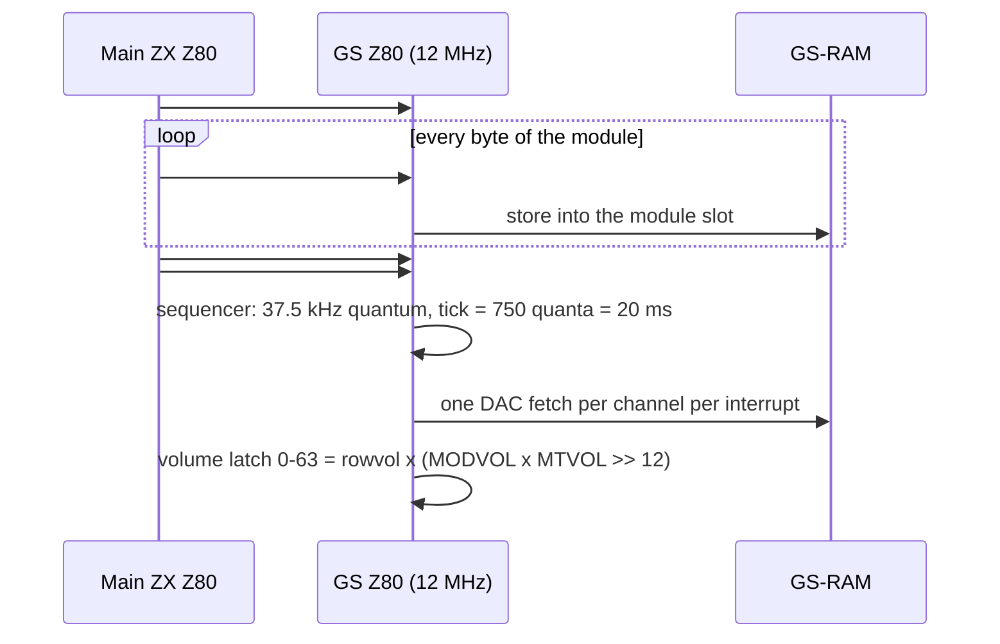

[← Home](../../README.md) · [Sound](../README.md) · [Hardware](README.md)

# General Sound — The ZX Spectrum's Dedicated Z80 Sound Card

> **Applies to**: **Soviet** — original General Sound (GS) expansion card (1994+), NeoGS modern redesign, GMX-bundled GS on Scorpion. **New Gen**: software-emulated GS in some FPGA cores. The GS was never released outside the post-Soviet clone ecosystem.

---

## Overview

Every other sound expansion covered in this section adds **a chip** to the ZX Spectrum. General Sound (GS) adds **an entire second computer**. The GS is a self-contained daughterboard with its own Z80 CPU running at 14 MHz, its own 64 KB or 128 KB of RAM, its own 4-channel 8-bit DAC mixing hardware, and its own firmware. The main Spectrum CPU talks to the GS through a small set of I/O ports, sending high-level commands like "play sample X at note Y on channel Z". The GS's onboard Z80 handles all the sample mixing, freeing the main CPU entirely.

This is the architecture the Soviet scene arrived at by 1994 — three years after TurboSound, two years after the Covox, and one year before the Profi 5.1. The problem with the Covox was that the main CPU had to feed it byte-by-byte, leaving no time for graphics or game logic. The problem with the AY and TurboSound was that they could not play recorded samples convincingly — only synthesized square waves. General Sound solved both problems: it offloaded sample playback to dedicated hardware and gave the Spectrum its first true **digitally mixed multichannel audio**, years before the Amiga's Paula made the concept famous in the West.

> [!IMPORTANT]
> **The GS is a coprocessor, not a peripheral.** It has its own CPU, its own memory map, its own firmware, and its own boot sequence. The main Spectrum writes commands to a small mailbox in shared I/O space; the GS reads the commands, processes them, and writes acknowledgments back. The two CPUs run in parallel and never directly call each other.

This article covers the GS hardware architecture, the command protocol, sample format and storage, programming model, and the differences between original GS and NeoGS. For comparison with the simpler Covox (which the GS replaces) and the synthesized AY (which complements it), see [Sound Hardware Ecosystem Overview](sound_overview.md).

### Naming Convention

| Term | Meaning |
|---|---|
| **GS** | General Sound — the original hardware, released ~1994 |
| **NeoGS** | Modern redesign (2000s+) with improved firmware, larger RAM, faster Z80 |
| **GMX** | The Scorpion GMX's integrated GS — same firmware, motherboard-mounted |
| **GS firmware** | The ROM image that runs on the GS Z80 — provides the command interpreter |
| **Channel (GS sense)** | One of 4 independent sample-mixing voices on the GS DAC |

> [!NOTE]
> **GS firmware versions vary.** The classic firmware line is **1.04 / 1.05a** (the ZX-MultiSound clone carries 1.05b); NeoGS extends the command set with its own firmware supporting SD-card storage and MP3. Software targeting GS should probe with a command/reply round-trip (see Detection below) and degrade gracefully if commands go unanswered.

---

## Hardware Architecture

The GS board is a self-contained computer. The main Spectrum's only role is to send commands; the GS does everything else.

```mermaid
graph TB
    subgraph "Main ZX Spectrum"
        ZXCPU[Main Z80 @ 3.5 MHz]
        ZXBUS[ZX Bus]
        ZXPORTS["ZX I/O Ports
#B3 data / #BB command"]
    end
    
    subgraph "General Sound Board"
        BUSIF["Bus Interface
frozen state controller"]
        RESET[Reset Controller
+ jumpers]
        GSROM["Firmware ROM
16 KB (1.04 / 1.05a)"]
        GSRAM["Main RAM
128-512 KB"]
        GSCPU["GS Z80 @ 12 MHz"]
        MIX["4-channel DAC Mixer
8-bit signed samples"]
        DAC["4-channel Audio DAC
+ low-pass filter"]
        AMP[LM358 Audio Amp
+ line/headphone out]
    end
    
    ZXCPU -->|OUT / IN instructions| ZXBUS
    ZXBUS -->|low-byte decode
#B3 / #BB| ZXPORTS
    ZXPORTS <-->|command bytes out
status bytes in| BUSIF
    BUSIF <-->|mailbox handshake
(shared I/O latch)| GSCPU
    RESET --> GSCPU
    GSCPU --> GSROM
    GSCPU <--> GSRAM
    GSCPU --> MIX
    MIX --> DAC
    DAC --> AMP
```

### Component Summary

| Component | Specification | Notes |
|---|---|---|
| **GS Z80 CPU** | Z80A or compatible at 14 MHz | 4× faster than the main ZX Z80; runs the firmware interpreter |
| **Firmware ROM** | 16 KB EEPROM, upgradeable | Contains the command interpreter, sample mixer, and basic tracker |
| **RAM** | 64 KB (original) or 128 KB (NeoGS) | Stores samples, song data, player state |
| **DAC** | 4× independent 8-bit DACs, ~22 kHz max rate | Sigma-delta modulation, low-pass filtered |
| **Mixer** | Hardware 4-channel signed adder | Sums 4 channels with per-channel volume |
| **Output** | Stereo line out + mono headphone | Hardware stereo routing (channels 0,2 left; 1,3 right by default) |
| **Reset controller** | Allows main CPU to reset the GS | Useful for crashing-recovery and initialization |

### Why a Second Z80?

The main ZX Z80 at 3.5 MHz cannot mix 4 channels of 8-bit samples at 22 kHz in real time — the arithmetic alone consumes more than the entire frame budget. The GS Z80 at 14 MHz has 4× the clock speed and no contention with the video hardware. It can mix 4 channels comfortably while leaving headroom for command interpretation and sample rate conversion.

The choice of a Z80 (rather than, say, a 6502 or 68000) was deliberate:

1. **Familiarity** — Soviet scene programmers knew the Z80 intimately. The firmware is in Z80 assembly, and the source is available.
2. **Code reuse** — Sample-mixing routines written for the main ZX Z80 could be ported to the GS Z80 with minor changes.
3. **Simplicity** — The Z80 has a clean bus interface, easy to share with the ZX bus through the frozen-state logic.

### The Frozen-State Protocol

The GS Z80 shares the bus interface with the main ZX Z80, but they cannot both drive the bus at the same time. The solution is a **frozen-state controller**: when the main ZX CPU wants to access GS memory or registers, it asserts a freeze line. The GS Z80 pauses at the next bus cycle boundary, releases its bus drivers, and waits. The ZX CPU performs its access, then de-asserts the freeze line. The GS Z80 resumes.

This is invisible to the GS firmware — the freeze appears as a brief bus stall, not a context switch. The firmware does not need to handle it explicitly. From the GS Z80's perspective, the main CPU is a slow peripheral that occasionally interrupts its mixing loop.

---

## Communication Protocol — the Mailbox

The ZX and the GS card talk through a **two-port mailbox**, verified against the shipped firmware source (`COM_L/COM_H/INIT_H/LOAD_L.a80` of GS 1.04/1.05):

### Port Map

| Port | Direction | Function |
|---|---|---|
| `#xxB3` | ZX→GS write | **Data** byte (parameters in, replies out on read) |
| `#xxB3` | ZX←GS read | **Output register** (`OUTRG`) — the GS's reply byte |
| `#xxBB` | ZX→GS write | **Command** byte |
| `#xxBB` | ZX←GS read | **Status**: bit 7 = data flag (a reply awaits in `#B3`), bit 0 = command flag (command not yet consumed), bits 1–6 read as 1 |

Decode is on the **low byte** (`#B3`/`#BB`, any high byte). The classic card asserts IORQGE on reads only; the `#33` **control port** exists on the NeoGS / ZXM-GS variants (bit 7 = card reset; ZXM-GS adds bit 4 = disable), **not** on the classic card.

### The data-first rule

Parameterized commands (`#13`, `#16`, `#30`, `#31`, …) consume their parameter at dispatch time — so the host must write the **data byte to `#B3` first**, then the command to `#BB`:

```z80
; -------------------------------------------------------
; Send a command byte (no parameter) to the GS.
; Entry: A = command byte
; -------------------------------------------------------
GS_SEND_CMD:
        LD   BC,#BB           ; command/status port
        IN   A,(C)            ; read status
        RRA                   ; bit 0 = command flag
        JR   C, GS_SEND_CMD   ; wait until the GS consumed the previous one
        OUT  (C),A            ; send the command
        RET

; Send command with one parameter: data FIRST (#B3), then command (#BB)
GS_SEND_P1:                   ; entry: A = param, D = command
        PUSH DE
        LD   BC,#B3
        OUT  (C),A            ; parameter
        POP  DE
        LD   B,#BB
        OUT  (C),D            ; command consumes the parameter
        RET
```

### Command set (verified against the firmware source)

| Command | Action | Reply via `#B3` |
|---|---|---|
| `#00` | reset flags (consumes one dummy parameter) | — |
| `#01`/`#02`/`#03` | DAC to midpoint / volume latches to `#3F` / volume latches to 0 | — |
| `#04`–`#0D` | direct channel select + data/volume latch family | — |
| `#0E` | **Covox stream mode**: following `#B3` bytes feed DACs 0+2 until the next command | — |
| `#13`/`#16`/`#17`/`#18` | memory ops: jump / put byte / get byte / set pointer | `#17`: byte |
| `#20`/`#21` | total / free RAM query (3 bytes: L, H, count) | 3 bytes; `#21` clears `ERRCODE` |
| `#22`/`#23` | page peek / page count | `#22`: `#00`; `#23`: pages−1 |
| `#2A`/`#2B` | **MODVOL / FXVOL** — music / effects volume (get-then-set, clamp `#40`) | old value |
| `#2C`/`#2D`/`#2E` | select current module / sample / FX (0 = query count) | old value |
| `#30` | **module upload**: opens a fresh module slot, following `#B3` bytes stream in | 1 |
| `#D2` | (during upload) finish the stream, parse and store the module | — |
| `#31` | **start playback** — parameter 0 = current module; parameter > module count = error (zeroes `CURMOD`) | module # / `#00` on error |
| `#32`/`#33` | stop (freeze position) / continue | old module # |
| `#34`/`#35` | MODFADE / **MTVOL** module master volume (get-then-set) | old value |
| `#36`/`#37` | query `#FF` / full module-system reset | `#36`: `#FF` |
| `#38`–`#3E` | FX upload / select+play / channel mask / fades / FXMVOL | see firmware |
| `#40`–`#49` | SFX channel fields (parameters consumed, nothing played on music-only firmware) | `#42/45/46/47`: `#00` |
| `#50`/`#58`/`#80`/`#A0` | SFX sub-command protocols (selector byte follows, then 0–3 data bytes) | `#58`: `#58` |
| `#60`/`#61`/`#62` | song position / pattern position / combined (`song<<6 \| row`) | 1 byte |
| `#63`/`#64` | 4× channel real sample (`#7F` = none) / 4× channel row volume (0–63) | 4 bytes |
| `#66`/`#67`/`#68` | external tempo / MTSPEED / MTBPM query | `#67`/`#68`: 1 byte |
| `#F0` | `ERRCODE` query | `ERRCODE` |
| `#F3`/`#F4` | INITVAR soft reset / POST reboot (volumes `#40`, module system cleared) | — |

> [!WARNING]
> **The official programming guide and the shipped firmware disagree** on `#50`: the guide documents "#50 set global volume / #51 query", but in the firmware `#50` is the SFX sub-command protocol and there is **no `#51` handler** (it falls through as a bare acknowledge). Master volume lives on `#35` (MTVOL); music-level scaling on `#2A` (MODVOL). Software written against the guide's table will silently misbehave on real hardware — trust the firmware.

### Module upload and playback


```mermaid
sequenceDiagram
    participant ZX as Main ZX Z80
    participant GS as GS Z80 (12 MHz)
    participant RAM as GS-RAM
    ZX->>GS: #BB ← #30 (open module slot)
    loop every byte of the module
        ZX->>GS: #B3 ← data byte (stream)
        GS->>RAM: store into the module slot
    end
    ZX->>GS: #BB ← #D2 (finish: parse + store)
    ZX->>GS: #B3 ← 0, #BB ← #31 (start current module)
    GS->>GS: sequencer: 37.5 kHz quantum, tick = 750 quanta = 20 ms
    GS->>RAM: one DAC fetch per channel per interrupt
    GS->>GS: volume latch 0-63 = rowvol x (MODVOL x MTVOL >> 12)
```

The sequencer runs on the card's **37.5 kHz quantum clock** (320 cycles of the 12 MHz CPU clock per quantum): the default tick is `TICKLEN = 750` quanta = 20 ms (50 ticks/s), and a ProTracker `Fxx` tempo rescales it to `37500 / (0.4 × BPM)` quanta. Each quantum feeds one DAC fetch (`LD A,(DE)`) per channel — that 37.5 kHz fetch cadence is the GS's characteristic sampling rate.

After reset the firmware spends **0.3–1.1 s in POST** before accepting commands (`#F4` reboots through POST; `#F3` skips the wait). Detection software must allow for this window.

### Readback: how the ZX knows what GS is doing

Replies come through `#B3` (bit 7 of the `#BB` status announces one is waiting): get-then-set volume commands return their **old value**, `#31` returns the started module number, `#36` returns `#FF`, and the `#60`–`#68` family reports song position, per-channel sample (`#63`) and per-channel row volume (`#64`) — the standard polling path for players and editors. `#F0` returns the last `ERRCODE`.

---

## Sample Format and Storage

GS samples are raw **8-bit signed PCM** (range `#80`..`#7F`, i.e. -128..+127). There is no header, no compression, and no special framing — the firmware reads raw bytes from GS-RAM and feeds them to the DAC. Sample metadata (length, default rate, loop points) lives in the player's data structures, not in the sample itself.

### Memory and upload

RAM is 128–512 KB on the classic card (2–4 MB on NeoGS); the firmware's `#20`/`#21`/`#23` commands report the fitted geometry. Samples and modules enter GS-RAM only through the **`#30` command stream** — there is no pointer-register/window mechanism on the ZX side. On the GS's own Z80, the firmware pages its RAM through a page register (GS-side port 0, bits 0–6) and sets the four 6-bit DAC volumes through GS-side ports 6–9; DAC sample data is fetched from `#6000–#7FFF` with the channel number in A9–A8 — facts verified from card RTL and relevant to anyone writing GS-side code.

### Sample rate — the 37.5 kHz quantum

There is no per-channel rate register. The firmware feeds each DAC once per **37.5 kHz quantum** (the card's sample-fetch cadence, one `LD A,(DE)` per channel per interrupt); module tempo then comes from the sequencer tick (`Fxx` rescales `TICKLEN = 37500 / (0.4 × BPM)` quanta). Pitch effects are produced by the ProTracker engine's period math on the GS CPU, not by reprogramming a sampling divisor.

### Sample Format Comparison

| Format | Signedness | Range | Notes |
|---|---|---|---|
| **GS standard** | Signed | -128..+127 (`#80`..`#7F`) | Sample value 0 = silence (`#00`) |
| **ZX Covox** | Unsigned | 0..255 (`#00`..`#FF`) | Sample value 128 = silence (`#80`) |
| **WAV (8-bit)** | Unsigned | 0..255 | Same as Covox |
| **DMA audio (Next)** | Unsigned | 0..255 | Same as Covox |

GS samples must be converted from unsigned to signed before upload. The conversion is a single-byte operation (`XOR #80` or `SUB #80`). Software libraries that ship in Covox format can be reused on the GS with a one-time conversion.

### Sample Compression

The GS firmware does not natively support sample compression — samples are stored as raw 8-bit PCM. The Soviet scene developed a few ad-hoc compression formats:

- **Delta-encoded samples**: store only the difference between consecutive samples (1-bit or 4-bit). Decompress on the ZX side before uploading to GS-RAM.
- **Variable-rate samples**: store shorter samples for silences, longer for transients. Requires custom firmware.
- **4-bit ADPCM**: similar to the IMA ADPCM standard. Halves storage at the cost of slight quality loss.

None of these were widely standardized. Most GS music simply stores raw 8-bit samples and accepts the memory cost.

### Memory Budget for Music

A typical GS music module uses:

- **1-2 KB** for the player code
- **4-12 KB** for instrument samples (one-shot drum hits, short synth sounds)
- **16-32 KB** for a long sample (vocal phrase, sustained instrument)
- **1-4 KB** for the song data (note sequences, patterns)

A 512 KB classic GS fits a few minutes of dense module music; NeoGS with 2–4 MB removes the ceiling for most uses. Longer music on the classic card requires runtime module swapping — a slow operation that limits itself to between-song transitions.

---

## Programming Model

GS programming from the ZX side is fundamentally different from programming the AY or Covox. Instead of writing register values or sample bytes directly, the ZX writes **commands** to a mailbox port. The GS firmware interprets the commands and performs the actual audio work.

### Detection

There is no "GS present" bit. The reliable probe is a **command/reply round-trip**: send the `#36` query (whose documented reply is `#FF`), then wait briefly for the data flag and check the reply byte. Allow for the **0.3–1.1 s POST window** after a cold reset — commands sent during POST are lost.

```z80
; -------------------------------------------------------
; Detect General Sound hardware by round-trip.
; Exit:  A = 0 if no GS, A = 1 if GS present
; Destroys: AF, BC, DE
; -------------------------------------------------------
GS_DETECT:
        LD   BC,#BB           ; command port
        LD   A,#36            ; query command (replies #FF)
        OUT  (C),A
        LD   E,#30            ; ~0.5 s timeout allowance
GS_DET_W:
        LD   D,#FF
GS_DET_L:
        IN   A,(C)            ; status: bit 7 = reply waiting
        RLA
        JR   C,GS_DET_R
        DEC  D
        JR   NZ,GS_DET_L
        DEC  E
        JR   NZ,GS_DET_W
        XOR  A                ; timed out -> no GS
        RET
GS_DET_R:
        LD   BC,#B3
        IN   A,(C)            ; the reply
        CP   #FF
        LD   A,1
        RET  Z
        XOR  A                ; wrong reply -> treat as absent
        RET
```

For higher confidence, follow up with the `#20` RAM-size query and sanity-check the three reply bytes against a plausible geometry (128–512 KB classic, 2–4 MB NeoGS).

### Upload and Play a Module

Samples and modules reach the GS through the `#30` stream (see the sequence diagram above). A minimal player:

```z80
; -------------------------------------------------------
; Stream a module (HL = data, BC = length) and play it.
; Uses GS_SEND_CMD / GS_SEND_P1 from the protocol section.
; -------------------------------------------------------
GS_PLAY_MODULE:
        LD   A,#30
        CALL GS_SEND_CMD      ; open a fresh module slot
        LD   A,B
        OR   C
        RET  Z
GS_UP_LOOP:
        LD   A,(HL)
        LD   BC,#B3
        OUT  (C),A            ; stream byte
        INC  HL
        DEC  BC
        LD   A,B
        OR   C
        JR   NZ,GS_UP_LOOP
        LD   A,#D2
        CALL GS_SEND_CMD      ; finish: parse + store
        XOR  A                ; parameter 0 ...
        LD   D,#31
        CALL GS_SEND_P1       ; ... start current module
        RET
```

### Covox Stream — immediate DAC output

The `#0E` command turns the card into a streaming Covox: every subsequent `#B3` byte feeds DACs 0 and 2 directly until the next command byte arrives. This is the fastest path for raw sample playback and needs no module structure:

```z80
GS_COVOX_STREAM:
        LD   A,#0E
        CALL GS_SEND_CMD
        ; ... then OUT (#B3),sample in the main loop / interrupt
        ; exit the mode by sending any other command
        RET
```

### Per-Frame Music Update

A complete music player runs from the ULA frame interrupt (50 Hz or 60 Hz). The ISR reads the current pattern from the song data, updates module-system volumes and positions through the mailbox (`#2A`/`#34`/`#35`, `#60`-`#68` queries).

```z80
; -------------------------------------------------------
; Per-frame music ISR.
; Assumes: GS is initialized, song is loaded.
; -------------------------------------------------------
GS_MUSIC_ISR:
    DI                   ; critical section
    PUSH AF
    PUSH BC
    PUSH DE
    PUSH HL

    CALL MUSIC_UPDATE    ; application-specific: parse next row,
                         ;   trigger notes, update volumes

    POP  HL
    POP  DE
    POP  BC
    POP  AF
    EI
    RETI
```

The `MUSIC_UPDATE` routine is application-specific — it depends on the song data format and the desired musical behavior. Most GS music uses a tracker format exported from a PC-based editor (Pro Tracker GS, EXT Sound Editor) and runs through a generic player routine shipped with the editor.

### Per-Frame T-State Budget

The main CPU's cost for GS music is small because the actual mixing happens on the GS:

| Operation | Count per frame | T-states each | Total |
|---|---|---|---|
| Wait for GS ready | ~4 | ~21 (if immediately ready) | ~85 |
| Mailbox traffic (notes, volume/fade updates) | ~20-40 bytes | ~21 | ~600 |
| Status polls / replies | ~4 bytes | ~21 | ~90 |
| Module stream bursts (between songs) | amortized | — | ~0 |
| **Total per frame** | | | **~1,100 T-states** |

This is **2%** of the 50 Hz frame budget on a stock 128K. The GS frees the remaining 98% for graphics, game logic, or other audio (AY/TurboSound can run in parallel).

---

## GS Variants

The original GS hardware shipped in limited quantities (~1994–1998). Several redesigns and reimplementations followed.

### Original GS (1994–1998)

The first commercial General Sound board:

| Spec | Value |
|---|---|
| **GS Z80 clock** | 12 MHz |
| **RAM** | 128–512 KB SRAM |
| **ROM** | 16 KB (firmware 1.04 / 1.05a) |
| **Interrupt rate** | 37.5 kHz sequencer quantum |
| **DAC** | 4 channels, 8-bit, 6-bit volume gates |
| **Output** | Stereo line out |
| **Bus interface** | ZX-bus / NemoBus card; host ports `#B3`/`#BB`, IORQGE on reads |

The original GS is the reference for all software compatibility. NeoGS and FPGA implementations preserve its port mapping, command set, and firmware behavior.

### NeoGS (2000s+)

NeoGS is a modern redesign by Russian enthusiasts. The goals are increased RAM, faster CPU, improved firmware, and lower power consumption.

| Spec | Original GS | NeoGS |
|---|---|---|
| **GS Z80** | real Z80 @ 12 MHz | FPGA Z80-compatible core |
| **RAM** | 128–512 KB | 2–4 MB |
| **Extra ports** | — | `#33` control (bit 7 = card reset; shared with ZXM-GS) |
| **Firmware** | 1.04 / 1.05a | extended set, SD-card storage and MP3 playback |
| **Bus needs** | IORQGE | IORQGE, `/WAIT`, `/CSROM`, `/RDROM` |

NeoGS firmware is a **superset** of the original GS command set: software written for the classic card runs unmodified, and the mailbox protocol is shared. The extensions live in the SFX sub-command families (`#50`/`#58`/`#80`/`#A0`) and the storage features — verify what is present with a `#36`/`#20` round-trip before relying on them.

### Scorpion GMX Integrated GS

The Scorpion GMX includes GS on the motherboard, sharing the same firmware and command set. The GMX's GS is electrically equivalent to an original GS card plugged into the expansion port. Software that supports external GS supports GMX GS automatically.

GMX's integration advantage: there is no expansion cable, no edge-connector wear, no signal degradation. The audio output is also wired through the GMX's built-in audio mixer alongside TurboSound.

### FPGA Implementations

Several FPGA ZX reimplementations include software-emulated GS:

- **TS-Conf**: the ZX Evolution's ZX-bus slots accept a real GS/NeoGS card; the host ports are the standard `#B3`/`#BB`.
- **Universe**: Similar, with extended sample RAM.
- **ZX Spectrum Next**: **No native GS support** — the Next provides DMA audio instead, which serves a similar role but with a different programming model.

Software that requires GS specifically will not work on the Next. Software that requires DMA audio will not work on GS. The two subsystems are not interchangeable.

### Software Support

The GS software ecosystem is small but active:

- **Pro Tracker GS** (PT-GS): The canonical PC-based GS tracker. Exports `.GS` modules that play through a generic ISR routine.
- **EXT Sound Editor**: Alternative tracker with different module format.
- **E-Tracker**: Russian-language GS tracker, popular in the late 1990s.
- **Arkos Tracker 2/3**: Modern multi-platform tracker with GS export (experimental).
- **Game soundtracks**: Several Soviet games use GS for music, including *Black Crow* and various Russian RPGs.
- **Demoscene**: GS music appears in late-1990s demos by groups like *Dual Crew* and *Skull Jam*.

---

## Comparison with Covox, AY, and DMA Audio

The GS occupies a unique niche in the ZX Spectrum sound ecosystem. The decision matrix:

| Criterion | AY / TurboSound | Covox / SounDrive | General Sound | Next DMA Audio |
|---|---|---|---|---|
| **Synthesis** | Square-wave PSG | 8-bit samples | 8-bit samples | 8-bit samples |
| **Channels** | 3 (or 6/9 with TS) | 1 (mono sum) | 4 (hardware mixed) | 1 (mono) or 2 (stereo) |
| **Max sample rate** | n/a (synthesis) | ~8-10 kHz (CPU-limited) | ~22 kHz | ~48 kHz |
| **CPU cost** | Low (~600 T-states/frame) | High (~30,000 T-states/frame at 8 kHz) | Very low (~1,100 T-states/frame) | Zero (DMA is autonomous) |
| **Audio quality** | Lo-fi, characteristic | Lo-fi, grainy | Mid-fi, clean | High-fi, near-CD |
| **Audience** | All 128K+ Spectrums | Covox owners (rare) | GS owners (rare) | Next owners only |
| **Cost (1990s)** | Built-in / $5 mod | $10-15 mod | $50-80 card | (not available) |

### Modern Analogies

| Retro Concept | Modern Equivalent | Notes |
|---|---|---|
| GS coprocessor architecture | Modern sound card with onboard DSP | Same concept: dedicated audio processor |
| Frozen-state protocol | Bus arbitration in modern PCI/PCIe | Same idea, different scale |
| GS firmware as command interpreter | Sound card driver / hardware abstraction | Software talks high-level commands |
| Sample upload to GS-RAM | Loading samples into a sound card's RAM | Common technique in 1990s PC audio |
| NeoGS extended command set | Driver API extensions | Backward-compatible superset |

---

## Pitfalls and Common Mistakes

### Pitfall 1: The Guide's Command Table Lies About `#50`/`#51`

**Symptom**: Software written against the official programming guide's "#50 set global volume / #51 query" changes nothing — or corrupts an SFX setup.

**Cause**: In the shipped firmware `#50` is the **SFX sub-command protocol** (a selector byte follows), and there is **no `#51` handler** at all. Master volume is `#35` (MTVOL); music scaling is `#2A` (MODVOL).

**Fix**: Use `#35`/`#2A`; detect the card's dialect with a `#36` reply round-trip before sending extension commands.

### Pitfall 2: Unsigned vs. Signed Sample Confusion

**Symptom**: Imported Covox/WAV samples play with distorted, metallic timbre on the GS.

**Cause**: GS module samples are **signed** (-128..+127). Covox/WAV samples are **unsigned** (0..255). Mixing them up produces severe clipping and phase inversion.

**Bad code**:

```z80
; Stream raw WAV bytes into a module upload without conversion
LD   A,(HL)
LD   BC,#B3
OUT  (C),A          ; BUG: signedness wrong
```

**Correct**: XOR with `#80` to flip the signedness before streaming:

```z80
LD   A,(HL)
XOR  #80            ; convert unsigned to signed
LD   BC,#B3
OUT  (C),A
```

### Pitfall 3: A Command Mid-Upload Aborts the Load

**Symptom**: A module streamed with `#30` ends up truncated or unparsed; `#D2` reports garbage.

**Cause**: The firmware's loader wakes on **any** command flag: a command that arrives mid-stream aborts the load handler unless it is `#D2` itself. A polling loop or interrupt handler that helpfully sends a status query or volume update during the upload kills the transfer.

**Fix**: Mask interrupts around the stream, send nothing but data bytes until `#D2`, and respect the **data-first rule** — parameter to `#B3` *before* command to `#BB` — for `#30`/`#31`.

### Pitfall 4: Sending Commands During POST

**Symptom**: The first commands after power-on are silently lost; the card later works fine.

**Cause**: the firmware spends **0.3–1.1 s in POST** after reset before it accepts anything (`#F4` reboots through POST; `#F3` skips the wait).

**Fix**: Delay or poll with the `#36` round-trip before the first real command.

---

## Best Practices

1. **Detect the firmware version at startup** and degrade gracefully on original GS.
2. **Convert samples to signed format at load time**, not per-byte during upload. Saves CPU and avoids signedness confusion.
3. **Use per-channel sample rates** for pitch-shifting — far cheaper than resampling in software.
4. **Poll the GS status region** for channel state, not just the status register. This gives accurate "sample finished" detection.
5. **Reset the GS before each song** — clears firmware state and avoids contamination from previous playback.
6. **Test on both original GS and NeoGS** if possible. They are not 100% identical in edge cases.
7. **Keep upload size under ~46 KB** to leave room for firmware state. Original GS cannot use the full 64 KB for samples.

---

## When to Use General Sound

**Use GS when**:
- The composition requires sample-based instruments (vocals, recorded drums, real instrument samples)
- The main CPU is fully occupied by graphics or game logic
- The target audience is Soviet clone users with GS or NeoGS hardware
- The composition benefits from hardware pitch-shifting per channel

**Do NOT use GS when**:
- The target platform is original 128K, +2, +3 — GS hardware does not exist
- The target is ZX Spectrum Next — DMA audio is the modern equivalent
- Memory budget is tight — samples consume RAM rapidly
- The audience is broader than Soviet clone owners

**Alternatives**:
- **Covox / SounDrive** ([covox_sounDrive.md](covox_sounDrive.md)) — simpler 1-channel DAC, no dedicated CPU
- **ZX Spectrum Next DMA audio** ([zx_next_audio.md](zx_next_audio.md)) — modern replacement for GS
- **AY/YM with sample techniques** ([ay_ym_techniques.md](../synthesis/ay_ym_techniques.md)) — volume-modulated samples on the AY, lower quality but no extra hardware

---

## Impact on Emulation and FPGA

GS emulation is challenging because the firmware is itself a Z80 program running on a virtual second CPU. Correct emulation requires:

1. **A second virtual Z80** running the firmware, at 14 MHz equivalent speed.
2. **Frozen-state bus arbitration** between the main Z80 and the GS Z80.
3. **Cycle-timed DAC output** at the requested sample rate per channel.
4. **Accurate RAM behavior** — the GS-RAM is shared with the firmware working area, and overwrites corrupt state.

The most accurate GS emulation is in **Unreal Speccy** and **ZEsarUX**, both of which boot the original firmware image. Emulators that approximate the command behavior without running the firmware produce subtle audio artifacts.

FPGA implementations (TS-Conf, Universe) typically implement the GS coprocessor as a second soft-core Z80 inside the FPGA, mirroring the original hardware architecture.

---

## References

### Primary Sources

- **General Sound Documentation** — original Russian-language manuals, 1994–1998. Circulates on [zx-pk.ru](https://zx-pk.ru/) as scanned PDFs.
- **GS Firmware Source Code** — disassemblies of v1.7 firmware, annotated by the Russian scene.
- **NeoGS Specification** — modern Russian documentation, available on the NeoGS GitHub project.
- [Pro Tracker GS User Manual](http://bulba.unterground.net/) — documents the .GS module format and player routine.

### Community Knowledge

- [zx-pk.ru GS forums](https://zx-pk.ru/) — Russian-language forums with the most concentrated GS knowledge
- [NeoGS project page](http://nedoPC.org/) — modern hardware redesign, ongoing development
- [Velesoft's GS page](http://velesoft.speccy.cz/) — English-language summary of GS hardware and software
- [zxtunes.com](https://zxtunes.com) — archive of GS-format music modules

### Cross-References

- [AY-3-8910 / 8912 / 8913 / YM2149F — PSG Silicon](ay_3_8912.md) — the AY synthesis alternative
- [TurboSound — Dual and Triple AY Configuration](turbosound.md) — Soviet multi-PSG expansion
- [ZX Spectrum Next Audio](zx_next_audio.md) — modern DMA audio (the GS's conceptual successor)
- [Covox & SounDrive](covox_sounDrive.md) — the simpler CPU-driven DAC
- [MoonSound](moonsound.md) — alternative expansion with wavetable synthesis
- [TurboSound FM](turbosound_fm.md) — FM synthesis expansion (different approach to richer timbres)
- [Sound Hardware Ecosystem Overview](sound_overview.md) — full decision guide across all ZX sound hardware

