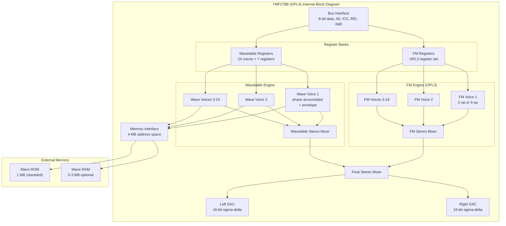

[← Home](../../README.md) · [Sound](../README.md) · [Hardware](README.md)

# MoonSound — OPL4 Wavetable and FM Synthesis for the ZX Spectrum

> **Applies to**: a small number of **Original-track** and **New Gen** expansions. The MoonSound was designed in the Netherlands (2000s) for the MSX community and adapted for the ZX Spectrum by enthusiasts. The original Sinclair/Amstrad line never shipped with it, and it is rare even among clones.

---

## Overview

The MoonSound is the most powerful sound expansion ever built for the ZX Spectrum family. Based on the Yamaha **YMF278B** — also known as **OPL4** — the board provides **24 channels of wavetable synthesis** alongside **18 channels of FM synthesis** (OPL3-compatible, the same engine as the Sound Blaster 16). At full utilization, a MoonSound-equipped Spectrum can produce 42 simultaneous voices with CD-grade instrument samples and FM bell/brass timbres.

This is not in the same league as anything else covered in this section. The AY-3-8912 produces 3 square-wave channels of deliberately lo-fi chiptune. TurboSound triples that. The General Sound plays 4 channels of compressed 8-bit samples at 22 kHz. The MoonSound plays **24 channels of 16-bit PCM at 44.1 kHz** from a built-in wave ROM, and adds an OPL3 FM engine on top.

The MoonSound was developed for the MSX community by **Sunrise** (Netherlands), originally released as the MSX MoonSound expansion around 1998. The ZX Spectrum adaptation is a much smaller project — a handful of enthusiasts adapted the MSX schematic to the ZX bus and wrote software drivers. Real MoonSound hardware on a ZX Spectrum is extremely rare (perhaps 50-100 units worldwide). However, **most modern FPGA ZX reimplementations** include MoonSound emulation, and the format has gained a small but dedicated following among composers who want high-fidelity audio on retro hardware.

> [!IMPORTANT]
> **MoonSound is two sound engines in one chip.** The OPL4 contains a complete OPL3 FM synthesizer (18 channels of 2-op FM, or 6 channels of 4-op FM) and an independent wavetable synthesizer (24 channels of sample playback). The two engines run in parallel, share the same output mixer, and are addressed through separate register banks.

This article covers the OPL4's architecture, the two synthesis engines, port decoding, programming model, and the trade-offs versus other ZX Spectrum sound hardware. For comparison with the simpler TurboSound FM (YM2203 OPN), see [TurboSound FM — YM2203 OPN FM Synthesis](turbosound_fm.md). For the broader sound ecosystem, see [Sound Hardware Ecosystem Overview](sound_overview.md).

### Naming Convention

| Term | Meaning |
|---|---|
| **MoonSound** | The MSX / ZX expansion board that hosts the OPL4 chip |
| **OPL4** | Yamaha's chip designation — "Operator type L, version 4" |
| **YMF278B** | The full manufacturer part number for the OPL4 |
| **Wave table / Wavetable** | The OPL4's sample-based synthesis section — 24 channels |
| **OPL3** | The FM synthesis section — 18 channels of 2-op FM or 6 channels of 4-op FM |
| **Wave ROM** | The 1 MB ROM containing 233 built-in instruments (drums, vocals, strings, etc.) |
| **Wave RAM** | Optional SRAM (typically 256 KB or 512 KB) for loading custom samples |

> [!NOTE]
> **MoonSound is rare on real ZX hardware.** Most MoonSound music runs in emulators (openMSX, ZEsarUX) or FPGA cores (SpectrumNext, MiSTer). Software authors should target the OPL4 register interface as documented in the Yamaha datasheet rather than relying on ZX-specific quirks. The interface is identical across MSX MoonSound and ZX MoonSound.

---

## OPL4 Internal Architecture

The YMF278B is a single chip containing two complete sound engines plus a memory interface for sample data. Yamaha designed it as the high end of the OPL family — a successor to the OPL3 used in the Sound Blaster 16.



### The Two Synthesis Engines

The OPL4 is essentially **a Sound Blaster 16 chip and a Roland Sound Canvas chip combined on one die**:

| Engine | Equivalent Standalone Chip | Channels | Synthesis |
|---|---|---|---|
| **FM (OPL3)** | YMF262 (Sound Blaster 16) | 18 × 2-op or 6 × 4-op | Phase modulation between operators |
| **Wavetable** | (No direct equivalent — closest: YMF721 in some arcade boards) | 24 voices | Sample playback from wave ROM/RAM |

Both engines share the same stereo output mix and the same CPU register interface. Software can use them independently or together.

### Memory Interface

The OPL4 addresses external sample memory through a 21-bit address bus, supporting up to **4 MB** of ROM and RAM combined. The standard MoonSound configuration:

| Region | Address Range | Size | Contents |
|---|---|---|---|
| Wave ROM | `#00000`–`#FFFFF` | 1 MB | Built-in 233 instruments (GM-compatible) |
| Wave RAM | `#100000`–`#17FFFF` | 512 KB (max) | Custom samples loaded at runtime |

The Wave ROM contains the **Yamaha 4 MB GM/GS-compatible instrument bank**, compressed to 1 MB using Yamaha's proprietary ADPCM format. The full instrument list includes:

- 128 melodic instruments (GM standard)
- 47 percussion sounds
- 58 sound effects and vocal samples

### Clock and Output

The OPL4 runs from a **33.8688 MHz** master clock (derived from a separate crystal on the MoonSound board, not the ZX clock). This is divided internally to:

| Subsystem | Internal Rate | Notes |
|---|---|---|
| FM engine | ~50 kHz | Phase update rate |
| Wavetable sample rate | Up to 44.1 kHz | Per-voice programmable |
| DAC output | 44.1 kHz fixed | Stereo, 16-bit |

The 33.8688 MHz crystal is the same rate used by CD audio components — choosing this clock lets MoonSound play samples at the standard CD rate without resampling.

### Electrical Interface

The OPL4 uses a similar bus interface to the YM2203:

| Pin Group | Function |
|---|---|
| `D0..D7` | 8-bit bidirectional data bus |
| `A0` | Address bit — selects register bank (FM index vs FM data vs wave index vs wave data) |
| `/CS` | Chip select |
| `/RD`, `/WR` | Read/write strobes |
| `M0..M2` | Memory access type (ROM/RAM/IO) |
| `MA0..MA20` | 21-bit memory address bus for sample ROM/RAM |
| `MD0..MD7` | 8-bit memory data bus |
| `MO`, `RO/LO` | Stereo audio output (PWM, externally low-pass filtered) |

Package: 80-pin QFP (much larger than the YM2203's 40-pin DIP).

---

## Port Decoding and Register Interface

The OPL4 occupies **four port addresses** on the ZX bus — two for the FM side and two for the wavetable side. This matches the Yamaha convention used in MSX and IBM PCs.

### Port Map

| Port | Function | Direction |
|---|---|---|
| `#C2` | **FM register index** — write register number (`#00`..`#F5`) | W |
| `#C3` | **FM register data** — read or write the value at the selected register | R/W |
| `#7E` | **Wave register index** — write register number (`#00`..`#F7`) | W |
| `#F4` (or `#F6` on some boards) | **Wave register data** — write the value at the selected register | W |

> [!WARNING]
> **MoonSound port decoding is partial.** The MSX MoonSound standard places FM at `#C2`/`#C3` and wavetable at `#7E`/`#F4`. ZX-adapted MoonSound boards may use slightly different addresses — check the specific board's documentation. Emulators typically accept the MSX standard addresses plus several ZX-clone variants.

### FM Register Map (OPL3 subset)

The OPL3 register set is large (256 registers, accessed via port `#C2` index). The most important registers for music:

| Register | Purpose | Notes |
|---|---|---|
| `#01` (`TEST`) | LSB = enable OPL3 mode | Writing `#01` here unlocks OPL3 extensions (4-op mode, 4 waveforms) |
| `#08` (`CMS` / `NOTE-SEL`) | Compatibility mode | Set to `#00` for OPL3 mode |
| `#20`–`#35` | Operator 1 (modulator) settings per channel | DT1/MULT/AR/etc. per operator |
| `#40`–`#5F` | Operator 1 total level / scaling | TL, KS |
| `#60`–`#7F` | Operator 1 decay/sustain rates | DR/RR |
| `#80`–`#9F` | Operator 1 release rate / waveform | RR/SL |
| `#A0`–`#A8` | Channel frequency low byte | Per channel |
| `#B0`–`#B8` | Channel key-on, octave, frequency high | Bit 5 = key-on |
| `#BD` | Deep vibrato/tremolo, bass drum | Compatibility-only in OPL3 |
| `#C0`–`#C8` | Feedback / algorithm / pan per channel | OPL3 mode adds stereo pan |
| `#E0`–`#F5` | Operator 1 waveform select | OPL3 only — 4 waveforms available |

### Wavetable Register Map (24 voices)

The wavetable registers are organized **per voice**. Each voice has 7 contiguous registers. The voice number selects the base register:

```
Voice N base register = N × 8
  +0: tone number low byte (instrument ID 0..65535)
  +1: tone number high byte
  +2: volume (0..127) + pseudo reverb bit
  +3: reserved (must be 0)
  +4: key fraction (low 8 bits of frequency)
  +5: key oct / octave (bits 4..0) + key fraction high (bits 7..6)
  +6: LFO reset + damping + pan + bit 0 = key-on
```

So voice 0 occupies registers `#00`–`#06`, voice 1 occupies `#08`–`#0E`, and so on up to voice 23 at `#B8`–`#BE`. The base register select is done by writing the register number to port `#7E`.

```z80
; -------------------------------------------------------
; Write to a wavetable register.
; Entry: D = register number (#00..#F7)
;        E = value
; Destroys: A, B, C
; -------------------------------------------------------
MOONSOUND_WAVE_WRITE:
    LD   BC,#7E           ; wavetable register index port
    LD   A,D
    OUT  (C),A            ; select register
    LD   B,#F4            ; BC = #F4 (wavetable data port)
    LD   A,E
    OUT  (C),A            ; write value
    RET
```

### Read Behavior

The FM side supports reading the status register at port `#C2` (read mode) — same as the YM2203, returns timer and busy bits. The wavetable side is **write-only** — reads return floating bus values. Software must track wavetable state internally.

### Reset and Initialization

On reset, the OPL4 powers up in OPL2 compatibility mode (only 2-op FM, no wavetable). Software must:

1. Write `#01` to FM register `#01` (TEST) to enable OPL3 mode.
2. Write `#20` to FM register `#04` (NEW) to enable OPL4 extensions including the wavetable section.
3. Initialize all 24 wavetable voices to silence (set volume register to 0).
4. Initialize FM channels (algorithm, multipliers, envelopes) for any voice to be used.

After initialization, individual voices can be triggered by writing frequency + key-on registers.

---

## Programming Model

The OPL4 has two completely separate programming interfaces — one for FM, one for wavetable — sharing only the chip's bus interface. Code that plays both engines in parallel maintains two independent register shadows and writes them through the two port pairs.

The full OPL4 programming model is too large to fit in one section comfortably. It splits naturally into three concerns:

1. **Bus access** — how to read and write each register bank (this section).
2. **Wavetable voice trigger** — the simplest path to audible output (next section).
3. **FM voice setup** — algorithm, operators, envelope, frequency (subsequent sections).

### Bus Access Primitives

Both register banks use the classic AY-style two-port pattern: one port selects the register, the other reads or writes its value. The two banks live on separate port pairs and never collide.

```z80
; -------------------------------------------------------
; Write to an OPL3 FM register.
; Entry: D = register (#00..#F5)
;        E = value
; Destroys: A, B, C
; -------------------------------------------------------
MOONSOUND_WRITE_FM:
    LD   BC,#C2           ; FM register index port
    LD   A,D
    OUT  (C),A            ; select register
    LD   B,#C3            ; BC = #C3 (FM data port)
    LD   A,E
    OUT  (C),A            ; write data
    RET
```

The wavetable side uses the same pattern on different ports. The routine is byte-identical to the `MOONSOUND_WAVE_WRITE` routine shown earlier in [Port Decoding and Register Interface](#); the only reason it lives separately is that the port pair differs (`#7E` / `#F4` instead of `#C2` / `#C3`).

> [!WARNING]
> **Writes to the OPL4 must be paced.** The chip needs a short delay between the register-select write and the data write — typically ~1.6 µs (≈6 T-states at 3.5 MHz). Most Z80 code naturally satisfies this because the `LD` instructions between the two `OUT`s consume enough cycles, but tight register-blasting loops must insert a few `NOP`s or interleave other work to avoid missed writes.
