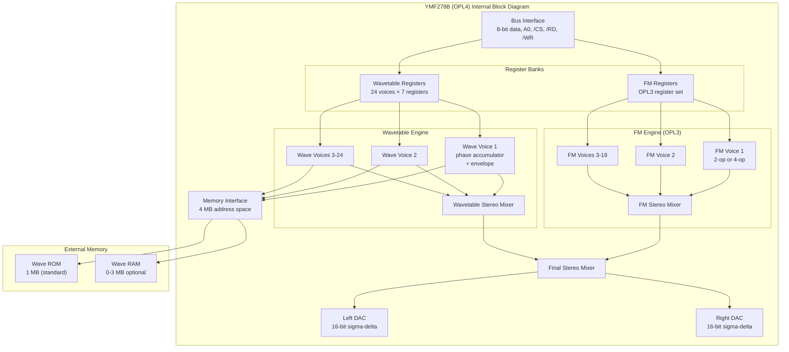

[← Home](../../README.md) · [Sound](../README.md) · [Hardware](README.md)

# MoonSound — OPL4 Wavetable and FM Synthesis for the ZX Spectrum

> **Applies to**: a small number of **Original-track** and **New Gen** expansions. The MoonSound was designed in the Netherlands (2000s) for the MSX community and adapted for the ZX Spectrum by enthusiasts. The original Sinclair/Amstrad line never shipped with it, and it is rare even among clones.

---

## Overview

The MoonSound is the most powerful sound expansion ever built for the ZX Spectrum family. Based on the Yamaha **YMF278B** — also known as **OPL4** — the board provides **24 channels of wavetable synthesis** alongside **18 channels of FM synthesis** (OPL3-compatible, the same engine as the Sound Blaster 16). At full utilization, a MoonSound-equipped Spectrum can produce 42 simultaneous voices with CD-grade instrument samples and FM bell/brass timbres.

This is not in the same league as anything else covered in this section. The AY-3-8912 produces 3 square-wave channels of deliberately lo-fi chiptune. TurboSound triples that. The General Sound plays 4 channels of compressed 8-bit samples at 22 kHz. The MoonSound plays **24 channels of 16-bit PCM at 44.1 kHz** from a built-in wave ROM, and adds an OPL3 FM engine on top.

The MoonSound was developed for the MSX community by **Sunrise** (Netherlands), originally released as the MSX MoonSound expansion around 1998. The ZX Spectrum adaptation is a much smaller project — a handful of enthusiasts adapted the MSX schematic to the ZX bus and wrote software drivers. Real MoonSound hardware on a ZX Spectrum is extremely rare (perhaps 50-100 units worldwide). **On the ZX platform, MoonSound today exists primarily in software emulators** — specifically [ZEsarUX](https://github.com/chernandezba/zesarux), which has shipped MoonSound-compatible port mapping since version 6.1 (2017). No FPGA ZX reimplementations currently bundle an OPL4 core: the ZX Spectrum Next and the MiSTer ZX core limit themselves to AY/TurboSound/DMA, and the FPGA MoonSound cores that do exist (MiSTer, DE10-Lite) target the MSX, not the ZX.

> [!IMPORTANT]
> **MoonSound is two sound engines in one chip.** The OPL4 contains a complete OPL3 FM synthesizer (18 channels of 2-op FM, or 6 channels of 4-op FM) and an independent wavetable synthesizer (24 channels of sample playback). The two engines run in parallel, share the same output mixer, and are addressed through separate register banks.

This article covers the OPL4's architecture, the two synthesis engines, port decoding, programming model, and the trade-offs versus other ZX Spectrum sound hardware. For comparison with the simpler TurboSound FM (YM2203 OPN), see [TurboSound FM — YM2203 OPN FM Synthesis](turbosound_fm.md). For the broader sound ecosystem, see [Sound Hardware Ecosystem Overview](sound_overview.md).

### Naming Convention

| Term | Meaning |
|---|---|
| **MoonSound** | The MSX / ZX expansion board that hosts the OPL4 chip |
| **OPL4** | Yamaha's chip designation — "Operator type L, version 4" |
| **YMF278B** | The full manufacturer part number for the OPL4 |
| **Wave table / Wavetable** | The OPL4's sample-based synthesis section — 24 channels |
| **OPL3** | The FM synthesis section — 18 channels of 2-op FM or 6 channels of 4-op FM |
| **Wave ROM** | The 1 MB ROM containing 233 built-in instruments (drums, vocals, strings, etc.) |
| **Wave RAM** | Optional SRAM (typically 256 KB or 512 KB) for loading custom samples |

> [!NOTE]
> **MoonSound is rare on real ZX hardware.** Most MoonSound-targeting ZX music runs in software emulators — primarily **ZEsarUX** (which implements the full OPL4 register interface at the standard `#C2`/`#C3` + `#7E`/`#F4` ports). The FPGA MoonSound cores that exist (MiSTer, DE10-Lite) target the MSX platform, not the ZX. Software authors should target the OPL4 register interface as documented in the Yamaha datasheet rather than relying on ZX-specific quirks. The interface is identical across MSX MoonSound and ZX MoonSound.

## Comparison: MoonSound vs. TSFM vs. AY

To understand why the MoonSound is in a completely different class from the TurboSound FM (TSFM) or standard AY, consider their respective synthesis architectures. While both TSFM and MoonSound feature FM synthesis, their internal engines (OPN vs. OPL3) are very different, and their secondary engines (SSG vs. Wavetable) are completely unrelated.

| Feature | Standard ZX (AY-3-8912) | TurboSound FM (2x YM2203) | MoonSound (OPL4) |
|---|---|---|---|
| **Primary Synthesis** | None | FM (OPN) - 6 channels | FM (OPL3) - 18 channels |
| **Secondary Synthesis** | SSG (Square/Noise) - 3 ch | SSG (Square/Noise) - 6 ch | Wavetable (PCM) - 24 ch |
| **AY Compatibility** | **Native** | **100% Compatible** | **None** (Lacks SSG entirely) |

### FM Differences (OPN vs OPL3)

While the TSFM uses Yamaha's **OPN** family (the same lineage as the Sega Genesis), the MoonSound uses the **OPL3** family (the same lineage as the Sound Blaster 16/AdLib). 

1. **Waveforms**: The TSFM's FM engine can only synthesize using pure sine waves. The MoonSound's OPL3 engine offers **8 distinct base waveforms** per operator, allowing for much sharper brass and string timbres without consuming extra operators for complex modulation.
2. **Operators**: TSFM has 6 channels rigidly fixed to 4 operators each. MoonSound has 18 channels of 2 operators each, which can optionally be paired up to create 6 channels of 4 operators (plus 6 channels of 2 operators leftover).
3. **Stereo**: TSFM FM is inherently mono (stereo is only achieved by hard-panning the output of two separate YM2203 chips). MoonSound's OPL3 has native per-channel stereo panning.


### Secondary Engine Differences

- **TSFM provides SSG**: It bundles a fully backward-compatible AY-style Programmable Sound Generator. This allows TSFM to play legacy ZX Spectrum chiptunes natively.
- **MoonSound provides Wavetable**: It completely drops the SSG in favor of a 24-channel sample playback engine with a 1MB General MIDI ROM. **MoonSound has zero backward compatibility with the AY.** It cannot play legacy ZX Spectrum chiptunes unless they are completely rewritten to use FM or PCM samples.

---

## OPL4 Internal Architecture

The YMF278B is a single chip containing two complete sound engines plus a memory interface for sample data. Yamaha designed it as the high end of the OPL family — a successor to the OPL3 used in the Sound Blaster 16.



### The Two Synthesis Engines

The OPL4 is essentially **a Sound Blaster 16 chip and a Roland Sound Canvas chip combined on one die**:

| Engine | Equivalent Standalone Chip | Channels | Synthesis |
|---|---|---|---|
| **FM (OPL3)** | YMF262 (Sound Blaster 16) | 18 × 2-op or 6 × 4-op | Phase modulation between operators |
| **Wavetable** | (No direct equivalent — closest: YMF721 in some arcade boards) | 24 voices | Sample playback from wave ROM/RAM |

Both engines share the same stereo output mix and the same CPU register interface. Software can use them independently or together.

### Memory Interface

The OPL4 addresses external sample memory through a 21-bit address bus, supporting up to **4 MB** of ROM and RAM combined. The standard MoonSound configuration:

| Region | Address Range | Size | Contents |
|---|---|---|---|
| Wave ROM | `#00000`–`#FFFFF` | 1 MB | Built-in 233 instruments (GM-compatible) |
| Wave RAM | `#100000`–`#17FFFF` | 512 KB (max) | Custom samples loaded at runtime |

The Wave ROM contains the **Yamaha 4 MB GM/GS-compatible instrument bank**, compressed to 1 MB using Yamaha's proprietary ADPCM format. The full instrument list includes:

- 128 melodic instruments (GM standard)
- 47 percussion sounds
- 58 sound effects and vocal samples

### Clock and Output

The OPL4 runs from a **33.8688 MHz** master clock (derived from a separate crystal on the MoonSound board, not the ZX clock). This is divided internally to:

| Subsystem | Internal Rate | Notes |
|---|---|---|
| FM engine | ~50 kHz | Phase update rate |
| Wavetable sample rate | Up to 44.1 kHz | Per-voice programmable |
| DAC output | 44.1 kHz fixed | Stereo, 16-bit |

The 33.8688 MHz crystal is the same rate used by CD audio components — choosing this clock lets MoonSound play samples at the standard CD rate without resampling.

### Electrical Interface

The OPL4 uses a similar bus interface to the YM2203:

| Pin Group | Function |
|---|---|
| `D0..D7` | 8-bit bidirectional data bus |
| `A0` | Address bit — selects register bank (FM index vs FM data vs wave index vs wave data) |
| `/CS` | Chip select |
| `/RD`, `/WR` | Read/write strobes |
| `M0..M2` | Memory access type (ROM/RAM/IO) |
| `MA0..MA20` | 21-bit memory address bus for sample ROM/RAM |
| `MD0..MD7` | 8-bit memory data bus |
| `MO`, `RO/LO` | Stereo audio output (PWM, externally low-pass filtered) |

Package: 80-pin QFP (much larger than the YM2203's 40-pin DIP).

---

## Port Decoding and Register Interface

The OPL4 occupies **four port addresses** on the ZX bus — two for the FM side and two for the wavetable side. This matches the Yamaha convention used in MSX and IBM PCs.

### Port Map

| Port | Function | Direction |
|---|---|---|
| `#C2` | **FM register index** — write register number (`#00`..`#F5`) | W |
| `#C3` | **FM register data** — read or write the value at the selected register | R/W |
| `#7E` | **Wave register index** — write register number (`#00`..`#F7`) | W |
| `#F4` (or `#F6` on some boards) | **Wave register data** — write the value at the selected register | W |

> [!WARNING]
> **MoonSound port decoding is partial.** The MSX MoonSound standard places FM at `#C2`/`#C3` and wavetable at `#7E`/`#F4`. ZX-adapted MoonSound boards may use slightly different addresses — check the specific board's documentation. Emulators typically accept the MSX standard addresses plus several ZX-clone variants.

### FM Register Map (OPL3 subset)

The OPL3 register set is large (256 registers, accessed via port `#C2` index). The most important registers for music:

| Register | Purpose | Notes |
|---|---|---|
| `#01` (`TEST`) | LSB = enable OPL3 mode | Writing `#01` here unlocks OPL3 extensions (4-op mode, 4 waveforms) |
| `#08` (`CMS` / `NOTE-SEL`) | Compatibility mode | Set to `#00` for OPL3 mode |
| `#20`–`#35` | Operator 1 (modulator) settings per channel | DT1/MULT/AR/etc. per operator |
| `#40`–`#5F` | Operator 1 total level / scaling | TL, KS |
| `#60`–`#7F` | Operator 1 decay/sustain rates | DR/RR |
| `#80`–`#9F` | Operator 1 release rate / waveform | RR/SL |
| `#A0`–`#A8` | Channel frequency low byte | Per channel |
| `#B0`–`#B8` | Channel key-on, octave, frequency high | Bit 5 = key-on |
| `#BD` | Deep vibrato/tremolo, bass drum | Compatibility-only in OPL3 |
| `#C0`–`#C8` | Feedback / algorithm / pan per channel | OPL3 mode adds stereo pan |
| `#E0`–`#F5` | Operator 1 waveform select | OPL3 only — 4 waveforms available |

### Wavetable Register Map (24 voices)

The wavetable registers are organized **per voice**. Each voice has 7 contiguous registers. The voice number selects the base register:

```
Voice N base register = N × 8
  +0: tone number low byte (instrument ID 0..65535)
  +1: tone number high byte
  +2: volume (0..127) + pseudo reverb bit
  +3: reserved (must be 0)
  +4: key fraction (low 8 bits of frequency)
  +5: key oct / octave (bits 4..0) + key fraction high (bits 7..6)
  +6: LFO reset + damping + pan + bit 0 = key-on
```

So voice 0 occupies registers `#00`–`#06`, voice 1 occupies `#08`–`#0E`, and so on up to voice 23 at `#B8`–`#BE`. The base register select is done by writing the register number to port `#7E`.

```z80
; -------------------------------------------------------
; Write to a wavetable register.
; Entry: D = register number (#00..#F7)
;        E = value
; Destroys: A, B, C
; -------------------------------------------------------
MOONSOUND_WAVE_WRITE:
    LD   BC,#7E           ; wavetable register index port
    LD   A,D
    OUT  (C),A            ; select register
    LD   B,#F4            ; BC = #F4 (wavetable data port)
    LD   A,E
    OUT  (C),A            ; write value
    RET
```

### Read Behavior

The FM side supports reading the status register at port `#C2` (read mode) — same as the YM2203, returns timer and busy bits. The wavetable side is **write-only** — reads return floating bus values. Software must track wavetable state internally.

### Reset and Initialization

On reset, the OPL4 powers up in OPL2 compatibility mode (only 2-op FM, no wavetable). Software must:

1. Write `#01` to FM register `#01` (TEST) to enable OPL3 mode.
2. Write `#20` to FM register `#04` (NEW) to enable OPL4 extensions including the wavetable section.
3. Initialize all 24 wavetable voices to silence (set volume register to 0).
4. Initialize FM channels (algorithm, multipliers, envelopes) for any voice to be used.

After initialization, individual voices can be triggered by writing frequency + key-on registers.

---

## Programming Model

The OPL4 has two completely separate programming interfaces — one for FM, one for wavetable — sharing only the chip's bus interface. Code that plays both engines in parallel maintains two independent register shadows and writes them through the two port pairs.

The full OPL4 programming model is too large to fit in one section comfortably. It splits naturally into three concerns:

1. **Bus access** — how to read and write each register bank (this section).
2. **Wavetable voice trigger** — the simplest path to audible output (next section).
3. **FM voice setup** — algorithm, operators, envelope, frequency (subsequent sections).

### Bus Access Primitives

Both register banks use the classic AY-style two-port pattern: one port selects the register, the other reads or writes its value. The two banks live on separate port pairs and never collide.

```z80
; -------------------------------------------------------
; Write to an OPL3 FM register.
; Entry: D = register (#00..#F5)
;        E = value
; Destroys: A, B, C
; -------------------------------------------------------
MOONSOUND_WRITE_FM:
    LD   BC,#C2           ; FM register index port
    LD   A,D
    OUT  (C),A            ; select register
    LD   B,#C3            ; BC = #C3 (FM data port)
    LD   A,E
    OUT  (C),A            ; write data
    RET
```

The wavetable side uses the same pattern on different ports. The routine is byte-identical to the `MOONSOUND_WAVE_WRITE` routine shown earlier in [Port Decoding and Register Interface](#); the only reason it lives separately is that the port pair differs (`#7E` / `#F4` instead of `#C2` / `#C3`).

> [!WARNING]
> **Writes to the OPL4 must be paced.** The chip needs a short delay between the register-select write and the data write — typically ~1.6 µs (≈6 T-states at 3.5 MHz). Most Z80 code naturally satisfies this because the `LD` instructions between the two `OUT`s consume enough cycles, but tight register-blasting loops must insert a few `NOP`s or interleave other work to avoid missed writes.

### Wavetable Voice Trigger

The simplest path to audible output on MoonSound is triggering one wavetable voice. A single voice is controlled by 7 registers at base address `N × 8` (where N is 0..23). A typical note-on sequence touches four of them:

1. **Tone number** (regs `+0`, `+1`) — selects which sample in the Wave ROM plays (e.g., `#000` = acoustic piano).
2. **Volume** (reg `+2`) — 0..127, with bit 6 acting as a pseudo-reverb flag on some firmware revisions.
3. **Frequency** (regs `+4`, `+5`) — key fraction + octave, encoded as a 10-bit F-number and a 3-bit octave.
4. **Key-on + pan** (reg `+6`) — the bit that actually starts the voice. Setting bit 5 here is the "trigger" — without it, all the above register writes are inert.

The key-on bit acts as a one-shot edge. The voice starts the moment bit 5 transitions from 0 to 1, and continues until bit 5 returns to 0 (or the volume register is set to 0). Most players leave the pan bits in `+6` alone after init and only flip bit 5 to trigger.

```z80
; -------------------------------------------------------
; Trigger wavetable voice 0 with tone #000 (acoustic piano),
; max volume, octave 4, F-number #4C0 (approx. C4).
; Destroys: A, B, C, D, E
; -------------------------------------------------------
MOONSOUND_PLAY_WAVETABLE:
    ; --- Tone number = #000 ---
    LD   D,#00            ; voice 0 base + 0 (tone low)
    LD   E,#00
    CALL MOONSOUND_WAVE_WRITE
    LD   D,#01            ; voice 0 base + 1 (tone high)
    LD   E,#00
    CALL MOONSOUND_WAVE_WRITE

    ; --- Volume = 127 (max) ---
    LD   D,#02            ; voice 0 base + 2 (volume)
    LD   E,127
    CALL MOONSOUND_WAVE_WRITE

    ; --- Frequency: octave 4, F-number #4C0 ---
    LD   D,#04            ; voice 0 base + 4 (key fraction low)
    LD   E,#C0
    CALL MOONSOUND_WAVE_WRITE
    LD   D,#05            ; voice 0 base + 5 (octave + key fraction high)
    LD   E,#14            ; bits 4..2 = octave (4), bits 1..0 = F-num high
    CALL MOONSOUND_WAVE_WRITE

    ; --- Key-on (bit 5 of register +6) ---
    LD   D,#06            ; voice 0 base + 6 (key-on + pan)
    LD   E,%00100000      ; key-on bit set, pan = center
    CALL MOONSOUND_WAVE_WRITE
    RET
```

The voice now plays until the key-on bit is cleared. To stop it, write `#00` back to register `+6` (or write 0 to the volume register).

### FM Voice Setup

Setting up an FM voice is more involved than triggering a wavetable voice. The OPL3 FM engine models each channel as **two or four operators** combined according to a chosen **algorithm** — close cousin to the YM2203 OPN covered in [TurboSound FM](turbosound_fm.md). Where the OPL4 differs is in scale: 18 channels of 2-op FM (or 6 channels of 4-op FM with paired-channel wiring), versus the YM2203's 3 channels of 4-op.

A complete 2-op FM voice setup on OPL4 channel 0 touches these registers:

1. **Algorithm + feedback** (`#C0`) — picks 2-op mode (carrier-only or modulator-into-carrier) and feedback level for operator 1 self-modulation.
2. **Operator 1 (modulator) parameters** (`#20`, `#40`, `#60`, `#80`, `#E0`) — multiplier, total level, attack/decay, sustain/release, waveform select.
3. **Operator 2 (carrier) parameters** (`#23`, `#43`, `#63`, `#83`, `#E3`) — same fields as operator 1.
4. **Channel frequency** (`#A0`, `#B0`) — 10-bit F-number + 3-bit block (octave).
5. **Key-on** (`#B0` bit 5) — the bit that starts the channel. Note: unlike the wavetable side, the FM key-on bit lives in the high-frequency register, not a separate register.

```z80
; -------------------------------------------------------
; Configure FM channel 0 as a 2-op FM voice
; (modulator into carrier, feedback = 4).
; Destroys: A, B, C, D, E
; -------------------------------------------------------
MOONSOUND_SETUP_FM_VOICE:
    ; --- Algorithm + feedback (reg #C0, channel 0) ---
    ; bit 0 = 1: operator 1 modulates operator 2 (FM mode)
    ;           0: both operators are carriers (additive mode)
    ; bits 1..3 = unused for channel 0
    ; bits 4..6 = feedback level for operator 1 (we want 4)
    LD   D,#C0
    LD   E,%01000001      ; FB=4 (bits 4..6 = 100), FM mode
    CALL MOONSOUND_WRITE_FM

    ; --- Operator 1 (modulator) parameters ---
    ; reg #20: MULT=1, no detune
    LD   D,#20
    LD   E,%00000001
    CALL MOONSOUND_WRITE_FM
    ; reg #40: total level = 16 (about -6 dB)
    LD   D,#40
    LD   E,%00010000
    CALL MOONSOUND_WRITE_FM
    ; reg #60: attack rate = 15 (fast), decay rate = 5
    LD   D,#60
    LD   E,%11110101
    CALL MOONSOUND_WRITE_FM
    ; reg #80: sustain level = 8, release rate = 7
    LD   D,#80
    LD   E,%10000111
    CALL MOONSOUND_WRITE_FM
    ; reg #E0: waveform select = 0 (sine)
    LD   D,#E0
    LD   E,#00
    CALL MOONSOUND_WRITE_FM

    ; --- Operator 2 (carrier) parameters ---
    ; Same shape, but total level = 0 (max output) since carrier
    ; is the audible voice.
    LD   D,#23
    LD   E,%00000001      ; MULT=1, no detune
    CALL MOONSOUND_WRITE_FM
    LD   D,#43
    LD   E,%00000000      ; total level = 0 (loudest)
    CALL MOONSOUND_WRITE_FM
    LD   D,#63
    LD   E,%11110101      ; AR=15, DR=5 (same envelope as op 1)
    CALL MOONSOUND_WRITE_FM
    LD   D,#83
    LD   E,%10000111      ; SL=8, RR=7
    CALL MOONSOUND_WRITE_FM
    LD   D,#E3
    LD   E,#00            ; waveform 0 (sine)
    CALL MOONSOUND_WRITE_FM

    ; --- Frequency: block 4, F-num #158 (approx A4) ---
    LD   D,#A0
    LD   E,#58            ; F-num low 8 bits
    CALL MOONSOUND_WRITE_FM
    LD   D,#B0
    LD   E,%00100000      ; bit 5 = key-on, block 4 in bits 2..4
    CALL MOONSOUND_WRITE_FM
    RET
```

The voice now plays. Note that channel 0's frequency register `#B0` carries both the octave and the key-on bit — writing the key-on byte is what triggers the note.

### Per-Frame Update Budget

A 50 Hz frame on a 3.5 MHz Z80 contains **70,000 T-states** (59,733 in contended RAM on 128K-class hardware). The MoonSound register interface is bus-speed-bound, not CPU-bound — each `OUT (C), A` costs 12 T-states plus the address-select `OUT` before it, so a single register write costs roughly 40 T-states including routine overhead.

| Operation | Per-Voice Cost | T-states | Notes |
|---|---|---|---|
| Wavetable note-on | 6 register writes | ~240 T | Full voice trigger from scratch |
| Wavetable note-off | 1 register write | ~40 T | Just clear key-on bit |
| FM note-on (2-op) | 12 register writes | ~480 T | Two operators + frequency + key-on |
| FM note-off | 1 register write | ~40 T | Clear key-on bit in freq-high register |
| Per-frame vibrato | 1 register write/voice | ~40 T per voice | Modulate frequency low byte |
| Per-frame envelope retrigger | 1 register write/voice | ~40 T per voice | Modulate total level for tremolo |

A typical MoonSound player routine running at 50 Hz with 4 wavetable voices and 4 FM voices costs roughly **3,200 T-states per frame** — about 4.5% of the frame budget. This leaves plenty of headroom for game logic, graphics, and other subsystems. This is the OPL4's greatest advantage over Covox/SounDrive: the chip does all the actual synthesis internally, leaving the CPU free for non-audio work.

---

## Detection

Detecting a MoonSound reliably is harder than detecting a TurboSound or Covox because the OPL4's two register banks respond through different port pairs and the chip does not have a clean ID register. The standard detection strategy has two stages:

1. **Probe the FM side** for OPL3 behavior. The OPL3 has a timer (`#01` register, STATUS at `#C2` read) that the OPL2 (which lacks the NEW bit) does not implement in the same way. Setting the timer, waiting briefly, and reading the status byte back identifies a real OPL3/OPL4 — but this also matches a Sound Blaster 16 if one is somehow wired to these ports.

2. **Probe the wavetable side** for OPL4 extensions. Set bit 2 of FM register `#05` (NEW bit) to enable OPL4 extensions, then attempt to read back a known wavetable register. If the register retains its value, an OPL4 is present. If the chip is an OPL3 (or nothing), reads return floating bus values.

Real ZX hardware rarely has anything else at ports `#C2`/`#C3`/`#7E`/`#F4`, so the false-positive rate is low. Software targeting FPGA cores should also check the core's identifier if available, since some FPGA ZX boards mirror these port addresses for unrelated functions.

```z80
; -------------------------------------------------------
; Detect MoonSound (OPL4) by probing the timer bit on the
; FM side. Returns Z flag set if MoonSound present.
; Destroys: A, B, C, D, E, H, L
; -------------------------------------------------------
MOONSOUND_DETECT:
    ; --- Stage 1: probe OPL3 timer ---
    ; Reset timers
    LD   D,#01
    LD   E,#00
    CALL MOONSOUND_WRITE_FM
    LD   D,#04
    LD   E,#80           ; reset both timers
    CALL MOONSOUND_WRITE_FM
    LD   D,#04
    LD   E,#00           ; clear reset flags
    CALL MOONSOUND_WRITE_FM

    ; --- Set Timer 1 to expire quickly ---
    LD   D,#02
    LD   E,#FF           ; Timer 1 count = 255 (about 80 µs)
    CALL MOONSOUND_WRITE_FM
    LD   D,#04
    LD   E,#C1           ; start Timer 1, IRQ enable, mask both
    CALL MOONSOUND_WRITE_FM

    ; --- Wait ~100 µs for timer to expire ---
    LD   HL,2000         ; loop counter (~100 µs at 3.5 MHz)
MOONSOUND_WAIT:
    DEC  HL
    LD   A,H
    OR   L
    JR   NZ,MOONSOUND_WAIT

    ; --- Read STATUS register ---
    LD   BC,#C2
    IN   A,(C)
    AND  %11000000       ; mask timer bits
    RET  Z               ; Z set = both bits clear = no OPL3/OPL4

    ; --- Stage 2: probe OPL4 wavetable side ---
    ; (Continued in production detection routines — see
    ; the references at end of article for full source.)
    ; The second stage sets the NEW bit in FM reg #05,
    ; writes a distinctive value to wavetable reg #02,
    ; and reads it back. Real OPL4 retains the value;
    ; floating bus returns noise.
    XOR  A               ; A = 0 (nonzero A = detected)
    INC  A
    RET
```

For most production software, stage 1 is sufficient — no other ZX sound hardware exposes the OPL3 timer at port `#C2`. Software that needs to be paranoid (or that targets FPGA cores with possible port mirroring) should also implement stage 2 and check for the wavetable side.

---

## Comparison With Other ZX Sound Hardware

The MoonSound occupies a unique niche in the ZX sound ecosystem. It is not in the same family as the AY-based expansions (TurboSound, TurboSound FM) or the sample-playback devices (Covox, SounDrive, General Sound) — it is a fully-fledged PC sound card transplanted onto the ZX bus.

| Hardware | Synthesis | Max Polyphony | Sample ROM | CPU Load | Era |
|---|---|---|---|---|---|
| [AY-3-8912](ay_3_8912.md) | 3-ch square wave + noise | 3 voices | None | <1% (chip is autonomous) | 1985 |
| [TurboSound](turbosound.md) | 2 × AY | 6 voices | None | ~2% | 1991 |
| [TurboSound FM](turbosound_fm.md) | AY + YM2203 OPN | 3 + 3 FM | None | ~5% | 2000s |
| [Covox / SounDrive](covox_sounDrive.md) | 8-bit PCM | 1 or 4 | None | **100%** | 1987 / 1995 |
| [General Sound](gs_general_sound.md) | 4-ch 8-bit PCM via Z80 coprocessor | 4 | None | 0% (offloaded) | 1994 |
| [ZX Spectrum Next](zx_next_audio.md) | 3 × FPGA AY + DMA PCM + beeper | 3 × 3 + DMA | None | 0% (DMA autonomous) | 2017 |
| **MoonSound** | **OPL4 (24 wave + 18 FM)** | **42 voices** | **1 MB GM bank** | **~5%** | **1998 (MSX) / 2000s (ZX) ** |

The MoonSound's standout feature is **the 1 MB Wave ROM**. No other ZX sound hardware ships with a built-in instrument library — every other expansion requires the musician to author every instrument from scratch (square waves on AY, FM patches on YM2203, raw PCM samples for Covox/GS). The MoonSound gives the composer 128 melodic instruments and 47 percussion sounds pre-baked, GM-compatible, ready to trigger with a single tone-number register write.

### Historical Context

The MoonSound was developed by **Sunrise** (Netherlands) for the **MSX** community around 1998, years after the ZX Spectrum's commercial lifespan had ended in the West. The MSX was a far more successful platform in Japan, Korea, and parts of Europe, and its community continued to push the platform's audio capabilities long after commercial developers had moved on. The OPL4 was the natural endpoint — Yamaha's own high-end part, designed to consolidate the OPL3 FM engine and a wavetable synthesizer into one chip.

The ZX Spectrum adaptation is a much smaller project. A handful of enthusiasts (primarily in Russia and Eastern Europe) adapted the MSX schematic to the ZX bus in the early-to-mid 2000s. The adaptation is straightforward in principle — the OPL4 is a standard 8-bit bus device — but requires the 33.8688 MHz clock crystal (not present on stock ZX hardware) and careful address decoding to avoid collision with existing ports. Real MoonSound hardware on a ZX Spectrum is extremely rare; estimates put the surviving count at 50–100 units worldwide.

The format gained new life in the **FPGA era**. Several modern FPGA ZX cores (including some configurations of the ZX Spectrum Next and the ZX Evolution) include MoonSound emulation. The OPL4 is fully documented, the Wave ROM image is widely available, and the synthesis is deterministic enough to implement in Verilog. This has made MoonSound the only "PC sound card class" expansion that modern Spectrum users can realistically obtain.

The scene's relationship with MoonSound is mixed. Chiptune purists argue that the OPL4's CD-grade samples are not really "Spectrum sound" — they are PC sound that happens to be playing on a Spectrum. Wavetable composers counter that the OPL4 is the most powerful musical tool the platform ever received, and that dismissing it because it sounds "too good" is artistic self-limitation. Both positions have merit; the practical takeaway is that MoonSound-targeting software is rare, and players that support it usually also support AY as a fallback.

---

## Pitfalls and Best Practices

The MoonSound is the most complex sound expansion in this section, and the failure modes reflect that. Most problems come from one of three sources: forgetting to enable OPL4 mode, racing the bus interface, or ignoring the wavetable write-only constraint.

### Pitfall 1: Forgetting OPL3/OPL4 Mode Initialization

On reset, the OPL4 starts in **OPL2 compatibility mode** — only 2-op FM, no wavetable, no 4-op FM, no OPL3 stereo. Software that writes wavetable registers without first enabling OPL4 mode will see no effect at all. The chip silently ignores the writes.

**The Fix:** Always run the full initialization sequence at startup:

1. Write `#01` to FM register `#01` (TEST) to enable OPL3 mode.
2. Write `#20` to FM register `#04` (NEW) to enable OPL4 extensions.
3. Initialize all 24 wavetable voices to silence (volume = 0).

Software that targets only the FM side can skip step 3, but step 1 and step 2 are mandatory for any non-OPL2 use.

### Pitfall 2: Racing the Bus Interface

The OPL4 needs ~1.6 µs (about 6 T-states at 3.5 MHz) between the register-select write and the data write. Code that uses tight loops to blast many registers in succession — for example, initializing all 24 wavetable voices in a row — can outrun the chip. Symptom: random registers fail to take their values, producing stuck notes, missing voices, or wrong instruments.

**The Fix:** Either let the natural `LD` instructions between two `OUT`s absorb the delay (this works for typical hand-written code), or insert explicit `NOP`s in tight register-blasting loops. For 50 Hz frame-driven players, the writes are spread across the frame anyway and this never bites; it only matters for fast init code.

### Pitfall 3: Assuming Wavetable Registers Are Readable

The OPL4's FM side supports register reads (status register, register contents for some OPL3 registers). The wavetable side is **strictly write-only**. Software that reads back a wavetable register to check state — for example, to see if a voice is still playing — will receive floating bus values, not the actual register contents. Treating those values as meaningful produces garbage behavior.

**The Fix:** Maintain a software shadow of every wavetable register the program writes. Reads against the shadow, not the hardware. This is the same pattern used for the AY envelope shape register and for `#7FFD` paging — both are write-only in real hardware, and well-behaved software tracks their state in RAM.

### Pitfall 4: Using MoonSound Without an AY Fallback

Real MoonSound hardware is rare. Software that targets only MoonSound excludes the vast majority of the Spectrum audience — including users with perfectly capable TurboSound, TSFM, or GS setups. Demos and games that ship MoonSound-only soundtracks usually reach fewer than 100 users.

**The Fix:** Always implement an AY fallback path. Most MoonSound-aware players (Vortex Tracker II in MoonSound mode, for example) can render the same module to either MoonSound or AY, with the MoonSound version using wavetable voices and the AY version using square-wave approximations. Software that does not provide a fallback is making an artistic statement, not shipping software.

### Best Practices

1. **Always detect before writing.** A MoonSound detection routine costs a few hundred T-states once at startup. Detecting hardware that is not present and then writing to its ports can corrupt other devices that decode the same addresses.

2. **Initialize all 24 wavetable voices to silence at startup.** Otherwise, residual register state from previous software (or from power-up) can produce spurious notes when the first voice is triggered.

3. **Use a software shadow for wavetable state.** This is the only way to query voice status, since the wavetable registers are write-only.

4. **Restore silence on exit.** Software that exits to BASIC without muting all voices leaves the OPL4 producing sound indefinitely. Always register an exit handler that writes 0 to every wavetable volume register and clears every FM key-on bit.

5. **Choose wavetable voices over FM voices for melodic lines.** The wavetable engine has 24 voices and built-in instrument samples; the FM engine has 18 voices and requires the composer to design every instrument from scratch. Use FM for textures the wavetable ROM cannot produce (bells, brass, electric piano) and wavetable for everything else.

6. **Run the player routine in the 50 Hz interrupt, not in the main loop.** This keeps audio timing stable regardless of frame load and is the convention every other Spectrum sound hardware follows.

### When to Use MoonSound

Choose MoonSound when:
- You want **CD-quality instrument samples** without authoring them from scratch.
- Your target audience includes FPGA ZX cores (Next, ZX Evolution) with MoonSound emulation.
- You need high polyphony (more than 6 melodic voices simultaneously).
- The soundtrack already exists as a MIDI/GM arrangement and you want a near-1:1 conversion.

Avoid MoonSound when:
- You are targeting real original hardware and want broad compatibility — most users will not have one.
- Your composition aesthetic is intentionally lo-fi (chiptune purism).
- You need sample playback of arbitrary PCM (use General Sound or Covox instead — the OPL4 wavetable only plays samples from its built-in ROM or from a small Wave RAM region).

### Cross-Platform Notes

| Platform | MoonSound Support | Notes |
|---|---|---|
| **Original ZX Spectrum** | Hardware only | Requires the rare MoonSound expansion board (50–100 units worldwide) |
| **Pentagon / Scorpion / Kay** | Hardware only | Same — expansion board required, even rarer than on original hardware |
| **ZX Spectrum Next** | FPGA emulation | Supported in some core configurations; check NextReg `#2C` and core documentation |
| **ZX Evolution (Baseconf)** | FPGA emulation | Supported in TS-Conf and Baseconf cores |
| **Unreal Speccy** (emulator) | Emulated | Full OPL4 emulation with Wave ROM image |
| **zesarux** (emulator) | Emulated | Full OPL4 emulation |
| **EightyOne** (emulator) | Not supported | No MoonSound emulation |

Most modern MoonSound-targeting software is developed and tested on emulator first, with occasional testing on real FPGA hardware. Pure original-hardware testing is increasingly rare as the surviving MoonSound boards age.

---

## References and Further Reading

- [AY-3-8910 / 8912 / 8913 / YM2149F — PSG Silicon](ay_3_8912.md) — The baseline sound chip that MoonSound does not replace but supplements.
- [TurboSound FM — YM2203 OPN FM Synthesis](turbosound_fm.md) — The smaller FM-only sibling. Covers FM synthesis fundamentals in more depth.
- [General Sound](gs_general_sound.md) — The Soviet alternative for sample-based audio, using a coprocessor instead of a wavetable chip.
- [Sound Hardware Ecosystem Overview](sound_overview.md) — Where MoonSound fits in the broader sound hardware decision tree.
- **Yamaha YMF278B (OPL4) Datasheet** — The primary source for register semantics and electrical characteristics. Available in scanned form from multiple retro-computing archives.
- **MSX MoonSound Wiki** (`www.msx.org`) — The MSX community maintains the most complete documentation of real-world MoonSound behavior, including firmware revisions and known incompatibilities.
- **Vortex Tracker II** (`bulba.unterground.net`) — The standard AY/MoonSound tracker for Windows. Source code includes a complete MoonSound player reference implementation.

